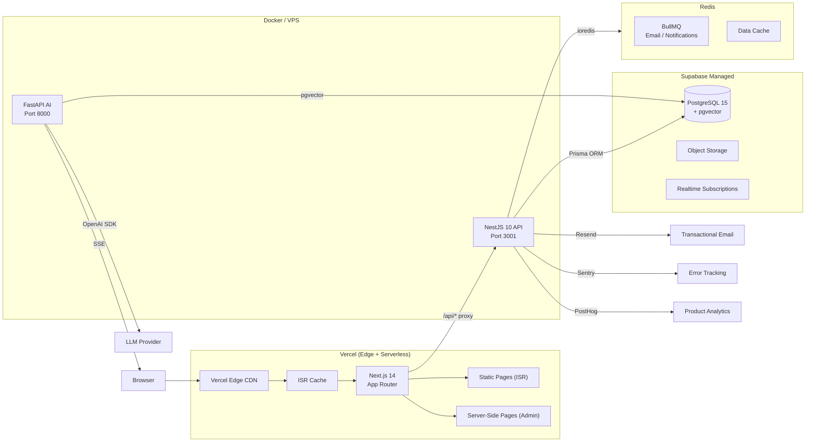

# Architecture Overview — Portfolio Platform

> **Document:** `00-overview/ARCHITECTURE-OVERVIEW.md` | **Version:** 1.0 | **Last Updated:** July 2026
> **Status:** ✅ Active | **Audience:** Engineers, Architects, Technical Evaluators
> **Related:** [Executive Summary](./EXECUTIVE-SUMMARY.md) | [System Architecture](../architecture/SystemArchitecture.md)

---

## System Topology

---

## Applications & Packages

| Layer | App / Package | Technology | Responsibility |
|-------|---------------|------------|----------------|
| **Frontend** | `apps/web` | Next.js 14 App Router, Three.js, GSAP, TanStack Query | Public portfolio (ISR) + admin dashboard (SSR). 3D scenes, AI chat, WebContainer sandbox. |
| **API** | `apps/api` | NestJS 10, Prisma, Passport.js, BullMQ, Pino | REST API — business logic in `modules/`, public read-only in `portfolio/`, authenticated CRUD in `admin/`. |
| **AI** | `apps/ai` | FastAPI, LangChain, pgvector, SSE | Multi-LLM RAG pipeline, embedding search, streaming chat. (Currently a placeholder stub.) |
| **Shared Types** | `packages/shared` | TypeScript, Zod | Source-of-truth data contracts shared by web and API. |
| **UI Components** | `packages/ui` | React, shadcn/ui, Tailwind CSS | Shared component library (Button, Card, Input, Modal, DataTable, etc.). |
| **Config** | `packages/config` | ESLint, TypeScript | Shared linting rules and base TS config across workspaces. |

---

## Key Architectural Decisions

| Decision | Choice | Rationale |
|----------|--------|-----------|
| **Monorepo** | Turborepo v2 + npm workspaces | Shared types/components/configs; parallel task execution; remote caching. |
| **Rendering** | ISR for public pages, SSR for admin | Portfolio content changes infrequently (60s revalidation); admin needs fresh data per request. |
| **API Pattern** | 3-layer NestJS (module → portfolio controller → admin controller) | Single business logic layer, two delivery surfaces. See [AGENTS.md](../../AGENTS.md) for details. |
| **Auth** | JWT + Passport.js OAuth (Google/GitHub) | Role-based access (admin/editor/viewer); OAuth handled by NestJS API, not Supabase. |
| **Database** | Supabase PostgreSQL + pgvector | Managed Postgres with vector embeddings for AI RAG; bundled auth, storage, and realtime subscriptions. |
| **Cache/Queue** | Redis via ioredis + BullMQ | Reliable email queue, session store, and data cache in a single service. |
| **API Envelope** | `{ data, meta? }` | Consistent response structure across all endpoints (page, count, total). |

---

## Data Flow: Page Request Lifecycle

1. **User navigates** to `https://portfolio.com` → DNS resolves to Vercel edge.
2. **Vercel CDN** serves cached ISR page if available and TTL (60s) not expired.
3. **Cache miss** → Next.js server renders the page, fetching data from the NestJS API (`/api/portfolio/sections`, `/api/portfolio/projects`, etc.).
4. **NestJS** queries PostgreSQL via Prisma, applies caching layer (Redis or in-memory), and returns `{ data, meta }`.
5. **Next.js** renders the React tree, sends the fully rendered HTML to the client.
6. **Client hydrates** → TanStack Query triggers background refetches for interactive data (leads, analytics for admin users).
7. **Admin mutations** (create/edit/delete) → POST/PUT/DELETE to `/api/admin/*` → JWT-verified → NestJS service → database write → audit log entry.

---

## Security Layers

| Layer | Mechanism |
|-------|-----------|
| **Edge** | Vercel WAF, DDoS protection, rate limiting (Vercel Firewall) |
| **API Gateway** | Helmet, CORS whitelist, global ThrottlerGuard, global ValidationPipe (whitelist + forbidNonWhitelisted) |
| **Application** | JwtAuthGuard, RolesGuard (@Roles decorator), @Audit decorator on all mutations |
| **Database** | Prepared statements (Prisma), Supabase RLS policies, no raw SQL |
| **External** | Secrets in environment variables (never committed), API keys revocable, spending limits on LLM provider keys |

---

## Deployment Summary

| Component | Platform | Method | URL Pattern |
|-----------|----------|--------|-------------|
| Frontend | Vercel | Git push → auto-deploy from `main` | `https://portfolio.vercel.app` |
| API | Docker → GitHub Container Registry | Multi-stage `Dockerfile` → `ghcr.io/portfolio/api` | Port 3001 |
| AI | Docker → GitHub Container Registry | Multi-stage `Dockerfile` → `ghcr.io/portfolio/ai` | Port 8000 |
| Database | Supabase (managed) | SaaS — no self-hosting | Supabase project URL |
| Cache/Queue | Redis (Upstash or Docker) | Managed or containerized | Configurable via `REDIS_URL` |
| CI/CD | GitHub Actions | PR checks + auto-deploy on merge to `main` | `.github/workflows/pr.yml` |

---

> **For detailed architecture documentation**, see:
> - [System Architecture](../architecture/SystemArchitecture.md)
> - [Admin Architecture](../design/AdminArchitecture.md)
> - [API Design](../api/APIDesign.md)
> - [Database Schema](../database/DatabaseSchema.md)
> - [Security Architecture](../security/SecurityArchitecture.md)

## Cross-References
- [../MASTER-INDEX.md](../MASTER-INDEX.md) — Documentation master index
- [../26-reference/CROSS-REFERENCE-INDEX.md](../26-reference/CROSS-REFERENCE-INDEX.md) — Cross-reference system