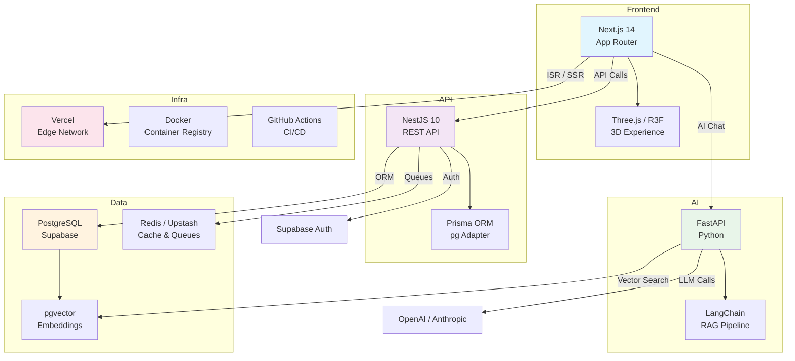

# Executive Summary — Portfolio Platform

> **Document:** `00-overview/EXECUTIVE-SUMMARY.md` | **Version:** 1.0 | **Last Updated:** July 2026
> **Owner:** CTO | **Status:** ✅ Active | **Review Cadence:** Quarterly

---

## 1. Project Overview

**Project Name:** My Portfolio
**Tagline:** *Enterprise-grade personal portfolio — proving that a portfolio can be both a technical demonstration and a genuinely useful tool for its visitors.*

My Portfolio is a full-stack monorepo platform that showcases software engineering excellence through immersive, interactive, and performant web experiences. Built on a near-zero-cost infrastructure model (~$10/year for domain only), it demonstrates enterprise-grade architecture using free and open-source technologies. The platform serves four distinct audiences: recruiters and hiring managers evaluating skills, potential clients scoping collaboration, developer peers inspecting architecture, and the portfolio owner managing content and leads through an admin dashboard.

The project is the portfolio itself — every architectural decision, every animation, every interaction is intentionally designed to demonstrate the caliber of engineer behind it. It is not a static page but a living CMS with AI capabilities, 3D visualizations, and a WebContainer-powered sandbox IDE.

---

## 2. Architecture Overview

The platform follows a **three-tier microservices architecture** within a **Turborepo v2 monorepo**:

| Tier | App | Technology | Purpose |
|------|-----|------------|---------|
| **Frontend** | `apps/web` | Next.js 14 (App Router) | Public portfolio pages (ISR) + admin dashboard (SSR). Heavy 3D/motion stack: Three.js, react-three-fiber, GSAP, Theatre.js, Lenis. Includes WebContainer sandbox IDE at `/admin/sandbox`. |
| **API** | `apps/api` | NestJS 10 | REST API with three-layer module pattern: business logic in `modules/`, public read-only controllers in `portfolio/`, authenticated CRUD controllers in `admin/`. Prisma ORM with pg driver adapter. |
| **AI** | `apps/ai` | FastAPI (Python) | Multi-LLM service with RAG pipeline via LangChain, pgvector embeddings, SSE streaming. Currently a placeholder stub. |

**Shared Packages:**

| Package | Purpose |
|---------|---------|
| `packages/shared` (`@portfolio/shared`) | TypeScript types + Zod schemas — the source of truth for data contracts |
| `packages/ui` (`@portfolio/ui`) | Shared React component library (Button, Card, Input, `cn` utility) |
| `packages/config` | Shared ESLint preset + base TypeScript config |

**Data Flow:** Browser → Vercel CDN → ISR cache → Next.js (public pages), or Browser → Vercel → NestJS → Supabase PostgreSQL (admin API). AI requests route Browser → FastAPI → OpenAI/pgvector with SSE streaming. Supabase provides PostgreSQL 15, Auth, Storage, and Realtime — all managed behind a single endpoint.

---

## 3. Business Goals

| Goal | Description | Success Metric |
|------|-------------|----------------|
| **Lead Generation** | Capture visitor inquiries through contact form, AI chat, and referral tracking. Auto-reply via Resend transactional email. | >10 qualified leads/month; <2s form submission |
| **Brand Authority** | Demonstrate senior full-stack engineering capability through architecture quality, performance, and innovation (AI, 3D, sandbox IDE). | Lighthouse scores >95; sub-100ms global page loads |
| **Technical Showcase** | Serve as an open-source reference for modern full-stack architecture (Next.js + NestJS + FastAPI monorepo with enterprise tooling). | GitHub stars; community contributions; architecture inquiries |
| **Career Advancement** | Provide recruiters and hiring managers with an instantly scannable, technically impressive evaluation tool. | Interview-to-application conversion rate |

---

## 4. Key Technical Decisions

| Decision | Rationale | Trade-off |
|----------|-----------|-----------|
| **Turborepo v2 monorepo** | Shared types, components, and configs across three apps. Remote caching for fast CI. | Complex tooling, larger repo surface |
| **ISR over SSR** | Portfolio content changes infrequently. Near-static CDN speed with periodic revalidation. | 60s delay before content updates appear |
| **Supabase PostgreSQL** | Bundles managed auth, storage, realtime, and pgvector. Free tier viable for portfolio workload. | Vendor lock-in (mitigated by pg compatibility) |
| **Redis via ioredis** | BullMQ queues (email, notifications), session store, and data cache in one service. | Additional service to manage |
| **BullMQ for background jobs** | Reliable email queue with retries, delayed jobs, and job scheduling. | Requires Redis dependency |
| **FastAPI for AI tier** | Native Python ecosystem for ML/AI: LangChain, OpenAI SDK, pgvector. | Operational overhead of maintaining a second backend |
| **Prisma ORM** | Type-safe database access, auto-generated client, migrations, and driver adapters for Supabase/pg. | Custom output path complexity |
| **Vercel for frontend** | Edge network, ISR support, zero-config deploys, generous free tier. | Serverless cold starts for API routes |

---

## 5. Deployment Model

| Component | Platform | Method | URL |
|-----------|----------|--------|-----|
| Frontend (Next.js) | **Vercel** | Git push → auto-deploy from `main` | `https://portfolio.vercel.app` |
| API (NestJS) | **Docker** → GitHub Container Registry | Multi-stage Dockerfile → `ghcr.io` → any VPS/PaaS | Port 3001 |
| AI (FastAPI) | **Docker** → GitHub Container Registry | Multi-stage Dockerfile → `ghcr.io` → any VPS/PaaS | Port 8000 |
| Database | **Supabase Managed** | SaaS — no self-hosting | Supabase project URL |
| Cache/Queue | **Redis** (Upstash or Docker) | Managed or containerized | Configurable via `REDIS_URL` |
| CI/CD | **GitHub Actions** | PR checks (lint, typecheck, build) + auto-deploy on merge | `.github/workflows/pr.yml` |

**Infrastructure cost:** ~$0.83/month (domain) + free tiers for Vercel, Supabase, GitHub Actions, Sentry, PostHog, Redis (Upstash 10MB free).

---

## 6. Security Model

| Layer | Control | Implementation |
|-------|---------|----------------|
| **Authentication** | JWT + OAuth (Google/GitHub) | NestJS Passport.js strategies; 15-min access token TTL; 7-day refresh token (Redis-backed) |
| **Authorization** | Role-Based Access Control | Three roles: `admin` (full access), `editor` (content CRUD), `viewer` (read-only). `@Roles()` decorator on admin controllers. |
| **API Security** | Rate limiting, CORS, Helmet | `@nestjs/throttler` with per-route tiers; CORS from `CORS_ORIGIN` env; 11 Helmet headers |
| **Database** | Row-Level Security | All 37 Prisma models have RLS policies (Supabase) enforcing user-scoped access |
| **Input Validation** | DTOs + global pipe | `class-validator` decorators; `whitelist: true`, `forbidNonWhitelisted: true`, `transform: true` |
| **Secrets** | Environment isolation | Dev/staging/prod env files in `config/`; `.env` in `.gitignore`; CI secrets via GitHub encrypted secrets |
| **Audit** | Mutation logging | `@Audit({action, resource})` decorator logs all admin mutations with user, timestamp, IP |
| **Compliance** | OWASP Top 10:2025 | All categories addressed: XSS (Helmet + React), CSRF (double-submit cookie), SQLi (Prisma parameterized), IDOR (user-scoped queries) |

---

## 7. Current Status

| Area | Status | Details |
|------|--------|---------|
| **Monorepo Scaffolding** | ✅ Complete | Turborepo, npm workspaces, all `apps/` and `packages/` initialized |
| **Infrastructure** | ✅ Complete | Docker Compose, multi-stage Dockerfiles, CI/CD pipeline, env templates |
| **Documentation** | ✅ Complete | 280+ enterprise-grade documents across architecture, security, operations, product, design |
| **Shared Packages** | ✅ Complete | `packages/shared` (types + Zod), `packages/ui` (components), `packages/config` (ESLint + TS) |
| **Design System** | 🔄 In Progress | Design tokens defined, base components done. Visual refinement ongoing. |
| **Application Code** | 📋 Planned | All apps have scaffolded files with prose descriptions — actual implementation not started |
| **NestJS Modules** | 📋 Planned | Auth, Sections, Projects, Skills, Leads, Analytics modules scaffolded but placeholder |
| **FastAPI AI Service** | 📋 Planned | `app/main.py` is an empty stub. AI/agent docs are aspirational design specs. |
| **Admin Dashboard** | ❌ Not Started | No admin pages implemented yet |
| **Testing** | 📋 Planned | Jest/Vitest configured. CI has Postgres service container. Zero tests written. |
| **WebContainer Sandbox** | ❌ Not Started | Route defined, no implementation |
| **3D Components** | ❌ Not Started | Three.js/r3f dependencies listed, no scenes created |

---

## 8. Metrics & KPIs

| Category | Metric | Target | Measurement |
|----------|--------|--------|-------------|
| **Performance** | Public page load (CDN hit) | < 50ms | Vercel Analytics / Datadog |
| **Performance** | API GET response (p95) | < 100ms | Sentry Tracing |
| **Performance** | AI Chat TTFB | < 500ms | Sentry Tracing |
| **Performance** | Lighthouse score | > 95 | Lighthouse CI |
| **Availability** | Public page uptime | 99.9% | Vercel status + external monitoring |
| **Availability** | API uptime | 99.5% | Sentry uptime monitoring |
| **Security** | OWASP Top 10:2025 compliance | 100% | Annual penetration test + automated scanning |
| **Quality** | Test coverage | > 80% | Jest/Vitest coverage reports |
| **Quality** | Documentation maturity | 95/100 | Internal audit (currently 62/100) |
| **Cost** | Monthly infrastructure | ~$0.83 | Provider billing dashboards |
| **Traffic** | Monthly visitors | 10K (design target) | PostHog analytics |
| **Traffic** | Monthly page views | 100K (design target) | PostHog analytics |
| **Development** | Deployment frequency | Multiple/day | CI/CD pipeline |

---

## 9. Documentation Maturity

**Current Score: 62/100** | **Target: 95/100**

| Dimension | Current | Target | Gap |
|-----------|---------|--------|-----|
| Architecture docs | 85 | 95 | Missing executive overview layer; ADR cross-referencing |
| Product docs | 75 | 95 | PRD complete; user stories need expansion |
| Security docs | 70 | 95 | New MFA, vulnerability, supply chain policies added; penetration testing pending |
| Operations docs | 65 | 95 | Runbooks written; on-call rotation documented; incident response defined |
| Testing docs | 40 | 95 | Strategy defined; zero test coverage; CI quality gates pending |
| API docs | 80 | 95 | OpenAPI spec exists; endpoint docs need regular sync |
| Developer onboarding | 55 | 90 | Troubleshooting guides exist; setup automation pending |
| Quality standards | 45 | 95 | Coding/git standards defined; enforcement automations pending |

**Priority actions to close the gap:**
1. Implement test suite (target: 80% coverage) — moves testing from 40 to 80+
2. Create executive overview layer (this document) — architecture from 85 to 90
3. Establish automated documentation validation in CI — all dimensions gain 5-10 points
4. Complete penetration testing — security from 70 to 90
5. Implement quality gate automation — quality from 45 to 80

---

## 10. Stakeholder Matrix

| Stakeholder | Interest | Influence | Engagement |
|-------------|----------|-----------|------------|
| Portfolio Owner (CTO) | Strategic direction, code quality | High | Daily — active development |
| Recruiters / Hiring Managers | Fast evaluation, clear signal | Medium | Passive — site visitors |
| Open Source Contributors | Architecture reference | Low | Asynchronous — PRs |
| Developer Community | Innovation showcase | Low | Public — blog, social |

---

## 11. Risk Register

| Risk | Likelihood | Impact | Mitigation |
|------|-----------|--------|------------|
| Free tier limits exceeded (Supabase, Vercel) | Low | Medium | Cost monitoring alerts; clear scaling thresholds |
| AI API costs (OpenAI) | Medium | Low | Rate limiting; response caching; fallback model |
| Single point of failure (owner unavailable) | Low | High | Documentation; CI/CD automation; Docker portability |
| Dependency drift (monorepo complexity) | Medium | Medium | Renovate/Dependabot; lockfile CI checks |
| Browser compatibility (3D/WebContainer) | Low | Medium | Progressive enhancement; graceful degradation |

---

## 12. Change Log

| Date | Version | Author | Changes |
|------|---------|--------|---------|
| July 2026 | 1.0 | CTO | Initial executive summary — created for enterprise documentation restructure |

## Cross-References
- [../MASTER-INDEX.md](../MASTER-INDEX.md) — Documentation master index
- [../26-reference/CROSS-REFERENCE-INDEX.md](../26-reference/CROSS-REFERENCE-INDEX.md) — Cross-reference system