# Features Document — Enterprise Feature Inventory

> **Document:** `02-FEATURES.md` | **Version:** 3.0 | **Last Updated:** June 2026  
> **Status:** ✅ Active | **Owner:** Product Owner  
> **Total Features:** 52 | **P0:** 18 | **P1:** 14 | **P2:** 12 | **P3:** 8

---

## Executive Summary

This document inventories **52 features** across **7 epics** with a rigorous P0-P3 priority classification (18 P0 Critical, 14 P1 High, 12 P2 Medium, 8 P3 Future). Each feature includes purpose, business value, user value, technical requirements, analytics tracking, security requirements, and acceptance criteria. Features are governed by a 44-flag feature flag registry and tracked against 318 user stories via a full traceability matrix. Core portfolio features are P0; AI/agent features are P1-P2 as differentiators.

## Cross-References

| Reference                                    | Description                                                    |
| -------------------------------------------- | -------------------------------------------------------------- |
| `docs/01-product/ProductRequirements.md`     | Product Requirements — features trace to PRD requirements      |
| `docs/01-product/03-USER-STORIES.md`         | User Stories — features are decomposed into 318 stories        |
| `docs/01-product/UserFlows.md`               | User Journeys — features validate persona-based flows          |
| `docs/01-product/37-IMPLEMENTATION_PLAN.md`  | Implementation Plan — features sequenced in 7 phases           |
| `docs/35-quality/TestingArchitecture.md`     | Testing Strategy — features inform test coverage               |
| `docs/21-operations/60-FEATURE-FLAGS.md`     | Feature Flags — 44 flags governing feature rollout             |
| `docs/05-architecture/SystemArchitecture.md` | System Architecture — features map to architectural components |

---

## Table of Contents

1. [Feature Classification System](#1-feature-classification-system)
2. [Public Portfolio](#2-public-portfolio)
3. [Projects & Case Studies](#3-projects--case-studies)
4. [Blog Engine](#4-blog-engine)
5. [AI Assistant](#5-ai-assistant)
6. [Admin Dashboard](#6-admin-dashboard)
7. [Content Management System (CMS)](#7-content-management-system-cms)
8. [Lead Management](#8-lead-management)
9. [Analytics & Insights](#9-analytics--insights)
10. [Monitoring & Observability](#10-monitoring--observability)
11. [Authentication & Authorization](#11-authentication--authorization)
12. [Future Features](#12-future-features)
13. [Feature Dependency Graph](#13-feature-dependency-graph)
14. [Feature Flag Registry](#14-feature-flag-registry)
15. [Feature Audit Log](#15-feature-audit-log)

---

## 1. Feature Classification System

### Priority Definitions

| Priority | Label       | Definition                      | Launch Window     | Risk if Deferred          |
| -------- | ----------- | ------------------------------- | ----------------- | ------------------------- |
| **P0**   | 🔴 Critical | Must have for MVP launch        | Launch            | Portfolio non-functional  |
| **P1**   | 🟡 High     | Important, launch + 1 month     | Launch + 30 days  | Reduced value proposition |
| **P2**   | 🟢 Medium   | Nice to have, launch + 2 months | Launch + 60 days  | Reduced engagement        |
| **P3**   | 🔵 Low      | Future enhancement              | Launch + 90+ days | Roadmap item              |

### Feature Health Status

| Status             | Definition                          | Action Required |
| ------------------ | ----------------------------------- | --------------- |
| ✅ **Production**  | Fully implemented, tested, deployed | Monitor         |
| 🔄 **In Progress** | Under active development            | Track progress  |
| 📋 **Planned**     | Spec'd but not started              | Schedule        |
| 🔮 **Future**      | Roadmap item, not yet spec'd        | Prioritize      |
| ❌ **Deprecated**  | Removed or replaced                 | Archive         |

### Feature Specification Template

Each feature in this document follows this structure:

```
## Feature Name

| Field | Value |
|-------|-------|
| **Feature ID** | F-XXX |
| **Status** | ✅ / 🔄 / 📋 / 🔮 / ❌ |
| **Priority** | P0 / P1 / P2 / P3 |
| **Epic** | Epic Name |
| **Phase** | Phase Number |
| **Story Points** | N |
| **Dependencies** | F-XXX, F-XXX |
| **Feature Flag** | `flag-name` |

### Purpose
One-paragraph description of why this feature exists.

### Business Value
Quantified business impact of this feature.

### User Value
What the user gains from this feature.

### Dependencies
- **Upstream:** Features this depends on
- **Downstream:** Features that depend on this
- **External:** Third-party services required

### Technical Requirements
- **Files:** Key files that need creation/modification
- **Components:** UI/API components involved
- **Data Model:** Database tables/fields affected
- **API Endpoints:** Endpoints required
- **Config:** Environment variables or configuration

### Analytics Events
| Event | Trigger | Properties | Importance |
|-------|---------|------------|------------|

### Security Requirements
| Requirement | Implementation | Severity |
|-------------|----------------|----------|

### Acceptance Criteria
- [ ] Criterion 1
- [ ] Criterion 2
```

---

## 2. Public Portfolio

### F-001: Hero Section

| Field            | Value                                                           |
| ---------------- | --------------------------------------------------------------- |
| **Feature ID**   | F-001                                                           |
| **Status**       | 📋 Planned                                                      |
| **Priority**     | P0                                                              |
| **Epic**         | E1: Visitor Experience                                          |
| **Phase**        | 03                                                              |
| **Story Points** | 5                                                               |
| **Dependencies** | F-003 (Navigation), F-022 (Theme System), F-023 (Design System) |
| **Feature Flag** | `hero-section`                                                  |

#### Purpose

Create a compelling first impression that communicates who you are, what you do, and compels visitors to explore further. The hero is the most-viewed element on the portfolio and sets the tone for the entire experience.

#### Business Value

- First impressions determine bounce rate — a compelling hero reduces bounce rate by up to 40%
- Primary real estate for brand positioning and differentiation
- Highest-visibility placement for CTAs (View Work, Contact Me)
- Key factor in LCP (Largest Contentful Paint) performance metric

#### User Value

- Immediately understand the portfolio owner's identity and role
- Clear call-to-action for next steps
- Visually engaging experience that builds interest
- Quick access to social links and GitHub profile

#### Dependencies

- **Upstream:** F-022 (Theme System), F-023 (Button, Card, Layout components), F-003 (Navigation)
- **Downstream:** F-004 (About Section), F-002 (Skills Section)
- **External:** None

#### Technical Requirements

- **Files:** `apps/web/src/components/sections/Hero.tsx`, `apps/web/src/app/page.tsx`
- **Components:** `HeroSection`, `ThreeScene` (3D background), `AnimatedText`, `CTAButton`, `SocialLinks`
- **Data Model:** `sections` table with slug=`hero`
- **API Endpoints:** `GET /api/sections/hero`
- **Config:** `NEXT_PUBLIC_SITE_URL`, site name in env

#### Analytics Events

| Event               | Trigger                 | Properties             | Importance      |
| ------------------- | ----------------------- | ---------------------- | --------------- |
| `hero_view`         | Section enters viewport | duration_viewed_ms     | ⭐ Critical     |
| `cta_click`         | CTA button click        | cta_text, cta_location | ⭐ Critical     |
| `social_link_click` | Social icon click       | platform               | 📊 Important    |
| `hero_interaction`  | 3D scene interaction    | interaction_type       | 🔮 Nice to have |

#### Security Requirements

| Requirement                  | Implementation    | Severity |
| ---------------------------- | ----------------- | -------- |
| No user input in hero        | Read-only section | Low      |
| CORS for any external embeds | Vercel config     | Low      |

#### Acceptance Criteria

- [ ] Hero loads within 2 seconds (LCP < 2.5s)
- [ ] Name and title prominently displayed above the fold
- [ ] At least 2 CTA buttons visible without scrolling
- [ ] Background animation plays smoothly at 60fps
- [ ] `prefers-reduced-motion` respected — static fallback
- [ ] Responsive at all breakpoints (320px to 2560px)
- [ ] All text maintains WCAG AA contrast ratios
- [ ] Social links open in new tabs with `rel="noopener noreferrer"`
- [ ] Lighthouse Performance score impact < 5 points
- [ ] Keyboard navigable (Tab through CTAs, social links)

---

### F-002: Skills Section

| Field            | Value                                     |
| ---------------- | ----------------------------------------- |
| **Feature ID**   | F-002                                     |
| **Status**       | 📋 Planned                                |
| **Priority**     | P1                                        |
| **Epic**         | E1: Visitor Experience                    |
| **Phase**        | 04                                        |
| **Story Points** | 5                                         |
| **Dependencies** | F-023 (Design System), F-003 (Navigation) |
| **Feature Flag** | `skills-section`                          |

#### Purpose

Visually communicate technical proficiency across skill categories, enabling recruiters and clients to quickly assess expertise alignment with their needs.

#### Business Value

- Skills assessment is the #1 action recruiters take on portfolios
- Categorized skills improve SEO for specific technology keywords
- Visual proficiency indicators increase time-on-section by 30%+

#### User Value

- Quickly identify relevant skills and proficiency levels
- Filter skills by category for focused evaluation
- Understand depth of expertise beyond simple keyword lists

#### Dependencies

- **Upstream:** F-023 (Design System), F-003 (Navigation)
- **Downstream:** None
- **External:** None

#### Technical Requirements

- **Files:** `apps/web/src/components/sections/Skills.tsx`, `apps/web/src/app/page.tsx`
- **Components:** `SkillsSection`, `SkillBar`, `SkillCircle`, `SkillCategory`
- **Data Model:** `skills` table (id, name, category, proficiency, icon, display_order)
- **API Endpoints:** `GET /api/skills?category={category}`

#### Analytics Events

| Event                | Trigger                 | Properties           | Importance   |
| -------------------- | ----------------------- | -------------------- | ------------ |
| `skill_section_view` | Section enters viewport | —                    | ⭐ Critical  |
| `skill_hover`        | Skill hover/click       | skill_name, category | 📊 Important |
| `skill_filter`       | Category filter click   | filter_name          | 📊 Important |

#### Security Requirements

| Requirement           | Implementation    | Severity |
| --------------------- | ----------------- | -------- |
| Read-only public data | GET endpoint only | Low      |

#### Acceptance Criteria

- [ ] Skills grouped by category (Frontend, Backend, DevOps, etc.)
- [ ] Visual proficiency indicator (bar or circle) for each skill
- [ ] Hover shows proficiency percentage and optional description
- [ ] Filterable by category with active filter indicator
- [ ] Responsive grid layout (2 cols mobile, 3-4 cols desktop)
- [ ] Animation on scroll into view
- [ ] Data fetched from API with ISR (60s revalidation)
- [ ] Loading skeleton state
- [ ] Error state with retry
- [ ] Empty state when no skills configured

---

### F-003: Navigation System

| Field            | Value                                       |
| ---------------- | ------------------------------------------- |
| **Feature ID**   | F-003                                       |
| **Status**       | 📋 Planned                                  |
| **Priority**     | P0                                          |
| **Epic**         | E1: Visitor Experience                      |
| **Phase**        | 02                                          |
| **Story Points** | 5                                           |
| **Dependencies** | F-022 (Theme System), F-023 (Design System) |
| **Feature Flag** | `sticky-nav`                                |

#### Purpose

Provide intuitive, accessible navigation that allows visitors to jump to any section and understand their current location within the portfolio.

#### Business Value

- Navigation is the primary way users explore content — poor navigation = high bounce rate
- Sticky navigation keeps CTAs always accessible
- Smooth scroll creates polished, professional feel

#### User Value

- Quickly jump to any section from anywhere
- Clear indication of current location
- Mobile hamburger menu works reliably on all devices
- Keyboard accessible for power users

#### Dependencies

- **Upstream:** F-022, F-023
- **Downstream:** F-001, F-002, F-004, F-005, F-006, F-007
- **External:** None

#### Technical Requirements

- **Files:** `apps/web/src/components/Navigation.tsx`, `apps/web/src/components/MobileMenu.tsx`
- **Components:** `Navigation`, `MobileMenu`, `NavLink`, `ThemeToggle`, `MenuToggle`
- **Data Model:** Section order derived from `sections` table `display_order`
- **API Endpoints:** `GET /api/sections` (for nav items)

#### Analytics Events

| Event               | Trigger               | Properties                | Importance   |
| ------------------- | --------------------- | ------------------------- | ------------ |
| `nav_click`         | Navigation link click | target_section, source    | ⭐ Critical  |
| `mobile_menu_open`  | Hamburger click       | —                         | 📊 Important |
| `mobile_menu_close` | Close menu            | method (backdrop/close/x) | 📊 Important |
| `theme_toggle`      | Theme switch          | new_theme                 | 📊 Important |

#### Security Requirements

| Requirement      | Implementation   | Severity |
| ---------------- | ---------------- | -------- |
| No auth required | Public component | Low      |

#### Acceptance Criteria

- [ ] Sticky header on scroll with backdrop blur
- [ ] Smooth scroll to sections with offset for fixed header
- [ ] Active section highlighted in nav based on scroll position
- [ ] Mobile hamburger menu with slide-in drawer
- [ ] Keyboard accessible (Tab, Enter, Escape)
- [ ] Screen reader announces navigation items and current state
- [ ] Theme toggle with system preference detection
- [ ] No layout shift when header becomes sticky
- [ ] Touch targets ≥ 44×44px on mobile
- [ ] Reduced motion respected for menu animations

---

### F-004: About Section

| Field            | Value                  |
| ---------------- | ---------------------- |
| **Feature ID**   | F-004                  |
| **Status**       | 📋 Planned             |
| **Priority**     | P0                     |
| **Epic**         | E1: Visitor Experience |
| **Phase**        | 04                     |
| **Story Points** | 5                      |
| **Dependencies** | F-003, F-023           |
| **Feature Flag** | `about-section`        |

#### Purpose

Humanize the portfolio owner through personal introduction, professional summary, and key statistics that build trust and connection with visitors.

#### Business Value

- About section is the 2nd most viewed section after hero
- Personal connection increases conversion likelihood by 35%
- Stats (years, projects, clients) provide social proof

#### User Value

- Learn who the person is beyond technical skills
- See professional journey and personality
- Quick stats for credibility assessment

#### Dependencies

- **Upstream:** F-003, F-023
- **Downstream:** None
- **External:** None

#### Technical Requirements

- **Files:** `apps/web/src/components/sections/About.tsx`
- **Components:** `AboutSection`, `StatCounter`, `ProfileImage`
- **Data Model:** `sections` table with slug=`about`, JSON content

#### Analytics Events

| Event            | Trigger                     | Properties       | Importance      |
| ---------------- | --------------------------- | ---------------- | --------------- |
| `about_view`     | Section enters viewport     | —                | ⭐ Critical     |
| `stat_animation` | Counter animation completes | stat_name, value | 🔮 Nice to have |

#### Security Requirements

| Requirement           | Implementation             | Severity |
| --------------------- | -------------------------- | -------- |
| Read-only public data | GET endpoint only          | Low      |
| Image served via CDN  | Supabase storage or Vercel | Low      |

#### Acceptance Criteria

- [ ] Split layout (photo + text) on desktop, stacked on mobile
- [ ] Profile image optimized (WebP, lazy loaded)
- [ ] Bio supports rich text (bold, links, lists)
- [ ] Statistics (years exp, projects, clients) with animated counters
- [ ] Download resume button
- [ ] Responsive at all breakpoints
- [ ] Loading skeleton
- [ ] Error state with retry

---

### F-005: Experience Timeline

| Field            | Value                  |
| ---------------- | ---------------------- |
| **Feature ID**   | F-005                  |
| **Status**       | 📋 Planned             |
| **Priority**     | P1                     |
| **Epic**         | E1: Visitor Experience |
| **Phase**        | 04                     |
| **Story Points** | 5                      |
| **Dependencies** | F-003, F-023           |
| **Feature Flag** | `experience-section`   |

#### Purpose

Visually communicate career progression through an interactive timeline, demonstrating growth, responsibility, and impact across roles.

#### Business Value

- Career trajectory is a key decision factor for recruiters
- Timeline format improves scannability vs. plain list
- Demonstrates stability and growth pattern

#### User Value

- Understand career progression at a glance
- See time gaps and overlaps clearly
- Click for details on each role

#### Dependencies

- **Upstream:** F-003, F-023
- **Downstream:** None
- **External:** None

#### Technical Requirements

- **Files:** `apps/web/src/components/sections/Experience.tsx`, `packages/shared/src/index.ts` (Experience type)
- **Components:** `ExperienceSection`, `TimelineItem`, `TimelineDot`
- **Data Model:** `experience` table (id, company, role, start_date, end_date, description, technologies, display_order)

#### Analytics Events

| Event              | Trigger                 | Properties    | Importance   |
| ------------------ | ----------------------- | ------------- | ------------ |
| `experience_view`  | Section enters viewport | —             | ⭐ Critical  |
| `experience_click` | Timeline item click     | company, role | 📊 Important |

#### Acceptance Criteria

- [ ] Vertical timeline with alternating left/right layout on desktop
- [ ] Each entry: date range, company logo, role, brief description
- [ ] Responsive: single column on mobile
- [ ] Animated entry on scroll (staggered reveal)
- [ ] Current role highlighted with accent color
- [ ] Technologies used listed as badges
- [ ] Expandable for more details
- [ ] Loading skeleton
- [ ] Empty state

---

### F-006: Testimonials Carousel

| Field            | Value                  |
| ---------------- | ---------------------- |
| **Feature ID**   | F-006                  |
| **Status**       | 📋 Planned             |
| **Priority**     | P1                     |
| **Epic**         | E1: Visitor Experience |
| **Phase**        | 06                     |
| **Story Points** | 5                      |
| **Dependencies** | F-003, F-023           |
| **Feature Flag** | `testimonials-section` |

#### Purpose

Build trust and credibility through authentic client and colleague testimonials, providing social proof of the portfolio owner's expertise and professionalism.

#### Business Value

- Social proof increases conversion by up to 34%
- Testimonials differentiate from competitors who lack them
- Quote-rich content improves SEO

#### User Value

- See real feedback from real people
- Assess reputation before reaching out
- Understand working style from others' perspectives

#### Dependencies

- **Upstream:** F-003, F-023
- **Downstream:** None
- **External:** None

#### Technical Requirements

- **Files:** `apps/web/src/components/sections/Testimonials.tsx`
- **Components:** `TestimonialsSection`, `TestimonialCard`, `Carousel`, `StarRating`
- **Data Model:** `testimonials` table (id, name, role, company, avatar, content, rating, display_order)

#### Analytics Events

| Event               | Trigger                  | Properties | Importance      |
| ------------------- | ------------------------ | ---------- | --------------- |
| `testimonial_view`  | Section enters viewport  | —          | ⭐ Critical     |
| `testimonial_next`  | Carousel next click      | —          | 📊 Important    |
| `testimonial_prev`  | Carousel prev click      | —          | 📊 Important    |
| `testimonial_pause` | Auto-play paused (hover) | —          | 🔮 Nice to have |

#### Security Requirements

| Requirement       | Implementation            | Severity |
| ----------------- | ------------------------- | -------- |
| Avatar validation | Restrict to approved URLs | Low      |

#### Acceptance Criteria

- [ ] Testimonials displayed as cards
- [ ] Each shows: name, role, company, avatar, content, star rating
- [ ] Carousel auto-plays, pauses on hover/focus
- [ ] Manual navigation (arrows + dots)
- [ ] Keyboard navigable (Arrow keys, Tab)
- [ ] Touch swipe on mobile
- [ ] Reduced motion respected (no auto-play)
- [ ] Loading skeleton
- [ ] Empty: "No testimonials yet" with CTA to submit

---

### F-007: Contact Form

| Field            | Value                                  |
| ---------------- | -------------------------------------- |
| **Feature ID**   | F-007                                  |
| **Status**       | 📋 Planned                             |
| **Priority**     | P0                                     |
| **Epic**         | E1: Visitor Experience                 |
| **Phase**        | 04                                     |
| **Story Points** | 5                                      |
| **Dependencies** | F-003, F-023, F-802 (Lead Storage API) |
| **Feature Flag** | `contact-form`                         |

#### Purpose

Provide a reliable, accessible contact form that captures visitor inquiries and stores them as leads for follow-up, with validation, spam protection, and user feedback.

#### Business Value

- Lead capture is the primary conversion mechanism
- Form completion rate directly impacts opportunity pipeline
- Auto-reply and notifications improve response time

#### User Value

- Easy way to reach out without leaving the portfolio
- Clear feedback on submission success/failure
- Confirmation that message was received (auto-reply email)

#### Dependencies

- **Upstream:** F-023 (Input component), F-800 (Lead Inbox — API storage layer)
- **Downstream:** F-801 (Lead Inbox), F-803 (Auto-Reply Email)
- **External:** Resend (email), Supabase (storage)

#### Technical Requirements

- **Files:** `apps/web/src/components/sections/Contact.tsx`, `apps/web/src/lib/api.ts`
- **Components:** `ContactSection`, `ContactForm`, `FormField`, `SuccessAnimation`
- **Data Model:** `leads` table
- **API Endpoints:** `POST /api/leads`, `POST /api/leads/auto-reply`
- **Config:** `RESEND_API_KEY`, `CONTACT_EMAIL`

#### Analytics Events

| Event                       | Trigger                 | Properties        | Importance   |
| --------------------------- | ----------------------- | ----------------- | ------------ |
| `contact_form_view`         | Section enters viewport | —                 | ⭐ Critical  |
| `contact_form_start`        | First field focus       | —                 | ⭐ Critical  |
| `contact_form_field_error`  | Validation error        | field, error_type | 📊 Important |
| `contact_form_submit`       | Form submission         | success (bool)    | ⭐ Critical  |
| `contact_form_submit_error` | Submission fails        | error_message     | 📊 Important |

#### Security Requirements

| Requirement                | Implementation                              | Severity |
| -------------------------- | ------------------------------------------- | -------- |
| Rate limiting              | 10 requests / 15 min per IP                 | Critical |
| Server-side validation     | Zod schema, sanitize all inputs             | Critical |
| Honeypot field             | Hidden field for bot detection              | High     |
| XSS prevention             | Output encoding, content-type JSON only     | Critical |
| Email injection prevention | Validate email format, no headers injection | Critical |
| CORS                       | Restrict to portfolio domain                | Medium   |

#### Acceptance Criteria

- [ ] Form fields: Name (required), Email (required, valid format), Message (required, min 10 chars), Subject (optional)
- [ ] Optional fields: Phone, Company
- [ ] Client-side validation with real-time error messages
- [ ] Server-side validation with Zod
- [ ] Submit shows loading spinner, disables button
- [ ] Success: Thank you message with confetti animation
- [ ] Error: Specific error message with retry option
- [ ] Honeypot field hidden from users, visible to bots
- [ ] Rate limit: 429 response with retry-after header
- [ ] Auto-reply email sent within 60 seconds
- [ ] Keyboard accessible (Tab through all fields)
- [ ] `aria-invalid` on error fields
- [ ] Screen reader announces success/error

---

### F-008: FAQ Section

| Field            | Value                  |
| ---------------- | ---------------------- |
| **Feature ID**   | F-008                  |
| **Status**       | 📋 Planned             |
| **Priority**     | P1                     |
| **Epic**         | E1: Visitor Experience |
| **Phase**        | 04                     |
| **Story Points** | 3                      |
| **Dependencies** | F-003, F-023           |
| **Feature Flag** | `faq-section`          |

#### Purpose

Answer common visitor questions proactively, reducing friction in the decision-making process and reducing repetitive inquiries.

#### Business Value

- Reduces email volume by answering common questions
- Improves visitor experience through self-service
- FAQ content improves SEO for long-tail queries

#### User Value

- Get answers without waiting for email response
- Understand process, availability, pricing
- Find information quickly via accordion interaction

#### Dependencies

- **Upstream:** F-003, F-023
- **Downstream:** None
- **External:** None

#### Technical Requirements

- **Files:** `apps/web/src/components/sections/FAQ.tsx`
- **Components:** `FAQSection`, `Accordion`, `AccordionItem`
- **Data Model:** `sections` table with slug=`faq`, JSON content (questions array)

#### Analytics Events

| Event                | Trigger                 | Properties | Importance      |
| -------------------- | ----------------------- | ---------- | --------------- |
| `faq_view`           | Section enters viewport | —          | ⭐ Critical     |
| `faq_question_open`  | Accordion item opens    | question   | 📊 Important    |
| `faq_question_close` | Accordion item closes   | question   | 🔮 Nice to have |

#### Security Requirements

| Requirement           | Implementation    | Severity |
| --------------------- | ----------------- | -------- |
| Read-only public data | GET endpoint only | Low      |

#### Acceptance Criteria

- [ ] Accordion-style expandable questions
- [ ] Only one item open at a time (accordion behavior)
- [ ] Smooth expand/collapse animation
- [ ] Keyboard accessible (Enter/Space to toggle)
- [ ] `aria-expanded` on toggle buttons
- [ ] `aria-controls` linking button to content panel
- [ ] Rich text support in answers (links, lists)
- [ ] Search/filter FAQ (future)
- [ ] Loading skeleton
- [ ] Empty state

---

### F-009: Services Section

| Field            | Value                  |
| ---------------- | ---------------------- |
| **Feature ID**   | F-009                  |
| **Status**       | 📋 Planned             |
| **Priority**     | P1                     |
| **Epic**         | E1: Visitor Experience |
| **Phase**        | 04                     |
| **Story Points** | 5                      |
| **Dependencies** | F-003, F-023           |
| **Feature Flag** | `services-section`     |

#### Purpose

Clearly communicate the services offered (freelance, consulting, contracting) with descriptions, pricing tiers, and CTAs, converting visitors into paying clients.

#### Business Value

- Direct revenue generation channel
- Sets expectations for scope and pricing
- Reduces discovery call time by pre-qualifying leads

#### User Value

- Understand what services are available
- See pricing and packages at a glance
- Make informed decision before reaching out

#### Dependencies

- **Upstream:** F-003, F-023
- **Downstream:** F-007 (Contact Form)
- **External:** None

#### Technical Requirements

- **Files:** `apps/web/src/components/sections/Services.tsx`
- **Components:** `ServicesSection`, `ServiceCard`, `PricingCard`
- **Data Model:** `sections` table with slug=`services`, JSON content

#### Analytics Events

| Event           | Trigger                 | Properties   | Importance   |
| --------------- | ----------------------- | ------------ | ------------ |
| `services_view` | Section enters viewport | —            | ⭐ Critical  |
| `service_click` | Service card click      | service_name | 📊 Important |
| `pricing_view`  | Pricing tier expanded   | tier_name    | 📊 Important |

#### Acceptance Criteria

- [ ] Service cards with icon, title, description, CTA
- [ ] Pricing tiers with feature lists
- [ ] "Book a call" CTA links to contact form or Calendly
- [ ] Responsive grid layout
- [ ] Loading skeleton
- [ ] Empty state

---

### F-010: Portfolio Statistics Section

| Field            | Value                  |
| ---------------- | ---------------------- |
| **Feature ID**   | F-010                  |
| **Status**       | 📋 Planned             |
| **Priority**     | P1                     |
| **Epic**         | E1: Visitor Experience |
| **Phase**        | 06                     |
| **Story Points** | 3                      |
| **Dependencies** | F-003, F-023           |
| **Feature Flag** | `stats-section`        |

#### Purpose

Display key metrics (years of experience, projects completed, clients served, etc.) with animated counters that provide immediate credibility and social proof.

#### Business Value

- Statistics are the most scannable form of social proof
- Animated counters increase engagement and recall
- Quantified achievements are more convincing than qualitative claims

#### User Value

- Immediately grasp the scale of experience and impact
- See proof points that validate skills and expertise

#### Dependencies

- **Upstream:** F-003, F-023
- **Downstream:** None
- **External:** None

#### Technical Requirements

- **Files:** `apps/web/src/components/sections/Stats.tsx`
- **Components:** `StatsSection`, `StatCard`, `AnimatedCounter`
- **Data Model:** `sections` table with slug=`stats`, JSON content

#### Analytics Events

| Event              | Trigger                    | Properties       | Importance      |
| ------------------ | -------------------------- | ---------------- | --------------- |
| `stats_view`       | Section enters viewport    | —                | ⭐ Critical     |
| `counter_complete` | Counter animation finishes | stat_name, value | 🔮 Nice to have |

#### Acceptance Criteria

- [ ] Grid of stat cards with icon, number, label
- [ ] Numbers animate from 0 to target on scroll
- [ ] Respects reduced motion (static display)
- [ ] Responsive (2 cols mobile, 4 cols desktop)
- [ ] Loading skeleton

---

### F-011: Client Logos Section

| Field            | Value                  |
| ---------------- | ---------------------- |
| **Feature ID**   | F-011                  |
| **Status**       | 📋 Planned             |
| **Priority**     | P1                     |
| **Epic**         | E1: Visitor Experience |
| **Phase**        | 06                     |
| **Story Points** | 3                      |
| **Dependencies** | F-003, F-023           |
| **Feature Flag** | `clients-section`      |

#### Purpose

Display logos of companies worked with, providing visual social proof and immediate brand recognition.

#### Business Value

- Brand logos are powerful trust signals
- Known clients validate expertise through association
- Visual break from text-heavy sections

#### User Value

- Immediately recognize companies the person has worked with
- Assess level of experience through brand names

#### Dependencies

- **Upstream:** F-003, F-023
- **Downstream:** None
- **External:** None

#### Technical Requirements

- **Files:** `apps/web/src/components/sections/Clients.tsx`
- **Components:** `ClientsSection`, `ClientLogo`, `LogoSlider`
- **Data Model:** `sections` table with slug=`clients`, JSON content

#### Analytics Events

| Event               | Trigger                 | Properties  | Importance   |
| ------------------- | ----------------------- | ----------- | ------------ |
| `clients_view`      | Section enters viewport | —           | ⭐ Critical  |
| `client_logo_click` | Logo click              | client_name | 📊 Important |

#### Acceptance Criteria

- [ ] Logos in grid or auto-scrolling slider
- [ ] Grayscale logos, color on hover
- [ ] Logo alt text for accessibility
- [ ] Responsive grid
- [ ] Loading skeleton

---

### F-012: Dark/Light Theme System

| Field            | Value                  |
| ---------------- | ---------------------- |
| **Feature ID**   | F-012                  |
| **Status**       | 📋 Planned             |
| **Priority**     | P1                     |
| **Epic**         | E1: Visitor Experience |
| **Phase**        | 02                     |
| **Story Points** | 3                      |
| **Dependencies** | F-023 (Design System)  |
| **Feature Flag** | `theme-toggle`         |

#### Purpose

Provide a seamless dark/light theme switching experience that respects system preferences, persists user choice, and transitions smoothly between themes.

#### Business Value

- Dark mode is an expected feature for developer portfolios
- Improves readability in low-light environments
- Demonstrates attention to user preference and detail

#### User Value

- Read comfortably in any lighting environment
- Theme persists across visits
- System preference respected by default

#### Dependencies

- **Upstream:** F-023
- **Downstream:** F-001, F-003, F-013
- **External:** None

#### Technical Requirements

- **Files:** `apps/web/src/components/ThemeToggle.tsx`, `apps/web/src/app/providers.tsx`, `apps/web/src/styles/globals.css`
- **Components:** `ThemeProvider`, `ThemeToggle`
- **Implementation:** CSS custom properties on `[data-theme]`, `prefers-color-scheme` media query for initial value, `localStorage` for persistence

#### Analytics Events

| Event                   | Trigger                | Properties      | Importance      |
| ----------------------- | ---------------------- | --------------- | --------------- |
| `theme_toggle`          | Theme switch           | new_theme       | 📊 Important    |
| `theme_system_detected` | System preference read | preferred_theme | 🔮 Nice to have |

#### Acceptance Criteria

- [ ] Toggle button in navigation
- [ ] Respects system preference on first visit (`prefers-color-scheme`)
- [ ] Smooth transition between themes (300ms)
- [ ] Preference persisted in localStorage
- [ ] No flash of wrong theme on page load (critical)
- [ ] All sections render correctly in both themes
- [ ] WCAG contrast ratios maintained in both themes
- [ ] Toggle icon changes (sun/moon)

---

### F-013: Section Scroll Animations

| Field            | Value                  |
| ---------------- | ---------------------- |
| **Feature ID**   | F-013                  |
| **Status**       | 📋 Planned             |
| **Priority**     | P1                     |
| **Epic**         | E1: Visitor Experience |
| **Phase**        | 02                     |
| **Story Points** | 5                      |
| **Dependencies** | F-003, F-022, F-023    |
| **Feature Flag** | `section-animations`   |

#### Purpose

Enhance visual experience with smooth, performant scroll-triggered animations that reveal sections with staggered, polished transitions.

#### Business Value

- Animations increase perceived quality and professionalism
- Staggered reveals guide attention and reduce cognitive load
- Differentiators from static template portfolios

#### User Value

- Enjoyable, polished browsing experience
- Content revealed in digestible chunks
- Visual feedback reinforces navigation

#### Dependencies

- **Upstream:** F-022, F-023
- **Downstream:** F-001, F-002, F-004, F-005, F-006, F-010
- **External:** Framer Motion

#### Technical Requirements

- **Files:** `apps/web/src/hooks/useInView.ts`, `apps/web/src/components/AnimatedSection.tsx`
- **Components:** `AnimatedSection`, `StaggerContainer`, `StaggerItem`
- **Dependencies:** `framer-motion` (already in package.json)

#### Analytics Events

| Event            | Trigger                  | Properties   | Importance      |
| ---------------- | ------------------------ | ------------ | --------------- |
| `animation_play` | Section animation starts | section_name | 🔮 Nice to have |

#### Security Requirements

| Requirement                  | Implementation               | Severity |
| ---------------------------- | ---------------------------- | -------- |
| No user-controlled animation | Server-rendered classes only | Low      |

#### Acceptance Criteria

- [ ] Sections fade in + slide up on scroll
- [ ] Staggered children (e.g., skill cards animate one by one)
- [ ] Intersection Observer with configurable threshold
- [ ] Respects `prefers-reduced-motion` — disable all animations
- [ ] Animations only play once (no repeat on re-scroll)
- [ ] Performance: 60fps, no layout thrashing
- [ ] No cumulative layout shift from animations
- [ ] Works on mobile and desktop

---

### F-014: Loading States & Skeletons

| Field            | Value                  |
| ---------------- | ---------------------- |
| **Feature ID**   | F-014                  |
| **Status**       | 📋 Planned             |
| **Priority**     | P0                     |
| **Epic**         | E1: Visitor Experience |
| **Phase**        | 02                     |
| **Story Points** | 3                      |
| **Dependencies** | F-023 (Design System)  |
| **Feature Flag** | —                      |

#### Purpose

Provide immediate visual feedback while content loads, preventing frustration and perceived slowness through skeleton screens, loading spinners, and progress indicators.

#### Business Value

- Skeleton screens reduce perceived wait time by 30%
- Loading states prevent user abandonment during data fetch
- Professional polish differentiates from raw-loading pages

#### User Value

- Understand content is loading rather than seeing blank page
- See content structure before data arrives (skeleton)
- Clear feedback on long operations

#### Dependencies

- **Upstream:** F-023
- **Downstream:** All data-fetching features
- **External:** None

#### Technical Requirements

- **Files:** `apps/web/src/components/ui/Skeleton.tsx`, `apps/web/src/app/loading.tsx`
- **Components:** `Skeleton`, `SkeletonCard`, `SkeletonText`, `SkeletonCircle`
- **Patterns:** React Suspense boundaries, `loading.tsx` per route segment

#### Acceptance Criteria

- [ ] All data-fetching sections have skeleton loading states
- [ ] Skeletons match the shape of actual content (no layout shift)
- [ ] Loading.tsx for every route segment
- [ ] Loading spinners for button actions (form submission)
- [ ] Skeleton shimmer animation (respects reduced motion)
- [ ] Error boundaries with retry for each section
- [ ] Timeout handling (show error after 10s)

---

### F-015: Error Boundaries & States

| Field            | Value                  |
| ---------------- | ---------------------- |
| **Feature ID**   | F-015                  |
| **Status**       | 📋 Planned             |
| **Priority**     | P0                     |
| **Epic**         | E1: Visitor Experience |
| **Phase**        | 02                     |
| **Story Points** | 3                      |
| **Dependencies** | F-023                  |
| **Feature Flag** | —                      |

#### Purpose

Gracefully handle runtime errors with user-friendly error UI, retry mechanisms, and Sentry error reporting, ensuring the portfolio never shows a white screen of death.

#### Business Value

- Error recovery reduces user abandonment during failures
- Sentry integration enables proactive bug fixing
- Professional error pages maintain brand trust

#### User Value

- See friendly error message instead of crash
- Retry failed sections without page reload
- Report issues easily

#### Dependencies

- **Upstream:** F-023
- **Downstream:** All features
- **External:** Sentry

#### Technical Requirements

- **Files:** `apps/web/src/app/error.tsx`, `apps/web/src/app/global-error.tsx`, `apps/web/src/components/ErrorFallback.tsx`
- **Components:** `ErrorFallback`, `SectionError`, `RetryButton`
- **Config:** Sentry DSN

#### Acceptance Criteria

- [ ] Global error boundary (`error.tsx`)
- [ ] Per-section error boundaries for independent failure
- [ ] Error UI shows friendly message + retry button
- [ ] Error logged to Sentry with context
- [ ] 404 page with navigation back to home
- [ ] 500 page with contact support option
- [ ] No full-page crash from single-section failure

---

## 3. Projects & Case Studies

### F-100: Projects Grid

| Field            | Value                            |
| ---------------- | -------------------------------- |
| **Feature ID**   | F-100                            |
| **Status**       | 📋 Planned                       |
| **Priority**     | P0                               |
| **Epic**         | E1: Visitor Experience           |
| **Phase**        | 05                               |
| **Story Points** | 8                                |
| **Dependencies** | F-003, F-023, F-013 (Animations) |
| **Feature Flag** | `projects-section`               |

#### Purpose

Display portfolio projects in a visually appealing, filterable grid that allows visitors to browse, preview, and dive into detailed case studies.

#### Business Value

- Projects are the primary portfolio content — directly demonstrates capability
- Filterable grid improves findability of relevant work
- Featured projects drive engagement to most impressive work

#### User Value

- Browse all projects at a glance with visual previews
- Filter by technology, category, or year
- Identify featured/important projects quickly
- Click to see full case study

#### Dependencies

- **Upstream:** F-003, F-023, F-013
- **Downstream:** F-101 (Project Detail), F-105 (Case Studies)
- **External:** None

#### Technical Requirements

- **Files:** `apps/web/src/components/sections/Projects.tsx`, `apps/web/src/app/projects/page.tsx`
- **Components:** `ProjectsSection`, `ProjectCard`, `ProjectFilter`, `ProjectGrid`
- **Data Model:** `projects` table (id, title, slug, description, image_url, technologies[], category, featured, github_url, live_url, display_order)
- **API Endpoints:** `GET /api/projects?featured=true&category={cat}&page=1&limit=12`

#### Analytics Events

| Event               | Trigger                  | Properties                   | Importance   |
| ------------------- | ------------------------ | ---------------------------- | ------------ |
| `projects_view`     | Section enters viewport  | —                            | ⭐ Critical  |
| `project_filter`    | Filter click             | filter_category, filter_tech | 📊 Important |
| `project_card_view` | Card visible in viewport | project_id, project_title    | 📊 Important |
| `project_click`     | Card click               | project_id, project_title    | ⭐ Critical  |

#### Security Requirements

| Requirement                       | Implementation                | Severity |
| --------------------------------- | ----------------------------- | -------- |
| Read-only public data             | GET endpoint only             | Low      |
| URL validation for external links | Validate github_url, live_url | Medium   |

#### Acceptance Criteria

- [ ] Responsive card grid (1 col mobile, 2 col tablet, 3 col desktop)
- [ ] Each card: thumbnail, title, brief description, tech badges
- [ ] Featured projects visually distinguished (badge, larger card)
- [ ] Filter by category (Web, Mobile, AI, DevOps, etc.)
- [ ] Filter by technology (React, Python, Docker, etc.)
- [ ] "Show more" pagination or infinite scroll
- [ ] Search by project title/description
- [ ] Images optimized (Next/Image, WebP, lazy loaded)
- [ ] Hover state with scale + shadow increase
- [ ] Click navigates to project detail page
- [ ] Loading skeleton grid
- [ ] Empty state: "No projects yet"
- [ ] Error state with retry

---

### F-101: Project Detail Page

| Field            | Value                        |
| ---------------- | ---------------------------- |
| **Feature ID**   | F-101                        |
| **Status**       | 📋 Planned                   |
| **Priority**     | P0                           |
| **Epic**         | E1: Visitor Experience       |
| **Phase**        | 05                           |
| **Story Points** | 8                            |
| **Dependencies** | F-100 (Projects Grid), F-023 |
| **Feature Flag** | `project-detail`             |

#### Purpose

Provide an immersive, detailed view of each project with image gallery, tech stack, live/demo links, and comprehensive case study content.

#### Business Value

- Detail pages are where hiring decisions are made
- Rich case studies differentiate from shallow portfolios
- Deep content improves SEO for project-specific keywords

#### User Value

- See full scope and impact of each project
- Browse project screenshots in gallery
- View tech stack, GitHub stars, live URL
- Understand challenges faced and solutions implemented

#### Dependencies

- **Upstream:** F-100
- **Downstream:** F-105 (Case Studies)
- **External:** None

#### Technical Requirements

- **Files:** `apps/web/src/app/projects/[slug]/page.tsx`
- **Components:** `ProjectHeader`, `ProjectGallery`, `ImageLightbox`, `TechBadgeList`, `ProjectNav`
- **Data Model:** Extends `projects` table (content, gallery_images[], challenges, solutions, outcomes)
- **API Endpoints:** `GET /api/projects/:slug`
- **Rendering:** ISR with 60s revalidation

#### Analytics Events

| Event                 | Trigger                   | Properties                | Importance   |
| --------------------- | ------------------------- | ------------------------- | ------------ |
| `project_detail_view` | Detail page loads         | project_id, project_title | ⭐ Critical  |
| `gallery_image_view`  | Gallery image clicked     | image_index               | 📊 Important |
| `live_demo_click`     | Live demo link click      | project_id                | ⭐ Critical  |
| `github_click`        | GitHub link click         | project_id                | ⭐ Critical  |
| `project_detail_time` | Time on page (5s/30s/60s) | duration                  | 📊 Important |

#### Security Requirements

| Requirement                       | Implementation                     | Severity |
| --------------------------------- | ---------------------------------- | -------- |
| URL validation for external links | Validate all URLs before rendering | Medium   |
| XSS prevention in rich content    | Sanitize HTML content              | High     |

#### Acceptance Criteria

- [ ] Dynamic route `/projects/[slug]`
- [ ] Hero image/gallery at top
- [ ] Project title, description, year
- [ ] Tech stack badges with icons
- [ ] Live demo + GitHub links (external, new tab, rel="noopener")
- [ ] Image gallery with lightbox
- [ ] Rich text content (features, challenges, outcomes)
- [ ] Related projects at bottom
- [ ] Back to projects navigation
- [ ] Prev/next project navigation
- [ ] JSON-LD structured data (SoftwareApplication schema)
- [ ] Open Graph + Twitter Card meta tags
- [ ] ISR with 60s revalidation
- [ ] Loading skeleton
- [ ] 404 for invalid slugs
- [ ] Error state with retry

---

### F-102: Featured Projects Carousel

| Field            | Value                  |
| ---------------- | ---------------------- |
| **Feature ID**   | F-102                  |
| **Status**       | 📋 Planned             |
| **Priority**     | P2                     |
| **Epic**         | E1: Visitor Experience |
| **Phase**        | 05                     |
| **Story Points** | 5                      |
| **Dependencies** | F-100                  |
| **Feature Flag** | `featured-carousel`    |

#### Purpose

Showcase the top 3-5 projects in an engaging carousel format on the home page, driving attention to the most impressive work.

#### Business Value

- Featured projects get 3x more views than non-featured
- Carousel format allows showcasing multiple projects in limited space
- Drives traffic to detail pages

#### User Value

- See the best work first
- Quickly swipe through featured projects
- Click to explore further

#### Dependencies

- **Upstream:** F-100
- **Downstream:** F-101
- **External:** None

#### Technical Requirements

- **Files:** `apps/web/src/components/sections/FeaturedProjects.tsx`
- **Components:** `FeaturedCarousel`, `FeaturedCard`, `CarouselControls`
- **Data Model:** `projects` table, `featured` boolean flag

#### Analytics Events

| Event                | Trigger              | Properties  | Importance   |
| -------------------- | -------------------- | ----------- | ------------ |
| `featured_view`      | Carousel in viewport | —           | ⭐ Critical  |
| `featured_next`      | Next slide           | slide_index | 📊 Important |
| `featured_cta_click` | View project click   | project_id  | 📊 Important |

#### Acceptance Criteria

- [ ] Horizontal carousel with visible next/prev cards
- [ ] Auto-advances every 5 seconds, pauses on hover
- [ ] Touch swipe on mobile
- [ ] Keyboard navigable (Arrow keys)
- [ ] Dots indicator for current slide
- [ ] "View Project" CTA on each card
- [ ] Responsive height
- [ ] Reduced motion: no auto-advance

---

### F-105: Case Studies (Full Format)

| Field            | Value                  |
| ---------------- | ---------------------- |
| **Feature ID**   | F-105                  |
| **Status**       | 📋 Planned             |
| **Priority**     | P2                     |
| **Epic**         | E1: Visitor Experience |
| **Phase**        | 05                     |
| **Story Points** | 8                      |
| **Dependencies** | F-101 (Project Detail) |
| **Feature Flag** | `case-studies`         |

#### Purpose

Provide in-depth case studies for selected projects, following a structured format (Challenge → Approach → Solution → Impact) that demonstrates problem-solving methodology.

#### Business Value

- Case studies are the most convincing content for client conversion
- Structured format demonstrates professional methodology
- Rich content significantly improves SEO ranking

#### User Value

- Understand the full context and impact of each project
- See the problem-solving process, not just the result
- Evaluate if approach matches their needs

#### Dependencies

- **Upstream:** F-101
- **Downstream:** None
- **External:** None

#### Technical Requirements

- **Files:** `apps/web/src/app/projects/[slug]/page.tsx` (extended)
- **Components:** `CaseStudySection`, `ProblemBlock`, `SolutionBlock`, `ImpactMetrics`, `TechArchitecture`
- **Data Model:** Extended `projects` table or separate `case_studies` table

#### Analytics Events

| Event                       | Trigger                    | Properties                               | Importance   |
| --------------------------- | -------------------------- | ---------------------------------------- | ------------ |
| `case_study_view`           | Case study section visible | project_id                               | 📊 Important |
| `case_study_section_scroll` | Scroll to specific section | section_name (challenge/solution/impact) | 📊 Important |

#### Acceptance Criteria

- [ ] Structured format: Problem → Approach → Solution → Results
- [ ] Architecture diagrams (Mermaid or image)
- [ ] Before/after metrics with visual indicators
- [ ] Code snippets for technical case studies
- [ ] Testimonial from client/stakeholder
- [ ] Related technologies section
- [ ] Share/export functionality
- [ ] Print-friendly styles

---

### F-106: Project Filter System

| Field            | Value                  |
| ---------------- | ---------------------- |
| **Feature ID**   | F-106                  |
| **Status**       | 📋 Planned             |
| **Priority**     | P1                     |
| **Epic**         | E1: Visitor Experience |
| **Phase**        | 05                     |
| **Story Points** | 3                      |
| **Dependencies** | F-100                  |
| **Feature Flag** | `project-filters`      |

#### Purpose

Provide multi-dimensional filtering (category, technology, year) that allows visitors to narrow down projects efficiently.

#### Business Value

- Filtered browsing increases project discovery by 40%
- Reduces cognitive load from scrolling through all projects
- Technology filters highlight breadth of expertise

#### User Value

- Find relevant projects by technology or category
- See diversity of work across areas
- Quickly narrow to specific interests

#### Dependencies

- **Upstream:** F-100
- **Downstream:** None
- **External:** None

#### Technical Requirements

- **Files:** `apps/web/src/components/sections/ProjectFilter.tsx`
- **Components:** `ProjectFilter`, `FilterChip`, `ActiveFilterBar`
- **Implementation:** URL-based filter state (query params) for shareability

#### Analytics Events

| Event            | Trigger        | Properties                | Importance      |
| ---------------- | -------------- | ------------------------- | --------------- |
| `filter_applied` | Filter clicked | filter_type, filter_value | 📊 Important    |
| `filter_cleared` | Filter removed | filter_type               | 🔮 Nice to have |

#### Acceptance Criteria

- [ ] Filter by category (Web, Mobile, AI, etc.)
- [ ] Filter by technology (React, Python, Docker, etc.)
- [ ] Filter by year
- [ ] Multiple simultaneous filters (AND logic)
- [ ] Active filters shown as removable chips
- [ ] "Clear all" button
- [ ] Filter count badge (e.g., "12 projects")
- [ ] URL-synced filters for bookmarking
- [ ] Smooth filter transitions
- [ ] Empty state when no projects match filters

---

## 4. Blog Engine

### F-200: Blog Listing Page

| Field            | Value                       |
| ---------------- | --------------------------- |
| **Feature ID**   | F-200                       |
| **Status**       | 🔮 Future                   |
| **Priority**     | P3                          |
| **Epic**         | E1: Visitor Experience      |
| **Phase**        | TBD                         |
| **Story Points** | 8                           |
| **Dependencies** | F-023, F-201 (Blog Article) |
| **Feature Flag** | `blog`                      |

#### Purpose

Provide a blog listing page that displays articles in a readable, filterable format, establishing thought leadership and improving SEO.

#### Business Value

- Blog content drives 3x more organic traffic than static pages
- Establishes domain authority for SEO
- Positions the portfolio owner as a thought leader

#### User Value

- Read articles on relevant topics
- Browse by category or tag
- Subscribe via RSS

#### Dependencies

- **Upstream:** F-023
- **Downstream:** F-201
- **External:** None

#### Technical Requirements

- **Files:** `apps/web/src/app/blog/page.tsx`
- **Components:** `BlogList`, `BlogCard`, `BlogFilter`, `Pagination`
- **Data Model:** `blog_posts` table (id, title, slug, excerpt, content, cover_image, tags, published_at, read_time)

#### Analytics Events

| Event                  | Trigger         | Properties          | Importance      |
| ---------------------- | --------------- | ------------------- | --------------- |
| `blog_list_view`       | Page load       | —                   | 📊 Important    |
| `blog_post_click`      | Post card click | post_id, post_title | 📊 Important    |
| `blog_category_filter` | Filter click    | category            | 🔮 Nice to have |
| `rss_subscribe`        | RSS link click  | —                   | 🔮 Nice to have |

#### Acceptance Criteria

- [ ] Card layout with cover image, title, excerpt, date, read time
- [ ] Pagination or infinite scroll
- [ ] Filter by category/tag
- [ ] Search by title
- [ ] RSS feed link
- [ ] Semantic HTML for SEO
- [ ] JSON-LD structured data (BlogPosting)
- [ ] Open Graph + Twitter Cards
- [ ] ISR with 60s revalidation

---

### F-201: Blog Article Page

| Field            | Value                  |
| ---------------- | ---------------------- |
| **Feature ID**   | F-201                  |
| **Status**       | 🔮 Future              |
| **Priority**     | P3                     |
| **Epic**         | E1: Visitor Experience |
| **Phase**        | TBD                    |
| **Story Points** | 5                      |
| **Dependencies** | F-200                  |
| **Feature Flag** | `blog`                 |

#### Purpose

Render individual blog articles with proper formatting, code highlighting, table of contents, and reading progress indicator.

#### Business Value

- Article pages are primary SEO landing pages
- Well-formatted content increases read time
- Code syntax highlighting appeals to developer audience

#### User Value

- Read articles with proper formatting and code blocks
- Navigate via table of contents
- Track reading progress
- Share articles easily

#### Dependencies

- **Upstream:** F-200
- **Downstream:** None
- **External:** Markdown renderer (remark, rehype)

#### Technical Requirements

- **Files:** `apps/web/src/app/blog/[slug]/page.tsx`
- **Components:** `Article`, `TableOfContents`, `CodeBlock`, `ReadingProgress`, `ShareButtons`
- **Dependencies:** `react-markdown`, `remark-gfm`, `rehype-prism-plus`

#### Analytics Events

| Event                  | Trigger            | Properties          | Importance      |
| ---------------------- | ------------------ | ------------------- | --------------- |
| `article_view`         | Page load          | post_id, post_title | 📊 Important    |
| `article_scroll_depth` | 25%/50%/75%/100%   | depth_percent       | 📊 Important    |
| `article_share`        | Share button click | platform            | 🔮 Nice to have |
| `code_copy`            | Code block copy    | language            | 🔮 Nice to have |

#### Acceptance Criteria

- [ ] Markdown rendering with GitHub Flavored Markdown
- [ ] Syntax highlighting for code blocks
- [ ] Table of contents with scroll tracking
- [ ] Reading progress bar at top
- [ ] Estimated read time
- [ ] Author bio at bottom
- [ ] Related articles
- [ ] Share buttons (Twitter, LinkedIn, copy link)
- [ ] Comments section (via external service)
- [ ] JSON-LD structured data (Article schema)
- [ ] Print styles
- [ ] 404 for invalid slugs

---

### F-202: RSS Feed

| Field            | Value                  |
| ---------------- | ---------------------- |
| **Feature ID**   | F-202                  |
| **Status**       | 🔮 Future              |
| **Priority**     | P3                     |
| **Epic**         | E1: Visitor Experience |
| **Phase**        | TBD                    |
| **Story Points** | 2                      |
| **Dependencies** | F-200                  |
| **Feature Flag** | `rss-feed`             |

#### Purpose

Generate a dynamic RSS feed of blog content that subscribers can consume via their preferred RSS reader.

#### Business Value

- RSS enables content syndication and discovery
- Subscribers get automatic updates
- Standard feature for content-driven sites

#### User Value

- Subscribe to content updates via RSS reader
- Never miss new articles

#### Dependencies

- **Upstream:** F-200
- **External:** None

#### Technical Requirements

- **Files:** `apps/web/src/app/feed.xml/route.ts`
- **Implementation:** Dynamic RSS XML generation from blog posts

#### Acceptance Criteria

- [ ] Valid RSS 2.0 XML format
- [ ] Includes all published posts
- [ ] Proper `<link>`, `<guid>`, `<pubDate>` elements
- [ ] Auto-discovers via `<link>` in head

---

## 5. AI Assistant

### F-300: AI Chatbot

| Field            | Value                                                              |
| ---------------- | ------------------------------------------------------------------ |
| **Feature ID**   | F-300                                                              |
| **Status**       | 📋 Planned                                                         |
| **Priority**     | P2                                                                 |
| **Epic**         | E6: AI & Intelligence                                              |
| **Phase**        | 07                                                                 |
| **Story Points** | 8                                                                  |
| **Dependencies** | F-301 (RAG Pipeline), F-302 (AI Service), F-303 (Content Analysis) |
| **Feature Flag** | `ai-chatbot`                                                       |

#### Purpose

Provide a 24/7 intelligent chatbot that answers visitor questions about the portfolio owner's skills, experience, projects, and services, using RAG to ground responses in actual portfolio content.

#### Business Value

- 24/7 visitor assistance without human intervention
- Increases engagement time by 40%+
- Pre-qualifies leads before human contact
- Demonstrates AI expertise to technical visitors

#### User Value

- Get immediate answers without emailing
- Ask natural language questions
- Receive suggestions for what to explore next
- Available anytime, anywhere

#### Dependencies

- **Upstream:** F-301, F-302, F-303
- **Downstream:** F-304 (Conversation History)
- **External:** OpenAI API (GPT-4), Anthropic API (Claude), pgvector

#### Technical Requirements

- **Files:** `apps/ai/app/routes/chat.py`, `apps/web/src/components/Chatbot.tsx`, `apps/web/src/components/ChatMessage.tsx`
- **Components:** `Chatbot`, `ChatWidget`, `ChatMessage`, `ChatInput`, `SuggestedQuestions`
- **AI Service:** FastAPI endpoint `POST /api/ai/chat`
- **Data Model:** `chat_conversations` table (id, session_id, messages[], created_at)
- **Config:** `OPENAI_API_KEY`, `ANTHROPIC_API_KEY`, `AI_MODEL`, `AI_TEMPERATURE`, `AI_MAX_TOKENS`

#### Analytics Events

| Event                   | Trigger                  | Properties                        | Importance   |
| ----------------------- | ------------------------ | --------------------------------- | ------------ |
| `chat_opened`           | Chat widget opened       | page_url                          | ⭐ Critical  |
| `chat_message_sent`     | Message sent             | message_length, intent            | ⭐ Critical  |
| `chat_message_received` | Response received        | response_time_ms, response_length | 📊 Important |
| `chat_suggestion_click` | Suggested question click | question_text                     | 📊 Important |
| `chat_closed`           | Chat widget closed       | messages_count                    | 📊 Important |
| `chat_rate_limited`     | Rate limit hit           | —                                 | 📊 Important |

#### Security Requirements

| Requirement                 | Implementation                                 | Severity |
| --------------------------- | ---------------------------------------------- | -------- |
| Rate limiting               | 20 messages per session                        | High     |
| Input sanitization          | Filter malicious prompts, SQL injection        | Critical |
| Prompt injection protection | System prompt hardening, input validation      | Critical |
| PII handling                | Don't store or expose personal information     | High     |
| Session isolation           | Unique session IDs, no cross-session data leak | High     |
| API key protection          | Server-side only, never exposed to client      | Critical |

#### Acceptance Criteria

- [ ] Chat widget visible on all pages
- [ ] Floating action button to open chat
- [ ] Chat window with message history
- [ ] Typing indicator while AI responds
- [ ] Suggested questions on open
- [ ] Context-aware responses (knows which page visitor is on)
- [ ] Rate limit: 20 messages per session
- [ ] RAG-grounded: responses based on actual portfolio content
- [ ] Sources shown with responses ("Based on my portfolio:")
- [ ] Fallback: "I'm sorry, I don't have information about that"
- [ ] Response time < 3 seconds
- [ ] Mobile responsive (full-screen on mobile)
- [ ] Keyboard accessible
- [ ] Screen reader announcements
- [ ] Close button always visible
- [ ] Feature flag controlled

---

### F-301: RAG Pipeline

| Field            | Value                                                            |
| ---------------- | ---------------------------------------------------------------- |
| **Feature ID**   | F-301                                                            |
| **Status**       | 📋 Planned                                                       |
| **Priority**     | P2                                                               |
| **Epic**         | E6: AI & Intelligence                                            |
| **Phase**        | 07                                                               |
| **Story Points** | 8                                                                |
| **Dependencies** | F-302 (AI Service Infrastructure), pgvector (Supabase extension) |
| **Feature Flag** | `rag-pipeline`                                                   |

#### Purpose

Implement a Retrieval-Augmented Generation pipeline that indexes portfolio content and retrieves relevant chunks for the AI chatbot, ensuring responses are accurate and grounded in actual content.

#### Business Value

- Prevents AI hallucination by grounding in real content
- Scales to any amount of portfolio content
- Reusable for content analysis and suggestions features

#### User Value

- Get accurate answers based on actual portfolio content
- Responses are specific, not generic AI fluff

#### Dependencies

- **Upstream:** F-302, pgvector (Supabase extension)
- **Downstream:** F-300, F-305 (Content Suggestions)
- **External:** OpenAI embeddings, pgvector

#### Technical Requirements

- **Files:** `apps/ai/app/services/rag_service.py`, `apps/ai/app/services/embedding_service.py`
- **Components:** `VectorStore`, `EmbeddingService`, `ChunkProcessor`
- **Data Model:** `documents` table with pgvector index, `document_chunks` table
- **Implementation:**
  - Chunking: RecursiveCharacterTextSplitter (500 chars, 50 overlap)
  - Embeddings: text-embedding-3-small (1536 dimensions)
  - Retrieval: Top-K (k=3), similarity threshold 0.7
  - Index: IVFFlat index on pgvector

#### Analytics Events

| Event                 | Trigger                  | Properties                     | Importance      |
| --------------------- | ------------------------ | ------------------------------ | --------------- |
| `rag_retrieval`       | Document retrieval       | chunk_count, similarity_scores | 📊 Important    |
| `rag_no_results`      | No relevant chunks found | query                          | 🔮 Nice to have |
| `embedding_generated` | New content embedded     | document_id, chunk_count       | 🔮 Nice to have |

#### Security Requirements

| Requirement       | Implementation                      | Severity |
| ----------------- | ----------------------------------- | -------- |
| Content isolation | Only index public portfolio content | High     |

#### Acceptance Criteria

- [ ] Content chunking with configurable size/overlap
- [ ] Embedding generation via OpenAI API
- [ ] pgvector index with IVFFlat for efficient search
- [ ] Retrieval returns top 3 most relevant chunks
- [ ] Similarity threshold filter (0.7 minimum)
- [ ] Batch index all portfolio content on deploy
- [ ] Incremental indexing when content changes
- [ ] Fallback if vector store unavailable
- [ ] Cache embeddings to reduce API costs
- [ ] Monitoring: retrieval accuracy, latency

---

### F-302: AI Service Infrastructure

| Field            | Value                     |
| ---------------- | ------------------------- |
| **Feature ID**   | F-302                     |
| **Status**       | 📋 Planned                |
| **Priority**     | P2                        |
| **Epic**         | E6: AI & Intelligence     |
| **Phase**        | 07                        |
| **Story Points** | 5                         |
| **Dependencies** | Phase 01 (Monorepo setup) |
| **Feature Flag** | `ai-service`              |

#### Purpose

Set up the FastAPI-based AI microservice with LLM integration, rate limiting, caching, and health monitoring for all AI-powered features.

#### Business Value

- Centralized AI service reusable across features
- Cost control through caching and model fallbacks
- Independent scaling from main API

#### User Value

- Fast, reliable AI responses
- Cost management ensures service stays available

#### Dependencies

- **Upstream:** Phase 01
- **Downstream:** F-300, F-301, F-303, F-305
- **External:** OpenAI API, Anthropic API

#### Technical Requirements

- **Files:** `apps/ai/app/main.py`, `apps/ai/app/services/ai_service.py`, `apps/ai/requirements.txt`
- **Dependencies:** `fastapi`, `langchain`, `openai`, `anthropic`, `supabase`
- **Config:** `OPENAI_API_KEY`, `ANTHROPIC_API_KEY`, `AI_MODEL`, `AI_CACHE_TTL`

#### Analytics Events

| Event          | Trigger       | Properties                 | Importance      |
| -------------- | ------------- | -------------------------- | --------------- |
| `ai_request`   | API call      | endpoint, model, latency   | 📊 Important    |
| `ai_error`     | API error     | error_type, endpoint       | ⭐ Critical     |
| `ai_cost`      | Cost tracking | tokens_used, cost_estimate | 📊 Important    |
| `ai_cache_hit` | Cache used    | endpoint                   | 🔮 Nice to have |

#### Security Requirements

| Requirement        | Implementation                       | Severity |
| ------------------ | ------------------------------------ | -------- |
| API key management | Server-side only, not in client code | Critical |
| Request validation | Pydantic models for all endpoints    | High     |
| Rate limiting      | 20 requests/min per session          | High     |
| CORS               | Restrict to portfolio domain         | Medium   |
| Usage monitoring   | Track API costs, set limits          | High     |

#### Acceptance Criteria

- [ ] FastAPI app with health endpoint (`GET /api/health`)
- [ ] LangChain integration for LLM orchestration
- [ ] Support for OpenAI GPT-4 and Anthropic Claude
- [ ] Automatic fallback between providers
- [ ] Response caching (in-memory or Redis)
- [ ] Rate limiting per session
- [ ] Structured logging with correlation IDs
- [ ] Prometheus metrics endpoint
- [ ] Graceful degradation on API failure
- [ ] Cost tracking and budget enforcement

---

### F-303: Content Analysis

| Field            | Value                 |
| ---------------- | --------------------- |
| **Feature ID**   | F-303                 |
| **Status**       | 📋 Planned            |
| **Priority**     | P2                    |
| **Epic**         | E6: AI & Intelligence |
| **Phase**        | 07                    |
| **Story Points** | 5                     |
| **Dependencies** | F-302                 |
| **Feature Flag** | `content-analysis`    |

#### Purpose

Analyze portfolio content for readability, SEO optimization, tone, and provide actionable improvement suggestions.

#### Business Value

- Improves content quality without manual effort
- SEO analysis helps rank better in search results
- Writing quality assessment ensures professional communication

#### User Value

- Get AI-powered writing suggestions
- Know readability score for target audience
- Understand content strengths/weaknesses

#### Dependencies

- **Upstream:** F-302
- **Downstream:** None
- **External:** OpenAI API

#### Technical Requirements

- **Files:** `apps/ai/app/routes/analyze.py`
- **API Endpoint:** `POST /api/ai/analyze`
- **Analysis areas:** Readability (Flesch-Kincaid), SEO score, Tone analysis, Keyword extraction, Improvement suggestions

#### Analytics Events

| Event                        | Trigger             | Properties                    | Importance      |
| ---------------------------- | ------------------- | ----------------------------- | --------------- |
| `content_analysis`           | Analysis requested  | content_length, analysis_type | 📊 Important    |
| `content_suggestion_applied` | Suggestion accepted | suggestion_type               | 🔮 Nice to have |

#### Acceptance Criteria

- [ ] Readability score (Flesch-Kincaid grade level)
- [ ] SEO score (0-100) with recommendations
- [ ] Tone analysis (Professional/Casual/Technical)
- [ ] Keyword extraction with frequency
- [ ] Sentence length analysis
- [ ] Improvement suggestions with rationale
- [ ] Character/word count statistics

---

### F-304: Conversation History

| Field            | Value                 |
| ---------------- | --------------------- |
| **Feature ID**   | F-304                 |
| **Status**       | 📋 Planned            |
| **Priority**     | P2                    |
| **Epic**         | E6: AI & Intelligence |
| **Phase**        | 07                    |
| **Story Points** | 3                     |
| **Dependencies** | F-300                 |
| **Feature Flag** | `chat-history`        |

#### Purpose

Persist chat conversations to enable context-aware responses within a session and allow the portfolio owner to review visitor interactions.

#### Business Value

- Context-aware conversations feel more natural
- Session continuity improves user experience
- Admin can review common questions

#### User Value

- Chat remembers context within session
- Can reference previous questions

#### Dependencies

- **Upstream:** F-300
- **External:** Supabase

#### Technical Requirements

- **Files:** `apps/ai/app/services/conversation_service.py`
- **Data Model:** `chat_conversations` table (session_id, messages[], metadata)

#### Analytics Events

| Event                    | Trigger            | Properties              | Importance      |
| ------------------------ | ------------------ | ----------------------- | --------------- |
| `conversation_created`   | New session starts | —                       | 📊 Important    |
| `conversation_continued` | Returning session  | previous_messages_count | 🔮 Nice to have |

#### Security Requirements

| Requirement       | Implementation                              | Severity |
| ----------------- | ------------------------------------------- | -------- |
| Session isolation | Unique session IDs, no cross-session access | High     |
| Data retention    | Auto-delete after 30 days                   | Medium   |
| Admin-only access | Only portfolio owner can view conversations | High     |

#### Acceptance Criteria

- [ ] Session created on first chat open
- [ ] Messages persisted to database
- [ ] Context window: last 10 messages sent to LLM
- [ ] Session expires after 24 hours of inactivity
- [ ] Auto-delete conversations older than 30 days
- [ ] Admin can view conversation history
- [ ] Privacy: no PII stored in conversation logs

---

### F-305: Content Suggestions (AI)

| Field            | Value                 |
| ---------------- | --------------------- |
| **Feature ID**   | F-305                 |
| **Status**       | 📋 Planned            |
| **Priority**     | P2                    |
| **Epic**         | E6: AI & Intelligence |
| **Phase**        | 07                    |
| **Story Points** | 5                     |
| **Dependencies** | F-302, F-301          |
| **Feature Flag** | `ai-suggestions`      |

#### Purpose

Generate AI-powered content suggestions for portfolio sections, helping the admin write compelling copy without starting from scratch.

#### Business Value

- Reduces content creation time by 50%
- Maintains consistent quality across sections
- Helps overcome writer's block

#### User Value

- Get AI-generated content suggestions
- Use as starting point or inspiration
- Improve existing content with AI feedback

#### Dependencies

- **Upstream:** F-302, F-301
- **Downstream:** F-601 (CMS Rich Text Editor)
- **External:** OpenAI API

#### Technical Requirements

- **Files:** `apps/ai/app/routes/suggest.py`
- **API Endpoint:** `POST /api/ai/suggest`
- **Data Model:** Track suggestion accept/reject rate

#### Analytics Events

| Event                  | Trigger            | Properties                     | Importance      |
| ---------------------- | ------------------ | ------------------------------ | --------------- |
| `suggestion_requested` | Content suggestion | section_type, suggestion_count | 📊 Important    |
| `suggestion_accepted`  | Suggestion used    | section_type                   | 📊 Important    |
| `suggestion_rejected`  | Suggestion ignored | section_type                   | 🔮 Nice to have |

#### Acceptance Criteria

- [ ] Generate hero subtitle, bio, project description, skill descriptions
- [ ] Context-aware based on section type and existing content
- [ ] Multiple suggestion variants (3 per request)
- [ ] One-click insert into rich text editor
- [ ] Feedback: accept/reject tracking
- [ ] Fallback if AI unavailable (show cached suggestions)

---

## 6. Admin Dashboard

### F-400: Admin Dashboard Overview

| Field            | Value                                                                           |
| ---------------- | ------------------------------------------------------------------------------- |
| **Feature ID**   | F-400                                                                           |
| **Status**       | 📋 Planned                                                                      |
| **Priority**     | P0                                                                              |
| **Epic**         | E2: Admin Content Management                                                    |
| **Phase**        | 08                                                                              |
| **Story Points** | 8                                                                               |
| **Dependencies** | F-700 (Authentication), F-600 (CMS), F-800 (Lead Management), F-900 (Analytics) |
| **Feature Flag** | `admin-dashboard`                                                               |

#### Purpose

Provide a central admin dashboard with key metrics, recent activity, and quick-access cards for managing all aspects of the portfolio.

#### Business Value

- Single pane of glass for portfolio management
- Reduces time to find key information
- Quick actions improve admin efficiency

#### User Value

- See portfolio health at a glance
- Quick access to leads, sections, analytics
- Monitor visitor activity without switching tools

#### Dependencies

- **Upstream:** F-700 (Auth), F-600 (CMS), F-800 (Leads), F-900 (Analytics)
- **Downstream:** None
- **External:** None

#### Technical Requirements

- **Files:** `apps/web/src/app/admin/page.tsx`, `apps/web/src/app/admin/layout.tsx`
- **Components:** `DashboardLayout`, `StatCard`, `VisitorsChart`, `RecentLeads`, `TopPages`, `QuickActions`
- **Data Model:** Aggregated from sections, leads, analytics tables
- **Rendering:** Client-side with server-side data fetching

#### Analytics Events

| Event                  | Trigger             | Properties  | Importance   |
| ---------------------- | ------------------- | ----------- | ------------ |
| `admin_dashboard_view` | Dashboard page load | —           | 📊 Important |
| `admin_quick_action`   | Quick action click  | action_type | 📊 Important |

#### Security Requirements

| Requirement               | Implementation                          | Severity |
| ------------------------- | --------------------------------------- | -------- |
| Authentication required   | NestJS Passport session check on layout | Critical |
| Session timeout           | Auto-logout after 24h inactivity        | High     |
| No sensitive data in URLs | POST for mutations, GET for reads only  | Medium   |

#### Acceptance Criteria

- [ ] Protected route (redirect to login if unauthenticated)
- [ ] Admin layout with sidebar navigation
- [ ] Stat cards: visitor count (today), active sections, new leads (this week), engagement rate
- [ ] Visitor chart (last 7 days) as line chart
- [ ] Recent leads table (last 5)
- [ ] Top pages list
- [ ] Quick action cards (New Section, View Leads, Edit Hero)
- [ ] Responsive admin layout
- [ ] Loading skeleton for each widget
- [ ] Error state per widget (independent failure)

---

### F-401: Admin Sidebar Navigation

| Field            | Value                        |
| ---------------- | ---------------------------- |
| **Feature ID**   | F-401                        |
| **Status**       | 📋 Planned                   |
| **Priority**     | P0                           |
| **Epic**         | E2: Admin Content Management |
| **Phase**        | 08                           |
| **Story Points** | 3                            |
| **Dependencies** | F-400                        |
| **Feature Flag** | —                            |

#### Purpose

Provide persistent sidebar navigation in the admin panel with links to all management sections and user menu.

#### Business Value

- Efficient navigation reduces admin task time
- Clear information architecture prevents confusion
- User menu provides quick access to settings and logout

#### User Value

- Navigate between admin sections quickly
- See current location highlighted
- Access profile settings and logout

#### Dependencies

- **Upstream:** F-400
- **Downstream:** F-500, F-600, F-800, F-900
- **External:** None

#### Technical Requirements

- **Files:** `apps/web/src/app/admin/layout.tsx`, `apps/web/src/components/admin/Sidebar.tsx`
- **Components:** `Sidebar`, `NavItem`, `UserMenu`
- **Links:** Dashboard, Sections, Projects, Skills, Leads, Analytics, Settings

#### Acceptance Criteria

- [ ] Collapsible sidebar (expandable icons on mobile)
- [ ] Active route highlighted
- [ ] Navigation items with icons
- [ ] User avatar + name at bottom
- [ ] Logout button
- [ ] Mobile: bottom tab bar or hamburger
- [ ] Keyboard navigable

---

## 7. Content Management System (CMS)

### F-600: Section Manager

| Field            | Value                               |
| ---------------- | ----------------------------------- |
| **Feature ID**   | F-600                               |
| **Status**       | 📋 Planned                          |
| **Priority**     | P0                                  |
| **Epic**         | E2: Admin Content Management        |
| **Phase**        | 08                                  |
| **Story Points** | 8                                   |
| **Dependencies** | F-700 (Auth), F-023 (UI Components) |
| **Feature Flag** | `section-manager`                   |

#### Purpose

Provide a complete CRUD interface for managing portfolio sections, including visibility toggles, drag-and-drop reordering, content editing, and style preset selection.

#### Business Value

- Enables non-technical content updates
- Drag-and-drop reordering makes layout changes instant
- Style presets allow visual customization without CSS knowledge
- Auto-save prevents content loss

#### User Value

- Add/reorder/hide sections without coding
- Edit content with rich text editor
- Preview changes before publishing
- Choose visual style per section

#### Dependencies

- **Upstream:** F-700, F-023
- **Downstream:** F-601 (Rich Text Editor), F-602 (Image Uploader)
- **External:** None

#### Technical Requirements

- **Files:** `apps/web/src/app/admin/sections/page.tsx`, `apps/web/src/app/admin/sections/[id]/page.tsx`
- **Components:** `SectionList`, `SectionCard`, `SectionEditor`, `VisibilityToggle`, `StylePresetSelector`, `ReorderableList`
- **Data Model:** `sections` table (CRUD operations via NestJS API)
- **API Endpoints:** `GET/POST/PATCH/DELETE /api/sections`

#### Analytics Events

| Event                        | Trigger               | Properties               | Importance      |
| ---------------------------- | --------------------- | ------------------------ | --------------- |
| `section_created`            | New section added     | section_type             | 📊 Important    |
| `section_updated`            | Section content saved | section_id               | 📊 Important    |
| `section_visibility_toggled` | Toggle clicked        | section_id, new_state    | 📊 Important    |
| `section_reordered`          | Drag reorder          | section_id, new_position | 📊 Important    |
| `section_deleted`            | Section removed       | section_id               | 📊 Important    |
| `section_preview`            | Preview mode opened   | section_id               | 🔮 Nice to have |

#### Security Requirements

| Requirement                     | Implementation                       | Severity |
| ------------------------------- | ------------------------------------ | -------- |
| Auth required for all mutations | JWT guard on all POST/PATCH/DELETE   | Critical |
| Input validation                | Server-side validation on all inputs | High     |
| XSS prevention in rich content  | Sanitize HTML before storage         | Critical |
| Rate limiting on mutations      | 100 requests / 15 min                | Medium   |

#### Acceptance Criteria

- [ ] List of all sections with current visibility state
- [ ] Visibility toggle with optimistic UI update
- [ ] Drag-and-drop reordering (no page reload)
- [ ] Click section to open editor
- [ ] Create new section from template
- [ ] Delete section with confirmation dialog
- [ ] Style preset selector (Hero, Minimal, Split, Card, Grid, List, Timeline, Slider)
- [ ] Preview mode — see changes as visitor would
- [ ] Auto-save drafts every 30 seconds
- [ ] Unsaved changes warning on navigation
- [ ] Success/error toast notifications
- [ ] Loading skeleton
- [ ] Empty state: "No sections yet. Create your first section."

---

### F-601: Rich Text Editor

| Field            | Value                                         |
| ---------------- | --------------------------------------------- |
| **Feature ID**   | F-601                                         |
| **Status**       | 📋 Planned                                    |
| **Priority**     | P0                                            |
| **Epic**         | E2: Admin Content Management                  |
| **Phase**        | 08                                            |
| **Story Points** | 5                                             |
| **Dependencies** | F-600 (Section Manager), F-602 (Image Upload) |
| **Feature Flag** | `rich-text-editor`                            |

#### Purpose

Provide a WYSIWYG rich text editing experience for portfolio content, with formatting toolbar, image embedding, and clean HTML output.

#### Business Value

- Non-technical admins can format content professionally
- Rich formatting improves content presentation
- Clean HTML output ensures consistent rendering

#### User Value

- Format text without HTML knowledge
- Add images, links, lists with toolbar
- See exactly what content will look like

#### Dependencies

- **Upstream:** F-600, F-602
- **Downstream:** None
- **External:** TipTap or Slate.js editor library

#### Technical Requirements

- **Files:** `apps/web/src/components/admin/RichTextEditor.tsx`
- **Components:** `RichTextEditor`, `EditorToolbar`, `ImageEmbed`, `LinkDialog`
- **Dependencies:** `@tiptap/react`, `@tiptap/starter-kit` (or similar)

#### Analytics Events

| Event                   | Trigger               | Properties                       | Importance      |
| ----------------------- | --------------------- | -------------------------------- | --------------- |
| `editor_opened`         | Editor opened         | section_id                       | 📊 Important    |
| `editor_format_used`    | Format button clicked | format_type (bold, italic, etc.) | 🔮 Nice to have |
| `editor_image_embedded` | Image added           | image_count                      | 🔮 Nice to have |
| `editor_saved`          | Content saved         | content_length                   | 📊 Important    |

#### Acceptance Criteria

- [ ] WYSIWYG editing experience
- [ ] Formatting toolbar: Bold, Italic, Underline, Heading (H2-H4), Lists (ordered/unordered), Links, Blockquote, Code block
- [ ] Image embed with upload dialog
- [ ] Link dialog with URL input and validation
- [ ] Keyboard shortcuts (Ctrl+B, Ctrl+I, etc.)
- [ ] Clean HTML output (no unnecessary wrappers)
- [ ] Auto-save every 30 seconds
- [ ] Markdown paste support (MD → HTML conversion)
- [ ] Character/word count
- [ ] Mobile: collapsible toolbar, full-screen editing

---

### F-602: Image Upload & Management

| Field            | Value                        |
| ---------------- | ---------------------------- |
| **Feature ID**   | F-602                        |
| **Status**       | 📋 Planned                   |
| **Priority**     | P0                           |
| **Epic**         | E2: Admin Content Management |
| **Phase**        | 08                           |
| **Story Points** | 5                            |
| **Dependencies** | F-600, Supabase Storage      |
| **Feature Flag** | `image-upload`               |

#### Purpose

Provide drag-and-drop image upload with automatic optimization (WebP conversion, resizing), image library management, and easy embedding in content.

#### Business Value

- Images are critical for visual appeal
- Automatic optimization improves page performance
- Centralized image library prevents broken links

#### User Value

- Upload images by drag-and-drop or file picker
- Images auto-optimize (no manual resizing)
- Browse and reuse previously uploaded images
- Copy image URL for embedding

#### Dependencies

- **Upstream:** F-600
- **External:** Supabase Storage

#### Technical Requirements

- **Files:** `apps/web/src/components/admin/ImageUploader.tsx`, `apps/api/src/modules/upload/upload.controller.ts`
- **Components:** `ImageUploader`, `DropZone`, `ImageGrid`, `ImagePreview`, `UploadProgress`
- **Data Model:** `images` table (id, url, alt_text, width, height, file_size, created_at)
- **API Endpoints:** `POST /api/upload`, `GET /api/images`, `DELETE /api/images/:id`
- **Config:** `NEXT_PUBLIC_SUPABASE_URL`, `SUPABASE_SERVICE_ROLE_KEY`

#### Analytics Events

| Event            | Trigger                   | Properties                       | Importance      |
| ---------------- | ------------------------- | -------------------------------- | --------------- |
| `image_uploaded` | Image upload complete     | file_size, width, height, format | 📊 Important    |
| `image_deleted`  | Image removed             | —                                | 🔮 Nice to have |
| `image_used`     | Image embedded in content | —                                | 🔮 Nice to have |

#### Security Requirements

| Requirement          | Implementation                 | Severity |
| -------------------- | ------------------------------ | -------- |
| File type validation | Allow only PNG, JPG, WebP, GIF | Critical |
| File size limit      | 5MB max (client + server)      | High     |
| Auth required        | Admin-only upload              | Critical |
| Virus scanning       | Server-side scan (future)      | Medium   |
| URL access control   | Signed URLs for private images | Medium   |

#### Acceptance Criteria

- [ ] Drag-and-drop zone with visual feedback
- [ ] File picker as fallback
- [ ] Supported formats: PNG, JPG, WebP, GIF
- [ ] Max file size: 5MB (validated client + server)
- [ ] Upload progress bar with preview
- [ ] Automatic WebP conversion on upload
- [ ] Image library with grid view
- [ ] Image preview on click (lightbox)
- [ ] Copy image URL button
- [ ] Delete with confirmation
- [ ] Alt text field for accessibility
- [ ] Responsive grid
- [ ] Empty state with upload prompt

---

### F-603: Style Preset System

| Field            | Value                        |
| ---------------- | ---------------------------- |
| **Feature ID**   | F-603                        |
| **Status**       | 📋 Planned                   |
| **Priority**     | P1                           |
| **Epic**         | E2: Admin Content Management |
| **Phase**        | 08                           |
| **Story Points** | 8                            |
| **Dependencies** | F-600, F-022 (Theme System)  |
| **Feature Flag** | `style-presets`              |

#### Purpose

Provide 8 visual style presets per section that admins can apply with one click, enabling visual variety without CSS knowledge.

#### Business Value

- Visual variety without developer intervention
- Differentiates from template portfolios
- Lowers barrier to customizing appearance

#### User Value

- Change section appearance with one click
- Preview preset before applying
- Mix and match presets for unique look

#### Dependencies

- **Upstream:** F-600, F-022
- **Downstream:** None
- **External:** None

#### Technical Requirements

- **Files:** `apps/web/src/components/admin/StylePresetSelector.tsx`, `packages/ui/src/styles/presets.ts`
- **Components:** `StylePresetSelector`, `PresetPreview`, `PresetCard`
- **Implementation:** CSS class sets per preset, applied via section config

#### Acceptance Criteria

- [ ] 8 presets: Minimal, Card, List, Split, Hero, Grid, Timeline, Slider
- [ ] Visual preview of each preset
- [ ] One-click apply per section
- [ ] Preset stored in section config
- [ ] Presets work in both light and dark mode
- [ ] Responsive adaptations per preset
- [ ] Preview mode shows applied preset

---

## 8. Lead Management

### F-800: Lead Inbox

| Field            | Value                              |
| ---------------- | ---------------------------------- |
| **Feature ID**   | F-800                              |
| **Status**       | 📋 Planned                         |
| **Priority**     | P0                                 |
| **Epic**         | E3: Lead Management                |
| **Phase**        | 08                                 |
| **Story Points** | 5                                  |
| **Dependencies** | F-700 (Auth), F-007 (Contact Form) |
| **Feature Flag** | `lead-management`                  |

#### Purpose

Provide a centralized inbox for viewing, filtering, and managing contact form submissions with read/unread tracking, search, and bulk actions.

#### Business Value

- Central lead repository prevents missed opportunities
- Read/unread tracking ensures follow-up accountability
- Filtering and search reduce time to find specific leads

#### User Value

- See all leads in one place
- Know which leads need attention (unread)
- Search past leads by name or email
- Export for external CRM

#### Dependencies

- **Upstream:** F-700, F-007
- **Downstream:** F-801 (Lead Detail), F-802 (CSV Export), F-803 (Auto-Reply)
- **External:** None

#### Technical Requirements

- **Files:** `apps/web/src/app/admin/leads/page.tsx`
- **Components:** `LeadInbox`, `LeadTable`, `LeadFilter`, `SearchBar`, `BulkActions`
- **Data Model:** `leads` table
- **API Endpoints:** `GET /api/leads?page=1&limit=50&isRead=false`, `PATCH /api/leads/bulk`

#### Analytics Events

| Event              | Trigger          | Properties                        | Importance      |
| ------------------ | ---------------- | --------------------------------- | --------------- |
| `lead_inbox_view`  | Page load        | —                                 | 📊 Important    |
| `lead_read`        | Lead opened      | lead_id                           | 📊 Important    |
| `lead_filter`      | Filter applied   | filter_type                       | 🔮 Nice to have |
| `lead_search`      | Search performed | query                             | 🔮 Nice to have |
| `lead_bulk_action` | Bulk action      | action (delete/archive/mark_read) | 📊 Important    |

#### Security Requirements

| Requirement         | Implementation                         | Severity |
| ------------------- | -------------------------------------- | -------- |
| Auth required       | NestJS Passport session check          | Critical |
| Data access control | Admin can only see own portfolio leads | High     |
| Lead deletion       | Soft delete or confirmation            | Medium   |

#### Acceptance Criteria

- [ ] Table view with columns: Name, Email, Date, Subject, Status (read/unread)
- [ ] Pagination (50 per page) with page controls
- [ ] Filter by date range, read status, source
- [ ] Search by name or email
- [ ] Click to expand lead details inline or new page
- [ ] Checkbox selection for bulk actions
- [ ] Bulk: mark read, archive, delete
- [ ] Read/unread visual indicator (bold/not bold)
- [ ] Sort by date (newest first default)
- [ ] Export button (triggers F-801)
- [ ] Loading skeleton
- [ ] Empty state: "No leads yet"
- [ ] Error state with retry

---

### F-801: Lead Detail Panel

| Field            | Value               |
| ---------------- | ------------------- |
| **Feature ID**   | F-801               |
| **Status**       | 📋 Planned          |
| **Priority**     | P0                  |
| **Epic**         | E3: Lead Management |
| **Phase**        | 08                  |
| **Story Points** | 3                   |
| **Dependencies** | F-800               |
| **Feature Flag** | —                   |

#### Purpose

Display full lead details including message, contact information, source, and timestamps in a slide-over panel or dedicated page.

#### Business Value

- Full message context improves response quality
- Source tracking shows which channels generate leads
- Timestamps enable response time tracking

#### User Value

- See full message without cluttering inbox
- Know which channel generated the lead
- Quick actions: reply (email link), mark handled, delete

#### Dependencies

- **Upstream:** F-800
- **Downstream:** None
- **External:** None

#### Technical Requirements

- **Files:** `apps/web/src/components/admin/LeadDetail.tsx`
- **Components:** `LeadDetail`, `LeadInfo`, `LeadActions`
- **API Endpoints:** `GET /api/leads/:id`, `PATCH /api/leads/:id`

#### Acceptance Criteria

- [ ] Slide-over panel or modal on desktop
- [ ] Full page on mobile
- [ ] Shows: name, email, phone, company, source, date
- [ ] Full message text
- [ ] Read/unread toggle
- [ ] Archive/delete actions
- [ ] "Reply via email" link (mailto: with pre-filled subject)
- [ ] Close button (Esc key)
- [ ] Loading state

---

### F-802: CSV Export

| Field            | Value               |
| ---------------- | ------------------- |
| **Feature ID**   | F-802               |
| **Status**       | 📋 Planned          |
| **Priority**     | P1                  |
| **Epic**         | E3: Lead Management |
| **Phase**        | 08                  |
| **Story Points** | 2                   |
| **Dependencies** | F-800               |
| **Feature Flag** | `csv-export`        |

#### Purpose

Export leads to CSV format for import into external CRM tools (HubSpot, Salesforce, etc.).

#### Business Value

- CRM integration unlocks advanced lead management
- CSV export is universal — works with any CRM
- Date filtering enables periodic reporting

#### User Value

- Import leads into preferred CRM
- Generate lead reports
- Backup lead data

#### Dependencies

- **Upstream:** F-800
- **External:** None

#### Technical Requirements

- **Files:** `apps/api/src/modules/leads/leads.controller.ts` (export endpoint)
- **API Endpoints:** `GET /api/leads/export?from=2026-01-01&to=2026-06-15`

#### Analytics Events

| Event         | Trigger        | Properties        | Importance   |
| ------------- | -------------- | ----------------- | ------------ |
| `lead_export` | Export clicked | count, date_range | 📊 Important |

#### Acceptance Criteria

- [ ] Export button in lead management
- [ ] Date range filter for export
- [ ] CSV includes: Name, Email, Phone, Company, Message, Source, Date, Status
- [ ] UTF-8 encoding (supports special characters)
- [ ] File downloads automatically
- [ ] Filename includes date: `leads-2026-06-15.csv`

---

### F-803: Auto-Reply Email

| Field            | Value                |
| ---------------- | -------------------- |
| **Feature ID**   | F-803                |
| **Status**       | 📋 Planned           |
| **Priority**     | P1                   |
| **Epic**         | E3: Lead Management  |
| **Phase**        | 08                   |
| **Story Points** | 3                    |
| **Dependencies** | F-007 (Contact Form) |
| **Feature Flag** | `auto-reply`         |

#### Purpose

Send automated email reply to new leads confirming receipt and setting expectations for follow-up.

#### Business Value

- 60% of users expect immediate acknowledgment
- Professional branded emails build trust
- Sets expectations for response time

#### User Value

- Confirmation that message was received
- Know what to expect next
- Professional experience

#### Dependencies

- **Upstream:** F-007
- **External:** Resend API

#### Technical Requirements

- **Files:** `apps/api/src/modules/leads/leads.service.ts` (auto-reply method)
- **API Endpoints:** Internal (triggered on lead creation)
- **Config:** `RESEND_API_KEY`, `CONTACT_EMAIL`

#### Analytics Events

| Event              | Trigger     | Properties    | Importance   |
| ------------------ | ----------- | ------------- | ------------ |
| `auto_reply_sent`  | Email sent  | —             | 📊 Important |
| `auto_reply_error` | Send failed | error_message | ⭐ Critical  |

#### Security Requirements

| Requirement       | Implementation                         | Severity |
| ----------------- | -------------------------------------- | -------- |
| No HTML injection | Use template engine, sanitize inputs   | High     |
| Unsubscribe link  | Include in email (CAN-SPAM compliance) | Medium   |
| Rate limiting     | Max 100 emails/day (Resend free tier)  | Medium   |

#### Acceptance Criteria

- [ ] Email sent within 60 seconds of lead submission
- [ ] Professional template with branding (logo, colors)
- [ ] Content: "Thank you", what happens next, response time expectation
- [ ] Clickable link to portfolio
- [ ] Unsubscribe link (CAN-SPAM compliance)
- [ ] Plain text fallback
- [ ] Error logged if send fails

---

### F-804: Telegram Notification

| Field            | Value                                        |
| ---------------- | -------------------------------------------- |
| **Feature ID**   | F-804                                        |
| **Status**       | 📋 Planned                                   |
| **Priority**     | P2                                           |
| **Epic**         | E3: Lead Management                          |
| **Phase**        | 09                                           |
| **Story Points** | 3                                            |
| **Dependencies** | F-007 (Contact Form), F-024 (Infrastructure) |
| **Feature Flag** | `telegram-notify`                            |

#### Purpose

Send instant Telegram notifications to the portfolio owner when new leads are submitted, enabling real-time response.

#### Business Value

- Faster response time increases conversion
- No need to check email/admin for new leads
- Works on mobile without app

#### User Value

- Get instant notification on phone
- See lead preview without opening dashboard
- Quick action link to admin panel

#### Dependencies

- **Upstream:** F-007
- **External:** Telegram Bot API

#### Technical Requirements

- **Files:** `apps/api/src/modules/leads/leads.service.ts`, `apps/api/src/services/telegram.service.ts`
- **Config:** `TELEGRAM_BOT_TOKEN`, `TELEGRAM_ADMIN_CHAT_ID`

#### Analytics Events

| Event                   | Trigger           | Properties    | Importance      |
| ----------------------- | ----------------- | ------------- | --------------- |
| `telegram_notify_sent`  | Notification sent | —             | 🔮 Nice to have |
| `telegram_notify_error` | Send failed       | error_message | 📊 Important    |

#### Acceptance Criteria

- [ ] Notification sent within 5 seconds of submission
- [ ] Message format: name, email, message preview, timestamp
- [ ] Clickable link to admin leads page
- [ ] Configurable on/off in admin settings
- [ ] Error logged if send fails (no user impact)

---

## 9. Analytics & Insights

### F-900: Analytics Dashboard

| Field            | Value                             |
| ---------------- | --------------------------------- |
| **Feature ID**   | F-900                             |
| **Status**       | 📋 Planned                        |
| **Priority**     | P1                                |
| **Epic**         | E5: Analytics & Insights          |
| **Phase**        | 09                                |
| **Story Points** | 8                                 |
| **Dependencies** | F-700 (Auth), PostHog integration |
| **Feature Flag** | `analytics-dashboard`             |

#### Purpose

Provide a comprehensive analytics dashboard with real-time visitor data, page views, traffic sources, and engagement metrics to help the portfolio owner understand audience behavior.

#### Business Value

- Data-driven decisions about content and marketing
- Understand which sections/projects are most engaging
- Track conversion funnel (visitor → lead)
- Identify traffic trends and sources

#### User Value

- See who's visiting and what they're interested in
- Know which marketing channels drive traffic
- Understand visitor behavior for content optimization

#### Dependencies

- **Upstream:** F-700, PostHog setup
- **Downstream:** None
- **External:** PostHog

#### Technical Requirements

- **Files:** `apps/web/src/app/admin/analytics/page.tsx`
- **Components:** `AnalyticsDashboard`, `VisitorsChart`, `PageViewsChart`, `TrafficSources`, `GeoMap`, `DeviceBreakdown`, `ConversionFunnel`
- **Data Model:** Events tracked via PostHog, displayed via PostHog dashboard API

#### Analytics Events

_(This feature displays analytics rather than generating them)_

#### Security Requirements

| Requirement          | Implementation                         | Severity |
| -------------------- | -------------------------------------- | -------- |
| Auth required        | NestJS Passport session check          | Critical |
| No PII in dashboards | Aggregate data only, no individual IPs | High     |

#### Acceptance Criteria

- [ ] Real-time visitor count widget
- [ ] Page views chart (last 7/30 days)
- [ ] Traffic sources pie chart (direct, search, social, referral)
- [ ] Visitor geo-map (country level)
- [ ] Device breakdown (desktop, mobile, tablet)
- [ ] Top pages list
- [ ] Conversion funnel (visit → section view → contact)
- [ ] Section popularity ranking
- [ ] Date range selector (7d, 30d, 90d)
- [ ] Export report button
- [ ] Loading skeleton per widget
- [ ] Error state per widget (independent)
- [ ] Real-time updates (every 5 seconds)

---

### F-901: Visitor Event Tracking

| Field            | Value                    |
| ---------------- | ------------------------ |
| **Feature ID**   | F-901                    |
| **Status**       | 📋 Planned               |
| **Priority**     | P0                       |
| **Epic**         | E5: Analytics & Insights |
| **Phase**        | 02                       |
| **Story Points** | 5                        |
| **Dependencies** | PostHog SDK              |
| **Feature Flag** | `event-tracking`         |

#### Purpose

Implement comprehensive event tracking across the entire portfolio, capturing visitor interactions, page views, section views, and conversions for analytics.

#### Business Value

- Complete visibility into visitor behavior
- Data foundation for all analytics features
- Enables A/B testing and optimization

#### User Value

_(Transparent to users — no direct UXD impact)_

#### Dependencies

- **Upstream:** PostHog setup
- **Downstream:** F-900
- **External:** PostHog

#### Technical Requirements

- **Files:** `apps/web/src/lib/analytics.ts`, `apps/web/src/components/AnalyticsProvider.tsx`
- **Components:** `AnalyticsProvider`, `SectionViewTracker`
- **Implementation:** Auto-capture + custom events via PostHog SDK

#### Analytics Events

| Event             | Trigger             | Properties                      | Importance   |
| ----------------- | ------------------- | ------------------------------- | ------------ |
| `$pageview`       | Page load           | URL, referrer, device, location | ⭐ Critical  |
| `$pageleave`      | Page exit           | time_on_page                    | 📊 Important |
| `section_view`    | Section in viewport | section_name, section_type      | ⭐ Critical  |
| All custom events | See each feature    | Feature-specific                | Per feature  |

#### Security Requirements

| Requirement      | Implementation              | Severity |
| ---------------- | --------------------------- | -------- |
| Cookie consent   | PostHog banner with opt-out | High     |
| IP anonymization | Mask last octet             | Medium   |
| GDPR compliance  | Data processing record      | High     |
| Do Not Track     | Respect browser DNT         | Medium   |

#### Acceptance Criteria

- [ ] PostHog initialized on app load
- [ ] Auto-capture: page views, page leaves, clicks
- [ ] Custom events: all section views, interactions
- [ ] User identification (anonymous, not PII)
- [ ] Cookie consent banner with opt-out
- [ ] IP anonymization enabled
- [ ] Feature flags accessible via PostHog
- [ ] GDPR compliance configuration

---

## 10. Monitoring & Observability

### F-1000: Error Tracking (Sentry)

| Field            | Value                         |
| ---------------- | ----------------------------- |
| **Feature ID**   | F-1000                        |
| **Status**       | 📋 Planned                    |
| **Priority**     | P1                            |
| **Epic**         | E8: Performance & Reliability |
| **Phase**        | 09                            |
| **Story Points** | 3                             |
| **Dependencies** | Phase 01 (Infrastructure)     |
| **Feature Flag** | `sentry`                      |

#### Purpose

Integrate Sentry error tracking across all services to capture, triage, and resolve errors proactively.

#### Business Value

- Catch errors before users report them
- Identify and fix critical bugs quickly
- Performance monitoring (tracing) for API endpoints

#### User Value

_(Transparent — fewer bugs and crashes)_

#### Dependencies

- **Upstream:** Phase 01
- **External:** Sentry

#### Technical Requirements

- **Files:** `apps/web/src/lib/sentry.ts`, Sentry SDK configuration
- **Config:** `SENTRY_DSN`, `SENTRY_ORG`, `SENTRY_PROJECT`

#### Security Requirements

| Requirement             | Implementation                    | Severity |
| ----------------------- | --------------------------------- | -------- |
| No PII in error reports | Configure beforeSend to strip PII | High     |
| Source maps             | Upload to Sentry, not public      | Medium   |

#### Acceptance Criteria

- [ ] Frontend error tracking (React error boundaries)
- [ ] API error tracking (NestJS exception filters)
- [ ] AI service error tracking (FastAPI middleware)
- [ ] Performance tracing (p95 response times)
- [ ] Source map upload for readable stack traces
- [ ] Release tracking via CI/CD
- [ ] Alerting on critical errors (email/Telegram)
- [ ] Error grouping by fingerprint

---

### F-1001: Uptime Monitoring

| Field            | Value                         |
| ---------------- | ----------------------------- |
| **Feature ID**   | F-1001                        |
| **Status**       | 📋 Planned                    |
| **Priority**     | P2                            |
| **Epic**         | E8: Performance & Reliability |
| **Phase**        | 09                            |
| **Story Points** | 2                             |
| **Dependencies** | Deployment (Phase 09)         |
| **Feature Flag** | —                             |

#### Purpose

Monitor portfolio uptime and receive alerts when services are down, ensuring high availability.

#### Business Value

- 99.9% uptime target requires active monitoring
- Instant notification minimizes downtime
- Historical uptime data for SLA reporting

#### User Value

_(Transparent — site stays up)_

#### Dependencies

- **Upstream:** Deployment
- **External:** Better Uptime or Uptime Robot

#### Technical Requirements

- **Files:** Infrastructure configuration
- **Config:** Monitor endpoints, alert contacts

#### Acceptance Criteria

- [ ] Frontend URL monitored (every 1 minute)
- [ ] API health endpoint monitored
- [ ] AI service health endpoint monitored
- [ ] Alert on 2 consecutive failures
- [ ] Status page (optional)
- [ ] Monthly uptime report

---

### F-1002: Performance Monitoring

| Field            | Value                         |
| ---------------- | ----------------------------- |
| **Feature ID**   | F-1002                        |
| **Status**       | 📋 Planned                    |
| **Priority**     | P1                            |
| **Epic**         | E8: Performance & Reliability |
| **Phase**        | 09                            |
| **Story Points** | 3                             |
| **Dependencies** | Vercel Analytics              |
| **Feature Flag** | —                             |

#### Purpose

Monitor Core Web Vitals (LCP, FID, CLS), API response times, and bundle sizes with alerting on regressions.

#### Business Value

- Core Web Vitals impact SEO ranking
- Performance regressions caught in CI
- Data-driven performance optimization

#### User Value

_(Transparent — site stays fast)_

#### Dependencies

- **Upstream:** Vercel Analytics
- **Downstream:** CI/CD performance gates

#### Technical Requirements

- **Files:** CI configuration, Analytics integration
- **Tools:** Vercel Analytics, Lighthouse CI

#### Acceptance Criteria

- [ ] Core Web Vitals tracked via Vercel Analytics
- [ ] Lighthouse CI runs on every PR
- [ ] Performance budget enforcement in CI
- [ ] Daily performance report
- [ ] Alert on >10% regression

---

## 11. Authentication & Authorization

### F-700: Admin Authentication (NestJS Passport)

| Field            | Value                    |
| ---------------- | ------------------------ |
| **Feature ID**   | F-700                    |
| **Status**       | 📋 Planned               |
| **Priority**     | P0                       |
| **Epic**         | E4: Admin Authentication |
| **Phase**        | 08                       |
| **Story Points** | 8                        |
| **Dependencies** | Supabase Auth setup      |
| **Feature Flag** | `admin-auth`             |

#### Purpose

Provide secure authentication for the admin dashboard with email/password login, OAuth options, session management, and password reset.

#### Business Value

- Security is non-negotiable for admin access
- OAuth reduces password management friction
- Session management prevents unauthorized access

#### User Value

- Secure login to manage portfolio
- Quick OAuth login (Google, GitHub)
- Password reset if forgotten
- Session persists across tabs

#### Dependencies

- **Upstream:** Supabase Auth
- **Downstream:** All admin features (F-400, F-600, F-800, F-900)
- **External:** NestJS Passport, Supabase Auth

#### Technical Requirements

- **Files:** `apps/api/src/modules/auth/`, `apps/web/src/app/admin/login/page.tsx`
- **Components:** `LoginForm`, `OAuthButtons`, `PasswordResetForm`, `SessionProvider`
- **Data Model:** Users table (Supabase Auth)
- **Config:** `NEXTAUTH_SECRET`, `NEXTAUTH_URL`, `JWT_SECRET`, OAuth client IDs/secrets

#### Analytics Events

| Event                      | Trigger           | Properties                           | Importance   |
| -------------------------- | ----------------- | ------------------------------------ | ------------ |
| `admin_login_attempt`      | Login form submit | success (bool), method (email/oauth) | ⭐ Critical  |
| `admin_login_error`        | Login failure     | error_type                           | ⭐ Critical  |
| `admin_logout`             | Logout click      | —                                    | 📊 Important |
| `password_reset_requested` | Reset email sent  | —                                    | 📊 Important |
| `password_reset_completed` | Password changed  | —                                    | 📊 Important |

#### Security Requirements

| Requirement            | Implementation                      | Severity |
| ---------------------- | ----------------------------------- | -------- |
| Password hashing       | bcrypt, 12 rounds                   | Critical |
| JWT tokens             | 15-min access, 7-day refresh        | Critical |
| Account lockout        | 5 failed attempts → 15-min cooldown | Critical |
| Rate limiting (auth)   | 5 requests / 15 min                 | Critical |
| CSRF protection        | NestJS Passport built-in            | Critical |
| Session timeout        | 24 hours inactivity                 | High     |
| Secure cookies         | httpOnly, secure, sameSite=lax      | Critical |
| Password requirements  | 8+ chars, upper, number, special    | High     |
| OAuth state validation | PKCE flow                           | Critical |

#### Acceptance Criteria

- [ ] Email/password login with validation
- [ ] OAuth options: Google, GitHub
- [ ] "Remember me" (30-day session vs. 24-hour)
- [ ] Password reset flow (email link, 15-min expiry)
- [ ] Account lockout after 5 failed attempts
- [ ] Session persists across page reloads and tabs
- [ ] Logout invalidates session
- [ ] Login page at `/admin/login`
- [ ] Redirect to dashboard after login
- [ ] Redirect to login if unauthenticated
- [ ] Loading state during auth check
- [ ] Error messages for all failure modes
- [ ] Rate limit: 429 response with retry-after header

---

### F-701: JWT Authentication (NestJS API)

| Field            | Value                    |
| ---------------- | ------------------------ |
| **Feature ID**   | F-701                    |
| **Status**       | 📋 Planned               |
| **Priority**     | P0                       |
| **Epic**         | E4: Admin Authentication |
| **Phase**        | 08                       |
| **Story Points** | 5                        |
| **Dependencies** | F-700 (NestJS Passport)  |
| **Feature Flag** | —                        |

#### Purpose

Secure all admin API endpoints with JWT-based authentication, role-based guards, and refresh token rotation.

#### Business Value

- API security is foundation for all admin features
- JWT enables stateless authentication for scalability
- Role-based guards allow future permission expansion

#### User Value

_(Transparent — secured API calls)_

#### Dependencies

- **Upstream:** F-700
- **Downstream:** All admin API endpoints
- **External:** None

#### Technical Requirements

- **Files:** `apps/api/src/modules/auth/jwt.strategy.ts`, `apps/api/src/modules/auth/jwt-auth.guard.ts`, `apps/api/src/modules/auth/auth.service.ts`
- **Implementation:** Passport JWT strategy, custom guards

#### Analytics Events

| Event               | Trigger       | Properties                       | Importance   |
| ------------------- | ------------- | -------------------------------- | ------------ |
| `api_auth_failure`  | Invalid JWT   | reason (expired/invalid/missing) | ⭐ Critical  |
| `api_refresh_token` | Token refresh | —                                | 📊 Important |

#### Security Requirements

| Requirement               | Implementation                        | Severity |
| ------------------------- | ------------------------------------- | -------- |
| JWT signing               | HS256, 32+ char secret                | Critical |
| Token expiry              | 15 minutes (access), 7 days (refresh) | Critical |
| Refresh token rotation    | New refresh token with each use       | High     |
| Guard on all admin routes | @UseGuards(JwtAuthGuard) default      | Critical |

#### Acceptance Criteria

- [ ] Passport JWT strategy configured
- [ ] JwtAuthGuard applied to all admin endpoints
- [ ] Role-based guard (`AdminRoleGuard`)
- [ ] Refresh token endpoint with rotation
- [ ] Token blacklist for immediate invalidation
- [ ] Swagger documentation for auth endpoints

---

### F-702: Admin Registration

| Field            | Value                    |
| ---------------- | ------------------------ |
| **Feature ID**   | F-702                    |
| **Status**       | 📋 Planned               |
| **Priority**     | P0                       |
| **Epic**         | E4: Admin Authentication |
| **Phase**        | 08                       |
| **Story Points** | 3                        |
| **Dependencies** | F-700                    |
| **Feature Flag** | —                        |

#### Purpose

Provide initial admin registration flow (first-time setup) with secure password requirements and email verification.

#### Business Value

- First-time setup is a one-time event
- Secure registration prevents unauthorized admin creation

#### User Value

- Simple registration process
- Clear password requirements
- Email verification for account security

#### Dependencies

- **Upstream:** F-700
- **External:** Supabase Auth

#### Technical Requirements

- **Files:** `apps/web/src/app/admin/register/page.tsx`
- **Components:** `RegisterForm`, `PasswordStrengthIndicator`
- **API Endpoints:** `POST /api/auth/register`

#### Security Requirements

| Requirement           | Implementation                       | Severity |
| --------------------- | ------------------------------------ | -------- |
| One-time registration | Disable after first admin created    | Critical |
| Password strength     | 8+ chars, uppercase, number, special | High     |
| Email verification    | Verify email before activation       | High     |

#### Acceptance Criteria

- [ ] Registration page at `/admin/register`
- [ ] Fields: Name, Email, Password, Confirm Password
- [ ] Password strength indicator
- [ ] Password requirements displayed
- [ ] Submit creates admin account via Supabase Auth
- [ ] Email verification (optional, configurable)
- [ ] Redirect to dashboard after registration
- [ ] Error messages for all failure modes
- [ ] If admin already exists, redirect to login

---

## 12. Future Features

### F-1100: Multi-Language Support (i18n)

| Field            | Value                                     |
| ---------------- | ----------------------------------------- |
| **Feature ID**   | F-1100                                    |
| **Status**       | 🔮 Future                                 |
| **Priority**     | P3                                        |
| **Epic**         | —                                         |
| **Phase**        | TBD                                       |
| **Story Points** | 13                                        |
| **Dependencies** | F-003 (Navigation), F-023 (Design System) |
| **Feature Flag** | `multi-language`                          |

#### Purpose

Support multiple languages (English, Spanish, French, German, Japanese) with automatic language detection and manual switcher.

#### Business Value

- Opens portfolio to non-English speaking audience (70%+ of global market)
- Improves SEO in multiple languages
- Demonstrates cultural awareness

#### User Value

- Read portfolio in preferred language
- Automatic detection based on browser settings
- Manual language switcher for override

#### Dependencies

- **Upstream:** F-003, F-023
- **External:** next-intl or similar i18n library

#### Technical Requirements

- **Files:** i18n configuration, translation files per language
- **Libraries:** `next-intl` or `react-intl`
- **Scope:** All public-facing text content

#### Analytics Events

| Event                  | Trigger          | Properties         | Importance      |
| ---------------------- | ---------------- | ------------------ | --------------- |
| `language_switch`      | Language changed | from_lang, to_lang | 📊 Important    |
| `language_auto_detect` | Auto-detected    | detected_lang      | 🔮 Nice to have |

#### Acceptance Criteria

- [ ] Supports English (default), Spanish, French, German, Japanese
- [ ] Language detection via Accept-Language header
- [ ] Manual language switcher in navigation
- [ ] All UI text translated
- [ ] All admin content translatable
- [ ] SEO: hreflang tags for each language
- [ ] URL structure: `example.com/es/` or subdomain
- [ ] RTL support for Arabic/Hebrew (future)

---

### F-1101: A/B Testing

| Field            | Value                  |
| ---------------- | ---------------------- |
| **Feature ID**   | F-1101                 |
| **Status**       | 🔮 Future              |
| **Priority**     | P3                     |
| **Epic**         | —                      |
| **Phase**        | TBD                    |
| **Story Points** | 8                      |
| **Dependencies** | F-901 (Event Tracking) |
| **Feature Flag** | `ab-testing`           |

#### Purpose

Enable A/B testing of hero variants, CTA copy, and section layouts to optimize conversion rates.

#### Business Value

- Data-driven optimization increases lead conversion
- Removes guesswork from design decisions
- Continuous improvement cycle

#### User Value

_(Transparent — always seeing optimized version)_

#### Dependencies

- **Upstream:** F-901
- **External:** PostHog feature flags

#### Technical Requirements

- **Files:** A/B test configuration, variant components
- **Implementation:** PostHog feature flags for variant assignment

#### Analytics Events

| Event                 | Trigger          | Properties               | Importance   |
| --------------------- | ---------------- | ------------------------ | ------------ |
| `ab_variant_assigned` | Visitor assigned | test_name, variant       | 📊 Important |
| `ab_goal_reached`     | Conversion       | test_name, variant, goal | 📊 Important |

#### Acceptance Criteria

- [ ] Admin UI to create A/B tests
- [ ] Traffic splitting (50/50 or custom ratio)
- [ ] Goal tracking (CTA clicks, form submissions)
- [ ] Statistical significance calculation
- [ ] Auto-promote winning variant

---

### F-1102: Blog Comments

| Field            | Value           |
| ---------------- | --------------- |
| **Feature ID**   | F-1102          |
| **Status**       | 🔮 Future       |
| **Priority**     | P3              |
| **Epic**         | —               |
| **Phase**        | TBD             |
| **Story Points** | 5               |
| **Dependencies** | F-200 (Blog)    |
| **Feature Flag** | `blog-comments` |

#### Purpose

Enable reader comments on blog posts with moderation, threading, and spam protection.

#### Business Value

- Comments increase engagement and time on page
- Community building around content
- User-generated content for SEO

#### User Value

- Discuss articles with author and other readers
- Ask questions and get answers
- Feel part of a community

#### Dependencies

- **Upstream:** F-200
- **External:** Disqus (easier) or custom (more control)

#### Analytics Events

| Event            | Trigger           | Properties | Importance      |
| ---------------- | ----------------- | ---------- | --------------- |
| `comment_posted` | Comment submitted | post_id    | 🔮 Nice to have |
| `comment_reply`  | Reply to comment  | parent_id  | 🔮 Nice to have |

#### Acceptance Criteria

- [ ] Comments on blog posts
- [ ] Threaded replies
- [ ] Admin moderation queue
- [ ] Spam protection (Akismet or similar)
- [ ] Markdown support in comments
- [ ] Email notification for replies
- [ ] GDPR: commenter data export/deletion

---

### F-1103: Newsletter Integration

| Field            | Value                |
| ---------------- | -------------------- |
| **Feature ID**   | F-1103               |
| **Status**       | 🔮 Future            |
| **Priority**     | P3                   |
| **Epic**         | —                    |
| **Phase**        | TBD                  |
| **Story Points** | 5                    |
| **Dependencies** | F-007 (Contact Form) |
| **Feature Flag** | `newsletter`         |

#### Purpose

Add newsletter signup functionality with email list management via Mailchimp or ConvertKit.

#### Business Value

- Email list is a valuable marketing asset
- Direct channel to audience (not algorithm-dependent)
- Newsletter drives repeat traffic

#### User Value

- Subscribe for updates on new projects/articles
- Unsubscribe easily
- Privacy respected

#### Dependencies

- **Upstream:** F-007
- **External:** Mailchimp or ConvertKit API

#### Technical Requirements

- **Files:** `apps/web/src/components/NewsletterSignup.tsx`
- **Config:** Newsletter API key, list ID

#### Analytics Events

| Event               | Trigger       | Properties     | Importance   |
| ------------------- | ------------- | -------------- | ------------ |
| `newsletter_signup` | Form submit   | success (bool) | 📊 Important |
| `newsletter_error`  | Signup failed | error_type     | 📊 Important |

#### Acceptance Criteria

- [ ] Newsletter signup form (email only)
- [ ] Double opt-in confirmation
- [ ] GDPR consent checkbox
- [ ] Unsubscribe link in emails
- [ ] Success/error feedback

---

### F-1104: Print-to-PDF Resume

| Field            | Value                      |
| ---------------- | -------------------------- |
| **Feature ID**   | F-1104                     |
| **Status**       | 🔮 Future                  |
| **Priority**     | P3                         |
| **Epic**         | —                          |
| **Phase**        | TBD                        |
| **Story Points** | 3                          |
| **Dependencies** | F-005 (Experience Section) |
| **Feature Flag** | `pdf-resume`               |

#### Purpose

Generate a print-optimized PDF resume from portfolio data, with proper formatting for professional printing.

#### Business Value

- Recruiters expect downloadable resume
- PDF is universal format for applications
- One-click generation saves time

#### User Value

- Download polished resume as PDF
- Print-friendly version of portfolio
- Professional formatting for job applications

#### Dependencies

- **Upstream:** F-005
- **External:** Puppeteer or @react-pdf/renderer

#### Technical Requirements

- **Files:** `apps/web/src/app/resume/route.ts` (PDF generation API)

#### Analytics Events

| Event             | Trigger          | Properties   | Importance   |
| ----------------- | ---------------- | ------------ | ------------ |
| `resume_download` | Download clicked | format (pdf) | 📊 Important |

#### Acceptance Criteria

- [ ] One-click PDF generation
- [ ] Professional resume layout
- [ ] Includes: contact info, skills, experience, education, projects
- [ ] Print-friendly (no background colors, proper margins)
- [ ] Hyperlinks for email, phone, GitHub, LinkedIn
- [ ] File named: `FirstName-LastName-Resume.pdf`

---

### F-1105: Calendar Booking Integration

| Field            | Value                |
| ---------------- | -------------------- |
| **Feature ID**   | F-1105               |
| **Status**       | 🔮 Future            |
| **Priority**     | P3                   |
| **Epic**         | —                    |
| **Phase**        | TBD                  |
| **Story Points** | 3                    |
| **Dependencies** | F-007 (Contact Form) |
| **Feature Flag** | `calendar-booking`   |

#### Purpose

Embed a calendar booking widget (Calendly) for direct scheduling of discovery calls or interviews.

#### Business Value

- Reduces friction in booking meetings
- Eliminates back-and-forth scheduling emails
- Shows availability in real-time

#### User Value

- Book time directly without email coordination
- See available slots in real-time
- Automatic calendar integration

#### Dependencies

- **Upstream:** F-007
- **External:** Calendly

#### Technical Requirements

- **Files:** `apps/web/src/components/CalendarBooking.tsx`
- **Implementation:** Calendly embed or API integration

#### Analytics Events

| Event             | Trigger               | Properties | Importance   |
| ----------------- | --------------------- | ---------- | ------------ |
| `calendar_opened` | Booking widget opened | —          | 📊 Important |
| `calendar_booked` | Meeting scheduled     | —          | 📊 Important |

#### Acceptance Criteria

- [ ] "Book a call" CTA in contact section
- [ ] Calendly embed with proper styling
- [ ] Responsive embed
- [ ] Post-booking confirmation

---

### F-1106: Interactive 3D Elements

| Field            | Value              |
| ---------------- | ------------------ |
| **Feature ID**   | F-1106             |
| **Status**       | 🔮 Future          |
| **Priority**     | P3                 |
| **Epic**         | —                  |
| **Phase**        | TBD                |
| **Story Points** | 8                  |
| **Dependencies** | F-013 (Animations) |
| **Feature Flag** | `3d-elements`      |

#### Purpose

Add optional Three.js/WebGL 3D elements (hero background, interactive objects) for visual impact on capable devices.

#### Business Value

- 3D elements differentiate from 99% of portfolios
- "Wow factor" leaves lasting impression
- Demonstrates technical capability

#### User Value

- Immersive, engaging visual experience
- Interactive objects respond to mouse/touch
- Falls back gracefully on low-power devices

#### Dependencies

- **Upstream:** F-013
- **External:** Three.js, @react-three/fiber, @react-three/drei

#### Technical Requirements

- **Files:** `apps/web/src/components/ThreeScene.tsx`
- **Components:** `ThreeScene`, `FloatingParticles`, `RotatingShape`
- **Implementation:** Dynamic import (not loaded on mobile)

#### Analytics Events

| Event             | Trigger        | Properties       | Importance      |
| ----------------- | -------------- | ---------------- | --------------- |
| `3d_scene_loaded` | Scene loaded   | device_type, fps | 🔮 Nice to have |
| `3d_interaction`  | User interacts | interaction_type | 🔮 Nice to have |

#### Security Requirements

| Requirement                    | Implementation               | Severity |
| ------------------------------ | ---------------------------- | -------- |
| No WebGL for untrusted content | Only admin-controlled scenes | Low      |

#### Acceptance Criteria

- [ ] Optional 3D background on hero section
- [ ] Dynamic import (not included in initial bundle)
- [ ] FPS monitoring, disable if < 30fps
- [ ] Respects reduced motion
- [ ] Mobile fallback (static or disabled)
- [ ] Feature flagged

---

### F-1107: Social Media Auto-Posting

| Field            | Value              |
| ---------------- | ------------------ |
| **Feature ID**   | F-1107             |
| **Status**       | 🔮 Future          |
| **Priority**     | P3                 |
| **Epic**         | —                  |
| **Phase**        | TBD                |
| **Story Points** | 5                  |
| **Dependencies** | F-200 (Blog)       |
| **Feature Flag** | `social-auto-post` |

#### Purpose

Automatically post to social media (Twitter/X, LinkedIn) when new blog articles are published or projects are added.

#### Business Value

- Automated promotion saves time
- Consistent social media presence
- Drives traffic back to portfolio

#### User Value

_(Transparent — automated promotion)_

#### Dependencies

- **Upstream:** F-200
- **External:** Twitter API, LinkedIn API

#### Technical Requirements

- **Files:** `apps/api/src/services/social.service.ts`

#### Analytics Events

| Event                 | Trigger        | Properties             | Importance      |
| --------------------- | -------------- | ---------------------- | --------------- |
| `social_post_created` | Auto-post sent | platform, content_type | 🔮 Nice to have |
| `social_post_error`   | Post failed    | platform, error        | 📊 Important    |

#### Acceptance Criteria

- [ ] Auto-post when blog published
- [ ] Auto-tweet when project added
- [ ] Customizable message template
- [ ] Manual override (post now / don't post)
- [ ] Connection management (OAuth refresh)

---

### F-1108: PWA Support

| Field            | Value              |
| ---------------- | ------------------ |
| **Feature ID**   | F-1108             |
| **Status**       | 🔮 Future          |
| **Priority**     | P3                 |
| **Epic**         | —                  |
| **Phase**        | TBD                |
| **Story Points** | 5                  |
| **Dependencies** | F-003 (Navigation) |
| **Feature Flag** | `pwa`              |

#### Purpose

Add Progressive Web App support with service worker, offline fallback, and install prompt for mobile users.

#### Business Value

- PWA provides app-like experience without app store
- Offline access for returning visitors
- Higher engagement through push notifications

#### User Value

- Install portfolio as app on phone
- Access offline content
- Receive push notifications

#### Dependencies

- **Upstream:** F-003
- **External:** None (native Next.js PWA support)

#### Technical Requirements

- **Files:** Service worker, manifest.json, icons
- **Config:** `next-pwa` or `@serwist/next`

#### Analytics Events

| Event                | Trigger             | Properties      | Importance      |
| -------------------- | ------------------- | --------------- | --------------- |
| `pwa_installed`      | App installed       | device, browser | 📊 Important    |
| `pwa_offline_access` | Offline page viewed | —               | 🔮 Nice to have |

#### Acceptance Criteria

- [ ] Service worker registered on first visit
- [ ] Offline fallback page (cached content)
- [ ] Install prompt (criteria: visited 2x, 5+ min)
- [ ] App manifest with icons
- [ ] Push notifications (future)
- [ ] Lighthouse PWA audit passing

---

## 12b. Next Gen AI & Agent Features

### 12b.1 AI Roadmap

- **Q1:** Basic Chatbot, content embeddings, and semantic search for portfolio projects.
- **Q2:** Personalized content generation, dynamic UI adapting to user intent, and proactive suggestions.
- **Q3:** Autonomous lead qualification and CRM integration.

### 12b.2 AGI Readiness Roadmap

- Structured, self-describing APIs exposing portfolio state to external models.
- Modular architecture allowing models to replace deterministic code (e.g., routing, layout logic).
- Sandboxed execution environments for AI-driven frontend mutations.

### 12b.3 Agent Ecosystem Roadmap

- **User Agent:** AI representing the site owner, answering complex career questions.
- **Visitor Agent:** Client-side assistant guiding users through the portfolio.
- **Analyst Agent:** Backend agent running continuous SEO and performance checks.

### 12b.4 Multi-Agent Architecture

- System utilizes LangChain to orchestrate multiple specialized agents.
- Agents communicate over an internal event bus, publishing findings and subscribing to user inputs.
- Shared memory layer via Supabase pgvector ensuring continuous context across sessions.

### 12b.5 Future Expansion Architecture

- Integration with external ecosystems (e.g., Google Workspace, GitHub APIs) for real-time portfolio updates.
- Capability to spawn ephemeral portfolio instances tailored entirely for a specific job recruiter.
- Fully local inference via WebGPU for privacy-preserving AI interactions.

## 13. Feature Dependency Graph

```mermaid
graph TB
    subgraph "Foundation"
        F023["F-023: Design System"]
        F022["F-022: Theme System"]
        F003["F-003: Navigation"]
        F014["F-014: Loading States"]
        F015["F-015: Error Boundaries"]
    end

    subgraph "Public Portfolio"
        F001["F-001: Hero Section"] --> F003 & F023 & F022
        F002["F-002: Skills Section"] --> F003 & F023
        F004["F-004: About Section"] --> F003 & F023
        F005["F-005: Experience Timeline"] --> F003 & F023
        F006["F-006: Testimonials"] --> F003 & F023
        F007["F-007: Contact Form"] --> F003 & F023
        F008["F-008: FAQ Section"] --> F003 & F023
        F010["F-010: Stats Section"] --> F003 & F023
        F013["F-013: Scroll Animations"] --> F022 & F023
    end

    subgraph "Projects"
        F100["F-100: Projects Grid"] --> F003 & F023
        F101["F-101: Project Detail"] --> F100
        F102["F-102: Featured Carousel"] --> F100
        F105["F-105: Case Studies"] --> F101
        F106["F-106: Project Filters"] --> F100
    end

    subgraph "Blog"
        F200["F-200: Blog Listing"] --> F023
        F201["F-201: Article Page"] --> F200
        F202["F-202: RSS Feed"] --> F200
    end

    subgraph "AI"
        F302["F-302: AI Infrastructure"]
        F301["F-301: RAG Pipeline"] --> F302
        F300["F-300: AI Chatbot"] --> F301 & F303
        F303["F-303: Content Analysis"] --> F302
        F305["F-305: Content Suggestions"] --> F302 & F301
    end

    subgraph "Auth"
        F700["F-700: Admin Auth"] --> F702
        F701["F-701: JWT API Auth"] --> F700
        F702["F-702: Admin Registration"] --> F700
    end

    subgraph "Admin"
        F400["F-400: Dashboard Overview"] --> F700
        F401["F-401: Admin Sidebar"] --> F400
        F600["F-600: Section Manager"] --> F700
        F601["F-601: Rich Text Editor"] --> F600
        F602["F-602: Image Upload"] --> F600
        F603["F-603: Style Presets"] --> F600
    end

    subgraph "Leads"
        F800["F-800: Lead Inbox"] --> F700 & F007
        F801["F-801: Lead Detail"] --> F800
        F802["F-802: CSV Export"] --> F800
        F803["F-803: Auto-Reply Email"] --> F007
        F804["F-804: Telegram Notify"] --> F007
    end

    subgraph "Analytics"
        F901["F-901: Event Tracking"] --> F007
        F900["F-900: Analytics Dashboard"] --> F700 & F901
    end

    subgraph "Monitoring"
        F1000["F-1000: Error Tracking"] --> F015
        F1001["F-1001: Uptime Monitor"]
        F1002["F-1002: Perf Monitoring"]
    end

    subgraph "Future"
        F1100["F-1100: i18n"] --> F003 & F023
        F1101["F-1101: A/B Testing"] --> F901
        F1102["F-1102: Blog Comments"] --> F200
        F1103["F-1103: Newsletter"] --> F007
        F1104["F-1104: PDF Resume"] --> F005
        F1105["F-1105: Calendar Booking"] --> F007
        F1106["F-1106: 3D Elements"] --> F013
        F1107["F-1107: Social Auto-Post"] --> F200
        F1108["F-1108: PWA Support"] --> F003
    end
```



---

## 14. Feature Flag Registry

| Flag                   | Default | Feature               | Dependencies         | Owner      |
| ---------------------- | ------- | --------------------- | -------------------- | ---------- |
| `hero-section`         | ON      | Hero Section          | —                    | Frontend   |
| `about-section`        | ON      | About Section         | —                    | Frontend   |
| `skills-section`       | ON      | Skills Section        | —                    | Frontend   |
| `experience-section`   | ON      | Experience Timeline   | —                    | Frontend   |
| `projects-section`     | ON      | Projects Grid         | —                    | Frontend   |
| `contact-form`         | ON      | Contact Form          | —                    | Frontend   |
| `faq-section`          | ON      | FAQ Section           | —                    | Frontend   |
| `stats-section`        | ON      | Stats Section         | —                    | Frontend   |
| `clients-section`      | OFF     | Client Logos          | —                    | Frontend   |
| `services-section`     | OFF     | Services Section      | —                    | Frontend   |
| `testimonials-section` | ON      | Testimonials          | —                    | Frontend   |
| `project-detail`       | ON      | Project Detail        | `projects-section`   | Frontend   |
| `project-filters`      | ON      | Project Filters       | `projects-section`   | Frontend   |
| `case-studies`         | OFF     | Case Studies          | `project-detail`     | Frontend   |
| `featured-carousel`    | OFF     | Featured Projects     | `projects-section`   | Frontend   |
| `section-animations`   | ON      | Scroll Animations     | —                    | Frontend   |
| `sticky-nav`           | ON      | Sticky Navigation     | —                    | Frontend   |
| `admin-auth`           | ON      | Admin Auth            | —                    | Fullstack  |
| `admin-dashboard`      | ON      | Admin Dashboard       | `admin-auth`         | Fullstack  |
| `section-manager`      | ON      | Section Manager       | `admin-auth`         | Fullstack  |
| `rich-text-editor`     | ON      | Rich Text Editor      | `section-manager`    | Frontend   |
| `image-upload`         | ON      | Image Upload          | `section-manager`    | Fullstack  |
| `style-presets`        | OFF     | Style Presets         | `section-manager`    | Frontend   |
| `lead-management`      | ON      | Lead Inbox            | `admin-auth`         | Fullstack  |
| `csv-export`           | ON      | CSV Export            | `lead-management`    | Backend    |
| `auto-reply`           | ON      | Auto-Reply Email      | `contact-form`       | Backend    |
| `telegram-notify`      | OFF     | Telegram Notification | `contact-form`       | Backend    |
| `analytics-dashboard`  | OFF     | Analytics Dashboard   | `admin-auth`         | Frontend   |
| `event-tracking`       | ON      | Event Tracking        | —                    | Frontend   |
| `sentry`               | ON      | Error Tracking        | —                    | DevOps     |
| `ai-chatbot`           | OFF     | AI Chatbot            | `ai-service`         | Fullstack  |
| `ai-service`           | OFF     | AI Infrastructure     | —                    | Backend    |
| `rag-pipeline`         | OFF     | RAG Pipeline          | `ai-service`         | AI/Backend |
| `content-analysis`     | OFF     | Content Analysis      | `ai-service`         | AI/Backend |
| `ai-suggestions`       | OFF     | Content Suggestions   | `ai-service`         | AI/Backend |
| `chat-history`         | OFF     | Chat History          | `ai-chatbot`         | Backend    |
| `blog`                 | OFF     | Blog Engine           | —                    | Frontend   |
| `multi-language`       | OFF     | i18n                  | —                    | Frontend   |
| `3d-elements`          | OFF     | 3D Effects            | `section-animations` | Frontend   |
| `newsletter`           | OFF     | Newsletter            | `contact-form`       | Backend    |
| `pdf-resume`           | OFF     | PDF Resume            | `experience-section` | Backend    |
| `calendar-booking`     | OFF     | Calendar Booking      | `contact-form`       | Frontend   |
| `pwa`                  | OFF     | PWA Support           | —                    | DevOps     |

---

## 15. Feature Audit Log

| Version | Date     | Change                                                                                                                                                          | Author        |
| ------- | -------- | --------------------------------------------------------------------------------------------------------------------------------------------------------------- | ------------- |
| 3.0     | Jun 2026 | Enterprise upgrade: 52 features with full specification (Purpose, Business Value, User Value, Technical Requirements, Analytics, Security, Acceptance Criteria) | Product Owner |
| 2.0     | Jun 2026 | Restructured for enterprise monorepo; added feature flags; aligned with new documentation framework                                                             | Product Owner |
| 1.0     | Mar 2026 | Initial features document with section catalog, admin features, and priority matrix                                                                             | Product Owner |

---

**Total Features:** 52  
**P0 (Critical):** 18  
**P1 (High):** 14  
**P2 (Medium):** 12  
**P3 (Low/Future):** 8

---

## 16. Decision Log

| ID        | Decision                                      | Rationale                                                                   | Alternatives Considered                  | Date     | Approver      |
| --------- | --------------------------------------------- | --------------------------------------------------------------------------- | ---------------------------------------- | -------- | ------------- |
| FEAT-D001 | P0/P1/P2/P3 priority classification           | Clear differentiation between critical (launch-blocking) vs future features | T-shirt sizing, MoSCoW, Kano model       | Mar 2026 | Product Owner |
| FEAT-D002 | 3-tier feature flag system (dev/staging/prod) | Sandboxed rollout to catch regressions before production                    | Binary on/off, percentage rollout only   | Mar 2026 | Tech Lead     |
| FEAT-D003 | Admin dashboard as separate feature family    | Isolates CMS complexity from public portfolio concerns                      | Single combined feature tree             | Mar 2026 | Product Owner |
| FEAT-D004 | PostHog for feature flags + analytics         | Unified tool reduces integration surface vs separate solutions              | LaunchDarkly + GA4, split.io + Plausible | Mar 2026 | Tech Lead     |
| FEAT-D005 | AI features as P1 (not P0/MVP)                | Core portfolio must launch first; AI is differentiator, not table-stakes    | AI as P0, delayed launch                 | Mar 2026 | Product Owner |

---

## Glossary

| Term         | Definition                                                                 |
| ------------ | -------------------------------------------------------------------------- |
| P0           | Priority 0 — Critical feature, launch-blocking                           |
| P1           | Priority 1 — High priority, required soon after launch                   |
| P2           | Priority 2 — Medium priority, nice to have                               |
| P3           | Priority 3 — Low priority, future consideration                          |
| Epic         | Large body of work broken into multiple features                           |
| Feature Flag | Toggle that enables/disables functionality without deployment              |
| A/B Testing  | Comparing two versions to determine which performs better                  |
| RAG          | Retrieval-Augmented Generation — AI with document context                |
| UTM          | Urchin Tracking Module — URL parameters for campaign tracking            |
| CMS          | Content Management System — admin interface for content editing          |
| SSG          | Static Site Generation — pre-built HTML pages                            |
| ISR          | Incremental Static Regeneration — on-demand page rebuilding              |
| SSR          | Server-Side Rendering — pages generated per request                      |
| RLS          | Row-Level Security — database-level access control                       |
| i18n         | Internationalization — adapting software for different languages/regions |

---

---

## Phase 4 Addendum: Sandbox & Architecture Upgrades

The following features were successfully implemented during the Phase 4 Architecture Upgrade, superseding earlier architectural assumptions:

### F-400: WebContainer Sandbox IDE (P0)

- **Description:** A Lovable-style in-browser IDE that boots a full Node.js environment to run the portfolio locally within the browser.
- **Components:** Monaco Editor, `@webcontainer/api` iframe Preview, AI Copilot Sidebar.
- **Status:** **Completed** (Integrated into `/admin/sandbox`)

### F-401: Sandbox GitHub Synchronization (P0)

- **Description:** Ability for the AI Copilot and Sandbox environment to commit changes directly to the remote repository.
- **Status:** **Completed** (Powered by GitHub API and Vercel `GITHUB_PAT`)

### F-402: NestJS Custom Auth Gateway (P0)

- **Description:** Replaced direct Supabase Auth session management with a robust NestJS + Passport.js (Google/GitHub) OAuth flow. The API issues its own custom JWTs for secure RLS bypass on admin operations.
- **Status:** **Completed**

## Change Log

| Version | Date     | Changes                                                                           | Author        |
| ------- | -------- | --------------------------------------------------------------------------------- | ------------- |
| 3.0     | Jun 2026 | Enterprise feature inventory - 52 features, classification system, detailed specs | Product Owner |
| 2.0     | Jun 2026 | Updated for enterprise structure                                                  | Product Owner |
| 1.0     | Mar 2026 | Initial feature documentation                                                     | Product Owner |

_Document Version: 3.0 — Enterprise Feature Inventory_  
_Supersedes v2.0 and all previous versions_
