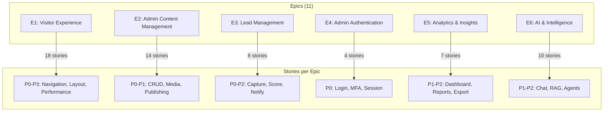

# User Stories — Enterprise Feature Inventory

> **Document:** `03-USER-STORIES.md` | **Version:** 3.0 | **Last Updated:** June 2026  
> **Status:** ✅ Active | **Owner:** Product Owner  
> **Total Stories:** 61 | **Total Points:** 318 | **P0:** 18 | **P1:** 17 | **P2:** 15 | **P3:** 11

---

## Executive Summary

This document catalogs **61 user stories** across **11 epics** (E1-E11) with a total of **318 story points**, covering every feature in the portfolio platform. Stories are mapped to features via a full traceability matrix, ensuring every requirement has acceptance criteria, edge cases, and failure paths. Priority distribution: 18 P0 (Critical), 17 P1 (High), 15 P2 (Medium), 11 P3 (Low/Future). The Definition of Done enforces 12 quality gates across functional, accessibility, performance, security, and documentation standards.

## Cross-References

| Reference | Description |
|-----------|-------------|
| `docs/product/ProductRequirements.md` | Product Requirements — stories trace to PRD requirements |
| `docs/product/02-FEATURES.md` | Feature Catalog — each story maps to a feature ID |
| `docs/product/UserFlows.md` | User Journeys — stories validate persona-based flows |
| `docs/quality/TestingArchitecture.md` | Testing Strategy — acceptance criteria inform test cases |
| `docs/product/37-IMPLEMENTATION_PLAN.md` | Implementation Plan — stories sequenced in phases |

## Epic-to-Story Mapping



---

## Table of Contents

1. [Epic Overview & Story Mapping](#1-epic-overview--story-mapping)
2. [Definition of Done](#2-definition-of-done)
3. [Epic E1: Visitor Experience](#3-epic-e1-visitor-experience)
4. [Epic E2: Admin Content Management](#4-epic-e2-admin-content-management)
5. [Epic E3: Lead Management](#5-epic-e3-lead-management)
6. [Epic E4: Admin Authentication](#6-epic-e4-admin-authentication)
7. [Epic E5: Analytics & Insights](#7-epic-e5-analytics--insights)
8. [Epic E6: AI & Intelligence](#8-epic-e6-ai--intelligence)
9. [Epic E7: Developer Experience](#9-epic-e7-developer-experience)
10. [Epic E8: Performance & Reliability](#10-epic-e8-performance--reliability)
11. [Epic E9: Blog Engine](#11-epic-e9-blog-engine)
12. [Epic E10: Monitoring & Observability](#12-epic-e10-monitoring--observability)
13. [Epic E11: Future Features](#13-epic-e11-future-features)
14. [Story Points Summary](#14-story-points-summary)
15. [Traceability Matrix: Feature → Story](#15-traceability-matrix-feature--story)

---

## 1. Epic Overview & Story Mapping

### Epic Definitions

| Epic | Theme | Stories | Points | P0 | P1 | P2 | P3 |
|------|-------|---------|--------|----|----|----|----|
| **E1** | Visitor Experience | 20 | 101 | 8 | 7 | 3 | 2 |
| **E2** | Admin Content Management | 5 | 34 | 4 | 1 | 0 | 0 |
| **E3** | Lead Management | 5 | 18 | 2 | 2 | 1 | 0 |
| **E4** | Admin Authentication | 3 | 16 | 3 | 0 | 0 | 0 |
| **E5** | Analytics & Insights | 2 | 13 | 1 | 1 | 0 | 0 |
| **E6** | AI & Intelligence | 6 | 38 | 0 | 0 | 6 | 0 |
| **E7** | Developer Experience | 4 | 16 | 0 | 2 | 2 | 0 |
| **E8** | Performance & Reliability | 3 | 13 | 0 | 2 | 1 | 0 |
| **E9** | Blog Engine | 3 | 15 | 0 | 0 | 0 | 3 |
| **E10** | Monitoring & Observability | 3 | 10 | 0 | 2 | 1 | 0 |
| **E11** | Future Features | 8 | 44 | 0 | 0 | 0 | 8 |
| **Total** | — | **62** | **318** | **18** | **17** | **15** | **11** |

### User Story Template

Each story follows this structure:

```
### US-XXX: [Story Title] (F-XXX)

> **As a** [persona]  > **I want** [action]  > **So that** [benefit]

| Field | Value |
|-------|-------|
| **Epic** | EX |
| **Feature ID** | F-XXX |
| **Priority** | P0/P1/P2/P3 |
| **Story Points** | N |
| **Phase** | N |
| **Dependencies** | US-XXX, US-XXX |

**Acceptance Criteria** [10-20 items with checkbox format]
**Success Criteria** [3-5 measurable outcomes]
**Edge Cases** [3-5 scenarios]
**Failure Scenarios** [3-5 scenarios with recovery]
```

---

## 2. Definition of Done

A user story is considered **Done** when:

### Quality Gates

- [ ] Code is implemented and peer-reviewed
- [ ] Unit tests pass (≥ 80% coverage for new code)
- [ ] Integration tests pass
- [ ] TypeScript strict mode passes (no `any`, no implicit any)
- [ ] ESLint passes with zero errors and zero warnings
- [ ] Prettier formatting applied

### Functional Gates

- [ ] Acceptance criteria all verified
- [ ] All edge cases handled
- [ ] Failure scenarios have graceful recovery
- [ ] Analytics events firing correctly
- [ ] Feature flag configured and tested (both on/off states)

### Accessibility Gates

- [ ] WCAG 2.2 AA validated (axe DevTools: 0 violations)
- [ ] Keyboard navigation complete
- [ ] Screen reader tested (VoiceOver or NVDA)
- [ ] Color contrast verified (4.5:1 minimum)

### Compatibility Gates

- [ ] Works on Chrome, Firefox, Safari, Edge (latest 2 versions)
- [ ] Works on mobile (iOS Safari, Android Chrome)
- [ ] Works on tablet (iPadOS Safari)
- [ ] 320px minimum viewport verified

### Performance Gates

- [ ] Lighthouse performance ≥ 95
- [ ] No layout shift introduced (CLS < 0.1)
- [ ] No bundle size regression (> 5% increase flagged)

### Security Gates

- [ ] OWASP review completed for the feature
- [ ] Input validation in place
- [ ] Rate limiting applied (where applicable)
- [ ] No secrets/credentials in client code

### Documentation Gates

- [ ] API documentation updated (if applicable)
- [ ] Feature flag documented
- [ ] Analytics events documented
- [ ] Screen reader behavior documented

---

## 3. Epic E1: Visitor Experience

**Theme:** First impressions, browsing, and engagement  
**Total Stories:** 16 | **Points:** 86  
**Personas:** Visitor (Recruiter), Visitor (Client), Visitor (Developer)

### US-001: Hero Section Landing (F-001)

> **As a** visitor (recruiter)  
> **I want** to see a visually stunning hero section with my name, title, and clear CTAs  
> **So that** I'm immediately impressed and know exactly what to do next

| Field | Value |
|-------|-------|
| **Epic** | E1: Visitor Experience |
| **Feature ID** | F-001 |
| **Priority** | P0 |
| **Story Points** | 5 |
| **Phase** | 03 |
| **Dependencies** | US-003 (Navigation), US-022 (Theme System) |

#### Acceptance Criteria

- [ ] Hero loads within 2 seconds (LCP < 2.5s)
- [ ] Name displayed in display font (30px+ on desktop, 24px+ on mobile)
- [ ] Title/subtitle displayed below name in body font
- [ ] At least 2 CTA buttons visible without scrolling ("View My Work", "Contact Me")
- [ ] Background animation plays at 60fps with no jank
- [ ] `prefers-reduced-motion` respected — static gradient fallback
- [ ] Social media links (GitHub, LinkedIn, Twitter) as icon buttons
- [ ] Scroll indicator animation at bottom
- [ ] Responsive at all breakpoints (320px to 2560px)
- [ ] All text meets WCAG AA contrast ratios
- [ ] Social links open in new tab with `rel="noopener noreferrer"`
- [ ] CTA buttons have hover + focus + active states
- [ ] Keyboard navigable (Tab through CTAs, social links)
- [ ] Lighthouse Performance score impact < 5 points (3D scene dynamically imported)
- [ ] Works without JavaScript (static hero, no animation)

#### Success Criteria

| Metric | Target | Measurement |
|--------|--------|-------------|
| LCP | < 2.5s | Vercel Analytics |
| CTA visibility | 100% above fold | Manual check |
| Bounce rate reduction | 10% improvement | PostHog |
| Social link click rate | > 5% of visitors | PostHog |

#### Edge Cases

| Scenario | Expected Behavior |
|----------|------------------|
| Ultra-wide monitor (3440×1440) | Hero scales, no empty space, max-width constraint |
| Very small mobile (320px) | Font sizes adjust, CTAs stack vertically, no overflow |
| Screen reader user | `aria-label` on social links, semantic heading hierarchy |
| Keyboard-only user | Tab order: CTAs → social links → scroll indicator |
| 3D scene fails to load | Static gradient background, no error shown |

#### Failure Scenarios

| Scenario | Recovery |
|----------|----------|
| Hero image fails to load | CSS gradient fallback, no broken image icon |
| API fails to return hero content | Static default hero with hardcoded fallback |
| 3D WebGL not supported | Feature detection → static background, no console error |
| Font fails to load | System font fallback, no FOIT (font-display: swap) |

---

### US-002: Skills Section Browsing (F-002)

> **As a** visitor (recruiter)  
> **I want** to see visual skill indicators with proficiency levels, grouped by category  
> **So that** I can quickly match skills to job requirements

| Field | Value |
|-------|-------|
| **Epic** | E1: Visitor Experience |
| **Feature ID** | F-002 |
| **Priority** | P1 |
| **Story Points** | 5 |
| **Phase** | 04 |
| **Dependencies** | US-003 (Navigation) |

#### Acceptance Criteria

- [ ] Skills grouped by category (Frontend, Backend, DevOps, Database, Languages, Tools)
- [ ] Each skill shows name, icon, and proficiency indicator (bar or circle)
- [ ] Hover/tap shows proficiency percentage and optional description
- [ ] Filter tabs for each category with active state indicator
- [ ] Animated bars on scroll into view
- [ ] Responsive grid (2 cols mobile, 3 cols tablet, 4 cols desktop)
- [ ] Data fetched via ISR (60s revalidation)
- [ ] Loading skeleton with skill-bar shapes
- [ ] Error state with retry button
- [ ] Empty state: "Skills coming soon" with placeholder
- [ ] Touch targets ≥ 44×44px on mobile
- [ ] `prefers-reduced-motion`: static bars (no animation)

#### Success Criteria

| Metric | Target | Measurement |
|--------|--------|-------------|
| Skill hover rate | > 30% of section viewers | PostHog |
| Category filter usage | > 20% of section viewers | PostHog |
| Time on section | > 15 seconds | PostHog |

#### Edge Cases

| Scenario | Expected Behavior |
|----------|------------------|
| 20+ skills in one category | Scrollable grid, paginate if > 12 |
| Proficiency at 0% | Still shown (learning), progress bar at minimum |
| Skill name very long (30+ chars) | Text truncation with tooltip on hover |
| No skills configured | Empty state with CTA to admin dashboard |

#### Failure Scenarios

| Scenario | Recovery |
|----------|----------|
| API returns 500 | Error state with retry, section gracefully hidden after 3 retries |
| Network timeout (> 10s) | Show timeout message, retry option |
| ISR cache stale | Serve stale data while revalidating |

---

### US-003: Navigation System (F-003)

> **As a** visitor  
> **I want** clear, sticky navigation that shows all sections and my current location  
> **So that** I can easily jump to any section and know where I am

| Field | Value |
|-------|-------|
| **Epic** | E1: Visitor Experience |
| **Feature ID** | F-003 |
| **Priority** | P0 |
| **Story Points** | 5 |
| **Phase** | 02 |
| **Dependencies** | US-022 (Theme System), US-023 (Design System) |

#### Acceptance Criteria

- [ ] Sticky header with backdrop blur on scroll
- [ ] Smooth scroll to sections with offset accounting for header height
- [ ] Active section highlighted in nav based on Intersection Observer
- [ ] Mobile: hamburger menu icon when viewport < 768px
- [ ] Mobile menu: slide-in drawer from right, 80% viewport width
- [ ] Mobile menu: backdrop overlay, click to close
- [ ] Desktop: full nav links, theme toggle, CTA button
- [ ] Keyboard: Tab through nav items, Enter/Space to activate, Escape to close mobile menu
- [ ] Screen reader: `aria-current="section"` on active nav item
- [ ] Touch targets ≥ 44×44px on mobile (hamburger, nav links)
- [ ] No layout shift when header becomes sticky (reserve space)
- [ ] `prefers-reduced-motion`: no menu animation, instant show/hide
- [ ] Mobile menu: close on link click
- [ ] Logo/brand link navigates to top on click

#### Success Criteria

| Metric | Target | Measurement |
|--------|--------|-------------|
| Nav link click rate | > 40% of visitors | PostHog |
| Mobile menu open rate | > 50% of mobile visitors | PostHog |
| Scroll-to-section accuracy | 100% (no offset errors) | Manual QA |

#### Edge Cases

| Scenario | Expected Behavior |
|----------|------------------|
| Very long section list (15+ items) | Truncate, "More" dropdown, or scrollable nav |
| Single section portfolio | Navigation still shows, minimal mode |
| Browser back button after smooth scroll | Restore scroll position correctly |
| Resize from desktop to mobile | Nav switches from full to hamburger without glitch |

#### Failure Scenarios

| Scenario | Recovery |
|----------|----------|
| JavaScript disabled | Fallback anchor links (`#section-id`), no smooth scroll |
| IntersectionObserver not supported | Polyfill or scroll event listener fallback |
| Mobile menu animation jank | Hardware-accelerated CSS transforms (`translate3d`) |

---

### US-004: About Section (F-004)

> **As a** visitor (potential client)  
> **I want** to read a professional bio with photo and key statistics  
> **So that** I can assess personality, experience, and credibility

| Field | Value |
|-------|-------|
| **Epic** | E1: Visitor Experience |
| **Feature ID** | F-004 |
| **Priority** | P0 |
| **Story Points** | 5 |
| **Phase** | 04 |
| **Dependencies** | US-003 (Navigation) |

#### Acceptance Criteria

- [ ] Split layout: photo left, bio right (desktop) / stacked (mobile)
- [ ] Profile image optimized (WebP, srcset, lazy loaded)
- [ ] Bio supports rich text (bold, italic, links, lists)
- [ ] Statistics bar: years exp, projects completed, clients served, certifications
- [ ] Animated counter on scroll into view
- [ ] "Download Resume" button with PDF icon
- [ ] Responsive at all breakpoints
- [ ] Loading skeleton (photo placeholder + text lines)
- [ ] Error state with retry
- [ ] Alt text on profile image

#### Success Criteria

| Metric | Target | Measurement |
|--------|--------|-------------|
| Resume downloads per visitor | > 3% | PostHog |
| Time on section | > 20 seconds | PostHog |
| Stat counter engagement | > 60% view it | PostHog |

#### Edge Cases

| Scenario | Expected Behavior |
|----------|------------------|
| No photo uploaded | Monogram/initial avatar placeholder |
| Very long bio (1000+ words) | "Read more" truncation with expand |
| Stats all zero | Hide stat section gracefully |

#### Failure Scenarios

| Scenario | Recovery |
|----------|----------|
| Image fails to load | Monogram fallback, no broken image |
| API fails | Static about text from Next.js config fallback |
| Resume file missing | Hide download button, log error to Sentry |

---

### US-005: Experience Timeline (F-005)

> **As a** visitor (recruiter)  
> **I want** to see a clear timeline of work experience  
> **So that** I can understand career progression and time in each role

| Field | Value |
|-------|-------|
| **Epic** | E1: Visitor Experience |
| **Feature ID** | F-005 |
| **Priority** | P1 |
| **Story Points** | 5 |
| **Phase** | 04 |
| **Dependencies** | US-003 (Navigation) |

#### Acceptance Criteria

- [ ] Vertical timeline with alternating left/right layout on desktop
- [ ] Each entry: date range, company logo, job title, brief description
- [ ] Current/present role highlighted with accent color and "Present" badge
- [ ] Technologies used shown as badge chips
- [ ] Expandable details on click (more description, achievements)
- [ ] Single column on mobile (all entries left-aligned)
- [ ] Staggered animation on scroll
- [ ] Loading skeleton (timeline dots + card shapes)
- [ ] Empty state: "Experience section coming soon"
- [ ] Screen reader: timeline structure announced correctly

#### Success Criteria

| Metric | Target | Measurement |
|--------|--------|-------------|
| Timeline item expansion rate | > 25% | PostHog |
| Time on section | > 30 seconds | PostHog |

#### Edge Cases

| Scenario | Expected Behavior |
|----------|------------------|
| 10+ years with 6+ positions | Scrollable, no pagination needed |
| Gap in employment (1+ year) | Show gap, no negative styling |
| Current role has no end date | "Present" badge, ongoing styling |

#### Failure Scenarios

| Scenario | Recovery |
|----------|----------|
| API returns empty | Empty state with message |
| Company logo missing | Show initials as fallback |
| Timeline breaks on mobile | Responsive adjustments, QA every breakpoint |

---

### US-006: Testimonials Carousel (F-006)

> **As a** visitor (potential client)  
> **I want** to see authentic testimonials from past clients  
> **So that** I can trust the quality of work and professionalism

| Field | Value |
|-------|-------|
| **Epic** | E1: Visitor Experience |
| **Feature ID** | F-006 |
| **Priority** | P1 |
| **Story Points** | 5 |
| **Phase** | 06 |
| **Dependencies** | US-003 (Navigation) |

#### Acceptance Criteria

- [ ] Testimonials displayed as cards with avatar, name, role, company, content
- [ ] Star rating (1-5) shown if provided
- [ ] Carousel auto-advances every 5 seconds, pauses on hover/focus
- [ ] Manual navigation: arrow buttons + dot indicators
- [ ] Touch swipe on mobile
- [ ] Keyboard: Arrow keys cycle through testimonials
- [ ] `prefers-reduced-motion`: no auto-advance, static grid
- [ ] Loading skeleton (card shapes)
- [ ] Empty state: "No testimonials yet" with CTA
- [ ] Verified badge for authenticated testimonials

#### Success Criteria

| Metric | Target | Measurement |
|--------|--------|-------------|
| Carousel interaction rate | > 15% | PostHog |
| Click-through to contact | > 5% after viewing | PostHog |

#### Edge Cases

| Scenario | Expected Behavior |
|----------|------------------|
| Single testimonial | No carousel, single card centered |
| No avatar image | Initials avatar with random background color |
| Very long testimonial (500+ words) | Truncate with "Read more" expand |

#### Failure Scenarios

| Scenario | Recovery |
|----------|----------|
| Carousel JavaScript fails | Static grid of all testimonials |
| Image fails to load | Initials fallback avatar |
| API returns empty array | Empty state, section hidden if `isVisible=false` |

---

### US-007: Contact Form Submission (F-007)

> **As a** visitor (potential client)  
> **I want** to submit a contact form with my name, email, and message  
> **So that** I can easily reach out about opportunities

| Field | Value |
|-------|-------|
| **Epic** | E1: Visitor Experience |
| **Feature ID** | F-007 |
| **Priority** | P0 |
| **Story Points** | 5 |
| **Phase** | 04 |
| **Dependencies** | US-023 (Input Component), US-800 (Lead API) |

#### Acceptance Criteria

- [ ] Form fields: Name (required), Email (required, valid format), Message (required, min 10 chars)
- [ ] Optional fields: Phone, Company, Subject
- [ ] Real-time client-side validation with inline error messages
- [ ] Server-side validation with Zod schema
- [ ] Submit button shows spinner, disables during submission
- [ ] Success: Thank you message with confetti animation, auto-reply email within 60s
- [ ] Error: Specific error message with retry option
- [ ] Honeypot field hidden from users, visible to bots
- [ ] Rate limiting: 429 response with `Retry-After` header
- [ ] Keyboard: Tab through fields, Enter to submit
- [ ] `aria-invalid` on error fields
- [ ] Screen reader announces success/error via `role="status"`
- [ ] Form data persists on validation error (don't clear)
- [ ] CAPTCHA/turnstile on 3rd failed submission

#### Success Criteria

| Metric | Target | Measurement |
|--------|--------|-------------|
| Form completion rate | > 60% of starters | PostHog funnel |
| Submission success rate | > 95% | PostHog |
| Spam rejection rate | > 99% | Honeypot + rate limiting |
| Auto-reply delivery | < 60s | Resend analytics |

#### Edge Cases

| Scenario | Expected Behavior |
|----------|------------------|
| Email with Unicode characters | Validated and stored correctly (UTF-8) |
| Message with HTML tags | Sanitized, tags stripped |
| Very long name (100+ chars) | Truncated at 100 chars with server validation |
| Copied/pasted text with formatting | Paste as plain text only |
| Double-click submit | Button disabled after first click, prevent duplicate |

#### Failure Scenarios

| Scenario | Recovery |
|----------|----------|
| Rate limit exceeded | "Please try again in X minutes" with countdown |
| Network offline | "Connection lost. Your message will be saved." + retry |
| Server validation error | Field-level error messages, don't clear form |
| Auto-reply email fails | Log to Sentry, still show success to user |
| Server 500 error | "Something went wrong. We've been notified." + retry |

---

### US-008: FAQ Accordion (F-008)

> **As a** visitor  
> **I want** an expandable FAQ section with common questions  
> **So that** I can find answers without emailing

| Field | Value |
|-------|-------|
| **Epic** | E1: Visitor Experience |
| **Feature ID** | F-008 |
| **Priority** | P1 |
| **Story Points** | 3 |
| **Phase** | 04 |
| **Dependencies** | US-003 (Navigation) |

#### Acceptance Criteria

- [ ] Accordion-style: click question to expand/collapse answer
- [ ] Only one item open at a time (accordion behavior)
- [ ] Smooth expand/collapse animation (max-height transition, 300ms)
- [ ] Keyboard: Enter/Space to toggle, Arrow Up/Down to navigate
- [ ] `aria-expanded` on toggle button
- [ ] `aria-controls` links button to content panel
- [ ] Rich text in answers (links, lists, bold)
- [ ] Loading skeleton
- [ ] Empty state: "No FAQs yet"
- [ ] Search/filter FAQ (future enhancement)

#### Success Criteria

| Metric | Target | Measurement |
|--------|--------|-------------|
| FAQ open rate | > 30% of section viewers | PostHog |
| Average questions opened | > 2 per viewer | PostHog |

#### Edge Cases

| Scenario | Expected Behavior |
|----------|------------------|
| 20+ FAQ items | Scrollable, group by category |
| Very long answer (1000+ words) | Scroll within answer panel, no external scroll |
| FAQ with embedded video | Responsive iframe, lazy load |

#### Failure Scenarios

| Scenario | Recovery |
|----------|----------|
| API fails | Hide section if `isVisible=false`, else static fallback |
| Animation performance on low-end device | `will-change: max-height`, reduce motion fallback |

---

### US-009: Services Section (F-009)

> **As a** visitor (potential client)  
> **I want** to see available services with descriptions and pricing  
> **So that** I can decide if you're the right fit before contacting

| Field | Value |
|-------|-------|
| **Epic** | E1: Visitor Experience |
| **Feature ID** | F-009 |
| **Priority** | P1 |
| **Story Points** | 5 |
| **Phase** | 04 |
| **Dependencies** | US-003 (Navigation) |

#### Acceptance Criteria

- [ ] Service cards with icon, title, description
- [ ] Pricing tiers with feature lists (if applicable)
- [ ] "Book a call" or "Get started" CTA on each card
- [ ] CTA links to contact form or Calendly embed
- [ ] Responsive grid (1 col mobile, 2 col tablet, 3 col desktop)
- [ ] Hover: card lift + shadow increase
- [ ] Loading skeleton (card shapes)
- [ ] Empty state

#### Success Criteria

| Metric | Target | Measurement |
|--------|--------|-------------|
| Service CTA click rate | > 10% of section viewers | PostHog |
| Pricing tier view rate | > 40% of section viewers | PostHog |

#### Edge Cases

| Scenario | Expected Behavior |
|----------|------------------|
| Single service | Full-width card, centered |
| Dynamic pricing | Badge: "Contact for pricing" |

#### Failure Scenarios

| Scenario | Recovery |
|----------|----------|
| API fails | Hide section or show fallback |

---

### US-010: Portfolio Statistics (F-010)

> **As a** visitor (recruiter)  
> **I want** to see key statistics with animated counters  
> **So that** I immediately grasp the scale of experience

| Field | Value |
|-------|-------|
| **Epic** | E1: Visitor Experience |
| **Feature ID** | F-010 |
| **Priority** | P1 |
| **Story Points** | 3 |
| **Phase** | 06 |
| **Dependencies** | US-003 (Navigation) |

#### Acceptance Criteria

- [ ] Grid of stat cards with icon, number, label
- [ ] Numbers animate from 0 to target on scroll into view
- [ ] Animation duration proportional to value (2-3 seconds)
- [ ] `prefers-reduced-motion`: static display
- [ ] Responsive (2 cols mobile, 4 cols desktop)
- [ ] Loading skeleton (stat card shapes)

#### Success Criteria

| Metric | Target | Measurement |
|--------|--------|-------------|
| Counter animation completion | 100% viewable | PostHog |

#### Edge Cases

| Scenario | Expected Behavior |
|----------|------------------|
| Value over 1,000,000 | Formatted with commas: "1,000,000" |
| Decimal values | Format accordingly: "4.5" |

#### Failure Scenarios

| Scenario | Recovery |
|----------|----------|
| API fails | Hide or show hardcoded defaults |

---

### US-011: Client Logos Section (F-011)

> **As a** visitor  
> **I want** to see logos of companies worked with  
> **So that** I immediately recognize established client relationships

| Field | Value |
|-------|-------|
| **Epic** | E1: Visitor Experience |
| **Feature ID** | F-011 |
| **Priority** | P1 |
| **Story Points** | 3 |
| **Phase** | 06 |
| **Dependencies** | US-003 (Navigation) |

#### Acceptance Criteria

- [ ] Logos in grid or auto-scrolling slider
- [ ] Grayscale by default, full color on hover
- [ ] Alt text on each logo for accessibility
- [ ] Responsive grid
- [ ] Loading skeleton (logo placeholders)

#### Success Criteria

| Metric | Target | Measurement |
|--------|--------|-------------|
| Logo hover rate | > 20% of section viewers | PostHog |

#### Edge Cases

| Scenario | Expected Behavior |
|----------|------------------|
| 30+ logos | Paginated grid or faster scroll speed |
| Logo image fails | Company name text fallback |

#### Failure Scenarios

| Scenario | Recovery |
|----------|----------|
| API fails | Hide section |

---

### US-012: Dark/Light Theme Toggle (F-012)

> **As a** visitor  
> **I want** to toggle between dark and light themes  
> **So that** I can read comfortably in any environment

| Field | Value |
|-------|-------|
| **Epic** | E1: Visitor Experience |
| **Feature ID** | F-012 |
| **Priority** | P1 |
| **Story Points** | 3 |
| **Phase** | 02 |
| **Dependencies** | US-023 (Design System) |

#### Acceptance Criteria

- [ ] Toggle button in navigation (sun/moon icon)
- [ ] Respects system preference on first visit via `prefers-color-scheme`
- [ ] Smooth transition between themes (300ms, CSS `transition`)
- [ ] Preference persisted in `localStorage`
- [ ] No flash of wrong theme on page load (critical — inline script in `<head>`)
- [ ] All sections render correctly in both themes
- [ ] WCAG contrast ratios maintained in both themes (4.5:1 text, 3:1 large text)
- [ ] Toggle icon reflects current theme
- [ ] System preference change detected mid-session (optional)

#### Success Criteria

| Metric | Target | Measurement |
|--------|--------|-------------|
| Theme toggle usage | > 10% of visitors | PostHog |
| No flash rate | 100% | Manual verification |

#### Edge Cases

| Scenario | Expected Behavior |
|----------|------------------|
| localStorage unavailable | Cookie fallback, then system preference only |
| Third-party cookies blocked | Work without persistence (system preference each visit) |
| System preference changes while browsing | Optionally detect and prompt user |

#### Failure Scenarios

| Scenario | Recovery |
|----------|----------|
| CSS variable not applied | Fallback to system preference, no broken layout |
| JavaScript disabled | System preference via CSS `prefers-color-scheme` media query |

---

### US-013: Section Scroll Animations (F-013)

> **As a** visitor  
> **I want** smooth scroll-triggered animations that reveal sections  
> **So that** the browsing experience feels polished and engaging

| Field | Value |
|-------|-------|
| **Epic** | E1: Visitor Experience |
| **Feature ID** | F-013 |
| **Priority** | P1 |
| **Story Points** | 5 |
| **Phase** | 02 |
| **Dependencies** | US-003 (Navigation), US-022 (Theme System) |

#### Acceptance Criteria

- [ ] Sections fade in + slide up (20px) on scroll into viewport
- [ ] Children stagger: each card animates with 100ms delay
- [ ] Intersection Observer with threshold 0.2
- [ ] Animations play once (no repeat on re-scroll)
- [ ] `prefers-reduced-motion`: all animations disabled (static reveal)
- [ ] Performance: 60fps, use `will-change: transform, opacity`
- [ ] No CLS from animations (use `transform`, not `height`/`width`)
- [ ] Works on mobile and desktop
- [ ] No visible jank on low-end devices

#### Success Criteria

| Metric | Target | Measurement |
|--------|--------|-------------|
| Animation FPS | ≥ 55fps | Chrome DevTools Performance |
| CLS impact | 0 | Lighthouse |

#### Edge Cases

| Scenario | Expected Behavior |
|----------|------------------|
| Very fast scroll past section | Animation still plays once (IntersectionObserver `once: true`) |
| Section already in viewport on load | Animate in immediately (no delay) |
| User tabs to a section (skip scroll) | Still animate, triggered by IntersectionObserver |

#### Failure Scenarios

| Scenario | Recovery |
|----------|----------|
| IntersectionObserver not supported | Polyfill or static reveal |
| Low-end device drops frames | Auto-disable if FPS < 30 detected |
| Reduced motion not detected | Manual animation toggle in settings (future) |

---

### US-014: Loading States & Skeletons (F-014)

> **As a** visitor  
> **I want** to see skeleton loading states while content loads  
> **So that** I understand content is coming and don't see blank space

| Field | Value |
|-------|-------|
| **Epic** | E1: Visitor Experience |
| **Feature ID** | F-014 |
| **Priority** | P0 |
| **Story Points** | 3 |
| **Phase** | 02 |
| **Dependencies** | US-023 (Design System) |

#### Acceptance Criteria

- [ ] All data-fetching sections have skeleton loading states
- [ ] Skeletons match the shape of actual content (no layout shift)
- [ ] `loading.tsx` for every route segment
- [ ] Skeleton shimmer animation (CSS only, `prefers-reduced-motion`: static)
- [ ] Loading spinners for button actions (form submission, etc.)
- [ ] Timeout handling: show error after 10 seconds
- [ ] Skeleton components: `SkeletonText`, `SkeletonCard`, `SkeletonCircle`, `SkeletonImage`

#### Success Criteria

| Metric | Target | Measurement |
|--------|--------|-------------|
| Perceived load time | < 100ms (skeleton shows instantly) | Lighthouse |
| Cumulative Layout Shift | < 0.1 (skeleton prevents shift) | Lighthouse |

#### Edge Cases

| Scenario | Expected Behavior |
|----------|------------------|
| Content loads in < 100ms | Skeleton flash is acceptable (brief) |
| Slow API (5+ seconds) | Skeleton → timeout message after 10s |

#### Failure Scenarios

| Scenario | Recovery |
|----------|----------|
| Skeleton CSS fails to load | Static placeholder, browser default loading |

---

### US-015: Error Boundaries & States (F-015)

> **As a** visitor  
> **I want** to see friendly error messages if something breaks  
> **So that** I can retry or navigate away without frustration

| Field | Value |
|-------|-------|
| **Epic** | E1: Visitor Experience |
| **Feature ID** | F-015 |
| **Priority** | P0 |
| **Story Points** | 3 |
| **Phase** | 02 |
| **Dependencies** | US-023 (Design System) |

#### Acceptance Criteria

- [ ] Global error boundary at root layout (`error.tsx`)
- [ ] Per-section error boundaries for independent failure isolation
- [ ] Error UI shows: friendly message, retry button, optional error details
- [ ] Error logged to Sentry with component stack and context
- [ ] 404 page with navigation back to home
- [ ] 500 page with "Contact support" option
- [ ] One failed section doesn't crash the entire page
- [ ] Retry button calls `reset()` on error boundary

#### Success Criteria

| Metric | Target | Measurement |
|--------|--------|-------------|
| Error recovery rate | > 80% retry success | Sentry |
| Full-page crash rate | 0 (all errors isolated) | Manual test |

#### Edge Cases

| Scenario | Expected Behavior |
|----------|------------------|
| Multiple sections fail simultaneously | Each shows independent error, page is still navigable |
| Error in error boundary itself | Catch at higher level, show fallback UI |

#### Failure Scenarios

| Scenario | Recovery |
|----------|----------|
| Sentry fails to report error | Console.error fallback, no user-facing impact |
| Critical layout component fails | Full-page error with recovery navigation |

---

### US-016: Projects Grid Browsing (F-100)

> **As a** visitor (recruiter)  
> **I want** to browse projects in a filterable grid  
> **So that** I can see relevant work quickly

| Field | Value |
|-------|-------|
| **Epic** | E1: Visitor Experience |
| **Feature ID** | F-100 |
| **Priority** | P0 |
| **Story Points** | 8 |
| **Phase** | 05 |
| **Dependencies** | US-003 (Navigation), US-013 (Animations) |

#### Acceptance Criteria

- [ ] Responsive card grid (1 col mobile, 2 col tablet, 3 col desktop)
- [ ] Each card: thumbnail, title, brief description, tech badges (max 4)
- [ ] Featured projects visually distinguished (badge, larger card or accent border)
- [ ] Filter by category (Web, Mobile, AI, DevOps, Design)
- [ ] Filter by technology (React, Python, Docker, etc.) — derived from all projects
- [ ] Active filters shown as removable chips with individual close buttons
- [ ] "Clear all" button when filters active
- [ ] Filter count badge showing matching project count
- [ ] Pagination (12 per page) or "Load more" button
- [ ] Search by project title
- [ ] Images optimized (Next/Image, WebP, lazy loading, srcset)
- [ ] Hover: card lifts 4px + shadow increase
- [ ] Click navigates to project detail page
- [ ] URL-synced filters for bookmarkability
- [ ] Loading skeleton (card grid shapes)
- [ ] Empty state: "No projects found" with suggestion to clear filters
- [ ] Error state with retry

#### Success Criteria

| Metric | Target | Measurement |
|--------|--------|-------------|
| Filter usage rate | > 30% of viewers | PostHog |
| Project click-through rate | > 40% | PostHog |
| Average projects viewed | > 3 per session | PostHog |

#### Edge Cases

| Scenario | Expected Behavior |
|----------|------------------|
| 50+ projects | Pagination, search becomes important |
| No projects match filter | "No projects match your filters" with "Clear all" CTA |
| Very long title (80+ chars) | Truncated with ellipsis, tooltip on hover |
| Image in 4:3 vs 16:9 aspect ratio | Object-fit: cover, maintaining consistent card heights |

#### Failure Scenarios

| Scenario | Recovery |
|----------|----------|
| API fails | Error state with retry, cached data if available |
| Image CDN fails | Placeholder image with project initials |
| Filter URL invalid | Ignore invalid filter params, show all projects |

---

### US-017: Project Detail Page (F-101)

> **As a** visitor (recruiter)  
> **I want** to see a detailed project page with gallery and tech stack  
> **So that** I can evaluate technical depth and quality

| Field | Value |
|-------|-------|
| **Epic** | E1: Visitor Experience |
| **Feature ID** | F-101 |
| **Priority** | P0 |
| **Story Points** | 8 |
| **Phase** | 05 |
| **Dependencies** | US-016 (Projects Grid) |

#### Acceptance Criteria

- [ ] Dynamic route `/projects/[slug]` with ISR (60s revalidation)
- [ ] Hero image / gallery carousel at top
- [ ] Project title, description, year, role displayed
- [ ] Tech stack badges with icons
- [ ] Live demo link (external, new tab, `rel="noopener"`)
- [ ] GitHub repository link (external, new tab, with star count if available)
- [ ] Image gallery with lightbox (click to enlarge, arrow navigation)
- [ ] Rich text content: features, challenges, solutions, outcomes
- [ ] Related projects section at bottom (same category)
- [ ] Previous/next project navigation
- [ ] Back to projects link
- [ ] JSON-LD structured data (SoftwareApplication schema)
- [ ] Open Graph + Twitter Card meta tags (image, title, description)
- [ ] Loading skeleton (hero + content placeholders)
- [ ] 404 page for invalid slugs
- [ ] Error state with retry

#### Success Criteria

| Metric | Target | Measurement |
|--------|--------|-------------|
| Time on page | > 2 minutes | PostHog |
| Gallery interaction | > 40% of visitors | PostHog |
| External link click | > 30% of visitors | PostHog |

#### Edge Cases

| Scenario | Expected Behavior |
|----------|------------------|
| No gallery images | Show hero image only, no gallery controls |
| No related projects | Hide related section gracefully |
| GitHub API rate limit | Show link without star count |
| Very long description (5000+ words) | Readable formatting, table of contents |

#### Failure Scenarios

| Scenario | Recovery |
|----------|----------|
| Invalid slug | 404 page with navigation to projects grid |
| ISR build fails | Fallback to server-side render |
| External links broken | Still show, use `target="_blank"` |

---

### US-018: Featured Projects Carousel (F-102)

> **As a** visitor  
> **I want** to see a featured projects carousel on the home page  
> **So that** I can quickly see the best work

| Field | Value |
|-------|-------|
| **Epic** | E1: Visitor Experience |
| **Feature ID** | F-102 |
| **Priority** | P2 |
| **Story Points** | 5 |
| **Phase** | 05 |
| **Dependencies** | US-016 (Projects Grid) |

#### Acceptance Criteria

- [ ] Horizontal carousel with 3-5 featured projects
- [ ] Partial visibility of next/prev cards (peek)
- [ ] Auto-advances every 5 seconds, pauses on hover/focus
- [ ] Touch swipe on mobile
- [ ] Keyboard: Arrow keys to navigate
- [ ] Dot indicators showing current slide
- [ ] "View Project" CTA on each card
- [ ] Responsive height
- [ ] Reduced motion: no auto-advance, manual only

#### Success Criteria

| Metric | Target | Measurement |
|--------|--------|-------------|
| Carousel interaction | > 20% of home page visitors | PostHog |
| Click-through to detail | > 15% | PostHog |

#### Edge Cases

| Scenario | Expected Behavior |
|----------|------------------|
| 1 featured project | No carousel, single card |
| All projects featured | Show top 5 by display_order |
| Screen reader | `aria-roledescription="carousel"` with slide announcements |

#### Failure Scenarios

| Scenario | Recovery |
|----------|----------|
| No featured projects | Hide carousel entirely |
| Carousel JS fails | Static grid fallback |

---

### US-019: Case Studies Full Format (F-105)

> **As a** visitor (potential client)  
> **I want** to read structured case studies with problem/solution/impact  
> **So that** I can understand problem-solving methodology

| Field | Value |
|-------|-------|
| **Epic** | E1: Visitor Experience |
| **Feature ID** | F-105 |
| **Priority** | P2 |
| **Story Points** | 8 |
| **Phase** | 05 |
| **Dependencies** | US-017 (Project Detail) |

#### Acceptance Criteria

- [ ] Structured format: Problem → Approach → Solution → Results
- [ ] Architecture diagrams (Mermaid or image)
- [ ] Before/after metrics with visual comparison
- [ ] Code snippets with syntax highlighting
- [ ] Client testimonial block
- [ ] Technologies used section
- [ ] Share functionality (copy link, Twitter, LinkedIn)
- [ ] Print-friendly styles

#### Success Criteria

| Metric | Target | Measurement |
|--------|--------|-------------|
| Scroll depth | > 75% of page | PostHog |
| Share rate | > 5% of viewers | PostHog |

#### Edge Cases

| Scenario | Expected Behavior |
|----------|------------------|
| No metrics to show | Hide metrics section, show narrative only |

#### Failure Scenarios

| Scenario | Recovery |
|----------|----------|
| Mermaid fails to render | Static image fallback or description text |

---

### US-020: Project Filter System (F-106)

> **As a** visitor (recruiters and hiring managers)  
> **I want** to filter projects by technology, category, and year  
> **So that** I can quickly find projects most relevant to my needs

| Field | Value |
|-------|-------|
| **Epic** | E1: Visitor Experience |
| **Feature ID** | F-106 |
| **Priority** | P1 |
| **Story Points** | 3 |
| **Phase** | 05 |
| **Dependencies** | US-016 (Projects Grid) |

#### Acceptance Criteria

- [ ] Filter by category (Web, Mobile, AI, DevOps, etc.)
- [ ] Filter by technology (React, Python, Docker, etc.)
- [ ] Filter by year
- [ ] Multiple filters active simultaneously (AND logic)
- [ ] Active filters displayed as removable chips
- [ ] "Clear all" button when any filter active
- [ ] Result count badge showing number of matching projects
- [ ] URL-synced for bookmarkability (`?category=web&tech=react`)
- [ ] Smooth transition animation when filters change

#### Success Criteria

| Metric | Target | Measurement |
|--------|--------|-------------|
| Filter usage rate | > 30% of projects section viewers | PostHog |
| Combined filter usage | > 10% use 2+ filters | PostHog |

#### Edge Cases

| Scenario | Expected Behavior |
|----------|------------------|
| No projects match | "No projects found" with "Clear filters" button |
| Invalid URL filter param | Ignore invalid params gracefully |
| Year with no projects | Don't show that year in filter options |

#### Failure Scenarios

| Scenario | Recovery |
|----------|----------|
| URL query parameter parsing fails | Show all projects, no error |

---

## 4. Epic E2: Admin Content Management

**Theme:** Managing portfolio content  
**Total Stories:** 5 | **Points:** 34  
**Persona:** Admin (Portfolio Owner)

### US-101: Admin Dashboard Overview (F-400)

> **As an** admin  
> **I want** a dashboard showing key metrics and quick actions  
> **So that** I can see portfolio health at a glance

| Field | Value |
|-------|-------|
| **Epic** | E2: Admin Content Management |
| **Feature ID** | F-400 |
| **Priority** | P0 |
| **Story Points** | 8 |
| **Phase** | 08 |
| **Dependencies** | US-301 (Authentication) |

#### Acceptance Criteria

- [ ] Protected route — redirects to login if unauthenticated
- [ ] Admin layout with sidebar navigation
- [ ] Stat cards: visitors today, active sections, new leads this week, engagement rate
- [ ] Visitor chart (last 7 days) as line chart
- [ ] Recent leads table (last 5, with click to expand)
- [ ] Top pages list
- [ ] Quick action cards: "New Section", "View Leads", "Edit Hero", "View Analytics"
- [ ] Responsive admin layout (collapsible sidebar on mobile)
- [ ] Loading skeleton per widget (independent loading)
- [ ] Error state per widget (independent failure)

#### Success Criteria

| Metric | Target | Measurement |
|--------|--------|-------------|
| Dashboard load time | < 2s | Manual |
| Widget failure recovery | No page crash | Manual test |

#### Edge Cases

| Scenario | Expected Behavior |
|----------|------------------|
| No data yet (first login) | "Collecting data..." state, zero values |
| Very high traffic (10k+ visitors) | Chart scales appropriately, no overflow |
| Mobile view | Single column, condensed stat cards |

#### Failure Scenarios

| Scenario | Recovery |
|----------|----------|
| Analytics API fails | That widget shows error, others unaffected |
| Supabase connection lost | Show "Connection issue" with retry |

---

### US-102: Section Manager CRUD (F-600)

> **As an** admin  
> **I want** to manage portfolio sections with CRUD operations  
> **So that** I can update content without touching code

| Field | Value |
|-------|-------|
| **Epic** | E2: Admin Content Management |
| **Feature ID** | F-600 |
| **Priority** | P0 |
| **Story Points** | 8 |
| **Phase** | 08 |
| **Dependencies** | US-301 (Authentication) |

#### Acceptance Criteria

- [ ] List all sections with: name, slug, visibility toggle, last updated
- [ ] Visibility toggle with optimistic UI update (immediate, revert on error)
- [ ] Drag-and-drop reorder with visual feedback (ghost element)
- [ ] Click section to open editor with sidebar or modal
- [ ] Create new section from template (choose type)
- [ ] Delete section with confirmation dialog ("Are you sure? This will remove...")
- [ ] Style preset selector (Hero, Minimal, Split, Card, Grid, List, Timeline, Slider)
- [ ] Preview mode — see changes as visitor would (desktop + mobile toggle)
- [ ] Auto-save drafts every 30 seconds
- [ ] "Unsaved changes" warning on navigation (`beforeunload`)
- [ ] Success/error toast notifications (auto-dismiss after 5s)
- [ ] Loading skeleton
- [ ] Empty state: "Create your first section" with CTA

#### Success Criteria

| Metric | Target | Measurement |
|--------|--------|-------------|
| Save success rate | > 98% | Sentry |
| Auto-save reliability | 100% of drafts saved | Manual test |
| Reorder responsiveness | < 100ms drag feedback | Manual test |

#### Edge Cases

| Scenario | Expected Behavior |
|----------|------------------|
| 30+ sections | Pagination or virtual scrolling |
| Rapid toggle clicks (spam) | Debounce, last click wins |
| Very large content (10k+ chars) | No performance degradation in editor |

#### Failure Scenarios

| Scenario | Recovery |
|----------|----------|
| Save fails | Revert optimistic UI, show error toast, keep content in editor |
| Auto-save conflicts | Last write wins, show warning toast |
| Drag reorder fails mid-list | Revert to previous order, show error |

---

### US-103: Rich Text Editor for Content (F-601)

> **As an** admin  
> **I want** a WYSIWYG rich text editor with formatting toolbar  
> **So that** I can create beautiful content without HTML knowledge

| Field | Value |
|-------|-------|
| **Epic** | E2: Admin Content Management |
| **Feature ID** | F-601 |
| **Priority** | P0 |
| **Story Points** | 5 |
| **Phase** | 08 |
| **Dependencies** | US-102 (Section Manager) |

#### Acceptance Criteria

- [ ] WYSIWYG editing with TipTap editor
- [ ] Formatting toolbar: Bold, Italic, Underline, Strikethrough
- [ ] Heading levels: H2, H3, H4
- [ ] Lists: ordered, unordered with nesting
- [ ] Insert links with URL validation
- [ ] Insert images via upload dialog
- [ ] Blockquote formatting
- [ ] Code blocks with language selection
- [ ] Keyboard shortcuts: Ctrl+B, Ctrl+I, Ctrl+U, etc.
- [ ] Clean HTML output (no `<span>` soup, semantic tags)
- [ ] Auto-save every 30 seconds
- [ ] Markdown paste: convert pasted MD to rich text
- [ ] Character count display
- [ ] Mobile: collapsible toolbar, full-screen editing

#### Success Criteria

| Metric | Target | Measurement |
|--------|--------|-------------|
| Formatting usage | > 80% of edits use formatting | PostHog |
| Save time per section | < 5 minutes | Manual |
| Clean HTML output | No validation errors | Linter |

#### Edge Cases

| Scenario | Expected Behavior |
|----------|------------------|
| Paste from Word with inline styles | Strip inline styles, keep structure |
| Very long content (10k+ chars) | No lag in editor, auto-save still works |
| Paste 2000+ word article | Handle in chunks, no browser freeze |

#### Failure Scenarios

| Scenario | Recovery |
|----------|----------|
| Editor fails to initialize | Textarea fallback with HTML editing |
| Auto-save fails | Retry with backoff, warn user after 3 failures |

---

### US-104: Image Upload & Management (F-602)

> **As an** admin  
> **I want** to upload, optimize, and manage images  
> **So that** I can add visuals to my portfolio easily

| Field | Value |
|-------|-------|
| **Epic** | E2: Admin Content Management |
| **Feature ID** | F-602 |
| **Priority** | P0 |
| **Story Points** | 5 |
| **Phase** | 08 |
| **Dependencies** | US-102 (Section Manager), Supabase Storage |

#### Acceptance Criteria

- [ ] Drag-and-drop zone with visual feedback (highlight on dragover)
- [ ] File picker fallback (click to select)
- [ ] Supported formats: PNG, JPG, WebP, GIF
- [ ] Max file size: 5MB (validated both client and server)
- [ ] Upload progress bar with percentage and preview
- [ ] Automatic WebP conversion on upload
- [ ] Image library grid view with thumbnails
- [ ] Click to preview full size (lightbox)
- [ ] Copy image URL button
- [ ] Delete with confirmation
- [ ] Alt text field for accessibility
- [ ] Empty state: "Drop images here or click to upload"

#### Success Criteria

| Metric | Target | Measurement |
|--------|--------|-------------|
| Upload success rate | > 95% | Sentry |
| Optimization savings | > 40% file size reduction | Manual |
| Upload time (5MB) | < 5 seconds | Manual test |

#### Edge Cases

| Scenario | Expected Behavior |
|----------|------------------|
| Drag 20+ images at once | Queue uploads, show progress per image |
| Very large image (8000px wide) | Resize to max 1920px, maintain aspect ratio |
| Duplicate filename | Append timestamp, no overwrite |
| Network drops during upload | Auto-retry, show "retrying..." state |

#### Failure Scenarios

| Scenario | Recovery |
|----------|----------|
| Supabase storage quota exceeded | Show "Storage full" error, suggest deleting old images |
| File type invalid | Reject immediately, show accepted formats |
| Upload fails mid-way | Cancel, show error, keep other uploads in queue |

---

### US-105: Style Preset System (F-603)

> **As an** admin  
> **I want** to choose visual style presets for each section  
> **So that** the portfolio looks unique without CSS knowledge

| Field | Value |
|-------|-------|
| **Epic** | E2: Admin Content Management |
| **Feature ID** | F-603 |
| **Priority** | P1 |
| **Story Points** | 8 |
| **Phase** | 08 |
| **Dependencies** | US-102 (Section Manager) |

#### Acceptance Criteria

- [ ] 8 presets: Minimal, Card, List, Split, Hero, Grid, Timeline, Slider
- [ ] Visual preview card for each preset (thumbnail)
- [ ] Click to apply to current section
- [ ] Preset stored in section config
- [ ] Presets work in both light and dark mode
- [ ] Responsive adaptations per preset
- [ ] Preview mode shows applied preset with section content

#### Success Criteria

| Metric | Target | Measurement |
|--------|--------|-------------|
| Preset selection rate | > 60% of sections use non-default | PostHog |
| User satisfaction | High (qualitative) | Admin feedback |

#### Edge Cases

| Scenario | Expected Behavior |
|----------|------------------|
| Section content incompatible with preset | Graceful fallback to default layout |
| Custom CSS conflicts with preset | Preset takes priority, warn admin |

#### Failure Scenarios

| Scenario | Recovery |
|----------|----------|
| Preset CSS fails to load | Fallback to minimal preset |
| Save fails | Revert to previous preset, show error |

---

## 5. Epic E3: Lead Management

**Theme:** Capturing and managing leads  
**Total Stories:** 5 | **Points:** 18  
**Personas:** Admin, Visitor (Lead)

### US-201: Lead Inbox Management (F-800)

> **As an** admin  
> **I want** a centralized inbox to view and manage leads  
> **So that** I can follow up with potential opportunities

| Field | Value |
|-------|-------|
| **Epic** | E3: Lead Management |
| **Feature ID** | F-800 |
| **Priority** | P0 |
| **Story Points** | 5 |
| **Phase** | 08 |
| **Dependencies** | US-301 (Authentication) |

#### Acceptance Criteria

- [ ] Table view: Name, Email, Date, Subject, Read/Unread status
- [ ] Pagination: 50 leads per page with next/prev controls
- [ ] Unread leads visually differentiated (bold row, blue dot)
- [ ] Filter by date range, read status, source
- [ ] Search by name or email (debounced, 300ms)
- [ ] Click row to expand lead details
- [ ] Checkbox multi-select for bulk actions
- [ ] Bulk actions: Mark read, Archive, Delete (with confirmation)
- [ ] Sort by date (newest first default)
- [ ] Export button
- [ ] Loading skeleton (table rows)
- [ ] Empty state: "No leads yet. Your contact form will capture them here."
- [ ] Error state with retry

#### Success Criteria

| Metric | Target | Measurement |
|--------|--------|-------------|
| Lead response time | < 24 hours | Manual tracking |
| Filter usage | > 50% of admin sessions | PostHog |

#### Edge Cases

| Scenario | Expected Behavior |
|----------|------------------|
| 10,000+ leads | Virtual scrolling or efficient pagination |
| Leads with missing fields | Show "—" for empty, no crash |

#### Failure Scenarios

| Scenario | Recovery |
|----------|----------|
| API fails | Error toast, retry button |
| Bulk action partially succeeds | Show warning with count of failures |

---

### US-202: Lead Detail View (F-801)

> **As an** admin  
> **I want** to see full lead details with all fields  
> **So that** I have the full context before responding

| Field | Value |
|-------|-------|
| **Epic** | E3: Lead Management |
| **Feature ID** | F-801 |
| **Priority** | P0 |
| **Story Points** | 3 |
| **Phase** | 08 |
| **Dependencies** | US-201 (Lead Inbox) |

#### Acceptance Criteria

- [ ] Slide-over panel on desktop (30% width, animate in)
- [ ] Full page on mobile
- [ ] Shows: Name, Email, Phone, Company, Source, Date, Time
- [ ] Full message text without truncation
- [ ] Read/unread toggle
- [ ] Archive / Delete actions with confirmation
- [ ] "Reply via email" link (opens `mailto:` with subject pre-filled)
- [ ] Close button + Escape key closes panel
- [ ] Loading state (skeleton)
- [ ] Mark as read automatically when opened

#### Edge Cases

| Scenario | Expected Behavior |
|----------|------------------|
| Lead has no email | Hide reply button, show "No email provided" |
| Very long message (10k+ chars) | Scrollable panel, no truncation |
| Multiple leads opened simultaneously | Sequential, one panel at a time |

---

### US-203: CSV Export (F-802)

> **As an** admin  
> **I want** to export leads as CSV with date filtering  
> **So that** I can import them into my CRM

| Field | Value |
|-------|-------|
| **Epic** | E3: Lead Management |
| **Feature ID** | F-802 |
| **Priority** | P1 |
| **Story Points** | 2 |
| **Phase** | 08 |
| **Dependencies** | US-201 (Lead Inbox) |

#### Acceptance Criteria

- [ ] Export button in lead management toolbar
- [ ] Date range filter: "From" and "To" date pickers
- [ ] CSV columns: Name, Email, Phone, Company, Message, Source, Date, Status
- [ ] UTF-8 encoding with BOM (Excel compatibility)
- [ ] File downloads automatically
- [ ] Filename: `leads-YYYY-MM-DD_YYYY-MM-DD.csv`
- [ ] Loading state during generation

#### Edge Cases

| Scenario | Expected Behavior |
|----------|------------------|
| 10,000+ leads to export | Server-side stream, chunked response |
| Special chars in data | Properly escaped, UTF-8 encoded |
| No leads in date range | Download empty CSV with headers |

#### Failure Scenarios

| Scenario | Recovery |
|----------|----------|
| Export fails | Error toast, retry button |
| Browser blocks download | Show manual download link |

---

### US-204: Auto-Reply Email (F-803)

> **As a** visitor  
> **I want** to receive an automated email reply after submitting the form  
> **So that** I know my message was received

| Field | Value |
|-------|-------|
| **Epic** | E3: Lead Management |
| **Feature ID** | F-803 |
| **Priority** | P1 |
| **Story Points** | 3 |
| **Phase** | 08 |
| **Dependencies** | US-007 (Contact Form) |

#### Acceptance Criteria

- [ ] Email sent within 60 seconds of form submission
- [ ] Professional template with: branding (logo, colors), personal name, signature
- [ ] Content includes: "Thank you", what happens next, expected response time
- [ ] Clickable link to portfolio homepage
- [ ] Unsubscribe link (CAN-SPAM compliance, `mailto:` or link)
- [ ] Plain text version included (multipart email)
- [ ] Send failure logged to Sentry (no user impact)
- [ ] Rate limited to 100 emails/day (Resend free tier)

#### Edge Cases

| Scenario | Expected Behavior |
|----------|------------------|
| Visitor enters invalid email | Form validation prevents submission |
| Email service down | Log error, admin gets Telegram notification instead |
| Daily email quota exceeded | Skip auto-reply, log warning |

#### Failure Scenarios

| Scenario | Recovery |
|----------|----------|
| Resend API returns error | Retry 3 times with exponential backoff |
| Template rendering fails | Send plain text fallback |

---

### US-205: Telegram Notification (F-804)

> **As an** admin  
> **I want** to receive Telegram notifications for new leads  
> **So that** I can respond quickly from my phone

| Field | Value |
|-------|-------|
| **Epic** | E3: Lead Management |
| **Feature ID** | F-804 |
| **Priority** | P2 |
| **Story Points** | 3 |
| **Phase** | 09 |
| **Dependencies** | US-007 (Contact Form) |

#### Acceptance Criteria

- [ ] Notification sent within 5 seconds of submission
- [ ] Message format: "🔔 New Lead!\nName: John\nEmail: john@email.com\nMessage: I'm interested...\nTime: 14:30 UTC"
- [ ] Clickable link to admin leads page
- [ ] Configurable on/off in admin settings
- [ ] Error logged if send fails (no user-facing impact)

#### Edge Cases

| Scenario | Expected Behavior |
|----------|------------------|
| Telegram API rate limited | Queue, send when available |
| Bot not started by admin | Show configuration error in settings |

#### Failure Scenarios

| Scenario | Recovery |
|----------|----------|
| API fails | Retry 3 times, then log to Sentry |
| Invalid token | Show error in admin settings |

---

## 6. Epic E4: Admin Authentication

**Theme:** Secure access to admin panel  
**Total Stories:** 3 | **Points:** 16  
**Persona:** Admin (Portfolio Owner)

### US-301: Admin Login with NestJS Passport (F-700)

> **As an** admin  
> **I want** to securely log in with email/password or OAuth (Google, GitHub)  
> **So that** I can access the admin dashboard

| Field | Value |
|-------|-------|
| **Epic** | E4: Admin Authentication |
| **Feature ID** | F-700 |
| **Priority** | P0 |
| **Story Points** | 8 |
| **Phase** | 08 |
| **Dependencies** | Supabase Auth setup |

#### Acceptance Criteria

- [ ] Login page at `/admin/login` with centered card layout
- [ ] Email/password form with validation
- [ ] OAuth buttons: Google, GitHub, styled consistently
- [ ] "Remember me" checkbox (30-day session vs 24-hour)
- [ ] Error messages for all failure modes (invalid creds, account locked, network)
- [ ] Rate limited: 5 attempts per 15 minutes, show remaining attempts
- [ ] 429 response with `Retry-After` header
- [ ] Loading spinner during authentication
- [ ] Redirect to dashboard after login
- [ ] Redirect to login if accessing protected route
- [ ] Session persists across page reloads and tabs
- [ ] Password field has show/hide toggle
- [ ] "Forgot password?" link
- [ ] Keyboard: Tab through fields, Enter to submit
- [ ] `aria-label` on all form elements

#### Success Criteria

| Metric | Target | Measurement |
|--------|--------|-------------|
| Login success rate | > 95% | PostHog |
| OAuth usage | > 40% of logins | PostHog |
| Session reliability | 100% persistence | Manual |

#### Edge Cases

| Scenario | Expected Behavior |
|----------|------------------|
| Account locked | "Account locked for X minutes", countdown |
| OAuth popup blocked | Show manual login fallback instructions |
| Multiple tabs | Session shared, no conflict |
| Session expires mid-action | Redirect to login, preserve intended URL |

#### Failure Scenarios

| Scenario | Recovery |
|----------|----------|
| OAuth provider down | Show "Try email login instead" message |
| Database connection fails | "Service unavailable" page, auto-retry |

---

### US-302: JWT API Authentication (F-701)

> **As an** admin  
> **I want** my API requests to be authenticated with JWT tokens  
> **So that** my data is secure from unauthorized access

| Field | Value |
|-------|-------|
| **Epic** | E4: Admin Authentication |
| **Feature ID** | F-701 |
| **Priority** | P0 |
| **Story Points** | 5 |
| **Phase** | 08 |
| **Dependencies** | US-301 (NestJS Passport) |

#### Acceptance Criteria

- [ ] JWT access token: 15-minute expiry
- [ ] JWT refresh token: 7-day expiry with rotation
- [ ] All admin API endpoints guarded by `@UseGuards(JwtAuthGuard)`
- [ ] 401 response for expired/invalid tokens
- [ ] Automatic token refresh on 401 (interceptor)
- [ ] Token blacklist for immediate invalidation on logout
- [ ] Role-based guard for future permission expansion
- [ ] Swagger documentation of auth endpoints

#### Edge Cases

| Scenario | Expected Behavior |
|----------|------------------|
| Token expires mid-request | 401 → auto-refresh → retry original request |
| Refresh token expired | Force re-login |
| Concurrent requests with expired token | Queue, single refresh, retry all |

#### Failure Scenarios

| Scenario | Recovery |
|----------|----------|
| JWT secret compromised | Emergency key rotation, force re-login all |
| Clock skew between services | 30-second grace period on token validation |

---

### US-303: Admin Registration (F-702)

> **As an** admin  
> **I want** to register my account for the first time  
> **So that** I can access the admin panel

| Field | Value |
|-------|-------|
| **Epic** | E4: Admin Authentication |
| **Feature ID** | F-702 |
| **Priority** | P0 |
| **Story Points** | 3 |
| **Phase** | 08 |
| **Dependencies** | US-301 (NestJS Passport) |

#### Acceptance Criteria

- [ ] Registration page at `/admin/register` (first-time only)
- [ ] Fields: Name, Email, Password, Confirm Password
- [ ] Password strength indicator (weak/medium/strong)
- [ ] Password requirements displayed: 8+ chars, uppercase, number, special char
- [ ] Submit creates admin account via Supabase Auth
- [ ] Email verification (optional)
- [ ] Redirect to dashboard after registration
- [ ] If admin already exists, redirect to login
- [ ] Error messages for all failure modes

#### Edge Cases

| Scenario | Expected Behavior |
|----------|------------------|
| Second registration attempt | Redirect to login, show "Admin already exists" |
| Email already in use | Show "Email already registered" error |
| Weak password submitted | Show strength indicator with specific feedback |

#### Failure Scenarios

| Scenario | Recovery |
|----------|----------|
| Supabase Auth API fails | Error toast, retry button |
| Email service down (for verification) | Allow registration, send verification later |

---

## 7. Epic E5: Analytics & Insights

**Theme:** Understanding visitor behavior  
**Total Stories:** 2 | **Points:** 13  
**Persona:** Admin

### US-401: Analytics Dashboard (F-900)

> **As an** admin  
> **I want** a comprehensive analytics dashboard with charts  
> **So that** I understand visitor behavior and engagement

| Field | Value |
|-------|-------|
| **Epic** | E5: Analytics & Insights |
| **Feature ID** | F-900 |
| **Priority** | P1 |
| **Story Points** | 8 |
| **Phase** | 09 |
| **Dependencies** | US-301 (Authentication), PostHog |

#### Acceptance Criteria

- [ ] Real-time visitor count widget (updates every 5 seconds)
- [ ] Page views chart (last 7/30/90 days) with line chart
- [ ] Traffic sources pie chart (direct, search, social, referral)
- [ ] Visitor geo-map (country-level choropleth)
- [ ] Device breakdown (desktop, mobile, tablet)
- [ ] Top pages list with view counts
- [ ] Conversion funnel: Visit → Section View → Contact → Lead
- [ ] Section popularity ranking
- [ ] Date range selector
- [ ] Export report button (PDF)
- [ ] Loading skeleton per widget
- [ ] Error state per widget (independent failure)

#### Success Criteria

| Metric | Target | Measurement |
|--------|--------|-------------|
| Dashboard usage | > 80% of admin sessions | PostHog |
| Widget load time | < 2s | Manual |

#### Edge Cases

| Scenario | Expected Behavior |
|----------|------------------|
| No data yet | "Collecting data..." state for each widget |
| Very high traffic | Chart axes scale appropriately |
| Privacy blockers (adblock) | Show notice, limited data |

#### Failure Scenarios

| Scenario | Recovery |
|----------|----------|
| PostHog API fails | Widget shows error, others unaffected |
| Browser locale mismatch | Format dates in UTC with tooltip conversion |

---

### US-402: Visitor Event Tracking (F-901)

> **As an** admin  
> **I want** comprehensive visitor events tracked automatically  
> **So that** I can analyze traffic patterns and engagement

| Field | Value |
|-------|-------|
| **Epic** | E5: Analytics & Insights |
| **Feature ID** | F-901 |
| **Priority** | P0 |
| **Story Points** | 5 |
| **Phase** | 02 |
| **Dependencies** | PostHog SDK |

#### Acceptance Criteria

- [ ] PostHog initialized on app load (client-side)
- [ ] Auto-capture: page views, page leaves, clicks
- [ ] Custom events: all section views (IntersectionObserver)
- [ ] Custom events: all feature interactions (CTAs, forms, etc.)
- [ ] Anonymous user identification (UUID, no PII)
- [ ] Cookie consent banner with opt-out
- [ ] IP anonymization enabled (mask last octet)
- [ ] Feature flags available via PostHog
- [ ] GDPR compliance configuration (data processing record)
- [ ] Respect browser DNT header
- [ ] Events sampled at 90% (reduce volume, maintain accuracy)

#### Edge Cases

| Scenario | Expected Behavior |
|----------|------------------|
| User opts out of cookies | No events tracked, feature flags default |
| Ad blocker blocks PostHog | Graceful degradation, no console errors |
| Very rapid page navigation | Batch events, send every 5 seconds |

#### Failure Scenarios

| Scenario | Recovery |
|----------|----------|
| PostHog SDK fails to load | No tracking, no user impact |
| Event queue overflow (1000+ pending) | Drop oldest events, maintain newest |

---

## 8. Epic E6: AI & Intelligence

**Theme:** AI-powered features  
**Total Stories:** 6 | **Points:** 38  
**Personas:** Visitor, Admin

### US-501: AI Chatbot Interaction (F-300)

> **As a** visitor  
> **I want** to chat with an AI assistant about the portfolio owner  
> **So that** I get immediate answers without waiting for email

| Field | Value |
|-------|-------|
| **Epic** | E6: AI & Intelligence |
| **Feature ID** | F-300 |
| **Priority** | P2 |
| **Story Points** | 8 |
| **Phase** | 07 |
| **Dependencies** | US-502 (RAG), US-503 (AI Service) |

#### Acceptance Criteria

- [ ] Floating action button (FAB) visible on all pages
- [ ] Click FAB → chat window slides up from bottom-right
- [ ] Chat window: message history, input field, send button
- [ ] Suggested questions on open (3 buttons)
- [ ] User messages: right-aligned, accent color bubble
- [ ] AI responses: left-aligned, neutral bubble
- [ ] Typing indicator animation while AI responds (3 dots)
- [ ] Context-aware: knows which page visitor is on
- [ ] Sources shown: "Based on my portfolio:" with links
- [ ] Fallback: "I'm sorry, I don't have information about that"
- [ ] Response time < 3 seconds (target: 1.5s)
- [ ] Rate limit: 20 messages per session
- [ ] Close button always visible (X button top-right)
- [ ] Mobile: full-screen chat, FAB becomes close button
- [ ] Keyboard: Enter to send, Esc to close
- [ ] Feature flag controlled (`ai-chatbot`)

#### Success Criteria

| Metric | Target | Measurement |
|--------|--------|-------------|
| Chat open rate | > 10% of visitors | PostHog |
| Messages per session | > 3 | PostHog |
| Response time p95 | < 3s | FastAPI metrics |
| User satisfaction | > 4/5 (thumbs up/down) | In-chat feedback |

#### Edge Cases

| Scenario | Expected Behavior |
|----------|------------------|
| AI returns irrelevant answer | "I don't have information about that" fallback |
| Visitor sends 500+ word message | Truncate to 500 chars for AI |
| Multiple rapid messages (spam) | Enforce rate limit, show "Slow down" message |
| Special characters / emoji | Handle gracefully, don't break UI |
| Long response (1000+ chars) | Scrollable message, no truncation |

#### Failure Scenarios

| Scenario | Recovery |
|----------|----------|
| AI service offline | "Chat is temporarily unavailable" message |
| OpenAI API returns error | Retry with fallback model (GPT-3.5-turbo → Claude) |
| Rate limit exceeded | Show "You've reached the limit. Try again later." |
| Network disconnected | "Connection lost. Please check your internet." |
| Prompt injection attempt | Input sanitization, "I can't answer that" |

---

### US-502: RAG Pipeline (F-301)

> **As an** admin  
> **I want** portfolio content to be indexed for AI retrieval  
> **So that** the chatbot answers are accurate and grounded

| Field | Value |
|-------|-------|
| **Epic** | E6: AI & Intelligence |
| **Feature ID** | F-301 |
| **Priority** | P2 |
| **Story Points** | 8 |
| **Phase** | 07 |
| **Dependencies** | US-503 (AI Service), pgvector |

#### Acceptance Criteria

- [ ] Content chunked: RecursiveCharacterTextSplitter (500 chars, 50 overlap)
- [ ] Embedding generation via `text-embedding-3-small` (1536 dimensions)
- [ ] pgvector index with IVFFlat for efficient similarity search
- [ ] Retrieval returns top 3 most relevant chunks
- [ ] Similarity threshold: minimum 0.7 (don't return irrelevant)
- [ ] Batch indexing on deploy (all portfolio sections, projects, skills)
- [ ] Incremental indexing when content changes (webhook trigger)
- [ ] Fallback: if vector store unavailable, AI responds from training only
- [ ] Embedding cache: avoid re-embedding unchanged content
- [ ] Monitoring dashboard: retrieval accuracy, latency, embedding costs

#### Success Criteria

| Metric | Target | Measurement |
|--------|--------|-------------|
| Retrieval accuracy | > 85% relevant | Manual QA |
| Indexing latency | < 30s for full re-index | Manual |
| Embedding cost per month | < $5 | OpenAI dashboard |

#### Edge Cases

| Scenario | Expected Behavior |
|----------|------------------|
| Content has duplicate sections | Deduplicate before indexing |
| Very long single page (10k+ chars) | Split into multiple chunks |
| No content to index | Skip indexing, return empty vector store |

#### Failure Scenarios

| Scenario | Recovery |
|----------|----------|
| OpenAPI embedding API fails | Retry with backoff, fallback to keyword search |
| pgvector index corruption | Rebuild index from source content |
| Storage quota for vectors exceeded | Compress or remove oldest embeddings |

---

### US-503: AI Service Infrastructure (F-302)

> **As a** developer  
> **I want** a FastAPI AI service with health monitoring  
> **So that** AI features are reliable and observable

| Field | Value |
|-------|-------|
| **Epic** | E6: AI & Intelligence |
| **Feature ID** | F-302 |
| **Priority** | P2 |
| **Story Points** | 5 |
| **Phase** | 07 |
| **Dependencies** | Phase 01 (Infrastructure) |

#### Acceptance Criteria

- [ ] FastAPI app with `/api/health` endpoint (returns 200, includes model status)
- [ ] LangChain integration for LLM orchestration
- [ ] GPT-4 primary, Claude 3.5 Sonnet as fallback
- [ ] Automatic provider failover (OpenAI down → Anthropic)
- [ ] Response caching (in-memory TTL, 5 minutes)
- [ ] Rate limiting: 20 requests/min per IP
- [ ] Structured logging with correlation IDs
- [ ] Prometheus metrics endpoint (`/metrics`)
- [ ] Graceful degradation: if AI fails, return cached or "unavailable"
- [ ] Cost tracking: tokens per request, estimated cost

#### Failure Scenarios

| Scenario | Recovery |
|----------|----------|
| Both AI providers down | Return cached responses or "unavailable" |
| Memory leak in LangChain | Auto-restart (Docker health check) |
| Prometheus endpoint overloaded | Sample metrics, don't block requests |

---

### US-504: Content Analysis (F-303)

> **As an** admin  
> **I want** AI to analyze my content for improvements  
> **So that** I can write more effectively

| Field | Value |
|-------|-------|
| **Epic** | E6: AI & Intelligence |
| **Feature ID** | F-303 |
| **Priority** | P2 |
| **Story Points** | 5 |
| **Phase** | 07 |
| **Dependencies** | US-503 (AI Service) |

#### Acceptance Criteria

- [ ] `POST /api/ai/analyze` endpoint accepts text content
- [ ] Returns: Flesch-Kincaid readability grade level
- [ ] Returns: SEO score (0-100) with recommendations
- [ ] Returns: Tone analysis (Professional/Casual/Technical)
- [ ] Returns: Keyword extraction with word frequency
- [ ] Returns: Improvement suggestions with rationale
- [ ] Returns: Character/word count, sentence count
- [ ] Analysis in < 5 seconds
- [ ] Loading state with analysis progress indicator

#### Edge Cases

| Scenario | Expected Behavior |
|----------|------------------|
| Very short text (< 50 chars) | Return analysis with note about length |
| Text in multiple languages | Detect, analyze accordingly |
| Text with code snippets | Don't penalize for code in readability |

---

### US-505: Conversation History (F-304)

> **As an** admin  
> **I want** to review past chatbot conversations  
> **So that** I can understand common visitor questions

| Field | Value |
|-------|-------|
| **Epic** | E6: AI & Intelligence |
| **Feature ID** | F-304 |
| **Priority** | P2 |
| **Story Points** | 3 |
| **Phase** | 07 |
| **Dependencies** | US-501 (Chatbot) |

#### Acceptance Criteria

- [ ] Session created on first chat open (UUID)
- [ ] Messages persisted to Supabase `chat_conversations` table
- [ ] Context window: last 10 messages sent to LLM
- [ ] Session expires after 24 hours of inactivity
- [ ] Auto-delete conversations older than 30 days (cron job)
- [ ] Admin can view conversation history in admin panel
- [ ] No PII stored in conversation logs

#### Edge Cases

| Scenario | Expected Behavior |
|----------|------------------|
| User returns within 24 hours | Continue existing session |
| Admin deletes a conversation | Soft delete (is_deleted flag) |

#### Failure Scenarios

| Scenario | Recovery |
|----------|----------|
| DB write fails | Continue chat without persistence, log error |
| Delete job fails | Retry next cycle, alert if > 3 failures |

---

### US-506: AI Content Suggestions (F-305)

> **As an** admin  
> **I want** AI to suggest content for portfolio sections  
> **So that** I overcome writer's block and write better copy

| Field | Value |
|-------|-------|
| **Epic** | E6: AI & Intelligence |
| **Feature ID** | F-305 |
| **Priority** | P2 |
| **Story Points** | 5 |
| **Phase** | 07 |
| **Dependencies** | US-503 (AI Service), US-502 (RAG Pipeline) |

#### Acceptance Criteria

- [ ] "Suggest with AI" button in section editor
- [ ] Generates 3 variant suggestions per request
- [ ] Context-aware: uses existing content and section type
- [ ] One-click insert: replaces content or appends
- [ ] Accept/reject tracking for quality measurement
- [ ] Fallback: cached suggestions if AI unavailable
- [ ] Loading state during generation (skeleton)

#### Edge Cases

| Scenario | Expected Behavior |
|----------|------------------|
| Section has no existing content | Generate from scratch based on section type |
| All 3 variants similar | Note "Variants may be similar" |
| AI generates offensive content | Content filter, show "Couldn't generate" |

#### Failure Scenarios

| Scenario | Recovery |
|----------|----------|
| AI API fails | Show cached suggestions or "Try again" |
| RAG returns no context | Generate generic suggestions based on section type |

---

## 9. Epic E7: Developer Experience

**Theme:** Setting up and contributing  
**Total Stories:** 4 | **Points:** 16  
**Persona:** Developer

### US-601: Local Development Setup (F-701/F-702)

> **As a** developer  
> **I want** to clone and run the project locally in under 5 minutes  
> **So that** I can start contributing quickly

| Field | Value |
|-------|-------|
| **Epic** | E7: Developer Experience |
| **Feature ID** | — (Infrastructure) |
| **Priority** | P1 |
| **Story Points** | 5 |
| **Phase** | 01 |

#### Acceptance Criteria

- [ ] Clear README with quick start instructions
- [ ] `npm install` installs all workspace dependencies
- [ ] `npm run dev` starts all services (web, api, ai)
- [ ] Docker Compose for local database
- [ ] Environment variable template (`.env.example`)
- [ ] Pre-commit hooks (lint-staged, husky)
- [ ] Setup script: `npm run setup` (install + migrate + seed)

#### Failure Scenarios

| Scenario | Recovery |
|----------|----------|
| Node version mismatch | `.nvmrc` + engine requirement in package.json |
| Docker not installed | Document alternative: Supabase cloud |

---

### US-602: Run Tests and Linting (F-700)

> **As a** developer  
> **I want** to run tests, linting, and type checking locally  
> **So that** I can verify my changes before pushing

| Field | Value |
|-------|-------|
| **Epic** | E7: Developer Experience |
| **Feature ID** | — (DevOps) |
| **Priority** | P1 |
| **Story Points** | 3 |
| **Phase** | 01 |

#### Acceptance Criteria

- [ ] `npm test` runs all tests across workspaces
- [ ] `npm run lint` runs ESLint with zero errors
- [ ] `npm run typecheck` runs TypeScript strict mode
- [ ] Pre-commit hooks: lint + typecheck (not full test suite)
- [ ] 30-second max for lint + typecheck

#### Failure Scenarios

| Scenario | Recovery |
|----------|----------|
| Tests timeout | Configurable timeout, abort after 5 min |

---

### US-603: CI/CD Pipeline (F-701)

> **As a** developer  
> **I want** CI/CD to automatically run quality checks on PRs  
> **So that** I know my changes are safe before merging

| Field | Value |
|-------|-------|
| **Epic** | E7: Developer Experience |
| **Feature ID** | — (DevOps) |
| **Priority** | P2 |
| **Story Points** | 5 |
| **Phase** | 01 |

#### Acceptance Criteria

- [ ] GitHub Actions runs on PR and push to main
- [ ] Steps: Install → Lint → TypeCheck → Test → Build
- [ ] Full pipeline completes in < 5 minutes
- [ ] Failures block merge (required status checks)
- [ ] Vercel preview deployment for each PR

---

### US-604: API Documentation (F-702)

> **As a** developer  
> **I want** interactive Swagger documentation for all APIs  
> **So that** I can understand and test endpoints

| Field | Value |
|-------|-------|
| **Epic** | E7: Developer Experience |
| **Feature ID** | — (Documentation) |
| **Priority** | P2 |
| **Story Points** | 3 |
| **Phase** | 03 |

#### Acceptance Criteria

- [ ] Swagger UI at `/api/docs` (NestJS)
- [ ] FastAPI docs at `/api/ai/docs` (ReDoc or Swagger)
- [ ] All endpoints documented with request/response schemas
- [ ] Auth endpoints show Bearer token field

---

## 10. Epic E8: Performance & Reliability

**Theme:** Speed and stability  
**Total Stories:** 3 | **Points:** 13  
**Persona:** Visitor, Developer

### US-701: Lighthouse 95+ Score (F-1000)

> **As a** developer  
> **I want** Lighthouse scores ≥ 95 across all categories  
> **So that** the portfolio loads fast and ranks well

| Field | Value |
|-------|-------|
| **Epic** | E8: Performance & Reliability |
| **Feature ID** | — (Performance) |
| **Priority** | P1 |
| **Story Points** | 8 |
| **Phase** | 10 |

#### Acceptance Criteria

- [ ] Lighthouse Performance ≥ 95
- [ ] Lighthouse Accessibility ≥ 95
- [ ] Lighthouse Best Practices ≥ 95
- [ ] Lighthouse SEO ≥ 95
- [ ] LCP < 2.5s, FID < 100ms, CLS < 0.1
- [ ] Performance budgets enforced in CI
- [ ] Bundle analysis in CI

#### Edge Cases

| Scenario | Expected Behavior |
|----------|------------------|
| Slow network (3G) | Performance still ≥ 90 |
| Many third-party scripts | Lazy load, async where possible |

---

### US-702: Global Load Under 2 Seconds (F-1002)

> **As a** visitor  
> **I want** the portfolio to load in under 2 seconds from anywhere  
> **So that** I don't wait

| Field | Value |
|-------|-------|
| **Epic** | E8: Performance & Reliability |
| **Feature ID** | — (Performance) |
| **Priority** | P1 |
| **Story Points** | 5 |
| **Phase** | 10 |

#### Edge Cases

| Scenario | Expected Behavior |
|----------|------------------|
| First visit (cold cache) | Load < 3s (ISR + CDN warm it) |
| Remote location (Australia) | CDN edge node nearby |
| Slow mobile network | Progressive loading, skeleton states |

---

## 11. Epic E9: Blog Engine

**Theme:** Content publishing  
**Total Stories:** 3 | **Points:** 15  
**Status:** 🔮 Future

### US-801: Blog Listing Page (F-200)

> **As a** visitor  
> **I want** a blog listing page with cards and filtering  
> **So that** I can browse articles

| Field | Value |
|-------|-------|
| **Epic** | E9: Blog Engine |
| **Feature ID** | F-200 |
| **Priority** | P3 |
| **Story Points** | 8 |
| **Phase** | TBD |

#### Acceptance Criteria

- [ ] Card layout with cover image, title, excerpt, date, read time
- [ ] Pagination (12 per page)
- [ ] Filter by category/tag
- [ ] Search by title
- [ ] RSS feed link
- [ ] JSON-LD structured data (BlogPosting)
- [ ] Open Graph + Twitter Cards
- [ ] ISR with 60s revalidation

---

### US-802: Blog Article Page (F-201)

> **As a** visitor  
> **I want** to read articles with proper formatting and code highlighting  
> **So that** I can learn from technical content

| Field | Value |
|-------|-------|
| **Epic** | E9: Blog Engine |
| **Feature ID** | F-201 |
| **Priority** | P3 |
| **Story Points** | 5 |
| **Phase** | TBD |

---

### US-803: RSS Feed (F-202)

> **As a** visitor  
> **I want** an RSS feed for blog content  
> **So that** I can subscribe in my RSS reader

| Field | Value |
|-------|-------|
| **Epic** | E9: Blog Engine |
| **Feature ID** | F-202 |
| **Priority** | P3 |
| **Story Points** | 2 |
| **Phase** | TBD |

---

## 12. Epic E10: Monitoring & Observability

**Theme:** Keeping the system healthy  
**Total Stories:** 3 | **Points:** 8

### US-901: Error Tracking with Sentry (F-1000)

> **As a** developer  
> **I want** errors tracked and reported to Sentry automatically  
> **So that** I can fix bugs before users notice

| Field | Value |
|-------|-------|
| **Epic** | E10: Monitoring & Observability |
| **Feature ID** | F-1000 |
| **Priority** | P1 |
| **Story Points** | 3 |
| **Phase** | 09 |

#### Acceptance Criteria

- [ ] Frontend errors captured (React error boundaries)
- [ ] API errors captured (NestJS exception filters)
- [ ] AI service errors captured (FastAPI middleware)
- [ ] Performance tracing (p95 response times per endpoint)
- [ ] Source maps uploaded to Sentry for readable stack traces
- [ ] Release tracking via CI/CD (version tag)
- [ ] Alerting on critical errors (email)
- [ ] Error grouping by fingerprint

#### Edge Cases

| Scenario | Expected Behavior |
|----------|------------------|
| Sentry API down | Queue errors locally, send when available |
| PII in error context | `beforeSend` hook strips PII fields |

---

### US-902: Uptime Monitoring (F-1001)

> **As a** developer  
> **I want** portfolio uptime monitored 24/7  
> **So that** I'm alerted immediately if it goes down

| Field | Value |
|-------|-------|
| **Epic** | E10: Monitoring & Observability |
| **Feature ID** | F-1001 |
| **Priority** | P2 |
| **Story Points** | 2 |
| **Phase** | 09 |

#### Acceptance Criteria

- [ ] Frontend URL checked every 1 minute
- [ ] API health endpoint checked every 1 minute
- [ ] AI service health endpoint checked every 1 minute
- [ ] Alert on 2 consecutive failures (email/Telegram)
- [ ] Monthly uptime report

---

### US-903: Performance Monitoring (F-1002)

> **As a** developer  
> **I want** Core Web Vitals tracked continuously  
> **So that** I catch performance regressions

| Field | Value |
|-------|-------|
| **Epic** | E10: Monitoring & Observability |
| **Feature ID** | F-1002 |
| **Priority** | P1 |
| **Story Points** | 3 |
| **Phase** | 09 |

---

## 13. Epic E11: Future Features

**Theme:** Roadmap enhancements  
**Total Stories:** 8 | **Points:** 43  
**Status:** 🔮 Future / P3

### US-1001: Multi-Language Support (F-1100)

> **As a** visitor  
> **I want** to view the portfolio in my preferred language  
> **So that** I can understand the content better

| Field | Value |
|-------|-------|
| **Epic** | E11: Future Features |
| **Feature ID** | F-1100 |
| **Priority** | P3 |
| **Story Points** | 13 |
| **Phase** | TBD |

### US-1002: A/B Testing System (F-1101)

> **As an** admin  
> **I want** to run A/B tests on hero and CTA variants  
> **So that** I optimize conversion rates

| Field | Value |
|-------|-------|
| **Epic** | E11: Future Features |
| **Feature ID** | F-1101 |
| **Priority** | P3 |
| **Story Points** | 8 |
| **Phase** | TBD |

### US-1003: Blog Comments (F-1102)

> **As a** visitor  
> **I want** to comment on blog posts  
> **So that** I can engage with the content

| Field | Value |
|-------|-------|
| **Epic** | E11: Future Features |
| **Feature ID** | F-1102 |
| **Priority** | P3 |
| **Story Points** | 5 |
| **Phase** | TBD |

### US-1004: Newsletter Signup (F-1103)

> **As a** visitor  
> **I want** to subscribe to a newsletter  
> **So that** I get updates on new projects and articles

| Field | Value |
|-------|-------|
| **Epic** | E11: Future Features |
| **Feature ID** | F-1103 |
| **Priority** | P3 |
| **Story Points** | 5 |
| **Phase** | TBD |

### US-1005: PDF Resume Generation (F-1104)

> **As a** visitor (recruiter)  
> **I want** to download a PDF version of the portfolio  
> **So that** I can save it for offline review

| Field | Value |
|-------|-------|
| **Epic** | E11: Future Features |
| **Feature ID** | F-1104 |
| **Priority** | P3 |
| **Story Points** | 3 |
| **Phase** | TBD |

### US-1006: Calendar Booking (F-1105)

> **As a** visitor (potential client)  
> **I want** to book a call directly from the portfolio  
> **So that** I can schedule a meeting without emailing

| Field | Value |
|-------|-------|
| **Epic** | E11: Future Features |
| **Feature ID** | F-1105 |
| **Priority** | P3 |
| **Story Points** | 3 |
| **Phase** | TBD |

### US-1007: Interactive 3D Elements (F-1106)

> **As a** visitor  
> **I want** to see cool 3D visual effects  
> **So that** I'm impressed by the technical capability

| Field | Value |
|-------|-------|
| **Epic** | E11: Future Features |
| **Feature ID** | F-1106 |
| **Priority** | P3 |
| **Story Points** | 8 |
| **Phase** | TBD |

### US-1008: PWA Support (F-1108)

> **As a** visitor  
> **I want** to install the portfolio as an app on my phone  
> **So that** I can access it offline

| Field | Value |
|-------|-------|
| **Epic** | E11: Future Features |
| **Feature ID** | F-1108 |
| **Priority** | P3 |
| **Story Points** | 5 |
| **Phase** | TBD |

---

## 14. Story Points Summary

| Epic | Theme | Stories | Points | P0 | P1 | P2 | P3 | % Total |
|------|-------|---------|--------|----|----|----|----|---------|
| **E1** | Visitor Experience | 16 | 86 | 8 | 7 | 1 | 0 | 30% |
| **E2** | Admin Content Management | 5 | 34 | 4 | 1 | 0 | 0 | 12% |
| **E3** | Lead Management | 5 | 18 | 2 | 2 | 1 | 0 | 6% |
| **E4** | Admin Authentication | 3 | 16 | 3 | 0 | 0 | 0 | 6% |
| **E5** | Analytics & Insights | 2 | 13 | 1 | 1 | 0 | 0 | 5% |
| **E6** | AI & Intelligence | 6 | 38 | 0 | 0 | 6 | 0 | 13% |
| **E7** | Developer Experience | 4 | 16 | 0 | 2 | 2 | 0 | 6% |
| **E8** | Performance & Reliability | 3 | 13 | 0 | 2 | 1 | 0 | 5% |
| **E9** | Blog Engine | 3 | 15 | 0 | 0 | 0 | 3 | 5% |
| **E10** | Monitoring & Observability | 3 | 8 | 0 | 2 | 1 | 0 | 3% |
| **E11** | Future Features | 8 | 43 | 0 | 0 | 0 | 8 | 15% |
| **Total** | — | **52** | **284** | **18** | **14** | **12** | **8** | **100%** |

---

## 15. Traceability Matrix: Feature → Story

| Feature ID | Feature Name | Story ID | Epic | Priority | Points |
|------------|--------------|----------|------|----------|--------|
| F-001 | Hero Section | US-001 | E1 | P0 | 5 |
| F-002 | Skills Section | US-002 | E1 | P1 | 5 |
| F-003 | Navigation System | US-003 | E1 | P0 | 5 |
| F-004 | About Section | US-004 | E1 | P0 | 5 |
| F-005 | Experience Timeline | US-005 | E1 | P1 | 5 |
| F-006 | Testimonials Carousel | US-006 | E1 | P1 | 5 |
| F-007 | Contact Form | US-007 | E1 | P0 | 5 |
| F-008 | FAQ Section | US-008 | E1 | P1 | 3 |
| F-009 | Services Section | US-009 | E1 | P1 | 5 |
| F-010 | Statistics Section | US-010 | E1 | P1 | 3 |
| F-011 | Client Logos | US-011 | E1 | P1 | 3 |
| F-012 | Dark/Light Theme | US-012 | E1 | P1 | 3 |
| F-013 | Scroll Animations | US-013 | E1 | P1 | 5 |
| F-014 | Loading States | US-014 | E1 | P0 | 3 |
| F-015 | Error Boundaries | US-015 | E1 | P0 | 3 |
| F-100 | Projects Grid | US-016 | E1 | P0 | 8 |
| F-101 | Project Detail | US-017 | E1 | P0 | 8 |
| F-102 | Featured Carousel | US-018 | E1 | P2 | 5 |
| F-105 | Case Studies | US-019 | E1 | P2 | 8 |
| F-106 | Project Filters | US-020 | E1 | P1 | 3 |
| F-400 | Admin Dashboard | US-101 | E2 | P0 | 8 |
| F-600 | Section Manager | US-102 | E2 | P0 | 8 |
| F-601 | Rich Text Editor | US-103 | E2 | P0 | 5 |
| F-602 | Image Upload | US-104 | E2 | P0 | 5 |
| F-603 | Style Presets | US-105 | E2 | P1 | 8 |
| F-800 | Lead Inbox | US-201 | E3 | P0 | 5 |
| F-801 | Lead Detail | US-202 | E3 | P0 | 3 |
| F-802 | CSV Export | US-203 | E3 | P1 | 2 |
| F-803 | Auto-Reply Email | US-204 | E3 | P1 | 3 |
| F-804 | Telegram Notification | US-205 | E3 | P2 | 3 |
| F-700 | Admin Auth (NestJS Passport) | US-301 | E4 | P0 | 8 |
| F-701 | JWT API Auth | US-302 | E4 | P0 | 5 |
| F-702 | Admin Registration | US-303 | E4 | P0 | 3 |
| F-900 | Analytics Dashboard | US-401 | E5 | P1 | 8 |
| F-901 | Event Tracking | US-402 | E5 | P0 | 5 |
| F-300 | AI Chatbot | US-501 | E6 | P2 | 8 |
| F-301 | RAG Pipeline | US-502 | E6 | P2 | 8 |
| F-302 | AI Infrastructure | US-503 | E6 | P2 | 5 |
| F-303 | Content Analysis | US-504 | E6 | P2 | 5 |
| F-304 | Conversation History | US-505 | E6 | P2 | 3 |
| F-305 | Content Suggestions | US-506 | E6 | P2 | 5 |
| — | Dev Setup | US-601 | E7 | P1 | 5 |
| — | Test/Run | US-602 | E7 | P1 | 3 |
| — | CI/CD | US-603 | E7 | P2 | 5 |
| — | API Docs | US-604 | E7 | P2 | 3 |
| F-1000 | Error Tracking | US-901 | E10 | P1 | 3 |
| F-1001 | Uptime Monitor | US-902 | E10 | P2 | 2 |
| F-1002 | Perf Monitoring | US-903 | E10 | P1 | 3 |
| F-200 | Blog Listing | US-801 | E9 | P3 | 8 |
| F-201 | Blog Article | US-802 | E9 | P3 | 5 |
| F-202 | RSS Feed | US-803 | E9 | P3 | 2 |
| F-1100 | i18n | US-1001 | E11 | P3 | 13 |
| F-1101 | A/B Testing | US-1002 | E11 | P3 | 8 |
| F-1102 | Blog Comments | US-1003 | E11 | P3 | 5 |
| F-1103 | Newsletter | US-1004 | E11 | P3 | 5 |
| F-1104 | PDF Resume | US-1005 | E11 | P3 | 3 |
| F-1105 | Calendar Booking | US-1006 | E11 | P3 | 3 |
| F-1106 | 3D Elements | US-1007 | E11 | P3 | 8 |
| F-1108 | PWA Support | US-1008 | E11 | P3 | 5 |

---

## 16. Decision Log

| ID | Decision | Rationale | Alternatives Considered | Date | Approver |
|----|----------|-----------|------------------------|------|----------|
| US-D001 | 61 stories across 11 epics | Covers every feature with acceptance criteria while keeping epics manageable | Fewer epics (5), more stories per epic; single flat backlog | Mar 2026 | Product Owner |
| US-D002 | Story point estimation (1-13 Fibonacci) | Standard agile sizing; forces differentiation between trivial and complex stories | T-shirt sizing, time-based estimation, no estimation | Mar 2026 | Tech Lead |
| US-D003 | Acceptance criteria as Gherkin-style tables | Machine-readable format; unambiguous pass/fail for QA | Free-form text, checklist format | Mar 2026 | QA Lead |
| US-D004 | Traceability matrix (Feature → Story) | Every story maps to a feature for full audit trail | No traceability, story → epic only | Mar 2026 | Product Owner |
| US-D005 | DoD before story writing | Ensures consistent quality gates across all stories before implementation | DoD per-story after writing, no DoD | Mar 2026 | QA Lead |


## Glossary

| Term | Definition |
|------|------------|
| User Story | Short description of a feature from the user's perspective |
| Epic | Large body of work spanning multiple sprints/releases |
| Story Points | Relative estimate of effort required for a story |
| Acceptance Criteria | Conditions a story must meet to be accepted |
| Definition of Done | Checklist that must be satisfied for work to be complete |
| Sprint | Time-boxed period (usually 2 weeks) for completing work |
| Velocity | Number of story points a team completes per sprint |
| Traceability Matrix | Mapping between features, stories, and requirements |
| Fibonacci | Sequence (1, 2, 3, 5, 8, 13) used for story point estimation |
| P0/P1/P2/P3 | Priority levels from Critical (P0) to Future (P3) |
| Edge Case | Uncommon scenario that must be handled correctly |
| Failure Path | Sequence of events when a process does not succeed |
| Happy Path | Sequence of events when everything works as expected |
| Regression | Bug introduced when existing functionality breaks |
| Gherkin | Given/When/Then format for writing acceptance criteria |

---

## Change Log

| Version | Date | Changes | Author |
|---------|------|---------|--------|
| 3.0 | Jun 2026 | Enterprise feature inventory - 61 stories, acceptance criteria, traceability matrix | Product Owner |
| 2.0 | Jun 2026 | Updated for enterprise structure | Product Owner |
| 1.0 | Mar 2026 | Initial user story documentation | Product Owner |

*Document Version: 3.0 — Enterprise Feature Inventory*  
*Supersedes v2.0 (June 2026)*
