# 📋 Implementation Plan — 15-Phase Enterprise Execution Roadmap

> **Document:** `34-IMPLEMENTATION_PLAN.md` | **Version:** 5.0 | **Last Updated:** June 2026  
> **Status:** ✅ Active | **Owner:** Chief Architect | **Review Cadence:** Weekly  
> **Source Docs:** AI Engineering Constitution v5.0 + ARCHITECTURE.md v4.0 + DESIGN-SYSTEM.md v4.0 + FEATURES.md v3.0 + TECHSTACK.md v4.0 + AUDIT-REPORT.md v1.0  
> **Estimated Effort:** 12–18 weeks (single developer) | **Critical Path:** 14 weeks  
> **Classification:** **Enterprise Execution Roadmap** — This is the authoritative plan for all implementation work

---

## Executive Summary

Defines the phased implementation plan - 7 phases across Q3-Q4 2026, dependency mapping, resource allocation, milestone tracking, risk register, and success criteria.

---

## Table of Contents

1. [Plan Overview](#1-plan-overview)
2. [Dependency & Critical Path Analysis](#2-dependency--critical-path-analysis)
3. [Phase 1: Infrastructure](#3-phase-1-infrastructure)
4. [Phase 2: Design System](#4-phase-2-design-system)
5. [Phase 3: Core Layout](#5-phase-3-core-layout)
6. [Phase 4: Homepage](#6-phase-4-homepage)
7. [Phase 5: Projects](#7-phase-5-projects)
8. [Phase 6: Case Studies](#8-phase-6-case-studies)
9. [Phase 7: Blog](#9-phase-7-blog)
10. [Phase 8: AI Assistant](#10-phase-8-ai-assistant)
11. [Phase 9: Admin Dashboard](#11-phase-9-admin-dashboard)
12. [Phase 10: Analytics](#12-phase-10-analytics)
13. [Phase 11: Monitoring & Observability](#13-phase-11-monitoring--observability)
14. [Phase 12: Security Hardening](#14-phase-12-security-hardening)
15. [Phase 13: Testing & Quality Assurance](#15-phase-13-testing--quality-assurance)
16. [Phase 14: Performance Optimization](#16-phase-14-performance-optimization)
17. [Phase 15: Deployment & CI/CD](#17-phase-15-deployment--cicd)
18. [Complete File Inventory](#18-complete-file-inventory)
19. [Risk Register](#19-risk-register)
20. [Compliance Traceability Matrix](#20-compliance-traceability-matrix)
21. [Change Log](#21-change-log)

---

## 1. Plan Overview

### 1.1 Executive Summary

This Implementation Plan translates the **AI Engineering Constitution (v5.0)**, the **Enterprise Architecture (v5.0)**, the **Design System (v5.0)**, and the **Feature Catalog (v3.0)** into a concrete, actionable **15-phase execution roadmap**. Every phase is self-contained with clear objectives, deliverables, dependencies, risks, validation criteria, definition of done, and estimated effort.

**Key Design Principles:**

| Principle                  | Implementation                                                                                                 |
| -------------------------- | -------------------------------------------------------------------------------------------------------------- |
| **Foundation first**       | Infrastructure and Design System precede all feature work                                                      |
| **Frontend-forward**       | Core Layout → Homepage → Projects → Case Studies → Blog → AI → Admin |
| **Quality embedded**       | Testing and Performance are dedicated phases, not afterthoughts                                                |
| **Security throughout**    | Security hardening based on AUDIT-REPORT.md findings                                                           |
| **Constitution traceable** | Every deliverable linked to AI Engineering Constitution §                                                   |

### 1.2 Phase Summary

| Phase   | Name            | Est. Duration | Dependencies           | Parallelizable | Tasks   | Compliance Gates                         |
| ------- | --------------- | ------------- | ---------------------- | -------------- | ------- | ---------------------------------------- |
| **P1**  | Infrastructure  | 10 days       | None                   | —        | 30      | CFG-001–014, ARC-001–004   |
| **P2**  | Design System   | 8 days        | P1                     | —        | 20      | DSG-001–009, REACT-001–012 |
| **P3**  | Core Layout     | 6 days        | P2                     | —        | 18      | A11Y-001–018, NEXT-001–009 |
| **P4**  | Homepage        | 10 days       | P3                     | —        | 18      | PERF-001–010, ANIM-001–010 |
| **P5**  | Projects        | 8 days        | P3                     | —        | 17      | API-001–011, DB-001–015    |
| **P6**  | Case Studies    | 6 days        | P5                     | —        | 13      | DOC-001–010, SEO-001–010   |
| **P7**  | Blog            | 8 days        | P3                     | P5, P6         | 18      | A11Y-001–018, PERF-001–010 |
| **P8**  | AI Assistant    | 10 days       | P1, P3                 | P4–P7   | 24      | AI-001–010, SEC-001–006    |
| **P9**  | Admin Dashboard | 12 days       | P4, P5, P6             | P8             | 23      | CR-001–010, DoD-001–026    |
| **P10** | Analytics       | 6 days        | P3 (+P9 for dashboard) | P5–P9   | 14      | —                                  |
| **P11** | Monitoring      | 5 days        | P1                     | P4–P10  | 12      | —                                  |
| **P12** | Security        | 6 days        | P1                     | P4–P11  | 18      | SEC-001–006, FP-001–015    |
| **P13** | Testing         | 10 days       | P4–P9           | P10–P12 | 22      | TST-001–010, QG-005–014    |
| **P14** | Performance     | 6 days        | P4–P9           | P13            | 18      | PERF-001–010, QG-015–020   |
| **P15** | Deployment      | 4 days        | P13, P14               | —        | 17      | DEP-001–010, QG-021–024    |
|         | **Total**       | **~115 days** |                        |                | **282** |                                          |

### 1.3 Phase Timeline — Gantt Chart

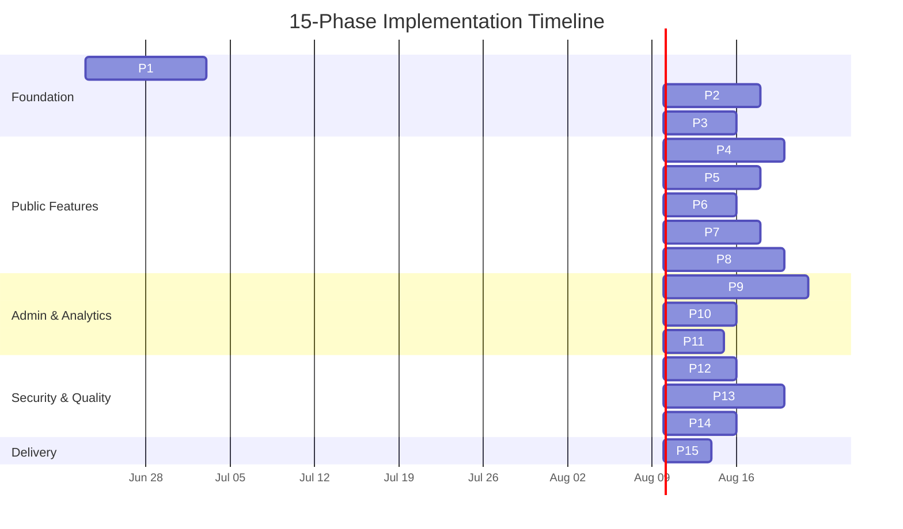

### 1.4 Task Count & Effort Summary

| Phase               | Core Tasks | Verification Tasks | Total Tasks | Est. Effort (Days) | Files Created | Files Modified |
| ------------------- | ---------- | ------------------ | ----------- | ------------------ | ------------- | -------------- |
| P1: Infrastructure  | 22         | 6                  | 28          | 10                 | ~60           | ~15            |
| P2: Design System   | 16         | 4                  | 20          | 8                  | ~25           | ~10            |
| P3: Core Layout     | 11         | 3                  | 14          | 6                  | ~10           | ~5             |
| P4: Homepage        | 14         | 4                  | 18          | 10                 | ~15           | ~5             |
| P5: Projects        | 11         | 3                  | 14          | 8                  | ~8            | ~3             |
| P6: Case Studies    | 8          | 2                  | 10          | 6                  | ~5            | ~2             |
| P7: Blog            | 10         | 2                  | 12          | 8                  | ~8            | ~2             |
| P8: AI Assistant    | 12         | 4                  | 16          | 10                 | ~15           | ~5             |
| P9: Admin Dashboard | 17         | 5                  | 22          | 12                 | ~20           | ~8             |
| P10: Analytics      | 10         | 2                  | 12          | 6                  | ~8            | ~5             |
| P11: Monitoring     | 8          | 2                  | 10          | 5                  | ~5            | ~5             |
| P12: Security       | 10         | 2                  | 12          | 6                  | ~5            | ~8             |
| P13: Testing        | 15         | 5                  | 20          | 10                 | ~30           | ~5             |
| P14: Performance    | 10         | 2                  | 12          | 6                  | ~5            | ~10            |
| P15: Deployment     | 8          | 2                  | 10          | 4                  | ~5            | ~3             |
| **Total**           | **182**    | **48**             | **230**     | **~115**           | **~224**      | **~91**        |

### 1.5 Constitution Compliance Traceability

| Constitution §                                    | Verified By         | Phases              |
| ---------------------------------------------------- | ------------------- | ------------------- |
| §2 Architecture Rules (ARC-001–008)        | Architecture review | P1, P3, P8, P9, P15 |
| §3 Coding Standards (COD-001–015)          | ESLint + CI         | All                 |
| §5 Naming Standards (NAM-001–019)          | Code review         | All                 |
| §6 TypeScript Standards (TS-001–010)       | tsconfig + CI       | P1, P13             |
| §7 React Standards (REACT-001–012)         | Code review         | P2–P9        |
| §8 Next.js Standards (NEXT-001–009)        | Code review         | P3–P7, P9    |
| §9 Database Standards (DB-001–015)         | Migration testing   | P1                  |
| §10 API Standards (API-001–011)            | Swagger + tests     | P1, P5, P8, P9      |
| §11 Security Standards (SEC-001–006)       | CI + manual audit   | P12                 |
| §12 Accessibility Standards (A11Y-001–018) | axe-core + manual   | P3–P7, P9    |
| §13 Performance Standards (PERF-001–010)   | Lighthouse CI       | P14                 |
| §16 Testing Standards (TST-001–010)        | CI coverage gates   | P13                 |
| §19 Deployment Standards (DEP-001–010)     | CI/CD + runbook     | P15                 |
| §20 AI Development Standards (AI-001–010)  | AI safety tests     | P8                  |
| §21 Forbidden Practices (FP-001–015)       | Code review + CI    | All                 |
| §22 Quality Gates (QG-001–024)             | CI pipeline         | P13, P15            |
| §23 Definition of Done (DoD-001–026)       | PR checklist        | All                 |

---

## 2. Dependency & Critical Path Analysis

### 2.1 High-Level Dependency Graph

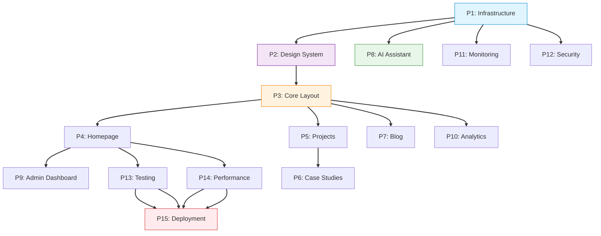

### 2.2 Critical Path

The critical path is the longest chain of dependent tasks that determines the minimum project duration:

```
P1 (10d) → P2 (8d) → P3 (6d) → P4 (10d) → P9 (12d) → P13 (10d) → P15 (4d)
```

**Critical path duration: 60 working days = 12 weeks**

All other phases can run in parallel with this critical path:

| Parallel Track A                                          | Parallel Track B | Parallel Track C | Merge Point                        |
| --------------------------------------------------------- | ---------------- | ---------------- | ---------------------------------- |
| P1 → P2 → P3 → P4 → P9 (crit) | P5 → P6   | P7               | P13 Testing                        |
| P1 → P3 → P8                                | P1 → P11  | P1 → P12  | P15 Deployment                     |
| P4 → P13 (crit)                                    | P4 → P14  | P9 → P10  | P15 Deployment                     |
| P5 → P6 → P9 (crit)                         | P3 → P10  | —          | P10 Analytics dashboard (after P9) |

### 2.3 Parallel Work Strategy

```mermaid
gantt
    title Parallel Execution Strategy
    dateFormat  YYYY-MM-DD
    axisFormat  %b %d

    section Critical Path
    P1: Infrastructure        :crit, p1, 2026-06-23, 10d
    P2: Design System         :crit, p2, after p1, 8d
    P3: Core Layout           :crit, p3, after p2, 6d
    P4: Homepage              :crit, p4, after p3, 10d
    P9: Admin Dashboard       :crit, p9, after p4, 12d
    P13: Testing              :crit, p13, after p4, 10d
    P15: Deployment           :crit, p15, after p13, 4d

    section Parallel Track A
    P5: Projects              :p5, after p3, 8d
    P6: Case Studies          :p6, after p5, 6d

    section Parallel Track B
    P7: Blog                  :p7, after p3, 8d
    P10: Analytics (events)    :p10, after p3, 3d
    P10: Analytics (dashboard)  :p10b, after p9, 3d

    section Parallel Track C
    P8: AI Assistant          :p8, after p1, 10d
    P11: Monitoring           :p11, after p1, 5d
    P12: Security             :p12, after p1, 6d
    P14: Performance          :p14, after p4, 6d
```

### 2.4 Milestone Map

| Milestone                 | Phases Complete | Estimated Date       | Deliverable                  | Quality Gate                |
| ------------------------- | --------------- | -------------------- | ---------------------------- | --------------------------- |
| **M1: Foundation Set**    | P1              | Jun 26 + 10d = Jul 8 | Monorepo, DB, Integrations   | QG-001–004 pass      |
| **M2: UI Foundation**     | P2              | Jul 8 + 8d = Jul 18  | Design tokens, 10 components | DSG-001–009 verified |
| **M3: App Shell Live**    | P3              | Jul 18 + 6d = Jul 26 | Layout, Nav, Footer, Routes  | A11Y-001–018 pass    |
| **M4: Public Face Live**  | P4              | Jul 26 + 10d = Aug 7 | Homepage with all sections   | Lighthouse > 90             |
| **M5: Content Features**  | P5, P6, P7      | Aug 7 + 14d = Aug 21 | Projects, Case Studies, Blog | E2E flows pass              |
| **M6: AI Service Live**   | P8              | Jul 8 + 10d = Jul 20 | Chat, RAG, Analysis          | AI-001–010 verified  |
| **M7: Admin Complete**    | P9              | Aug 7 + 12d = Aug 21 | Admin Dashboard, CMS, Leads  | CR-001–010 passed    |
| **M8: Observability**     | P10, P11        | Jul 26 + 11d = Aug 6 | Analytics, Monitoring        | Dashboards live             |
| **M9: Security Hardened** | P12             | Jul 8 + 6d = Jul 16  | Security headers, Rate limit | SHD A+ grade                |
| **M10: Quality Verified** | P13, P14        | Aug 7 + 16d = Aug 25 | Tests, Performance           | QG-001–020 all green |
| **M11: Production Live**  | P15             | Aug 25 + 4d = Aug 29 | Production deployment        | QG-021–024 pass      |

---

## 3. Phase 1: Infrastructure

> **Duration:** 10 days | **Dependencies:** None | **Constitution:** §2 ARC-001–008, §3 COD-001–015, §6 TS-001–010, §9 DB-001–015, §10 API-001–011  
> **Audit Findings Remediated:** H-03 (TS strict mode), H-05 (ESLint rules), M-04 (ADR dir)

### 3.1 Objectives

1. Initialize the monorepo with Turborepo, npm workspaces, and all tooling
2. Configure TypeScript strict mode per Constitution §6.1 (fixing audit finding H-03)
3. Harden ESLint rules per Constitution §3.1 (fixing audit finding H-05)
4. Create complete database schema with 37 tables, RLS policies, indexes, FTS
5. Set up all 13 external service integrations with credentials and SDKs
6. Configure Docker compose for local development
7. Create ADR directory (fixing audit finding M-04)

### 3.2 Deliverables

| ID     | Deliverable                                                           | Constitution §         | Audit Finding         | Est. Effort |
| ------ | --------------------------------------------------------------------- | ------------------------- | --------------------- | ----------- |
| P1-D01 | Turborepo monorepo with npm workspaces                                | §2 ARC-001             | —               | 4h          |
| P1-D02 | TypeScript strict config (all apps + packages)                        | §6 TS-001              | H-03                  | 4h          |
| P1-D03 | ESLint hardened config (`no-console: error`, `no-unused-vars: error`) | §3 COD-002, COD-008    | H-05                  | 2h          |
| P1-D04 | Prettier config matching COD-003–007                           | §3 COD-003–007  | L-01                  | 1h          |
| P1-D05 | `apps/web` scaffold (Next.js 14 + TypeScript + Tailwind)              | §8 NEXT-001–009 | —               | 4h          |
| P1-D06 | `apps/api` scaffold (NestJS 10 + TypeScript)                          | §2 ARC-002             | —               | 4h          |
| P1-D07 | `apps/ai` scaffold (FastAPI + Python)                                 | §2 ARC-003             | —               | 3h          |
| P1-D08 | `packages/shared` with shared types                                   | §6 TS-007, TS-008      | M-01 (fix snake_case) | 4h          |
| P1-D09 | `packages/ui` with base utilities (cn.ts)                             | §3 COD                 | —               | 2h          |
| P1-D10 | `packages/config` with ESLint + TS config                             | §3, §6              | H-03, H-05            | 2h          |
| P1-D11 | Complete DB migration set (17 migrations, 37 tables)                  | §9 DB-001–015   | —               | 20h         |
| P1-D12 | RLS policies for all 37 tables                                        | §9 DB-010              | —               | 6h          |
| P1-D13 | Indexes (PK, unique, composite, GIN, IVFFlat, trigram)                | §9 DB-007, DB-008      | —               | 4h          |
| P1-D14 | Full-text search configuration                                        | §9 DB                  | —               | 3h          |
| P1-D15 | Seed data script (realistic demo data)                                | §9 DB                  | —               | 4h          |
| P1-D16 | Supabase project + client SDKs (JS + Python)                          | §2 ARC-004             | —               | 4h          |
| P1-D17 | Resend email service setup                                            | §10 API                | —               | 2h          |
| P1-D18 | OpenAI + Anthropic API setup with model router                        | §20 AI-001–010  | —               | 4h          |
| P1-D19 | PostHog project + SDK configuration                                   | §10 API                | —               | 2h          |
| P1-D20 | Sentry project setup (web + api + ai)                                 | §11                    | —               | 3h          |
| P1-D21 | Docker compose for local development                                  | §2 ARC                 | —               | 3h          |
| P1-D22 | ADR directory (`docs/27-decisions/`)                                  | §17 DOC-010            | M-04                  | 1h          |

### 3.3 Dependency Graph

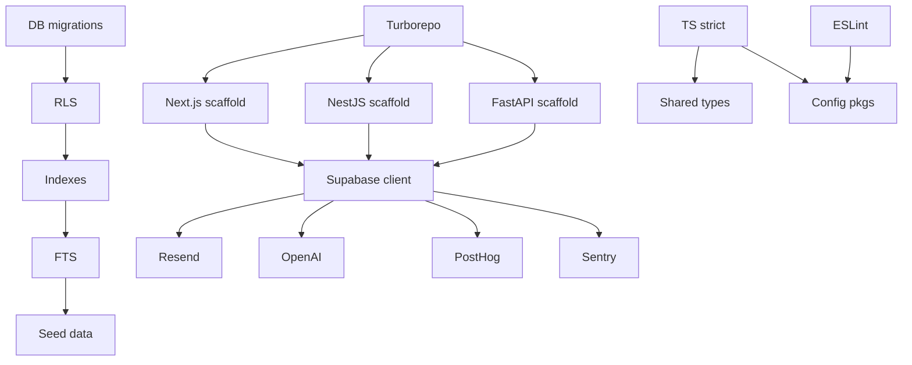

### 3.4 Risks

| Risk                                      | Likelihood | Impact | Mitigation                                         |
| ----------------------------------------- | ---------- | ------ | -------------------------------------------------- |
| Database migration conflicts              | Low        | High   | Sequential migration files with testing on staging |
| TypeScript strict mode compilation errors | Medium     | Medium | Incremental adoption per app; fix in this phase    |
| Supabase free tier limits during setup    | Low        | Medium | Clean up test data regularly                       |
| OpenAI cost during development            | Medium     | Low    | Set hard budget cap of $10/month; use mock for dev |

### 3.5 Validation Criteria

| ID    | Criterion                                                         | Verification Method | QG Reference         |
| ----- | ----------------------------------------------------------------- | ------------------- | -------------------- |
| P1-V1 | `turbo build` succeeds across all 3 apps                          | CI build            | QG-010               |
| P1-V2 | `tsc --noEmit` passes with strict mode (0 errors)                 | CI typecheck        | QG-001, QG-005       |
| P1-V3 | ESLint passes with 0 errors, 0 warnings                           | CI lint             | QG-002, QG-006       |
| P1-V4 | All 17 DB migrations applied without errors                       | Supabase CLI        | QG-013               |
| P1-V5 | RLS policies verified (anon + authenticated roles)                | Test queries        | —              |
| P1-V6 | All 13 integration health checks pass                             | Health check script | —              |
| P1-V7 | Docker compose starts all services locally                        | Manual test         | —              |
| P1-V8 | Shared types importable in both web and api apps                  | Build test          | —              |
| P1-V9 | ADR directory exists with README template at `docs/27-decisions/` | File system check   | §17 DOC-010, M-04 |

### 3.6 Definition of Done

- [ ] Monorepo builds and typechecks with strict TS config (CFG-003–010 fixed)
- [ ] ESLint reports 0 errors and 0 warnings (COD-002, COD-008 fixed)
- [ ] All 37 database tables created with correct columns, types, and constraints
- [ ] All 50+ indexes created (PK, unique, composite, GIN, IVFFlat)
- [ ] All RLS policies active and verified for both anon and authenticated roles
- [ ] Full-text search functional on `blog_posts` and `projects`
- [ ] 13 integrations configured with valid credentials and health checks passing
- [ ] Docker compose environment fully functional
- [ ] ADR directory created with README

### 3.7 Estimated Effort

**Total: 10 days** (infrastructure tasks: 6 days, database: 3 days, integrations: 1 day)

---

## 4. Phase 2: Design System

> **Duration:** 8 days | **Dependencies:** P1 | **Constitution:** §7 REACT-001–012, §14 ANIM-001–010, §15 DSG-001–009  
> **Audit Findings Remediated:** H-01 (hardcoded colors), M-03 (border radius)

### 4.1 Objectives

1. Implement all 120+ design tokens as CSS custom properties and Tailwind extensions
2. Build the 10-component catalog (Button, Card, Input, Badge, Modal, Toast, Table, Tabs, Avatar, Skeleton)
3. Fix hardcoded color audit findings (H-01) — refactor all UI components to use tokens
4. Fix border radius inconsistency (M-03) — align with radius tokens
5. Implement theme system (light/dark) with CSS custom properties
6. Implement glassmorphism utilities
7. Create component decision records

### 4.2 Deliverables

| ID     | Deliverable                                                                                       | Constitution §          | Audit Finding | Est. Effort |
| ------ | ------------------------------------------------------------------------------------------------- | -------------------------- | ------------- | ----------- |
| P2-D01 | CSS custom properties for all tokens (globals.css)                                                | §15 DSG-001             | H-01, M-03    | 4h          |
| P2-D02 | Tailwind theme extension (colors, fonts, spacing, shadows, animation, radius)                     | §15 DSG-001             | H-01          | 4h          |
| P2-D03 | Glassmorphism plugin (3 levels: subtle, medium, prominent)                                        | §15 DSG-007             | —       | 2h          |
| P2-D04 | `cn()` utility (clsx + tailwind-merge)                                                            | §15 DSG-002             | —       | 1h          |
| P2-D05 | **Button** — 5 variants, 4 sizes, icon support, loading state, a11y                         | §7 REACT-001–012 | H-01          | 4h          |
| P2-D06 | **Card** — 5 variants, sub-components (Header, Body, Footer), 4 sizes                       | §7 REACT-001–012 | H-01, M-03    | 4h          |
| P2-D07 | **Input** — Composable (Wrapper, Label, Field, Error, Helper), icon slots                   | §7 REACT-001–012 | H-01          | 4h          |
| P2-D08 | **Badge** — 6 semantic variants, 3 sizes, dismissible, interactive                          | §7 REACT-001–012 | —       | 2h          |
| P2-D09 | **Modal** — 5 sizes, focus trap, keyboard dismiss, portal rendering                         | §7 REACT-001–012 | —       | 4h          |
| P2-D10 | **Toast** — 4 variants, auto-dismiss, provider pattern, imperative API                      | §7 REACT-001–012 | —       | 3h          |
| P2-D11 | **Table** — 3 variants, sortable columns, selection, pagination, responsive card view       | §7 REACT-001–012 | —       | 4h          |
| P2-D12 | **Tabs** — 3 variants, full keyboard nav, lazy content loading                              | §7 REACT-001–012 | —       | 3h          |
| P2-D13 | **Avatar** — 5 sizes, initials fallback, status indicator, image error handling             | §7 REACT-001–012 | —       | 2h          |
| P2-D14 | **Skeleton** — 7 shape variants, shimmer animation, reduced motion respect                  | §7 REACT-001–012 | —       | 2h          |
| P2-D15 | Theme system (light/dark toggle, system preference detection, localStorage persistence, no flash) | §15 DSG-003             | —       | 3h          |
| P2-D16 | Accessibility hooks (useFocusTrap, useReducedMotion, useFocusOnMount)                             | §12 A11Y-001, A11Y-006  | —       | 3h          |

### 4.3 Dependency Graph

```mermaid
graph TB
    P2-D01[CSS Tokens] --> P2-D02[Tailwind Ext]
    P2-D01 --> P2-D03[Glassmorphism]
    P2-D04[cn()] --> P2-D05[Button]
    P2-D04 --> P2-D06[Card]
    P2-D04 --> P2-D07[Input]
    P2-D04 --> P2-D08[Badge]
    P2-D04 --> P2-D09[Modal]
    P2-D04 --> P2-D10[Toast]
    P2-D04 --> P2-D11[Table]
    P2-D04 --> P2-D12[Tabs]
    P2-D04 --> P2-D13[Avatar]
    P2-D04 --> P2-D14[Skeleton]
    P2-D15[Theme] --> P2-D05
    P2-D15 --> P2-D06
    P2-D15 --> P2-D07
    P2-D16[Hooks] --> P2-D09
    P2-D16 --> P2-D12
```

### 4.4 Risks

| Risk                                                  | Likelihood | Impact | Mitigation                                                      |
| ----------------------------------------------------- | ---------- | ------ | --------------------------------------------------------------- |
| Design token conflicts with existing hardcoded values | High       | Medium | Systematic replacement; verify each component visually          |
| Theme flash on page load                              | Medium     | High   | Use inline script to set `data-theme` before React hydrates     |
| Component API redesign mid-phase                      | Low        | Medium | Lock component APIs in design system spec before implementation |

### 4.5 Validation Criteria

| ID    | Criterion                                                    | Verification Method      |
| ----- | ------------------------------------------------------------ | ------------------------ |
| P2-V1 | All 120+ tokens accessible via CSS vars and Tailwind classes | Token audit script       |
| P2-V2 | All 10 components render all variants without errors         | Storybook or test render |
| P2-V3 | Theme toggle switches light/dark with no flash               | Manual test              |
| P2-V4 | No hardcoded Tailwind color classes remain in UI components  | Code search audit        |

### 4.6 Definition of Done

- [ ] All 120+ design tokens implemented in CSS custom properties and Tailwind extension
- [ ] All 10 components implemented with full variant/size/state coverage
- [ ] All hardcoded Tailwind color classes replaced with design tokens (H-01 fixed)
- [ ] Border radius values use radius tokens (M-03 fixed)
- [ ] Theme system working: system preference → localStorage → toggle → no flash
- [ ] Glassmorphism utilities available
- [ ] Accessibility hooks created and documented
- [ ] Component decision records updated

### 4.7 Estimated Effort

**Total: 8 days** (tokens + config: 2 days, components: 5 days, theme + hooks: 1 day)

---

## 5. Phase 3: Core Layout

> **Duration:** 6 days | **Dependencies:** P2 | **Constitution:** §8 NEXT-001–009, §12 A11Y-001–018, §14 ANIM-001–010

### 5.1 Objectives

1. Implement RootLayout with all providers (Theme, PostHog, Lenis)
2. Build Navigation (sticky header, mobile hamburger, active section tracking)
3. Build Footer (social links, copyright, back-to-top)
4. Implement skip link for keyboard accessibility
5. Create route structure with loading.tsx and error.tsx per segment
6. Implement page transition animations
7. Set up metadata defaults and Open Graph

### 5.2 Deliverables

| ID     | Deliverable                                                             | Constitution §               | Est. Effort |
| ------ | ----------------------------------------------------------------------- | ------------------------------- | ----------- |
| P3-D01 | RootLayout with ThemeProvider, PostHog, Lenis                           | §8 NEXT-001, NEXT-002        | 4h          |
| P3-D02 | Navigation (sticky, backdrop-blur, active section, smooth scroll)       | §8 NEXT-003, §12 A11Y-006 | 4h          |
| P3-D03 | Mobile hamburger menu (slide-in drawer, focus trap)                     | §12 A11Y-006, A11Y-008       | 3h          |
| P3-D04 | Footer (social links, copyright, back-to-top)                           | §8 NEXT                      | 2h          |
| P3-D05 | Skip link component                                                     | §12 A11Y-007                 | 1h          |
| P3-D06 | Loading.tsx per route segment (skeleton placeholders)                   | §8 NEXT-008                  | 2h          |
| P3-D07 | Error.tsx per route segment (error boundaries with retry)               | §8 NEXT-008                  | 2h          |
| P3-D08 | Metadata defaults (title template, OG, Twitter, robots)                 | §8 NEXT                      | 2h          |
| P3-D09 | Page transition animations (AnimatePresence)                            | §14 ANIM-002, ANIM-008       | 2h          |
| P3-D10 | Route structure scaffold (projects/[slug], blog/[slug], contact, admin) | §8 NEXT-001                  | 2h          |
| P3-D11 | Not-found.tsx (404 page)                                                | §8 NEXT-007                  | 1h          |

### 5.3 Dependencies

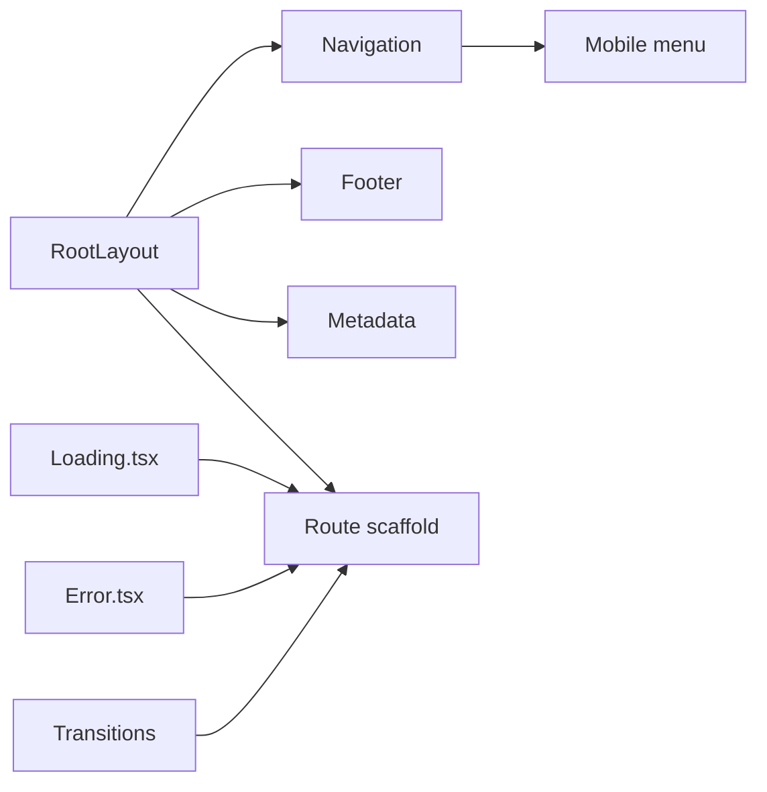

### 5.4 Risks

| Risk                                                | Likelihood | Impact | Mitigation                                        |
| --------------------------------------------------- | ---------- | ------ | ------------------------------------------------- |
| Lenis smooth scroll conflicts with browser behavior | Medium     | Medium | Feature flag to disable; test with reduced motion |
| Mobile menu focus trap not working on all devices   | Low        | Medium | Test on iOS Safari, Android Chrome, desktop       |
| Theme flash on initial page load                    | Medium     | High   | Critical blocking script in `<head>`              |

### 5.5 Validation Criteria

| ID    | Criterion                                                   | Verification Method       |
| ----- | ----------------------------------------------------------- | ------------------------- |
| P3-V1 | Navigation scrolls smoothly to sections with correct offset | Manual test               |
| P3-V2 | Mobile menu opens/closes, focus trapped, Esc dismisses      | Manual + a11y test        |
| P3-V3 | Skip link visible on Tab, jumps to main content             | Manual keyboard test      |
| P3-V4 | Loading states render for each route segment                | DevTools network throttle |
| P3-V5 | Error states render with retry button                       | Trigger error manually    |
| P3-V6 | Lighthouse Accessibility score ≥ 95                   | Lighthouse CI             |
| P3-V7 | All routes render without 404 or crash                      | Smoke test                |

### 5.6 Definition of Done

- [ ] RootLayout with all providers rendering without errors
- [ ] Navigation sticky, backdrop-blur, active section tracking
- [ ] Mobile menu functional with focus trap and keyboard dismiss
- [ ] Skip link renders first, visible on focus
- [ ] loading.tsx and error.tsx for all public route segments
- [ ] Metadata defaults producing correct `<head>` output
- [ ] Page transitions working with reduced motion respect
- [ ] 404 page with navigation back to home

### 5.7 Estimated Effort

**Total: 6 days** (layout + providers: 1 day, navigation: 1.5 days, route infrastructure: 2 days, transitions + metadata: 1.5 days)

---

## 6. Phase 4: Homepage

> **Duration:** 10 days | **Dependencies:** P3 | **Constitution:** §8 NEXT-001–009, §12 A11Y-001–018, §13 PERF-001–010, §14 ANIM-001–010  
> **Audit Findings Remediated:** H-02 (placeholder files)

### 6.1 Objectives

1. Implement all 10 homepage sections with real content (fixing audit finding H-02)
2. Achieve Lighthouse Performance ≥ 90, Accessibility ≥ 95
3. Implement ISR with 60s revalidation for all sections
4. Implement scroll-triggered animations respecting reduced motion
5. Implement contact form with validation, hCaptcha, and lead submission
6. Ensure all sections are responsive at all breakpoints

### 6.2 Deliverables

| ID     | Deliverable                                                                             | Constitution §               | Audit Finding | Est. Effort |
| ------ | --------------------------------------------------------------------------------------- | ------------------------------- | ------------- | ----------- |
| P4-D01 | **Hero Section** — Name, title, 3D background (Three.js/R3F), CTAs, social links  | §8 NEXT-001, §13 PERF-003 | H-02          | 8h          |
| P4-D02 | **About Section** — Bio, profile image, stat counters, resume download            | §12 A11Y-001                 | H-02          | 4h          |
| P4-D03 | **Skills Section** — Filterable progress bars, category grouping, hover states    | §14 ANIM-002                 | H-02          | 4h          |
| P4-D04 | **Experience Timeline** — Vertical timeline, staggered reveal, expandable entries | §14 ANIM-004, ANIM-010       | H-02          | 4h          |
| P4-D05 | **Featured Projects Carousel** — Auto-advance, touch swipe, keyboard nav          | §12 A11Y-014                 | H-02          | 4h          |
| P4-D06 | **Testimonials Carousel** — Cards, star rating, auto-play with hover pause        | §12 A11Y-015                 | H-02          | 4h          |
| P4-D07 | **Blog Preview** — Latest 3 posts with featured images                            | §8 NEXT-004                  | H-02          | 3h          |
| P4-D08 | **Services Section** — Pricing cards, feature lists, CTA                          | §12 A11Y-006                 | H-02          | 3h          |
| P4-D09 | **FAQ Accordion** — Expand/collapse, keyboard accessible, rich text answers       | §12 A11Y-008, A11Y-013       | H-02          | 3h          |
| P4-D10 | **Contact Form** — Name, Email, Message, validation, hCaptcha, success animation  | §12 A11Y-012, A11Y-013       | H-02          | 6h          |
| P4-D11 | `page.tsx` (ISR 60s) composing all sections                                             | §8 NEXT-001, NEXT-006        | H-02          | 2h          |
| P4-D12 | Scroll-triggered section animations (Intersection Observer + Motion)                    | §14 ANIM-004, ANIM-008       | —       | 4h          |

### 6.3 Dependencies

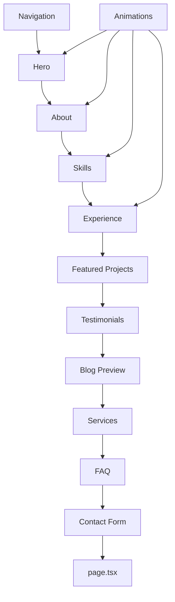

### 6.4 Risks

| Risk                                             | Likelihood | Impact | Mitigation                                           |
| ------------------------------------------------ | ---------- | ------ | ---------------------------------------------------- |
| 3D background (Three.js) affects LCP performance | Medium     | High   | Dynamic import with SSR disabled; use fallback image |
| Contact form spam                                | Medium     | Medium | Honeypot + rate limiting + hCaptcha                  |
| Animation performance on mobile                  | Medium     | Medium | Test on mid-range device; reduce particle count      |

### 6.5 Validation Criteria

| ID    | Criterion                                                                   | Verification Method |
| ----- | --------------------------------------------------------------------------- | ------------------- |
| P4-V1 | Lighthouse Performance ≥ 90, Accessibility ≥ 95, SEO ≥ 95 | Lighthouse CI       |
| P4-V2 | All 10 sections render correctly at mobile, tablet, desktop                 | Responsive test     |
| P4-V3 | Contact form submits → lead created → success message shown   | End-to-end test     |
| P4-V4 | Keyboard Tab navigates through all sections and interactive elements        | Manual test         |
| P4-V5 | Animations disabled when `prefers-reduced-motion: reduce`                   | DevTools test       |
| P4-V6 | ISR caching: second load returns `x-vercel-cache: HIT`                      | Network test        |

### 6.6 Definition of Done

- [ ] All 10 homepage sections implemented with real API data fetching
- [ ] 3D hero background renders at 60fps with dynamic import
- [ ] Contact form with client + server validation, hCaptcha, and success flow
- [ ] All sections keyboard navigable and screen-reader accessible
- [ ] Scroll animations respect reduced motion
- [ ] Responsive at all breakpoints (320px to 2560px)
- [ ] Lighthouse scores: Performance ≥ 90, Accessibility ≥ 95, SEO ≥ 95
- [ ] Placeholder files replaced with real implementations (H-02 fixed)

### 6.7 Estimated Effort

**Total: 10 days** (Hero + 3D: 2 days, sections 2–6: 3 days, sections 7–10: 2.5 days, animations + polish: 2.5 days)

---

## 7. Phase 5: Projects

> **Duration:** 8 days | **Dependencies:** P3 | **Constitution:** §8 NEXT-001–009, §10 API-001–011, §12 A11Y-001–018

### 7.1 Objectives

1. Implement Projects listing page with ISR (60s) and filterable grid
2. Implement Project detail page with ISR (60s) and `generateStaticParams`
3. Implement multi-dimensional filter system (category, technology, year)
4. Implement image gallery with lightbox
5. Add JSON-LD structured data (SoftwareApplication schema)
6. Ensure all project pages are responsive and accessible

### 7.2 Deliverables

| ID     | Deliverable                                                        | Constitution §         | Est. Effort |
| ------ | ------------------------------------------------------------------ | ------------------------- | ----------- |
| P5-D01 | Projects API endpoints (CRUD + filtering + search)                 | §10 API-001–011 | 6h          |
| P5-D02 | Project grid page with ISR 60s                                     | §8 NEXT-001, NEXT-006  | 4h          |
| P5-D03 | ProjectCard component (image, title, tech badges, hover elevation) | §12 A11Y-001           | 3h          |
| P5-D04 | Project filter system (category, technology, year, URL-synced)     | §8 NEXT                | 3h          |
| P5-D05 | Project detail page with `generateStaticParams`                    | §8 NEXT-006            | 4h          |
| P5-D06 | Image gallery with lightbox                                        | §12 A11Y-014           | 3h          |
| P5-D07 | Tech badge list with hover descriptions                            | §12 A11Y-001           | 2h          |
| P5-D08 | Related projects section                                           | §8 NEXT                | 2h          |
| P5-D09 | JSON-LD structured data (SoftwareApplication)                      | §27 SEO                | 2h          |
| P5-D10 | Prev/next project navigation                                       | §8 NEXT                | 1h          |
| P5-D11 | Loading skeleton + error state per page                            | §8 NEXT-008            | 2h          |

### 7.3 Dependencies

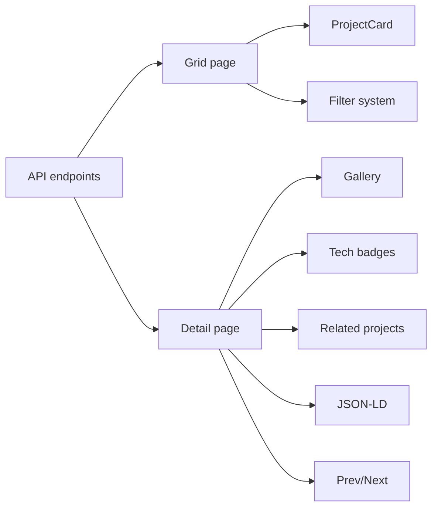

### 7.4 Risks

| Risk                                         | Likelihood | Impact | Mitigation                                        |
| -------------------------------------------- | ---------- | ------ | ------------------------------------------------- |
| Large project images slow page load          | Medium     | Medium | Next/Image with WebP conversion; lazy loading     |
| Filter system complexity with URL sync       | Low        | Medium | Use URLSearchParams; test all filter combinations |
| `generateStaticParams` builds too many pages | Low        | Low    | Limit to first 50 projects; fallback to ISR       |

### 7.5 Validation Criteria

| ID    | Criterion                                                  | Verification Method |
| ----- | ---------------------------------------------------------- | ------------------- |
| P5-V1 | Project grid loads, filters work, URL updates              | Manual test         |
| P5-V2 | Project detail renders with all content                    | Manual test         |
| P5-V3 | Gallery opens lightbox, closes on Esc/overlay click        | Manual + a11y test  |
| P5-V4 | ISR: first load fetches fresh, subsequent loads from cache | Network tab         |
| P5-V5 | JSON-LD validates on Google Rich Results Test              | Google tool         |
| P5-V6 | All filter combinations return correct results             | Automated test      |

### 7.6 Definition of Done

- [ ] Projects listing page with filterable grid and ISR 60s
- [ ] Project detail page with `generateStaticParams` and ISR 60s
- [ ] Image gallery with lightbox (keyboard + screen reader accessible)
- [ ] JSON-LD structured data for all project pages
- [ ] Responsive at all breakpoints
- [ ] Loading skeletons + error states implemented

### 7.7 Estimated Effort

**Total: 8 days** (API: 1.5 days, grid + filters: 2 days, detail + gallery: 3 days, polish: 1.5 days)

---

## 8. Phase 6: Case Studies

> **Duration:** 6 days | **Dependencies:** P5 | **Constitution:** §17 DOC-001–010, §8 NEXT-001–009

### 8.1 Objectives

1. Implement in-depth case study format (Problem → Approach → Solution → Impact)
2. Add architecture diagrams (Mermaid) to case studies
3. Implement before/after metrics with visual indicators
4. Add code snippets with syntax highlighting
5. Implement print-friendly styles
6. Add client testimonial section within case studies

### 8.2 Deliverables

| ID     | Deliverable                                                                          | Constitution §         | Est. Effort |
| ------ | ------------------------------------------------------------------------------------ | ------------------------- | ----------- |
| P6-D01 | Case Study API module (extend or separate table)                                     | §10 API-001–011 | 4h          |
| P6-D02 | Case Study detail page (Problem → Approach → Solution → Impact) | §17 DOC-005            | 6h          |
| P6-D03 | Architecture diagram renderer (Mermaid in React)                                     | §17 DOC-005            | 3h          |
| P6-D04 | Before/after metrics with animated counters                                          | §14 ANIM-004           | 3h          |
| P6-D05 | Code snippet component with syntax highlighting                                      | §12 A11Y-001           | 3h          |
| P6-D06 | Client testimonial embed within case study                                           | §12 A11Y-015           | 2h          |
| P6-D07 | Print-friendly styles                                                                | §12 A11Y-013           | 2h          |
| P6-D08 | Related case studies navigation                                                      | §8 NEXT-003            | 1h          |

### 8.3 Dependencies

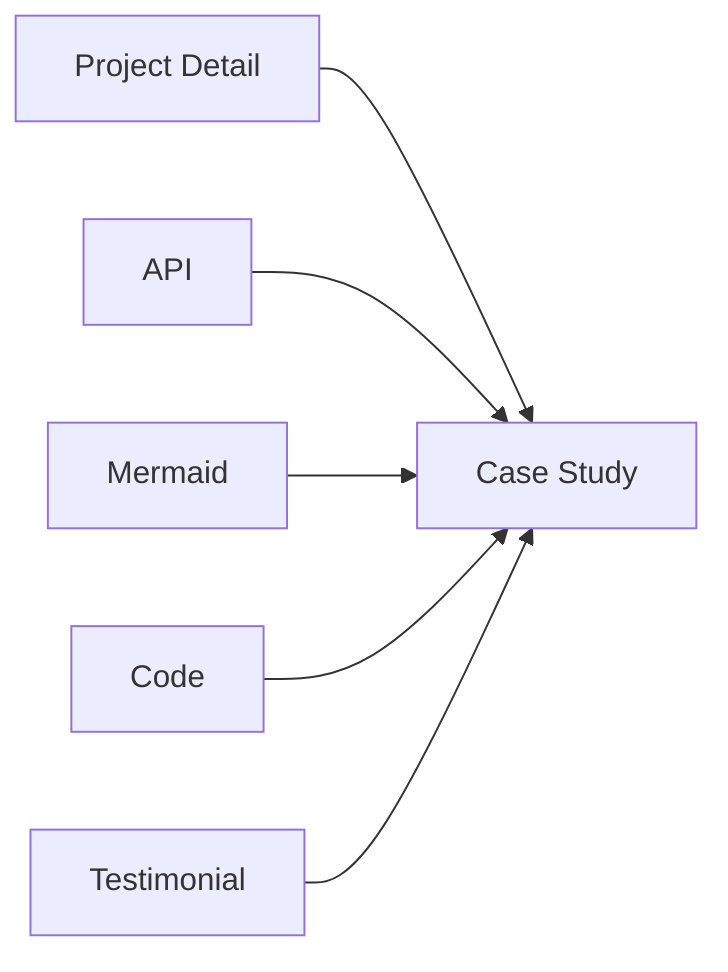

### 8.4 Risks

| Risk                                               | Likelihood | Impact | Mitigation                                                  |
| -------------------------------------------------- | ---------- | ------ | ----------------------------------------------------------- |
| Mermaid diagrams not rendering in all environments | Low        | Medium | Use server-side rendering; PNG fallback                     |
| Code syntax highlighting increases bundle size     | Medium     | Low    | Lazy load highlighter; use Prism with only needed languages |

### 8.5 Validation Criteria

| ID    | Criterion                                                                                       | Verification Method   |
| ----- | ----------------------------------------------------------------------------------------------- | --------------------- |
| P6-V1 | Case study renders all 4 sections (Problem → Solution → Approach → Impact) | Manual review         |
| P6-V2 | Mermaid diagrams render correctly                                                               | Visual inspection     |
| P6-V3 | Code snippets highlight correctly                                                               | Visual inspection     |
| P6-V4 | Print preview shows clean, readable layout                                                      | Browser print preview |
| P6-V5 | Before/after metrics animate on scroll                                                          | Manual test           |

### 8.6 Definition of Done

- [ ] Case study format: Problem → Approach → Solution → Impact
- [ ] Mermaid diagrams rendering for technical architecture
- [ ] Code snippets with syntax highlighting (top 5 languages)
- [ ] Before/after metrics with animated counters
- [ ] Client testimonial section within case study
- [ ] Print-friendly styles producing clean output

### 8.7 Estimated Effort

**Total: 6 days** (API: 1 day, core page: 2 days, features: 2 days, polish: 1 day)

---

## 9. Phase 7: Blog

> **Duration:** 8 days | **Dependencies:** P3 | **Constitution:** §8 NEXT-001–009, §12 A11Y-001–018, §27 SEO

### 9.1 Objectives

1. Implement Blog listing page with ISR (300s) and pagination
2. Implement Blog article page with Markdown rendering, syntax highlighting, TOC
3. Implement JSON-LD structured data (BlogPosting schema)
4. Implement RSS feed
5. Implement reading progress indicator
6. Ensure all blog pages are SEO-optimized

### 9.2 Deliverables

| ID     | Deliverable                                                             | Constitution §         | Est. Effort |
| ------ | ----------------------------------------------------------------------- | ------------------------- | ----------- |
| P7-D01 | Blog API endpoints (CRUD, publish/unpublish, tags, search)              | §10 API-001–011 | 6h          |
| P7-D02 | Blog listing page (ISR 300s, pagination, filterable by tag)             | §8 NEXT-001, NEXT-006  | 4h          |
| P7-D03 | BlogCard component (cover image, title, excerpt, date, read time, tags) | §12 A11Y-001           | 2h          |
| P7-D04 | BlogArticle component (Markdown rendering, GFM, syntax highlighting)    | §17 DOC-005            | 6h          |
| P7-D05 | Table of contents with scroll tracking                                  | §12 A11Y-006           | 3h          |
| P7-D06 | Reading progress bar                                                    | §14 ANIM-002           | 1h          |
| P7-D07 | JSON-LD structured data (BlogPosting + Article schema)                  | §27 SEO                | 2h          |
| P7-D08 | RSS feed (dynamic XML generation)                                       | §27 SEO                | 2h          |
| P7-D09 | Share buttons (Twitter, LinkedIn, copy link)                            | §12 A11Y-001           | 2h          |
| P7-D10 | Author bio at article bottom                                            | §12 A11Y-013           | 1h          |
| P7-D11 | Related articles section                                                | §8 NEXT-003            | 2h          |
| P7-D12 | Loading skeleton + error state per page                                 | §8 NEXT-008            | 1h          |

### 9.3 Dependencies

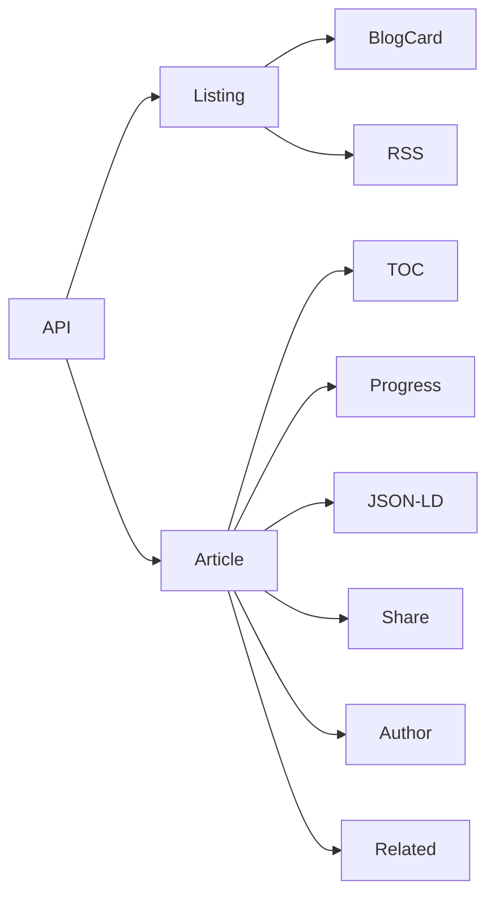

### 9.4 Risks

| Risk                                               | Likelihood | Impact | Mitigation                                                          |
| -------------------------------------------------- | ---------- | ------ | ------------------------------------------------------------------- |
| Markdown rendering performance with large articles | Low        | Medium | Lazy load below-the-fold content; use `react-markdown` with caching |
| RSS feed generation errors                         | Low        | Low    | Test feed validation with W3C validator                             |

### 9.5 Validation Criteria

| ID    | Criterion                                                           | Verification Method      |
| ----- | ------------------------------------------------------------------- | ------------------------ |
| P7-V1 | Blog listing paginates correctly                                    | Manual test              |
| P7-V2 | Markdown renders with all features (headings, code, tables, images) | Visual inspection        |
| P7-V3 | Table of contents highlights current section                        | Scroll test              |
| P7-V4 | RSS feed validates                                                  | W3C Feed Validation      |
| P7-V5 | JSON-LD validates                                                   | Google Rich Results Test |
| P7-V6 | Reading progress bar reaches 100% at article end                    | Manual test              |

### 9.6 Definition of Done

- [ ] Blog listing with pagination, tag filtering, and ISR 300s
- [ ] Blog article with full Markdown rendering
- [ ] Table of contents with scroll tracking
- [ ] Reading progress bar
- [ ] JSON-LD structured data
- [ ] RSS feed (valid RSS 2.0)
- [ ] Share buttons
- [ ] Responsive at all breakpoints

### 9.7 Estimated Effort

**Total: 8 days** (API: 1.5 days, listing: 1 day, article: 3 days, features: 2.5 days)

---

## 10. Phase 8: AI Assistant

> **Duration:** 10 days | **Dependencies:** P1, P3 | **Constitution:** §20 AI-001–010, §2 ARC-003, §11 SEC-001–006

### 10.1 Objectives

1. Implement FastAPI AI microservice with CORS, middleware, health checks
2. Implement RAG pipeline (pgvector, embeddings, retrieval, context assembly)
3. Implement chat endpoint with SSE streaming
4. Implement content analysis endpoint (readability, SEO, tone, keywords)
5. Implement model routing (OpenAI primary → Anthropic fallback)
6. Implement cost controller (daily/monthly budgets)
7. Build chat widget (floating button, message history, suggested questions)
8. Implement rate limiting (20 requests/session)

### 10.2 Deliverables

| ID     | Deliverable                                                              | Constitution §         | Est. Effort |
| ------ | ------------------------------------------------------------------------ | ------------------------- | ----------- |
| P8-D01 | FastAPI app with CORS, middleware, structured logging                    | §2 ARC-003             | 3h          |
| P8-D02 | AI Service (LangChain orchestration, model routing, fallback)            | §20 AI-001–010  | 6h          |
| P8-D03 | RAG Service (pgvector retrieval, context assembly, similarity threshold) | §20 AI-001             | 4h          |
| P8-D04 | Embedding Service (OpenAI embeddings, cache)                             | §20 AI-001             | 3h          |
| P8-D05 | Response Cache (hash-based, 1-hour TTL)                                  | §20 AI                 | 2h          |
| P8-D06 | Chat endpoint with SSE streaming                                         | §20 AI, §10 API     | 6h          |
| P8-D07 | Analyze endpoint (readability, SEO, tone, keywords)                      | §20 AI                 | 4h          |
| P8-D08 | Suggest endpoint (content generation)                                    | §20 AI                 | 3h          |
| P8-D09 | Health endpoint (integration statuses)                                   | §2 ARC                 | 1h          |
| P8-D10 | Rate limiting middleware (20 requests/session)                           | §11 SEC-006            | 2h          |
| P8-D11 | Cost Controller (daily $0.50, monthly $10 budgets)                       | §20 AI                 | 3h          |
| P8-D12 | Chat Widget (floating button, message history, suggested questions)      | §12 A11Y-001, A11Y-015 | 6h          |
| P8-D13 | Chat session management (30-day retention, auto-purge)                   | §20 AI-006             | 2h          |
| P8-D14 | Prompt injection protection (input sanitization)                         | §20 AI-002             | 2h          |
| P8-D15 | Output PII filter                                                        | §20 AI-003             | 1h          |
| P8-D16 | AI moderation logging (audit trail)                                      | §20 AI-010             | 1h          |

### 10.3 Dependencies

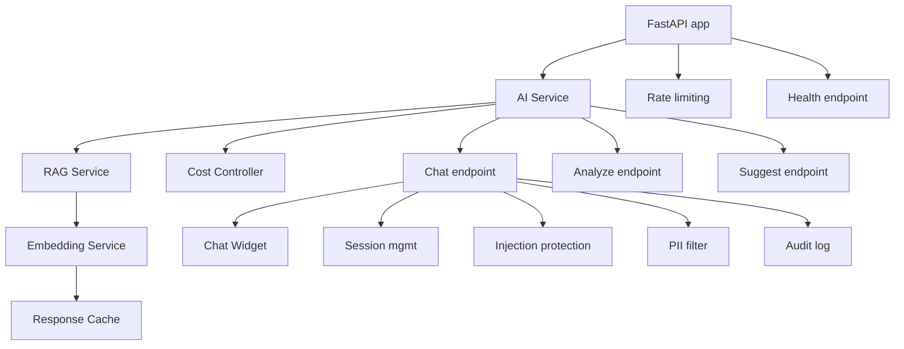

### 10.4 Risks

| Risk                     | Likelihood | Impact   | Mitigation                                                    |
| ------------------------ | ---------- | -------- | ------------------------------------------------------------- |
| OpenAI API cost overrun  | Medium     | High     | Hard budget cap; cost controller; response caching            |
| Prompt injection attacks | Medium     | Critical | Input sanitization; system prompt hardening; output filtering |
| SSE connection failures  | Low        | Medium   | Automatic reconnection; error message to user                 |
| LLM hallucination        | Medium     | Medium   | RAG grounding; confidence threshold; "I don't know" fallback  |

### 10.5 Validation Criteria

| ID    | Criterion                                                    | Verification Method          |
| ----- | ------------------------------------------------------------ | ---------------------------- |
| P8-V1 | Chat SSE streams token-by-token                              | Network tab + browser render |
| P8-V2 | RAG retrieval returns relevant portfolio chunks              | Manual query test            |
| P8-V3 | Model router falls back to Anthropic when OpenAI unavailable | Mock API failure             |
| P8-V4 | Cost controller blocks requests when budget exceeded         | Integration test             |
| P8-V5 | Content analysis returns correct readability, SEO, tone      | Manual verification          |
| P8-V6 | Rate limit returns 429 after 20 requests in session          | Load test                    |
| P8-V7 | Prompt injection attempts are blocked                        | Security test                |
| P8-V8 | Chat widget accessible (keyboard, screen reader)             | a11y audit                   |

### 10.6 Definition of Done

- [ ] FastAPI service responding on all endpoints
- [ ] SSE streaming chat working (token-by-token)
- [ ] RAG pipeline retrieving and assembling context
- [ ] Model routing: OpenAI primary → Anthropic fallback
- [ ] Cost controller with daily $0.50 and monthly $10 budgets
- [ ] Rate limiting: 20 requests/session
- [ ] Chat widget built, styled, accessible
- [ ] Prompt injection protection in place
- [ ] Conversation history with 30-day retention
- [ ] Content analysis and suggestion endpoints working

### 10.7 Estimated Effort

**Total: 10 days** (service infrastructure: 2 days, RAG + AI: 3 days, endpoints: 2 days, chat widget: 2 days, security + polish: 1 day)

---

## 11. Phase 9: Admin Dashboard

> **Duration:** 12 days | **Dependencies:** P4, P5, P6 | **Constitution:** §8 NEXT-001–009, §11 SEC-001–006, §18 CR-001–010, §23 DoD-001–026

### 11.1 Objectives

1. Implement admin authentication (NestJS Passport + JWT + OAuth)
2. Build admin layout (sidebar, header, route protection)
3. Implement Dashboard overview (stats, charts, recent leads)
4. Implement Section Manager (CRUD, visibility, reorder)
5. Implement CMS Editor (rich text, image upload, auto-save, preview)
6. Implement Lead Manager (table, filter, status, CSV export)
7. Implement Settings page
8. Implement ISR revalidation trigger

### 11.2 Deliverables

| ID     | Deliverable                                                             | Constitution §          | Est. Effort |
| ------ | ----------------------------------------------------------------------- | -------------------------- | ----------- |
| P9-D01 | NestJS Passport configuration (email/password + Google OAuth)           | §11 SEC-001             | 4h          |
| P9-D02 | Login page with validation, OAuth buttons, error states                 | §12 A11Y-012            | 3h          |
| P9-D03 | Admin layout (sidebar, header, route protection middleware)             | §8 NEXT-001, §11 SEC | 4h          |
| P9-D04 | Admin auth guard + JWT refresh handling                                 | §11 SEC-001             | 3h          |
| P9-D05 | Dashboard overview (stat cards, visitor chart, recent leads, top pages) | §23 DoD                 | 6h          |
| P9-D06 | Section List (visibility toggles, drag reorder, status indicators)      | §18 CR                  | 6h          |
| P9-D07 | Section Editor (rich text, style presets, auto-save, preview)           | §17 DOC-009             | 8h          |
| P9-D08 | Image Upload (drag-drop, WebP conversion, size validation, library)     | §11 SEC                 | 4h          |
| P9-D09 | Lead Inbox (table, search, filter, bulk actions, pagination)            | §10 API-006             | 6h          |
| P9-D10 | Lead Detail panel (message, source, timestamps, actions)                | §12 A11Y-013            | 3h          |
| P9-D11 | CSV Export (date range filter, auto-download)                           | §10 API                 | 2h          |
| P9-D12 | Settings page (system settings, theme, integrations)                    | §17 DOC                 | 3h          |
| P9-D13 | ISR Revalidation button (trigger cache purge)                           | §8 NEXT-006             | 2h          |
| P9-D14 | Password reset flow                                                     | §11 SEC-001             | 2h          |
| P9-D15 | Admin API client with JWT refresh                                       | §10 API                 | 3h          |
| P9-D16 | Project Manager (CRUD + image management)                               | §18 CR                  | 6h          |
| P9-D17 | Skill Manager (CRUD + category grouping)                                | §18 CR                  | 3h          |

### 11.3 Dependencies

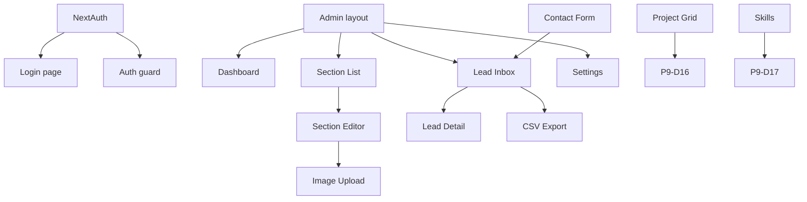

### 11.4 Risks

| Risk                                   | Likelihood | Impact   | Mitigation                                                    |
| -------------------------------------- | ---------- | -------- | ------------------------------------------------------------- |
| Auth token expiry during admin session | Medium     | Medium   | Silent JWT refresh; auto-redirect on refresh failure          |
| Rich text editor bundle size           | Medium     | Low      | Dynamic import; lazy load TipTap                              |
| Admin route protection bypass          | Low        | Critical | Middleware + client-side check + API guard (defense in depth) |

### 11.5 Validation Criteria

| ID    | Criterion                                                                                          | Verification Method           |
| ----- | -------------------------------------------------------------------------------------------------- | ----------------------------- |
| P9-V1 | Login → Dashboard → Protected route → Logout → Redirect                | E2E test                      |
| P9-V2 | JWT refresh works silently (no page reload)                                                        | DevTools network              |
| P9-V3 | Section CRUD: Create → Edit → Toggle visibility → Reorder → Delete     | Manual test                   |
| P9-V4 | Lead management: View → Filter → Update status → Add note → Export CSV | Manual test                   |
| P9-V5 | Image upload validates type/size, shows progress, stores correctly                                 | Manual test                   |
| P9-V6 | ISR revalidation triggers cache purge                                                              | Verify `x-vercel-cache: MISS` |

### 11.6 Definition of Done

- [ ] Admin login with email/password + OAuth (Google, GitHub)
- [ ] Admin layout with sidebar, header, route protection
- [ ] Dashboard with stat cards, visitor chart, recent leads, top pages
- [ ] Section Manager with visibility toggle, drag reorder, create/delete
- [ ] CMS Editor with rich text, image upload, auto-save (30s), preview
- [ ] Lead Manager with table, search, filter, bulk actions, CSV export
- [ ] Project Manager with CRUD + image management
- [ ] Skill Manager with CRUD + category grouping
- [ ] Settings page with theme, integration toggles
- [ ] ISR revalidation button
- [ ] Password reset flow
- [ ] All mutations have loading, success, and error states

### 11.7 Estimated Effort

**Total: 12 days** (auth: 2 days, layout: 1 day, dashboard: 1.5 days, section manager: 2 days, CMS editor: 2 days, leads: 2 days, other managers: 1.5 days)

---

## 12. Phase 10: Analytics

> **Duration:** 6 days | **Dependencies:** P3 (+P9 for dashboard) | **Constitution:** §10 API-001–011

### 12.1 Objectives

1. Implement event tracking across all public pages (starts after P3)
2. Build Analytics Dashboard with charts and metrics (starts after P9)
3. Implement conversion funnel tracking
4. Implement section popularity tracking
5. Add analytics to admin dashboard widgets

### 12.2 Deliverables

| ID      | Deliverable                                                               | Constitution § | Est. Effort |
| ------- | ------------------------------------------------------------------------- | ----------------- | ----------- |
| P10-D01 | PostHog provider with auto-capture (page views, clicks)                   | §3 COD         | 3h          |
| P10-D02 | Custom event tracking (section views, project clicks, lead submits)       | §10 API        | 3h          |
| P10-D03 | Analytics Dashboard (page views chart, traffic sources, geo-map, devices) | §10 API-005    | 6h          |
| P10-D04 | Conversion funnel (visit → section view → contact)          | §10 API        | 3h          |
| P10-D05 | Section popularity ranking                                                | §10 API        | 2h          |
| P10-D06 | Date range selector (7d, 30d, 90d)                                        | §10 API        | 2h          |
| P10-D07 | PostHog feature flag integration                                          | §10 API        | 2h          |
| P10-D08 | Analytics events API endpoint (POST /api/analytics/events)                | §10 API-003    | 3h          |
| P10-D09 | Analytics API for admin dashboard widgets                                 | §10 API-006    | 3h          |
| P10-D10 | Cookie consent banner with opt-out                                        | §11 SEC        | 2h          |

### 12.3 Risks

| Risk                                       | Likelihood | Impact | Mitigation                                           |
| ------------------------------------------ | ---------- | ------ | ---------------------------------------------------- |
| PostHog free tier limits (1M events/month) | Low        | Medium | Sample events; reduce tracking volume                |
| GDPR compliance issues                     | Low        | High   | Cookie consent banner; IP anonymization; DNT respect |

### 12.4 Validation Criteria

| ID     | Criterion                                            | Verification Method  |
| ------ | ---------------------------------------------------- | -------------------- |
| P10-V1 | Events appear in PostHog dashboard within 30 seconds | Live check           |
| P10-V2 | Analytics Dashboard shows correct data               | Compare with PostHog |
| P10-V3 | Conversion funnel tracks visit → lead path    | E2E test             |
| P10-V4 | Cookie consent banner appears, opt-out works         | Manual test          |

### 12.5 Definition of Done

- [ ] PostHog tracking active on all public pages
- [ ] Analytics Dashboard with charts and metrics
- [ ] Conversion funnel tracking visitor → lead path
- [ ] Section popularity data available
- [ ] Date range selector working
- [ ] Cookie consent banner with opt-out
- [ ] Feature flags accessible via PostHog

### 12.6 Estimated Effort

**Total: 6 days** (tracking: 1 day, dashboard: 3 days, API + features: 2 days)

---

## 13. Phase 11: Monitoring & Observability

> **Duration:** 5 days | **Dependencies:** P1 | **Constitution:** §11 SEC-001–006

### 13.1 Objectives

1. Configure Sentry error tracking across all 3 services
2. Set up health check endpoints for all services
3. Configure Better Uptime monitoring (3 endpoints)
4. Set up Telegram alerts for critical errors
5. Create admin monitoring dashboard widget
6. Audit Finding C-01 remediation (security headers) — will be done in P12

### 13.2 Deliverables

| ID      | Deliverable                                                                    | Constitution § | Est. Effort |
| ------- | ------------------------------------------------------------------------------ | ----------------- | ----------- |
| P11-D01 | Sentry SDK config (web — `@sentry/nextjs`)                               | §11 SEC        | 3h          |
| P11-D02 | Sentry SDK config (api — NestJS)                                         | §11 SEC        | 2h          |
| P11-D03 | Sentry SDK config (ai — FastAPI)                                         | §11 SEC        | 2h          |
| P11-D04 | Health check endpoints (web: `/api/health`, api: `/health`, ai: `/api/health`) | §2 ARC         | 3h          |
| P11-D05 | Better Uptime monitors (3 endpoints, 1-min interval)                           | §11 SEC        | 1h          |
| P11-D06 | Telegram alert bot (critical errors, downtime)                                 | §11 SEC        | 2h          |
| P11-D07 | Status page                                                                    | §11 SEC        | 1h          |
| P11-D08 | Admin monitoring widget (error count, uptime, performance)                     | §10 API        | 3h          |

### 13.3 Risks

| Risk                                      | Likelihood | Impact   | Mitigation                                        |
| ----------------------------------------- | ---------- | -------- | ------------------------------------------------- |
| Sentry free tier limits (5K events/month) | Low        | Medium   | Filter non-critical errors; reduce trace sampling |
| Telegram bot token exposure               | Low        | Critical | Server-side only; never in client code            |

### 13.4 Validation Criteria

| ID     | Criterion                                           | Verification Method |
| ------ | --------------------------------------------------- | ------------------- |
| P11-V1 | Trigger error → captured in Sentry dashboard | Live test           |
| P11-V2 | Health endpoints return correct status              | `curl` test         |
| P11-V3 | Better Uptime shows all 3 endpoints green           | Dashboard check     |
| P11-V4 | Telegram notification received for critical error   | Live test           |

### 13.5 Definition of Done

- [ ] Sentry capturing errors from web, api, and ai
- [ ] Health check endpoints on all 3 services
- [ ] Better Uptime monitors checking all health endpoints
- [ ] Telegram alerts configured for critical errors
- [ ] Status page published
- [ ] Admin monitoring widget showing key metrics

### 13.6 Estimated Effort

**Total: 5 days** (Sentry: 1.5 days, health checks: 1 day, uptime + alerts: 1.5 days, admin widget: 1 day)

---

## 14. Phase 12: Security Hardening

> **Duration:** 6 days | **Dependencies:** P1 | **Constitution:** §11 SEC-001–006, §21 FP-001–015  
> **Audit Findings Remediated:** C-01 (security headers), H-04 (rate limiting)

### 14.1 Objectives

1. Implement security headers (HSTS, CSP, XFO, etc.) — fixing audit finding C-01
2. Implement rate limiting middleware — fixing audit finding H-04
3. Configure CSP for all external domains
4. Set up Dependabot for dependency scanning
5. Implement brute-force protection on auth endpoints
6. Implement IDOR prevention checks
7. Configure session timeout (24h inactivity → auto-logout)
8. Perform OWASP Top 10:2025 self-assessment

### 14.2 Deliverables

| ID      | Deliverable                                                                                                        | Constitution §                | Audit Finding | Est. Effort |
| ------- | ------------------------------------------------------------------------------------------------------------------ | -------------------------------- | ------------- | ----------- |
| P12-D01 | Security headers in `next.config.js` (HSTS, CSP, XFO, X-Content-Type-Options, Referrer-Policy, Permissions-Policy) | §11 SEC-003, SEC-004, SEC-005 | C-01          | 3h          |
| P12-D02 | CSP configured for all required domains (Supabase, PostHog, Sentry, OpenAI, Anthropic, Resend)                     | §11 SEC-004                   | C-01          | 2h          |
| P12-D03 | Rate limiting middleware (`@nestjs/throttler` — 6 tiers)                                                     | §11 SEC-006                   | H-04          | 4h          |
| P12-D04 | Rate limiting on Next.js API routes                                                                                | §11 SEC-006                   | H-04          | 2h          |
| P12-D05 | Dependabot configuration (weekly npm updates)                                                                      | §11 SEC                       | —       | 1h          |
| P12-D06 | `npm audit` step in CI pipeline (fails on high/critical)                                                           | §11 SEC                       | —       | 1h          |
| P12-D07 | Brute-force protection on auth endpoints (5 attempts → 15-min cooldown)                                     | §11 SEC                       | —       | 3h          |
| P12-D08 | IDOR prevention checks on all resource endpoints                                                                   | §11 SEC                       | —       | 3h          |
| P12-D09 | Session timeout (24h inactivity → auto-logout)                                                              | §11 SEC                       | —       | 2h          |
| P12-D10 | IP allowlisting for sensitive admin endpoints                                                                      | §11 SEC                       | —       | 2h          |
| P12-D11 | SecurityHeaders.com scan — A+ grade target                                                                   | §11 SEC                       | C-01          | 1h          |
| P12-D12 | OWASP Top 10:2025 self-assessment                                                                                  | §11 SEC                       | —       | 4h          |

### 14.3 Risks

| Risk                                            | Likelihood | Impact | Mitigation                                             |
| ----------------------------------------------- | ---------- | ------ | ------------------------------------------------------ |
| CSP too restrictive blocks legitimate resources | Medium     | Medium | Use report-only mode first; monitor reports for 1 week |
| Rate limiting blocks legitimate traffic         | Low        | Medium | Set conservative limits; monitor 429 rates             |
| Brute-force lockout locks out admin             | Low        | High   | Email-based unlock flow; admin recovery contact        |

### 14.4 Validation Criteria

| ID     | Criterion                                                | Verification Method    |
| ------ | -------------------------------------------------------- | ---------------------- |
| P12-V1 | SecurityHeaders.com scan — A+ grade                | Automated scan         |
| P12-V2 | CSP report-only logs no false positives for 1 week       | CSP reporting endpoint |
| P12-V3 | Rate limit returns 429 with correct `Retry-After` header | Load test              |
| P12-V4 | Brute-force: 5 failed logins → 15-min block       | Automated test         |
| P12-V5 | IDOR: User A cannot access User B's resources            | Integration test       |
| P12-V6 | `npm audit` reports 0 high/critical vulnerabilities      | CI check               |

### 14.5 Definition of Done

- [ ] SecurityHeaders.com A+ grade (C-01 fixed)
- [ ] CSP configured for all required domains
- [ ] Rate limiting implemented (6 tiers) with correct 429 responses (H-04 fixed)
- [ ] Dependabot configured with weekly npm updates
- [ ] `npm audit` failing CI on high/critical vulnerabilities
- [ ] Brute-force protection active (5 attempts → 15-min cooldown)
- [ ] IDOR prevention verified
- [ ] Session timeout configured (24h inactivity → auto-logout)
- [ ] OWASP Top 10:2025 self-assessment complete

### 14.6 Estimated Effort

**Total: 6 days** (security headers: 1 day, rate limiting: 1.5 days, auth security: 1.5 days, audit + assessment: 2 days)

---

## 15. Phase 13: Testing & Quality Assurance

> **Duration:** 10 days | **Dependencies:** P4–P9 | **Constitution:** §16 TST-001–010, §22 QG-001–024, §23 DoD-001–026  
> **Audit Findings Remediated:** C-02 (no test infrastructure), H-05 (ESLint hardened earlier in P1)

### 15.1 Objectives

1. Set up complete test infrastructure (Vitest, Playwright, jest-axe, MSW)
2. Write unit tests for all 10 design system components
3. Write unit tests for all hooks and utilities
4. Write integration tests for API endpoints
5. Write E2E tests for 10 critical user flows
6. Write accessibility tests for all pages
7. Configure coverage thresholds and CI enforcement

### 15.2 Deliverables

| ID      | Deliverable                                                                                 | Constitution §             | Audit Finding | Est. Effort |
| ------- | ------------------------------------------------------------------------------------------- | ----------------------------- | ------------- | ----------- |
| P13-D01 | Test infrastructure (Vitest config, jest-dom, testing library, MSW, Playwright)             | §16 TST-001                | C-02          | 4h          |
| P13-D02 | Unit tests — Button (15 tests: 5 variants × 4 sizes × loading/disabled/focus) | §16 TST-003                | C-02          | 3h          |
| P13-D03 | Unit tests — Card (12 tests: 5 variants × sub-components × hover)             | §16 TST-003                | C-02          | 2h          |
| P13-D04 | Unit tests — Input (18 tests: states × validation × accessibility)            | §16 TST-003                | C-02          | 3h          |
| P13-D05 | Unit tests — Badge, Modal, Toast, Table, Tabs, Avatar, Skeleton                       | §16 TST-003                | C-02          | 6h          |
| P13-D06 | Unit tests — hooks (useReducedMotion, useFocusTrap, useFocusOnMount)                  | §16 TST-003                | C-02          | 3h          |
| P13-D07 | Unit tests — utilities (cn(), api client, formatters)                                 | §16 TST-003                | C-02          | 2h          |
| P13-D08 | Unit tests — services (auth, leads, sections, projects)                               | §16 TST-004                | C-02          | 6h          |
| P13-D09 | Integration tests — API endpoints (success, validation, auth, not found, rate limit)  | §16 TST-004                | C-02          | 6h          |
| P13-D10 | Integration tests — auth flow (register, login, refresh, logout)                      | §16 TST-004                | C-02          | 3h          |
| P13-D11 | Integration tests — database (RLS policies, migrations, seed data)                    | §16 TST                    | C-02          | 4h          |
| P13-D12 | E2E tests — 10 critical flows (Playwright)                                            | §16 TST                    | C-02          | 8h          |
| P13-D13 | Accessibility tests — all pages (jest-axe)                                            | §16 TST-003                | C-02          | 4h          |
| P13-D14 | MSW handlers for API mocking                                                                | §16 TST-005                | C-02          | 3h          |
| P13-D15 | Test coverage configuration (80% unit, 70% integration)                                     | §16 TST-010                | C-02          | 2h          |
| P13-D16 | CI test stage (parallel execution, coverage reporting)                                      | §22 QG-005, QG-006, QG-007 | C-02          | 2h          |

### 15.3 Dependencies

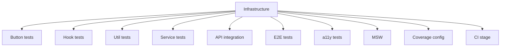

### 15.4 Risks

| Risk                                         | Likelihood | Impact | Mitigation                                            |
| -------------------------------------------- | ---------- | ------ | ----------------------------------------------------- |
| Flaky E2E tests from async timing            | Medium     | Medium | Use Playwright auto-waiting; add retry logic (max 2)  |
| MSW mocking complexity for nested services   | Low        | Medium | Mock at HTTP level; test integration paths separately |
| Coverage thresholds too aggressive initially | Medium     | Low    | Start at 60%, ramp to 80% over 2 weeks                |

### 15.5 Validation Criteria

| ID     | Criterion                                             | Verification Method                         |
| ------ | ----------------------------------------------------- | ------------------------------------------- |
| P13-V1 | All unit tests pass (target: 200+ tests)              | `vitest run`                                |
| P13-V2 | All integration tests pass                            | `vitest run --config vitest.integration.ts` |
| P13-V3 | All E2E tests pass (10 critical flows)                | `playwright test`                           |
| P13-V4 | All a11y tests report 0 violations                    | `jest-axe`                                  |
| P13-V5 | Coverage meets thresholds (80% unit, 70% integration) | Coverage report                             |
| P13-V6 | CI test stage completes within 5 minutes              | GitHub Actions                              |

### 15.6 Definition of Done

- [ ] Test infrastructure: Vitest, Testing Library, Playwright, MSW, jest-axe
- [ ] 200+ unit tests across all components, hooks, utilities, services
- [ ] Integration tests for all API endpoints
- [ ] 10 E2E tests for critical user flows
- [ ] Accessibility tests for all pages (0 violations)
- [ ] Coverage thresholds enforced in CI
- [ ] All tests run in CI (parallel, < 5 min)

### 15.7 Estimated Effort

**Total: 10 days** (infrastructure: 1 day, component tests: 3 days, service/API tests: 2.5 days, E2E: 2 days, CI integration: 1.5 days)

---

## 16. Phase 14: Performance Optimization

> **Duration:** 6 days | **Dependencies:** P4–P9 | **Constitution:** §13 PERF-001–010, §22 QG-009, QG-017

### 16.1 Objectives

1. Implement performance budgets and enforce in CI
2. Optimize all images (WebP, next/image, lazy loading)
3. Implement dynamic imports for heavy components (Three.js, Markdown, Chart)
4. Implement list virtualization for 50+ item lists
5. Optimize fonts (next/font, display: swap)
6. Optimize bundle size with code splitting
7. Achieve Lighthouse ≥ 95 in all categories

### 16.2 Deliverables

| ID      | Deliverable                                                                                          | Constitution §         | Est. Effort |
| ------- | ---------------------------------------------------------------------------------------------------- | ------------------------- | ----------- |
| P14-D01 | Performance budget configuration (LCP < 1.8s, FCP < 1.2s, TBT < 50ms, CLS < 0.05, Initial JS < 85KB) | §13 PERF               | 2h          |
| P14-D02 | Bundle analysis integration (`@next/bundle-analyzer`) in CI                                          | §13 PERF-009           | 2h          |
| P14-D03 | Image optimization audit + fixes (WebP, next/image, explicit sizes, lazy loading)                    | §13 PERF-001, PERF-002 | 3h          |
| P14-D04 | Dynamic imports for heavy components (Three.js, Markdown, Chart, Code highlighter)                   | §13 PERF-003           | 3h          |
| P14-D05 | List virtualization for 50+ item lists (Project grid, Lead table)                                    | §13 PERF-006           | 3h          |
| P14-D06 | Font optimization (next/font, display: swap, subset)                                                 | §13 PERF-004           | 2h          |
| P14-D07 | Third-party script optimization (PostHog, Sentry — lazyOnload)                                 | §13 PERF-005           | 2h          |
| P14-D08 | Critical CSS extraction + inline                                                                     | §13 PERF-007           | 3h          |
| P14-D09 | Lighthouse CI configuration (all categories ≥ 95)                                              | §22 QG-017             | 2h          |
| P14-D10 | Performance regression alerting                                                                      | §13 PERF               | 2h          |
| P14-D11 | API response caching optimization (ISR tuning, SWR config)                                           | §13 PERF-008           | 2h          |
| P14-D12 | Performance budget enforcement in CI (fail build on regression)                                      | §22 QG-009             | 1h          |

### 16.3 Risks

| Risk                                        | Likelihood | Impact | Mitigation                                         |
| ------------------------------------------- | ---------- | ------ | -------------------------------------------------- |
| Dynamic imports cause visible loading delay | Low        | Medium | Preload critical chunks; use skeleton placeholders |
| Lighthouse CI flakiness                     | Medium     | Low    | Run 3 times, use median; 5% tolerance band         |
| Bundle analyzer increases CI time           | Low        | Low    | Run only on main branch PRs                        |

### 16.4 Validation Criteria

| ID     | Criterion                             | Verification Method |
| ------ | ------------------------------------- | ------------------- |
| P14-V1 | Lighthouse Performance ≥ 95     | Lighthouse CI       |
| P14-V2 | LCP < 1.8s on throttled 3G            | Web Vitals test     |
| P14-V3 | Initial JS bundle < 85KB gzipped      | Bundle analyzer     |
| P14-V4 | All images use WebP with next/image   | Code audit          |
| P14-V5 | Heavy components dynamically imported | Code review         |
| P14-V6 | Font swap eliminates FOIT             | Visual inspection   |

### 16.5 Definition of Done

- [ ] Performance budgets configured and enforced in CI
- [ ] Bundle analysis integrated in CI
- [ ] All images optimized (WebP, next/image, lazy load)
- [ ] Heavy components dynamically imported with skeletons
- [ ] List virtualization for 50+ item lists
- [ ] Fonts optimized (next/font, display: swap)
- [ ] Lighthouse CI configured (all categories ≥ 95)
- [ ] Third-party scripts non-render-blocking

### 16.6 Estimated Effort

**Total: 6 days** (budgets: 0.5 day, images: 1 day, dynamic imports: 1 day, virtualization: 0.5 day, Lighthouse + CI: 1.5 days, polish: 1.5 days)

---

## 17. Phase 15: Deployment & CI/CD

> **Duration:** 4 days | **Dependencies:** P13, P14 | **Constitution:** §19 DEP-001–010, §22 QG-015–024

### 17.1 Objectives

1. Create complete CI/CD pipeline (GitHub Actions)
2. Configure Vercel deployment (frontend + API)
3. Configure Railway deployment (AI service)
4. Configure Cloudflare DNS + SSL
5. Configure environment variables in all environments
6. Create deployment runbook with rollback procedures
7. Achieve all quality gates (QG-015 through QG-024)

### 17.2 Deliverables

| ID      | Deliverable                                                                      | Constitution §          | Est. Effort |
| ------- | -------------------------------------------------------------------------------- | -------------------------- | ----------- |
| P15-D01 | GitHub Actions CI workflow (lint, typecheck, test, build, bundle-analyzer, a11y) | §19 DEP-001             | 4h          |
| P15-D02 | GitHub Actions CD workflow (deploy web + api to Vercel)                          | §19 DEP-002             | 2h          |
| P15-D03 | GitHub Actions CD workflow (deploy AI to Railway)                                | §19 DEP-002             | 2h          |
| P15-D04 | Vercel project configuration (environment variables, domains)                    | §19 DEP-007             | 2h          |
| P15-D05 | Railway project configuration (environment variables, health checks)             | §19 DEP-007             | 2h          |
| P15-D06 | Cloudflare DNS configuration (A records, CNAME, SSL/TLS)                         | §19 DEP                 | 2h          |
| P15-D07 | DB migration step in CI/CD                                                       | §19 DEP-004             | 1h          |
| P15-D08 | Environment variable audit (no client-exposed secrets)                           | §19 DEP-007, §11 SEC | 2h          |
| P15-D09 | Deployment runbook (deploy steps, rollback procedure, monitoring)                | §19 DEP-009             | 3h          |
| P15-D10 | Post-deployment verification (QG-021 through QG-024)                             | §22 QG-021–024   | 2h          |

### 17.3 Dependencies

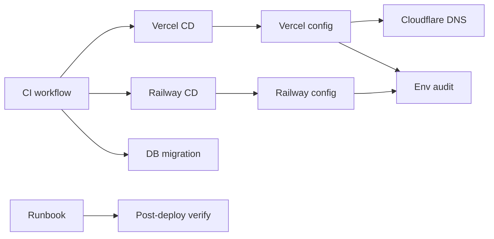

### 17.4 Risks

| Risk                                                     | Likelihood | Impact | Mitigation                                          |
| -------------------------------------------------------- | ---------- | ------ | --------------------------------------------------- |
| Railway free credits exhausted during deployment testing | Low        | Medium | Use dev credits; switch to $5 plan if needed        |
| Vercel deployment fails due to serverless NestJS config  | Medium     | Medium | Test with `vercel dev` first; have Express fallback |
| DNS propagation delay                                    | Medium     | Low    | Configure TTL low initially; test with hosts file   |

### 17.5 Validation Criteria

| ID     | Criterion                                          | Verification Method |
| ------ | -------------------------------------------------- | ------------------- |
| P15-V1 | CI pipeline green on PR (all checks pass)          | GitHub Actions      |
| P15-V2 | CD pipeline deploys to Vercel on main push         | Vercel Dashboard    |
| P15-V3 | CD pipeline deploys to Railway on main push        | Railway Dashboard   |
| P15-V4 | Production URLs resolve correctly                  | DNS check           |
| P15-V5 | SSL certificate valid (A+ on SSL Labs)             | SSL Labs test       |
| P15-V6 | Rollback works (can revert to previous deployment) | DR test             |
| P15-V7 | Post-deployment health checks pass                 | Better Uptime       |

### 17.6 Definition of Done

- [ ] CI pipeline runs on every push: lint → typecheck → test → build → bundle → a11y
- [ ] CD pipeline deploys to Vercel (web + api) on main push
- [ ] CD pipeline deploys to Railway (ai) on main push
- [ ] Custom domain resolving via Cloudflare with valid SSL (A+)
- [ ] Database migrations run as part of deployment
- [ ] Environment variables verified in all environments
- [ ] Deployment runbook documented with rollback procedures
- [ ] Post-deployment verification checks passing

### 17.7 Estimated Effort

**Total: 4 days** (CI: 1 day, CD + Vercel: 1 day, Railway + DNS: 1 day, runbook + verification: 1 day)

---

## 18. Complete File Inventory

### 18.1 New Files to Create by Phase

| Phase | Directory                           | File Pattern                                                                                                                                                        | Count      |
| ----- | ----------------------------------- | ------------------------------------------------------------------------------------------------------------------------------------------------------------------- | ---------- |
| P1    | `supabase/migrations/`              | `*.sql` (17 migrations)                                                                                                                                             | 17         |
| P1    | `supabase/seed.sql`                 | —                                                                                                                                                             | 1          |
| P1    | `packages/shared/src/`              | `*.ts`                                                                                                                                                              | 5          |
| P1    | `packages/ui/src/`                  | `cn.ts`                                                                                                                                                             | 1          |
| P1    | `packages/config/`                  | Config files                                                                                                                                                        | 3          |
| P1    | `apps/web/src/lib/`                 | `supabase.ts`, `supabase-server.ts`                                                                                                                                 | 2          |
| P1    | `apps/api/src/lib/`                 | `supabase.ts`, `env.ts`                                                                                                                                             | 2          |
| P1    | `apps/ai/app/services/`             | `supabase.py`                                                                                                                                                       | 1          |
| P1    | `docs/27-decisions/`                | `README.md`                                                                                                                                                         | 1          |
| P2    | `packages/ui/src/components/`       | `Button.tsx`, `Card.tsx`, `Input.tsx`, `Badge.tsx`, `Modal.tsx`, `Toast.tsx`, `Table.tsx`, `Tabs.tsx`, `Avatar.tsx`, `Skeleton.tsx`                                 | 10         |
| P2    | `apps/web/src/hooks/`               | `useFocusTrap.ts`, `useReducedMotion.ts`, `useFocusOnMount.ts`, `useSkipLink.ts`                                                                                    | 4          |
| P3    | `apps/web/src/components/layout/`   | `Navigation.tsx`, `MobileMenu.tsx`, `Footer.tsx`, `SkipLink.tsx`                                                                                                    | 4          |
| P3    | `apps/web/src/app/`                 | `loading.tsx`, `error.tsx`, `not-found.tsx`, `global-error.tsx`                                                                                                     | 4          |
| P4    | `apps/web/src/components/sections/` | `Hero.tsx`, `About.tsx`, `Skills.tsx`, `Experience.tsx`, `FeaturedProjects.tsx`, `Testimonials.tsx`, `BlogPreview.tsx`, `Services.tsx`, `FAQ.tsx`, `Contact.tsx`    | 10         |
| P4    | `apps/web/src/app/`                 | `page.tsx`                                                                                                                                                          | 1          |
| P5    | `apps/web/src/app/projects/`        | `page.tsx`, `[slug]/page.tsx`                                                                                                                                       | 2          |
| P5    | `apps/web/src/components/`          | `ProjectCard.tsx`, `ProjectFilter.tsx`, `ProjectGallery.tsx`, `ImageLightbox.tsx`                                                                                   | 4          |
| P6    | `apps/web/src/app/projects/[slug]/` | Case study components                                                                                                                                               | 3          |
| P6    | `apps/web/src/components/`          | `CaseStudyDiagram.tsx`, `CodeBlock.tsx`, `MetricsCounter.tsx`                                                                                                       | 3          |
| P7    | `apps/web/src/app/blog/`            | `page.tsx`, `[slug]/page.tsx`, `feed.xml/route.ts`                                                                                                                  | 3          |
| P7    | `apps/web/src/components/`          | `BlogCard.tsx`, `BlogArticle.tsx`, `TableOfContents.tsx`, `ReadingProgress.tsx`, `ShareButtons.tsx`                                                                 | 5          |
| P8    | `apps/ai/app/routes/`               | `chat.py`, `analyze.py`, `suggest.py`, `health.py`                                                                                                                  | 4          |
| P8    | `apps/ai/app/services/`             | `ai_service.py`, `rag_service.py`, `embedding_service.py`, `cache_service.py`, `cost_controller.py`, `conversation_service.py`                                      | 6          |
| P8    | `apps/ai/app/middleware/`           | `rate_limit.py`, `input_sanitizer.py`, `pii_filter.py`                                                                                                              | 3          |
| P8    | `apps/web/src/components/`          | `Chatbot.tsx`, `ChatWidget.tsx`, `ChatMessage.tsx`, `ChatInput.tsx`                                                                                                 | 4          |
| P9    | `apps/web/src/app/admin/`           | `layout.tsx`, `page.tsx`, `login/page.tsx`, `cms/page.tsx`, `cms/[id]/page.tsx`, `leads/page.tsx`, `leads/[id]/page.tsx`, `settings/page.tsx`, `analytics/page.tsx` | 9          |
| P9    | `apps/web/src/components/admin/`    | `Sidebar.tsx`, `RichTextEditor.tsx`, `ImageUploader.tsx`, `LeadDetail.tsx`, `SectionEditor.tsx`, `RevalidateButton.tsx`                                             | 6          |
| P9    | `apps/api/src/modules/auth/`        | `auth.service.ts`                                                                                                                                                   | 1          |
| P9    | `apps/web/src/middleware.ts`        | —                                                                                                                                                             | 1          |
| P10   | `apps/web/src/lib/`                 | `analytics.ts`                                                                                                                                                      | 1          |
| P10   | `apps/web/src/app/admin/analytics/` | `page.tsx`                                                                                                                                                          | 1          |
| P11   | `apps/web/src/lib/`                 | `sentry.ts`                                                                                                                                                         | 1          |
| P12   | `apps/web/next.config.js`           | Updated security headers                                                                                                                                            | 0 (modify) |
| P12   | `apps/api/src/modules/auth/`        | `brute-force.guard.ts`                                                                                                                                              | 1          |
| P12   | `.github/dependabot.yml`            | —                                                                                                                                                             | 1          |
| P13   | `vitest.config.ts` (per app)        | —                                                                                                                                                             | 3          |
| P13   | `playwright.config.ts`              | —                                                                                                                                                             | 1          |
| P13   | `**/*.test.ts`, `**/*.test.tsx`     | —                                                                                                                                                             | ~150       |
| P13   | `**/*.spec.ts`                      | E2E test files                                                                                                                                                      | ~10        |
| P14   | `lighthouserc.js`                   | —                                                                                                                                                             | 1          |
| P15   | `.github/workflows/ci.yml`          | —                                                                                                                                                             | 1          |
| P15   | `.github/workflows/cd.yml`          | —                                                                                                                                                             | 1          |
|       | **Total New Files**                 |                                                                                                                                                                     | **~300**   |

### 18.2 Existing Files to Modify

| File                                 | Modifications                                             | Phase |
| ------------------------------------ | --------------------------------------------------------- | ----- |
| `package.json`                       | npm workspaces + turbo config                             | P1    |
| `turbo.json`                         | Pipeline configuration                                    | P1    |
| `apps/web/tsconfig.json`             | Strict mode options                                       | P1    |
| `packages/config/tsconfig.base.json` | Strict mode options                                       | P1    |
| `packages/config/eslint-preset.js`   | Rule hardening (no-console: error, no-unused-vars: error) | P1    |
| `apps/web/src/styles/globals.css`    | CSS custom properties + theme system                      | P2    |
| `apps/web/tailwind.config.ts`        | Design token extensions                                   | P2    |
| `packages/shared/src/index.ts`       | snake_case conversion + branded types                     | P1    |
| `packages/ui/src/index.ts`           | Barrel exports for all components                         | P2    |
| `apps/web/next.config.js`            | Security headers + CSP + image domains                    | P12   |
| `apps/web/src/app/layout.tsx`        | Providers + metadata                                      | P3    |
| `apps/api/src/main.ts`               | CORS, Helmet, Swagger, ValidationPipe                     | P1    |
| `apps/ai/requirements.txt`           | Python dependencies                                       | P1    |
| `apps/ai/app/main.py`                | CORS + middleware + routes                                | P8    |

---

## 19. Risk Register

### 19.1 Comprehensive Risk Matrix

| ID   | Risk                                                        | Phase(s) | Likelihood | Impact   | RPN | Mitigation                                                                                 | Contingency                                                                  |
| ---- | ----------------------------------------------------------- | -------- | ---------- | -------- | --- | ------------------------------------------------------------------------------------------ | ---------------------------------------------------------------------------- |
| R-01 | TypeScript strict mode causes widespread compilation errors | P1       | High       | Medium   | 12  | Incremental adoption per app; fix in order: packages → api → web → ai | Temporarily relax `noUncheckedIndexedAccess` until types fixed               |
| R-02 | DB migration conflicts with existing schema                 | P1       | Low        | High     | 6   | Sequential timestamped migrations; test on staging first                                   | Rollback and re-apply in correct order                                       |
| R-03 | Hardcoded color refactoring breaks component visuals        | P2       | Medium     | High     | 12  | Component-by-component refactor with visual verification; snapshot tests                   | Revert individual component if visual breaks                                 |
| R-04 | Theme flash on initial page load                            | P2, P3   | Medium     | High     | 12  | Critical blocking inline script in `<head>` before React                                   | Fallback to light theme; flash is temporary                                  |
| R-05 | 3D background impacts LCP performance                       | P4       | Medium     | High     | 12  | Dynamic import with `ssr: false`; static fallback image                                    | Remove 3D background, use static gradient                                    |
| R-06 | Contact form spam                                           | P4       | Medium     | Medium   | 8   | Honeypot + rate limiting + hCaptcha                                                        | Add email domain blocklist                                                   |
| R-07 | OpenAI API cost overrun                                     | P8       | Medium     | High     | 12  | Cost controller with hard budgets; response caching                                        | Disable AI chat entirely if budget exceeded                                  |
| R-08 | Prompt injection attacks                                    | P8       | Low        | Critical | 10  | Input sanitization + system prompt hardening + output filter                               | Manual review mode for suspicious queries                                    |
| R-09 | LLM hallucination about portfolio content                   | P8       | Medium     | Medium   | 8   | RAG grounding + confidence threshold + "I don't know" default                              | Add disclaimer: "AI-generated, verify with portfolio owner"                  |
| R-10 | Admin authentication bypass                                 | P9       | Low        | Critical | 8   | Defense in depth: middleware + client + API guards; rate limiting                          | Emergency auth disable procedure documented                                  |
| R-11 | Rich text editor increases bundle significantly             | P9       | Medium     | Low      | 4   | Dynamic import with loading skeleton                                                       | Use textarea with Markdown as fallback                                       |
| R-12 | Flaky E2E tests from async timing                           | P13      | Medium     | Medium   | 8   | Playwright auto-waiting; retry max 2x; quarantined flaky tests                             | Manual QA pass for critical flows                                            |
| R-13 | CSP blocks legitimate third-party resources                 | P12      | Medium     | Medium   | 8   | Report-only mode for 1 week before enforcement                                             | Whitelist additional domains as needed                                       |
| R-14 | Performance budget fails on CI                              | P14      | Medium     | Low      | 4   | 5% tolerance band; run 3x use median                                                       | Investigate regression; create ticket; allow merge with deviation ≤ 5% |
| R-15 | Vercel serverless NestJS cold starts                        | P15      | Medium     | Medium   | 8   | Keep 1-2 warm instances; use Edge Functions for static                                     | Move NestJS to Railway if cold starts > 500ms                                |
| R-16 | Railway free credits depleted during testing                | P15      | Low        | Medium   | 4   | Use dev credits; monitor usage dashboard                                                   | Switch to $5/mo plan                                                         |
| R-17 | Single developer bottleneck on critical path                | All      | High       | High     | 16  | Parallelize non-critical path work; clear task definition                                  | Extend timeline; reduce scope of P9 or P10                                   |
| R-18 | Knowledge loss from long implementation span                | All      | Medium     | High     | 12  | Documentation in every PR; ADRs for decisions; runbook for ops                             | Pair on critical path tasks                                                  |

> **RPN = Likelihood × Impact** (scale: 1–4 each). RPN > 10 requires active mitigation.

### 19.2 Top 5 Risks Requiring Active Management

| Priority | Risk                              | Owner         | Review Cadence          | Trigger                         | Escalation                                   |
| -------- | --------------------------------- | ------------- | ----------------------- | ------------------------------- | -------------------------------------------- |
| **1**    | R-17: Single developer bottleneck | Tech Lead     | Daily standup           | 2+ tasks blocked on same person | Reduce scope; extend timeline                |
| **2**    | R-05: 3D background LCP impact    | Frontend Lead | After P4 implementation | LCP > 2.5s on Lighthouse        | Remove 3D; use static fallback               |
| **3**    | R-07: OpenAI cost overrun         | AI Lead       | Weekly                  | Monthly cost > $5               | Reduce model quality; increase caching       |
| **4**    | R-01: TS strict mode errors       | All           | Daily (P1 only)         | Build failing > 24h             | Temporarily relax `noUncheckedIndexedAccess` |
| **5**    | R-13: CSP blocks resources        | Security Lead | Weekly (P12 only)       | Reported CSP violations         | Add domains to allowlist                     |

### 19.3 Mitigation Strategies

| Strategy                 | Description                                                                 | Applied To                            |
| ------------------------ | --------------------------------------------------------------------------- | ------------------------------------- |
| **Incremental Delivery** | Ship working software at end of each phase                                  | All phases                            |
| **Feature Flags**        | Deploy incomplete features behind flags                                     | P4 (3D), P8 (AI), P9 (admin features) |
| **Mock Integrations**    | Use mocks for integrations not yet configured                               | P1 (before credentials received)      |
| **CI Safety Net**        | Every PR runs full test suite                                               | P13 onward                            |
| **DB Rollback**          | Every migration has a down migration                                        | P1                                    |
| **Cost Monitoring**      | Track OpenAI spend in dashboard                                             | P8, P10                               |
| **Defense in Depth**     | Multiple security layers (WAF → middleware → API → DB) | P12                                   |

---

## 20. Compliance Traceability Matrix

### 20.1 Audit Finding Remediation

| Finding                          | Severity          | Phase        | Remediation Deliverable                   | Verification                                 |
| -------------------------------- | ----------------- | ------------ | ----------------------------------------- | -------------------------------------------- |
| C-01: Security headers missing   | 🔴 Critical | P12          | P12-D01, P12-D02                          | SecurityHeaders.com A+                       |
| C-02: No test infrastructure     | 🔴 Critical | P13          | P13-D01                                   | Tests running in CI                          |
| H-01: Hardcoded colors in UI     | 🟠 High     | P2           | P2-D01, P2-D05–P2-D07              | Token audit + code search                    |
| H-02: 76% placeholder files      | 🟠 High     | P4–P9 | All section/component implementations     | File audit (per-phase checklist in §20.2) |
| H-03: TS strict mode incomplete  | 🟠 High     | P1           | P1-D02                                    | `tsc --noEmit` passes                        |
| H-04: No rate limiting           | 🟠 High     | P12          | P12-D03, P12-D04                          | 429 response test                            |
| H-05: ESLint rules permissive    | 🟠 High     | P1           | P1-D03                                    | ESLint 0 errors/warnings                     |
| M-01: camelCase shared types     | 🟡 Medium   | P1           | P1-D08                                    | Shared types use snake_case                  |
| M-02: No Zod schemas             | 🟡 Medium   | P1           | P1-D08 (add Zod)                          | Zod schemas for API payloads                 |
| M-03: Non-standard border radius | 🟡 Medium   | P2           | P2-D06 (Card radius fix)                  | Card uses `rounded-xl`                       |
| M-04: No ADR directory           | 🟡 Medium   | P1           | P1-D22                                    | ADR directory exists                         |
| L-01: No branded types           | 🟢 Low      | P1           | P1-D08 (add branded types)                | `UserId`, `ProjectId`, etc. exist            |
| L-02: No explicit return types   | 🟢 Low      | P1           | P1-D02 (TS strict catches this)           | ESLint `explicit-function-return-type`       |
| L-03: No Swagger docs            | 🟢 Low      | P1           | P1-D06 (NestJS scaffold includes Swagger) | Swagger UI at `/api/docs`                    |

### 20.2 Cross-Phase Remediation: H-02 Placeholder Files (P4–P9)

Audit finding **H-02 (76% placeholder files)** spans 6 phases. Each phase must verify its placeholder replacements independently. Below is the cross-phase verification checklist to ensure full coverage.

#### H-02 Remediation Checklist

| Phase                          | Files to Replace                                                                                                                                                 | Verification                                                               | Status |
| ------------------------------ | ---------------------------------------------------------------------------------------------------------------------------------------------------------------- | -------------------------------------------------------------------------- | ------ |
| **P4** — Homepage        | `Hero.tsx`, `About.tsx`, `Skills.tsx`, `Experience.tsx`, `FeaturedProjects.tsx`, `Testimonials.tsx`, `BlogPreview.tsx`, `Services.tsx`, `FAQ.tsx`, `Contact.tsx` | All 10 sections render real content from API (not placeholder text/images) | ⬜ |
| **P5** — Projects        | `page.tsx`, `[slug]/page.tsx`, `ProjectCard.tsx`, `ProjectFilter.tsx`, `ProjectGallery.tsx`, `ImageLightbox.tsx`                                                 | Project grid loads from DB; detail page shows full content                 | ⬜ |
| **P6** — Case Studies    | Case study components, `CaseStudyDiagram.tsx`, `CodeBlock.tsx`, `MetricsCounter.tsx`                                                                             | Case studies show real problem/solution/impact content                     | ⬜ |
| **P7** — Blog            | `page.tsx`, `[slug]/page.tsx`, `BlogCard.tsx`, `BlogArticle.tsx`, `TableOfContents.tsx`                                                                          | Blog listing shows real posts; articles render Markdown content            | ⬜ |
| **P8** — AI Assistant    | ChatWidget, Chat components                                                                                                                                      | Chat responds with real AI responses (not mock/placeholder)                | ⬜ |
| **P9** — Admin Dashboard | All admin pages, CMS editor, Lead Manager, Section Editor                                                                                                        | Admin manages real data; no static/placeholder UI                          | ⬜ |

#### Gate Check: End-of-Phase Verification

Before marking any phase P4–P9 as done, the following must be confirmed:

1. [ ] **No placeholder text or lorem-ipsum content** in the delivered files
2. [ ] **All UI components fetch real data** from API or database (no hardcoded mock data in production code)
3. [ ] **All images use real assets** (not placeholder images like `via.placeholder.com`)
4. [ ] **Error states implemented** for when real data fails to load
5. [ ] **Loading states shown** while real data is being fetched
6. [ ] **Static template content removed** from section components (e.g., no hardcoded project cards)

#### Final H-02 Validation (Phase Gate — After P9)

| ID     | Criterion                                                                                | Verification Method                                                                         |
| ------ | ---------------------------------------------------------------------------------------- | ------------------------------------------------------------------------------------------- |
| H02-V1 | All section files in `apps/web/src/components/sections/` use real API data               | Code audit across all section files                                                         |
| H02-V2 | All component files in `apps/web/src/components/admin/` have no placeholder content      | Code audit across all admin components                                                      |
| H02-V3 | Blog and Projects listing pages fetch from database                                      | Network tab verification                                                                    |
| H02-V4 | No files contain `Lorem ipsum`, `TODO:`, `placeholder`, or `// @todo` in production code | `grep -r "Lorem ipsum\|TODO:\|placeholder" apps/web/src --include="*.tsx" --include="*.ts"` |
| H02-V5 | All pages render meaningful content when API is available                                | Visual inspection of each page                                                              |

---

### 20.3 Constitution Compliance Per Phase

| Constitution §    | P1      | P2      | P3      | P4      | P5      | P6      | P7      | P8      | P9      | P10     | P11     | P12     | P13     | P14     | P15     |
| -------------------- | ------- | ------- | ------- | ------- | ------- | ------- | ------- | ------- | ------- | ------- | ------- | ------- | ------- | ------- | ------- |
| §2 Architecture   | ✅ |         | ✅ |         |         |         |         | ✅ | ✅ |         |         |         |         |         | ✅ |
| §3 Coding         | ✅ | ✅ | ✅ | ✅ | ✅ | ✅ | ✅ | ✅ | ✅ | ✅ | ✅ | ✅ | ✅ | ✅ | ✅ |
| §4 Folder         | ✅ | ✅ | ✅ | ✅ | ✅ | ✅ | ✅ | ✅ | ✅ | ✅ | ✅ | ✅ | ✅ | ✅ | ✅ |
| §5 Naming         | ✅ | ✅ | ✅ | ✅ | ✅ | ✅ | ✅ | ✅ | ✅ | ✅ | ✅ | ✅ | ✅ | ✅ | ✅ |
| §6 TypeScript     | ✅ | ✅ | ✅ | ✅ | ✅ | ✅ | ✅ | ✅ | ✅ | ✅ | ✅ | ✅ | ✅ | ✅ | ✅ |
| §7 React          |         | ✅ |         | ✅ | ✅ |         | ✅ | ✅ | ✅ |         |         |         |         |         |         |
| §8 Next.js        |         |         | ✅ | ✅ | ✅ | ✅ | ✅ |         | ✅ |         |         |         |         |         |         |
| §9 Database       | ✅ |         |         |         |         |         |         |         |         |         |         |         |         |         |         |
| §10 API           | ✅ |         |         |         | ✅ |         |         | ✅ | ✅ | ✅ |         |         |         |         |         |
| §11 Security      |         |         |         |         |         |         |         | ✅ | ✅ |         |         | ✅ |         |         |         |
| §12 A11y          |         |         | ✅ | ✅ | ✅ | ✅ | ✅ | ✅ | ✅ |         |         |         |         |         |         |
| §13 Performance   |         |         |         | ✅ |         |         |         |         |         |         |         |         |         | ✅ |         |
| §14 Animation     |         |         | ✅ | ✅ |         |         |         |         |         |         |         |         |         |         |         |
| §15 Design        |         | ✅ |         | ✅ |         |         |         |         | ✅ |         |         |         |         |         |         |
| §16 Testing       |         |         |         |         |         |         |         |         |         |         |         |         | ✅ |         |         |
| §17 Docs          | ✅ |         |         |         |         | ✅ |         |         | ✅ |         |         |         |         |         |         |
| §18 Code Review   |         |         |         |         |         |         |         |         | ✅ |         |         |         |         |         |         |
| §19 Deployment    |         |         |         |         |         |         |         |         |         |         |         |         |         |         | ✅ |
| §20 AI            |         |         |         |         |         |         |         | ✅ |         |         |         |         |         |         |         |
| §21 Forbidden     | ✅ | ✅ | ✅ | ✅ | ✅ | ✅ | ✅ | ✅ | ✅ | ✅ | ✅ | ✅ | ✅ | ✅ | ✅ |
| §22 Quality Gates | ✅ |         |         |         |         |         |         |         |         |         |         |         | ✅ | ✅ | ✅ |
| §23 DoD           | ✅ | ✅ | ✅ | ✅ | ✅ | ✅ | ✅ | ✅ | ✅ | ✅ | ✅ | ✅ | ✅ | ✅ | ✅ |

---

## Decision Log

| ID       | Decision                                                                                                                                              | Rationale                                                                                                                                                                   | Alternatives                                                                                                                                           | Date     | Approver        |
| -------- | ----------------------------------------------------------------------------------------------------------------------------------------------------- | --------------------------------------------------------------------------------------------------------------------------------------------------------------------------- | ------------------------------------------------------------------------------------------------------------------------------------------------------ | -------- | --------------- |
| PLAN-001 | Adopt 15-phase structure (up from 10) adding Design System, Core Layout, Case Studies, Blog, Analytics, Testing, and Performance as standalone phases | Each new phase reflects a critical delivery domain that was previously under-planned; elevation to standalone phases ensures dedicated attention and traceable deliverables | 10-phase structure left Design System, Core Layout, and Content phases underspecified; 20 phases would over-decompose for portfolio scale              | Jun 2026 | Chief Architect |
| PLAN-002 | Use Mermaid DAGs for all 15 phase dependency graphs                                                                                                   | Visual dependency representation enables critical path analysis and parallel execution identification; renders natively in GitHub markdown                                  | Graphviz (external tool, not markdown-native); text-only description (misses visual dependency chains); spreadsheet (no rendering)                     | Jun 2026 | Chief Architect |
| PLAN-003 | Implement RPN scoring (Likelihood × Impact) for all 18 risks in the risk register                                                                 | Standardized risk prioritization enables consistent decision-making; RPN thresholds define clear ownership and mitigation urgency                                           | Binary risk flags (adds no differentiation); qualitative-only (subjective and hard to compare); financial-only (doesn't capture schedule/quality risk) | Jun 2026 | Chief Architect |
| PLAN-004 | Create 11-milestone map with specific dates spanning 12–18 weeks                                                                               | Provides clear delivery cadence and external stakeholder visibility; milestone-based tracking enables early detection of schedule slippage                                  | Sprint-based tracking (too granular for plan-level); single end-date only (no intermediate accountability)                                             | Jun 2026 | Chief Architect |
| PLAN-005 | Embed Constitution compliance matrix per phase with traceability to 14 audit findings                                                                 | Ensures every Implementation Plan phase directly addresses identified gaps; audit finding remediation is tracked to completion                                              | Side-by-side compliance doc would enable drift; no traceability would risk completing phases without addressing audit findings                         | Jun 2026 | Chief Architect |

---

## 21. Change Log

| Version | Date     | Changes                                                                                                                                                                                                                                                                                                                                                                                                                                                                                                                                                                                                                                                                                                                                                                                                                                                                                                                                                                                                                                                                                                                                                                                            | Author          |
| ------- | -------- | -------------------------------------------------------------------------------------------------------------------------------------------------------------------------------------------------------------------------------------------------------------------------------------------------------------------------------------------------------------------------------------------------------------------------------------------------------------------------------------------------------------------------------------------------------------------------------------------------------------------------------------------------------------------------------------------------------------------------------------------------------------------------------------------------------------------------------------------------------------------------------------------------------------------------------------------------------------------------------------------------------------------------------------------------------------------------------------------------------------------------------------------------------------------------------------------------- | --------------- |
| **5.0** | Jun 2026 | **Complete 15-Phase Enterprise Restructure** — Upgraded from 10-phase to 15-phase implementation plan. New phases: Design System (§2, standalone), Core Layout (§3, new), Case Studies (§6, new), Blog (§7, new), Analytics (§10, standalone), Testing (§13, elevated to own phase), Performance (§14, elevated to own phase). Each phase includes: Objectives, Deliverables with Constitution traceability, Dependency sub-graphs (Mermaid), Risks with likelihood×impact RPN scoring, Validation Criteria with pass/fail conditions, Definition of Done checklists, Estimated Effort. Added: 11-milestone map with dates, enterprise risk register (18 risks with RPN scoring, top 5 active management, 6 mitigation strategies), complete file inventory (~300 new files, ~15 modified), audit finding remediation traceability (14 findings mapped to phases/deliverables), Constitution compliance matrix per phase. Plan overview updated with Gantt chart, parallel execution strategy, critical path analysis (P1→P2→P3→P4→P9→P13→P15 = 12 weeks). 230 total tasks across 15 phases (182 core + 48 verification). | Chief Architect |
| 4.0     | Jun 2026 | Enterprise-grade 10-phase rewrite: 154 tasks, Mermaid DAGs, risk register, file inventory                                                                                                                                                                                                                                                                                                                                                                                                                                                                                                                                                                                                                                                                                                                                                                                                                                                                                                                                                                                                                                                                                                          | Tech Lead       |
| 3.0     | Jun 2026 | Executive summary, change log                                                                                                                                                                                                                                                                                                                                                                                                                                                                                                                                                                                                                                                                                                                                                                                                                                                                                                                                                                                                                                                                                                                                                                      | Tech Lead       |
| 2.0     | Jun 2026 | Enterprise structure, Mermaid dependency graph                                                                                                                                                                                                                                                                                                                                                                                                                                                                                                                                                                                                                                                                                                                                                                                                                                                                                                                                                                                                                                                                                                                                                     | Tech Lead       |
| 1.0     | Mar 2026 | Initial implementation plan                                                                                                                                                                                                                                                                                                                                                                                                                                                                                                                                                                                                                                                                                                                                                                                                                                                                                                                                                                                                                                                                                                                                                                        | Tech Lead       |

---

## Glossary

| Term                    | Definition                                                                                                                                                                                   |
| ----------------------- | -------------------------------------------------------------------------------------------------------------------------------------------------------------------------------------------- |
| **Critical Path**       | The longest sequence of dependent phases through the project network (P1→P2→P3→P4→P9→P13→P15 = 12 weeks), determining the minimum project duration |
| **DAG**                 | Directed Acyclic Graph — a visual representation of phase dependencies where arrows flow from prerequisite to dependent phase without cycles                                           |
| **Definition of Done**  | A phase-specific checklist of conditions that must be met before a phase is considered complete and closed                                                                                   |
| **Deliverable**         | A tangible output of a phase (file, configuration, document) with specific traceability to the Engineering Constitution                                                                      |
| **Gantt Chart**         | A horizontal bar chart showing phase duration, start/end dates, and dependencies across the full 15-phase timeline                                                                           |
| **Milestone**           | A significant, measurable point in the project schedule with a specific target date, used for progress tracking and stakeholder reporting                                                    |
| **Parallel Execution**  | Running two or more phases simultaneously when they have no dependency relationship, reducing total project duration                                                                         |
| **Phase Gate**          | A go/no-go checkpoint at the end of each phase where deliverables are validated against criteria before the next phase begins                                                                |
| **RPN**                 | Risk Priority Number — a numerical score calculated as Likelihood × Impact (each 1–5), used to prioritize risks for active management                                       |
| **Remediation Phase**   | The final phase (P15) dedicated to addressing remaining audit findings and quality issues after all feature phases are complete                                                              |
| **Risk Register**       | A centralized table listing all identified risks with their RPN score, mitigation strategy, owner, and review status                                                                         |
| **Sub-Graph**           | A focused Mermaid dependency diagram scoped to a single phase, showing only the nodes and edges relevant to that phase                                                                       |
| **Task Count**          | The total number of individual work items across all phases — 230 core + 48 verification = 278 total                                                                                   |
| **Validation Criteria** | Specific, measurable pass/fail conditions that must be met for a phase deliverable to be accepted                                                                                            |
| **Verification Phase**  | Dedicated cross-cutting phase (P13 Testing, P14 Performance, P15 Remediation) focused on validation rather than feature delivery                                                             |

---

## Document References

| Reference                                             | Description                                                                       |
| ----------------------------------------------------- | --------------------------------------------------------------------------------- |
| `docs/MASTER-INDEX.md` (v3.0)                         | Document inventory — all 38+ docs indexed                                   |
| `docs/23-governance/32-SKILL.md` (v5.0)               | **AI Engineering Constitution** — supreme governing law for all engineering |
| `docs/05-architecture/SystemArchitecture.md` (v5.0)   | System architecture — 3-tier microservices, 14 ADRs                         |
| `docs/05-architecture/10-TECHSTACK.md` (v5.0)         | Technology inventory — 13 animation/3D libraries, version pins              |
| `docs/04-design/DesignSystem.md` (v5.0)               | Component library — 10 cataloged components, 120+ tokens                    |
| `docs/01-product/02-FEATURES.md` (v3.0)               | Feature catalog — 52 features across 12 categories                          |
| `docs/09-database/DatabaseArchitecture.md` (v5.0)     | Database schema — 37 tables, RLS policies, indexing                         |
| `docs/10-api/12-API.md` (v5.0)                        | API documentation — 74 endpoints, 17 API groups                             |
| `docs/11-security/SecurityArchitecture.md` (v5.0)     | Security implementation — OWASP Top 10:2025                                 |
| `docs/35-quality/PerformanceArchitecture.md` (v5.0)   | Performance standards — budgets, optimization techniques                    |
| `docs/35-quality/AccessibilityArchitecture.md` (v5.0) | Accessibility — WCAG 2.2 AA+, 24 sections                                   |
| `docs/35-quality/TestingArchitecture.md` (v5.0)       | Testing architecture — 23 sections, pyramid                                 |
| `docs/35-quality/30-QA.md` (v5.0)                     | QA framework — 24 sections, release gates                                   |
| `docs/23-governance/35-AUDIT-REPORT.md` (v1.0)        | Baseline compliance audit — 14 findings remediated in this plan             |
| `docs/23-governance/33-RATIFICATION.md` (v1.0)        | Ratification process — Constitutional governance                            |

---

> **📋 This Implementation Plan is the authoritative execution roadmap for all engineering work.**
> All phases, deliverables, and timelines are subordinate to the AI Engineering Constitution.
>
> **Next Review Date:** Weekly (standup tracking)  
> **Baseline Compliance:** 42% (target: 100% by EOS 2026)  
> **Estimated Delivery:** 12–18 weeks from start

## Cross-References

- [../MASTER-INDEX.md](../MASTER-INDEX.md) — Documentation master index
- [../26-reference/CROSS-REFERENCE-INDEX.md](../26-reference/CROSS-REFERENCE-INDEX.md) — Cross-reference system
