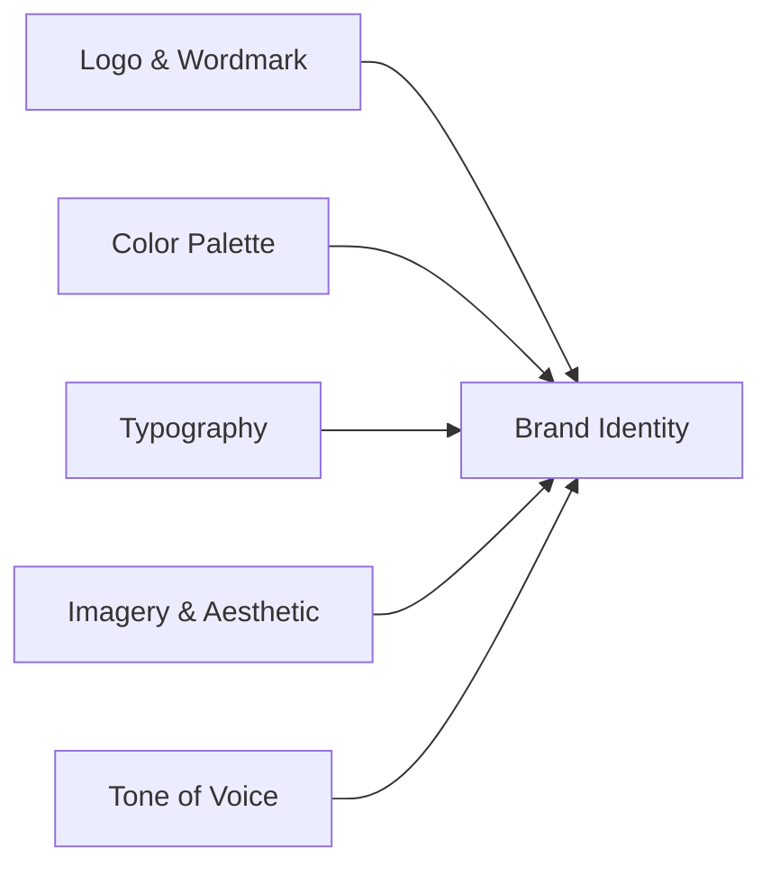

# Brand Guidelines

> **Version:** 2.0 | **Status:** ✅ Active | **Owner:** Principal Design Lead

## 1. Brand Identity

**Mission:** Showcase engineering excellence, design sensibility, and AI integration in a seamless digital experience.  
**Vision:** Transform a personal portfolio from static resume into an interactive, intelligent product.  
**Brand Essence:** "Modern craftsmanship meets technical precision." | **Personality:** Technical (40%) | Innovative (30%) | Clean (20%) | Approachable (10%)

## 2. Logo & Wordmark

### Versions

| Version          | File                     | Usage                                |
| ---------------- | ------------------------ | ------------------------------------ |
| Primary Wordmark | `portfolio-wordmark.svg` | Header, footer, loading screen       |
| Symbol Mark      | `portfolio-symbol.svg`   | Favicon, app icon, avatar fallback   |
| Combination Mark | `portfolio-combo.svg`    | Hero section, 404 page, social cards |

### Clearance & Minimum Size

- **Clear space:** Minimum padding equal to the height of the wordmark on all sides
- **Minimum size — digital:** 32px (favicon), 120px (wordmark/combo), 48px (symbol)
- **Minimum size — print:** 1 inch (25.4mm)

### Color Variants

Default: White (#fafafa) on dark, dark (#1a1a1a) on light. Monochrome version for one-color applications. No gradient logo variant exists.

### Misuses (Never Do)

| Incorrect                           | Instead                      |
| ----------------------------------- | ---------------------------- |
| Recolor to non-standard brand color | Use brand white or dark only |
| Gradient/pattern/texture fill       | Single flat color            |
| Distort aspect ratio                | Always proportional scale    |
| Rotate beyond ±5°                   | 0° orientation only          |
| Drop shadows, glows, 3D effects     | Flat, unadorned presentation |
| Rearrange symbol/wordmark positions | Stacked layout only          |
| Low-contrast/busy backgrounds       | 4.5:1 contrast minimum       |
| Outline or stroke the mark          | Solid fill only              |

### File Formats

| Format  | Use Case                                              |
| ------- | ----------------------------------------------------- |
| SVG     | Primary digital — all web usage, responsive, editable |
| PNG @2x | Social media preview, email signatures, slide decks   |
| ICO     | Favicon (16×16, 32×32, 48×48 multi-size)              |
| WebP    | Performance-critical scenarios, small thumbnails      |

All logo files in `public/brand/`.

## 3. Color Palette

### Background & Surface

| Token         | Dark      | Light     | Usage                           |
| ------------- | --------- | --------- | ------------------------------- |
| `bg-base`     | `#0a0a0c` | `#fafafa` | Main canvas                     |
| `bg-surface`  | `#121217` | `#f5f5f5` | Cards, panels, sidebars         |
| `bg-elevated` | `#1c1c22` | `#e5e5e5` | Flyouts, modals, dropdowns      |
| `bg-hover`    | `#26262e` | `#d4d4d4` | Hover state on surface/elevated |

### Text

| Token            | Dark      | Light     | Usage                        |
| ---------------- | --------- | --------- | ---------------------------- |
| `text-primary`   | `#f3f4f6` | `#1a1a1a` | High-emphasis body, headings |
| `text-secondary` | `#9ca3af` | `#525252` | Metadata, captions, labels   |
| `text-tertiary`  | `#6b7280` | `#a3a3a3` | Placeholder, disabled        |
| `text-inverse`   | `#1a1a1a` | `#f3f4f6` | Text on accent backgrounds   |

### Accent & Semantic

| Token              | Value                  | Usage                                      |
| ------------------ | ---------------------- | ------------------------------------------ |
| `accent-primary`   | `#3b82f6`              | Actions, links, focus rings, active states |
| `accent-hover`     | `#2563eb`              | Button hover, link hover                   |
| `accent-glow`      | `rgba(59,130,246,0.5)` | Interactive glow effect                    |
| `accent-secondary` | `#8b5cf6`              | AI features (violet)                       |
| `status-success`   | `#10b981`              | Success notifications                      |
| `status-warning`   | `#f59e0b`              | Warnings, low-priority alerts              |
| `status-error`     | `#ef4444`              | Errors, destructive actions                |
| `status-info`      | `#3b82f6`              | Informational badges                       |
| `status-ai`        | `#8b5cf6`              | Violet reserved for AI features            |

### Color Usage Rules

- Accent colors: interaction and focus signals only — never body text or large backgrounds
- Red (`status-error`): destructive actions and validation only — never decoration
- Violet (`status-ai`): AI features exclusively (chat, AI badges, AI-generated content indicators)

## 4. Typography

### Font Stack

| Role    | Font           | Fallback   | Weights                 |
| ------- | -------------- | ---------- | ----------------------- |
| Display | Clash Display  | sans-serif | 400, 500, 600, 700      |
| Body/UI | Inter          | sans-serif | 300, 400, 500, 600, 700 |
| Code    | JetBrains Mono | monospace  | 400, 500, 600           |

### Type Scale

| Token      | clamp()                            | Mobile | Desktop |
| ---------- | ---------------------------------- | ------ | ------- |
| Display XL | `clamp(3rem, 6vw, 6rem)`           | 48px   | 96px    |
| H1         | `clamp(2rem, 4vw, 3.5rem)`         | 32px   | 56px    |
| H2         | `clamp(1.5rem, 3vw, 2.25rem)`      | 24px   | 36px    |
| H3         | `clamp(1.25rem, 2vw, 1.75rem)`     | 20px   | 28px    |
| H4         | `clamp(1.125rem, 1.5vw, 1.375rem)` | 18px   | 22px    |
| Body       | `1rem`                             | 16px   | 16px    |
| Small      | `0.875rem`                         | 14px   | 14px    |
| Caption    | `0.75rem`                          | 12px   | 12px    |
| Code       | `0.875rem`                         | 14px   | 14px    |

**Line height:** Body 1.5, headings 1.1–1.2, display 0.95.

## 5. Tone of Voice

**Authoritative yet Approachable** — confident, never condescending. **Precise** — exact terms, concrete metrics, no fluff. **Forward-Looking** — momentum without hype. **Concise** — bullet points over prose. **AI Persona** — clearly demarcated AI assistant (violet badge).

**Do:** "Built with Next.js 14 and NestJS" / "Reduced query latency by 40%" / "Implements WCAG 2.2 AA" — quantify everything, speak to engineers.  
**Don't:** "Powered by cutting-edge tech" / "full-stack ninja" / "revolutionary AI" / vague superlatives / slang or emoji in professional copy.

## 6. Imagery & Aesthetic

| Element          | Approach                                                                      |
| ---------------- | ----------------------------------------------------------------------------- |
| Abstract Data    | Generative art, node-graphs, data visualizations over stock photography       |
| Code as Art      | Syntax-highlighted snippets as blurred background graphics                    |
| Dark & Cinematic | Deep shadows, neon accents, sharp contrasts, cinematic 3D lighting            |
| 3D Renders       | React Three Fiber (interactive), Spline (static pre-rendered)                 |
| Gradients        | Mesh gradients with CSS blur/noise overlay — never flat fields                |
| Photography      | Project case studies only (real screenshots, device mockups). No stock photos |
| Motion           | Purpose-driven — hover feedback, scroll reveals, ambient 3D rotation          |

## 7. Brand Assets Location

| Asset            | Path                          |
| ---------------- | ----------------------------- |
| Logo files       | `public/brand/`               |
| Social/OG images | `public/brand/social/`        |
| Design tokens    | `docs/design/DesignTokens.md` |
| UI components    | `packages/ui/`                |
| 3D scenes        | `public/models/`              |
| Brand fonts      | `public/fonts/`               |

## 9. Brand System Diagram

## 8. Do/Don't Summary

| Aspect          | Correct                                       | Incorrect                                        |
| --------------- | --------------------------------------------- | ------------------------------------------------ |
| Logo background | Dark solid, 4.5:1 contrast                    | Busy pattern, photograph, low contrast           |
| Accent usage    | Buttons, links, focus indicators              | Body text, large background fills                |
| Typography      | Clash Display / Inter / JetBrains Mono        | >3 families, display font for body               |
| Tone            | Technical, precise, quantified                | Slang, self-deprecation, fluff, hype             |
| Imagery         | Generative art, 3D renders, case study photos | Stock photos, clip art, memes                    |
| Color           | Token-based, accessible                       | Raw hex values, excessive accent, decorative red |

## Cross-References
- [../MASTER-INDEX.md](../MASTER-INDEX.md) — Documentation master index
- [../26-reference/CROSS-REFERENCE-INDEX.md](../26-reference/CROSS-REFERENCE-INDEX.md) — Cross-reference system