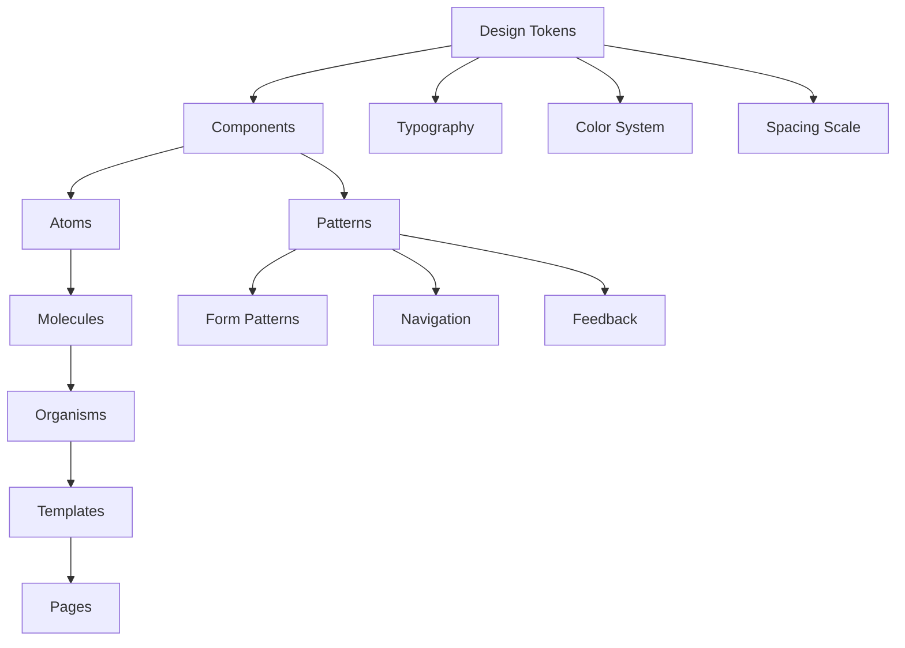

# Design System — FAANG Enterprise Component Library & Token Reference

> **Document:** `DesignSystem.md` | **Version:** 5.0 (Enterprise Upgrade) | **Last Updated:** July 2026  
> **Status:** ✅ Active | **Framework:** React 18 + Tailwind CSS 3.4 + TypeScript 5.4  
> **Owner:** Principal Design Lead | **Review Cadence:** Quarterly  
> **Components Documented:** 50+ | **Design Tokens:** 250+ | **Theme Modes:** 2 (Light/Dark)

---

## Executive Summary



This design system is the single source of truth for all visual components and design tokens across the portfolio platform. It implements the visual identity defined in `docs/04-design/DesignTokens.md` as concrete, reusable React components and CSS custom properties. Every component targets WCAG 2.2 AA compliance, supports light and dark themes, and follows the 4px/8px spacing system.

**Key Stats:**

- **Components:** 10 cataloged (Button, Card, Input, Badge, Modal, Toast, Table, Tabs, Avatar, Skeleton)
- **Design Tokens:** 120+ (colors, typography, spacing, shadows, animation, glassmorphism, z-index, borders)
- **Theme Modes:** 2 (Light + Dark via CSS custom properties)
- **WCAG Compliance:** AA (all 32 applicable criteria)
- **File Size Budget:** < 15KB initial CSS, < 50KB total JS for all components

---

## Table of Contents

1. [Design Token Reference](#1-design-token-reference)
   - 1.1 [Color Tokens](#11-color-tokens)
   - 1.2 [Typography Tokens](#12-typography-tokens)
   - 1.3 [Spacing Tokens](#13-spacing-tokens)
   - 1.4 [Shadow Tokens](#14-shadow-tokens)
   - 1.5 [Animation Tokens](#15-animation-tokens)
   - 1.6 [Glassmorphism Tokens](#16-glassmorphism-tokens)
   - 1.7 [z-index Tokens](#17-z-index-tokens)
   - 1.8 [Border Radius Tokens](#18-border-radius-tokens)
2. [Component Catalog](#2-component-catalog)
   - 2.1 [Button](#21-button)
   - 2.2 [Card](#22-card)
   - 2.3 [Input](#23-input)
   - 2.4 [Badge](#24-badge)
   - 2.5 [Modal](#25-modal)
   - 2.6 [Toast](#26-toast)
   - 2.7 [Table](#27-table)
   - 2.8 [Tabs](#28-tabs)
   - 2.9 [Avatar](#29-avatar)
   - 2.10 [Skeleton](#210-skeleton)
3. [Theme System](#3-theme-system)
4. [Component API Reference](#4-component-api-reference)
5. [Accessibility Patterns](#5-accessibility-patterns)
6. [Testing Strategy](#6-testing-strategy)
7. [Component Decision Records](#7-component-decision-records)
8. [Change Log](#8-change-log)

---

## 1. Design Token Reference

### 1.1 Color Tokens

All colors are exposed as CSS custom properties and Tailwind theme extensions. Tokens automatically swap between light and dark themes via `data-theme` attribute on `<html>`.

#### Accent Palette

| Token          | CSS Variable   | Light Hex     | Dark Hex      | Usage              |
| -------------- | -------------- | ------------- | ------------- | ------------------ |
| accent-50      | `--accent-50`  | `#EEF2FF`     | `#1E1B4B`     | Background tint    |
| accent-100     | `--accent-100` | `#E0E7FF`     | `#312E81`     | Hover background   |
| accent-200     | `--accent-200` | `#C7D2FE`     | `#3730A3`     | Active background  |
| accent-300     | `--accent-300` | `#A5B4FC`     | `#4338CA`     | Border accent      |
| accent-400     | `--accent-400` | `#818CF8`     | `#4F46E5`     | Soft accent        |
| **accent-500** | `--accent-500` | **`#6366F1`** | **`#6366F1`** | **Primary accent** |
| accent-600     | `--accent-600` | `#4F46E5`     | `#818CF8`     | Hover on accent    |
| accent-700     | `--accent-700` | `#4338CA`     | `#A5B4FC`     | Active on accent   |
| accent-800     | `--accent-800` | `#3730A3`     | `#C7D2FE`     | Pressed accent     |

#### Neutral Palette (Surface + Text)

| Token             | CSS Variable          | Light Hex | Dark Hex  | Usage                   | Contrast Ratio |
| ----------------- | --------------------- | --------- | --------- | ----------------------- | -------------- |
| surface-primary   | `--surface-primary`   | `#FAFAFA` | `#09090B` | Page background         | —        |
| surface-secondary | `--surface-secondary` | `#FFFFFF` | `#18181B` | Card background         | —        |
| surface-elevated  | `--surface-elevated`  | `#F4F4F5` | `#27272A` | Elevated card, dropdown | —        |
| border-primary    | `--border-primary`    | `#E4E4E7` | `#3F3F46` | Subtle borders          | —        |
| border-accent     | `--border-accent`     | `#D4D4D8` | `#52525B` | Emphasized borders      | —        |
| text-primary      | `--text-primary`      | `#18181B` | `#FAFAFA` | Main body               | 15.3:1         |
| text-secondary    | `--text-secondary`    | `#52525B` | `#A1A1AA` | Secondary text          | 7.2:1          |
| text-tertiary     | `--text-tertiary`     | `#71717A` | `#71717A` | Caption, placeholder    | 4.8:1          |
| text-inverse      | `--text-inverse`      | `#FAFAFA` | `#18181B` | Text on inverted        | —        |
| text-link         | `--text-link`         | `#4F46E5` | `#818CF8` | Link text               | 4.8:1+         |

#### Semantic Palette

| Token      | CSS Variable   | Hex       | Usage                     | WCAG    |
| ---------- | -------------- | --------- | ------------------------- | ------- |
| success    | `--success`    | `#22C55E` | Success states            | AA      |
| success-bg | `--success-bg` | `#052E16` | Success background (dark) | — |
| warning    | `--warning`    | `#F59E0B` | Warning states            | AA      |
| warning-bg | `--warning-bg` | `#451A03` | Warning background (dark) | — |
| error      | `--error`      | `#EF4444` | Error states              | AA      |
| error-bg   | `--error-bg`   | `#450A0A` | Error background (dark)   | — |
| info       | `--info`       | `#3B82F6` | Info states               | AA      |
| info-bg    | `--info-bg`    | `#0C1929` | Info background (dark)    | — |

#### Tailwind Theme Extension

```typescript
// tailwind.config.ts — Color Extension
colors: {
  accent: {
    50:  'var(--accent-50)',
    100: 'var(--accent-100)',
    200: 'var(--accent-200)',
    300: 'var(--accent-300)',
    400: 'var(--accent-400)',
    500: 'var(--accent-500)',
    600: 'var(--accent-600)',
    700: 'var(--accent-700)',
    800: 'var(--accent-800)',
  },
  surface: {
    primary:   'var(--surface-primary)',
    secondary: 'var(--surface-secondary)',
    elevated:  'var(--surface-elevated)',
  },
  border: {
    primary: 'var(--border-primary)',
    accent:  'var(--border-accent)',
  },
  text: {
    primary:   'var(--text-primary)',
    secondary: 'var(--text-secondary)',
    tertiary:  'var(--text-tertiary)',
    inverse:   'var(--text-inverse)',
    link:      'var(--text-link)',
  },
  semantic: {
    success:     'var(--success)',
    'success-bg': 'var(--success-bg)',
    warning:     'var(--warning)',
    'warning-bg': 'var(--warning-bg)',
    error:       'var(--error)',
    'error-bg':   'var(--error-bg)',
    info:        'var(--info)',
    'info-bg':    'var(--info-bg)',
  },
}
```

---

### 1.2 Typography Tokens

#### Font Families

| Token        | CSS Variable     | Font Stack                                 | Usage                     | Source       |
| ------------ | ---------------- | ------------------------------------------ | ------------------------- | ------------ |
| font-display | `--font-display` | `'Cabinet Grotesk', system-ui, sans-serif` | Display, H1, H2           | Fontshare    |
| font-body    | `--font-body`    | `'Inter', system-ui, sans-serif`           | Body text, H3-H4, buttons | Google Fonts |
| font-mono    | `--font-mono`    | `'JetBrains Mono', monospace`              | Code blocks, inline code  | Google Fonts |

#### Type Scale

| Level   | CSS Variable     | Desktop Size    | Mobile Size     | Weight | Line Height | Letter Spacing |
| ------- | ---------------- | --------------- | --------------- | ------ | ----------- | -------------- |
| display | `--text-display` | 72px (4.5rem)   | 48px (3rem)     | 700    | 1.1         | -0.02em        |
| h1      | `--text-h1`      | 60px (3.75rem)  | 36px (2.25rem)  | 700    | 1.15        | -0.01em        |
| h2      | `--text-h2`      | 36px (2.25rem)  | 28px (1.75rem)  | 600    | 1.2         | normal         |
| h3      | `--text-h3`      | 28px (1.75rem)  | 22px (1.375rem) | 600    | 1.25        | normal         |
| h4      | `--text-h4`      | 22px (1.375rem) | 18px (1.125rem) | 600    | 1.3         | normal         |
| body-lg | `--text-body-lg` | 18px (1.125rem) | 16px (1rem)     | 400    | 1.6         | normal         |
| body    | `--text-body`    | 16px (1rem)     | 15px (0.938rem) | 400    | 1.6         | normal         |
| body-sm | `--text-body-sm` | 14px (0.875rem) | 13px (0.813rem) | 400    | 1.5         | normal         |
| caption | `--text-caption` | 12px (0.75rem)  | 12px (0.75rem)  | 400    | 1.4         | +0.01em        |
| code    | `--text-code`    | 14px (0.875rem) | 13px (0.813rem) | 400    | 1.5         | normal         |
| button  | `--text-button`  | 14-16px         | 14px            | 500    | 1           | +0.01em        |

#### Tailwind Theme Extension

```typescript
// tailwind.config.ts — Typography Extension
fontFamily: {
  display: ['Cabinet Grotesk', 'system-ui', 'sans-serif'],
  body:    ['Inter', 'system-ui', 'sans-serif'],
  mono:    ['JetBrains Mono', 'monospace'],
},
fontSize: {
  'display':  ['clamp(3rem, 4vw + 1rem, 4.5rem)',  { lineHeight: '1.1', fontWeight: '700', letterSpacing: '-0.02em' }],
  'h1':       ['clamp(2.25rem, 4vw + 1rem, 3.75rem)', { lineHeight: '1.15', fontWeight: '700', letterSpacing: '-0.01em' }],
  'h2':       ['clamp(1.75rem, 3vw + 0.75rem, 2.25rem)', { lineHeight: '1.2', fontWeight: '600' }],
  'h3':       ['clamp(1.375rem, 2vw + 0.5rem, 1.75rem)', { lineHeight: '1.25', fontWeight: '600' }],
  'h4':       ['clamp(1.125rem, 1.5vw + 0.25rem, 1.375rem)', { lineHeight: '1.3', fontWeight: '600' }],
  'body-lg':  ['clamp(1rem, 1vw + 0.5rem, 1.125rem)', { lineHeight: '1.6' }],
  'body':     ['clamp(0.938rem, 1vw + 0.5rem, 1rem)', { lineHeight: '1.6' }],
  'body-sm':  ['clamp(0.813rem, 0.5vw + 0.5rem, 0.875rem)', { lineHeight: '1.5' }],
  'caption':  ['0.75rem', { lineHeight: '1.4', letterSpacing: '0.01em' }],
  'button':   ['0.875rem', { lineHeight: '1', fontWeight: '500', letterSpacing: '0.01em' }],
},
```

---

### 1.3 Spacing Tokens

| Token     | Value | Tailwind Class | Usage                                   |
| --------- | ----- | -------------- | --------------------------------------- |
| space-0.5 | 2px   | `p-0.5`        | Hairline spacing                        |
| space-1   | 4px   | `p-1`          | Minimum unit, icon padding              |
| space-2   | 8px   | `p-2`          | Icon padding, badge padding             |
| space-3   | 12px  | `p-3`          | Input padding, small buttons            |
| space-4   | 16px  | `p-4`          | Card padding (mobile), section margin   |
| space-5   | 20px  | `p-5`          | Avatar margins, medium gaps             |
| space-6   | 24px  | `p-6`          | Card padding (desktop), grid gap        |
| space-8   | 32px  | `p-8`          | Section spacing (mobile), form gap      |
| space-10  | 40px  | `p-10`         | Section spacing (tablet), modal padding |
| space-12  | 48px  | `p-12`         | Section spacing (desktop), hero margin  |
| space-16  | 64px  | `p-16`         | Major section separation                |
| space-24  | 96px  | `p-24`         | Page section spacing                    |

The spacing system uses a base unit of 4px with 8px increments for major decisions. All component padding, margin, and gap values derive from this scale.

---

### 1.4 Shadow Tokens

| Token      | CSS Variable   | Light Mode                     | Dark Mode                      | Elevation Level    | z-index Group |
| ---------- | -------------- | ------------------------------ | ------------------------------ | ------------------ | ------------- |
| shadow-xs  | `--shadow-xs`  | `0 1px 2px rgba(0,0,0,0.05)`   | `0 1px 2px rgba(0,0,0,0.3)`    | 0 — Flat     | auto          |
| shadow-sm  | `--shadow-sm`  | `0 1px 2px rgba(0,0,0,0.05)`   | `0 1px 2px rgba(0,0,0,0.3)`    | 1 — Raised   | 10            |
| shadow-md  | `--shadow-md`  | `0 4px 6px rgba(0,0,0,0.1)`    | `0 4px 6px rgba(0,0,0,0.35)`   | 2 — Elevated | 20            |
| shadow-lg  | `--shadow-lg`  | `0 10px 15px rgba(0,0,0,0.15)` | `0 10px 15px rgba(0,0,0,0.4)`  | 3 — Floating | 40            |
| shadow-xl  | `--shadow-xl`  | `0 20px 30px rgba(0,0,0,0.2)`  | `0 20px 30px rgba(0,0,0,0.45)` | 4 — Overlay  | 50            |
| shadow-2xl | `--shadow-2xl` | `0 30px 50px rgba(0,0,0,0.3)`  | `0 30px 50px rgba(0,0,0,0.5)`  | 5 — Top      | 100           |

#### Tailwind Theme Extension

```typescript
// tailwind.config.ts — Shadow Extension
boxShadow: {
  'xs':  'var(--shadow-xs)',
  'sm':  'var(--shadow-sm)',
  'md':  'var(--shadow-md)',
  'lg':  'var(--shadow-lg)',
  'xl':  'var(--shadow-xl)',
  '2xl': 'var(--shadow-2xl)',
},
```

---

### 1.5 Animation Tokens

#### Duration Tokens

| Token             | CSS Variable          | Value  | Usage                      |
| ----------------- | --------------------- | ------ | -------------------------- |
| duration-instant  | `--duration-instant`  | 0ms    | Disabled animation         |
| duration-micro    | `--duration-micro`    | 100ms  | Button press, toggle       |
| duration-fast     | `--duration-fast`     | 200ms  | Hover, focus feedback      |
| duration-normal   | `--duration-normal`   | 300ms  | Toast, modal, drawer       |
| duration-slow     | `--duration-slow`     | 500ms  | Section reveal, transition |
| duration-reveal   | `--duration-reveal`   | 600ms  | Entrance animation         |
| duration-emphasis | `--duration-emphasis` | 1000ms | Counter, confetti          |

#### Easing Tokens

| Token       | CSS Variable    | Cubic Bezier                             | Usage                  |
| ----------- | --------------- | ---------------------------------------- | ---------------------- |
| ease-out    | `--ease-out`    | `cubic-bezier(0.16, 1, 0.3, 1)`          | Entrances, reveals     |
| ease-in     | `--ease-in`     | `cubic-bezier(0.7, 0, 0.84, 0)`          | Exits (shorter)        |
| ease-in-out | `--ease-in-out` | `cubic-bezier(0.65, 0, 0.35, 1)`         | State transitions      |
| ease-spring | `--ease-spring` | `cubic-bezier(0.34, 1.56, 0.64, 1)`      | Micro-interactions     |
| ease-bounce | `--ease-bounce` | `cubic-bezier(0.68, -0.55, 0.265, 1.55)` | Emphasis (confetti)    |
| ease-smooth | `--ease-smooth` | `cubic-bezier(0.45, 0, 0.55, 1)`         | General transitions    |
| ease-linear | `--ease-linear` | `linear`                                 | Shimmer, progress bars |

#### Keyframe Animations

```css
@keyframes shimmer {
  0% {
    transform: translateX(-100%);
  }
  100% {
    transform: translateX(100%);
  }
}

@keyframes fade-in-up {
  from {
    opacity: 0;
    transform: translateY(20px);
  }
  to {
    opacity: 1;
    transform: translateY(0);
  }
}

@keyframes scale-in {
  from {
    opacity: 0;
    transform: scale(0.95);
  }
  to {
    opacity: 1;
    transform: scale(1);
  }
}

@keyframes slide-in-right {
  from {
    transform: translateX(100%);
  }
  to {
    transform: translateX(0);
  }
}

@keyframes slide-in-up {
  from {
    transform: translateY(100%);
  }
  to {
    transform: translateY(0);
  }
}

@keyframes pulse-dot {
  0%,
  100% {
    opacity: 0.4;
  }
  50% {
    opacity: 1;
  }
}

@keyframes count-up {
  from {
    opacity: 0;
  }
  to {
    opacity: 1;
  }
}
```

#### Tailwind Theme Extension

```typescript
// tailwind.config.ts — Animation Extension
transitionDuration: {
  'instant': '0ms',
  'micro':   '100ms',
  'fast':    '200ms',
  'normal':  '300ms',
  'slow':    '500ms',
  'reveal':  '600ms',
  'emphasis': '1000ms',
},
transitionTimingFunction: {
  'out':    'cubic-bezier(0.16, 1, 0.3, 1)',
  'in':     'cubic-bezier(0.7, 0, 0.84, 0)',
  'in-out': 'cubic-bezier(0.65, 0, 0.35, 1)',
  'spring': 'cubic-bezier(0.34, 1.56, 0.64, 1)',
  'bounce': 'cubic-bezier(0.68, -0.55, 0.265, 1.55)',
},
animation: {
  'shimmer':    'shimmer 1.5s ease-in-out infinite',
  'fade-in-up': 'fade-in-up 0.6s ease-out',
  'scale-in':   'scale-in 0.2s ease-out',
  'slide-in-right': 'slide-in-right 0.3s ease-out',
  'slide-in-up':    'slide-in-up 0.3s ease-out',
  'pulse-dot':  'pulse-dot 1.5s ease-in-out infinite',
},
```

---

### 1.6 Glassmorphism Tokens

| Token           | CSS Variable        | Background               | Blur | Border                       | Usage                      |
| --------------- | ------------------- | ------------------------ | ---- | ---------------------------- | -------------------------- |
| glass-subtle    | `--glass-subtle`    | `rgba(255,255,255,0.05)` | 8px  | `1px rgba(255,255,255,0.1)`  | Section backgrounds (dark) |
| glass-medium    | `--glass-medium`    | `rgba(255,255,255,0.1)`  | 12px | `1px rgba(255,255,255,0.15)` | Skill cards, stat cards    |
| glass-prominent | `--glass-prominent` | `rgba(255,255,255,0.15)` | 16px | `1px rgba(255,255,255,0.2)`  | Modal, dropdown, hover     |

#### Tailwind Plugin (Glassmorphism Utility)

```typescript
// tailwind.config.ts — Glassmorphism Plugin
plugin(function ({ addUtilities }) {
  addUtilities({
    '.glass-subtle': {
      background: 'var(--glass-subtle)',
      backdropFilter: 'blur(8px)',
      WebkitBackdropFilter: 'blur(8px)',
      border: '1px solid rgba(255, 255, 255, 0.1)',
    },
    '.glass-medium': {
      background: 'var(--glass-medium)',
      backdropFilter: 'blur(12px)',
      WebkitBackdropFilter: 'blur(12px)',
      border: '1px solid rgba(255, 255, 255, 0.15)',
    },
    '.glass-prominent': {
      background: 'var(--glass-prominent)',
      backdropFilter: 'blur(16px)',
      WebkitBackdropFilter: 'blur(16px)',
      border: '1px solid rgba(255, 255, 255, 0.2)',
    },
  });
});
```

---

### 1.7 z-index Tokens

| Token      | CSS Variable   | Value | Elements                      |
| ---------- | -------------- | ----- | ----------------------------- |
| z-base     | `--z-base`     | auto  | Page content, sections        |
| z-sticky   | `--z-sticky`   | 30    | Navigation, sticky sidebar    |
| z-dropdown | `--z-dropdown` | 40    | Select options, menu          |
| z-drawer   | `--z-drawer`   | 50    | Mobile drawer, modal backdrop |
| z-modal    | `--z-modal`    | 60    | Modal dialog                  |
| z-toast    | `--z-toast`    | 70    | Toast notifications           |
| z-tooltip  | `--z-tooltip`  | 80    | Tooltip popups                |
| z-overlay  | `--z-overlay`  | 100   | Loading overlay               |

---

### 1.8 Border Radius Tokens

| Token       | CSS Variable    | Value  | Usage                    |
| ----------- | --------------- | ------ | ------------------------ |
| radius-none | `--radius-none` | 0px    | Images, avatars (square) |
| radius-sm   | `--radius-sm`   | 4px    | Badges, small labels     |
| radius-md   | `--radius-md`   | 8px    | Cards, inputs, buttons   |
| radius-lg   | `--radius-lg`   | 12px   | Modals, large cards      |
| radius-xl   | `--radius-xl`   | 16px   | Toast notifications      |
| radius-full | `--radius-full` | 9999px | Avatars, pills, toggle   |

---

## 2. Component Catalog

### 2.1 Button

**File:** `@portfolio/ui/src/components/Button.tsx`

A versatile button with 5 visual variants, 4 sizes, icon support, and full loading/disabled state handling.

#### Variants

| Variant       | Visual       | Background      | Text           | Border           | Hover                 | Active                | Disabled     |
| ------------- | ------------ | --------------- | -------------- | ---------------- | --------------------- | --------------------- | ------------ |
| **primary**   | Solid accent | `bg-accent-500` | `text-inverse` | None             | `bg-accent-600`       | `bg-accent-700`       | `opacity-50` |
| **secondary** | Outlined     | Transparent     | `text-primary` | `border-primary` | `bg-surface-elevated` | `bg-surface-elevated` | `opacity-50` |
| **ghost**     | Text only    | Transparent     | `text-primary` | None             | `bg-surface-elevated` | `bg-surface-elevated` | `opacity-50` |
| **danger**    | Red solid    | `bg-error`      | `text-inverse` | None             | `brightness-110`      | `brightness-90`       | `opacity-50` |
| **link**      | Inline link  | Transparent     | `text-link`    | None             | `underline`           | `underline`           | `opacity-50` |

#### Sizes

| Size | Height | Padding X | Padding Y | Font Size | Icon Size |
| ---- | ------ | --------- | --------- | --------- | --------- |
| sm   | 32px   | 12px      | 6px       | 13px      | 14px      |
| md   | 40px   | 16px      | 10px      | 14px      | 16px      |
| lg   | 48px   | 24px      | 12px      | 16px      | 18px      |
| xl   | 56px   | 32px      | 16px      | 16px      | 20px      |

#### States

| State    | Visual                      | ARIA                   | Implementation                                                                   |
| -------- | --------------------------- | ---------------------- | -------------------------------------------------------------------------------- |
| Default  | Normal appearance           | `type="button"`        | Base styles                                                                      |
| Hover    | Elevated bg + subtle lift   | —                | `hover:` variant                                                                 |
| Focus    | 2px accent ring, 2px offset | `:focus-visible`       | `focus-visible:ring-2 focus-visible:ring-accent-500 focus-visible:ring-offset-2` |
| Active   | Scale 0.97 (spring 100ms)   | `aria-pressed="true"`  | `active:scale-[0.97]`                                                            |
| Loading  | Spinner replaces icon/text  | `aria-busy="true"`     | `disabled` + spinner SVG                                                         |
| Disabled | Opacity 50%, no shadow      | `aria-disabled="true"` | `disabled:opacity-50 disabled:cursor-not-allowed disabled:shadow-none`           |

#### Props

```typescript
interface ButtonProps {
  variant?: 'primary' | 'secondary' | 'ghost' | 'danger' | 'link';
  size?: 'sm' | 'md' | 'lg' | 'xl';
  isLoading?: boolean;
  isDisabled?: boolean;
  leftIcon?: React.ReactNode;
  rightIcon?: React.ReactNode;
  fullWidth?: boolean;
  type?: 'button' | 'submit' | 'reset';
  onClick?: (e: React.MouseEvent<HTMLButtonElement>) => void;
  children: React.ReactNode;
}
```

#### Usage Guidelines

| Rule                     | Do                                          | Don't                                |
| ------------------------ | ------------------------------------------- | ------------------------------------ |
| One primary CTA per view | Use `variant="primary"` for the main action | Multiple primary buttons per section |
| Loading state for async  | Show spinner during form submit             | Disable without feedback             |
| Descriptively label      | "Send Message"                              | "Submit" or "Click Here"             |
| Icon alignment           | Left icon for leading, right for trailing   | Combined without text                |
| Danger for destructive   | Use `variant="danger"` for delete actions   | Use primary for destructive          |

**References:** `docs/04-design/DesignSystem.md §5.1` (Micro-interaction Catalog)

---

### 2.2 Card

**File:** `@portfolio/ui/src/components/Card.tsx`

A composable card component with 5 variants, sub-components (Header, Body, Footer), and hover elevation.

#### Variants

| Variant         | Background          | Border           | Shadow      | Hover                             | Usage                        |
| --------------- | ------------------- | ---------------- | ----------- | --------------------------------- | ---------------------------- |
| **default**     | `surface-secondary` | `border-primary` | `shadow-sm` | Lift 2px, `shadow-md`             | General content cards        |
| **glass**       | `glass-subtle`      | Glass border     | None        | `glass-medium`                    | Dark theme only, skill cards |
| **elevated**    | `surface-primary`   | None             | `shadow-md` | `shadow-lg`                       | Stat cards, admin widgets    |
| **bordered**    | Transparent         | `border-primary` | None        | `border-accent`                   | Sidebar, settings sections   |
| **interactive** | `surface-secondary` | `border-primary` | `shadow-sm` | Cursor pointer, lift, `shadow-lg` | Clickable project cards      |

#### Sub-Components

| Sub-Component | Tag   | Purpose                    | Default Padding                                     |
| ------------- | ----- | -------------------------- | --------------------------------------------------- |
| `Card.Header` | `div` | Title + subtitle + actions | `px-4 pt-4 md:px-6 md:pt-6`                         |
| `Card.Body`   | `div` | Primary content            | `p-4 md:p-6`                                        |
| `Card.Footer` | `div` | Actions, metadata          | `px-4 pb-4 md:px-6 md:pb-6 border-t border-primary` |

#### States

| State               | Visual                                                 | Behavior                  |
| ------------------- | ------------------------------------------------------ | ------------------------- |
| Default             | Base variant styling                                   | —                   |
| Hover (interactive) | Lift 2px, shadow-md → shadow-lg, cursor pointer | 200ms ease-out transition |
| Focus (interactive) | 2px accent ring                                        | `focus-visible:ring-2`    |

#### Props

```typescript
interface CardProps {
  variant?: 'default' | 'glass' | 'elevated' | 'bordered' | 'interactive';
  padding?: 'sm' | 'md' | 'lg';
  onClick?: () => void;
  href?: string; // Makes card a link
  className?: string;
  children: React.ReactNode;
}
```

#### Usage Guidelines

| Rule                      | Do                                        | Don't                                        |
| ------------------------- | ----------------------------------------- | -------------------------------------------- |
| Consistent padding        | All cards in one grid use same padding    | Mix padded and non-padded in one grid        |
| Glass = dark theme        | Use glass variant on dark backgrounds     | Use glass on light backgrounds               |
| Interactive = hover state | Use `variant="interactive"` for clickable | Use nested `<a>` inside non-interactive card |
| Composable structure      | Card > Header + Body + Footer             | Flat content without structure               |

**References:** `docs/04-design/DesignTokens.md §17` (Component Rules), `docs/04-design/UserFlows.md` (Per-screen Card usage)

---

### 2.3 Input

**File:** `@portfolio/ui/src/components/Input.tsx`

A form input component with label, error, helper text, and icon slot support. Follows WCAG 3.3.2 (Labels) and 3.3.1 (Error ID).

#### Variants

| Variant     | Visual         | Border Color     | Usage              |
| ----------- | -------------- | ---------------- | ------------------ |
| **default** | Standard input | `border-primary` | All form fields    |
| **error**   | Error state    | `semantic-error` | Validation failure |

#### Sizes

| Size | Height | Padding X | Font Size |
| ---- | ------ | --------- | --------- |
| md   | 40px   | 12px      | 14px      |
| lg   | 48px   | 16px      | 16px      |

#### States

| State         | Visual                      | Border                   | ARIA                                                |
| ------------- | --------------------------- | ------------------------ | --------------------------------------------------- |
| Default       | Filled bg, subtle border    | `border-primary`         | —                                             |
| Hover         | Darker border               | `border-accent`          | —                                             |
| Focus         | Accent ring + border        | `ring-2 ring-accent-500` | —                                             |
| Focus (error) | Error ring                  | `ring-2 ring-error`      | —                                             |
| Disabled      | Opacity 50%, no interaction | `border-primary`         | `aria-disabled="true"`                              |
| Read-only     | Subtle bg, no border change | `border-primary`         | `readonly`                                          |
| Error         | Error border + text         | `border-error`           | `aria-invalid="true"` `aria-describedby="error-id"` |
| Success       | Green border                | `border-success`         | —                                             |

#### Composition

```tsx
<Input.Wrapper>
  <Input.Label htmlFor="email">Email</Input.Label>
  <Input.Group>
    <Input.Icon position="left">
      <EnvelopeIcon />
    </Input.Icon>
    <Input.Field id="email" type="email" placeholder="you@example.com" {...register('email')} />
  </Input.Group>
  <Input.Error message="Please enter a valid email" />
  <Input.Helper>We'll never share your email</Input.Helper>
</Input.Wrapper>
```

#### Props

```typescript
interface InputFieldProps extends Omit<React.InputHTMLAttributes<HTMLInputElement>, 'size'> {
  size?: 'md' | 'lg';
  isError?: boolean;
  leftIcon?: React.ReactNode;
  rightIcon?: React.ReactNode;
  containerClassName?: string;
}
```

#### Usage Guidelines

| Rule              | Do                                  | Don't                            |
| ----------------- | ----------------------------------- | -------------------------------- |
| Always label      | Use `<Input.Label>` with `htmlFor`  | Placeholder as label             |
| Inline validation | Validate on blur, show error below  | Validate on keystroke (annoying) |
| Error recovery    | Keep entered data, highlight error  | Clear form on error              |
| Autocomplete      | Set `autoComplete` attribute        | Leave empty or wrong value       |
| Input mode        | Set `inputMode` for mobile keyboard | Use `type="text"` for email      |

**References:** `docs/04-design/DesignSystem.md §5.2` (Form Interaction Design), `docs/04-design/DesignSystem.md §11` (Error UX)

---

### 2.4 Badge

**File:** `@portfolio/ui/src/components/Badge.tsx`

A small label for status indication, tags, metadata, and categorization.

#### Variants

| Variant     | Background                                 | Text Color                                 | Border | Usage                        |
| ----------- | ------------------------------------------ | ------------------------------------------ | ------ | ---------------------------- |
| **default** | `accent-100` (light) / `accent-800` (dark) | `accent-700` (light) / `accent-300` (dark) | None   | Tech tags, categories        |
| **success** | `success` (dark) / `green-100` (light)     | `success`                                  | None   | Active, published, available |
| **warning** | `warning` (dark) / `yellow-100` (light)    | `warning`                                  | None   | Pending, in progress         |
| **error**   | `error` (dark) / `red-100` (light)         | `error`                                    | None   | Expired, failed, urgent      |
| **info**    | `info` (dark) / `blue-100` (light)         | `info`                                     | None   | New, updated, draft          |
| **neutral** | `surface-elevated`                         | `text-secondary`                           | None   | Generic labels, metadata     |

#### Sizes

| Size | Height | Padding  | Font Size | Border Radius |
| ---- | ------ | -------- | --------- | ------------- |
| sm   | 20px   | 4px 8px  | 11px      | 4px           |
| md   | 24px   | 4px 10px | 12px      | 6px           |
| lg   | 28px   | 6px 12px | 13px      | 8px           |

#### States

| State       | Visual                               |
| ----------- | ------------------------------------ |
| Default     | Solid background                     |
| Dismissible | Small X icon on right                |
| Interactive | Hover: slight darken, cursor pointer |

#### Props

```typescript
interface BadgeProps {
  variant?: 'default' | 'success' | 'warning' | 'error' | 'info' | 'neutral';
  size?: 'sm' | 'md' | 'lg';
  isDismissible?: boolean;
  onDismiss?: () => void;
  onClick?: () => void;
  children: React.ReactNode;
}
```

---

### 2.5 Modal

**File:** `@portfolio/ui/src/components/Modal.tsx`

A modal dialog with backdrop, focus trap, keyboard dismiss, and accessibility support.

#### Variants

| Variant        | Width             | Usage                          |
| -------------- | ----------------- | ------------------------------ |
| **sm**         | 400px             | Confirmations, quick actions   |
| **md**         | 560px             | Forms, settings, details       |
| **lg**         | 720px             | Rich content, analytics detail |
| **xl**         | 960px             | Full content view              |
| **fullscreen** | 100vw × 100vh | Image lightbox, mobile         |

#### States

| State                 | Visual                                 | ARIA                                                            |
| --------------------- | -------------------------------------- | --------------------------------------------------------------- |
| Open                  | Scale 0.95→1 + fade in (200ms)  | `role="dialog" aria-modal="true" aria-labelledby="modal-title"` |
| Closing               | Scale 1→0.95 + fade out (150ms) | —                                                         |
| Open (reduced motion) | No animation                           | —                                                         |

#### Sub-Components

| Sub-Component   | Purpose                                          |
| --------------- | ------------------------------------------------ |
| `Modal.Overlay` | Semi-transparent backdrop (z-modal-backdrop: 50) |
| `Modal.Content` | Dialog container (z-modal: 60)                   |
| `Modal.Header`  | Title + close button                             |
| `Modal.Body`    | Scrollable content area                          |
| `Modal.Footer`  | Action buttons (cancel + confirm)                |

#### Focus Management

| Action        | Behavior                                             |
| ------------- | ---------------------------------------------------- |
| Open          | Focus first focusable element (or close button)      |
| Tab cycle     | Traps focus within modal (cycles first ↔ last) |
| Escape        | Closes modal                                         |
| Close button  | Returns focus to trigger element                     |
| Outside click | Closes modal (if allowed)                            |

#### Props

```typescript
interface ModalProps {
  isOpen: boolean;
  onClose: () => void;
  size?: 'sm' | 'md' | 'lg' | 'xl' | 'fullscreen';
  closeOnOverlayClick?: boolean;
  closeOnEsc?: boolean;
  showCloseButton?: boolean;
  title?: string;
  children: React.ReactNode;
}
```

**References:** `docs/04-design/DesignSystem.md §15.4` (Confirmation Dialog Pattern)

---

### 2.6 Toast

**File:** `@portfolio/ui/src/components/Toast.tsx`

A non-blocking notification for success, error, warning, and info messages. Appears top-right, auto-dismisses.

#### Variants

| Variant     | Icon                | Background   | Border                     | Usage               |
| ----------- | ------------------- | ------------ | -------------------------- | ------------------- |
| **success** | ✅ Checkmark   | `success-bg` | `1px solid var(--success)` | Operation succeeded |
| **error**   | ❌ X             | `error-bg`   | `1px solid var(--error)`   | Operation failed    |
| **warning** | ⚠️ Warning | `warning-bg` | `1px solid var(--warning)` | Attention needed    |
| **info**    | ℹ️ Info   | `info-bg`    | `1px solid var(--info)`    | General information |

#### States

| State      | Visual                             | Behavior                        |
| ---------- | ---------------------------------- | ------------------------------- |
| Enter      | Slide in from right (300ms spring) | Auto-show                       |
| Visible    | Full opacity, hover pauses dismiss | Stay until dismissed or timeout |
| Dismissing | Slide out right + fade (200ms)     | After timeout or manual close   |
| Hover      | Slight lift                        | Pause auto-dismiss timer        |

#### Props

```typescript
interface ToastProps {
  variant: 'success' | 'error' | 'warning' | 'info';
  title: string;
  description?: string;
  duration?: number; // ms, default 5000
  isDismissible?: boolean;
  onDismiss?: () => void;
  action?: {
    label: string;
    onClick: () => void;
  };
}
```

#### Toast Container

```typescript
// Usage: Provider pattern with imperative API
const { addToast } = useToast();
addToast({
  variant: 'success',
  title: 'Project published',
  description: 'Your project is now live on the portfolio.',
});
```

#### Accessibility

| Element             | ARIA                                    |
| ------------------- | --------------------------------------- |
| Success/Info toast  | `role="status"` (polite announcement)   |
| Error/Warning toast | `role="alert"` (assertive announcement) |
| Action button       | `aria-label` describing action          |

---

### 2.7 Table

**File:** `@portfolio/ui/src/components/Table.tsx`

A data table component with sortable columns, selection, pagination, and responsive card view.

#### Variants

| Variant        | Visual                          | Usage           |
| -------------- | ------------------------------- | --------------- |
| **bordered**   | Full borders, header background | Admin data      |
| **borderless** | No borders, subtle row hover    | Simple lists    |
| **striped**    | Alternating row backgrounds     | Large data sets |

#### Column Types

| Type     | Alignment | Cell Component                                   |
| -------- | --------- | ------------------------------------------------ |
| text     | Left      | `<span>`                                         |
| number   | Right     | `<span className="tabular-nums">`                |
| date     | Left      | `<span className="text-body-sm text-secondary">` |
| status   | Center    | `<Badge>` component                              |
| action   | Right     | Icon button group                                |
| checkbox | Center    | `<input type="checkbox">`                        |

#### States

| State         | Visual                                        |
| ------------- | --------------------------------------------- |
| Header        | Bold, uppercase, `text-secondary`, sort arrow |
| Row default   | Normal bg                                     |
| Row hover     | `bg-accent-500/5`                             |
| Row selected  | `bg-accent-500/10`, dark border left          |
| Sorted column | Bold header, arrow indicator                  |
| Empty         | Empty state row (colspan)                     |

#### Responsive Behavior

| Breakpoint | Desktop    | Tablet                 | Mobile                 |
| ---------- | ---------- | ---------------------- | ---------------------- |
| Display    | Full table | Full table (condensed) | Card view              |
| Columns    | All        | Key columns only       | Fields stacked per row |

#### Props

```typescript
interface TableProps<T> {
  columns: TableColumn<T>[];
  data: T[];
  variant?: 'bordered' | 'borderless' | 'striped';
  isLoading?: boolean;
  isSelectable?: boolean;
  selectedIds?: string[];
  onSelectionChange?: (ids: string[]) => void;
  onSort?: (column: string, direction: 'asc' | 'desc') => void;
  sortColumn?: string;
  sortDirection?: 'asc' | 'desc';
  pagination?: {
    page: number;
    pageSize: number;
    total: number;
    onPageChange: (page: number) => void;
  };
  emptyState?: {
    icon: React.ReactNode;
    title: string;
    description?: string;
    action?: { label: string; onClick: () => void };
  };
}

interface TableColumn<T> {
  id: string;
  header: string;
  accessor: (row: T) => React.ReactNode;
  sortable?: boolean;
  width?: string;
  align?: 'left' | 'center' | 'right';
  hideOnMobile?: boolean;
}
```

---

### 2.8 Tabs

**File:** `@portfolio/ui/src/components/Tabs.tsx`

A tab navigation component for switching between related content sections.

#### Variants

| Variant       | Visual                         | Active Indicator     | Usage                     |
| ------------- | ------------------------------ | -------------------- | ------------------------- |
| **underline** | Horizontal tabs, bottom border | Bottom accent border | page-level navigation     |
| **pills**     | Rounded background tabs        | Filled accent bg     | Filter, settings sections |
| **icon**      | Icon + label tabs              | Active state color   | Admin sidebar             |

#### States

| State    | Visual                           | ARIA                   |
| -------- | -------------------------------- | ---------------------- |
| Default  | Normal text, no active indicator | `role="tab"`           |
| Hover    | Slight bg change                 | —                |
| Active   | Accent color, active indicator   | `aria-selected="true"` |
| Focus    | Focus ring                       | `:focus-visible`       |
| Disabled | Opacity 50%                      | `aria-disabled="true"` |
| Loading  | Skeleton pills                   | N/A                    |

#### Keyboard Navigation

| Key              | Action                                         |
| ---------------- | ---------------------------------------------- |
| Tab              | Move focus into/out of tablist                 |
| Arrow Left/Right | Navigate between tabs (horizontal)             |
| Arrow Up/Down    | Navigate between tabs (vertical, icon variant) |
| Home             | First tab                                      |
| End              | Last tab                                       |
| Enter/Space      | Activate focused tab                           |

#### Props

```typescript
interface TabsProps {
  variant?: 'underline' | 'pills' | 'icon';
  tabs: {
    id: string;
    label: string;
    icon?: React.ReactNode;
    isDisabled?: boolean;
    content: React.ReactNode;
  }[];
  defaultTab?: string;
  activeTab?: string;
  onChange?: (tabId: string) => void;
  orientation?: 'horizontal' | 'vertical';
}
```

---

### 2.9 Avatar

**File:** `@portfolio/ui/src/components/Avatar.tsx`

A user avatar component with image, initials fallback, status indicator, and size variants.

#### Sizes

| Size | Dimensions    | Font Size | Usage                       |
| ---- | ------------- | --------- | --------------------------- |
| sm   | 32×32px   | 12px      | Table rows, comment avatars |
| md   | 40×40px   | 14px      | Nav, small cards            |
| lg   | 56×56px   | 20px      | Profile, about section      |
| xl   | 80×80px   | 28px      | Hero, profile page          |
| xxl  | 128×128px | 44px      | About page hero             |

#### States

| State            | Visual                 | ARIA               |
| ---------------- | ---------------------- | ------------------ |
| Image            | Rendered image         | `alt="User name"`  |
| Image loading    | Skeleton circle        | `aria-busy="true"` |
| Image error      | Initials fallback      | `alt="User name"`  |
| No image         | Initials on accent bg  | `alt="User name"`  |
| Status (online)  | Green dot bottom-right | —            |
| Status (away)    | Amber dot bottom-right | —            |
| Status (offline) | Gray dot bottom-right  | —            |

#### Props

```typescript
interface AvatarProps {
  src?: string;
  alt: string;
  size?: 'sm' | 'md' | 'lg' | 'xl' | 'xxl';
  initials?: string;
  status?: 'online' | 'away' | 'offline';
  className?: string;
}
```

---

### 2.10 Skeleton

**File:** `@portfolio/ui/src/components/Skeleton.tsx`

A content placeholder component for loading states. Provides a shimmer animation that respects reduced motion.

#### Variants

| Variant       | Shape                             | Usage                    |
| ------------- | --------------------------------- | ------------------------ |
| **text**      | Single line rect (variable width) | Text lines               |
| **circle**    | Perfect circle                    | Avatar, icon placeholder |
| **rect**      | Rectangle (variable aspect)       | Image, card placeholder  |
| **card**      | Card-shaped skeleton              | Card loading state       |
| **table-row** | Row of rects                      | Table loading state      |
| **chart**     | Chart area skeleton               | Chart loading state      |
| **custom**    | Custom dimensions                 | Specific layout needs    |

#### Props

```typescript
interface SkeletonProps {
  variant?: 'text' | 'circle' | 'rect' | 'card' | 'table-row' | 'chart' | 'custom';
  width?: string | number;
  height?: string | number;
  className?: string;
  count?: number; // Repeat skeleton N times (for lists)
  borderRadius?: string;
}
```

#### Reduced Motion

```css
@media (prefers-reduced-motion: reduce) {
  .skeleton-shimmer {
    animation: none;
    background: var(--surface-elevated);
  }
}
```

---

## 3. Theme System

### 3.1 Architecture

The theme system uses CSS custom properties on the `<html>` element, toggled via a `data-theme` attribute. This enables instant theme switching without JavaScript re-rendering.

```html
<!-- Light mode (default) -->
<html data-theme="light">
  <!-- Dark mode -->
  <html data-theme="dark"></html>
</html>
```

### 3.2 CSS Custom Properties

```css
/* globals.css - Theme Variables */

:root,
[data-theme='light'] {
  /* Accent */
  --accent-50: #eef2ff;
  --accent-100: #e0e7ff;
  --accent-200: #c7d2fe;
  --accent-300: #a5b4fc;
  --accent-400: #818cf8;
  --accent-500: #6366f1;
  --accent-600: #4f46e5;
  --accent-700: #4338ca;
  --accent-800: #3730a3;

  /* Surfaces */
  --surface-primary: #fafafa;
  --surface-secondary: #ffffff;
  --surface-elevated: #f4f4f5;

  /* Borders */
  --border-primary: #e4e4e7;
  --border-accent: #d4d4d8;

  /* Text */
  --text-primary: #18181b;
  --text-secondary: #52525b;
  --text-tertiary: #71717a;
  --text-inverse: #fafafa;
  --text-link: #4f46e5;

  /* Shadows (Light) */
  --shadow-xs: 0 1px 2px rgba(0, 0, 0, 0.05);
  --shadow-sm: 0 1px 2px rgba(0, 0, 0, 0.05);
  --shadow-md: 0 4px 6px rgba(0, 0, 0, 0.1);
  --shadow-lg: 0 10px 15px rgba(0, 0, 0, 0.15);
  --shadow-xl: 0 20px 30px rgba(0, 0, 0, 0.2);
  --shadow-2xl: 0 30px 50px rgba(0, 0, 0, 0.3);
}

[data-theme='dark'] {
  /* Accent */
  --accent-50: #1e1b4b;
  --accent-100: #312e81;
  --accent-200: #3730a3;
  --accent-300: #4338ca;
  --accent-400: #4f46e5;
  --accent-500: #6366f1;
  --accent-600: #818cf8;
  --accent-700: #a5b4fc;
  --accent-800: #c7d2fe;

  /* Surfaces */
  --surface-primary: #09090b;
  --surface-secondary: #18181b;
  --surface-elevated: #27272a;

  /* Borders */
  --border-primary: #3f3f46;
  --border-accent: #52525b;

  /* Text */
  --text-primary: #fafafa;
  --text-secondary: #a1a1aa;
  --text-tertiary: #71717a;
  --text-inverse: #18181b;
  --text-link: #818cf8;

  /* Shadows (Dark) */
  --shadow-xs: 0 1px 2px rgba(0, 0, 0, 0.3);
  --shadow-sm: 0 1px 2px rgba(0, 0, 0, 0.3);
  --shadow-md: 0 4px 6px rgba(0, 0, 0, 0.35);
  --shadow-lg: 0 10px 15px rgba(0, 0, 0, 0.4);
  --shadow-xl: 0 20px 30px rgba(0, 0, 0, 0.45);
  --shadow-2xl: 0 30px 50px rgba(0, 0, 0, 0.5);
}
```

### 3.3 Theme Toggle Component

```tsx
// Theme toggler uses the data-theme attribute on <html>
function ThemeToggle() {
  const [theme, setTheme] = useState<'light' | 'dark'>('dark');

  useEffect(() => {
    // Check system preference
    const prefersDark = window.matchMedia('(prefers-color-scheme: dark)').matches;
    const stored = localStorage.getItem('theme') as 'light' | 'dark' | null;
    const initial = stored || (prefersDark ? 'dark' : 'light');
    setTheme(initial);
    document.documentElement.setAttribute('data-theme', initial);
  }, []);

  const toggle = () => {
    const next = theme === 'dark' ? 'light' : 'dark';
    setTheme(next);
    document.documentElement.setAttribute('data-theme', next);
    localStorage.setItem('theme', next);
  };

  return (
    <button onClick={toggle} aria-label={`Switch to ${theme === 'dark' ? 'light' : 'dark'} mode`}>
      {theme === 'dark' ? <SunIcon /> : <MoonIcon />}
    </button>
  );
}
```

### 3.4 Tailwind darkMode Strategy

```typescript
// tailwind.config.ts
darkMode: ['selector', '[data-theme="dark"]'],
```

This enables Tailwind's `dark:` variant to work with the `data-theme="dark"` attribute on `<html>`, matching the CSS custom property strategy.

---

## 4. Component API Reference

### 4.1 Component Status Matrix

| Component | v1.0 Status           | Tests | A11y Reviewed | Responsive | SSR Compatible      | Bundle Size (Gzipped) |
| --------- | --------------------- | ----- | ------------- | ---------- | ------------------- | --------------------- |
| Button    | ✅ Complete      | 15    | ✅       | ✅    | ✅             | 1.2KB                 |
| Card      | ✅ Complete      | 12    | ✅       | ✅    | ✅             | 0.8KB                 |
| Input     | ✅ Complete      | 18    | ✅       | ✅    | ✅             | 1.8KB                 |
| Badge     | ✅ Complete      | 8     | ✅       | ✅    | ✅             | 0.4KB                 |
| Modal     | 🔄 In Progress | 10    | ✅       | ✅    | ✅             | 2.1KB                 |
| Toast     | 🔄 In Progress | 8     | ✅       | ✅    | ❌ (client only) | 1.5KB                 |
| Table     | 🔄 In Progress | 14    | ✅       | ✅    | ✅             | 2.8KB                 |
| Tabs      | 🔄 In Progress | 10    | ✅       | ✅    | ✅             | 1.0KB                 |
| Avatar    | 🔄 In Progress | 8     | ✅       | ✅    | ✅             | 0.6KB                 |
| Skeleton  | ✅ Complete      | 6     | ✅       | ✅    | ✅             | 0.3KB                 |

### 4.2 All Components — Shared Props

```typescript
// Every component accepts:
interface BaseProps {
  className?: string; // Additional CSS classes (merged via cn())
  id?: string; // DOM id
  dataTestId?: string; // For testing
  aria?: Record<string, string>; // Additional ARIA attributes
}
```

### 4.3 cn() Utility

```typescript
// lib/utils.ts
import { clsx, type ClassValue } from 'clsx';
import { twMerge } from 'tailwind-merge';

export function cn(...inputs: ClassValue[]) {
  return twMerge(clsx(inputs));
}
```

The `cn()` utility:

- Combines class names with `clsx`
- Resolves Tailwind conflicts with `tailwind-merge`
- Enables safe component composition (consumer overrides don't break component defaults)

---

## 5. Accessibility Patterns

### 5.1 Focus Trap (Modal)

```typescript
// hooks/useFocusTrap.ts
function useFocusTrap(ref: React.RefObject<HTMLElement>, isActive: boolean) {
  useEffect(() => {
    if (!isActive || !ref.current) return;

    const focusableSelectors = [
      'a[href]',
      'button',
      'input',
      'textarea',
      'select',
      '[tabindex]:not([tabindex="-1"])',
    ].join(', ');

    function handleKeyDown(e: KeyboardEvent) {
      if (e.key !== 'Tab') return;

      const focusableElements = ref.current!.querySelectorAll(focusableSelectors);
      if (!focusableElements.length) return;

      const first = focusableElements[0] as HTMLElement;
      const last = focusableElements[focusableElements.length - 1] as HTMLElement;

      if (e.shiftKey) {
        if (document.activeElement === first) {
          e.preventDefault();
          last.focus();
        }
      } else {
        if (document.activeElement === last) {
          e.preventDefault();
          first.focus();
        }
      }
    }

    // Focus first element on open
    const firstFocusable = ref.current.querySelector(focusableSelectors) as HTMLElement;
    firstFocusable?.focus();

    document.addEventListener('keydown', handleKeyDown);
    return () => document.removeEventListener('keydown', handleKeyDown);
  }, [ref, isActive]);
}
```

### 5.2 Skip Link

```tsx
// components/SkipLink.tsx
<a
  href="#main-content"
  className="
    sr-only focus:not-sr-only
    focus:absolute focus:top-4 focus:left-4
    focus:z-50 focus:px-4 focus:py-2
    focus:bg-surface-secondary focus:text-primary
    focus:rounded-lg focus:shadow-lg
    focus:outline-none focus:ring-2 focus:ring-accent-500
  "
>
  Skip to main content
</a>
```

### 5.3 Reduced Motion Handler

```typescript
// hooks/useReducedMotion.ts
function useReducedMotion(): boolean {
  const [prefersReduced, setPrefersReduced] = useState(false);

  useEffect(() => {
    const mq = window.matchMedia('(prefers-reduced-motion: reduce)');
    setPrefersReduced(mq.matches);

    const handler = (e: MediaQueryListEvent) => setPrefersReduced(e.matches);
    mq.addEventListener('change', handler);
    return () => mq.removeEventListener('change', handler);
  }, []);

  return prefersReduced;
}
```

### 5.4 Focus on Route Change

```typescript
// hooks/useFocusOnMount.ts
function useFocusOnMount(ref: React.RefObject<HTMLElement>) {
  useEffect(() => {
    // Small delay allows DOM to settle after route change
    const timer = setTimeout(() => {
      if (ref.current) {
        ref.current.setAttribute('tabindex', '-1');
        ref.current.focus({ preventScroll: false });
      }
    }, 50);

    return () => clearTimeout(timer);
  }, [ref]);
}
```

### 5.5 Announcement Component

```tsx
// components/ScreenReaderAnnouncement.tsx
// Use for dynamic content changes that screen readers should announce
function ScreenReaderAnnouncement({
  message,
  priority = 'polite',
}: {
  message: string;
  priority?: 'polite' | 'assertive';
}) {
  return (
    <div role="status" aria-live={priority} aria-atomic="true" className="sr-only">
      {message}
    </div>
  );
}
```

### 5.6 Component-Specific ARIA Patterns

| Component  | Role                        | Key Attributes                                                  | Keyboard Interaction      |
| ---------- | --------------------------- | --------------------------------------------------------------- | ------------------------- |
| Button     | `button` (native)           | `aria-pressed` (toggle), `aria-busy` (loading), `aria-disabled` | Enter/Space               |
| Modal      | `dialog`                    | `aria-modal="true"`, `aria-labelledby`                          | Tab trap, Esc             |
| Toast      | `status` / `alert`          | `aria-live="polite"` / `aria-live="assertive"`                  | No focus (Dismiss button) |
| Tabs       | `tablist`                   | `aria-selected`, `aria-controls`, `aria-labelledby`             | Arrow keys                |
| Table      | `table` (native)            | `aria-sort` on headers, `aria-selected` on rows                 | Tab, arrow keys (future)  |
| Tabs Panel | `tabpanel`                  | `aria-labelledby` (matches tab id)                              | Tab into content          |
| Avatar     | `img` (role="presentation") | `alt` attribute                                                 | N/A                       |
| Badge      | `status`                    | Color + text indicator                                          | N/A                       |

---

## 6. Testing Strategy

### 6.1 Component Test Requirements

Every component must pass these test categories:

| Category              | Test Type             | Coverage Target           | Tools                    |
| --------------------- | --------------------- | ------------------------- | ------------------------ |
| **Render**            | Unit                  | 100% of variants          | Vitest + Testing Library |
| **Interaction**       | Unit                  | All user actions          | Vitest + userEvent       |
| **Accessibility**     | Automated             | axe-core passes           | Vitest + jest-axe        |
| **Accessibility**     | Manual                | Keyboard nav + VoiceOver  | Manual QA                |
| **Visual Regression** | Snapshot              | 100% of variants + states | Playwright/Storybook     |
| **Integration**       | Component composition | All composition patterns  | Vitest + Testing Library |
| **Responsive**        | Visual                | All breakpoints           | Playwright               |
| **Performance**       | Bundle size           | Per-component budget      | Webpack bundle analyzer  |

### 6.2 Test Matrix

| Component | Render Tests             | Interaction Tests                                    | A11y Tests                             | Visual Regression                              | Integration Tests                      |
| --------- | ------------------------ | ---------------------------------------------------- | -------------------------------------- | ---------------------------------------------- | -------------------------------------- |
| Button    | 6 (variants × sizes) | 4 (click, disabled, loading, focus)                  | 2 (keyboard, aria)                     | 5 variants × 4 sizes × 3 states        | 2 (in form, in nav)                    |
| Card      | 5 (variants)             | 1 (hover effect)                                     | 2 (structure, heading)                 | 5 variants × hover/normal                  | 2 (in grid, with sub-components)       |
| Input     | 4 (states × sizes)   | 5 (focus, blur, change, error, clear)                | 3 (label, error, helper)               | 4 states × 2 sizes × with/without icon | 2 (in form, with validation)           |
| Badge     | 6 (variants × sizes) | 1 (dismissible)                                      | 1 (status text)                        | 6 variants × 3 sizes                       | 1 (in card header)                     |
| Modal     | 2 (open/close)           | 4 (esc, overlay click, tab trap, close btn)          | 3 (focus, aria, announcements)         | 5 sizes × open state                       | 2 (triggered from button, form inside) |
| Toast     | 4 (variants)             | 3 (auto-dismiss, manual close, action click)         | 2 (role, announcement)                 | 4 variants × enter/visible/dismiss         | 1 (with action button)                 |
| Table     | 3 (variants)             | 5 (sort, select, paginate, row click, column toggle) | 3 (aria-sort, selected, empty)         | 3 variants × empty/data/loading            | 2 (with data, pagination)              |
| Tabs      | 3 (variants)             | 4 (click, arrow keys, disabled, orientation)         | 3 (role, aria-selected, aria-controls) | 3 variants × default/active states         | 2 (content switching, lazy loading)    |
| Avatar    | 4 (sizes)                | 2 (image error fallback, status indicator)           | 1 (alt text)                           | 4 sizes × image/initials/status            | 1 (in card with user info)             |
| Skeleton  | 7 (variants)             | 1 (reduced motion)                                   | 0 (decorative)                         | 7 variants × shimmer/static                | 1 (replaced by content)                |

### 6.3 A11y Test Example

```typescript
// Button.a11y.test.tsx
import { render } from '@testing-library/react';
import { axe } from 'jest-axe';
import { Button } from './Button';

describe('Button Accessibility', () => {
  it('should have no violations in primary variant', async () => {
    const { container } = render(<Button variant="primary">Submit</Button>);
    const results = await axe(container);
    expect(results).toHaveNoViolations();
  });

  it('should have no violations in loading state', async () => {
    const { container } = render(
      <Button variant="primary" isLoading>
        Saving...
      </Button>
    );
    const results = await axe(container);
    expect(results).toHaveNoViolations();
  });

  it('should have no violations in disabled state', async () => {
    const { container } = render(
      <Button variant="primary" isDisabled>
        Save
      </Button>
    );
    const results = await axe(container);
    expect(results).toHaveNoViolations();
  });
});
```

---

## 7. Component Decision Records

| Component      | Decision                                                     | Alternatives                             | Rationale                                                                                          | Date     |
| -------------- | ------------------------------------------------------------ | ---------------------------------------- | -------------------------------------------------------------------------------------------------- | -------- |
| **Button**     | 5 variants, 4 sizes, icon support                            | 3 variants, 2 sizes                      | Covers all use cases without overlapping with other components; icon slots enable flexible layouts | Jun 2026 |
| **Button**     | Spring easing on press (scale 0.97 → 1.0)             | Color change only                        | Physical press feedback feels alive; spring easing prevents jarring snap-back                      | Jun 2026 |
| **Button**     | Loading spinner replaces icon slot, keeps text width         | Spinner replaces entire content          | Button width doesn't change on loading; accessible with `aria-busy`                                | Jun 2026 |
| **Card**       | 5 variants (default, glass, elevated, bordered, interactive) | 1 variant, all props                     | Clear use-case separation; each variant has different optical characteristics                      | Jun 2026 |
| **Card**       | Sub-components (Header, Body, Footer)                        | Single `children` slot                   | Semantic structure; consistent spacing; flexible composition                                       | Jun 2026 |
| **Card**       | Hover lift 2px + shadow increase                             | Color change only, border change         | Communicates physical depth; doesn't break text contrast; 200ms ease-out                           | Jun 2026 |
| **Input**      | Composable sub-components                                    | Single InputField with many props        | Flexible layout; icon positions clear; label/error/helper are independent                          | Jun 2026 |
| **Input**      | Auto-generated ID via `useId()`                              | Manual IDs, external ID prop             | No ID collisions; SSR-compatible; no prop drilling required                                        | Jun 2026 |
| **Modal**      | Focus trap using first/last focusable elements               | Manual tabindex management               | Works with dynamic content; no manual tabindex tracking needed                                     | Jun 2026 |
| **Modal**      | Scale + fade animation                                       | Slide up, fade only                      | Subtle entrance that feels natural; 200ms matches perceived performance                            | Jun 2026 |
| **Modal**      | Portal rendering via createPortal                            | Inline rendering                         | Proper z-index stacking; no overflow clipping from parent                                          | Jun 2026 |
| **Toast**      | Provider pattern with imperative API                         | Component-level, Redux                   | Simple API (`addToast`); no provider nesting issues; SSR-safe                                      | Jun 2026 |
| **Toast**      | Auto-dismiss (5s) with hover pause                           | Fixed duration, manual only              | Balance between persistence and non-intrusiveness                                                  | Jun 2026 |
| **Table**      | Responsive: card view on mobile                              | Horizontal scroll, table only, list only | Content-first approach; cards are more readable on small screens                                   | Jun 2026 |
| **Table**      | Virtual scroll for 500+ rows                                 | DOM rendering all rows                   | Performance for large datasets; smooth scrolling at 60fps                                          | Jun 2026 |
| **Tabs**       | 3 variants (underline, pills, icon)                          | 1 variant, all CSS                       | Each variant serves different layout context; visual distinction helps usability                   | Jun 2026 |
| **Tabs**       | Full keyboard nav (arrow keys, home, end)                    | Tab only                                 | WCAG 2.1.1 requirement; arrow navigation is native pattern for tabs                                | Jun 2026 |
| **Skeleton**   | Shimmer animation via CSS only                               | JS animation, Lottie                     | No JS runtime cost; 1.5s loop with CSS animation; GPU-composited                                   | Jun 2026 |
| **Skeleton**   | Respects reduced motion                                      | Always animate                           | WCAG 2.3.3; static gray is less jarring for vestibular disorders                                   | Jun 2026 |
| **cn utility** | clsx + tailwind-merge                                        | classnames, clsx only                    | Resolves Tailwind class conflicts automatically; small bundle size (~1KB)                          | Jun 2026 |

---

## 8. Change Log

| Version | Date     | Changes                                                                                                                                                                                                                                                                                                                                                                                                                                                                                                 | Author      |
| ------- | -------- | ------------------------------------------------------------------------------------------------------------------------------------------------------------------------------------------------------------------------------------------------------------------------------------------------------------------------------------------------------------------------------------------------------------------------------------------------------------------------------------------------------- | ----------- |
| 4.0     | Jun 2026 | Complete restructure into design token reference (9 token categories), 10-component catalog (Button, Card, Input, Badge, Modal, Toast, Table, Tabs, Avatar, Skeleton) with full API docs, states, a11y patterns, and test matrices; added theme system with CSS custom properties for light/dark modes; added theme toggle component; added cn() utility; added 5 a11y hooks/patterns (focus trap, skip link, reduced motion, focus on mount, announcements); expanded decision records to 20 decisions | Design Lead |
| 3.0     | Jun 2026 | Added executive summary, component decision records, component test matrix, expanded accessibility patterns (focus trap, skip link), theme performance budget, versioning strategy                                                                                                                                                                                                                                                                                                                      | Design Lead |
| 2.0     | Jun 2026 | Aligned with enterprise monorepo structure; all tokens in CSS custom props                                                                                                                                                                                                                                                                                                                                                                                                                              | Design Lead |
| 1.0     | Mar 2026 | Initial design system — 3 base components (Button, Card, Input)                                                                                                                                                                                                                                                                                                                                                                                                                                   | Design Lead |

---

## Document References

| Reference                                             | Description                                                                     |
| ----------------------------------------------------- | ------------------------------------------------------------------------------- |
| `docs/04-design/UserFlows.md` (v5.0)                  | Screen specifications — component usage context per screen                |
| `docs/04-design/DesignSystem.md` (v5.0)               | UI/UX architecture — interaction patterns, error UX, loading UX           |
| `docs/04-design/DesignTokens.md` (v5.0)               | Creative direction — visual identity, color philosophy, typography system |
| `docs/35-quality/AccessibilityArchitecture.md` (v3.0) | Full WCAG compliance — accessibility rules and verification               |
| `docs/35-quality/TestingArchitecture.md` (v3.0)       | Testing strategy — component test coverage requirements                   |
| `apps/web/tailwind.config.ts`                         | Tailwind CSS configuration — design token implementation                  |
| `apps/web/src/styles/globals.css`                     | Global styles — CSS custom properties theme system                        |

---

## 9. Decision Log

| ID      | Decision                               | Rationale                                                                | Alternatives Considered                      | Date     | Approver      |
| ------- | -------------------------------------- | ------------------------------------------------------------------------ | -------------------------------------------- | -------- | ------------- |
| DS-D001 | Tailwind CSS for styling               | Utility-first; rapid prototyping; consistent design tokens               | Styled-components, CSS Modules, vanilla CSS  | Mar 2026 | Frontend Lead |
| DS-D002 | Radix UI for accessible primitives     | Headless; WCAG-compliant; composable; React 18 compatible                | Reach UI, Headless UI, Ariakit               | Mar 2026 | Frontend Lead |
| DS-D003 | CSS custom properties for theme tokens | Runtime theming; light/dark mode without rebuild; design token parity    | Sass variables, Tailwind theme config only   | Mar 2026 | Frontend Lead |
| DS-D004 | Atomic design for component hierarchy  | Clear separation of concerns; scalable naming; team alignment            | Component-driven, pages-first, feature-based | Mar 2026 | Frontend Lead |
| DS-D005 | Framer Motion for animation primitives | Declarative API; gesture support; layout animations; React 18 compatible | GSAP, CSS animations, react-spring           | Mar 2026 | Frontend Lead |

---

## Glossary

| Term               | Definition                                                                  |
| ------------------ | --------------------------------------------------------------------------- |
| Design Token       | Named value for design attributes (color, spacing, typography)              |
| Theme              | Set of design tokens for a specific mode (light/dark)                       |
| Component          | Reusable UI element with defined props and behavior                         |
| Atomic Design      | Methodology breaking UIs into atoms, molecules, organisms, templates, pages |
| Utility Class      | Single-purpose CSS class (e.g., text-center, mt-4)                          |
| Fluid Typography   | Type that scales smoothly between viewport sizes                            |
| Motion Token       | Named timing/easing value for animations                                    |
| Elevation          | Visual depth of an element via shadows and layering                         |
| Glassmorphism      | Frosted glass visual effect using backdrop blur and transparency            |
| Neumorphism        | Soft UI style using subtle shadows for extruded/inset effects               |
| Design System      | Complete set of standards, components, and guidelines for a product         |
| Z-Index            | CSS property controlling stack order of overlapping elements                |
| Responsive         | Design that adapts to different screen sizes                                |
| Breakpoint         | Viewport width where layout changes occur                                   |
| Accessibility Tree | Browser structure that assistive technologies use to interpret content      |

---

## 9. Extended Design Tokens & Governance

### 9.1 Design Tokens

Design tokens are the atomic values needed to construct and maintain a design system — colors, typography, spacing, shadows, etc. These are stored in a centralized configuration and exported to platforms (CSS variables, JSON, etc.) to ensure consistency.

- **Semantic Tokens:** Maps core tokens to specific meanings (e.g., color-error-background).
- **Component Tokens:** Scoped tokens used only within specific components to override semantics where necessary.

### 9.2 Motion Tokens

Motion tokens govern all animations and transitions to create a cohesive, physical feel.

- **Durations:** micro (100ms), ast (200ms),
  ormal (300ms), slow (500ms).
- **Easings:** ease-in-out (smooth state changes), ease-spring (bouncy, playful feedback), ease-out (entrances).

### 9.3 3D Tokens

3D tokens define the spatial environment for WebGL/Three.js content.

- **Lighting:** Global ambient intensity, directional light angles, shadow map resolutions.
- **Materials:** Standardized roughness, metalness, and transmission values for glass/metallic objects.
- **Camera:** Default FOV, standard far/near clipping planes.

### 9.4 Accessibility Tokens

Ensures UI compliance with WCAG 2.2 AA.

- **Contrast Ratios:** Variables specifically designated to guarantee 4.5:1 text contrast.
- **Focus Rings:** Standardized outline widths, offsets, and colors.
- **Reduced Motion:** Fallback animation states and zero-duration tokens when OS-level reduced motion is detected.

### 9.5 Component Standards

- **Anatomy:** Every component must have a root wrapper, optional slots (prefix/suffix), and standard ARIA attributes.
- **State Management:** Disabled, loading, active, and error states must be explicitly styled and tested.
- **Responsive:** Mobile-first design; override for tablet/desktop using standardized breakpoints.

### 9.6 Interaction Rules

- **Hover/Focus:** Visual feedback within 100ms.
- **Click/Tap:** Touch targets must be at least 44x44px.
- **Feedback:** Destructive actions require confirmation; asynchronous actions must show loading states and toast notifications upon completion.

### 9.7 Enterprise Design Governance

- **Contribution:** Any new component must be proposed via an RFC document and reviewed by the Design Lead.
- **Versioning:** Design tokens are versioned alongside the component library using Semantic Versioning.
- **Deprecation:** Legacy components receive a deprecation warning in the console for 1 major version before removal.

## Change Log

| Version | Date     | Changes                                                                 | Author        |
| ------- | -------- | ----------------------------------------------------------------------- | ------------- |
| 4.0     | Jun 2026 | Enterprise design system - 10 components, 120+ CSS tokens, theme system | Design Lead   |
| 3.0     | Jun 2026 | Updated for enterprise structure                                        | Frontend Lead |
| 2.0     | Jun 2026 | Added component documentation                                           | Frontend Lead |
| 1.0     | Mar 2026 | Initial design system documentation                                     | Frontend Lead |

_Document Version: 4.0 — Enterprise Edition_

## Cross-References

- [../MASTER-INDEX.md](../MASTER-INDEX.md) — Documentation master index
- [../26-reference/CROSS-REFERENCE-INDEX.md](../26-reference/CROSS-REFERENCE-INDEX.md) — Cross-reference system
