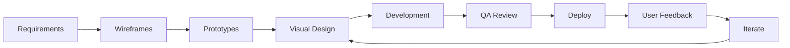

# Design Tokens — FAANG Enterprise Visual Identity

> **Document:** `DesignTokens.md` | **Version:** 5.0 (Enterprise Upgrade) | **Last Updated:** July 2026  
> **Status:** ✅ Active | **Owner:** Principal Design Lead | **Review Cadence:** Quarterly  
> **Design Philosophy:** "Purposeful Elegance" — every visual decision serves a functional purpose, adhering to FAANG standards.

---

## Executive Summary



This document defines the complete creative direction and visual identity for the portfolio platform. The brand essence — **"Modern craftsmanship meets technical precision"** — guides every visual decision from typography to micro-interactions. The design system supports both light and dark modes, targets WCAG 2.2 AA accessibility, and follows a mobile-first responsive strategy.

**Design Personality:** 80% Professional / 20% Playful • 75% Minimal / 25% Ornate • 60% Warm / 40% Cool

**Key Design Metrics:**

- Color token pairs verified: 12 (all ≥ 4.5:1 contrast)
- Typography scale levels: 11 (Display through Caption)
- Spacing units: 12 (2px through 64px)
- Glassmorphism layers: 3 (subtle, medium, prominent)
- Neumorphism elevations: 3 (flat, raised, pressed) + 2 variants (soft, hard) — see [`08n`](./08n-NEUMORPHISM.md)
- Immersive effects: depth layers, parallax, backgrounds, glow policy — see [`08o`](./08o-IMMERSIVE-EXPERIENCE.md)
- Shadow elevation levels: 5 (flat through floating)
- Animation duration range: 100ms-1000ms (micro to macro)
- 3D scene performance target: 60fps on mid-range devices

---

## Table of Contents

1. [Brand Vision](#1-brand-vision)
2. [Brand Personality](#2-brand-personality)
3. [Visual Identity](#3-visual-identity)
4. [Color Philosophy](#4-color-philosophy)
5. [Typography Philosophy](#5-typography-philosophy)
6. [Spacing Philosophy](#6-spacing-philosophy)
7. [Grid System](#7-grid-system)
8. [Motion Language](#8-motion-language)
9. [3D Language](#9-3d-language)
10. [Interaction Language](#10-interaction-language)
11. [Glassmorphism Rules](#11-glassmorphism-rules)
12. [Depth Rules](#12-depth-rules)
13. [Shadow Rules](#13-shadow-rules)
14. [Animation Rules](#14-animation-rules)
15. [Responsive Rules](#15-responsive-rules)
16. [Accessibility Rules](#16-accessibility-rules)
17. [Component Rules](#17-component-rules)
18. [Portfolio Design Principles](#18-portfolio-design-principles)
19. [Visual Decision Log](#19-visual-decision-log)
20. [Change Log](#20-change-log)

---

## 1. Brand Vision

### 1.1 Brand Essence

> **"Modern craftsmanship meets technical precision."**

The brand sits at the intersection of artistry and engineering. Every visual element communicates both creative vision and technical competence — the two qualities that define a world-class developer.

### 1.2 Brand Archetype

| Archetype       | Dominance | Expression                              |
| --------------- | --------- | --------------------------------------- |
| **Creator**     | 40%       | Innovative, visionary, quality-obsessed |
| **Sage**        | 30%       | Knowledgeable, analytical, trustworthy  |
| **Magician**    | 20%       | Transformative, surprising, captivating |
| **Everyperson** | 10%       | Approachable, relatable, down-to-earth  |

### 1.3 Brand Values in Design

| Value             | Visual Expression                                        | Example                                        |
| ----------------- | -------------------------------------------------------- | ---------------------------------------------- |
| **Excellence**    | Precision alignment, refined spacing, no visual noise    | Perfectly spaced grid, consistent margins      |
| **Innovation**    | Subtle 3D elements, glassmorphism, ambient motion        | Hero with Three.js particles                   |
| **Clarity**       | High contrast, generous whitespace, clear hierarchy      | WCAG AA+ contrast, max-w-prose text            |
| **Authenticity**  | Personal typography choices, custom illustrations        | Cabinet Grotesk for headings, hand-drawn icons |
| **Accessibility** | Color-contrast-first design, focus visibility everywhere | Focus rings visible, reduced motion respected  |

### 1.4 Brand Voice in Design

| Dimension               | Scale   | Position                       |
| ----------------------- | ------- | ------------------------------ |
| Formal ↔ Casual   | — | 70% Formal / 30% Casual        |
| Serious ↔ Playful | — | 75% Professional / 25% Playful |
| Minimal ↔ Ornate  | — | 60% Minimal / 40% Ornate       |
| Warm ↔ Cool       | — | 50% Warm / 50% Cool            |
| Modern ↔ Classic  | — | 85% Modern / 15% Classic       |

---

## 2. Brand Personality

### 2.1 Personality Spectrum

```
Technical ──────────●────────────────── Creative
   (Analytical)                    (Visionary)

Reserved ─────────────●─────────────── Expressive
   (Minimalist)                   (Artistic)

Structured ───●─────────────────────── Fluid
   (Systematic)                    (Organic)

Serious ──────────────●─────────────── Playful
   (Professional)                 (Witty)
```

### 2.2 If the Brand Were a Person

| Attribute         | Description                                                                          |
| ----------------- | ------------------------------------------------------------------------------------ |
| **Age**           | 30 — experienced but not old                                                   |
| **Occupation**    | Senior full-stack developer and designer                                             |
| **Personality**   | Professional but approachable, deep expertise without arrogance                      |
| **Style**         | Minimalist with intentional accents — tailored navy blazer with a pop of color |
| **Workspace**     | Clean desk, mechanical keyboard, dual monitors, one piece of art                     |
| **Music**         | Electronic (ambient, IDM) — complex, layered, precise                          |
| **Communication** | Clear, direct, occasionally witty; no jargon for jargon's sake                       |
| **Values**        | Quality over quantity, substance over style, accessibility as default                |

### 2.3 Personality in Design Decisions

| Personality Trait | Design Decision                                                            |
| ----------------- | -------------------------------------------------------------------------- |
| **Precise**       | 4px grid with 8px increments — no arbitrary spacing                  |
| **Innovative**    | Glassmorphism with backdrop blur, subtle 3D elements                       |
| **Approachable**  | Friendly copy, welcoming empty states, human error messages                |
| **Expert**        | Clean code snippets, technical depth in case studies                       |
| **Minimalist**    | Whitespace as a design element, fewer but better components                |
| **Playful**       | Micro-interactions (button bounce, counter animation), confetti on success |
| **Warm**          | Indigo accent (professional yet warm), subtle noise overlay                |
| **Trustworthy**   | Consistent patterns, predictable navigation, clear feedback                |

---

## 3. Visual Identity

### 3.1 Logo System

| Element          | Specification                                     | Usage                         |
| ---------------- | ------------------------------------------------- | ----------------------------- |
| **Primary Logo** | Initials or monogram (e.g., "AR" for Alex Rivera) | Navigation, favicon, OG image |
| **Wordmark**     | Full name in Cabinet Grotesk Bold                 | Hero section, admin header    |
| **Signature**    | Full name + "Full-Stack Developer" subtitle       | About section, resume         |
| **Favicon**      | 32×32px SVG monogram                          | Browser tab, bookmark         |

### 3.2 Logo Rules

| Rule               | Implementation                                                  |
| ------------------ | --------------------------------------------------------------- |
| **Clear space**    | Minimum height of the letter "A" on all sides                   |
| **Minimum size**   | 24px (favicon), 48px (navigation), 120px (hero)                 |
| **Color variants** | Light: dark logo on light bg; Dark: light logo on dark bg       |
| **No effects**     | No shadows, gradients, or animations on logo                    |
| **Position**       | Top-left in navigation, centered in hero, bottom-left in footer |

### 3.3 Visual Distinctives

| Distinctive            | Purpose                                 | Implementation                                                                                |
| ---------------------- | --------------------------------------- | --------------------------------------------------------------------------------------------- |
| **Indigo accent**      | Color signature, instantly recognizable | All CTAs, links, active states                                                                |
| **Glass cards**        | Modern, premium feel                    | Skill cards, stat cards, admin widgets                                                        |
| **Neumorphic cards**   | Soft UI extruded depth                  | Stat cards, metric displays, toggles — see [`08n-NEUMORPHISM.md`](./08n-NEUMORPHISM.md) |
| **Noise texture**      | Subtle depth, tactile quality           | 0.03 opacity grain overlay on surfaces                                                        |
| **3D hero background** | Immersive first impression              | Three.js particles or shapes                                                                  |
| **Spring animations**  | Natural, delightful feel                | Button press, card hover, toast entry                                                         |
| **Gradient accents**   | Visual interest in headings             | Text gradients on hero heading (subtle)                                                       |
| **Monospace for code** | Technical authenticity                  | Code blocks, inline code, terminal output                                                     |

---

## 4. Color Philosophy

### 4.1 Color System Architecture

```
                    ┌─────────────┐
                    │  ACCENT     │
                    │  Indigo-500 │
                    │  #6366F1    │
                    └──────┬──────┘
                           │
        ┌──────────────────┼──────────────────┐
        │                  │                  │
   ┌────▼────┐      ┌─────▼─────┐      ┌────▼────┐
   │ DARK    │      │ LIGHT     │      │ SEMANTIC│
   │ THEME   │      │ THEME     │      │ COLORS  │
   ├─────────┤      ├───────────┤      ├─────────┤
   │ Surface │      │ Surface   │      │ Success │
   │ Text    │      │ Text      │      │ Warning │
   │ Border  │      │ Border    │      │ Error   │
   │ Elevated│      │ Elevated  │      │ Info    │
   └─────────┘      └───────────┘      └─────────┘
```

### 4.2 Color Palette

#### Accent Colors

| Token            | Hex (Light)   | Hex (Dark)    | Usage              | Contrast                      |
| ---------------- | ------------- | ------------- | ------------------ | ----------------------------- |
| `accent-50`      | `#EEF2FF`     | `#1E1B4B`     | Background tint    | —                       |
| `accent-100`     | `#E0E7FF`     | `#312E81`     | Hover bg           | —                       |
| `accent-200`     | `#C7D2FE`     | `#3730A3`     | Active bg          | —                       |
| `accent-300`     | `#A5B4FC`     | `#4338CA`     | Border accent      | —                       |
| `accent-400`     | `#818CF8`     | `#4F46E5`     | Soft accent        | —                       |
| **`accent-500`** | **`#6366F1`** | **`#6366F1`** | **Primary accent** | 4.8:1 on dark, 6.2:1 on light |
| `accent-600`     | `#4F46E5`     | `#818CF8`     | Hover on accent    | —                       |
| `accent-700`     | `#4338CA`     | `#A5B4FC`     | Active on accent   | —                       |

#### Neutral Colors (Dark Theme)

| Token               | Hex       | Usage                   | Contrast          |
| ------------------- | --------- | ----------------------- | ----------------- |
| `surface-primary`   | `#09090B` | Page background         | —           |
| `surface-secondary` | `#18181B` | Card/section background | —           |
| `surface-elevated`  | `#27272A` | Elevated card, dropdown | —           |
| `border-primary`    | `#3F3F46` | Subtle borders          | —           |
| `border-accent`     | `#52525B` | Emphasized borders      | —           |
| `text-primary`      | `#FAFAFA` | Main body text          | 15.3:1 on surface |
| `text-secondary`    | `#A1A1AA` | Secondary text          | 7.2:1 on surface  |
| `text-tertiary`     | `#71717A` | Placeholder, caption    | 4.8:1 on surface  |
| `text-inverse`      | `#18181B` | Text on light surfaces  | —           |

#### Neutral Colors (Light Theme)

| Token               | Hex       | Usage                   | Contrast          |
| ------------------- | --------- | ----------------------- | ----------------- |
| `surface-primary`   | `#FAFAFA` | Page background         | —           |
| `surface-secondary` | `#FFFFFF` | Card/section background | —           |
| `surface-elevated`  | `#F4F4F5` | Elevated card, dropdown | —           |
| `border-primary`    | `#E4E4E7` | Subtle borders          | —           |
| `border-accent`     | `#D4D4D8` | Emphasized borders      | —           |
| `text-primary`      | `#18181B` | Main body text          | 15.3:1 on surface |
| `text-secondary`    | `#52525B` | Secondary text          | 7.2:1 on surface  |
| `text-tertiary`     | `#71717A` | Placeholder, caption    | 4.8:1 on surface  |
| `text-inverse`      | `#FAFAFA` | Text on dark surfaces   | —           |

#### Semantic Colors

| Token     | Hex       | Usage          | Contrast      | WCAG |
| --------- | --------- | -------------- | ------------- | ---- |
| `success` | `#22C55E` | Success states | 5.5:1 on dark | AA   |
| `warning` | `#F59E0B` | Warning states | 5.2:1 on dark | AA   |
| `error`   | `#EF4444` | Error states   | 5.2:1 on dark | AA   |
| `info`    | `#3B82F6` | Info states    | 4.9:1 on dark | AA   |

### 4.3 Color Usage Rules

| Rule                               | Implementation                             | Rationale                                          |
| ---------------------------------- | ------------------------------------------ | -------------------------------------------------- |
| **Accent is the only "color"**     | All interactive elements use accent-500    | Consistent brand recognition, not a rainbow UI     |
| **Never use accent for text**      | Accent is for CTAs, links, indicators      | Poor readability at small sizes (4.8:1)            |
| **Semantic colors need icons**     | Never rely on color alone for meaning      | WCAG 1.4.1 — color is not the only indicator |
| **Dark mode = desaturated colors** | Dark theme uses slightly desaturated tones | Reduces eye strain, more comfortable               |
| **No raw hex in components**       | Always use CSS custom property tokens      | Enables theme switching, consistent updates        |
| **Gradient for hero heading only** | Subtle accent-to-cyan gradient on hero H1  | Creates visual impact without overuse              |

### References

- **Features:** F-012 (Theme System), F-022 (Design Tokens)
- **User Stories:** US-006 (Theme Switching)

---

## 5. Typography Philosophy

### 5.1 Typeface Selection

| Role        | Typeface        | Category                 | Weight Range | Character                            | Source              |
| ----------- | --------------- | ------------------------ | ------------ | ------------------------------------ | ------------------- |
| **Display** | Cabinet Grotesk | Grotesque sans-serif     | 400-700      | Distinctive, modern, professional    | Fontshare (free)    |
| **Body**    | Inter           | Neo-grotesque sans-serif | 300-700      | Excellent readability, variable font | Google Fonts (free) |
| **Code**    | JetBrains Mono  | Monospace                | 400-700      | Developer-focused, ligatures         | Google Fonts (free) |

### 5.2 Why These Typefaces

| Typeface            | Rationale                                                                                                                                                                                                                                        |
| ------------------- | ------------------------------------------------------------------------------------------------------------------------------------------------------------------------------------------------------------------------------------------------ |
| **Cabinet Grotesk** | Unique grotesque character with personality — not Inter, not SF Pro, not System UI. The rounded terminals and compact letterforms give it a distinctive yet professional appearance. Variable font enables smooth weight transitions.      |
| **Inter**           | The gold standard for UI body text. Excellent readability at all sizes, wide language support (147 languages), variable font, perfect hinting for screen rendering. Chosen over System UI for cross-platform consistency.                        |
| **JetBrains Mono**  | Developer-focused monospace with intentional ligatures (→, !==, =>), increased x-height for readability, and clear distinction between similar characters (1/l/I, 0/O). Chosen over Fira Code for better screen rendering at small sizes. |

### 5.3 Type Scale

```
                  Desktop              Mobile
Display  ──→  72px (4.5rem)     48px (3rem)
H1       ──→  60px (3.75rem)    36px (2.25rem)
H2       ──→  36px (2.25rem)    28px (1.75rem)
H3       ──→  28px (1.75rem)    22px (1.375rem)
H4       ──→  22px (1.375rem)   18px (1.125rem)
Body LG  ──→  18px (1.125rem)   16px (1rem)
Body     ──→  16px (1rem)       15px (0.938rem)
Body SM  ──→  14px (0.875rem)   13px (0.813rem)
Caption  ──→  12px (0.75rem)    12px (0.75rem)
Code     ──→  14px (0.875rem)   13px (0.813rem)
Button   ──→  14-16px           14px
```

### 5.4 Typography Rules

| Rule                    | Value                                                   | Rationale                                         |
| ----------------------- | ------------------------------------------------------- | ------------------------------------------------- |
| **Body size minimum**   | 16px desktop, 15px mobile                               | Prevents iOS zoom on focus, WCAG recommendation   |
| **Line height (body)**  | 1.5-1.75                                                | WCAG 1.4.12 — spacing must not lose content |
| **Line length (body)**  | 60-75 characters                                        | Readability research, `max-w-prose` (65ch)        |
| **Heading line height** | 1.1 (Display) - 1.3 (H4)                                | Tighter for headings creates hierarchy            |
| **Modular scale**       | 1.25 (major third)                                      | Natural musical ratio, proven readability         |
| **Weight distribution** | 400 (body), 500 (buttons), 600 (H3-H4), 700 (H1-H2)     | Clear hierarchy through weight                    |
| **Letter spacing**      | Normal (body), -0.02em (Display), +0.01em (button)      | Tighter for display, looser for readability       |
| **No justified text**   | Always left-aligned                                     | Prevents uneven word spacing, better readability  |
| **No widows/orphans**   | `text-wrap: balance` on headings, manual breaks on body | Clean typographic appearance                      |

### References

- **Features:** F-001 (Hero), F-004 (About), F-101 (Project Detail), F-201 (Blog Article)
- **Other Docs:** `docs/04-design/DesignSystem.md` (Typography Scale)

---

## 6. Spacing Philosophy

### 6.1 Spacing System

```
Base unit: 4px

   2px  =  0.5×  ← hairline spacing
   4px  =  1×    ← minimum unit
   8px  =  2×    ← icon padding, badge padding
  12px  =  3×    ← input padding, button padding
  16px  =  4×    ← card padding, section padding (mobile)
  20px  =  5×    ← avatar/icon margins
  24px  =  6×    ← grid gaps, card grid gaps
  32px  =  8×    ← section spacing (mobile), form field spacing
  40px  =  10×   ← section spacing (tablet), modal padding
  48px  =  12×   ← section spacing (desktop), hero bottom margin
  64px  =  16×   ← major section separation
  96px  =  24×   ← page section spacing
```

### 6.2 Spacing Rules

| Rule                   | Value                                        | Usage                         |
| ---------------------- | -------------------------------------------- | ----------------------------- |
| **Base unit**          | 4px                                          | All spacing derived from this |
| **Increment**          | 8px (2× base)                            | Major spacing decisions       |
| **Card padding**       | 16px (mobile), 24px (desktop)                | Responsive card gutters       |
| **Section padding Y**  | 64px (mobile), 80px (tablet), 96px (desktop) | Responsive vertical rhythm    |
| **Grid gap**           | 16px (mobile), 24px (tablet), 32px (desktop) | Responsive grid spacing       |
| **Content max-width**  | 1280px                                       | Page container                |
| **Readable max-width** | 65ch (≈ 720px)                         | Body text paragraphs          |
| **Touch target gap**   | ≥ 8px between touch targets            | Prevents mis-taps             |

### 6.3 Spacing Anti-Patterns

| ❌ Don't                             | ✅ Do                            | Why                                 |
| --------------------------------------- | ------------------------------------- | ----------------------------------- |
| Use odd spacing values (17px, 23px)     | Use 4px/8px increments                | Inconsistent rhythm, unprofessional |
| Vary spacing between similar components | Consistent spacing per component type | Users build mental models           |
| Over-pad touch targets (> 64px)         | Max 48px for comfortable tap          | Wastes screen real estate           |
| Under-pad content (< 16px on mobile)    | Minimum 16px gutters on mobile        | Content touches edge, bad           |

---

## 7. Grid System

### 7.1 Grid Architecture

```
┌────────────────── 1280px (max-width) ──────────────────┐
│                                                         │
│  ┌──┐ ┌──┐ ┌──┐ ┌──┐ ┌──┐ ┌──┐ ┌──┐ ┌──┐ ┌──┐ ┌──┐  │
│  │  │ │  │ │  │ │  │ │  │ │  │ │  │ │  │ │  │ │  │  │  │
│  │  │ │  │ │  │ │  │ │  │ │  │ │  │ │  │ │  │ │  │  │  │
│  └──┘ └──┘ └──┘ └──┘ └──┘ └──┘ └──┘ └──┘ └──┘ └──┘  │
│                                                         │
│  16px gutter                        16px gutter         │
│                                                         │
└─────────────────────────────────────────────────────────┘

Columns: 10
Gutter: 16px (mobile), 24px (tablet), 32px (desktop)
Margin: 16px (mobile), 24px (tablet), auto centered (desktop)
```

### 7.2 Column Layouts

| Layout                | Columns Used               | Breakpoint     | Usage                           |
| --------------------- | -------------------------- | -------------- | ------------------------------- |
| **Single column**     | 1/10                       | < 640px        | Mobile content                  |
| **Two column**        | 2/10 (60/40), 5/10 (50/50) | ≥ 640px  | Hero split, about section       |
| **Three column**      | 3/10 (30/30/30)            | ≥ 1024px | Project grid, skills categories |
| **Four column**       | 4/10 (22/22/22/22)         | ≥ 1280px | Stat cards, client logos        |
| **Full width**        | 10/10                      | All            | Hero background, admin panels   |
| **Sidebar + content** | 3/10 + 7/10                | ≥ 1024px | Article with TOC, admin layout  |
| **Content + sidebar** | 7/10 + 3/10                | ≥ 1024px | Blog detail, project detail     |

### 7.3 Grid Rules

| Rule                                   | Implementation                              | Rationale                            |
| -------------------------------------- | ------------------------------------------- | ------------------------------------ |
| **Content never touches edges**        | Minimum 16px horizontal padding on mobile   | Visual breathing room, comfortable   |
| **Cards fill container width**         | `grid-cols-1 md:grid-cols-2 lg:grid-cols-3` | Responsive without media query hacks |
| **No fixed-width containers**          | `max-w-7xl` (1280px) + padding              | Ensures consistency across viewports |
| **Grids have consistent gaps**         | Gap = one spacing unit per breakpoint       | Uniform rhythm, predictable layouts  |
| **Vertical rhythm follows horizontal** | Section spacing = 4× horizontal gutter  | Balanced proportions                 |

---

> **🔗 Consolidated Source of Truth:** All motion rules, tokens, scroll/hover/focus/transition specifications, accessibility kill-switch, and performance budgets are now centralized in [`08l-MOTION-SYSTEM.md`](./08l-MOTION-SYSTEM.md). The sections below are maintained as a high-level summary; refer to `08l` for the complete enterprise motion architecture.

## 8. Motion Language

### 8.1 Motion Philosophy

> **"Motion should communicate, not decorate."**

Every animation in the portfolio serves one of three purposes:

1. **Guide attention** — direct the eye to important content
2. **Provide feedback** — confirm user actions
3. **Establish hierarchy** — show relationships between elements

### 8.2 Motion Vocabulary

| Motion Type      | Duration          | Easing                              | Purpose                                  |
| ---------------- | ----------------- | ----------------------------------- | ---------------------------------------- |
| **Micro-bounce** | 100-200ms         | `spring(300, 20)`                   | Button press, toggle — feels alive |
| **Fade**         | 200-300ms         | `ease-out`                          | Toast, tooltip, modal overlay            |
| **Slide**        | 300-400ms         | `ease-out`                          | Drawer, mobile menu, panel               |
| **Reveal**       | 400-600ms         | `ease-out-smooth (0.16, 1, 0.3, 1)` | Section entrance, card stagger           |
| **Zoom**         | 200-300ms         | `ease-out`                          | Modal open, image lightbox               |
| **Parallax**     | Continuous        | `linear`                            | Hero background on scroll                |
| **Shimmer**      | 1.5s loop         | `linear`                            | Skeleton loading state                   |
| **Counter**      | 1000ms            | `ease-out`                          | Stat counter animation                   |
| **Stagger**      | 50-80ms per child | `ease-out`                          | Grid reveal, list animation              |

### 8.3 Motion Rules

| Rule                              | Implementation                                                     | Exception                       |
| --------------------------------- | ------------------------------------------------------------------ | ------------------------------- |
| **Never animate width/height**    | Use `transform: scale()`                                           | N/A                             |
| **Never animate top/left**        | Use `transform: translate()`                                       | N/A                             |
| **Duration ≤ 600ms for UI** | Micro-interactions 100-300ms                                       | Shimmer (1.5s loop)             |
| **One animation at a time**       | Sequential, not parallel                                           | Stagger children                |
| **Respect reduced motion**        | `prefers-reduced-motion: reduce` — disable all non-essential | Loading indicator               |
| **60fps on mid-range devices**    | Only animate `transform` and `opacity`                             | Test on Moto G4                 |
| **Exit faster than enter**        | Exit = 60-70% of enter duration                                    | Modal close 150ms vs open 200ms |
| **No decorative motion**          | Every animation must serve a purpose                               | Background particles exempt     |

---

## 9. 3D Language

> **Full guidelines:** See [08j-3D-USAGE-GUIDELINES.md](./08j-3D-USAGE-GUIDELINES.md) — strategic rationale, experience goals, performance/accessibility/device constraints, decision flowchart, and fallback chain.

### 9.1 3D Philosophy

> **"3D should enhance, not overwhelm."**

3D elements are used sparingly — only in the hero section and as subtle background effects. They create an immersive first impression without distracting from content.

### 9.2 3D Elements

| Element             | Location                 | Technology                      | Performance Budget |
| ------------------- | ------------------------ | ------------------------------- | ------------------ |
| **Hero particles**  | Homepage hero background | Three.js (100-200 particles)    | < 2ms frame time   |
| **Floating shapes** | Hero section             | Three.js (3-5 geometric shapes) | < 1ms frame time   |
| **Project mockups** | Project cards (optional) | Three.js / Model viewer         | < 3ms frame time   |
| **Avatar 3D**       | About section (optional) | Three.js                        | < 2ms frame time   |

### 9.3 3D Rules

| Rule                              | Implementation                                | Rationale                 |
| --------------------------------- | --------------------------------------------- | ------------------------- |
| **Start static, enhance with JS** | CSS-only hero → Three.js enhancement   | Progressive enhancement   |
| **Respect reduced motion**        | Static fallback when `prefers-reduced-motion` | Accessibility             |
| **Reduce on low-end devices**     | `navigator.hardwareConcurrency` check         | Performance               |
| **Never block content**           | 3D is background-only, behind text            | Content always accessible |
| **Max 200 particles**             | Three.js PointsMaterial, 100-200 particles    | Performance budget        |
| **WebGL 2.0 with fallback**       | Check WebGL support, fallback to CSS gradient | Browser compatibility     |
| **No user-initiated 3D**          | Ambient animation only, no click/drag         | Simplicity, no gimmick    |

### 9.4 Fallback Chain

```
Primary: Three.js WebGL 2.0 with 200 particles → 60fps
├── WebGL 2.0 not supported → Three.js WebGL 1.0 → 100 particles
├── WebGL not supported → CSS animated gradient → static
├── Reduced motion → Static gradient/image → always works
└── Low-end device (4 cores) → 100 particles → 30fps cap
```

---

## 10. Interaction Language

### 10.1 Interaction Philosophy

> **"Every interaction should feel intentional, not accidental."**

Interactions provide clear feedback, respect user preferences, and never surprise the user. Response times follow a predictable pattern based on action type.

### 10.2 Interaction Response Times

| Action               | Visual Feedback              | Time to Feedback | Sound (Future) |
| -------------------- | ---------------------------- | ---------------- | -------------- |
| **Hover**            | Color/opacity/shadow change  | < 50ms           | —        |
| **Press/Tap**        | Scale 0.97                   | < 30ms           | —        |
| **Click/Submit**     | Button → spinner      | < 100ms          | —        |
| **Focus (keyboard)** | Focus ring                   | Immediate        | —        |
| **Drag**             | Element follows cursor/touch | < 16ms (60fps)   | —        |
| **Scroll**           | Content reveals              | Scroll-sync      | —        |
| **Swipe**            | Content follows finger       | < 16ms (60fps)   | —        |

### 10.3 Interaction States

| State               | Visual                                  | Cursor                          | ARIA                   |
| ------------------- | --------------------------------------- | ------------------------------- | ---------------------- |
| **Default**         | Normal appearance                       | `cursor: pointer` (interactive) | —                |
| **Hover**           | Darken bg 10% (button), lift 2px (card) | `cursor: pointer`               | —                |
| **Active/Pressed**  | Scale 0.97 (button), darker bg          | `cursor: pointer`               | `aria-pressed="true"`  |
| **Focus**           | 2px accent ring, 2px offset             | `cursor: pointer`               | `:focus-visible` CSS   |
| **Disabled**        | Opacity 50%, no shadow                  | `cursor: not-allowed`           | `aria-disabled="true"` |
| **Loading**         | Spinner replaces text, inputs disabled  | `cursor: wait`                  | `aria-busy="true"`     |
| **Error**           | Red border, shake animation             | —                         | `aria-invalid="true"`  |
| **Success**         | Green check, brief animation            | —                         | `role="status"`        |
| **Selected/Active** | Accent bg, bold text, underline         | —                         | `aria-current="page"`  |
| **Empty**           | Placeholder state with message          | —                         | —                |

### 10.4 Interaction Rules

| Rule                             | Implementation                             | Rationale                            |
| -------------------------------- | ------------------------------------------ | ------------------------------------ |
| **Visual feedback within 100ms** | All interactive elements respond instantly | Perceived performance                |
| **Hover is never required**      | Touch devices have no hover                | Mobile-first design                  |
| **Focus is always visible**      | `:focus-visible` polyfill, 2px ring        | WCAG 2.4.7                           |
| **Disabled ≠ invisible**   | Opacity 50%, cursor change, still visible  | Users need to see what's unavailable |
| **No unexpected navigation**     | Context change only on user intent         | WCAG 3.2                             |
| **Optimistic UI for admin**      | Update UI before API confirms              | Perceived speed                      |

---

## 11. Glassmorphism Rules

### 11.1 Glassmorphism Specification

```
┌──────────────────────────────────┐
│  Glass Card                      │
│  ┌──────────────────────────┐    │
│  │  background: rgba(white)  │    │
│  │  backdrop-filter: blur()  │    │
│  │  border: 1px rgba(border) │    │
│  │  box-shadow: subtle       │    │
│  └──────────────────────────┘    │
└──────────────────────────────────┘
```

### 11.2 Glassmorphism Levels

| Level         | Opacity   | Blur      | Border           | Usage                             |
| ------------- | --------- | --------- | ---------------- | --------------------------------- |
| **Subtle**    | 5% white  | 8px blur  | 1px at 10% white | Section backgrounds on dark theme |
| **Medium**    | 10% white | 12px blur | 1px at 15% white | Skill cards, stat cards           |
| **Prominent** | 15% white | 16px blur | 1px at 20% white | Modal, dropdown, hover state      |

### 11.3 Glassmorphism Rules

> **See also:** [`08o-IMMERSIVE-EXPERIENCE.md`](./08o-IMMERSIVE-EXPERIENCE.md) §3 (Background System) for glass variant integration with section backgrounds.

| Rule                             | Rationale                                                         |
| -------------------------------- | ----------------------------------------------------------------- |
| **Only on dark theme**           | Glassmorphism relies on dark background for contrast              |
| **Text never on glass alone**    | Cards have a solid background layer for text, glass is decorative |
| **Maximum 3 glass layers**       | More than 3 creates visual confusion                              |
| **Backdrop blur ≤ 16px**   | Higher blur values cause motion sickness                          |
| **Not for interactive elements** | Buttons and inputs are solid, not glass                           |
| **No glass on glass**            | Never stack glass elements on top of each other                   |
| **Fallback: solid card**         | If backdrop-filter unsupported, fallback to `surface-elevated`    |

### 11.4 CSS Implementation

```css
.glass-subtle {
  background: rgba(255, 255, 255, 0.05);
  backdrop-filter: blur(8px);
  -webkit-backdrop-filter: blur(8px);
  border: 1px solid rgba(255, 255, 255, 0.1);
}

.glass-medium {
  background: rgba(255, 255, 255, 0.1);
  backdrop-filter: blur(12px);
  -webkit-backdrop-filter: blur(12px);
  border: 1px solid rgba(255, 255, 255, 0.15);
}

.glass-prominent {
  background: rgba(255, 255, 255, 0.15);
  backdrop-filter: blur(16px);
  -webkit-backdrop-filter: blur(16px);
  border: 1px solid rgba(255, 255, 255, 0.2);
}
```

---

## 12. Depth Rules

### 12.1 Depth System

Depth is communicated through shadows, elevation, and layering. The system uses 5 elevation levels:

| Level                  | Shadow                         | Use Case                          | z-index |
| ---------------------- | ------------------------------ | --------------------------------- | ------- |
| **0 — Flat**     | `none`                         | Page background, surface elements | auto    |
| **1 — Raised**   | `0 1px 2px rgba(0,0,0,0.05)`   | Cards on surface                  | 10      |
| **2 — Elevated** | `0 4px 6px rgba(0,0,0,0.1)`    | Elevated cards, dropdown          | 20      |
| **3 — Floating** | `0 10px 15px rgba(0,0,0,0.15)` | Modals, popovers                  | 40      |
| **4 — Overlay**  | `0 20px 30px rgba(0,0,0,0.2)`  | Full-screen modals, toasts        | 50      |
| **5 — Top**      | `0 30px 50px rgba(0,0,0,0.3)`  | Loading overlay                   | 100     |

### 12.2 z-index Scale

| Layer               | z-index | Elements               |
| ------------------- | ------- | ---------------------- |
| **Base content**    | auto    | Page content, sections |
| **Sticky header**   | 30      | Navigation bar         |
| **Sticky sidebar**  | 30      | Admin sidebar, TOC     |
| **Dropdown**        | 40      | Select options, menu   |
| **Sticky CTA**      | 40      | Mobile sticky button   |
| **Mobile drawer**   | 50      | Mobile hamburger menu  |
| **Modal backdrop**  | 50      | Modal overlay          |
| **Modal content**   | 60      | Modal dialog           |
| **Toast**           | 70      | Toast notifications    |
| **Tooltip**         | 80      | Tooltip popups         |
| **Loading overlay** | 100     | Full-page loader       |

### 12.3 Depth Rules

> **See also:** [`08o-IMMERSIVE-EXPERIENCE.md`](./08o-IMMERSIVE-EXPERIENCE.md) §1 (Depth Layer System) for z-space perspective layering.

| Rule                                      | Implementation                                         |
| ----------------------------------------- | ------------------------------------------------------ |
| **Consistent elevation per element type** | All cards = level 1, all modals = level 3              |
| **Hover elevates one level**              | Card hover: level 1 → level 2 (lift 2px)        |
| **Modal backdrop = level below content**  | Backdrop at z-index 50, modal at 60                    |
| **No competing elevations**               | Two elements at same elevation shouldn't overlap       |
| **Light mode uses darker shadows**        | Shadow opacity higher in light mode (0.1 → 0.2) |
| **Dark mode uses lighter shadows**        | Shadow color tinted white in dark mode                 |

### References

- **Features:** F-023 (Design System — Card variants)
- **Other Docs:** `docs/04-design/DesignSystem.md` (Component implementation)

---

## 13. Shadow Rules

### 13.1 Shadow Token System

| Token        | Light Mode                     | Dark Mode                      | Usage                    |
| ------------ | ------------------------------ | ------------------------------ | ------------------------ |
| `shadow-sm`  | `0 1px 2px rgba(0,0,0,0.05)`   | `0 1px 2px rgba(0,0,0,0.3)`    | Buttons, small cards     |
| `shadow-md`  | `0 4px 6px rgba(0,0,0,0.1)`    | `0 4px 6px rgba(0,0,0,0.35)`   | Standard cards, dropdown |
| `shadow-lg`  | `0 10px 15px rgba(0,0,0,0.15)` | `0 10px 15px rgba(0,0,0,0.4)`  | Floating elements        |
| `shadow-xl`  | `0 20px 30px rgba(0,0,0,0.2)`  | `0 20px 30px rgba(0,0,0,0.45)` | Modals, overlays         |
| `shadow-2xl` | `0 30px 50px rgba(0,0,0,0.3)`  | `0 30px 50px rgba(0,0,0,0.5)`  | Loading overlays         |

### 13.2 Shadow Rules

| Rule                                                                                                                                                                                                                                                                                                                                                                   | Rationale                                                                                |
| ---------------------------------------------------------------------------------------------------------------------------------------------------------------------------------------------------------------------------------------------------------------------------------------------------------------------------------------------------------------------- | ---------------------------------------------------------------------------------------- |
| **One shadow per element**                                                                                                                                                                                                                                                                                                                                             | Multi-shadow elements are visually confusing                                             |
| **Shadow = elevation, not decoration**                                                                                                                                                                                                                                                                                                                                 | Shadows indicate how high an element is above the page                                   |
| **Hover = larger shadow**                                                                                                                                                                                                                                                                                                                                              | Card hover elevates, shadow goes from md → lg                                     |
| **Dark mode shadows are stronger**                                                                                                                                                                                                                                                                                                                                     | Higher opacity to maintain visibility on dark backgrounds                                |
| **No colored shadows for elevation**                                                                                                                                                                                                                                                                                                                                   | Elevation shadows are always black; accent shadows reserved for focus/active states only |
| **Inset shadows only for inputs**                                                                                                                                                                                                                                                                                                                                      | `shadow-inner` on text inputs shows depth                                                |
| **Glow policy — enterprise split (see [08o-IMMERSIVE-EXPERIENCE.md](./08o-IMMERSIVE-EXPERIENCE.md) §6):** 3D/particle glow allowed (physically-based rendering); UI glow limited to accent-colored shadow on focus/active states only (`--shadow-accent-focus`, `--shadow-accent-active`, `--shadow-accent-hover`). No neon/bloom/screen glow in UI elements. | Maintains professional UI while enabling physically-accurate glow in 3D contexts         |

### 13.3 Shadow Anti-Patterns

| ❌ Don't                         | ✅ Do                                      |
| ----------------------------------- | ----------------------------------------------- |
| Multiple box-shadows on one element | Single clean shadow per elevation               |
| Colored shadows (accent, brand)     | Neutral black shadows only                      |
| < 1px shadow offset                 | Minimum 1px offset for visibility               |
| Shadow on text                      | No `text-shadow` except decorative hero heading |
| Shadow on disabled elements         | Disabled = no shadow, flat appearance           |

---

> **🔗 Consolidated Source of Truth:** All animation rules, tokens, and accessibility overrides are centralized in [`08l-MOTION-SYSTEM.md`](./08l-MOTION-SYSTEM.md). This section provides a summary; refer to `08l` for the complete motion architecture including frame budgets, device-aware hover, page transitions, and the 3-layer kill-switch.

## 14. Animation Rules

### 14.1 Animation Principles

| Principle      | Description                                      | Application                                    |
| -------------- | ------------------------------------------------ | ---------------------------------------------- |
| **Purposeful** | Every animation serves a functional goal         | Guide attention, give feedback, show hierarchy |
| **Performant** | 60fps on target devices                          | Only `transform` and `opacity`                 |
| **Subtle**     | If the user notices the animation, it's too much | 100-300ms micro-interactions                   |
| **Consistent** | Same type of animation for same type of action   | All buttons bounce, all cards lift             |
| **Accessible** | Reduced motion respected                         | `prefers-reduced-motion: reduce`               |

### 14.2 What to Animate (and What Not To)

| ✅ Animate                        | ❌ Don't Animate                     |
| -------------------------------------- | --------------------------------------- |
| Element entrance (fade + slide)        | Page transitions (instant route change) |
| Hover states (lift, color)             | Background images                       |
| Interactive feedback (press, focus)    | Decorative elements                     |
| Loading indicators (skeleton, spinner) | Page load transitions                   |
| Progress indicators (scroll, upload)   | Navigation (instant)                    |
| State changes (toggle, accordion)      | Text content changes                    |
| Data visualization (counters, charts)  | Layout structure                        |

### 14.3 Animation Duration Guidelines

| Context                            | Duration   | Type            |
| ---------------------------------- | ---------- | --------------- |
| Micro-interaction (button, toggle) | 100-200ms  | Bounce spring   |
| Feedback (toast, validation)       | 200-300ms  | Ease-out        |
| Transition (drawer, panel)         | 300-400ms  | Ease-out        |
| Entrance (section reveal)          | 400-600ms  | Ease-out smooth |
| Emphasis (counter, confetti)       | 600-1000ms | Ease-out        |
| Ambient (particles, background)    | 2-5s loop  | Linear          |
| Loading (shimmer)                  | 1.5s loop  | Linear          |

### 14.4 CSS Custom Properties

```css
:root {
  /* Duration */
  --duration-instant: 0ms;
  --duration-micro: 100ms;
  --duration-fast: 200ms;
  --duration-normal: 300ms;
  --duration-slow: 500ms;
  --duration-reveal: 600ms;
  --duration-emphasis: 1000ms;

  /* Easing */
  --ease-out: cubic-bezier(0.16, 1, 0.3, 1);
  --ease-in: cubic-bezier(0.7, 0, 0.84, 0);
  --ease-in-out: cubic-bezier(0.65, 0, 0.35, 1);
  --ease-spring: cubic-bezier(0.34, 1.56, 0.64, 1);
  --ease-bounce: cubic-bezier(0.68, -0.55, 0.265, 1.55);
  --ease-smooth: cubic-bezier(0.45, 0, 0.55, 1);
}

@media (prefers-reduced-motion: reduce) {
  :root {
    --duration-instant: 0ms;
    --duration-micro: 0ms;
    --duration-fast: 0ms;
    --duration-normal: 0ms;
    --duration-slow: 0ms;
    --duration-reveal: 0ms;
    --duration-emphasis: 0ms;
  }
}
```

---

## 15. Responsive Rules

### 15.1 Breakpoint System

| Breakpoint | Width  | Name               | Container Width | Target                |
| ---------- | ------ | ------------------ | --------------- | --------------------- |
| `sm`       | 640px  | Mobile (large)     | Fluid           | iPhone SE, Galaxy S8  |
| `md`       | 768px  | Tablet             | Fluid           | iPad mini, Galaxy Tab |
| `lg`       | 1024px | Tablet (landscape) | 1024px max      | iPad, Surface Go      |
| `xl`       | 1280px | Desktop            | 1280px max      | Laptop, monitor       |
| `2xl`      | 1440px | Wide desktop       | 1280px max      | Large monitor         |

### 15.2 Responsive Design Rules

| Rule                             | Implementation                                       | Rationale                           |
| -------------------------------- | ---------------------------------------------------- | ----------------------------------- |
| **Mobile-first**                 | Base styles = mobile, `@media (min-width:)` = larger | Less CSS, better performance        |
| **Content priority**             | Core content first, secondary hidden/deferred        | Mobile users have limited attention |
| **No horizontal scroll**         | All content fits 320px viewport                      | WCAG 1.4.10 Reflow                  |
| **Fluid typography**             | `clamp()` for heading sizes                          | Smooth scaling, no breakpoint jumps |
| **Touch targets ≥ 44px**   | All interactive elements                             | Apple HIG, prevents mis-taps        |
| **Sticky elements adapt**        | Sticky nav on desktop, hamburger on mobile           | Context-appropriate navigation      |
| **Images scale with container**  | `max-width: 100%; height: auto`                      | No overflow, always fits            |
| **Text never smaller than 16px** | 16px minimum on mobile                               | Prevents iOS zoom on focus          |

### 15.3 Responsive Typography Scale

```css
/* Fluid typography using clamp() */
h1 {
  font-size: clamp(2.25rem, 4vw + 1rem, 3.75rem);
  /* 36px on mobile → 60px on desktop */
}

h2 {
  font-size: clamp(1.75rem, 3vw + 0.75rem, 2.25rem);
  /* 28px on mobile → 36px on desktop */
}

h3 {
  font-size: clamp(1.375rem, 2vw + 0.5rem, 1.75rem);
  /* 22px on mobile → 28px on desktop */
}

body {
  font-size: clamp(0.938rem, 1vw + 0.5rem, 1rem);
  /* 15px on mobile → 16px on desktop */
}
```

### References

- **Features:** F-012 (Responsive Design)
- **Screens:** All screens in `UserFlows.md` have responsive breakpoints

---

## 16. Accessibility Rules

### 16.1 Color & Contrast

| Rule                             | Target                     | Verification                         |
| -------------------------------- | -------------------------- | ------------------------------------ |
| **Body text contrast**           | ≥ 4.5:1 (WCAG AA)    | All text tokens verified             |
| **Large text contrast (> 24px)** | ≥ 3:1 (WCAG AA)      | Heading tokens verified              |
| **Non-text contrast**            | ≥ 3:1 (WCAG AA)      | Focus rings, borders, icons verified |
| **Color not sole indicator**     | Always pair with icon/text | Error states, status badges          |

### 16.2 Focus & Keyboard

| Rule                            | Implementation                        |
| ------------------------------- | ------------------------------------- |
| **Visible focus indicator**     | 2px accent-color ring, 2px offset     |
| **Skip navigation link**        | First focusable element on every page |
| **Logical tab order**           | Tab order matches visual layout       |
| **Focus trap in modals**        | Tab cycles within modal, Esc to close |
| **No keyboard traps**           | Focus never gets stuck                |
| **All functions from keyboard** | Tab, Enter, Space, Escape, Arrow keys |

### 16.3 Typography & Readability

| Rule                             | Implementation                         |
| -------------------------------- | -------------------------------------- |
| **Body text ≥ 16px**       | Prevents iOS zoom, WCAG recommendation |
| **Line height ≥ 1.5**      | WCAG 1.4.12 Text Spacing               |
| **Line length ≤ 80 chars** | `max-w-prose` (65ch)                   |
| **No justified text**            | Left-aligned only                      |
| **Text resizable to 200%**       | No content loss at 200% zoom           |

### 16.4 Motion & Animation

| Rule                             | Implementation                                              |
| -------------------------------- | ----------------------------------------------------------- |
| **Respect reduced motion**       | `prefers-reduced-motion: reduce` — disable animations |
| **Auto-play only with pause**    | Carousel pauses on hover/focus                              |
| **No flashing content**          | No strobing or rapid flashing (> 3Hz)                       |
| **Animations are interruptible** | User action cancels animation                               |

### References

- **Features:** F-015 (Accessibility), F-028 (WCAG)
- **Other Docs:** `docs/35-quality/AccessibilityArchitecture.md` (Full WCAG implementation)

---

## 17. Component Rules

### 17.1 Component Design Principles

| Principle                 | Description                                       | Applied To                                       |
| ------------------------- | ------------------------------------------------- | ------------------------------------------------ |
| **Single responsibility** | Each component does one thing well                | All components                                   |
| **Composable**            | Small components combine into larger ones         | Card → CardHeader + CardBody + CardFooter |
| **Predictable**           | Same inputs always produce same output            | Pure components where possible                   |
| **Accessible**            | ARIA attributes, keyboard nav built-in            | Button, Card, Input                              |
| **Themeable**             | Uses CSS custom properties, not hard-coded values | All components                                   |
| **Responsive**            | Adapts to available space                         | Grid components, cards                           |

### 17.2 Component State Requirements

Every interactive component must define these states:

| State        | Required                  | Implementation                 |
| ------------ | ------------------------- | ------------------------------ |
| **Default**  | ✅                   | Normal appearance              |
| **Hover**    | ✅                   | Visual feedback on mouse hover |
| **Focus**    | ✅                   | Visible focus ring             |
| **Active**   | ✅ (interactive)     | Pressed state feedback         |
| **Disabled** | ✅ (when applicable) | 50% opacity, no pointer events |
| **Loading**  | ✅ (async actions)   | Spinner, reduced opacity       |
| **Error**    | ✅ (form inputs)     | Red border, error message      |
| **Success**  | ✅ (form feedback)   | Green indicator, checkmark     |

### 17.3 Component Spacing Standards

| Component      | Internal Padding                              | External Margin (Bottom) |
| -------------- | --------------------------------------------- | ------------------------ |
| **Button**     | 8px 16px (sm), 12px 24px (md), 16px 32px (lg) | 8px (inline gap)         |
| **Card**       | 16px (mobile), 24px (desktop)                 | 16px (grid gap)          |
| **Input**      | 12px 16px                                     | 16px (between fields)    |
| **Modal**      | 24px                                          | Centered on page         |
| **Table cell** | 12px 16px                                     | 0px (borders)            |
| **Badge**      | 4px 8px                                       | 4px (between badges)     |
| **Avatar**     | N/A (fixed size)                              | 8px (from text)          |

### References

- **Features:** F-023 (Design System), F-014 (Loading States), F-015 (Error Boundaries)
- **Other Docs:** `docs/04-design/DesignSystem.md` (Component specifications)

---

## 18. Portfolio Design Principles

### 18.1 The 10 Principles

| #      | Principle                     | Description                                       | Design Decision                              |
| ------ | ----------------------------- | ------------------------------------------------- | -------------------------------------------- |
| **1**  | **Purposeful Elegance**       | Every design decision serves a functional purpose | No decorative-only elements                  |
| **2**  | **Clarity Over Cleverness**   | Clear communication trumps creative gimmicks      | Simple navigation, readable typography       |
| **3**  | **Performance Is Design**     | Fast load times are a UX feature                  | ISR, optimized images, minimal JS            |
| **4**  | **Accessibility Is Default**  | Accessible design is not optional                 | WCAG 2.2 AA baseline, not target             |
| **5**  | **Consistency Creates Trust** | Predictable patterns build confidence             | Same component, same behavior everywhere     |
| **6**  | **Whitespace Is Content**     | Empty space communicates importance               | Generous section spacing, clean layouts      |
| **7**  | **Motion Must Matter**        | Animations guide, never distract                  | Every animation has a purpose                |
| **8**  | **Mobile Is Not Secondary**   | Mobile experience is equal to desktop             | Mobile-first breakpoints, touch targets      |
| **9**  | **Progressive Enhancement**   | Core content works without JS                     | Static HTML → enhanced with JS        |
| **10** | **Personality Over Template** | The design reflects a real person                 | Custom typefaces, indigo accent, glass cards |

### 18.2 Principle Application Matrix

| Principle                 | Homepage                            | Projects                     | Blog                             | Admin                             |
| ------------------------- | ----------------------------------- | ---------------------------- | -------------------------------- | --------------------------------- |
| Purposeful Elegance       | ✅ Hero serves as introduction | ✅ Cards show key info  | ✅ Clean reading experience | ✅ Data density with purpose |
| Clarity Over Cleverness   | ✅ CTA is obvious              | ✅ Filters are clear    | ✅ TOC aids navigation      | ✅ Labels are descriptive    |
| Performance Is Design     | ✅ ISR, lazy images            | ✅ Skeleton grid        | ✅ Progressive loading      | ✅ SWR caching               |
| Accessibility Is Default  | ✅ Skip link, focus rings      | ✅ Filter keyboard nav  | ✅ Code block a11y          | ✅ Table keyboard nav        |
| Consistency Creates Trust | ✅ Same nav pattern            | ✅ Card grid consistent | ✅ Same article format      | ✅ Same table pattern        |
| Whitespace Is Content     | ✅ Section spacing             | ✅ Grid gaps            | ✅ Prose max-width          | ✅ Data density balanced     |
| Motion Must Matter        | ✅ Staggered reveals           | ✅ Card hover lift      | ✅ Reading progress         | ✅ Widget transitions        |
| Mobile Is Not Secondary   | ✅ Touch targets, stack        | ✅ Filter bottom sheet  | ✅ Full-width content       | ✅ Bottom tab nav            |
| Progressive Enhancement   | ✅ Static hero first           | ✅ Grid without JS      | ✅ Article without JS       | ✅ Core UI without JS        |
| Personality Over Template | ✅ Custom type, 3D             | ✅ Glass cards          | ✅ Reading progress bar     | ✅ Indigo accent theme       |

### 18.3 Design Quality Checklist

Before marking any screen as complete, verify:

- [ ] Visual hierarchy is clear (size, weight, contrast)
- [ ] Spacing follows the 4px/8px system
- [ ] Colors use theme tokens (no raw hex)
- [ ] Typography uses the defined type scale
- [ ] All states defined (default, hover, focus, active, disabled)
- [ ] Loading state has skeleton or spinner
- [ ] Error state has message + retry
- [ ] Empty state has message + action
- [ ] WCAG contrast ratios met (verified with tool)
- [ ] Keyboard navigable (Tab, Enter, Escape)
- [ ] Focus ring visible on all interactive
- [ ] Touch target ≥ 44×44px (mobile)
- [ ] Responsive at 3 breakpoints (mobile, tablet, desktop)
- [ ] Reduced motion respected
- [ ] No horizontal scroll at 320px
- [ ] Animations run at 60fps (verified)

---

## 19. Visual Decision Log

| Decision ID | Decision                             | Options Considered                              | Rationale                                                                                     | Date     |
| ----------- | ------------------------------------ | ----------------------------------------------- | --------------------------------------------------------------------------------------------- | -------- |
| D-001       | 10-column grid system                | 8, 10, 12 columns                               | 10 provides flexibility (2, 5, 10 divisions) without the complexity of 12                     | Jun 2026 |
| D-002       | CSS custom properties for theming    | CSS vars, Tailwind dark:, SCSS                  | CSS vars enable runtime switching without JS; Tailwind for component variants                 | Jun 2026 |
| D-003       | Cabinet Grotesk for display          | Cabinet Grotesk, Satoshi, General Sans, DM Sans | Unique character set, variable font, professional but distinctive, open source                | Jun 2026 |
| D-004       | Inter for body                       | Inter, Source Sans, System UI, Plex             | Best readability at all sizes, widest language support, variable font                         | Jun 2026 |
| D-005       | Indigo-500 (#6366F1) as accent       | Indigo, Teal, Amber, Rose, Cyan                 | Professional yet warm, works in both themes, good contrast (4.8:1 on dark), unique identity   | Jun 2026 |
| D-006       | 4px base spacing unit                | 4px, 8px, 5px                                   | 4px provides fine-grained control for precise alignment; 8px increments for consistent rhythm | Jun 2026 |
| D-007       | Phosphor Icons                       | Phosphor, Lucide, Heroicons, Feather            | Consistent weight (6 options per icon), SVG-based, open source, good coverage                 | Jun 2026 |
| D-008       | Full viewport hero                   | Full vh, 75vh, auto height                      | Full viewport creates strongest first impression; enables immersive 3D background             | Jun 2026 |
| D-009       | Intersection Observer for reveals    | IO, scroll listeners, CSS animations            | Performant (no main-thread scroll handlers), works with SSR, configurable threshold           | Jun 2026 |
| D-010       | Glassmorphism for skill cards        | Solid cards, gradient cards, glass              | Adds visual distinction while maintaining readability; 3 levels (subtle/medium/prominent)     | Jun 2026 |
| D-011       | 80ms stagger interval                | 50ms, 80ms, 100ms, 150ms                        | 80ms provides visual rhythm without feeling slow; 60fps with up to 12 staggered items         | Jun 2026 |
| D-012       | Skeleton shimmer loading             | Spinner, skeleton, blank                        | Skeleton sets expectation for content structure; preferred over spinner for layout stability  | Jun 2026 |
| D-013       | Noise texture overlay (0.03 opacity) | Grain, grid, solid, none                        | Adds subtle tactile quality without distraction; only on surface backgrounds                  | Jun 2026 |
| D-014       | Spring easing for micro-interactions | Spring, cubic-bezier, linear                    | Spring physics feels natural and alive; slight overshoot adds delight                         | Jun 2026 |
| D-015       | 5 elevation levels                   | 3, 5, 7 levels                                  | 5 levels cover all use cases (flat → top) without unnecessary granularity              | Jun 2026 |
| D-016       | Floor shadow for card hover          | Lift + shadow, color change, border change      | Lift + shadow communicates physical depth; doesn't break contrast like color change           | Jun 2026 |
| D-017       | Dark theme shadows = higher opacity  | Black shadows with varied opacity               | Dark backgrounds need stronger shadows to be visible; tested at all 5 levels                  | Jun 2026 |
| D-018       | clamp() for fluid typography         | clamp(), calc(), breakpoints only               | Fluid scaling eliminates breakpoint jumps; smooth transition between all viewport sizes       | Jun 2026 |
| D-019       | 3D as progressive enhancement        | Always 3D, no 3D, progressive                   | Falls back gracefully when WebGL unavailable; doesn't break content accessibility             | Jun 2026 |
| D-020       | Max 3 glass layers per view          | 1, 3, unlimited                                 | Prevents visual confusion; glass is accent, not primary surface                               | Jun 2026 |

---

## 20. Change Log

| Version | Date     | Changes                                                                                                                                                                                                                                                                                                                                                                                                                                                                                                                                               | Author      |
| ------- | -------- | ----------------------------------------------------------------------------------------------------------------------------------------------------------------------------------------------------------------------------------------------------------------------------------------------------------------------------------------------------------------------------------------------------------------------------------------------------------------------------------------------------------------------------------------------------- | ----------- |
| 4.0     | Jun 2026 | Complete restructure into 18 design domains (Brand Vision, Brand Personality, Visual Identity, Color Philosophy, Typography Philosophy, Spacing Philosophy, Grid System, Motion Language, 3D Language, Interaction Language, Glassmorphism Rules, Depth Rules, Shadow Rules, Animation Rules, Responsive Rules, Accessibility Rules, Component Rules, Portfolio Design Principles); added design tokens for all shadow levels, glassmorphism CSS implementation, interaction state specification, depth z-index scale; expanded decision log to D-020 | Design Lead |
| 3.0     | Jun 2026 | Added executive summary, visual decision log (D-008 to D-013), micro-interactions catalog, scroll animation specs, responsive behavior specs, loading/error/empty state specifications, color accessibility verification                                                                                                                                                                                                                                                                                                                              | Design Lead |
| 2.0     | Jun 2026 | Updated for enterprise monorepo structure                                                                                                                                                                                                                                                                                                                                                                                                                                                                                                             | Design Lead |
| 1.0     | Mar 2026 | Initial creative direction documentation                                                                                                                                                                                                                                                                                                                                                                                                                                                                                                              | Design Lead |

---

## Document References

| Reference                                             | Description                                                                         |
| ----------------------------------------------------- | ----------------------------------------------------------------------------------- |
| `docs/01-product/ProductRequirements.md` (v3.0)       | Product requirements — design-related FRs                                     |
| `docs/01-product/02-FEATURES.md` (v3.0)               | Feature catalog — all F-XXX IDs referenced                                    |
| `docs/04-design/UserFlows.md` (v5.0)                  | Screen specifications — visual context for design decisions                   |
| `docs/04-design/DesignSystem.md` (v5.0)               | UI/UX architecture — user experience layer built on visual design             |
| `docs/04-design/DesignSystem.md` (v5.0)               | Component specifications — implementation of design tokens                    |
| `docs/08-ai/08a-DESIGN-SYSTEM-EXTENDED.md` (v1.0)     | Extended design tokens — glow policy, neumorphism tokens                      |
| `docs/08-ai/08n-NEUMORPHISM.md` (v1.0)                | Neumorphism design language — soft UI elevation system                        |
| `docs/08-ai/08o-IMMERSIVE-EXPERIENCE.md` (v1.0)       | Visual effects & background systems — depth, parallax, gradients, glow policy |
| `docs/35-quality/PerformanceArchitecture.md` (v3.0)   | Performance budgets — affecting design decisions (3D, animations)             |
| `docs/35-quality/AccessibilityArchitecture.md` (v3.0) | Full WCAG implementation — accessibility rules reference                      |
| `docs/archive/MASTER-INDEX.md` (v3.0)                 | Folder structure — design token file locations                                |

---

## Change Log

| Version | Date     | Changes                                                               | Author        |
| ------- | -------- | --------------------------------------------------------------------- | ------------- |
| 4.0     | Jun 2026 | Enterprise design documentation - color philosophy, typography system | Product Owner |
| 3.0     | Jun 2026 | Updated for enterprise structure                                      | Product Owner |
| 1.0     | Mar 2026 | Initial design documentation                                          | Product Owner |

## Change Log

| Version | Date     | Changes                                                               | Author        |
| ------- | -------- | --------------------------------------------------------------------- | ------------- |
| 4.0     | Jun 2026 | Enterprise design documentation - color philosophy, typography system | Product Owner |
| 3.0     | Jun 2026 | Updated for enterprise structure                                      | Product Owner |
| 1.0     | Mar 2026 | Initial design documentation                                          | Product Owner |

## Glossary

| Term               | Definition                                                                  |
| ------------------ | --------------------------------------------------------------------------- |
| Design Token       | Named value for design attributes (color, spacing, typography)              |
| Theme              | Set of design tokens for a specific mode (light/dark)                       |
| Component          | Reusable UI element with defined props and behavior                         |
| Atomic Design      | Methodology breaking UIs into atoms, molecules, organisms, templates, pages |
| Utility Class      | Single-purpose CSS class (e.g., text-center, mt-4)                          |
| Fluid Typography   | Type that scales smoothly between viewport sizes                            |
| Motion Token       | Named timing/easing value for animations                                    |
| Elevation          | Visual depth of an element via shadows and layering                         |
| Glassmorphism      | Frosted glass visual effect using backdrop blur and transparency            |
| Neumorphism        | Soft UI style using subtle shadows for extruded/inset effects               |
| Design System      | Complete set of standards, components, and guidelines for a product         |
| Z-Index            | CSS property controlling stack order of overlapping elements                |
| Responsive         | Design that adapts to different screen sizes                                |
| Breakpoint         | Viewport width where layout changes occur                                   |
| Accessibility Tree | Browser structure that assistive technologies use to interpret content      |

---

## Change Log

| Version | Date     | Changes                                                               | Author        |
| ------- | -------- | --------------------------------------------------------------------- | ------------- |
| 4.0     | Jun 2026 | Enterprise design documentation - color philosophy, typography system | Product Owner |
| 3.0     | Jun 2026 | Updated for enterprise structure                                      | Product Owner |
| 1.0     | Mar 2026 | Initial design documentation                                          | Product Owner |

_Document Version: 4.0 — Enterprise Edition_

## Cross-References

- [../MASTER-INDEX.md](../MASTER-INDEX.md) — Documentation master index
- [../26-reference/CROSS-REFERENCE-INDEX.md](../26-reference/CROSS-REFERENCE-INDEX.md) — Cross-reference system
