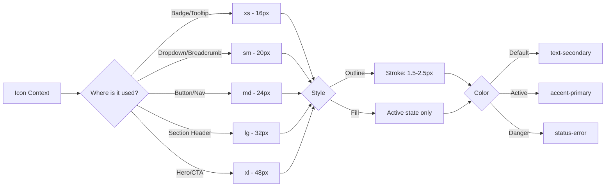

# Iconography System

> **Version:** 2.0 | **Status:** ✅ Active | **Library:** lucide-react v1.24 | **Stroke:** 1.5px

## 1. Overview

Single icon library: **Lucide React v1.24**. No second library permitted. Custom SVG icons only when Lucide lacks a glyph. This ensures consistent rendering, eliminates bundle duplication, and reduces design decisions. Total icon weight must stay < 15KB gzipped (lucide-react is fully tree-shakeable via named ESM exports).

## 2. Icon Style

| Property   | Spec                 | Rationale                              |
| ---------- | -------------------- | -------------------------------------- |
| Style      | Outline (line-based) | Matches minimal technical brand        |
| Grid       | 24×24px              | Industry standard                      |
| Stroke     | 1.5px (default)      | Refined, thinner than 2px default      |
| Caps/Joins | Round                | Matches Inter's rounded terminals      |
| Fill       | None                 | Solid fills only for active nav states |

**Design principle:** Icons reinforce meaning, never replace it. Must be legible at 16px.

## 3. Sizing Scale

| Token     | Size    | Usage                                        |
| --------- | ------- | -------------------------------------------- |
| `icon-xs` | 16×16px | Badges, tooltips, table cells                |
| `icon-sm` | 20×20px | Dropdown items, chevrons, breadcrumbs        |
| `icon-md` | 24×24px | **Default** — buttons, nav, forms            |
| `icon-lg` | 32×32px | Section headers, feature cards, empty states |
| `icon-xl` | 48×48px | Hero sections, large CTAs, 404/500 pages     |

**Stroke by size:** 16px → 1.5px, 20px → 1.5px, 24px → 1.5px, 32px → 2px, 48px → 2.5px.

## 4. Color Usage

| Context             | Token                       | Example                                |
| ------------------- | --------------------------- | -------------------------------------- |
| Default / Inactive  | `text-secondary`            | Muted gray — most icons                |
| Hover (interactive) | `text-primary`              | White on dark                          |
| Active / Selected   | `accent-primary`            | Blue — nav tabs, filters               |
| Danger              | `status-error`              | Delete, destructive actions            |
| Success             | `status-success`            | Checks, confirmation toasts            |
| Warning             | `status-warning`            | Caution alerts                         |
| AI Actions          | `status-ai`                 | Violet — AI assistant, neural features |
| Disabled            | `text-secondary opacity-50` | Non-interactive                        |

Interactive icons get a hover glow: `filter: drop-shadow(0 0 6px var(--color-accent-glow))`. Never on decorative icons.

## 5. Accessibility

**Decorative** (icon + adjacent text label): `aria-hidden="true"`, no `role`.  
**Informative** (standalone icon): `aria-label` + `role="img"`.

```tsx
// Decorative
<button><Settings aria-hidden="true" /> <span>Settings</span></button>
// Informative
<button aria-label="Delete project"><Trash2 role="img" className="text-status-error" /></button>
```

**Focus:** Interactive icon wrappers need `outline: 2px solid accent-primary; outline-offset: 2px` on `:focus-visible`.  
**Touch:** Standalone icon buttons must be ≥ 44×44px hit area via padding.  
**Animation:** No continuous animation on icons. Animated icons respect `prefers-reduced-motion: reduce`.

## 6. Custom Icons

Create custom icons only when: Lucide lacks the glyph, unique product feature (neural net, AI chat), or brand-specific symbol. Always verify Lucide catalog first — search synonyms before building custom.

| Property  | Requirement                                                           |
| --------- | --------------------------------------------------------------------- |
| Grid      | 24×24px, 1px padding (live 22×22px)                                   |
| Stroke    | 1.5px, round caps and joins                                           |
| Export    | SVGO-optimized SVG                                                    |
| Component | React with `size`, `color`, `className` props, typed as `LucideProps` |

### Custom Icon Inventory

| Icon          | File                                | Used In                    |
| ------------- | ----------------------------------- | -------------------------- |
| `NeuralNode`  | `components/icons/neural-node.tsx`  | Hero, AI badge             |
| `DataFlow`    | `components/icons/data-flow.tsx`    | Project cards              |
| `CubeGrid`    | `components/icons/cube-grid.tsx`    | Loading states, 3D headers |
| `AIAssistant` | `components/icons/ai-assistant.tsx` | Chat FAB, AI header        |

## 7. Icon Audit Checklist

- [ ] Icon from `lucide-react` (no second icon library)
- [ ] Size matches scale token (xs through xl)
- [ ] Color inherits from text unless semantic override needed
- [ ] `aria-hidden="true"` if decorative; `aria-label` if informative standalone
- [ ] Touch target ≥ 44×44px for standalone icon buttons (Playwright check)
- [ ] Custom icons verified — no duplicate of existing Lucide icon
- [ ] `focus-visible` ring on all interactive icon wrappers
- [ ] No continuous animation on icons

## 8. Commonly Used Icons

| Context       | Icon                | Size | Color            |
| ------------- | ------------------- | ---- | ---------------- |
| Theme toggle  | `Sun` / `Moon`      | 20px | `text-primary`   |
| Mobile menu   | `Menu`              | 24px | `text-primary`   |
| AI FAB        | `MessageSquareMore` | 24px | `status-ai`      |
| External link | `ExternalLink`      | 16px | `accent-primary` |
| GitHub        | `Github`            | 24px | `text-secondary` |
| Search        | `Search`            | 20px | `text-secondary` |
| Close         | `X`                 | 20px | `text-primary`   |
| Expand        | `ChevronDown`       | 20px | `text-secondary` |
| Filters       | `SlidersHorizontal` | 20px | `text-secondary` |
| Copy          | `Copy`              | 16px | `text-secondary` |
| Loading       | `Loader2`           | 24px | `accent-primary` |

## 10. Icon Sizing Decision Tree



## 9. Icon Usage Patterns

| Pattern          | Approach                                        |
| ---------------- | ----------------------------------------------- |
| Button with icon | Icon left of text, 8px gap                      |
| Icon-only button | Informative — `aria-label` required, ≥ 44×44px  |
| Navigation item  | Icon + text (decorative) or icon-only collapsed |
| Alert / Toast    | Leading icon with semantic color                |
| Empty state      | Large icon (lg/xl) centered above text          |
| Input leading    | Prefix icon absolute-positioned inside input    |

## Cross-References
- [../MASTER-INDEX.md](../MASTER-INDEX.md) — Documentation master index
- [../26-reference/CROSS-REFERENCE-INDEX.md](../26-reference/CROSS-REFERENCE-INDEX.md) — Cross-reference system