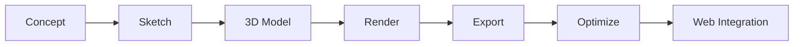

# Illustration System

> **Version:** 2.0 | **Status:** ✅ Active | **Technologies:** Three.js/R3F, Spline, CSS Gradients, SVG

## 1. Design Philosophy

Avoid traditional flat vector "tech" characters. Use abstract, programmatic, geometric compositions reflecting backend architecture, AI neural networks, and 3D spatial concepts. Illustrations should look code-generated — because they often are. Every illustration must serve a purpose; decorative-only assets are evaluated for removal if they impact performance. If an illustration can be replaced by CSS gradient + SVG pattern without losing meaning, do that first.

## 2. Illustration Style

### Mediums

| Medium              | When to Use                                    | Tools                      |
| ------------------- | ---------------------------------------------- | -------------------------- |
| Three.js / R3F      | Interactive hero scenes, data visualizations   | R3F + Drei + Framer Motion |
| Spline exports      | Static complex scenes, performance-sensitive   | Spline → glb export        |
| CSS gradients + SVG | Decorative backgrounds, noise, simple patterns | Pure CSS/SVG               |
| Lottie JSON         | 2D animated sequences, loading animations      | LottieFiles → Lottie       |

### Visual Grammar

- **Geometry:** Cubes, torus knots, grids, wireframes, nodes, connection lines, isometric shapes
- **Colors:** Gradient ramp `accent-primary` → `status-ai` → `accent-secondary` — never flat single-color fills
- **Lighting:** Cinematic, single directional source with rim highlights
- **Texture:** SVG noise overlay at `opacity: 0.03` over gradients to prevent banding
- **Motion:** Slow ambient rotation (5–15s per cycle), gentle floating — no jarring animation

### Core Motifs

| Motif            | Represents                  | Used In                        |
| ---------------- | --------------------------- | ------------------------------ |
| The Node         | Data points, AI embeddings  | Hero, AI chat background       |
| The Ray          | API requests, data flow     | Project cards, blog headers    |
| The Cube / Prism | Architecture, databases     | Loading screen, 404 page       |
| The Grid         | Infrastructure, scalability | Admin backgrounds              |
| The Pulse        | AI processing, activity     | AI features, status indicators |

## 3. Usage Tiers

| Tier       | Context                 | Implementation               | Perf Priority                    |
| ---------- | ----------------------- | ---------------------------- | -------------------------------- |
| Primary    | Hero sections, homepage | R3F interactive 3D           | Critical — LOD, DPR scaling      |
| Secondary  | Feature cards, headers  | Spline export / CSS gradient | High — lazy load, WebP fallback  |
| Tertiary   | Empty states, admin     | SVG / Lottie                 | Medium — respects reduced motion |
| Decorative | Backgrounds, noise      | CSS-only (zero JS)           | Low                              |

**Placement:** Hero → Primary, Project cards → Secondary, Admin empty → Tertiary, Blog headers → Secondary, Loading → Tertiary, 404 → Primary (simplified).

## 4. Creation Workflow

```
Concept (Figma) → Spline Prototype → Export glb/gltf (Draco)
  → R3F Import (useGLTF) → Add interaction (Framer Motion, useFrame)
    → WebP fallback → Performance audit
```

### Tooling

| Step            | Tool                     | Output                |
| --------------- | ------------------------ | --------------------- |
| Concept         | Figma / sketch           | Layout canvas         |
| 3D modeling     | Spline, Blender          | glb/gltf scene        |
| Web integration | R3F + Drei               | React 3D component    |
| Animation       | Framer Motion, useFrame  | Interactive + ambient |
| Compression     | Draco (via drei/useGLTF) | Compressed glb        |
| Static fallback | Spline render → WebP     | `<Image />` component |

### Export Budgets

| Format     | Max Size | Compression | Notes                        |
| ---------- | -------- | ----------- | ---------------------------- |
| glb        | 500KB    | Draco       | Preferred single-file        |
| gltf + bin | 1MB      | Draco       | Complex scenes with textures |
| WebP       | 100KB    | Quality 85  | Static screenshot fallback   |
| Lottie     | 50KB     | dotLottie   | 2D animated sequences        |

## 5. Responsiveness

| Viewport          | Illustration Behavior                                        |
| ----------------- | ------------------------------------------------------------ |
| Desktop ≥ 1024px  | All tiers — full 3D interactive                              |
| Tablet 768–1023px | Primary (reduced DPR) + Secondary. Tertiary → static SVG     |
| Mobile < 768px    | Primary only (WebGL or WebP fallback). All decorative hidden |

Implementation: `className="hidden md:block"` for decorative; `dynamic(() => import(...), { ssr: false })` for 3D.

## 6. Performance

**Loading:** `next/dynamic` with `ssr: false`. Hero LCP gets `priority` on fallback `<Image>`. Three.js code-split into separate chunk. `Suspense` boundary with GradientFallback placeholder.

**Fallback hierarchy:** Tier 1 → full 3D + post-processing. Tier 2 → reduced geometry, no bloom. Tier 3 → static WebP. No WebGL → CSS gradient + SVG.

**Reduced motion:**

```css
@media (prefers-reduced-motion: reduce) {
  .scene-3d {
    display: none;
  }
  .scene-fallback {
    display: block;
  }
}
```

When reduced motion: static WebP replaces 3D, ambient rotation stops, parallax disabled, particles hidden.

## 7. File Organization

| Directory                   | Contents              | Git LFS |
| --------------------------- | --------------------- | ------- |
| `public/models/`            | glb/gltf 3D files     | Yes     |
| `public/illustrations/`     | WebP static fallbacks | No      |
| `public/lottie/`            | Lottie JSON files     | No      |
| `components/3d/`            | R3F scene components  | N/A     |
| `components/illustrations/` | SVG/CSS components    | N/A     |

## 9. Creation Flow Diagram



## 8. Audit Checklist

- [ ] Defined purpose tier (primary/secondary/tertiary/decorative)
- [ ] `dpr={[1, 2]}` + lazy loading for 3D
- [ ] WebP fallback for primary/secondary illustrations
- [ ] Reduced motion variant respects `prefers-reduced-motion`
- [ ] Decorative hidden on mobile (`hidden md:block`)
- [ ] File sizes: glb < 500KB, Lottie < 50KB, WebP < 100KB
- [ ] No stock photography or clip art
- [ ] Colors match brand gradient ramp (blue → violet)
- [ ] Ambient motion ≤ 15s per cycle — not jarring
- [ ] WebGL context loss handled gracefully (`onCreated` error recovery)
- [ ] SSR-safe — dynamic import with `ssr: false`
- [ ] No layout shift from illustration loading

## Cross-References
- [../MASTER-INDEX.md](../MASTER-INDEX.md) — Documentation master index
- [../26-reference/CROSS-REFERENCE-INDEX.md](../26-reference/CROSS-REFERENCE-INDEX.md) — Cross-reference system