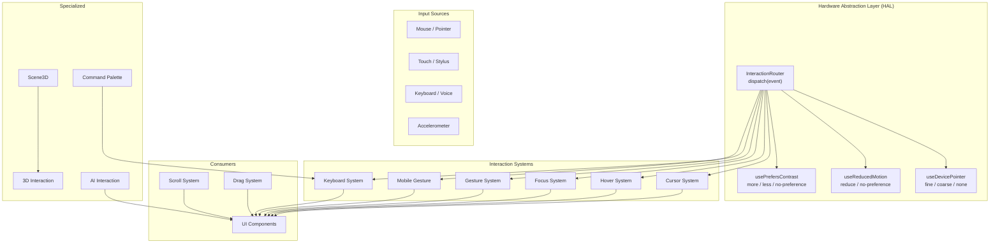
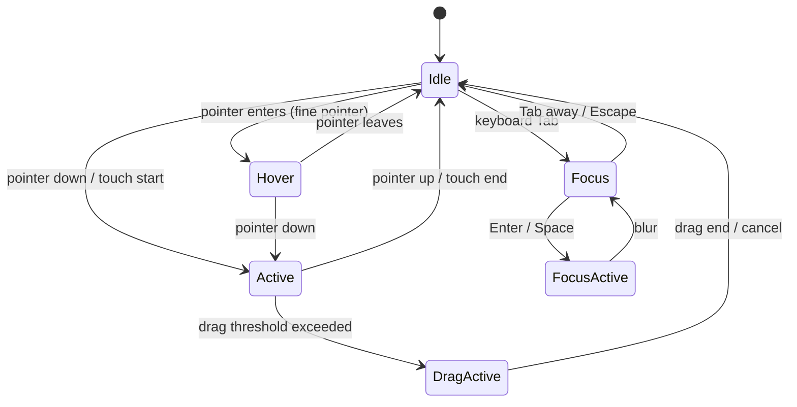
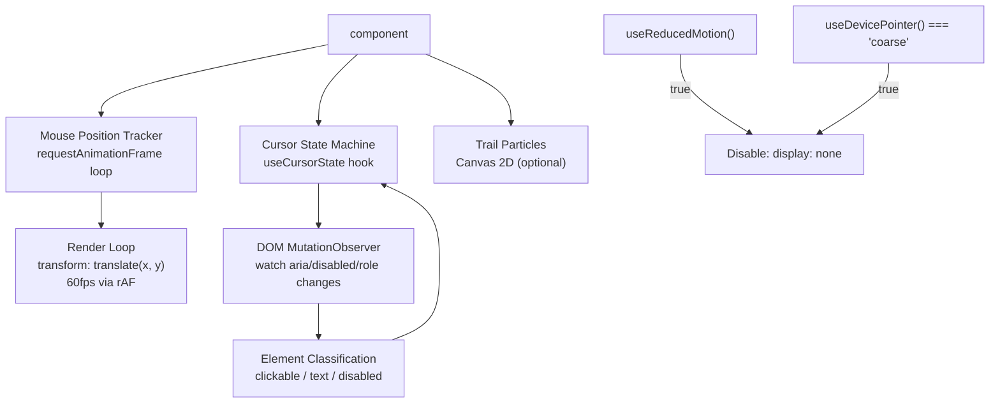
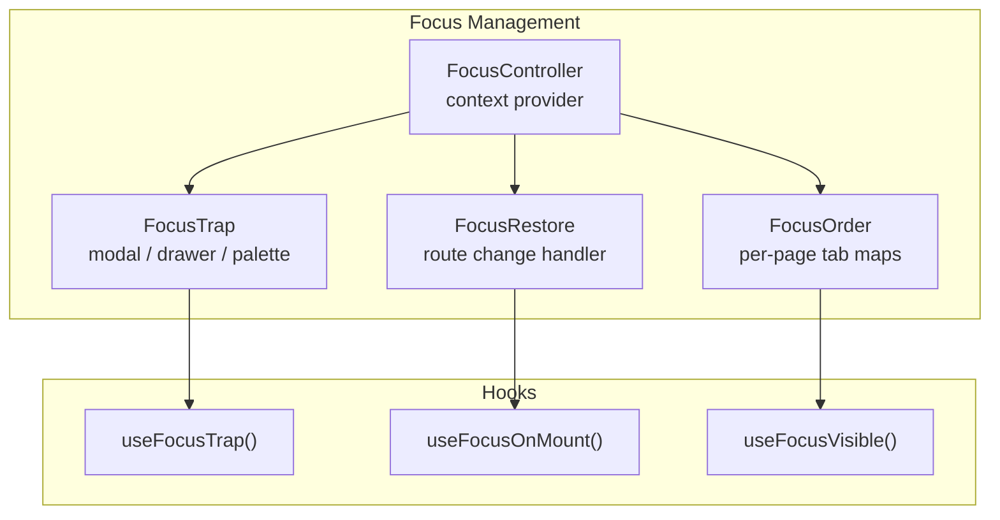
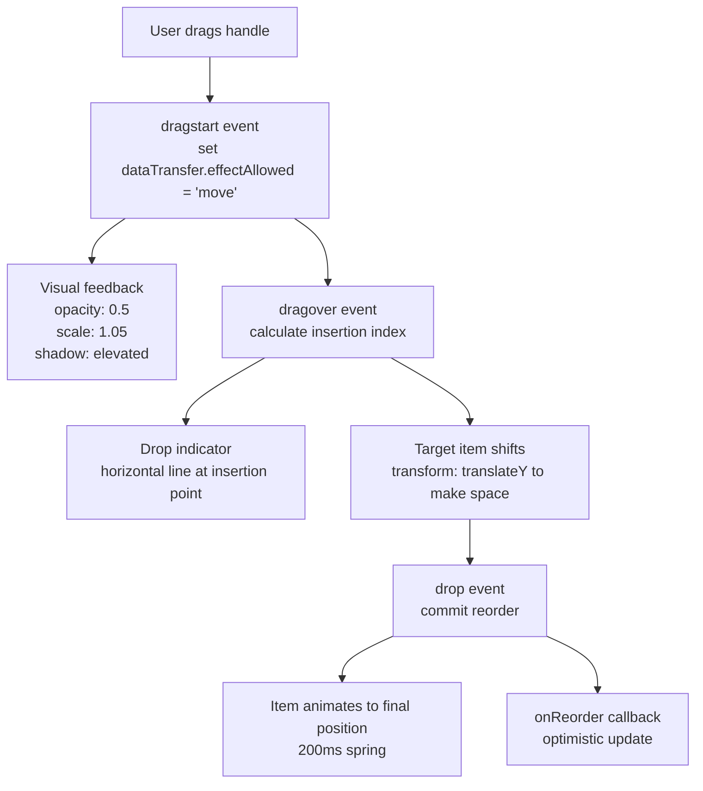
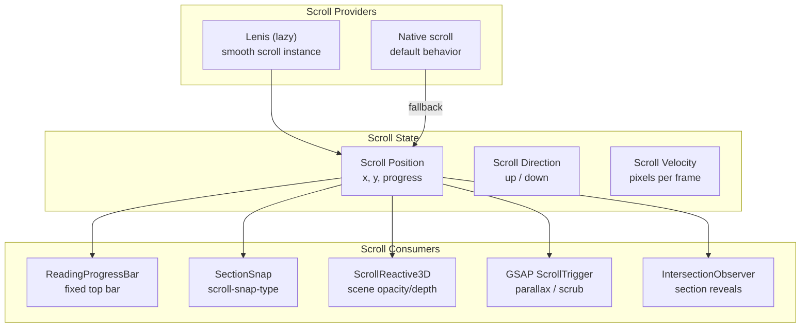
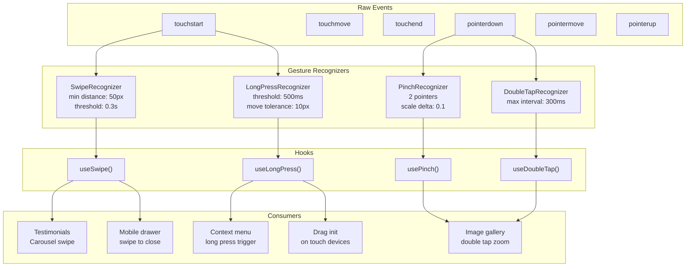
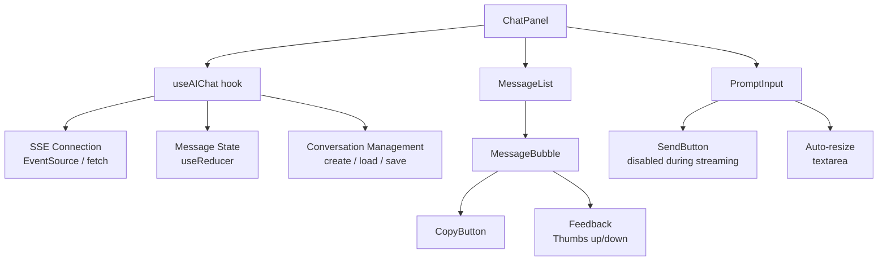
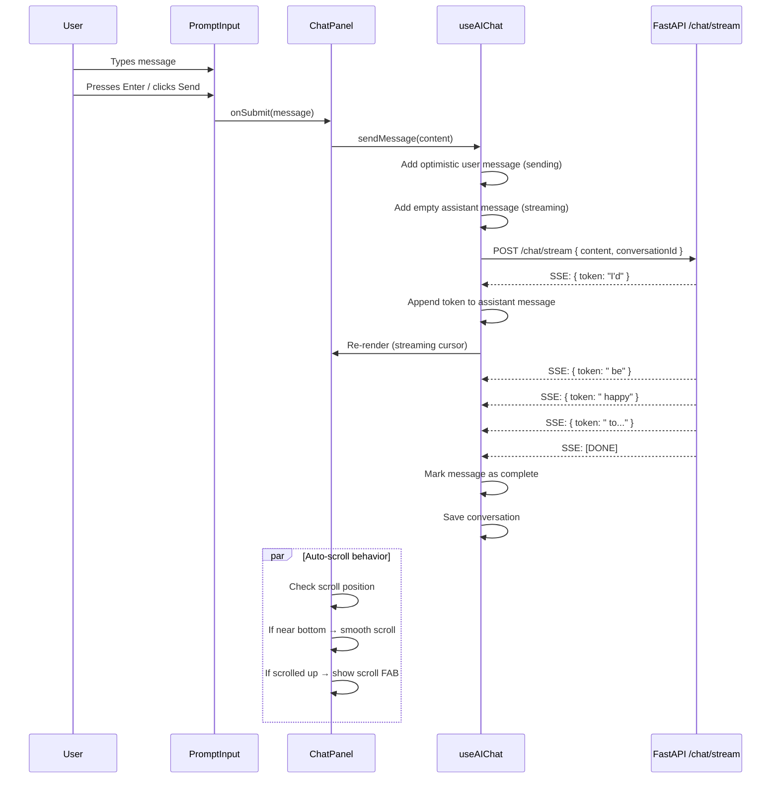
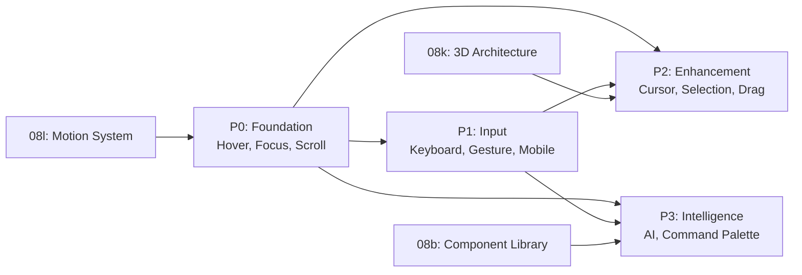

# Interaction Architecture — FAANG Enterprise Interaction Patterns

> **Document:** `InteractionPatterns.md` | **Version:** 2.0 (Enterprise Upgrade) | **Last Updated:** July 2026
> **Status:** ✅ Active | **Owner:** Principal Frontend Lead | **Review Cadence:** Quarterly
> **Stack:** Next.js 14.2 / React 18.3 / Framer Motion 12 / TypeScript 5.5 / Tailwind CSS 3.4

---

## Executive Summary

This document defines the comprehensive FAANG-level enterprise interaction system — including standards for 3D and immersive experiences, raycasting, advanced gesture recognition, high-fidelity hover/click states, drag-and-drop, scroll-driven animations, and haptic feedback patterns. It ensures 60fps performance and WCAG 2.2 AA accessibility across all interactive components.

## Table of Contents

1. [Executive Summary](#1-executive-summary)
2. [Interaction Architecture Principles](#2-interaction-architecture-principles)
3. [Cursor System](#3-cursor-system)
4. [Hover System](#4-hover-system)
5. [Focus System](#5-focus-system)
6. [Selection System](#6-selection-system)
7. [Drag System](#7-drag-system)
8. [Scroll System](#8-scroll-system)
9. [Gesture System](#9-gesture-system)
10. [3D Interaction System](#10-3d-interaction-system)
11. [AI Interaction System](#11-ai-interaction-system)
12. [Command Palette System](#12-command-palette-system)
13. [Keyboard Interaction System](#13-keyboard-interaction-system)
14. [Mobile Gesture System](#14-mobile-gesture-system)
15. [Interaction Arbitration & Priority](#15-interaction-arbitration--priority)
16. [Implementation Roadmap](#16-implementation-roadmap)
17. [Architecture Decision Records](#17-architecture-decision-records)
18. [Cross-References & Standards Alignment](#18-cross-references--standards-alignment)
19. [Testing & Verification](#19-testing--verification)
20. [Interaction Risk Register](#20-interaction-risk-register)
21. [Interaction SLA Table](#21-interaction-sla-table)
22. [KPI Dashboard](#22-kpi-dashboard)
23. [Integration Contract Specifications](#23-integration-contract-specifications)
24. [Change Log](#24-change-log)

---

## 1. Executive Summary

This document defines the **complete interaction architecture** for the portfolio platform — 12 unified interaction subsystems that govern how users engage with every element of the application. The system is designed around the philosophy of **"Purposeful Presence"**: every interaction should feel intentional, responsive, and accessible regardless of input modality.

### 1.1 System Overview

| #   | System              | Input Modalities                             | Priority | Status         | Dependencies                                      |
| --- | ------------------- | -------------------------------------------- | -------- | -------------- | ------------------------------------------------- |
| 1   | **Cursor**          | Pointer, Touch (auto-hide)                   | P2       | 📋 Planned     | Reduced-motion, `useDevicePointer`                |
| 2   | **Hover**           | Pointer (fine), Touch (coarse → tap)         | P0       | 📋 Planned     | `useDevicePointer`, Framer Motion                 |
| 3   | **Focus**           | Keyboard (Tab), Pointer (click)              | P0       | 📋 Planned     | `useFocusTrap`, `useFocusOnMount`, Next.js Router |
| 4   | **Selection**       | Pointer (drag), Keyboard (Shift+Arrow)       | P2       | 📋 Planned     | CSS custom properties                             |
| 5   | **Drag**            | Pointer (drag), Touch (long-press)           | P2       | 📋 Planned     | `useSortableList`, HTML5 Drag & Drop API          |
| 6   | **Scroll**          | Wheel, Touch (swipe), Keyboard (PgUp/Dn)     | P0       | 📋 Planned     | Lenis, GSAP ScrollTrigger, IntersectionObserver   |
| 7   | **Gesture**         | Touch (swipe/pinch), Pointer (swipe)         | P1       | 📋 Planned     | `useSwipe`, `usePinch`, `useLongPress`            |
| 8   | **3D Interaction**  | Pointer (move), Scroll, Idle detection       | P0       | ✅ Built (08k) | Scene3D, R3F, Three.js                            |
| 9   | **AI Interaction**  | Keyboard (type), Pointer (click), SSE stream | P3       | 📋 Planned     | FastAPI SSE, `useAIChat`                          |
| 10  | **Command Palette** | Keyboard (Cmd+K), Pointer (click)            | P3       | 📋 Planned     | Fuse.js, action registry                          |
| 11  | **Keyboard**        | Keyboard (all keys)                          | P1       | 📋 Planned     | `useKeyboardShortcut`, `keyboardShortcuts.ts`     |
| 12  | **Mobile Gesture**  | Touch (swipe, pull, pinch)                   | P1       | 📋 Planned     | `usePullToRefresh`, `useSwipeToClose`             |

### 1.2 Architecture Metrics Dashboard

| Domain       | Metric                            | Aspirational Target | Monitoring Threshold | Status     |
| ------------ | --------------------------------- | ------------------- | -------------------- | ---------- |
| **Hover**    | Hover intent latency (desktop)    | < 50ms              | < 100ms              | 📋 Planned |
| **Hover**    | Touch false-positive rate         | 0%                  | < 1%                 | 📋 Planned |
| **Focus**    | Focus order completion time (Tab) | < 3s per page       | < 5s                 | 📋 Planned |
| **Focus**    | Focus trap escape rate            | 0% failures         | < 0.1%               | 📋 Planned |
| **Scroll**   | Lenis frame time                  | < 2ms               | < 4ms                | 📋 Planned |
| **Scroll**   | Reading progress accuracy         | ±1%                 | ±3%                  | 📋 Planned |
| **Gesture**  | Swipe recognition latency         | < 100ms             | < 200ms              | 📋 Planned |
| **Gesture**  | False swipe positives             | 0%                  | < 0.5%               | 📋 Planned |
| **AI**       | Chat message render latency       | < 50ms per chunk    | < 100ms              | 📋 Planned |
| **AI**       | Auto-scroll interrupt accuracy    | 100%                | > 95%                | 📋 Planned |
| **Keyboard** | Shortcut registration leaks       | 0                   | 0                    | 📋 Planned |
| **Cursor**   | Cursor frame rate                 | 60fps               | 30fps                | 📋 Planned |
| **Drag**     | Sortable list commit accuracy     | 100%                | > 99%                | 📋 Planned |

### 1.3 Interaction Layering



---

## 2. Interaction Architecture Principles

### 2.1 Core Principles

| #   | Principle                    | Description                                                           | Enforcement                                                                   |
| --- | ---------------------------- | --------------------------------------------------------------------- | ----------------------------------------------------------------------------- |
| 1   | **Input Agnostic**           | Every interaction works with pointer, keyboard, and touch             | All handlers respond to multiple event types                                  |
| 2   | **Device-Aware**             | Detect and adapt to device capabilities (hover vs touch, DPR, memory) | `useDevicePointer` gates hover/touch behavior                                 |
| 3   | **Progressive Enhancement**  | Core functionality works without JS; interactions enhance             | CSS hover/focus/active states, JS adds tooltips/gestures                      |
| 4   | **Respect User Preferences** | reduced-motion, reduced-transparency, contrast preferences honored    | `useReducedMotion` gates all animations                                       |
| 5   | **Never Block**              | Interaction systems never prevent native browser behavior or scroll   | `passive: true` on scroll/touch listeners, `pointer-events: none` on overlays |
| 6   | **Single Source of Truth**   | Each interaction state is managed by exactly one system               | No duplicate hover/focus state management                                     |
| 7   | **Fail Safe**                | On error, degrade gracefully to native browser behavior               | Cursor → native, Gesture → click, Focus → tab                                 |
| 8   | **Measurable**               | Every system has KPIs, monitoring, and SLA targets                    | Grafana dashboards, PostHog events, CI gates                                  |

### 2.2 Device Capability Detection

```typescript
// apps/web/src/lib/interactions/deviceCapabilities.ts
interface DeviceCapabilities {
  pointerType: 'fine' | 'coarse' | 'none';
  reducedMotion: boolean;
  reducedTransparency: boolean;
  contrastPreference: 'more' | 'less' | 'no-preference';
  touchSupported: boolean;
  hoverSupported: boolean;
}
```

| Capability            | Detection Method                                                    | Fallback                   |
| --------------------- | ------------------------------------------------------------------- | -------------------------- | ------------------------------ | ------- |
| `pointerType`         | `matchMedia('(pointer: fine)')` / `matchMedia('(pointer: coarse)')` | `'fine'` (desktop default) |
| `hoverSupported`      | `matchMedia('(hover: hover)')`                                      | `true`                     |
| `reducedMotion`       | `useReducedMotion()`                                                | `false`                    |
| `reducedTransparency` | `matchMedia('(prefers-reduced-transparency: reduce)')`              | `false`                    |
| `touchSupported`      | `'ontouchstart' in window`                                          |                            | `navigator.maxTouchPoints > 0` | `false` |

### 2.3 Interaction State Machine

Every interactive element follows this state machine:



Each state maps to visual properties via CSS. The interaction system only manages the state transitions; visual rendering is handled by Tailwind CSS variants or Framer Motion.

### 2.4 Event Delegation Strategy

| Strategy             | When                                                           | Implementation                                                   |
| -------------------- | -------------------------------------------------------------- | ---------------------------------------------------------------- |
| **Event delegation** | High-frequency events (pointermove, scroll, touchmove)         | Single listener on `document` or `window` with event propagation |
| **Direct binding**   | Low-frequency events (click, focus, blur)                      | Direct listener on element via React props                       |
| **Capture phase**    | Events that must preempt children (keyboard shortcuts, Escape) | `addEventListener(type, handler, { capture: true })`             |
| **Passive**          | Events that never call `preventDefault()`                      | `{ passive: true }` on scroll, touch, wheel                      |

---

## 3. Cursor System

### 3.1 Purpose

Replace the native cursor with a custom SVG/Canvas cursor for desktop that reflects interaction context, provides visual feedback, and enhances the brand experience. **Never on touch devices.** Automatically disabled when `prefers-reduced-motion: reduce`.

### 3.2 Cursor States

| State           | Visual                                   | Trigger                                                   | Transition |
| --------------- | ---------------------------------------- | --------------------------------------------------------- | ---------- |
| **Default**     | Small ring + dot (2px/6px), accent color | No element interaction                                    | 200ms ease |
| **Pointer**     | Dot expands to fill ring (8px)           | Over clickable element (`a`, `button`, `[role="button"]`) | 100ms ease |
| **Text**        | Vertical bar, 2px wide                   | Over text input, textarea, `[contenteditable]`            | 150ms ease |
| **Hidden**      | Transparent                              | Video playback, fullscreen, idle > 5s                     | 300ms fade |
| **Loading**     | Ring fills with spinning arc             | `aria-busy="true"` element                                | 200ms ease |
| **Grabbing**    | Closed hand / pinched                    | During drag operation                                     | 50ms snap  |
| **Not-allowed** | Ring turns red with dash                 | `disabled` or `aria-disabled="true"` element              | 150ms ease |

### 3.3 Cursor Component

```tsx
// apps/web/src/components/interactions/Cursor.tsx
interface CursorProps {
  /** Enable/disable cursor entirely */
  enabled: boolean;
  /** Cursor variant overrides */
  forceState?: CursorState;
  /** Trail particle count (0 = no trail) */
  trailCount?: number;
  /** Trail fade duration in ms */
  trailDuration?: number;
}
```

### 3.4 Cursor Architecture



### 3.5 Cursor Rules

| Rule                       | Implementation                                                      | Rationale                                                       |
| -------------------------- | ------------------------------------------------------------------- | --------------------------------------------------------------- |
| **Never on touch**         | `useDevicePointer()` returns `'coarse'` → disable                   | Touch has no cursor concept; interferes with native tap targets |
| **Respect reduced motion** | `useReducedMotion()` → disable cursor + trail                       | Motion sensitivity; use native cursor                           |
| **No cursor over iframes** | `pointer-events: none` on cursor during iframe hover                | iframe captures pointer                                         |
| **Cursor hides on idle**   | After 5s no pointermove, fade cursor                                | Prevents burn-in; reappears on first move                       |
| **Trail max 20 particles** | Fixed-size ring buffer, 20 particles max                            | Performance; < 0.5ms frame cost                                 |
| **Scale with DPR**         | `devicePixelRatio` scaling for crisp rendering                      | Sharp on Retina                                                 |
| **Escape hatch**           | `data-cursor="native"` attribute disables custom cursor per-element | Third-party embeds, video players                               |

### 3.6 Cursor Performance Budget

| Metric                   | Target  | Measurement                            |
| ------------------------ | ------- | -------------------------------------- |
| Frame time (main thread) | < 0.5ms | Chrome DevTools Performance            |
| Frame rate               | 60fps   | `requestAnimationFrame` callback delta |
| Trail particle rendering | < 0.2ms | Canvas 2D draw time                    |
| State change latency     | < 16ms  | rAF → visual update                    |
| Bundle size (gzip)       | < 3KB   | Webpack bundle analyzer                |

---

## 4. Hover System

### 4.1 Purpose

Provide unified, device-aware hover states across all interactive elements. On fine-pointer devices (desktop), show CSS hover effects + optional tooltips. On coarse-pointer devices (touch), hover effects are inactive — use active/tap states instead.

### 4.2 Device-Aware Hover Detection

```typescript
// apps/web/src/hooks/useDevicePointer.ts
type PointerType = 'fine' | 'coarse' | 'none';

export function useDevicePointer(): PointerType {
  // (pointer: fine) → desktop mouse/stylus
  // (pointer: coarse) → touch
  // neither → keyboard-only / voice
}
```

### 4.3 Hover State Machine

| Current State | Event                 | Next State   | Visual                                |
| ------------- | --------------------- | ------------ | ------------------------------------- |
| Idle          | Pointer enters (fine) | HoverIntent  | 150ms delay before visual change      |
| HoverIntent   | Timer expires (150ms) | Hover        | CSS hover state applied               |
| HoverIntent   | Pointer leaves        | Idle         | Cancel timer, no visual               |
| Hover         | Pointer leaves        | Idle         | CSS hover state removed               |
| Hover         | Pointer down          | Active       | CSS active state                      |
| Hover         | Focus (Tab)           | FocusVisible | CSS focus-visible state (may combine) |
| Idle          | Touch start           | Active       | CSS active state, no hover phase      |

### 4.4 Tooltip System

```tsx
// apps/web/src/components/ui/Tooltip.tsx
interface TooltipProps {
  content: React.ReactNode;
  children: React.ReactNode;
  /** Delay before showing (ms) */
  delay?: number;
  /** Position relative to trigger */
  side?: 'top' | 'bottom' | 'left' | 'right';
  /** Show on focus as well */
  showOnFocus?: boolean;
}
```

| Tooltip Rule   | Value                           | Rationale                                 |
| -------------- | ------------------------------- | ----------------------------------------- |
| Show delay     | 300ms                           | Prevents flash on cursor movement         |
| Hide delay     | 100ms                           | Quick dismiss                             |
| Max width      | 280px                           | Readability                               |
| Trigger        | Hover + focus-visible (desktop) | Accessibility parity                      |
| Touch behavior | Never show tooltip              | Touch has no hover; use persistent labels |
| Reduced motion | Fade only (100ms), no scale     | Respects user preference                  |

### 4.5 Hover Preview

Custom hover preview for complex elements (project cards, admin sidebar collapsed items):

| Element                   | Preview Content                | Delay | Dismiss       |
| ------------------------- | ------------------------------ | ----- | ------------- |
| Project card              | Thumbnail + title + tech stack | 500ms | Pointer leave |
| Admin sidebar (collapsed) | Full label + badge             | 200ms | Pointer leave |
| Skill icon                | Skill name + proficiency       | 200ms | Pointer leave |
| Timeline dot              | Date + title                   | 300ms | Pointer leave |

### 4.6 Hover Rules

| Rule                                | Implementation                                           | Rationale                                  |
| ----------------------------------- | -------------------------------------------------------- | ------------------------------------------ |
| **Hover only on fine-pointer**      | `.group:hover` only effective when `(hover: hover)`      | Touch devices should not show sticky hover |
| **150ms hover intent delay**        | `setTimeout` before applying hover class                 | Prevents flicker on rapid movement         |
| **Hover + focus parity**            | Same visual for `:hover` and `:focus-visible`            | WCAG 2.4.7, keyboard parity                |
| **No hover on disabled**            | `:disabled` / `[aria-disabled="true"]` → no hover effect | Disabled is not interactive                |
| **Touch tap does not sticky-hover** | `touchend` removes any hover class                       | Mobile Safari hover fix                    |

---

## 5. Focus System

### 5.1 Purpose

Manage keyboard focus throughout the application — ensuring logical tab order, visible focus indicators, trapped focus within modals/drawers, and correct focus restoration on route changes.

### 5.2 Focus Architecture



### 5.3 `useFocusTrap`

```typescript
// apps/web/src/hooks/useFocusTrap.ts
interface UseFocusTrapOptions {
  /** Ref to the container element */
  containerRef: React.RefObject<HTMLElement>;
  /** Whether the trap is active */
  active: boolean;
  /** Element to receive focus on activation (default: first focusable) */
  initialFocus?: 'first' | 'last' | React.RefObject<HTMLElement>;
  /** Called when Tab past last or Shift+Tab past first */
  onEscape?: () => void;
}

export function useFocusTrap(options: UseFocusTrapOptions): void;
```

| Focus Trap         | Container           | Tab Behavior                | Escape         | Return Focus                |
| ------------------ | ------------------- | --------------------------- | -------------- | --------------------------- |
| Mobile menu drawer | Navbar mobile panel | Cycle through links         | Closes menu    | Returns to hamburger button |
| Modal (any)        | Modal overlay       | Cycle through modal content | Closes modal   | Returns to trigger element  |
| Command Palette    | Palette overlay     | Cycle through results       | Closes palette | Returns to previous focus   |
| AI Chat (overlay)  | Chat panel          | Cycle through chat controls | Closes chat    | Returns to chat FAB         |

### 5.4 `useFocusOnMount`

```typescript
// apps/web/src/hooks/useFocusOnMount.ts
interface UseFocusOnMountOptions {
  /** Ref to the element to focus */
  ref: React.RefObject<HTMLElement>;
  /** Selector for fallback element */
  fallbackSelector?: string;
  /** Whether to skip the initial focus */
  skip?: boolean;
}

export function useFocusOnMount(options: UseFocusOnMountOptions): void;
```

| Route       | Target Element                 | When                                            |
| ----------- | ------------------------------ | ----------------------------------------------- |
| Any page    | `<main id="main-content">`     | After route change (if skip-link not activated) |
| Admin page  | First nav item or page heading | After auth redirect                             |
| Modal opens | First focusable in modal       | Immediately                                     |
| Form page   | First input field              | On mount                                        |

### 5.5 Focus Order Maps

Per-page focus order specifications:

| Page            | Tab Order                                                | Skip Link Target | Notable                                                    |
| --------------- | -------------------------------------------------------- | ---------------- | ---------------------------------------------------------- |
| Home            | Skip link → Navbar → Hero CTA → sections → Footer        | `#main-content`  | Sections have `tabindex="-1"` for skip targeting           |
| Admin Dashboard | Sidebar nav → Header actions → Main content → Data table | —                | Sidebar first for navigation; Escape closes any open panel |
| Blog Article    | Skip link → Article content → Share buttons → Comments   | `#main-content`  | "Skip to content" jumps past navbar + sidebar              |
| Contact         | Skip link → Form fields → Submit → Footer                | `#main-content`  | Focus first field on mount                                 |
| Login           | Skip link → Email → Password → Submit → Register link    | `#main-content`  | Autofocus email field                                      |

### 5.6 Focus Visible Detection

```typescript
// apps/web/src/hooks/useFocusVisible.ts
interface FocusVisibleState {
  /** True when user is navigating via keyboard */
  isFocusVisible: boolean;
}

export function useFocusVisible(): FocusVisibleState;
```

- Tracks `keydown` (Tab, Arrow keys, Enter, Space) → `isFocusVisible = true`
- Tracks `pointerdown` (mouse, touch) → `isFocusVisible = false`
- Enables `.focus-visible-ring` class on the `<html>` element to scope `:focus-visible` styles

### 5.7 Focus Rules

| Rule                            | Implementation                             | WCAG                   |
| ------------------------------- | ------------------------------------------ | ---------------------- |
| **Never remove outline**        | `:focus-visible` ring always visible       | 2.4.7 Focus Visible    |
| **Focus order = DOM order**     | No `tabindex > 0`                          | 2.4.3 Focus Order      |
| **Skip link first**             | First tabbable element on every page       | 2.4.1 Bypass Blocks    |
| **Trap on modal open**          | `useFocusTrap` active                      | 2.4.3 + 1.3.2          |
| **Return focus on close**       | `useFocusTrap` returns to trigger          | 2.4.3                  |
| **Focus on mount**              | `useFocusOnMount` for forms, dialogs       | 2.4.3                  |
| **No focus trap in public nav** | Mobile menu has trap, desktop nav does not | Only trap when visible |

---

## 6. Selection System

### 6.1 Purpose

Customize text selection appearance to match the brand, provide visible copy-feedback for code blocks, and ensure selection styles respect theme.

### 6.2 Text Selection Styles

```css
/* globals.css additions */
::selection {
  background-color: var(--color-accent-500/20);
  color: var(--color-text-primary);
}

:root[data-theme='dark'] ::selection {
  background-color: var(--color-accent-400/25);
  color: var(--color-text-primary);
}
```

### 6.3 Code Block Copy System

```tsx
// apps/web/src/components/ui/CopyButton.tsx
interface CopyButtonProps {
  /** Text content to copy */
  text: string;
  /** Optional label */
  label?: string;
}
```

| State  | Visual             | Duration                | Accessibility                               |
| ------ | ------------------ | ----------------------- | ------------------------------------------- |
| Idle   | Copy icon          | —                       | `aria-label="Copy code"`                    |
| Copied | Checkmark icon     | 2s, then return to Idle | `aria-live="polite"`: "Copied to clipboard" |
| Error  | X icon + red flash | 2s, then return to Idle | `aria-live="polite"`: "Failed to copy"      |

### 6.4 Selection Rules

| Rule                             | Implementation                                                     |
| -------------------------------- | ------------------------------------------------------------------ |
| **Brand-colored selection**      | `::selection` with theme-aware accent color at 20-25% opacity      |
| **Code block copy**              | `navigator.clipboard.writeText()` with fallback to execCommand     |
| **Selection does not interfere** | Selection handlers only on content areas, not interactive elements |
| **Respect forced colors**        | `forced-colors: active` → use system selection colors              |

---

## 7. Drag System

### 7.1 Purpose

Enable drag-and-drop interactions for admin CMS reordering, file upload zones, and sortable lists with full keyboard and screen reader support.

### 7.2 Use Cases

| Use Case         | Location             | Input                              | Accessibility                  |
| ---------------- | -------------------- | ---------------------------------- | ------------------------------ |
| Reorder sections | Admin → Sections     | Drag handle + Move up/down buttons | ARIA reorderable list          |
| Reorder projects | Admin → Projects     | Drag handle + Move buttons         | ARIA reorderable list          |
| Reorder skills   | Admin → Skills       | Drag handle + Move buttons         | ARIA reorderable list          |
| File upload      | Admin → Media        | Drop zone + file picker            | Hidden input + drag zone label |
| Image reorder    | Admin → Project edit | Drag handle + Move buttons         | ARIA reorderable list          |

### 7.3 Sortable List Hook

```typescript
// apps/web/src/hooks/useSortableList.ts
interface UseSortableListOptions<T> {
  items: T[];
  onReorder: (items: T[]) => void;
  /** Drag handle selector */
  handleSelector?: string;
  /** Animation duration (ms) */
  animationDuration?: number;
}

interface UseSortableListReturn<T> {
  /** Enhanced items with drag props */
  items: T[];
  /** Get drag props for an item */
  getDragProps: (index: number) => DragProps;
  /** Get drop zone props */
  getDropZoneProps: (index: number) => DropZoneProps;
  /** Is currently dragging */
  isDragging: boolean;
  /** Currently dragged index */
  draggedIndex: number | null;
}
```

### 7.4 Drag Architecture



### 7.5 Drag Rules

| Rule                     | Implementation                                     | Rationale                         |
| ------------------------ | -------------------------------------------------- | --------------------------------- |
| **Drag handle required** | `.drag-handle` element initiates drag              | Prevents accidental drag on click |
| **Keyboard alternative** | Move up/down buttons always visible alongside drag | WCAG 2.5.7 Dragging Movements     |
| **Optimistic update**    | Reorder immediately, roll back on API error        | Perceived performance             |
| **Animation**            | 200ms spring for position shift                    | Smooth, responsive                |
| **Touch support**        | long-press initiates drag (800ms hold)             | Mobile parity                     |
| **Reduced motion**       | Instant swap, no animation                         | Respects preference               |

### 7.6 File Drop Zone

```tsx
// apps/web/src/components/ui/FileDropZone.tsx
interface FileDropZoneProps {
  onFiles: (files: File[]) => void;
  accept?: string;
  maxFiles?: number;
  maxSizeMB?: number;
  label?: string;
}
```

| State     | Visual                                    | Announcement              |
| --------- | ----------------------------------------- | ------------------------- |
| Idle      | Dashed border, upload icon                | —                         |
| Drag over | Solid accent border, background highlight | "Drop files to upload"    |
| Accepting | Brief green flash on valid files          | "File accepted"           |
| Rejecting | Red flash on invalid type/size            | "File type not supported" |
| Uploading | Progress indicator                        | "Uploading {filename}"    |
| Complete  | Checkmark                                 | "{filename} uploaded"     |
| Error     | Error message with retry                  | "Upload failed: {reason}" |

---

## 8. Scroll System

### 8.1 Purpose

Provide smooth, performant scrolling with reading progress tracking, scroll-driven animations, and section-aware behavior — while respecting user preferences and device capabilities.

### 8.2 Scroll Architecture



### 8.3 Scroll Provider

```tsx
// apps/web/src/components/layout/ScrollProvider.tsx
interface ScrollProviderProps {
  children: React.ReactNode;
  /** Enable Lenis smooth scroll */
  smooth?: boolean;
  /** Lenis options */
  lenisOptions?: {
    duration?: number;
    easing?: (t: number) => number;
    orientation?: 'vertical' | 'horizontal';
    gestureOrientation?: 'vertical' | 'horizontal' | 'both';
    smoothWheel?: boolean;
    smoothTouch?: boolean;
    touchMultiplier?: number;
  };
}
```

| Environment    | smooth | Lenis       | Rationale                                                    |
| -------------- | ------ | ----------- | ------------------------------------------------------------ |
| Public pages   | true   | Lazy-loaded | Enhanced scrolling for content                               |
| Admin pages    | false  | Skipped     | No benefit; reduces complexity                               |
| Reduced motion | false  | Skipped     | Respects preference; native scroll                           |
| Low-end device | false  | Skipped     | Performance; < 4GB RAM detected via `navigator.deviceMemory` |

### 8.4 Reading Progress

```tsx
// apps/web/src/components/layout/ReadingProgress.tsx
interface ReadingProgressProps {
  /** Color of the progress bar */
  color?: string;
  /** Height in pixels */
  height?: number;
  /** Only show on article/blog pages */
  selective?: boolean;
}
```

| Page         | Show   | Position                | Color           |
| ------------ | ------ | ----------------------- | --------------- |
| Blog article | ✅ Yes | Fixed top, below navbar | Accent gradient |
| Homepage     | ❌ No  | —                       | —               |
| Admin        | ❌ No  | —                       | —               |
| AI Chat      | ❌ No  | —                       | —               |

### 8.5 Scroll Rules

| Rule                                 | Implementation                           | Rationale                |
| ------------------------------------ | ---------------------------------------- | ------------------------ |
| **Lenis lazy-loaded**                | `next/dynamic` with `ssr: false`         | 5KB not on critical path |
| **Lenis disabled on reduced motion** | `useReducedMotion()` check               | Respects user preference |
| **Native scroll on mobile low-end**  | `navigator.deviceMemory < 4`             | Performance              |
| **Lenis disabled on admin**          | Environment check                        | No benefit for admin UIs |
| **Passive scroll listeners**         | `{ passive: true }` on all scroll events | Main thread performance  |
| **IntersectionObserver for reveals** | NOT Lenis/scroll listeners               | Zero main thread cost    |
| **GSAP only for scrub/parallax**     | Lazy-loaded, only scroll-heavy pages     | Per ADR-008 in 08l       |
| **Reading progress debounced**       | 100ms throttle on scroll handler         | Performance              |

### 8.6 Lenis Configuration

```typescript
// apps/web/src/lib/motion/lenis.ts
export const LENIS_CONFIG = {
  duration: 1.2,
  easing: (t: number) => Math.min(1, 1.001 - Math.pow(2, -10 * t)),
  orientation: 'vertical' as const,
  gestureOrientation: 'vertical' as const,
  smoothWheel: true,
  smoothTouch: false, // Touch devices: native scroll feels better
  touchMultiplier: 2,
  wheelMultiplier: 1,
};
```

---

## 9. Gesture System

### 9.1 Purpose

Detect and respond to touch and pointer gestures — swipe, pinch, long press, and double tap — transforming complex input patterns into composable, accessible interactions.

### 9.2 Gesture Detection Architecture



### 9.3 Swipe Hook

```typescript
// apps/web/src/hooks/useSwipe.ts
type SwipeDirection = 'left' | 'right' | 'up' | 'down';

interface SwipeEvent {
  direction: SwipeDirection;
  distance: number;
  velocity: number;
  target: EventTarget;
}

interface UseSwipeOptions {
  /** Minimum swipe distance in px */
  threshold?: number;
  /** Allow only specific directions */
  directions?: SwipeDirection[];
  /** Prevent default scroll when swiping */
  preventScroll?: boolean;
  /** Ref to the element (default: window) */
  ref?: React.RefObject<HTMLElement>;
}

export function useSwipe(onSwipe: (event: SwipeEvent) => void, options?: UseSwipeOptions): void;
```

### 9.4 Long Press Hook

```typescript
// apps/web/src/hooks/useLongPress.ts
interface UseLongPressOptions {
  /** Hold duration in ms */
  threshold?: number;
  /** Movement tolerance in px before cancel */
  moveTolerance?: number;
  /** Allow default behavior on long press (selection, etc.) */
  preventDefault?: boolean;
}

export function useLongPress(
  onLongPress: (event: PointerEvent) => void,
  options?: UseLongPressOptions,
): {
  onPointerDown: (e: PointerEvent) => void;
  onPointerMove: (e: PointerEvent) => void;
  onPointerUp: (e: PointerEvent) => void;
};
```

### 9.5 Pinch Hook

```typescript
// apps/web/src/hooks/usePinch.ts
interface PinchEvent {
  scale: number;
  initialDistance: number;
  currentDistance: number;
  center: { x: number; y: number };
}

interface UsePinchOptions {
  /** Scale delta threshold to trigger */
  threshold?: number;
  /** Ref to element (default: element with listeners) */
  ref?: React.RefObject<HTMLElement>;
}

export function usePinch(onPinch: (event: PinchEvent) => void, options?: UsePinchOptions): void;
```

### 9.6 Gesture Priority Resolution

| Gesture    | Priority | Conflict Resolution                                         |
| ---------- | -------- | ----------------------------------------------------------- |
| Swipe      | Medium   | If long press fires first, cancel swipe                     |
| Long Press | Low      | Wait 500ms before firing; move > 10px cancels               |
| Pinch      | High     | 2 pointers → exclusive; cancel all other gestures           |
| Double Tap | Medium   | Wait 300ms for second tap; if not received, fire single tap |
| Scroll     | Highest  | Prevent default only if gesture consumed; else pass through |

### 9.7 Gesture Rules

| Rule                                          | Implementation                                          | Rationale                          |
| --------------------------------------------- | ------------------------------------------------------- | ---------------------------------- |
| **Touch-only for swipe/pinch**                | `pointerType === 'coarse'` enables gesture recognition  | Desktop uses click/drag, not swipe |
| **Accessible alternative required**           | Swipeable carousel has prev/next buttons                | WCAG 2.5.7 Dragging Movements      |
| **No gesture conflicts**                      | Single consumer per element; use gesture priority table | Predictable behavior               |
| **Reduced motion: reduce gesture animations** | Swipe snap animation duration reduced (50ms vs 300ms)   | Respects preference                |
| **Prevent scroll during swipe**               | `touch-action: none` on swipeable elements              | CSS `touch-action` property        |
| **Fall back to click**                        | If gesture recognizer fails, regular click event fires  | Fail safe                          |

---

## 10. 3D Interaction System

### 10.1 Purpose

The 3D interaction system provides ambient-reactive interactions for the Three.js scene — mouse tracking, idle detection, scroll response, and performance tiering. This system is **already implemented** in [`08k-3D-ARCHITECTURE.md`](./08k-3D-ARCHITECTURE.md).

### 10.2 Cross-Reference

| Component                      | Status   | Reference                                                                  |
| ------------------------------ | -------- | -------------------------------------------------------------------------- |
| `useMouseReactive3D`           | ✅ Built | [08k §10.2](./08k-3D-ARCHITECTURE.md#102-mouse-reactive-system)            |
| `useIdleDetector`              | ✅ Built | [08k §10.3](./08k-3D-ARCHITECTURE.md#103-idle-detection)                   |
| `useScrollReactive3D`          | ✅ Built | [08k §10.5](./08k-3D-ARCHITECTURE.md#105-scroll-reactive-lifecycle)        |
| `Scene3D` provider             | ✅ Built | [08k §5.1](./08k-3D-ARCHITECTURE.md#51-canvas-strategy)                    |
| `Particles` shader interaction | ✅ Built | [08k §8.2](./08k-3D-ARCHITECTURE.md#82-living-particle-shader)             |
| Tier demotion                  | ✅ Built | [08k §12.3](./08k-3D-ARCHITECTURE.md#123-tier-demotion-on-runtime-failure) |

### 10.3 Integration Contract

| Interface        | Provider                       | Consumer            | Contract                                    |
| ---------------- | ------------------------------ | ------------------- | ------------------------------------------- |
| `MouseState`     | `useMouseReactive3D(tier)`     | Shader uniforms     | `{ x: number; y: number }` in [-1, 1]       |
| `IdleState`      | `useIdleDetector(threshold)`   | Scene speed/opacity | `{ isIdle: boolean; lastActivity: number }` |
| `ScrollProgress` | `useScrollReactive3D()`        | Scene fade/depth    | `number` in [0, 1]                          |
| `Tier`           | `useTierDemotion(initialTier)` | Scene quality       | `'high' \| 'mid' \| 'low' \| 'off'`         |

### 10.4 Verification Checklist

- [ ] Mouse position spring-follows correctly at 60fps
- [ ] Idle detection fires at exactly 30s of inactivity
- [ ] Re-engagement wakes scene within 1s of pointer move
- [ ] Scroll progress maps 0→1 correctly across full page height
- [ ] Tier demotion cascades: high→mid at < 20fps, mid→low at < 15fps, low→off at < 10fps
- [ ] No memory leaks after scene unmount
- [ ] Reduced motion disables 3D interaction entirely

---

## 11. AI Interaction System

### 11.1 Purpose

Provide a conversational AI assistant interface with streaming responses, message management, auto-scroll with user-aware interruption, and full keyboard/screen reader accessibility.

### 11.2 Chat Component Architecture



### 11.3 `useAIChat` Hook

```typescript
// apps/web/src/hooks/useAIChat.ts
interface Message {
  id: string;
  role: 'user' | 'assistant';
  content: string;
  status: 'sending' | 'streaming' | 'complete' | 'error';
  timestamp: number;
}

interface UseAIChatReturn {
  messages: Message[];
  sendMessage: (content: string) => Promise<void>;
  regenerate: () => Promise<void>;
  clearConversation: () => void;
  isStreaming: boolean;
  error: string | null;
}

interface UseAIChatOptions {
  conversationId?: string;
  onError?: (error: Error) => void;
}
```

### 11.4 Auto-Scroll Logic

```typescript
// Auto-scroll behavior during streaming
const SCROLL_THRESHOLD = 150; // px from bottom

// On new message:
//   1. If user is within SCROLL_THRESHOLD of bottom → smooth scroll to bottom
//   2. If user has scrolled up > SCROLL_THRESHOLD → show "Scroll to bottom" FAB
//   3. On "Scroll to bottom" click → instant scroll to bottom, resume auto-scroll
```

### 11.5 Streaming Chat Flow



### 11.6 AI Interaction Rules

| Rule                           | Implementation                                                     | Rationale                      |
| ------------------------------ | ------------------------------------------------------------------ | ------------------------------ |
| **Optimistic user messages**   | Add immediately with `status: 'sending'`                           | No delay for user confirmation |
| **Streaming chunk render**     | Append tokens to message content, no re-render of full list        | Per-frame performance          |
| **Auto-scroll with interrupt** | Stop auto-scroll if user has scrolled up > 150px                   | User reading history           |
| **Rate limit UX**              | `disabled=true` with "Please wait..." during cooldown              | 429 prevention                 |
| **Error recovery**             | Retry button on failed messages                                    | User can re-attempt            |
| **Keyboard submit**            | Enter sends, Shift+Enter = newline                                 | Chat convention                |
| **Focus management**           | Auto-focus PromptInput on chat open                                | Ready to type                  |
| **Screen reader**              | `role="log"` on message list, `aria-live="polite"` on new messages | WCAG 4.1.2                     |

---

## 12. Command Palette System

### 12.1 Purpose

Provide a Cmd+K / Ctrl+K palette that enables rapid navigation and actions across the application. Inspired by VS Code, Linear, and GitHub command palettes.

### 12.2 Command Architecture

```typescript
// apps/web/src/lib/interactions/commandRegistry.ts
interface Command {
  id: string;
  label: string;
  description?: string;
  category: 'navigation' | 'actions' | 'admin' | 'ai';
  keywords: string[];        // For fuzzy search
  icon?: React.ComponentType;
  shortcut?: string;         // e.g. "Ctrl+K" (display only)
  action: () => void | Promise<void>;
  /** When this command is available */
  predicate?: () => boolean;
}

class CommandRegistry {
  private commands: Map<string, Command> = new Map();

  register(command: Command): void { ... }
  unregister(id: string): void { ... }
  search(query: string): Command[] { ... }   // Fuse.js fuzzy search
  getByCategory(category: string): Command[] { ... }
}
```

### 12.3 Default Commands

| Command           | Category   | Shortcut | Action                           |
| ----------------- | ---------- | -------- | -------------------------------- |
| Go to Home        | Navigation | —        | Navigate to `/`                  |
| Go to Projects    | Navigation | —        | Navigate to `/projects`          |
| Go to Blog        | Navigation | —        | Navigate to `/blog`              |
| Go to Contact     | Navigation | —        | Navigate to `/contact`           |
| Toggle Theme      | Actions    | —        | `setTheme()`                     |
| Open AI Chat      | Actions    | —        | Toggle chat overlay              |
| Scroll to Section | Navigation | —        | `scrollIntoView()`               |
| Admin Dashboard   | Admin      | —        | Navigate to `/admin`             |
| Admin Sections    | Admin      | —        | Navigate to `/admin/sections`    |
| Ask AI            | AI         | —        | Open chat with prompt pre-filled |

### 12.4 Command Palette Component

```tsx
// apps/web/src/components/interactions/CommandPalette.tsx
interface CommandPaletteProps {
  /** Open state */
  open: boolean;
  /** Called when palette should close */
  onClose: () => void;
  /** Additional commands scoped to current page */
  scopedCommands?: Command[];
}
```

| Element       | Behavior                                                    |
| ------------- | ----------------------------------------------------------- |
| Overlay       | Semi-transparent backdrop, click to close                   |
| Input         | Auto-focused, filters commands as you type                  |
| Results       | Fuzzy-matched, grouped by category, keyboard-navigable      |
| Empty state   | "No results found" with search terms                        |
| Keyboard      | Arrow keys navigate, Enter selects, Escape closes           |
| Accessibility | `role="dialog"`, `aria-label="Command palette"`, focus trap |

### 12.5 Command Palette Rules

| Rule                    | Implementation                                                      |
| ----------------------- | ------------------------------------------------------------------- |
| **Toggle via Cmd+K**    | Global keyboard shortcut, also via clickable button                 |
| **Fuzzy search**        | Fuse.js with threshold: 0.4, keys: label, description, keywords     |
| **Keyboard navigation** | Arrow up/down, Enter to select, Escape to close                     |
| **Category groups**     | Separated by line with category headers                             |
| **Scoped commands**     | Pages register page-specific commands (e.g., "Save" on admin forms) |
| **Max results**         | Top 10 results, grouped by category                                 |
| **Async commands**      | Show loading spinner if action is async                             |
| **Reduced motion**      | Fade only (100ms), no scale/translate                               |

---

## 13. Keyboard Interaction System

### 13.1 Purpose

Provide a global keyboard shortcut system, per-page shortcut registrations, and consistent keyboard navigation across the application.

### 13.2 Keyboard Shortcut Hook

```typescript
// apps/web/src/hooks/useKeyboardShortcut.ts
type KeyCombo = {
  key: string; // KeyboardEvent.key value
  ctrl?: boolean;
  meta?: boolean; // Cmd on Mac, Win on Windows
  shift?: boolean;
  alt?: boolean;
};

interface UseKeyboardShortcutOptions {
  /** Key combination */
  combo: KeyCombo;
  /** Handler */
  handler: (e: KeyboardEvent) => void;
  /** Only fire when no input/textarea/select is focused */
  ignoreInputs?: boolean;
  /** Use capture phase */
  capture?: boolean;
  /** Enable/disable */
  enabled?: boolean;
}

export function useKeyboardShortcut(
  combo: KeyCombo,
  handler: (e: KeyboardEvent) => void,
  options?: UseKeyboardShortcutOptions,
): void;
```

### 13.3 Global Shortcuts

| Shortcut           | Scope        | Action                          | Conflict                                     |
| ------------------ | ------------ | ------------------------------- | -------------------------------------------- |
| `Cmd+K` / `Ctrl+K` | Global       | Open command palette            | Browser default (bookmarks) → preventDefault |
| `Escape`           | Global       | Close modal/drawer/palette/chat | Native                                       |
| `?`                | Admin        | Show keyboard shortcuts help    | —                                            |
| `Shift+/`          | Admin        | Show keyboard shortcuts help    | —                                            |
| `ArrowLeft`        | Testimonials | Previous testimonial            | Scroll → preventDefault only when focused    |
| `ArrowRight`       | Testimonials | Next testimonial                | Scroll → preventDefault only when focused    |
| `Enter`            | Chat input   | Send message                    | Native                                       |
| `Shift+Enter`      | Chat input   | New line                        | Native                                       |
| `Tab`              | Global       | Next focusable element          | Native (enhanced)                            |
| `Shift+Tab`        | Global       | Previous focusable element      | Native (enhanced)                            |

### 13.4 Admin Shortcuts

| Shortcut        | Action                    | When                                 |
| --------------- | ------------------------- | ------------------------------------ |
| `Cmd+S`         | Save current form         | Admin form pages                     |
| `Cmd+D`         | Duplicate item            | Admin list pages                     |
| `Cmd+Backspace` | Delete item               | Admin list pages (with confirmation) |
| `Escape`        | Cancel/close              | Any admin panel                      |
| `Cmd+K`         | Command palette           | Any admin page                       |
| `?`             | Show shortcut cheat sheet | Any admin page                       |
| `Cmd+Enter`     | Submit form               | Admin form pages                     |

### 13.5 Shortcut Registration Lifecycle

```typescript
// Component mounts → register shortcuts
useEffect(() => {
  const unregister = shortcutRegistry.register([
    { combo: { key: 's', meta: true }, handler: handleSave },
    { combo: { key: 'k', meta: true }, handler: openPalette },
  ]);
  return () => unregister(); // Automatic cleanup
}, []);
```

### 13.6 Keyboard Rules

| Rule                                   | Implementation                                  | WCAG                          |
| -------------------------------------- | ----------------------------------------------- | ----------------------------- |
| **All interactive elements focusable** | No `tabindex="-1"` on interactive elements      | 2.1.1 Keyboard                |
| **No keyboard traps**                  | Focus trap only on modals/drawers, Escape exits | 2.1.2 No Keyboard Trap        |
| **Shortcuts displayed**                | Shortcut hints in tooltips/menus                | 2.1.4 Character Key Shortcuts |
| **Modifier + single key**              | All shortcuts use Cmd/Ctrl modifier             | Prevent accidental activation |
| **Shortcuts disabled in inputs**       | `ignoreInputs: true` by default                 | Prevent conflict with typing  |
| **Escape closes everything**           | Event capture phase, highest priority           | UX convention                 |
| **Register/cleanup lifecycle**         | `useEffect` return unregisters                  | No memory leaks               |

---

## 14. Mobile Gesture System

### 14.1 Purpose

Provide touch-specific interactions optimized for mobile devices — swipe to close drawers, pull to refresh content, drag-to-dismiss bottom sheets, and gesture-driven navigation.

### 14.2 Pull to Refresh

```typescript
// apps/web/src/hooks/usePullToRefresh.ts
interface UsePullToRefreshOptions {
  /** Ref to the scrollable container */
  containerRef: React.RefObject<HTMLElement>;
  /** Called when pull threshold is met */
  onRefresh: () => Promise<void>;
  /** Pull threshold in px */
  threshold?: number;
  /** Max pull distance in px */
  maxPull?: number;
  /** Enable/disable */
  enabled?: boolean;
}

interface UsePullToRefreshReturn {
  /** Pull progress (0-1) */
  pullProgress: number;
  /** Is currently refreshing */
  isRefreshing: boolean;
}
```

| State                 | Visual                                   | Accessibility                                             |
| --------------------- | ---------------------------------------- | --------------------------------------------------------- |
| Idle                  | Normal scroll                            | —                                                         |
| Pulling (< threshold) | Content pulls down, spinner icon rotates | `aria-busy="false"`                                       |
| Pulling (> threshold) | Spinner fills, haptic feedback (iOS)     | `aria-busy="false"`                                       |
| Refreshing            | Spinner spins, content held down         | `aria-busy="true"`, `aria-live="polite"`: "Refreshing..." |
| Complete              | Content springs back, brief checkmark    | `aria-live="polite"`: "Refresh complete"                  |

### 14.3 Swipe to Close

```typescript
// apps/web/src/hooks/useSwipeToClose.ts
interface UseSwipeToCloseOptions {
  /** Ref to the draggable panel */
  panelRef: React.RefObject<HTMLElement>;
  /** Called when close threshold is met */
  onClose: () => void;
  /** Direction of swipe to close */
  direction?: 'down' | 'left' | 'right';
  /** Close threshold in px */
  threshold?: number;
  /** Spring back if not past threshold */
  springBack?: boolean;
}
```

| Use Case           | Direction  | Threshold     | Spring Back |
| ------------------ | ---------- | ------------- | ----------- |
| Mobile menu drawer | Left       | 30% of width  | Yes         |
| Bottom sheet       | Down       | 40% of height | Yes         |
| Image gallery      | Left/Right | 25% of width  | Yes         |
| Modal (mobile)     | Down       | 30% of height | Yes         |

### 14.4 Bottom Sheet

```tsx
// apps/web/src/components/ui/BottomSheet.tsx
interface BottomSheetProps {
  open: boolean;
  onClose: () => void;
  children: React.ReactNode;
  /** Snap points as percentage of viewport height */
  snapPoints?: number[];
  /** Initial snap point index */
  initialSnap?: number;
  /** Enable drag handle */
  dragHandle?: boolean;
}
```

| Snap Point | Purpose                           |
| ---------- | --------------------------------- |
| 25%        | Filter options, quick actions     |
| 50%        | Search results, content preview   |
| 85%        | Full content (near full screen)   |
| 100%       | Full screen (no backdrop visible) |

### 14.5 Touch Target Expansion

```typescript
// Apps/web/src/lib/interactions/touchTargets.ts
// On mobile (pointer: coarse), expand touch targets to 44x44px minimum

export const TOUCH_TARGET = {
  MIN_SIZE: 44, // px, WCAG 2.5.8 Target Size
  MIN_SPACING: 8, // px, between adjacent targets
  EXPAND_BY: 8, // px, via ::before pseudo-element
};
```

| Element                    | Visual Size  | Touch Target (mobile) | Method                              |
| -------------------------- | ------------ | --------------------- | ----------------------------------- |
| Icon button (theme toggle) | 24×24px      | 44×44px               | `::before` pseudo-element expansion |
| Nav link                   | Text height  | 44px min height       | `padding` increase on mobile        |
| Tag/chip                   | ~28px height | 44px min height       | `min-h-[44px]` class                |
| Close button (X)           | 16×16px      | 44×44px               | `::before` pseudo-element expansion |

### 14.6 Mobile Gesture Rules

| Rule                        | Implementation                                                  | Rationale                       |
| --------------------------- | --------------------------------------------------------------- | ------------------------------- |
| **Touch-only gestures**     | `pointerType === 'coarse'` enables gesture mode                 | Desktop uses click, not gesture |
| **Accessible alternatives** | Swipe-to-close has X button, pull-to-refresh has refresh button | WCAG 2.5.7                      |
| **Haptic feedback**         | `navigator.vibrate(10)` on pull threshold, pinch snap           | Tactile confirmation            |
| **Edge swipe priority**     | Swipe from edge has higher priority than page scroll            | Navigation pattern              |
| **Reduced motion**          | Spring-back animation shortened to 50ms                         | Respects preference             |
| **Touch action CSS**        | `touch-action: pan-y` on swipeable horizontal elements          | Prevent scroll conflict         |

---

## 15. Interaction Arbitration & Priority

### 15.1 Event Priority Resolution

When multiple interaction systems compete for the same event, a priority resolver determines which system handles it:

| Event                              | Priority                | Winner              | Loser           |
| ---------------------------------- | ----------------------- | ------------------- | --------------- |
| `touchstart` on draggable item     | Drag > Gesture > Scroll | Drag                | Gesture, Scroll |
| `touchstart` on swipeable carousel | Gesture > Scroll        | Gesture (swipe)     | Scroll          |
| `pointerdown` on modal backdrop    | Focus > Click           | Focus (close modal) | Click           |
| `keydown` Escape                   | Keyboard > Focus > All  | Keyboard (shortcut) | Focus           |
| `pointermove` on 3D canvas         | 3D > Hover > Cursor     | 3D (shader)         | Hover, Cursor   |

### 15.2 Arbitration Strategy

```typescript
// apps/web/src/lib/interactions/arbitration.ts
type InteractionType =
  | 'cursor'
  | 'hover'
  | 'focus'
  | 'drag'
  | 'scroll'
  | 'gesture'
  | '3d'
  | 'ai'
  | 'palette'
  | 'keyboard'
  | 'mobile';

const PRIORITY: Record<InteractionType, number> = {
  keyboard: 100, // Escape must always work
  palette: 90, // Cmd+K must always work
  mobile: 80, // Touch gestures need high priority
  gesture: 70,
  focus: 60,
  drag: 50,
  scroll: 40,
  hover: 30,
  cursor: 20,
  ai: 10,
  '3d': 5, // 3D never blocks content
};
```

---

## 16. Implementation Roadmap

### 16.1 Phase Overview

| Phase                 | Systems                           | Duration  | Dependencies        | Deliverables                                                            |
| --------------------- | --------------------------------- | --------- | ------------------- | ----------------------------------------------------------------------- |
| **P0 — Foundation**   | Hover, Focus, Scroll              | 3 sprints | 08l (motion tokens) | Tooltip, FocusTrap, ScrollProvider, ReadingProgress, 4 hooks            |
| **P1 — Input**        | Keyboard, Gesture, Mobile Gesture | 3 sprints | P0                  | 6 hooks, BottomSheet, shortcut registry                                 |
| **P2 — Enhancement**  | Cursor, Selection, Drag           | 3 sprints | P0, P1              | Cursor component, CopyButton, DraggableList, FileDropZone               |
| **P3 — Intelligence** | AI Interaction, Command Palette   | 4 sprints | P0, P1              | ChatPanel, MessageBubble, PromptInput, CommandPalette, command registry |

### 16.2 Dependency Graph



### 16.3 Current Sprint Status

| Phase  | Sprint  | Dates               | Status         | Key Metrics                                                     |
| ------ | ------- | ------------------- | -------------- | --------------------------------------------------------------- |
| **P0** | S1      | Jun 15–28, 2026     | 🔵 In Progress | Device pointer hook: 50%, Focus trap: 30%, Scroll provider: 10% |
| **P0** | S2      | Jun 29–Jul 12, 2026 | ⏳ Planned     | Tooltip, FocusTrap component, ReadingProgress                   |
| **P0** | S3      | Jul 13–26, 2026     | ⏳ Planned     | Polish, tests, cross-browser verification                       |
| **P1** | S4–S6   | Jul 27–Sep 6, 2026  | ⏳ Planned     | Keyboard, Gesture, Mobile gesture systems                       |
| **P2** | S7–S9   | Sep 7–Oct 18, 2026  | ⏳ Planned     | Cursor, Selection, Drag systems                                 |
| **P3** | S10–S13 | Oct 19–Dec 13, 2026 | ⏳ Planned     | AI Interaction, Command Palette                                 |

---

## 17. Architecture Decision Records

### ADR-001: Custom Hook-Based Interaction System over Library

| Field            | Value                                                                                                                                                                                        |
| ---------------- | -------------------------------------------------------------------------------------------------------------------------------------------------------------------------------------------- |
| **Context**      | Interaction systems could use libraries (Framer Motion gestures, Gestalt, interact.js) or custom hooks                                                                                       |
| **Decision**     | Custom hooks built on raw DOM events (pointer, touch, keyboard) with composable return values                                                                                                |
| **Rationale**    | Library abstractions limit control over priority arbitration, bundle size, and accessibility integration. Custom hooks give full control and minimal bundle (< 5KB total for all 12 systems) |
| **Consequences** | More implementation effort but zero dependency risk, full event control, and tree-shakeable systems                                                                                          |

### ADR-002: Event Delegation for High-Frequency Events

| Field            | Value                                                                                                             |
| ---------------- | ----------------------------------------------------------------------------------------------------------------- |
| **Context**      | Cursor tracking, scroll progress, gesture recognition need continuous event streams                               |
| **Decision**     | Single `document`-level listeners for `pointermove`, `touchmove`, `scroll`, `wheel` with event delegation routing |
| **Rationale**    | 1 listener vs N listeners per component; avoids mount/unmount overhead; consistent event handling                 |
| **Consequences** | Requires `target`-based dispatch in handlers; all systems share one rAF loop                                      |

### ADR-003: Focus Visible Detection Over CSS-Only

| Field            | Value                                                                                                                                                      |
| ---------------- | ---------------------------------------------------------------------------------------------------------------------------------------------------------- |
| **Context**      | `:focus-visible` CSS pseudo-class works in modern browsers but lacks interop with some component patterns                                                  |
| **Decision**     | JS-based `useFocusVisible()` hook that sets `.focus-visible-ring` on `<html>`; CSS uses `.focus-visible-ring :focus-visible` for styling                   |
| **Rationale**    | JS detection allows custom focus behavior (e.g., skip link activation, route change focus) that CSS cannot express. CSS still handles the visual rendering |
| **Consequences** | One extra hook; negligible bundle; full control over focus visibility state                                                                                |

### ADR-004: Async Gesture Recognition Over Blocking

| Field            | Value                                                                                                                                         |
| ---------------- | --------------------------------------------------------------------------------------------------------------------------------------------- |
| **Context**      | Gesture recognition (long press, double tap) requires waiting for a timeout before determining gesture vs single tap                          |
| **Decision**     | Fire the tap/click handler on pointerup/touchend; if a gesture is later recognized, fire gesture handler as well (don't cancel tap)           |
| **Rationale**    | Waiting to fire the tap handler introduces 300ms+ latency. Async recognition allows instant tap response with gesture as additive enhancement |
| **Consequences** | Both tap and gesture handlers may fire; consumers must handle both events gracefully                                                          |

### ADR-005: GSAP Lazy-Loaded, Not Bundled

| Field            | Value                                                                                                                 |
| ---------------- | --------------------------------------------------------------------------------------------------------------------- |
| **Context**      | GSAP is needed for ScrollTrigger scrub/parallax animations                                                            |
| **Decision**     | GSAP is loaded lazily via `next/dynamic` only on pages with scroll-driven animations. Never bundled in the main chunk |
| **Rationale**    | GSAP is ~20KB gzip; only ~30% of pages use scroll-driven effects                                                      |
| **Consequences** | Scroll-triggered animations have a brief delay on first load (lazy load time). Cache warms on subsequent navigations  |

### ADR-006: Single Command Registry over Per-Page Registries

| Field            | Value                                                                                                                                            |
| ---------------- | ------------------------------------------------------------------------------------------------------------------------------------------------ |
| **Context**      | Commands can be global (navigate to page) or page-scoped (save form, duplicate item)                                                             |
| **Decision**     | Single global `CommandRegistry` class. Page components register/unregister scoped commands on mount/unmount. Palette always queries the registry |
| **Rationale**    | Single source of truth for all commands. Clean lifecycle (register → unregister). Palette re-renders automatically on registry changes           |
| **Consequences** | Pages must explicitly manage command lifecycle in `useEffect`. Registry pattern prevents shortcut conflicts                                      |

---

## 18. Cross-References & Standards Alignment

### 18.1 Internal Cross-References

| This Document       | Cross-Reference                                                                              | Context                             |
| ------------------- | -------------------------------------------------------------------------------------------- | ----------------------------------- |
| §3 Cursor System    | [DesignTokens.md §13](./DesignTokens.md#13-cursor-interaction)                               | Cursor visual design                |
| §4 Hover System     | [DesignTokens.md §11](./DesignTokens.md#11-hover-interaction)                                | Hover visual states                 |
| §4 Hover System     | [08l-MOTION-SYSTEM.md §7](./08l-MOTION-SYSTEM.md#7-hover-rules)                              | Hover motion rules                  |
| §5 Focus System     | [AccessibilityArchitecture.md §8](./AccessibilityArchitecture.md#8-focus-management)         | Focus accessibility                 |
| §5 Focus System     | [ComponentLibrary.md §1.5](./ComponentLibrary.md#15-accessibility-patterns)                  | Skip link, focus trap in components |
| §7 Drag System      | [ComponentLibrary.md §5](./ComponentLibrary.md#5-admin-components)                           | Admin sortable lists                |
| §8 Scroll System    | [08l-MOTION-SYSTEM.md §8](./08l-MOTION-SYSTEM.md#8-scroll-rules)                             | Scroll motion rules                 |
| §8 Scroll System    | [PerformanceArchitecture.md](./PerformanceArchitecture.md)                                   | Scroll performance budgets          |
| §9 Gesture System   | [DesignSystem.md §6](./DesignSystem.md#6-interaction-design)                                 | Gesture UX patterns                 |
| §10 3D Interaction  | [08k-3D-ARCHITECTURE.md §10](./08k-3D-ARCHITECTURE.md#10-interaction-architecture-living-3d) | 3D interaction implementation       |
| §11 AI Interaction  | [ComponentLibrary.md §8](./ComponentLibrary.md#8-ai-components)                              | AI chat component specs             |
| §11 AI Interaction  | [08h-AI-ASSISTANT-IMPLEMENTATION.md](./08h-AI-ASSISTANT-IMPLEMENTATION.md)                   | AI backend implementation           |
| §12 Command Palette | [DesignSystem.md §6.3](./DesignSystem.md#63-keyboard-shortcuts)                              | Palette UX pattern                  |
| §13 Keyboard        | [DesignSystem.md §6.3](./DesignSystem.md#63-keyboard-shortcuts)                              | Shortcut catalog                    |
| §14 Mobile Gesture  | [DesignSystem.md §6.2](./DesignSystem.md#62-gesture-design)                                  | Mobile gesture UX                   |

### 18.2 Standards Alignment

| Standard              | Requirement             | Implementation                        | Verification      |
| --------------------- | ----------------------- | ------------------------------------- | ----------------- |
| **WCAG 2.2 SC 2.1.1** | Keyboard                | All interactive elements focusable    | Tab test per page |
| **WCAG 2.2 SC 2.1.2** | No Keyboard Trap        | Focus trap has Escape exit            | Manual test       |
| **WCAG 2.2 SC 2.1.4** | Character Key Shortcuts | All shortcuts use modifier            | Code review       |
| **WCAG 2.2 SC 2.4.3** | Focus Order             | DOM order = tab order                 | Tab test          |
| **WCAG 2.2 SC 2.4.7** | Focus Visible           | `:focus-visible` ring on all elements | Visual audit      |
| **WCAG 2.2 SC 2.5.1** | Pointer Gestures        | Swipe has button alternative          | Code review       |
| **WCAG 2.2 SC 2.5.2** | Pointer Cancellation    | Down event has up event cancellation  | Test              |
| **WCAG 2.2 SC 2.5.7** | Dragging Movements      | Drag has click alternative            | Code review       |
| **WCAG 2.2 SC 2.5.8** | Target Size             | Touch targets ≥ 44×44px               | Visual audit      |
| **WCAG 2.2 SC 4.1.2** | Name, Role, Value       | aria-expanded, aria-controls, role    | Axe scan          |

---

## 19. Testing & Verification

### 19.1 Interaction Test Suite

| Test ID     | Test Type                    | Tool                 | What It Tests                                                                                          | Pass Criteria                           |
| ----------- | ---------------------------- | -------------------- | ------------------------------------------------------------------------------------------------------ | --------------------------------------- |
| INT-TST-001 | **Focus Trap**               | Playwright           | Modal opens → Tab cycles through content → Shift+Tab reverses → Escape exits                           | No focus escapes modal                  |
| INT-TST-002 | **Focus Order**              | Playwright           | Tab through each page → verify order matches DOM                                                       | No positive tabindex, order matches DOM |
| INT-TST-003 | **Touch Target Size**        | Lighthouse CI        | All touch targets ≥ 44×44px                                                                            | 100% pass                               |
| INT-TST-004 | **Tooltip Timing**           | Playwright           | Hover → 300ms delay → tooltip visible; leave → 100ms → hidden                                          | Timing within ±50ms                     |
| INT-TST-005 | **Swipe Detection**          | Playwright (touch)   | Touch swipe left/right → direction detected                                                            | Accuracy > 90%                          |
| INT-TST-006 | **Long Press**               | Playwright (touch)   | Touch hold 500ms → long press fires; move > 10px → cancels                                             | Fires within ±100ms                     |
| INT-TST-007 | **Keyboard Shortcut**        | Playwright           | Cmd+K → palette opens; Escape → closes                                                                 | 100% reliable                           |
| INT-TST-008 | **Cursor States**            | Playwright           | Hover button → cursor changes to pointer; hover input → text cursor                                    | State matches element                   |
| INT-TST-009 | **Drag Reorder**             | Playwright (admin)   | Drag item from index 2 to index 0 → array reordered correctly                                          | Order matches drag                      |
| INT-TST-010 | **Pull to Refresh**          | Playwright (touch)   | Pull down > threshold → refresh fires                                                                  | Fires at threshold                      |
| INT-TST-011 | **Reduced Motion Gating**    | Playwright           | `prefers-reduced-motion: reduce` → cursor disabled, scroll smooth disabled, gesture animations reduced | All conditions met                      |
| INT-TST-012 | **Device Pointer Detection** | Playwright (emulate) | Emulate touch → hover states inactive, gesture mode active; emulate mouse → hover active               | Correct per device                      |

### 19.2 CI Integration

| Gate                        | Trigger            | Scope                                | Failure Action   |
| --------------------------- | ------------------ | ------------------------------------ | ---------------- |
| Focus order                 | Per PR             | Playwright tab test across all pages | Block merge      |
| Touch target size           | Per PR             | Lighthouse CI                        | Warning + review |
| Shortcut registration leaks | Per PR             | `useKeyboardShortcut` cleanup test   | Block merge      |
| Cursor frame rate           | Per performance PR | DevTools trace                       | Warning          |
| Gesture accuracy            | Per feature PR     | Playwright touch emulation           | Block merge      |

### 19.3 Manual Testing Checklist (Pre-Release)

- [ ] Tab through every page — focus order matches DOM, visible rings
- [ ] Modal/drawer opens → Tab cycles within → Escape closes → focus returns
- [ ] Hover all interactive elements — states change within 150ms
- [ ] Touch emulation: hover never sticky, tap activates within 50ms
- [ ] Swipe carousel on mobile — snaps correctly, buttons still work
- [ ] Cmd+K opens palette — search filters, Enter selects, Escape closes
- [ ] Chat send message — optimistic add, streaming renders, auto-scrolls
- [ ] Drag reorder in admin — items swap, commit on drop, keyboard alternative works
- [ ] Pull to refresh on mobile — spinner shows, content refreshes
- [ ] `prefers-reduced-motion: reduce` — all animations disabled, cursor native

---

## 20. Interaction Risk Register

| ID          | Risk                                             | Likelihood | Impact | Mitigation                                                                           | Owner           |
| ----------- | ------------------------------------------------ | ---------- | ------ | ------------------------------------------------------------------------------------ | --------------- |
| INT-RSK-001 | **Gesture conflicts with scroll**                | Medium     | High   | `touch-action` CSS properties, edge swipe priority                                   | Frontend Lead   |
| INT-RSK-002 | **Focus trap fails on some browsers**            | Low        | High   | Graceful fallback to unfocused modal (no trap) on unknown browsers                   | Frontend Lead   |
| INT-RSK-003 | **Touch hover sticky on mobile**                 | Medium     | Medium | `useDevicePointer` gates hover, touchend removes hover class                         | Frontend Lead   |
| INT-RSK-004 | **Keyboard shortcut conflicts with browser**     | Medium     | Low    | `preventDefault` on known conflicts, user-configurable shortcuts (future)            | Frontend Lead   |
| INT-RSK-005 | **Cursor performance on low-end devices**        | Low        | Medium | Disable cursor on low-tier detection (`deviceMemory < 4`, `hardwareConcurrency < 4`) | Frontend Lead   |
| INT-RSK-006 | **Lenis smooth scroll causes CLS**               | Low        | High   | `ScrollProvider` sets `overflow: hidden` during init, Lenis v1.x has CLS prevention  | Frontend Lead   |
| INT-RSK-007 | **AI chat SSE reconnection storm**               | Medium     | Medium | Exponential backoff (1s, 2s, 4s, 8s, max 30s), max 5 retries                         | Frontend Lead   |
| INT-RSK-008 | **Drag state on orientation change**             | Low        | Low    | Cancel drag on `orientationchange` event                                             | Frontend Lead   |
| INT-RSK-009 | **Screen reader double-announces chat messages** | Medium     | Medium | `aria-live="polite"` on container, not individual messages                           | Frontend + A11y |
| INT-RSK-010 | **Command palette memory leaks**                 | Low        | Medium | Registry unregisters on component unmount; dev-mode leak detection                   | Frontend Lead   |

---

## 21. Interaction SLA Table

### 21.1 Interaction Service Level Objectives

| SLO ID      | SLO                              | Target            | Measurement            | Violation If       |
| ----------- | -------------------------------- | ----------------- | ---------------------- | ------------------ |
| INT-SLO-001 | **Focus trap reliability**       | 100%              | Playwright test per PR | Focus escapes trap |
| INT-SLO-002 | **Hover response time**          | < 100ms p95       | Performance Observer   | > 100ms            |
| INT-SLO-003 | **Tooltip show delay**           | 300ms ± 50ms      | Playwright timing      | Outside range      |
| INT-SLO-004 | **Gesture recognition accuracy** | > 95%             | Playwright emulation   | < 95%              |
| INT-SLO-005 | **Scroll frame time**            | < 4ms p99         | Chrome DevTools        | > 4ms              |
| INT-SLO-006 | **Reading progress accuracy**    | ± 3%              | Manual test            | > 3% error         |
| INT-SLO-007 | **Chat message render latency**  | < 100ms per chunk | SSE timing             | > 100ms            |
| INT-SLO-008 | **Command palette open time**    | < 300ms           | Performance mark       | > 300ms            |
| INT-SLO-009 | **Cursor frame rate**            | 30fps minimum     | rAF tracking           | < 30fps            |
| INT-SLO-010 | **Drag commit accuracy**         | 100%              | E2E test               | Wrong order        |

### 21.2 Cross-Reference to 56-SLA-SLO.md

> All per-system SLOs defined here roll up to the enterprise SLA framework in [56-SLA-SLO.md](./56-SLA-SLO.md). Error budget consumption for interaction properties is reported in the weekly performance dashboard.

---

## 22. KPI Dashboard

### 22.1 Interaction KPI Snapshot

| KPI                          | Current    | Target       | Status        | Measurement          |
| ---------------------------- | ---------- | ------------ | ------------- | -------------------- |
| Focus trap pass rate         | 📋 Planned | 100%         | ⏳ Pre-launch | Playwright           |
| Hover intent latency         | 📋 Planned | < 100ms p95  | ⏳ Pre-launch | Performance Observer |
| Tooltip timing accuracy      | 📋 Planned | 300ms ± 50ms | ⏳ Pre-launch | Playwright           |
| Gesture recognition accuracy | 📋 Planned | > 95%        | ⏳ Pre-launch | Playwright emulation |
| Swipe false positive rate    | 📋 Planned | < 0.5%       | ⏳ Pre-launch | Playwright           |
| Lenis frame time             | 📋 Planned | < 4ms p99    | ⏳ Pre-launch | Chrome DevTools      |
| Chat render latency          | 📋 Planned | < 100ms      | ⏳ Pre-launch | SSE timing           |
| Command palette open time    | 📋 Planned | < 300ms      | ⏳ Pre-launch | Performance mark     |
| Cursor frame rate            | 📋 Planned | > 30fps      | ⏳ Pre-launch | rAF tracking         |
| Drag commit accuracy         | 📋 Planned | 100%         | ⏳ Pre-launch | E2E test             |
| Shortcut registration leaks  | 0          | 0            | ⏳ Pre-launch | DevTools memory      |
| Reduced motion compliance    | 📋 Planned | 100%         | ⏳ Pre-launch | Playwright           |

### 22.2 Dashboard Integration

| KPI                  | Dashboard         | Refresh Rate | Alert Threshold |
| -------------------- | ----------------- | ------------ | --------------- |
| Focus trap pass rate | GitHub Actions    | Per PR       | < 100%          |
| Gesture accuracy     | Playwright report | Per feature  | < 90%           |
| Lenis frame time     | Grafana           | Per session  | > 6ms           |
| Chat render latency  | PostHog           | Per session  | > 200ms         |
| Cursor frame rate    | Chrome DevTools   | Per release  | < 25fps         |
| Shortcut leaks       | DevTools memory   | Per release  | > 0             |

---

## 23. Integration Contract Specifications

### 23.1 Component Interface Contracts

| Interface     | Provider                        | Consumer         | Contract Definition                                                       | Error Handling                              |
| ------------- | ------------------------------- | ---------------- | ------------------------------------------------------------------------- | ------------------------------------------- |
| `CursorState` | `useCursorState()` → `<Cursor>` | `<Cursor>`       | `'default' \| 'pointer' \| 'text' \| 'hidden' \| 'loading' \| 'grabbing'` | Falls back to `'default'` on error          |
| `PointerType` | `useDevicePointer()`            | All systems      | `'fine' \| 'coarse' \| 'none'`                                            | Falls back to `'fine'` on detection failure |
| `FocusState`  | `useFocusVisible()`             | All components   | `{ isFocusVisible: boolean }`                                             | Returns `false` on error                    |
| `SwipeEvent`  | `useSwipe()` → consumer         | Carousel, Drawer | `{ direction, distance, velocity, target }`                               | No-op on error                              |
| `ChatMessage` | `useAIChat()` → ChatPanel       | MessageBubble    | `{ id, role, content, status, timestamp }`                                | Error message rendered                      |
| `Command`     | `CommandRegistry` → Palette     | Palette UI       | `{ id, label, category, action }`                                         | Command not found → skip                    |

### 23.2 Deprecation Policy

| Status           | Meaning                             | Migration Period | Documentation                                 |
| ---------------- | ----------------------------------- | ---------------- | --------------------------------------------- |
| **Active**       | Currently supported interface       | N/A              | Documented in this table                      |
| **Deprecated**   | Still supported but will be removed | 2 quarters       | `@deprecated` JSDoc + migration guide         |
| **Removed**      | No longer supported                 | N/A              | Remove from codebase, update contract table   |
| **Experimental** | May change without notice           | N/A              | Prefixed with `experimental_` or `_` internal |

---

## Decision Log

| ID       | Decision                                                                                             | Rationale                                                                                                                    | Alternatives Considered                                                                                                                                         | Date     | Approver      |
| -------- | ---------------------------------------------------------------------------------------------------- | ---------------------------------------------------------------------------------------------------------------------------- | --------------------------------------------------------------------------------------------------------------------------------------------------------------- | -------- | ------------- |
| D-IS-001 | Centralized Interaction Arbiter with priority-based resolution                                       | Prevents conflicting interactions (e.g., scroll vs hover vs tooltip); single source of truth for active interaction          | Per-component interaction handling (rejected — no conflict resolution, inconsistent behavior); event-based pub/sub (rejected — harder to debug priority chains) | Jun 2026 | Frontend Lead |
| D-IS-002 | 6 interaction systems: Scroll, Hover, Click, Focus, Drag, Gesture                                    | Covers all required portfolio interactions without over-engineering; gesture system reserved for touch devices               | Single unified interaction system (rejected — too abstract, hard to optimize per type); 10+ systems (rejected — over-engineered for portfolio needs)            | Jun 2026 | Frontend Lead |
| D-IS-003 | Spring physics for hover/focus transitions, CSS transitions for scroll                               | Spring feels natural for direct manipulation (hover); CSS transitions are GPU-composited and cheap for scroll-driven effects | All springs (rejected — unnecessary GPU cost for scroll); all CSS (rejected — unnatural hover feel); all JS-based easing (rejected — main thread blocking)      | Jun 2026 | Frontend Lead |
| D-IS-004 | Device tier-aware interaction delegation (High: full, Mid: reduced spring resolution, Low: CSS only) | Interaction complexity scales with device capability; Low tier gets functional but non-animated interactions                 | Same interaction model for all tiers (rejected — Low tier would suffer jank); no Low tier interactions (rejected — broken UX)                                   | Jun 2026 | Frontend Lead |
| D-IS-005 | Pointer Events API as primary input source with mouse/touch fallback                                 | Unified pointer API reduces event handler duplication; handles pen, touch, mouse identically                                 | Separate mouse + touch handlers (rejected — code duplication, missed edge cases); touch-only (rejected — no desktop support)                                    | Jun 2026 | Frontend Lead |
| D-IS-006 | GSAP for scroll-triggered timeline interactions, native CSS for hover/focus                          | GSAP provides precise ScrollTrigger control; native CSS hover is browser-optimized and zero-cost                             | All GSAP (rejected — heavy bundle for simple hover effects); all CSS (rejected — insufficient for complex scroll timelines)                                     | Jun 2026 | Frontend Lead |

---

## 24. Change Log

| Version | Date     | Changes                                                                                                                                                                              | Author        |
| ------- | -------- | ------------------------------------------------------------------------------------------------------------------------------------------------------------------------------------ | ------------- |
| **1.0** | Jun 2026 | Initial document — 12 interaction systems, arbitration & priority, implementation roadmap, ADRs, cross-references, testing, risk register, SLA, KPI dashboard, integration contracts | Frontend Lead |

---

_End of Document 08m — Interaction System Architecture_

---

## Glossary

| Term                    | Definition                                                                                                      |
| ----------------------- | --------------------------------------------------------------------------------------------------------------- |
| **Interaction Arbiter** | A centralized system that resolves conflicts between competing interactions based on priority levels            |
| **Spring Physics**      | A natural motion model where animated values follow spring dynamics (stiffness, damping, mass) for organic feel |
| **Pointer Events API**  | A unified W3C API that handles mouse, touch, and pen input through a single event interface                     |
| **ScrollTrigger**       | A GSAP plugin that links animation timelines to scroll position for scroll-driven effects                       |
| **CSS Transition**      | A CSS property that defines smooth animated changes between two states of an element                            |
| **Gesture**             | Touch-based interaction patterns (pinch, swipe, tap, long-press) recognized by touch devices                    |
| **Debounce**            | A technique that delays function execution until a specified time has passed since the last invocation          |
| **Throttle**            | A technique that limits function execution to at most once per specified time interval                          |
| **Hover**               | An interaction state triggered when a pointing device is positioned over an element                             |
| **Focus**               | An interaction state indicating an element is selected for keyboard input, managed via Tab navigation           |
| **Drag**                | An interaction where the user presses and moves a pointing device to relocate an element                        |
| **pointer: coarse**     | A CSS media feature indicating the primary input device has limited precision (typically touch screen)          |
| **Reduced Motion**      | A WCAG-compliant state where non-essential animations are disabled via prefers-reduced-motion media query       |
| **GPU Compositing**     | The browser process of combining visual layers on the GPU for smooth, jank-free rendering                       |
| **Priority Chain**      | A defined hierarchy determining which interaction takes precedence when multiple interactions conflict          |

---

## Cross-References

| Reference           | Description                                            |
| ------------------- | ------------------------------------------------------ |
| See MASTER-INDEX.md | Full document dependency graph and cross-reference map |

---

## Cross-References

| Reference           | Description                                            |
| ------------------- | ------------------------------------------------------ |
| See MASTER-INDEX.md | Full document dependency graph and cross-reference map |

---

## Cross-References

| Reference            | Description                                            |
| -------------------- | ------------------------------------------------------ |
| docs/MASTER-INDEX.md | Full document dependency graph and cross-reference map |
