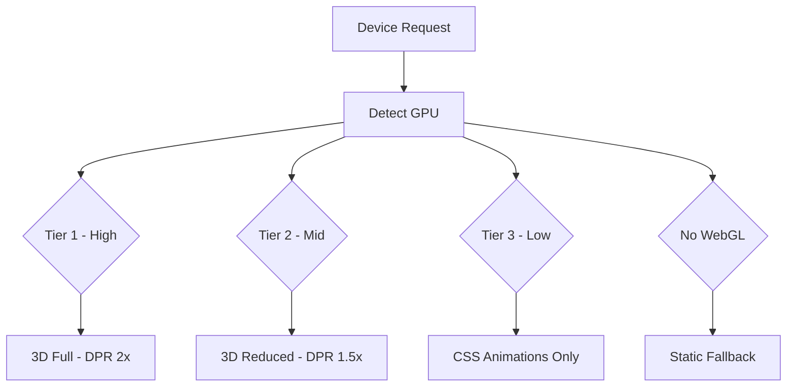

# Mobile Experience Strategy

> **Version:** 2.0 | **Status:** ✅ Active | **Framework:** Tailwind CSS (mobile-first) | **Owner:** UX Lead

## 1. Mobile-First Approach

All UI designed mobile-first using Tailwind breakpoints. Functionality must be flawless on small viewports (320–639px) before scaling up. Desktop is an enhancement layer, not the primary target. Every component is prototyped and tested at 375px width before any responsive upscaling is applied.

**Design principle:** A mobile user must accomplish any task in the same number of steps as a desktop user — never more.

## 2. Breakpoint Strategy

| Range          | Width   | Device         | Layout Characteristics                                    |
| -------------- | ------- | -------------- | --------------------------------------------------------- |
| `xs` (default) | 0–639px | Phones         | All features must work — single column, bottom nav, no 3D |
| `sm`           | 640px+  | Large phones   | Minor layout improvements — larger type, more padding     |
| `md`           | 768px+  | Tablets        | 2-column grids appear, hamburger menu, reduced 3D         |
| `lg`           | 1024px+ | Laptops        | Sidebar docks, 3D hero activates, multi-column grids      |
| `xl`           | 1280px+ | Desktops       | Full layout, expanded whitespace, sticky sidebar          |
| `2xl`          | 1536px+ | Large monitors | Content capped at 1440px, centered with generous margins  |

## 3. Navigation

### Mobile (< 768px) — Bottom Navigation Bar

- Fixed bottom bar with 5 tabs: Home, Projects, Blog, About, Contact
- Active tab styled with `accent-primary` color + filled icon variant
- Respects `safe-area-inset-bottom` via `env(safe-area-inset-bottom)` for notched devices
- Hides on scroll down, reappears on scroll up (scroll direction detection via Framer Motion `useMotionValue`)
- `z-50` — always above content but below modals
- **No hamburger menu** on mobile — bottom nav is the primary navigation

### Tablet (768–1023px) — Hamburger Menu

- Hamburger icon in top bar opens slide-in panel from right
- Panel uses `backdrop-blur-md` with `bg-[#121217]/90`
- Body scroll locked when panel is open (use `useLockedBody` or `overflow: hidden`)
- Menu includes all nav items + theme toggle + search
- Close on backdrop click, escape key, and route change

### Desktop (≥ 1024px) — Docked Sidebar

- Fixed left sidebar, full height, `z-40`
- Default expanded state (240px wide) with icons + labels
- Collapsible to icon-only mode (64px wide) via toggle button
- Collapse preference persisted to `localStorage('sidebar-expanded')`
- Active section highlighted with accent-left-border indicator

## 4. Touch Interaction

### Minimum Touch Targets

| Element           | Min Size            | Notes                                        |
| ----------------- | ------------------- | -------------------------------------------- |
| Primary buttons   | 48×48px             | Any standalone button                        |
| Icon-only buttons | 44×44px             | Must pass through padding if icon is smaller |
| Navigation items  | 48×44px             | Bottom nav tabs, sidebar links               |
| Form controls     | 48px height         | Inputs, selects, textareas                   |
| Links in text     | 24×24px             | Inline links — minimum for finger precision  |
| Toggle / Switch   | 32×20px active area | With min 44×44px tap target via padding      |

### Supported Gestures

| Gesture         | Surface                           | Implementation                            |
| --------------- | --------------------------------- | ----------------------------------------- |
| Tap             | All interactive elements          | Standard click/onTap                      |
| Swipe left      | Notifications, cards to dismiss   | Framer Motion `drag="x"` with `onDragEnd` |
| Swipe right     | Back navigation on nested screens | Custom gesture handler                    |
| Pinch-to-zoom   | Image lightbox, code blocks       | `@use-gesture/react` `usePinch`           |
| Pull-to-refresh | Blog listing, notifications       | Custom implementation with pull indicator |
| Long press      | Copy code, context menus          | `onContextMenu` or timeout-based handler  |

### Scroll Behavior

- **Desktop:** Lenis smooth scroll with `lerp: 0.08` for inertia and `smoothWheel: true`
- **Mobile:** Native browser scroll — `lenis` with `smoothTouch: false` (touch scrolling remains native for performance)
- **Scrollbar styling:** Custom thin scrollbar on desktop (`::-webkit-scrollbar`), hidden on mobile (use native overscroll)

## 5. 3D Performance on Mobile

All 3D scenes use `useDetectGPU()` from `@react-three/drei` for adaptive quality:

| GPU Tier      | DPR        | Shadows         | Post-Processing             | Polygon Budget |
| ------------- | ---------- | --------------- | --------------------------- | -------------- |
| High (Tier 1) | `[1, 2]`   | 2048 shadow map | Bloom, DOF, AA              | 100k triangles |
| Mid (Tier 2)  | `[1, 1.5]` | Disabled        | Optional bloom only         | 30k triangles  |
| Low (Tier 3)  | `[1, 1]`   | Disabled        | Disabled                    | 15k triangles  |
| No WebGL      | N/A        | N/A             | CSS gradient + SVG fallback | N/A            |

```tsx
const { tier } = useDetectGPU();
const dpr = tier === 'low' ? [1, 1] : tier === 'mid' ? [1, 1.5] : [1, 2];
const shadows = tier === 'high';
const postProcessing = tier !== 'low';
```

Mobile devices (Tier 2–3) default to `dpr: [1, 1]` and disable all post-processing. On Tier 3, the 3D scene is not rendered at all — a static WebP or CSS gradient is shown instead.

## 6. Form Inputs

### Input Modes & Autocomplete

| Input Type | `inputmode` | `autocomplete`  | Keyboard                   |
| ---------- | ----------- | --------------- | -------------------------- |
| Email      | `email`     | `email`         | @ and .com keys            |
| URL        | `url`       | `url`           | / and .com keys            |
| Phone      | `tel`       | `tel`           | Numeric keypad             |
| Search     | `search`    | `off`           | Search action key          |
| OTP / Code | `numeric`   | `one-time-code` | Numeric, suggests SMS code |
| Number     | `numeric`   | `off`           | Numeric keypad             |
| Name       | `text`      | `name`          | Default                    |
| Message    | `text`      | `off`           | Default with enter key     |

### Mobile Form Behavior

- All forms stack single-column on mobile — never multi-column
- Labels are top-aligned and always visible (never placeholder-only — placeholder as additional hint is acceptable)
- Submit buttons are full-width on mobile, left-aligned on desktop
- First invalid field is auto-focused on submit attempt
- Error messages appear below the field (not as tooltips) — minimum 12px from the input
- Form data saved to `localStorage` on blur for recovery (prevents loss on accidental close)

## 7. Performance Budgets

| Metric                         | Budget Target  | Enforcement                   |
| ------------------------------ | -------------- | ----------------------------- |
| Initial JavaScript (mobile)    | ≤ 200KB        | CI check on main bundle       |
| Initial CSS                    | ≤ 150KB        | CI check on global CSS        |
| Largest Contentful Paint (LCP) | ≤ 2.5s         | Lighthouse CI                 |
| First Input Delay (FID)        | ≤ 100ms        | Lighthouse CI                 |
| Time to Interactive (TTI)      | ≤ 3.5s         | Lighthouse CI                 |
| Hero image payload             | ≤ 100KB        | `next/image` quality limiting |
| Total page weight              | ≤ 1MB          | Bundle analyzer               |
| 3D scene (lazy loaded)         | ≤ 500KB        | Network tab audit             |
| Total icons (tree-shaken)      | ≤ 15KB gzipped | Bundle analyzer               |

**Budget files:** `apps/web/lighthouse-budgets.json` and `apps/web/bundle-budgets.json`. PRs exceeding budgets fail CI.

## 9. Mobile Rendering Decision Tree



## 8. Offline & Resilience

| Asset Type                     | Strategy                      | Fallback                  |
| ------------------------------ | ----------------------------- | ------------------------- |
| Static assets (CSS, JS, fonts) | Cache First (Workbox)         | Pre-cached at install     |
| 3D scenes                      | Network First, 3s timeout     | Static WebP image         |
| Blog posts                     | Stale-while-revalidate        | Cached version            |
| AI chat messages               | Optimistic UI                 | "Offline" badge indicator |
| Form data                      | Saved to localStorage on blur | Recovered on page load    |

Service worker registered via `next-pwa` or custom Workbox config. Offline page with brand illustration at `/offline`.

## Cross-References
- [../MASTER-INDEX.md](../MASTER-INDEX.md) — Documentation master index
- [../26-reference/CROSS-REFERENCE-INDEX.md](../26-reference/CROSS-REFERENCE-INDEX.md) — Cross-reference system