# Screen Flows & Page Architecture

> **Document:** `UserFlows.md` | **Version:** 4.0 | **Last Updated:** June 2026  
> **Status:** ✅ Active | **Owner:** Frontend Lead | **Review Cadence:** Quarterly  
> **Total Screens Documented:** 19 | **Total Routes:** 26 (19 pages + 7 API routes)

---

## Executive Summary

This document defines the complete screen architecture for the portfolio platform, covering all 19 screens across public, admin, and system categories. Each screen specification includes purpose, inputs, outputs, navigation topology, and all four UI states (loading, error, empty, success). Routes follow Next.js 14 App Router conventions with ISR for public pages and SSR for admin pages.

**Key Metrics:**
- Public screens: 11 | Admin screens: 6 | System screens: 2
- Route patterns: 19 | API patterns: 7 | Layouts: 3 (Public, Admin, Auth)
- Screen states documented: 76 (4 states × 19 screens)
- Navigation flows: 42 documented transitions
- Data dependencies: 17 unique data sources

---

## Decision Log

| ID | Decision | Rationale | Alternatives Considered | Date | Approver |
|----|----------|-----------|------------------------|------|----------|
| SF-001 | 19 screens across 3 categories (public, admin, system) over flat page list | Categories group screens by authentication and layout requirements; enables shared layout components (PublicLayout, AdminShell, AuthLayout) and route guard middleware | Flat page list (no layout inheritance, repeated auth logic), feature-based grouping (cross-cutting concerns like auth span features) | 2026-06-01 | Product Owner |
| SF-002 | Next.js App Router with ISR for public pages, SSR for admin, SSG for static content | ISR balances freshness (60s revalidation) with performance (static delivery); SSR ensures admin always sees current data; SSG for legal/privacy pages that rarely change | All SSR (slower public pages), all ISR (admin pages stale), all SSG (no dynamic data) | 2026-06-01 | Product Owner |
| SF-003 | 4-state taxonomy (loading, error, empty, success) for every screen | Consistent state handling across all 19 screens ensures no unhandled edge cases; enables reusable state component patterns (SkeletonLoading, ErrorFallback, EmptyState) | 3 states (missing empty — lead to blank screens), 5 states (adding maintenance — overengineering), 2 states (loading + success — missing error/empty) | 2026-06-01 | Product Owner |
| SF-004 | 3 layouts (Public, Admin, Auth) over unique layout per screen | Shared layouts reduce code duplication, ensure consistent navigation structure, and enable layout-level error boundaries and loading states | Per-screen layout (duplicated navbar/footer code), single layout for all (cannot differentiate admin from public), no layout (every page defines its own structure) | 2026-06-01 | Product Owner |
| SF-005 | 42 documented navigation transitions over implicit or inferred flows | Explicit documentation of every navigation path enables complete test coverage (Playwright smoke tests for each transition), accurate dependency tracking, and thorough error handling | Implicit flows (missed edge cases, gaps in testing), inferred from code (no documentation, onboarding friction) | 2026-06-01 | Product Owner |

## Risk Register

| ID | Risk | Likelihood | Impact | Mitigation |
|----|------|------------|--------|------------|
| SF-R01 | New screen added without updating screen map or state specifications | Medium | Medium | Screen map is referenced in CI via documentation test; PR template requires screen flow update for new routes |
| SF-R02 | State implementations drift from documented 4-state taxonomy | Medium | Medium | Component library enforces state patterns at the atom/molecule level; code review checklist includes state verification |
| SF-R03 | Navigation transitions break when routes are restructured | Low | High | All 42 transitions are covered by Playwright E2E tests; route changes require updating test selectors |
| SF-R04 | Screen specifications become outdated as features evolve | Medium | Low | Quarterly review cadence; screen flows are updated as part of feature implementation (not a separate activity) |
| SF-R05 | Mobile wireframes for responsive screens are missing or inaccurate | Medium | Medium | Responsive designs are spec'd in the screen definition (not a separate document); mobile-first design principle ensures mobile is designed first |

## 1. Screen Map Overview

```mermaid
graph TB
    subgraph "PUBLIC — No Auth Required"
        direction TB
        Home["/ (Home)<br/>Hero + About + Skills<br/>+ Projects + Contact"]
        Projects["/projects<br/>Project Grid"]
        ProjectDtl["/projects/[slug]<br/>Project Detail"]
        CaseStudies["/case-studies<br/>Case Study Grid"]
        CaseStudyDtl["/case-studies/[slug]<br/>Case Study Detail"]
        Blog["/blog<br/>Blog Listing"]
        BlogDtl["/blog/[slug]<br/>Blog Article"]
        About["/about<br/>About Me"]
        Contact["/contact<br/>Contact Form"]
        Services["/services<br/>Services Offered"]
        AIAssistant["/ai-assistant<br/>AI Chat"]
    end

    subgraph "ADMIN — JWT Required"
        direction TB
        AdminLogin["/admin/login<br/>Auth"]
        AdminDash["/admin<br/>Dashboard"]
        AdminAnalytics["/admin/analytics<br/>Analytics"]
        AdminLeads["/admin/leads<br/>Lead Management"]
        AdminCMS["/admin/cms<br/>Content Manager"]
        AdminMonitoring["/admin/monitoring<br/>System Health"]
        AdminSettings["/admin/settings<br/>Configuration"]
    end

    subgraph "SYSTEM"
        direction TB
        NotFound["/404<br/>Not Found"]
    end

    Home --> Projects
    Home --> CaseStudies
    Home --> Blog
    Home --> About
    Home --> Contact
    Home --> Services
    Home --> AIAssistant
    Projects --> ProjectDtl
    CaseStudies --> CaseStudyDtl
    Blog --> BlogDtl

    AdminLogin --> AdminDash
    AdminDash --> AdminAnalytics
    AdminDash --> AdminLeads
    AdminDash --> AdminCMS
    AdminDash --> AdminMonitoring
    AdminDash --> AdminSettings
    AdminSettings --> AdminLogin

    Note ---> NotFound
```

---

## 2. Route Configuration

| # | Route | Type | Category | Layout | Auth | ISR | Cache TTL | Slug Param |
|---|-------|------|----------|--------|------|-----|-----------|------------|
| 1 | `/` | Static | Public | PublicLayout | No | Yes | 60s | — |
| 2 | `/projects` | Static | Public | PublicLayout | No | Yes | 60s | — |
| 3 | `/projects/[slug]` | Dynamic | Public | PublicLayout | No | Yes | 60s | `slug: string` |
| 4 | `/case-studies` | Static | Public | PublicLayout | No | Yes | 60s | — |
| 5 | `/case-studies/[slug]` | Dynamic | Public | PublicLayout | No | Yes | 60s | `slug: string` |
| 6 | `/blog` | Static | Public | PublicLayout | No | Yes | 300s | — |
| 7 | `/blog/[slug]` | Dynamic | Public | PublicLayout | No | Yes | 300s | `slug: string` |
| 8 | `/about` | Static | Public | PublicLayout | No | Yes | 300s | — |
| 9 | `/contact` | Static | Public | PublicLayout | No | No | — | — |
| 10 | `/services` | Static | Public | PublicLayout | No | Yes | 300s | — |
| 11 | `/ai-assistant` | Static | Public | PublicLayout | No | No | — | — |
| 12 | `/admin/login` | Static | Auth | AuthLayout | No | No | — | — |
| 13 | `/admin` | Static | Admin | AdminLayout | Yes | No | — | — |
| 14 | `/admin/analytics` | Static | Admin | AdminLayout | Yes | No | — | — |
| 15 | `/admin/leads` | Dynamic | Admin | AdminLayout | Yes | No | — | — |
| 16 | `/admin/cms` | Dynamic | Admin | AdminLayout | Yes | No | — | — |
| 17 | `/admin/monitoring` | Static | Admin | AdminLayout | Yes | No | — | — |
| 18 | `/admin/settings` | Static | Admin | AdminLayout | Yes | No | — | — |
| 19 | `/404` | Static | System | PublicLayout | No | No | — | — |

---

## 3. Screen Specifications

---

### SCREEN-001: Homepage

**Route:** `/` | **Category:** Public | **Layout:** PublicLayout | **ISR:** 60s

#### Purpose
Serve as the primary landing page that introduces the developer, showcases skills and featured projects, presents a brief biography, and provides a contact entry point — all within a single-scroll experience that drives visitors to deeper engagement.

#### Inputs

| Input | Source | Type | Required | Default |
|-------|--------|------|----------|---------|
| `sections` | Supabase (sections table) | `Section[]` | Yes | — |
| `featuredProjects` | Supabase (projects table, limit 4) | `Project[]` | No | `[]` |
| `skills` | Supabase (skills table) | `Skill[]` | No | `[]` |
| `theme` | User preference / system | `'light' \| 'dark'` | No | `'dark'` |
| `utm_params` | URL query params | `UTMParams` | No | `null` |

#### Outputs

| Output | Target | Type | Condition |
|--------|--------|------|-----------|
| Rendered page | Browser | HTML + CSS + JS | Always |
| Page view event | PostHog | `AnalyticsEvent` | On mount |
| Section impression | PostHog | `SectionImpression[]` | Per visible section |
| UTM attribution | localStorage | `UTMRecord` | If UTM params present |
| Hero CTA click | PostHog | `ClickEvent` | On CTA click |
| Section scroll depth | PostHog | `ScrollEvent` | Every 25% scroll |

#### Navigation

| Direction | Target | Trigger | Animation |
|-----------|--------|---------|-----------|
| Inbound | — | URL enter / refresh | Fade-in hero |
| Inbound | Any public page | Browser back | Browser default |
| Outbound | `/projects` | "View All Projects" CTA | Slide left |
| Outbound | `/projects/[slug]` | Project card click | Card zoom + fade |
| Outbound | `/blog` | "Read Blog" link | Slide up |
| Outbound | `/about` | "About Me" link | Slide right |
| Outbound | `/contact` | Contact CTA / Nav click | Fade transition |
| Outbound | `/services` | Services link | Slide up |
| Outbound | `/ai-assistant` | AI chat button | Scale in |
| Outbound | External | Social link / resume | New tab |

#### States

| State | Trigger | UI | Behavior |
|-------|---------|----|----------|
| **Loading** | Initial page load | Skeleton layout: shimmer hero (full viewport), 3 text skeleton lines for About, 4 card skeletons for Projects (2×2 grid), progress bar skeletons for Skills | Sections appear as data arrives (progressive enhancement); minimum 400ms skeleton display to prevent flash |
| **Error** | Supabase query fails for any section | `HomeError` component: "Something went wrong loading this section" with retry button; non-failing sections still render | Individual section failures do not block the full page; failed section shows inline error with retry; global error boundary catches render crashes |
| **Empty** | No sections configured in DB | Hero still renders (static content); About shows "Coming soon..."; Skills shows empty state message; Projects shows "No projects yet"; Contact form still interactive | Admin receives visual indicator if logged in: "Add your first section" prompt banner |
| **Success** | All data loaded & rendered | Full scroll page: Hero (3D particle background + title + CTAs) → About (bio + stats) → Skills (animated progress bars) → Projects (4-card grid) → Contact (form + info card) | Intersection Observer triggers section entrance animations on scroll; passive event listeners for scroll performance |

---

### SCREEN-002: Projects Listing

**Route:** `/projects` | **Category:** Public | **Layout:** PublicLayout | **ISR:** 60s

#### Purpose
Display a browsable, filterable grid of all portfolio projects, allowing visitors to explore work by technology, category, or year, and navigate to individual project details.

#### Inputs

| Input | Source | Type | Required | Default |
|-------|--------|------|----------|---------|
| `projects` | Supabase (projects table) | `Project[]` | Yes | — |
| `filter` | URL search params (`?tech=react&year=2025`) | `FilterParams` | No | `{}` |
| `page` | URL search param (`?page=2`) | `number` | No | `1` |
| `theme` | User preference / system | `'light' \| 'dark'` | No | `'dark'` |

#### Outputs

| Output | Target | Type | Condition |
|--------|--------|------|-----------|
| Rendered grid | Browser | HTML + CSS + JS | Always |
| Filter change event | PostHog | `FilterEvent` | On filter apply |
| Project click | PostHog | `ClickEvent` | On project card click |
| Pagination event | PostHog | `PaginationEvent` | On page change |

#### Navigation

| Direction | Target | Trigger | Animation |
|-----------|--------|---------|-----------|
| Inbound | `/` | "Projects" nav link | Slide from right |
| Inbound | `/projects/[slug]` | Browser back | Browser default |
| Outbound | `/projects/[slug]` | Project card click | Card zoom to full |
| Outbound | `/` | Breadcrumb / logo | Slide right |

#### States

| State | Trigger | UI | Behavior |
|-------|---------|----|----------|
| **Loading** | Initial page load | Skeleton grid: 6 card placeholders (2 columns × 3 rows) with image rect + 2 text lines each; filter bar skeleton (3 pill placeholders) | Skeleton matches final grid dimensions exactly to prevent CLS; minimum 300ms display |
| **Error** | Projects query fails | "Failed to load projects" banner with retry button; "Try refreshing the page" secondary text | Retry button re-fetches from Supabase; if already logged in as admin, shows "Create your first project" link |
| **Empty** | `projects.length === 0` | "No projects to display yet" centered message with folder illustration; "Check back soon for updates" subtitle; filter bar still interactive | If filtered empty: "No projects match your filters" with "Clear filters" link |
| **Success** | Projects loaded | Filter bar (tech tags, year dropdown, sort select) + project grid (responsive: 1 col mobile, 2 col tablet, 3 col desktop) + pagination (if > 12 projects) | Each card shows: thumbnail, title, tech tags (first 3 + overflow count), brief description (2 lines), year; hover effect: slight lift + shadow + tag color accent |

---

### SCREEN-003: Project Details

**Route:** `/projects/[slug]` | **Category:** Public | **Layout:** PublicLayout | **ISR:** 60s

#### Purpose
Present an in-depth view of a single project including description, technology stack, screenshots/gallery, live demo link, source code link, and related projects navigation.

#### Inputs

| Input | Source | Type | Required | Default |
|-------|--------|------|----------|---------|
| `slug` | URL params | `string` | Yes | — |
| `project` | Supabase (projects slug query) | `Project` | Yes | — |
| `relatedProjects` | Supabase (same tech tags, limit 3) | `Project[]` | No | `[]` |
| `preview` | Query param (`?preview=true`) | `boolean` | No | `false` |

#### Outputs

| Output | Target | Type | Condition |
|--------|--------|------|-----------|
| Rendered detail | Browser | HTML + CSS + JS | Always |
| Project view event | PostHog | `ProjectView` | On mount |
| Gallery navigation | PostHog | `GalleryNav` | Per image swipe |
| External link click | PostHog | `OutboundClick` | On demo/github click |

#### Navigation

| Direction | Target | Trigger | Animation |
|-----------|--------|---------|-----------|
| Inbound | `/projects` | Project card click | Card zoom to full |
| Inbound | `/projects?tech=react` | "Back to Projects" | Slide right |
| Outbound | `/projects` | Breadcrumb / back button | Slide right |
| Outbound | `/projects/[nextSlug]` | "Next Project" arrow | Slide left |
| Outbound | External | Demo / GitHub link | New tab |

#### States

| State | Trigger | UI | Behavior |
|-------|---------|----|----------|
| **Loading** | Initial load | Skeleton: full-width hero image rect, title skeleton (1 line), tech tag skeletons (5 pills), content skeleton (8 text lines), gallery thumbnail skeletons (4 small rects) | Progressive image loading with blur placeholder; content sections hydrate independently |
| **Error** | Slug not found / query fails | "Project not found" with 404 illustration; "This project may have been removed or the link is broken" text; "Back to Projects" button | 404 status if slug not found; error boundary catches rendering failures |
| **Empty** | Project has no content fields | Project still shows title and tech stack; "No description available" for missing bio; "No screenshots yet" placeholder for gallery | Empty sections simply don't render or show placeholder; page structure remains intact |
| **Success** | Full project data loaded | Hero image (full-width, parallax) → title + subtitle → tech stack badges (with icons) → description (rich text) → feature list → gallery (lightbox-enabled) → live demo + source code buttons → "Related Projects" carousel (3 cards) | Image lazy loading; gallery supports keyboard arrows + swipe on mobile; code blocks syntax-highlighted |

---

### SCREEN-004: Case Studies Listing

**Route:** `/case-studies` | **Category:** Public | **Layout:** PublicLayout | **ISR:** 60s

#### Purpose
Display a curated grid of in-depth case studies that demonstrate problem-solving methodology, design process, technical implementation details, and measurable business impact.

#### Inputs

| Input | Source | Type | Required | Default |
|-------|--------|------|----------|---------|
| `caseStudies` | Supabase (case_studies table) | `CaseStudy[]` | Yes | — |
| `filter` | URL search params | `FilterParams` | No | `{}` |

#### Outputs

| Output | Target | Type | Condition |
|--------|--------|------|-----------|
| Rendered grid | Browser | HTML + CSS + JS | Always |
| Case study view | PostHog | `CaseStudyListImpression` | On mount |
| Filter application | PostHog | `CaseStudyFilter` | On filter change |

#### Navigation

| Direction | Target | Trigger | Animation |
|-----------|--------|---------|-----------|
| Inbound | `/` | "Case Studies" nav link | Slide from right |
| Outbound | `/case-studies/[slug]` | Case study card click | Card expand |
| Outbound | `/` | Breadcrumb / logo | Slide right |

#### States

| State | Trigger | UI | Behavior |
|-------|---------|----|----------|
| **Loading** | Initial load | Skeleton grid: 3 card placeholders with image rect + title + 3 stat skeletons + description skeleton; filter bar skeleton | Grid layout skeleton mirrors the final responsive grid (1→2→3 columns) |
| **Error** | Query fails | "Unable to load case studies" error card with retry; inline error, does not break page | Retry button re-fetches; if admin, shows "Add your first case study" link |
| **Empty** | No case studies exist | "Case studies coming soon" with document illustration; CTA to check back or explore projects | Page still renders with header/footer; empty message matches brand tone |
| **Success** | Case studies loaded | Grid of case study cards: cover image, client name, title, 3 key metrics (e.g., "2.5× conversion", "40% faster", "$50K saved"), tech tags, read time, "Read Case Study" link | Cards sorted by featured (pinned) first, then by date descending; card hover shows gradient overlay |

---

### SCREEN-005: Case Study Details

**Route:** `/case-studies/[slug]` | **Category:** Public | **Layout:** PublicLayout | **ISR:** 60s

#### Purpose
Present a comprehensive, narrative-driven case study covering the problem, approach, design process, implementation, results, and key learnings — serving as the most detailed project content on the platform.

#### Inputs

| Input | Source | Type | Required | Default |
|-------|--------|------|----------|---------|
| `slug` | URL params | `string` | Yes | — |
| `caseStudy` | Supabase (case_studies slug query) | `CaseStudy` | Yes | — |
| `relatedStudies` | Supabase (same industry, limit 2) | `CaseStudy[]` | No | `[]` |

#### Outputs

| Output | Target | Type | Condition |
|--------|--------|------|-----------|
| Rendered article | Browser | HTML + CSS + JS | Always |
| Deep read event | PostHog | `DeepRead(>75%)` | Scroll depth |
| Section engagement | PostHog | `CaseStudySectionView` | Per section visible |

#### Navigation

| Direction | Target | Trigger | Animation |
|-----------|--------|---------|-----------|
| Inbound | `/case-studies` | Card click | Card expand |
| Outbound | `/case-studies` | Breadcrumb / back | Slide right |
| Outbound | `/case-studies/[nextSlug]` | Next/prev buttons | Slide left/right |

#### States

| State | Trigger | UI | Behavior |
|-------|---------|----|----------|
| **Loading** | Initial load | Skeleton: hero section (image + title + stats), content skeleton (header + 15 text lines + image placeholder), TOC sidebar skeleton | Skeleton sections load in order; sticky TOC skeleton shows 6 placeholder links |
| **Error** | Slug not found | "Case study not found" with document illustration; "Back to case studies" button | 404 status if invalid slug |
| **Empty** | Partial content (e.g., no images) | Sections with missing data simply don't render or show "Coming soon" text | Empty sections are hidden gracefully; page structure maintained |
| **Success** | Full study loaded | Hero: cover image + title + client + role + duration + 3 key results metric cards; Sticky TOC sidebar (scroll-spy active); Narrative sections: Problem → Approach → Design → Implementation → Results → Learnings; Image gallery with captions; "Next Study" / "Previous Study" navigation; CTA: "Let's work together" | TOC highlights current section; images lazy-load with blur-up; metrics animate on scroll into view; code snippets syntax-highlighted with copy button |

---

### SCREEN-006: Blog Listing

**Route:** `/blog` | **Category:** Public | **Layout:** PublicLayout | **ISR:** 300s

#### Purpose
Display a searchable, filterable, paginated list of blog articles with preview content, reading time estimates, and topic categorization to encourage content discovery and engagement.

#### Inputs

| Input | Source | Type | Required | Default |
|-------|--------|------|----------|---------|
| `posts` | Supabase (blog_posts, published only) | `BlogPost[]` | Yes | — |
| `tag` | URL search param (`?tag=react`) | `string` | No | `null` |
| `query` | URL search param (`?q=performance`) | `string` | No | `null` |
| `page` | URL search param (`?page=2`) | `number` | No | `1` |

#### Outputs

| Output | Target | Type | Condition |
|--------|--------|------|-----------|
| Rendered listing | Browser | HTML + CSS + JS | Always |
| Search event | PostHog | `BlogSearch` | On search submit |
| Tag filter event | PostHog | `BlogTagFilter` | On tag click |
| Read time tracking | PostHog | `BlogListRead` | Per post impression |

#### Navigation

| Direction | Target | Trigger | Animation |
|-----------|--------|---------|-----------|
| Inbound | `/` | "Blog" nav link | Slide from right |
| Outbound | `/blog/[slug]` | Post card click | Card expand |
| Outbound | `/` | Breadcrumb / logo | Slide right |

#### States

| State | Trigger | UI | Behavior |
|-------|---------|----|----------|
| **Loading** | Initial load | Skeleton: search bar skeleton + tag filter pills (5 skeleton pills) + 4 post card skeletons (image rect + title line + date line + description lines + read time pill) | Cards appear progressively; search bar has micro-delay to prevent flicker on fast loads |
| **Error** | Posts query fails | "Couldn't load blog posts" with error illustration; "Try again" button; "Check back later" text | Retry re-fetches; error isolated to listing (nav and footer still render) |
| **Empty** | No published posts | "No articles published yet" with writing illustration; "Subscribe to be notified when new articles drop" with email input; RSS feed link | If filtered: "No results for '{query}' — try different keywords" with search suggestions |
| **Success** | Posts loaded | Search bar (with icon, clear button) → active tag filter pills (scrollable on mobile, multi-select) → post grid (1 col mobile, 2 col tablet) — each card: cover image, title, publish date, tag badges, 2-line excerpt, reading time, "Read more" link → pagination (page numbers + prev/next) | Posts sorted by publish date descending; featured post (pinned) shows first in full width |

---

### SCREEN-007: Blog Details

**Route:** `/blog/[slug]` | **Category:** Public | **Layout:** PublicLayout | **ISR:** 300s

#### Purpose
Deliver a full, readable blog article with rich media, table of contents, code syntax highlighting, share functionality, and related posts — optimized for reading and content engagement.

#### Inputs

| Input | Source | Type | Required | Default |
|-------|--------|------|----------|---------|
| `slug` | URL params | `string` | Yes | — |
| `post` | Supabase (blog_posts slug query) | `BlogPost` | Yes | — |
| `relatedPosts` | Supabase (same tags, limit 3) | `BlogPost[]` | No | `[]` |

#### Outputs

| Output | Target | Type | Condition |
|--------|--------|------|-----------|
| Rendered article | Browser | HTML + CSS + JS | Always |
| Scroll depth event | PostHog | `ScrollDepth(25,50,75,100)` | Per milestone |
| Read time event | PostHog | `ReadComplete` | 100% scroll |
| Share click | PostHog | `ShareClick` | On share action |
| Copy code | PostHog | `CopyCodeBlock` | On code copy |

#### Navigation

| Direction | Target | Trigger | Animation |
|-----------|--------|---------|-----------|
| Inbound | `/blog` | Post card click | Card expand |
| Outbound | `/blog` | Breadcrumb / back | Slide right |
| Outbound | `/blog/[slug]` by tag | Related post click | Card expand |
| Outbound | External | Share link | New tab / native share |

#### States

| State | Trigger | UI | Behavior |
|-------|---------|----|----------|
| **Loading** | Initial load | Skeleton: full-width cover image rect, title skeleton (2 lines), author/date skeleton (1 line), TOC sidebar skeleton (6 links), article content skeleton (header + 20 text lines + code block skeleton + 5 more lines + image placeholder) | Reading progress bar skeleton at top; estimated read time shown as pulse |
| **Error** | Slug not found | "Article not found" with reading illustration; "Browse all articles" link; "Try searching" prompt | 404 status; sitemap reference maintained for reindexing |
| **Empty** | Limited content (no cover image, etc.) | Missing elements simply not rendered; body content still displays; "No cover image" skipped gracefully | Graceful degradation — no layout shift from missing optional fields |
| **Success** | Full article loaded | Reading progress bar (top, fixed) → article header (cover image with caption, title, author avatar + name + date, tag badges, est. read time, share buttons) → sticky TOC sidebar (desktop) with scroll-spy → article body (headings, paragraphs, images with captions, blockquotes, code blocks with language tag + copy button, tables, embedded tweets/videos) → author bio card → related posts (3 cards) → comments / reactions section → newsletter CTA | Smooth scroll to anchor links; images lazy-load with blur placeholder; code blocks syntax-highlighted via Prism.js; TOC highlights current heading; share supports Twitter, LinkedIn, Facebook, copy link |

---

### SCREEN-008: About

**Route:** `/about` | **Category:** Public | **Layout:** PublicLayout | **ISR:** 300s

#### Purpose
Present a personal, professional biography that establishes credibility, showcases background, highlights key achievements, and builds trust with potential clients and employers.

#### Inputs

| Input | Source | Type | Required | Default |
|-------|--------|------|----------|---------|
| `profile` | Supabase (profile table) | `Profile` | Yes | — |
| `skills` | Supabase (skills table) | `Skill[]` | No | `[]` |
| `workHistory` | Supabase (work_history table) | `WorkExperience[]` | No | `[]` |

#### Outputs

| Output | Target | Type | Condition |
|--------|--------|------|-----------|
| Rendered page | Browser | HTML + CSS + JS | Always |
| Profile view event | PostHog | `AboutPageView` | On mount |
| Resume download | PostHog | `ResumeDownload` | On download click |
| Social link click | PostHog | `SocialClick` | On social icon click |

#### Navigation

| Direction | Target | Trigger | Animation |
|-----------|--------|---------|-----------|
| Inbound | `/` | "About" nav link | Slide from right |
| Outbound | `/contact` | "Get in Touch" CTA | Slide up |
| Outbound | `/` | Logo click | Slide right |
| Outbound | External | Resume / social link | New tab |

#### States

| State | Trigger | UI | Behavior |
|-------|---------|----|----------|
| **Loading** | Initial load | Skeleton: profile image circle (128px), name skeleton (1 line), title skeleton (1 line), bio skeleton (8 lines), stats row (3 stat skeleton boxes), timeline skeleton (3 entries with year + title + 3 text lines each) | Sectional hydration — stats appear first, then bio, then timeline |
| **Error** | Profile query fails | "Unable to load profile information" with user icon; "Please try again later" text; retry button | If logged in as admin, shows "Edit your profile" quick link |
| **Empty** | No work history | Bio and skills still display; "Work experience coming soon" placeholder for timeline | Timeline section simply doesn't render or shows minimal state |
| **Success** | Full profile loaded | Hero: profile photo (with subtle float animation) + name + title + location + availability badge (green/amber/red); Bio section (2-3 paragraphs with emoji highlights) → Stats row (years exp, projects completed, clients served, tech stacks) → Work timeline (animated vertical timeline: date, company, role, description, achievements bullet list) → Resume download button → Social links (GitHub, LinkedIn, Twitter, Dev.to, Stack Overflow) → "Let's Work Together" CTA | Timeline uses Intersection Observer for reveal-on-scroll; stat numbers count up on entrance |

---

### SCREEN-009: Contact

**Route:** `/contact` | **Category:** Public | **Layout:** PublicLayout | **No ISR**

#### Purpose
Provide a functional contact form and alternative contact methods that convert visitors into leads, with CAPTCHA protection, email notifications, and confirmation feedback.

#### Inputs

| Input | Source | Type | Required | Default |
|-------|--------|------|----------|---------|
| `formData` | User input | `{ name, email, subject, message, honeypot }` | Yes | — |
| `captchaToken` | Turnstile / hCaptcha | `string` | Yes | — |
| `csrfToken` | Server-rendered | `string` | Yes | — |
| `utm_params` | URL / localStorage | `UTMParams` | No | `null` |

#### Outputs

| Output | Target | Type | Condition |
|--------|--------|------|-----------|
| Rendered form | Browser | HTML + CSS + JS | Always |
| Form submission | Supabase (leads table) | `LeadRecord` | On valid submit |
| Email notification | Resend API | `EmailNotification` | On lead create |
| CAPTCHA verification | Cloudflare / hCaptcha | `CaptchaResult` | On submit |
| Form view event | PostHog | `ContactPageView` | On mount |
| Form submission event | PostHog | `LeadSubmission` | On successful submit |

#### Navigation

| Direction | Target | Trigger | Animation |
|-----------|--------|---------|-----------|
| Inbound | `/` | "Contact" nav link / CTA | Slide from right |
| Outbound | `/` | "Back to Home" link | Slide right |
| Outbound | — | Form success → thank-you state | In-page transition |

#### States

| State | Trigger | UI | Behavior |
|-------|---------|----|----------|
| **Loading** | Initial page load | Skeleton: form skeleton (4 input fields + textarea + submit button as skeleton pills); contact info card skeleton (3 rows of icon + text) | Sub-second load expected since page is static |
| **Error** | Submission fails (network, validation, captcha) | Inline error messages per field (red border + error text below input); "Submission failed. Please try again." banner above form; CAPTCHA re-request if token expired | Form data persists across error (no field clearing); specific error messages for each field type; 429 errors show "Too many submissions — please wait" |
| **Empty** | First visit (no prior submissions) | Full contact form: name + email + subject + message (all empty) + CAPTCHA widget + submit button + contact info sidebar (email, phone, location, social links); alternative contact methods shown | All fields pristine with placeholder text; no pre-filled data except if user is logged in as admin (pre-fills email) |
| **Success** | Form submitted successfully | Inline success state: green checkmark animation → "Message sent successfully!" + "I'll get back to you within 24 hours" text + ticket ID reference + "Send another message" link | Form replaced with success card (not redirect); PostHog event fired; email notification sent; lead saved to Supabase |

---

### SCREEN-010: Services

**Route:** `/services` | **Category:** Public | **Layout:** PublicLayout | **ISR:** 300s

#### Purpose
Present the range of professional services offered — such as full-stack development, consulting, code review, and architecture design — with pricing models and a clear CTA to convert visitors into clients.

#### Inputs

| Input | Source | Type | Required | Default |
|-------|--------|------|----------|---------|
| `services` | Supabase (services table) | `Service[]` | Yes | — |
| `testimonials` | Supabase (testimonials table) | `Testimonial[]` | No | `[]` |

#### Outputs

| Output | Target | Type | Condition |
|--------|--------|------|-----------|
| Rendered page | Browser | HTML + CSS + JS | Always |
| Service interest | PostHog | `ServiceClick` | Per service "Learn More" / "Book" |
| CTA conversion | PostHog | `ServicesCTAClick` | On contact CTA |

#### Navigation

| Direction | Target | Trigger | Animation |
|-----------|--------|---------|-----------|
| Inbound | `/` | "Services" nav link | Slide from right |
| Outbound | `/contact` | "Book Now" / "Get a Quote" CTA | Slide up |
| Outbound | `/` | Logo click | Slide right |

#### States

| State | Trigger | UI | Behavior |
|-------|---------|----|----------|
| **Loading** | Initial load | Skeleton: 3 service card skeletons (icon + title + description lines + price skeleton + CTA pill); testimonial carousel skeleton (avatar + quote lines) | Cards load in responsive grid layout |
| **Error** | Services query fails | "Services temporarily unavailable" with tools illustration; retry button; "Contact me directly for service inquiries" fallback link | Fallback contact link always visible regardless of error |
| **Empty** | No services configured | "Services page coming soon" with construction illustration; "In the meantime, feel free to reach out" with contact link | Page still shows brand header/footer; contact CTA prominently displayed |
| **Success** | Services loaded | Intro section (value proposition + CTAs) → service cards grid (icon, title, description, key features bullet list, starting price badge, "Book Now" / "Learn More" button) → testimonial carousel (avatar, quote, name, title, company, rating stars) → FAQ accordion (common questions about process, timeline, pricing) → Final CTA section ("Ready to work together?") | Cards animate on scroll; testimonial carousel auto-plays but pauses on hover; FAQ uses accordion with smooth expand/collapse |

---

### SCREEN-011: AI Assistant

**Route:** `/ai-assistant` | **Category:** Public | **Layout:** PublicLayout | **No ISR**

#### Purpose
Provide an interactive AI chat interface that answers questions about the developer's skills, experience, projects, and availability — acting as a 24/7 intelligent pre-filter before human contact.

#### Inputs

| Input | Source | Type | Required | Default |
|-------|--------|------|----------|---------|
| `userMessage` | User text input | `string` | Yes | — |
| `sessionId` | localStorage / cookie | `string` | Yes (auto) | `uuid()` |
| `messageHistory` | Session store | `ChatMessage[]` | No | `[]` |
| `ragContext` | Supabase (vector DB) | `ContextChunk[]` | No | `[]` |

#### Outputs

| Output | Target | Type | Condition |
|--------|--------|------|-----------|
| AI response | Browser (streamed) | `string` (SSE) | On valid message |
| Chat session | Session store | `ChatSession` | Always |
| Chat event | PostHog | `AIChatMessage` | Per message |
| Lead qualification | PostHog / Supabase | `QualifiedLead` | If intent detected |
| Follow-up email trigger | Resend API | `EmailTrigger` | If user opts in |

#### Navigation

| Direction | Target | Trigger | Animation |
|-----------|--------|---------|-----------|
| Inbound | `/` | AI chat FAB / nav link | Scale in |
| Outbound | `/contact` | "Talk to a human" CTA | Slide up |
| Outbound | `/` | "Exit chat" / logo | Scale out |
| Outbound | External | "Book a call" link | New tab |

#### States

| State | Trigger | UI | Behavior |
|-------|---------|----|----------|
| **Loading** | Initial page load | Chat UI skeleton: header skeleton (avatar + title + status dot), message area skeleton (2 bot message bubbles + 1 typing indicator), input bar skeleton | Skeleton messages show bot messages only (no user messages) |
| **Error** | AI service unavailable (5xx, rate limit) | "AI assistant is temporarily unavailable" inline error banner; "You can still reach out via the contact form" link; "Try again" button | Previous chat messages remain visible; API key validation on startup; rate limit shows "Please wait before sending another message" |
| **Empty** | First visit, no chat history | Welcome message from AI: "Hi! I'm the AI assistant for [Name]. Ask me anything about their skills, experience, projects, or how we could work together!" + 3-4 suggested starter questions as clickable chips | Suggested questions are context-aware (dynamic based on portfolio content); chat history is empty with clean state |
| **Success** | Active conversation | Chat header: AI avatar + name + online status dot + "Ask me anything" subtitle; Message area: user messages (right-aligned, brand color bubble) + bot messages (left-aligned, neutral bubble with markdown rendering, code blocks, links) + streaming indicator (animated dots while generating); Input bar: text input (auto-grow) + send button + microphone button (if supported) + character count; Suggested follow-up chips below bot responses | Messages scroll to bottom on new message; markdown rendered in bot responses (bold, lists, code, links); typing indicator shows during AI generation; conversation persisted to session storage |

---

### SCREEN-012: Admin Login

**Route:** `/admin/login` | **Category:** Auth | **Layout:** AuthLayout | **No ISR**

#### Purpose
Provide a secure authentication portal for admin users with JWT-based session management, rate limiting, and redirect to the admin dashboard upon successful login.

#### Inputs

| Input | Source | Type | Required | Default |
|-------|--------|------|----------|---------|
| `email` | User input | `string` | Yes | — |
| `password` | User input | `string` | Yes | — |
| `csrfToken` | Server-rendered | `string` | Yes | — |
| `redirectTo` | URL query param | `string` | No | `/admin` |

#### Outputs

| Output | Target | Type | Condition |
|--------|--------|------|-----------|
| JWT token | httpOnly cookie | `string` | On successful auth |
| Session | Supabase / Redis | `SessionRecord` | On successful auth |
| Login event | PostHog | `AdminLoginAttempt` | On submit |
| Failed attempt counter | Supabase / Redis | `FailedAttempt` | On failed login |

#### Navigation

| Direction | Target | Trigger | Animation |
|-----------|--------|---------|-----------|
| Inbound | `/admin/*` | Unauthenticated redirect | Instant redirect |
| Outbound | `/admin` | Successful login | Fade to dashboard |
| Outbound | `/` | "Back to site" link | Slide right |

#### States

| State | Trigger | UI | Behavior |
|-------|---------|----|----------|
| **Loading** | Form submitted, awaiting auth | Submit button shows spinner; all inputs disabled; "Authenticating..." text below button | Prevent double submission; 5-second timeout with "Taking longer than expected" warning |
| **Error** | Invalid credentials, rate limit, CSRF failure | "Invalid email or password" inline error above form (no indication of which field is wrong); rate limit: "Too many attempts. Please try again in {minutes} minutes" with countdown; "Account locked after {n} failed attempts. Check your email to reset." for lockout | Generic error messages to prevent credential enumeration; rate limit uses exponential backoff (1min → 5min → 15min → 1hr); CSRF failure triggers page reload with new token |
| **Empty** | First visit, no prior session | Clean login form: email input (with icon + autocomplete="email"), password input (with icon + toggle visibility + autocomplete="current-password"), "Remember me" checkbox, "Sign In" button (full-width), "Back to site" link, "Forgot password?" link | Form autofocus on email input; no pre-filled credentials; forgot password flow opens modal/email |
| **Success** | Valid credentials | Brief (800ms) success animation: checkmark on button → redirect to `/admin` (or `redirectTo` param) | JWT cookie set via httpOnly; session stored in Supabase/Redis; redirect avoids POST re-submit on refresh |

---

### SCREEN-013: Admin Dashboard

**Route:** `/admin` | **Category:** Admin | **Layout:** AdminLayout | **No ISR**

#### Purpose
Serve as the primary admin landing page with an at-a-glance overview of key metrics, recent activity, quick actions, and system health indicators.

#### Inputs

| Input | Source | Type | Required | Default |
|-------|--------|------|----------|---------|
| `stats` | Supabase / PostHog | `DashboardStats` | Yes | — |
| `recentLeads` | Supabase (leads, limit 5) | `Lead[]` | No | `[]` |
| `recentProjects` | Supabase (projects, limit 5) | `Project[]` | No | `[]` |
| `analytics` | PostHog API | `AnalyticsSummary` | No | `null` |
| `systemHealth` | Monitoring service | `HealthStatus` | No | `'ok'` |

#### Outputs

| Output | Target | Type | Condition |
|--------|--------|------|-----------|
| Rendered dashboard | Browser | HTML + CSS + JS | Always |
| Widget data refresh | Browser (polling) | JSON | Every 30s |
| Admin session heartbeat | Supabase | `HeartbeatEvent` | Every 60s |

#### Navigation

| Direction | Target | Trigger | Animation |
|-----------|--------|---------|-----------|
| Inbound | `/admin/login` | Successful auth | Fade in |
| Outbound | `/admin/analytics` | Sidebar nav | Slide left |
| Outbound | `/admin/leads` | Sidebar nav / widget click | Slide left |
| Outbound | `/admin/cms` | Sidebar nav / "Edit" quick action | Slide left |
| Outbound | `/admin/settings` | Sidebar nav | Slide left |
| Outbound | `/admin/login` | "Logout" action | Redirect |

#### States

| State | Trigger | UI | Behavior |
|-------|---------|----|----------|
| **Loading** | Initial page load | Skeleton: 4 stat card skeletons (number + label + trend arrow) in a row, 2 chart skeleton widgets (rect with axes lines), table skeleton (5 rows × 4 columns), recent activity skeleton (5 timeline dot + text lines) | Widgets hydrate independently (progressive loading); stat cards appear first, charts load last |
| **Error** | Individual widget failures | Per-widget error state: small inline error icon + "Failed to load" text + retry button; non-failing widgets remain functional; global error: "Dashboard partially loaded" banner | Widget-level isolation — one failed API does not break the entire dashboard; retry is per-widget |
| **Empty** | First-time admin (no content, no analytics) | "Welcome to your portfolio dashboard!" onboarding card with setup checklist: "Add your first project", "Write your first blog post", "Update your profile", "View your site"; stats show "—" or "0" with "No data yet" label; charts show "Collecting data... (available in 24h)" placeholder | Onboarding checklist persists until items are completed; "View your site" opens portfolio in new tab |
| **Success** | All data loaded | Top bar (date range selector + "Last refreshed: Xs ago" + refresh button) → KPI row (4 stat cards: Visitors, Leads, Projects, Engagement — each with number, label, trend arrow, sparkline mini-chart) → Charts row (Visitor chart: line chart with 7/30/90 day toggle; Source breakdown: donut chart) → Tables row (Recent Leads: 5-row compact table with status badge; Recent Projects: 5-row table with publish toggle) → Quick actions (New Project, New Blog Post, View Site) → System health indicator (green/yellow/red dot) | Stat cards show trending percentage with green/red color; sparkline shows 7-day trend; charts support date range selector; system health shows last check timestamp |

---

### SCREEN-014: Admin Analytics

**Route:** `/admin/analytics` | **Category:** Admin | **Layout:** AdminLayout | **No ISR**

#### Purpose
Provide detailed analytics dashboards with customizable date ranges, visualizations for traffic, engagement, leads, and content performance — powered by PostHog data.

#### Inputs

| Input | Source | Type | Required | Default |
|-------|--------|------|----------|---------|
| `dateRange` | User selection / URL params | `{ start: Date, end: Date }` | Yes | `last30days` |
| `analyticsData` | PostHog API | `AnalyticsPayload` | Yes | — |
| `dimension` | User selection | `'day' \| 'week' \| 'month'` | No | `'day'` |

#### Outputs

| Output | Target | Type | Condition |
|--------|--------|------|-----------|
| Rendered analytics | Browser | HTML + CSS + JS | Always |
| Chart export | Download | CSV / PNG | On export click |
| Date range change | PostHog | `AnalyticsDateChange` | On range select |
| Report schedule | Cron / in-app | `ScheduledReport` | If configured |

#### Navigation

| Direction | Target | Trigger | Animation |
|-----------|--------|---------|-----------|
| Inbound | `/admin` | Sidebar "Analytics" nav | Slide left |
| Outbound | `/admin` | Sidebar nav / breadcrumb | Slide right |
| Outbound | `/admin/leads` | Lead metric drill-down | Slide left |

#### States

| State | Trigger | UI | Behavior |
|-------|---------|----|----------|
| **Loading** | Initial load or date range change | Skeleton: date range picker bar skeleton, 4 metric card skeletons, 2 chart skeletons (line + bar), table skeleton (10 rows × 5 columns) | Charts skeleton shows axes with grid lines; date range change triggers partial reload (charts only, not full page) |
| **Error** | PostHog API failure | "Analytics data temporarily unavailable" banner with retry; "Check PostHog directly" fallback link; cached data shown if available | Last cached data displayed with "Data may be stale" indicator; retry uses exponential backoff |
| **Empty** | No events yet (new deployment) | "Collecting data — analytics will be available in 24-48 hours" with chart placeholder; "Configure PostHog" link if not set up | Empty state shows sample/placeholder visual so layout is visible; all charts show "No data yet" |
| **Success** | Analytics loaded | Date range picker (presets: 7d, 30d, 90d, custom with calendar) + dimension toggle (day/week/month) → KPI cards (Total Visitors, Unique Visitors, Page Views, Avg Session Duration, Bounce Rate, Conversion Rate) with trend percentages → Traffic Overview (line chart: visitors over time, with annotation markers for content publishes) → Traffic Sources (donut/bar chart: direct, organic, social, referral, direct) → Top Pages (table: page, views, unique visitors, avg time, bounce rate) → Leads Over Time (bar chart overlaid on visitor line) → Device Breakdown (pie chart: desktop, mobile, tablet) → Export buttons (CSV, PNG) | Charts are interactive (hover tooltips, click to drill down); date range changes trigger smooth chart transition; export generates report with current view |

---

### SCREEN-015: Admin Leads

**Route:** `/admin/leads` | **Category:** Admin | **Layout:** AdminLayout | **No ISR**

#### Purpose
Manage all incoming leads from the contact form and AI assistant — enabling view, filter, search, status update, reply, export, and conversion tracking.

#### Inputs

| Input | Source | Type | Required | Default |
|-------|--------|------|----------|---------|
| `leads` | Supabase (leads table) | `Lead[]` | Yes | — |
| `filters` | URL search params / user selection | `LeadFilters` | No | `{}` |
| `searchQuery` | User input | `string` | No | `''` |
| `page` | URL param / pagination | `number` | No | `1` |

#### Outputs

| Output | Target | Type | Condition |
|--------|--------|------|-----------|
| Rendered lead table | Browser | HTML + CSS + JS | Always |
| Lead status update | Supabase | `LeadUpdate` | On status change |
| Email reply | Resend API | `EmailSent` | On reply send |
| CSV export | Download | `text/csv` | On export click |
| Bulk action | Supabase | `BulkUpdate` | On bulk action |

#### Navigation

| Direction | Target | Trigger | Animation |
|-----------|--------|---------|-----------|
| Inbound | `/admin` | Sidebar "Leads" nav / dashboard click | Slide left |
| Outbound | `/admin` | Sidebar nav / breadcrumb | Slide right |
| Outbound | External | Lead email click | `mailto:` link |

#### States

| State | Trigger | UI | Behavior |
|-------|---------|----|----------|
| **Loading** | Initial load or filter change | Table skeleton: filter bar skeleton (3 dropdown skeleton pills + search skeleton + export skeleton) + 15 row skeletons (checkbox, name, email, subject, date, status dot, action icon) | Pagination skeleton at bottom; virtual scroll area skeleton if > 50 leads expected |
| **Error** | Leads query fails | "Could not load leads" banner with retry; "If the problem persists, check Supabase connection" | Retry button re-fetches; error does not crash admin panel |
| **Empty** | No leads received | "No leads yet — they'll appear here when someone reaches out" with illustration; "Share your portfolio to start receiving leads" tip box; link to `/contact` to test form | If filtered: "No leads match these filters" with "Clear filters" link; empty states have a friendly tone |
| **Success** | Leads loaded | Filter bar: search input (name/email/subject), status filter (New, Read, Replied, Converted, Archived), date range filter, source filter (Contact Form, AI Assistant, Referral), sort dropdown → Lead table (virtual scroll for performance): checkbox, avatar/name, email, subject (truncated), date (relative: "2h ago"), status badge (color-coded: New=blue, Read=gray, Replied=green, Converted=gold, Archived=light), source icon, quick actions (mark read, reply, archive) → Pagination / infinite scroll → Action bar: bulk select + bulk status change + bulk export + "Select all" → Lead detail panel (slide-out or modal): full message, source metadata, timestamps, activity log, reply composer | Status changes are optimistic (instant UI update, background sync); reply opens inline composer; export generates CSV with all visible columns; virtual scroll for 500+ leads |

---

### SCREEN-016: Admin CMS

**Route:** `/admin/cms` | **Category:** Admin | **Layout:** AdminLayout | **No ISR**

#### Purpose
Provide a content management interface for all portfolio content types — sections, projects, case studies, blog posts, skills, services — with rich editing, media management, and publishing workflow.

#### Inputs

| Input | Source | Type | Required | Default |
|-------|--------|------|----------|---------|
| `contentType` | URL param / user selection | `'sections' \| 'projects' \| 'case-studies' \| 'blog' \| 'skills' \| 'services'` | Yes | `'sections'` |
| `contentList` | Supabase (content type query) | `ContentItem[]` | Yes | — |
| `editorContent` | User edits (rich text) | `EditorState` | No | `null` |

#### Outputs

| Output | Target | Type | Condition |
|--------|--------|------|-----------|
| Content list | Browser | HTML + CSS + JS | Always |
| Content CRUD | Supabase | `ContentMutation` | On save/delete |
| Media upload | Supabase Storage | `UploadResult` | On file upload |
| Publish/unpublish | Supabase + ISR revalidation | `PublishResult` | On publish toggle |

#### Navigation

| Direction | Target | Trigger | Animation |
|-----------|--------|---------|-----------|
| Inbound | `/admin` | Sidebar "CMS" nav | Slide left |
| Outbound | `/admin` | Sidebar nav / breadcrumb | Slide right |
| Internal | Content type tabs | Tab click | Instant tab switch |

#### States

| State | Trigger | UI | Behavior |
|-------|---------|----|----------|
| **Loading** | Initial load or content type switch | Content type tab skeleton (6 pill skeletons), table/list skeleton (8 rows × columns based on content type), editor skeleton (toolbar skeleton + text area skeleton) | Tab switch loads new content type via client-side fetch (no full page reload); skeleton updates to match new content type's columns |
| **Error** | CRUD operation fails | Operation-specific toast error: "Failed to save changes" (red toast, top-right, auto-dismiss 5s); "Failed to upload image" (inline below upload zone); "Network error — changes will sync when connection restores" (persistent banner) | Unsaved changes preserved in editor (no data loss); retry button on failed operations; optimistic updates rolled back on failure |
| **Empty** | No content of selected type | "No {contentType} yet" with type-specific illustration; "Create your first {contentType}" prominent CTA button; "Learn how to get started" help link | Empty state is type-aware (different illustrations/text for projects vs blog vs skills); CTA opens editor for new item |
| **Success** | Content loaded, editor active | Left panel: Content type tabs (Sections, Projects, Case Studies, Blog, Skills, Services) as horizontal tabs; Content list view: sortable table/grid with columns (title, status badge: Draft/Published/Archived, last modified date, actions: edit/duplicate/delete) + search bar + filter (status, date) + "New {ContentType}" button; Right panel (when editing): Editor toolbar (Bold, Italic, Heading, Link, Image, Code, List, Blockquote, Undo, Redo, Preview) + rich text editor (TipTap/ProseMirror) + metadata sidebar (slug, tags, publish date, SEO title, meta description, OG image upload, featured toggle) + Save Draft / Publish buttons + auto-save indicator ("Saved" / "Saving...") | Auto-save every 30s debounced; media manager (drag-drop upload, grid view of uploaded images with copy path); draft preview opens in new tab; publishing triggers ISR revalidation |

---

### SCREEN-017: Admin Monitoring

**Route:** `/admin/monitoring` | **Category:** Admin | **Layout:** AdminLayout | **No ISR**

#### Purpose
Provide real-time and historical system monitoring for uptime, API health, database performance, error rates, and resource utilization — enabling proactive incident response.

#### Inputs

| Input | Source | Type | Required | Default |
|-------|--------|------|----------|---------|
| `healthStatus` | BetterStack / custom health check | `HealthReport` | Yes | — |
| `errorLogs` | Sentry API | `ErrorEvent[]` | No | `[]` |
| `performanceMetrics` | Vercel Analytics / PostHog | `PerfMetrics` | No | `null` |
| `uptimeData` | BetterStack API | `UptimeSeries` | No | `null` |

#### Outputs

| Output | Target | Type | Condition |
|--------|--------|------|-----------|
| Monitoring dashboard | Browser | HTML + CSS + JS | Always |
| Alert acknowledgment | Sentry / BetterStack | `AlertAck` | On acknowledge |
| Export report | Download | CSV / PDF | On export |

#### Navigation

| Direction | Target | Trigger | Animation |
|-----------|--------|---------|-----------|
| Inbound | `/admin` | Sidebar "Monitoring" nav | Slide left |
| Outbound | `/admin` | Sidebar nav / breadcrumb | Slide right |

#### States

| State | Trigger | UI | Behavior |
|-------|---------|----|----------|
| **Loading** | Initial load | Skeleton: 6 health check card skeletons (service name + status dot + response time), 2 chart skeletons (error rate + response time), incident timeline skeleton (5 placeholder entries) | Health checks load first (fastest endpoint), charts load progressively |
| **Error** | Monitoring service unreachable | "Monitoring data temporarily unavailable — services may still be operational" banner; "Check external monitoring dashboard" link; last known good data shown if cached | Monitoring service failure does not imply system failure; cached data with staleness indicator |
| **Empty** | No errors/incidents recorded | "All clear — no incidents in the selected period" with green shield illustration; "No errors recorded" in error rate chart; "100% uptime" stat card | Clean, positive empty state; encourages confidence |
| **Success** | Monitoring data loaded | Top row: Overall status badge (All Systems Operational / Degraded / Outage) + 24h uptime % + avg response time + error count (24h) → Health checks grid: 6+ service cards (Website, API, Database, AI Service, Email, CDN) each with: service name, status dot (green/yellow/red), response time (ms), last checked timestamp, 24h uptime %, health check history sparkline → Incident timeline: chronological severity-coded entries with timestamp, service, description, duration, resolution → Error rate chart (line chart: errors per minute over 24h) → Response time chart (line chart: p50/p95/p99 latency over 24h) → Resource metrics (if hosted): CPU, memory, request rate → Export buttons | Auto-refresh every 30s; health check cards animate status changes; incident timeline filters by severity; charts support time range selector (1h, 6h, 24h, 7d) |

---

### SCREEN-018: Admin Settings

**Route:** `/admin/settings` | **Category:** Admin | **Layout:** AdminLayout | **No ISR**

#### Purpose
Provide a centralized configuration interface for profile management, site settings, integrations, notification preferences, security settings, and team management.

#### Inputs

| Input | Source | Type | Required | Default |
|-------|--------|------|----------|---------|
| `adminProfile` | Supabase (auth.users) | `AdminProfile` | Yes | — |
| `siteConfig` | Supabase (site_config table) | `SiteConfig` | Yes | — |
| `integrationStatus` | Supabase / API checks | `IntegrationStatus[]` | No | `[]` |
| `formData` | User input | Form fields vary by section | No | — |

#### Outputs

| Output | Target | Type | Condition |
|--------|--------|------|-----------|
| Settings UI | Browser | HTML + CSS + JS | Always |
| Config update | Supabase | `ConfigUpdate` | On save |
| Password change | Supabase auth | `PasswordChange` | On password update |
| Integration test | External API | `IntegrationTestResult` | On test connection |

#### Navigation

| Direction | Target | Trigger | Animation |
|-----------|--------|---------|-----------|
| Inbound | `/admin` | Sidebar "Settings" nav | Slide left |
| Outbound | `/admin` | Sidebar nav / breadcrumb | Slide right |
| Internal | Settings tabs | Tab click | Instant tab switch |

#### States

| State | Trigger | UI | Behavior |
|-------|---------|----|----------|
| **Loading** | Initial load | Skeleton: settings tab skeleton (5 pill tabs), active tab content skeleton (form fields as skeleton pills + toggle skeletons + button skeleton) | Tab switching loads content client-side; settings are typically fast since data is small |
| **Error** | Save operation fails | Inline error on the specific field or section that failed; "Failed to save {section}" toast with retry; "Network error — changes will sync when connection restores" | Validated fields show specific error messages (e.g., "Invalid URL format", "Email already in use"); unsaved changes preserved |
| **Empty** | First-time setup (fresh install) | "Welcome! Let's set up your portfolio" with setup wizard CTA; all settings at defaults; integration section shows "No integrations configured — add your first one" with service selection grid | Setup wizard walks through: Profile → Site Settings → Integrations → Security; each step has tooltip guidance |
| **Success** | Settings loaded and operational | Settings tabs: Profile (name, email, avatar upload, bio, social links), Site (site title, description, logo upload, favicon upload, custom domain, SEO defaults, analytics ID, maintenance mode toggle), Content (default blog cover, comment settings, RSS toggle, reading time toggle), Integrations (PostHog: status + API key field + test button; Resend: status + API key field + test button; GitHub: status + OAuth config; Supabase: status + connection info; Sentry: DSN field + test button; BetterStack: API key, status), Notifications (email notifications toggle: new lead, new lead via AI, form submission, weekly digest, error alerts), Security (password change form: current + new + confirm new; 2FA toggle; active sessions list with revoke; API keys for external access; last login timestamps), Danger Zone (delete account with confirmation flow: type "DELETE" + confirm) | Each form section has independent save button (not a single "Save All"); integration "Test" buttons show success/failure inline; password change requires current password; danger zone actions require confirmation; settings are fetched once and cached for session |

---

### SCREEN-019: 404 Not Found

**Route:** `*` (catch-all) | **Category:** System | **Layout:** PublicLayout | **No ISR**

#### Purpose
Provide a helpful, on-brand error page for invalid routes that guides users back to valid content with search, navigation suggestions, and error reporting.

#### Inputs

| Input | Source | Type | Required | Default |
|-------|--------|------|----------|---------|
| `pathname` | URL (window.location) | `string` | Yes | — |
| `suggestion` | Fuzzy match against valid routes | `Suggestion[]` | No | `[]` |

#### Outputs

| Output | Target | Type | Condition |
|--------|--------|------|-----------|
| Rendered 404 | Browser | HTML + CSS + JS | Always |
| 404 event | PostHog | `PageNotFound` | On mount |
| Suggested link click | PostHog | `NotFoundSuggestionClick` | On suggestion click |

#### Navigation

| Direction | Target | Trigger | Animation |
|-----------|--------|---------|-----------|
| Inbound | Any broken URL | Catch-all route match | Instant render |
| Outbound | `/` | "Go Home" button | Fade to home |
| Outbound | Suggested page | Suggestion link click | Normal navigation |
| Outbound | `/contact` | "Report broken link" | Slide up |

#### States

| State | Trigger | UI | Behavior |
|-------|---------|----|----------|
| **Loading** | — | Not applicable (static page, no async data) | Page is fully static HTML; no loading state needed |
| **Error** | — | Not applicable (this IS the error page) | N/A |
| **Empty** | No similar pages found | Standard 404: large "404" in brand font + "Page not found" + "The page you're looking for doesn't exist or has been moved" + "Go Home" button + "Search site" input with autocomplete | Search input queries blog/projects/case studies for suggestions; autocomplete shows up to 5 matches |
| **Success** | Page rendered with suggestions | "404" creative illustration (interactive animation: floating elements or particle "4"s) + "Page not found" text + "The page you're looking for doesn't exist or has been moved" + Search bar (with autocomplete dropdown from valid routes) + "Did you mean?" suggestions (up to 3 close-matching routes) + Quick links: Home, Projects, Blog, Contact + "Report broken link" link → admin notification if visited by authenticated admin | Suggestions are generated by fuzzy-matching the invalid pathname against the sitemap; search autocomplete indexes all public pages; 404 event logged to PostHog for broken link monitoring |

---

## 4. Performance Budgets by Screen

| Screen | Initial JS | Initial CSS | LCP Target | TBT Target | CLS Target | TTI Target | API Calls |
|--------|-----------|-------------|------------|------------|------------|------------|-----------|
| Homepage | < 100KB | < 25KB | < 2.0s | < 100ms | < 0.1 | < 2.5s | 3-4 |
| Projects Listing | < 90KB | < 20KB | < 2.0s | < 100ms | < 0.1 | < 2.5s | 1 |
| Project Details | < 120KB | < 30KB | < 2.5s | < 150ms | < 0.1 | < 3.0s | 2 |
| Case Studies | < 90KB | < 20KB | < 2.0s | < 100ms | < 0.1 | < 2.5s | 1 |
| Case Study Detail | < 130KB | < 30KB | < 2.5s | < 150ms | < 0.1 | < 3.0s | 2 |
| Blog Listing | < 80KB | < 20KB | < 2.0s | < 100ms | < 0.1 | < 2.5s | 1 |
| Blog Details | < 120KB | < 25KB | < 2.5s | < 150ms | < 0.1 | < 3.0s | 2 |
| About | < 70KB | < 18KB | < 1.8s | < 80ms | < 0.1 | < 2.0s | 1-2 |
| Contact | < 60KB | < 15KB | < 1.5s | < 50ms | < 0.1 | < 2.0s | 0 |
| Services | < 80KB | < 20KB | < 2.0s | < 100ms | < 0.1 | < 2.5s | 1 |
| AI Assistant | < 150KB | < 25KB | < 3.0s | < 200ms | < 0.1 | < 3.5s | 0 (client-side) |
| Admin Login | < 60KB | < 15KB | < 1.5s | < 50ms | < 0.1 | < 2.0s | 0 |
| Admin Dashboard | < 150KB | < 35KB | < 3.0s | < 200ms | < 0.1 | < 3.5s | 4-6 |
| Admin Analytics | < 180KB | < 35KB | < 3.0s | < 200ms | < 0.1 | < 3.5s | 2-4 |
| Admin Leads | < 130KB | < 30KB | < 2.5s | < 150ms | < 0.1 | < 3.0s | 2 |
| Admin CMS | < 200KB | < 40KB | < 3.5s | < 250ms | < 0.1 | < 4.0s | 2-3 |
| Admin Monitoring | < 160KB | < 30KB | < 3.0s | < 200ms | < 0.1 | < 3.5s | 3-5 |
| Admin Settings | < 100KB | < 25KB | < 2.0s | < 100ms | < 0.1 | < 2.5s | 1-2 |
| 404 | < 40KB | < 10KB | < 1.0s | < 30ms | < 0.1 | < 1.5s | 0 |

---

## 5. Data Flow per Screen

| Screen | Data Sources | Fetch Strategy | Cache Strategy | Revalidation |
|--------|-------------|---------------|----------------|--------------|
| Homepage | Supabase: sections, projects, skills | Server fetch (ISR) | ISR (60s) | On-demand via admin |
| Projects Listing | Supabase: projects | Server fetch (ISR) | ISR (60s) | On-demand via admin |
| Project Details | Supabase: projects | Server fetch (ISR) | ISR (60s) | On-demand via admin |
| Case Studies | Supabase: case_studies | Server fetch (ISR) | ISR (60s) | On-demand via admin |
| Case Study Detail | Supabase: case_studies | Server fetch (ISR) | ISR (60s) | On-demand via admin |
| Blog Listing | Supabase: blog_posts | Server fetch (ISR) | ISR (300s) | On-demand via admin |
| Blog Details | Supabase: blog_posts | Server fetch (ISR) | ISR (300s) | On-demand via admin |
| About | Supabase: profile, skills, work_history | Server fetch (ISR) | ISR (300s) | On-demand via admin |
| Contact | Supabase: leads (write only) | Client write | None | N/A (write-only) |
| Services | Supabase: services, testimonials | Server fetch (ISR) | ISR (300s) | On-demand via admin |
| AI Assistant | Supabase: vector DB, AI API | Client fetch (SSE) | Session storage | Per message |
| Admin Login | Supabase: auth | Client fetch | None | Per session |
| Admin Dashboard | Supabase + PostHog | Client fetch (SWR) | SWR (30s) | Polling every 30s |
| Admin Analytics | PostHog API | Client fetch (SWR) | SWR (5min) | On date range change |
| Admin Leads | Supabase: leads | Client fetch (SWR) | SWR (30s) | On status change |
| Admin CMS | Supabase: content tables | Client fetch (SWR) | SWR (60s) | On CRUD operation |
| Admin Monitoring | BetterStack + Sentry APIs | Client fetch (SWR) | SWR (60s) | Polling every 30s |
| Admin Settings | Supabase: auth + site_config | Client fetch (SWR) | Session cache | On save |

---

## 6. Responsive Behavior per Screen

| Screen | Mobile (< 640px) | Tablet (640-1024px) | Desktop (> 1024px) |
|--------|------------------|---------------------|---------------------|
| Homepage | Single column stack; hero compact; cards full-width | 2-column skills & projects; hero medium | Full layout; 3-column projects; hero full-screen |
| Projects Listing | 1 column grid; filter as bottom sheet | 2 column grid; filter sidebar collapsible | 3 column grid; filter sidebar persistent |
| Project Details | Full-width content; gallery single image; TOC hidden | TOC as hamburger; 2-column gallery | Side-by-side TOC + content; 3-column gallery |
| Case Studies | 1 column; stats stacked | 2 column grid; stats cards horizontal | 3 column grid; sticky stats row |
| Case Study Detail | Full-width; no sidebar; images full-width | Content + mini-TOC dropdown | Content + sticky sidebar TOC |
| Blog Listing | 1 column; search compact | 2 column grid; search full-width | 2+ column grid; search + tag filters |
| Blog Details | Full-width; TOC hidden; share bottom sheet | TOC as sidebar toggle; share inline | Sticky TOC; share sidebar |
| Contact | Single column; form full-width | Form + info side-by-side | Form + info + map side-by-side |
| AI Assistant | Full-screen chat; FAB trigger on mobile | Right panel (400px) on tablet | Right panel (480px) on desktop |
| Admin Login | Centered card full-width | Centered card 400px | Centered card 420px |
| Admin Dashboard | Single column; stat cards row (2×2) | 2-column grid; charts full-width | 3-4 column grid; charts side-by-side |
| Admin Analytics | Single column charts; table scrollable | 2-column chart grid | Multi-column dashboard |
| Admin Leads | Table horizontal scroll; cards view option | Table with sticky columns | Full table with inline actions |
| Admin CMS | Single panel; editor full-screen | Split panel (list + editor) | Split panel with metadata sidebar |
| Admin Monitoring | Single column health cards; charts stacked | 2-column health + charts | Dashboard layout with inline charts |
| Admin Settings | Single column; tabs as dropdown | 2-column settings | Full-width with sidebar tabs |

---

## 7. Accessibility Checkpoints per Screen

| Screen | Landmark | Heading Hierarchy | Keyboard Nav | ARIA Live Regions | Focus Management | Skip Link Target |
|--------|----------|-------------------|--------------|-------------------|------------------|------------------|
| Homepage | `main` | h1 → h2 per section | All interactive elements | Section load announcements | Hero CTA on mount | `#main-content` |
| Projects | `main`, `nav` (filter) | h1 → h2 (project cards) | Filter + card grid arrow nav | Filter results count update | Filter first element | `#project-grid` |
| Project Detail | `main`, `article` | h1 → h2 → h3 (sections) | Gallery arrow keys + lightbox nav | Image loading status | Content area on load | `#project-content` |
| Case Studies | `main` | h1 → h2 (cards) | Card grid arrow nav | Filter results announcement | Filter first element | `#case-study-grid` |
| Case Study Detail | `main`, `article` | h1 → h2 → h3 (narrative) | TOC keyboard nav + anchor jump | Section scroll position | TOC first link on load | `#study-content` |
| Blog | `main`, `search` (role=search) | h1 → h2 (post cards) | Search + tag filter + card nav | Search results count | Search input on load | `#blog-posts` |
| Blog Detail | `main`, `article` | h1 → h2 → h3 (content) | TOC keyboard + code copy btn | Code copy confirmation | Article body on load | `#article-content` |
| About | `main` | h1 → h2 (sections) | Timeline keyboard scroll | N/A | Profile section on load | `#about-content` |
| Contact | `main`, `form` | h1 → h2 (form sections) | Tab through all form fields | Form submission status | First input on load | `#contact-form` |
| Services | `main` | h1 → h2 (service cards) | Card + FAQ accordion nav | FAQ expand/collapse | First service card | `#services-content` |
| AI Assistant | `main`, `complementary` | h1 (header) | Chat input + message nav + suggested chips | New message announcement, loading/streaming status | Input on load; auto-focus | `#chat-messages` |
| Admin Login | `main`, `form` | h1 (login) | Tab through inputs + submit | Error announcement (assertive) | Email input on load | `#login-form` |
| Admin Dashboard | `main`, `region` (widgets) | h1 → h2 (widget sections) | Widget tab order + chart keyboard nav | Auto-refresh data updates | First stat card | `#dashboard-content` |
| Admin Analytics | `main` | h1 → h2 (chart sections) | Chart keyboard controls + table sort | Data loading/refresh status | Date range selector | `#analytics-content` |
| Admin Leads | `main`, `table` | h1 → h2 (table) | Row keyboard actions + bulk select | Status change announcement | Search input | `#leads-table` |
| Admin CMS | `main`, `form` (editor) | h1 → h2 (content type) | Editor toolbar keyboard + rich text nav | Save status (auto-save announcements) | Content list first item | `#cms-content` |
| Admin Monitoring | `main` | h1 → h2 (health sections) | Health card nav + chart controls | Alert status changes (assertive) | Overall status badge | `#monitoring-content` |
| Admin Settings | `main`, `form` (settings) | h1 → h2 (tab sections) | Tab keyboard nav + form field tab order | Save confirmation (assertive) | First tab on load | `#settings-content` |
| 404 | `main` | h1 (404) | Search input + suggestion links | Search results announcement | Search input on load | `#main-content` |

---

## 8. Test Matrix

| Screen | Unit Tests | Integration Tests | E2E Tests | A11y Tests | Perf Tests | Critical User Flows |
|--------|------------|-------------------|-----------|------------|------------|---------------------|
| Homepage | 15 | 5 | 3 | 8 | 4 | Homepage loads → sections render → CTA click |
| Projects Listing | 12 | 4 | 4 | 6 | 3 | Load → filter by tech → paginate → click project |
| Project Details | 10 | 3 | 2 | 5 | 3 | Load → view gallery → click demo → navigate related |
| Case Studies | 10 | 3 | 2 | 5 | 3 | Load → filter → click case study |
| Case Study Detail | 12 | 4 | 3 | 6 | 3 | Load → scroll (TOC tracking) → navigate next |
| Blog Listing | 12 | 4 | 4 | 6 | 3 | Load → search → filter by tag → paginate |
| Blog Details | 14 | 5 | 3 | 7 | 4 | Load → scroll deep → copy code → share |
| About | 8 | 3 | 2 | 4 | 2 | Load → download resume → social link |
| Contact | 15 | 6 | 6 | 8 | 2 | Load → fill form → submit → success → error → validation |
| Services | 8 | 3 | 2 | 4 | 2 | Load → explore services → CTA click |
| AI Assistant | 20 | 8 | 6 | 6 | 4 | Load → send message → stream response → suggested chips → error retry |
| Admin Login | 15 | 6 | 5 | 6 | 2 | Load → login → error → success → redirect → logout |
| Admin Dashboard | 18 | 6 | 4 | 8 | 4 | Load → view stats → click widget → navigate |
| Admin Analytics | 15 | 5 | 3 | 6 | 4 | Load → change date → change chart → export |
| Admin Leads | 18 | 6 | 5 | 8 | 4 | Load → filter → search → update status → reply → export |
| Admin CMS | 25 | 8 | 6 | 10 | 5 | Load → switch type → edit → save → publish → upload media |
| Admin Monitoring | 14 | 5 | 3 | 6 | 3 | Load → view health → check timeline → export |
| Admin Settings | 20 | 8 | 5 | 8 | 3 | Load → edit profile → test integration → change password |
| 404 | 6 | 2 | 2 | 3 | 1 | Invalid URL → 404 renders → suggestion click → home |

---

## 9. Change Log

| Version | Date | Changes | Author |
|---------|------|---------|--------|
| 4.0 | Jun 2026 | Expanded from 8 to 19 screens with enterprise-depth specifications per screen (Purpose, Inputs, Outputs, Navigation, 4 States); added Case Studies, About, Contact, Services, AI Assistant, Admin Login, Admin Analytics, Admin Leads, Admin CMS, Admin Monitoring, Admin Settings, 404 screens; added responsive behavior matrix, data flow per screen, a11y checkpoint table, test matrix | Frontend Lead |
| 3.0 | Jun 2026 | Added executive summary, screen state machines, route protection matrix, component trees with state handling, performance budgets per screen, accessibility checkpoints per screen, mermaid screen map | Frontend Lead |
| 2.0 | Jun 2026 | Updated for enterprise monorepo structure; added responsive breakpoints, screen state matrix, component tree | Frontend Lead |
| 1.0 | Mar 2026 | Initial screen flow documentation | Frontend Lead |

---

## 10. Document References

| Reference | Description |
|-----------|-------------|
| `docs/product/ProductRequirements.md` (v3.0) | Product Requirements Document — screen-level requirements |
| `docs/product/02-FEATURES.md` (v3.0) | Feature inventory — feature IDs referenced per screen |
| `docs/product/03-USER-STORIES.md` (v3.0) | User stories — story IDs traceable to screen specifications |
| `docs/product/UserFlows.md` (v5.0) | User flows — persona journeys that traverse these screens |
| `docs/design/DesignSystem.md` (v3.0) | UI/UX design guidelines — visual consistency standards |
| `docs/design/DesignSystem.md` (v5.0) | Design system — component library used to build screens |
| `docs/architecture/SystemArchitecture.md` (v5.0) | System architecture — infrastructure powering screens |
| `docs/api/12-API.md` (v3.0) | API documentation — endpoints consumed by each screen |
| `docs/quality/PerformanceArchitecture.md` (v5.0) | Performance requirements — budgets and optimization targets |
| `docs/quality/AccessibilityArchitecture.md` (v3.0) | Accessibility standards — WCAG compliance per screen |
| `docs/quality/TestingArchitecture.md` (v3.0) | Testing strategy — test coverage per screen |
| `docs/archive/MASTER-INDEX.md` (v3.0) | Folder structure — file locations for screen implementations |

---

## Glossary

| Term | Definition |
|------|------------|
| **ISR** | Incremental Static Regeneration — Next.js feature that re-renders static pages at runtime after the initial build; used for public pages to balance freshness (60s revalidation) with performance |
| **SSR** | Server-Side Rendering — pages rendered per-request on the server; used for admin dashboard pages to ensure current data is always displayed |
| **SSG** | Static Site Generation — pages pre-built at build time; used for legal/privacy pages that rarely change |
| **Screen Map** | Topology diagram showing all application screens, their routes, navigation transitions, and layout hierarchy; the authoritative source for page routing |
| **4-State Taxonomy** | Every screen must handle four states: loading (skeleton), error (fallback with retry), empty (helpful message + call to action), and success (populated content) |
| **Navigation Transition** | A directed path from one screen to another triggered by user action (click, form submit) or system event (redirect after login); 42 documented in total |
| **Layout Shell** | Outer layout component shared across multiple screens: PublicLayout (Navbar + Footer), AdminShell (Sidebar + Header + Content), AuthLayout (minimal, centered form) |
| **Route Group** | Next.js App Router convention for organizing routes without affecting URL; `(public)`, `(admin)`, `(auth)` groups with their respective layouts |
| **Wireframe** | Low-fidelity screen layout specifying content regions, component placement, and responsive breakpoints before implementation |
| **Component Tree** | Hierarchical diagram showing which components compose each screen, their parent-child relationships, and data flow between them |
| **Responsive Screen** | Screen whose layout adapts across breakpoints (mobile <768px, tablet 768-1024px, desktop >1024px) with potentially different component arrangements per breakpoint |
| **Data Dependency** | External data source (API endpoint, database table, service) that a screen depends on to render; tracked per-screen in the screen specification |
| **Skeleton Loading** | Placeholder UI that mimics the final page layout during data fetching — prevents layout shift (CLS = 0) and provides perceived performance |
| **Error Fallback** | UI state displayed when a data dependency fails — includes error message, retry button, and optional navigation alternatives |
| **Empty State** | UI state when a data dependency returns successfully but with zero results — provides helpful guidance instead of blank content |

## Change Log

| Version | Date | Changes | Author |
|---------|------|---------|--------|
| 4.1 | Jun 2026 | Added Decision Log (5 entries), Risk Register (5 entries), Glossary (15 terms), consolidated duplicate Change Logs | Tech Lead |
| 4.0 | Jun 2026 | Enterprise screen flows - responsive wireframes, component trees | Product Owner |
| 3.0 | Jun 2026 | Updated for enterprise structure | Product Owner |
| 1.0 | Mar 2026 | Initial screen flow documentation | Product Owner |

*Document Version: 4.1 — Enterprise Edition*

## Cross-References
- [../MASTER-INDEX.md](../MASTER-INDEX.md) — Documentation master index
- [../26-reference/CROSS-REFERENCE-INDEX.md](../26-reference/CROSS-REFERENCE-INDEX.md) — Cross-reference system