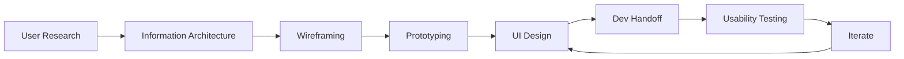

# UI/UX Architecture & Design Document

> **Document:** `DesignSystem.md` | **Version:** 4.0 | **Last Updated:** June 2026  
> **Status:** ✅ Active | **Owner:** Design Lead | **Review Cadence:** Quarterly  
> **Design Philosophy:** "Purposeful Elegance" — every design decision serves a functional purpose

---

## Executive Summary



This document defines the complete UI/UX architecture for the portfolio platform, covering 15 dedicated UX domains from information architecture to admin-specific interaction patterns. The system is grounded in the philosophy of **"Purposeful Elegance"** — every pixel, animation, and interaction serves a goal. Built on a 4px grid with 8px increments, it supports light/dark themes via CSS custom properties, targets WCAG 2.2 AA compliance, and follows mobile-first responsive design.

**Design System Foundation:**
- **Framework:** CSS Custom Properties + Tailwind CSS 3.4
- **Grid:** 4px base, 8px increments
- **Typefaces:** Cabinet Grotesk (display), Inter (body), JetBrains Mono (code)
- **Animation:** Framer Motion (complex) + CSS transitions (micro-interactions)
- **Theme:** CSS variables with `data-theme` attribute, system detection + user override

**Key UX Metrics:**
- **Target Lighthouse Performance:** ≥ 95
- **WCAG Compliance:** 2.2 AA (all criteria)
- **Responsive Breakpoints:** 4 (mobile, tablet, desktop, wide)
- **Touch Target Minimum:** 44×44px (mobile), 24×24px (desktop)
- **Animation Duration Range:** 100-600ms (micro to macro)
- **Form Error Read Time:** < 3 seconds to identify and fix

---

## Table of Contents

1. [Information Architecture](#1-information-architecture)
2. [Navigation Architecture](#2-navigation-architecture)
3. [Page Hierarchy](#3-page-hierarchy)
4. [Content Hierarchy](#4-content-hierarchy)
5. [Interaction Design](#5-interaction-design)
6. [Mobile UX](#6-mobile-ux)
7. [Tablet UX](#7-tablet-ux)
8. [Desktop UX](#8-desktop-ux)
9. [Accessibility UX](#9-accessibility-ux)
10. [Motion UX](#10-motion-ux)
11. [Error UX](#11-error-ux)
12. [Empty State UX](#12-empty-state-ux)
13. [Loading UX](#13-loading-ux)
14. [AI UX](#14-ai-ux)
15. [Admin UX](#15-admin-ux)
16. [Decision Log](#16-decision-log)
17. [Change Log](#17-change-log)

---

## 1. Information Architecture

### 1.1 Site Map

```
┌─ PUBLIC (No Auth Required) ─────────────────────────────┐
│                                                          │
│  / → Homepage                                            │
│  ├── Hero Section (above the fold)                       │
│  ├── About Section (bio + stats)                         │
│  ├── Skills Section (categorized proficiency)            │
│  ├── Featured Projects Carousel                          │
│  ├── Experience Timeline                                 │
│  ├── Testimonials Carousel                               │
│  ├── Services Section                                    │
│  ├── FAQ Accordion                                       │
│  ├── Blog Preview                                        │
│  └── Contact Form                                        │
│                                                          │
│  /projects → Project Grid (filterable)                   │
│  └── /projects/[slug] → Project Detail + Case Study      │
│                                                          │
│  /case-studies → Case Study Grid                         │
│  └── /case-studies/[slug] → Full Case Study              │
│                                                          │
│  /blog → Blog Listing (searchable, paginated)            │
│  └── /blog/[slug] → Blog Article                         │
│                                                          │
│  /about → About Page (extended)                          │
│  /contact → Contact Form Page                            │
│  /services → Services & Pricing                          │
│  /ai-assistant → AI Chat Interface                       │
│  /404 → Not Found                                        │
│                                                          │
├─ ADMIN (JWT Required) ───────────────────────────────────┤
│                                                          │
│  /admin/login → Authentication                           │
│  /admin → Dashboard Overview                             │
│  /admin/analytics → Analytics Dashboard                  │
│  /admin/leads → Lead Management                          │
│  /admin/cms → Content Management System                  │
│  /admin/monitoring → System Health                       │
│  /admin/settings → Configuration                         │
│                                                          │
└──────────────────────────────────────────────────────────┘
```

### 1.2 Content Organization Principles

| Principle | Rule | Rationale |
|-----------|------|-----------|
| **Progressive Disclosure** | Show essential content first, reveal details on interaction | Reduces cognitive load; visitors spend < 3 seconds deciding to stay |
| **Scanability** | Headings, bullet points, and bold key terms | 79% of users scan, not read |
| **F-Pattern Layout** | Important content in top-left to bottom-right diagonal | Matches natural reading patterns in Western languages |
| **Visual Weight** | Most important elements: largest, highest contrast, most saturated | Guides attention without conscious effort |
| **Chunking** | Group related content (skills by category, projects by type) | Humans process 3-5 chunks at a time |
| **Consistency** | Same layout patterns for similar content types | Builds mental model, reduces learning time |

### 1.3 Labeling System

| Content Type | Label Format | Example | URL Pattern |
|-------------|-------------|---------|-------------|
| Navigation items | Title Case, max 2 words | "Project Details" | `/projects` |
| Section titles | Title Case, max 5 words | "Featured Work" | — |
| Buttons/CTAs | Sentence case, action-oriented | "View all projects" | — |
| Form fields | Title Case with colon | "Full Name:" | — |
| Error messages | Sentence case, human-readable | "This field is required" | — |
| Empty states | Sentence case, friendly | "No projects yet" | — |
| Admin labels | Title Case, descriptive | "Lead Management" | `/admin/leads` |
| Breadcrumbs | Title Case, separated by "/" | "Home / Projects / E-Commerce Platform" | — |

### 1.4 Search Strategy

| Feature | Implementation | Scope |
|---------|---------------|-------|
| Blog search | Full-text search on title, excerpt, tags | `/blog?q=keyword` |
| Project filter | Category, technology, year | `/projects?tech=react&year=2025` |
| Admin lead search | Name, email, subject | Client-side filter |
| AI chat semantic search | RAG pipeline on all portfolio content | Natural language queries |
| 404 suggestion search | Fuzzy match against all routes | Auto-generated suggestions |
| Site-wide search | Future feature | TBD |

### References
- **Features:** F-003 (Navigation), F-100 (Projects), F-200 (Blog), F-600 (CMS)
- **Screens:** All 19 documented in `UserFlows.md`

---

## 2. Navigation Architecture

### 2.1 Navigation Layers

| Layer | Location | Purpose | Visible On |
|-------|----------|---------|------------|
| **Primary (Public)** | Top header, sticky | Section navigation within homepage | All public pages |
| **Primary (Admin)** | Left sidebar, persistent | Admin section navigation | All admin pages |
| **Secondary** | Footer | Privacy, legal, external links | All public pages |
| **Contextual** | Page-specific | Related content, breadcrumbs | Detail pages |
| **Utility** | Header right | Theme toggle, social links | All public pages |
| **Mobile** | Hamburger drawer | Full nav on small screens | Mobile (< 640px) |
| **Auth** | Admin login | Email/password, OAuth | `/admin/login` |

### 2.2 Public Navigation Structure

```
┌─────────────────────────────────────────────────────┐
│ [Logo]  About  Skills  Projects  Blog  Contact  [🌙]│  ← Desktop (full)
│ [Logo]  [☰ Hamburger]                          [🌙]│  ← Mobile (collapsed)
└─────────────────────────────────────────────────────┘
```

**Navigation Items (Priority Order):**

| Item | Link | Behavior | Mobile |
|------|------|----------|--------|
| Logo/Name | `/` | Scroll to top / Home | Same |
| About | `/#about` | Smooth scroll to section | In drawer |
| Skills | `/#skills` | Smooth scroll to section | In drawer |
| Experience | `/#experience` | Smooth scroll to section | In drawer |
| Projects | `/projects` | Navigate to grid | In drawer |
| Case Studies | `/case-studies` | Navigate to grid | In drawer |
| Blog | `/blog` | Navigate to listing | In drawer |
| Services | `/#services` | Smooth scroll to section | In drawer |
| Contact | `/#contact` | Smooth scroll to section | In drawer |
| AI Chat | `/ai-assistant` | Open chat page / FAB | In drawer + FAB |
| Theme Toggle | — | Dark/light switch | In drawer |
| Social Links | External | New tab | In drawer |

### 2.3 Admin Navigation Structure

```
┌──────────────┬──────────────────────────────────────┐
│  Sidebar (collapsible)  │   Main Content Area       │
│                          │                           │
│  📊 Dashboard           │   [Active Page Content]   │
│  📈 Analytics           │                           │
│  📩 Leads               │                           │
│  📝 CMS                 │                           │
│  🖥️ Monitoring          │                           │
│  ⚙️ Settings            │                           │
│                          │                           │
│  ─────────────────────  │                           │
│  👤 Alex Rivera         │                           │
│  🔒 Logout              │                           │
└──────────────────────────┴──────────────────────────┘
```

### 2.4 Navigation Rules

| Rule | Implementation | WCAG Reference |
|------|---------------|----------------|
| **Sticky header** | `position: sticky; top: 0;` with backdrop blur | — |
| **Active section highlight** | Intersection Observer updates active nav link | 2.4.2 Page Titled |
| **Smooth scroll** | `scroll-behavior: smooth;` with offset for fixed header | 2.4.8 Location |
| **Mobile hamburger** | Slide-in drawer, 300ms ease-out, backdrop overlay | 2.1.1 Keyboard |
| **Focus management** | Focus moves to drawer on open, back to trigger on close | 2.4.3 Focus Order |
| **Skip link** | First focusable element on every page | 2.4.1 Bypass Blocks |
| **Breadcrumbs** | On detail pages: `/projects/[slug]` | 2.4.8 Location |
| **Current page indicator** | `aria-current="page"` on active nav link | 4.1.2 Name, Role, Value |

### 2.5 Keyboard Navigation

| Key | Action | Context |
|-----|--------|---------|
| `Tab` | Move focus forward | All interactive elements |
| `Shift+Tab` | Move focus backward | All interactive elements |
| `Enter` / `Space` | Activate focused element | Links, buttons, inputs |
| `Escape` | Close modal, drawer, dropdown | Modals, mobile menu |
| `Arrow Down` | Next nav item / dropdown option | Dropdowns, menus |
| `Arrow Up` | Previous nav item / dropdown option | Dropdowns, menus |
| `Arrow Left/Right` | Carousel navigation | Testimonials, gallery |
| `/` | Focus search | Blog, admin leads |
| `1-9` | Quick nav to section | Homepage (future) |

### References
- **Features:** F-003 (Navigation), F-401 (Admin Sidebar)
- **Screens:** All public + admin screens in `UserFlows.md`
- **User Stories:** US-003 (Navigation), US-015 (Admin Nav)

---

## 3. Page Hierarchy

### 3.1 Template Hierarchy

```
RootLayout
├── PublicLayout (default)
│   ├── Navigation (sticky)
│   ├── main#main-content
│   │   ├── HomePage (scrollable)
│   │   ├── ProjectsPage
│   │   ├── ProjectDetailPage
│   │   ├── BlogPage (listing)
│   │   ├── BlogDetailPage
│   │   ├── AboutPage
│   │   ├── ContactPage
│   │   ├── ServicesPage
│   │   ├── AIAssistantPage
│   │   └── NotFoundPage
│   └── Footer
│
├── AuthLayout (minimal)
│   └── AdminLoginPage
│
└── AdminLayout (protected)
    ├── AdminSidebar (persistent)
    └── main
        ├── DashboardPage
        ├── AnalyticsPage
        ├── LeadsPage
        ├── CMSPage
        ├── MonitoringPage
        └── SettingsPage
```

### 3.2 Visual Weight Distribution

| Element | Visual Weight | Color | Size | Motion |
|---------|--------------|-------|------|--------|
| Hero title | 100% (maximum) | Text-primary | 48-60px | Fade-in with 3D bg |
| Section headings | 70% | Text-primary | 28-36px | Reveal on scroll |
| CTA buttons | 60% | Accent (primary) | 16px + padding | Hover lift |
| Body text | 40% | Text-secondary | 16-18px | None |
| Metadata (dates, tags) | 20% | Text-tertiary | 14px | None |
| Decorative elements | 10% | Surface-elevated | Variable | Subtle ambient |
| Footer links | 15% | Text-tertiary | 14px | Hover underline |

### 3.3 Layout Breakpoints

| Breakpoint | Name | Container Width | Columns | Behavior |
|------------|------|----------------|---------|----------|
| < 640px | Mobile | Fluid (16px padding) | 1 | Single column, stacked |
| 640-1024px | Tablet | Fluid (24px padding) | 2 | 2-column grids, hamburger nav |
| 1024-1440px | Desktop | 1024px max | 3-4 | Full layout, sidebar nav |
| > 1440px | Wide | 1280px max | 4+ | Enhanced spacing, multi-column |

### 3.4 Above-the-Fold Priority

| Screen | Critical Content (Must Load First) | Secondary (Deferrable) |
|--------|-----------------------------------|----------------------|
| Homepage | Hero title, subtitle, CTAs, background | About, Skills, Projects |
| Project Detail | Project title, cover image, tech stack | Gallery, related projects |
| Blog Article | Article title, content, author | TOC sidebar, comments |
| Admin Dashboard | Stat cards, recent activity | Charts, full tables |
| Admin Login | Login form, branding | Background illustration |

---

## 4. Content Hierarchy

### 4.1 Typography Scale

| Level | Token | Desktop | Mobile | Weight | Line Height | Usage |
|-------|-------|---------|--------|--------|-------------|-------|
| Display | `text-display` | 72px | 48px | 700 (bold) | 1.1 | Hero heading only |
| H1 | `text-h1` | 60px | 36px | 700 (bold) | 1.15 | Page title |
| H2 | `text-h2` | 36px | 28px | 600 (semibold) | 1.2 | Section heading |
| H3 | `text-h3` | 28px | 22px | 600 (semibold) | 1.25 | Sub-section heading |
| H4 | `text-h4` | 22px | 18px | 600 (semibold) | 1.3 | Card title |
| Body Large | `text-body-lg` | 18px | 16px | 400 (regular) | 1.6 | Lead paragraphs |
| Body | `text-body` | 16px | 15px | 400 (regular) | 1.6 | Main content |
| Body Small | `text-body-sm` | 14px | 13px | 400 (regular) | 1.5 | Metadata |
| Caption | `text-caption` | 12px | 12px | 400 (regular) | 1.4 | Labels, timestamps |
| Code | `text-code` | 14px | 13px | 400 (regular) | 1.5 | Code blocks |
| Button | `text-button` | 14-16px | 14px | 500 (medium) | 1 | Interactive text |

### 4.2 Content Patterns

| Pattern | Description | Usage |
|---------|-------------|-------|
| **Hero Block** | Full-width heading + subtitle + CTA | Homepage, project detail |
| **Card Grid** | Equal-height cards in responsive grid | Projects, blog, case studies |
| **Split Layout** | Image + text side-by-side | About, contact |
| **Timeline** | Vertical chronological list | Experience |
| **Accordion** | Expandable sections | FAQ |
| **Carousel** | Horizontal sliding panels | Testimonials, featured projects |
| **Table** | Structured rows and columns | Admin leads, analytics |
| **Stat Grid** | Metric cards with icon + number + label | Stats section, admin dashboard |
| **Form** | Labeled inputs with validation | Contact, admin login, settings |
| **Chat** | Message bubbles (user right, bot left) | AI assistant |

### 4.3 Readability Standards

| Metric | Target | Implementation |
|--------|--------|----------------|
| Line length (body) | 60-75 characters | `max-w-prose` (65ch) |
| Line height (body) | 1.5-1.75 | `leading-relaxed` (1.625) |
| Paragraph spacing | 1.5× line height | `space-y-6` between paragraphs |
| Body font size | ≥ 16px | Prevents iOS zoom on focus |
| Heading-to-body ratio | Display: 4.5×, H1: 3.75×, H2: 2.25× | Follows modular scale |
| Contrast (body) | ≥ 4.5:1 (AA) | Token pair verification |
| Contrast (large text) | ≥ 3:1 | Token pair verification |

### References
- **Features:** F-001 (Hero), F-002 (Skills), F-004 (About), F-005 (Experience)
- **Screens:** SCREEN-001 through SCREEN-019

---

## 5. Interaction Design

### 5.1 Micro-interaction Catalog

| Element | Trigger | Response | Duration | Easing | A11y Alternative |
|---------|---------|----------|----------|--------|------------------|
| Button | Hover | Background darken 10% | 150ms | `ease-out` | Focus ring on keyboard focus |
| Button | Click/Press | Scale 0.97 → 1.0 | 100ms | `spring(300,20)` | `aria-pressed` state |
| Button | Disabled | Opacity 50%, no hover | — | — | `aria-disabled="true"` |
| Card | Hover | Lift 2px, shadow-lg → shadow-xl | 200ms | `ease-out` | Focus ring on keyboard focus |
| Card | Click | Ripple from click point | 300ms | `ease-out` | Navigate on Enter |
| Link | Hover | Opacity 80% | 100ms | `ease-out` | Focus underline |
| Nav Link | Active | Accent color + underline | — | — | `aria-current="page"` |
| Theme Toggle | Click | Icon rotate 360° | 300ms | `ease-smooth` | Announce theme change |
| Form Input | Focus | Border accent, subtle glow | 200ms | `ease-out` | Focus ring visible |
| Form Input | Error | Red border + shake (100ms) | 300ms | `ease-out` | `aria-invalid="true"` + error text |
| Form Submit | Click | Button → spinner, inputs disabled | — | — | `aria-busy="true"` |
| Success Toast | Appear | Slide in from top-right | 300ms | `spring` | `role="status"` |
| Error Toast | Appear | Slide in from top-right | 300ms | `spring` | `role="alert"` |
| Modal | Open | Scale 0.95→1 + fade in | 200ms | `ease-out` | Focus trap + `aria-modal` |
| Modal | Close | Scale 1→0.95 + fade out | 150ms | `ease-in` | Return focus to trigger |
| Accordion | Toggle | Content height animate | 250ms | `ease-out` | `aria-expanded` |
| Toggle Switch | Click | Knob slide + bg transition | 200ms | `ease-out` | `aria-checked` |
| Carousel | Next/Prev | Slide horizontal | 300ms | `ease-out` | Keyboard arrow keys |
| Skeleton | Appear | Shimmer sweep | 1.5s loop | `linear` | No animation (reduced motion) |
| Section Reveal | Scroll | Fade up 20px + opacity | 600ms | `ease-out` | No animation (reduced motion) |
| Counter | Scroll into view | Count 0→target | 1000ms | `ease-out` | Static number display |

### 5.2 Form Interaction Design

| Principle | Implementation | WCAG |
|-----------|---------------|------|
| **Visible labels** | `<label>` with `for` attribute, never placeholder-only | 3.3.2 Labels |
| **Inline validation** | Validate on blur, not keystroke; show error below field | 3.3.1 Error ID |
| **Error recovery** | Keep entered data, highlight error field, autofocus first error | 3.3.3 Suggestions |
| **Success feedback** | Brief animation + message, then redirect or clear | — |
| **Disabled state** | Reduced opacity (50%), no hover, no pointer events | — |
| **Required indicators** | Asterisk `*` with `aria-required="true"` | 3.3.2 |
| **Auto-fill support** | `autocomplete` attribute on all fields | — |
| **Keyboard type** | `inputmode="email"` etc. for mobile keyboard | — |
| **Character count** | Show remaining for textarea (`maxLength`) | — |
| **Debounce auto-save** | 30-second debounce for admin editor | — |

### 5.3 Gesture Design (Mobile/Touch)

| Gesture | Action | Element | Feedback |
|---------|--------|---------|----------|
| Tap | Activate | Buttons, links, cards | Scale 0.97 |
| Double tap | Zoom | Images in lightbox | Scale 2x |
| Swipe left | Next item | Carousel, gallery | Slide animation |
| Swipe right | Previous item | Carousel, gallery | Slide animation |
| Swipe down | Close drawer | Mobile menu | Follow finger |
| Long press | Context menu (future) | Admin table rows | Haptic + menu |
| Pinch | Zoom | Image gallery | Scale |

### 5.4 Feedback Loops

| Action | Instant Feedback (< 100ms) | Delayed Feedback (> 300ms) | Error Feedback |
|--------|---------------------------|---------------------------|----------------|
| Button click | Scale animation | Success checkmark if async | Red toast |
| Form submit | Button → spinner | Success message | Inline error + toast |
| Theme toggle | Icon rotate | — | — |
| Image upload | Progress bar | Success thumbnail | Error + retry |
| Settings save | Button → "Saved!" | — | Inline error |
| Section publish | Toggle state change | "Published" toast | Error with rollback |
| Lead status change | Optimistic UI update | — | Revert on failure |
| AI message send | Message bubble appears | Typing indicator → response | Error bubble + retry |

---

## 6. Mobile UX

### 6.1 Mobile-First Principles

| Principle | Implementation | Rationale |
|-----------|---------------|-----------|
| **Content priority** | Core content first, secondary deferred | Mobile users have limited attention span |
| **Touch-first** | All interactions work with finger tap (no hover dependency) | No hover on touch devices |
| **Performance** | Reduced JS, lighter images, Critical CSS | 3G/4G connections, slower CPUs |
| **One hand operation** | Primary actions in thumb zone (bottom 1/3 of screen) | Average usable thumb zone |
| **No horizontal scroll** | All content fits viewport width at 320px | Common small phone width |
| **Readable text** | Body text ≥ 16px prevents iOS auto-zoom | Accessibility requirement |
| **Offline resilience** | Handle network errors gracefully | Mobile networks are unreliable |

### 6.2 Touch Target Sizes

| Element Type | Minimum Size | Recommended Size | Notes |
|-------------|--------------|-----------------|-------|
| Buttons (primary) | 44×44px | 48×48px | Full padding inside |
| Buttons (icon-only) | 44×44px | 48×48px | Always include aria-label |
| Links in text | 44×44px (inline) | — | Use extra padding if needed |
| Form inputs | 44px height | 48px height | Comfortable tap target |
| Toggle switches | 44×44px | 48×48px | Entire toggle is tappable |
| Checkboxes | 44×44px | 48×48px | Expand hit area beyond visual |
| Radio buttons | 44×44px | 48×48px | Expand hit area beyond visual |
| Tab bar items | 44×44px | 48×64px | Icon + label |
| Bottom sheet handles | 44×44px | 48×8px | Visual + hit area |
| Carousel arrows | 44×44px | 48×48px | On mobile, use swipe instead |

### 6.3 Mobile-Specific Patterns

| Pattern | When to Use | Implementation |
|---------|-------------|---------------|
| **Hamburger menu** | 5+ navigation items | Slide-in drawer from left |
| **Bottom sheet** | Filters, sort options | Slide up from bottom, 50-80% height |
| **Full-screen modal** | AI chat, image lightbox | Cover entire screen |
| **Sticky CTA** | Contact form, "Book now" | Fixed bottom bar on scroll |
| **Swipable cards** | Project gallery, testimonials | Touch swipe with snap points |
| **Pull to refresh** | Blog listing, admin tables | Native-like refresh indicator |
| **Infinite scroll** | Blog, projects (replaces pagination) | Load more on scroll to bottom |
| **FAB (Float Action Button)** | AI chat trigger | 56px circle, bottom-right |

### 6.4 Mobile Breakpoint Behaviors

| Element | < 640px Behavior |
|---------|------------------|
| Navigation | Hamburger: slide-in drawer, full height, 300ms |
| Hero | Stacked (image above text), 36px heading |
| Sections | Single column, full-width cards |
| Skills Grid | 1 column, stacked bars |
| Projects Grid | 1 column, full-width cards |
| Gallery | Single image, swipe to navigate |
| Tables | Card view (each row = card) |
| Charts | Single column, stacked vertically |
| Admin Sidebar | Bottom tab bar (5 items max) |
| Modals | Full-screen, slide from bottom |

### References
- **Features:** F-003 (Navigation), F-013 (Animations), F-014 (Loading)
- **Screens:** All screens have mobile breakpoint defined in `UserFlows.md`
- **User Stories:** US-002 (Responsive Design)

---

## 7. Tablet UX

### 7.1 Adaptive Layout Principles

| Principle | Implementation |
|-----------|---------------|
| **Split view** | 2-column layouts for content + sidebar |
| **Hover support** | Restore hover states (pen/pointer input detected) |
| **Landscape optimization** | Horizontal layouts use wider format |
| **Keyboard support** | External keyboard detected → show keyboard hints |
| **Touch + pointer** | Support both simultaneously |
| **Medium density** | More content visible than mobile, less than desktop |

### 7.2 Tablet-Specific Patterns

| Pattern | 640-1024px Behavior |
|---------|---------------------|
| Navigation | Hamburger (667px portrait), collapsing sidebar (1024px landscape) |
| Hero | 50/50 split (image + text), 42px heading |
| Sections | 2-column grids |
| Skills Grid | 2 columns |
| Projects Grid | 2 columns |
| Gallery | 2-column image grid |
| Tables | Condensed table with horizontal scroll |
| Charts | 2-column chart grid |
| Admin Sidebar | Collapsible sidebar (icons by default, labels on expand) |
| Modals | Center modal, 60% width, max-width 640px |

### 7.3 Hybrid Interaction

| Interaction | Pointer (Mouse/Stylus) | Touch (Finger) |
|-------------|----------------------|----------------|
| Hover preview | Show tooltip on hover | N/A (use tap to show) |
| Drag and drop | Click + drag | Long press + drag |
| Right click | Context menu | N/A |
| Scroll | Mouse wheel / scrollbar | Touch scroll |
| Selection | Click + drag | Double tap + drag |
| Zoom | Ctrl + scroll | Pinch |

### References
- **Features:** F-012 (Theme), F-013 (Animations)
- **Screens:** All responsive screens in `UserFlows.md`

---

## 8. Desktop UX

### 8.1 Desktop Layout Principles

| Principle | Implementation |
|-----------|---------------|
| **Full layout** | Multi-column, sidebars, sticky elements |
| **Hover interactions** | Rich hover states, tooltips, previews |
| **Keyboard shortcuts** | Power user productivity |
| **Multi-window** | Admin in one tab, preview in another |
| **Consistent max-width** | 1280px max content width |
| **Sticky elements** | Navigation, TOC sidebar, admin sidebar |

### 8.2 Desktop-Specific Patterns

| Pattern | > 1024px Behavior |
|---------|-------------------|
| Navigation | Full horizontal, 8-10 items visible |
| Hero | 40/60 split or full-width immersive |
| Sections | 3-4 column grids |
| Skills Grid | 3-4 columns |
| Projects Grid | 3 columns |
| Gallery | 3-column with lightbox |
| Tables | Full table with all columns, inline actions |
| Charts | Multi-column dashboard layout |
| Admin Sidebar | Full sidebar (200-250px), always visible |
| Modals | Center modal, 40% width, max-width 640px |
| TOC Sidebar | Sticky TOC on article pages |

### 8.3 Keyboard Shortcuts

| Shortcut | Action | Context |
|----------|--------|---------|
| `Cmd/Ctrl + K` | Open command palette | Admin (future) |
| `Cmd/Ctrl + S` | Save current section | Admin CMS |
| `Cmd/Ctrl + P` | Preview current page | Admin CMS |
| `Cmd/Ctrl + Z` | Undo | Rich text editor |
| `Cmd/Ctrl + Shift + Z` | Redo | Rich text editor |
| `B` | Toggle bold | Rich text editor |
| `I` | Toggle italic | Rich text editor |
| `Shift + /` | Show keyboard shortcuts | Admin |
| `Esc` | Close modal/panel | All contexts |
| `?` | Show help | AI Chat |
| `Tab` / `Shift+Tab` | Navigate sections | Admin preview |

### References
- **Features:** F-600 (CMS), F-400 (Admin Dashboard)

---

## 9. Accessibility UX

### 9.1 WCAG 2.2 Compliance Matrix

| Principle | Criterion | Level | Status | Implementation | Test Method |
|-----------|-----------|-------|--------|----------------|-------------|
| **Perceivable** | 1.1.1 Non-text Content | A | ✅ | All images have alt text, icons have aria-label | axe DevTools |
| **Perceivable** | 1.3.1 Info and Relationships | A | ✅ | Semantic HTML, ARIA landmarks | axe DevTools |
| **Perceivable** | 1.3.2 Meaningful Sequence | A | ✅ | DOM order matches visual order | Manual review |
| **Perceivable** | 1.4.1 Use of Color | A | ✅ | Color not sole indicator (icons + text) | axe DevTools |
| **Perceivable** | 1.4.3 Contrast (Minimum) | AA | ✅ | All text pairs ≥ 4.5:1 | axe DevTools |
| **Perceivable** | 1.4.4 Resize Text | AA | ✅ | 200% zoom no content loss | Manual test |
| **Perceivable** | 1.4.5 Images of Text | AA | ✅ | No images of text; all real text | Manual test |
| **Perceivable** | 1.4.10 Reflow | AA | ✅ | No horizontal scroll at 320px | Manual test |
| **Perceivable** | 1.4.11 Non-text Contrast | AA | ✅ | UI components ≥ 3:1 | axe DevTools |
| **Perceivable** | 1.4.12 Text Spacing | AA | ✅ | No loss at 1.5x spacing | Manual test |
| **Perceivable** | 1.4.13 Content on Hover/Focus | AA | ✅ | Dismissible, hoverable, persistent | Manual test |
| **Operable** | 2.1.1 Keyboard | A | ✅ | All functions via keyboard | Manual test |
| **Operable** | 2.1.2 No Keyboard Trap | A | ✅ | No trap in modals (Esc closes) | Manual test |
| **Operable** | 2.4.1 Bypass Blocks | A | ✅ | Skip link on every page | Manual test |
| **Operable** | 2.4.2 Page Titled | A | ✅ | Unique title per page | axe DevTools |
| **Operable** | 2.4.3 Focus Order | A | ✅ | Tab order matches visual | Manual test |
| **Operable** | 2.4.4 Link Purpose (In Context) | A | ✅ | Descriptive link text | axe DevTools |
| **Operable** | 2.4.6 Headings and Labels | AA | ✅ | All sections have headings | axe DevTools |
| **Operable** | 2.4.7 Focus Visible | AA | ✅ | 2px accent-color ring, 2px offset | axe DevTools |
| **Operable** | 2.4.11 Focus Not Obscured | AA | ✅ | Focusable elements not hidden | Manual test |
| **Operable** | 2.5.7 Dragging Movements | AA | ✅ | Pointer alternative for drag | Manual test |
| **Operable** | 2.5.8 Target Size (Minimum) | AA | ✅ | All targets ≥ 24×24px | Manual test |
| **Understandable** | 3.1.1 Language of Page | A | ✅ | `<html lang="en">` | axe DevTools |
| **Understandable** | 3.2.1 On Focus | A | ✅ | No context change on focus | Manual test |
| **Understandable** | 3.2.2 On Input | A | ✅ | No context change on input | Manual test |
| **Understandable** | 3.3.1 Error Identification | A | ✅ | Field-level error with description | axe DevTools |
| **Understandable** | 3.3.2 Labels or Instructions | A | ✅ | All inputs have labels | axe DevTools |
| **Understandable** | 3.3.3 Error Suggestion | AA | ✅ | Clear error + fix suggestion | Manual test |
| **Understandable** | 3.3.4 Error Prevention | AA | ✅ | Confirm before destructive actions | Manual test |
| **Robust** | 4.1.1 Parsing | A | ✅ | Valid HTML | W3C Validator |
| **Robust** | 4.1.2 Name, Role, Value | A | ✅ | ARIA attributes on custom components | axe DevTools |
| **Robust** | 4.1.3 Status Messages | AA | ✅ | Toasts with `role="status"` or `role="alert"` | VoiceOver test |

### 9.2 ARIA Patterns

| Component | Role | Key Attributes | Keyboard Interaction |
|-----------|------|----------------|---------------------|
| Navigation | `nav` | `aria-label="Main navigation"` | Tab through links |
| Skip Link | `a` | `href="#main-content"` | First Tab press shows link |
| Mobile Menu | `dialog` | `aria-modal="true"`, `aria-label="Navigation menu"` | Tab trap, Esc to close |
| Modal | `dialog` | `aria-modal="true"`, `aria-labelledby` | Tab trap, Esc to close |
| Accordion | — | `aria-expanded` on button, `aria-controls` on panel | Enter/Space to toggle |
| Tabs | `tablist` | `aria-selected` on tab, `aria-labelledby` on panel | Arrow keys to navigate |
| Carousel | — | `aria-label="Testimonials"`, `aria-roledescription="carousel"` | Arrow keys |
| Tooltip | `tooltip` | `aria-describedby` | Hover + focus |
| Progress Bar | `progressbar` | `aria-valuenow`, `aria-valuemin`, `aria-valuemax` | — |
| Alert | `alert` | — | Announce immediately |
| Status | `status` | — | Polite announcement |
| Form Error | `alert` or `status` | `aria-describedby` links to error | Focus first error |

### 9.3 Focus Management

| Scenario | Behavior | Implementation |
|----------|----------|---------------|
| Page load | Focus goes to skip link (first Tab), otherwise to `<main>` | `autofocus` on main content (optional) |
| Route change | Focus moves to `<h1>` of new page | `useFocusOnMount` hook |
| Modal open | Focus trap: first focusable element receives focus | `useFocusTrap` hook |
| Modal close | Focus returns to element that triggered modal | Store trigger ref |
| Form submit error | Focus goes to first invalid field | `useEffect` to find and focus |
| Mobile menu open | Focus trap inside drawer, close button focused | `useFocusTrap` hook |
| Mobile menu close | Focus returns to hamburger button | Store trigger ref |
| Toast appears | `role="status"` announces without stealing focus | No focus change |
| Tab visibility | Focus ring visible on all interactive elements | `focus-visible` polyfill |

### 9.4 Screen Reader Optimization

| Element | Screen Reader Announcement |
|---------|---------------------------|
| Theme toggle | "Switch to dark mode" / "Switch to light mode" |
| External link | "Opens in new tab" (via CSS or JS) |
| Icon-only button | `aria-label="Search"`, `aria-label="Close"` |
| Progress indicator | "Loading... {n}% complete" |
| Form error | "{field} error: {message}" |
| Character count | "{n} of {m} characters remaining" |
| Carousel | "Slide {n} of {m}" |
| Sortable table | "Sorted by {column} ascending/descending" |
| Bulk selection | "{n} items selected" |
| Status change (toast) | "{message}" (role="status" or role="alert") |

### References
- **Features:** F-015 (Error Boundaries), F-014 (Loading States)
- **User Stories:** US-006 (Accessibility)
- **Other Docs:** `docs/quality/AccessibilityArchitecture.md` (full WCAG implementation)

---

> **🔗 Consolidated Source of Truth:** All motion UX rules, timing/easing tokens, microinteraction catalog, and accessibility kill-switch are now centralized in [`08l-MOTION-SYSTEM.md`](./08l-MOTION-SYSTEM.md). This section provides a high-level summary; refer to `08l` for the complete enterprise motion architecture.

## 10. Motion UX

### 10.1 Motion Design Principles

| Principle | Application | Example |
|-----------|-------------|---------|
| **Context** | Motion communicates relationships | Related elements animate together (stagger) |
| **Hierarchy** | Motion guides attention | Primary content animates first, secondary follows |
| **Spatial continuity** | Elements maintain position relationships | Shared element transitions |
| **Performance** | Animations run at 60fps | Use `transform` and `opacity` only |
| **Restraint** | Don't animate everything | ~20% of elements have motion |
| **Progressive enhancement** | Motion is additive | Works without JS (static) |
| **Accessibility** | Respect reduced motion | `prefers-reduced-motion: reduce` |

### 10.2 Animation Timing Chart

| Type | Duration | Easing | Use Case |
|------|----------|--------|----------|
| **Micro-interaction** | 100-200ms | `ease-out` | Button press, hover, toggle |
| **Feedback** | 200-300ms | `ease-out` | Toast, tooltip, form validation |
| **Transition** | 300-400ms | `ease-in-out` | Page transitions, drawer open |
| **Reveal** | 400-600ms | `ease-out` | Section entrance on scroll |
| **Emphasis** | 600-1000ms | `ease-out` | Counter animation, confetti |
| **Ambient** | 2-5s loop | `ease-in-out` | Background particles, shimmer |
| **Stagger delay** | 50-80ms between items | — | Card grid reveals |

### 10.3 Easing Curves

| Name | Cubic Bezier | Usage |
|------|-------------|-------|
| `ease-out-smooth` | `cubic-bezier(0.16, 1, 0.3, 1)` | Entrances, reveals — smooth deceleration |
| `ease-in-out` | `cubic-bezier(0.65, 0, 0.35, 1)` | Transitions between states |
| `ease-spring` | `cubic-bezier(0.34, 1.56, 0.64, 1)` | Micro-interactions — slight overshoot |
| `ease-linear` | `cubic-bezier(0, 0, 1, 1)` | Shimmer, progress bars only |

### 10.4 Reduced Motion Respect

```css
/* All animations respect user preference */
@media (prefers-reduced-motion: reduce) {
  *, *::before, *::after {
    animation-duration: 0.01ms !important;
    animation-iteration-count: 1 !important;
    transition-duration: 0.01ms !important;
    scroll-behavior: auto !important;
  }

  /* Exception: essential motion (loading indicators) */
  .essential-motion {
    animation-duration: 1.5s !important;
  }
}
```

| Animation | Reduced Motion Behavior |
|-----------|------------------------|
| Section reveal | Static visibility (no transition) |
| Stagger grid | All items visible immediately |
| Counter | Number displayed instantly |
| Parallax | No movement, static background |
| Shimmer skeleton | No shimmer, static gray |
| Carousel auto-play | No auto-play, manual only |
| Particle background | Static image or disabled |
| Hover lift | No lift (color change only) |
| Button press | No scale (instant state change) |

### References
- **Features:** F-013 (Scroll Animations)
- **Other Docs:** `docs/design/DesignTokens.md` (Scroll Animation Specifications)

---

## 11. Error UX

### 11.1 Error Pattern Library

```
┌──────────────────────────────────────┐
│  ⚠️  Icon (optional)                 │
│                                      │
│  Title: What went wrong              │
│  Description: Why it happened        │
│  Action: What the user can do        │
│                                      │
│  [Retry]  [Go Back]  [Contact]       │
└──────────────────────────────────────┘
```

| Error Type | Icon | Title Pattern | Description Pattern | Action |
|------------|------|---------------|-------------------|--------|
| **Network** | 📡 | "Connection lost" | "Unable to reach our servers. Check your internet connection." | Retry button |
| **Not found** | 🔍 | "Page not found" | "The page you're looking for doesn't exist or has been moved." | Go home, Search |
| **Server error** | ⚠️ | "Something went wrong" | "We've been notified and are working on it. Please try again." | Retry, Contact |
| **Permission** | 🔒 | "Access denied" | "You don't have permission to view this page." | Go back, Log in |
| **Rate limit** | ⏳ | "Too many requests" | "Please wait a moment before trying again." | Wait, Retry |
| **Validation** | ❌ | "Invalid input" | "Please check the highlighted fields and try again." | Fix errors |
| **Upload fail** | 📁 | "Upload failed" | "The file couldn't be uploaded. Try a different file." | Retry, Try different |
| **Save fail** | 💾 | "Save failed" | "Changes couldn't be saved. Your work is preserved." | Retry |
| **AI unavailable** | 🤖 | "AI assistant unavailable" | "The AI service is temporarily unavailable. Please try again or use the contact form." | Retry, Contact |

### 11.2 Error Message Guidelines

| Rule | Correct Example | Incorrect Example |
|------|----------------|-------------------|
| **Be specific** | "Email must contain '@' symbol" | "Invalid input" |
| **Be human** | "Looks like something went wrong on our end — we're on it!" | "500 Error: Internal Server Error" |
| **Be actionable** | "Try again, or contact me directly" | "An error occurred" |
| **Show the fix** | "Password must be at least 8 characters" | "Invalid password" |
| **Don't blame** | "This field is required" | "You forgot to fill this in" |
| **Keep it brief** | "Network error. Check connection and retry." | "The system encountered a network connectivity issue which prevented the requested operation from completing" |

### 11.3 Error Recovery Patterns

| Pattern | Description | Implementation |
|---------|-------------|----------------|
| **Inline retry** | Retry button on the failed section | Each section has independent retry |
| **Toast notification** | Non-blocking error message | `role="alert"`, auto-dismiss 5s |
| **Error boundary** | Catch rendering errors, show fallback | React Error Boundary |
| **Optimistic rollback** | Undo failed optimistic update | Revert state to pre-mutation |
| **Cached fallback** | Show stale data when fresh fails | SWR `fallbackData` |
| **Graceful degradation** | Disable non-critical features, keep core | Feature flags + fallback UI |
| **Offline indicator** | Banner when connectivity lost | `navigator.onLine` listener |

### 11.4 Error Boundary Strategy

```
[Global Error Boundary] ← Catches uncaught render errors
  └─ Shows "Something went wrong" page with "Go Home" button
  └─ Logs to Sentry with full context

[Page Error Boundary] ← One per route
  └─ Shows page-level error with navigation
  └─ Catches route-specific failures

[Section Error Boundary] ← One per data-fetching section
  └─ Shows inline error with retry
  └─ Non-failing sections continue to render

[Widget Error Boundary] ← Admin dashboard widgets
  └─ Shows widget-level error without breaking dashboard
  └─ Per-widget retry
```

### References
- **Features:** F-015 (Error Boundaries)
- **Screens:** All screens have error states in `UserFlows.md`

---

## 12. Empty State UX

### 12.1 Empty State Pattern

```
┌──────────────────────────────────────┐
│                                      │
│         📭 / 🎉 / 📝 Icon           │
│                                      │
│    Title: What's going on here       │
│                                      │
│    Description: Why it's empty       │
│    and what to do about it           │
│                                      │
│    [Action Button: What to do next]  │
│                                      │
└──────────────────────────────────────┘
```

### 12.2 Empty State Catalog

| Screen/Component | Icon | Title | Description | Action | Feature |
|------------------|------|-------|-------------|--------|---------|
| **Projects Grid** | 📦 | "No projects yet" | "Projects will appear here once you've added them in the admin panel." | "Add your first project" | F-100 |
| **Case Studies** | 📄 | "Case studies coming soon" | "In-depth case studies of notable projects will be published here." | "Explore projects instead" | F-105 |
| **Blog Listing** | ✍️ | "No articles published yet" | "Blog posts will be published here. Check back for new content!" | "Subscribe to updates" | F-200 |
| **Testimonials** | 💬 | "No testimonials yet" | "Client feedback will appear here. Want to leave one? Reach out!" | "Get in touch" | F-006 |
| **Skills** | 🛠️ | "Skills being configured" | "Skill categories and proficiency will be shown here once set up." | — | F-002 |
| **FAQ** | ❓ | "FAQs coming soon" | "Common questions and answers will be added here." | "Ask me anything" | F-008 |
| **Contact Form** | 📬 | "Form ready" | "Fill in the form above to get in touch. I typically respond within 24 hours." | — | F-007 |
| **AI Chat** | 🤖 | "Chat ready" | "Ask me anything about my skills, experience, or projects!" | "Get started →" | F-300 |
| **Admin Dashboard** | 📊 | "Welcome to your dashboard!" | "⚡ Quick setup checklist: Add your first project, write your first blog post, update your profile." | "Start setup wizard" | F-400 |
| **Admin Leads** | 📭 | "No leads yet" | "Leads will appear here when someone reaches out via the contact form." | "Share your portfolio" | F-800 |
| **Admin Analytics** | 📈 | "Collecting data..." | "Analytics will be available in 24-48 hours after setting up PostHog." | "Configure PostHog" | F-900 |
| **Admin CMS** | 📝 | "No {contentType} yet" | "Create your first piece of content to get started." | "Create now" | F-600 |
| **Experience** | 🕐 | "Experience timeline empty" | "Work experience entries will appear here once added." | — | F-005 |
| **Services** | 📋 | "Services coming soon" | "Service offerings and pricing will be listed here." | "Contact for inquiries" | F-009 |
| **Stats** | 📊 | "Statistics loading..." | "Portfolio statistics will appear here once content is added." | — | F-010 |
| **Clients** | 🤝 | "Clients coming soon" | "Company logos and client names will be displayed here." | — | F-011 |
| **Monitoring** | 🛡️ | "All clear — no incidents" | "No errors or incidents reported in the selected period." | — | F-1001 |

### 12.3 First-Time Experience Flows

| User | First Visit | Empty State Strategy | Conversion Goal |
|------|-------------|---------------------|-----------------|
| **Visitor** | Homepage loads with all sections | Static content (hero, about) always present; dynamic sections show empty state gracefully | Explore further or contact |
| **Recruiter** | Lands on projects page | If no projects: "No projects yet — check back soon" with CTA to about/skills | View skills or download resume |
| **Admin** | First login to dashboard | Onboarding wizard: "Let's set up your portfolio" with checklist | Add first section |
| **Blog Reader** | Lands on empty blog | "No articles yet — subscribe to be notified" with email input | Subscribe or explore projects |
| **AI User** | Opens AI chat | Welcome message + suggested starter questions | Engage with AI |

### References
- **Features:** All features have empty states defined
- **Screens:** All screens have empty states in `UserFlows.md`

---

## 13. Loading UX

### 13.1 Loading Pattern Decision Tree

```
User action → Expected response time?

< 100ms: No loading indicator (instant)
├── Button press → scale feedback
└── Input focus → border highlight

100-300ms: Micro-loading
├── Button becomes disabled + inner state change
└── Inline content swap (no full skeleton)

300ms-1s: Skeleton screen
├── Show content-shaped skeleton with shimmer
└── Replace with actual content when ready

1-5s: Skeleton + progress indicator
├── Skeleton continues
├── Add estimated time if known
└── Allow user action (retry, cancel)

> 5s: Timeout handling
├── Show error state with retry
└── Show partial content if available
```

### 13.2 Skeleton Pattern Library

| Component | Skeleton Shape | Dimensions | Animation | CLS Prevention |
|-----------|---------------|------------|-----------|----------------|
| **Hero** | Full-width rect + 2 text lines | 100vw × 80vh | Shimmer sweep 1.5s | Fixed aspect-ratio container |
| **Card** | Image rect (3:2) + 2 text lines | 100% × 240px | Shimmer, stagger in 80ms | `aspect-[3/2]` container |
| **Project Detail** | Hero rect + tags (5 pills) + content (8 lines) | 100% × 600px | Shimmer sections | Sequential section loading |
| **Blog Card** | Image rect + title + date + excerpt (2 lines) | 100% × 200px | Shimmer, stagger in 60ms | Fixed card dimensions |
| **Table Row** | 4 varying-width rects | 100% × 40px × 8 rows | Shimmer rows, 100ms delay | Fixed row height |
| **Stat Card** | Icon rect + number + label + mini-chart | 100% × 120px | Fade in, then number pulse | Fixed card dimensions |
| **Chart** | Chart area + axis lines + legend | 100% × 300px | Gradient sweep | Fixed chart container |
| **Form** | 4 input-shaped rects + button | 100% per field | Shimmer fields | Field height match |
| **Chat Bubble** | 2 bot bubbles + typing indicator | 60% max-width each | Bubble fade-in + typing dots | Min-height message area |
| **Admin Widget** | Varies by widget type | Widget container size | Shimmer per widget | Fixed widget grid |

### 13.3 Loading Indicators

| Indicator | Duration | Position | Usage |
|-----------|----------|----------|-------|
| Button spinner | Variable | Inside button | Form submissions |
| Skeleton shimmer | 1.5s loop | Content placeholder | Data loading |
| Progress bar (linear) | Variable | Top of page | Page navigation (Next.js) |
| Reading progress | Variable | Top of article | Blog reading |
| Pulse dot | 1s loop | Chat input | AI generating |
| Infinity spinner | Continuous | Full-page load | Auth verification |
| Percentage loader | Variable | Upload area | Image upload |
| Delayed spinner (300ms) | After delay | Action buttons | Prevents flash for fast ops |

### 13.4 Perceived Performance Techniques

| Technique | Implementation | Impact |
|-----------|---------------|--------|
| **Optimistic UI** | Update UI before API response | Feels instant |
| **Minimum skeleton duration** | Show skeleton for ≥ 400ms | Prevents flashing |
| **Progressive loading** | Load critical content first, secondary later | Content appears faster |
| **Instant back/forward** | Cache previous pages in memory | Instant navigation |
| **Prefetch on hover** | Prefetch link on hover, not just click | Sub-second page loads |
| **Background sync** | Sync data in background | No loading for updates |
| **Placeholder images** | Blur-up or dominant color before full image | Visual feedback while loading |
| **Stale-while-revalidate** | Show cached data, revalidate in background | Instant content display |

### References
- **Features:** F-014 (Loading States)
- **Screens:** All screens have loading states in `UserFlows.md`

---

## 14. AI UX

### 14.1 Chat Interface Design

```
┌──────────────────────────────────────┐
│  🤖 AI Assistant  ● Online   [✕]    │  ← Header
├──────────────────────────────────────┤
│                                      │
│  [Bot] 👋 Hi! I'm the AI assistant   │
│        for Alex. Ask me about...     │
│                                      │
│  [Quick] 💻 What technologies do     │  ← Suggested chip
│  [Quick] 📁 Show me your best work  │  ← Suggested chip
│  [Quick] 📞 How can I hire you?     │  ← Suggested chip
│                                      │
│  [User] Tell me about your React     │  ← User bubble (right)
│         experience                   │
│                                      │
│  [Bot] I have 5+ years of React...  │  ← Bot bubble (left)
│        I've built 10+ projects...   │  with markdown
│                                      │
│  [Bot] ● ● ●                        │  ← Typing indicator
│                                      │
├──────────────────────────────────────┤
│  [📎]  [Type a message...]  [📤]    │  ← Input bar
└──────────────────────────────────────┘
```

### 14.2 AI Interaction Patterns

| Pattern | Description | Implementation |
|---------|-------------|---------------|
| **Welcome message** | First-visit greeting with suggested questions | Static or dynamic based on context |
| **Suggested questions** | 3-4 clickable chips per context | Dynamic (page-aware) |
| **Typing indicator** | Animated dots while generating | 3-dot bouncing animation |
| **Streaming response** | Content appears word-by-word | SSE with incremental rendering |
| **Source attribution** | "Based on my portfolio:" before RAG responses | Italic source prefix |
| **Follow-up suggestions** | Contextual follow-ups after each response | 2-3 chips below bot message |
| **Error recovery** | Graceful handling of AI failure | "I'm having trouble — try asking another way" + retry |
| **Human handoff** | Escalate to contact form | "Want to talk to a human?" CTA |
| **Rate limit feedback** | Clear messaging when limit reached | "You've reached the message limit — feel free to contact me directly" |
| **Session persistence** | Chat history preserved in session | localStorage with expiry |

### 14.3 RAG Transparency

| Principle | Implementation |
|-----------|---------------|
| **Source citation** | Responses cite which portfolio content informed them |
| **Confidence indicator** | Uncertainty shown for low-confidence responses |
| **Scope awareness** | AI acknowledges when question is outside its knowledge |
| **Fallback behavior** | "I don't have information about that in my portfolio" |
| **Content freshness** | RAG pipeline re-indexes when content updates |

### 14.4 AI-Specific UX Guidelines

| Guideline | Rationale |
|-----------|-----------|
| **Always show typing indicator** | Users need to know AI is working |
| **Never scroll away while streaming** | Auto-scroll to latest content, but allow manual scroll |
| **Show entire conversation** | Never collapse or hide previous messages |
| **One message per turn** | No multi-turn batching |
| **Clear visual distinction** | Bot bubbles left, user bubbles right |
| **Markdown support** | Bold, lists, code, links in responses |
| **Copy code button** | One-click copy for code blocks |
| **Feedback mechanism** | Thumbs up/down on responses (future) |
| **Easy dismiss** | Close button always visible |
| **Mobile responsive** | Full-screen on mobile, panel on desktop |

### References
- **Features:** F-300 (AI Chatbot), F-301 (RAG Pipeline), F-304 (Conversation History)
- **Screens:** SCREEN-011 (AI Assistant)

---

## 15. Admin UX

### 15.1 Admin Dashboard Density

| Element | Desktop | Tablet | Mobile |
|---------|---------|--------|--------|
| Stat cards | 4 in a row (compact) | 2×2 grid | 2×2 grid (full width) |
| Charts | 2 side-by-side | Stacked | Stacked |
| Tables | Full table (all columns) | Condensed (key columns) | Card list |
| Sidebar | 250px, full labels | Icons only (50px) | Bottom tab bar |
| Action buttons | Text + icon | Icon only | Icon only |
| Data density | High (compact padding) | Medium | Low (card format) |

### 15.2 Table Design Patterns

| Element | Specification |
|---------|--------------|
| Row height | 48px (compact), 56px (default), 64px (relaxed) |
| Column spacing | 16px padding horizontal |
| Header | Bold, uppercase, secondary text color |
| Row hover | Background highlight (5% opacity of accent) |
| Selected row | Background highlight (10% opacity of accent) |
| Sort indicator | Arrow icon, sorted column bold |
| Checkbox column | 48px fixed width, center aligned |
| Action column | 48px fixed width, icon buttons |
| Status badge | 24px height, 8px padding, color-coded |
| Empty state | Illustration + message + CTA |
| Loading state | 10-15 row skeleton |
| Pagination | Bottom: "Showing 1-50 of 234" + page buttons |
| Virtual scroll | For 500+ rows, fixed height container |

### 15.3 Admin Form Patterns

| Pattern | When to Use | Implementation |
|---------|-------------|---------------|
| **Inline edit** | Quick field updates | Click to edit, Enter to save, Esc to cancel |
| **Side panel** | Editing complex settings | Slide-over panel, primary focus |
| **Modal form** | Creating new items | Center modal, focus trap, Esc to close |
| **Full page editor** | Rich content editing | CMS editor, full-width, auto-save |
| **Wizard** | Multi-step setup | Step indicator, back/next, progress |
| **Bulk actions** | Mass updates | Select items → action bar appears |
| **Confirm dialog** | Destructive actions | "Are you sure?" + action name + confirm/cancel |
| **Auto-save indicator** | Long-form editing | "Saved" / "Saving..." / "Changes unsaved" |

### 15.4 Confirmation Dialog Pattern

```
┌──────────────────────────────────┐
│  ⚠️  Title (e.g., "Delete lead") │
│                                  │
│  Are you sure you want to        │
│  delete this lead? This action   │
│  cannot be undone.               │
│                                  │
│  [Cancel]  [Delete (red)]        │
└──────────────────────────────────┘
```

| Action | Dialog Title | Confirm Button | Severity |
|--------|-------------|----------------|----------|
| Delete section | "Delete section?" | "Delete" (red) | Destructive |
| Delete lead | "Delete lead?" | "Delete" (red) | Destructive |
| Archive lead | "Archive lead?" | "Archive" | Moderate |
| Unpublish project | "Unpublish project?" | "Unpublish" | Moderate |
| Delete account | "Delete account?" | Type "DELETE" to confirm | Critical |
| Logout | "Logout?" | "Logout" | Low |
| Discard changes | "Discard changes?" | "Discard" (red) | Destructive |

### 15.5 Admin Settings UX

| Setting Group | Input Pattern | Validation | Auto-save |
|---------------|---------------|------------|-----------|
| Profile (name, email, bio) | Text inputs, textarea | Required, email format | On blur |
| Site (title, description, SEO) | Text inputs, textarea | Required | On blur |
| Logo/Favicon | File upload | Type (PNG/SVG), size (< 2MB) | On upload complete |
| Integrations (API keys) | Password input with toggle | Required, format validation | On save click |
| Notifications | Toggle switches | — | Immediate |
| Password | Password × 3 (current, new, confirm) | Min 8 chars, complexity | On save click |
| Danger zone | Confirm text + delete button | Type exact phrase | On confirmation |

### 15.6 Admin Data Density Rules

| Rule | Implementation | Rationale |
|------|---------------|-----------|
| **Information density** | Admin can handle 2x density of public | Admin users are power users, prefer data density |
| **Sticky headers** | Table/chart headers always visible | Reference for long scrolling |
| **Column show/hide** | Allow customization of visible columns | Task-dependent data needs |
| **Export** | All data views offer CSV export | Data portability for admin |
| **Keyboard navigation** | All table actions from keyboard | Power user efficiency |
| **Bulk edit** | Select → edit → apply to all | Efficiency for repeated tasks |
| **Search + filter** | Every list view has search + filter | Find data quickly |
| **Sort by column** | Click column header to sort | Flexible data ordering |

### References
- **Features:** F-400 (Admin Dashboard), F-600 (CMS), F-800 (Lead Management), F-900 (Analytics)
- **Screens:** SCREEN-012 through SCREEN-018 (Admin screens)

---

## 16. Decision Log

| Decision ID | Decision | Options Considered | Rationale | Date |
|-------------|----------|-------------------|-----------|------|
| D-001 | 4px spacing grid | 4px, 8px, 5px | 4px provides fine-grained control; 8px increments for consistency | Jun 2026 |
| D-002 | CSS variables for theming | CSS vars, Tailwind dark:, styled-components | CSS vars enable runtime switching without JS cost; Tailwind `dark:` for component variants | Jun 2026 |
| D-003 | Cabinet Grotesk for display | Cabinet Grotesk, Satoshi, General Sans | Unique character set, variable font support, professional but distinctive | Jun 2026 |
| D-004 | Inter for body | Inter, Plex, System UI | Excellent readability at all sizes, variable font, wide language support | Jun 2026 |
| D-005 | Framer Motion for animations | Framer Motion, GSAP, CSS-only | React-native integration, spring physics, layout animations | Jun 2026 |
| D-006 | Phosphor Icons | Phosphor, Lucide, Heroicons | Consistent weight, SVG-based, open source, 6 weights per icon | Jun 2026 |
| D-007 | Indigo-500 accent | Indigo, Teal, Amber, Rose | Professional yet warm; works in both themes; good contrast ratios | Jun 2026 |
| D-008 | Full viewport hero | Full viewport, 75vh, auto | Full viewport creates strong first impression, enables immersive 3D background | Jun 2026 |
| D-009 | Scroll-triggered reveals | Intersection Observer, scroll listeners, on-load | Performant (no scroll event listeners), works with SSR | Jun 2026 |
| D-010 | Glass-morphism for skill cards | Solid, gradient, glass | Glass adds visual interest while maintaining readability | Jun 2026 |
| D-011 | Staggered reveal (200ms intervals) | Simultaneous, cascading | Creates visual rhythm, guides eye through content hierarchy | Jun 2026 |
| D-012 | Skeleton shimmer loading | Spinner, skeleton, blank | Progressive loading, sets expectation for content structure | Jun 2026 |
| D-013 | Noise texture overlay (0.03 opacity) | Grain, grid, none | Adds depth without distraction, subtle tactile quality | Jun 2026 |
| D-014 | 44px minimum touch target | 44px (Apple HIG), 48px (Material) | Apple HIG minimum, expanded with padding | Jun 2026 |
| D-015 | Bottom sheet for mobile filters | Bottom sheet, modal, inline | Preserves context, thumb-friendly, standard mobile pattern | Jun 2026 |
| D-016 | Streaming AI responses (SSE) | WebSocket, SSE, polling | Simpler than WebSocket, real-time feel, graceful degradation | Jun 2026 |
| D-017 | Admin sidebar collapsible | Fixed, collapsible, bottom nav | Collapsible adapts to both power users (expanded) and casual (icons) | Jun 2026 |
| D-018 | Separate public/admin layouts | Single layout, conditional, separate | Clear security boundary, optimized bundle per context | Jun 2026 |
| D-019 | Toast notifications (top-right) | Top-right, bottom-center, inline | Non-blocking, visible, consistent position | Jun 2026 |
| D-020 | Optimistic UI for admin actions | Optimistic, pessimistic, mixed | Feels instant for admin; rollback on error | Jun 2026 |

---

## 17. Change Log

| Version | Date | Changes | Author |
|---------|------|---------|--------|
| 4.0 | Jun 2026 | Complete restructure into 15 dedicated UX domains (Information Architecture, Navigation Architecture, Page Hierarchy, Content Hierarchy, Interaction Design, Mobile UX, Tablet UX, Desktop UX, Accessibility UX, Motion UX, Error UX, Empty State UX, Loading UX, AI UX, Admin UX); added decision log (D-014 to D-020); added WCAG 2.2 compliance matrix, gesture design, touch target specifications, keyboard shortcut catalog, AI interaction patterns, admin density rules | Design Lead |
| 3.0 | Jun 2026 | Added executive summary, decision log (D-001 to D-007), accessibility compliance matrix, responsive design patterns table, motion design principles, QA process, change log | Design Lead |
| 2.0 | Jun 2026 | Aligned with enterprise monorepo structure; all tokens in CSS custom props | Design Lead |
| 1.0 | Mar 2026 | Initial UI/UX design documentation | Design Lead |

---

## Document References

| Reference | Description |
|-----------|-------------|
| `docs/product/ProductRequirements.md` (v3.0) | Product requirements — UX requirements traceability |
| `docs/product/02-FEATURES.md` (v3.0) | Feature catalog — all F-XXX IDs referenced |
| `docs/product/03-USER-STORIES.md` (v3.0) | User stories — US-XXX IDs referenced |
| `docs/design/UserFlows.md` (v5.0) | Screen specifications — all screen states referenced |
| `docs/design/DesignTokens.md` (v5.0) | Visual design — micro-interactions, color system |
| `docs/design/DesignSystem.md` (v5.0) | Component specifications — design tokens |
| `docs/quality/PerformanceArchitecture.md` (v5.0) | Performance budgets — animation performance targets |
| `docs/quality/AccessibilityArchitecture.md` (v3.0) | Full WCAG implementation details |
| `docs/quality/TestingArchitecture.md` (v3.0) | Testing strategy — a11y and UX test coverage |

---


## Change Log

| Version | Date | Changes | Author |
|---------|------|---------|--------|
| 4.0 | Jun 2026 | Enterprise UX documentation - interaction states, micro-animations | Product Owner |
| 3.0 | Jun 2026 | Updated for enterprise structure | Product Owner |
| 1.0 | Mar 2026 | Initial UI/UX documentation | Product Owner |


---

## Phase 4 Addendum: Sandbox IDE Experience

The `admin/sandbox` page introduces a "Lovable-style" IDE layout, combining powerful developer tools with an intuitive conversational AI interface.

### Layout Architecture
- **Split-Pane Design:**
  - **Left Pane (30-40% width):** AI Copilot Chat interface. Allows the admin to issue prompt commands to generate or modify codebase files.
  - **Right Pane (60-70% width):** The Workspace. Features a tabbed interface splitting between the `Code Editor` (Monaco editor for direct file manipulation) and the `Live Preview` (an iframe rendering the WebContainer output).
- **Header:** Features deployment controls (e.g., "Deploy to GitHub" button) and environment status indicators (Booting, Ready, Error).

### Interaction Paradigms
- **Bi-directional Sync:** The AI agent writes files to a virtual filesystem, which immediately reflects in the Code Editor and triggers Hot Module Replacement (HMR) in the Live Preview.
- **Immersive Feedback:** The UI relies heavily on Skeleton loaders while the WebContainer boots, and toast notifications (via sonner) when background Sync/Deploy tasks complete.

## Change Log

| Version | Date | Changes | Author |
|---------|------|---------|--------|
| 4.0 | Jun 2026 | Enterprise UX documentation - interaction states, micro-animations | Product Owner |
| 3.0 | Jun 2026 | Updated for enterprise structure | Product Owner |
| 1.0 | Mar 2026 | Initial UI/UX documentation | Product Owner |


## Glossary

| Term | Definition |
|------|------------|
| UX | User Experience — overall experience of using a product |
| UI | User Interface — visual elements users interact with |
| Information Architecture | Organization and structure of content |
| Wireframe | Low-fidelity layout showing structure without visual design |
| Prototype | Interactive simulation of the final product |
| User Flow | Path a user takes to accomplish a task |
| Persona | Fictional user representing a target user group |
| Heuristic | Usability principle used for evaluation |
| Affordance | Visual cue that suggests how an element can be used |
| Friction | Anything that slows or confuses the user |
| Cognitive Load | Mental effort required to use an interface |
| F-Pattern | Common eye-scanning pattern reading left-to-right, top-to-bottom |
| White Space | Empty space between elements for visual clarity |
| Gestalt Principle | How humans perceive visual elements as grouped patterns |
| Micro-interaction | Small, purposeful animation responding to user action |

---

## Change Log

| Version | Date | Changes | Author |
|---------|------|---------|--------|
| 4.0 | Jun 2026 | Enterprise UX documentation - interaction states, micro-animations | Product Owner |
| 3.0 | Jun 2026 | Updated for enterprise structure | Product Owner |
| 1.0 | Mar 2026 | Initial UI/UX documentation | Product Owner |

*Document Version: 4.0 — Enterprise Edition*
