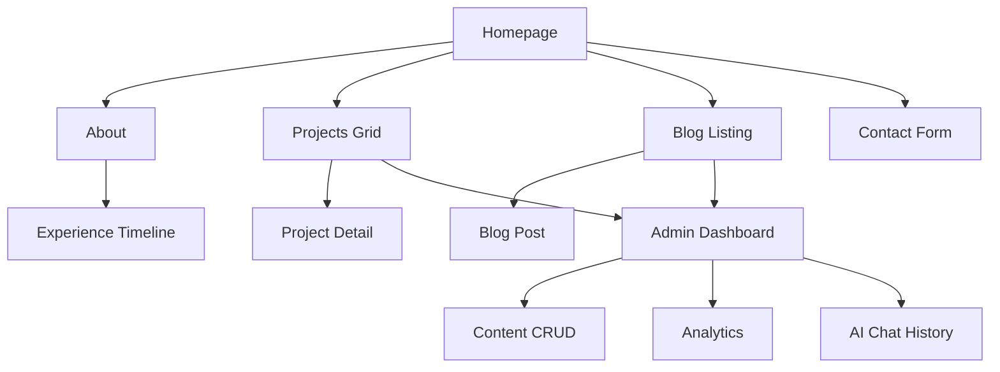

# Wireframes — Design File Reference

> **Version:** 2.0 | **Status:** ✅ Active | **Tool:** Pencil (.pen) | **Owner:** Design Lead

## 1. Overview

Wireframes are maintained in **Pencil .pen files** (not Markdown). This document indexes the wireframe files, summarizes what has been wireframed, and documents reading conventions. .pen files support interaction zones, flow arrows, state toggles, and layered annotations that static Markdown cannot replicate.

**Why .pen over Markdown:**

- Interaction zones for click-through prototyping
- Toggleable states (empty, error, loading, success)
- Flow arrows connecting screens with branching logic
- Annotations pinned to specific coordinates
- Component references linking to design system library

## 2. Design File Index

| File               | Path                            | Contents                                                                             | Last Updated |
| ------------------ | ------------------------------- | ------------------------------------------------------------------------------------ | ------------ |
| Main Wireframes    | `docs/04-design/wireframes.pen` | All public screens, admin screens, flows, mobile variants                            | v2.0         |
| Components Library | `docs/04-design/components.pen` | Reusable components with all states (default, hover, active, disabled, focus, error) | v2.0         |
| Design Tokens      | `docs/04-design/tokens.pen`     | Color swatches, type scale reference, spacing grid, shadow samples                   | v2.0         |
| User Flows         | `docs/04-design/flows.pen`      | Flow diagrams with branching annotations, decision points, edge cases                | v2.0         |

**To open any file:** Use Pencil MCP:

```js
open_document({ path: 'docs/04-design/wireframes.pen' });
```

## 3. Wireframed Screens

### Public Portfolio

| Screen         | File Section ID                 | Wireframed States                                                      | Notes                                                             |
| -------------- | ------------------------------- | ---------------------------------------------------------------------- | ----------------------------------------------------------------- |
| Homepage       | `screens/public/home`           | Default, scrolled 50%, scrolled 100%                                   | Hero with 3D placeholder, call-to-action, featured projects strip |
| About          | `screens/public/about`          | Default, expanded timeline item                                        | Timeline with hover states, skill clusters, experience cards      |
| Projects Grid  | `screens/public/projects`       | Default, filtered by tech, filtered by category, empty results         | Search bar, filter chips, pagination                              |
| Project Detail | `screens/public/project-[slug]` | Default, lightbox open, mobile breakpoint                              | Image gallery, tech stack badges, links, related projects         |
| Blog Listing   | `screens/public/blog`           | Default, search active with results, search no results                 | Sort controls, category filter, pagination                        |
| Blog Post      | `screens/public/blog-[slug]`    | Default, code block expanded, table of contents scrolled               | Reading progress bar, TOC sidebar, share buttons                  |
| Contact Form   | `screens/public/contact`        | Default empty, validation errors, submission success, submission error | All form field states, success toast, error recovery              |
| 404 Page       | `screens/public/404`            | Default                                                                | Branded error with navigation options                             |

### Admin Dashboard

| Screen             | File Section ID           | Wireframed States                                      | Notes                                                        |
| ------------------ | ------------------------- | ------------------------------------------------------ | ------------------------------------------------------------ |
| Dashboard Overview | `screens/admin/overview`  | Default with stats, date range selected                | KPI cards, activity chart, recent projects list              |
| Projects CRUD      | `screens/admin/projects`  | List view, create form, edit form, delete confirmation | Table with sort/filter, form with validation, confirm dialog |
| Blog CRUD          | `screens/admin/blog`      | List, create (markdown editor), edit, delete           | Rich text editor, tag management, publish scheduling         |
| Media Library      | `screens/admin/media`     | Grid view, upload dialog, selected state, empty        | Drag-drop upload, thumbnail grid, file details panel         |
| Analytics          | `screens/admin/analytics` | Default, date range selected, loading                  | Charts, metrics cards, export button                         |
| Settings           | `screens/admin/settings`  | Default, unsaved warning, saved success                | Tabbed sections, toggle switches, API key management         |
| AI Chat History    | `screens/admin/chat`      | Empty, conversation list, active chat                  | Thread view, message bubbles, timestamp grouping             |

### Mobile Variants

| Screen   | Key Differences from Desktop                                                                      |
| -------- | ------------------------------------------------------------------------------------------------- |
| Homepage | Bottom nav replaces sidebar, reduced hero height (60vh), single-column content, no 3D autoplay    |
| Projects | Filter via bottom sheet (not sidebar), single-column card layout, horizontal scroll for tech tags |
| Blog     | Single column, search bar in sticky header (fixed on scroll), larger hit targets for navigation   |
| Admin    | Hamburger menu replaces docked sidebar, data tables rendered as labeled card list                 |
| Contact  | Full-screen form, keyboard-aware viewport adjustment, full-width submit button                    |
| AI Chat  | Full-screen bottom sheet (vs floating draggable panel on desktop), keyboard with send button      |

## 6. Screen Flow Diagram



### User Flows (in `flows.pen`)

| Flow              | Start → Key Steps → End                                                     | Edge Cases                                          |
| ----------------- | ----------------------------------------------------------------------------------------- | --------------------------------------------------- |
| Project Browse    | Home → Projects Grid → Filter → Detail → Back                 | Empty filter results, slow image load               |
| Blog Read         | Blog Listing → Search → Post → Share → Back                   | No results, long post with many code blocks         |
| Contact Submit    | Any page → Contact Form → Validation → Submit → Success toast | Network error, invalid email, spam prevention       |
| Admin Login       | Login page → OAuth → Dashboard → Edit Project → Save          | Expired session, permission denied, concurrent edit |
| AI Chat           | Any page → Chat FAB → Type message → AI response → Dismiss    | Offline, slow response, message send failure        |
| User Registration | Admin invite → Sign up → Create profile → First login                | Expired invite, duplicate email, weak password      |

## 4. Wireframe Conventions

| Convention              | Visual Spec                                                     | Meaning                                              |
| ----------------------- | --------------------------------------------------------------- | ---------------------------------------------------- |
| Screen boundary         | 1px solid blue `#3b82f6` rectangle                              | Viewport boundary for this screen                    |
| Interaction zone        | 1px dashed violet `#8b5cf6` border                              | Tappable/clickable area with defined behavior        |
| Image/video placeholder | Gray `#9ca3af` fill at full opacity, aspect ratio maintained    | Space reserved for dynamic media content             |
| Annotation              | Amber `#f59e0b` text, 10px font size                            | Behavior notes, design rationale, or developer notes |
| Flow arrow              | Solid `#3b82f6` line, 1.5px stroke, arrowhead                   | Navigation path between screens                      |
| State label             | `[State: Empty]` — bracket notation in bold               | Indicates an alternative visual state                |
| Device indicator        | Device icon + label (e.g., "📱 Mobile") top-right corner | Which viewport variant this screen represents        |
| Component ref           | `ref: Button/Primary` in blue italic                            | Reference to a component in the components library   |
| Decision point          | Diamond shape, dashed orange `#f59e0b`                          | Conditional branch in user flow diagram              |

**Annotation examples:**

- "On click, expand to full-screen lightbox with swipe support"
- "Show if no projects exist — empty state with CTA"
- "Hides on mobile, replaced by bottom sheet filter"
- "Entrance: fade + slide up, stagger 80ms per card"

**Versioning:** Each screen labeled `v1.2` top-left corner. Major version bump = layout change, minor = spacing/content refinement. Full changelog maintained in `docs/04-design/wireframes-changelog.md`.

## 5. How to Access Latest Wireframes

1. **Open** `wireframes.pen` via Pencil MCP:
   ```js
   open_document({ path: 'docs/04-design/wireframes.pen' });
   ```
2. **Navigate** using the layer panel in the editor or search by section name (e.g., `admin/projects`)
3. **Review** screen structure via `snapshot_layout` and visual fidelity via `get_screenshot`
4. **Leave feedback** by adding annotation nodes prefixed with `[FEEDBACK]` in the design file
5. **Edit** via `batch_design` MCP operations — always create a binding for new nodes
6. **Export** specific screens for stakeholder review via `export_nodes` (PNG for digital, PDF for print)

### New Contributor Checklist

- [ ] Open `wireframes.pen` and browse all screens listed in §3
- [ ] Open `components.pen` to understand reusable component states
- [ ] Review `flows.pen` to understand navigation patterns
- [ ] Verify mobile variants exist for each public screen
- [ ] Run `snapshot_layout` to check for clipping or overlapping elements
- [ ] Confirm all annotations are current (no stale `[TODO]` markers)
- [ ] Check `wireframes-changelog.md` for latest revisions

## Cross-References

- [../MASTER-INDEX.md](../MASTER-INDEX.md) — Documentation master index
- [../26-reference/CROSS-REFERENCE-INDEX.md](../26-reference/CROSS-REFERENCE-INDEX.md) — Cross-reference system
