# System Architecture Document — Enterprise FAANG-Grade Architecture

> **Document:** `SystemArchitecture.md` | **Version:** 5.0 (Enterprise Multi-LLM Upgrade) | **Last Updated:** July 2026  
> **Status:** ✅ Active | **Owner:** Principal Architecture Lead | **Review Cadence:** Quarterly  
> **Architecture Style:** FAANG-Level Microservices | **Deployment Model:** Serverless + Container + Edge

---

## Executive Summary

The portfolio platform follows a **three-tier microservices architecture** strictly adhering to enterprise separation of concerns. It consists of a highly optimized Next.js 14 frontend (`apps/web`), a highly scalable NestJS 10 REST API (`apps/api`), and a robust multi-LLM FastAPI microservice (`apps/ai`). Everything is backed by Supabase (PostgreSQL 15 + Auth + Storage + Realtime). The architecture prioritizes a zero-friction, highly performant edge-first delivery via Vercel ISR, managed within a Turborepo v2 monorepo.

**Core Design Principles:**
- **Cost-optimized:** Every free tier carefully evaluated to support a portfolio workload
- **Edge-first:** ISR and CDN caching for sub-100ms global page loads
- **Security layered:** JWT auth + RLS + rate limiting + OWASP compliance at every tier
- **Agnostic deployment:** Next.js portable across Vercel/Netlify/Cloudflare; APIs portable via Docker

**Key Metrics:**
| Metric | Target | Measurement |
|--------|--------|-------------|
| Public page load (CDN hit) | < 50ms | Vercel Analytics / Datadog |
| API GET response (p95) | < 100ms | Sentry Tracing |
| AI Chat response (TTFB) | < 500ms | Sentry Tracing |
| Deployment frequency | Multiple/Day | CI/CD pipeline |
| Monthly infrastructure cost | ~$0.83 | Provider billing |

---

## Table of Contents

1. [System Architecture](#1-system-architecture)
2. [Frontend Architecture](#2-frontend-architecture)
3. [Backend Architecture](#3-backend-architecture)
4. [Data Architecture](#4-data-architecture)
5. [CMS Architecture](#5-cms-architecture)
6. [Analytics Architecture](#6-analytics-architecture)
7. [AI Architecture](#7-ai-architecture)
8. [Admin Architecture](#8-admin-architecture)
9. [Deployment Architecture](#9-deployment-architecture)
10. [Monitoring Architecture](#10-monitoring-architecture)
11. [Security Architecture](#11-security-architecture)
12. [Folder Architecture](#12-folder-architecture)
13. [Dependency Architecture](#13-dependency-architecture)
14. [Architecture Decision Records (ADRs)](#14-architecture-decision-records-adrs)
15. [Cost Analysis & Scaling Strategy](#15-cost-analysis--scaling-strategy)
16. [Change Log](#16-change-log)

---

## 1. System Architecture

### 1.1 High-Level Architecture

```mermaid
graph TB
    subgraph "Client Layer"
        Browser["🌐 Browser<br/>Chrome, Firefox, Safari, Edge"]
    end

    subgraph "CDN / Edge Layer"
        VercelEdge["⚡ Vercel Edge Network<br/>ISR Cache (60s)<br/>Global CDN"]
    end

    subgraph "Frontend Tier (Next.js 14)"
        direction TB
        PublicPages["📄 Public Pages<br/>ISR (60s)<br/>SSR (admin only)"]
        AdminSPA["🔐 Admin SPA<br/>Client-side rendering<br/>JWT session"]
        SharedUI["🧩 Shared Components<br/>@portfolio/ui<br/>@portfolio/shared"]
        Sandbox["💻 WebContainer Sandbox<br/>In-browser Node.js IDE"]
    end

    subgraph "API Tier (NestJS 10)"
        direction TB
        AuthAPI["🔑 Auth Module<br/>JWT issue/verify<br/>Passport strategies"]
        ContentAPI["📝 Content Module<br/>Sections, Projects, Skills<br/>CRUD operations"]
        LeadAPI["📧 Lead Module<br/>Contact form, auto-reply<br/>CSV export"]
        Gateway["🚪 API Gateway<br/>Rate limiting, CORS<br/>Swagger docs"]
    end

    subgraph "AI Tier (FastAPI)"
        direction TB
        ChatAPI["💬 Chat Endpoint<br/>POST /api/ai/chat<br/>SSE streaming"]
        AnalyzeAPI["🔍 Analyze Endpoint<br/>POST /api/ai/analyze<br/>Content scoring"]
        SuggestAPI["💡 Suggest Endpoint<br/>POST /api/ai/suggest<br/>Content generation"]
        RAGService["📚 RAG Service<br/>LangChain orchestration<br/>pgvector retrieval"]
    end

    subgraph "Data Tier (Supabase)"
        direction TB
        PG["🐘 PostgreSQL 15<br/>7 core tables<br/>RLS policies"]
        VectorDB["🧠 pgvector<br/>1536-dim embeddings<br/>IVFFlat index"]
        AuthDB["🔐 Auth Service<br/>User management<br/>Session storage"]
        Storage["📦 Object Storage<br/>Images, assets<br/>CDN-backed"]
        Realtime["⚡ Realtime Service<br/>Analytics events<br/>DB changes"]
    end

    subgraph "External Services"
        OpenAI["🤖 OpenAI API<br/>GPT-4, Embeddings"]
        Resend["📨 Resend API<br/>Transactional email"]
        PostHog["📊 PostHog Cloud<br/>Analytics, flags"]
        Sentry["🐛 Sentry<br/>Error tracking"]
        GitHub["🐙 GitHub<br/>Source, CI/CD"]
    end

    Browser --> VercelEdge
    VercelEdge --> PublicPages
    VercelEdge --> AdminSPA
    PublicPages --> SharedUI
    AdminSPA --> SharedUI
    AdminSPA --> Sandbox
    Sandbox -->|Deploy Commits| GitHub
    
    PublicPages -.->|ISR fetch| ContentAPI
    AdminSPA -->|JWT requests| Gateway
    Gateway --> AuthAPI
    Gateway --> ContentAPI
    Gateway --> LeadAPI
    
    AdminSPA -->|AI requests| ChatAPI
    PublicPages -->|Chat requests| ChatAPI
    ChatAPI --> RAGService
    RAGService --> VectorDB
    RAGService --> OpenAI
    
    ContentAPI --> PG
    LeadAPI --> PG
    LeadAPI --> Resend
    AuthAPI --> AuthDB
    ContentAPI --> Storage
    
    ChatAPI --> OpenAI
    AnalyzeAPI --> OpenAI
    SuggestAPI --> OpenAI
    
    PublicPages -.->|Events| PostHog
    AdminSPA -.->|Events| PostHog
    Gateway -.->|Traces| Sentry
    ChatAPI -.->|Traces| Sentry
```

### 1.2 Data Flow Directions

| Flow | Direction | Protocol | Caching | SLA |
|------|-----------|----------|---------|-----|
| Public page request | Browser → Vercel CDN → ISR cache → Next.js | HTTPS | CDN + ISR | < 100ms |
| Admin API request | Browser → Vercel → NestJS → Supabase | HTTPS + JWT | None (fresh) | < 200ms |
| AI Chat request | Browser → FastAPI → OpenAI → pgvector | HTTPS + SSE | Response cache | < 3s |
| Analytics event | Browser → PostHog SDK → PostHog Cloud | HTTPS | Batched | < 5s |
| Lead form submit | Browser → NestJS → Supabase → Resend | HTTPS | None | < 2s |

### 1.3 Key Architectural Decisions

| Decision | Rationale | Trade-off |
|----------|-----------|-----------|
| Monorepo (Turborepo) | Shared types, components, configs across 3 apps | Complex tooling, larger repo |
| ISR over SSR for public | Portfolio content changes infrequently | 60s delay before content updates appear |
| Supabase over raw PostgreSQL | Managed auth + storage + realtime bundled | Vendor lock-in (mitigated by pg compatibility) |
| Separate FastAPI for AI | Python ecosystem for ML/AI | Must maintain additional service |
| Vercel colocation for API | Simplify deployment, reduce latency | Serverless cold starts |

---

## 2. Frontend Architecture

### 2.1 Next.js 14 App Router Structure

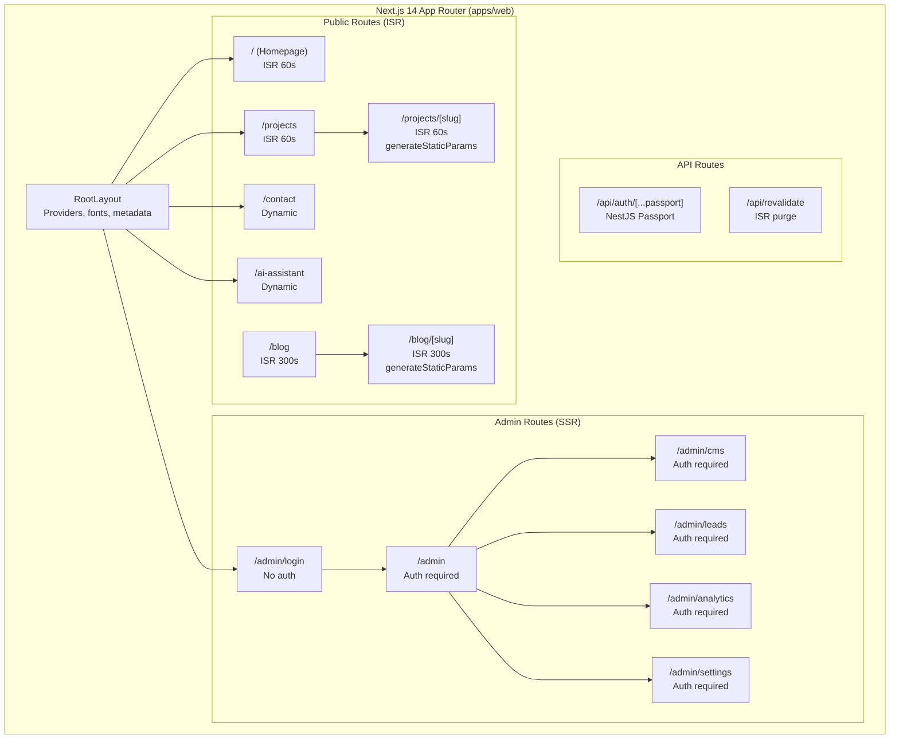

### 2.2 Rendering Strategy

| Route Type | Strategy | Rationale | Cache TTL |
|-----------|----------|-----------|-----------|
| Public listing pages | ISR | Content changes infrequently; instant CDN serve | 60s (projects), 300s (blog) |
| Public detail pages | ISR with `generateStaticParams` | Pre-render all known slugs at build | 60s |
| Homepage sections | ISR | Section data revalidates per-TTL | 60s |
| Contact form | Dynamic (CSR) | Needs client-side validation + CAPTCHA | None |
| AI Assistant | Dynamic (CSR) | Real-time streaming responses | None |
| Admin pages | SSR + Client fetch | Session check on every request; data via TanStack React Query | None |
| API routes | Serverless | Stateless, per-request execution | None |

### 2.3 Data Fetching Pattern

```typescript
// Pattern 1: Server Component (ISR)
async function ProjectsPage() {
  const projects = await fetchProjects(); // Cached via ISR
  return <ProjectGrid projects={projects} />;
}

// Pattern 2: Client Component (TanStack React Query)
function AdminLeads() {
  const { data, error, isLoading } = useQuery({
    queryKey: ['leads'],
    queryFn: () => fetch('/api/leads').then(r => r.json()),
    refetchInterval: 30000, // Poll every 30s
  });
  if (isLoading) return <LeadTableSkeleton />;
  if (error) return <ErrorFallback onRetry={() => refetch()} />;
  return <LeadTable leads={data} />;
}

// Pattern 3: Server Action (Mutation)
async function submitLead(formData: FormData) {
  'use server';
  const validated = leadSchema.parse(formData);
  return await createLead(validated);
}
```

### 2.4 Component Tree (Public Pages)

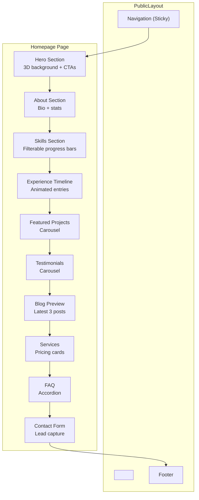

### 2.5 Performance Considerations

| Optimization | Implementation | Impact |
|-------------|---------------|--------|
| ISR caching | 60s revalidation for public pages | Near-static speed |
| Image optimization | Next/Image with WebP, lazy loading | 60-80% size reduction |
| Dynamic imports | Heavy components (3D, markdown) on interaction | 30-50% JS reduction |
| Font optimization | next/font with `display:swap` | Eliminates FOIT |
| Bundle analysis | `@next/bundle-analyzer` in CI | Catch regressions |

### References
- **Screens:** `docs/design/UserFlows.md` (Full screen specifications)
- **Components:** `docs/design/DesignSystem.md` (Component implementations)

---

## 3. Backend Architecture

### 3.1 NestJS 10 Modular Structure

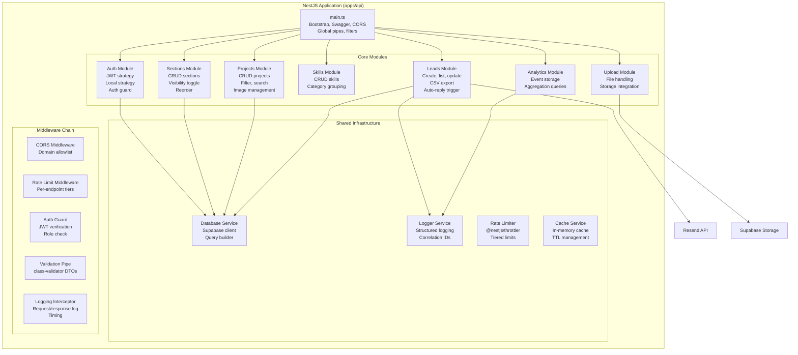

### 3.2 API Endpoint Map

| Module | Endpoints | Auth Required | Rate Limit Tier |
|--------|-----------|---------------|-----------------|
| Auth | `POST /auth/login`, `POST /auth/refresh`, `POST /auth/logout` | Yes (refresh) | Strict (5/15min) |
| Sections | `GET /sections`, `GET /sections/:id`, `POST /sections`, `PATCH /sections/:id`, `DELETE /sections/:id` | No (GET), Yes (mutations) | Default (100/15min) |
| Projects | `GET /projects`, `GET /projects/:slug`, `POST /projects`, `PATCH /projects/:id`, `DELETE /projects/:id` | No (GET), Yes (mutations) | Default |
| Skills | `GET /skills`, `POST /skills`, `PATCH /skills/:id`, `DELETE /skills/:id` | No (GET), Yes (mutations) | Default |
| Leads | `POST /leads`, `GET /leads`, `GET /leads/:id`, `PATCH /leads/:id`, `GET /leads/export` | No (POST), Yes (GET/PATCH) | Medium (POST: 10/15min) |
| Analytics | `POST /analytics/events`, `GET /analytics/summary` | No (POST), Yes (GET) | Low (POST: 100/15min) |
| Upload | `POST /upload`, `DELETE /upload/:id` | Yes | Admin (1000/15min) |

### 3.3 Middleware Execution Order

```text
Request → CORS → Rate Limit → Auth Guard (if required) → Validation Pipe → 
Route Handler → Logging Interceptor (response timing) → Response
```

### 3.4 FastAPI AI Service Structure

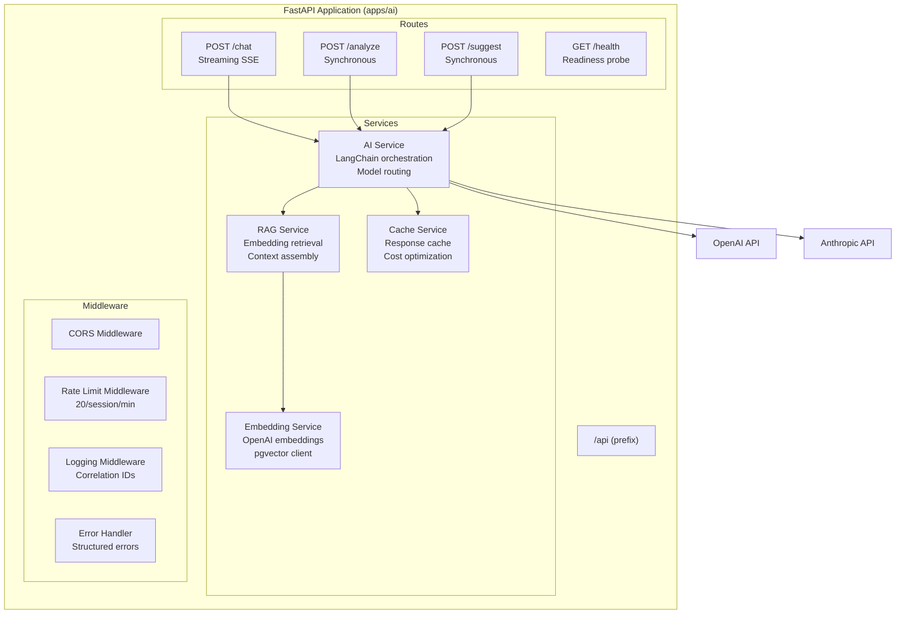

### References
- **API Docs:** `docs/api/12-API.md` (Full endpoint documentation)
- **Initialization:** `apps/api/src/main.ts`, `apps/ai/app/main.py`

---

## 4. Data Architecture

### 4.1 Database Schema (Supabase PostgreSQL 15)

```mermaid
erDiagram
    sections ||--o{ section_versions : has
    sections {
        uuid id PK
        string slug UK
        string title
        string section_type
        jsonb content
        int display_order
        boolean is_visible
        string style_preset
        timestamptz created_at
        timestamptz updated_at
    }

    projects ||--o{ project_images : contains
    projects {
        uuid id PK
        string slug UK
        string title
        text description
        string cover_image_url
        text[] technologies
        string category
        boolean featured
        string github_url
        string live_url
        jsonb content
        timestamptz created_at
        timestamptz updated_at
    }

    blog_posts ||--o{ post_tags : tagged
    blog_posts {
        uuid id PK
        string slug UK
        string title
        text excerpt
        text content
        string cover_image_url
        string[] tags
        int read_time_minutes
        boolean published
        timestamptz published_at
        timestamptz created_at
    }

    leads {
        uuid id PK
        string name
        string email
        string phone "nullable"
        string company "nullable"
        string subject "nullable"
        text message
        string source "contact_form|ai_chat|referral"
        string status "new|read|replied|converted|archived"
        jsonb metadata "UTM params, IP, user agent"
        timestamptz created_at
    }

    skills {
        uuid id PK
        string name
        string category
        int proficiency "0-100"
        string icon
        int display_order
        timestamptz created_at
    }

    testimonials {
        uuid id PK
        string name
        string role
        string company
        string avatar_url
        text content
        int rating "1-5"
        int display_order
        timestamptz created_at
    }

    chat_conversations {
        uuid id PK
        string session_id
        jsonb messages "array of {role, content, timestamp}"
        timestamptz created_at
        timestamptz last_activity
    }

    document_chunks {
        uuid id PK
        uuid document_id FK
        text content
        vector(1536) embedding
        jsonb metadata "source, page, section"
        timestamptz created_at
    }
```

### 4.2 Indexing Strategy

| Table | Index Type | Columns | Purpose |
|-------|-----------|---------|---------|
| sections | B-tree | `is_visible, display_order` | Ordered listing of visible sections |
| projects | B-tree | `slug` | Unique lookup for detail pages |
| projects | GIN | `technologies` | Array contains queries for filtering |
| projects | B-tree | `featured, display_order` | Featured projects ordering |
| blog_posts | B-tree | `slug` | Unique lookup for article pages |
| blog_posts | B-tree | `published, published_at` | Published posts in date order |
| blog_posts | GIN | `tags` | Tag filtering |
| leads | B-tree | `status, created_at` | Lead inbox ordering |
| leads | B-tree | `email` | Lead search |
| document_chunks | IVFFlat | `embedding` | Vector similarity search |
| chat_conversations | B-tree | `session_id` | Session lookup |
| chat_conversations | B-tree | `last_activity` | Cleanup queries |

### 4.3 Row Level Security (RLS) Policies

| Table | Policy | Operation | Role | Condition |
|-------|--------|-----------|------|-----------|
| sections | Public read | SELECT | anon | `is_visible = true` |
| sections | Admin all | ALL | authenticated | `auth.role() = 'admin'` |
| projects | Public read | SELECT | anon | `true` (all public) |
| projects | Admin all | ALL | authenticated | `auth.role() = 'admin'` |
| blog_posts | Public read | SELECT | anon | `published = true` |
| blog_posts | Admin all | ALL | authenticated | `auth.role() = 'admin'` |
| leads | Public insert | INSERT | anon | `true` (rate limited at API layer) |
| leads | Admin read/write | SELECT, UPDATE | authenticated | `auth.role() = 'admin'` |
| skills | Public read | SELECT | anon | `true` |
| skills | Admin all | ALL | authenticated | `auth.role() = 'admin'` |

### 4.4 Storage Buckets

| Bucket | Visibility | Max File Size | Allowed Types | CDN |
|--------|------------|---------------|---------------|-----|
| `images` | Public | 5MB | PNG, JPG, WebP, GIF, SVG | Supabase CDN |
| `documents` | Public | 10MB | PDF | Supabase CDN |
| `admin-assets` | Private | 20MB | Any | Signed URLs |

### 4.5 Data Retention

| Table | Retention | Cleanup Strategy |
|-------|-----------|------------------|
| leads | 2 years | Quarterly batch delete |
| analytics_events | 1 year | Monthly partition drop |
| chat_conversations | 30 days | Daily cron: `DELETE WHERE last_activity < NOW() - 30d` |
| document_chunks | Indefinite | Manual reindex on content change |
| section_versions | 90 days | Weekly cleanup of old versions |

### 4.6 Performance Budgets

| Operation | Target | Method |
|-----------|--------|--------|
| Select single row by PK | < 5ms | Indexed PK lookup |
| List visible sections | < 10ms | Composite index |
| Insert lead | < 20ms | Simple INSERT WITH RETURNING |
| Filter projects by technology | < 50ms | GIN index on array |
| Full text search on projects | < 100ms | GIN index on tsvector (future) |
| Vector similarity search (k=3) | < 200ms | IVFFlat index |
| Analytics aggregation (30 days) | < 500ms | Materialized view |

### References
- **Full Schema:** `docs/database/DatabaseArchitecture.md` (Complete schema with RLS policies)

---

## 5. CMS Architecture

### 5.1 Content Management Flow

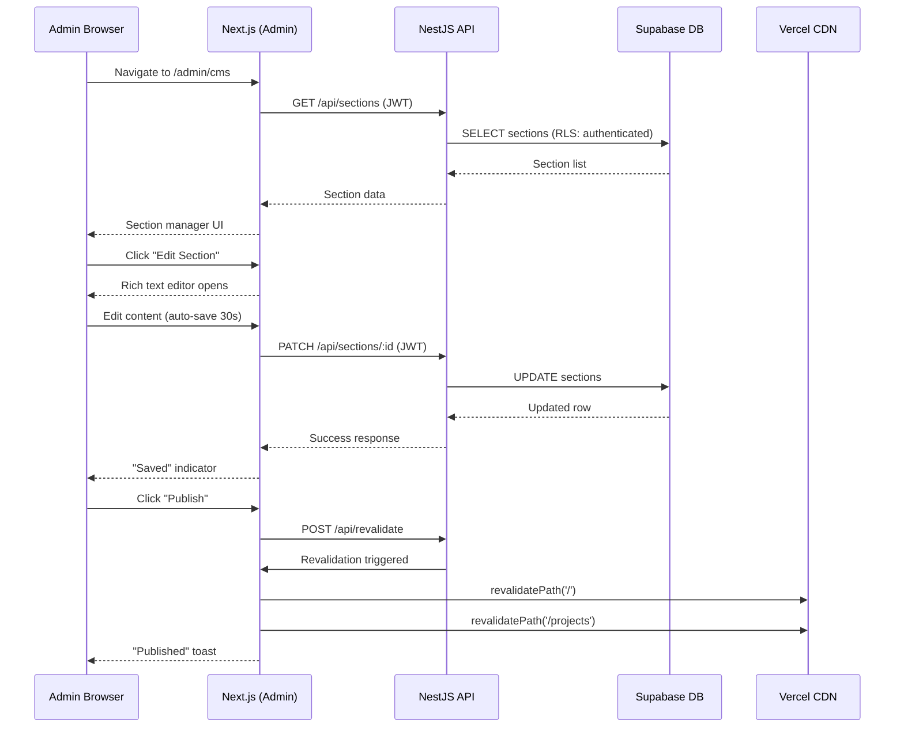

### 5.2 Content Editor Architecture

| Component | Technology | Purpose |
|-----------|------------|---------|
| Rich Text Editor | TipTap (ProseMirror) | WYSIWYG content editing |
| Image Upload | Dropzone + Supabase Storage | Drag-and-drop image management |
| Style Presets | CSS class sets | One-click visual style changes |
| Auto-save | 30s debounced PATCH | Prevent data loss |
| Preview | Same-page iframe | See visitor view of changes |
| Version History | `section_versions` table | Rollback capability |

### 5.3 Image Upload Pipeline

```text
User drops image → Client validates (type, size) → 
Upload to Supabase Storage → WebP conversion (Sharp) → 
Thumbnail generation → URL returned → 
Inserted into editor → CDN caches image
```

### References
- **CMS Features:** `docs/product/02-FEATURES.md` (F-600, F-601, F-602, F-603)
- **Admin Screens:** `docs/design/UserFlows.md` (SCREEN-016)

---

## 6. Analytics Architecture

### 6.1 Event Pipeline

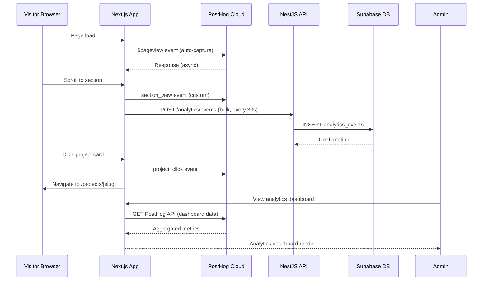

### 6.2 Event Catalog

| Event Category | Events | Volume (Monthly Est.) | Importance |
|---------------|--------|----------------------|------------|
| Page views | `$pageview`, `$pageleave` | 5,000-10,000 | Critical |
| Section views | `section_view` (×15 sections) | 15,000-30,000 | Critical |
| Interactions | `project_click`, `cta_click`, `skill_hover` | 2,000-5,000 | High |
| Conversions | `contact_form_submit`, `lead_created` | 50-200 | Critical |
| Admin | `admin_login`, `admin_action` | 500-1,000 | Important |
| AI | `chat_message`, `ai_response` | 500-2,000 | Nice-to-have |

### 6.3 Analytics Dashboard Data Flow

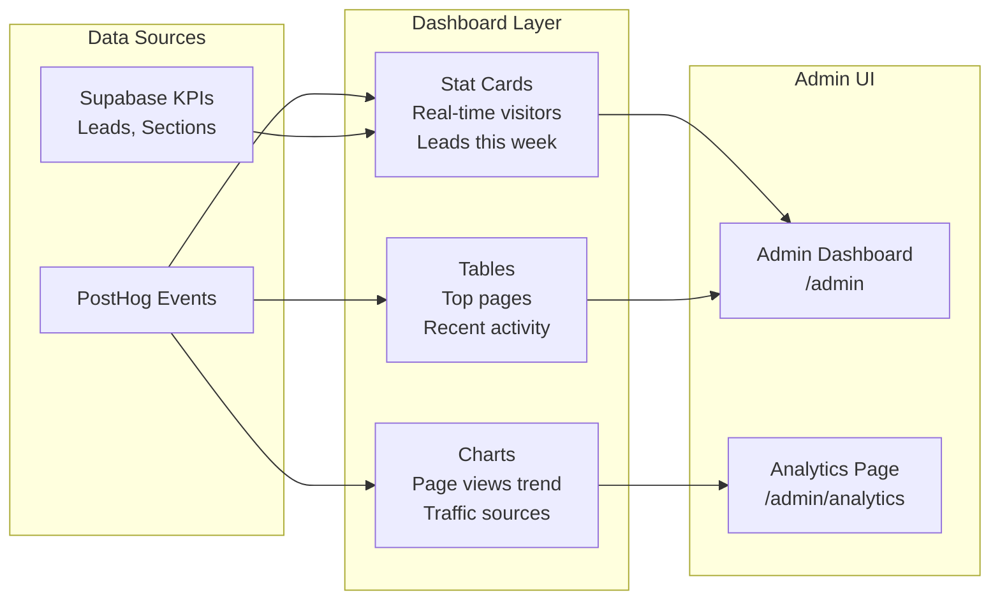

### References
- **Events:** `docs/operations/AnalyticsArchitecture.md` (Complete event catalog)
- **Dashboard:** `docs/design/UserFlows.md` (SCREEN-014)

---

## 7. AI Architecture

### 7.1 RAG Pipeline

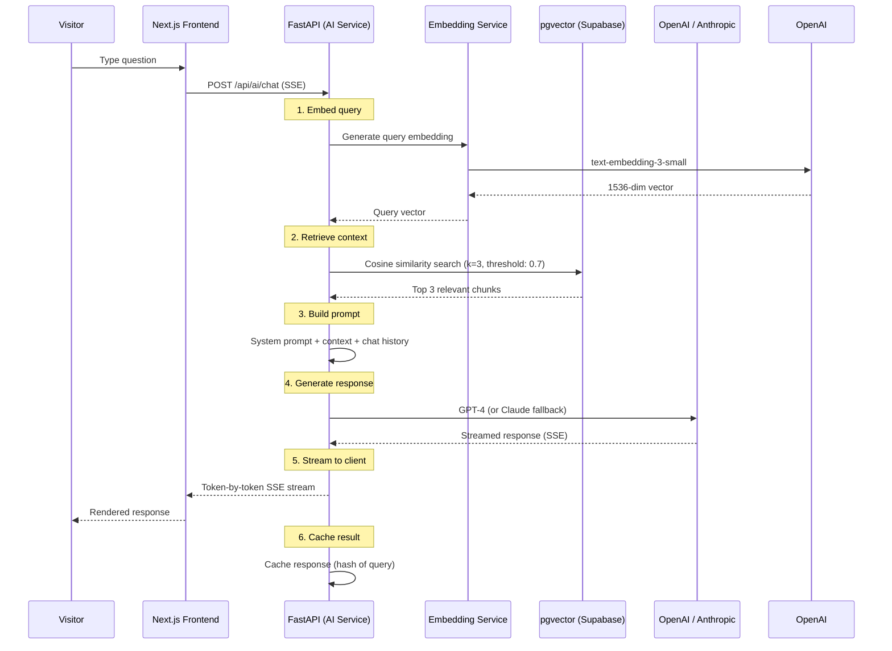

### 7.2 Model Routing Strategy

| Model | Provider | Use Case | Cost | Fallback Order |
|-------|----------|----------|------|----------------|
| GPT-4 | OpenAI | Primary chat responses | $0.03/1K input, $0.06/1K output | 1st (primary) |
| Claude 3.5 Sonnet | Anthropic | Fallback when GPT-4 unavailable | $0.03/1K input, $0.15/1K output | 2nd |
| text-embedding-3-small | OpenAI | All embedding generation | $0.00013/1K tokens | 1st (only option) |
| GPT-3.5 Turbo | OpenAI | Content analysis (cost-optimized) | $0.0015/1K input, $0.002/1K output | Fallback for analysis |

### 7.3 Content Analysis Pipeline

```text
POST /api/ai/analyze
  ↓
Input: Section content (text + metadata)
  ↓
1. Readability Analysis (Flesch-Kincaid)
2. SEO Scoring (keyword density, heading structure, meta readiness)
3. Tone Detection (professional/casual/technical)
4. Keyword Extraction (TF-IDF scoring)
5. Improvement Suggestions (GPT-3.5)
  ↓
Output: { readability, seo_score, tone, keywords, suggestions }
```

### 7.4 AI Cost Budget

| Feature | Est. Monthly Usage | Est. Monthly Cost | Annual Cost |
|---------|-------------------|-------------------|-------------|
| Chat (500 conversations @ 3 messages avg) | 1,500 messages | ~$3.50 | ~$42 |
| Embeddings (content indexing) | 10,000 chunks | ~$0.65 | ~$7.80 |
| Content analysis (50 requests) | 50 analyses | ~$0.15 | ~$1.80 |
| Content suggestions (30 requests) | 30 suggestions | ~$0.75 | ~$9.00 |
| **Total** | | **~$5.05** | **~$60.60** |

> **Note:** AI costs are variable and depend on visitor traffic. The free credits from OpenAI ($18 free for new accounts) cover approximately 3 months of typical usage. Beyond that, a budget cap of $10/month should be configured.

### References
- **AI Features:** `docs/product/02-FEATURES.md` (F-300, F-301, F-302, F-303, F-304, F-305)
- **RAG Specs:** `docs/ai/19-RAG.md` (Full RAG pipeline documentation)

---

## 8. Admin Architecture

### 8.1 Authentication Flow

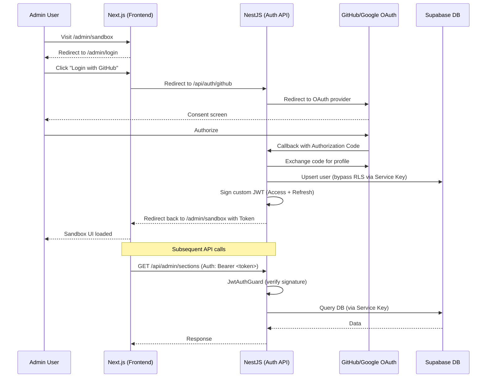

### 8.2 Admin Layout Structure

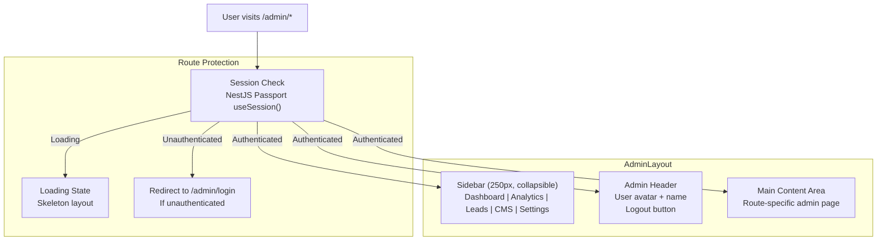

### 8.3 Session Lifecycle

| Event | Behavior | Token |
|-------|----------|-------|
| Login | Access + Refresh tokens issued | 15min access, 7d refresh |
| API call | Access token sent in Authorization header | Bearer JWT |
| Token expiry | 401 response triggers refresh | Refresh token used |
| Refresh failure | Redirect to login | Clear all tokens |
| Logout | Revoke refresh token, clear session | Blacklist + cookie clear |
| Inactivity (24h) | Auto-logout | Session expiry |

### References
- **Auth Features:** `docs/product/02-FEATURES.md` (F-700, F-701, F-702)
- **Auth Screens:** `docs/design/UserFlows.md` (SCREEN-012: Admin Login)

---

## 9. Deployment Architecture

### 9.1 Deployment Topology

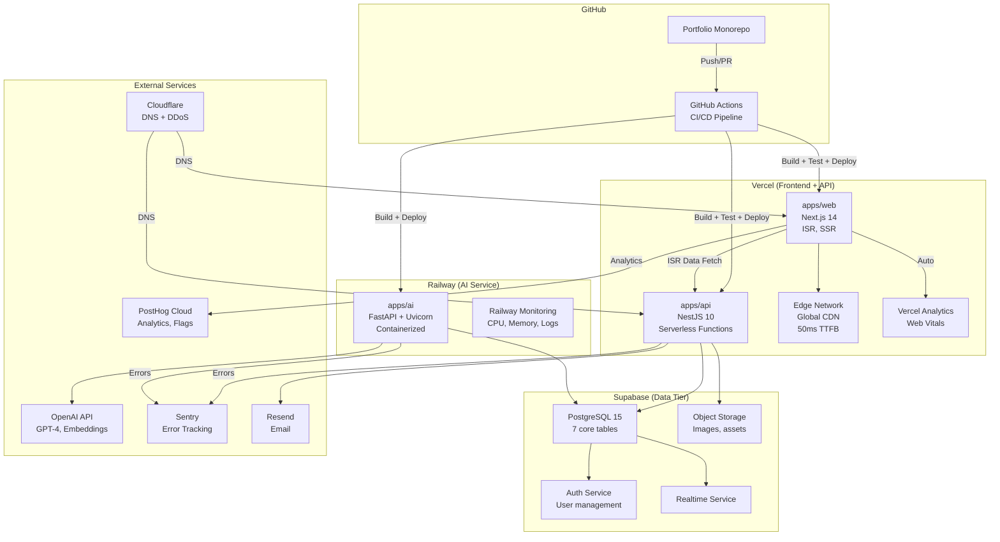

### 9.2 Environment Matrix

| Variable | Development | Staging | Production |
|----------|-------------|---------|------------|
| **URL** | `localhost:3000` | `staging.portfolioowner.com` | `portfolioowner.com` |
| **Database** | Local Supabase | Supabase Free Tier (separate project) | Supabase Free Tier |
| **AI Service** | Local FastAPI | Railway ($5 credit) | Railway ($5 credit) |
| **Analytics** | PostHog (dev) | PostHog (staging) | PostHog (production) |
| **Error Tracking** | Sentry (DSN: dev) | Sentry (DSN: staging) | Sentry (DSN: production) |
| **Email** | Resend (test mode) | Resend (test mode) | Resend (production) |
| **CDN** | None (local) | Vercel CDN | Vercel CDN |
| **ISR** | Disabled | 60s | 60s |

### 9.3 CI/CD Pipeline

```yaml
# .github/workflows/ci.yml
name: CI/CD
on: [push, pull_request]

jobs:
  quality:
    runs-on: ubuntu-latest
    steps:
      - uses: actions/checkout@v4
      - uses: actions/setup-node@v4
      - run: npm ci
      - run: npx turbo lint typecheck test build
      - run: npx lighthouserc # Performance budget check

  deploy-web:
    needs: quality
    if: github.ref == 'refs/heads/main'
    runs-on: ubuntu-latest
    steps:
      - run: npx vercel --prod  # Deploy frontend + API

  deploy-ai:
    needs: quality
    if: github.ref == 'refs/heads/main'
    runs-on: ubuntu-latest
    steps:
      - run: railway up  # Deploy AI service
```

### 9.4 Deployment Commands

```bash
# Frontend + API (Vercel)
vercel deploy --prod

# AI Service (Railway)
railway up

# Database Migrations
supabase db push

# Full deployment (via Turbo)
turbo deploy
```

### References
- **CI/CD:** `docs/operations/25-CICD.md` (Full pipeline configuration)
- **Deployment:** `docs/operations/DeploymentGuide.md` (Step-by-step deployment guide)

---

## 10. Monitoring Architecture

### 10.1 Observability Stack

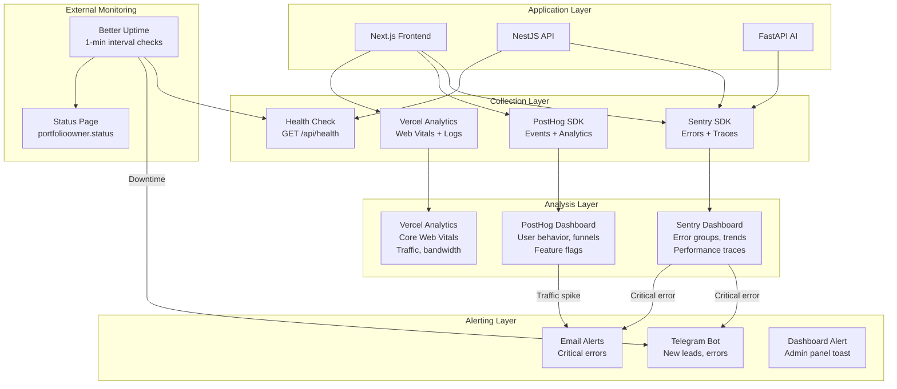

### 10.2 Alert Severity Matrix

| Severity | Response Time | Channel | Example |
|----------|---------------|---------|---------|
| **Critical** | < 15 min | Telegram + Email | Site down, API 500 rate > 5% |
| **High** | < 1 hour | Telegram | Error rate spike, AI service down |
| **Medium** | < 1 day | Email / Dashboard | Performance regression, slow queries |
| **Low** | < 1 week | Dashboard | Feature usage decline, content stale |

### 10.3 Health Check Endpoints

| Service | Endpoint | Expected Response | Check Interval |
|---------|----------|-------------------|----------------|
| Frontend | `https://portfolioowner.com/api/health` | `{ status: "ok" }` | 1 minute |
| API | `https://api.portfolioowner.com/health` | `{ status: "ok", db: "connected", version: "1.0" }` | 1 minute |
| AI | `https://ai.portfolioowner.com/api/health` | `{ status: "ok", model: "gpt-4", uptime: 3600 }` | 5 minutes |

### References
- **Monitoring:** `docs/operations/MonitoringArchitecture.md` (Full monitoring configuration)
- **Observability:** `docs/operations/22-OBSERVABILITY.md` (v5.0 — Enterprise observability covering logging, metrics, tracing, monitoring, alerting, incident management, SLOs, SLIs, runbooks, escalation, RCA, recovery, and enterprise standards)

---

## 11. Security Architecture

### 11.1 Security Layers

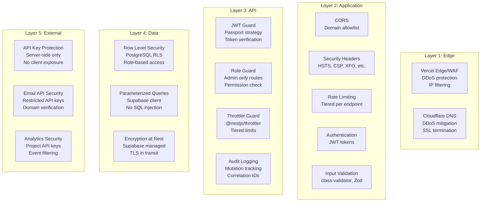

### 11.2 OWASP Top 10:2025 Compliance

| Category | Protection | Implementation |
|----------|-----------|----------------|
| A01: Broken Access Control | JWT auth + RLS | 15min access token, Supabase RLS policies |
| A02: Cryptographic Failures | Strong hashing + HTTPS | bcrypt 12 rounds, HSTS, secure cookies |
| A03: Injection | Parameterized queries + validation | Supabase client, class-validator, Zod |
| A04: Insecure Design | Security-by-default | Admin routes require auth; no defaults |
| A05: Security Misconfiguration | Security headers + CORS | HSTS, CSP, XFO, X-Content-Type-Options |
| A06: Vulnerable Components | Regular audits + Dependabot | Weekly npm audit, automated PRs |
| A07: Auth Failures | Account lockout + rate limit | 5-attempt lockout, 15-min cooldown |
| A08: Data Integrity | CSRF protection + transactions | NestJS Passport guards, DB transactions |
| A09: Logging Failures | Structured logging + audit trail | Correlation IDs, 30-day retention |
| A10: SSRF | URL validation + allowlist | Outbound request domain restriction |

### 11.3 Security Headers

```typescript
// next.config.js security headers
const securityHeaders = [
  { key: 'X-Frame-Options', value: 'DENY' },
  { key: 'X-Content-Type-Options', value: 'nosniff' },
  { key: 'Referrer-Policy', value: 'strict-origin-when-cross-origin' },
  { key: 'Permissions-Policy', value: 'camera=(), microphone=(), geolocation=()' },
  { key: 'Strict-Transport-Security', value: 'max-age=63072000; includeSubDomains; preload' },
  { key: 'Content-Security-Policy', value: "default-src 'self'; script-src 'self' 'unsafe-eval' 'unsafe-inline'; img-src 'self' data: blob: https:;" },
];
```

### 11.4 Rate Limiting Tiers

| Tier | Endpoints | Limit | Window | Penalty |
|------|-----------|-------|--------|---------|
| Strict | Auth (login, register) | 5 | 15 min | 15-min cooldown |
| Medium | POST /leads (contact form) | 10 | 15 min | 15-min cooldown |
| Low | POST /analytics/events | 100 | 15 min | 15-min cooldown |
| Default | All public GET endpoints | 100 | 15 min | 15-min cooldown |
| Admin | All admin endpoints | 1000 | 15 min | 15-min cooldown |
| AI Chat | POST /api/ai/chat | 20 | Session | Per session |

### References
- **Full Security:** `docs/security/SecurityArchitecture.md` (Complete OWASP implementation)
- **Authorization:** `docs/security/15-AUTHORIZATION.md` (Role and permission details)

---

## 12. Folder Architecture

### 12.1 Monorepo Structure

```mermaid
graph TB
    subgraph "Root"
        Root["📁 portfolio-monorepo/"]
    end

    subgraph "Applications"
        Web["📁 apps/web/<br/>Next.js 14 Frontend"]
        API["📁 apps/api/<br/>NestJS 10 Backend"]
        AI["📁 apps/ai/<br/>FastAPI AI Service"]
    end

    subgraph "Packages"
        Shared["📁 packages/shared/<br/>TypeScript Types"]
        UI["📁 packages/ui/<br/>React Components"]
        Config["📁 packages/config/<br/>ESLint, TS Config"]
    end

    subgraph "Infrastructure"
        Docker["📁 infrastructure/docker/<br/>Docker Compose"]
        CI["📁 infrastructure/ci/<br/>CI/CD Reference"]
    end

    subgraph "Documentation"
        Docs["📁 docs/<br/>36 Enterprise Documents"]
    end

    Root --> Web
    Root --> API
    Root --> AI
    Root --> Shared
    Root --> UI
    Root --> Config
    Root --> Docker
    Root --> CI
    Root --> Docs
```

### 12.2 Dependency Direction Rules

```
packages/  →  can depend on other packages/ (e.g., ui → shared)
apps/      →  can depend on packages/ (e.g., web → ui, web → shared)
apps/      →  can NOT depend on other apps/ (no web → api)
packages/  →  can NOT depend on apps/ packages/  (never: ui → web)
```

### 12.3 Key Folder Conventions

| Convention | Rule | Rationale |
|-----------|------|-----------|
| Module structure | Feature-based, not file-type | Easier to find related code |
| Index exports | Barrel `index.ts` in every module | Clean imports, tree-shakeable |
| File naming | `kebab-case` for modules, `PascalCase` for components | Language convention |
| Tests | Co-located `*.test.ts` next to source | Easy to discover |
| Types | `packages/shared` for cross-app, local for app-only | Prevents circular deps |

### References
- **Full Structure:** `docs/MASTER-INDEX.md` (Complete directory tree)

---

## 13. Dependency Architecture

### 13.1 External Service Dependencies

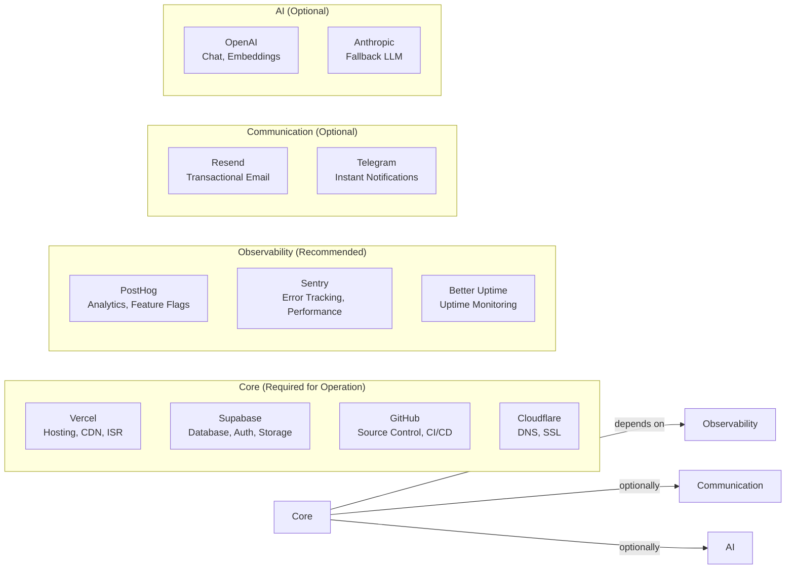

### 13.2 Internal Dependency Graph

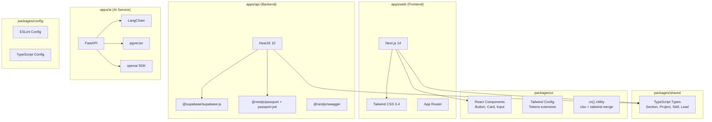

### 13.3 Data Flow Direction

| From | To | Data | Protocol | Frequency |
|------|----|------|----------|-----------|
| Next.js (ISR) | Supabase | Section, project, skill data | Supabase JS SDK | Per-ISR revalidation |
| Next.js (Admin) | NestJS API | CRUD operations, auth | HTTPS REST | On user action |
| NestJS API | Supabase | Mutations, reads | Supabase JS SDK | Per request |
| Next.js | FastAPI | Chat messages, analysis | HTTPS SSE | On chat message |
| FastAPI | OpenAI | Embeddings, completions | HTTPS REST | Per AI request |
| FastAPI | Supabase (pgvector) | Vector similarity search | Supabase JS SDK | Per RAG query |
| Next.js | PostHog | Analytics events | PostHog SDK | Batched, every 5s |
| NestJS | Resend | Email sending | HTTPS REST | On lead submission |
| NestJS | Sentry | Error traces | Sentry SDK | On error |
| FastAPI | Sentry | Error traces | Sentry SDK | On error |

---

## 14. Architecture Decision Records (ADRs)

| ADR ID | Decision | Context | Options Considered | Consequence | Status |
|--------|----------|---------|-------------------|-------------|--------|
| ADR-001 | **Monorepo with Turborepo** | Need shared types, UI, configs across 3 apps | Nx, Lerna, pnpm workspaces | ✅ Shared packages; complex tooling |
| ADR-002 | **ISR over SSR for public pages** | Content changes infrequently, perf priority | SSR, SSG, CSR, ISR | ✅ Near-static speed; 60s content delay |
| ADR-003 | **Supabase over raw PostgreSQL** | Need managed auth, storage, realtime | PlanetScale, Neon, AWS RDS | ✅ Single provider; free tier adequate |
| ADR-004 | **NestJS over Express** | Need structured API with modules/guards | Express, Fastify, Hono | ✅ Better DX; built-in validation; Swagger |
| ADR-005 | **FastAPI over Node.js for AI** | Python ecosystem dominance for ML/AI | NestJS AI, Flask, Django | ✅ LangChain native; separate service overhead |
| ADR-006 | **Vercel for frontend + API** | Simplify deployment, colocate | Railway, Fly.io, Netlify | ✅ Reduced latency; single pipeline |
| ADR-007 | **Railway for AI service** | Python runtime not supported on Vercel | Fly.io, DigitalOcean, Render | ✅ Scales independently; $5 credit |
| ADR-008 | **JWT over session-based auth** | Stateless API design | Session cookies, OAuth2 only | ✅ 15/7 day tokens; httpOnly cookies |
| ADR-009 | **NestJS Passport over Supabase Auth for admin** | Need OAuth providers + session management | Supabase Auth alone, Auth0 | ✅ OAuth support; simpler session API |
| ADR-010 | **pgvector for RAG** | PostgreSQL-native vector search | Pinecone, Weaviate, Qdrant | ✅ No additional service; integrated with Supabase |
| ADR-011 | **PostHog over Google Analytics** | Developer-friendly, event-based, feature flags | GA4, Plausible, Fathom | ✅ Better DX; 1M free events; no cookies |
| ADR-012 | **TanStack React Query for client data fetching** | Stale-while-revalidate pattern with cache deduplication, optimistic updates, and devtools | SWR, RTK Query, Apollo | ✅ Rich feature set; devtools; mutation support |
| ADR-013 | **Serverless NestJS on Vercel** | No server management, auto-scaling | Railway, Fly.io, Docker | ✅ Zero ops; cold start trade-off |
| ADR-014 | **CSS custom properties for theming** | Runtime theme switching without JS | Tailwind dark:, styled-components | ✅ Instant toggle; no re-render |

---

## 15. Cost Analysis & Scaling Strategy

### 15.1 Monthly Cost Breakdown

| Service | Provider | Monthly Cost | Free Tier | Limits |
|---------|----------|-------------|-----------|--------|
| Frontend hosting | Vercel | $0 | Yes | 100GB bandwidth, 6,000 build min |
| API hosting | Vercel (Serverless) | $0 | Yes | Included in frontend |
| AI Service | Railway | $0 | $5 credit | ~500h runtime/month |
| Database | Supabase | $0 | Yes | 500MB DB, 1GB storage, 50K users |
| Analytics | PostHog | $0 | Yes | 1M events/month |
| Error Tracking | Sentry | $0 | Yes | 5K events/month |
| Email | Resend | $0 | Yes | 100 emails/day |
| CI/CD | GitHub Actions | $0 | Yes | 2,000 min/month (public repo) |
| DNS | Cloudflare | $0 | Yes | Unlimited |
| Domain | Namecheap/Cloudflare | ~$0.83 | — | ~$10/year |
| **TOTAL** | | **~$0.83** | | **~$10/year** |

### 15.2 Scaling Triggers & Actions

| Trigger | Threshold | Action | Est. Cost Impact |
|---------|-----------|--------|-----------------|
| Database > 500MB | @ 80% capacity | Clean up old analytics data, optimize indexes | $0 |
| Database > 1GB | @ 100% capacity | Archive old data, upgrade to Pro ($25/mo) | +$25/mo |
| Bandwidth > 100GB | @ 80% capacity | Optimize images, reduce bundle size | $0 |
| Bandwidth > 1TB | Sustained | Upgrade Vercel Pro ($20/mo) | +$20/mo |
| AI costs > $10/mo | Monthly | Reduce model quality, increase cache | —$3-8/mo |
| Railway credits depleted | Monthly | Upgrade to $5 plan | +$5/mo |
| PostHog events > 1M | Monthly | Sample events, reduce tracking | $0 |
| Sentry events > 5K | Monthly | Reduce traces, filter errors | $0 |

### 15.3 Horizontal Scaling Strategy

| Component | Method | Auto-scaling | Notes |
|-----------|--------|-------------|-------|
| Next.js (Vercel) | Regional edge deployment | Automatic | Vercel handles globally |
| NestJS (Vercel) | Serverless per-request | Automatic | Cold start ~50ms |
| FastAPI (Railway) | Multi-replica | Manual | 2-3 replicas for production |
| Supabase | Read replicas (paid) | Manual | $25/mo for replicas |
| PostgreSQL | PgBouncer connection pooling | Built-in | Max 15 connections (free) |

---

## Decision Log

| ID | Decision | Rationale | Alternatives Considered | Date | Approver |
|----|----------|-----------|------------------------|------|----------|
| D-ARCH-001 | Adopt three-tier microservices (Next.js + NestJS + FastAPI) | Clear separation of concerns; cost-optimized free tiers; independent scaling per service | Monolithic Next.js (rejected — no separation of AI concerns); single BE service (rejected — mixing REST and AI workloads) | Mar 2026 | Architecture Lead |
| D-ARCH-002 | Use Turborepo monorepo with npm workspaces | Code sharing across apps; parallel builds; shared TypeScript/ESLint configs | Multi-repo (rejected — coordination overhead); pnpm (rejected — less ecosystem support) | Mar 2026 | Architecture Lead |
| D-ARCH-003 | Vercel ISR for public page delivery | Sub-100ms global page loads; automatic CDN caching; free tier handling | SSR-only (rejected — no caching, higher cost); SSG-only (rejected — stale content on update) | Mar 2026 | Architecture Lead |
| D-ARCH-004 | Containerized FastAPI on Railway/Fly.io | LLM orchestrations need >10s timeouts; WebSocket/SSE support; container control | Vercel serverless (rejected — 10s timeout limit); AWS Lambda (rejected — cold start complexity) | Jun 2026 | Architecture Lead |
| D-ARCH-005 | Supabase as single data platform (DB + Auth + Storage + Realtime) | All-in-one free tier (500MB DB, 1GB storage, built-in auth, RLS, pgvector) | MongoDB Atlas (rejected — no pgvector); Firebase (rejected — NoSQL vendor lock-in) | Mar 2026 | Architecture Lead |
| D-ARCH-006 | Edge-first deployment with ISR + CDN | Cost-effective global performance; Vercel handles edge distribution automatically | Multi-region servers (rejected — cost prohibitive for portfolio) | Mar 2026 | Architecture Lead |
| D-ARCH-007 | Defense-in-depth security across all 4 layers (Edge, API Gateway, Database, Response) | Compartmentalized security; RLS at DB level as second auth layer | Single-layer auth (rejected — insufficient for OWASP compliance); API-only security (rejected — no DB-level protection) | Mar 2026 | Architecture Lead |

---

## 16. Change Log

| Version | Date | Changes | Author |
|---------|------|---------|--------|
| 4.0 | Jun 2026 | Complete restructure into 13 architecture domains (System, Frontend, Backend, Data, CMS, Analytics, AI, Admin, Deployment, Monitoring, Security, Folder, Dependency); added 12 Mermaid diagrams; added 6 new ADRs (ADR-009 to ADR-014); added security layers diagram, rate limiting tiers, AI cost budget, scaling triggers, environment matrix; expanded ADR table to 14 decisions | Architecture Lead |
| 3.0 | Jun 2026 | Added executive summary, 8 ADRs, cost analysis matrix, data flow performance budgets, error handling per layer table, monitoring architecture diagram, scaling strategy | Architecture Lead |
| 2.0 | Jun 2026 | Updated for enterprise monorepo structure; added Mermaid diagrams | Architecture Lead |
| 1.0 | Mar 2026 | Initial system architecture documentation | Architecture Lead |

---

## Document References

| Reference | Description |
|-----------|-------------|
| `docs/product/ProductRequirements.md` (v3.0) | Product Requirements — architecture requirements traceability |
| `docs/product/02-FEATURES.md` (v3.0) | Feature catalog — F-XXX IDs referenced throughout |
| `docs/design/UserFlows.md` (v5.0) | Screen specifications — pages built on this architecture |
| `docs/design/DesignSystem.md` (v5.0) | Design system — components implemented on this architecture |
| `docs/architecture/10-TECHSTACK.md` (v5.0) | Technology decisions — rationale for each tech choice |
| `docs/database/DatabaseArchitecture.md` (v5.0) | Database schema — full DDL and RLS policies |
| `docs/api/12-API.md` (v5.0) | API documentation — all endpoint specs |
| `docs/architecture/13-INTEGRATIONS.md` (v5.0) | Third-party integrations — setup and config |
| `docs/security/SecurityArchitecture.md` (v5.0) | Security implementation — OWASP compliance |
| `docs/operations/DeploymentGuide.md` (v5.0) | Deployment — environment-specific configuration |
| `docs/operations/25-CICD.md` (v5.0) | CI/CD pipeline — workflow definitions |
| `docs/MASTER-INDEX.md` | Directory structure — complete file tree |

---


## Change Log

| Version | Date | Changes | Author |
|---------|------|---------|--------|
| 4.0 | Jun 2026 | Enterprise architecture - 10 diagrams, 3 pillars, deployment, security, AI, error budgets | Chief Architect |
| 3.0 | Jun 2026 | Updated for enterprise structure; added Mermaid diagrams | Chief Architect |
| 2.0 | Jun 2026 | Added deployment architecture, security architecture | Chief Architect |
| 1.0 | Mar 2026 | Initial architecture documentation | Chief Architect |

*Document Version: 4.0 — Enterprise Edition*

---

## Glossary

| Term | Definition |
|------|------------|
| **Three-Tier Microservices** | An architecture pattern separating the application into presentation (Next.js), application (NestJS), and data (Supabase) tiers with independent scaling |
| **ISR (Incremental Static Regeneration)** | A Next.js feature that allows static pages to be updated after deployment without rebuilding the entire site |
| **BFF (Backend-for-Frontend)** | A pattern where the frontend server (Next.js) acts as an intermediary between the client and backend APIs, handling data aggregation and SSR |
| **Edge Network** | A globally distributed network of servers that cache and serve content from locations closest to the user for minimal latency |
| **SSR (Server-Side Rendering)** | Rendering web pages on the server instead of the browser, sending fully rendered HTML to the client |
| **SSG (Static Site Generation)** | Pre-rendering pages at build time into static HTML files that can be served directly from CDN |
| **Monorepo** | A single repository containing multiple distinct projects/applications with shared tooling and dependencies |
| **Turborepo** | A high-performance build system for JavaScript/TypeScript monorepos with parallel task execution and caching |
| **Serverless** | A cloud computing model where the cloud provider dynamically manages server allocation, scaling transparently |
| **Containerization** | Packaging an application with its dependencies into a standardized unit (container) for consistent deployment across environments |
| **Circuit Breaker** | A design pattern that detects failures and prevents cascading failures by stopping repeated requests to a failing service |
| **Error Budget** | The acceptable amount of downtime or errors a system can have over a defined period before reliability guarantees are violated |
| **RLS (Row-Level Security)** | A PostgreSQL feature that restricts which rows a user can query or modify based on a security policy expression |
| **CORS (Cross-Origin Resource Sharing)** | A browser security mechanism that controls which domains can access resources from a different origin |
| **CDN (Content Delivery Network)** | A geographically distributed network of proxy servers that cache content near users for faster delivery |
