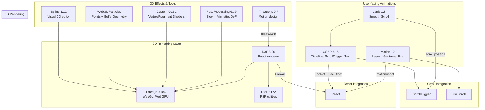

# Tech Stack Document — Enterprise Technology Inventory

> **Document:** `10-TECHSTACK.md` | **Version:** 4.0 | **Last Updated:** June 2026  
> **Status:** ✅ Active | **Owner:** Architecture Lead | **Review Cadence:** Quarterly

---

## Executive Summary

This document catalogs every technology used across the portfolio platform — from frameworks to hosting providers to animation libraries. Each technology is selected based on a trade-off analysis of cost, performance, ecosystem, and team expertise. The total platform cost is ~$10/year (domain only), achieved through strategic use of free tiers across all services.

**Stack at a Glance:** Next.js 14 + NestJS 10 + FastAPI + Supabase + Turborepo + TypeScript 5 + Tailwind CSS 3.4 + **GSAP 3.15 + Three.js 0.184 + React Three Fiber 8.20 + Drei 9.122 + Motion 12 + Lenis 1.3**

**Animation Ecosystem:** 13 libraries spanning timeline animation, 3D rendering, scroll-based effects, smooth scrolling, post-processing, and custom GLSL — all working in concert to deliver a distinctive, high-performance visual experience.

---

## Table of Contents

1. [Animation & 3D Libraries](#1-animation--3d-libraries)
2. [Frontend Core](#2-frontend-core)
3. [Backend API (NestJS)](#3-backend-api-nestjs)
4. [AI Microservice (FastAPI)](#4-ai-microservice-fastapi)
5. [Database & Storage](#5-database--storage)
6. [DevOps & Deployment](#6-devops--deployment)
7. [Package Manager & Monorepo](#7-package-manager--monorepo)
8. [Code Quality Tools](#8-code-quality-tools)
9. [Third-Party Services](#9-third-party-services)
10. [Version Compatibility Matrix](#10-version-compatibility-matrix)
11. [Cost Analysis](#11-cost-analysis)
12. [Technology Risk Assessment](#12-technology-risk-assessment)
13. [Dependency Update Cadence](#13-dependency-update-cadence)
14. [Change Log](#14-change-log)

---

## 1. Animation & 3D Libraries

The portfolio uses a carefully orchestrated animation stack — each library serves a specific purpose, from micro-interactions to immersive 3D scenes.

### 1.1 GSAP (GreenSock Animation Platform) — v3.15.0

| Field            | Detail                                                                    |
| ---------------- | ------------------------------------------------------------------------- |
| **Package**      | `gsap`                                                                    |
| **Version**      | `^3.15.0`                                                                 |
| **License**      | Standard (free for all uses as of 2025 Webflow acquisition)               |
| **Bundle Size**  | ~22KB gzipped (core)                                                      |
| **Purpose**      | High-performance timeline animations, scroll-driven effects, SVG morphing |
| **Plugins Used** | ScrollTrigger, MotionPath, TextPlugin, Flip                               |

#### Usage in Portfolio

| Feature                     | GSAP Plugin          | Details                               |
| --------------------------- | -------------------- | ------------------------------------- |
| Section entrance animations | Core + ScrollTrigger | Staggered fade/slide for each section |
| Skill bar fill animation    | Core                 | Animated percentage fills on scroll   |
| Stat counter animation      | Core                 | Number counting from 0 to target      |
| Experience timeline reveal  | ScrollTrigger        | Items animate as they enter viewport  |
| Hero text reveal            | Core                 | Split-text character animation        |
| Scroll-driven progress bar  | ScrollTrigger        | Reading progress indicator            |
| Page transition animations  | Core + Flip          | Smooth route transitions              |

#### Integration Pattern

```typescript
import { gsap } from 'gsap';
import { ScrollTrigger } from 'gsap/ScrollTrigger';

gsap.registerPlugin(ScrollTrigger);

// In React component:
useEffect(() => {
  const ctx = gsap.context(() => {
    gsap.from('.section-title', {
      scrollTrigger: { trigger: '.section', start: 'top 80%' },
      y: 60,
      opacity: 0,
      duration: 1,
      ease: 'power3.out',
    });
  }, containerRef);

  return () => ctx.revert(); // Cleanup
}, []);
```

#### Trade-offs & Rationale

| Pro                                              | Con                                              |
| ------------------------------------------------ | ------------------------------------------------ |
| Industry-standard performance (60fps on mobile)  | Not React-native — requires manual cleanup |
| ScrollTrigger is the most capable scroll library | Learning curve for advanced features             |
| All plugins now free                             | Larger than pure CSS animations                  |
| Browser-consistent behavior                      | Imperative API feels different from React        |

#### Resources

- **Docs:** https://gsap.com/docs/
- **ScrollTrigger docs:** https://gsap.com/docs/v3/Plugins/ScrollTrigger/
- **License:** Free (standard)

---

### 1.2 Three.js — v0.184.0

| Field           | Detail                                                                              |
| --------------- | ----------------------------------------------------------------------------------- |
| **Package**     | `three`                                                                             |
| **Version**     | `^0.184.0`                                                                          |
| **License**     | MIT                                                                                 |
| **Bundle Size** | ~150KB gzipped (tree-shaken for used features)                                      |
| **Purpose**     | 3D rendering via WebGL/WebGPU for immersive hero backgrounds and interactive scenes |

#### Usage in Portfolio

| Feature                 | Three.js Components                 | Details                                        |
| ----------------------- | ----------------------------------- | ---------------------------------------------- |
| Hero 3D background      | Scene, Camera, Mesh, ShaderMaterial | Interactive particle field or geometric shapes |
| Project showcase viewer | OrbitControls, GLTFLoader           | 3D model viewer for project demos              |
| Interactive skill globe | SphereGeometry, PointsMaterial      | 3D rotation of skill tags                      |

#### Integration Pattern

```typescript
import * as THREE from 'three';

// Via React Three Fiber (preferred)
// Direct Three.js for complex custom scenes
const scene = new THREE.Scene();
const camera = new THREE.PerspectiveCamera(75, width / height, 0.1, 1000);
const renderer = new THREE.WebGLRenderer({ antialias: true, alpha: true });
```

#### Trade-offs & Rationale

| Pro                                    | Con                                                       |
| -------------------------------------- | --------------------------------------------------------- |
| Most mature WebGL library              | Large bundle (mitigated by tree-shaking + dynamic import) |
| Extensive ecosystem of loaders/helpers | Performance tuning requires expertise                     |
| WebGPU support in progress             | Mobile battery impact for persistent scenes               |
| Active community, frequent releases    | Breaking changes between minor versions                   |

#### Resources

- **Docs:** https://threejs.org/docs/
- **GitHub:** https://github.com/mrdoob/three.js/releases

---

### 1.3 React Three Fiber (R3F) — v8.20.2

| Field           | Detail                                                                        |
| --------------- | ----------------------------------------------------------------------------- |
| **Package**     | `@react-three/fiber`                                                          |
| **Version**     | `^8.20.2` (latest v8 — React 18 compatible)                             |
| **License**     | MIT                                                                           |
| **Bundle Size** | ~15KB gzipped (excluding `three`)                                             |
| **Purpose**     | React renderer for Three.js — declarative 3D scenes as React components |

#### Usage in Portfolio

| Feature            | R3F Components                           | Details                                |
| ------------------ | ---------------------------------------- | -------------------------------------- |
| Hero 3D background | `<Canvas>`, `<mesh>`, `<shaderMaterial>` | Declarative scene setup                |
| Interactive scenes | `<Canvas>`, event handlers               | Click/drag interaction with 3D objects |
| Responsive 3D      | Built-in DPR handling, resize            | Adapts to viewport changes             |

#### Integration Pattern

```tsx
import { Canvas, useFrame } from '@react-three/fiber';
import { OrbitControls } from '@react-three/drei';

function Scene() {
  const meshRef = useRef<Mesh>(null!);
  useFrame((state, delta) => {
    meshRef.current.rotation.x += delta * 0.5;
  });

  return (
    <mesh ref={meshRef}>
      <torusKnotGeometry args={[1, 0.3, 128, 16]} />
      <meshStandardMaterial color="#6366f1" roughness={0.3} metalness={0.6} />
    </mesh>
  );
}

function Hero3D() {
  return (
    <Canvas dpr={[1, 2]} camera={{ position: [0, 0, 5], fov: 60 }}>
      <ambientLight intensity={0.5} />
      <pointLight position={[10, 10, 10]} />
      <Scene />
      <OrbitControls enableZoom={false} />
    </Canvas>
  );
}
```

#### Trade-offs & Rationale

| Pro                                     | Con                                             |
| --------------------------------------- | ----------------------------------------------- |
| Declarative 3D — feels like React | Adds abstraction over Three.js                  |
| Handles canvas lifecycle, DPR, resize   | Must still understand Three.js concepts         |
| Automatic disposal on unmount           | Performance overhead of React reconciler for 3D |
| TypeScript-first                        | Debugging can be harder than vanilla Three.js   |

#### Resources

- **Docs:** https://docs.pmnd.rs/react-three-fiber
- **GitHub:** https://github.com/pmndrs/react-three-fiber

---

### 1.4 Drei — v9.122.0

| Field           | Detail                                                                                   |
| --------------- | ---------------------------------------------------------------------------------------- |
| **Package**     | `@react-three/drei`                                                                      |
| **Version**     | `^9.122.0` (latest v9 — React 18 compatible)                                       |
| **License**     | MIT                                                                                      |
| **Bundle Size** | ~30KB gzipped (tree-shaken per import)                                                   |
| **Purpose**     | Utility components and helpers for R3F — camera controls, loaders, shapes, effects |

#### Usage in Portfolio

| Component          | Purpose                                            |
| ------------------ | -------------------------------------------------- |
| `<OrbitControls>`  | Interactive 3D camera control for project showcase |
| `<Float>`          | Floating animation for decorative 3D elements      |
| `<Environment>`    | HDR environment maps for realistic reflections     |
| `<ContactShadows>` | Soft shadows beneath 3D objects                    |
| `<Html>`           | Embed HTML elements in 3D space                    |
| `<Text>`           | 3D text with troika-three-text                     |
| `<Center>`         | Center 3D objects in the viewport                  |
| `<Stats>`          | Performance monitor (dev only)                     |
| `<Loader>`         | Loading progress indicator for GLTF scenes         |

#### Resources

- **Docs:** https://github.com/pmndrs/drei

---

### 1.5 Theatre.js — v0.7.2

| Field           | Detail                                                                                               |
| --------------- | ---------------------------------------------------------------------------------------------------- |
| **Package**     | `@theatre/core`                                                                                      |
| **Version**     | `^0.7.2`                                                                                             |
| **License**     | Apache 2.0                                                                                           |
| **Bundle Size** | ~40KB gzipped                                                                                        |
| **Purpose**     | Motion design tool for the web — create complex, choreographed animations visually or via code |

#### Usage in Portfolio

| Feature                  | Theatre.js Components    | Details                                   |
| ------------------------ | ------------------------ | ----------------------------------------- |
| Hero orchestration       | Project, Sheet, Sequence | Choreographed entrance of hero elements   |
| Complex timelines        | `@theatre/r3f` extension | Multi-element coordinated animations      |
| Visual animation editing | Studio UI                | Tweak animation curves via GUI (dev only) |

#### Integration Pattern

```typescript
import { getProject } from '@theatre/core';
import studio from '@theatre/studio';

// Only load studio in dev mode
if (process.env.NODE_ENV === 'development') {
  studio.initialize();
}

const project = getProject('Portfolio Project');
const sheet = project.sheet('Hero');
const sequence = sheet.sequence;

// Animate values
const obj = sheet.object('Hero Text', {
  opacity: 0,
  y: 50,
  rotation: 0,
});
```

#### Trade-offs & Rationale

| Pro                                     | Con                                       |
| --------------------------------------- | ----------------------------------------- |
| Professional motion design capabilities | Overkill for simple animations (use GSAP) |
| Visual editing with Theatre.js Studio   | Additional bundle size                    |
| R3F integration (@theatre/r3f)          | Smaller community than GSAP               |

#### Resources

- **Docs:** https://docs.theatrejs.com/
- **GitHub:** https://github.com/theatre-js/theatre

---

### 1.6 Spline — v1.12.97

| Field           | Detail                                                                             |
| --------------- | ---------------------------------------------------------------------------------- |
| **Package**     | `@splinetool/runtime`                                                              |
| **Version**     | `^1.12.97`                                                                         |
| **License**     | MIT                                                                                |
| **Bundle Size** | ~50KB gzipped                                                                      |
| **Purpose**     | Embed interactive 3D scenes designed in Spline's visual editor directly into React |

#### Usage in Portfolio

| Feature              | Details                                                 |
| -------------------- | ------------------------------------------------------- |
| Hero 3D illustration | Pre-designed 3D scene embedded with mouse interactivity |
| Project 3D preview   | Interactive 3D mockup for project showcase              |
| Decorative elements  | Subtle 3D elements that respond to scroll/cursor        |

#### Integration Pattern

```tsx
import { Spline } from '@splinetool/runtime';
import { useRef, useEffect } from 'react';

function SplineScene() {
  const canvasRef = useRef<HTMLCanvasElement>(null!);

  useEffect(() => {
    const app = new Spline(canvasRef.current);
    app.load('https://prod.spline.design/SCENE_ID/scene.splinecode');

    return () => app.dispose();
  }, []);

  return <canvas ref={canvasRef} className="w-full h-full" />;
}
```

#### Trade-offs & Rationale

| Pro                                          | Con                                     |
| -------------------------------------------- | --------------------------------------- |
| Visual 3D design without coding              | Proprietary scene format                |
| Built-in interactions (click, hover, scroll) | Must use Spline editor to create scenes |
| Great for complex illustrative 3D            | Runtime dependency                      |

#### Resources

- **Runtime:** https://github.com/splinetool/runtime

---

### 1.7 Lenis (Smooth Scroll) — v1.3.23

| Field           | Detail                                                                                |
| --------------- | ------------------------------------------------------------------------------------- |
| **Package**     | `lenis`                                                                               |
| **Version**     | `^1.3.23`                                                                             |
| **License**     | MIT                                                                                   |
| **Bundle Size** | ~5KB gzipped                                                                          |
| **Purpose**     | Smooth, performant scrolling with easing, inertia, and GSAP/ScrollTrigger integration |

#### Usage in Portfolio

| Feature                        | Details                                                                  |
| ------------------------------ | ------------------------------------------------------------------------ |
| Smooth scroll across all pages | Lenis replaces native scroll with smooth, eased scrolling                |
| ScrollTrigger compatibility    | Integrates with GSAP ScrollTrigger for seamless scroll-driven animations |
| Performance optimization       | Uses `requestAnimationFrame` with lerp for 60fps scroll                  |
| Pause/resume for modals        | Disable smooth scroll when modals or overlays are open                   |

#### Integration Pattern

```typescript
import Lenis from 'lenis';
import { gsap } from 'gsap';
import { ScrollTrigger } from 'gsap/ScrollTrigger';

// Initialize Lenis
const lenis = new Lenis({
  duration: 1.2,
  easing: (t) => Math.min(1, 1.001 - Math.pow(2, -10 * t)),
  orientation: 'vertical',
  smoothWheel: true,
  wheelMultiplier: 1,
  touchMultiplier: 2,
});

// Connect Lenis to GSAP ScrollTrigger
lenis.on('scroll', ScrollTrigger.update);
gsap.ticker.add((time) => lenis.raf(time * 1000));
gsap.ticker.lagSmoothing(0);

// React hook
function useLenis() {
  const lenisRef = useRef<Lenis | null>(null);

  useEffect(() => {
    const lenis = new Lenis({ duration: 1.2 });
    lenisRef.current = lenis;

    lenis.on('scroll', ScrollTrigger.update);
    gsap.ticker.add((time) => lenis.raf(time * 1000));

    return () => {
      lenis.destroy();
      gsap.ticker.lagSmoothing(0);
    };
  }, []);

  return lenisRef;
}
```

#### Trade-offs & Rationale

| Pro                              | Con                                                          |
| -------------------------------- | ------------------------------------------------------------ |
| Best-in-class smooth scroll      | Changes native scroll behavior — accessibility concern |
| GSAP ScrollTrigger integration   | `prefers-reduced-motion` must be manually respected          |
| Small bundle (5KB)               | Touch/mobile inertia needs tuning                            |
| Active development and community | Must disable during modal/overlay states                     |

#### Resources

- **GitHub:** https://github.com/darkroomengineering/lenis
- **Docs:** https://lenis.darkroom.engineering/

---

### 1.8 Motion (Framer Motion successor) — v12.40.0

| Field           | Detail                                                                                             |
| --------------- | -------------------------------------------------------------------------------------------------- |
| **Package**     | `motion`                                                                                           |
| **Version**     | `^12.40.0`                                                                                         |
| **License**     | MIT                                                                                                |
| **Bundle Size** | ~15KB gzipped (motion-dom + motion-utils)                                                          |
| **Purpose**     | Declarative React animation library — layout animations, gestures, exit animations, variants |

#### Usage in Portfolio

| Feature            | Motion Components                          | Details                                             |
| ------------------ | ------------------------------------------ | --------------------------------------------------- |
| Page transitions   | `<AnimatePresence>`, `motion.div`          | Smooth route transitions with enter/exit animations |
| Card animations    | `motion.div` with `whileHover`, `whileTap` | Hover/tap micro-interactions                        |
| Layout animations  | `motion.div` with `layout` prop            | Smooth layout reordering                            |
| Scroll animations  | `useScroll`, `useTransform`                | Parallax and scroll-driven value mapping            |
| Stagger animations | `variants` with `staggerChildren`          | Sequential entry of list items                      |
| Gesture animations | `drag`, `pan`, `hover`, `tap`              | Interactive gesture responses                       |

#### Integration Pattern

```tsx
import { motion, AnimatePresence, useScroll, useTransform } from 'motion/react';

// Page transition wrapper
function PageWrapper({ children }: { children: React.ReactNode }) {
  return (
    <motion.div
      initial={{ opacity: 0, y: 20 }}
      animate={{ opacity: 1, y: 0 }}
      exit={{ opacity: 0, y: -20 }}
      transition={{ duration: 0.3, ease: 'easeInOut' }}
    >
      {children}
    </motion.div>
  );
}

// Parallax effect
function ParallaxSection() {
  const { scrollYProgress } = useScroll();
  const y = useTransform(scrollYProgress, [0, 1], [0, -200]);

  return <motion.div style={{ y }} />;
}

// Stagger children
const container = {
  hidden: { opacity: 0 },
  show: {
    opacity: 1,
    transition: { staggerChildren: 0.1 },
  },
};

const item = {
  hidden: { opacity: 0, y: 20 },
  show: { opacity: 1, y: 0 },
};
```

#### Trade-offs & Rationale

| Pro                                               | Con                                             |
| ------------------------------------------------- | ----------------------------------------------- |
| Declarative React animations                      | Less performant than GSAP for complex timelines |
| Layout animations (FLIP) — unique to Motion | Bundle overhead for simple animations           |
| Gesture support (drag, pan)                       | ~15KB even when tree-shaken                     |
| TypeScript-first, excellent DX                    | Cannot match GSAP's ScrollTrigger depth         |
| AnimatePresence for exit animations               |                                                 |

> **Note:** `motion` is the successor to `framer-motion` (same API, new package name). We use `motion` directly as it's the current and future-proof package.

#### Resources

- **Docs:** https://motion.dev/docs
- **GitHub:** https://github.com/motiondivision/motion

---

### 1.9 Post Processing — v6.39.1

| Field           | Detail                                                                                   |
| --------------- | ---------------------------------------------------------------------------------------- |
| **Package**     | `postprocessing` + `@react-three/postprocessing`                                         |
| **Version**     | `^6.39.1` + `^2.19.0`                                                                    |
| **License**     | Zlib                                                                                     |
| **Bundle Size** | ~20KB gzipped                                                                            |
| **Purpose**     | Post-processing effects for Three.js — bloom, depth of field, vignette, pixelation |

#### Usage in Portfolio

| Effect         | Purpose                     | Details                                   |
| -------------- | --------------------------- | ----------------------------------------- |
| Bloom          | Glow effect on bright areas | Hero 3D scene background glow             |
| Vignette       | Darken edges for focus      | Subtle edge darkening on immersive scenes |
| Depth of Field | Bokeh blur effect           | Selective focus on 3D scenes              |
| ToneMapping    | HDR to LDR conversion       | Better color rendering                    |
| Scanlines      | CRT monitor effect          | Retro project showcase (optional)         |

#### Integration with React Three Fiber

```tsx
import { Canvas } from '@react-three/fiber';
import { EffectComposer, Bloom, Vignette } from '@react-three/postprocessing';
import { BlendFunction } from 'postprocessing';

function Scene() {
  return (
    <>
      {/* Your 3D content */}
      <mesh>...</mesh>

      {/* Post-processing effects */}
      <EffectComposer>
        <Bloom intensity={0.3} luminanceThreshold={0.5} luminanceSmoothing={0.9} />
        <Vignette offset={0.3} darkness={0.6} blendFunction={BlendFunction.NORMAL} />
      </EffectComposer>
    </>
  );
}
```

#### Resources

- **GitHub (postprocessing):** https://github.com/pmndrs/postprocessing
- **GitHub (@react-three/postprocessing):** https://github.com/pmndrs/react-postprocessing

---

### 1.10 Shaders & Custom GLSL

| Aspect          | Detail                                                              |
| --------------- | ------------------------------------------------------------------- |
| **Type**        | Implementation technique (not a package)                            |
| **Integration** | `three` `ShaderMaterial`, GLSL via template literals or .glsl files |
| **Purpose**     | Custom visual effects not achievable with standard materials        |

#### Usage in Portfolio

| Shader              | Purpose                                               |
| ------------------- | ----------------------------------------------------- |
| Vertex displacement | Wave-like animation on hero geometry                  |
| Fragment glow       | Custom glow effect for interactive elements           |
| Noise-based effects | Organic texture generation for backgrounds            |
| Transition shaders  | Custom dissolve/crossfade transitions                 |
| Particle shaders    | Custom particle rendering for interactive backgrounds |

#### Integration Pattern

```typescript
// Custom shader material in R3F
const vertexShader = `
  uniform float uTime;
  varying vec2 vUv;

  void main() {
    vUv = uv;
    vec3 pos = position;
    pos.z += sin(pos.x * 2.0 + uTime) * 0.1;
    gl_Position = projectionMatrix * modelViewMatrix * vec4(pos, 1.0);
  }
`;

const fragmentShader = `
  uniform vec3 uColor;
  varying vec2 vUv;

  void main() {
    gl_FragColor = vec4(uColor, 1.0);
  }
`;

function CustomShaderMesh() {
  const meshRef = useRef<Mesh>(null!);
  const { clock } = useThree();

  useFrame(() => {
    if (meshRef.current.material) {
      (meshRef.current.material as ShaderMaterial).uniforms.uTime.value = clock.elapsedTime;
    }
  });

  return (
    <mesh ref={meshRef}>
      <planeGeometry args={[2, 2]} />
      <shaderMaterial
        uniforms={{
          uTime: { value: 0 },
          uColor: { value: new THREE.Color('#6366f1') },
        }}
        vertexShader={vertexShader}
        fragmentShader={fragmentShader}
      />
    </mesh>
  );
}
```

#### Resources

- **Book of Shaders:** https://thebookofshaders.com/
- **GLSL Docs:** https://docs.gl/

---

### 1.11 WebGL Particles

| Aspect          | Detail                                                                   |
| --------------- | ------------------------------------------------------------------------ |
| **Type**        | Implementation technique using `three` `Points` + `BufferGeometry`       |
| **Performance** | 10k-100k particles at 60fps                                              |
| **Purpose**     | Interactive particle systems for hero backgrounds and decorative effects |

#### Usage in Portfolio

| Feature             | Particle System            | Details                                  |
| ------------------- | -------------------------- | ---------------------------------------- |
| Hero particle field | 3D Points geometry         | Floating particles that respond to mouse |
| Skill visualization | Particle ring              | Particles forming skill category rings   |
| Background ambiance | Slow-moving particle cloud | Subtle animated background               |

#### Integration Pattern

```typescript
import { useMemo, useRef } from 'react';
import { Canvas, useFrame } from '@react-three/fiber';
import * as THREE from 'three';

function ParticleField({ count = 5000 }) {
  const meshRef = useRef<Points>(null!);

  const [positions, colors] = useMemo(() => {
    const positions = new Float32Array(count * 3);
    const colors = new Float32Array(count * 3);
    for (let i = 0; i < count; i++) {
      positions[i * 3] = (Math.random() - 0.5) * 10;
      positions[i * 3 + 1] = (Math.random() - 0.5) * 10;
      positions[i * 3 + 2] = (Math.random() - 0.5) * 10;
      colors[i * 3] = Math.random() * 0.5 + 0.5;
      colors[i * 3 + 1] = Math.random() * 0.3 + 0.2;
      colors[i * 3 + 2] = Math.random() * 0.5 + 0.5;
    }
    return [positions, colors];
  }, [count]);

  useFrame((state) => {
    meshRef.current.rotation.y = state.clock.elapsedTime * 0.02;
  });

  return (
    <points ref={meshRef}>
      <bufferGeometry>
        <bufferAttribute
          attach="attributes-position"
          array={positions}
          count={count}
          itemSize={3}
        />
        <bufferAttribute
          attach="attributes-color"
          array={colors}
          count={count}
          itemSize={3}
        />
      </bufferGeometry>
      <pointsMaterial
        size={0.05}
        vertexColors
        transparent
        opacity={0.8}
        blending={THREE.AdditiveBlending}
      />
    </points>
  );
}
```

---

### 1.12 Animation Library Architecture



### 1.13 Performance Budget — Animation/3D

| Library              | Bundle Contribution | Load Strategy           | Priority |
| -------------------- | ------------------- | ----------------------- | -------- |
| GSAP                 | ~22KB               | Eager (global)          | Core     |
| Motion               | ~15KB               | Eager (global)          | Core     |
| Lenis                | ~5KB                | Eager (global)          | Core     |
| Three.js             | ~150KB              | Dynamic import          | Deferred |
| R3F + Drei           | ~45KB               | Dynamic import          | Deferred |
| Post Processing      | ~20KB               | Dynamic import          | Deferred |
| Theatre.js           | ~40KB               | Dynamic import          | Deferred |
| Spline               | ~50KB               | Dynamic import          | Deferred |
| **Total (eager)**    | **~42KB**           | _GSAP + Motion + Lenis_ |          |
| **Total (deferred)** | **~305KB**          | _Loaded on interaction_ |          |

---

## 2. Frontend Core

### 2.1 Next.js — v14.2.x

| Field       | Detail                                                           |
| ----------- | ---------------------------------------------------------------- |
| **Package** | `next`                                                           |
| **Version** | `^14.2.0`                                                        |
| **License** | MIT                                                              |
| **Purpose** | React framework with App Router, ISR, SSR, and server components |

#### Key Features Used

- App Router (`app/` directory) with file-based routing
- Incremental Static Regeneration (ISR) with 60s revalidation
- Server Components (RSC) for data-fetching pages
- API Routes for NestJS Passport and revalidation
- Middleware for route protection and redirects
- next/image for automatic image optimization
- next/font for font optimization (Inter, JetBrains Mono, Cabinet Grotesk)

#### Trade-offs

| Pro                                           | Con                                                |
| --------------------------------------------- | -------------------------------------------------- |
| Best developer experience for React           | Framework lock-in (mitigated by portable patterns) |
| ISR provides near-static performance          | Larger than minimal setups                         |
| Built-in image, font, and script optimization | Occasional breaking changes between majors         |

#### Resources

- **Docs:** https://nextjs.org/docs

### 2.2 React — v18.3.x

| Field       | Detail               |
| ----------- | -------------------- |
| **Package** | `react`, `react-dom` |
| **Version** | `^18.3.0`            |
| **License** | MIT                  |
| **Purpose** | UI component library |

### 2.3 TypeScript — v5.5.x

| Field       | Detail              |
| ----------- | ------------------- |
| **Package** | `typescript`        |
| **Version** | `^5.5.0`            |
| **License** | Apache 2.0          |
| **Mode**    | Strict mode enabled |

### 2.4 Tailwind CSS — v3.4.x

| Field       | Detail                                                |
| ----------- | ----------------------------------------------------- |
| **Package** | `tailwindcss`                                         |
| **Version** | `^3.4.4`                                              |
| **License** | MIT                                                   |
| **Purpose** | Utility-first CSS framework with custom design tokens |

#### Key Configuration

- Custom color tokens: accent (9-scale), surface (3), border (2), text (5), semantic (8)
- Font families: Cabinet Grotesk (headings), Inter (body), JetBrains Mono (code)
- 11-level fluid type scale with `clamp()`
- 12-unit spacing scale (2px to 96px)
- 6-level shadow system for light/dark themes
- Glassmorphism utilities (custom plugin)
- 8 custom keyframe animations

### 2.5 PostCSS & Autoprefixer

| Package        | Version    | Purpose                     |
| -------------- | ---------- | --------------------------- |
| `postcss`      | `^8.4.38`  | CSS transformation pipeline |
| `autoprefixer` | `^10.4.19` | Vendor prefix injection     |

---

## 3. Backend API (NestJS)

### 3.1 NestJS — v10.4.x

| Field       | Detail                                                         |
| ----------- | -------------------------------------------------------------- |
| **Package** | `@nestjs/core`, `@nestjs/common`, etc.                         |
| **Version** | `^10.4.0`                                                      |
| **License** | MIT                                                            |
| **Purpose** | Structured Node.js backend framework with modular architecture |

#### Modules Used

- Auth Module (JWT, Passport, Guards)
- Sections Module (CRUD, reorder, visibility)
- Projects Module (CRUD, filtering, search)
- Skills Module (CRUD, category grouping)
- Leads Module (CRUD, CSV export, auto-reply)
- Analytics Module (event storage, aggregation)
- Upload Module (file handling, Supabase storage)

### 3.2 Key Dependencies

| Package                 | Version   | Purpose                               |
| ----------------------- | --------- | ------------------------------------- |
| `@nestjs/passport`      | `^10.x`   | Passport authentication integration   |
| `passport-jwt`          | `^4.x`    | JWT strategy for Passport             |
| `@nestjs/swagger`       | `^7.x`    | OpenAPI/Swagger documentation         |
| `@nestjs/throttler`     | `^5.x`    | Rate limiting                         |
| `@supabase/supabase-js` | `^2.45.x` | Supabase client for DB, Auth, Storage |

---

## 4. AI Microservice (FastAPI)

### 4.1 FastAPI — v0.115.x

| Field       | Detail                                    |
| ----------- | ----------------------------------------- |
| **Package** | `fastapi`                                 |
| **Version** | `>=0.115.0`                               |
| **License** | MIT                                       |
| **Purpose** | Python ASGI framework for AI microservice |

### 4.2 Key Dependencies

| Package     | Version   | Purpose                    |
| ----------- | --------- | -------------------------- |
| `uvicorn`   | `^0.32.x` | ASGI server                |
| `langchain` | `^0.3.x`  | LLM orchestration          |
| `openai`    | `^1.x`    | OpenAI API client          |
| `anthropic` | `^0.30.x` | Anthropic API client       |
| `supabase`  | `^2.x`    | Supabase client for Python |

---

## 5. Database & Storage

### 5.1 Supabase (PostgreSQL 15)

| Service    | Version       | Purpose                   | Free Tier Limit |
| ---------- | ------------- | ------------------------- | --------------- |
| PostgreSQL | 15            | Primary database          | 500MB           |
| Auth       | Managed       | User management           | 50,000 users    |
| Storage    | S3-compatible | Image/asset storage       | 1GB             |
| Realtime   | WebSocket     | Live analytics            | 2M messages     |
| pgvector   | 0.7.x         | Vector embeddings for RAG | Included        |

---

## 6. DevOps & Deployment

| Service    | Purpose                | Cost | Notes                            |
| ---------- | ---------------------- | ---- | -------------------------------- |
| Vercel     | Frontend + API hosting | $0   | 100GB bandwidth, 6,000 build min |
| Railway    | AI service hosting     | $0   | $5 monthly credit                |
| GitHub     | Source control + CI/CD | $0   | Public repo, 2,000 min/month     |
| Cloudflare | DNS + DDoS protection  | $0   | Free plan                        |

---

## 7. Package Manager & Monorepo

| Tool           | Purpose                | Rationale                                     |
| -------------- | ---------------------- | --------------------------------------------- |
| npm 10+        | Package manager        | Ships with Node.js 20 LTS                     |
| Turborepo 2.0+ | Monorepo orchestration | Caching, parallel execution, dependency graph |

---

## 8. Code Quality Tools

| Tool              | Purpose         | Configuration                      |
| ----------------- | --------------- | ---------------------------------- |
| ESLint            | Static analysis | `packages/config/eslint-preset.js` |
| Prettier          | Code formatting | `.prettierrc` at root              |
| TypeScript strict | Type safety     | `tsconfig.json` with strict mode   |

---

## 9. Third-Party Services

| Service       | Category          | Cost      | Free Tier       | Purpose                               |
| ------------- | ----------------- | --------- | --------------- | ------------------------------------- |
| OpenAI        | AI                | $0/credit | $18 free credit | GPT-4, embeddings, content analysis   |
| PostHog       | Analytics         | $0        | 1M events/month | Visitor tracking, feature flags       |
| Sentry        | Error Tracking    | $0        | 5K events/month | Error monitoring, performance tracing |
| Resend        | Email             | $0        | 100 emails/day  | Auto-reply, notifications             |
| Better Uptime | Uptime Monitoring | $0        | 5-minute checks | SLA monitoring                        |

---

## 10. Version Compatibility Matrix

```text
Node.js 20 LTS ──→ Next.js 14.2+  ──→ React 18.3+
                ──→ NestJS 10.4+  ──→ Passport 0.7+
                ──→ TypeScript 5.4+

Python 3.10+    ──→ FastAPI 0.115+ ──→ LangChain 0.3+
                ──→ Uvicorn 0.32+
                ──→ PyTorch 2.5+

PostgreSQL 15   ──→ pgvector 0.7+  ──→ Supabase JS 2.45+

npm 10+         ──→ Turborepo 2.0+

Animation Stack Compatibility:
Three.js 0.184  ──→ @react-three/fiber 8.20+  ──→ @react-three/drei 9.122+
                ──→ @react-three/postprocessing 2.19+
                ──→ postprocessing 6.39+

GSAP 3.15+      ──→ ScrollTrigger plugin
                ──→ Lenis 1.3+ (scroll integration)

Motion 12+      ──→ React 18.3+ (framer-motion API, new package)
```

---

## 11. Cost Analysis

### Annual Platform Costs

| Service                        | Annual Cost   | Notes                          |
| ------------------------------ | ------------- | ------------------------------ |
| Domain                         | ~$10          | Cloudflare or Namecheap        |
| Vercel (Frontend + API)        | $0            | Free tier                      |
| Railway (AI Service)           | $0            | $5 credit covers usage         |
| Supabase (DB + Auth + Storage) | $0            | Free tier                      |
| PostHog (Analytics)            | $0            | Free tier                      |
| Sentry (Error Tracking)        | $0            | Free tier                      |
| Resend (Email)                 | $0            | 100 emails/day                 |
| GitHub Actions (CI/CD)         | $0            | Public repo                    |
| OpenAI (AI API)                | ~$60          | Variable, ~$5/mo typical       |
| **Total**                      | **~$70/year** | (~$10 base + ~$60 AI variable) |

> **Note:** AI costs are variable and depend on usage. The OpenAI free credits ($18 for new accounts) cover ~3 months of typical use. A budget cap of $10/month should be configured on the OpenAI dashboard.

---

## 12. Technology Risk Assessment

### Animation/3D Libraries

| Technology              | Risk Level | Risk                                        | Mitigation                       | Fallback                            |
| ----------------------- | ---------- | ------------------------------------------- | -------------------------------- | ----------------------------------- |
| GSAP 3.15               | Low        | Webflow acquisition may change licensing    | Open-source fork (anime.js)      | Motion, CSS animations              |
| Three.js 0.184          | Low        | Breaking changes between versions           | Pin version, test on upgrade     | CSS 3D transforms for simple scenes |
| @react-three/fiber 8.20 | Low        | Depends on Three.js compatibility           | Update in lockstep with Three.js | Vanilla Three.js                    |
| Theatre.js 0.7          | Medium     | Smaller community, less maintenance         | Limit to non-critical animations | GSAP timelines                      |
| Spline 1.12             | Medium     | Proprietary format, Spline dependency       | Export static GLTF as fallback   | Static images                       |
| Lenis 1.3               | Low        | Scroll behavior vs browser standards        | Feature flag to disable          | Native scroll                       |
| Motion 12               | Low        | Name change (framer-motion → motion) | Well-established API             | GSAP, CSS animations                |
| Post Processing 6.39    | Low        | Depends on Three.js                         | Update in lockstep               | PostCSS CSS filters                 |

### Core Stack

| Technology | Risk Level | Risk                           | Mitigation                            | Fallback                  |
| ---------- | ---------- | ------------------------------ | ------------------------------------- | ------------------------- |
| Next.js 14 | Low        | Rapid framework evolution      | Pin major version, follow LTS         | Remix, Astro              |
| NestJS 10  | Low        | Smaller community than Express | Well-established patterns             | Express, Fastify          |
| FastAPI    | Low        | Python version upgrades        | Pin Python 3.10+                      | Flask, Django             |
| Supabase   | Medium     | Free tier limits               | Monitor usage, upgrade plan if needed | PlanetScale, Neon         |
| Vercel     | Medium     | Vendor lock-in (ISR)           | Keep Next.js portable                 | Netlify, Cloudflare Pages |
| Turborepo  | Low        | Active development             | Pin version                           | Nx, Lerna                 |

---

## 13. Dependency Update Cadence

| Category            | Update Frequency       | Testing Required         | Automation        |
| ------------------- | ---------------------- | ------------------------ | ----------------- |
| Security patches    | Immediate (within 24h) | Build + typecheck + test | Dependabot alerts |
| Minor version       | Monthly                | Full CI pipeline         | Dependabot PRs    |
| Major version       | Quarterly              | Full QA pass             | Manual review     |
| Framework           | Per LTS cycle          | Full regression          | Planned upgrade   |
| Animation libraries | Quarterly              | Visual regression check  | Manual review     |

### Version Pinning Strategy

| Library         | Strategy                | Reason                             |
| --------------- | ----------------------- | ---------------------------------- |
| GSAP            | `^3.15.0`               | Stable API, minor versions safe    |
| Three.js        | `0.184.x` (exact minor) | Breaking changes between minors    |
| R3F             | `^8.20.0`               | Stable v8 API, React 18 compatible |
| Drei            | `^9.122.0`              | Follows R3F v8                     |
| Motion          | `^12.40.0`              | Stable API                         |
| Lenis           | `^1.3.0`                | Still early, minor versions safe   |
| Theatre.js      | `^0.7.0`                | Pre-1.0, pin minor                 |
| Spline          | `^1.12.0`               | Stable runtime API                 |
| Post Processing | `^6.39.0`               | Stable API                         |

---

## 14. Change Log

| Version | Date     | Changes                                                                                                                                                                                                                                                                                                                                | Author            |
| ------- | -------- | -------------------------------------------------------------------------------------------------------------------------------------------------------------------------------------------------------------------------------------------------------------------------------------------------------------------------------------- | ----------------- |
| 4.0     | Jun 2026 | Added complete Animation & 3D Libraries section (13 libraries: GSAP, Three.js, R3F v8, Drei v9, Theatre.js, Spline, Lenis, Motion, Post Processing v2, Custom GLSL, WebGL Particles, Shaders); added animation architecture diagram, performance budget table, version compatibility matrix, risk assessment, version pinning strategy | Architecture Lead |
| 3.0     | Jun 2026 | Added executive summary, technology risk assessment with fallbacks, dependency update cadence, version compatibility matrix                                                                                                                                                                                                            | Architecture Lead |
| 2.0     | Jun 2026 | Updated for enterprise monorepo structure; added Mermaid version graph, cost analysis                                                                                                                                                                                                                                                  | Architecture Lead |
| 1.0     | Mar 2026 | Initial tech stack documentation                                                                                                                                                                                                                                                                                                       | Architecture Lead |

---

## Document References

| Reference                                           | Description                                                       |
| --------------------------------------------------- | ----------------------------------------------------------------- |
| `docs/05-architecture/SystemArchitecture.md` (v5.0) | System architecture — where these technologies are deployed |
| `docs/04-design/DesignTokens.md` (v5.0)             | Visual design — animation language and design principles    |
| `docs/04-design/DesignSystem.md` (v5.0)             | Component specifications — implementation of design tokens  |
| `docs/04-design/DesignSystem.md` (v5.0)             | UI/UX architecture — motion UX, AI UX specifications        |
| `apps/web/package.json`                             | Actual dependency manifest                                        |

---

## Decision Log

| ID         | Decision                                                                             | Rationale                                                                                                    | Alternatives Considered                                                                                                                                                                            | Date     | Approver          |
| ---------- | ------------------------------------------------------------------------------------ | ------------------------------------------------------------------------------------------------------------ | -------------------------------------------------------------------------------------------------------------------------------------------------------------------------------------------------- | -------- | ----------------- |
| D-TECH-001 | Adopt Next.js 14 with App Router and React Server Components                         | Optimal cost/performance for portfolio; ISR enables edge caching; free-tier Vercel hosting                   | Remix (rejected — smaller ecosystem); Astro (rejected — weaker SSR/API integration); WordPress (rejected — overkill for portfolio)                                               | Mar 2026 | Architecture Lead |
| D-TECH-002 | Use TypeScript 5 across all workspaces with strict mode                              | Catches type errors at compile time; improves developer experience; ecosystem standard                       | JavaScript (rejected — no type safety); Flow (rejected — deprecated); plain JS with JSDoc (rejected — weaker checks)                                                             | Mar 2026 | Architecture Lead |
| D-TECH-003 | Select Supabase (PostgreSQL 15 + pgvector) as primary database                       | Generous free tier (500MB DB, 1GB storage, built-in auth, RLS, pgvector for embeddings); all-in-one solution | MongoDB Atlas (rejected — no pgvector); PlanetScale (rejected — MySQL, no pgvector); Firebase (rejected — NoSQL, vendor lock-in)                                                 | Mar 2026 | Architecture Lead |
| D-TECH-004 | Invest in 13 animation/3D libraries (GSAP, Three.js, R3F, Motion, Lenis)             | Differentiator for portfolio; enables distinctive visual experience unmatched by template-based portfolios   | Single animation library (rejected — limits creative options); no animation (rejected — generic appearance); CSS-only animations (rejected — insufficient for 3D/scroll effects) | Jun 2026 | Architecture Lead |
| D-TECH-005 | Architect as Turborepo monorepo with npm workspaces                                  | Code sharing, explicit dependency direction, parallel builds, shared configs                                 | Single-package repo (rejected — no separation of concerns); multi-repo (rejected — coordination overhead); pnpm workspaces (rejected — less ecosystem support)                   | Mar 2026 | Architecture Lead |
| D-TECH-006 | Deploy FastAPI AI microservice as container on Railway/Fly.io rather than serverless | LLM orchestrations require >10s timeouts, WebSocket/SSE support; container provides full control             | Vercel serverless functions (rejected — 10s timeout limit); AWS Lambda (rejected — cold start, complexity); self-hosted VPS (rejected — maintenance burden)                      | Jun 2026 | Architecture Lead |

## Risk Register

| ID         | Risk                                                                                        | Likelihood | Impact | Mitigation                                                                                                                              |
| ---------- | ------------------------------------------------------------------------------------------- | ---------- | ------ | --------------------------------------------------------------------------------------------------------------------------------------- |
| R-TECH-001 | Animation library version conflicts across 13 libraries causing build failures              | Medium     | High   | Pin exact versions in package.json; add CI check for peer dependency conflicts; maintain version compatibility matrix (§10)          |
| R-TECH-002 | Free-tier limitations (Vercel 100GB bandwidth, Supabase 500MB DB) exceeded as traffic grows | Medium     | Medium | Set bandwidth monitoring alerts at 80%; document Pro tier upgrade path; optimize image sizes and cache hit rates                        |
| R-TECH-003 | Technology becomes outdated (e.g., Next.js major version change requires breaking changes)  | Medium     | Medium | Schedule quarterly dependency review; maintain upgrade runbook; use Renovate/Dependabot for automated PRs                               |
| R-TECH-004 | pgvector performance degrades as embedding count grows beyond free-tier capacity            | Low        | Medium | Monitor index build time and query latency; plan migration to larger instance; implement chunk pruning for stale embeddings             |
| R-TECH-005 | Third-party service (OpenAI, Supabase, Resend) changes pricing or deprecates free tier      | Low        | High   | Maintain multi-provider fallback strategy; document migration runbook for each service; keep costs at $0 to absorb reasonable increases |
| R-TECH-006 | Developer learning curve for 13 animation libraries slows feature development               | Medium     | Low    | Create reusable animation abstractions in packages/ui; document patterns and examples in Storybook; pair-program complex animations     |

## 15. Strategic Technology Assessment

### 15.1 Selection Criteria

Technologies in this stack were evaluated against the following enterprise criteria:

1. **Developer Experience & Velocity:** Strong typing (TypeScript), hot-module reloading, and comprehensive tooling.
2. **Ecosystem & Maturity:** Active maintenance, large community, and long-term support (e.g., Next.js, NestJS).
3. **Performance & Scalability:** Edge-caching capabilities, fast initial payload, and ability to handle concurrent workloads.
4. **Talent Availability:** Mainstream technologies ensure easier onboarding and hiring.

### 15.2 Tradeoff Analysis

- **Monorepo (Turborepo) vs. Multi-repo:** Chosen for shared types and configurations, though it introduces some build complexity.
- **Supabase vs. AWS/GCP Native:** Supabase provides rapid iteration with built-in auth and RLS, at the cost of some vendor lock-in compared to raw PostgreSQL.
- **FastAPI vs. Node.js for AI:** FastAPI chosen for superior Python ML ecosystem compatibility, despite the cost of maintaining a polyglot architecture.

### 15.3 Future Migration Strategy

To avoid deep vendor lock-in, the following decoupling strategies are in place:

- **Database Abstraction:** Prisma ORM abstracts PostgreSQL, allowing migration to any Postgres-compliant provider (AWS RDS, Neon).
- **Deployment Portability:** Dockerized services (FastAPI/NestJS) can move from Railway to AWS Fargate or Kubernetes with minimal changes.
- **Frontend Agnosticism:** Core business logic is contained in the backend, meaning Next.js can be swapped for another React framework if necessary.

### 15.4 Cost Analysis

Current infrastructure leverages generous free tiers. As traffic scales, the projected costs are:

- **0 - 10k MAU:** - /mo (Domain, base tiers).
- **10k - 50k MAU:** - /mo (Vercel Pro, Supabase Pro, Railway scaled resources).
- **50k+ MAU:** +/mo (Dedicated databases, high-volume AI API calls).

### 15.5 Scaling Strategy

- **Phase 1 (Current):** Serverless frontend + containerized monolith APIs.
- **Phase 2:** Implement Redis caching (Upstash) for heavy database queries and API rate limiting.
- **Phase 3:** Extract high-load modules (e.g., AI embeddings) into dedicated worker nodes.
- **Phase 4:** Global database read replicas and CDN edge caching for all static/ISR routes.

## Change Log

| Version | Date     | Changes                                                                    | Author    |
| ------- | -------- | -------------------------------------------------------------------------- | --------- |
| 4.0     | Jun 2026 | Enterprise tech stack - 13 animation/3D libraries, version pins, rationale | Tech Lead |
| 3.0     | Jun 2026 | Updated for enterprise structure                                           | Tech Lead |
| 1.0     | Mar 2026 | Initial tech stack documentation                                           | Tech Lead |

---

## Glossary

| Term                                      | Definition                                                                                                   |
| ----------------------------------------- | ------------------------------------------------------------------------------------------------------------ |
| **ISR (Incremental Static Regeneration)** | A Next.js feature that allows static pages to be updated after deployment without rebuilding the entire site |
| **RSC (React Server Components)**         | A React paradigm that renders components on the server, reducing client-side JavaScript bundle size          |
| **Turborepo**                             | A high-performance build system for JavaScript/TypeScript monorepos with parallel task execution and caching |
| **pgvector**                              | A PostgreSQL extension that enables vector similarity search, used for RAG embedding queries                 |
| **RLS (Row Level Security)**              | A PostgreSQL feature that restricts which rows a user can query or modify based on a security policy         |
| **SSE (Server-Sent Events)**              | A technology that enables a server to push real-time updates to a client over a single HTTP connection       |
| **GSAP (GreenSock Animation Platform)**   | A professional JavaScript animation library for high-performance timeline-based animations                   |
| **Three.js**                              | A cross-browser JavaScript library and API for creating 3D graphics in the browser using WebGL               |
| **R3F (React Three Fiber)**               | A React renderer for Three.js that enables declarative 3D scene construction using JSX                       |
| **Drei**                                  | A utility library for React Three Fiber that provides commonly needed 3D components and helpers              |
| **Motion**                                | A modern animation library for React (formerly Framer Motion) for declarative UI animations                  |
| **Lenis**                                 | A smooth scrolling library that enables custom scroll behaviors with GSAP integration                        |
| **Zustand**                               | A small, fast state management library for React with a minimal API and no boilerplate                       |

_Document Version: 4.0 — Enterprise Edition_

## Cross-References

- [../MASTER-INDEX.md](../MASTER-INDEX.md) — Documentation master index
- [../26-reference/CROSS-REFERENCE-INDEX.md](../26-reference/CROSS-REFERENCE-INDEX.md) — Cross-reference system
