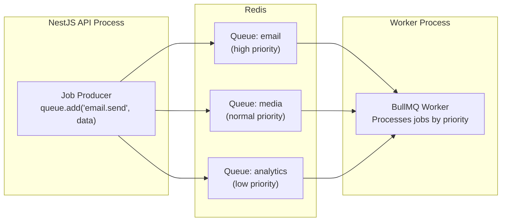
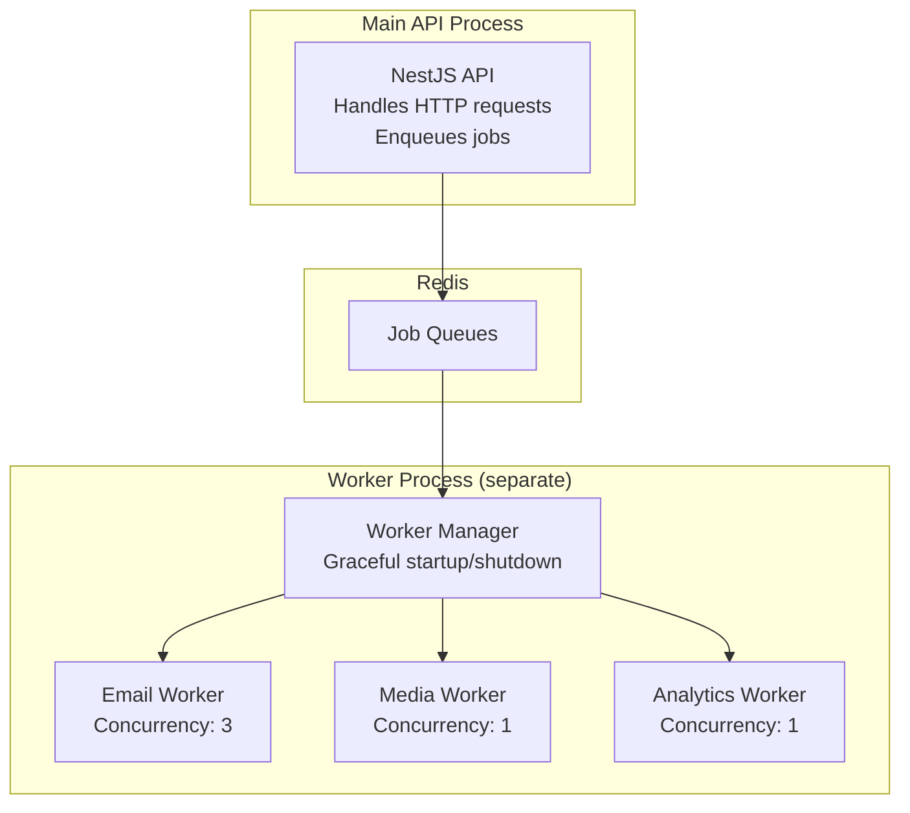

# Background Jobs — Queue & Worker Architecture

> **Document:** `47-BACKGROUND-JOBS.md` | **Version:** 1.1 | **Last Updated:** June 2026  
> **Status:** ✅ Active | **Owner:** Staff Backend Architect | **Review Cadence:** Quarterly  
> **Related:** [46-EVENT-ARCHITECTURE.md](./46-EVENT-ARCHITECTURE.md) | [SystemArchitecture.md](./SystemArchitecture.md)

---

## Executive Summary

The background jobs architecture handles 14 distinct job types across email, media processing, analytics, AI embedding, cache revalidation, system health, cleanup, and notifications. Jobs are routed through priority queues (BullMQ with Redis for NestJS, Celery with Redis for FastAPI) with configurable concurrency, retry policies with exponential backoff, and dead-letter logging. A lightweight in-process fallback queue eliminates Redis dependency for initial deployment. Cron scheduling handles nightly maintenance (session cleanup, analytics aggregation, chat cleanup) at 01:00-04:00 UTC. Graceful shutdown procedures ensure active jobs complete before worker termination.

---

## 1. Job Types

### 1.1 Job Inventory

| Job Name | Service | Trigger | Priority | Avg Duration |
|----------|---------|---------|:--------:|:------------:|
| `email.send_auto_reply` | NestJS | `lead.created` event | 🔴 High | < 2s |
| `email.send_admin_notification` | NestJS | `lead.created` event | 🔴 High | < 2s |
| `email.send_digest` | NestJS | Daily cron (08:00 UTC) | 🟡 Normal | < 5s |
| `media.optimize_image` | NestJS | `media.uploaded` event | 🟡 Normal | 5-30s |
| `media.generate_thumbnails` | NestJS | `media.uploaded` event | 🟡 Normal | 3-10s |
| `analytics.aggregate_daily` | NestJS | Daily cron (02:00 UTC) | 🟢 Low | 30-60s |
| `analytics.cleanup_old` | NestJS | Daily cron (03:00 UTC) | 🟢 Low | 10-60s |
| `ai.generate_embeddings` | FastAPI | Content change event | 🟡 Normal | 10-30s |
| `ai.rebuild_index` | FastAPI | Admin trigger | 🟢 Low | 2-5min |
| `ai.cleanup_expired_chats` | FastAPI | Daily cron (04:00 UTC) | 🟢 Low | 5-30s |
| `cache.revalidate_isr` | NestJS | Content change event | 🔴 High | < 1s |
| `system.health_check` | NestJS | Every 5 minutes | 🟡 Normal | < 2s |
| `system.session_cleanup` | NestJS | Daily cron (01:00 UTC) | 🟢 Low | 5-30s |
| `notification.send_telegram` | NestJS | `lead.created` event | 🟡 Normal | < 2s |

---

## 2. Queue Technology

### 2.1 v1.0 — BullMQ + Redis (NestJS)



**Configuration:**
```typescript
// NestJS BullMQ module registration
@Module({
  imports: [
    BullModule.forRoot({
      connection: { host: process.env.REDIS_HOST, port: 6379 },
    }),
    BullModule.registerQueue(
      { name: 'email', defaultJobOptions: { priority: 1, attempts: 3 } },
      { name: 'media', defaultJobOptions: { priority: 5, attempts: 2 } },
      { name: 'analytics', defaultJobOptions: { priority: 10, attempts: 1 } },
    ),
  ],
})
```

### 2.2 v1.0 Alternative — In-Process (No Redis)

For initial deployment without Redis (cost optimization):

```typescript
// Simple in-process job queue using setTimeout + event emitter
class SimpleJobQueue {
  async enqueue(jobName: string, data: any, options?: { delay?: number }) {
    if (options?.delay) {
      setTimeout(() => this.process(jobName, data), options.delay);
    } else {
      setImmediate(() => this.process(jobName, data));
    }
  }
}
```

### 2.3 FastAPI — Celery with Redis (AI Service)

```python
# FastAPI Celery configuration
from celery import Celery

celery_app = Celery('ai_service', broker='redis://localhost:6379/1')

@celery_app.task(bind=True, max_retries=3)
def generate_embeddings(self, document_id: str):
    """Generate vector embeddings for a document chunk."""
    try:
        chunk = get_document_chunk(document_id)
        embedding = openai.embeddings.create(input=chunk.content, model="text-embedding-3-small")
        store_embedding(document_id, embedding)
    except Exception as exc:
        self.retry(exc=exc, countdown=2 ** self.request.retries)
```

---

## 3. Job Scheduling

### 3.1 Cron Schedule

| Cron Expression | Time (UTC) | Job | Description |
|----------------|:----------:|-----|-------------|
| `0 1 * * *` | 01:00 | `system.session_cleanup` | Delete expired sessions |
| `0 2 * * *` | 02:00 | `analytics.aggregate_daily` | Aggregate daily analytics |
| `0 3 * * *` | 03:00 | `analytics.cleanup_old` | Delete analytics > 1 year |
| `0 4 * * *` | 04:00 | `ai.cleanup_expired_chats` | Delete chats > 30 days |
| `0 8 * * 1` | 08:00 Mon | `email.send_digest` | Weekly lead digest to admin |
| `*/5 * * * *` | Every 5min | `system.health_check` | Check all service health |

### 3.2 Retry Policies

| Job Category | Max Retries | Backoff | Dead Letter |
|-------------|:----------:|---------|:-----------:|
| Email sending | 3 | Exponential (1s, 2s, 4s) | ✅ Log + alert |
| Image processing | 2 | Fixed (5s) | ✅ Log original URL |
| Analytics aggregation | 1 | None | ❌ Skip, retry next day |
| AI embeddings | 3 | Exponential (2s, 4s, 8s) | ✅ Log + manual retry |
| Cache revalidation | 1 | None | ❌ Will self-heal on next request |

---

## 4. Worker Architecture

### 4.1 Worker Process Design



### 4.2 Concurrency Limits

| Queue | Concurrency | Rationale |
|-------|:----------:|-----------|
| `email` | 3 | Resend API allows 10 req/s on free tier |
| `media` | 1 | Image processing is CPU-intensive |
| `analytics` | 1 | Database writes, sequential for ordering |
| `ai_embeddings` | 2 | OpenAI API allows concurrent calls |
| `cache` | 5 | Vercel ISR revalidation is fast |

### 4.3 Graceful Shutdown

```typescript
// Worker graceful shutdown handler
process.on('SIGTERM', async () => {
  console.log('SIGTERM received, closing workers...');
  
  // 1. Stop accepting new jobs
  await worker.close();
  
  // 2. Wait for active jobs to complete (30s timeout)
  await Promise.race([
    worker.waitForCompletion(),
    new Promise(resolve => setTimeout(resolve, 30000)),
  ]);
  
  // 3. Close Redis connection
  await redis.quit();
  
  process.exit(0);
});
```

---

## Change Log

| Version | Date | Changes | Author |
|---------|------|---------|--------|
| 1.1 | Jun 2026 | Added Executive Summary, Decision Log, Risk Register, Glossary | Chief Architect |
| 1.0 | Jun 2026 | Initial background jobs doc — 14 job types, queue architecture, scheduling, worker design | Staff Backend Architect |

---

## Decision Log

| ID | Decision | Rationale | Alternatives Considered | Date | Approver |
|----|----------|-----------|------------------------|------|----------|
| D-BJ-001 | Use BullMQ + Redis for NestJS job queue | Proven library with priority queues, retries, and delayed jobs; tight NestJS integration via @nestjs/bull | Celery for NestJS (rejected — Python-centric, not idiomatic TS); AWS SQS (rejected — vendor lock-in, added cost); in-process only (rejected — no persistence across restarts) | Jun 2026 | Staff Backend Architect |
| D-BJ-002 | Offer in-process queue (no Redis) as initial deployment alternative | Eliminates Redis dependency (cost $0/mo tier limited); enables rapid prototyping without additional infrastructure | Require Redis always (rejected — unnecessary barrier for MVP); use SQL-based queue (rejected — poll-based, poor throughput) | Jun 2026 | Staff Backend Architect |
| D-BJ-003 | Use Celery + Redis for FastAPI AI service | Celery is the de-facto Python async task library; Redis is shared infrastructure already available | Dramatiq (rejected — smaller community); Huey (rejected — fewer features); direct threading (rejected — no persistence, no monitoring) | Jun 2026 | Staff Backend Architect |
| D-BJ-004 | Schedule cron jobs at 01:00-04:00 UTC for maintenance tasks | Low-traffic window (US nighttime); completes before business hours | Random times throughout day (rejected — interference with peak traffic); single batch window (rejected — resource contention) | Jun 2026 | Staff Backend Architect |
| D-BJ-005 | Use exponential backoff for transient failures and fixed backoff for predictable operations | Exponential backoff prevents thundering herd on rate-limited APIs; fixed backoff sufficient for CPU-bound operations | All exponential (rejected — overkill for image processing); all fixed (rejected — inefficient for API retries); no retry (rejected — unreliable) | Jun 2026 | Staff Backend Architect |
| D-BJ-006 | Graceful shutdown with 30s completion timeout | Balances data integrity (complete active jobs) with fast deployment rollouts | No graceful shutdown (rejected — job data loss); infinite wait (rejected — blocks deployment) | Jun 2026 | Staff Backend Architect |

## Risk Register

| ID | Risk | Likelihood | Impact | Mitigation |
|----|------|------------|--------|------------|
| R-BJ-001 | Redis goes down, all queues become non-functional | Low | Critical | In-process queue fallback auto-activated on Redis connection failure; alert on failover |
| R-BJ-002 | Long-running image optimization jobs (30s+) block queue processing for other job types | Medium | Medium | Separate high-priority and low-priority queues; image processing on dedicated queue with concurrency=1 |
| R-BJ-003 | Dead-letter jobs accumulate without cleanup, consuming Redis memory | Low | Low | Implement dead-letter TTL (7 days); add monitoring alert when dead-letter count exceeds 100 |
| R-BJ-004 | OpenAI API rate limiting causes AI embedding generation to fail repeatedly | Medium | Medium | Exponential backoff starts at 2s; max 3 retries; alternate embedding model fallback (text-embedding-ada-002) |
| R-BJ-005 | Worker process crashes mid-job without completing, breaking data consistency | Low | High | Use BullMQ job completion acknowledgement; implement idempotent job handlers; log failed job IDs for manual replay |

## Glossary

| Term | Definition |
|------|------------|
| **BullMQ** | A Redis-based queue library for Node.js with support for priorities, delays, retries, and job scheduling |
| **Celery** | A distributed task queue library for Python that runs asynchronous jobs outside the HTTP request-response cycle |
| **Dead Letter Queue (DLQ)** | A queue that stores jobs that have exhausted their retry attempts, for manual inspection and reprocessing |
| **TTL** | Time To Live — the maximum time a message or cache entry is retained before automatic deletion |
| **Thundering Herd** | A pattern where many clients simultaneously retry a failed operation, overwhelming the downstream service |
| **Backoff** | A delay strategy between retry attempts; exponential backoff doubles the delay after each attempt |
| **Concurrency** | The number of jobs a worker processes simultaneously; constrained by resource limits and operation type |
| **Graceful Shutdown** | A process termination sequence that waits for active work to complete before exiting |
| **SIGTERM** | A POSIX signal requesting a process to terminate gracefully, allowing cleanup before exit |
| **Cron Expression** | A time-based scheduling format (minute, hour, day-of-month, month, day-of-week) for periodic job execution |
| **Idempotency** | The property that executing an operation multiple times produces the same result as executing it once |
| **Broker** | The intermediary (e.g., Redis, RabbitMQ) that holds messages in transit between producers and consumers |

---

*Document Version: 1.1 — Enterprise Edition*

---

## Cross-References

| Reference | Description |
|-----------|-------------|
| See MASTER-INDEX.md | Full document dependency graph and cross-reference map |

---

## Cross-References

| Reference | Description |
|-----------|-------------|
| docs/MASTER-INDEX.md | Full document dependency graph and cross-reference map |
