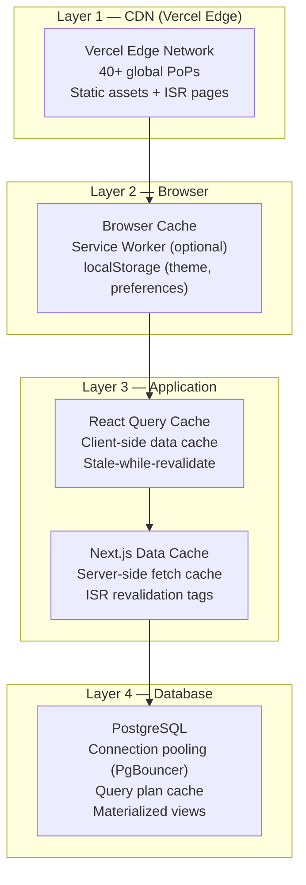
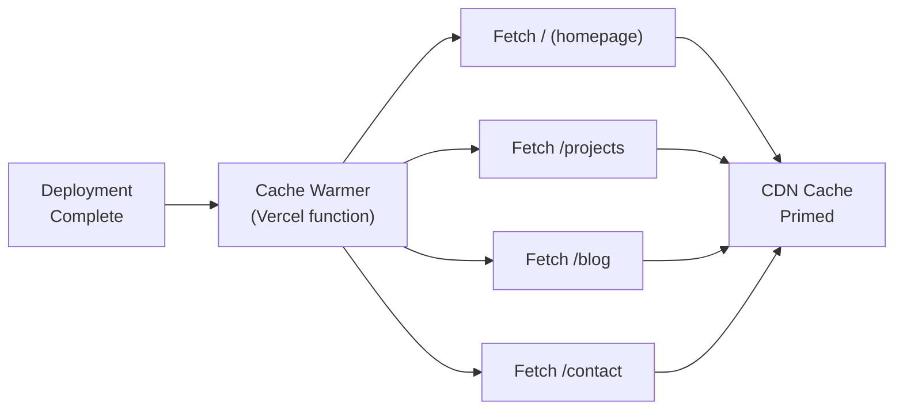

# Cache Architecture — CDN, ISR, and Application Caching

> **Document:** `49-CACHE-ARCHITECTURE.md` | **Version:** 1.1 | **Last Updated:** June 2026  
> **Status:** ✅ Active | **Owner:** Staff Frontend Architect | **Review Cadence:** Quarterly  
> **Related:** [SystemArchitecture.md](./SystemArchitecture.md) | [PerformanceArchitecture.md](./PerformanceArchitecture.md)

---

## Executive Summary

The cache architecture spans four layers: CDN (Vercel Edge Network, 40+ global PoPs), browser (localStorage for preferences, optional service worker), application (React Query client-side cache with stale-while-revalidate, Next.js Data Cache with ISR revalidation tags), and database (PgBouncer connection pooling, query plan cache, materialized views). Public pages use ISR with 60s revalidation; static assets get 365-day immutable caching via content-hashed filenames; admin and API routes bypass cache entirely. On-demand invalidation uses `revalidateTag()` triggered by content CRUD events, React Query `invalidateQueries()`, and localStorage clearing. Key targets: CDN cache hit ratio > 95%, ISR revalidation < 200ms, and cached TTFB < 50ms.

---

## 1. Cache Layer Overview



---

## 2. CDN Layer (Vercel Edge Network)

### 2.1 Cache Rules

| Route Pattern           | Cache Strategy |   TTL    |           Revalidation            |
| ----------------------- | :------------: | :------: | :-------------------------------: |
| `/_next/static/*`       |   Immutable    | 365 days |     Content-hashed filenames      |
| `/images/*`, `/fonts/*` |     Static     | 365 days |     Content-hashed filenames      |
| `/` (homepage)          |      ISR       |   60s    |    `revalidateTag('homepage')`    |
| `/projects`             |      ISR       |   60s    |    `revalidateTag('projects')`    |
| `/projects/[slug]`      |      ISR       |   60s    | `revalidateTag('project-{slug}')` |
| `/blog`                 |      ISR       |   60s    |      `revalidateTag('blog')`      |
| `/blog/[slug]`          |      ISR       |   60s    |  `revalidateTag('post-{slug}')`   |
| `/contact`              |      ISR       |  3600s   |    `revalidateTag('contact')`     |
| `/admin/*`              |    No cache    |    0     |           N/A (dynamic)           |
| `/api/*`                |    No cache    |    0     |           N/A (dynamic)           |

### 2.2 Cache Headers

```typescript
// Public pages — ISR with stale-while-revalidate
export const revalidate = 60; // seconds

// Static assets — immutable (Next.js auto-adds content hash)
// /_next/static/chunks/main-abc123.js
// Cache-Control: public, max-age=31536000, immutable

// API responses — no cache
// Cache-Control: no-store, no-cache, must-revalidate

// Admin pages — no cache
// Cache-Control: no-store, no-cache, must-revalidate, private
```

---

## 3. Browser Layer

### 3.1 localStorage Cache

| Key                 | Data                       |    TTL     | Purpose                     |
| ------------------- | -------------------------- | :--------: | --------------------------- |
| `theme`             | `"dark"` or `"light"`      | Indefinite | User preference persistence |
| `cookie_consent`    | `{ analytics: true, ... }` | Indefinite | GDPR consent state          |
| `sidebar_collapsed` | `true` / `false`           | Indefinite | Admin sidebar preference    |
| `recent_searches`   | `["react", "dashboard"]`   |  30 days   | Search autocomplete history |

### 3.2 Service Worker (Optional — PWA Enhancement)

```typescript
// Cache-first for static assets, network-first for API
const CACHE_STRATEGY = {
  '/_next/static/': 'cache-first', // Immutable assets
  '/images/': 'cache-first', // Media assets
  '/api/': 'network-first', // Dynamic API calls
  '/': 'stale-while-revalidate', // HTML pages
};
```

---

## 4. Application Layer

### 4.1 React Query (Client-Side)

```typescript
// React Query configuration for admin dashboard
const queryClient = new QueryClient({
  defaultOptions: {
    queries: {
      staleTime: 30_000, // 30s — data considered fresh
      gcTime: 5 * 60_000, // 5min — garbage collect after unmount
      refetchOnWindowFocus: true,
      retry: 1,
    },
  },
});

// Query key conventions
const queryKeys = {
  sections: ['sections'] as const,
  section: (id: string) => ['sections', id] as const,
  projects: (filters?: ProjectFilters) => ['projects', filters] as const,
  project: (slug: string) => ['projects', 'detail', slug] as const,
  leads: (filters?: LeadFilters) => ['leads', filters] as const,
  analytics: (range: DateRange) => ['analytics', range] as const,
};
```

### 4.2 Next.js Data Cache (Server-Side)

```typescript
// Fetch with ISR revalidation tags
async function getProjects() {
  const { data } = await supabase
    .from('projects')
    .select('*')
    .eq('is_private', false)
    .order('display_order');

  return data;
}

// In page component
export default async function ProjectsPage() {
  const projects = await getProjects();
  return <ProjectGrid projects={projects} />;
}

// On-demand revalidation (called after admin update)
export async function revalidateProjects() {
  revalidateTag('projects');
  revalidatePath('/projects');
}
```

---

## 5. Cache Invalidation

### 5.1 Invalidation Matrix

| Event                     |          CDN (ISR)          |            React Query            |            Browser            |
| ------------------------- | :-------------------------: | :-------------------------------: | :---------------------------: |
| Admin updates section     | `revalidateTag('homepage')` | `invalidateQueries(['sections'])` |              N/A              |
| Admin publishes project   | `revalidateTag('projects')` | `invalidateQueries(['projects'])` |              N/A              |
| Admin publishes blog post |   `revalidateTag('blog')`   |   `invalidateQueries(['blog'])`   |              N/A              |
| Admin changes settings    |             N/A             | `invalidateQueries(['settings'])` | Clear `localStorage.settings` |
| User changes theme        |             N/A             |                N/A                |  Update `localStorage.theme`  |

### 5.2 Cache Warming



---

## 6. Cache Monitoring

### 6.1 Key Metrics

| Metric                      | Target  | Alert Threshold |
| --------------------------- | :-----: | :-------------: |
| CDN cache hit ratio         |  > 95%  |      < 80%      |
| ISR revalidation latency    | < 200ms |      > 1s       |
| React Query cache hit ratio |  > 80%  |      < 50%      |
| Database query cache hit    |  > 90%  |      < 70%      |
| Average TTFB (cached)       | < 50ms  |     > 200ms     |
| Average TTFB (uncached)     | < 500ms |      > 2s       |

---

## Change Log

| Version | Date     | Changes                                                                     | Author                   |
| ------- | -------- | --------------------------------------------------------------------------- | ------------------------ |
| 1.1     | Jun 2026 | Added Executive Summary, Decision Log, Risk Register, Glossary              | Chief Architect          |
| 1.0     | Jun 2026 | Initial cache architecture — CDN, browser, React Query, invalidation matrix | Staff Frontend Architect |

---

## Decision Log

| ID          | Decision                                                                             | Rationale                                                                                                                  | Alternatives Considered                                                                                                                                                                         | Date     | Approver                 |
| ----------- | ------------------------------------------------------------------------------------ | -------------------------------------------------------------------------------------------------------------------------- | ----------------------------------------------------------------------------------------------------------------------------------------------------------------------------------------------- | -------- | ------------------------ |
| D-CACHE-001 | Use ISR with 60s revalidation for public pages                                       | Balances freshness with performance; visitors see stale content for at most 60s after admin updates                        | SSR every request (rejected — no caching benefit, higher server load); SSG with manual rebuild (rejected — content changes require redeployment); 300s TTL (rejected — too stale)               | Jun 2026 | Staff Frontend Architect |
| D-CACHE-002 | Use on-demand revalidation via `revalidateTag()` rather than time-based revalidation | Content changes trigger immediate cache invalidation; no need to wait for TTL expiry                                       | Time-based only (rejected — stale content persists until TTL expires); webhook-based (rejected — additional infrastructure for webhook receiver)                                                | Jun 2026 | Staff Frontend Architect |
| D-CACHE-003 | Cache static assets with 365-day immutable header using content-hashed filenames     | Next.js auto-generates content hashes; browser never re-fetches unchanged assets; optimal cache hit rate                   | Short TTL with ETag validation (rejected — unnecessary round trips for unchanged assets); no cache (rejected — poor performance)                                                                | Jun 2026 | Staff Frontend Architect |
| D-CACHE-004 | Use React Query (TanStack Query) for client-side data caching                        | Industry standard for React data fetching; stale-while-revalidate pattern; built-in cache invalidation, retry, and refetch | SWR (rejected — similar but fewer features); useState + useEffect manually (rejected — no caching, invalidation, or retry built in); Redux Toolkit Query (rejected — heavier, more boilerplate) | Jun 2026 | Staff Frontend Architect |
| D-CACHE-005 | Admin routes and API endpoints use no caching                                        | Admin pages must always show current state; API responses include dynamic data that must not be stale                      | Short TTL (rejected — still risks stale admin data); conditional caching based on user role (rejected — complexity not justified)                                                               | Jun 2026 | Staff Frontend Architect |
| D-CACHE-006 | Implement cache warming on deployment                                                | Prevents cold-cache TTFB spikes after deployment; ensures first visitors after deploy get good performance                 | No cache warming (rejected — first visitors after deploy suffer 500ms+ TTFB); warming all pages (rejected — unnecessary for rarely-visited pages)                                               | Jun 2026 | Staff Frontend Architect |

## Risk Register

| ID          | Risk                                                                                          | Likelihood | Impact | Mitigation                                                                                                                            |
| ----------- | --------------------------------------------------------------------------------------------- | ---------- | ------ | ------------------------------------------------------------------------------------------------------------------------------------- |
| R-CACHE-001 | ISR revalidation failure causes stale content to persist beyond 60s                           | Low        | Medium | Add health check that verifies revalidation completes within 200ms; fallback to SSR if revalidation consistently fails                |
| R-CACHE-002 | CDN cache hit ratio drops below 80% due to uncacheable dynamic content                        | Low        | Medium | Audit route patterns quarterly; ensure only truly dynamic routes bypass cache; add CDN analytics monitoring                           |
| R-CACHE-003 | Browser localStorage quota exceeded by cached data                                            | Low        | Low    | Cap localStorage entries at 10 items; implement LRU eviction for recent_searches; monitor usage via storage event                     |
| R-CACHE-004 | Cache invalidation cascade failure — one content update triggers excessive revalidation calls | Medium     | Low    | Debounce rapid content updates (200ms window); batch revalidation calls; implement invalidation deduplication                         |
| R-CACHE-005 | Post-deploy cache warming fails or times out, leaving CDN cold for first visitors             | Low        | Medium | Implement warming retry (3 attempts); warming runs as background job with 30s timeout; monitor warm completion in deploy health check |

## Glossary

| Term                       | Definition                                                                                                                                                |
| -------------------------- | --------------------------------------------------------------------------------------------------------------------------------------------------------- |
| **ISR**                    | Incremental Static Regeneration — a Next.js rendering strategy that serves pre-rendered static pages while regenerating them in the background when stale |
| **SSR**                    | Server-Side Rendering — rendering pages dynamically on each HTTP request                                                                                  |
| **SSG**                    | Static Site Generation — pre-rendering pages at build time for serving as static files                                                                    |
| **CDN**                    | Content Delivery Network — a distributed network of proxy servers that serve cached content from locations closer to the user                             |
| **PoP**                    | Point of Presence — a physical location where a CDN has servers to serve edge traffic                                                                     |
| **TTFB**                   | Time to First Byte — the time from the request being made until the first byte of the response is received                                                |
| **Stale-While-Revalidate** | A caching strategy that serves stale (cached) data immediately while fetching fresh data in the background                                                |
| **Revalidation Tag**       | A string identifier attached to cached data in Next.js Data Cache, used for selective on-demand invalidation                                              |
| **LRU Eviction**           | Least Recently Used — a cache eviction policy that removes the least recently accessed items when the cache is full                                       |
| **ETag**                   | An HTTP response header that identifies a specific version of a resource for conditional cache validation                                                 |
| **Cache Warming**          | Pre-fetching pages into the CDN cache immediately after deployment to prevent cold-cache latency for first visitors                                       |
| **Content Hash**           | A hash derived from file content used in filenames to enable long-term caching — changing content produces a different hash and URL                       |

---

_Document Version: 1.1 — Enterprise Edition_

---

## Cross-References

| Reference           | Description                                            |
| ------------------- | ------------------------------------------------------ |
| See MASTER-INDEX.md | Full document dependency graph and cross-reference map |

---

## Cross-References

| Reference            | Description                                            |
| -------------------- | ------------------------------------------------------ |
| docs/MASTER-INDEX.md | Full document dependency graph and cross-reference map |
