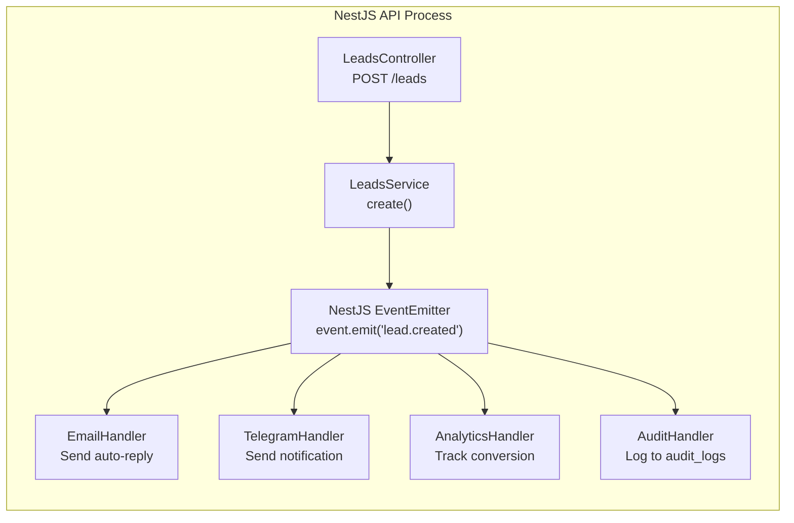
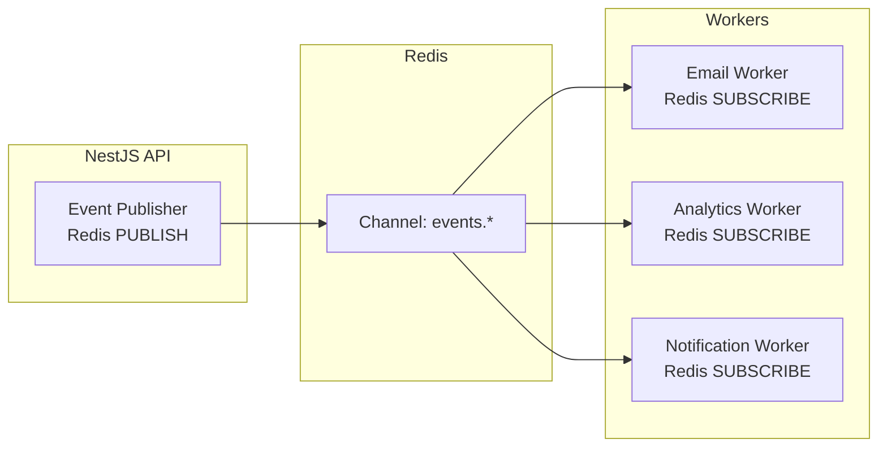

# Event Architecture — Domain Events & Async Patterns

> **Document:** `46-EVENT-ARCHITECTURE.md` | **Version:** 1.1 | **Last Updated:** June 2026  
> **Status:** ✅ Active | **Owner:** Staff Backend Architect | **Review Cadence:** Quarterly  
> **Related:** [SystemArchitecture.md](./SystemArchitecture.md) | [12-API.md](./12-API.md) | [47-BACKGROUND-JOBS.md](./47-BACKGROUND-JOBS.md)

---

## Executive Summary

The event architecture defines 20 domain events across 6 source modules (Leads, Content, Auth, Analytics, AI, Media, Monitoring) with a standardized event envelope including event_type, event_id, timestamp, source, correlation_id, actor, payload, and metadata. The v1.0 implementation uses NestJS EventEmitter2 for in-process event handling with synchronous handler chains, while v2.0 migrates to Redis Pub/Sub for cross-process distribution. Handler chains are ordered with failure strategies ranging from retry (email sending, 3x exponential backoff) to fire-and-forget (telegram notifications, PostHog tracking) to must-succeed (audit logging). Content change events trigger cascading side effects: ISR cache revalidation, RAG embedding generation, and RSS feed regeneration. Five async processing patterns (fire-and-forget, retry with backoff, request-reply, saga, scheduled cron) cover all event handling requirements.

---

## 1. Domain Events Catalog

### 1.1 Event Inventory

| Event Name                   | Source                 | Trigger                                 | Priority  |
| ---------------------------- | ---------------------- | --------------------------------------- | :-------: |
| `lead.created`               | NestJS LeadsModule     | Contact form submission                 |  🔴 High  |
| `lead.status_changed`        | NestJS LeadsModule     | Admin updates lead status               | 🟡 Normal |
| `lead.exported`              | NestJS LeadsModule     | Admin exports leads to CSV              |  🟢 Low   |
| `section.updated`            | NestJS ContentModule   | Admin edits section content             | 🟡 Normal |
| `section.reordered`          | NestJS ContentModule   | Admin changes section display_order     | 🟡 Normal |
| `section.visibility_changed` | NestJS ContentModule   | Admin toggles is_live flag              |  🔴 High  |
| `project.created`            | NestJS ContentModule   | Admin creates new project               | 🟡 Normal |
| `project.published`          | NestJS ContentModule   | Admin sets is_private=false             | 🟡 Normal |
| `project.deleted`            | NestJS ContentModule   | Admin deletes project                   | 🟡 Normal |
| `blog.published`             | NestJS ContentModule   | Admin sets published=true               | 🟡 Normal |
| `blog.unpublished`           | NestJS ContentModule   | Admin sets published=false              | 🟡 Normal |
| `user.logged_in`             | NestJS AuthModule      | Admin successful login                  |  🔴 High  |
| `user.logged_out`            | NestJS AuthModule      | Admin explicit logout                   |  🟢 Low   |
| `user.token_refreshed`       | NestJS AuthModule      | Access token refreshed                  |  🟢 Low   |
| `analytics.event_batched`    | NestJS AnalyticsModule | Analytics events batch received         |  🟢 Low   |
| `ai.chat_completed`          | FastAPI ChatService    | AI chat response generated              |  🟢 Low   |
| `ai.embedding_generated`     | FastAPI RAGService     | New document chunk embedded             |  🟢 Low   |
| `media.uploaded`             | NestJS MediaModule     | File uploaded to Supabase Storage       |  🟢 Low   |
| `media.deleted`              | NestJS MediaModule     | File soft-deleted from storage          |  🟢 Low   |
| `system.health_check_failed` | Monitoring Service     | Health check endpoint returns unhealthy |  🔴 High  |

---

## 2. Event Schema

### 2.1 Event Envelope Standard

```typescript
interface DomainEvent<T = Record<string, unknown>> {
  event_type: string; // e.g., "lead.created"
  event_id: string; // UUID v4, globally unique
  timestamp: string; // ISO 8601 UTC
  source: string; // Service name: "api" | "ai" | "web"
  correlation_id: string; // Request trace ID
  actor: {
    id: string | null; // User ID (null for anonymous)
    role: 'admin' | 'visitor';
    ip: string; // Request IP
  };
  payload: T; // Event-specific data
  metadata: {
    version: string; // Event schema version: "1.0"
    environment: string; // "development" | "staging" | "production"
  };
}
```

### 2.2 Example: `lead.created` Event

```json
{
  "event_type": "lead.created",
  "event_id": "evt_a1b2c3d4-e5f6-7890-abcd-ef1234567890",
  "timestamp": "2026-06-17T06:00:00.000Z",
  "source": "api",
  "correlation_id": "req_xyz789",
  "actor": {
    "id": null,
    "role": "visitor",
    "ip": "203.0.113.42"
  },
  "payload": {
    "lead_id": "lead_123",
    "name": "John Doe",
    "email": "john@example.com",
    "subject": "Project Inquiry",
    "source": "contact_form"
  },
  "metadata": {
    "version": "1.0",
    "environment": "production"
  }
}
```

---

## 3. Event Bus Architecture

### 3.1 v1.0 — In-Process EventEmitter (NestJS)



**Implementation:**

```typescript
// NestJS EventEmitter (in-process)
@Module({
  imports: [EventEmitterModule.forRoot()],
})
export class AppModule {}

// Emitting events
@Injectable()
export class LeadsService {
  constructor(private eventEmitter: EventEmitter2) {}

  async createLead(dto: CreateLeadDto) {
    const lead = await this.supabase.from('leads').insert(dto);
    this.eventEmitter.emit('lead.created', { lead_id: lead.id, ...dto });
    return lead;
  }
}

// Handling events
@Injectable()
export class EmailEventHandler {
  @OnEvent('lead.created')
  async handleLeadCreated(payload: LeadCreatedPayload) {
    await this.emailService.sendAutoReply(payload.email, payload.name);
    await this.emailService.notifyAdmin(payload);
  }
}
```

### 3.2 v2.0 — Redis Pub/Sub (Upgrade Path)

When scaling beyond single process or adding real-time features:



---

## 4. Event Handlers

### 4.1 `lead.created` Handler Chain

| Order | Handler            | Action                          |    Failure Strategy     |
| :---: | ------------------ | ------------------------------- | :---------------------: |
|   1   | `EmailHandler`     | Send auto-reply to visitor      |  Retry 3x, log failure  |
|   2   | `EmailHandler`     | Send notification to admin      |  Retry 3x, log failure  |
|   3   | `TelegramHandler`  | Send Telegram alert (optional)  |     Fire-and-forget     |
|   4   | `AnalyticsHandler` | Track `lead_created` in PostHog |     Fire-and-forget     |
|   5   | `AuditHandler`     | Insert into `audit_logs` table  | Must succeed (critical) |

### 4.2 Content Change Handlers

| Event               | Handler        | Action                                           |
| ------------------- | -------------- | ------------------------------------------------ |
| `section.updated`   | `CacheHandler` | Trigger ISR revalidation (`revalidatePath('/')`) |
| `project.published` | `CacheHandler` | Revalidate project listing + detail pages        |
| `project.published` | `RAGHandler`   | Generate embeddings for new project content      |
| `blog.published`    | `CacheHandler` | Revalidate blog listing + new post page          |
| `blog.published`    | `RSSHandler`   | Regenerate RSS feed                              |
| `blog.published`    | `RAGHandler`   | Generate embeddings for blog content             |

---

## 5. Async Processing Patterns

### 5.1 Pattern Selection Guide

| Pattern                | Use When                                          | Example                                          |
| ---------------------- | ------------------------------------------------- | ------------------------------------------------ |
| **Fire-and-Forget**    | Result not needed, failure tolerable              | Telegram notification, PostHog tracking          |
| **Retry with Backoff** | Operation should succeed but may transiently fail | Email sending (Resend API)                       |
| **Request-Reply**      | Caller needs async result                         | AI content analysis (returns score)              |
| **Saga**               | Multi-step transaction across services            | Lead creation → email → notification → analytics |

### 5.2 Retry Policy

```typescript
const RETRY_POLICY = {
  maxRetries: 3,
  initialDelay: 1000, // 1 second
  backoffMultiplier: 2, // Exponential: 1s, 2s, 4s
  maxDelay: 10000, // Cap at 10 seconds
  retryableErrors: [
    // Only retry transient errors
    'ECONNRESET',
    'ETIMEDOUT',
    'ECONNREFUSED',
    'HTTP_429',
    'HTTP_500',
    'HTTP_502',
    'HTTP_503',
  ],
};
```

---

## Change Log

| Version | Date     | Changes                                                                                     | Author                  |
| ------- | -------- | ------------------------------------------------------------------------------------------- | ----------------------- |
| 1.1     | Jun 2026 | Added Executive Summary, Decision Log, Risk Register, Glossary                              | Chief Architect         |
| 1.0     | Jun 2026 | Initial event architecture — 20 domain events, event schema, handler chains, async patterns | Staff Backend Architect |

---

## Decision Log

| ID        | Decision                                                                                               | Rationale                                                                                                                  | Alternatives Considered                                                                                                                                                                          | Date     | Approver                |
| --------- | ------------------------------------------------------------------------------------------------------ | -------------------------------------------------------------------------------------------------------------------------- | ------------------------------------------------------------------------------------------------------------------------------------------------------------------------------------------------ | -------- | ----------------------- |
| D-EVT-001 | Use NestJS EventEmitter2 for v1.0 in-process event handling                                            | Zero infrastructure requirements; tight NestJS module integration; sufficient for single-process deployment                | Redis Pub/Sub for v1.0 (rejected — unnecessary infrastructure dependency); Kafka (rejected — overkill for portfolio-scale event volume); RabbitMQ (rejected — operational overhead)              | Jun 2026 | Staff Backend Architect |
| D-EVT-002 | Define Redis Pub/Sub as v2.0 upgrade path for cross-process distribution                               | Adds horizontal scalability without architectural rewrite; same Redis instance used by BullMQ queues                       | Skip v2.0 planning entirely (rejected — no upgrade path locks architecture); jump to Kafka v2.0 (rejected — overkill, Redis Pub/Sub sufficient)                                                  | Jun 2026 | Staff Backend Architect |
| D-EVT-003 | Define standardized event envelope with actor, correlation_id, and metadata                            | Enables end-to-end tracing across services; consistent structure across all 20 event types simplifies handler code         | Loose event structure per module (rejected — hard to trace, no consistency); GraphQL subscription events (rejected — coupling event bus to API layer)                                            | Jun 2026 | Staff Backend Architect |
| D-EVT-004 | Order handler chains with differentiated failure strategies per handler                                | Critical handlers (audit_logs) must succeed; optional handlers (Telegram) can fail silently; matches operational reality   | All handlers must succeed (rejected — fragile, single failure blocks chain); all handlers fire-and-forget (rejected — data loss for audit)                                                       | Jun 2026 | Staff Backend Architect |
| D-EVT-005 | Use `revalidatePath('/')` (broad) rather than `revalidateTag('homepage')` (narrow) for section updates | Section content can appear anywhere on the homepage; broad invalidation is safer and simplicity outweighs performance cost | Per-section revalidation tags (rejected — complex mapping from section to page locations, high maintenance); no revalidation (rejected — stale content)                                          | Jun 2026 | Staff Backend Architect |
| D-EVT-006 | Implement retry policy with exponential backoff capped at 10s, retrying only specific error types      | Prevents retry storms on non-retryable errors (4xx client errors); cap prevents runaway retries                            | Retry all errors (rejected — would retry 400 Bad Request forever); no retry (rejected — transient network failures cause data loss); linear backoff (rejected — less efficient than exponential) | Jun 2026 | Staff Backend Architect |

## Risk Register

| ID        | Risk                                                                                                                                                 | Likelihood | Impact | Mitigation                                                                                                                                                  |
| --------- | ---------------------------------------------------------------------------------------------------------------------------------------------------- | ---------- | ------ | ----------------------------------------------------------------------------------------------------------------------------------------------------------- |
| R-EVT-001 | In-process EventEmitter2 fails silently — handler throws but event source doesn't know                                                               | Medium     | High   | Wrap all handlers in try-catch with structured error logging; use Sentry for exception tracking; audit logs capture handler success/failure                 |
| R-EVT-002 | Handler chain ordering is not guaranteed by EventEmitter2 — concurrent handlers may execute in unpredictable order                                   | Medium     | Medium | Design handlers to be order-independent where possible; use sequential handlers (await each) for critical chains like lead.created                          |
| R-EVT-003 | Redis Pub/Sub messages are not persisted — message lost if no subscriber is listening at publish time                                                | Low        | High   | Accept for v1.0 (single process, EventEmitter2 is synchronous); document that v2.0 Redis Pub/Sub upgrade should use BullMQ or Redis Streams for persistence |
| R-EVT-004 | Content change events cascade into multiple side effects (cache revalidation + RAG embedding) which could overload the system during bulk operations | Low        | Medium | Debounce rapid content changes (200ms window); batch revalidation calls; add concurrency limits for RAG embedding generation                                |
| R-EVT-005 | Event schema versioning drift — producers update event payload without updating consumers                                                            | Medium     | Medium | Use event_type as schema version key (e.g., lead.created.v1); maintain schema registry in event-versioning doc; enforce backward-compatible payload changes |

## Glossary

| Term                   | Definition                                                                                                                   |
| ---------------------- | ---------------------------------------------------------------------------------------------------------------------------- |
| **Domain Event**       | A record of something that happened in the system that domain experts care about (e.g., "lead created," "project published") |
| **Event Envelope**     | A standardized wrapper structure around event data containing metadata like event_type, timestamp, correlation_id, and actor |
| **EventEmitter2**      | A NestJS module providing in-process event publishing and subscription, used as the v1.0 event bus                           |
| **Pub/Sub**            | Publish/Subscribe — a messaging pattern where publishers emit events to channels and subscribers receive matching events     |
| **Correlation ID**     | A unique identifier attached to a request chain that spans across services, enabling end-to-end request tracing              |
| **Handler Chain**      | An ordered sequence of event handlers that execute in response to a single event, each with a specific responsibility        |
| **Fire-and-Forget**    | A fire-and-forget pattern where the caller does not wait for or depend on the result of the operation                        |
| **Retry with Backoff** | An error recovery pattern that retries a failed operation after a delay that increases with each attempt                     |
| **Saga**               | A sequence of local transactions where each transaction publishes an event that triggers the next step in the sequence       |
| **Dead Letter**        | A storage location for events that have exhausted their retry attempts, awaiting manual inspection and reprocessing          |
| **ISR Revalidation**   | Triggering Next.js Incremental Static Regeneration to update cached pages when underlying content changes                    |
| **RAG Handler**        | An event handler that generates vector embeddings for new or updated content, making it searchable via the RAG pipeline      |

---

_Document Version: 1.1 — Enterprise Edition_

---

## Cross-References

| Reference           | Description                                            |
| ------------------- | ------------------------------------------------------ |
| See MASTER-INDEX.md | Full document dependency graph and cross-reference map |

---

## Cross-References

| Reference            | Description                                            |
| -------------------- | ------------------------------------------------------ |
| docs/MASTER-INDEX.md | Full document dependency graph and cross-reference map |
