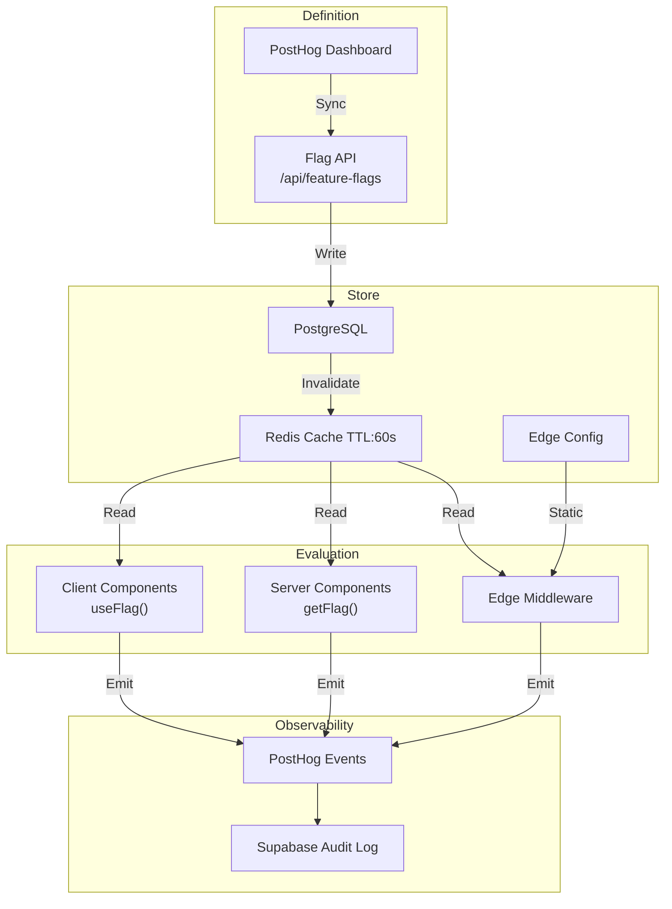
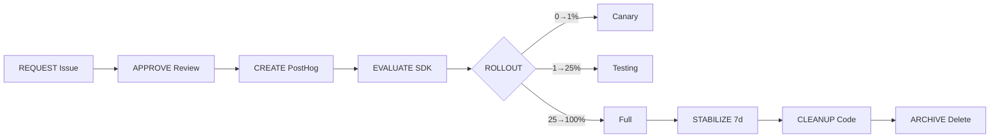
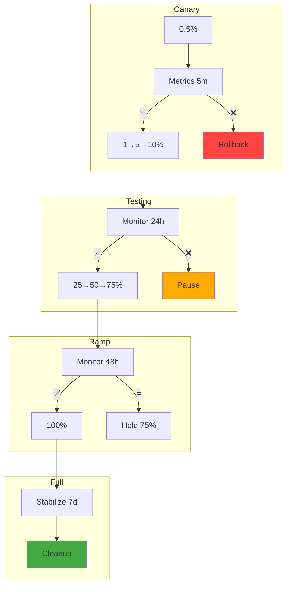
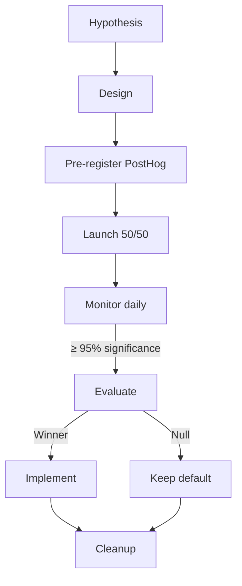
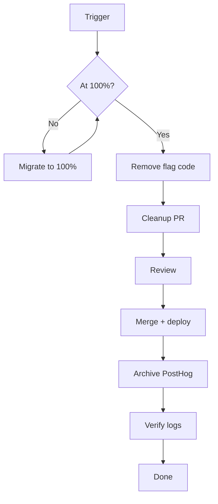

# Feature Flags & Toggle Strategy — Enterprise-Grade Rollout Management

> **Document:** `60-FEATURE-FLAGS.md` | **Version:** 1.0 | **Last Updated:** June 2026  
> **Status:** ✅ Active | **Owner:** Staff Platform Engineer | **Review Cadence:** Monthly  
> **Platform:** PostHog (flags) + LaunchDarkly-compatible pattern | **Flag Count Target:** ≤ 50 active  
> **Related:** [53-CI-CD-PIPELINE.md](./53-CI-CD-PIPELINE.md) | [AnalyticsArchitecture.md](./AnalyticsArchitecture.md) | [SystemArchitecture.md](./SystemArchitecture.md)

---

## 1. Executive Summary

Feature flags enable **safe, continuous delivery** by decoupling deployment from release. This strategy governs the full lifecycle — creation, evaluation, experimentation, and cleanup — across the Next.js portfolio platform.

**Why flags matter:** Trunk-based development (merge incomplete features), canary releases (new themes/layouts/AI), A/B experiments (CTA copy, hero variants), kill switches (instant disable without redeploy), permission gating (admin/beta features).

| Metric | Target | Measurement |
|--------|--------|-------------|
| Time-to-flag cleanup | ≤ 30 days post-release | PostHog flag age report |
| Active flag count | ≤ 50 | Monthly inventory audit |
| A/B experiment confidence | ≥ 95% | Statistical significance |
| Rollback time via kill switch | < 30 seconds | Toggle → full rollout off |
| Flag evaluation p50 latency | < 5ms | PostHog SDK metrics |

**Core principle:** Every flag is temporary. Flags without a cleanup date are technical debt.

---

## 2. Feature Flag Architecture




---

## 3. Flag Types

### 3.1 Release Flags

```typescript
const showTheme = await getFlag('release-theme-v2', {
  user: { id: session.userId }, defaultValue: false,
});
return showTheme ? <ThemeV2 /> : <ThemeV1 />;
```

| Property | Value |
|----------|-------|
| Prefix | `release-` |
| Default | `false` |
| Lifetime | ≤ 30 days |
| Targeting | Env, %, user IDs |

### 3.2 Experiment Flags

```typescript
const variant = await getFlagValue('exp-hero-cta', {
  user: { id: session.userId },
  defaultValue: 'control',
  variants: ['control', 'variant-a', 'variant-b'],
});
```

| Property | Value |
|----------|-------|
| Prefix | `exp-` |
| Variants | 2–5, equal split |
| Min sample | 1,000/variant |
| Confidence | ≥ 95% |

### 3.3 Ops Flags

```typescript
const enabled = await getFlag('ops-ai-chat', {
  user: { id: 'system' }, defaultValue: true,
});
if (!enabled) return NextResponse.redirect('/api/ai/disabled');
```

| Property | Value |
|----------|-------|
| Prefix | `ops-` |
| Lifetime | Indefinite |
| Access | Platform engineers |
| Eval | Every request |

### 3.4 Permission Flags

```typescript
const canAccess = await getFlag('perm-admin-beta', {
  user: { id: session.userId, groups: session.roles },
  defaultValue: false,
  targeting: [{ property: 'email', operator: 'endsWith', value: '@admin.dev' }],
});
```

| Property | Value |
|----------|-------|
| Prefix | `perm-` |
| Lifetime | Until GA |
| Targeting | Email, role, cohort |

---

## 4. Flag Lifecycle



| Phase | Gate | Owner | Duration |
|-------|------|-------|----------|
| Request | GitHub Issue | Engineer | — |
| Approve | PR + flag checklist | Sr engineer | < 1d |
| Create | PostHog definition | Engineer | < 1h |
| Evaluate | Code + tests | Engineer | < 1 sprint |
| Rollout | Gradual % | Eng + SRE | ≤ 14d |
| Stabilize | Observability | SRE | 7d |
| Cleanup | Remove branches | Engineer | < 1 sprint |
| Archive | Delete | Engineer | < 1d |

### 4.1 Request Template

```
Name: release-<feature>-<ticket>
Type: release | experiment | ops | permission
Owner: @user | Targeting: env | % | property
Expected lifetime: ≤ X days | Cleanup ticket: #ISSUE
```

---

## 5. Flag Management

### 5.1 Naming Convention

```
<type>-<feature>-<description>-<ticket>
Examples: release-theme-v2-PROJ-123 | exp-hero-cta-PROJ-456
```

### 5.2 Required Metadata

```json
{
  "key": "release-theme-v2",
  "tags": ["release", "PROJ-123"],
  "owner": "jane.doe@example.com",
  "created": "2026-06-15",
  "cleanupBy": "2026-07-15",
  "jiraTicket": "PROJ-123"
}
```

### 5.3 Ownership

| Role | Responsibility |
|------|---------------|
| Creator | Implementation, rollout, cleanup |
| Tech Lead | Approves flags, reviews cleanup |
| Platform Eng | Infrastructure, kill-switch access |
| PM | Experiment targeting decisions |
| SRE | Ops flag monitoring, incident response |

### 5.4 Inventory

- **Bi-weekly audit:** Script scans for flags past `cleanupBy`
- **Monthly review:** Active flags in sprint planning
- **Quarterly purge:** Delete stale flags

```typescript
async function auditStaleFlags() {
  const flags = await posthogClient.getFlags();
  return flags
    .filter(f => !f.metadata?.cleanupBy || new Date(f.metadata.cleanupBy) < new Date())
    .map(f => ({ key: f.key, owner: f.metadata?.owner ?? 'unknown' }));
}
```

---

## 6. Evaluation Strategy

### 6.1 Server-Side (RSC)

```typescript
// lib/feature-flags/server.ts
import { PostHog } from 'posthog-node';
import { cache } from 'react';

export const getClient = cache(() =>
  new PostHog(process.env.NEXT_PUBLIC_POSTHOG_KEY!)
);

export async function getFlag(key: string, userId: string, d = false) {
  return await getClient().isFeatureEnabled(key, userId) ?? d;
}

export async function getFlagValue<T extends string>(
  key: string, userId: string, ctx: { d: T; variants: T[] }
) {
  const v = await getClient().getFeatureFlag(key, userId);
  return ctx.variants.includes(v as T) ? v as T : ctx.d;
}
```

### 6.2 Client-Side (Hooks)

```typescript
// hooks/useFeatureFlag.ts
'use client';
import { useEffect, useState } from 'react';
import { usePostHog } from './usePostHog';

export function useFeatureFlag(key: string, d = false) {
  const [enabled, setEnabled] = useState(d);
  const ph = usePostHog();
  useEffect(() => {
    if (!ph) return;
    setEnabled(ph.isFeatureEnabled(key) ?? d);
    const h = () => setEnabled(ph.isFeatureEnabled(key) ?? d);
    ph.on('featureFlags', h);
    return () => ph.off('featureFlags', h);
  }, [key, ph]);
  return enabled;
}
```

### 6.3 Edge Middleware

```typescript
import { NextResponse, NextRequest } from 'next/server';
import { PostHog } from 'posthog-node';

const ph = new PostHog(process.env.NEXT_PUBLIC_POSTHOG_KEY!);

export async function middleware(req: NextRequest) {
  const uid = req.cookies.get('session_id')?.value ?? 'anon';
  const v = await ph.getFeatureFlag('exp-layout', uid);
  if (v === 'variant-a') {
    const url = req.nextUrl.clone();
    url.pathname = `/v2${url.pathname}`;
    return NextResponse.redirect(url);
  }
  return NextResponse.next();
}
export const config = { matcher: ['/', '/projects', '/blog'] };
```

### 6.4 Decision Matrix

| Context | Point | Cache | Budget | SDK |
|---------|-------|-------|--------|-----|
| Server Component | `getFlag()` | 60s local | < 10ms | `posthog-node` |
| Client Component | `useFeatureFlag()` | Bootstrap payload | < 5ms | `posthog-js` |
| Edge Middleware | `middleware.ts` | 60s edge | < 15ms | `posthog-node` |
| API Route | `flagMiddleware()` | 60s/req | < 10ms | `posthog-node` |
| Static Build | `getStaticProps()` | Build-time | 0ms | Direct |

---

## 7. Gradual Rollout Plan



### 7.1 Rollout Templates

```
Phase = { percentage: number; duration: string; gates: string[]; rollback: string[] }
low-risk:  [{ pct:100, dur:"0h", gates:[], rollback:["5xx>0.1%"] }]
standard:  [{ 1,"1h",["err<0.1%"],["5xx>0.1%"]},{25,"24h",["err<0.05%"],["P1"]},{100,"0h",["stable"],["P1"]}]
high-risk: [{ 0.5,"30m",["err<0.01%"],["any err"]},{1,"2h",["err<0.05%"],["err>0.1%"]},{5,"24h",["err<0.05%"],["+25%","P2"]},{25,"48h",["all green"],["P2"]},{100,"0h",["SRE"],["SRE"]}]
```

### 7.2 Targeting Rules

| Rule | Example | Use |
|------|---------|-----|
| Environment | `env = prod` | Prod-only |
| Percentage | `25%` | Ramp |
| User ID | `id in [u1, u2]` | Internal |
| Email domain | `email endsWith @co` | Employee beta |
| Geo | `country in [US]` | Regional |
| Cohort | `cohort = early` | Behavioral |

---

## 8. A/B Testing Framework

### 8.1 Experiment Design

```
Experiment = { key, hypothesis, primaryMetric: {name,event,aggregation}, variants: {name,description}[], minSampleSize, expectedEffectSize, duration }
exp-hero-cta: { key:"exp-hero-cta", hypothesis:"New CTA increases CTR 15%", primaryMetric:{name:"CTR",event:"cta_click",aggregation:"rate"}, variants:[{name:"control",desc:"View My Work"},{name:"a",desc:"See What I Build"}], minSampleSize:1000, effectSize:0.15, duration:"14d" }
```

### 8.2 Lifecycle



### 8.3 Evaluation

```
evaluate(key): { winner, confidence, conclusion: confidence>=95 && winner ? "winner" : "null" }
```

---

## 9. Flag Cleanup Policy

### 9.1 Triggers

1. **Release:** 100% + 7d stabilization
2. **Experiment:** Significance + winner deployed
3. **Ops:** Postmortem complete
4. **Permission:** Feature GA'd

### 9.2 Procedure



### 9.3 Checklist

```markdown
- [ ] Remove all `getFlag('key', ...)` and `useFeatureFlag('key')` calls
- [ ] Remove flag branches, keep winning variant
- [ ] Remove imports and test cases
- [ ] `npm run build && npm test` pass
- [ ] `rg "flag-key"` returns nothing
- [ ] Archive flag in PostHog
```

### 9.4 Tech Debt Prevention

| Practice | Mechanism | Enforcement |
|----------|-----------|-------------|
| Flag expiry | `cleanupBy` metadata | Bi-weekly audit |
| Code reviews | Flag metadata in PR | PR template |
| Max flags | 50 limit | Monthly gate |
| No nested flags | ESLint rule | Linter |
| Age alert | > 60d → P3 ticket | GitHub Action |

```
// ESLint rule: no-nested-feature-flags
const fns = new Set(['getFlag','useFeatureFlag','isFeatureEnabled']);
export const noNestedFlags = { create(ctx) {
  let depth = 0;
  return { CallExpression(node) {
    const n = node.callee?.name ?? node.callee?.property?.name;
    if (fns.has(n) && ++depth > 1) ctx.report({node, message:'Nested flags detected'});
  }, 'CallExpression:exit'(node) {
    const n = node.callee?.name ?? node.callee?.property?.name;
    if (fns.has(n)) depth--;
  }};
}};
```

---

## 10. Enterprise Standards Alignment

| Standard | Requirement | How Flags Address |
|----------|-------------|-------------------|
| **ISO 27001** A.12.6.1 | Change management | Gated rollouts + audit trail |
| **SOC 2** CC7.1 | Authorized changes | PR + approval per flag |
| **PCI DSS** 6.4.2 | Change control | Gradual phases w/ rollback |
| **NIST 800-53** CM-3 | Config control | Owner, ticket, cleanup date |
| **AWS Well-Architected** REL-13 | Safe deploy | Kill switches + % rollouts |
| **GitOps** | Declarative state | Version-controlled flags |

### Compliance Gates

| Gate | Phase | Enforced By |
|------|-------|-------------|
| Metadata complete | Create | GitHub Action webhook |
| Approval ≥ 50% | Rollout | PR + SRE sign-off |
| Pre-registration | Experiment | Hypothesis + metrics required |
| Cleanup PR | Post-rollout | Stale-flag bot |
| Count ≤ 50 | Monthly | Inventory check |

### Risk Classification

| Level | Impact | Approval | Rollback SLA |
|-------|--------|----------|-------------|
| **Critical** | Payment, auth, data loss, AI | CTO + SRE | < 1 min |
| **High** | Core UX, navigation, rendering | Tech Lead + SRE | < 5 min |
| **Medium** | Secondary UI/features | Tech Lead | < 15 min |
| **Low** | Cosmetic, analytics, internal | Engineer | < 30 min |

---

## Decision Log

| ID | Decision | Rationale | Alternatives | Date | Approver |
|----|----------|-----------|--------------|------|----------|
| FLAG-001 | Adopt LaunchDarkly as the feature flag platform with client-side SDK | LaunchDarkly provides enterprise-grade feature management with targeting, A/B testing, and audit trails at portfolio scale | Custom feature flag service would require ongoing maintenance; Unleash would add another self-hosted component | Jun 2026 | Staff Platform Engineer |
| FLAG-002 | Implement 4-tier flag lifecycle (Dev → Staging → Canary → Production) with mandatory TTL | Prevents permanent flags accumulating in production; TTL enforcement ensures flags are removed when no longer needed | No lifecycle would lead to flag debt (5+ permanent flags per feature); manual cleanup only would be inconsistently followed | Jun 2026 | Staff Platform Engineer |
| FLAG-003 | Use 5-phase gradual rollout (1% → 5% → 20% → 50% → 100%) with auto-rollback on error budget burn | Gradual rollout limits blast radius of bad releases; auto-rollback on error budget burn prevents extended degradation | Single-step 100% rollout risks full user impact; manual rollback would add minutes of unnecessary downtime | Jun 2026 | Staff Platform Engineer |
| FLAG-004 | Implement flag auditing with weekly stale-flag reports and monthly cleanup sprints | Regular audit cycle prevents flag accumulation; cleanup sprint provides dedicated time for safe removal | No auditing would lead to unmaintainable flag count; ad-hoc cleanup would be deprioritized against feature work | Jun 2026 | Staff Platform Engineer |
| FLAG-005 | Require targeting rules at environment level with percentage rollouts as minimum for Production | Ensures changes are progressively exposed rather than toggled all-at-once; prevents binary flag flipping in production | Binary on/off flags bypass gradual rollout benefits; user-level targeting adds complexity for small team | Jun 2026 | Staff Platform Engineer |

---

## Glossary

| Term | Definition |
|------|-----------|
| **A/B Test Flag** | A feature flag used to split traffic between two or more variants for experimental comparison |
| **Auto-Rollback** | An automated process that reverts a feature flag to its previous state when error budget burn exceeds a defined threshold |
| **Canary Release** | A deployment strategy where a new feature is gradually exposed to a small subset of users before full rollout |
| **Context Kind** | The type of entity a flag targets — user, device, or session — determining how targeting rules are evaluated |
| **Flag Debt** | The accumulation of stale or permanent feature flags that remain in the codebase after their feature has been fully released |
| **Flag Key** | A unique identifier for a feature flag, following the format `flag-feature-description` |
| **Flag TTL** | Time-to-Live — the maximum duration a temporary flag can exist before requiring renewal or removal |
| **Gradual Rollout** | A phased release strategy that incrementally increases the percentage of users exposed to a new feature |
| **Kill Switch** | A permanent, operationally critical feature flag used to disable a non-functional or harmful feature immediately |
| **Permanent Flag** | A long-lived feature flag used for operations (kill switches) or entitlements that is never removed |
| **Release Flag** | A temporary feature flag used to control the rollout of a new feature, removed after full release |
| **Targeting Rule** | A condition-based rule that determines which users/segments see a feature (e.g., `user.country == "US"`) |
| **Temporary Flag** | A feature flag created for a specific release or experiment with a defined lifespan and mandatory removal date |
| **Variant** | A specific version of a feature under test in an A/B experiment, each with its own flag state and behavior |

---

## 11. Change Log

| Version | Date | Changes | Author |
|---------|------|---------|--------|
| 1.0 | Jun 2026 | Initial feature flag strategy — architecture, types, lifecycle, rollout, A/B, cleanup | Staff Platform Engineer |

---

*Document Version: 1.0 — Enterprise Edition*

---

## Cross-References

| Reference | Description |
|-----------|-------------|
| See MASTER-INDEX.md | Full document dependency graph and cross-reference map |

---

## Cross-References

| Reference | Description |
|-----------|-------------|
| docs/product/02-FEATURES.md | Feature catalog with flag integration |
| docs/operations/25-CICD.md | CI/CD pipeline with flag-based deployments |
| docs/product/37-IMPLEMENTATION_PLAN.md | Implementation plan with flag rollout phases |
| docs/quality/TestingArchitecture.md | Testing strategy with flag-based test scenarios |
| docs/MASTER-INDEX.md | Full document dependency graph |

---

## Cross-References

| Reference | Description |
|-----------|-------------|
| See MASTER-INDEX.md | Full document dependency graph and cross-reference map |
