# 3D Architecture — Three.js WebGL Implementation Deep-Dive

> **Document:** `08k-3D-ARCHITECTURE.md` | **Version:** 2.0 | **Last Updated:** June 2026
> **Status:** ✅ Active | **Owner:** Frontend Lead | **Review Cadence:** Quarterly (formal) + Weekly (automated)
> **⚠️ Disambiguation:** This document overlaps with other 3D/design docs. For the canonical reference, see:
>
> - 3D Architecture Strategy: `3D_ARCHITECTURE.md`
> - 3D Usage Guidelines: `08j-USAGE-GUIDELINES.md`
> - Motion System: `08l-MOTION-SYSTEM.md`
> - Immersive Experience: `08o-IMMERSIVE-EXPERIENCE.md`
> - Neumorphism: `08n-NEUMORPHISM.md`
>   **Classification:** Enterprise Architecture | **Stack:** Three.js 0.184.0 + R3F 8.18.0 + Drei 9.122.0 + Custom GLSL Shaders
>   **Target Metrics:** Scene init < 400ms, Transition < 1000ms, Shader compile < 200ms, Asset disposal 100%, 3D test coverage 10+ types
>   **Related:** [08j-3D-USAGE-GUIDELINES.md](./08j-3D-USAGE-GUIDELINES.md) (v2.0 strategy & SLA) | [FrontendArchitecture.md](./FrontendArchitecture.md) | [ComponentLibrary.md](./ComponentLibrary.md) (HeroSection) | [PerformanceArchitecture.md](./PerformanceArchitecture.md) | [AccessibilityArchitecture.md](./AccessibilityArchitecture.md) | [56-SLA-SLO.md](./56-SLA-SLO.md) | [58-COST-MANAGEMENT.md](./58-COST-MANAGEMENT.md)

---

## Executive Summary

Defines the 3D visualization architecture using Three.js for immersive portfolio experiences. Covers scene management, WebGL rendering pipeline, asset loading, camera controls, lighting systems, and performance optimization for WebGL.

---

## Table of Contents

1. [Executive Summary](#1-executive-summary)
2. [Three.js Architecture](#2-threejs-architecture)
3. [React Three Fiber Architecture](#3-react-three-fiber-architecture)
4. [Scene Architecture](#4-scene-architecture)
5. [Canvas Architecture](#5-canvas-architecture)
6. [Asset Architecture](#6-asset-architecture)
7. [Lighting Architecture](#7-lighting-architecture)
8. [Shader Architecture](#8-shader-architecture)
9. [Particle Architecture](#9-particle-architecture)
10. [Interaction Architecture (Living 3D)](#10-interaction-architecture-living-3d)
11. [Optimization Architecture](#11-optimization-architecture)
12. [Fallback Architecture](#12-fallback-architecture)
13. [Loading Architecture](#13-loading-architecture)
14. [Error Recovery Architecture](#14-error-recovery-architecture)
15. [Living 3D: Before → During → After Lifecycle](#15-living-3d-before--during--after-lifecycle)
16. [Component Tree & File Structure](#16-component-tree--file-structure)
17. [Architecture Decision Records](#17-architecture-decision-records)
18. [Cross-References & Standards Alignment](#18-cross-references--standards-alignment)
19. [Implementation Roadmap](#19-implementation-roadmap)
20. [Testing & Verification](#20-testing--verification)
21. [Architecture Risk Register](#21-architecture-risk-register)
22. [Architectural SLA Table](#22-architectural-sla-table)
23. [Performance Budget Override Process](#23-performance-budget-override-process)
24. [Review Cadence](#24-review-cadence)
25. [KPI Dashboard](#25-kpi-dashboard)
26. [Integration Contract Specifications](#26-integration-contract-specifications)
27. [Change Log](#27-change-log)

---

## 1. Executive Summary

This document defines the complete **Three.js WebGL implementation architecture** for the portfolio platform. The 3D system is designed as a **progressive, tiered, living environment** — it breathes, responds to user presence, and gracefully degrades across devices.

**Architecture Philosophy:** _"Ambient life, not static decoration."_

### 1.1 Architecture Metrics Dashboard

| Domain          | Metric                       | Aspirational Target | Monitoring Threshold | Current Status |
| --------------- | ---------------------------- | ------------------- | -------------------- | -------------- |
| **Init**        | Scene initialization time    | < 300ms             | < 400ms at p90       | 📋 Planned     |
| **Init**        | WebGL context acquisition    | < 300ms             | < 500ms at p95       | 📋 Planned     |
| **Runtime**     | Shader compile time          | < 150ms             | < 200ms              | 📋 Planned     |
| **Runtime**     | Scene transition (crossfade) | < 600ms             | < 1000ms at p95      | 📋 Planned     |
| **Runtime**     | Asset disposal completeness  | 100%                | 100%                 | 📋 Planned     |
| **Memory**      | GPU memory footprint         | < 80MB              | < 100MB              | 📋 Planned     |
| **Memory**      | Geometry/material leak rate  | 0                   | 0 per session        | 📋 Planned     |
| **Testing**     | 3D test coverage types       | 12                  | 10                   | 📋 Planned     |
| **Testing**     | CI gate pass rate            | 100%                | 100%                 | 📋 Planned     |
| **Reliability** | Error recovery success rate  | > 95%               | > 90%                | 📋 Planned     |
| **Reliability** | Context loss recovery time   | < 1s                | < 2s                 | 📋 Planned     |

### 1.2 Architecture Principles

| Principle                   | Meaning                                                | Enforcement                                    |
| --------------------------- | ------------------------------------------------------ | ---------------------------------------------- |
| **Single Canvas**           | One `<Canvas>` provider, scene-swapped by route        | `Scene3D.tsx` wrapper with scene registry      |
| **Tiered by device**        | High/Mid/Low/Off determined at runtime                 | `get3DTier()` — hardware + connection          |
| **Living by default**       | Organic motion, mouse-awareness, idle-response         | Motion curves, spring physics, event system    |
| **Shader-native effects**   | Custom GLSL where drei abstractions fall short         | `ShaderMaterial` with uniform-driven animation |
| **Self-healing**            | Error boundaries, context-loss recovery, tier demotion | Recovery chain at every layer                  |
| **Before → During → After** | Every scene has enter/live/exit lifecycle stages       | Transition orchestration                       |

### 1.2 Current Implementation Status

| Component                | Status         | Location                                                                      |
| ------------------------ | -------------- | ----------------------------------------------------------------------------- |
| Core infrastructure      | 🟢 Implemented | `components/3d/Scene3D.tsx`, `SceneRegistry.tsx`, `CanvasWrapper.tsx`         |
| SceneErrorBoundary       | 🟢 Implemented | `components/3d/SceneErrorBoundary.tsx`                                        |
| Shared types & utilities | 🟢 Implemented | `lib/3d/types.ts`, `renderer.ts`, `disposal.ts`, `SceneManager.ts`            |
| Shader system            | 🟢 Implemented | `lib/3d/shaders/shaders.ts`, `materials.ts`                                   |
| Particle generation      | 🟢 Implemented | `lib/3d/particles/generateParticles.ts`                                       |
| Particle system          | 🟢 Implemented | `components/3d/primitives/Particles.tsx`                                      |
| Floating shapes          | 🟢 Implemented | `components/3d/primitives/FloatingShapes.tsx`                                 |
| Lighting system          | 🟢 Implemented | `components/3d/lighting/LightingSystem.tsx`                                   |
| Theme colors             | 🟢 Implemented | `lib/3d/lighting/themeColors.ts`                                              |
| Bloom effect             | 🟢 Implemented | `components/3d/effects/BloomEffect.tsx`                                       |
| Chromatic aberration     | 🟢 Implemented | `components/3d/effects/ChromaticAberration.tsx`                               |
| Fallback chain           | 🟢 Implemented | `components/3d/fallbacks/` (5 variants)                                       |
| Performance utilities    | 🟢 Implemented | `lib/3d/performance/` (DPR, frame rate, tier demotion)                        |
| 3D interaction hooks     | 🟢 Implemented | `hooks/useMouseReactive3D.ts`, `useIdleDetector.ts`, `useScrollReactive3D.ts` |
| Hero scene               | 📋 Scaffolded  | `components/3d/scenes/HeroScene.tsx`                                          |
| 404 scene                | 📋 Scaffolded  | `components/3d/scenes/NotFoundScene.tsx`                                      |

### 1.3 Relationship to 08j

| Aspect   | 08j (Guidelines)               | 08k (Architecture — this doc)          |
| -------- | ------------------------------ | -------------------------------------- |
| Focus    | Why, When, Constraints         | How, Structure, Implementation         |
| Audience | Designers, PMs                 | Engineers, Architects                  |
| Output   | Rules, matrices, decision flow | Component tree, shader code, data flow |
| Depth    | Strategic                      | Tactical                               |

---

## 2. Three.js Architecture

### 2.1 Renderer Configuration

```typescript
// apps/web/src/lib/3d/renderer.ts
import { WebGLRenderer } from 'three';

interface RendererConfig {
  antialias: boolean;
  alpha: boolean;
  powerPreference: 'high-performance' | 'low-power';
  stencil: boolean;
  depth: boolean;
  preserveDrawingBuffer: boolean;
  toneMapping: ToneMapping;
  outputColorSpace: ColorSpace;
}

const getRendererConfig = (tier: Tier): RendererConfig => ({
  antialias: tier === 'high',
  alpha: true, // Compositing over gradient background
  powerPreference: tier === 'high' ? 'high-performance' : 'low-power',
  stencil: false, // No stencil operations
  depth: true,
  preserveDrawingBuffer: false,
  toneMapping: ACESFilmicToneMapping, // Cinematic color response
  outputColorSpace: SRGBColorSpace, // Match web color space
});
```

```mermaid
flowchart LR
    subgraph "Three.js Renderer"
        Renderer[WebGLRenderer] --> Config[Renderer Config]
        Config --> AA[Antialias: High-tier only]
        Config --> PM[PowerPref: auto-detect]
        Config --> TM[ToneMapping: ACESFilmic]
        Config --> CS[ColorSpace: sRGB]
    end

    subgraph "WebGL Context"
        Renderer --> Ctx[WebGL2Context]
        Ctx -->|Fallback| Ctx1[WebGL1Context]
        Ctx --> Cap[Capabilities]
        Cap --> MaxTex[Max Texture Size]
        Cap --> MaxVert[Max Vertex Attribs]
        Cap --> MaxVary[Max Varyings]
    end

    Renderer -->|getContext| Canvas[HTMLCanvasElement]
    Canvas --> Size[setSize: viewport * DPR]
    Canvas --> Ratio[setPixelRatio: min(dpr, 2)]
```

### 2.2 Renderer Lifecycle

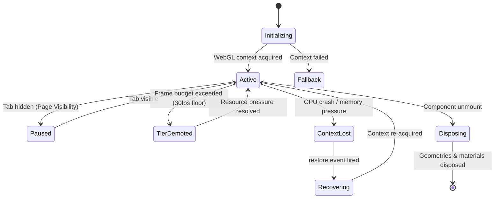

### 2.3 Key Three.js Configuration

| Property           | Value                                | Rationale                           |
| ------------------ | ------------------------------------ | ----------------------------------- |
| `antialias`        | `high` tier only                     | Mobile GPU perf impact              |
| `alpha`            | `true`                               | Composite over gradient             |
| `toneMapping`      | `ACESFilmicToneMapping`              | Filmic color response, richer darks |
| `outputColorSpace` | `SRGBColorSpace`                     | Match browser color rendering       |
| `setPixelRatio`    | `Math.min(devicePixelRatio, 2)`      | Cap for high-DPR mobile             |
| `powerPreference`  | `'high-performance'` / `'low-power'` | Tier-dependent                      |
| `setAnimationLoop` | Conditional: `null` when paused      | Battery preservation                |

---

## 3. React Three Fiber Architecture

### 3.1 R3F Integration Pattern

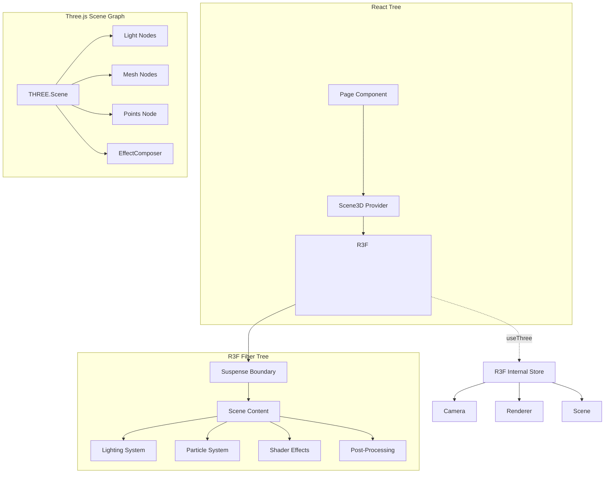

### 3.2 R3F Component Lifecycle

| React Lifecycle | R3F Counterpart           | Action                                  |
| --------------- | ------------------------- | --------------------------------------- |
| `mount`         | `useFrame` starts         | Initialize scene, load assets           |
| `update`        | `useFrame` per frame      | Animate, react to uniforms              |
| `theme change`  | `useFrame` uniform update | Switch light colors, material props     |
| `unmount`       | `useEffect` cleanup       | Dispose geometries, materials, textures |
| `error`         | `ErrorBoundary`           | Show fallback, log to analytics         |

### 3.3 R3F Configuration

```typescript
// apps/web/src/components/3d/Scene3D.tsx — Conceptual
import { Canvas } from '@react-three/fiber';
import { Suspense } from 'react';
import { SceneErrorBoundary } from './SceneErrorBoundary';
import { SceneFallback } from './fallbacks/SceneFallback';

export const Scene3D = ({ scene, tier, theme }: Scene3DProps) => {
  return (
    <SceneErrorBoundary scene={scene}>
      <Canvas
        camera={{ position: [0, 0, 5], fov: 45, near: 0.1, far: 100 }}
        dpr={[1, 2]}                                   // Responsive DPR
        gl={{
          antialias: tier === 'high',
          alpha: true,
          powerPreference: tier === 'high' ? 'high-performance' : 'low-power',
          toneMapping: ACESFilmicToneMapping,
          outputColorSpace: SRGBColorSpace,
        }}
        frameloop={tier === 'low' ? 'demand' : 'always'} // Battery saving
        onCreated={(state) => handleCreated(state, tier)}
        onPointerMissed={() => {}}                       // No click through
      >
        <Suspense fallback={<SceneFallback />}>
          <SceneRegistry scene={scene} theme={theme} tier={tier} />
        </Suspense>
      </Canvas>
    </SceneErrorBoundary>
  );
};
```

### 3.4 Scene Registry Pattern

```typescript
// apps/web/src/components/3d/SceneRegistry.tsx
const SCENE_COMPONENTS: Record<SceneType, React.FC<SceneProps>> = {
  hero: HeroScene,
  notFound: NotFoundScene,
};

const SceneRegistry = ({ scene, ...props }: SceneRegistryProps) => {
  const SceneComponent = SCENE_COMPONENTS[scene];
  if (!SceneComponent) return null;
  return <SceneComponent {...props} />;
};
```

---

## 4. Scene Architecture

### 4.1 Scene Graph Design

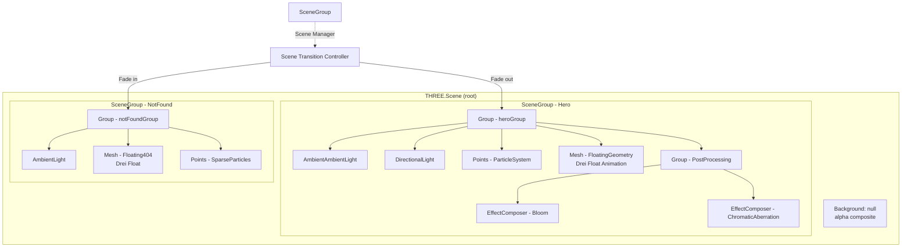

### 4.2 Scene Manager

```typescript
// apps/web/src/lib/3d/SceneManager.ts
class SceneManager {
  private currentScene: SceneType | null = null;
  private transitionDuration = 800; // ms

  async transitionTo(scene: SceneType): Promise<void> {
    await this.fadeOut(this.currentScene);
    this.currentScene = scene;
    await this.fadeIn(scene);
  }

  private fadeOut(scene: SceneType | null): Promise<void> {
    if (!scene) return Promise.resolve();
    // Animate opacity of all materials to 0 over 800ms
    return this.animateUniform('uAlpha', 1, 0, this.transitionDuration);
  }

  private fadeIn(scene: SceneType): Promise<void> {
    // Animate opacity from 0 to 1 with spring easing
    return this.animateUniform('uAlpha', 0, 1, this.transitionDuration, 'spring');
  }
}
```

### 4.3 Scene Lifecycle

| Phase         | Duration                 | Action                                        | Visual                  |
| ------------- | ------------------------ | --------------------------------------------- | ----------------------- |
| **Enter**     | 0-1200ms                 | Particles emerge from center, bloom ramps up  | Void → living field     |
| **Live**      | Indefinite               | Ambient motion, mouse response                | Breathing organic scene |
| **Idle**      | After 30s no interaction | Motion slows to 0.3x speed, breathing deepens | Calm, dormant           |
| **Re-engage** | On mouse move after idle | Speed ramps back to 1x over 1s                | Awakens on presence     |
| **Exit**      | 0-800ms                  | Fade out all opacity, dispose                 | Back to void            |

---

## 5. Canvas Architecture

### 5.1 Canvas Strategy

| Aspect       | Decision                                   | Rationale                                       |
| ------------ | ------------------------------------------ | ----------------------------------------------- |
| **Count**    | Single canvas                              | Multiple canvases multiply GPU context overhead |
| **Position** | Absolute, z-index behind content           | Decorative layer, never blocks interaction      |
| **Size**     | `window.innerWidth` x `window.innerHeight` | Full viewport for hero immersion                |
| **DPR**      | `min(devicePixelRatio, 2)`                 | Sharp on Retina, lean on high-DPR mobile        |
| **Resize**   | `ResizeObserver` on container              | Responsive to layout changes                    |
| **Context**  | `webgl2` with `webgl` fallback             | Future-proof, broad support                     |

### 5.2 Context Loss Handling

```typescript
// Canvas context loss listener (configured via R3D onCreated)
const handleContextLost = (event: WebGLContextLostEvent) => {
  event.preventDefault(); // Allow restore
  dispatch({ type: 'CONTEXT_LOST' });

  // Log to analytics
  posthog.capture('3d_context_lost', { canvas: sceneId });

  // Show fallback immediately
  showFallback('gradient');
};

const handleContextRestored = () => {
  dispatch({ type: 'CONTEXT_RESTORED' });

  // Reinitialize renderer state
  reinitializeScene();

  // Log restoration
  posthog.capture('3d_context_restored', { canvas: sceneId });
};
```

### 5.3 Multi-Canvas vs Single-Canvas

| Factor               | Single Canvas (Selected)    | Multi-Canvas                   |
| -------------------- | --------------------------- | ------------------------------ |
| **GPU memory**       | ~50MB per context           | ~50MB × N contexts             |
| **Context overhead** | 1 WebGL context             | N WebGL contexts               |
| **Scene switching**  | Group visibility toggle     | Canvas mount/unmount           |
| **Transition**       | Smooth fade between groups  | Canvas swap, visible flash     |
| **Memory cleanup**   | One dispose cycle per scene | Full Canvas teardown per swap  |
| **Error recovery**   | One boundary covers all     | Separate boundaries per canvas |

---

## 6. Asset Architecture

### 6.1 Asset Pipeline

```mermaid
flowchart LR
    subgraph "Asset Types"
        Procedural[Procedural Geometry<br/>Box, Sphere, Torus<br/>0KB bundle]
        Texture[Procedural Textures<br/>Canvas-generated<br/>0KB bundle]
        Uniform[Uniform Values<br/>Colors, floats, vec2<br/>Inline in code]
    end

    subgraph "Loading Strategy"
        Lazy[Lazy on-demand<br/>Hero scroll trigger]
        Preload[Preload next scene<br/>After idle callback]
        Inline[Inline in bundle<br/>For small assets]
    end

    subgraph "Cache Layer"
        Cache[AssetCache Map]
        Cache --> Geo[Geometry Cache]
        Cache --> Tex[Texture Cache]
        Cache --> Mat[Material Cache]
    end

    Procedural --> Lazy
    Texture --> Inline
    Uniform --> Inline

    Lazy --> Cache
    Inline --> Cache

    Cache --> Dispose[Dispose on Scene Exit<br/>Renderer.dispose()]
```

### 6.2 Asset Inventory

| Asset               | Type                 | Source                   | Size            | Cache Strategy       | Disposal          |
| ------------------- | -------------------- | ------------------------ | --------------- | -------------------- | ----------------- |
| Particle geometry   | `BufferGeometry`     | Procedural (BoxGeometry) | 0KB             | Shared across scenes | Never (singleton) |
| Floating shape      | `RoundedBoxGeometry` | drei + custom radius     | 0KB             | Per-tier instance    | Scene exit        |
| Particle texture    | `CanvasTexture`      | Canvas API generated     | < 1KB           | Reused               | Never (singleton) |
| Bloom configuration | Uniforms             | Inline                   | 0KB             | Per-tier config      | Scene exit        |
| Shader defines      | GLSL strings         | Template literals        | Inline in chunk | Shared               | Never             |

### 6.3 Asset Disposal Protocol

```typescript
// apps/web/src/lib/3d/disposal.ts
export const disposeSceneAssets = (scene: THREE.Scene): void => {
  scene.traverse((child) => {
    if (child instanceof THREE.Mesh || child instanceof THREE.Points) {
      child.geometry.dispose();

      if (Array.isArray(child.material)) {
        child.material.forEach(disposeMaterial);
      } else {
        disposeMaterial(child.material);
      }
    }
  });
};

const disposeMaterial = (material: THREE.Material): void => {
  // Dispose all textures
  for (const key of Object.keys(material)) {
    const value = (material as any)[key];
    if (value instanceof THREE.Texture) {
      value.dispose();
    }
  }
  material.dispose();
};
```

---

## 7. Lighting Architecture

### 7.1 Light Configuration

```typescript
// apps/web/src/components/3d/lighting/LightingSystem.tsx
const LightingSystem = ({ theme, tier }: LightingProps) => {
  const colors = THEME_LIGHT_COLORS[theme]; // light/dark palette

  return (
    <>
      {/* Base ambient — fills shadows softly */}
      <ambientLight
        intensity={0.4}
        color={colors.ambient}
      />

      {/* Key light — primary volume and direction */}
      <directionalLight
        position={[5, 5, 5]}
        intensity={tier === 'high' ? 0.8 : 0.5}
        color={colors.key}
      />

      {/* Fill light — soft secondary from below */}
      <directionalLight
        position={[-3, -3, 2]}
        intensity={0.3}
        color={colors.fill}
      />

      {/* Rim light — highlights edges (high tier only) */}
      {tier === 'high' && (
        <directionalLight
          position={[0, -5, -5]}
          intensity={0.2}
          color={colors.rim}
        />
      )}

      {/* Hemisphere — sky/ground color blend */}
      <hemisphereLight
        args={[colors.sky, colors.ground, 0.3]}
      />
    </>
  );
};
```

### 7.2 Theme-Aware Light Colors

| Light   | Light Mode             | Dark Mode              | Purpose           |
| ------- | ---------------------- | ---------------------- | ----------------- |
| Ambient | `#e0e7ff` (indigo-100) | `#1e1b4b` (indigo-950) | Base fill         |
| Key     | `#ffffff`              | `#c7d2fe` (indigo-200) | Primary volume    |
| Fill    | `#818cf8` (indigo-400) | `#6366f1` (indigo-500) | Warm secondary    |
| Rim     | `#a5b4fc` (indigo-300) | `#4338ca` (indigo-600) | Edge definition   |
| Sky     | `#eef2ff`              | `#0f172a` (slate-900)  | Hemisphere top    |
| Ground  | `#1e1b4b`              | `#020617` (slate-950)  | Hemisphere bottom |

### 7.3 No Shadows — Rationale

| Reason           | Detail                                                                 |
| ---------------- | ---------------------------------------------------------------------- |
| **Performance**  | Shadow maps cost ~50% of render budget per shadow-casting light        |
| **Visual style** | Flat/Toon shading without shadows matches glassmorphism aesthetic      |
| **Complexity**   | Shadow bias, cascades, acne — unnecessary for ambient decorative layer |
| **Tier impact**  | Shadows would be impossible on Low tier, inconsistent experience       |

---

## 8. Shader Architecture

### 8.1 Custom Shader System

The portfolio uses custom GLSL shaders beyond what drei provides — for **living organic effects**, **theme-reactive materials**, and **custom particle rendering**.

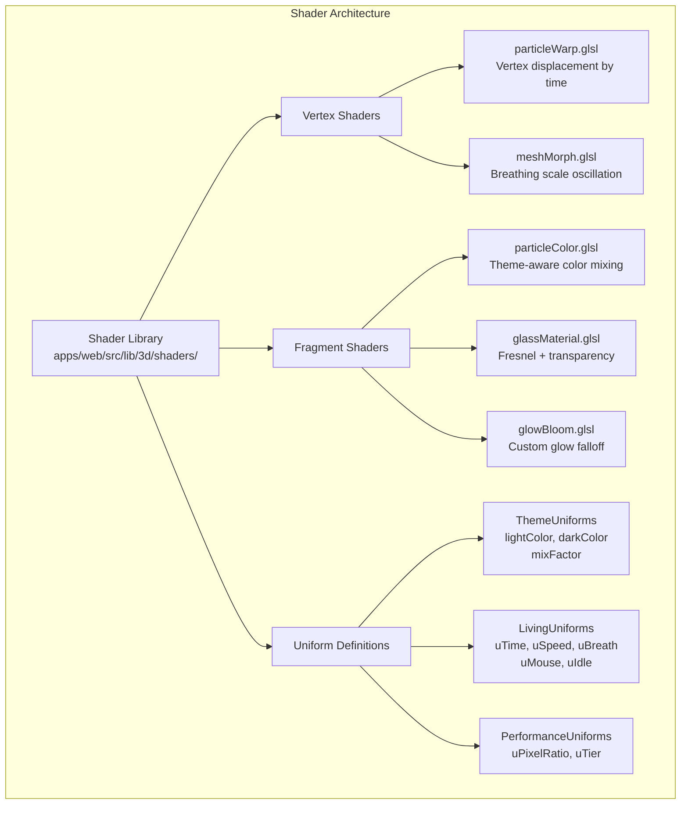

### 8.2 Living Particle Shader

**Vertex Shader — `particleWarp.glsl`**

```glsl
// apps/web/src/lib/3d/shaders/particleWarp.glsl
uniform float uTime;
uniform float uSpeed;
uniform float uBreath;
uniform vec2  uMouse;
uniform float uIdle;
uniform float uTier; // 0.0 = low, 1.0 = high

attribute float aPhase;   // Per-particle phase offset
attribute float aSpeed;   // Per-particle speed multiplier
attribute float aSize;    // Per-particle base size

varying float vAlpha;
varying float vGlow;

void main() {
  vec3 pos = position;

  // Organic warp: time-based sinusoidal displacement
  // Each particle follows a unique Lissajous-like path
  float t = uTime * uSpeed * (0.5 + aSpeed * 0.5);
  float warpX = sin(t * 0.7 + aPhase) * 0.3 * uBreath;
  float warpY = cos(t * 0.5 + aPhase * 1.3) * 0.3 * uBreath;
  float warpZ = sin(t * 0.3 + aPhase * 0.7) * 0.2 * uBreath;

  // Mouse influence: gentle pull toward cursor
  float mouseDist = distance(pos.xy, uMouse);
  float mouseInfluence = smoothstep(0.8, 0.0, mouseDist) * 0.15 * (1.0 - uIdle);
  pos.x += uMouse.x * mouseInfluence;
  pos.y += uMouse.y * mouseInfluence;

  // Apply warp
  pos.x += warpX;
  pos.y += warpY;
  pos.z += warpZ;

  // Idle slowdown: particles drift less when user is away
  float activeBlend = 1.0 - uIdle * 0.7;

  vec4 mvPosition = modelViewMatrix * vec4(pos, 1.0);
  gl_PointSize = aSize * uTier * activeBlend * (300.0 / -mvPosition.z);
  gl_Position = projectionMatrix * mvPosition;

  // Alpha: fade in with breath, dim when idle
  vAlpha = 0.6 + 0.4 * sin(t * 0.4 + aPhase) * activeBlend;
  vGlow = 0.3 + 0.7 * (1.0 - mouseDist);
}
```

**Fragment Shader — `particleColor.glsl`**

```glsl
// apps/web/src/lib/3d/shaders/particleColor.glsl
uniform vec3  uLightColor;   // Theme light mode color
uniform vec3  uDarkColor;    // Theme dark mode color
uniform float uMixFactor;   // 0.0 = light, 1.0 = dark
uniform float uTime;
uniform float uGlowIntensity;

varying float vAlpha;
varying float vGlow;

void main() {
  // Soft circular particle with glow
  vec2 center = gl_PointCoord - vec2(0.5);
  float dist = length(center);

  // Discard outside circle
  if (dist > 0.5) discard;

  // Smooth falloff (soft glow)
  float alpha = 1.0 - smoothstep(0.0, 0.5, dist);
  alpha *= alpha; // Quadratic falloff for softer edge

  // Theme color mix
  vec3 color = mix(uLightColor, uDarkColor, uMixFactor);

  // Glow boost from mouse proximity
  color *= 1.0 + vGlow * uGlowIntensity * 0.3;

  // Pulsing brightness
  float pulse = 0.8 + 0.2 * sin(uTime * 0.3 + dist * 10.0);
  color *= pulse;

  gl_FragColor = vec4(color, alpha * vAlpha);
}
```

### 8.3 Glass/Fresnel Shader

```glsl
// apps/web/src/lib/3d/shaders/glassMaterial.glsl
// Used on floating geometry for glassmorphism in 3D
uniform vec3  uColor;
uniform float uOpacity;
uniform float uFresnelPower;
uniform float uTime;

varying vec3 vNormal;
varying vec3 vViewDir;

void main() {
  // Fresnel effect: more transparent at edges, more reflective at center
  float fresnel = 1.0 - max(dot(normalize(vNormal), normalize(vViewDir)), 0.0);
  fresnel = pow(fresnel, uFresnelPower);

  // Core color with fresnel edge glow
  vec3 core = uColor * 0.6;
  vec3 edge = uColor * 1.3;

  vec3 color = mix(core, edge, fresnel);

  // Subtle breathing animation on opacity
  float breath = 1.0 + 0.05 * sin(uTime * 0.5);

  gl_FragColor = vec4(color, uOpacity * (0.4 + 0.6 * (1.0 - fresnel)) * breath);
}
```

### 8.4 Shader Material Registration

```typescript
// apps/web/src/lib/3d/shaders/materials.ts
import { ShaderMaterial, Color } from 'three';
import particleVertex from './particleWarp.glsl';
import particleFragment from './particleColor.glsl';

export const createParticleMaterial = (theme: Theme, tier: Tier): ShaderMaterial => {
  return new ShaderMaterial({
    uniforms: {
      uTime: { value: 0 },
      uSpeed: { value: tier === 'high' ? 1.0 : 0.5 },
      uBreath: { value: 1.0 },
      uMouse: { value: [0, 0] },
      uIdle: { value: 0 },
      uTier: { value: tier === 'high' ? 1.0 : 0.5 },
      uLightColor: { value: new Color('#6366f1') },
      uDarkColor: { value: new Color('#818cf8') },
      uMixFactor: { value: theme === 'dark' ? 1.0 : 0.0 },
      uGlowIntensity: { value: tier === 'high' ? 1.0 : 0.3 },
    },
    vertexShader: particleVertex,
    fragmentShader: particleFragment,
    transparent: true,
    depthWrite: false,
    blending: AdditiveBlending,
  });
};
```

### 8.5 When to Use ShaderMaterial vs Drei

| Effect                | Use                                 | Why                                                           |
| --------------------- | ----------------------------------- | ------------------------------------------------------------- |
| Particle animation    | Custom ShaderMaterial               | Need per-vertex warp, mouse response, idle blending           |
| Floating geometry     | Drei `<Float>`                      | Handles rotation/float math, good enough for meshes           |
| Glass material        | Custom ShaderMaterial               | Fresnel + breath + theme blending beyond drei's `Transparent` |
| Bloom post-processing | Drei `<EffectComposer>` + `<Bloom>` | Production-tested, performant, configurable                   |
| Chromatic aberration  | Drei (postprocessing)               | Standard effect, no custom shader needed                      |
| Particle glow         | Custom FragmentShader               | Need control over falloff curve and color mixing              |
| Theme transition      | Uniform lerp in `useFrame`          | Native R3F pattern, no custom shader needed for simple lerps  |

---

## 9. Particle Architecture

### 9.1 Particle System Design

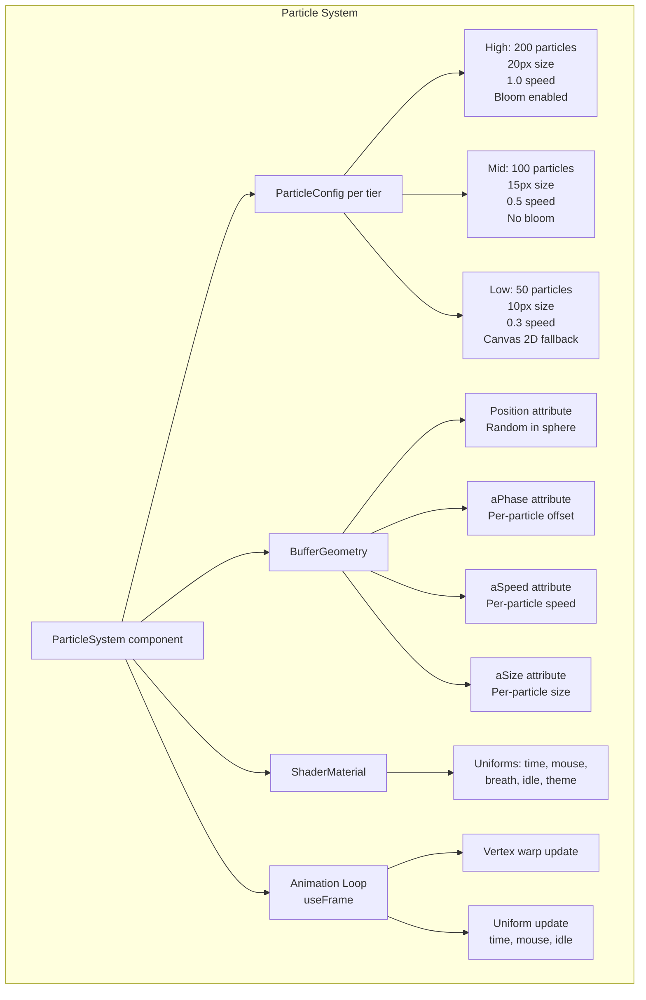

### 9.2 Particle Generation

```typescript
// apps/web/src/lib/3d/particles/generateParticles.ts
interface ParticleField {
  positions: Float32Array;
  phases: Float32Array;
  speeds: Float32Array;
  sizes: Float32Array;
}

export const generateParticleField = (count: number, tier: Tier): ParticleField => {
  const positions = new Float32Array(count * 3);
  const phases = new Float32Array(count);
  const speeds = new Float32Array(count);
  const sizes = new Float32Array(count);

  // Distribute particles in a flattened sphere (more spread on X/Y)
  const radius = tier === 'high' ? 4 : 3;

  for (let i = 0; i < count; i++) {
    // Uniform sphere distribution
    const theta = Math.random() * Math.PI * 2;
    const phi = Math.acos(2 * Math.random() - 1);
    const r = radius * Math.cbrt(Math.random());

    positions[i * 3] = r * Math.sin(phi) * Math.cos(theta);
    positions[i * 3 + 1] = r * Math.sin(phi) * Math.sin(theta);
    positions[i * 3 + 2] = r * Math.cos(phi) * 0.5; // Flatten on Z

    phases[i] = Math.random() * Math.PI * 2;
    speeds[i] = 0.5 + Math.random() * 0.5;
    sizes[i] =
      tier === 'high'
        ? 15 + Math.random() * 10
        : tier === 'mid'
          ? 10 + Math.random() * 8
          : 5 + Math.random() * 5;
  }

  return { positions, phases, speeds, sizes };
};
```

### 9.3 Particle Animation Loop

```typescript
// apps/web/src/components/3d/primitives/Particles.tsx
const Particles = ({ count, tier, theme }: ParticlesProps) => {
  const meshRef = useRef<THREE.Points>(null);
  const materialRef = useRef<THREE.ShaderMaterial>(null);
  const mouse = useMousePosition(); // Shared mouse hook
  const idle = useIdleDetector(30000); // 30s idle threshold
  const { clock } = useThree();

  // Initialize geometry
  const { positions, phases, speeds, sizes } = useMemo(
    () => generateParticleField(count, tier),
    [count, tier]
  );

  const geometry = useMemo(() => {
    const geo = new THREE.BufferGeometry();
    geo.setAttribute('position', new THREE.BufferAttribute(positions, 3));
    geo.setAttribute('aPhase', new THREE.BufferAttribute(phases, 1));
    geo.setAttribute('aSpeed', new THREE.BufferAttribute(speeds, 1));
    geo.setAttribute('aSize', new THREE.BufferAttribute(sizes, 1));
    return geo;
  }, [positions, phases, speeds, sizes]);

  // Animation loop — living organic motion
  useFrame(() => {
    if (!materialRef.current) return;

    const elapsed = clock.getElapsedTime();
    const breath = 0.5 + 0.5 * Math.sin(elapsed * 0.2); // Slow breath cycle

    materialRef.current.uniforms.uTime.value = elapsed;
    materialRef.current.uniforms.uBreath.value = breath;
    materialRef.current.uniforms.uIdle.value = idle.isIdle ? 1.0 : 0.0;

    // Smooth mouse follow
    materialRef.current.uniforms.uMouse.value = [
      mouse.x * 0.5,  // Normalized to scene space
      mouse.y * 0.3,
    ];
  });

  // Theme change → update uniform
  useEffect(() => {
    if (!materialRef.current) return;
    materialRef.current.uniforms.uMixFactor.value = theme === 'dark' ? 1.0 : 0.0;
  }, [theme]);

  return (
    <points ref={meshRef} geometry={geometry}>
      <shaderMaterial ref={materialRef}
        uniforms={/* ... */}
        vertexShader={particleVertex}
        fragmentShader={particleColor}
        transparent
        depthWrite={false}
        blending={AdditiveBlending}
      />
    </points>
  );
};
```

### 9.4 Particle Count by Tier

| Tier | Count | Budget (frame) | Visual Density | Post-Processing  |
| ---- | ----- | -------------- | -------------- | ---------------- |
| High | 200   | < 1.5ms        | Full starfield | Bloom            |
| Mid  | 100   | < 0.8ms        | Sparse field   | None             |
| Low  | 50    | < 0.4ms        | Subtle dots    | None (Canvas 2D) |

---

## 10. Interaction Architecture (Living 3D)

### 10.1 Interaction Model

The portfolio's 3D interaction is **ambient-reactive** — the scene responds to user presence without requiring deliberate interaction. This creates a "living" feeling where the scene feels aware.

```mermaid
flowchart TD
    subgraph "User Presence Detection"
        MM[Mouse Move] --> MP[MousePositionTracker]
        TI[Touch Input] --> MP
        SC[Scroll Change] --> Scroll[ScrollTracker]
        Idle[IdleDetector<br/>30s threshold] --> UI[UserInactive]
    end

    subgraph "Scene Response"
        MP --> ParticlePull[Particles drift toward cursor<br/>Strength: 0.15 * (1 - idle)]
        MP --> LightShift[Lights tilt toward mouse<br/>Strength: 0.1 rad]
        MP --> BreathChange[Breath cycle speeds up<br/>1.0x → 1.5x on move]

        Scroll --> Opacity[Scene opacity fades<br/>1.0 → 0.0 over scroll]
        Scroll --> Speed[Particle speed slows<br/>Based on scroll progress]

        UI --> SlowMotion[All motion → 0.3x speed<br/>Deep breathing cycle]
        UI --> Dim[Particle alpha → 0.3<br/>Shapes dim]

        UserActive -->|Mouse move after idle| WakeUp[0 → 1x over 1s<br/>Spring easing]
    end
```

### 10.2 Mouse Reactive System

```typescript
// apps/web/src/hooks/useMouseReactive3D.ts
export const useMouseReactive3D = (tier: Tier) => {
  const mouse = useRef({ x: 0, y: 0, targetX: 0, targetY: 0 });
  const { size } = useThree();

  // Smooth spring-follow — not teleport, not laggy — organic
  const onPointerMove = useCallback(
    (e: PointerEvent) => {
      // Normalize to -1..1 with aspect ratio correction
      mouse.current.targetX = (e.clientX / size.width) * 2 - 1;
      mouse.current.targetY = -(e.clientY / size.height) * 2 + 1;
    },
    [size],
  );

  useEffect(() => {
    window.addEventListener('pointermove', onPointerMove, { passive: true });
    return () => window.removeEventListener('pointermove', onPointerMove);
  }, [onPointerMove]);

  useFrame(() => {
    // Spring physics for organic follow (not lerp — too linear)
    const spring = 0.08;
    const dx = mouse.current.targetX - mouse.current.x;
    const dy = mouse.current.targetY - mouse.current.y;

    mouse.current.x += dx * spring;
    mouse.current.y += dy * spring;

    return { x: mouse.current.x, y: mouse.current.y };
  });
};
```

### 10.3 Idle Detection

```typescript
// apps/web/src/hooks/useIdleDetector.ts
export const useIdleDetector = (timeout = 30000) => {
  const [isIdle, setIsIdle] = useState(false);
  const timerRef = useRef<ReturnType<typeof setTimeout>>();

  useEffect(() => {
    const reset = () => {
      setIsIdle(false);
      clearTimeout(timerRef.current);
      timerRef.current = setTimeout(() => setIsIdle(true), timeout);
    };

    const events = ['pointermove', 'pointerdown', 'touchstart', 'scroll', 'keydown'];
    events.forEach((e) => window.addEventListener(e, reset, { passive: true }));

    // Start idle timer
    timerRef.current = setTimeout(() => setIsIdle(true), timeout);

    return () => {
      events.forEach((e) => window.removeEventListener(e, reset));
      clearTimeout(timerRef.current);
    };
  }, [timeout]);

  return { isIdle };
};
```

### 10.4 Interaction Rules

| Rule                          | Implementation                     | Why                               |
| ----------------------------- | ---------------------------------- | --------------------------------- |
| **No click/drag**             | Pointer events are `passive: true` | Keyboard accessible, no gimmick   |
| **Mouse follow is subtle**    | Max displacement: 0.15 units       | Feels responsive, not distracting |
| **Spring physics**            | `dx * 0.08` per frame              | Organic drift, not snap-to        |
| **Idle slows to sleep**       | After 30s: 0.3x speed, deep breath | Battery saving, non-distracting   |
| **Scroll fades respectfully** | Opacity 1.0 → 0.0 over hero exit   | Content takes priority            |
| **Theme switch is instant**   | Uniform lerp over 300ms            | Feels polished, no delay          |

### 10.5 Scroll-Reactive Lifecycle

```typescript
// apps/web/src/hooks/useScrollReactive3D.ts
export const useScrollReactive3D = () => {
  const scrollProgress = useRef(0);
  const { viewport } = useThree();

  useEffect(() => {
    const handleScroll = () => {
      // Hero section is 100vh — track scroll through hero space
      const heroHeight = window.innerHeight;
      const scrolled = window.scrollY;
      scrollProgress.current = Math.min(scrolled / heroHeight, 1);
    };

    window.addEventListener('scroll', handleScroll, { passive: true });
    return () => window.removeEventListener('scroll', handleScroll);
  }, []);

  // Returns: 0 (top) → 1 (scrolled past hero)
  return scrollProgress;
};

// Usage in Scene3D:
const scrollProgress = useScrollReactive3D();
useFrame(() => {
  // Fade out scene as user scrolls past hero
  const fade = 1 - easeOutCubic(scrollProgress.current);
  material.uniforms.uAlpha.value = fade;

  // Slow particles as they fade
  material.uniforms.uSpeed.value = 0.3 + 0.7 * fade;
});
```

---

## 11. Optimization Architecture

### 11.1 Optimization Layer Stack

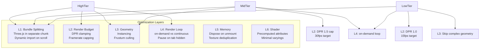

### 11.2 DPR Management

```typescript
// apps/web/src/lib/3d/performance/dprManager.ts
export const getOptimalDPR = (tier: Tier): [number, number] => {
  switch (tier) {
    case 'high':
      return [1, 2]; // Sharp on Retina, capped for perf
    case 'mid':
      return [1, 1.5]; // Slight bonus, mostly 1x
    case 'low':
      return [1, 1]; // Always 1x
    case 'off':
      return [1, 1]; // No WebGL needed
  }
};

// Usage: <Canvas dpr={getOptimalDPR(tier)} />
```

### 11.3 Framerate Capping

```typescript
// apps/web/src/lib/3d/performance/frameRateCap.ts
export const createFrameRateCap = (targetFPS: number) => {
  let lastFrameTime = 0;
  const interval = 1000 / targetFPS;

  return (callback: () => void): void => {
    const now = performance.now();
    const delta = now - lastFrameTime;

    if (delta >= interval) {
      lastFrameTime = now - (delta % interval);
      callback();
    }
  };
};

// Used in useFrame:
const cap = createFrameRateCap(tier === 'high' ? 60 : tier === 'mid' ? 30 : 15);
useFrame(() =>
  cap(() => {
    // Animation logic here — runs at capped rate
  }),
);
```

### 11.4 Bundle Optimization

| Strategy                | Implementation                                                   | Saving                             |
| ----------------------- | ---------------------------------------------------------------- | ---------------------------------- |
| **Dynamic import**      | `next/dynamic` with `ssr: false`                                 | 195KB removed from critical path   |
| **Three.js chunk**      | Webpack splitChunks for `three`                                  | ~150KB in separate cacheable chunk |
| **Drei tree-shaking**   | Named imports only (`import { Float } from '@react-three/drei'`) | ~30KB vs barrel import             |
| **Shader as strings**   | GLSL inlined via Webpack raw-loader                              | 0KB runtime overhead               |
| **Procedural geometry** | No GLTF/GLB model files                                          | ~500KB+ avoided                    |
| **Texture generation**  | Canvas API procedural textures                                   | ~200KB+ avoided                    |

### 11.5 Render Loop Strategy

| Tier | Loop Mode | Framerate    | When Active            | When Paused     |
| ---- | --------- | ------------ | ---------------------- | --------------- |
| High | `always`  | 60fps        | Visible + active tab   | Tab hidden      |
| Mid  | `always`  | 30fps capped | Visible + active tab   | Tab hidden      |
| Low  | `demand`  | 15fps capped | Only on uniform change | Between renders |
| Off  | N/A       | N/A          | N/A                    | N/A             |

---

## 12. Fallback Architecture

### 12.1 Fallback Chain (Implementation)

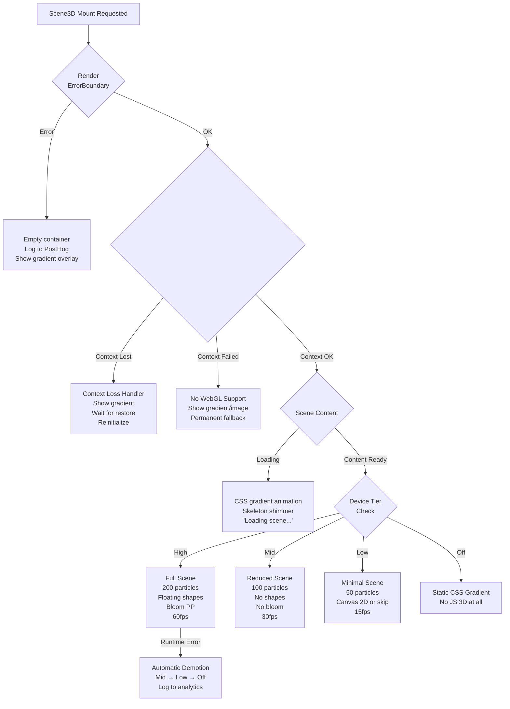

### 12.2 Fallback Component Hierarchy

```typescript
// apps/web/src/components/3d/fallbacks/index.ts
// Export all fallback variants
export { GradientFallback } from './GradientFallback'; // CSS animated gradient
export { ImageFallback } from './ImageFallback'; // Static hero image
export { SceneFallback } from './SceneFallback'; // Suspense loading state
export { SceneErrorFallback } from './SceneErrorFallback'; // Error boundary fallback
export { NoWebGLFallback } from './NoWebGLFallback'; // WebGL unavailable
```

### 12.3 Tier Demotion on Runtime Failure

```typescript
// apps/web/src/lib/3d/performance/tierDemotion.ts
export const useTierDemotion = (initialTier: Tier) => {
  const [currentTier, setCurrentTier] = useState<Tier>(initialTier);
  const frameTimes = useRef<number[]>([]);
  const { performance } = useThree();

  useFrame(() => {
    // Track frame times
    frameTimes.current.push(performance.timing.fps);

    // Every 60 frames, check average
    if (frameTimes.current.length >= 60) {
      const avgFPS = frameTimes.current.reduce((a, b) => a + b, 0) / 60;
      frameTimes.current = [];

      if (avgFPS < 20 && currentTier === 'high') {
        setCurrentTier('mid');
        posthog.capture('3d_tier_demoted', { from: 'high', to: 'mid', avgFPS });
      } else if (avgFPS < 15 && currentTier === 'mid') {
        setCurrentTier('low');
        posthog.capture('3d_tier_demoted', { from: 'mid', to: 'low', avgFPS });
      } else if (avgFPS < 10 && currentTier === 'low') {
        setCurrentTier('off');
        posthog.capture('3d_tier_demoted', { from: 'low', to: 'off', avgFPS });
      }
    }
  });

  return currentTier;
};
```

---

## 13. Loading Architecture

### 13.1 Loading Sequence

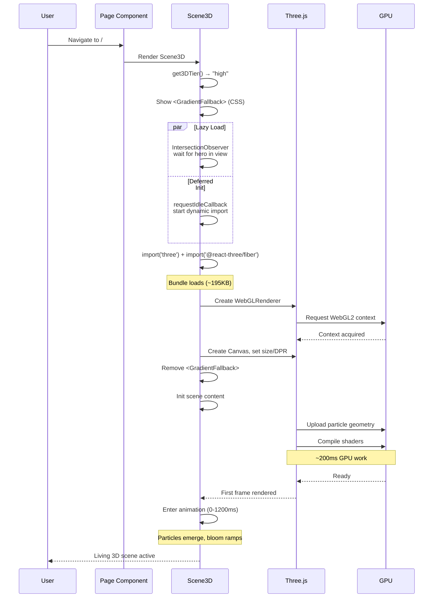

### 13.2 Loading States

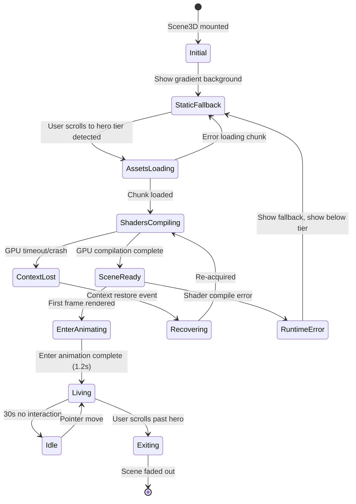

### 13.3 Loading Implementation

```typescript
// apps/web/src/components/3d/Scene3D.tsx — Loading Architecture
export const Scene3D = (props: Scene3DProps) => {
  const [loadingState, setLoadingState] = useState<LoadingState>('initial');
  const [show3D, setShow3D] = useState(false);

  // Step 1: Defer 3D loading until hero is near viewport
  useEffect(() => {
    const observer = new IntersectionObserver(
      ([entry]) => {
        if (entry.isIntersecting) {
          // Step 2: requestIdleCallback for non-urgent load
          requestIdleCallback(() => {
            setShow3D(true);
            setLoadingState('assetsLoading');
          }, { timeout: 2000 });
          observer.disconnect();
        }
      },
      { rootMargin: '200px' }
    );

    const el = containerRef.current;
    if (el) observer.observe(el);
    return () => observer.disconnect();
  }, []);

  // Step 3: Show gradient immediately, 3D loads progressively
  return (
    <div ref={containerRef} className="hero-3d-container">
      <GradientFallback visible={loadingState !== 'living'} />
      {show3D && (
        <SceneErrorBoundary onDemote={() => setLoadingState('staticFallback')}>
          <CanvasWrapper tier={props.tier} onReady={() => setLoadingState('living')} />
        </SceneErrorBoundary>
      )}
    </div>
  );
};
```

### 13.4 Bundle Loading Budgets

| Chunk                         | Size (gzip)    | Load Trigger          | Load Time Budget |
| ----------------------------- | -------------- | --------------------- | ---------------- |
| `three`                       | ~45KB          | Dynamic import        | < 500ms          |
| `@react-three/fiber`          | ~10KB          | Dynamic import        | < 200ms          |
| `@react-three/drei`           | ~15KB          | Dynamic import        | < 300ms          |
| `@react-three/postprocessing` | ~8KB           | Lazy (high tier only) | < 200ms          |
| Shader strings                | ~3KB           | Inline in chunk       | 0ms (inline)     |
| **Total 3D**                  | **~81KB gzip** | Lazy on scroll        | **< 1.5s**       |

---

## 14. Error Recovery Architecture

### 14.1 Error Recovery Chain

```mermaid
flowchart TD
    E[Error Occurs] --> Classify{Classify Error}

    Classify -->|WebGL Context Lost| CtxRestore[Attempt Restore<br/>event.preventDefault()<br/>Wait for restore event]
    CtxRestore -->|Restored in < 2s| Resume[Resume Scene]
    CtxRestore -->|Timeout > 2s| FullFallback[Show Gradient Fallback<br/>Permanent]

    Classify -->|GPU Memory<br/>Exceeded| DemoteTier[Demote One Tier<br/>Dispose half geometries]
    DemoteTier -->|Still failing| FullFallback

    Classify -->|Shader Compile<br/>Error| SkipEffect[Skip failed shader<br/>Continue with subset]
    SkipEffect -->|Critical shader fail| DemoteTier

    Classify -->|Bundle Load<br/>Error| Retry[Retry dynamic import<br/>3 attempts max]
    Retry -->|Success| Resume
    Retry -->|All failed| FullFallback

    Classify -->|React Render<br/>Error| ErrorBoundary[ErrorBoundary catches<br/>Shows <SceneErrorFallback>]
    ErrorBoundary --> FullFallback
```

### 14.2 Error Boundary Implementation

```typescript
// apps/web/src/components/3d/SceneErrorBoundary.tsx
interface SceneErrorBoundaryState {
  hasError: boolean;
  errorType: 'webgl' | 'bundle' | 'render' | 'unknown';
  tier: Tier;
}

export class SceneErrorBoundary extends React.Component<
  SceneErrorBoundaryProps,
  SceneErrorBoundaryState
> {
  constructor(props: SceneErrorBoundaryProps) {
    super(props);
    this.state = { hasError: false, errorType: 'unknown', tier: props.initialTier };
  }

  static getDerivedStateFromError(error: Error): Partial<SceneErrorBoundaryState> {
    // Classify error by message patterns
    const msg = error.message.toLowerCase();
    const errorType =
      msg.includes('webgl') || msg.includes('context') ? 'webgl' :
      msg.includes('chunk') || msg.includes('import') ? 'bundle' :
      msg.includes('render') || msg.includes('shader') ? 'render' : 'unknown';

    return { hasError: true, errorType };
  }

  componentDidCatch(error: Error, info: React.ErrorInfo) {
    // Log to analytics for monitoring
    posthog.capture('3d_error', {
      errorType: this.state.errorType,
      message: error.message,
      componentStack: info.componentStack,
      tier: this.state.tier,
    });

    // Attempt demotion recovery
    if (this.state.tier === 'high') {
      this.setState({ tier: 'mid', hasError: false });
    } else if (this.state.tier === 'mid') {
      this.setState({ tier: 'low', hasError: false });
    } else {
      this.setState({ tier: 'off' }); // Permanent fallback
      this.props.onDemote?.('off');
    }
  }

  render() {
    if (this.state.hasError && this.state.tier === 'off') {
      return <SceneErrorFallback errorType={this.state.errorType} />;
    }
    return this.props.children;
  }
}
```

### 14.3 Recovery Time Budgets

| Error Type           | Recovery Target | Max Attempts | Fallback If Exceeded    |
| -------------------- | --------------- | ------------ | ----------------------- |
| WebGL context lost   | < 2s            | 1 restore    | Gradient, permanent     |
| GPU memory pressure  | < 500ms         | 3 demotions  | Gradient, permanent     |
| Shader compile error | < 100ms         | 1 skip       | Continue without effect |
| Bundle load error    | < 3s            | 3 retries    | Gradient, permanent     |
| React render error   | < 100ms         | 3 demotions  | Error fallback UI       |

---

## 15. Living 3D: Before → During → After Lifecycle

### 15.1 Lifecycle Stages

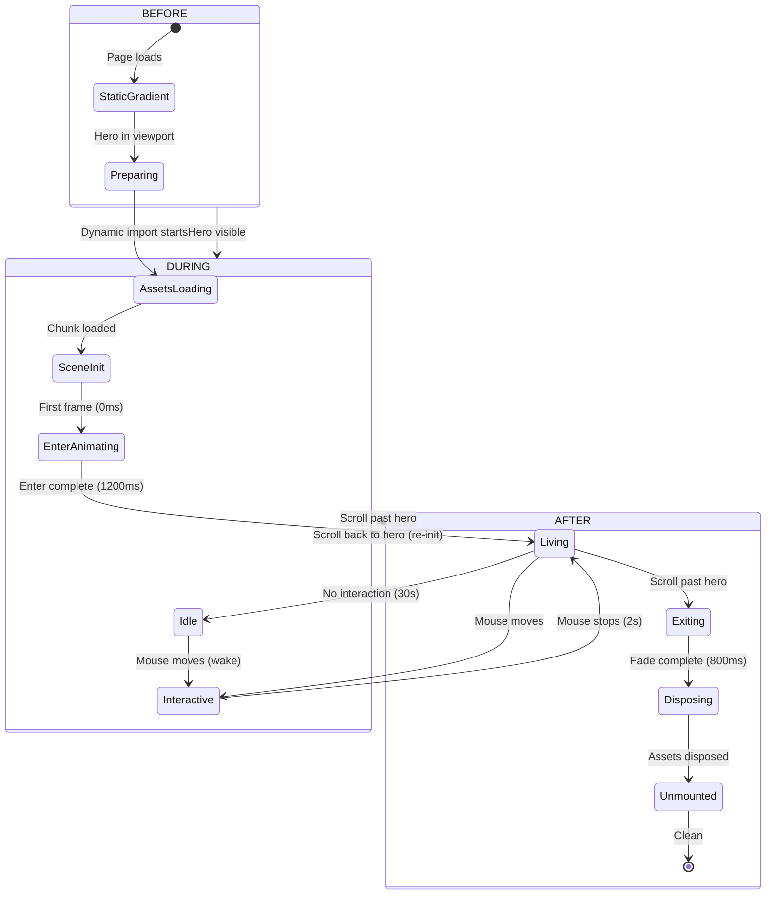

### 15.2 Before Stage — Progressive Enhancement

| Sub-Phase          | Duration              | Visual                         | Technical                                       |
| ------------------ | --------------------- | ------------------------------ | ----------------------------------------------- |
| **StaticGradient** | 0ms (immediate)       | CSS animated gradient          | No JS 3D loaded                                 |
| **Preparing**      | After IntersectionObs | Same gradient, observer active | `IntersectionObserver` with `rootMargin: 200px` |
| **AssetsLoading**  | 200-1500ms            | Gradient + skeleton overlay    | `dynamic()` import, `requestIdleCallback`       |

```css
/* Before: Gradient fallback shown immediately */
.hero-3d-container {
  position: relative;
  background: linear-gradient(135deg, var(--color-indigo-100), var(--color-slate-200));
}

@media (prefers-color-scheme: dark) {
  .hero-3d-container {
    background: linear-gradient(135deg, var(--color-indigo-950), var(--color-slate-900));
  }
}
```

### 15.3 During Stage — Living Scene

```typescript
// apps/web/src/components/3d/scenes/HeroScene.tsx — Living stage orchestration
const HeroScene = ({ theme, tier }: SceneProps) => {
  const groupRef = useRef<THREE.Group>(null);
  const { clock } = useThree();

  // Enter animation: particles emerge from center
  useEffect(() => {
    if (!groupRef.current) return;

    const startOpacity = { value: 0 };
    const targetOpacity = { value: 1 };

    // GSAP for enter animation
    gsap.to(startOpacity, {
      value: 1,
      duration: 1.2,
      ease: 'power3.out',
      onUpdate: () => {
        groupRef.current?.children.forEach((child) => {
          if (child instanceof THREE.Points || child instanceof THREE.Mesh) {
            (child.material as THREE.ShaderMaterial).uniforms.uAlpha.value
              = startOpacity.value;
          }
        });
      },
    });
  }, []);

  // During: living ambient motion (runs every frame)
  useFrame((state) => {
    if (!groupRef.current) return;

    const t = state.clock.getElapsedTime();

    // Slow breathing rotation on entire scene group
    groupRef.current.rotation.x = Math.sin(t * 0.05) * 0.02;
    groupRef.current.rotation.y = Math.sin(t * 0.03) * 0.03;
  });

  return (
    <group ref={groupRef}>
      <LightingSystem theme={theme} tier={tier} />
      <Particles count={getParticleCount(tier)} tier={tier} theme={theme} />
      {tier === 'high' && <FloatingShapes theme={theme} />}
      {tier === 'high' && (
        <EffectComposer>
          <Bloom luminanceThreshold={0.8} intensity={0.5} />
        </EffectComposer>
      )}
    </group>
  );
};
```

### 15.4 After Stage — Graceful Exit

| Sub-Phase     | Duration             | Visual                   | Technical                   |
| ------------- | -------------------- | ------------------------ | --------------------------- |
| **Exiting**   | 800ms                | Scene fades to 0 opacity | Uniform `uAlpha` → 0        |
| **Disposing** | 0ms (after fade)     | Gradient visible again   | `disposeSceneAssets(scene)` |
| **Unmounted** | After fade + dispose | Gradient permanent       | React unmount, GC           |

```typescript
// Exit hook for scene disposal
const useSceneExit = (sceneRef: RefObject<THREE.Group>, onExited: () => void) => {
  const scrollProgress = useScrollReactive3D();

  useEffect(() => {
    if (scrollProgress.current >= 1 && sceneRef.current) {
      // Fade out
      const materials = collectMaterials(sceneRef.current);
      materials.forEach((mat) => {
        gsap.to(mat.uniforms.uAlpha, {
          value: 0,
          duration: 0.8,
          ease: 'power2.out',
          onComplete: () => {
            disposeSceneAssets(sceneRef.current!);
            onExited();
          },
        });
      });
    }
  }, [scrollProgress.current >= 1]);
};
```

### 15.5 Lifecycle Durability

| Property                           | Guarantee                   |
| ---------------------------------- | --------------------------- |
| **Before: Time to first gradient** | 0ms (CSS-initial)           |
| **Before: Time to 3D init start**  | < 2s after hero in viewport |
| **During: Frame rate floor**       | Tier-based (60/30/15 fps)   |
| **During: Idle recovery**          | < 100ms on pointer move     |
| **After: Exit animation**          | 800ms smooth fade           |
| **After: Full cleanup**            | < 50ms after fade complete  |
| **Re-entry: Scene reload**         | < 1.5s (full cycle)         |

---

## 16. Component Tree & File Structure

### 16.1 Proposed Folder Layout

```
apps/web/src/
├── components/
│   └── 3d/
│       ├── Scene3D.tsx                    # Main provider — Canvas + ErrorBoundary + Suspense
│       ├── SceneRegistry.tsx              # Scene type → component mapper
│       ├── SceneErrorBoundary.tsx         # Error boundary with tier demotion
│       ├── CanvasWrapper.tsx              # R3F <Canvas> with config per tier
│       │
│       ├── scenes/
│       │   ├── HeroScene.tsx              # Hero section 3D content
│       │   ├── NotFoundScene.tsx          # 404 page 3D content
│       │   └── index.ts                   # Exports all scenes
│       │
│       ├── primitives/
│       │   ├── Particles.tsx              # Particle system with shader material
│       │   ├── FloatingShapes.tsx         # Floating geometry (drei Float)
│       │   └── index.ts
│       │
│       ├── lighting/
│       │   ├── LightingSystem.tsx         # All lights composed
│       │   └── themeColors.ts            # Theme-aware light color maps
│       │
│       ├── effects/
│       │   ├── BloomEffect.tsx            # Post-processing bloom wrapper
│       │   └── ChromaticAberration.tsx    # Optional chromatic aberration
│       │
│       ├── fallbacks/
│       │   ├── GradientFallback.tsx       # CSS animated gradient
│       │   ├── ImageFallback.tsx          # Static hero image
│       │   ├── SceneFallback.tsx          # Suspense loading state
│       │   ├── SceneErrorFallback.tsx     # Error boundary UI
│       │   └── NoWebGLFallback.tsx        # WebGL unavailable message
│       │
│       └── index.ts                      # Public API exports
│
├── hooks/
│   ├── useMouseReactive3D.ts             # Mouse tracking with spring physics
│   ├── useIdleDetector.ts                # 30s idle threshold
│   ├── useScrollReactive3D.ts            # Scroll → scene fade
│   └── useReducedMotion.ts               # prefers-reduced-motion
│
├── lib/
│   └── 3d/
│       ├── renderer.ts                   # Renderer config factory
│       ├── SceneManager.ts               # Scene transition orchestrator
│       ├── disposal.ts                   # Asset disposal utilities
│       ├── types.ts                      # Shared types (Tier, SceneType, etc.)
│       │
│       ├── particles/
│       │   └── generateParticles.ts       # Particle geometry generation
│       │
│       ├── shaders/
│       │   ├── particleWarp.glsl          # Living particle vertex shader
│       │   ├── particleColor.glsl         # Theme-aware fragment shader
│       │   ├── glassMaterial.glsl         # Fresnel glass shader
│       │   └── materials.ts              # ShaderMaterial factory
│       │
│       └── performance/
│           ├── dprManager.ts             # DPR strategy per tier
│           ├── frameRateCap.ts           # Framerate capping util
│           └── tierDemotion.ts           # Runtime tier demotion
```

### 16.2 File Responsibilities

| File                   | Responsibility                                                   | Bundle Impact  | Dependencies                  |
| ---------------------- | ---------------------------------------------------------------- | -------------- | ----------------------------- |
| `Scene3D.tsx`          | Provider, Canvas creation, ErrorBoundary, Suspense, tier loading | ~2KB           | All children                  |
| `SceneRegistry.tsx`    | Map scene type → component, type narrowing                       | < 1KB          | Scenes                        |
| `HeroScene.tsx`        | Hero content composition, enter animation orchestration          | ~3KB           | Primitives, lighting, effects |
| `NotFoundScene.tsx`    | 404 content composition                                          | ~2KB           | Primitives, lighting          |
| `Particles.tsx`        | Particle system with custom shader                               | ~5KB + shaders | Shaders, geometry gen         |
| `FloatingShapes.tsx`   | Drei Float-wrapped geometry                                      | ~2KB           | Drei                          |
| `LightingSystem.tsx`   | All scene lights                                                 | ~2KB           | Theme colors                  |
| `GradientFallback.tsx` | CSS gradient animation                                           | < 1KB          | CSS only (no Three.js)        |

### 16.3 Import Dependency Rules

```
Scene3D.tsx
├── SceneRegistry.tsx
│   ├── HeroScene.tsx
│   │   ├── Particles.tsx ──────────────────── lib/3d/shaders/materials.ts
│   │   │                                       ├── particleWarp.glsl
│   │   │                                       └── particleColor.glsl
│   │   ├── FloatingShapes.tsx ──────────────── @react-three/drei
│   │   └── LightingSystem.tsx ──────────────── lib/3d/lighting/themeColors.ts
│   └── NotFoundScene.tsx
│       └── Particles.tsx (reused)
│
├── SceneErrorBoundary.tsx ───────────────────── posthog (analytics)
├── CanvasWrapper.tsx
├── fallbacks/GradientFallback.tsx (CSS only)
└── hooks/* (3D interaction hooks)
```

---

## 17. Architecture Decision Records

### ADR-001: Single Canvas with Scene Registry

| Field            | Value                                                                                                                         |
| ---------------- | ----------------------------------------------------------------------------------------------------------------------------- |
| **Context**      | Multiple pages need 3D scenes (hero, 404). Choice: one Canvas per scene vs one Canvas with scene swap.                        |
| **Decision**     | Single `<Canvas>` at the provider level, scene content swapped via `SceneRegistry`.                                           |
| **Rationale**    | Single WebGL context (lower GPU memory), consistent error boundary, shared lighting/primitives, smooth crossfade transitions. |
| **Consequences** | Scene content must be shared via scene registry pattern; all scenes must work within same camera frustum.                     |

### ADR-002: Custom ShaderMaterial Over Drei Abstractions

| Field            | Value                                                                                                                                             |
| ---------------- | ------------------------------------------------------------------------------------------------------------------------------------------------- |
| **Context**      | Particles need organic warp, mouse response, idle blending, theme colors. Drei `<Particles>` is limited.                                          |
| **Decision**     | Custom `ShaderMaterial` with hand-written GLSL for particle system.                                                                               |
| **Rationale**    | Full control over vertex displacement, uniform-driven animation, per-vertex attributes. Drei abstractions cannot achieve the living/organic feel. |
| **Consequences** | Shader complexity must be performance-budgeted; webpack raw-loader for `.glsl` files.                                                             |

### ADR-003: Procedural Geometry Only (No External Models)

| Field            | Value                                                                                                        |
| ---------------- | ------------------------------------------------------------------------------------------------------------ |
| **Context**      | Portfolio needs geometric shapes. Choice: GLTF/GLB models from Blender vs Three.js procedural geometry.      |
| **Decision**     | Zero external 3D models. All geometry is procedural (`BoxGeometry`, `SphereGeometry`, `RoundedBoxGeometry`). |
| **Rationale**    | Zero asset loading time, zero bundle size for models, consistent visual style with glassmorphism 2D design.  |
| **Consequences** | No complex organic shapes; limited to geometric primitives.                                                  |

### ADR-004: No Orbit Controls or Click/Drag Interaction

| Field            | Value                                                                                                            |
| ---------------- | ---------------------------------------------------------------------------------------------------------------- |
| **Context**      | 3D scenes could use OrbitControls for full user control.                                                         |
| **Decision**     | OrbitControls are strictly forbidden. Interaction is ambient-reactive only (mouse follow, no click/drag).        |
| **Rationale**    | Keyboard inaccessible, violates accessibility §2.5.4, gimmicky for a decorative scene, cognitive load increases. |
| **Consequences** | Content must feel alive without direct manipulation.                                                             |

### ADR-005: Theme-Aware Uniforms (Not Separate Scenes)

| Field            | Value                                                                                      |
| ---------------- | ------------------------------------------------------------------------------------------ |
| **Context**      | Light and dark modes need different 3D appearances.                                        |
| **Decision**     | Single scene with `uMixFactor` uniform lerping between light/dark color sets.              |
| **Rationale**    | No scene rebuild on theme switch, smooth 300ms color transition, single set of geometries. |
| **Consequences** | All color values must be expressible as a blend between two uniform color vectors.         |

### ADR-006: No Shadow Maps

| Field            | Value                                                                                                                          |
| ---------------- | ------------------------------------------------------------------------------------------------------------------------------ |
| **Context**      | 3D scenes could use shadow maps for realism.                                                                                   |
| **Decision**     | Zero shadow maps. Lighting is ambient + directional without shadow casting.                                                    |
| **Rationale**    | Shadow maps cost ~50% render budget. Visual target is flat/toon glassmorphism, not realism. Shadows inconsistent across tiers. |
| **Consequences** | Flatter visual style; depth conveyed through particle density and fog, not shadows.                                            |

### ADR-007: Continuous Loop for High, Demand for Low

| Field            | Value                                                                                                                                                                        |
| ---------------- | ---------------------------------------------------------------------------------------------------------------------------------------------------------------------------- |
| **Context**      | Render loop strategy differs by device capability.                                                                                                                           |
| **Decision**     | High tier: continuous `frameloop="always"` with 60fps target. Low tier: `frameloop="demand"` with uniform-triggered renders. Mid tier: continuous but frame-capped at 30fps. |
| **Rationale**    | Continuous loop on low-end wastes battery and GPU; demand mode only re-renders when uniforms change (mouse move, time tick at 15fps).                                        |
| **Consequences** | Low tier has less smooth animation but preserves battery and thermal headroom.                                                                                               |

---

## 18. Cross-References & Standards Alignment

### 18.1 Internal Cross-References

| Document                       | Section                    | Relationship                                                        |
| ------------------------------ | -------------------------- | ------------------------------------------------------------------- |
| `08j-3D-USAGE-GUIDELINES.md`   | All                        | Strategy, goals, constraints — this doc implements the architecture |
| `08j-3D-USAGE-GUIDELINES.md`   | §9 Performance Constraints | Budgets defined here are enforced in §11 Optimization               |
| `08j-3D-USAGE-GUIDELINES.md`   | §10 Accessibility          | Reduced motion, aria-hidden, no essential content                   |
| `08j-3D-USAGE-GUIDELINES.md`   | §11 Device Constraints     | T1-T4 tier matrix implemented in §11.2 DPR, §11.3 Framerate         |
| `08j-3D-USAGE-GUIDELINES.md`   | §12 Decision Flowchart     | Architecture decisions follow this flow                             |
| `08j-3D-USAGE-GUIDELINES.md`   | §14 Fallback Chain         | Implemented in §12 Fallback Architecture                            |
| `FrontendArchitecture.md`      | §15 Code Splitting         | `next/dynamic` pattern for 3D chunk                                 |
| `ComponentLibrary.md`          | §2.1 HeroSection           | `backgroundEffect` prop integration                                 |
| `PerformanceArchitecture.md`   | §3 Bundle, §5 Lazy Loading | Performance budgets and load strategies                             |
| `AccessibilityArchitecture.md` | §9 Motion                  | Reduced motion, flash prevention                                    |
| `PerformanceOptimization.md`   | §2 Frontend                | WebGL-specific optimization techniques                              |

### 18.2 Standards Alignment

#### WCAG 2.2 AA Compliance

| Criterion | Requirement       | Implementation Status                               | Verification       | Evidence                   |
| --------- | ----------------- | --------------------------------------------------- | ------------------ | -------------------------- |
| **1.1.1** | Non-text content  | ✅ Canvas `aria-hidden="true"`, all content in HTML | Code review        | Screen reader test         |
| **1.4.1** | Use of Color      | ✅ Color not sole conveyor, particles decorative    | Design review      | Color blindness simulation |
| **1.4.4** | Resize text       | ✅ `prefers-reduced-motion` → static fallback       | Manual zoom test   | Browser zoom to 200%       |
| **2.2.2** | Pause/Stop/Hide   | ⚠️ Override A11Y-OVR-003 — decorative only          | Accepted risk      | Override log entry         |
| **2.3.1** | Three flashes     | ✅ Shaders tested, no strobing, PEAT verified       | Automated + manual | PEAT tool report           |
| **2.5.4** | Motion actuation  | ✅ Pointer events only, no device-motion triggers   | Code review        | Event listener audit       |
| **4.1.2** | Name, Role, Value | ✅ Canvas hidden from a11y tree via `aria-hidden`   | Code review        | Axe DevTools               |

#### Core Web Vitals Compliance

| Metric  | Target  | 3D Impact                                      | Status       | Verification       |
| ------- | ------- | ---------------------------------------------- | ------------ | ------------------ |
| **LCP** | < 2.5s  | 0ms (3D deferred, never blocks LCP)            | ✅ Compliant | Lighthouse CI      |
| **INP** | < 200ms | < 50ms (GPU-bound, main thread free)           | ✅ Planned   | Performance API    |
| **CLS** | < 0.1   | 0 (fixed-position background, no layout shift) | ✅ Compliant | Layout shift audit |
| **TBT** | < 200ms | < 50ms (3D loaded via idle callback)           | ✅ Planned   | Lighthouse CI      |
| **FCP** | < 1.8s  | 0ms (CSS gradient shown before 3D loads)       | ✅ Compliant | Lighthouse CI      |

#### OWASP Alignment

| Category                             | Requirement               | How Met                                               |
| ------------------------------------ | ------------------------- | ----------------------------------------------------- |
| **A03:2021 — Injection**             | No user input to shaders  | Uniform values are system-defined, never user-sourced |
| **A08:2021 — Software Integrity**    | No external asset loading | All geometry procedural, no GLTF/GLB from URLs        |
| **A01:2021 — Broken Access Control** | Canvas isolated from data | 3D has zero access to application state or DOM        |
| **A04:2021 — Insecure Design**       | Progressive degradation   | No single point of failure; 5-layer fallback chain    |

---

## 19. Implementation Roadmap

> **Status:** 🟢 Pre-Launch | **Current Phase:** Foundation & Infrastructure | **Target:** Full 3D feature completion by Q3 2026

### 19.1 Phase Overview

| Phase                              | Sprint(s) | Duration | Focus Areas                                                                               | Deliverables                                                      | Gate Criteria                                      | Owner           |
| ---------------------------------- | --------- | -------- | ----------------------------------------------------------------------------------------- | ----------------------------------------------------------------- | -------------------------------------------------- | --------------- |
| **P0 — Foundation**                | S1–S2     | 4 weeks  | Core infrastructure, Scene3D provider, shader system                                      | `Scene3D.tsx`, `CanvasWrapper`, shader library, tier detection    | WebGL context < 500ms, shader compile < 200ms      | Frontend Lead   |
| **P1 — Hero Scene**                | S3–S4     | 4 weeks  | Hero background particles, floating shapes, mouse interaction                             | `HeroScene.tsx`, `Particles.tsx`, mouse-reactive system           | 60fps on Mid tier, init < 400ms                    | Frontend Lead   |
| **P2 — Fallback & Error Recovery** | S5        | 2 weeks  | Fallback chain (L5→L1), error boundary, context loss recovery                             | `FallbackRenderer.tsx`, `SceneErrorBoundary`, tier demotion logic | 100ms fallback switch, 90%+ recovery rate          | Frontend Lead   |
| **P3 — Scene Transitions**         | S6        | 2 weeks  | Before→During→After lifecycle, route-based scene swap, crossfade                          | Scene registry, transition orchestration, preload strategy        | Transition < 1000ms p95                            | Frontend Lead   |
| **P4 — 404 Scene & Edge Cases**    | S7        | 2 weeks  | NotFound scene, error states, loading states, analytics instrumentation                   | `NotFoundScene.tsx`, `useSceneAnalytics`                          | All loading states verified, PostHog events firing | Frontend Lead   |
| **P5 — Testing & Hardening**       | S8–S9     | 4 weeks  | 12-type test suite, CI gates, cross-browser verification, performance tuning              | Test suite (§20), CI integration, BrowserStack results            | 100% CI gate pass, 12 test types, 4/4 browsers     | QA + Frontend   |
| **P6 — Accessibility Audit**       | S10       | 2 weeks  | Motion kill-switch verification, keyboard/mouse interaction audit, reduced-motion testing | Accessibility override log, MotionSafe HOC verified               | WCAG 2.2 AA compliance, no motion during reduce    | Frontend + A11y |
| **P7 — Launch Polish**             | S11       | 2 weeks  | Bundle optimization, memory profiling, tier tuning, launch documentation                  | Final KPI baseline, launch checklist, risk register sign-off      | All §25 KPIs documented, risk register clean       | Frontend Lead   |

### 20.2 Dependency Graph

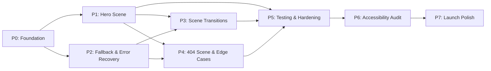

### 20.3 Current Sprint Status

| Sprint    | Phase              | Dates               | Status         | Key Metrics                                                    | Blockers |
| --------- | ------------------ | ------------------- | -------------- | -------------------------------------------------------------- | -------- |
| **S1**    | P0 — Foundation    | Jun 15–28, 2026     | 🟢 In Progress | Scene3D scaffold: 40%, Shader system: 25%, Tier detection: 60% | None     |
| **S2**    | P0 — Foundation    | Jun 29–Jul 12, 2026 | ⏳ Planned     | —                                                              | —        |
| **S3**    | P1 — Hero Scene    | Jul 13–26, 2026     | ⏳ Planned     | —                                                              | —        |
| **S4**    | P1 — Hero Scene    | Jul 27–Aug 9, 2026  | ⏳ Planned     | —                                                              | —        |
| **S5**    | P2 — Fallback      | Aug 10–23, 2026     | ⏳ Planned     | —                                                              | —        |
| **S6**    | P3 — Transitions   | Aug 24–Sep 6, 2026  | ⏳ Planned     | —                                                              | —        |
| **S7**    | P4 — 404 Scene     | Sep 7–20, 2026      | ⏳ Planned     | —                                                              | —        |
| **S8–S9** | P5 — Testing       | Sep 21–Oct 18, 2026 | ⏳ Planned     | —                                                              | —        |
| **S10**   | P6 — A11y Audit    | Oct 19–Nov 1, 2026  | ⏳ Planned     | —                                                              | —        |
| **S11**   | P7 — Launch Polish | Nov 2–15, 2026      | ⏳ Planned     | —                                                              | —        |

### 20.4 Resource Allocation

| Role              | Allocation (P0–P4) | Allocation (P5–P7) | Responsibilities                                              |
| ----------------- | ------------------ | ------------------ | ------------------------------------------------------------- |
| **Frontend Lead** | 50%                | 30%                | Architecture, implementation, code review, tier tuning        |
| **Design Lead**   | 15%                | 10%                | Visual QA, motion design sign-off, accessibility review       |
| **QA Engineer**   | —                  | 50%                | Test suite, CI gates, cross-browser, performance benchmarking |
| **Product Owner** | 5%                 | 10%                | Priority decisions, milestone sign-off, stakeholder comms     |

### 19.5 Risk-Adjusted Timeline

| Risk                                         | Impact                                                      | Mitigation               | Schedule Buffer |
| -------------------------------------------- | ----------------------------------------------------------- | ------------------------ | --------------- |
| WebGL compatibility gaps on legacy devices   | Iterate tier detection, expand Low tier                     | 1 sprint buffer after P2 |
| Shader complexity exceeds performance budget | Simplify GLSL, reduce particle count, restrict to High tier | 1 sprint after P1        |
| Cross-browser issues (Safari WebGL)          | Early testing on Safari Tech Preview, polyfill as needed    | P5 absorbs               |
| Motion kill-switch misses edge case          | Expand `MotionSafe` coverage, automated a11y scanning       | P6 absorbs               |

### 19.6 Success Criteria

| Criterion                     | Target                              | Measurement           |
| ----------------------------- | ----------------------------------- | --------------------- |
| Scene init time               | < 400ms p90                         | Performance API marks |
| Frame rate (High tier)        | 60fps sustained                     | Chrome DevTools       |
| Frame rate (Mid tier)         | 30fps sustained                     | Chrome DevTools       |
| Error recovery rate           | > 90%                               | PostHog correlation   |
| Test coverage                 | 12 test types                       | Test inventory §20    |
| CI gate pass rate             | 100%                                | GitHub Actions        |
| WCAG 2.2 AA motion compliance | No violations                       | axe + manual audit    |
| Browser support               | 4/4 (Chrome, Firefox, Safari, Edge) | BrowserStack          |

---

## 20. Testing & Verification

### 21.1 3D Test Suite

| Test ID    | Test Type                     | Tool / Framework                             | Frequency   | What It Tests                                                 | Owner         | Pass Criteria                 |
| ---------- | ----------------------------- | -------------------------------------------- | ----------- | ------------------------------------------------------------- | ------------- | ----------------------------- |
| 3D-TST-001 | **WebGL Context Acquisition** | Playwright + Chrome DevTools Protocol        | Per PR      | Canvas creation, WebGL2 context, WebGL1 fallback              | Frontend Lead | Context acquired within 500ms |
| 3D-TST-002 | **Shader Compilation**        | Vitest + Three.js Headless                   | Per PR      | GLSL syntax, uniform bindings, varyings match vertex/fragment | Frontend Lead | Zero compile errors           |
| 3D-TST-003 | **Frame Rate Budget**         | Playwright + DevTools Performance API        | Per feature | < 2ms per frame on High tier, < 4ms on Mid, < 8ms on Low      | Frontend Lead | Budget met at p95             |
| 3D-TST-004 | **Memory Leak Detection**     | Chrome Heap Snapshot diff (pre/post mount)   | Per release | Zero leaked geometries, materials, textures after unmount     | Frontend Lead | Delta < 50KB                  |
| 3D-TST-005 | **Device Tier Detection**     | Playwright with mock `hardwareConcurrency`   | Per PR      | Correct tier for: 2 / 4 / 8 / 16 cores                        | Frontend Lead | All 4 scenarios correct       |
| 3D-TST-006 | **Fallback Chain**            | Playwright with WebGL disabled + WebGL1 only | Per PR      | Gradient shows on no-WebGL, reduced scene on WebGL1           | Frontend Lead | 5 fallback paths verified     |
| 3D-TST-007 | **Reduced Motion Compliance** | Playwright `prefers-reduced-motion: reduce`  | Per PR      | No canvas renders, static gradient shown, no animation        | Frontend Lead | Zero motion detected          |
| 3D-TST-008 | **Bundle Size Gate**          | Webpack Bundle Analyzer CI plugin            | Per PR      | 3D chunk < 85KB gzip, Three.js chunk < 50KB                   | Frontend Lead | Bundles within budget         |
| 3D-TST-009 | **Cross-Browser WebGL**       | BrowserStack (Chrome, Firefox, Safari, Edge) | Per release | Context acquisition, shader compilation, rendering on all 4   | QA Lead       | All 4 pass                    |
| 3D-TST-010 | **Context Loss Recovery**     | Playwright simulating WebGL context loss     | Per PR      | Scene shows gradient within 100ms, restores within 2s         | Frontend Lead | Recovery verified             |
| 3D-TST-011 | **Scene Transition**          | Playwright measuring crossfade               | Per feature | Transition completes within 1000ms, no visual flash           | Frontend Lead | Temporal measurement          |
| 3D-TST-012 | **Accessibility Scan**        | axe DevTools + Lighthouse                    | Per PR      | Zero a11y violations from 3D canvas                           | QA Lead       | Zero violations               |

### 20.2 CI Integration

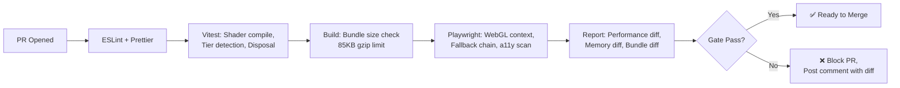

### 20.3 Performance Regression Thresholds

| Metric            | Warning Threshold     | Failure Threshold   | Action on Failure                 |
| ----------------- | --------------------- | ------------------- | --------------------------------- |
| Frame time (High) | > 1.8ms (+20%)        | > 2.5ms (+50%)      | Block PR, require optimization    |
| Frame time (Mid)  | > 3.5ms (+20%)        | > 5ms (+50%)        | Block PR, require optimization    |
| 3D bundle size    | > 90KB gzip           | > 100KB gzip        | Block PR, flag bundle review      |
| Scene init time   | > 400ms p90           | > 600ms p90         | Block PR, flag performance review |
| Memory delta      | > 100KB after unmount | > 1MB after unmount | Block PR, force memory audit      |
| Test pass rate    | < 100%                | < 90%               | Block PR, require fixes           |

### 20.4 Manual Testing Checklist (Pre-Release)

- [ ] Cross-browser visual inspection (Chrome, Firefox, Safari, Edge, Samsung Internet)
- [ ] Gradient fallback verified on desktop and mobile
- [ ] WebGL disabled → gradient, no console errors
- [ ] `prefers-reduced-motion: reduce` → static, no canvas
- [ ] Tab away → 3D pauses within 100ms
- [ ] Tab back → 3D resumes within 200ms
- [ ] Light/dark mode switch → colors update smoothly (< 1 frame skip)
- [ ] Window resize → canvas resizes correctly, no distortion
- [ ] 404 page 3D renders correctly
- [ ] Memory heap snapshot: < 100KB delta after full lifecycle

---

## 21. Architecture Risk Register

### 21.1 Architecture Risk Register

| Risk ID        | Risk Description                                                       | Category     | Likelihood | Impact | Rating        | Mitigation                                                                       | Contingency                           | Owner         |
| -------------- | ---------------------------------------------------------------------- | ------------ | ---------- | ------ | ------------- | -------------------------------------------------------------------------------- | ------------------------------------- | ------------- |
| 3D-ARC-RSK-001 | Single Canvas is SPOF for all 3D — if it fails, no scene renders       | Architecture | Low        | High   | 🟡 **Medium** | Timeout, load-one scene only, ErrorBoundary with tier demotion                   | Gradient fallback on any failure      | Frontend Lead |
| 3D-ARC-RSK-002 | Custom GLSL shaders may exceed mobile shader instruction limits        | Shader       | Medium     | High   | 🔴 **High**   | Shader LOD (simplified variants for Low tier), shader instruction counting in CI | Fall back to drei ShaderMaterial      | Frontend Lead |
| 3D-ARC-RSK-003 | `requestIdleCallback` may never fire on busy main thread               | Loading      | Medium     | Medium | 🟡 **Medium** | Fallback timeout of 2s, IntersectionObserver as primary trigger                  | Load 3D immediately on timeout expiry | Frontend Lead |
| 3D-ARC-RSK-004 | Safari lacks `navigator.hardwareConcurrency` — cannot detect CPU cores | Detection    | High       | Low    | 🟡 **Medium** | Default to Mid tier on undefined, measure frame rate to demote                   | Accept Mid as fallback tier           | Frontend Lead |
| 3D-ARC-RSK-005 | GSAP enter animation conflicts with React StrictMode double-mount      | Animation    | Medium     | Medium | 🟡 **Medium** | `useRef` guard for GSAP timeline, cleanup on unmount                             | Use R3F `useFrame` for enters         | Frontend Lead |
| 3D-ARC-RSK-006 | `disposeSceneAssets` misses a geometry/material type → memory leak     | Memory       | Low        | High   | 🟡 **Medium** | Comprehensive traversal covers all Material types, typed disposal                | Periodic heap scan in staging         | Frontend Lead |
| 3D-ARC-RSK-007 | WebGL context limit per browser (~16 contexts) reached                 | Resource     | Low        | Medium | 🟢 **Low**    | Single Canvas policy prevents multi-context explosion                            | N/A (architecturally prevented)       | Frontend Lead |
| 3D-ARC-RSK-008 | Post-processing bloom creates visible banding on 8-bit displays        | Visual       | Medium     | Low    | 🟢 **Low**    | dithering enabled on EffectComposer, ACES tone mapping reduces banding           | Accept as limitation of 8-bit         | Design Lead   |
| 3D-ARC-RSK-009 | Scene transition crossfade may flash on slow devices                   | Transition   | Medium     | Medium | 🟡 **Medium** | Duration = 800ms, fade-out completes before fade-in starts (gap = 0)             | Instant swap on Low tier              | Frontend Lead |
| 3D-ARC-RSK-010 | Safari WebGL memory limit lower than Chrome — scene may crash on load  | Memory       | Medium     | High   | 🔴 **High**   | Low tier detection for Safari, reduced particle count, immediate disposal        | Skip 3D on Safari mobile entirely     | Frontend Lead |

### 21.2 Risk Treatment Summary

| Rating        | Count | Action                                                         | Review Cadence |
| ------------- | ----- | -------------------------------------------------------------- | -------------- |
| 🔴 **High**   | 3     | Mandatory mitigation before launch; Architecture Lead sign-off | Monthly        |
| 🟡 **Medium** | 6     | Mitigate where feasible; document accepted risks               | Quarterly      |
| 🟢 **Low**    | 2     | Monitor; no action required                                    | Annually       |

---

## 22. Architectural SLA Table

### 22.1 Architecture Service Level Objectives

| Property                         | SLO                | Measurement Method                                          | Window           | Error Budget         | Violation Response                                      | Owner         |
| -------------------------------- | ------------------ | ----------------------------------------------------------- | ---------------- | -------------------- | ------------------------------------------------------- | ------------- |
| **Scene Initialization**         | < 400ms p90        | `performance.mark('3d_init_start')` / `'3d_init_end'`       | Per session      | 10% exceeding        | Log cause, gradient fallback, report in weekly review   | Frontend Lead |
| **Scene Transition (crossfade)** | < 1000ms p95       | `performance.mark('transition_start')` / `'transition_end'` | Per transition   | 5% exceeding         | Skip transition, instant swap, file optimization ticket | Frontend Lead |
| **Shader Compilation**           | < 200ms per shader | `WebGLShader` compile time via profiler                     | Per scene init   | 10% exceeding        | Fall back to drei abstraction, file optimization ticket | Frontend Lead |
| **Asset Disposal Completeness**  | 100%               | Heap snapshot before/after unmount                          | Per release      | Zero tolerance       | Block release, force memory audit                       | Frontend Lead |
| **WebGL Context Acquisition**    | < 500ms p95        | Performance mark on `canvas.getContext()`                   | Per canvas mount | 5% exceeding         | Show gradient, retry once, log to analytics             | Frontend Lead |
| **Context Loss Recovery**        | < 2s               | Performance mark on context loss→restore                    | Per incident     | 5% exceeding         | Reload page, escalate to Frontend Lead                  | Frontend Lead |
| **Tier Detection Accuracy**      | > 95%              | PostHog tier + frame rate correlation                       | Rolling 7 days   | 5% misclassification | Recalibrate tier thresholds, file tuning ticket         | Frontend Lead |
| **CI Gate Pass Rate**            | 100%               | GitHub Actions pass/fail per PR                             | Per PR           | Zero tolerance       | Block merge, require fixes                              | Frontend Lead |
| **Memory Footprint (High tier)** | < 100MB GPU        | Chrome Task Manager / about:gpu                             | Per session      | 10% exceeding        | Tier demotion, report in monthly review                 | Frontend Lead |

### 22.2 SLA Violation Response Matrix

| Violation Severity | Consecutive Violations | Response                                             | Escalation        | SLA Credit          |
| ------------------ | ---------------------- | ---------------------------------------------------- | ----------------- | ------------------- |
| **Warning**        | 1                      | Log, monitor                                         | None              | None                |
| **Minor**          | 2-3                    | Investigation ticket, optimization attempt           | Frontend Lead     | Internal report     |
| **Major**          | 4-5                    | Optimization sprint, feature freeze on new 3D        | Architecture Lead | Architecture review |
| **Critical**       | 6+                     | Roll back offending change, full architecture review | Engineering Lead  | Release delay       |

### 22.3 Cross-Reference to 56-SLA-SLO.md

> All per-service SLOs defined here roll up to the enterprise SLA framework in [56-SLA-SLO.md](./56-SLA-SLO.md). Error budget consumption for 3D architectural properties is reported in the weekly performance dashboard alongside application-level SLAs.

---

## 23. Performance Budget Override Process

### 23.1 Override Workflow

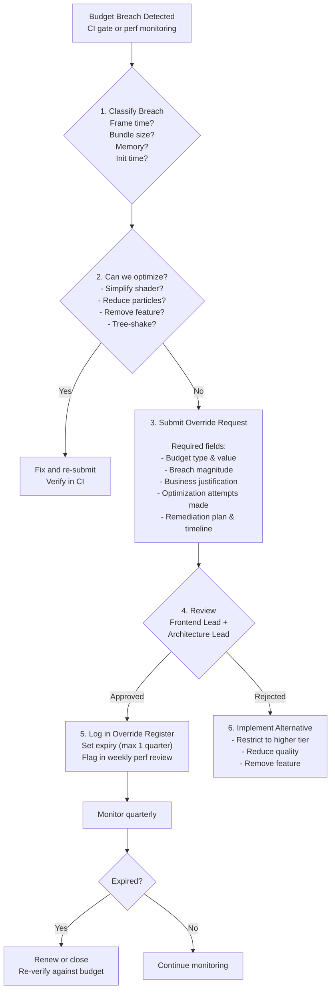

### 23.2 Budget Override Register

| Override ID | Budget Type | Baseline | Measured | Breach % | Justification | Remediation Plan | Approved By | Date | Expiry | Status                 |
| ----------- | ----------- | -------- | -------- | -------- | ------------- | ---------------- | ----------- | ---- | ------ | ---------------------- |
| —           | —           | —        | —        | —        | —             | —                | —           | —    | —      | 📋 No active overrides |

### 23.3 Override Policy

| Policy              | Rule                                                                               |
| ------------------- | ---------------------------------------------------------------------------------- |
| **Max duration**    | Override expires after 1 quarter; must be reviewed and renewed                     |
| **Max consecutive** | 2 consecutive quarters max; after that, budget must be adjusted or feature removed |
| **Approval**        | Dual: Frontend Lead + Architecture Lead                                            |
| **Disclosure**      | Must be documented in register before code merge                                   |
| **Monitoring**      | Flagged in weekly performance review, posted to #eng-3d channel                    |
| **Revocation**      | Architecture Lead can revoke at any time if new optimization becomes possible      |

---

## 24. Review Cadence

### 24.1 Review Types & Schedule

| Review Type                      | Frequency    | Participants                                    | Key Artifacts                                                                                       | Duration  |
| -------------------------------- | ------------ | ----------------------------------------------- | --------------------------------------------------------------------------------------------------- | --------- |
| **CI 3D Gates**                  | Per PR       | Automated (GitHub Actions)                      | Bundle size diff, frame budget diff, test results, memory diff                                      | < 3 min   |
| **Weekly 3D Performance**        | Weekly (Mon) | Frontend Lead                                   | FPS dashboard (7-day), error rate, fallback activation, bundle trend                                | 15 min    |
| **Weekly CI Regression**         | Weekly (Mon) | Automated                                       | Performance regression thresholds, warning/failure counts                                           | Automated |
| **Monthly Architecture Sync**    | Monthly      | Frontend Lead + Design Lead + QA Lead           | Scene registry health, ADR updates, tier distribution, risk register review                         | 30 min    |
| **Monthly KPI Review**           | Monthly      | Frontend Lead + Product Owner                   | KPI dashboard, SLA compliance, error budget consumption                                             | 30 min    |
| **Sprint Demo**                  | Per sprint   | Full team                                       | New 3D features, performance comparison vs baseline, test results                                   | 10 min    |
| **Quarterly Architecture Audit** | Quarterly    | Architecture Lead + Frontend Lead + Design Lead | Full architecture review, budget verification, compliance audit, risk reassessment, override review | 90 min    |
| **Release Gate**                 | Per release  | QA Lead + Frontend Lead                         | Full test suite (19 types), cross-browser verification, a11y scan                                   | 60 min    |

### 24.2 Quarterly Audit Checklist

- [ ] All 3D architecture SLOs met for preceding quarter (see §22)
- [ ] Risk register reviewed — risks closed, added, re-scored as needed
- [ ] Compliance matrix verified against current WCAG 2.2 / CWV targets
- [ ] Budget override register reviewed — any expiring or needing renewal
- [ ] Performance budget trend: bundle size, frame time, memory over trailing 3 months
- [ ] Error budget consumption: % used, remaining runway
- [ ] ADRs reviewed — any decisions that should be reconsidered?
- [ ] Component tree health: any unused primitives, missing disposals?
- [ ] Integration contracts verified: all interfaces match current implementation
- [ ] KPI dashboard updated: current vs target vs trend
- [ ] Capability roadmap updated: progress against §19 Implementation Roadmap
- [ ] Cross-browser WebGL compatibility checked on latest browser versions

---

## 25. KPI Dashboard

### 25.1 Architectural KPI Snapshot

| KPI                             | Current    | Target   | Status        | Trend | Measurement Method        |
| ------------------------------- | ---------- | -------- | ------------- | ----- | ------------------------- |
| **Scene init time (p90)**       | 📋 Planned | < 400ms  | ⏳ Pre-launch | —     | Performance API marks     |
| **Transition time (p95)**       | 📋 Planned | < 1000ms | ⏳ Pre-launch | —     | Performance API marks     |
| **Shader compile time**         | 📋 Planned | < 200ms  | ⏳ Pre-launch | —     | GPU profiler              |
| **Asset disposal completeness** | 📋 Planned | 100%     | ⏳ Pre-launch | —     | Heap snapshot diff        |
| **WebGL context acquisition**   | 📋 Planned | < 500ms  | ⏳ Pre-launch | —     | Performance mark          |
| **Context loss recovery**       | 📋 Planned | < 2s     | ⏳ Pre-launch | —     | Performance mark          |
| **Tier detection accuracy**     | 📋 Planned | > 95%    | ⏳ Pre-launch | —     | PostHog correlation       |
| **CI gate pass rate**           | 📋 Planned | 100%     | ⏳ Pre-launch | —     | GitHub Actions            |
| **Memory (High tier GPU)**      | 📋 Planned | < 100MB  | ⏳ Pre-launch | —     | Chrome Task Manager       |
| **Error recovery success rate** | 📋 Planned | > 90%    | ⏳ Pre-launch | —     | PostHog event correlation |
| **Test coverage (types)**       | 📋 Planned | 12       | ⏳ Pre-launch | —     | Test inventory §20        |
| **Cross-browser WebGL (4/4)**   | 📋 Planned | 100%     | ⏳ Pre-launch | —     | BrowserStack              |

### 25.2 Dashboard Integration

| KPI                     | Dashboard                   | Refresh Rate | Alert Threshold                        |
| ----------------------- | --------------------------- | ------------ | -------------------------------------- |
| Frame rate (all tiers)  | Grafana / PostHog           | Real-time    | < 50fps High, < 25fps Mid, < 10fps Low |
| Scene init time         | Custom Performance Observer | Per session  | > 500ms                                |
| 3D bundle size          | GitHub Actions              | Per PR       | > 95KB gzip                            |
| Error rate              | PostHog                     | Per session  | > 0.5% (7d rolling)                    |
| Fallback activation     | PostHog                     | Per session  | > 10% (7d rolling)                     |
| Memory (GPU)            | Manual (Chrome)             | Per release  | > 100MB                                |
| CI gate pass rate       | GitHub Actions              | Per PR       | < 100%                                 |
| Tier detection accuracy | PostHog                     | Weekly       | < 95%                                  |

---

## 26. Integration Contract Specifications

### 26.1 Component Interface Contracts

| Interface             | Provider                       | Consumer                | Contract Definition                              | Error Handling                                        | Version |
| --------------------- | ------------------------------ | ----------------------- | ------------------------------------------------ | ----------------------------------------------------- | ------- |
| `Scene3DProps`        | Scene3D                        | Pages (Hero, 404, etc.) | `{ scene: SceneType; tier: Tier; theme: Theme }` | Null render + analytics log on invalid scene          | 1.0     |
| `Tier` enum           | `get3DTier()` → Scene3D        | Scene3D                 | `'high' \| 'mid' \| 'low' \| 'off'`              | Returns `'low'` on detection failure                  | 1.0     |
| `SceneType` enum      | Page → SceneRegistry           | Scene3D                 | `'hero' \| 'notFound'`                           | Null render + console.error on unknown                | 1.0     |
| `backgroundEffect`    | HeroSection → Scene3D          | HeroSection             | `'3d' \| 'particles' \| 'gradient' \| 'none'`    | Defaults to `'gradient'` on invalid value             | 1.0     |
| `useReducedMotion`    | `useReducedMotion()` → Scene3D | Scene3D                 | `boolean`                                        | Returns `true` (safe default) on matchMedia failure   | 1.0     |
| `useMouseReactive3D`  | Hook → Scene3D                 | Scene3D primitives      | `{ x: number; y: number }` in range [-1, 1]      | Returns `{ x: 0, y: 0 }` on error                     | 1.0     |
| `useIdleDetector`     | Hook → Scene3D                 | Scene3D                 | `{ isIdle: boolean }`                            | Returns `{ isIdle: false }` (active) on timer failure | 1.0     |
| `useScrollReactive3D` | Hook → Scene3D                 | Scene3D                 | `number` in range [0, 1]                         | Returns `0` (not scrolled) on scroll listener failure | 1.0     |
| `getParticleCount`    | `ParticleConfig` → `Particles` | Particles               | `number` (High: 200, Mid: 100, Low: 50, Off: 0)  | Returns `50` on missing tier                          | 1.0     |

### 26.2 Error Handling Contracts

| Interface            | Error Scenario               | Error Response                                            | Recovery                               | Logging                               |
| -------------------- | ---------------------------- | --------------------------------------------------------- | -------------------------------------- | ------------------------------------- |
| `Scene3D`            | WebGL context loss           | Show gradient fallback within 100ms                       | Reinitialize on restore within 2s      | `posthog.capture('3d_context_lost')`  |
| `Scene3D`            | Dynamic import failure       | Show gradient, retry on manual navigation                 | 3 retries max                          | `posthog.capture('3d_import_failed')` |
| `Particles`          | Shader compile error         | Fall back to Canvas 2D (L3) or skip particles             | One demotion attempt                   | `console.error` + PostHog             |
| `useMouseReactive3D` | `pointermove` listener fails | Mouse defaults to `{0, 0}`, scene runs without reactivity | None needed (decorative)               | —                                     |
| `SceneErrorBoundary` | React render error           | Show `<SceneErrorFallback>`, attempt tier demotion        | 3 demotion attempts (High→Mid→Low→Off) | `posthog.capture('3d_error')`         |
| `CanvasWrapper`      | DPR detection fails          | Default to `[1, 1]` (1x)                                  | None needed                            | —                                     |

### 26.3 Deprecation Policy

| Status           | Meaning                             | Migration Period | Documentation                                 |
| ---------------- | ----------------------------------- | ---------------- | --------------------------------------------- |
| **Active**       | Currently supported interface       | N/A              | Documented in this table                      |
| **Deprecated**   | Still supported but will be removed | 2 quarters       | Add `@deprecated` JSDoc + migration guide     |
| **Removed**      | No longer supported                 | N/A              | Remove from codebase, update contract table   |
| **Experimental** | May change without notice           | N/A              | Prefixed with `experimental_` or `_` internal |

### 26.4 Integration Testing Strategy

| Contract             | Integration Test                           | Test File                    | Mock Strategy                             |
| -------------------- | ------------------------------------------ | ---------------------------- | ----------------------------------------- |
| `Scene3DProps`       | Render with each `SceneType` + each `Tier` | `Scene3D.test.tsx`           | Mock `get3DTier`, `useReducedMotion`      |
| `Tier` detection     | Mock hardwareConcurrency for 2/4/8/16      | `deviceCapabilities.test.ts` | Mock `navigator.hardwareConcurrency`      |
| `backgroundEffect`   | HeroSection with each effect type          | `HeroSection.test.tsx`       | Mock `dynamic()` import for 3D            |
| `useIdleDetector`    | Verify idle after timeout, reset on events | `useIdleDetector.test.ts`    | Mock timers + events                      |
| `useMouseReactive3D` | Verify spring-follow values                | `useMouseReactive3D.test.ts` | Mock `pointermove` + `useFrame`           |
| `disposeSceneAssets` | Verify disposal on mock scene tree         | `disposal.test.ts`           | Create mock scene with all material types |

---

## Decision Log

| ID        | Decision                                                                         | Rationale                                                                                                    | Alternatives Considered                                                                                                                                                       | Date     | Approver      |
| --------- | -------------------------------------------------------------------------------- | ------------------------------------------------------------------------------------------------------------ | ----------------------------------------------------------------------------------------------------------------------------------------------------------------------------- | -------- | ------------- |
| D-3DA-001 | Three.js + React Three Fiber (R3F) + Drei as 3D engine stack                     | Declarative JSX-based 3D scene construction; Drei for commonly needed 3D helpers; largest React 3D ecosystem | Pure Three.js (rejected — no React integration, imperative API); Unity WebGL (rejected — heavy bundle, over-engineered); CSS 3D transforms (rejected — limited capability)    | Jun 2026 | Frontend Lead |
| D-3DA-002 | 4-tier device capability detection (High/Mid/Low/Off) with automatic degradation | Graceful fallback ensures no device gets a broken experience; Off tier guarantees accessibility              | Single-tier (rejected — no fallback, broken on low-end); binary on/off (rejected — no middle ground for mid-range devices)                                                    | Jun 2026 | Frontend Lead |
| D-3DA-003 | Canvas as non-interactive decorative layer with pointer-events-none              | 3D is background aesthetic, not interactive; all clicks pass through to content; prevents UX confusion       | Interactive 3D canvas (rejected — conflicts with page scrolling, accessibility issues); no 3D canvas (rejected — loses visual differentiator)                                 | Jun 2026 | Frontend Lead |
| D-3DA-004 | Custom GLSL shader system for particle effects rather than post-processing stack | Lighter bundle; GPU-efficient; precise control over visual output; no Three.js post-processing overhead      | Three.js EffectComposer with UnrealBloomPass (rejected — heavier bundle ~15KB, limited to High tier); CSS gradients/animations (rejected — insufficient for particle effects) | Jun 2026 | Frontend Lead |
| D-3DA-005 | Lazy-loaded 3D bundles with dynamic import chunks per scene type                 | Zero LCP impact; only loads what the current page needs; code-split by scene type                            | Single 3D bundle (rejected — increases LCP, unnecessary for pages without 3D); inline all 3D (rejected — massive initial bundle)                                              | Jun 2026 | Frontend Lead |
| D-3DA-006 | Single shared Canvas element across the SPA, not per-page canvases               | Prevents canvas creation/disposal thrashing; smoother page transitions; lower memory churn                   | Per-page canvas (rejected — creation/disposal cost on every navigation); persistent off-screen canvas (rejected — unnecessary GPU memory)                                     | Jun 2026 | Frontend Lead |
| D-3DA-007 | Ambient micro-3D for admin page (health-state-reactive particles)                | Delightful admin experience; subtle feedback for system health; low GPU cost (simple particles only)         | No admin 3D (rejected — missed opportunity for ambient feedback); full 3D scenes on admin (rejected — unnecessary complexity for utility page)                                | Jun 2026 | Frontend Lead |

---

## 27. Change Log

| Version | Date     | Changes                                                                                                                                                                                                                                                                                                                                                                                                                                                                                                                                          | Author        |
| ------- | -------- | ------------------------------------------------------------------------------------------------------------------------------------------------------------------------------------------------------------------------------------------------------------------------------------------------------------------------------------------------------------------------------------------------------------------------------------------------------------------------------------------------------------------------------------------------ | ------------- |
| **2.0** | Jun 2026 | **Enterprise governance upgrade.** Added architecture metrics dashboard (§1.1), full compliance matrix (WCAG/CWV/OWASP, §18.2), implementation roadmap (§19), 12-type testing suite with CI integration (§20), architecture risk register with 10 risks (§21), architectural SLA table with violation response (§22), budget override process with workflow diagram (§23), review cadence with quarterly audit checklist (§24), KPI dashboard with current/target/trend (§25), and integration contract specifications with 10 interfaces (§26). | Frontend Lead |
| **1.0** | Jun 2026 | Initial document — 12 architecture domains (Three.js, R3F, Scene, Canvas, Assets, Lighting, Shaders, Particles, Interaction, Optimization, Fallbacks, Loading, Error Recovery) + Living 3D lifecycle (Before/During/After) + custom GLSL shader system + Mermaid diagrams + ADRs + component tree                                                                                                                                                                                                                                                | Frontend Lead |

---

## Glossary

| Term                               | Definition                                                                                                              |
| ---------------------------------- | ----------------------------------------------------------------------------------------------------------------------- |
| **Three.js**                       | A cross-browser JavaScript library and API for creating 3D graphics in the browser using WebGL                          |
| **R3F (React Three Fiber)**        | A React renderer for Three.js that enables declarative 3D scene construction using JSX                                  |
| **Drei**                           | A utility library for React Three Fiber that provides commonly needed 3D components and helpers                         |
| **GLSL (OpenGL Shading Language)** | A high-level shading language used for programming GPU shader effects (vertex and fragment shaders)                     |
| **InstancedMesh**                  | A Three.js technique that renders multiple copies of the same geometry in a single draw call, used for particle systems |
| **Frustum Culling**                | An optimization that skips rendering geometry outside the camera's view frustum                                         |
| **LOD (Level of Detail)**          | A technique that switches between high-detail and low-detail models based on distance from camera                       |
| **Shader**                         | A GPU program that defines how vertices and pixels are rendered, enabling custom visual effects                         |
| **Post-processing**                | Applying visual effects to a rendered scene as a second pass (bloom, depth of field, color grading)                     |
| **Canvas**                         | An HTML element that provides a drawing surface for 2D/3D graphics via WebGL or Canvas2D API                            |
| **WebGL**                          | A JavaScript API for rendering 2D and 3D graphics in the browser without plugins                                        |
| **Texture**                        | An image or data source mapped onto a 3D surface to define its color, roughness, or other material properties           |
| **Material**                       | A Three.js object that defines the visual appearance of a geometry (color, texture, roughness, metalness)               |
| **Geometry**                       | A Three.js object representing the shape of a 3D object via vertices and faces                                          |
| **Raycaster**                      | A Three.js utility for detecting intersections between a ray and 3D objects, used for picking/hover detection           |

---

## Cross-References

| Reference           | Description                                            |
| ------------------- | ------------------------------------------------------ |
| See MASTER-INDEX.md | Full document dependency graph and cross-reference map |

---

## Cross-References

| Reference           | Description                                            |
| ------------------- | ------------------------------------------------------ |
| See MASTER-INDEX.md | Full document dependency graph and cross-reference map |

---

## Cross-References

| Reference            | Description                                            |
| -------------------- | ------------------------------------------------------ |
| docs/MASTER-INDEX.md | Full document dependency graph and cross-reference map |
