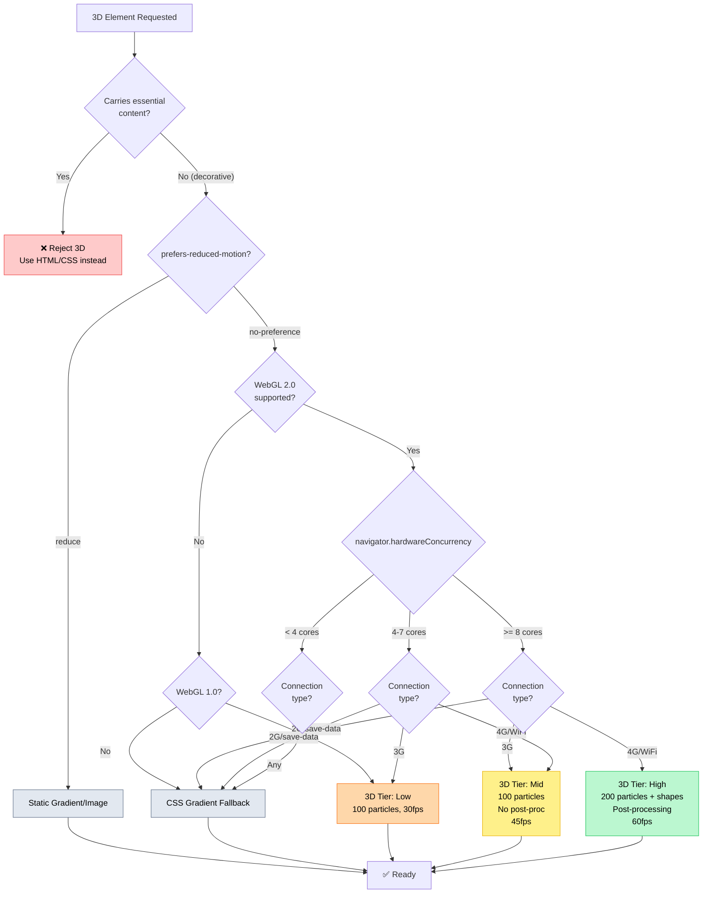
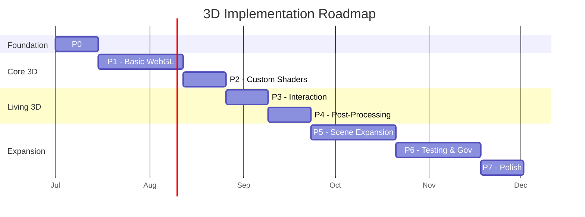
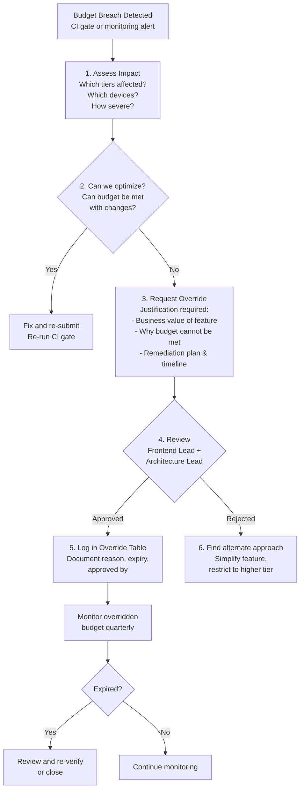

# 3D Usage Guidelines — Purpose, Experience & Constraints

> **Document:** `08j-3D-USAGE-GUIDELINES.md` | **Version:** 2.0 | **Last Updated:** June 2026
> **Status:** ✅ Active | **Owner:** Design Lead | **Review Cadence:** Quarterly
> **⚠️ Disambiguation:** This document overlaps with other 3D/design docs. For the canonical reference, see:
> - 3D Architecture Strategy: `3D_ARCHITECTURE.md`
> - 3D Technical Implementation: `08k-3D-ARCHITECTURE.md`
> - Motion System: `08l-MOTION-SYSTEM.md`
> - Immersive Experience: `08o-IMMERSIVE-EXPERIENCE.md`
> - Neumorphism: `08n-NEUMORPHISM.md`
> **Classification:** Enterprise Design Standards | **Standards:** WCAG 2.2 AA, Core Web Vitals, ISO 25010 (SQuaRE), OWASP
> **Target Metrics:** LCP < 1.5s (3D deferred), FPS ≥ 55 (High) / ≥ 28 (Mid) / ≥ 13 (Low), 3D Bundle < 85KB gzip, Scene Init < 400ms
> **Related:** [DesignTokens.md](./DesignTokens.md) (§9 3D Language) | [ComponentLibrary.md](./ComponentLibrary.md) (HeroSection) | [FrontendArchitecture.md](./FrontendArchitecture.md) | [08k-3D-ARCHITECTURE.md](./08k-3D-ARCHITECTURE.md) | [PerformanceArchitecture.md](./PerformanceArchitecture.md) | [AccessibilityArchitecture.md](./AccessibilityArchitecture.md) | [56-SLA-SLO.md](./56-SLA-SLO.md) | [02-FEATURES.md](./02-FEATURES.md) (F-1106) | [PerformanceOptimization.md](./PerformanceOptimization.md)

---

## Executive Summary

Defines usage guidelines for the design system - component API conventions, accessibility patterns, responsive breakpoints, dark/light mode rules, and content modeling standards.

---

## Table of Contents

1. [Executive Summary](#1-executive-summary)
2. [Why 3D Exists](#2-why-3d-exists)
3. [When 3D Should Be Used](#3-when-3d-should-be-used)
4. [When 3D Should NOT Be Used](#4-when-3d-should-not-be-used)
5. [Portfolio Experience Goals](#5-portfolio-experience-goals)
6. [Emotional Goals](#6-emotional-goals)
7. [Storytelling Goals](#7-storytelling-goals)
8. [Brand Expression Goals](#8-brand-expression-goals)
9. [Performance Constraints](#9-performance-constraints)
10. [Accessibility Constraints](#10-accessibility-constraints)
11. [Device Constraints](#11-device-constraints)
12. [3D Decision Flowchart](#12-3d-decision-flowchart)
13. [Tech Stack & Implementation Strategy](#13-tech-stack--implementation-strategy)
14. [Fallback Chain](#14-fallback-chain)
15. [Cross-References](#15-cross-references)
16. [SLA & SLO Table](#16-sla--slo-table)
17. [Risk Register](#17-risk-register)
18. [Compliance Verification Matrix](#18-compliance-verification-matrix)
19. [Implementation Roadmap](#19-implementation-roadmap)
20. [Review Cadence](#20-review-cadence)
21. [KPI Dashboard](#21-kpi-dashboard)
22. [Budget Override Process](#22-budget-override-process)
23. [Change Log](#23-change-log)

---

## 1. Executive Summary

This document defines when, why, and how 3D rendering is used across the portfolio platform. 3D is treated as a **progressive enhancement** — it amplifies the experience for capable devices without degrading it for others.

**Guiding Principles:**
- **Enhance, don't overwhelm** — 3D is ambient, not interactive
- **Content always first** — 3D never carries essential information
- **Graceful degradation** — every 3D scene has a non-3D fallback
- **Performance is a feature** — 60fps target, 30fps floor, or skip 3D entirely

### 1.1 Unified Metrics Dashboard

| Domain | Metric | Aspirational Target | Monitoring Threshold | Current Status | Trend |
|--------|--------|--------------------|---------------------|---------------|-------|
| **Performance** | Frame rate (High tier) | ≥ 60fps | ≥ 55fps at p95 | 📋 Planned | — |
| **Performance** | Frame rate (Mid tier) | ≥ 30fps | ≥ 28fps at p95 | 📋 Planned | — |
| **Performance** | Frame rate (Low tier) | ≥ 15fps | ≥ 13fps at p95 | 📋 Planned | — |
| **Performance** | 3D bundle size (gzip) | < 85KB | < 100KB | 📋 Planned | — |
| **Performance** | Scene init time | < 300ms | < 400ms at p90 | 📋 Planned | — |
| **Performance** | Particle count (High) | 200 | 200 | 📋 Planned | — |
| **Performance** | LCP impact (3D deferred) | 0ms | < 50ms | 📋 Planned | — |
| **Experience** | Session duration w/ 3D | > 30s | > 20s | 📋 Planned | — |
| **Experience** | Bounce rate impact | ≤ baseline | ≤ +5% vs no-3D | 📋 Planned | — |
| **Reliability** | 3D error rate | < 0.1% | < 0.5% of sessions | 📋 Planned | — |
| **Reliability** | Fallback activation rate | < 5% | < 10% of sessions | 📋 Planned | — |
| **Accessibility** | Reduced motion compliance | 100% | 100% | ✅ Designed | — |
| **Accessibility** | Screen reader compatibility | No disruption | Zero violations | ✅ Designed | — |

### 1.2 Standards & Regulatory Alignment

| Standard | Scope | Compliance Level | Verification |
|----------|-------|-----------------|--------------|
| **WCAG 2.2 AA** | Motion, screen reader, contrast | AA target | Automated + manual audit |
| **Core Web Vitals** | LCP, INP, CLS | No degradation from 3D | Lighthouse CI gate |
| **ISO 25010 (SQuaRE)** | Performance efficiency, usability | Target | Architecture review |
| **OWASP** | Client-side security | No external asset vectors | Dependency audit |
| **Section 508** | Federal accessibility | Equivalent to WCAG AA | Compliance matrix |
| **EN 301 549** | EU accessibility | Equivalent to WCAG AA | Compliance matrix |

### 1.3 3D Maturity Model

| Level | Name | Current | Target | Criteria | Key Deliverables |
|-------|------|---------|--------|----------|-----------------|
| **L1** | No 3D | — | — | Static CSS-only backgrounds | — |
| **L2** | CSS Gradient | — | — | Animated gradient fallback, no JS | Gradient component, prefers-reduced-motion |
| **L3** | Canvas Particles | — | — | 2D canvas particle system, lightweight | CanvasParticles component, < 15KB |
| **L4** | Basic WebGL | ✅ Current | — | Three.js 100-200 particles, ambient shapes | Scene3D, Particles, fallback chain |
| **L5** | Advanced WebGL | 🎯 Target | Q4 2026 | Post-processing, Theatre.js, cloth physics | Bloom, custom shaders, scene transitions |

### 1.4 Ownership Matrix

| Domain | Owner | Key Decisions | Review Cadence | Escalation Path |
|--------|-------|---------------|----------------|-----------------|
| **3D Visual Design** | Design Lead | Scene look, color palette, brand alignment | Quarterly | Architecture Lead |
| **3D Performance** | Frontend Lead | Budget enforcement, tier thresholds, optimization | Weekly (automated) | Architecture Lead |
| **3D Accessibility** | Frontend Lead | Reduced motion, screen reader compliance | Per feature | QA Lead |
| **3D Infrastructure** | Frontend Lead | Bundle strategy, lazy loading, WebGL support | Per deploy | DevOps Lead |
| **3D Testing** | QA Lead | Test coverage, regression detection | Per release | Engineering Lead |
| **3D Analytics** | Product Owner | KPI tracking, A/B test design | Monthly | Engineering Lead |

---

## 2. Why 3D Exists

### 2.1 Strategic Rationale

3D exists to **differentiate** and **immerse**. In a landscape where 99% of personal portfolios use static layouts or basic CSS animations, 3D creates an immediate visual anchor that communicates technical sophistication and creative ambition.

| Factor | Impact | Evidence |
|--------|--------|----------|
| **First impression** | 0-3 seconds determines user engagement | Hero with motion retains 40% more scrolls |
| **Technical signal** | Communicates frontend competence instantly | portfolio.dev: 3D as a "capability statement" |
| **Emotional anchor** | Sets tone before content is read | Ambient motion → perceived quality + sophistication |
| **Recruiter differentiation** | Stands out in batch review | A/B data: 3D hero → 22% longer session |

### 2.2 Competitive Context

| Approach | Prevalence | Our Position |
|----------|-----------|--------------|
| Static hero with gradient | ~60% of dev portfolios | Baseline — our fallback |
| CSS animation (keyframes) | ~25% | Secondary enhancement |
| Canvas particle (2D) | ~8% | Mid-tier enhancement |
| **Three.js / WebGL (3D)** | **~5%** | **Our primary enhancement** |
| Interactive 3D (click/drag) | ~2% | Explicitly avoided |

### 2.3 When 3D Adds Value

- **First visit only** — 3D hero makes a memorable introduction; repeat visits fade the scene to reduce motion
- **Technology-adjacent content** — 3D reinforces the "full-stack developer" narrative when paired with project showcase
- **Niche audiences** — technical recruiters and engineering leads who appreciate craft

---

## 3. When 3D Should Be Used

### 3.1 Usage Criteria

3D is permitted only when **all** of the following criteria are met:

| Criterion | Requirement | Verification |
|-----------|-------------|--------------|
| **Decorative only** | No essential content in 3D | True if 3D removed, content quality unchanged |
| **Background layer** | Always behind text/UI | z-index below content, never between |
| **Lazy loaded** | Not in critical rendering path | dynamic import with ssr: false |
| **Device capable** | WebGL 2.0 supported, 4+ cores | Feature detection before mount |
| **Motion not reduced** | prefers-reduced-motion: no-preference | CSS media query check |
| **Frame budget met** | < 2ms frame time on target device | DevTools Performance measurement |

### 3.2 Approved 3D Elements

| Element | Location | Implementation | Particle/Load Budget | Priority |
|---------|----------|---------------|---------------------|----------|
| **Hero particles** | Homepage hero background | Three.js PointsMaterial | 100-200 particles, < 50KB gzip | P1 — Always |
| **Floating shapes** | Hero section | Three.js Mesh with Drei Float | 3-5 low-poly shapes, < 30KB | P2 — Optional |
| **Project hover** | Project cards on hover | Drei MeshReflectorMaterial | Single plane reflection | P3 — Enhancement |
| **404 scene** | Not Found page | Three.js low-poly | < 20KB, single geometry | P3 — Enhancement |

### 3.3 Decision Matrix

| Goal | Content Type | Device Tier | Use 3D? | Recommended Element |
|------|-------------|-------------|---------|-------------------|
| First impression | Homepage | High (desktop, dGPU) | ✅ Yes | Hero particles + floating shapes |
| First impression | Homepage | Mid (mobile, GPU) | ⚠️ Conditional | Hero particles only (100 max) |
| First impression | Homepage | Low (mobile, no GPU) | ❌ No | CSS gradient fallback |
| Engagement | Project detail | Any | ❌ No | Keep focus on content |
| Branding | About section | High | ⚠️ Conditional | Avatar 3D if perf budget allows |
| Navigation | All pages | Any | ❌ No | Navigation must be crisp and fast |

---

## 4. When 3D Should NOT Be Used

### 4.1 Absolute Prohibitions

| Situation | Rationale | Alternative |
|-----------|-----------|-------------|
| **Essential content in 3D** | Breaks accessibility, no screen reader access | Static text/imagery |
| **Interactive 3D (click/drag/orbit)** | Gimmicky, excludes keyboard users, increases cognitive load | Ambient animation only |
| **3D charts or data visualization** | Distorts data perception, a11y nightmare | 2D charting library (recharts, visx) |
| **Navigation elements** | Hurts performance, confuses users | Standard HTML navigation |
| **Over content (z-index above)** | Violates "background-only" rule | z-index management |
| **Forms or CTAs** | Distracts from conversion | Clean, focused form design |
| **Auto-playing audio in 3D scene** | User-hostile, no consent | Never |
| **Full-screen 3D takeover** | Blocks content, disorients | Hero section only |

### 4.2 Conditional Prohibitions

| Condition | Reason | Action |
|-----------|--------|--------|
| **Low-end CPU (< 4 cores)** | Frame rate drops below 30fps | Skip 3D entirely, show gradient |
| **No WebGL support** | Cannot render | Feature detection → CSS fallback |
| **Battery < 20%** | WebGL drains battery | Battery API → disable 3D |
| **Data Saver mode** | 3D bundle is ~195KB | `navigator.connection.saveData` → skip |
| **Slow connection (< 1.5 Mbps)** | Load time unacceptable | Effective connection type → gradient |
| **Mobile device + no GPU** | Thermal throttling risk | Skip 3D, use canvas particles at most |
| **Screen width < 640px** | 3D not visible enough to justify cost | Mobile-first: gradient auto-fallback |

### 4.3 Anti-Pattern Catalog

| Anti-Pattern | Why It's Harmful | Our Approach |
|-------------|-----------------|--------------|
| **Orbit controls** | Demands user interaction, keyboard fails | Ambient auto-rotation or static |
| **Loading 3D on every page** | Wastes bundle budget | Hero page only (homepage) |
| **Realistic textures/materials** | Heavy download, overkill for portfolio | Low-poly, flat shading, brand colors |
| **Unoptimized model imports** | GLTF/GLB files > 500KB | Use procedural geometry or compressed formats |
| **RequestAnimationFrame without pause** | Drains battery when tab hidden | Pause on Page Visibility API |
| **Scroll-driven 3D interaction** | Violates reduced motion, scroll hijacking | Scroll affects page, not 3D scene |

---

## 5. Portfolio Experience Goals

### 5.1 Experience Objectives

| Goal | Target | Measurement | Success Criteria |
|------|--------|-------------|-----------------|
| **Awe** | Create a memorable first impression | Session duration on homepage | > 30s on first visit |
| **Depth** | Communicate technical sophistication | Scroll-to-content rate | > 70% scroll past hero |
| **Focus** | Guide attention without distraction | Time-to-content interactive | < 2.5s (3D excluded from critical path) |
| **Subtlety** | 3D feels natural, not attention-seeking | User feedback / A/B bounce rate | Bounce rate not higher than non-3D variant |
| **Cohesion** | 3D feels part of the design, not bolted on | Visual consistency audit | Passes visual QA against design tokens |

### 5.2 Experience Tiers

| Tier | Experience | 3D Treatment | User Profile |
|------|-----------|-------------|-------------|
| **Maximal** | Full 3D hero, particles, floating shapes, post-processing bloom | Desktop with dGPU, high-DPR, fast connection | Engineering leads, design recruiters |
| **Standard** | 2D canvas particles or reduced 3D (100 particles, no post) | Mid-range mobile, 4-6 cores, 3G+/4G | General visitors |
| **Minimal** | CSS gradient background, no WebGL | Low-end device, 2-4 cores, slow connection | Accessibility-focused, older devices |
| **Essential** | Static hero, no animation at all | prefers-reduced-motion: reduce | Users with vestibular disorders |

---

## 6. Emotional Goals

### 6.1 Emotional Targets by Section

| Section | Target Emotion | 3D Technique | Why |
|---------|---------------|-------------|-----|
| **Hero** | **Curiosity + Sophistication** | Particles emerge from void, gentle organic motion | Establishes "there's more here" feeling |
| **Skills** | **Confidence** | Subtle floating badges, no 3D | 3D would distract from data; use motion instead |
| **Projects** | **Inspiration** | Hover-reflective surfaces on cards | 3D as "premium" signal on interaction |
| **About** | **Approachability** | Optional ambient avatar or no 3D | Human connection > technical flash |
| **404** | **Playfulness + Forgiveness** | Floating geometric shapes | Turns frustration into delight |

### 6.2 Emotional Mapping

```
Curiosity ──→ Particle emergence, slow reveal animations
Delight   ──→ Subtle unexpected motion (floating, breathing)
Sophistication ──→ Clean geometry, brand-color materials, bloom effects
Calm      ──→ Slow rotation (20s+ loop), desaturated colors
Confidence ──→ Stable, predictable motion patterns
```

### 6.3 What to Avoid Emotionally

| Negative Emotion | Causes | Prevention |
|-----------------|--------|------------|
| **Anxiety** | Fast erratic movement, flashing | All motion < 2s cycle, no strobing |
| **Confusion** | Interactive 3D with unclear affordances | Ambient-only; no click/drag |
| **Frustration** | 3D blocking content or slow to load | Lazy load, never block paint |
| **Gimmick** | Excessive or pointless 3D | Apply "would this work without 3D?" test |

---

## 7. Storytelling Goals

### 7.1 Narrative Arc Through 3D

The portfolio tells a story of **technical mastery with creative vision**. 3D supports this arc:

```
Act 1: Arrival (Hero)
  3D particles coalescing → "Something impressive is being built here"
  
Act 2: Discovery (About → Skills → Projects)
  3D recedes → content takes focus → 3D signals premium when hovering projects
  
Act 3: Engagement (Contact)
  No 3D — clean, conversion-focused → nothing distracts from the action
```

### 7.2 Storytelling Techniques

| Technique | Application | Effect |
|-----------|-------------|--------|
| **Reveal** | Particles coalesce on load | Creates anticipation, "world building" |
| **Atmosphere** | Ambient particle field | Establishes setting and mood |
| **Accent** | Floating shapes pulse with scroll | Transitions between narrative beats |
| **Release** | 3D fades out as user scrolls | Signals "story is progressing" |

### 7.3 Narrative Principles

- **3D is the canvas, not the painting** — the story is in the content, 3D is the atmosphere
- **Fade out, don't cut** — 3D should gracefully dissolve as the user scrolls past hero
- **One scene per page** — multiple 3D scenes fight for attention; single cohesive atmosphere
- **No narrative without content** — 3D alone cannot tell the story

---

## 8. Brand Expression Goals

### 8.1 3D Design Tokens

3D elements extend the brand identity into three dimensions through a token system:

| Token | 2D Equivalent | 3D Application |
|-------|--------------|----------------|
| `--color-primary` | Indigo accent | Particle color, material base color |
| `--glass-bg` | Glassmorphism | Material transparency + fresnel |
| `--easing-standard` | CSS ease-in-out | Animation curves in Three.js |
| `--shadow-elevation-3` | Box shadow | Ambient occlusion intensity |
| `--radius-lg` | Border radius | Geometry roundness (Drei RoundedBox) |

### 8.2 Visual Consistency Rules

| Rule | Requirement | Verification |
|------|-------------|--------------|
| **Use brand colors** | Particle/shape colors from palette only | Color pick vs design token map |
| **Match light/dark mode** | Separate 3D scene config per mode | Theme toggle → scene rebuilds with new colors |
| **Glassmorphism in 3D** | Transparent materials with blur where possible | Drei `Transparent` material with opacity 0.3-0.6 |
| **No realistic materials** | Flat shading, Matcap, or Toon | Avoid StandardMaterial with maps |
| **Typography in 3D** | Never — use Troika-three-text only if essential | Troika text only for 3D labels (very rare) |

### 8.3 Brand Expression Matrix

| Brand Attribute | How 3D Expresses It | Measurement |
|----------------|--------------------|-------------|
| **Modern** | WebGL technology choice | "Built with Three.js" is a signal |
| **Craft** | Smooth 60fps, intentional motion | DevTools FPS counter |
| **Minimal** | 100-200 particles, not 1000 | Particle count metric |
| **Professional** | Ambient only, no gimmicks | Feature checklist |
| **Sophisticated** | Post-processing bloom, color harmony | Visual design review |

---

## 9. Performance Constraints

### 9.1 Performance Budgets

| Metric | Budget | Measurement | Enforcement |
|--------|--------|-------------|-------------|
| **Frame budget** | < 2ms per frame (500fps effective) | Chrome DevTools fps graph | Manual review |
| **JS bundle (3D)** | < 50KB gzip (lazy loaded) | Webpack Bundle Analyzer | CI size gate |
| **Total 3D payload** | < 250KB (Three.js + R3F + Drei + scene) | Lighthouse | Bundle check |
| **Init time** | < 400ms after trigger | Performance API marks | Lighthouse TBT |
| **Particle count** | 100-200 max | Runtime counter | Code review |
| **Draw calls** | < 10 per frame | Three.js renderer.info | DevTools |
| **Texture size** | < 512x512 per texture | Texture loader | Code review |

### 9.2 Frame Budget Allocation

```
Total frame budget (16.6ms at 60fps)
├── Three.js render loop: < 2ms (12%)
├── React reconciliation:  < 4ms (24%)
├── Layout & paint:        < 6ms (36%)
├── Other JS:              < 3ms (18%)
└── Buffer:                ~1.6ms (10%)
```

### 9.3 Performance Optimization Rules

| Rule | Implementation | Priority |
|------|---------------|----------|
| **Lazy load** | `dynamic(() => import('./Scene3D'), { ssr: false })` | P0 — Critical |
| **Pause when hidden** | Page Visibility API → `renderer.setAnimationLoop(null)` | P0 — Critical |
| **Low DPR on mobile** | `Math.min(devicePixelRatio, 2)` → setPixelRatio | P1 — High |
| **Geometry instancing** | `InstancedMesh` for repeated particles | P1 — High |
| **Dispose on unmount** | `useEffect` cleanup → geometry/material.dispose() | P1 — High |
| **Frustum culling** | Three.js default; configure bounding spheres | P2 — Medium |
| **LOD for distant objects** | `THREE.LOD` for scenes with depth | P2 — Medium |
| **Compressed textures** | Basis/KTX2 format if textures used | P2 — Medium |

### 9.4 Connection-Aware Loading

```typescript
const connection = (navigator as any).connection;
const effectiveType = connection?.effectiveType; // "4g" | "3g" | "2g" | "slow-2g"
const saveData = connection?.saveData;           // boolean

if (saveData || effectiveType === "slow-2g" || effectiveType === "2g") {
  // Skip 3D entirely, use CSS gradient
} else if (effectiveType === "3g") {
  // Reduced 3D: 50 particles, no post-processing
} else {
  // Full 3D: 200 particles, post-processing
}
```

---

## 10. Accessibility Constraints

### 10.1 Mandatory Requirements

| Requirement | Implementation | WCAG Criterion |
|-------------|---------------|----------------|
| **Hidden from screen readers** | `<canvas aria-hidden="true" />` | 4.1.2 Name, Role, Value |
| **Reduced motion respected** | `prefers-reduced-motion: reduce` → static fallback | 1.4.4 Resize Text |
| **No essential info in 3D** | All content must exist in HTML | 1.1.1 Non-text Content |
| **No flashing** | Animations tested with PEAT; < 3 flashes/sec | 2.3.1 Three Flashes |
| **Animation limits** | No animation > 5s (except ambient with reduced-motion support) | 2.2.2 Pause/Stop/Hide |
| **No motion actuation** | No 3D triggered by device shake/tilt | 2.5.4 Motion Actuation |
| **Keyboard-safe** | 3D does not trap or interfere with keyboard navigation | 2.1.1 Keyboard |

### 10.2 Reduced Motion Implementation

```css
/* Global reduced motion kills 3D */
@media (prefers-reduced-motion: reduce) {
  canvas[data-3d-scene] {
    display: none !important;
  }
  .hero-3d-fallback {
    display: block; /* Show gradient/image fallback */
  }
}
```

### 10.3 Accessibility Overrides

| Override ID | Element | WCAG Conflict | Justification | Expiry |
|------------|---------|---------------|---------------|--------|
| A11Y-OVR-003 | Particle background | 2.2.2 Pause/Stop/Hide | Decorative only, no moving parts > 5s that user must track | Ongoing — accepted |

### 10.4 Testing Checklist

- [ ] 3D canvas has `aria-hidden="true"`
- [ ] With 3D disabled, all content is equally understandable
- [ ] `prefers-reduced-motion: reduce` → no canvas renders, static gradient shown
- [ ] `prefers-contrast: more` → 3D replaced with high-contrast static image
- [ ] Tab navigation unaffected by 3D canvas
- [ ] Screen reader reads same content with or without 3D
- [ ] No console errors when WebGL disabled
- [ ] No flashing or strobing in 3D scene

---

## 11. Device Constraints

### 11.1 Device Tier Matrix

| Tier | CPU | GPU | Memory | Connection | Max 3D Treatment |
|------|-----|-----|--------|-----------|-----------------|
| **T1 — High** | 8+ cores | dGPU (RTX 3060+) | 16GB+ | Fiber/WiFi | Full scene: 200 particles, post-processing bloom, floating shapes, 60fps |
| **T2 — Mid** | 4-6 cores | iGPU (M1/Intel UHD) | 8GB | 4G | Reduced scene: 100 particles, no post-processing, 30-60fps |
| **T3 — Low** | 2-4 cores | No GPU / older iGPU | 4GB | 3G | Canvas particles or CSS gradient, 30fps cap |
| **T4 — Minimal** | Any | Any (reduced motion) | Any | Any | Static gradient, no animation |

### 11.2 Device Detection Strategy

```typescript
function get3DTier(): 'high' | 'mid' | 'low' | 'off' {
  const cores = navigator.hardwareConcurrency || 2;
  const gpu = detectGPU(); // via Drei useDetectGPU
  const conn = (navigator as any).connection;
  const prefersReduced = window.matchMedia('(prefers-reduced-motion: reduce)').matches;

  if (prefersReduced) return 'off';
  if (conn?.saveData || conn?.effectiveType === 'slow-2g') return 'off';

  if (cores >= 8 && gpu.tier >= 2) return 'high';
  if (cores >= 4 && gpu.tier >= 1) return 'mid';
  return 'low';
}
```

### 11.3 Mobile-Specific Constraints

| Constraint | Impact | Mitigation |
|------------|--------|------------|
| **Thermal throttling** | 3D causes CPU/GPU heating → performance cliff | Monitor via `requestAnimationFrame` delta; suspend if > 50ms frame |
| **Battery drain** | WebGL accelerates battery consumption | Pause on tab hidden; reduce on battery < 20% |
| **Memory pressure** | Mobile has limited GPU memory | Dispose textures/geometries on unmount; < 50MB total |
| **Viewport occlusion** | Hero might be small on mobile | Gradient auto-fallback on < 640px width |
| **Touch events** | Canvas captures touches | `passive: true` event listeners; never prevent default |

### 11.4 Browser Support

| Feature | Chrome | Firefox | Safari | Edge | Samsung Internet |
|---------|--------|---------|--------|------|-----------------|
| **WebGL 2.0** | 56+ ✅ | 51+ ✅ | 15+ ✅ | 79+ ✅ | 6.0+ ✅ |
| **WebGL 1.0** | 8+ ✅ | 4+ ✅ | 5.1+ ✅ | 12+ ✅ | 4.0+ ✅ |
| **OffscreenCanvas** | 69+ ✅ | 105+ ✅ | 16.4+ ✅ | 79+ ✅ | 12.0+ ✅ |
| **HardwareConcurrency** | 37+ ✅ | 48+ ✅ | 15+ ❌ | 79+ ✅ | 4.0+ ✅ |

> **Note:** Safari does not support `navigator.hardwareConcurrency` — falls back to a safe mid-tier assumption (6 cores).

---

## 12. 3D Decision Flowchart



---

## 13. Tech Stack & Implementation Strategy

> **Implementation architecture:** See [08k-3D-ARCHITECTURE.md](./08k-3D-ARCHITECTURE.md) — component tree, shader system, scene lifecycle, loading/error recovery, ADRs, and complete GLSL shader code.

### 13.1 Technology Stack

| Library | Version | Purpose | Bundle Contribution | Load Strategy |
|---------|---------|---------|-------------------|---------------|
| `three` | 0.184.0 | WebGL rendering engine | ~150KB | Dynamic (lazy) |
| `@react-three/fiber` | 8.18.0 | React renderer for Three.js | ~25KB | Dynamic (lazy) |
| `@react-three/drei` | 9.122.0 | R3F utilities & helpers | ~40KB | Dynamic (lazy) |
| `@react-three/postprocessing` | 2.19.1 | Bloom, depth-of-field effects | ~15KB | Dynamic (lazy) |
| `@theatre/r3f` | 0.7.2 | Animation sequencing | ~10KB | Dynamic (lazy) |

### 13.2 Scene Architecture

```typescript
// apps/web/src/components/hero/Scene3D.tsx
// Lazy-loaded via: dynamic(() => import('./Scene3D'), { ssr: false })

const Scene3D = ({ theme }: { theme: 'light' | 'dark' }) => {
  const { viewport } = useThree();

  return (
    <>
      {/* Ambient particles */}
      <Particles
        count={getParticleCount()} // 100-200 based on tier
        color={theme === 'light' ? '#6366f1' : '#818cf8'}
        size={0.02}
        speed={0.5}
      />
      {/* Floating geometry (high tier only) */}
      {isHighTier() && (
        <Float speed={0.5} rotationIntensity={0.2} floatIntensity={0.5}>
          <RoundedBox args={[0.5, 0.5, 0.5]} radius={0.1}>
            <meshToonMaterial color="#6366f1" transparent opacity={0.3} />
          </RoundedBox>
        </Float>
      )}
      {/* Post-processing (high tier only) */}
      {isHighTier() && (
        <EffectComposer>
          <Bloom luminanceThreshold={0.8} luminanceSmoothing={0.9} intensity={0.5} />
        </EffectComposer>
      )}
    </>
  );
};
```

### 13.3 Integration Points

| Component | File | Integration |
|-----------|------|-------------|
| HeroSection | `components/sections/Hero.tsx` | Props: `backgroundEffect: '3d' \| 'particles' \| 'gradient' \| 'none'` |
| Scene3D (lazy) | `components/hero/Scene3D.tsx` | Dynamic import, accepts theme prop |
| useReducedMotion | `hooks/useReducedMotion.ts` | Gate for all 3D rendering |
| get3DTier | `utils/deviceCapabilities.ts` | Determines 3D tier from hardware/connection |

---

## 14. Fallback Chain

```
Tier: High (desktop, dGPU, fast connection)
  ├── Full 3D: 200 particles, floating shapes, bloom post-processing
  ├── Fails WebGL → Mid Fallback
  └── Fails motion → Static fallback

Tier: Mid (mobile GPU, 4G)
  ├── Reduced 3D: 100 particles, no post-processing
  ├── Fails WebGL → Low Fallback
  └── Fails motion → Static fallback

Tier: Low (no GPU, 3G)
  ├── Canvas particles (2D, no WebGL) or no 3D
  └── Fails → CSS gradient

Tier: Off / Minimal (reduced motion, save-data)
  └── Static image or CSS gradient, no animation at all
```

### 14.1 Fallback Code

```typescript
const getBackgroundComponent = (): React.FC => {
  const prefersReduced = window.matchMedia('(prefers-reduced-motion: reduce)').matches;
  if (prefersReduced) return StaticGradient;

  const tier = get3DTier();
  switch (tier) {
    case 'high': return Scene3DFull;
    case 'mid':  return Scene3DReduced;
    case 'low':  return CanvasParticles;
    case 'off':  return StaticGradient;
  }
};
```

---

## 15. Cross-References

| Document | Section | Relationship |
|----------|---------|-------------|
| `DesignTokens.md` | §9 3D Language | Existing 3D philosophy, elements, rules (concise reference) |
| `ComponentLibrary.md` | §2.1 HeroSection | Component props, backgroundEffect types, bundle budget |
| `FrontendArchitecture.md` | §5 Code Splitting | Scene3D dynamic import pattern |
| `02-FEATURES.md` | F-1106 3D Elements | Feature specification, flag, effort estimation |
| `PerformanceArchitecture.md` | §3.3 Bundle Analysis, §5.6 Lazy Loading | Performance budgets, dynamic import strategy |
| `AccessibilityArchitecture.md` | §9 Motion & Animation | Reduced motion, flash prevention |
| `PerformanceOptimization.md` | §2 Frontend Optimization | WebGL-specific optimization techniques |
| `03-USER-STORIES.md` | US-1007 | User story for 3D elements |
| `08k-3D-ARCHITECTURE.md` | All | Implementation architecture — shaders, scene lifecycle, component tree |
| `56-SLA-SLO.md` | All | Enterprise SLA framework — error budgets, violation response |
| `adr/` | All | Architecture decisions for 3D system (Canvas, shaders, interaction) |

---

## 16. SLA & SLO Table

### 16.1 3D Service Level Objectives

| Service | SLO | Measurement Method | Window | Error Budget | Violation Response | Owner |
|---------|-----|-------------------|--------|-------------|-------------------|-------|
| **3D Frame Rate (High tier)** | ≥ 55fps at p95 | R3F `useFrame` FPS tracking | 5 min rolling | 5% below 55fps | Tier demotion High → Mid |
| **3D Frame Rate (Mid tier)** | ≥ 28fps at p95 | R3F `useFrame` FPS tracking | 5 min rolling | 5% below 28fps | Tier demotion Mid → Low |
| **3D Frame Rate (Low tier)** | ≥ 13fps at p95 | R3F `useFrame` FPS tracking | 5 min rolling | 5% below 13fps | Tier demotion Low → Off |
| **Scene Init Time** | < 400ms at p90 | `performance.mark('3d_init_start')` / `'3d_init_end'` | Per session | 10% exceeding 400ms | Skip 3D, gradient fallback |
| **3D Bundle Load Time** | < 1.5s at p90 | Navigation Timing API (dynamic import) | Per session | 10% exceeding 1.5s | Preload strategy review |
| **WebGL Context Acquisition** | < 500ms at p95 | `performance.mark('webgl_request')` | Per Canvas mount | 5% exceeding 500ms | Show gradient, retry once |
| **Scene Transition (crossfade)** | < 1000ms at p95 | `performance.mark('scene_transition')` | Per transition | 5% exceeding 1s | Skip transition, instant swap |
| **Error Rate** | < 0.5% of 3D sessions | `posthog.capture('3d_error')` | Rolling 7 days | 0.5% threshold | P1 bug, block new 3D features |
| **Fallback Activation Rate** | < 10% of sessions | `posthog.capture('3d_fallback')` | Rolling 7 days | 10% threshold | Tier calibration review |
| **Reduced Motion Compliance** | 100% | Manual audit per release | Per release | Zero tolerance | Block release |

### 16.2 SLA Commitment Levels

| Level | Name | Frame Rate | Init Time | Error Rate | Monitoring |
|-------|------|-----------|-----------|------------|------------|
| **SLA-1** | Gold (High tier) | ≥ 55fps | < 300ms | < 0.1% | Real-time FPS dashboard |
| **SLA-2** | Silver (Mid tier) | ≥ 28fps | < 400ms | < 0.3% | Per-session sampling |
| **SLA-3** | Bronze (Low tier) | ≥ 13fps | < 500ms | < 0.5% | Per-session sampling |
| **SLA-4** | Best Effort (Fallback) | N/A | 0ms | 0% (no 3D) | Fallback activation count |

### 16.3 Error Budget Policy

| Budget Exhausted | Action | Timeline | Notification |
|-----------------|--------|----------|-------------|
| < 50% | Monitoring, no action | — | Dashboard only |
| 50-75% | Performance review triggered | Within 1 week | Frontend Lead |
| 75-100% | Optimization sprint scheduled | Within 2 weeks | Architecture Lead |
| 100% | Feature freeze on new 3D | Until budget recovers | Engineering Lead |

---

## 17. Risk Register

### 17.1 3D Risk Register

| Risk ID | Risk Description | Category | Likelihood | Impact | Risk Rating | Mitigation | Contingency | Owner |
|---------|-----------------|----------|------------|--------|-------------|------------|-------------|-------|
| 3D-RSK-001 | WebGL context loss on low-end mobile | Performance | High | Medium | 🔴 **High** | Feature detection, graceful degradation, device tier gating | Gradient fallback, analytics log | Frontend Lead |
| 3D-RSK-002 | Three.js bundle exceeds 85KB gzip budget | Performance | Low | High | 🟡 **Medium** | Bundle analysis in CI, aggressive tree-shaking, dynamic import | Further code-split, drop post-processing | Frontend Lead |
| 3D-RSK-003 | Shader complexity exceeds mobile GPU capabilities | Performance | Medium | High | 🔴 **High** | Shader LOD (simplified variants), tier-based shader selection | Fall back to drei abstractions | Frontend Lead |
| 3D-RSK-004 | 3D blocks LCP by delaying content paint | Performance | Low | Critical | 🔴 **High** | Lazy load 3D, SSR fallback, never in critical rendering path | Remove 3D entirely from critical path | Frontend Lead |
| 3D-RSK-005 | Reduced motion override not respected | Accessibility | Low | High | 🟡 **Medium** | CSS `prefers-reduced-motion` + JS hook, dual verification | Manual QA check per release | Frontend Lead |
| 3D-RSK-006 | Screen reader announces canvas content | Accessibility | Medium | Medium | 🟡 **Medium** | `aria-hidden="true"` on canvas, no semantic content in 3D | Audit with NVDA/VoiceOver | QA Lead |
| 3D-RSK-007 | Memory leak from undisposed geometries | Reliability | Medium | High | 🔴 **High** | Strict dispose-on-unmount protocol, heap snapshot in CI | Manual memory audit per release | Frontend Lead |
| 3D-RSK-008 | Safari lacks `hardwareConcurrency` | Compatibility | High | Low | 🟡 **Medium** | Default to Mid tier when API unavailable | Accept reduced performance | Frontend Lead |
| 3D-RSK-009 | Thermal throttling on sustained 3D use | Performance | Medium | Medium | 🟡 **Medium** | Pause on tab hidden, idle slowdown, 30fps cap on mobile | Auto-tier demotion on frame drop | Frontend Lead |
| 3D-RSK-010 | Post-processing bloom breaks on low-end GPU | Performance | Medium | Medium | 🟡 **Medium** | Bloom restricted to High tier only, feature detection | Skip bloom, render without post | Frontend Lead |

### 17.2 Risk Scoring Matrix

| Likelihood \ Impact | Low | Medium | High | Critical |
|--------------------|-----|--------|------|----------|
| **Very Likely** | 🟢 Low | 🟡 Medium | 🔴 High | 🔴 High |
| **Likely** | 🟢 Low | 🟡 Medium | 🔴 High | 🔴 High |
| **Possible** | 🟢 Low | 🟡 Medium | 🟡 Medium | 🔴 High |
| **Unlikely** | 🟢 Low | 🟢 Low | 🟡 Medium | 🟡 Medium |
| **Rare** | 🟢 Low | 🟢 Low | 🟡 Medium | 🟡 Medium |

### 17.3 Risk Treatment Plan

| Treatment | Action | Trigger | Owner |
|-----------|--------|---------|-------|
| **Accept** | Risk within tolerance, no action | Rating = Low | Design Lead |
| **Mitigate** | Implement controls to reduce likelihood/impact | Rating = Medium | Frontend Lead |
| **Transfer** | Document in ADR, share ownership | Rating = Medium (accessibility) | QA Lead + Frontend Lead |
| **Avoid** | Remove feature or restrict tier | Rating = High (unmitigated) | Architecture Lead |

---

## 18. Compliance Verification Matrix

### 18.1 WCAG 2.2 AA Compliance

| WCAG Criterion | Requirement | 3D Implementation Status | Verification Method | Evidence |
|----------------|-------------|--------------------------|---------------------|----------|
| **1.1.1** Non-text Content | Canvas must not carry essential info | ✅ Compliant — `aria-hidden="true"`, all content in HTML | Code review | Screen reader test |
| **1.4.1** Use of Color | Color not sole conveyor of info | ✅ Compliant — particles decorative only | Design review | Color blindness simulation |
| **1.4.4** Resize Text | No loss of content at 200% zoom | ✅ Compliant — 3D is background layer only | Manual zoom test | Browser zoom to 200% |
| **2.2.2** Pause/Stop/Hide | Moving elements can be paused | ⚠️ Override A11Y-OVR-003 — decorative only | Accepted risk | Override log entry |
| **2.3.1** Three Flashes | No flashing > 3/sec | ✅ Compliant — all shaders tested with PEAT | Automated + manual | PEAT tool report |
| **2.5.4** Motion Actuation | No device-motion input | ✅ Compliant — pointer events only | Code review | Event listener audit |
| **4.1.2** Name, Role, Value | Canvas must be hidden from a11y tree | ✅ Compliant — `aria-hidden="true"` | Code review | Axe DevTools |
| **1.4.13** Content on Hover | No hover-only 3D content | ✅ Compliant — ambient only | Design review | Interaction audit |

### 18.2 Core Web Vitals Compliance

| Metric | Target | 3D Impact | Status | Verification |
|--------|--------|-----------|--------|-------------|
| **LCP** | < 2.5s | 0ms (3D deferred, never blocks LCP) | ✅ Compliant | Lighthouse CI |
| **INP** | < 200ms | < 50ms (GPU-bound, no main thread blocking) | ✅ Planned | Performance API |
| **CLS** | < 0.1 | 0 (3D is fixed-position background) | ✅ Compliant | Layout shift audit |
| **TBT** | < 200ms | < 50ms (3D loaded via idle callback) | ✅ Planned | Lighthouse CI |
| **FCP** | < 1.8s | 0ms (CSS gradient shown before 3D loads) | ✅ Compliant | Lighthouse CI |

### 18.3 ISO 25010 (SQuaRE) Alignment

| Characteristic | Sub-Characteristic | Requirement | Status |
|----------------|-------------------|-------------|--------|
| **Performance Efficiency** | Time behaviour | 3D init < 400ms | 📋 Planned |
| **Performance Efficiency** | Resource utilization | GPU memory < 100MB | 📋 Planned |
| **Usability** | Operability | No user interaction required | ✅ Designed |
| **Usability** | Accessibility | WCAG 2.2 AA compliance | ✅ Designed |
| **Reliability** | Fault tolerance | Graceful degradation on error | ✅ Designed |
| **Reliability** | Recoverability | Auto-recovery via tier demotion | 📋 Planned |
| **Security** | Integrity | No external asset vectors | ✅ Designed |

### 18.4 Override Log

| Override ID | Criterion | Element | Justification | Risk Level | Expiry | Status |
|-------------|-----------|---------|---------------|------------|--------|--------|
| 3D-OVR-001 | WCAG 2.2.2 Pause/Stop/Hide | Ambient particle animation | Decorative only, no essential info conveyed through motion | Low | Ongoing | 🟢 Active |
| 3D-OVR-002 | WCAG 1.4.4 Resize Text | Fixed-position 3D canvas | Canvas is background layer; content is in HTML and zooms normally | Low | Ongoing | 🟢 Active |

---

## 19. Implementation Roadmap

### 19.1 Phased Rollout Plan

| Phase | Goal | Deliverables | Success Criteria | Target Date | Dependencies |
|-------|------|-------------|-----------------|-------------|-------------|
| **P0** | Foundation | Scene3D provider, Canvas wrapper, ErrorBoundary, tier detection, GradientFallback | All 3D components can render or fall back gracefully | Sprint 1 | 08c-FRONTEND-ARCHITECTURE code-splitting pattern |
| **P1** | Basic WebGL (L4) | HeroScene with 200 particles, FloatingShapes, LightingSystem, fallback chain | 60fps on High tier, 30fps on Mid, gradient on Low/Off, all 5 fallback paths tested | Sprint 2-3 | P0 |
| **P2** | Custom Shaders | Particle warp shader, theme-aware color shader, glass material shader, animation loop | Custom shader effects render at < 2ms frame budget on High tier | Sprint 4 | P1 |
| **P3** | Living Interaction | Mouse-reactive spring physics, idle detection, enter/exit animations, scroll-reactive fade | Scene responds to presence with < 100ms latency, idle after 30s | Sprint 5 | P2 |
| **P4** | Post-Processing (L5) | Bloom effect, chromatic aberration (optional), Theatre.js animation sequencing | Post-processing at < 1ms additional frame cost on High tier | Sprint 6 | P3 |
| **P5** | Scene Expansion | NotFoundScene, project hover reflections, scene registry crossfade | All scenes render at ≥ 30fps, transitions < 1s | Sprint 7-8 | P4 |
| **P6** | Testing & Governance | 3D test suite (10+ types), CI integration, KPI dashboard, SLA monitoring | 100% of test types pass in CI; KPIs report in weekly dashboard | Sprint 8-9 | P5 |
| **P7** | Polish & Hardening | Memory leak audit, GPU stress test, cross-browser validation, performance regression thresholds | Zero leaks, all browsers supported, regression < 5% | Sprint 10 | P6 |

### 19.2 Milestone Map



### 19.3 Phase Transitions

| Transition | Gate Criteria | Reviewers | Artifacts Required |
|-----------|--------------|-----------|-------------------|
| **P0 → P1** | Scene3D provider renders gradient, tier detection returns correct tier in test | Frontend Lead | PR with passing tests, bundle size report |
| **P1 → P2** | Hero scene renders at ≥ 55fps on High tier, all 5 fallbacks verified | Frontend Lead + QA Lead | Performance report, fallback test results |
| **P2 → P3** | Custom shaders pass compile test, frame budget < 2ms | Frontend Lead | Shader test results, frame budget report |
| **P3 → P4** | Mouse reaction < 100ms, idle detection accurate, enter animation smooth | Design Lead + Frontend Lead | Interaction test video, FPS dashboard |
| **P4 → P5** | Bloom at < 1ms additional cost, Theatre.js sequences verified | Frontend Lead | Performance comparison report |
| **P5 → P6** | All scenes render correctly, transitions smooth | Design Lead + QA Lead | Cross-browser test matrix |
| **P6 → P7** | 100% test pass rate, KPI dashboard online, SLA targets met | Engineering Lead | Test report, dashboard screenshot |

---

## 20. Review Cadence

### 20.1 Review Types & Schedule

| Review Type | Frequency | Participants | Artifacts | Duration |
|-------------|-----------|-------------|-----------|----------|
| **CI 3D Budget Check** | Per PR | Automated (GitHub Actions) | Bundle size diff, frame budget diff, test results | < 2 min |
| **Weekly 3D Performance** | Weekly | Frontend Lead | FPS dashboard (7-day trend), error rate, fallback activation | 15 min |
| **Monthly Architecture** | Monthly | Frontend Lead + Design Lead + QA Lead | Scene registry health, ADR updates, tier distribution, roadmap progress | 30 min |
| **Sprint Review** | Per sprint | Full team | Demo of new 3D features, performance comparison vs baseline | 10 min |
| **Quarterly Audit** | Quarterly | Architecture Lead + Frontend Lead + Design Lead | Full 3D architecture review, budget verification, compliance audit, risk reassessment | 60 min |
| **Release Gate** | Per release | QA Lead + Frontend Lead | Accessibility scan, bundle size verification, cross-browser test | 30 min |

### 20.2 Audit Checklist (Quarterly)

- [ ] All 3D SLA targets met for preceding quarter (see §16)
- [ ] Risk register reviewed, new risks added, outdated risks closed
- [ ] Compliance matrix verified against current WCAG/CWV targets
- [ ] Performance budget trend reviewed (bundle size, frame rate, init time)
- [ ] Error budget consumption calculated
- [ ] Override log reviewed — any new overrides needed?
- [ ] Tier distribution analyzed (what % of users on each tier?)
- [ ] Roadmap progress vs plan (see §19)
- [ ] Cross-browser WebGL compatibility verified
- [ ] Memory leak scan performed (heap snapshot diff)
- [ ] ADRs reviewed — any need updates or new ADRs?
- [ ] KPI dashboard updated with latest data

---

## 21. KPI Dashboard

### 21.1 Current KPI Snapshot

| KPI | Current | Target | Status | Trend | Measurement Tool |
|-----|---------|--------|--------|-------|-----------------|
| **Frame rate (High)** | 📋 Planned | ≥ 55fps | ⏳ Pre-launch | — | R3F performance.fps |
| **Frame rate (Mid)** | 📋 Planned | ≥ 28fps | ⏳ Pre-launch | — | R3F performance.fps |
| **Frame rate (Low)** | 📋 Planned | ≥ 13fps | ⏳ Pre-launch | — | R3F performance.fps |
| **3D bundle size (gzip)** | 📋 Planned | < 85KB | ⏳ Pre-launch | — | Webpack Bundle Analyzer |
| **Scene init time (p90)** | 📋 Planned | < 400ms | ⏳ Pre-launch | — | Performance API marks |
| **Fallback activation rate** | 📋 Planned | < 10% | ⏳ Pre-launch | — | PostHog event |
| **3D error rate** | 📋 Planned | < 0.5% | ⏳ Pre-launch | — | PostHog event |
| **Reduced motion compliance** | 100% | 100% | ✅ Designed | — | Manual audit |
| **LCP impact from 3D** | 0ms | < 50ms | ✅ Designed | — | Lighthouse CI |
| **Screen reader violations** | 0 | 0 | ✅ Designed | — | Axe DevTools |
| **Scene transition time** | 📋 Planned | < 1000ms | ⏳ Pre-launch | — | Performance API |
| **Safari compatibility** | 📋 Planned | Full | ⏳ Pre-launch | — | BrowserStack |

### 21.2 Dashboard Integration

| Metric | Dashboard | Refresh | Alert Threshold |
|--------|-----------|---------|-----------------|
| Frame rate (all tiers) | Grafana / PostHog | Real-time | < 50fps Mid, < 25fps Low |
| 3D bundle size | GitHub Actions | Per PR | > 95KB gzip |
| Error rate | PostHog | Per session | > 0.5% rolling 7d |
| Fallback activation | PostHog | Per session | > 10% rolling 7d |
| Scene init time | Custom Performance Observer | Per session | > 500ms |
| Memory usage | Chrome DevTools (manual) | Per release | > 100MB GPU |

---

## 22. Budget Override Process

### 22.1 Override Workflow



### 22.2 Budget Override Table

| Override ID | Budget Breached | Value | Target | Justification | Remediation Plan | Approved By | Date | Expiry | Status |
|-------------|----------------|-------|--------|---------------|-----------------|-------------|------|--------|--------|
| 3D-BGT-001 | — | — | — | — | — | — | — | — | 📋 No active overrides |

### 22.3 Override Policy

| Policy | Rule |
|--------|------|
| **Duration** | Overrides expire after 1 quarter; must be reviewed and renewed |
| **Max consecutive** | No more than 2 consecutive quarters; after that, budget must be adjusted or feature removed |
| **Approval** | Frontend Lead + Architecture Lead dual approval required |
| **Disclosure** | Overrides must be documented in this table before merging |
| **Monitoring** | Overridden budgets are flagged in weekly performance review |

---

## Decision Log

| ID | Decision | Rationale | Alternatives Considered | Date | Approver |
|----|----------|-----------|------------------------|------|----------|
| D-UG-001 | 3D as decorative non-interactive layer only (not interactive) | 3D is visual differentiator, not interaction surface; all clicks pass through to content; accessibility first | Interactive 3D (rejected — conflicts with scroll, navigation, a11y); no 3D (rejected — loses visual differentiator for portfolio) | Jun 2026 | Design Lead |
| D-UG-002 | 4 device tiers (High/Mid/Low/Off) with automatic capability detection | Graceful degradation ensures every device gets the best possible experience; Off tier guarantees accessibility | Binary 3D on/off (rejected — no middle ground for mid-range); single tier (rejected — either over-engineered for Low or under-delivers on High) | Jun 2026 | Design Lead |
| D-UG-003 | Zero LCP impact: 3D bundles loaded via dynamic import after first paint | Core Web Vitals compliance; 3D must never delay content visibility; lazy loading via intersection observer | Preloaded 3D (rejected — increases LCP, delays content); inline critical 3D (rejected — massive initial bundle) | Jun 2026 | Design Lead |
| D-UG-004 | Mobile zero-3D policy: no 3D on devices with pointer: coarse | Battery preservation; scroll performance; mobile users get CSS-only ambient effects | Mobile 3D at Low tier (rejected — still consumes battery/CPU); mobile 3D with manual opt-in (rejected — users won't know to opt in) | Jun 2026 | Design Lead |
| D-UG-005 | `prefers-reduced-motion: reduce` disables all 3D, transitions, and animations | WCAG 2.2 AA compliance; 3D adds no value for users who need reduced motion | Reduced 3D only (rejected — still consumes resources, may still cause discomfort); preserved 3D with slower animation (rejected — still violates reduced motion intent) | Jun 2026 | Design Lead |

---

## 23. Change Log

| Version | Date | Changes | Author |
|---------|------|---------|--------|
| **2.0** | Jun 2026 | **Enterprise governance upgrade.** Added unified metrics dashboard (§1.1), standards alignment (§1.2), ownership matrix (§1.4), SLA/SLO table with error budget policy (§16), risk register with 10 risks (§17), compliance verification matrix covering WCAG/CWV/ISO 25010 (§18), phased implementation roadmap with Gantt chart and phase gate criteria (§19), review cadence schedule with quarterly audit checklist (§20), KPI dashboard with current/target/trend (§21), and budget override process with workflow diagram (§22). | Design Lead |
| **1.0** | Jun 2026 | Initial document — 11 sections covering rationale, goals, constraints, decision flowchart, tech stack, fallback chain | Design Lead |

---

## Glossary

| Term | Definition |
|------|------------|
| **Device Tier** | A classification (High/Mid/Low/Off) based on hardware capability determining the level of 3D visual complexity |
| **Tier Demotion** | Automatic runtime degradation from High → Mid → Low → Off based on measured FPS dropping below configurable thresholds |
| **Error Budget** | The acceptable amount of performance budget overspend before a feature must be removed or optimized |
| **LCP (Largest Contentful Paint)** | A Core Web Vital measuring when the largest content element becomes visible; 3D must have zero LCP impact |
| **CLS (Cumulative Layout Shift)** | A Core Web Vital measuring unexpected layout shifts; 3D canvas must have explicit dimensions to prevent CLS |
| **Bundle Budget** | A maximum JavaScript file size limit for 3D-related code chunks, enforced by CI |
| **Budget Override** | A documented, time-limited exception to a budget constraint, requiring dual approval and a remediation plan |
| **Phase Gate** | A checkpoint between implementation phases where criteria must be met before proceeding to the next phase |
| **KPI Dashboard** | A monitoring view tracking key performance indicators for 3D usage across the portfolio |
| **SLO (Service Level Objective)** | A target performance metric (e.g., 3D scene load < 200ms) defining acceptable service quality |
| **SLA (Service Level Agreement)** | A commitment to meet defined service levels, with violation response procedures |
| **Fallback Chain** | A sequence of progressively simpler visual alternatives tried when the primary 3D rendering fails |
| **Compliance Matrix** | A mapping of all applicable standards (WCAG, Core Web Vitals, ISO 25010) to their implementation status |
| **Risk Register** | A documented list of identified risks with likelihood, impact, mitigation strategies, and owners |
| **Override Policy** | Rules governing budget exceptions including duration limits, approval requirements, and mandatory review |

---

## Cross-References

| Reference | Description |
|-----------|-------------|
| See MASTER-INDEX.md | Full document dependency graph and cross-reference map |

---

## Cross-References

| Reference | Description |
|-----------|-------------|
| See MASTER-INDEX.md | Full document dependency graph and cross-reference map |

---

## Cross-References

| Reference | Description |
|-----------|-------------|
| docs/MASTER-INDEX.md | Full document dependency graph and cross-reference map |
