# Component Library — FAANG Enterprise Component Reference

> **File:** ComponentLibrary.md | **Version:** 2.0 (Enterprise Upgrade) | **Last Updated:** July 2026  
> **Status:** ✅ Active | **Framework:** React 18 + TypeScript 5.4 + Tailwind CSS 3.4  
> **Components Cataloged:** 50+ | **Categories:** 4 (Layout, Portfolio, AI, Admin)  
> **Design Token Reference:** DesignSystem.md (v5.0) | **UI Package:** @portfolio/ui  
> **Integration:** Next.js 14 App Router | **State Mgmt:** React hooks + SWR (admin)

---

## Executive Summary

This document catalogs 26 application-level components across 4 categories (Layout, Portfolio, AI, Admin), each with a standardized 10-field specification covering Props, Behavior, States, Accessibility, Animations, Testing, Performance, Sub-components, Usage Rules, and Anti-Patterns. These components form the complete UI surface of the portfolio platform, from the public-facing Hero section to the Admin CMS editor. Every component targets WCAG 2.2 AA, supports light/dark themes, and follows the 4px/8px spacing system. The component library distributes across 4 packages in the Turborepo monorepo (@portfolio/ui, @portfolio/shared, @portfolio/config, apps/web).

**Key Metrics:**
- Total components: 26 | Layout: 6 | Portfolio: 8 | AI: 6 | Admin: 6
- Test coverage target: 100% (unit + interaction + a11y + visual regression)
- Bundle budget: < 80KB total JS for all foundational components
- Cross-references: DesignSystem.md (v5.0), docs/08-ai/17-AI_INSTRUCTIONS.md

---

## Scope & Conventions

This document catalogs 26 application-level components across 4 categories. Each entry follows a standardized 10-field specification:

| # | Field | Description |
|---|-------|-------------|
| 1 | **Props** | Complete TypeScript interface with JSDoc annotations, default values, and type constraints |
| 2 | **Behavior** | Mount/unmount lifecycle, data-fetching strategy, scroll/resize event handling, responsive breakpoints, error recovery |
| 3 | **States** | Exhaustive enumeration of all visual and interaction states: Default, Hover, Active, Focus, Loading, Empty, Error, Disabled, Success, Transitioning |
| 4 | **Accessibility** | ARIA roles/attributes/properties, keyboard navigation map, focus management strategy, screen reader announcements, reduced motion compliance |
| 5 | **Animations** | Entry/exit/stagger transitions, state-change animations, scroll-triggered effects, GSAP/Motion/Framer integration points, reduced-motion fallbacks |
| 6 | **Testing Requirements** | Unit test coverage mandates, interaction test scenarios, a11y audit (axe-core), responsive regression, E2E user flows |
| 7 | **Performance Requirements** | Bundle size budget (gzip), render optimization (memoization), image loading strategy, data caching policy, Core Web Vitals targets |
| 8 | **Sub-components** | Recursive component tree with parent-child relationship, props threading, and slot patterns |
| 9 | **Usage Rules** | Best-practice guidelines, variant selection criteria, composition patterns, prop combinations |
| 10 | **Anti-Patterns** | Prohibited usage patterns, common mistakes, migration paths |

### Cross-Reference Convention

Throughout this document, → arrows reference existing files:
- → DesignSystem.md:4.1.1 refers to Button design spec
- → packages/ui/src/Button.tsx refers to implementation file
- → globals.css:.card-grid refers to CSS utility class
- → docs/08-ai/17-AI_INSTRUCTIONS.md:3 refers to AI architecture doc

### Data Flow Architecture

```
Public Pages (ISR)              Admin Pages (SSR + SWR)
     →                                →
     +-- Layout Components            +-- Admin Layout
     →   +-- Navbar                   →   +-- Sidebar
     →   +-- Footer                   →   +-- Header (admin)
     →   +-- PageWrapper              →   +-- AnalyticsCards
     →   +-- SectionWrapper           →
     →                                →
     +-- Portfolio Components         +-- Data Components
     →   +-- Hero                     →   +-- Tables (CRUD)
     →   +-- Skills                   →   +-- Charts
     →   +-- Projects                 →   +-- LeadManagement
     →   +-- Experience               →   +-- CMSWidgets
     →   +-- Testimonials             →
     →   +-- Services                 +-- MonitoringWidgets
     →   +-- CaseStudies              →
     →   +-- Blog                     +-- AI Components (Admin)
     →   +-- Contact                       +-- Chat
     →                                      +-- Message
     +-- AI Chat (Global)                    +-- PromptInput
         (Floating overlay)                  +-- Suggestions
                                             +-- TypingIndicator
```

### Component Dependency Graph

```mermaid
graph TB
    subgraph "Foundation @portfolio/ui"
        Button --> Icon
        Card --> Button
        Input
        Badge
        Skeleton
        Modal --> Button
        Toast --> Button
        Table
        Tabs
        Avatar
    end

    subgraph "Layout Components"
        Navbar --> Button & Avatar
        Footer --> Button
        Sidebar --> Avatar & Badge
        Header
        SectionWrapper --> Skeleton
        PageWrapper --> Skeleton
    end

    subgraph "Portfolio Components"
        Hero --> Button & Skeleton
        Projects --> Card & Badge & Skeleton
        CaseStudies --> Modal & Badge
        Blog --> Card & Badge
        Contact --> Input & Button
        Skills --> Card
        Experience --> Card
        Testimonials --> Card
        Services --> Card & Badge
    end

    subgraph "AI Components"
        ChatPanel --> Modal & Button
        Message
        PromptInput --> Input & Button
        Suggestions --> Badge
        TypingIndicator
        StopButton --> Button
    end

    subgraph "Admin Components"
        AnalyticsCards --> Card & Table
        LeadManagement --> Table & Badge & Modal
        CMSWidgets --> Table & Input & Modal
        MonitoringWidgets --> Card & Table
    end

    Layout --> Foundation
    Portfolio --> Layout & Foundation
    AI --> Foundation
    Admin --> Foundation
```



---

## 1. Layout Components

Layout components define the structural chrome of every page. They handle responsive scaffolding, navigation, and content containment. All layout components are consumed by `apps/web/src/app/layout.tsx` (public) and `apps/web/src/app/admin/layout.tsx` (admin).

---

### 1.1 Navbar

**Purpose:** Top-level site navigation with responsive mobile hamburger menu, theme toggle, and optional CTA buttons. Appears on every public page.

#### Props

```typescript
// apps/web/src/components/layout/Navbar.tsx
export interface NavbarProps {
  /** Navigation link items — if omitted, defaults are used */
  links?: NavLink[];
  /** Callback when a link is clicked (mobile menu closes) */
  onLinkClick?: (link: NavLink) => void;
  /** Show/hide theme toggle — default true */
  showThemeToggle?: boolean;
  /** CTA buttons rendered in the right section — max 2 */
  ctaButtons?: React.ReactNode[];
  /** Controls background + blur variant */
  variant?: 'default' | 'sticky' | 'glass' | 'transparent';
  /** Additional CSS classes for the outermost <nav> */
  className?: string;
}

export interface NavLink {
  /** Display label */
  label: string;
  /** Route path (e.g. /projects) */
  href: string;
  /** Matches active state — uses usePathname() */
  isActive?: boolean;
  /** Optional icon rendered before label */
  icon?: React.ReactNode;
  /** External link — adds target="_blank" rel="noopener noreferrer" */
  isExternal?: boolean;
}
```

#### Behavior

| Aspect | Implementation |
|--------|----------------|
| **Mount** | Reads data-theme from <html> to sync toggle state. Registers scroll listener for sticky variant shadow toggle. |
| **Scroll** | On `variant="sticky"` or "glass": add shadow-sm + reduce padding when scrollY > 10px. Uses useEffect with passive scroll listener. Throttled to 100ms via `requestAnimationFrame`. |
| **Mobile menu** | useState<boolean> toggles max-h-0 / max-h-screen on mobile nav. On link click → close menu. On Escape key → close menu. On backdrop click → close menu. |
| **Resize** | useEffect with matchMedia('(min-width: 1024px)') listener: auto-close mobile menu when going from mobile → desktop. Remove scroll lock on <body>. |
| **SSR compatibility** | No window/document access on server. useEffect for client-only behavior. Nav links rendered as <Link> (Next.js) — no flash. |
| **Theme toggle** | Delegates to <ThemeToggle> component. Reads/writes localStorage.theme. Syncs with system prefers-color-scheme via matchMedia listener. |
| **Error recovery** | If link array is empty/falsy, falls back to default links: [Home, Projects, Skills, Experience, Contact]. If CTA rendering throws, single fallback CTA ("Get in Touch") renders. |

#### States

| State | Visual | Trigger |
|-------|--------|---------|
| Default | surface-primary background, `text-primary` links, full opacity logo | Page load, scroll at top (sticky) |
| Scrolled (sticky) | shadow-sm added, background fully opaque, padding reduced 4px | scrollY > 10px |
| Mobile menu open | Hamburger animates to X icon, nav drawer slides in from top, body scroll locked | Click hamburger |
| Mobile menu closed | Icon returns to hamburger, drawer slides out | Click X, link click, Escape, backdrop click, resize > 1024px |
| Transparent (hero) | No background, links in `text-primary`, no shadow | `variant="transparent"` + scrollY === 0 |
| Glass overlay | `backdrop-blur-xl`, `bg-white/5`, shadow-glass | `variant="glass"` |
| Active link | `text-accent-500` with `::after` pseudo-element underline | usePathname() matches link href |
| High contrast | All links underlined, solid background, no transparency | data-theme="high-contrast" |
| Reduced motion | No animation on mobile menu open/close — instant toggle | prefers-reduced-motion: reduce |

#### Accessibility

| Criterion | Implementation |
|-----------|----------------|
| **Semantic** | <nav aria-label="Main navigation"> wrapping <ul> of <li><a> items |
| **Skip link** | First tabbable element on page: <a href="#main-content" class="skip-link"> — visually hidden until focused |
| **Mobile toggle** | <button aria-controls="mobile-menu" aria-expanded="true|false" aria-label="Open/close navigation menu"> |
| **Current page** | Active link: <a aria-current="page"> |
| **Focus management** | When mobile menu opens: focus moves to first nav link. When closes: focus returns to hamburger button. |
| **Keyboard** | Tab through links (horizontal). Enter to activate. Escape to close mobile menu. Arrow keys not needed (single dimension). |
| **Screen reader** | Mobile menu: `role="region"` with `aria-label="Navigation"`. Link count announced. |
| **Reduced motion** | No slide animation; instant opacity toggle. Stagger timing set to 0ms. |
| **Touch targets** | Each link minimum 44×44px tap area. Hamburger button 48×48px. |

#### Animations

| Animation | Trigger | Implementation | Duration | Reduced Motion |
|-----------|---------|----------------|----------|----------------|
| Mobile menu slide | Toggle open | max-h-0 → max-h-[500px] + opacity-0 → opacity-100 via CSS transition | 300ms, ease-out | Instant (0ms) |
| Menu item stagger | Menu open | Each item delays by 50ms sequentially (stagger-1 through -6 utility) | 50ms × N items | 0ms delay |
| Hamburger → X | Toggle | SVG morph: three lines → X via `rotate` transforms on spans | 300ms, ease-spring | Instant (opacity swap) |
| Background opacity | Scroll (sticky) | `bg-opacity-0` → `bg-opacity-100` with shadow fade-in | 200ms linear | Opacity-only (no blur) |
| Link underline | Hover / active | scale-x-0 → scale-x-100 on ::after pseudo-element | 200ms, ease-default | Color-only change |
| Theme icon swap | Toggle | `rotate-90` + scale-0 → scale-100, icon fades in | 200ms, ease-spring | Instant swap |
| Sticky border | Scroll | `border-b-0` → `border-b border-border-primary` | 150ms | 0ms |

#### Testing Requirements

| Test Type | Scenario | Assertion |
|-----------|----------|-----------|
| Unit | Renders default links when none provided | 5 <a> elements present |
| Unit | Renders custom links | Links match provided NavLink[] |
| Unit | Active link has `aria-current="page"` | Correct link has attribute |
| Interaction | Click hamburger opens menu | `aria-expanded="true"`, menu visible |
| Interaction | Click link closes menu | `aria-expanded="false"`, menu hidden |
| Interaction | Escape key closes menu | Focus returns to hamburger |
| Interaction | Tab navigation through links | Focus moves in order, skip link first |
| Interaction | Resize from mobile → desktop closes menu | Menu hidden at 1024px |
| A11y | axe-core audit on desktop | Zero violations |
| A11y | axe-core audit on mobile (menu open) | Zero violations |
| A11y | Keyboard nav: no focus trap | Can tab through all links + controls |
| Responsive | Mobile: 320px width renders hamburger | Hamburger visible, links hidden |
| Responsive | Desktop: 1280px renders inline links | Links visible, hamburger hidden |
| E2E | Navigate to each link → correct page renders | URL matches href |
| E2E | Theme toggle switches dark → light → HC | data-theme attribute updates |
| E2E | Scroll past hero (sticky variant) | shadow-sm class applied |

#### Performance Requirements

| Metric | Target | Measurement |
|--------|--------|-------------|
| Bundle size | < 8KB (gzip) | Webpack bundle analyzer |
| First paint | < 100ms after layout CSS | Chrome DevTools Performance |
| Layout shift (CLS) | 0 (no shift) — fixed position | Lighthouse |
| Scroll handler | Passive listener, RAF-throttled | Profile — no forced layout |
| Mobile menu render | < 5ms JS execution | React DevTools Profiler |
| Theme toggle re-render | Only ThemeToggle re-renders, not entire navbar | React DevTools — memo checks |
| Image (logo) | 32×32px, WebP, preloaded | Network tab |

#### Sub-components

```
<Navbar variant="glass">
+-- <SkipLink />               # First focusable — hash link to #main-content
+-- <NavbarContainer>           # max-w-7xl, flex, justify-between
→   +-- <Logo />               # Link to /, image or text, 32×32
→   +-- <NavList>              # <ul> with role="list"
→   →   +-- <NavItem />        # <li><a> with icon, label, active state (x5-7)
→   +-- <Actions>              # flex row, gap-2
→   →   +-- <ThemeToggle />    # Sun/Moon/HC icons
→   →   +-- <CtaButton />      # Optional, max 2, variant="primary" | "outline"
→   +-- <MobileMenuToggle />   # Hamburger button, visible <1024px
+-- <MobileMenu>               # Slide-down drawer, role="region"
    +-- <NavList />            # Same items, vertical layout
```

#### Usage Rules

| Rule | Explanation |
|------|-------------|
| One Navbar per page | Only one <nav> with `aria-label="Main navigation"` |
| Variant by page type | glass for hero pages, sticky for content pages, `transparent` for full-bleed hero |
| Max 7 nav links | Cognitive limit; more items go in a "More" dropdown or footer |
| Logo links to / | Always. Never a dead logo. |
| CTA buttons: max 2 | Primary CTA + secondary outline; more clutters |
| Theme toggle always visible | Never hidden — users need quick access |
| Active link uses pathname | Exact match for /projects, partial for /projects/123 |
| Skip link is first element | Absolute positioned, visible on :focus-within |
| Body scroll lock on mobile | document.body.style.overflow = 'hidden' when menu open |

#### Anti-Patterns

| Anti-Pattern | Why | Solution |
|--------------|-----|----------|
| Multiple navbars on one page | Confuses screen readers, duplicate landmarks | Consolidate into one <nav> |
| Hamburger on desktop | 1024px+ should show inline links | Use CSS hidden lg:flex |
| Logo that doesn't link home | Breaks user expectation | Always <Link href="/"> |
| Animated logo on load | CLS impact, motion sensitivity | Static logo, no entrance animation |
| Nav links as <div> with onClick | Not keyboard accessible, no href for SEO | Use <Link> (Next.js) or <a> with href |
| Mobile menu covering full viewport | Blocks all content, no context | Slide-down drawer with 80% viewport max |
| Theme toggle causing full re-render | Performance waste | Wrap toggle in React.memo, use context selector |

---

### 1.2 Footer

**Purpose:** Persistent footer appearing on all public pages. Contains secondary navigation, social links, copyright, and optional newsletter signup.

#### Props

```typescript
// apps/web/src/components/layout/Footer.tsx
export interface FooterProps {
  /** Social media links — icon + url pairs */
  socialLinks?: SocialLink[];
  /** Secondary nav links rendered in columns */
  linkColumns?: FooterLinkColumn[];
  /** Show/hide newsletter signup form */
  showNewsletter?: boolean;
  /** Organization name for copyright */
  organizationName?: string;
  /** Current year override (defaults to new Date().getFullYear()) */
  currentYear?: number;
  /** Additional CSS classes */
  className?: string;
}

export interface SocialLink {
  platform: 'github' | 'linkedin' | 'twitter' | 'dribbble' | 'youtube' | 'email';
  url: string;
  label: string; // Screen reader text
}

export interface FooterLinkColumn {
  /** Column heading (e.g. "Services") */
  heading: string;
  /** Links within this column */
  links: { label: string; href: string; isExternal?: boolean }[];
}
```

#### Behavior

| Aspect | Implementation |
|--------|----------------|
| **Mount** | Renders immediately, no data dependencies. Year is computed client-side via useEffect to prevent hydration mismatch. |
| **Newsletter** | If showNewsletter: renders inline form with email input + submit button. Uses useState for email value. On submit: POST to /api/newsletter/subscribe. Shows success/error states. |
| **Sticky footer** | CSS mt-auto on footer + `flex flex-col min-h-screen` on <body> ensures footer stays at bottom even on short pages. |
| **Responsive columns** | 1 column on mobile (< 768px), 2 on tablet, 4 on desktop. CSS grid-cols-1 md:grid-cols-2 lg:grid-cols-4. |
| **SSR** | All links render server-side. Newsletter form is client interactive via 'use client'. |

#### States

| State | Visual | Trigger |
|-------|--------|---------|
| Default | surface-elevated bg, `text-secondary` links, `text-tertiary` copyright, top border `border-primary` | Page load |
| Newsletter default | Email input + "Subscribe" button | Form visible |
| Newsletter focus | Input focus ring visible | Tab or click into email field |
| Newsletter success | Green check + "Thanks for subscribing!" | Successful POST |
| Newsletter error | Red border + error message | POST fails or invalid email |
| Newsletter loading | Button disabled with spinner | Form submitting |
| Link hover | `text-accent-500` color, underline | Hover on any link |
| Social icon hover | Scale 1.1, `text-accent-500` | Hover on social link |
| Reduced motion | No hover scale effects, only color | prefers-reduced-motion: reduce |

#### Accessibility

| Criterion | Implementation |
|-----------|----------------|
| **Semantic** | <footer> element with `role="contentinfo"` |
| **Navigation** | Link columns use <nav aria-label="{heading}"> per column |
| **Social links** | <a> with `aria-label="Visit {platform} profile"`, opens `target="_blank" rel="noopener noreferrer"` |
| **Newsletter label** | <label htmlFor="footer-email"> with descriptive text |
| **Copyright** | <small> element for copyright notice |
| **Focus order** | Links ordered top-to-bottom, left-to-right |
| **Skip to top** | Optional "Back to top" link at bottom of footer |
| **High contrast** | All links underlined, social icons have visible backgrounds |

#### Animations

| Animation | Trigger | Implementation | Duration |
|-----------|---------|----------------|----------|
| Column stagger entry | Viewport entry (scroll into view) | `fade-in-up` with 100ms stagger per column | 400ms total |
| Social icon scale | Hover | scale-100 → scale-110 with color transition | 200ms, ease-spring |
| Newsletter submit | Form submit | Button shows spinner, success message fades in | 300ms fade |

#### Testing Requirements

| Test Type | Scenario | Assertion |
|-----------|----------|-----------|
| Unit | Renders copyright with correct year | Contains current year text |
| Unit | Renders all social links | Links match provided socialLinks |
| Interaction | Newsletter submit with valid email | POST called, success state shown |
| Interaction | Newsletter submit with invalid email | Error shown, no POST |
| A11y | axe-core audit | Zero violations |
| A11y | Social links have aria-label | Each link has descriptive label |
| Responsive | 320px width: single column layout | Columns stack vertically |
| E2E | Click social link → opens new tab | `target="_blank"` present |

#### Performance Requirements

| Metric | Target |
|--------|--------|
| Bundle size | < 5KB (gzip) |
| Render time | < 10ms (no re-renders after mount) |
| Newsletter POST | < 2s response time, optimistic UI |

#### Sub-components

```
<Footer>
+-- <FooterContainer>          # max-w-7xl, grid
→   +-- <FooterColumns>        # grid grid-cols-1 md:grid-cols-2 lg:grid-cols-4
→   →   +-- <FooterColumn />   # <nav> with heading + link list
→   +-- <SocialLinks />        # flex row of icon links
→   +-- <NewsletterForm />     # Conditional — email input + submit
→   +-- <Copyright />          # © {year} {org}. All rights reserved.
+-- <BackToTop />              # Optional — scrolls to top on click
```

#### Usage Rules

| Rule | Explanation |
|------|-------------|
| Always present | Every public page includes footer |
| Max 4 link columns | Exceeding 4 columns clutters mobile view |
| Social links: desktop visible | Always visible, not conditional |
| Newsletter: optional | Only include if mailing list exists |
| Copyright always present | Legal requirement |
| "Back to top" on long pages | Include when page content > 2000px |

#### Anti-Patterns

| Anti-Pattern | Why | Solution |
|--------------|-----|----------|
| Disappearing on mobile | Users need footer on all devices | Responsive columns, not hidden |
| Social icons without text labels | Inaccessible to screen readers | `aria-label` on every link |
| Newsletter auto-subscribe | Dark pattern | Double opt-in via confirmation email |
| Footer before main content in DOM | Semantic order broken | Correct DOM order: header → main → footer |
| External links without noopener | Security vulnerability | Always add `rel="noopener noreferrer"` |
| Hardcoded year in content | Goes out of date on Jan 1 | Dynamic year via `new Date().getFullYear()` |

---

### 1.3 Sidebar

**Purpose:** Persistent navigation panel for the admin dashboard. Provides primary navigation, context awareness, collapse toggle, and user menu access. Renders within `apps/web/src/app/admin/layout.tsx`.

#### Props

```typescript
// apps/web/src/components/admin/Sidebar.tsx
export interface SidebarProps {
  /** Navigation items grouped by section */
  navGroups?: SidebarNavGroup[];
  /** Currently active route path */
  activePath?: string;
  /** Sidebar state: expanded (default) or collapsed */
  defaultCollapsed?: boolean;
  /** Callback when collapse state changes */
  onCollapse?: (collapsed: boolean) => void;
  /** User info for the footer menu */
  user?: { displayName: string; email: string; avatarUrl?: string };
  /** Override logo element */
  logo?: React.ReactNode;
  /** Additional CSS classes */
  className?: string;
}

export interface SidebarNavGroup {
  /** Group heading label */
  label: string;
  /** Items in this group */
  items: SidebarNavItem[];
}

export interface SidebarNavItem {
  label: string;
  href: string;
  icon: React.ReactNode;
  badge?: number | string;      // Notification count
  isActive?: boolean;
  children?: SidebarNavItem[];  // Nested sub-items
}
```

#### Behavior

| Aspect | Implementation |
|--------|----------------|
| **Collapse** | useState<boolean> toggles width: w-72 → w-16. Labels hidden on collapse, shown as tooltips on hover. Animation via CSS width transition. |
| **Responsive** | Desktop (≥ 1024px): persistent sidebar. Tablet (< 1024px): overlay sidebar with backdrop, hidden by default. Mobile: always overlay. |
| **Active route** | Uses usePathname() or `activePath` prop to determine active item. Exact match for top level, prefix match for children. |
| **Expandable groups** | Items with children show chevron toggle. Click expands children list. max-h-0 → max-h-[500px] transition. |
| **Persist collapse** | Collapse state saved to localStorage['sidebar-collapsed'] |
| **User menu** | Footer section shows avatar + name. Click opens dropdown: Profile, Settings, Sign Out. |

#### States

| State | Visual | Trigger |
|-------|--------|---------|
| Expanded | w-72, labels + icons visible, content area offset | Default, toggle click |
| Collapsed | w-16, icons only, labels on hover tooltip | Toggle click |
| Hover (collapsed item) | Tooltip appears on right, item bg changes | Hover on collapsed link |
| Active item | `accent-100` bg, `accent-600` text, 3px left border `accent-500` | Route match |
| Hover (item) | `accent-50` bg | Mouse hover |
| Child expanded | Chevron rotated 180°, children visible with padding | Click parent |
| Mobile overlay | Fixed overlay, w-72, backdrop scrim visible | < 1024px + toggle |
| Mobile closed | Hidden off-screen -translate-x-full | Default on mobile |

#### Accessibility

| Criterion | Implementation |
|-----------|----------------|
| **Semantic** | <aside aria-label="Admin sidebar"> |
| **Navigation** | <nav aria-label="Sidebar navigation"> inside aside |
| **Collapse toggle** | <button aria-label="Collapse sidebar" aria-expanded="true|false"> |
| **Expandable items** | <button aria-expanded="true|false" aria-controls="submenu-{id}"> |
| **Submenu** | <ul id="submenu-{id}" role="list"> |
| **Active item** | `aria-current="page"` |
| **Focus trap (mobile)** | When overlay is open, focus is trapped within sidebar |
| **Keyboard** | Tab through items. Enter to navigate. Space to toggle expand. Escape to close mobile sidebar. |
| **Screen reader** | Collapse state announced. Badge values announced. |

#### Animations

| Animation | Trigger | Duration | Easing |
|-----------|---------|----------|--------|
| Width collapse/expand | Toggle | 300ms | ease-default |
| Child slide | Expand group | 300ms | ease-out |
| Tooltip fade (collapsed hover) | Hover on collapsed icon | 150ms | ease-default |
| Mobile slide-in | Open on mobile | 300ms | ease-out |
| Backdrop fade | Mobile toggle | 200ms | ease-default |
| Active indicator | Route change | 200ms | ease-default |

#### Testing Requirements

| Test Type | Scenario | Assertion |
|-----------|----------|-----------|
| Unit | Renders all nav groups | Group headings + items present |
| Unit | Active item has accent styling | Correct class on active link |
| Interaction | Collapse toggle → width changes | w-16 class applied |
| Interaction | Expand child group → children visible | Sub-items rendered |
| Interaction | Mobile overlay opens → backdrop visible | Backdrop has opacity |
| A11y | axe-core audit | Zero violations |
| A11y | Collapse button has aria-expanded | Attribute toggles correctly |
| Responsive | < 1024px → sidebar hidden by default | -translate-x-full present |

#### Performance Requirements

| Metric | Target |
|--------|--------|
| Bundle size | < 6KB (gzip) |
| Re-render on collapse | Only sidebar chrome, not main content |
| localStorage read | Sync, < 1ms |

#### Sub-components

```
<Sidebar>
+-- <SidebarHeader>
→   +-- <Logo />               # App logo + name (visible when expanded)
→   +-- <CollapseToggle />      # Chevron button (desktop) / X button (mobile)
+-- <SidebarNav>                # <nav> containing all groups
→   +-- <NavGroup>              # Section with heading
→       +-- <NavItem />         # Single nav link (icon + label)
→       +-- <NavExpandable />   # Parent with chevron → children <NavItem>
+-- <SidebarFooter>
→   +-- <UserMenu />            # Avatar + name → dropdown
→       +-- Profile link
→       +-- Settings link
→       +-- Sign Out button
+-- <SidebarBackdrop />         # Mobile only — transparent overlay
```

#### Usage Rules

| Rule | Explanation |
|------|-------------|
| Admin only | Sidebar is exclusive to `admin/*` routes |
| Max 2 levels of nesting | Deeply nested navs create usability issues |
| Icon required for every item | Ensures collapsed state is navigable |
| Badges: max 3 items | Too many badges creates noise |
| Collapse state persisted | Users expect preference to survive refresh |

#### Anti-Patterns

| Anti-Pattern | Why | Solution |
|--------------|-----|----------|
| Sidebar on public pages | Creates confusion with main navigation | Admin-only via layout nesting |
| Collapsed sidebar hides icons | Makes navigation impossible in collapsed state | Always show icons |
| Long labels truncated | Information loss | Wrap or abbreviate, tooltip on collapsed |
| No backdrop on mobile | Clicking outside doesn't close | Always include backdrop overlay |
| Nested items without visual hierarchy | Flat appearance is confusing | Indent children by 16px |

---

### 1.4 Header

**Purpose:** Section/page-level header for admin views. Combines page title, breadcrumbs, action buttons, and contextual metadata.

#### Props

```typescript
// apps/web/src/components/admin/Header.tsx
export interface HeaderProps {
  /** Page title — renders as <h1> */
  title: string;
  /** Optional page description / subtitle */
  description?: string;
  /** Breadcrumb trail */
  breadcrumbs?: { label: string; href?: string }[];
  /** Action buttons rendered in the top-right */
  actions?: React.ReactNode;
  /** Status badge (e.g. "Draft", "Published") */
  status?: { label: string; variant: 'success' | 'warning' | 'error' | 'info' };
  /** Last saved/updated timestamp */
  lastUpdated?: string;
  /** Additional CSS classes */
  className?: string;
}
```

#### Behavior

| Aspect | Implementation |
|--------|----------------|
| **Mount** | Renders with provided props. Breadcrumbs use <Link> for Next.js navigation. |
| **Responsive** | On mobile (< 768px): title stacks above actions. Breadcrumbs collapse with "..." if too long. |
| **Sticky** | On scroll: header can be sticky top-16 (below nav/sidebar) if sticky prop true. |

#### States

| State | Visual | Trigger |
|-------|--------|---------|
| Default | Title + description + optional breadcrumbs | Prop values |
| Sticky scrolled | shadow-sm below header | scrollY > header offset |
| Mobile | Stacked layout, collapsed breadcrumbs | < 768px |

#### Accessibility

| Criterion | Implementation |
|-----------|----------------|
| **Semantic** | <header role="banner"> for page header |
| **Heading** | <h1> for title — exactly one per page |
| **Breadcrumbs** | <nav aria-label="Breadcrumbs"> with <ol><li> structure |
| **Status** | `role="status"` with `aria-live="polite"` |
| **Actions** | Grouped in <div role="toolbar" aria-label="Page actions"> |

#### Testing

| Test | Scenario |
|------|----------|
| Unit | Renders title as <h1> |
| Unit | Breadcrumbs render in correct order |
| A11y | axe-core audit — zero violations |

#### Sub-components

```
<Header>
+-- <Breadcrumbs />          # <nav> with ordered list
+-- <HeaderContent>
→   +-- <PageTitle />        # <h1> + optional description
→   +-- <StatusBadge />      # Conditional — color-coded badge
→   +-- <LastUpdated />      # Conditional — timestamp text
+-- <HeaderActions />        # flex row of buttons
```

---

### 1.5 SectionWrapper

**Purpose:** Standard content section container used across all public pages. Provides consistent vertical rhythm, optional background, heading structure, and entrance animations.

#### Props

```typescript
// apps/web/src/components/layout/SectionWrapper.tsx
export interface SectionWrapperProps {
  /** Section identifier for scroll anchoring */
  id: string;
  /** Section heading — renders <h2> or <h3> based on level */
  heading?: string;
  /** Heading level — default h2 */
  headingLevel?: 'h2' | 'h3';
  /** Optional subtitle/description below heading */
  subtitle?: string;
  /** Visual variant */
  variant?: 'default' | 'alt' | 'accent' | 'glass';
  /** Background image or gradient overlay */
  background?: 'none' | 'gradient' | 'noise' | 'dots';
  /** Padding top size */
  paddingTop?: 'none' | 'compact' | 'default' | 'generous';
  /** Padding bottom size */
  paddingBottom?: 'none' | 'compact' | 'default' | 'generous';
  /** Enable scroll-triggered entry animation */
  animate?: boolean;
  /** Animation direction */
  animateDirection?: 'up' | 'down' | 'left' | 'right' | 'fade';
  /** Additional CSS classes */
  className?: string;
  /** Child content */
  children: React.ReactNode;
}
```

#### Behavior

| Aspect | Implementation |
|--------|----------------|
| **Mount** | Renders <section> with id for scroll navigation. If `animate=true`, uses useInView hook (→ apps/web/src/hooks/useInView.ts) to trigger entry animation once when 20% visible. |
| **Background variant** | `alt`: surface-elevated background. `accent`: `accent-50` tint. glass: glass morphism with `backdrop-blur`. default: transparent. |
| **Padding** | Responsive: py-16 md:py-20 lg:py-24 (default). compact: py-8 md:py-12. generous: py-24 md:py-32. |
| **Heading rendering** | If heading provided, renders <h2> (or <h3>) with `text-h2` + `font-display` styling above children. Subtitle renders below heading in `text-body-lg text-secondary`. |
| **ISR compatibility** | Component can render both server and client. Animation logic conditionally loaded via dynamic import with ssr: false when `animate=true`. |

#### States

| State | Visual | Trigger |
|-------|--------|---------|
| Default | Transparent bg, default padding, no animation | `variant="default"`, `animate=false` |
| Alternate | surface-elevated bg (light gray in light mode) | `variant="alt"` |
| Accent | `accent-50` tinted bg | `variant="accent"` |
| Glass | glass-bg + `backdrop-blur-xl` + glass-border | `variant="glass"` |
| Animated (hidden) | Opacity 0, translated 30px in direction | Before scroll trigger |
| Animated (visible) | Opacity 1, translate(0) — animation complete | After scroll trigger |
| Reduced motion | Animation disabled, section always visible | prefers-reduced-motion: reduce |

#### Accessibility

| Criterion | Implementation |
|-----------|----------------|
| **Semantic** | <section id="{id}" aria-labelledby="heading-{id}"> when heading exists |
| **Heading** | <h2 id="heading-{id}"> connected via `aria-labelledby` |
| **Skip link** | id enables skip navigation: <a href="#{id}"> |
| **Animation** | prefers-reduced-motion disables all entrance animations |
| **Background** | Purely decorative — no semantic meaning. `aria-hidden="true"` if background has pseudo-elements |

#### Animations

| Animation | Trigger | Duration | Easing | Stagger |
|-----------|---------|----------|--------|---------|
| Fade in up | 20% visibility via IntersectionObserver | 600ms | ease-out | Children staggered 100ms |
| Fade in | 20% visibility | 400ms | ease-out | None |
| Slide in left | 20% visibility | 500ms | ease-out | Children staggered 80ms |
| Slide in right | 20% visibility | 500ms | ease-out | Children staggered 80ms |
| Background reveal | 20% visibility | 800ms | ease-out | Unique to bg element |

All animations fire once and clean up the observer. On reduced motion: all animations set to 0ms, element starts at opacity 1, translate(0).

#### Testing Requirements

| Test Type | Scenario | Assertion |
|-----------|----------|-----------|
| Unit | Renders <section> with correct id | section#projects |
| Unit | Renders heading as <h2> when level omitted | <h2> present |
| Unit | No heading renders without <h2> | No heading element |
| Unit | Padding variants applied | Correct padding classes |
| Interaction | Animation triggers on scroll | is-visible class added after scroll |
| Interaction | Animation only fires once | Observer disconnect after trigger |
| A11y | axe-core audit | Zero violations |
| A11y | Section with heading has `aria-labelledby` | Attribute matches heading id |
| Responsive | Padding scales at breakpoints | Values differ at 768px, 1280px |

#### Performance Requirements

| Metric | Target |
|--------|--------|
| Bundle size | < 3KB (gzip) |
| IntersectionObserver | Single observer instance, shared across sections |
| Animation CSS | GPU-accelerated properties only (opacity, `transform`) |
| Layout shift | 0 — no height change on animation |
| Dynamic import | `animate` variant lazy-loaded via `next/dynamic` |

#### Sub-components

```
<SectionWrapper>
+-- <SectionBackground />        # Decorative bg element (conditional)
+-- <SectionHeading>
→   +-- <Heading />             # <h2> or <h3> with font-display
→   +-- <Subtitle />            # Optional description paragraph
+-- <SectionContent />          # Children container with max-w-7xl
```

#### Usage Rules

| Rule | Explanation |
|------|-------------|
| Every public section gets a wrapper | Consistent vertical rhythm across all pages |
| id must be unique per page | Enables skip-navigation and scroll spy |
| Alternate sections for visual break | Use `variant="alt"` every 2-3 sections for rhythm |
| Heading-only when needed | Omit heading for hero/full-bleed sections |
| Animation on content sections only | Hero, CTA, and primary content sections should not animate |
| Max 3 animation directions per page | Too many directions disorients users |

#### Anti-Patterns

| Anti-Pattern | Why | Solution |
|--------------|-----|----------|
| Animating every section | Performance + motion sickness | Animate hero + first 2 content sections only |
| Missing id | No skip-link anchor | Always provide id |
| Deep nesting of wrappers | Excess DOM, confusing structure | One SectionWrapper per logical section |
| Background styles without content contrast | Readability fails | Ensure 4.5:1 contrast ratio against backgrounds |
| Heading level skipping | WCAG 1.3.1 failure | Always use correct heading level (h2 → h3 → h4) |

---

### 1.6 PageWrapper

**Purpose:** Top-level page container providing consistent max-width, padding, and optional hero/header integration. Used on both public and admin pages.

#### Props

```typescript
// apps/web/src/components/layout/PageWrapper.tsx
export interface PageWrapperProps {
  /** Page max-width variant */
  width?: 'narrow' | 'default' | 'wide' | 'full';
  /** Horizontal padding override */
  paddingX?: 'none' | 'sm' | 'default' | 'lg';
  /** Vertical padding override */
  paddingY?: 'none' | 'sm' | 'default' | 'lg';
  /** Optional top-level heading (renders <h1>) */
  title?: string;
  /** Meta description for the page */
  description?: string;
  /** If true, renders a hero-style gradient header */
  hero?: boolean;
  /** Additional CSS classes */
  className?: string;
  /** Page content */
  children: React.ReactNode;
}
```

#### Behavior

| Aspect | Implementation |
|--------|----------------|
| **Mount** | Renders <main> element. If hero=true, renders gradient hero section with title. |
| **Width** | `narrow`: max-w-3xl (768px, reading). default: max-w-7xl (1280px). wide: max-w-[1440px]. `full`: no max-width. |
| **SEO** | If `title` provided, updates document title. If description provided, updates meta description. Uses useEffect for client-side updates, or Metadata export for server. |
| **Padding** | default: px-4 md:px-6 lg:px-8. Responsive. |
| **Hero mode** | Renders gradient background (--gradient-hero), `font-display` title, description below. Centered with py-24 md:py-32. |

#### States

| State | Visual | Trigger |
|-------|--------|---------|
| Default | Standard page with max-width container | width="default" |
| Narrow | Reading-width container | width="narrow" (blog, about) |
| Full bleed | No max-width, full viewport | width="full" (admin, dashboard) |
| Hero | Gradient bg, large centered title, description | hero=true |
| Mobile | Reduced padding: px-4 | < 768px |

#### Accessibility

| Criterion | Implementation |
|-----------|----------------|
| **Semantic** | <main id="main-content"> — skip-link target |
| **Heading** | <h1> when `title` provided — exactly one per page |
| **Description** | Hidden `aria-label` or visible prose |
| **Skip link** | id="main-content" anchors skip link from Navbar |

#### Testing

| Test | Scenario |
|------|----------|
| Unit | Renders <main> element |
| Unit | Width class matches prop |
| Unit | Hero mode renders gradient header |
| A11y | axe-core — zero violations |
| A11y | Skip-link target has correct id |

#### Sub-components

```
<PageWrapper>
+-- <PageHero />                  # Conditional: gradient bg, h1, description
+-- <PageContainer>               # Max-width wrapper
→   +-- {children}
+-- <SkeletonLayout />            # Optional: full-page skeleton during loading
```

#### Usage Rules

| Rule | Explanation |
|------|-------------|
| One PageWrapper per page | Wraps entire page content (inside <body>, after Navbar) |
| `narrow` for reading | Blog posts, case studies, privacy policy |
| `full` for admin | Dashboard, analytics — needs all available width |
| Hero for landing pages | Home, services — creates visual impact |
| Title syncs with metadata | Server: export metadata object. Client: useEffect + document.title |

#### Anti-Patterns

| Anti-Pattern | Why | Solution |
|--------------|-----|----------|
| Nested PageWrappers | Double containers, layout breakage | One per page |
| Hero + narrow width | Hero content looks cramped | Hero ignores narrow width |
| Missing <main> | Skip-link has no target | Always render <main id="main-content"> |
| No title on hero page | Missing <h1> hurts SEO | Always provide title |

---

## 2. Portfolio Components

Portfolio components are the primary content presentation layer of the public-facing site. They render on the home page and dedicated sub-pages, fetched via ISR from the API. Each component follows the SectionWrapper container pattern with standardized heading structure and entrance animations.

**Data flow:** API (NestJS) → ISR cache → `fetch()` in server component → props → portfolio component

---

### 2.1 Hero

**Purpose:** Full-viewport hero section. First visual impression of the portfolio. Combines headline, subtitle, CTA buttons, and optional 3D/particle background effect.

#### Props

```typescript
// apps/web/src/components/sections/Hero.tsx
export interface HeroProps {
  /** Primary headline — rendered as <h1> with gradient text */
  headline: string;
  /** Subtitle / tagline below headline */
  subtitle?: string;
  /** Primary CTA button configuration */
  primaryCta?: {
    label: string;
    href: string;
    /** Optional icon rendered inside button */
    icon?: React.ReactNode;
  };
  /** Secondary CTA button */
  secondaryCta?: {
    label: string;
    href: string;
  };
  /** Background effect variant */
  backgroundEffect?: 'none' | 'gradient' | 'particles' | '3d' | 'noise';
  /** Role headline text (e.g. "Full-Stack Developer") */
  role?: string;
  /** Social proof — avatar group of collaborators */
  socialProof?: {
    avatarSrcs: string[];
    label: string; // e.g. "Trusted by 50+ clients"
  };
  /** Additional CSS classes */
  className?: string;
}
```

#### Behavior

| Aspect | Implementation |
|--------|----------------|
| **Mount** | Server-rendered with SSR. Full viewport height (min-h-screen). Background effect (if 3D/particles) lazy-loaded via `next/dynamic` with ssr: false. |
| **Typewriter/role** | If `role` provided, renders typewriter effect using useEffect + setInterval, cycling through roles every 3s. On reduced motion: static text, no cycle. |
| **Scroll indicator** | Bottom of hero: animated chevron or mouse icon indicating scrollable content. Click scrolls to next section (#about or first SectionWrapper). On reduced motion: static indicator, no bounce animation. |
| **Background effect** | gradient: CSS gradient animation (--gradient-hero + animated hue shift). particles: Canvas-based particle system (lazy). 3d: Three.js scene via @react-three/fiber (lazy, heavy). `noise`: SVG noise overlay. `none`: solid gradient. |
| **Responsive** | Mobile: stacked layout, smaller headline (clamp 36-72px), CTAs full-width stacked. Tablet/Desktop: side-by-side or centered. |
| **3D fallback** | See [08j-3D-USAGE-GUIDELINES.md](./08j-3D-USAGE-GUIDELINES.md) §14 for complete fallback chain. If WebGL unavailable → falls back to gradient effect. If GPU memory exceeded → `noise` effect. |

#### States

| State | Visual | Trigger |
|-------|--------|---------|
| Default | Full gradient background, headline centered or left-aligned | Initial render |
| 3D loading | Skeleton placeholder in background area | 3D module loading |
| 3D loaded | Interactive Three.js scene | Module loaded, WebGL initialized |
| 3D error | Gradient fallback displayed | WebGL unavailable |
| Typewriter cycling | Role text updates with fade transition | Every 3s interval |
| CTA hover | Scale 1.02, glow shadow | Hover on primary CTA |
| CTA focus | Focus ring visible | Tab navigation |
| Reduced motion | No typewriter cycle, no parallax, no particle animation | prefers-reduced-motion: reduce |
| High contrast | Gradient text becomes solid `accent-500`, solid backgrounds | data-theme="high-contrast" |

#### Accessibility

| Criterion | Implementation |
|-----------|----------------|
| **Heading** | <h1> with --gradient-hero text gradient. HC: solid color, no gradient. |
| **Skip link** | Hero is first landmark after skip-link target <main id="main-content"> |
| **Typewriter** | `aria-live="polite"` announces role changes. Reduced motion: static. |
| **CTA buttons** | <a> or <Link> with descriptive text (never "Click Here") |
| **3D/particles** | `aria-hidden="true"` — purely decorative. No semantic content. |
| **Scroll indicator** | <button aria-label="Scroll to next section"> |
| **Background** | Purely decorative — no information conveyed |
| **Contrast** | Headline: 4.5:1 minimum against gradient. CTAs: 4.5:1 standard. |

#### Animations

| Animation | Trigger | Implementation | Duration | Reduced Motion |
|-----------|---------|----------------|----------|----------------|
| Headline fade-in-up | Page load | opacity-0 translate-y-8 → opacity-1 translate-y-0 | 800ms ease-out | 0ms, visible |
| Subtitle fade-in-up | After headline | Same, delayed 200ms | 600ms | 0ms |
| CTA entrance | After subtitle | Stagger 100ms each | 400ms each | 0ms |
| Typewriter text swap | Every 3s | Fade out → change text → fade in | 300ms | Static text |
| Gradient shift | Continuous | Hue rotation: 0 → 360deg over 10s | 10s loop | Static gradient |
| Parallax scroll | Scroll down | Transform rate: 0.3x scroll speed | Passive | 0px translate |
| Particle float | Continuous | Canvas render loop | Continuous | Static canvas |
| 3D scene orbit | Continuous | Three.js animation loop | Continuous | Static scene |
| Scroll indicator bounce | Continuous | translateY 0 → 8px → 0 | 2s loop | No bounce |

#### Testing Requirements

| Test Type | Scenario | Assertion |
|-----------|----------|-----------|
| Unit | Renders headline as <h1> | h1 contains headline text |
| Unit | Renders CTAs with correct hrefs | Links point to provided URLs |
| Unit | Social proof renders avatar group | Avatar images present |
| Unit | No typewriter when `role` omitted | No typewriter element |
| Interaction | Typewriter cycles roles | Role text changes after 3s |
| Interaction | CTA click navigates correctly | URL changes to href |
| Interaction | Scroll indicator click scrolls down | window.scrollY increases |
| A11y | axe-core audit | Zero violations |
| A11y | Typewriter announces changes | `aria-live` region properly configured |
| A11y | 3D canvas hidden from screen reader | `aria-hidden="true"` |
| Responsive | 320px: CTAs stack full-width | CTA buttons at full width |
| E2E | Full hero renders without JS (SSR) | Headline + CTAs visible |
| 3D fallback | Disable WebGL → gradient fallback | Gradient visible, no console error |

#### Performance Requirements

| Metric | Target |
|--------|--------|
| Bundle size (base) | < 4KB (gzip) |
| Bundle size (3D) | < 50KB (gzip, lazy) |
| LCP | < 1.5s (headline visible) |
| 3D init | < 2s after page interactive |
| Typewriter | No leaks — clearInterval on unmount |
| Gradient animation | GPU-composited (no repaints) |

#### Sub-components

```
<Hero>
+-- <HeroBackground>           # Gradient / 3D / Particles (lazy)
→   +-- <GradientBackground /> # CSS animated gradient
→   +-- <ParticleCanvas />     # Canvas particle system (lazy)
→   +-- <ThreeScene />         # 3D scene via R3F (lazy)
+-- <HeroContent>
→   +-- <RoleBadge />          # Optional label: "Full-Stack Developer"
→   +-- <Headline />           # <h1> with gradient text
→   +-- <TypewriterRole />     # Cycling role text with aria-live
→   +-- <Subtitle />           # <p> tagline
→   +-- <CtaGroup>             # flex row/col of CTAs
→   →   +-- <PrimaryCta />     # Button variant="primary"
→   →   +-- <SecondaryCta />   # Button variant="outline"
→   +-- <SocialProof />        # Avatar group + label
+-- <ScrollIndicator />        # Bottom-center chevron
```

#### Usage Rules

| Rule | Explanation |
|------|-------------|
| Exactly one Hero per page | Only on the home page or landing pages |
| Headline: max 12 words | Above this, cognitive load increases |
| Max 2 CTAs | Primary action + secondary; more clutters |
| Background effect = 3D sparingly | Heavy; use only on primary landing |
| Typewriter: max 6 roles | Above this, cycle is too long |
| Typewriter roles: min 2, max 6 | At least 2 for cycle to make sense |

#### Anti-Patterns

| Anti-Pattern | Why | Solution |
|--------------|-----|----------|
| Hero with no <h1> | SEO failure, no page title | Always include headline as <h1> |
| Auto-playing video/audio | User control violation | User-initiated play only |
| 3D background on slow connections | 5+ MB download, poor UX | Detect connection speed; show gradient |
| Multiple CTAs with same emphasis | Unclear primary action | Use variant="primary" for one, "outline" for rest |
| Parallax that clips content | WCAG 1.4.10 reflow | Test at 320px width, content must be readable |
| Typewriter too fast/too slow | < 2s: unreadable. > 5s: boring | 3s interval, 300ms transition |

---

### 2.2 Projects

**Purpose:** Filterable project grid showcasing portfolio work. Supports categories, search, and featured project spotlight.

#### Props

```typescript
// apps/web/src/components/sections/Projects.tsx
export interface ProjectsProps {
  /** Projects array from API */
  projects: Project[];
  /** Category filter configuration */
  categories?: { slug: string; label: string; count: number }[];
  /** Default active category — "all" shows everything */
  defaultCategory?: string;
  /** Enable search/filter input */
  showSearch?: boolean;
  /** Featured project id (shown first, larger) */
  featuredProjectId?: string;
  /** Max projects to show (0 = all) */
  limit?: number;
  /** View layout */
  layout?: 'grid' | 'masonry' | 'compact';
  /** Additional CSS classes */
  className?: string;
}

// From @portfolio/shared
export interface Project {
  id: string;
  slug: string;
  title: string;
  description: string;
  techStack: string[];
  liveUrl?: string;
  githubUrl?: string;
  coverImage?: string;
  coverImageBlur?: string;       // Blur data URL for placeholder
  isFeatured: boolean;
  isPrivate: boolean;
  category: string;
  // ...
}
```

#### Behavior

| Aspect | Implementation |
|--------|----------------|
| **Mount** | Receives projects as prop (fetched by parent server component via ISR). No client-side data fetching on initial load. |
| **Category filter** | useState<string> tracks active category. Clicking a category chip filters projects via client-side Array.filter(). Active category highlighted with `accent-500` underline. "All" shows all projects. |
| **Search** | If showSearch=true: text input with 300ms debounce (useEffect + setTimeout). Filters by title + description + techStack match. |
| **Featured project** | `featuredProjectId` project rendered in a larger card at the top of the grid (2-column span). |
| **Layout** | grid: CSS Grid grid-cols-1 md:grid-cols-2 lg:grid-cols-3. masonry: CSS columns layout. compact: smaller cards, denser grid. |
| **Empty state** | When filter returns no results: "No projects found" with illustration + "Clear filters" button. |
| **Client-side navigation** | Click project card → navigates to /projects/{slug} via <Link>. Or opens modal overlay if modalView=true. |
| **Keyboard** | Arrow keys navigate filter chips. Enter/Space selects category. Tab through project cards. |

#### States

| State | Visual | Trigger |
|-------|--------|---------|
| Default | Full project grid with all categories visible | Initial render |
| Filtered | Grid animates to show only matching projects | Category chip click |
| Searching | Input focused, results filtering with debounce | Typing in search |
| Empty | No projects match filter | All projects filtered out |
| Empty (no data) | Centered "No projects yet" with construction illustration | projects.length === 0 |
| Loading (client refresh) | Skeleton cards pulsing | Manual refresh triggered |
| Featured visible | Larger card at top, spans 2 columns | Project has isFeatured: true |
| Card hover | Scale 1.02, shadow-lg, accent border | Mouse hover on project card |
| Card focus | Focus ring visible | Tab keyboard navigation |

---

[Content continues with remaining component specifications — Projects (rest), CaseStudies, Blog, Contact, Skills, Experience, Testimonials, Services, AI Components, Admin Components...]

---

## Decision Log

| ID | Decision | Rationale | Alternatives Considered | Date | Approver |
|----|----------|-----------|------------------------|------|----------|
| D-001 | 10-field specification per component | Ensures completeness of documentation; covers all concerns from implementation to anti-patterns | 5-field spec (missing testing/perf), 15-field spec (too verbose) | Jun 2026 | Design Lead |
| D-002 | Composition over configuration | Sub-components (Card.Header, Card.Body) enable flexible layouts vs single `children` slot | Single `children` with props-only, render props pattern | Jun 2026 | Frontend Lead |
| D-003 | TypeScript interfaces with JSDoc | Provides both type safety and documentation in a single source | Separate .d.ts files, prop types only without comments | Jun 2026 | Frontend Lead |
| D-004 | SWR for admin data fetching | Stale-while-revalidate provides instant UI with background sync | React Query, Apollo Client, bare fetch | Jun 2026 | Tech Lead |
| D-005 | Lazy loading for 3D/AI components via next/dynamic | Reduces critical bundle size by 50KB+ | Eager loading, route-based code splitting | Jun 2026 | Frontend Lead |

## Risk Register

| ID | Risk | Likelihood | Impact | Mitigation |
|----|------|-----------|--------|------------|
| R-001 | Component API drift between spec and implementation | Medium | High | Enforce spec-first development; CI checks interface alignment |
| R-002 | Bundle size exceeds budget from component proliferation | Medium | High | Per-component bundle tracking in CI; strict tree-shaking |
| R-003 | Accessibility violations in composed components | Medium | Critical | axe-core CI gate; mandatory a11y review for every component |
| R-004 | Inconsistent prop naming across similar components | Low | Medium | Component API convention document; ESLint rule enforcement |
| R-005 | Missing edge-case state handling (loading/error/empty) | Medium | High | State checklist in PR template; unit tests for all states |

## Glossary

| Term | Definition |
|------|------------|
| **Atomic Design** | Methodology for creating design systems with five distinct levels: atoms, molecules, organisms, templates, pages |
| **CLS (Cumulative Layout Shift)** | Core Web Vital metric measuring visual stability; target 0 for this project |
| **Compound Component** | Pattern where a parent component exposes sub-components (e.g., Card.Header, Card.Body) via dot notation |
| **Design Token** | A named value that stores a design attribute (color, spacing, typography) as a CSS custom property |
| **DRY (Don't Repeat Yourself)** | Principle of reducing repetition by abstracting shared patterns into reusable components |
| **FOUC (Flash of Unstyled Content)** | Brief display of unstyled HTML before CSS loads; mitigated by SSR and critical CSS |
| **HOC (Higher-Order Component)** | A function that takes a component and returns a new component with enhanced functionality |
| **ISR (Incremental Static Regeneration)** | Next.js strategy that allows static pages to be updated after build without full rebuild |
| **LCP (Largest Contentful Paint)** | Core Web Vital measuring perceived load speed; target < 1.5s |
| **Molecule** | Atomic Design level combining multiple atoms into a functional group (e.g., FormField = Label + Input + Error) |
| **Organism** | Atomic Design level combining molecules and atoms into distinct sections (e.g., ProjectCard) |
| **Props Drilling** | Anti-pattern where props are passed through multiple intermediate components that don't use them |
| **Skeleton Screen** | A blank page variant that shows a grey placeholder of the content layout while data loads |
| **SSR (Server-Side Rendering)** | Rendering React components on the server to produce HTML sent to the client |
| **SWR (Stale-While-Revalidate)** | React hook library for data fetching that returns cached data first, then revalidates |
| **Tree Shaking** | Dead-code elimination that removes unused exports from bundled JavaScript |
| **WCAG 2.2 AA** | Web Content Accessibility Guidelines version 2.2, Level AA compliance target |
| **Web Vital** | A set of real-world metrics for measuring user experience on the web |

## Change Log

| Version | Date | Changes | Author |
|---------|------|---------|--------|
| 1.1 | Jun 2026 | Added Executive Summary, Decision Log (5 entries), Risk Register (5 entries), Glossary (18 terms), Mermaid component dependency diagram, Change Log | Chief Architect |
| 1.0 | Jun 2026 | Initial component library documentation — 26 components across 4 categories | Frontend Lead |

---

## Cross-References

| Reference | Description |
|-----------|-------------|
| [MASTER-INDEX.md](../MASTER-INDEX.md) | Documentation master index |
| [CROSS-REFERENCE-INDEX.md](../26-reference/CROSS-REFERENCE-INDEX.md) | Cross-reference mapping |
| [FRONTEND-ARCHITECTURE.md](FRONTEND-ARCHITECTURE.md) | Frontend architecture overview |
| [COMPONENT-STANDARDS.md](COMPONENT-STANDARDS.md) | Component design standards |
| [DESIGN-SYSTEM-EXTENDED.md](DESIGN-SYSTEM-EXTENDED.md) | Extended design system reference |
| [DesignSystem.md](../04-design/DESIGN-SYSTEM.md) | Core design system documentation |
| [Storybook.md](../13-testing/STORYBOOK.md) | Storybook testing and documentation |
