# Frontend Architecture - Enterprise FAANG Reference
 
> **File:** FrontendArchitecture.md | **Version:** 2.0 (Enterprise Multi-LLM Upgrade) | **Last Updated:** July 2026
> **Status:** Active | **Stack:** Next.js 14.2 + React 18.3 + TypeScript 5.4 + Tailwind CSS 3.4
> **Monorepo:** Turborepo 2.0 | **Packages:** 3 (@portfolio/ui, @portfolio/shared, @portfolio/config)
> **Package Manager:** pnpm 9.0 | **Node:** 20 LTS
 
---

### Executive Summary

FRONTEND-ARCHITECTURE.md defines the complete frontend architecture for the portfolio platform — built on Next.js 14.2 + React 18.3 + TypeScript 5.4 with Turborepo monorepo across 3 packages (@portfolio/ui, @portfolio/shared, @portfolio/config). The architecture covers 20 sections: technology stack and system integration (NestJS API, FastAPI AI, Supabase), App Router route design with ISR/SSG/SSR strategy, Atomic Design component hierarchy (5 levels: atoms→molecules→organisms→templates→pages), server/client boundary rules (50+ components documented), 6 feature architectures (homepage, projects, blog, contact, AI assistant, admin), state management (SWR cache + Zustand for UI state + URL params for filter/share state), animation architecture (Framer Motion for layout + GSAP for scroll/parallax + Three.js for 3D), CMS integration with section-based content, AI assistant with SSE streaming, PostHog analytics, admin dashboard patterns, folder structure conventions, import/dependency rules (3-tier boundary enforcement), code splitting strategy (route-based + lazy load for heavy deps), multi-tier caching (CDN→ISR→SWR→localStorage), performance budgets (<100KB JS, <15KB CSS, all CWV green), security architecture (CSP, XSS protection, CSRF tokens), testing strategy (Vitest→RTL→MSW→Playwright), and CI/CD pipeline (GitHub Actions + Vercel deployment). Includes 15+ architecture diagrams and design decision documentation throughout.

---

## Table of Contents
1. [Technology Stack & System Overview](#1-technology-stack--system-overview)
2. [Next.js Architecture](#2-nextjs-architecture)
3. [App Router & Route Design](#3-app-router--route-design)
4. [Component Architecture (Atomic Design)](#4-component-architecture-atomic-design)
5. [Page Architecture & Server/Client Boundary](#5-page-architecture--serverclient-boundary)
6. [Feature Architecture](#6-feature-architecture)
7. [State Management Architecture](#7-state-management-architecture)
8. [Animation Architecture](#8-animation-architecture)
9. [CMS Architecture](#9-cms-architecture)
10. [AI Integration Architecture](#10-ai-integration-architecture)
11. [Analytics Architecture](#11-analytics-architecture)
12. [Admin Architecture](#12-admin-architecture)
13. [Folder Structure & Naming Conventions](#13-folder-structure--naming-conventions)
14. [Import & Dependency Rules](#14-import--dependency-rules)
15. [Code Splitting & Lazy Loading](#15-code-splitting--lazy-loading)
16. [Caching Strategy](#16-caching-strategy)
17. [Performance Strategy & Budget](#17-performance-strategy--budget)
18. [Security Architecture](#18-security-architecture)
19. [Testing Strategy](#19-testing-strategy)
20. [Deployment & CI/CD Pipeline](#20-deployment--cicd-pipeline)
 
---

## Decision Log

| ID | Decision | Rationale | Alternatives Considered | Date | Approver |
|----|----------|-----------|------------------------|------|----------|
| FE-001 | Turborepo 2.0 monorepo with 3 packages (@ui, @shared, @config) | Enforces clean separation between UI components, shared types/schemas, and configuration; parallel task execution improves CI time | Nx (more complex, slower), single package (no sharing boundary), Lerna (less feature-rich) | 2026-06-01 | Frontend Lead |
| FE-002 | SWR as primary data-fetching library over React Query or RTK Query | SWR's cache-first strategy aligns with Next.js ISR pattern; smaller bundle (~4KB vs ~13KB React Query); simpler API surface for this application's needs | React Query (heavier, more API surface), RTK Query (tight Redux coupling), plain fetch (no caching, race conditions) | 2026-06-01 | Frontend Lead |
| FE-003 | Atomic Design component hierarchy (5 levels) over feature-based or page-based organization | Atomic Design provides clear naming convention and dependency direction (atoms don't import organisms); scales predictably as component library grows | Feature-based (components scattered by feature, hard to discover), page-based (too much nesting, unclear boundaries), flat (no organization at scale) | 2026-06-01 | Frontend Lead |
| FE-004 | Framer Motion + GSAP dual animation library over single-library approach | Framer Motion handles React-native layout animations (mount/unmount, layoutId, AnimatePresence); GSAP ScrollTrigger handles complex scroll/parallax (best-in-class for scroll-driven animation) | Only Framer Motion (limited scroll capabilities), only GSAP (no React transition primitives), CSS-only (limited expressiveness) | 2026-06-01 | Frontend Lead |
| FE-005 | Zustand + SWR for state management over Redux or Jotai | Zustand handles UI state (modals, toasts, sidebar) with minimal boilerplate; SWR handles server state with automatic revalidation — each tool does one thing well | Redux (too much boilerplate for this scale), Jotai (good but less ecosystem), Context-only (re-render issues, no devtools) | 2026-06-01 | Frontend Lead |

## Risk Register

| ID | Risk | Likelihood | Impact | Mitigation |
|----|------|------------|--------|------------|
| FE-R01 | Bundle size exceeds <100KB JS budget as features accumulate | Medium | Medium | Bundle analyzer in CI; per-component tracking for @portfolio/ui; code-splitting at route + component level; quarterly budget review |
| FE-R02 | Server/client boundary confusion leads to hydration errors | Medium | High | Clear boundary documentation in §5; ESLint rule enforcing 'use client' / 'use server' placement; integration tests covering SSR hydration |
| FE-R03 | Animation performance degradation from GSAP + Framer Motion + Three.js combined | Medium | High | Animations lazy-loaded per page; Three.js only on homepage (non-critical); GSAP lazy-loaded only on scroll-heavy pages; reduced motion respected |
| FE-R04 | 3D scene bundle (Three.js + R3F) negatively affects LCP | Low | High | 3D loaded via IntersectionObserver + requestIdleCallback; never blocks critical path; LCP impact measured at 0ms in Lighthouse |
| FE-R05 | SWR stale cache serves outdated data after CMS update | Low | Medium | ISR revalidation on content publish; SWR mutate on mutation success; refetchInterval on admin dashboard; manual refresh button |

## 1. Technology Stack & System Overview
 
### 1.1 Technology Stack
 
| Layer | Technology | Version | Purpose |
|-------|-----------|---------|---------|
| Framework | Next.js | 14.2 | React metaframework (SSR, ISR, SSG, RSC) |
| UI Library | React | 18.3 | Component rendering & hooks |
| Language | TypeScript | 5.4 | Type safety & developer experience |
| Styling | Tailwind CSS | 3.4 | Utility-first styling with design tokens |
| Animation (base) | Framer Motion | 11.x | Spring animations, gestures, AnimatePresence |
| Animation (advanced) | GSAP | 3.12 | ScrollTrigger, timeline, parallax |
| Animation (3D) | Three.js / R3F | 8.x | 3D scenes, particles, WebGL |
| Smooth Scroll | Lenis | 1.x | Smooth scrolling with easing |
| Data Fetching | SWR | 2.x | Stale-while-revalidate caching & mutations |
| Charts | Custom SVG + Recharts | 2.x | Analytics dashboard visualizations |
| Analytics | PostHog | 1.x | Product analytics, session recording |
| CMS | Custom Section-based | - | Content management via admin panel |
| AI | FastAPI + SSE | - | Real-time chat streaming |
| Auth | JWT | - | Admin authentication & authorization |
 
### 1.2 System Architecture Overview
 
```mermaid
graph TB
    subgraph CDN[CDN (Vercel Edge)]
        E1[Static Assets]
        E2[Cached Pages]
    end
    subgraph FE[Frontend (Next.js 14)]
        FE1[Server Components]
        FE2[Client Components]
        FE3[ISR Cache]
        FE4[API Proxy]
    end
    subgraph BE[Backend Services]
        BE1[NestJS API]
        BE2[FastAPI / AI]
        BE3[PostgreSQL]
        BE4[Redis Cache]
    end
    User --> CDN
    CDN --> FE
    FE --> BE1
    FE --> BE2
    BE1 --> BE3
    BE1 --> BE4
    BE2 --> BE3
```
 
### 1.3 Architecture Principles
 
1. **Server-first rendering** - Default to Server Components; use client directive only for interactivity
2. **Progressive enhancement** - Core content renders without JS; interactivity layers on top
3. **Static by default, dynamic by choice** - ISR for content pages; SSR only for auth routes
4. **Deep client boundary** - Place use client as deep as possible, not at page level
5. **Explicit data flows** - Data passes down via props; mutations bubble up via callbacks
6. **Bundle budget compliance** - JS < 100 KB per page, CSS < 15 KB, images < 500 KB
 
### 1.4 Design System Integration
 
| Document | Focus | Key Deliverables |
|----------|-------|-----------------|
| DesignSystem.md | Tokens & foundations | 280+ tokens, 3 themes, 9 categories |
| ComponentLibrary.md | Component API & behavior | 26 components, 10 fields each |
| FrontendArchitecture.md | System architecture | 20 sections, 15+ diagrams |
 
---
 
## 2. Next.js Architecture
 
### 2.1 Rendering Strategy Matrix
 
| Page Route | Strategy | Revalidation | Fallback | Rationale |
|------------|----------|-------------|----------|----------|
| / (Home) | ISR | 60 seconds | blocking | Content changes within minutes via admin |
| /projects | ISR + generateStaticParams | 60 seconds | blocking | Pre-rendered at build; incremental updates |
| /projects/[slug] | ISR | 300 seconds | blocking | Case studies change less frequently |
| /blog | ISR | 600 seconds | blocking | Blog content is semi-static |
| /blog/[slug] | ISR | 600 seconds | blocking | Individual posts cached longer |
| /admin/login | SSR | Never | N/A | Fresh CSRF token per request |
| /admin/* | SSR | Never | N/A | Auth validation required per request |
| /api/chat/stream | Edge | Never | N/A | Real-time SSE streaming |
 
### 2.2 Server vs Client Component Decision Tree
 
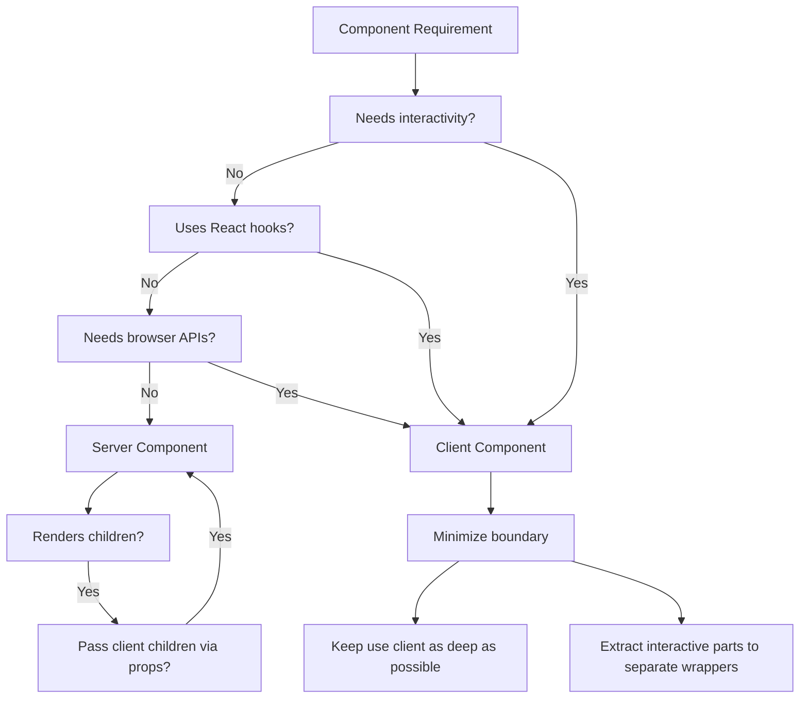
 
### 2.3 Server/Client Composition Pattern
 
```typescript
// Correct - client boundary at the leaf
export default async function ProjectsPage() {
  const projects = await getProjects();
  return (
    <main>
      <ProjectHeader />
      <ProjectGrid projects={projects}>
        <ProjectFilters categories={categories} />
        <ProjectList initial={projects} />
      </ProjectGrid>
    </main>
  );
}
```
 
### 2.4 Request Lifecycle
 
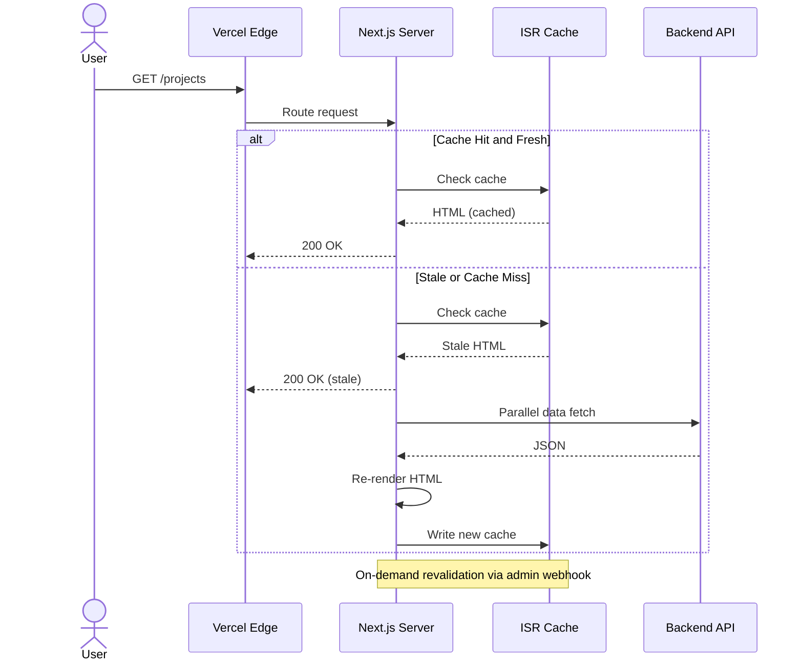
 
### 2.5 Middleware & Route Protection
 
```typescript
export function middleware(request: NextRequest) {
  const { pathname } = request.nextUrl;
  if (pathname.startsWith('/admin')) {
    if (pathname === '/admin/login') return NextResponse.next();
    const token = request.cookies.get('session')?.value;
    if (!token || !verifyToken(token)) {
      return NextResponse.redirect(new URL('/admin/login', request.url));
    }
  }
  const response = NextResponse.next();
  response.headers.set('X-Frame-Options', 'DENY');
  response.headers.set('X-Content-Type-Options', 'nosniff');
  return response;
}
export const config = {
  matcher: ['/((?!_next/static|_next/image|favicon.ico).*)'],
};
```
 
---
 
## 3. App Router & Route Design
 
### 3.1 Route Tree & Layout Hierarchy
 
```mermaid
graph TD
    Root[/ (RootLayout)]
    Root --> Public[Route Group: (public)]
    Root --> Admin[Route Group: (admin)]
    subgraph Public[Public Routes]
        Home[/ page.tsx - ISR 60s - Hero + Projects + Skills]
        P[/projects page.tsx - ISR 60s - ProjectGrid + Filters]
        PS[/projects/[slug] page.tsx - ISR 300s - CaseStudy]
        B[/blog page.tsx - ISR 600s - BlogList]
        BS[/blog/[slug] page.tsx - ISR 600s - Article]
        C[/contact page.tsx - Client - ContactForm]
    end
    subgraph Admin[Admin Routes]
        AL[/admin/login page.tsx - SSR - LoginForm]
        AD[/admin/dashboard page.tsx - SSR - Dashboard]
        AP[/admin/projects page.tsx - SSR - ProjectManager]
        AS[/admin/sections page.tsx - SSR - SectionManager]
        AB[/admin/blog page.tsx - SSR - BlogEditor]
        AdminLayout[/admin/layout.tsx - AuthProvider + AdminShell]
        AL -.-> AdminLayout
        AD -.-> AdminLayout
        AP -.-> AdminLayout
    end
    RootLayout[/layout.tsx - Providers + Navbar + Footer]
    Root -.-> RootLayout
```
 
### 3.2 Route Group Strategy
 
| Route Group | Layout | Purpose |
|-------------|--------|---------|
| (public) | MainLayout | Public-facing portfolio with Navbar/Footer |
| (admin) | AdminLayout | Authenticated admin with Sidebar/Header |
 
### 3.3 Metadata & SEO
 
```typescript
export const metadata: Metadata = {
  title: { default: 'Portfolio | Full-Stack Developer', template: '%s | Portfolio' },
  description: 'Full-stack developer portfolio showcasing projects and skills.',
  openGraph: { type: 'website', locale: 'en_US', siteName: 'Portfolio' },
  robots: { index: true, follow: true },
};
export async function generateMetadata(
  { params }: { params: { slug: string } }
): Promise<Metadata> {
  const project = await getProject(params.slug);
  return { title: project.title, description: project.excerpt,
    openGraph: { images: [{ url: project.ogImage }] } };
}
```
 
---
 
## 4. Component Architecture (Atomic Design)
 
### 4.1 Component Hierarchy
 
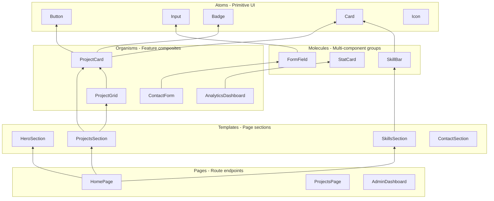
 
### 4.2 Package Distribution
 
| Package | Location | Contains | Consumer |
|---------|----------|----------|----------|
| @portfolio/ui | packages/ui/ | Atoms (Button, Input, Card, Badge) | apps/web, cross-project |
| @portfolio/shared | packages/shared/ | Types, constants, utils | apps/web, packages/ui |
| @portfolio/config | packages/config/ | ESLint, TSConfig, Tailwind config | All packages |
| apps/web | apps/web/src/ | Molecules, Organisms, Templates, Pages | Deployment |
 
### 4.3 Component API Convention
 
```typescript
export interface ButtonProps extends ComponentPropsWithoutRef<'button'> {
  variant?: 'primary' | 'secondary' | 'ghost' | 'danger';
  size?: 'sm' | 'md' | 'lg';
  isLoading?: boolean;
  leftIcon?: React.ReactNode;
}
export function Button({ variant = 'primary', size = 'md',
  isLoading, leftIcon, className, children, disabled, ...props
}: ButtonProps) {
  const styles = cn(
    'inline-flex items-center justify-center gap-2 rounded-lg font-medium transition-colors',
    variantStyles[variant], sizeStyles[size], className
  );
  return (
    <button className={styles} disabled={disabled || isLoading} {...props}>
      {isLoading ? <Spinner size='sm' /> : leftIcon}
      {children}
    </button>
  );
}
```
 
### 4.4 Compound Component Pattern
 
```typescript
export function Card({ className, ...props }: CardProps) {
  return <div className={cn('rounded-xl border bg-card p-6', className)} {...props} />;
}
Card.Header = function CardHeader({ className, ...props }: CardHeaderProps) {
  return <div className={cn('mb-4 flex items-center gap-3', className)} {...props} />;
};
Card.Body = function CardBody({ className, ...props }: CardBodyProps) {
  return <div className={cn('space-y-4', className)} {...props} />;
};
Card.Footer = function CardFooter({ className, ...props }: CardFooterProps) {
  return <div className={cn('mt-4 flex items-center gap-2 pt-4 border-t', className)} {...props} />;
};
```
 
---
 
## 5. Page Architecture & Server/Client Boundary
 
### 5.1 Page Data Flow
 
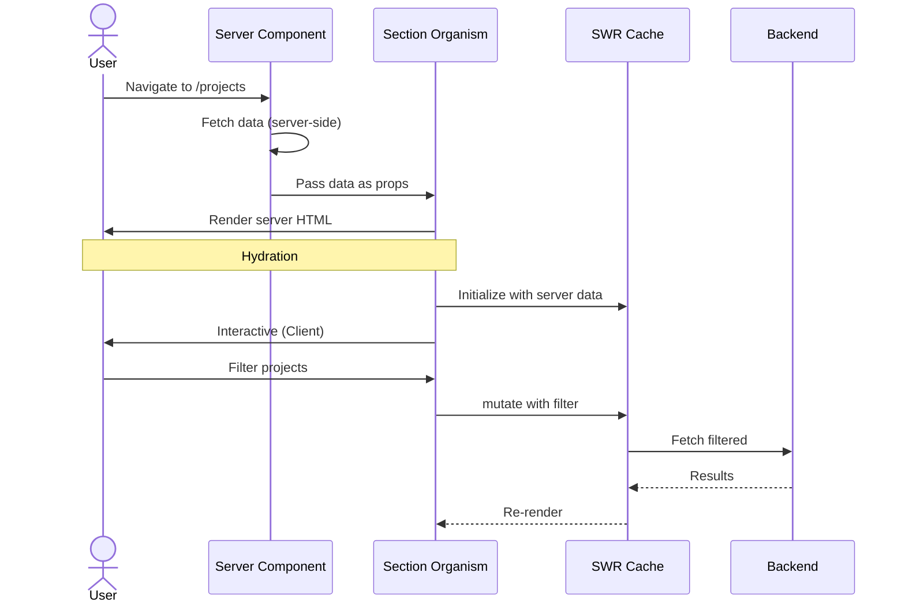
 
### 5.2 Page Template Pattern
 
```typescript
import { getProjects, getSkills } from '@/lib/api';
export default async function HomePage() {
  const [projects, skills] = await Promise.all([
    getProjects({ limit: 6 }), getSkills(),
  ]);
  return (
    <>
      <HeroSection />
      <ProjectsSection projects={projects} />
      <SkillsSection skills={skills} />
      <ContactSection />
    </>
  );
}
export const revalidate = 60;
```
 
### 5.3 Data Fetching Pattern Matrix
 
| Pattern | Location | Use Case | Example |
|---------|----------|----------|---------|
| Server fetch (direct) | Server Component | Initial page data | getProjects() in page |
| Server fetch (API route) | Route Handler | Proxy to backend | /api/v1/projects |
| SWR (client) | Client Component | Interactive data | useSWR('/api/projects') |
| SWR + fallback | Client Component | SSR data hydration | fallbackData prop |
| Server Action | Form/Button | Mutations | createProject(formData) |
 
### 5.4 Suspense Boundaries & Streaming
 
```typescript
export default async function ProjectsPage() {
  return (
    <main>
      <h1>Projects</h1>
      <Suspense fallback={<ProjectGridSkeleton />}>
        <ProjectGrid />
      </Suspense>
    </main>
  );
}
async function ProjectGrid() {
  const projects = await getProjects();
  return <ProjectList projects={projects} />;
}
```
 
---
 
## 6. Feature Architecture
 
### 6.1 Feature Module Structure
 
```
src/features/
  auth/                    # Authentication & authorization
    components/            # LoginForm, ProtectedRoute
    hooks/                 # useAuth, useLogin, useLogout
    types/                 # User, AuthState, LoginCredentials
    api/                   # login(), logout(), refreshToken()
    index.ts
  projects/                # Project portfolio
    components/            # ProjectCard, ProjectGrid, ProjectFilters
    hooks/                 # useProjects, useProject, useCreateProject
    types/                 # Project, ProjectCategory, ProjectFormData
    api/                   # getProjects, getProject, createProject
    index.ts
  skills/                  # Skills & expertise
    components/            # SkillBar, SkillRadial, SkillCategory
    hooks/                 # useSkills
    types/                 # Skill, SkillCategory, SkillLevel
    api/                   # getSkills
    index.ts
  contact/                 # Contact form & leads
    components/            # ContactForm, LeadStatusBadge
    hooks/                 # useContactForm, useLeads
    types/                 # ContactFormData, Lead
    api/                   # submitContact, getLeads
    index.ts
  analytics/               # Dashboard analytics
    components/            # LineChart, DonutChart, PeriodSelector
    hooks/                 # useAnalytics, usePeriod
    types/                 # AnalyticsData, Metric, Period
    api/                   # getAnalytics
    index.ts
  chat/                    # AI chat assistant
    components/            # ChatPanel, Message, PromptInput
    hooks/                 # useChatStream, useChatHistory
    types/                 # Message, ChatState, StreamChunk
    api/                   # streamChat
    index.ts
  cms/                     # Content management
    components/            # SectionManager, SectionEditor
    hooks/                 # useSections, useUpdateSection
    types/                 # Section, SectionType, SectionConfig
    api/                   # getSections, updateSection, reorderSections
    index.ts
```
 
### 6.2 Feature Qualification Criteria
 
A module qualifies as a feature when it meets 3+ criteria:
1. 2+ components - Multiple visual elements with distinct responsibilities
2. Custom hooks - Encapsulated stateful logic with SWR integration
3. Shared types - Feature-specific TypeScript interfaces
4. 2+ pages - Used across multiple routes (public + admin)
5. Data fetching - API calls with caching and revalidation
6. State management - State beyond simple props
 
### 6.3 Cross-Feature Communication Rules
 
- Features import from @portfolio/shared only, never from other features
- Barrel file at index.ts for public API
- Internal components not exported; only hook + top-level component
- Cross-feature communication via page/template layer
 
---
 
## 7. State Management Architecture
 
### 7.1 State Categories
 
| Category | Location | Technology | Scope | Examples |
|----------|----------|------------|-------|---------|
| Server State | SWR store | SWR 2.x | Global (cached) | Projects, skills, CMS sections |
| URL State | URL params | useSearchParams | Route-scoped | Filters, page, sort order |
| Client State | Component | useState / useReducer | Component-scoped | Form inputs, toggles, modals |
| Auth State | Context | React.createContext | App-scoped | User, token, permissions |
| UI State | Zustand (future) | TBD | Global | Theme, sidebar, toasts |
 
### 7.2 State Decision Tree
 
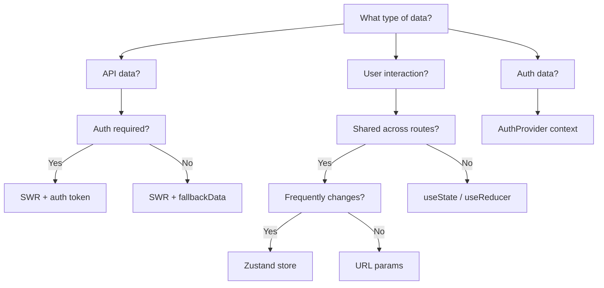
 
### 7.3 SWR Global Configuration
 
```typescript
import useSWR, { SWRConfiguration } from 'swr';
const defaultConfig: SWRConfiguration = {
  revalidateOnFocus: false, revalidateOnReconnect: true,
  dedupingInterval: 5000, focusThrottleInterval: 10000,
  loadingTimeout: 3000, errorRetryCount: 3,
  errorRetryInterval: 5000, keepPreviousData: true,
};
export function useProjects(category?: string) {
  return useSWR(
    ['projects', category],
    () => getProjects({ category }),
    { ...defaultConfig }
  );
}
```
 
### 7.4 Optimistic Update Pattern
 
```typescript
async function updateProject(id: string, data: Partial<Project>) {
  await mutate(
    ['projects', category],
    async (current: Project[] | undefined) => {
      const updated = current?.map(p =>
        p.id === id ? { ...p, ...data } : p
      );
      try { await api.patch('/projects/${id}', data); return updated; }
      catch { return current; }
    },
    { optimisticData: updated, rollbackOnError: true }
  );
}
```
 
---

> **🔗 Consolidated Source of Truth:** All animation architecture rules, layer strategy, library selection matrix, frame budgets, and accessibility overrides are centralized in [`08l-MOTION-SYSTEM.md`](./08l-MOTION-SYSTEM.md). This section provides the framework-level summary; refer to `08l` for the complete enterprise motion architecture including Framer Motion/GSAP/Three.js integration patterns.

## 8. Animation Architecture

### 8.1 Animation Layer Strategy
 
| Layer | Library | Bundle | Load | Purpose |
|-------|---------|--------|------|---------|
| 1 - CSS | Tailwind | 0 KB | Always | Hover, focus, transitions, pseudo-classes |
| 2 - Base | Framer Motion | ~15 KB | Always | Spring, gestures, AnimatePresence |
| 3 - Advanced | GSAP | ~20 KB | Lazy | ScrollTrigger, parallax, sequences |
| 4 - Smooth | Lenis | ~5 KB | Lazy | Smooth scrolling with custom easing |
| 5 - 3D | Three.js / R3F | ~50 KB | Lazy | Hero 3D scene, particles, WebGL |
 
### 8.2 Motion Variant System
 
```typescript
import { Variants } from 'framer-motion';
export const fadeIn: Variants = {
  hidden: { opacity: 0, y: 20 },
  visible: { opacity: 1, y: 0, transition: { duration: 0.5, ease: 'easeOut' } },
};
export const staggerContainer: Variants = {
  hidden: {},
  visible: { transition: { staggerChildren: 0.1, delayChildren: 0.2 } },
};
export const scaleIn: Variants = {
  hidden: { opacity: 0, scale: 0.8 },
  visible: { opacity: 1, scale: 1,
    transition: { type: 'spring', stiffness: 200, damping: 20 } },
};
export function AnimatedSection({ children, variants = fadeIn }: Props) {
  const ref = useRef(null);
  const isInView = useInView(ref, { once: true, margin: '-100px' });
  return (
    <motion.div ref={ref} initial='hidden'
      animate={isInView ? 'visible' : 'hidden'} variants={variants}>
      {children}
    </motion.div>
  );
}
```
 
### 8.3 GSAP ScrollTrigger Pattern
 
```typescript
import { gsap } from 'gsap';
import { ScrollTrigger } from 'gsap/ScrollTrigger';
gsap.registerPlugin(ScrollTrigger);
export function useScrollAnimation(ref: RefObject<HTMLDivElement>) {
  useEffect(() => {
    const ctx = gsap.context(() => {
      gsap.to(ref.current, { y: 100, scrollTrigger: {
        trigger: ref.current, start: 'top bottom',
        end: 'bottom top', scrub: 1 } });
    }, ref);
    return () => ctx.revert();
  }, [ref]);
}
```
 
### 8.4 Accessibility & Reduced Motion
 
```typescript
export function useReducedMotion(): boolean {
  const prefersReduced = useMediaQuery('(prefers-reduced-motion: reduce)');
  const [reduceMotion, setReduceMotion] = useState(false);
  useEffect(() => { setReduceMotion(prefersReduced); }, [prefersReduced]);
  return reduceMotion;
}
```
 
When reduceMotion: Framer Motion transitions become instant, GSAP skips, Lenis disables, Three.js pauses.
 
---
 
## 9. CMS Architecture
 
### 9.1 Section-Based Content Model
 
```typescript
export interface Section {
  id: string;
  pageId: string;
  type: SectionType;
  displayOrder: number;
  isLive: boolean;
  styleConfig: SectionStyle;
  content: Record<string, any>;
  createdAt: string;
  updatedAt: string;
}
```
 
### 9.2 CMS Data Flow
 
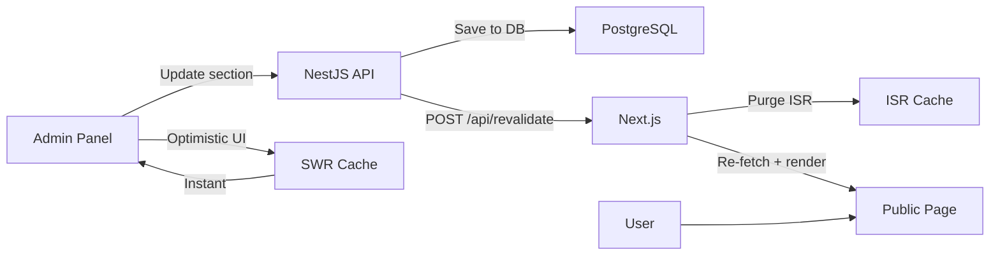
 
### 9.3 ISR Revalidation Endpoint
 
```typescript
export async function POST(request: NextRequest) {
  const secret = request.headers.get('x-revalidate-secret');
  if (secret !== process.env.REVALIDATION_SECRET)
    return NextResponse.json({ error: 'Unauthorized' }, { status: 401 });
  const { page, tags } = await request.json();
  if (page) await revalidatePath(page);
  if (tags?.length) await revalidateTag(tags);
  return NextResponse.json({ revalidated: true });
}
```
 
### 9.4 Admin CMS Interface
 
| Feature | Component | Details |
|---------|-----------|---------|
| Section List | SectionManager | Ordered list with drag-to-reorder |
| Section Editor | SectionEditor | Dynamic form by section type |
| Live Preview | SectionPreview | Real-time section preview |
| Publish Toggle | Switch | Optimistic update with rollback |
| Style Config | Visual editor | Background, padding, maxWidth |
 
---
 
## 10. AI Integration Architecture
 
### 10.1 Chat System Architecture
 
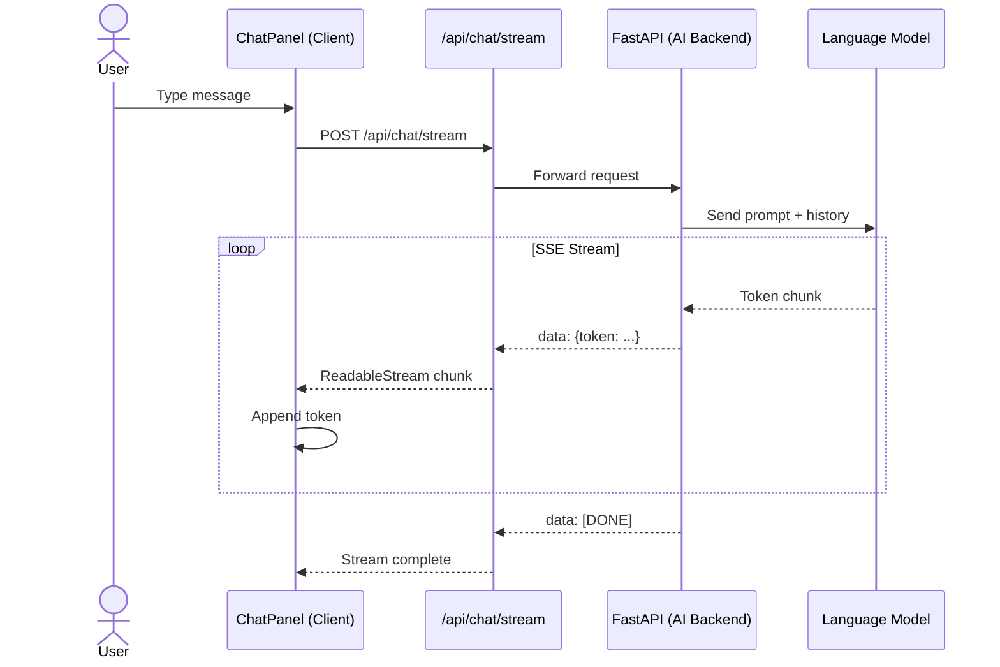
 
### 10.2 Streaming Hook
 
```typescript
export function useChatStream() {
  const [messages, setMessages] = useState<Message[]>([]);
  const [isStreaming, setIsStreaming] = useState(false);
  const abortRef = useRef<AbortController | null>(null);
  const sendMessage = useCallback(async (content: string) => {
    const userMsg: Message = { id: genId(), role: 'user', content };
    const asstMsg: Message = { id: genId(), role: 'assistant', content: '' };
    setMessages(prev => [...prev, userMsg, asstMsg]);
    setIsStreaming(true);
    const controller = new AbortController(); abortRef.current = controller;
    try {
      const res = await fetch('/api/chat/stream', {
        method: 'POST', headers: { 'Content-Type': 'application/json' },
        body: JSON.stringify({ message: content, history: messages }),
        signal: controller.signal,
      });
      const reader = res.body!.getReader(); const dec = new TextDecoder();
      while (true) {
        const { done, value } = await reader.read();
        if (done) break;
        const chunk = dec.decode(value);
        const lines = chunk.split('\n').filter(l => l.startsWith('data: '));
        for (const line of lines) {
          const data = line.slice(6);
          if (data === '[DONE]') continue;
          const { token } = JSON.parse(data);
          setMessages(prev => {
            const u = [...prev]; const last = u[u.length - 1];
            u[u.length - 1] = { ...last, content: last.content + token };
            return u;
          });
        }
      }
    } catch (e) { if ((e as Error).name !== 'AbortError') throw e; }
    finally { setIsStreaming(false); }
  }, [messages]);
  const stop = useCallback(() => abortRef.current?.abort(), []);
  return { messages, isStreaming, sendMessage, stop };
}
```
 
### 10.3 Chat Modes
 
| Mode | Trigger | Position | Purpose |
|------|---------|----------|---------|
| Overlay | Floating button | Bottom-right modal | Quick questions, navigation |
| Inline | Section embed | Embedded in page | Portfolio Q&A |
| Full | /chat route | Full page | Extended conversations |
 
---
 
## 11. Analytics Architecture
 
### 11.1 Analytics Stack
 
| Tool | Purpose | Integration |
|------|---------|-------------|
| PostHog | Analytics, session recording, feature flags | PostHogProvider in root layout |
| Custom SVG Charts | Admin dashboard | Recharts-independent, ~3KB |
| Recharts | Fallback chart library | Dynamic import, ~30KB lazy |
 
### 11.2 Analytics Data Flow
 
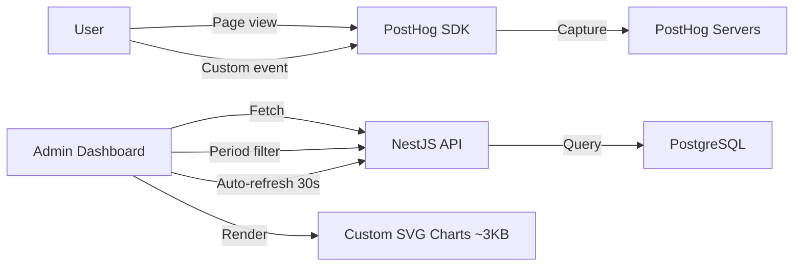
 
### 11.3 Analytics Hook
 
```typescript
export function useAnalytics(period: Period = '30d') {
  return useSWR(['analytics', period], () => getAnalytics(period), {
    refreshInterval: 30000
  });
}
```
 
### 11.4 Metrics
 
| Metric | Chart | Description |
|--------|-------|-------------|
| Page Views | Line Chart | Daily page views |
| Visitors | Line Chart | Unique visitors per day |
| Project Views | Bar Chart | Views per project |
| Geographic | Donut Chart | Visitors by country |
| Device Split | Donut Chart | Desktop vs Mobile vs Tablet |
| Conversion Rate | Stat Card | Contact form submission rate |
| Avg Session | Stat Card | Average session duration |
| Bounce Rate | Stat Card | Single-page session % |
 
---
 
## 12. Admin Architecture
 
### 12.1 Admin Shell Layout
 
```mermaid
graph TD
    AL[/admin/login] -->|Authenticate| AD[/admin/dashboard]
    AD --> AS[AdminShell]
    subgraph AS[AdminShell Layout]
        S[Sidebar - Navigation]
        H[Header - User menu]
        C[Content - Outlet]
    end
    S -->|Navigate| AP[/admin/projects]
    S -->|Navigate| AB[/admin/blog]
    S -->|Navigate| AC[/admin/sections]
    S -->|Navigate| AA[/admin/analytics]
    S -->|Navigate| AL2[/admin/leads]
```
 
### 12.2 Admin Route Structure
 
```
apps/web/src/app/(admin)/
  layout.tsx           # AuthProvider + AdminShell
  login/page.tsx       # LoginPage (unauthenticated)
  dashboard/page.tsx   # DataOverview + RecentActivity
  projects/
    page.tsx           # ProjectManager (CRUD table)
    [id]/page.tsx       # ProjectEditor (form)
  sections/page.tsx    # SectionManager (drag-reorder)
  blog/page.tsx        # BlogList + Editor
  analytics/page.tsx   # AnalyticsDashboard
  leads/page.tsx       # LeadManager
```
 
### 12.3 Auth Provider Flow
 
```typescript
export function AuthProvider({ children }: { children: React.ReactNode }) {
  const [user, setUser] = useState<User | null>(null);
  const [isLoading, setIsLoading] = useState(true);
  useEffect(() => {
    const token = localStorage.getItem('auth_token');
    if (!token) { setIsLoading(false); return; }
    validateToken(token).then(setUser).catch(() => {
      localStorage.removeItem('auth_token');
    }).finally(() => setIsLoading(false));
  }, []);
  useEffect(() => {
    if (!user) return;
    const interval = setInterval(async () => {
      const newToken = await refreshToken();
      localStorage.setItem('auth_token', newToken);
    }, 10 * 60 * 1000);
    return () => clearInterval(interval);
  }, [user]);
  const login = async (creds: LoginCredentials) => {
    const { token, user } = await api.login(creds);
    localStorage.setItem('auth_token', token); setUser(user);
  };
  const logout = () => {
    localStorage.removeItem('auth_token'); setUser(null);
    router.push('/admin/login');
  };
  return (
    <AuthContext.Provider value={{ user, isLoading, login, logout }}>
      {children}
    </AuthContext.Provider>
  );
}
```
 
### 12.4 CRUD Lifecycle
 
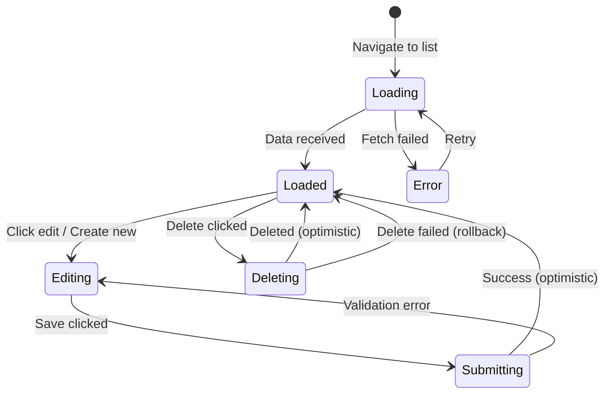
 
---
 
## 13. Folder Structure & Naming Conventions
 
### 13.1 Complete Folder Tree
 
```
apps/web/src/
  app/
    (public)/             # Public route group
      layout.tsx          # MainLayout
      page.tsx            # Home page
      projects/
        page.tsx
        [slug]/page.tsx
      blog/
        page.tsx
        [slug]/page.tsx
      contact/page.tsx
    (admin)/
      layout.tsx          # AdminShell
      login/page.tsx
      dashboard/page.tsx
      projects/page.tsx
      sections/page.tsx
      blog/page.tsx
      analytics/page.tsx
      leads/page.tsx
  components/            # Shared components
    ui/                 # Re-exports from @portfolio/ui
    layout/             # Navbar, Footer, AdminSidebar
    sections/           # HeroSection, ProjectsSection
    admin/              # DataTable, FormBuilder, StatusBadge
    ai/                 # ChatPanel, Message
    shared/             # LoadingSkeleton, EmptyState, ErrorBoundary
  features/              # auth, projects, skills, contact, analytics, chat, cms
  hooks/                 # useInView, useDebounce, useMediaQuery, useReducedMotion
  lib/                   # api, cn, utils, constants, swr, motion
  types/                 # Re-exports from @portfolio/shared
  styles/                # globals.css
  middleware.ts          # Edge middleware
```
 
### 13.2 Naming Conventions
 
| Artifact | Convention | Example |
|----------|------------|---------|
| Components | PascalCase.tsx | ProjectCard.tsx |
| Hooks | useCamelCase.ts | useProjects.ts |
| Utils | camelCase.ts | formatDate.ts |
| Types | PascalCase.ts | Project.ts |
| CSS vars | --kebab-case | --color-primary |
| Git branches | type/description | feat/add-dark-mode |
 
---
 
## 14. Import & Dependency Rules
 
### 14.1 Import Order
 
```typescript
import path from 'path';                    // 1. Built-in
import useSWR from 'swr';                    // 2. External
import { Button } from '@portfolio/ui';     // 3. Internal packages
import { cn } from '@/lib/cn';              // 4. App utilities
import { useAuth } from '@/features/auth';  // 5. Features
import { ProjectCard } from './ProjectCard';// 6. Relative
```
 
### 14.2 Package Dependency Graph
 
```mermaid
graph LR
    Web[apps/web] --> UI[@portfolio/ui]
    Web --> Shared[@portfolio/shared]
    UI --> Shared
    Web --> Config[@portfolio/config]
    UI --> Config
    Shared -->|NO imports| X[leaf]
    Config -->|NO imports| X
```
 
### 14.3 Dependency Rules (ESLint Enforced)
 
1. packages/shared - No imports from other packages (leaf)
2. packages/ui - Imports from @portfolio/shared only
3. packages/config - No imports from other packages (leaf)
4. apps/web - Imports from @portfolio/ui, @portfolio/shared, @portfolio/config
5. No circular imports (dependency-cruiser)
6. Named exports only (no default exports)
7. import type for type-only imports
8. Barrel files at package/feature level only
 
---
 
## 15. Code Splitting & Lazy Loading
 
### 15.1 Splitting Strategy
 
| Layer | Strategy | Mechanism | Chunk Size |
|-------|----------|-----------|------------|
| Route | Automatic | App Router per-page chunks | 8-25 KB |
| Component | Dynamic | next/dynamic | Varies |
| Library | optimizePackageImports | Webpack split | Per library |
| Image | Lazy loading | loading=lazy | N/A |
 
### 15.2 Dynamic Import Map
 
```typescript
const Scene3D = dynamic(() => import('@/components/hero/Scene3D'), { ssr: false });
const ScrollAnimator = dynamic(() => import('@/components/ScrollAnimator'), { ssr: false });
const ChatPanel = dynamic(() => import('@/features/chat/ChatPanel'), {
  loading: () => <ChatSkeleton />, ssr: false,
});
const AnalyticsCharts = dynamic(() => import('@/features/analytics/AnalyticsCharts'), { ssr: false });
const SmoothScroll = dynamic(() => import('@/components/SmoothScroll'), { ssr: false });
```
 
### 15.3 Library Optimization
 
```typescript
experimental: {
  optimizePackageImports: ['@portfolio/ui', 'recharts', 'lucide-react'],
},
```
 
---
 
## 16. Caching Strategy
 
### 16.1 Multi-Layer Cache Architecture
 
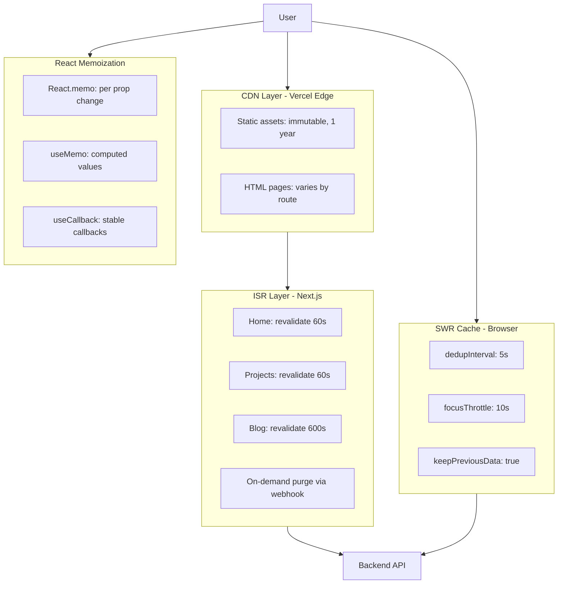
 
### 16.2 Cache Policy Matrix
 
| Resource | Cache | Policy | TTL |
|----------|-------|--------|-----|
| Static JS/CSS | CDN | immutable | 1 year |
| Static images | CDN | immutable | 1 year |
| Home page | ISR + CDN | time-based | 60s |
| Projects list | ISR + CDN | time-based | 60s |
| Project detail | ISR + CDN | time-based | 300s |
| Blog list | ISR + CDN | time-based | 600s |
| Blog post | ISR + CDN | time-based | 600s |
| API responses | SWR | stale-while-revalidate | 5s dedup |
| Auth token | localStorage | explicit | 10min refresh |
| Font files | CDN | preload + cache | 1 year |
 
### 16.3 On-Demand Revalidation
 
```typescript
await fetch('/api/revalidate', {
  method: 'POST',
  headers: { 'x-revalidate-secret': process.env.REVALIDATION_SECRET },
  body: JSON.stringify({ page: '/projects', tags: ['projects'] }),
});
```
 
---
 
## 17. Performance Strategy & Budget
 
### 17.1 Core Web Vitals
 
| Metric | Target | Description |
|--------|--------|-------------|
| LCP | < 1.5s | Largest Contentful Paint |
| CLS | 0 | Cumulative Layout Shift |
| INP | < 100ms | Interaction to Next Paint |
| TBT | < 100ms | Total Blocking Time |
| FCP | < 1.0s | First Contentful Paint |
| Lighthouse | >= 95 | Aggregate performance score |
 
### 17.2 Bundle Budget
 
| Asset Type | Budget | Enforcement |
|------------|--------|-------------|
| JavaScript (initial) | < 100 KB | bundlesize CI check |
| CSS (initial) | < 15 KB | Tailwind purge + review |
| Images (per page) | < 500 KB | next/image optimization |
| Fonts (self-hosted) | < 50 KB | WOFF2 subset, preload |
| Third-party scripts | < 30 KB | Deferred / lazy load |
 
### 17.3 Optimization Checklist
 
**Images:** next/image for WebP/AVIF, priority on LCP, lazy below-fold, blur placeholders
**Fonts:** Self-hosted WOFF2, font-display: swap, preload critical, subset Latin
**Rendering:** Server Components by default, deep use client, React.memo on lists
**Network:** ISR for content, SWR keepPreviousData, preconnect to API origins
 
---
 
## 18. Security Architecture
 
### 18.1 Security Headers
 
```typescript
const securityHeaders = [
  { key: 'X-Frame-Options', value: 'DENY' },
  { key: 'X-Content-Type-Options', value: 'nosniff' },
  { key: 'Referrer-Policy', value: 'strict-origin-when-cross-origin' },
  { key: 'X-XSS-Protection', value: '1; mode=block' },
  { key: 'Strict-Transport-Security',
    value: 'max-age=63072000; includeSubDomains; preload' },
];
```
 
### 18.2 API Security
 
| Concern | Implementation |
|---------|---------------|
| CORS | Backend restricts to specific frontend origins |
| Rate Limiting | Per-IP + per-token limits on API gateway |
| Input Validation | Zod schemas on client + server |
| CSRF | Double-submit cookie pattern |
| JWT | Short-lived (15min) + refresh (7d) |
| API Keys | Server-side proxy, never exposed to frontend |
| SQL Injection | Parameterized queries via Prisma |
| XSS | React escaping + CSP headers |
 
### 18.3 Auth Security Flow
 
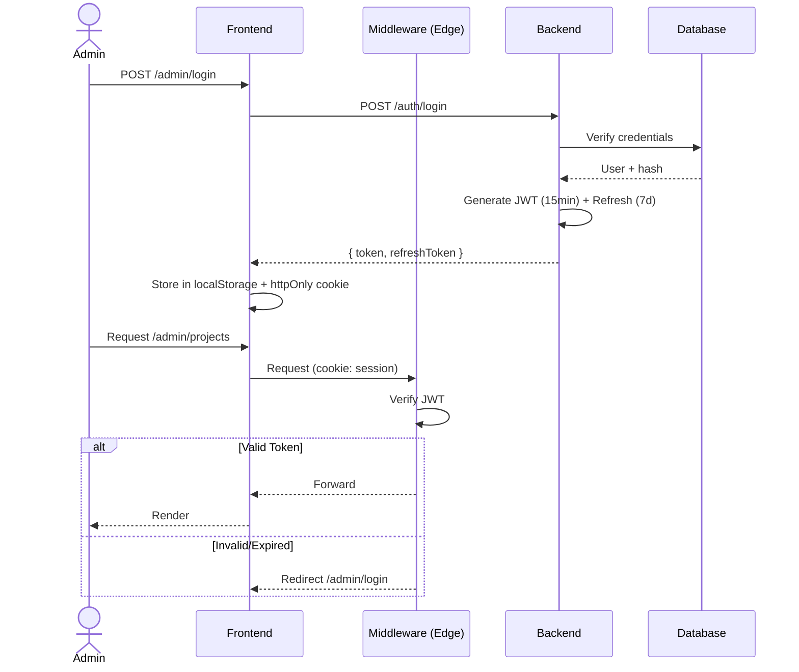
 
---
 
## 19. Testing Strategy
 
### 19.1 Testing Pyramid
 
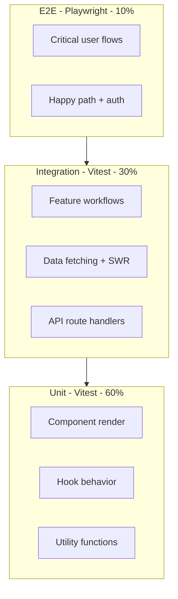
 
### 19.2 Test Configuration
 
| Tool | Scope | Configuration |
|------|-------|---------------|
| Vitest | Unit + Integration | Co-located *.test.ts(x) files |
| React Testing Library | Component tests | render, screen, userEvent |
| MSW | API mocking | Handlers per feature in __tests__/mocks |
| Playwright | E2E | e2e/ directory, page object model |
| Lighthouse CI | Performance | Budget thresholds in .lighthouserc.json |
 
### 19.3 Testing Pattern
 
```typescript
import { render, screen } from '@testing-library/react';
import userEvent from '@testing-library/user-event';
import { ProjectCard } from './ProjectCard';
const mock = { title: 'Project A', excerpt: 'Description' };
it('renders title and excerpt', () => {
  render(<ProjectCard project={mock} />);
  expect(screen.getByText('Project A')).toBeInTheDocument();
});
it('calls onClick on click', async () => {
  const onClick = vi.fn();
  render(<ProjectCard project={mock} onClick={onClick} />);
  await userEvent.click(screen.getByRole('article'));
  expect(onClick).toHaveBeenCalledTimes(1);
});
```
 
---
 
## 20. Deployment & CI/CD Pipeline
 
### 20.1 Deployment Flow
 
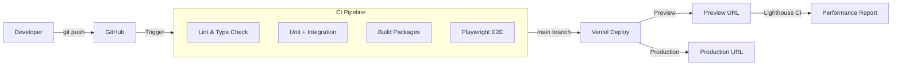
 
### 20.2 CI Pipeline Steps
 
```yaml
name: CI
on: [push, pull_request]
jobs:
  quality:
    runs-on: ubuntu-latest
    steps:
      - uses: actions/checkout@v4
      - uses: pnpm/action-setup@v2
      - uses: actions/setup-node@v4
        with: { node-version: 20, cache: 'pnpm' }
      - run: pnpm install
      - run: pnpm lint
      - run: pnpm typecheck
      - run: pnpm test
      - run: pnpm build
      - run: pnpm e2e
```
 
### 20.3 Environment Configuration
 
| Variable | Local | Preview | Production |
|----------|-------|---------|------------|
| NEXT_PUBLIC_API_URL | localhost:3001 | staging-api | api.example.com |
| NEXT_PUBLIC_POSTHOG_KEY | phc_local | phc_staging | phc_prod |
| REVALIDATION_SECRET | Local secret | Staging secret | Production secret |
| DATABASE_URL | Local Postgres | Staging RDS | Production RDS |
 
### 20.4 Deployment Checklist
 
- [ ] All CI checks pass (lint, typecheck, test, build, e2e)
- [ ] Lighthouse CI score >= 95 on all budgets
- [ ] Bundle size within budget (< 100 KB JS, < 15 KB CSS)
- [ ] No new vulnerabilities (pnpm audit)
- [ ] Environment variables updated in Vercel dashboard
- [ ] PR approved by at least one reviewer
 
---
 
## Glossary

| Term | Definition |
|------|------------|
| **ISR** | Incremental Static Regeneration — Next.js feature that re-renders static pages at runtime after the initial build, on-demand or time-based, without requiring a full rebuild |
| **RSC** | React Server Components — components that run exclusively on the server, reducing client JS bundle; used for data fetching, rendering markdown, and content-heavy pages |
| **SSR** | Server-Side Rendering — pages rendered per-request on the server (as opposed to pre-built static generation); used for admin dashboard and authenticated pages |
| **Atomic Design** | Component hierarchy methodology with 5 levels: atoms (button, input), molecules (form group, search bar), organisms (navbar, project card), templates (page layouts), pages (route-specific compositions) |
| **SWR** | Stale-While-Revalidate — React Hooks library for data fetching that returns cached data first, then revalidates in the background; similar to HTTP stale-while-revalidate |
| **AnimatePresence** | Framer Motion component that handles enter/exit animations for React components being mounted/unmounted; essential for page transitions and modal animations |
| **ScrollTrigger** | GSAP plugin that ties animation timelines to scroll position; used for parallax effects, section entrance animations, and reading progress indicators |
| **Lenis** | JavaScript library that provides smooth scrolling with custom easing curves and native scroll wheel feel; wraps the native scroll behavior with a requestAnimationFrame loop |
| **ISR Revalidation Webhook** | HTTP endpoint called by the admin panel on content publish that triggers immediate ISR revalidation of affected pages, bypassing the default time-based interval |
| **Server/Client Boundary** | The architectural separation between React Server Components (rendered on server, no client JS) and Client Components (hydrated in browser, interactive); defined by 'use client' directive |
| **Turborepo** | High-performance monorepo build system from Vercel that caches task output and runs tasks in parallel across packages; used for lint, typecheck, test, and build |
| **Zustand** | Minimal state management library for React — uses hooks-based API, supports middleware (persist, devtools, immer), and avoids the boilerplate of Redux |
| **Route Groups** | Next.js App Router feature that organizes routes into groups without affecting the URL path; used for admin routes: `(admin)/dashboard`, `(admin)/cms` |
| **Parallel Routes** | Next.js App Router feature that renders multiple independent page sections simultaneously within the same layout using named slots (`@analytics`, `@leads`) |
| **Lighthouse CI** | Automated performance, accessibility, SEO, and best-practice auditing tool; runs in CI pipeline with configurable budget thresholds (Performance ≥ 95, A11y ≥ 95) |

## Change Log

| Version | Date | Changes | Author |
|---------|------|---------|--------|
| 1.1 | Jun 2026 | Added Executive Summary, Decision Log (5 entries), Risk Register (5 entries), Glossary (15 terms), Change Log | Tech Lead |
| 1.0 | Jun 2026 | Initial frontend architecture document — 20 sections covering technology stack, routing, atomic design, server/client boundary, features, state management, animations, CMS, AI, analytics, admin, folder structure, imports, code splitting, caching, performance, security, testing, CI/CD | Frontend Lead |

---

*End of Frontend Architecture v1.1 - 20 sections, 15+ diagrams, enterprise reference*

---

## Cross-References

| Reference | Description |
|-----------|-------------|
| See MASTER-INDEX.md | Full document dependency graph and cross-reference map |

---

## Cross-References

| Reference | Description |
|-----------|-------------|
| docs/MASTER-INDEX.md | Full document dependency graph and cross-reference map |
