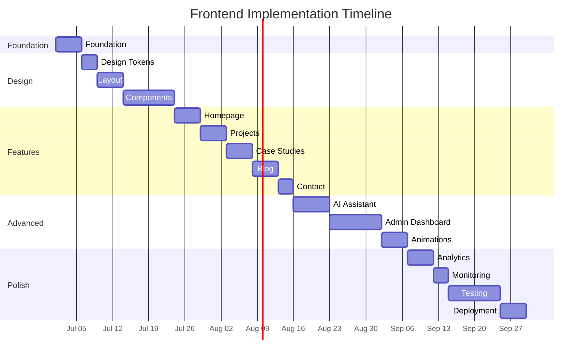

# Frontend Implementation Plan - Enterprise Execution Roadmap

> **File:** FrontendImplementationPlan.md | **Version:** 1.1 | **Last Updated:** June 2026
> **Status:** Active | **Total Phases:** 16 | **Estimated Duration:** 14-18 weeks
> **Team Size:** 2-3 frontend, 1 backend, 1 design | **Risk Level:** Medium

---

## Executive Summary

FRONTEND-IMPLEMENTATION-PLAN.md is the tactical execution roadmap for building the portfolio's frontend — a 16-phase, 14-18 week plan covering everything from monorepo scaffold (Turborepo + Next.js 14) through design tokens, 26 UI components, all public pages (homepage, projects, blog, contact), AI assistant, admin dashboard, animations, analytics, monitoring, testing, and deployment. Each phase defines deliverables, dependencies, risks, and validation checklists to ensure gated, quality-controlled progress. The plan is optimized for a 2-3 frontend, 1 backend, 1 design team with medium risk tolerance.

---

## Table of Contents

1. [Foundation](#1-foundation)
2. [Design Tokens](#2-design-tokens)
3. [Layout](#3-layout)
4. [Components](#4-components)
5. [Homepage](#5-homepage)
6. [Projects](#6-projects)
7. [Case Studies](#7-case-studies)
8. [Blog](#8-blog)
9. [Contact](#9-contact)
10. [AI Assistant](#10-ai-assistant)
11. [Admin Dashboard](#11-admin-dashboard)
12. [Animations](#12-animations)
13. [Analytics](#13-analytics)
14. [Monitoring](#14-monitoring)
15. [Testing](#15-testing)
16. [Deployment](#16-deployment)

---

## Execution Overview



### Phase Dependency Map

```mermaid
flowchart LR
    F[1. Foundation] --> DT[2. Design Tokens]
    DT --> L[3. Layout]
    L --> C[4. Components]
    C --> H[5. Homepage] & P[6. Projects] & CT[9. Contact]
    P --> CS[7. Case Studies]
    P --> B[8. Blog]
    C --> AI[10. AI Assistant]
    H & P & CS & B & CT --> AD[11. Admin Dashboard]
    AD --> AN[12. Animations]
    AN --> AL[13. Analytics]
    AL --> M[14. Monitoring]
    M --> T[15. Testing]
    T --> D[16. Deployment]
 ```

---

## Decision Log

| ID | Decision | Rationale | Alternatives Considered | Date | Approver |
|----|----------|-----------|------------------------|------|----------|
| FIP-001 | Turborepo 2.0 monorepo over Nx or single-package | Turborepo has native Next.js support, faster cache, and simpler config; already proven in Next.js ecosystem | Nx (more features but heavier), single-package (no shared code isolation) | 2026-06-01 | Tech Lead |
| FIP-002 | pnpm 9 over npm or yarn for monorepo | pnpm workspace protocol is the best-supported by Turborepo; strict dependency isolation prevents phantom dependencies | npm workspaces (loose isolation), yarn 4 (less ecosystem support) | 2026-06-01 | Tech Lead |
| FIP-003 | SWR over React Query for data fetching | SWR has smaller bundle (~4KB vs ~13KB), simpler API, and built-in revalidation that matches ISR pattern well | React Query (more features, heavier), RTK Query (tight Redux coupling) | 2026-06-01 | Frontend Lead |
| FIP-004 | Framer Motion + GSAP dual animation library | Framer Motion for layout/enter animations (lightweight, React-native), GSAP ScrollTrigger for complex scroll/parallax (best-in-class) | Only Framer Motion (limited scroll), only GSAP (no React transitions), CSS-only (limited capability) | 2026-06-01 | Frontend Lead |
| FIP-005 | PostHog over Google Analytics for analytics | PostHog is privacy-first, self-hostable, has built-in session recording and feature flags; avoids GDPR issues with Google | Google Analytics 4 (free, but privacy concerns), Plausible (simpler, less features) | 2026-06-01 | Tech Lead |

## Risk Register

| ID | Risk | Likelihood | Impact | Mitigation |
|----|------|------------|--------|------------|
| FIP-R01 | Team capacity insufficient for 14-18 week timeline | Medium | High | Phase dependencies allow parallel work; reduce scope by deferring P2 items if needed |
| FIP-R02 | Backend API unavailable during frontend development | High | High | Use MSW mocks for all API endpoints from day one; define API contracts before implementation |
| FIP-R03 | Animation performance degrades on mid-range mobile devices | Medium | Medium | Progressive enhancement: graceful degradation to CSS-only animations; test on real devices |
| FIP-R04 | LLM API costs exceed budget during AI assistant phase | Medium | Medium | Use GPT-3.5-Turbo for classification, GPT-4 only for response generation; set daily/monthly caps |
| FIP-R05 | Design token drift between Figma and code | Medium | Low | Automated token export script from Figma; quarterly token audit in project board |

---

## 1. Foundation

**Estimated Effort:** 5 person-days | **Owner:** Frontend Lead | **Status:** Not Started

### Deliverables

1. Monorepo scaffold using Turborepo 2.0 with pnpm 9 workspaces
2. Package structure: @portfolio/ui, @portfolio/shared, @portfolio/config, apps/web
3. Next.js 14.2 + React 18.3 + TypeScript 5.4 + Tailwind CSS 3.4 setup
4. ESLint 9 flat config with TypeScript, React, import-order, a11y, and prettier plugins
5. Prettier config (100 char width, single quotes, trailing commas)
6. TSConfig paths (@/ -> src/, baseUrl)
7. Husky 9 + lint-staged pre-commit hooks
8. GitHub Actions CI workflow (lint, typecheck, test, build)
9. Vercel project with Production + Preview environments
10. Environment variable templates (.env.example)
11. README.md with setup instructions and architecture overview
12. AGENTS.md for AI-assisted development conventions

### Dependencies

| Dependency | Type | Notes |
|------------|------|-------|
| Node.js 20 LTS | External | Required for pnpm 9 + Next.js 14
| pnpm 9 | External | Must install globally or use corepack
| GitHub repository | External | Must exist with main branch
| Vercel account | External | Team plan with preview deploys
| NestJS API repo | External | API must be available for integration
| PostgreSQL | External | Local Docker instance for development

### Risks

| Risk | Probability | Impact | Mitigation
|------|-------------|--------|----------
| Tooling version conflicts | Low | High | Pin all major versions in package.json, use .nvmrc
| CI misconfiguration | Medium | High | Test CI on minimal PR before proceeding
| Monorepo package resolution | Low | Medium | Verify pnpm workspace protocol works early
| Team environment inconsistency | Medium | Low | Provide Docker devcontainer or setup script

### Definition of Done

- [ ] `pnpm dev` starts apps/web on localhost:3000
- [ ] `pnpm build` completes without warnings
- [ ] `pnpm lint` passes with 0 errors
- [ ] `pnpm typecheck` passes with 0 errors
- [ ] Vercel preview deploy auto-creates on PR
- [ ] Pre-commit hooks block commits with lint/type errors
- [ ] All team members can run the project locally

### Validation Checklist

| Check | Command | Expected |
|-------|---------|---------|
| Clean install | `pnpm install` | No warnings, lockfile generated |
| Dev server | `pnpm dev` | Starts on :3000, HMR works |
| Build | `pnpm build` | All packages build, output in .next |
| Lint | `pnpm lint` | 0 errors, 0 warnings |
| Type check | `pnpm typecheck` | 0 errors |
| CI pipeline | Push to PR branch | All checks pass green |
| Preview deploy | PR created | Vercel comment with preview URL |

---

## 2. Design Tokens

**Estimated Effort:** 3 person-days | **Owner:** Designer + Frontend Lead | **Status:** Not Started

### Deliverables

1. Tailwind CSS 3.4 configuration extending theme with all tokens from DesignSystem.md
2. Color palette: 50-900 scale for primary, secondary, neutral, success, warning, error, info
3. Typography scale: font families (heading/sans/mono), font sizes (xs-9xl), line heights, letter spacing
4. Spacing scale: 0-96 (4px increments), consistent with design grid
5. Shadow scale: sm, md, lg, xl, 2xl, inner, glow variants
6. Border radius scale: none, sm, md, lg, xl, full
7. Breakpoint configuration: sm(640), md(768), lg(1024), xl(1280), 2xl(1536)
8. CSS custom properties file (globals.css) consuming Tailwind tokens
9. ThemeProvider with React Context for Light/Dark/HighContrast themes
10. Theme toggle component (NavbarThemeToggle) with localStorage persistence
11. Three complete theme definitions in variables/tokens file matching DesignSystem.md
12. Token usage guidelines in README to prevent hardcoded values
13. Automated contrast ratio checker in CI (axe-core)
14. Design token export script for Figma/design tool synchronization

### Dependencies

| Dependency | Type | Notes |
|------------|------|-------|
| Foundation phase | Internal | Must have Tailwind + project scaffold |
| DesignSystem.md | Documentation | All 280+ tokens must be finalized |
| Figma design files | External | Design tokens must match component designs |

### Risks

| Risk | Probability | Impact | Mitigation |
|------|-------------|--------|-----------|
| Theme switching causes FOUC | Medium | High | Inject critical CSS before hydration |
| Contrast ratio fails WCAG AA | Low | High | Pre-validate all token pairs with axe |
| Token naming inconsistency | Medium | Medium | Enforce --color-*, --space-*, --font-* prefix convention |
| Design token drift from Figma | Medium | Low | Add quarterly design token audit to project board |

### Definition of Done

- [ ] All 280+ tokens defined and accessible via Tailwind classes and CSS vars
- [ ] Theme toggle switches between Light/Dark/HighContrast without flicker
- [ ] Theme preference persists across page reloads (localStorage)
- [ ] No hardcoded colors exist in any component (ESLint enforced)
- [ ] All token pairs meet WCAG AA contrast ratio (4.5:1 normal, 3:1 large)
- [ ] High Contrast theme has 7:1 minimum contrast ratio
- [ ] Token exports match DesignSystem.md specification

### Validation Checklist

| Check | Method | Expected |
|-------|--------|----------|
| Theme toggle | Manual + unit test | Toggles between 3 themes, persists |
| FOUC test | Slow 3G throttling | No flash of unstyled content |
| Contrast check | axe-core accessibility scan | 0 color contrast violations |
| Token coverage | ESLint rule | No hardcoded color values in components |
| Token export | Script compare | matches DesignSystem.md |

---

## 3. Layout

**Estimated Effort:** 5 person-days | **Owner:** Frontend Developer | **Status:** Not Started

### Deliverables

1. RootLayout (app/layout.tsx) wrapping all routes with providers
2. HTML metadata: title, description, OG tags, favicon, manifest
3. Font loading: self-hosted Inter + Fira Code WOFF2 with font-display: swap
4. Provider stack: ThemeProvider + SWRConfig + PostHogProvider + AuthProvider
5. MainLayout component: Navbar + <slot/> + Footer for public routes
6. Navbar component: logo, nav links, theme toggle, mobile hamburger menu, active state
7. Footer component: links, social icons, copyright, back-to-top
8. AdminShell component: Sidebar + Header + Content area for admin routes
9. AdminSidebar: navigation links, active state, collapsed mode, user avatar
10. AdminHeader: breadcrumbs, search, notifications, user dropdown
11. ResponsiveContainer: max-width constraints at each breakpoint
12. LoadingSkeleton component for Suspense fallback in each layout region
13. ErrorBoundary component wrapping each layout level
14. Page transition wrapper for route change animations

### Dependencies

| Dependency | Type | Notes |
|------------|------|-------|
| Design Tokens | Internal | Must have theme variables for styling |
| Next.js 14 App Router | Internal | Must understand layout nesting |
| Navigation structure | External | Must be finalized by design/product |

### Risks

| Risk | Probability | Impact | Mitigation |
|------|-------------|--------|-----------|
| Layout shift during hydration | Medium | High | Reserve space for dynamic content |
| Mobile nav menu accessibility | Medium | Medium | Ensure proper ARIA, focus trap, keyboard nav |
| Admin sidebar responsive | Medium | Medium | Collapse to icon-only on tablet, bottom nav on mobile |
| Font loading causes FOIT | Low | Medium | Use font-display: swap with fallback fonts |

### Definition of Done

- [ ] RootLayout renders on all routes with all providers
- [ ] Navbar responsive: horizontal on desktop, hamburger on mobile (< 768px)
- [ ] AdminShell renders with Sidebar + Header + Content properly
- [ ] Admin routes are auth-protected, redirect to /admin/login if unauthenticated
- [ ] CLS = 0 (no layout shift during navigation or theme switch)
- [ ] LoadingSkeleton renders during Suspense for each layout region
- [ ] ErrorBoundary catches and displays errors gracefully at each level

### Validation Checklist

| Check | Method | Expected |
|-------|--------|----------|
| Layout render | Unit test + visual | All layouts render with correct structure |
| Responsive nav | Browser resize to 375px | Hamburger appears, links hidden |
| Mobile nav open | Click hamburger | Nav overlay opens, focus trapped, ESC closes |
| Auth redirect | Visit /admin without token | Redirected to /admin/login |
| CLS measurement | Lighthouse | CLS = 0 |
| Keyboard nav | Tab through nav | All links reachable, visible focus ring |

---

## 4. Components

**Estimated Effort:** 10 person-days | **Owner:** Frontend Developer | **Status:** Not Started

### Deliverables

All 26 components from ComponentLibrary.md, each with:

| # | Component | Variants | States | Priority |
|---|-----------|----------|--------|----------|
| 1 | Button | primary, secondary, ghost, danger | default, hover, active, focus, loading, disabled | P0 |
| 2 | Card | default, interactive, bordered, elevated | default, hover | P0 |
| 3 | Input | text, email, password, search | default, focus, error, disabled, readonly | P0 |
| 4 | Badge | default, success, warning, error, info | solid, outline, subtle | P0 |
| 5 | Accordion | single, multiple | expanded, collapsed, disabled | P1 |
| 6 | Tabs | underlined, pill, box | active, inactive, disabled | P1 |
| 7 | Modal | default, fullscreen, sidepanel | open, closed, closing | P1 |
| 8 | Toast | success, error, warning, info | enter, exit, stacked | P1 |
| 9 | Avatar | sm, md, lg, xl | image, initials, fallback | P1 |
| 10 | Tooltip | top, bottom, left, right | show, hide, delay | P1 |
| 11 | Select | single, multiple, searchable | default, open, selected, disabled | P1 |
| 12 | Spinner | sm, md, lg | spinning (indeterminate) | P0 |
| 13 | Skeleton | text, card, avatar, table | loading | P0 |
| 14 | Breadcrumb | default, collapsed | > 4 items collapse | P1 |
| 15 | Pagination | numbered, prev/next | page selected, disabled | P1 |
| 16 | SearchBar | default, expanded | empty, typing, results | P1 |
| 17 | StatCard | up, down, neutral | loading, value, error | P1 |
| 18 | DataTable | sortable, filterable | loading, empty, populated, error | P1 |
| 19 | FormField | default, inline, stacked | label, input, error, helper | P0 |
| 20 | TagInput | default, creatable | empty, hasTags, maxReached | P2 |
| 21 | FileUpload | single, multiple | empty, uploading, uploaded, error | P2 |
| 22 | ProgressBar | determinate, indeterminate | 0-100%, animated | P1 |
| 23 | Timeline | default, alternate | completed, active, future | P2 |
| 24 | NotificationDot | online, away, busy, offline | pulse animation | P2 |
| 25 | StatusBadge | active, archived, draft, published | color-coded | P1 |
| 26 | IconButton | sm, md, lg | default, hover, active, disabled | P0 |

Each component includes: TypeScript props interface, named export, forwardRef, displayName, data-testid attributes, className merge via cn(), comprehensive unit tests, Storybook stories (all variants + states), axe-core a11y tests, and bundle size tracking.

### Dependencies

| Dependency | Type | Notes |
|------------|------|-------|
| Design Tokens | Internal | Colors, spacing, typography must be defined |
| @portfolio/ui package | Internal | Package must exist in workspace |
| ComponentLibrary.md | Documentation | Final specs for all 26 components |

### Risks

| Risk | Probability | Impact | Mitigation |
|------|-------------|--------|-----------|
| Component scope creep | Medium | Medium | Strictly limit to 26; defer enhancements |
| Inconsistent prop APIs | Medium | High | Define and enforce component API conventions doc |
| Bundle size bloat | Medium | High | Track per-component bundle, use tree-shaking |
| Accessibility gaps | Medium | High | Enforce a11y in code review, run axe in CI |

### Definition of Done

- [ ] All 26 components built and exported from @portfolio/ui
- [ ] Each component has TypeScript prop interface with JSDoc
- [ ] Each component has unit tests covering all variants and states
- [ ] Each component has Storybook stories for all variants
- [ ] Each component passes axe-core a11y audit
- [ ] Bundle size per component tracked and within budget
- [ ] No default exports; named exports via barrel file

---

## 5. Homepage

**Estimated Effort:** 5 person-days | **Owner:** Frontend Developer | **Status:** Not Started

### Deliverables

1. HeroSection: animated headline, subtitle, CTA buttons, background 3D scene or gradient animation
2. FeaturedProjectsSection: grid of 3-6 featured projects from CMS data, hover interactions
3. SkillsSection: circular radial chart + progress bars from CMS data
4. ExperienceTimeline: vertical timeline from CMS data with alternating layout
5. TestimonialsSection: carousel/slider of client testimonials from CMS data
6. CTASection: final call-to-action with contact form link
7. Dynamic section ordering: all sections render in the order defined by CMS
8. Suspense boundaries around each section with LoadingSkeleton fallbacks
9. IntersectionObserver triggered entrance animations for each section
10. SEO metadata: title, description, OG image, JSON-LD structured data
11. LCP optimization: preload hero image, priority hint on HeroSection

### Dependencies

| Dependency | Type | Notes |
|------------|------|-------|
| Components (Button, Card, Badge, Skeleton, Spinner) | Internal | Must have basic components ready |
| CMS API endpoints (sections, projects, skills) | Backend | Must return section-based content |
| Design mockups for hero | Design | Must provide hero layout specs |

### Risks

| Risk | Probability | Impact | Mitigation |
|------|-------------|--------|-----------|
| 3D scene performance on low-end devices | Medium | Medium | Use progressive enhancement: fallback to gradient |
| Section loading order from CMS | Low | Medium | Set default order, handle missing sections gracefully |
| LCP exceeding 1.5s | Medium | High | Preload hero image, prioritize hero above-fold, lazy below |

### Definition of Done

- [ ] Homepage renders with all sections from CMS data
- [ ] Section order matches CMS displayOrder configuration
- [ ] ISR revalidates within 60s (or on-demand via admin publish)
- [ ] LCP < 1.5s on desktop and mobile (3G simulated)
- [ ] All sections have entrance animations triggered by scroll
- [ ] SEO metadata correct for social sharing
- [ ] JSON-LD structured data present for person/brand
- [ ] Lighthouse score >= 95 for Performance and Accessibility

### Validation Checklist

| Check | Method | Expected |
|-------|--------|----------|
| Section rendering | Integration test | All sections render from CMS mock |
| Section reorder | Update CMS order, refresh page | New order reflected |
| LCP measurement | Lighthouse | LCP < 1.5s |
| 3D fallback | Set prefers-reduced-motion | Gradient displays instead of 3D |
| SEO preview | Social share debugger | Correct title, description, OG image |

---

## 6. Projects

**Estimated Effort:** 5 person-days | **Owner:** Frontend Developer | **Status:** Not Started

### Deliverables

1. ProjectsIndexPage: /projects route with ISR (60s revalidation)
2. ProjectGrid: responsive grid (1 col mobile, 2 tablet, 3 desktop) with ProjectCard instances
3. ProjectCard: cover image, category/tags, title, excerpt, stats (year, tech count), hover lift animation
4. ProjectFilters: dropdown selects for category, technology stack, year range
5. Filter state in URL searchParams for shareable filtered URLs
6. Client-side filtering via SWR mutate (no page reload)
7. Empty state when no projects match filters
8. Loading state with ProjectCardSkeleton grid
9. ProjectDetailPage: /projects/[slug] route with ISR (300s revalidation)
10. Project detail content: hero image, title, period, tech stack tags, description, gallery, links
11. Related projects section at bottom of detail page
12. Metadata: generateMetadata for dynamic OG images per project
13. generateStaticParams for pre-rendering popular projects at build time

### Dependencies

| Dependency | Type | Notes |
|------------|------|-------|
| Components (Card, Badge, Select, Skeleton, Pagination) | Internal | Core UI components required |
| CMS API (/api/v1/projects) | Backend | Must return projects with filtering |
| Image CDN | External | Project images must be optimized |

### Risks

| Risk | Probability | Impact | Mitigation |
|------|-------------|--------|-----------|
| Filter performance with 100+ projects | Medium | Medium | Use SWR cache + debounced filter, virtualize if needed |
| Image loading performance | Medium | High | Use next/image with blurDataURL, lazy load below-fold |
| Filter state lost on browser back | Low | Medium | Store active filters in URL searchParams |

### Definition of Done

- [ ] Projects index page renders with all projects from API
- [ ] Filters filter project list without page reload
- [ ] URL params reflect active filter state (shareable URLs)
- [ ] Project detail page renders full content from API
- [ ] ISR revalidates projects within 60s, details within 300s
- [ ] Empty, loading, and error states render correctly
- [ ] Related projects show at bottom of detail page
- [ ] Lighthouse score >= 95 for Projects list and detail pages

### Validation Checklist

| Check | Method | Expected |
|-------|--------|----------|
| Filter renders | Integration test | All filters render with options from API |
| Filter applies | Click filter | Project list updates, URL updates |
| Detail page | Navigate to /projects/[slug] | Full project content renders |
| ISR test | Publish project, wait 60s | Project appears without redeploy |
| Empty state | Filter to nonexistent category | Empty state message renders |

---

## 7. Case Studies

**Estimated Effort:** 5 person-days | **Owner:** Frontend Developer | **Status:** Not Started

### Deliverables

1. CaseStudyLayout: dedicated layout with hero section, stats bar, and rich content body
2. Rich text rendering: MDX or marked for content sections, headings, code blocks, images, tables
3. Sticky Table of Contents: auto-generated from headings, scrollspy highlight, smooth scroll to section
4. Stats bar: key metrics (duration, team size, tech stack, results) displayed as StatCards
5. Image gallery: lightbox modal for case study images, swipe on mobile
6. Code block rendering: syntax highlighting, line numbers, copy button
7. Progress indicator: reading progress bar at top of page
8. Related case studies at bottom (from same category or tech stack)
9. CTA section: Contact us / View more projects
10. SEO: case study schema.org structured data, generateMetadata for OG

### Dependencies

| Dependency | Type | Notes |
|------------|------|-------|
| Components (StatCard, Modal, ProgressBar, Badge) | Internal | Data display components required |
| CMS /projects/[slug] endpoint | Backend | Must return full case study content (MDX/markdown) |
| Syntax highlighting library | External | Prism.js or shiki (lazy loaded ~15KB) |

### Risks

| Risk | Probability | Impact | Mitigation |
|------|-------------|--------|-----------|
| Long-form content rendering > 500ms | Medium | Medium | Lazy render below-fold sections, virtualize if needed |
| Syntax highlighting bundle size | Medium | Medium | Load shiki on demand, only common languages |
| Scrollspy performance with 50+ headings | Low | Low | Use IntersectionObserver with root margin |

### Definition of Done

- [ ] Case study page renders with full rich content (headings, images, code blocks, tables)
- [ ] ToC auto-generates from headings with scrollspy highlighting active section
- [ ] Reading progress bar tracks scroll position
- [ ] Image gallery opens lightbox on click, swipe on mobile
- [ ] Code blocks render with syntax highlighting and copy button
- [ ] Related case studies render at bottom
- [ ] Structured data renders for rich search results
- [ ] Lighthouse score >= 95 for Performance

### Validation Checklist

| Check | Method | Expected |
|-------|--------|----------|
| Rich content render | Integration test | Headings, images, code, tables all render |
| ToC navigation | Click ToC item | Scrolls to correct heading, highlights active |
| Progress bar | Scroll page | Bar fills proportionally |
| Lightbox | Click gallery image | Opens in modal, close with ESC |
| Copy code | Click copy button | Code copied to clipboard |

---

## 8. Blog

**Estimated Effort:** 5 person-days | **Owner:** Frontend Developer | **Status:** Not Started

### Deliverables

1. BlogIndexPage: /blog route with ISR (600s revalidation)
2. BlogList: paginated list with PostCard (cover image, title, date, excerpt, read time, categories)
3. CategoryFilter: filter by category tag, state in URL params
4. SearchBar: client-side search across blog posts, debounced at 300ms
5. BlogPostPage: /blog/[slug] with MDX render, same layout as case studies
6. Author bio section at bottom of post
7. Social share buttons: Twitter, LinkedIn, Copy link with toast confirmation
8. Reading time estimate displayed on PostCard and post page
9. RSS feed generation: /rss.xml route
10. Related posts by category

### Dependencies

| Dependency | Type | Notes |
|------------|------|-------|
| Components (Card, Badge, SearchBar, Pagination, Toast) | Internal | Core components required |
| CMS /blog endpoint | Backend | Paginated posts with categories |
| MDX/markdown renderer | Internal | Reuse from Case Studies |

### Risks

| Risk | Probability | Impact | Mitigation |
|------|-------------|--------|-----------|
| RSS feed generation complexity | Low | Medium | Use feed npm package, test with validator |
| Search indexing lag | Medium | Low | Index posts at build time, client-side search in memory |

### Definition of Done

- [ ] Blog index renders with paginated posts from API
- [ ] Category filter filters without page reload
- [ ] Search returns results within 300ms
- [ ] Blog post renders with full MDX content
- [ ] Social share buttons work (Twitter, LinkedIn, Copy link)
- [ ] RSS feed validates at /rss.xml
- [ ] Reading time displayed and accurate

### Validation Checklist

| Check | Method | Expected |
|-------|--------|----------|
| Blog list | Integration test | Posts render with correct pagination |
| Search | Type in search bar | Results filter in real-time |
| RSS feed | GET /rss.xml | Valid XML, passes W3C validator |
| Social share | Click share buttons | Opens correct URL/tweet with post link |

---

## 9. Contact

**Estimated Effort:** 3 person-days | **Owner:** Frontend Developer | **Status:** Not Started

### Deliverables

1. ContactForm: full-page form with name, email, subject, message fields
2. FormField integration: labels, validation errors, helper text using FormField component
3. Input validation: required fields, email format, min/max length, Zod schema client-side
4. Honeypot spam protection: hidden field that bots fill, humans dont
5. reCAPTCHA v3 integration: score-based verification invisible to user
6. Submit states: idle > validating > submitting > success > error
7. Success toast/message after submission with clear form action
8. Rate limiting display: show remaining attempts, cooldown timer
9. Contact section on homepage: abbreviated version linking to full page
10. API integration: POST /api/contact -> backend -> email notification

### Dependencies

| Dependency | Type | Notes |
|------------|------|-------|
| Components (FormField, Input, Button, Toast) | Internal | Form components required |
| reCAPTCHA v3 key | External | Register with Google, add to env vars |
| API endpoint POST /api/contact | Backend | Must accept and store contact submissions |

### Risks

| Risk | Probability | Impact | Mitigation |
|------|-------------|--------|-----------|
| Spam submissions | High | Medium | Honeypot + reCAPTCHA + rate limiting triple layer |
| reCAPTCHA false positives | Low | Medium | Score threshold adjustable via admin |
| Form state loss on error | Medium | Low | Preserve form values on validation failure |

### Definition of Done

- [ ] Contact form renders with all 4 fields and proper validation
- [ ] Client-side validation shows inline errors on blur and submit
- [ ] Form submission sends data to API endpoint
- [ ] Honeypot field invisible to users, blocks automated submissions
- [ ] reCAPTCHA v3 validates silently on submit
- [ ] Success state shows confirmation, form clears
- [ ] Error state preserves form values
- [ ] Rate limiting prevents abuse beyond N submissions per window
- [ ] Submission appears in admin LeadManager

### Validation Checklist

| Check | Method | Expected |
|-------|--------|----------|
| Form validation | Submit empty form | All required field errors display |
| Email validation | Type invalid email | Email format error displays |
| Submit flow | Fill + submit valid form | Success message, form clears |
| Honeypot | Fill hidden field | Submission rejected silently |
| Rate limit | Submit N+1 times | Rate limit error displays with cooldown |
| Admin receipt | Check LeadManager | New lead appears in list |

---

## 10. AI Assistant

**Estimated Effort:** 7 person-days | **Owner:** Frontend + Backend | **Status:** Not Started

### Deliverables

1. ChatPanel component: full chat UI with message list, input area, controls
2. Message component: avatar, content (markdown rendered), timestamp, streaming indicator
3. PromptInput: textarea with auto-resize, send button, keyboard shortcut (Enter to send)
4. useChatStream hook: SSE consumption, token concatenation, abort handling
5. WelcomeScreen: initial message with suggested prompts
6. StopGeneration: abort button during streaming, abortController integration
7. Chat history: persisted to sessionStorage per session, clear button
8. Three modes: Overlay (floating button, modal), Inline (embedded section), Full (/chat route)
9. Message markdown rendering: code blocks, links, lists, inline formatting
10. Typing indicator during streaming
11. Error state: connection error message with retry button
12. Empty state: no messages yet, show WelcomeScreen
13. Rate limit handling: display quota status

### Dependencies

| Dependency | Type | Notes |
|------------|------|-------|
| Components (Button, Input, Spinner) | Internal | Core UI components |
| FastAPI SSE endpoint (/api/chat/stream) | Backend | Must stream tokens via Server-Sent Events |
| LLM API key | External | OpenAI / Anthropic / custom model |
| Markdown renderer | Internal | Reuse from Case Studies/Blog |

### Risks

| Risk | Probability | Impact | Mitigation |
|------|-------------|--------|-----------|
| SSE reconnection on network interrupt | Medium | High | Implement exponential backoff reconnect, show partial messages |
| Token streaming UX janky | Medium | Medium | Use requestAnimationFrame for batched DOM updates |
| Rate limit reached during conversation | Medium | Low | Show clear countdown, prevent message send |
| Mobile keyboard overlaps chat input | High | Medium | Use visualViewport API + scroll-into-view |

### Definition of Done

- [ ] Chat renders in all three modes (overlay, inline, full)
- [ ] Messages stream in real-time via SSE with progressive token display
- [ ] Stop generation halts mid-stream and shows partial response
- [ ] Markdown renders within messages (code, links, lists)
- [ ] History persists per session in sessionStorage
- [ ] Error state shows with retry option
- [ ] Rate limiting prevents excessive requests
- [ ] Mobile input does not overlap with keyboard

### Validation Checklist

| Check | Method | Expected |
|-------|--------|----------|
| Send message | Type + Enter | User message appears, AI starts streaming |
| Token streaming | Watch response | Tokens appear progressively, not all at once |
| Stop generation | Click stop mid-stream | Stream halts, partial message shown |
| Markdown | Send message with code/link | Correctly rendered in message |
| History refresh | Send messages, reload page | History preserved from sessionStorage |
| Mode switch | Toggle overlay/inline/full | UI changes correctly per mode |

---


## 11. Admin Dashboard

**Estimated Effort:** 10 person-days | **Owner:** Frontend Developer | **Status:** Not Started

### Deliverables

1. AuthProvider: JWT management, token refresh loop (10 min), login/logout, localStorage persistence
2. AdminShell: sidebar navigation + header + content outlet
3. LoginPage: email/password form, loading, error, redirect on success
4. ProjectManager: CRUD DataTable with sort/filter/search, create/edit form dialog
5. SectionManager: drag-to-reorder list, publish toggle, style config editor
6. BlogEditor: rich text editor (Tiptap), image upload, publish schedule
7. LeadManager: DataTable of contact submissions, status management, CSV export
8. AnalyticsDashboard: 8 metric cards, line/bar/donut charts, period selector, auto-refresh 30s
9. ISR revalidation trigger on content publish
10. Optimistic updates: all mutations use SWR mutate with optimistic data + rollback
11. Loading, empty, error states for all admin sections
12. Mobile responsive: sidebar collapses, DataTable horizontally scrollable

### Dependencies

| Dependency | Type | Notes |
|------------|------|-------|
| Components (DataTable, FormField, Modal, Button, Badge) | Internal | Admin UI components required |
| All public features | Internal | Admin manages these entities |
| Auth + CRUD API endpoints | Backend | Login, projects, sections, blog, leads |
| Tiptap rich text editor | External | ~40KB lazy loaded |

### Risks

| Risk | Probability | Impact | Mitigation |
|------|-------------|--------|-----------|
| Drag-and-drop reorder complexity | Medium | High | Use @dnd-kit library (proven, accessible) |
| Optimistic rollback on API failure | Medium | High | Always rollbackOnError: true in SWR mutate |
| Rich text editor bundle size | Medium | Medium | Lazy load with next/dynamic, loading skeleton |
| Image upload handling | Medium | Medium | Client-side resize before upload, progress indicator |

### Definition of Done

- [ ] Login authenticates and redirects to dashboard
- [ ] Token refreshes silently every 10 min
- [ ] CRUD for all entities works end-to-end
- [ ] Drag-to-reorder sections persists to API
- [ ] Optimistic updates provide instant UI with rollback
- [ ] ISR purge updates public pages within 5s
- [ ] All admin sections handle loading, empty, error states
- [ ] Admin responsive on mobile

### Validation Checklist

| Check | Method | Expected |
|-------|--------|----------|
| Login | Enter credentials | Redirects to dashboard, token stored |
| Token refresh | Wait 10+ min | No session expiry |
| Project CRUD | Create, edit, delete | Reflects in DataTable + public page |
| Section reorder | Drag section | New order persists after refresh |
| Optimistic update | Save project | UI updates instantly before API |
| CSV export | Click export in Leads | CSV file downloads correctly |

---

## 12. Animations

**Estimated Effort:** 5 person-days | **Owner:** Frontend Developer | **Status:** Not Started

### Deliverables

1. Scroll-triggered entrance animations (useInView + AnimatedSection: fadeIn, slideIn, scaleIn)
2. Page transition animations via AnimatePresence between route changes
3. Parallax scrolling using GSAP ScrollTrigger (hero, project cards, testimonials)
4. Smooth scrolling via Lenis with custom easing curve
5. 3D hero scene using @react-three/fiber with particles or geometric shapes
6. Hover animations: cards lift, buttons pulse, icons rotate
7. Reading progress bar animation on case studies and blog
8. Loading skeleton pulse animation for Suspense fallbacks
9. Reduced motion: all animations respect prefers-reduced-motion
10. Performance budget: layout-only animations, no GPU-intensive effects on mobile

### Dependencies

| Dependency | Type | Notes |
|------------|------|-------|
| All visual features completed | Internal | Must exist before adding animations |
| Framer Motion 11.x | External | ~15KB always loaded |
| GSAP 3.12 + ScrollTrigger | External | ~20KB lazy loaded |
| Lenis 1.x | External | ~5KB lazy loaded |
| @react-three/fiber + three.js | External | ~50KB lazy loaded |

### Risks

| Risk | Probability | Impact | Mitigation |
|------|-------------|--------|-----------|
| Mobile performance degradation | High | Medium | Disable GPU animations on low-end, will-change sparingly |
| GSAP + Lenis bundle affecting LCP | Medium | High | Lazy load with next/dynamic + ssr:false |
| Reduced motion compliance missed | Low | High | Test with prefers-reduced-motion: reduce in all browsers |
| Three.js 3D scene jank | Medium | Medium | Limit polygons, use instancing, fallback to gradient |

### Definition of Done

- [ ] Hero has 3D scene or animated gradient background
- [ ] All sections have scroll-triggered entrance animations
- [ ] Page transitions animate between routes
- [ ] Smooth scrolling via Lenis active on all content
- [ ] GSAP parallax active on hero + testimonials
- [ ] All animations respect prefers-reduced-motion: reduce
- [ ] Animation JS bundle: Framer Motion 15KB + GSAP 20KB + Lenis 5KB = < 25KB critical path
- [ ] 60fps desktop, 30fps minimum mobile

### Validation Checklist

| Check | Method | Expected |
|-------|--------|----------|
| Scroll animation | Scroll page | Elements animate in on viewport entry |
| Page transition | Navigate routes | Exit/enter animations play |
| Reduced motion | Set OS prefers-reduced-motion | All animations disabled |
| 3D scene | Load hero | Scene renders, no console errors |
| Performance | DevTools Performance tab | 60fps during animations |

---

## 13. Analytics

**Estimated Effort:** 5 person-days | **Owner:** Frontend Developer | **Status:** Not Started

### Deliverables

1. PostHog provider in RootLayout with automatic page view capture
2. Custom event tracking: clicks, form submissions, chat, project views
3. useAnalytics hook: type-safe event wrapper for PostHog.capture()
4. Admin AnalyticsDashboard: 8 metric cards (views, visitors, conversions, bounce, etc.)
5. LineChart: daily page views over selected period
6. DonutChart: geographic distribution, device split
7. BarChart: views per project, top blog posts
8. StatCard: conversion rate, avg session, bounce rate with trends
9. PeriodSelector: 24h, 7d, 30d, 90d buttons that refetch data
10. Auto-refresh every 30 seconds via SWR refreshInterval
11. Custom SVG chart library ~3KB, Recharts 30KB fallback lazy loaded
12. GDPR cookie consent banner, IP anonymization, opt-out mechanism

### Dependencies

| Dependency | Type | Notes |
|------------|------|-------|
| Admin Dashboard | Internal | Analytics renders inside admin shell |
| PostHog project + API key | External | Register project, configure events |
| Analytics API endpoint | Backend | Aggregate page views, events, conversions |

### Risks

| Risk | Probability | Impact | Mitigation |
|------|-------------|--------|-----------|
| Event data accuracy discrepancies | Medium | Medium | Compare PostHog vs API data daily |
| Chart performance with 90-day data | Low | Medium | Aggregate at API level, downsample display |
| GDPR compliance | Low | High | Cookie consent, anonymize IPs, opt-out |

### Definition of Done

- [ ] Page views tracked via PostHog on every route
- [ ] Custom events tracked (form, chat, project, blog)
- [ ] Analytics dashboard renders all 8 metric cards
- [ ] Charts render for all periods (24h, 7d, 30d, 90d)
- [ ] Data auto-refreshes every 30 seconds
- [ ] Period switching updates all charts simultaneously
- [ ] SVG chart bundle < 5KB critical path
- [ ] Cookie consent present, PostHog respects opt-out

### Validation Checklist

| Check | Method | Expected |
|-------|--------|----------|
| Page tracking | Navigate routes | PostHog receives event per route |
| Custom events | Submit contact form | PostHog captures contact_submitted |
| Dashboard render | Load /admin/analytics | All 8 metrics with chart data |
| Period switch | Click 7d | All charts update to 7-day window |
| Auto-refresh | Wait 30s | Charts update without reload |

---

## 14. Monitoring

**Estimated Effort:** 3 person-days | **Owner:** Frontend Lead | **Status:** Not Started

### Deliverables

1. Sentry SDK with source map upload in CI
2. Web Vitals (LCP, CLS, INP, TBT, FCP) captured and sent to analytics
3. Error boundaries at app, layout, and feature level with fallback UI + Sentry report
4. Route-level error handling via Next.js error.tsx for each route group
5. API error monitoring from SWR global error handler
6. Uptime monitoring: Vercel status badge + cron job checking health endpoint
7. Slack webhook for Sentry critical errors and uptime failures
8. Structured JSON logging for client errors (non-PII)
9. Monitoring dashboard: error rates, Web Vitals trends, uptime history
10. SLA tracking: uptime %, error budget, MTTR

### Dependencies

| Dependency | Type | Notes |
|------------|------|-------|
| Production deployment | Internal | Must have live environment |
| Sentry account | External | Create project, get DSN |
| Slack webhook | External | For alert notifications |

### Risks

| Risk | Probability | Impact | Mitigation |
|------|-------------|--------|-----------|
| False positive alerts causing fatigue | High | Medium | Set thresholds, rate-limit alerts |
| Source map exposure in production | Low | High | Upload to Sentry, dont serve to browsers |
| Alert noise during deployment | Medium | Low | Suppress during deployment windows |

### Definition of Done

- [ ] Sentry captures all unhandled errors with full stack traces
- [ ] Web Vitals collected for every page load
- [ ] Error boundaries catch errors and show friendly fallback
- [ ] Slack receives alert for critical errors (5xx > threshold)
- [ ] Uptime monitoring checks every 5 minutes
- [ ] Monitoring dashboard shows real-time error rates and Web Vitals

### Validation Checklist

| Check | Method | Expected |
|-------|--------|----------|
| Error capture | Throw unhandled error | Appears in Sentry with stack trace |
| Error boundary | Throw in component | Fallback UI renders, logged to Sentry |
| Web Vitals | Load any page | LCP, CLS, INP captured |
| Alert | Trigger 5xx spike | Slack alert within 1 min |
| Uptime | Health endpoint | Returns 200, badge green |

---

## 15. Testing

**Estimated Effort:** 10 person-days | **Owner:** Frontend Lead | **Status:** Not Started

### Deliverables

1. Unit tests (Vitest): utilities, hooks, pure logic >= 90% coverage
2. Component tests (RTL): all 26 components in all variants and states
3. Integration tests (MSW): feature workflows (filter, form, chat, CRUD)
4. E2E tests (Playwright): critical user flows (homepage, project filter, contact, admin, chat)
5. Visual regression (Playwright snapshot): key pages desktop + mobile
6. A11y tests (axe-core in Playwright): all routes WCAG 2.1 AA
7. Lighthouse CI: budget thresholds (Performance 95, A11y 95, SEO 100, BP 95)
8. Test data factories: mock factories for all entities
9. MSW handlers: all API endpoints per feature
10. Pre-commit hooks: vitest changed files, Playwright on merge

### Dependencies

| Dependency | Type | Notes |
|------------|------|-------|
| All features complete | Internal | Must have final code for tests |
| Vitest + RTL | External | Already in devDependencies |
| Playwright | External | npx playwright install |
| axe-core | External | Playwright a11y integration |

### Risks

| Risk | Probability | Impact | Mitigation |
|------|-------------|--------|-----------|
| Flaky E2E tests | High | Medium | Stable data-testid selectors, retry 2x |
| Slow CI (E2E 10+ min) | Medium | High | Unit first, E2E parallel shards |
| Snapshot maintenance | Medium | Low | Key pages only, regenerate on intent |

### Definition of Done

- [ ] Unit >= 90% line coverage for utils/hooks
- [ ] All 26 components tested in all variants/states
- [ ] All feature workflows covered in integration tests
- [ ] 5+ critical user flows covered in E2E
- [ ] Key pages visual snapshots, no unexpected diffs
- [ ] 0 WCAG 2.1 AA violations on all routes
- [ ] Lighthouse CI >= 95 on all budgets
- [ ] All tests pass on every PR

### Validation Checklist

| Check | Command | Expected |
|-------|---------|----------|
| Unit tests | pnpm test --coverage | >= 90% line coverage |
| E2E tests | pnpm e2e | All critical flows pass |
| A11y | pnpm e2e:a11y | 0 violations |
| Lighthouse CI | pnpm lhci | >= 95 all budgets |
| Visual regressions | pnpm e2e:visual | No unexpected diffs |

---

## 16. Deployment

**Estimated Effort:** 5 person-days | **Owner:** Frontend Lead | **Status:** Not Started

### Deliverables

1. Vercel project: Production + Preview environments, custom domain, SSL
2. Environment variables: 3 envs (dev, preview, prod) via Vercel dashboard
3. CDN cache: immutable 1yr assets, ISR per-route HTML caching
4. ISR revalidation webhook on admin publish
5. CI/CD pipeline: lint > typecheck > test > build > deploy (Vercel)
6. Preview deploys auto on every PR
7. Production deploy auto on push to main
8. Domain: CNAME, DNS, SSL auto via Vercel
9. Rollback: instant via Vercel dashboard
10. Blue-green: Vercel instant promotion
11. Deployment runbook documented
12. Status badge in README
13. Post-deploy Playwright smoke test against production

### Dependencies

| Dependency | Type | Notes |
|------------|------|-------|
| All phases complete | Internal | Final code ready |
| Vercel team account | External | Production + Preview |
| Custom domain | External | DNS pointing to Vercel |
| GitHub main branch | External | Branch protection rules |

### Risks

| Risk | Probability | Impact | Mitigation |
|------|-------------|--------|-----------|
| DNS propagation delay | Medium | High | Low TTL (300s) during initial deploy |
| SSL cert issuance delay | Low | High | Vercel auto-provisions, typically < 5 min |
| Cache invalidation incomplete | Low | Medium | ISR targeted purge + full purge fallback |
| Environment variable mismatch | Medium | High | Validate all vars before deploy via CI |

### Definition of Done

- [ ] Production URL accessible via HTTPS with valid SSL
- [ ] Preview URL auto-created for every PR
- [ ] CI/CD: push to main builds + tests + deploys
- [ ] ISR revalidates within 5s of admin publish
- [ ] Rollback restores previous version within 60s
- [ ] All env vars documented and set in Vercel
- [ ] Post-deploy smoke test passes against production

### Validation Checklist

| Check | Method | Expected |
|-------|--------|----------|
| Production URL | Visit domain.com | HTTPS, no mixed content |
| Preview URL | Create PR | Vercel preview URL comment |
| CI pipeline | Push to main | Lint > typecheck > test > build > deploy |
| ISR webhook | Publish from admin | Public page updates within 5s |
| Rollback | Deploy previous | Previous version live within 60s |
| Smoketest | Playwright against prod | All critical flows pass |

---

## Glossary

| Term | Definition |
|------|------------|
| **ISR** | Incremental Static Regeneration — Next.js feature that re-renders static pages at runtime without full rebuild |
| **SSE** | Server-Sent Events — HTTP-based streaming protocol for real-time token delivery from AI backend |
| **SWR** | Stale-While-Revalidate — React data fetching library with cache-first strategy and background revalidation |
| **FOUC** | Flash of Unstyled Content — visual flash when theme is applied after initial render |
| **CLS** | Cumulative Layout Shift — Core Web Vital measuring visual stability during page load |
| **LCP** | Largest Contentful Paint — Core Web Vital measuring perceived load speed |
| **INP** | Interaction to Next Paint — Core Web Vital measuring interaction responsiveness |
| **Turborepo** | High-performance monorepo build system with parallel task execution and remote caching |
| **MDX** | Markdown with JSX — allows embedded React components inside markdown content |
| **MSW** | Mock Service Worker — API mocking library that intercepts network requests at the service worker level |
| **RTL** | React Testing Library — lightweight testing utility for React component behavior |
| **ISR Revalidation** | Process of triggering a page rebuild after content changes, either time-based or on-demand via webhook |
| **Lenis** | Smooth scrolling library with custom easing and native scroll feel |
| **Honeypot** | Anti-spam technique using hidden form fields that bots fill but humans don't see |
| **next/dynamic** | Next.js dynamic import utility for code splitting and lazy loading components |
| **SSR** | Server-Side Rendering — rendering pages on the server per request (as opposed to static generation) |

## Change Log

| Version | Date | Changes | Author |
|---------|------|---------|--------|
| 1.1 | Jun 2026 | Added Executive Summary, Decision Log (5 entries), Risk Register (5 entries), Glossary (16 terms), Change Log | Tech Lead |
| 1.0 | Jun 2026 | Initial 16-phase implementation plan | Tech Lead |

---

*End of Frontend Implementation Plan v1.1 — 16 phases, enterprise execution roadmap*

---

## Cross-References

| Reference | Description |
|-----------|-------------|
| See MASTER-INDEX.md | Full document dependency graph and cross-reference map |

---

## Cross-References

| Reference | Description |
|-----------|-------------|
| docs/MASTER-INDEX.md | Full document dependency graph and cross-reference map |
