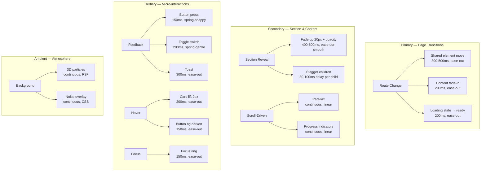
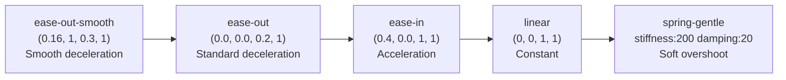
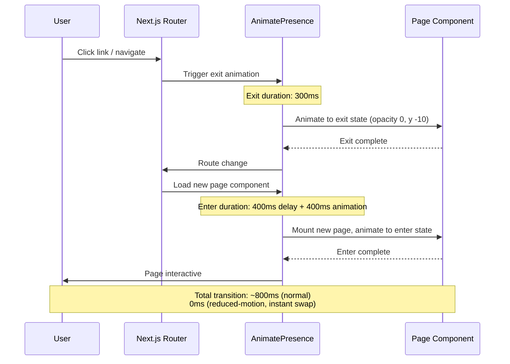
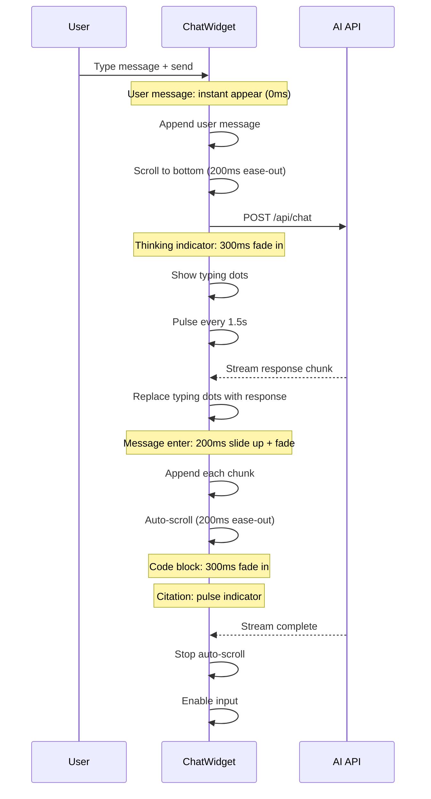
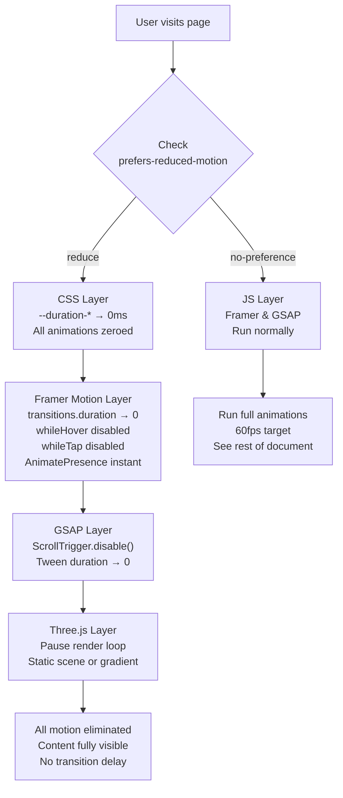
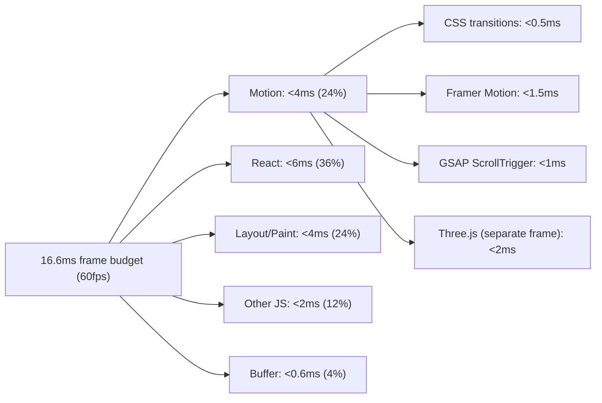
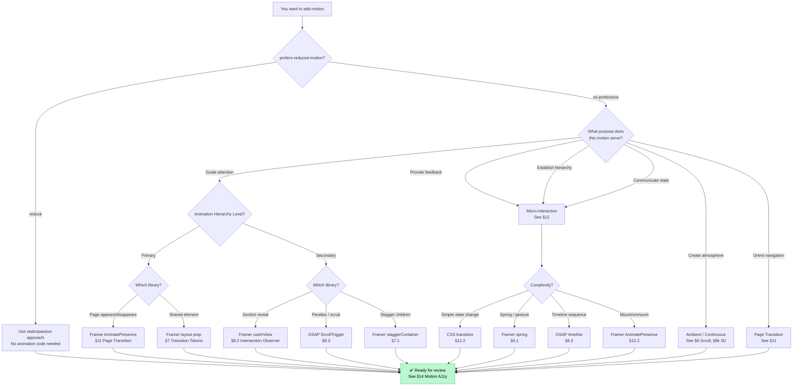

# Motion System — Enterprise Animation Architecture

> **Document:** `08l-MOTION-SYSTEM.md` | **Version:** 1.0 | **Last Updated:** June 2026
> **Status:** ✅ Active | **Owner:** Design Lead + Frontend Lead | **Review Cadence:** Quarterly
> **⚠️ Disambiguation:** This document overlaps with other 3D/design docs. For the canonical reference, see:
> - 3D Architecture Strategy: `3D_ARCHITECTURE.md`
> - 3D Technical Implementation: `08k-3D-ARCHITECTURE.md`
> - 3D Usage Guidelines: `08j-USAGE-GUIDELINES.md`
> - Immersive Experience: `08o-IMMERSIVE-EXPERIENCE.md`
> - Neumorphism: `08n-NEUMORPHISM.md`
> **Classification:** Enterprise Design System | **Stack:** Framer Motion 11.x + GSAP 3.12 + Lenis + CSS Transitions
> **Bundle Budget:** CSS 0KB + Framer Motion 15KB + GSAP 20KB (lazy) + Lenis 5KB (lazy) = **40KB total**
> **Target Metrics:** 60fps on mid-range devices, < 4ms frame budget for motion, 100% reduced-motion compliance, < 50KB JS motion bundle (gzip)
> **Related:** [DesignTokens.md](./DesignTokens.md) (§8 Motion Language, §14 Animation Rules) | [FrontendArchitecture.md](./FrontendArchitecture.md) (§8 Animation Architecture) | [DesignSystem.md](./DesignSystem.md) (§10 Motion UX) | [AccessibilityArchitecture.md](./AccessibilityArchitecture.md) (§9 Motion) | [PerformanceArchitecture.md](./PerformanceArchitecture.md) | [08k-3D-ARCHITECTURE.md](./08k-3D-ARCHITECTURE.md)

---

## Executive Summary

Defines the motion design system - animation principles, easing curves, transition durations, parallax effects, scroll-triggered animations, and performance budgets for smooth UI motion.

---

## Table of Contents

1. [Executive Summary](#1-executive-summary)
2. [Motion Philosophy](#2-motion-philosophy)
3. [Animation Hierarchy](#3-animation-hierarchy)
4. [Motion Tokens](#4-motion-tokens)
5. [Timing Tokens](#5-timing-tokens)
6. [Easing Tokens](#6-easing-tokens)
7. [Transition Tokens](#7-transition-tokens)
8. [Scroll Rules](#8-scroll-rules)
9. [Hover Rules](#9-hover-rules)
10. [Focus Rules](#10-focus-rules)
11. [Page Transition Rules](#11-page-transition-rules)
12. [Microinteraction Rules](#12-microinteraction-rules)
13. [AI Interaction Rules](#13-ai-interaction-rules)
14. [Motion Accessibility Rules](#14-motion-accessibility-rules)
15. [Performance Budget](#15-performance-budget)
16. [Motion Decision Flowchart](#16-motion-decision-flowchart)
17. [Architecture Decision Records](#17-architecture-decision-records)
18. [Risk Register](#18-risk-register)
19. [Glossary](#19-glossary)
20. [Cross-References](#20-cross-references)
21. [Change Log](#21-change-log)

---

## 1. Executive Summary

This document is the **single source of truth** for all motion, animation, and transition behavior across the portfolio platform. It consolidates rules previously scattered across 07-DESIGN (§8, §10, §14), 08c-FRONTEND-ARCHITECTURE (§8), 06-UIUX (§10), and 28-ACCESSIBILITY (§9) into one enterprise-grade motion system.

**Motion Philosophy:** *"Motion should communicate, not decorate."*

### 1.1 Technology Stack

| Layer | Library | Bundle (gzip) | Load Strategy | Purpose |
|-------|---------|---------------|---------------|---------|
| **L1 — CSS** | Tailwind transitions | 0KB | Always (inline) | Hover, focus, pseudo-class micro-interactions |
| **L2 — Base** | Framer Motion 11.x | ~15KB | Always (chunked with app) | Component animations, layout animations, gestures, AnimatePresence |
| **L3 — Advanced** | GSAP 3.12 | ~20KB | Lazy (page with scroll) | ScrollTrigger, timeline sequences, parallax |
| **L4 — Smooth** | Lenis | ~5KB | Lazy (page with content) | Smooth scrolling, custom easing |
| **L5 — 3D** | Three.js / R3F | ~50KB (separate) | Lazy (hero only) | 3D scene motion (see 08k) |

### 1.2 Unified Motion KPIs

| KPI | Target | Measurement | Enforcement |
|-----|--------|-------------|-------------|
| **Frame rate** | 60fps | Chrome DevTools FPS meter | CI performance gate |
| **Motion bundle** | < 40KB gzip | Webpack Bundle Analyzer | CI size gate |
| **Animation budget** | < 4ms frame time | Performance API | Weekly review |
| **Reduced motion compliance** | 100% | Manual audit + axe | Release gate |
| **GSAP ScrollTrigger memory** | < 1MB | Heap snapshot | Quarterly audit |
| **Framer AnimatePresence cleanup** | Zero orphans | React devtools | Per PR review |

### 1.3 What This Document Replaces

| Previous Source | Section | Now |
|----------------|---------|-----|
| `DesignTokens.md` | §8 Motion Language | ✅ Cross-reference to 08l |
| `DesignTokens.md` | §14 Animation Rules | ✅ Cross-reference to 08l |
| `FrontendArchitecture.md` | §8 Animation Architecture | ✅ Cross-reference to 08l |
| `DesignSystem.md` | §10 Motion UX | ✅ Cross-reference to 08l |
| `AccessibilityArchitecture.md` | §9 Motion & Animation | ✅ Cross-reference to 08l |

---

## 2. Motion Philosophy

### 2.1 Six Tenets of Motion

| Tenet | Meaning | Application |
|-------|---------|-------------|
| **Purposeful** | Every animation serves a functional goal — guide, feedback, or hierarchy | No decorative motion without justification |
| **Performant** | 60fps on mid-range devices — only `transform` and `opacity` | Never animate layout properties |
| **Subtle** | If the user notices the animation technique, it's too much | 100-300ms for micro-interactions |
| **Consistent** | Same motion type for same action across the entire platform | All buttons bounce, all cards lift, all sections reveal upward |
| **Accessible** | `prefers-reduced-motion` kills all non-essential motion | GSAP reverts, Framer goes instant, CSS zeroes durations |
| **Progressive** | Motion enhances the experience but never blocks it | Content is fully accessible before animation completes |

### 2.2 Motion Purpose Categories

| Purpose | Description | Examples | Duration Range | Hierarchy Level |
|---------|-------------|----------|----------------|-----------------|
| **Guide attention** | Direct eye to important content | Section reveals, scroll-triggered emphasis, stagger grids | 400-600ms | Secondary |
| **Provide feedback** | Confirm user action in real-time | Button press, toggle, toast, hover lift | 100-200ms | Tertiary |
| **Establish hierarchy** | Show relationships between elements | Card lift, modal scale, drawer slide | 200-400ms | Tertiary |
| **Communicate state** | Show system status | Loading shimmer, progress bar, typing indicator | 1.5s loop | Tertiary |
| **Create atmosphere** | Ambient environment | 3D particles, parallax, noise overlay | Continuous | Ambient |
| **Orient navigation** | Spatial awareness during transition | Page crossfade, shared element moves, scroll progress | 300-500ms | Primary |

### 2.3 What to Animate (and What Not To)

| Animate | Don't Animate |
|---------|---------------|
| Element entrance (fade + slide up) | Page transitions on reduced-motion |
| Hover states (lift 2px, shadow increase) | Background images or patterns |
| Interactive feedback (press scale 0.97, focus ring) | Decorative elements without purpose |
| Loading indicators (skeleton, spinner) | Page load transitions (instant preferred) |
| Progress indicators (scroll bar, upload) | Navigation (instant route change) |
| State changes (toggle, accordion, modal) | Text content changes (instant swap) |
| Data counters (animated numbers) | Layout structure or dimensions |
| Chat messages (entrance slide) | Banner/promotional animations |

---

## 3. Animation Hierarchy

### 3.1 Hierarchy Levels



### 3.2 Hierarchy Rules

| Level | Frame Budget | Library | Reduced Motion Behavior | Count per Page |
|-------|-------------|---------|------------------------|----------------|
| **Primary** | < 2ms | Framer AnimatePresence | Instant swap, no animation | 0-1 (one route change at a time) |
| **Secondary** | < 1ms per element | Framer + GSAP + IntersectionObserver | Static visible, no entrance | 8-15 sections |
| **Tertiary** | < 0.5ms per interaction | CSS + Framer | Instant state change, no scale/fade | 20-50+ interactions |
| **Ambient** | < 1ms (separate thread) | Three.js (GPU) | Paused or static | 0-2 (hero, 404) |

### 3.3 Hierarchy Decision Matrix

| If you want to animate... | It's this level | Use this tool | With this priority |
|--------------------------|----------------|--------------|-------------------|
| Page entering after route change | Primary | Framer AnimatePresence | P1 — Always |
| Section fading in on scroll | Secondary | Framer `useInView` + variants | P1 — Always |
| Card hover lift | Tertiary | CSS `transition` | P1 — Always |
| Button press feedback | Tertiary | Framer `whileTap` | P1 — Always |
| Loading skeleton shimmer | Tertiary | CSS `animation` | P1 — Always |
| Chat message streaming in | Tertiary | Framer `layout` + `AnimatePresence` | P2 — Important |
| Parallax background | Secondary | GSAP ScrollTrigger (lazy) | P2 — Important |
| Number counter animation | Tertiary | Framer `useMotionValue` | P3 — Enhancement |
| Ambient 3D particles | Ambient | Three.js (see 08k) | P3 — Enhancement |

---

## 4. Motion Tokens

### 4.1 CSS Custom Properties

```css
:root {
  /* ─── Timing Tokens ───────────────────────────── */
  --duration-instant:   0ms;
  --duration-micro:   100ms;  /* Button press, toggle */
  --duration-fast:    200ms;  /* Hover lift, focus ring */
  --duration-normal:  300ms;  /* Toast, tooltip, modal */
  --duration-slow:    500ms;  /* Drawer, page transition */
  --duration-reveal:  600ms;  /* Section entrance */
  --duration-emphasis: 1000ms; /* Counter, confetti */
  --duration-ambient:  2000ms; /* Particle loop, shimmer */

  /* ─── Easing Tokens ──────────────────────────── */
  --ease-out-smooth:  cubic-bezier(0.16, 1, 0.3, 1);   /* Section reveals */
  --ease-out:         cubic-bezier(0.0, 0.0, 0.2, 1);   /* Standard exit */
  --ease-in:          cubic-bezier(0.4, 0.0, 1, 1);     /* Standard enter */
  --ease-in-out:      cubic-bezier(0.4, 0.0, 0.2, 1);   /* Transition both */
  --ease-linear:      cubic-bezier(0.0, 0.0, 1, 1);     /* Continuous */
  
  /* Spring approximations (CSS cubic-bezier) */
  --ease-spring-gentle:  cubic-bezier(0.34, 1.56, 0.64, 1);  /* Toggle, card */
  --ease-spring-snappy:  cubic-bezier(0.4,  1.2,  0.6,  1);  /* Button press */
  --ease-spring-bounce:  cubic-bezier(0.68, -0.55, 0.265, 1.55); /* Emphasis */
}

@media (prefers-reduced-motion: reduce) {
  :root {
    --duration-instant:   0ms;
    --duration-micro:    0ms;
    --duration-fast:     0ms;
    --duration-normal:   0ms;
    --duration-slow:     0ms;
    --duration-reveal:   0ms;
    --duration-emphasis: 0ms;
    --duration-ambient:  0ms;
  }
}
```

### 4.2 Token-to-Library Mapping

| Token | CSS | Framer Motion | GSAP |
|-------|-----|---------------|------|
| `--duration-micro` | `100ms` | `duration: 0.1` | `duration: 0.1` |
| `--duration-fast` | `200ms` | `duration: 0.2` | `duration: 0.2` |
| `--duration-normal` | `300ms` | `duration: 0.3` | `duration: 0.3` |
| `--duration-slow` | `500ms` | `duration: 0.5` | `duration: 0.5` |
| `--duration-reveal` | `600ms` | `duration: 0.6` | `duration: 0.6` |
| `--duration-emphasis` | `1000ms` | `duration: 1.0` | `duration: 1.0` |
| `--ease-out-smooth` | `cubic-bezier(0.16, 1, 0.3, 1)` | `ease: [0.16, 1, 0.3, 1]` | `ease: 'power3.out'` |
| `--ease-out` | `cubic-bezier(0.0, 0.0, 0.2, 1)` | `ease: [0.0, 0.0, 0.2, 1]` | `ease: 'power2.out'` |
| `--ease-spring-gentle` | `cubic-bezier(0.34, 1.56, 0.64, 1)` | `type: 'spring', stiffness: 200, damping: 20` | Not supported (ease proxy) |
| `--ease-spring-snappy` | `cubic-bezier(0.4, 1.2, 0.6, 1)` | `type: 'spring', stiffness: 400, damping: 15` | Not supported (ease proxy) |

---

## 5. Timing Tokens

### 5.1 Timing Scale

| Token | Value | Use Case | Human Perception |
|-------|-------|----------|------------------|
| `instant` | 0ms | Instant state change, reduced-motion override | No perceived delay |
| `micro` | 100ms | Button press, toggle click, focus ring | Feels immediate, sub-threshold |
| `fast` | 200ms | Hover lift, card elevation, tooltip appear | Quick but noticeable feedback |
| `normal` | 300ms | Toast, modal fade, drawer slide | Standard UI transition |
| `slow` | 500ms | Page transition, shared element move | Deliberate, spatial orientation |
| `reveal` | 600ms | Section entrance, content stagger | Noticeable reveal, guides attention |
| `emphasis` | 1000ms | Counter animation, confetti, achievement | Celebratory, savored moment |
| `ambient` | 2000ms+ | Shimmer loop, particle drift | Background, not consciously tracked |

### 5.2 Duration Rules

| Rule | Rationale |
|------|-----------|
| **Micro-interactions ≤ 200ms** | Feels responsive, sub-conscious feedback |
| **UI transitions ≤ 500ms** | User waits for UI state changes; longer feels sluggish |
| **Reveals ≤ 600ms** | Long enough to guide attention, short enough to not delay content access |
| **Exit is 60-70% of enter** | Exits feel faster, user wants to close; enter takes time to orient |
| **Stagger delay per child: 50-80ms** | Optimal for perceiving individual items without impatience |
| **Ambient loops: no faster than 2s** | Faster loops are distracting; slower fades into background |

### 5.3 Duration Override Matrix

| Context | Normal | Reduced Motion | Touch Device | Low-Perf Device |
|---------|--------|----------------|--------------|-----------------|
| Hover | 200ms ease-out | 0ms | N/A (no hover) | 100ms |
| Focus | 150ms ease-out | 0ms | 150ms | 100ms |
| Button press | 150ms spring-snappy | 0ms | 100ms | 0ms (no scale) |
| Section reveal | 600ms ease-out-smooth | 0ms (static) | 400ms | 300ms |
| Page transition | 400ms crossfade | 0ms (instant) | 400ms | 0ms (instant) |
| Toast | 300ms ease-out | 100ms fade | 300ms | 200ms |
| Modal | 200ms scale+fade | 100ms fade only | 200ms | 150ms |

---

## 6. Easing Tokens

### 6.1 Easing Catalog

| Token | Curve / Config | Feel | Use When |
|-------|---------------|------|----------|
| `ease-out-smooth` | `cubic-bezier(0.16, 1, 0.3, 1)` | Smooth deceleration, natural ease-out | Section reveals, entrances, content appearance |
| `ease-out` | `cubic-bezier(0.0, 0.0, 0.2, 1)` | Standard deceleration | Toast, tooltip, drawer, modal, hover |
| `ease-in` | `cubic-bezier(0.4, 0.0, 1, 1)` | Acceleration | Exits (modal close, toast dismiss) |
| `ease-in-out` | `cubic-bezier(0.4, 0.0, 0.2, 1)` | Symmetric ease | Accordion, expand/collapse, shared elements |
| `linear` | `cubic-bezier(0.0, 0.0, 1, 1)` | Constant speed | Shimmer, particle drift, progress bar, parallax |
| `spring-gentle` | Framer: `{ stiffness: 200, damping: 20 }` | Soft overshoot, settles quickly | Toggle, card hover, switch, radio button |
| `spring-snappy` | Framer: `{ stiffness: 400, damping: 15 }` | Quick snap with subtle bounce | Button press, CTA, interactive feedback |
| `spring-bounce` | Framer: `{ stiffness: 150, damping: 8 }` | Playful bounce, multiple oscillations | Emphasis, counter complete, success state |

### 6.2 Easing Curve Visual Reference



### 6.3 Easing Selection Rules

| If the motion is... | Use | Reason |
|--------------------|-----|--------|
| An element appearing | `ease-out-smooth` or `ease-out` | Natural deceleration mimics real-world settling |
| An element disappearing | `ease-in` | Acceleration mimics real-world drop/speed away |
| Both appearing and disappearing | `ease-in-out` | Symmetric, smooth both ways |
| Continuous / looping | `linear` | Constant speed prevents visual beat |
| A physical interaction (press, lift) | `spring-snappy` or `spring-gentle` | Spring physics mimics real-world elasticity |
| A playful/delight moment | `spring-bounce` | Overshoot adds personality |

---

## 7. Transition Tokens

### 7.1 Compound Transition Catalog

Each transition token combines timing + easing into a reusable pattern available in CSS, Framer Motion, and GSAP.

| Token | CSS | Framer Motion | GSAP |
|-------|-----|---------------|------|
| **fadeIn** | `opacity 400ms var(--ease-out-smooth)` | `{ opacity: 1, transition: { duration: 0.4, ease: [0.16, 1, 0.3, 1] } }` | `{ opacity: 1, duration: 0.4, ease: 'power3.out' }` |
| **slideUp** | `transform: translateY(0) 400ms var(--ease-out-smooth)` | `{ y: 0, opacity: 1, transition: { duration: 0.4, ease: [0.16, 1, 0.3, 1] } }` | `{ y: 0, opacity: 1, duration: 0.4, ease: 'power3.out' }` |
| **scaleIn** | `transform: scale(1) 200ms var(--ease-out)` | `{ scale: 1, opacity: 1, transition: { duration: 0.2, ease: [0.0, 0.0, 0.2, 1] } }` | `{ scale: 1, opacity: 1, duration: 0.2, ease: 'power2.out' }` |
| **cardLift** | `transform: translateY(-2px) 200ms var(--ease-out), box-shadow ... 200ms` | `{ y: -2, boxShadow: '0 10px 40px ...', transition: { duration: 0.2 } }` | `{ y: -2, boxShadow: '...', duration: 0.2, ease: 'power2.out' }` |
| **modalEnter** | `opacity 200ms, transform: scale(1) 200ms var(--ease-out)` | `{ scale: 1, opacity: 1, transition: { duration: 0.2, ease: [0.0, 0.0, 0.2, 1] } }` | `{ scale: 1, opacity: 1, duration: 0.2 }` |
| **modalExit** | `opacity 150ms var(--ease-in), transform: scale(0.95) 150ms var(--ease-in)` | `{ scale: 0.95, opacity: 0, transition: { duration: 0.15, ease: [0.4, 0.0, 1, 1] } }` | `{ scale: 0.95, opacity: 0, duration: 0.15, ease: 'power2.in' }` |
| **staggerChildren** | N/A (CSS can't stagger) | `{ staggerChildren: 0.08, delayChildren: 0.2 }` | `{ stagger: 0.08, delay: 0.2 }` |
| **pageEnter** | N/A (handled by Framer) | `{ opacity: 1, y: 0, transition: { duration: 0.4, ease: [0.16, 1, 0.3, 1] } }` | N/A (AnimatePresence preferred) |
| **pageExit** | N/A (handled by Framer) | `{ opacity: 0, y: -10, transition: { duration: 0.3, ease: [0.4, 0.0, 1, 1] } }` | N/A (AnimatePresence preferred) |

### 7.2 Transition Token Usage

```typescript
// apps/web/src/lib/motion/transitions.ts
import { Variants, Transition } from 'framer-motion';

// ─── Timing ──────────────────────────────────
export const duration = {
  instant:  0,
  micro:    0.1,
  fast:     0.2,
  normal:   0.3,
  slow:     0.5,
  reveal:   0.6,
  emphasis: 1.0,
} as const;

// ─── Easing ──────────────────────────────────
export const ease = {
  outSmooth: [0.16, 1, 0.3, 1] as const,
  out:       [0.0, 0.0, 0.2, 1] as const,
  in:        [0.4, 0.0, 1, 1] as const,
  inOut:     [0.4, 0.0, 0.2, 1] as const,
  linear:    [0.0, 0.0, 1, 1] as const,
} as const;

// ─── Spring Configs ───────────────────────────
export const spring = {
  gentle: { type: 'spring' as const, stiffness: 200, damping: 20 },
  snappy: { type: 'spring' as const, stiffness: 400, damping: 15 },
  bounce: { type: 'spring' as const, stiffness: 150, damping: 8 },
} as const;

// ─── Compound Transitions ─────────────────────
export const transitions = {
  fadeIn:       { duration: duration.reveal, ease: ease.outSmooth } as Transition,
  slideUp:      { duration: duration.reveal, ease: ease.outSmooth } as Transition,
  scaleIn:      { duration: duration.fast, ease: ease.out } as Transition,
  modalEnter:   { duration: duration.fast, ease: ease.out } as Transition,
  modalExit:    { duration: 0.15, ease: ease.in } as Transition,
  pageEnter:    { duration: duration.slow, ease: ease.outSmooth } as Transition,
  pageExit:     { duration: duration.normal, ease: ease.in } as Transition,
  cardLift:     { duration: duration.fast, ease: ease.out } as Transition,
  hoverReveal:  { duration: duration.fast, ease: ease.out } as Transition,
  feedback:     spring.snappy,
  toggle:       spring.gentle,
} as const;

// ─── Variants ─────────────────────────────────
export const fadeIn: Variants = {
  hidden:  { opacity: 0, y: 20 },
  visible: { opacity: 1, y: 0, transition: transitions.slideUp },
};

export const staggerContainer: Variants = {
  hidden:  {},
  visible: { transition: { staggerChildren: 0.08, delayChildren: 0.2 } },
};

export const scaleIn: Variants = {
  hidden:  { opacity: 0, scale: 0.8 },
  visible: { opacity: 1, scale: 1, transition: transitions.scaleIn },
};

export const pageTransition: Variants = {
  initial:  { opacity: 0, y: -10 },
  enter:    { opacity: 1, y: 0, transition: transitions.pageEnter },
  exit:     { opacity: 0, y: 10, transition: transitions.pageExit },
};
```

---

## 8. Scroll Rules

### 8.1 Scroll-Driven Animation

| Technique | Library | Bundle Cost | When to Use | Implementation |
|-----------|---------|-------------|-------------|----------------|
| **Intersection Observer** | Native browser API | 0KB | Section reveals, entrance animations (preferred) | `useInView` from Framer Motion |
| **ScrollTrigger** | GSAP (lazy) | ~20KB | Parallax, scrub-based animations, timeline sequences | `gsap.to()` + `ScrollTrigger` |
| **Lenis** | Lenis (lazy) | ~5KB | Smooth-scroll enabled pages | Wraps `window` scroll with custom easing |
| **CSS scroll-behavior** | Native CSS | 0KB | Anchor links, same-page navigation | `scroll-behavior: smooth` |

### 8.2 Intersection Observer Rules

| Rule | Detail |
|------|--------|
| **Use `once: true`** | Elements animate once on first reveal, not on every scroll |
| **Margin: `-100px`** | Triggers animation slightly before element enters viewport |
| **Threshold: `0.1`** | Animates when 10% of element is visible |
| **Stagger: 50-80ms per child** | Grid items, list items, card rows |
| **GSAP only for scrub** | If animation needs to track scroll position, use GSAP ScrollTrigger |
| **Descope after 768px** | Mobile: reduce or skip scroll-triggered animations |

### 8.3 ScrollTrigger Config

```typescript
// apps/web/src/lib/motion/scrollTrigger.ts
import { gsap } from 'gsap';
import { ScrollTrigger } from 'gsap/ScrollTrigger';
gsap.registerPlugin(ScrollTrigger);

export const useScrollParallax = (
  ref: React.RefObject<HTMLDivElement>,
  speed: number = 0.3
) => {
  useEffect(() => {
    const ctx = gsap.context(() => {
      gsap.to(ref.current, {
        y: () => window.innerHeight * speed,
        ease: 'none',
        scrollTrigger: {
          trigger: ref.current,
          start: 'top bottom',
          end: 'bottom top',
          scrub: 1,
        },
      });
    }, ref);
    return () => ctx.revert();
  }, [ref, speed]);
};

export const useScrollProgress = (
  ref: React.RefObject<HTMLDivElement>,
  onProgress: (progress: number) => void
) => {
  useEffect(() => {
    const ctx = gsap.context(() => {
      ScrollTrigger.create({
        trigger: ref.current,
        start: 'top top',
        end: 'bottom top',
        scrub: 1,
        onUpdate: (self) => onProgress(self.progress),
      });
    }, ref);
    return () => ctx.revert();
  }, [ref, onProgress]);
};
```

### 8.4 Scroll Performance Rules

| Rule | Reason |
|------|--------|
| **Never attach `scroll` listener** | Passive event listener still fires on main thread; use IntersectionObserver or ScrollTrigger instead |
| **ScrollTrigger scrub ≥ 1** | Lower scrub values cause more frequent callback execution |
| **Pin spacing: reserve space** | `pinSpacing: true` prevents layout jump when pinning elements |
| **Mobile: reduce parallax offset** | Maximum 50px parallax on mobile (vs 100px+ desktop) |
| **Disable GSAP on reduced-motion** | `ScrollTrigger.getAll().forEach(t => t.disable())` — see §14 |

---

## 9. Hover Rules

### 9.1 Hover Behavior by Device

| Device Type | Detection | Hover Available? | Behavior |
|-------------|-----------|-----------------|----------|
| Desktop (mouse) | `pointer: fine` | Yes | Full hover states: lift, shadow, color, tooltip |
| Laptop (trackpad) | `pointer: fine` | Yes | Full hover states |
| Tablet (touch) | `pointer: coarse` | No | No hover, tap to show tooltip, press for feedback |
| Phone (touch) | `pointer: coarse` | No | No hover, tap to show tooltip, press for feedback |

### 9.2 Hover Implementation

```typescript
// apps/web/src/hooks/useDeviceType.ts
export const useDeviceType = () => {
  const [deviceType, setDeviceType] = useState<'mouse' | 'touch' | 'unknown'>('unknown');

  useEffect(() => {
    const pointer = window.matchMedia('(pointer: fine)');
    const touch = window.matchMedia('(pointer: coarse)');
    
    if (pointer.matches) setDeviceType('mouse');
    else if (touch.matches) setDeviceType('touch');
    else setDeviceType('unknown');
  }, []);

  return deviceType;
};
```

### 9.3 Hover Token Specifications

| Element | Normal State | Hover State | Transition | Reduced Motion |
|---------|-------------|-------------|------------|----------------|
| **Button (primary)** | Solid bg | BG darken 10% | 150ms ease-out | Instant color change |
| **Button (secondary)** | Outline | BG fill 10% accent | 150ms ease-out | Instant color change |
| **Card** | Flat, shadow-md | Lift 2px, shadow-lg → shadow-xl | 200ms ease-out | No lift, color border change |
| **Link** | Text color | Underline, color shift | 150ms ease-out | Instant underline |
| **Project card** | Flat, shadow-md | Lift 3px, shadow-xl, scale 1.02 | 200ms ease-out | No transform |
| **Social icon** | Mono, opacity 70% | Full color, opacity 100% | 150ms ease-out | Instant color |
| **Tag / badge** | Solid bg | Slight lift 1px | 100ms ease-out | No lift |

### 9.4 Hover Rules

| Rule | Rationale |
|------|-----------|
| **Hover never required for operation** | Touch devices have no hover; essential actions must work via tap |
| **Hover state ≤ 200ms** | Longer feels sluggish; user expects instant feedback on pointer enter |
| **Hover and focus parity** | Same visual state for hover (mouse) and focus-visible (keyboard) |
| **No hover on touch** | `@media (hover: hover)` and `(pointer: fine)` guards |
| **Tooltip on hover: show 300ms delay** | Prevents tooltip flash during cursor movement |

---

## 10. Focus Rules

### 10.1 Focus Implementation

```css
/* apps/web/src/styles/focus.css */
:focus-visible {
  outline: 2px solid var(--color-accent);
  outline-offset: 2px;
  border-radius: 4px;
  transition: outline-offset var(--duration-fast) var(--ease-out);
}

:focus:not(:focus-visible) {
  outline: none; /* Mouse click focus — no ring */
}
```

### 10.2 Focus Animation Tokens

| Property | Normal | Focus | Reduced Motion |
|----------|--------|-------|----------------|
| Outline | `none` | `2px solid var(--color-accent)` | `2px solid` (instant) |
| Outline offset | `0` | `2px` | `2px` (no transition) |
| Border radius | `inherit` | `4px` | `4px` |
| Transition | — | `150ms ease-out` | `0ms` |
| Box shadow | — | `0 0 0 4px rgba(99,102,241,0.2)` | `0 0 0 4px` (instant) |

### 10.3 Focus Order Rules

| Element | Tab Order | Focus Target | Animation |
|---------|-----------|-------------|-----------|
| Skip link | 1 | Main content | Visible on first Tab press |
| Navigation links | 2-8 | Each nav item | Focus ring, 150ms |
| Hero CTA buttons | 9-10 | Primary → Secondary | Focus ring + button press |
| Section scroll anchors | N/A | Section heading | Focus ring on heading |
| Project cards | 11-14 | Card link / Learn more | Focus ring (same as hover: lift + shadow) |
| Contact form fields | 15-19 | Each input | Focus ring + border highlight |
| Contact submit | 20 | Button | Focus ring + button press |

### 10.4 Focus Rules

| Rule | Rationale |
|------|-----------|
| **Never remove focus outline** | WCAG 2.4.7 Focus Visible — keyboard users require visible focus indicator |
| **`focus-visible` over `focus`** | Only show outline on keyboard focus (Tab), not mouse click |
| **150ms transition on focus ring** | Quick enough to feel responsive, slow enough to be noticeable |
| **Focus = Hover visual parity** | Keyboard users see the same visual state as mouse hover |
| **Focus trap uses 200ms** | Modal/drawer focus trap should transition smoothly, not snap |
| **Skip link: first tab stop** | Visible on first Tab press, rest of page hidden until Tab again |

---

## 11. Page Transition Rules

### 11.1 Page Transition Architecture



### 11.2 Page Transition States

| State | Duration | Opacity | Y Offset | Easing | When |
|-------|----------|---------|----------|--------|------|
| **Exit (leaving page)** | 300ms | 1 → 0 | 0 → -10 | `ease-in` | Route change triggered |
| **Enter (new page)** | 400ms | 0 → 1 | 10 → 0 | `ease-out-smooth` | Page component mounts |
| **Reduced motion exit** | 0ms | 0 | 0 | N/A | `prefers-reduced-motion` |
| **Reduced motion enter** | 0ms | 1 | 0 | N/A | `prefers-reduced-motion` |

### 11.3 Next.js App Router Implementation

```typescript
// apps/web/src/components/layout/PageTransitionProvider.tsx
'use client';

import { motion, AnimatePresence } from 'framer-motion';
import { usePathname } from 'next/navigation';
import { pageTransition } from '@/lib/motion/transitions';
import { useReducedMotion } from '@/hooks/useReducedMotion';

export const PageTransitionProvider = ({
  children,
}: {
  children: React.ReactNode;
}) => {
  const pathname = usePathname();
  const reducedMotion = useReducedMotion();

  return (
    <AnimatePresence mode="wait">
      <motion.div
        key={pathname}
        variants={pageTransition}
        initial="initial"
        animate="enter"
        exit={reducedMotion ? undefined : 'exit'}
        transition={reducedMotion ? { duration: 0 } : undefined}
      >
        {children}
      </motion.div>
    </AnimatePresence>
  );
};
```

### 11.4 Route Prefetch Strategy

| Action | Prefetch | Animation | Rationale |
|--------|----------|-----------|-----------|
| Link hover | ✅ Prefetch page data | None (prefetch in background) | Sub-100ms page load feels instant |
| Link tap (same domain) | Already prefetched | Page transition 300-400ms | Content ready, just animate |
| Link tap (no prefetch) | ❌ No prefetch | Page transition + loading state | Show loading skeleton |
| Back/Forward | Uses bfcache | Reversed transition | Smooth back navigation |
| Form submit | N/A | Loading spinner on button | User expects processing delay |

### 11.5 Page Transition Rules

| Rule | Detail |
|------|--------|
| **Page transitions are 300-400ms total** | Exit (300ms) + React render + Enter (400ms) = ~800ms user-perceived |
| **Reduced-motion: instant swap** | `mode="wait"` removed, content swaps immediately |
| **Prefetch on hover** | Links prefetch page data on hover for near-instant navigation |
| **Mobile: skip exit animation** | Mobile benefits from faster navigation; skip exit, shorten enter to 200ms |
| **Shared elements: 500ms** | If same element exists on both pages (e.g., header logo), animate smoothly at 500ms |
| **Loading states transition at 200ms** | Skeleton → content should feel connected, not abrupt |

---

## 12. Microinteraction Rules

### 12.1 Microinteraction Catalog

| Element | Action | Animation | Duration | Easing | Library | Reduced Motion |
|---------|--------|-----------|----------|--------|---------|----------------|
| **Button** | Press | Scale 1 → 0.97 → 1 | 150ms | spring-snappy | Framer `whileTap` | No scale, instant state |
| **Button** | Loading | Spinner rotation | 1.5s loop | linear | CSS animation | Static spinner |
| **Button** | Success | Checkmark appear + pulse | 300ms | ease-out | Framer | Instant checkmark |
| **Toggle** | Click | Knob slide 24px + bg transition | 200ms | spring-gentle | Framer | Instant switch |
| **Card** | Hover | Lift 2px, shadow increase | 200ms | ease-out | CSS transition | Color border only |
| **Card** | Focus | Focus ring + slight lift | 200ms | ease-out | CSS transition | Focus ring only |
| **Toast** | Enter | Slide from top-right (translateX 100% → 0) | 300ms | ease-out | Framer | Fade in only |
| **Toast** | Exit | Slide out (translateX 100%) + fade | 200ms | ease-in | Framer | Fade out only |
| **Modal** | Enter | Scale 0.95→1 + fade in (overlay + content) | 200ms | ease-out | Framer `AnimatePresence` | Fade in only |
| **Modal** | Exit | Scale 1→0.95 + fade out | 150ms | ease-in | Framer `AnimatePresence` | Fade out only |
| **Drawer** | Open | Slide from edge (translateX 100% → 0) | 300ms | ease-out | Framer | Instant open |
| **Drawer** | Close | Slide to edge (translateX 0 → 100%) | 200ms | ease-in | Framer | Instant close |
| **Tooltip** | Show | Fade in + slight translateY(-4) | 200ms | ease-out | CSS / Framer | Instant show |
| **Tooltip** | Hide | Fade out | 100ms | ease-in | CSS / Framer | Instant hide |
| **Skeleton** | Appear | Shimmer sweep gradient | 1.5s loop | linear | CSS animation | Static gray |
| **Accordion** | Open | Height expand + content fade | 300ms | ease-in-out | Framer `layout` | Instant expand |
| **Counter** | Count | Number increment animation | 1000ms | ease-out | Framer `useMotionValue` | Static number |
| **Scroll progress** | Scroll | Bar width 0% → 100% | Continuous | linear | CSS transition | Show/hide bar |
| **Reading progress** | Scroll | Bar width 0% → 100% | Continuous | linear | CSS transition | Show/hide bar |

### 12.2 Microinteraction Library Selection

| If you need... | Use | Because |
|---------------|-----|---------|
| Hover state (color, shadow, lift) | CSS `transition` | 0KB, hardware-accelerated, sufficient for simple state changes |
| Tap/click feedback | Framer `whileTap` | Spring physics needed for natural feel |
| Enter/exit (mount/unmount) | Framer `AnimatePresence` | CSS can't animate on unmount |
| Layout animation | Framer `layout` prop | FLIP calculations built-in |
| Sequential timeline | GSAP timeline | Multiple elements synced with delay/stagger |
| Scroll-driven animation | GSAP ScrollTrigger | Scrub, pin, progress tracking |
| WebGL / 3D animation | Three.js / R3F | GPU-accelerated, custom shaders |
| Continuous background | CSS `animation` | 0KB, infinitely looping, `linear` |

### 12.3 Microinteraction Performance Budget

| Element Type | Max Animated Properties | Max Duration | Frame Budget |
|-------------|------------------------|--------------|-------------|
| Button | 2 (scale, opacity) | 150ms | < 0.2ms |
| Card | 2 (transform, box-shadow) | 200ms | < 0.3ms |
| Toast | 2 (translateX, opacity) | 300ms | < 0.5ms |
| Modal | 3 (scale, opacity, backdrop) | 200ms | < 0.5ms |
| Drawer | 3 (translateX, translateY, opacity) | 300ms | < 0.8ms |
| Skeleton | 1 (background-position) | 1.5s loop | < 0.1ms |
| Parallax | 1 (translateY) | Continuous | < 0.5ms |
| Counter | 1 (number value) | 1000ms | < 0.3ms |

---

## 13. AI Interaction Rules

### 13.1 AI Chat Message Animation



### 13.2 AI Interaction Motion Tokens

| Event | Animation | Duration | Easing | Library | Reduced Motion |
|-------|-----------|----------|--------|---------|----------------|
| **User message send** | Instant appear (no animation) | 0ms | — | — | — |
| **AI response start** | Typing dots fade in | 200ms | ease-out | Framer | Static dots |
| **AI response chunk** | Message slide up + fade in | 200ms | ease-out | Framer | Instant text |
| **AI response complete** | Subtle pulse on last message | 300ms | ease-out | Framer | No pulse |
| **Code block appear** | Fade in + slight scale | 300ms | ease-out | Framer | Instant |
| **Citation highlight** | Background pulse | 500ms | ease-out | CSS | No pulse |
| **Typing indicator** | 3 dots bounce, staggered | 1.5s loop | spring | CSS animation | Static dots |
| **Auto-scroll** | Smooth scroll to bottom | 200ms | ease-out | Element.scroll | Instant scroll |
| **Thinking state** | Input disabled + subtle pulse | 1.5s loop | linear | CSS | Static disabled |
| **Error message** | Shake horizontally | 300ms | spring-bounce | Framer | No shake |
| **Streaming cursor** | Blinking vertical bar | 1s loop | linear | CSS animation | Static cursor |

### 13.3 Streaming Content Animation

```typescript
// apps/web/src/components/chat/ChatMessage.tsx
const ChatMessage = ({ content, role, isStreaming }: ChatMessageProps) => {
  const [isVisible, setIsVisible] = useState(false);

  useEffect(() => {
    // Brief delay before animating in, to feel organic
    const timer = setTimeout(() => setIsVisible(true), 50);
    return () => clearTimeout(timer);
  }, []);

  return (
    <motion.div
      initial={role === 'assistant' ? { opacity: 0, y: 12 } : { opacity: 1 }}
      animate={isVisible ? { opacity: 1, y: 0 } : {}}
      transition={{ duration: 0.2, ease: [0.0, 0.0, 0.2, 1] }}
      layout
    >
      {/* Content with streaming cursor */}
      <div className="message-content">
        <ReactMarkdown>{content}</ReactMarkdown>
        {isStreaming && <StreamingCursor />}
      </div>
    </motion.div>
  );
};

const StreamingCursor = () => (
  <motion.span
    className="inline-block w-[2px] h-[1em] bg-accent ml-1"
    animate={{ opacity: [1, 0] }}
    transition={{ duration: 0.5, repeat: Infinity, ease: 'linear' }}
  />
);
```

### 13.4 AI Interaction Rules

| Rule | Rationale |
|------|-----------|
| **User message: instant** | User's own message should appear immediately; no animation delay |
| **AI response: 200ms delay before showing** | Brief pause signals "thinking" naturally; too fast feels robotic |
| **Streaming text: no per-character animation** | Per-character animation is gimmicky and slows reading; show full word/chunk |
| **Code blocks: fade in** | Code blocks are visually dense; fade in prevents disorienting pop-in |
| **Citations: subtle pulse** | Pulse draws eye to citation without being distracting |
| **Auto-scroll: smooth 200ms** | Snap scrolling is disorienting; 200ms ease-out feels connected |
| **User scrolls up: stop auto-scroll** | If user reads history, don't steal scroll position; resume on manual scroll-to-bottom |
| **Error: horizontal shake** | Error shake communicates urgency without being aggressive |

---

## 14. Motion Accessibility Rules

### 14.1 Reduced Motion Strategy



### 14.2 CSS Implementation

```css
/* apps/web/src/styles/reduced-motion.css */

/* Global kill switch — zeroes all CSS animations and transitions */
@media (prefers-reduced-motion: reduce) {
  *,
  *::before,
  *::after {
    animation-duration: 0.01ms !important;
    animation-iteration-count: 1 !important;
    transition-duration: 0.01ms !important;
    scroll-behavior: auto !important;
  }

  /* Exception: essential motion for loading/feedback */
  .essential-motion {
    animation-duration: 0.5s !important;
  }

  /* Disable parallax, hover lifts, scroll effects */
  .parallax-element {
    transform: none !important;
  }
  
  .hover-lift:hover {
    transform: none !important;
  }

  /* Disable 3D canvas animation */
  .hero-3d-object {
    animation: none !important;
  }
}
```

### 14.3 JavaScript Implementation

```typescript
// apps/web/src/hooks/useReducedMotion.ts
'use client';

import { useState, useEffect } from 'react';

export function useReducedMotion(): boolean {
  const [prefersReduced, setPrefersReduced] = useState(false);

  useEffect(() => {
    const mq = window.matchMedia('(prefers-reduced-motion: reduce)');
    setPrefersReduced(mq.matches);

    const handler = (e: MediaQueryListEvent) => setPrefersReduced(e.matches);
    mq.addEventListener('change', handler);
    return () => mq.removeEventListener('change', handler);
  }, []);

  return prefersReduced;
}
```

### 14.4 Per-Library Reduced Motion Behavior

| Library | Normal Behavior | Reduced Motion Behavior |
|---------|----------------|------------------------|
| **CSS transitions** | Full duration + easing | `0.01ms` via global CSS override |
| **CSS animations** | Loops, keyframes | `0.01ms` iteration set to 1 |
| **Framer Motion** | Spring physics, variants, AnimatePresence | `transition: { duration: 0 }`, skip `whileHover`/`whileTap`, AnimatePresence instant |
| **GSAP** | ScrollTrigger, timelines, parallax | `ScrollTrigger.getAll().forEach(t => t.disable())`, `duration: 0` |
| **Three.js** | Continuous render loop, particles, interactions | Pause render loop (`setAnimationLoop(null)`), show static frame or gradient |
| **Lenis** | Smooth scrolling with easing | `lenis.destroy()`, return to native scroll |

### 14.5 Framer Motion Reduced Motion Wrapper

```typescript
// apps/web/src/components/shared/MotionSafe.tsx
'use client';

import { motion, type MotionProps } from 'framer-motion';
import { useReducedMotion } from '@/hooks/useReducedMotion';

type MotionSafeProps = MotionProps & {
  as?: 'div' | 'span' | 'section' | 'article';
  children: React.ReactNode;
};

/**
 * Motion wrapper that respects prefers-reduced-motion.
 * All animations become instant when reduced motion is active.
 */
export const MotionSafe = ({
  as: Tag = 'div',
  children,
  transition,
  whileHover,
  whileTap,
  ...props
}: MotionSafeProps) => {
  const reducedMotion = useReducedMotion();
  const Component = motion[Tag];

  return (
    <Component
      {...props}
      transition={reducedMotion ? { duration: 0 } : transition}
      whileHover={reducedMotion ? undefined : whileHover}
      whileTap={reducedMotion ? undefined : whileTap}
    >
      {children}
    </Component>
  );
};
```

### 14.6 Accessibility Override Log

| Override ID | WCAG Criterion | Element | Justification | Risk | Expiry | Status |
|-------------|----------------|---------|---------------|------|--------|--------|
| A11Y-OVR-003 | 2.2.2 Pause/Stop/Hide | Ambient particle animation | Decorative only, no essential info conveyed through motion | Low | Ongoing | 🟢 Active |
| A11Y-OVR-005 | 2.3.1 Three Flashes | Loading shimmer (1.5s loop) | Animation tested for flash frequency; < 3 flashes/sec | Low | Ongoing | 🟢 Active |

### 14.7 Motion Accessibility Rules

| Rule | WCAG Criterion | Implementation |
|------|----------------|----------------|
| **All non-essential motion respects reduced motion** | 1.4.4 Resize Text | CSS `--duration-*` → 0ms, GSAP disable, Framer duration 0 |
| **No essential content via animation** | 1.1.1 Non-text Content | Content is fully accessible with or without animation |
| **No flashing content** | 2.3.1 Three Flashes | All animations tested with PEAT; shimmer verified < 3 flashes/sec |
| **Animation duration limits** | 2.2.2 Pause/Stop/Hide | No animation > 5s (except ambient) |
| **No motion actuation** | 2.5.4 Motion Actuation | No device-motion triggers; pointer events only |
| **Hover content dismissible** | 1.4.13 Content on Hover | Tooltips dismissable without moving pointer |
| **Pause on hover for auto-playing** | 2.2.2 Pause/Stop/Hide | Carousel pauses on hover/focus |
| **Focus order unaffected by animation** | 2.4.3 Focus Order | Animations don't reorder DOM or affect tab sequence |

---

## 15. Performance Budget

### 15.1 Motion-Specific Budgets

| Resource | Budget | Measurement | Enforcement |
|----------|--------|-------------|-------------|
| **Framer Motion bundle** | < 15KB gzip | Bundle Analyzer | CI size gate |
| **GSAP bundle** | < 20KB gzip (lazy) | Bundle Analyzer | CI size gate |
| **Lenis bundle** | < 5KB gzip (lazy) | Bundle Analyzer | CI size gate |
| **Total motion JS** | < 40KB gzip | Bundle Analyzer | CI size gate |
| **Frame budget (all motion)** | < 4ms per frame | Chrome DevTools | Manual + CI lighthouse |
| **GSAP ScrollTrigger instances** | < 10 per page | `ScrollTrigger.getAll()` | Code review |
| **Framer AnimatePresence keys** | < 5 per mount | React devtools | Code review |
| **Concurrent animations** | < 8 | Performance API | Performance review |
| **GPU memory (animations)** | < 30MB | Chrome `about:gpu` | Quarterly audit |

### 15.2 Frame Budget Allocation



### 15.3 Performance Optimization Rules

| Rule | Detail |
|------|--------|
| **Only animate `transform` and `opacity`** | Layout-triggering properties (width, height, top, left) cause forced reflow |
| **GPU-composited properties only** | `transform` and `opacity` are GPU-composited; everything else paints |
| **Will-change sparingly** | `will-change: transform` only on elements that animate continuously |
| **GSAP `revert()` on unmount** | Prevents orphaned ScrollTrigger instances and memory leaks |
| **Framer AnimatePresence: `mode="wait"`** | Waits for exit animation to complete before mounting new, prevents overlap |
| **CSS animations: `@media (prefers-reduced-motion)`** | Prevents unnecessary GPU work for users who don't see animations |
| **Lazy load GSAP and Lenis** | Only load on pages with scroll-triggered animations or smooth scroll |
| **Debounce resize listeners** | ScrollTrigger and Framer recalculate on resize; debounce at 200ms |

---

## 16. Motion Decision Flowchart



---

## 17. Architecture Decision Records

### ADR-001: CSS Transitions for Micro-interactions, Framer for Complex

| Field | Value |
|-------|-------|
| **Context** | Button hover, card lift, and other micro-interactions can be done with CSS `transition` or Framer Motion. |
| **Decision** | Simple state changes (hover, focus, active) use CSS `transition`. Spring physics, gestures, and mount/unmount use Framer Motion. |
| **Rationale** | CSS transitions are 0KB bundle cost, hardware-accelerated, and sufficient for simple hover/focus. Framer Motion adds ~15KB for spring physics and AnimatePresence, justified only when CSS can't handle the interaction. |
| **Consequences** | Developers must decide which library to use per interaction; clear guidance in §12.2. |

### ADR-002: GSAP for Scroll-Driven Animation Only

| Field | Value |
|-------|-------|
| **Context** | Both Framer Motion and GSAP can handle scroll-triggered animations. |
| **Decision** | GSAP is restricted to scroll-driven animations (ScrollTrigger, parallax, scrub). All other animation uses Framer Motion or CSS. |
| **Rationale** | GSAP's ScrollTrigger is more powerful for scrub, pin, and progress-based scroll animations than Framer's `useInView`. GSAP is lazy-loaded, so it only affects scroll-heavy pages. |
| **Consequences** | Two animation libraries, but clear separation of concerns. GSAP never used for simple entrances or micro-interactions. |

### ADR-003: Page Transitions via Framer AnimatePresence (Not Barba.js)

| Field | Value |
|-------|-------|
| **Context** | Page transitions could use a library like Barba.js or Framer AnimatePresence. |
| **Decision** | Framer AnimatePresence with `mode="wait"` for page transitions. |
| **Rationale** | Barba.js requires additional architecture (wrapping all link clicks, PJAX). AnimatePresence integrates natively with Next.js App Router, shares the same animation library used everywhere else, and doesn't require page-level changes. |
| **Consequences** | Page transitions pause React rendering during exit; total transition time ~800ms. Reduced-motion users get instant swap. |

### ADR-004: `layout` Prop for Shared Element Transitions

| Field | Value |
|-------|-------|
| **Context** | Elements that move between positions (e.g., list reorder, accordion expand) need layout animation. |
| **Decision** | Use Framer Motion's `layout` prop with `layoutId` for shared element transitions. |
| **Rationale** | Framer's `layout` prop uses FLIP (First, Last, Invert, Play) internally — performant, declarative, zero-config. GSAP's Flip plugin would add another dependency. |
| **Consequences** | Elements with `layout` prop need `overflow: hidden` on parent to prevent scrollbar jump during animation. |

### ADR-005: No Per-Character or Per-Word Animation

| Field | Value |
|-------|-------|
| **Context** | Animated text (per-character entrance) is a popular portfolio effect. |
| **Decision** | All text appears fully formed without per-character or per-word animation. |
| **Rationale** | Per-character animation is gimmicky, delays content accessibility, breaks screen reader timing, violates WCAG 2.2.2 (content must be readable in reasonable time). |
| **Consequences** | Text enters via fade/slide as a single block (400-600ms). No letter-level effects. |

### ADR-006: IntersectionObserver for Section Reveals (Not ScrollTrigger)

| Field | Value |
|-------|-------|
| **Context** | Section entrance animations can use IntersectionObserver (native) or ScrollTrigger (GSAP +20KB). |
| **Decision** | Standard section reveals use IntersectionObserver via Framer's `useInView`. GSAP ScrollTrigger is reserved for parallax and scrub effects. |
| **Rationale** | IntersectionObserver is zero additional cost, sufficient for one-shot entrance animations, and works with SSR. ScrollTrigger adds 20KB for features (scrub, pin) that section reveals don't need. |
| **Consequences** | GSAP is lazy-loaded; pages without scroll-driven effects never download the 20KB. |

---

## 18. Risk Register

| ID | Risk | Likelihood | Impact | Mitigation |
|----|------|------------|--------|------------|
| R-001 | GSAP ScrollTrigger memory leak — timeline instances not cleaned up on page navigation | Medium | High | Strict `ScrollTrigger.refresh()` cleanup in `useEffect` return, React DevTools heap snapshot in CI, auto-detection via `ScrollTrigger.getAll().length` check (alert if > 50) |
| R-002 | Framer Motion bundle size (15KB) exceeds budget as component library grows | Medium | Medium | Tree-shake unused features (`useDrag`, `useMotionValue`), lazy-load heavy variants (page transitions), audit bundle per PR via CI size gate |
| R-003 | `prefers-reduced-motion` not respected on third-party animation libraries (Lenis, GSAP) | Low | High | Wrapper components that check `window.matchMedia('(prefers-reduced-motion: reduce)')` before initializing animations; CSS `animation: none` as final fallback |
| R-004 | Animation frame drops on mid-range mobile devices due to layout-triggering animations | Medium | Medium | Enforce `transform` and `opacity` only rule via ESLint, use `will-change: transform` on animated elements, test on real mid-range device (Moto G4 emulation) per PR |
| R-005 | GSAP ScrollTrigger parallax effects cause layout shift or CLS on slow connections | Low | Medium | Use `position: relative` containers with explicit height, `ScrollTrigger` `invalidateOnRefresh: true`, detect slow connections via `navigator.connection.effectiveType` and disable scroll-driven effects on 3G |

## 19. Glossary

| Term | Definition |
|------|------------|
| **Framer Motion** | React animation library providing declarative `motion` components, `AnimatePresence`, layout animations, and gesture support |
| **GSAP** | GreenSock Animation Platform — professional-grade JavaScript animation library with `ScrollTrigger` plugin for scroll-driven effects |
| **Lenis** | Lightweight smooth-scrolling library with custom easing and lerp (linear interpolation) for fluid scroll experience |
| **ScrollTrigger** | GSAP plugin that ties animation progress to scroll position, enabling parallax, pinning, and scrub effects |
| **AnimatePresence** | Framer Motion component that animates elements as they enter/exit the React tree |
| **IntersectionObserver** | Native browser API detecting element visibility relative to viewport, used for section reveal animations |
| **CLS** | Cumulative Layout Shift — Core Web Vital measuring unexpected layout shifts during page load |
| **INP** | Interaction to Next Paint — Core Web Vital measuring responsiveness to user interactions |
| **LCP** | Largest Contentful Paint — Core Web Vital measuring perceived load speed |
| **Easing** | Mathematical function defining animation acceleration (ease-in, ease-out, ease-in-out, spring, custom bezier) |
| **Spring Animation** | Physics-based animation using spring parameters (stiffness, damping, mass) for natural-looking motion |
| **Keyframes** | CSS `@keyframes` or Framer `keyframes()` defining multi-step animation sequences |
| **Lerp** | Linear interpolation — smoothing function used by Lenis for progressive scroll position updates |
| **Will-change** | CSS property hinting browser to optimize for upcoming transform/opacity changes |
| **prefers-reduced-motion** | CSS media query respecting user OS-level preference to reduce or disable non-essential animation |

## 20. Cross-References

| Document | Section | Relationship |
|----------|---------|-------------|
| `DesignTokens.md` | §8 Motion Language | Consolidated into 08l — kept as cross-reference |
| `DesignTokens.md` | §14 Animation Rules | Consolidated into 08l — kept as cross-reference |
| `DesignSystem.md` | §10 Motion UX | Consolidated into 08l — kept as cross-reference |
| `FrontendArchitecture.md` | §8 Animation Architecture | Consolidated into 08l — kept as cross-reference |
| `AccessibilityArchitecture.md` | §9 Motion & Animation Accessibility | Consolidated into 08l — kept as cross-reference |
| `08k-3D-ARCHITECTURE.md` | §10 Interaction | 3D-specific motion (mouse-reactive, idle detection) |
| `08k-3D-ARCHITECTURE.md` | §15 Living 3D Lifecycle | Enter/Live/Exit animations for 3D scenes |
| `PerformanceArchitecture.md` | §3 Bundle, §5 Lazy Loading | Performance budgets for animation bundles |
| `PerformanceOptimization.md` | §2 Frontend | Animation optimization techniques |

---

## Decision Log

| ID | Decision | Rationale | Alternatives Considered | Date | Approver |
|----|----------|-----------|------------------------|------|----------|
| D-MOT-001 | GSAP as primary animation engine with ScrollTrigger plugin | High-performance timeline animations; precise ScrollTrigger control; mature ecosystem with SVG/WebGL support | Framer Motion (rejected — React-only, heavier bundle, less precise scroll control); CSS animations (rejected — insufficient for complex scroll-triggered timelines) | Jun 2026 | Design Lead |
| D-MOT-002 | Motion (Framer Motion) for UI micro-interactions and enter/exit animations | Declarative React animations; built-in layout animations; AnimatePresence for mount/unmount | GSAP for all animations (rejected — more verbose for simple UI transitions); CSS transitions only (rejected — no layout animation support) | Jun 2026 | Design Lead |
| D-MOT-003 | 5-tier animation hierarchy (Page → Section → Element → Micro → Ambient) | Structured animation planning; prevents animation soup; clear responsibility per tier | Flat animation rules (rejected — no structure, inconsistent); 2-tier only (rejected — insufficient granularity for complex pages) | Jun 2026 | Design Lead |
| D-MOT-004 | Standardized motion tokens (easing, duration, stagger) as CSS custom properties | Single source of truth for all timing values; themable via design tokens; overridable per component | Hardcoded values (rejected — inconsistent, not themable); JavaScript constants only (rejected — not accessible to CSS animations) | Jun 2026 | Design Lead |
| D-MOT-005 | `prefers-reduced-motion: reduce` disables all non-essential animations, preserves essential transitions | WCAG 2.2 AA compliance; essential transitions (e.g., button hover) remain for usability | Disable all animations (rejected — breaks essential interactions); ignore reduced motion (rejected — WCAG violation, a11y exclusion) | Jun 2026 | Design Lead |
| D-MOT-006 | Lenis for smooth scrolling with GSAP ScrollTrigger integration | Smooth scroll enhances animation quality; GSAP integration ensures scroll-driven animations stay in sync | Native scroll (rejected — no smooth animation control); custom scroll container (rejected — breaks browser scroll behavior, accessibility issues) | Jun 2026 | Design Lead |

---

## 21. Change Log

| Version | Date | Changes | Author |
|---------|------|---------|--------|
| **1.0** | Jun 2026 | Initial document — consolidated motion rules from 07-DESIGN (§8, §14), 06-UIUX (§10), 08c (§8), 28-ACCESSIBILITY (§9) into single source of truth. 13 domains: Philosophy, Animation Hierarchy (new), Motion/Timing/Easing/Transition Tokens (formalized), Scroll/Hover/Focus/Page Transition/Microinteraction/AI Interaction/Motion Accessibility rules. ADRs (6), Decision Flowchart, Performance Budget. | Design Lead + Frontend Lead |

---

## Glossary

| Term | Definition |
|------|------------|
| **GSAP (GreenSock Animation Platform)** | A professional JavaScript animation library for high-performance timeline-based animations with ScrollTrigger |
| **Motion (Framer Motion)** | A React animation library providing declarative enter/exit animations, layout animations, and AnimatePresence |
| **Lenis** | A smooth scrolling library that provides custom scroll behavior with GSAP integration |
| **Easing Function** | A mathematical function that defines the rate of change of an animation over time (ease-in, ease-out, ease-in-out) |
| **Animation Timeline** | A sequenced series of animation steps executed in order, GSAP's primary abstraction |
| **ScrollTrigger** | A GSAP plugin that links animation progress to the browser's scroll position |
| **Stagger** | An animation technique where multiple elements animate sequentially with a delay between each |
| **AnimatePresence** | A Motion component that enables mount/unmount animations for React components entering or leaving the DOM |
| **Layout Animation** | A Motion feature that automatically animates elements to their new position when layout changes |
| **Spring** | A physics-based animation model where values move with spring-like dynamics (stiffness, damping, mass) |
| **Keyframe** | A specific point in an animation timeline where a defined value is set; the engine interpolates between keyframes |
| **Transition Token** | A standardized CSS custom property defining a reusable timing/easing combination for consistent animation |
| **prefers-reduced-motion** | A CSS media query that detects user preference for reduced motion, used for accessibility compliance |
| **Will-change** | A CSS property that hints to the browser which properties will change, enabling GPU optimization |
| **FLIP (First, Last, Invert, Play)** | An animation technique that calculates position changes between renders and animates the delta |

---

## Cross-References

| Reference | Description |
|-----------|-------------|
| See MASTER-INDEX.md | Full document dependency graph and cross-reference map |

---

## Cross-References

| Reference | Description |
|-----------|-------------|
| See MASTER-INDEX.md | Full document dependency graph and cross-reference map |

---

## Cross-References

| Reference | Description |
|-----------|-------------|
| docs/MASTER-INDEX.md | Full document dependency graph and cross-reference map |
