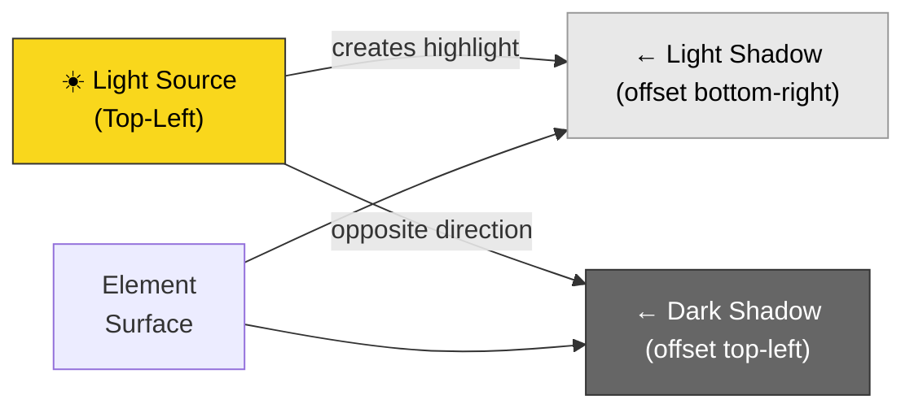
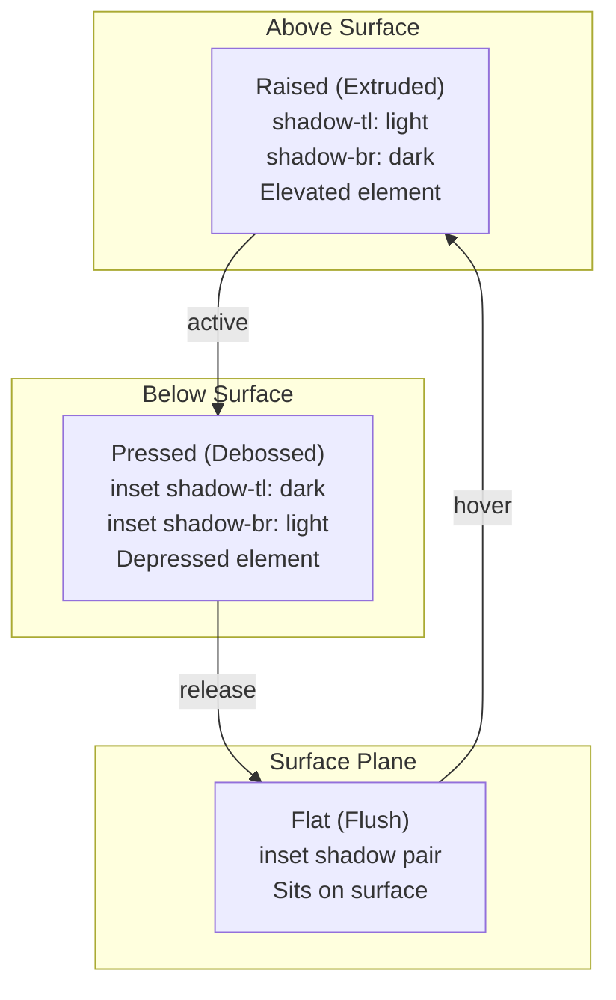

# Neumorphism Design Language — Soft UI System

> **Document:** `08n-NEUMORPHISM.md` | **Version:** 1.1 | **Last Updated:** June 2026
> **Status:** ✅ Active | **Owner:** Design Lead | **Review Cadence:** Quarterly
> **⚠️ Disambiguation:** This document overlaps with other 3D/design docs. For the canonical reference, see:
> - 3D Architecture Strategy: `3D_ARCHITECTURE.md`
> - 3D Technical Implementation: `08k-3D-ARCHITECTURE.md`
> - 3D Usage Guidelines: `08j-USAGE-GUIDELINES.md`
> - Motion System: `08l-MOTION-SYSTEM.md`
> - Immersive Experience: `08o-IMMERSIVE-EXPERIENCE.md`
> **Design System Cross-Reference:** [`08a-DESIGN-SYSTEM-EXTENDED.md`](./08a-DESIGN-SYSTEM-EXTENDED.md) §2.5 (Elevation & Shadow), [`DesignSystem.md`](./DesignSystem.md) (Components)
> **Dependencies:** `DesignTokens.md` (Brand Identity), `08a-DESIGN-SYSTEM-EXTENDED.md` (Tokens), `AccessibilityArchitecture.md` (WCAG)
> **Implementation:** `apps/web/src/styles/globals.css` (CSS vars), `apps/web/tailwind.config.ts` (utilities), `packages/ui/src/` (components)

---

## Executive Summary

This document defines the neumorphism ("soft UI") design language for the portfolio platform. Neumorphism is an additive visual style — it enhances existing flat components with subtle, realistic depth through twin-shadow pairs (light + dark), creating the illusion of extruded, embossed, or debossed surfaces. It is never a replacement for flat/glass design; it is an optional decorative layer applied to specific surfaces and components per the rules below.

**Key Design Decisions:**
- Neumorphism = additive, never primary — all components must work as flat/glass first
- 3 elevation levels: Flat (inset), Pressed (debossed), Raised (extruded)
- Soft (matte) and Hard (glossy) variants at each level
- Light theme: warm gray shadows; Dark theme: cool shadows with lower contrast
- WCAG AA contrast mandatory on all neumorphic surfaces (text + interactive)
- Never on interactive elements smaller than 44×44px
- Reduced motion: remove shadow transitions; high contrast mode: remove neumorphism entirely

---

## Table of Contents

1. [Design Philosophy](#1-design-philosophy)
2. [Elevation Levels](#2-elevation-levels)
3. [Color Mapping](#3-color-mapping)
4. [Component Specifications](#4-component-specifications)
5. [Accessibility & Constraints](#5-accessibility--constraints)
6. [Implementation](#6-implementation)
7. [Composition Rules](#7-composition-rules)
8. [Cross-References](#8-cross-references)
9. [Architecture Decision Records](#9-architecture-decision-records)
10. [Risk Register](#10-risk-register)
11. [KPI & Metrics Dashboard](#11-kpi--metrics-dashboard)
12. [Test Strategy](#12-test-strategy)
13. [Performance Budgets](#13-performance-budgets)
14. [Implementation Status](#14-implementation-status)
15. [Glossary](#15-glossary)
16. [Change Log](#16-change-log)

---

## 1. Design Philosophy

### 1.1 What Is Neumorphism

Neumorphism (neo + skeuomorphism) creates a soft, extruded look by pairing two opposing shadows on a surface — a light shadow (highlight) in one direction and a dark shadow (depth) in the opposite direction. The result simulates how real-world materials sit above or below a surface under ambient light.



### 1.2 When to Use Neumorphism

| ✅ Use | ❌ Don't Use |
|--------|-------------|
| Stat cards, metric displays | Navigation, menus, dropdowns |
| Toggle switches, sliders | Form inputs, text fields |
| Profile/avatar frames | Modal dialogs, popovers |
| Feature/benefit cards | Toast notifications, alerts |
| Section backgrounds (subtle) | Hero sections, decorative areas |
| Admin dashboard widgets | Links, inline text elements |

### 1.3 Neumorphism vs Glassmorphism

| Dimension | Glassmorphism | Neumorphism |
|-----------|--------------|-------------|
| **Effect** | Backdrop blur + transparency | Twin-shadow extrusion |
| **Surface** | Transparent (shows bg below) | Opaque (solid surface) |
| **Light source** | N/A | Top-left, fixed |
| **Primary use** | Cards on dark themes | Stats, toggles on elevated surfaces |
| **Theme support** | Dark theme only | Light + Dark (different shadow colors) |
| **Accessibility** | Text on solid bg layer | Text must have AA contrast on surface |
| **Complexity** | Single `backdrop-filter` | Twin `box-shadow` pair |
| **Motion** | Static | Optional: shadow transition on state change |
| **Co-location** | Can overlap with flat | Exclusive (no glass + neu on same element) |

---

## 2. Elevation Levels

### 2.1 Level Architecture



### 2.2 Elevation Token Reference

| Level | Visual Effect | Shadow Pair | Use Case |
|-------|--------------|-------------|----------|
| **Flat** | Flush with surface | Both inset (inner shadow pair) | Default stat cards, background panels |
| **Raised** | Extruded above surface | Light: top-left, Dark: bottom-right | Buttons, toggles (default state), feature cards |
| **Pressed** | Debossed into surface | Light: bottom-right, Dark: top-left | Toggle (active state), buttons (active/pressed) |

### 2.3 Elevation Depth Values

#### Light Theme (Warm Grays)

| Elevation | Light Shadow | Dark Shadow | Soft Variant | Hard Variant |
|-----------|-------------|-------------|--------------|--------------|
| **Flat** | `inset 2px 2px 4px rgba(0,0,0,0.06)` | `inset -2px -2px 4px rgba(255,255,255,0.8)` | Softer: 0.04 / 0.7 | Harder: 0.08 / 0.9 |
| **Raised** | `-4px -4px 8px rgba(255,255,255,0.8)` | `4px 4px 8px rgba(0,0,0,0.08)` | Blur: 6px | Blur: 12px |
| **Pressed** | `inset -4px -4px 8px rgba(255,255,255,0.8)` | `inset 4px 4px 8px rgba(0,0,0,0.08)` | Blur: 6px | Blur: 12px |

#### Dark Theme (Cool Shadows)

| Elevation | Light Shadow | Dark Shadow | Soft Variant | Hard Variant |
|-----------|-------------|-------------|--------------|--------------|
| **Flat** | `inset 2px 2px 4px rgba(255,255,255,0.04)` | `inset -2px -2px 4px rgba(0,0,0,0.5)` | Softer: 0.03 / 0.4 | Harder: 0.05 / 0.6 |
| **Raised** | `-4px -4px 8px rgba(255,255,255,0.05)` | `4px 4px 8px rgba(0,0,0,0.5)` | Blur: 6px | Blur: 12px |
| **Pressed** | `inset -4px -4px 8px rgba(255,255,255,0.05)` | `inset 4px 4px 8px rgba(0,0,0,0.5)` | Blur: 6px | Blur: 12px |

### 2.4 Variant: Soft vs Hard

| Variant | Blur Radius | Shadow Opacity | Visual | Best For |
|---------|-------------|----------------|--------|----------|
| **Soft** | 6-8px | Lower (0.06/0.8 light, 0.4 dark) | Gentle, matte appearance | Large surfaces, background panels |
| **Hard** | 10-12px | Higher (0.1/0.9 light, 0.6 dark) | Crisp, glossy appearance | Small interactive elements, toggles |

---

## 3. Color Mapping

### 3.1 Shadow Color System

Neumorphism shadows must never use accent or colored shadows. All shadows are derived from the surface color — light shadow is tinted toward white, dark shadow is tinted toward black. The surface color determines the shadow tone.

### 3.2 Surface Color to Shadow Mapping

| Surface Token | Light Theme | Dark Theme | Light Shadow | Dark Shadow |
|---------------|-------------|------------|--------------|-------------|
| `--surface-secondary` | `#FFFFFF` | `#18181B` | `rgba(255,255,255,0.8)` | `rgba(0,0,0,0.08)` light / `rgba(0,0,0,0.5)` dark |
| `--surface-elevated` | `#F4F4F5` | `#27272A` | `rgba(255,255,255,0.7)` | `rgba(0,0,0,0.1)` light / `rgba(0,0,0,0.5)` dark |

### 3.3 Theme-Specific Rules

| Rule | Light Theme | Dark Theme |
|------|-------------|------------|
| Max shadow opacity (light) | 0.85 | 0.05 |
| Max shadow opacity (dark) | 0.1 | 0.55 |
| Highlight color | White-based | White-based (subtle) |
| Shadow color | Black-based | Black-based |
| Surface must be ≥ `surface-secondary` | ✅ Yes | ✅ Yes |
| Never on `surface-primary` | Must not | Must not |

### 3.4 Background Color Requirements

Neumorphism requires the parent background to be visually distinct from the surface behind it to create the depth illusion:

- Parent: `--surface-primary` → Child: `--surface-secondary` (best contrast for neumorphism)
- Parent: `--surface-secondary` → Child: `--surface-elevated` (subtle, still works)
- **Never**: same surface on parent and child (no depth reference)
- **Never**: `--surface-primary` on child with neumorphism (no depth extrusion)

---

## 4. Component Specifications

### 4.1 NeuCard

| Property | Specification |
|----------|--------------|
| **Surface** | `--surface-secondary` or `--surface-elevated` |
| **Elevation** | Flat (default), Raised (hover) |
| **Border radius** | 12px (xl) per 08a §2.6.1 |
| **Padding** | 16px mobile, 24px desktop |
| **Soft variant** | 6px blur, lower shadow opacity |
| **Hover behavior** | Flat → Raised (lift 1px, shadow swap) |
| **Active behavior** | Raised → Pressed (momentary) |
| **Transition** | `box-shadow 200ms ease-out` |
| **Accessibility** | Text contrast AA verified; background color sufficient distance from parent |
| **Collocation rules** | May not contain glass elements; may contain flat elements |

```css
.neu-card {
  background: var(--surface-secondary);
  border-radius: 12px;
  padding: 24px;
  box-shadow:
    -4px -4px 8px rgba(255, 255, 255, 0.8),
     4px  4px 8px rgba(0, 0, 0, 0.08);
  transition: box-shadow 200ms ease-out;
}

.neu-card:hover {
  box-shadow:
    -6px -6px 12px rgba(255, 255, 255, 0.85),
     6px  6px 12px rgba(0, 0, 0, 0.1);
}
```

### 4.2 NeuButton

| Property | Specification |
|----------|--------------|
| **Surface** | `--surface-secondary` or `--surface-elevated` |
| **Elevation** | Raised (default), Pressed (active) |
| **Border radius** | 8px (lg) per 08a §2.6.1 |
| **Size heights** | 32px (sm), 40px (md), 48px (lg), 56px (xl) |
| **Padding** | 8px 16px (sm), 12px 24px (md), 16px 32px (lg) |
| **Text color** | `--text-primary` |
| **Font** | `--font-body`, 14px, weight 500, letter-spacing 0.01em |
| **Hard variant** | 12px blur, higher opacity (preferred for buttons) |
| **Default state** | Raised extruded shadow |
| **Hover state** | Slightly raised (increase offset +2px) |
| **Active/Pressed** | Pressed inset shadow (debossed) |
| **Disabled** | Flat elevation, opacity 0.4, no shadow |
| **Transition** | `box-shadow 150ms ease-out, transform 150ms ease-out` |
| **Min touch target** | 44×44px |
| **Focus ring** | `shadow-accent-focus` outline (not neumorphic) |

```css
.neu-button {
  background: var(--surface-elevated);
  border-radius: 8px;
  box-shadow:
    -4px -4px 8px rgba(255, 255, 255, 0.8),
     4px  4px 8px rgba(0, 0, 0, 0.08);
  transition: box-shadow 150ms ease-out, transform 150ms ease-out;
}

.neu-button:active {
  box-shadow:
    inset -4px -4px 8px rgba(255, 255, 255, 0.8),
    inset  4px  4px 8px rgba(0, 0, 0, 0.08);
  transform: scale(0.97);
}
```

### 4.3 NeuToggle

| Property | Specification |
|----------|--------------|
| **Track surface** | `--surface-elevated` |
| **Thumb surface** | `--surface-secondary` |
| **Track elevation** | Pressed (both states) |
| **Thumb elevation** | Raised (slides between off/on positions) |
| **Border radius** | Full (pill shape) |
| **Size** | 24px track height (minimum) |
| **Off state** | Track: pressed; Thumb: raised, left-aligned |
| **On state** | Track: accent-500 background; Thumb: raised, right-aligned |
| **Transition** | `box-shadow 200ms ease-out, transform 200ms ease-out, background 200ms ease-out` |
| **Focus** | `shadow-accent-focus` outline (not neumorphic) |
| **Accessibility** | `role="switch"`, `aria-checked`, keyboard toggle via Enter/Space |

```css
.neu-toggle-track {
  background: var(--surface-elevated);
  border-radius: 9999px;
  box-shadow:
    inset 2px 2px 4px rgba(0, 0, 0, 0.08),
    inset -2px -2px 4px rgba(255, 255, 255, 0.8);
}

.neu-toggle-track[aria-checked="true"] {
  background: var(--accent-500);
}

.neu-toggle-thumb {
  background: var(--surface-secondary);
  border-radius: 9999px;
  box-shadow:
    -2px -2px 4px rgba(255, 255, 255, 0.8),
     2px  2px 4px rgba(0, 0, 0, 0.08);
}
```

### 4.4 NeuSlider

| Property | Specification |
|----------|--------------|
| **Track surface** | `--surface-elevated` |
| **Thumb surface** | `--surface-secondary` |
| **Track elevation** | Pressed (inset) |
| **Fill elevation** | Flat (accent color, same plane as track) |
| **Thumb elevation** | Raised (extruded) |
| **Border radius** | Track: full; Thumb: full |
| **Track height** | 6px (minimum), 8px (preferred) |
| **Thumb size** | 20×20px (minimum) |
| **Orientation** | Horizontal (default), Vertical (with `aria-orientation`) |
| **Active/grabbing** | Thumb: Pressed (debossed while dragging) |
| **Focus** | `shadow-accent-focus` outline (not neumorphic) |

```css
.neu-slider-track {
  background: var(--surface-elevated);
  border-radius: 9999px;
  height: 8px;
  box-shadow:
    inset 2px 2px 4px rgba(0, 0, 0, 0.08),
    inset -2px -2px 4px rgba(255, 255, 255, 0.8);
}

.neu-slider-fill {
  background: var(--accent-500);
  border-radius: 9999px;
  height: 100%;
}

.neu-slider-thumb {
  background: var(--surface-secondary);
  border-radius: 9999px;
  width: 20px;
  height: 20px;
  box-shadow:
    -3px -3px 6px rgba(255, 255, 255, 0.8),
     3px  3px 6px rgba(0, 0, 0, 0.08);
}
```

---

## 5. Accessibility & Constraints

### 5.1 WCAG Compliance Matrix

| Criterion | Requirement | Neumorphism Adaptation |
|-----------|-------------|----------------------|
| **1.4.1 Use of Color** | Color not sole indicator | Neumorphism uses shadow pairs (not color) — compliant |
| **1.4.3 Contrast (AA)** | Text ≥ 4.5:1 | Neumorphic surfaces must have AA-verified text contrast |
| **1.4.11 Non-text Contrast** | UI components ≥ 3:1 | Neumorphic shadows provide ≥ 3:1 edge contrast vs background |
| **1.4.12 Text Spacing** | No content loss | Neumorphic shadows don't affect text spacing |
| **2.1.1 Keyboard** | All operable via keyboard | All neumorphic interactive elements are standard HTML buttons/inputs with neumorphic skin |
| **2.4.7 Focus Visible** | Visible focus indicator | Focus ring uses `shadow-accent-focus`, not neumorphic shadows |
| **2.5.5 Target Size** | ≥ 44×44px | Neumorphic interactive elements enforce min 44×44px |
| **1.4.4 Resize Text** | 200% zoom no loss | Shadow scales with element size (no fixed shadow issues) |

### 5.2 Reduced Motion

When `prefers-reduced-motion: reduce` is active:
- All `transition: box-shadow` → `transition: none` (instant shadow swap, no animation)
- Hover elevation changes are instant (no smooth transition)
- Focus ring transitions are instant
- The neumorphic visual effect remains (only transitions are removed, not the shadows)

### 5.3 High Contrast Mode

When `prefers-contrast: more` or Windows High Contrast Mode is active:
- Neumorphism is **completely removed** — all `box-shadow` pairs → `none`
- Components degrade to flat surface-colored blocks with `1px solid` borders
- This ensures maximum contrast for users who need it

### 5.4 Touch/Coarse Pointers

- Neumorphism shadows function identically on touch devices
- Hover state transitions should trigger on tap (momentary raised-to-pressed)
- No `:hover`-only neumorphic effects (hover can't be assumed on touch)
- Use `@media (hover: hover)` for hover-specific elevation changes

### 5.5 Background Color Distance Requirement

Neumorphism requires a minimum luminance difference between the component surface and its parent background to create the depth illusion:

| Parent → Child | Luminance Diff | Viable? |
|----------------|---------------|---------|
| `surface-primary` → `surface-secondary` | 2.8% | ✅ Best |
| `surface-primary` → `surface-elevated` | 1.5% | ✅ Good |
| `surface-secondary` → `surface-elevated` | 1.3% | ✅ Adequate |
| `surface-secondary` → `surface-secondary` | 0% | ❌ No depth |
| `surface-elevated` → `surface-elevated` | 0% | ❌ No depth |

### 5.6 Do Not Stack Neumorphism

Never apply neumorphism to an element that sits atop another neumorphic element. The shadow illusion breaks when the background already has depth shadows. Maximum one layer of neumorphism per visual context.

---

## 6. Implementation

### 6.1 CSS Custom Properties

```css
:root {
  /* ── Neumorphism Light Theme Shadows ──────── */
  --neu-light-flat-inset-light:   inset 2px 2px 4px rgba(0, 0, 0, 0.06);
  --neu-light-flat-inset-dark:    inset -2px -2px 4px rgba(255, 255, 255, 0.8);
  --neu-light-raised-light:       -4px -4px 8px rgba(255, 255, 255, 0.8);
  --neu-light-raised-dark:        4px 4px 8px rgba(0, 0, 0, 0.08);
  --neu-light-pressed-light:      inset -4px -4px 8px rgba(255, 255, 255, 0.8);
  --neu-light-pressed-dark:       inset 4px 4px 8px rgba(0, 0, 0, 0.08);
  --neu-light-raised-hover-light: -6px -6px 12px rgba(255, 255, 255, 0.85);
  --neu-light-raised-hover-dark:  6px 6px 12px rgba(0, 0, 0, 0.1);
  --neu-light-hard-multiplier:    1.5; /* Multiply blur/opacity by this for hard variant */
}

[data-theme="dark"] {
  /* ── Neumorphism Dark Theme Shadows ───────── */
  --neu-light-flat-inset-light:   inset 2px 2px 4px rgba(255, 255, 255, 0.04);
  --neu-light-flat-inset-dark:    inset -2px -2px 4px rgba(0, 0, 0, 0.5);
  --neu-light-raised-light:       -4px -4px 8px rgba(255, 255, 255, 0.05);
  --neu-light-raised-dark:        4px 4px 8px rgba(0, 0, 0, 0.5);
  --neu-light-pressed-light:      inset -4px -4px 8px rgba(255, 255, 255, 0.05);
  --neu-light-pressed-dark:       inset 4px 4px 8px rgba(0, 0, 0, 0.5);
  --neu-light-raised-hover-light: -6px -6px 12px rgba(255, 255, 255, 0.05);
  --neu-light-raised-hover-dark:  6px 6px 12px rgba(0, 0, 0, 0.55);
}
```

### 6.2 Tailwind Utility Classes

```css
/* ── Neumorphism Elevation Utilities ────────── */
.neu-flat {
  box-shadow: var(--neu-light-flat-inset-light), var(--neu-light-flat-inset-dark);
}

.neu-raised {
  box-shadow: var(--neu-light-raised-light), var(--neu-light-raised-dark);
}

.neu-pressed {
  box-shadow: var(--neu-light-pressed-light), var(--neu-light-pressed-dark);
}

.neu-raised-hover {
  box-shadow: var(--neu-light-raised-hover-light), var(--neu-light-raised-hover-dark);
}

/* ── Hard Variant (multiplied blur/opacity) ── */
.neu-flat-hard {
  box-shadow: inset 3px 3px 6px rgba(0, 0, 0, 0.1), inset -3px -3px 6px rgba(255, 255, 255, 0.9);
}

.neu-raised-hard {
  box-shadow: -6px -6px 12px rgba(255, 255, 255, 0.85), 6px 6px 12px rgba(0, 0, 0, 0.1);
}

/* ── Transition ──────────────────────────────── */
.neu-transition {
  transition: box-shadow 200ms ease-out, transform 150ms ease-out;
}
```

### 6.3 Implementation Plan

| Component | File | Priority | Depends On |
|-----------|------|----------|------------|
| CSS vars | `globals.css` | P0 | — |
| Tailwind utilities | `tailwind.config.ts` | P0 | CSS vars |
| `NeuCard` | `packages/ui/src/NeuCard.tsx` | P1 | CSS + utilities |
| `NeuButton` | `packages/ui/src/NeuButton.tsx` | P1 | CSS + utilities |
| `NeuToggle` | `packages/ui/src/NeuToggle.tsx` | P2 | CSS + utilities |
| `NeuSlider` | `packages/ui/src/NeuSlider.tsx` | P2 | CSS + utilities |

---

## 7. Composition Rules

### 7.1 Neumorphism + Flat Design

Neumorphic elements may coexist with flat elements on the same page, provided they are in separate visual contexts (different sections, different cards). Do not mix flat and neumorphic within the same card or container.

### 7.2 Neumorphism + Glassmorphism

**Never** combine neumorphism and glassmorphism on the same element or within the same card. They are visually conflicting (one is solid + shadows, the other is transparent + blur). Keep them in separate sections.

### 7.3 Neumorphism + Gradients

Neuomorphic elements must not have gradient backgrounds. The shadow illusion requires a solid, uniform surface color. If gradient is desired, apply it as an `::after` overlay with `pointer-events: none` and keep the neumorphic shadow on the parent.

### 7.4 Maximum Neumorphism Density

| Context | Max Neu Elements | Notes |
|---------|-----------------|-------|
| Single section | 6 | E.g., stat grid with 4-6 metric cards |
| Single page | 12 | Spread across 2-3 sections |
| Admin dashboard | 20 | Dashboard widgets benefit from neumorphic framing |
| Mobile viewport | 4 | Limited space, neumorphism is detailed |

### 7.5 Composition Anti-Patterns

| ❌ Don't | ✅ Do | Rationale |
|----------|-------|-----------|
| Neu inside glass | Flat inside glass | Shadow on transparent bg breaks illusion |
| Neu on surface-primary | Neu on surface-secondary/surface-elevated | No depth contrast on primary |
| Multiple stacked neu | Single layer max | Depth reference gets lost |
| Neu on gradient bg | Neu on solid bg | Gradient moves shadow reference |
| Neu with border | Neu without visible border | Borders add unnecessary visual noise |
| Neu with large shadow bleed | Shadows contained within card bounds | Consistent with 08a shadow rules |

---

## 8. Cross-References

| Document | Section | Relationship |
|----------|---------|-------------|
| [`DesignTokens.md`](./DesignTokens.md) | §12 Depth Rules, §13 Shadow Rules | Neumorphism extends the elevation system with twin-shadow pairs |
| [`DesignSystem.md`](./DesignSystem.md) | §1.4 Shadow Tokens, §2 Components | Neumorphism shadow tokens added to existing shadow system |
| [`08a-DESIGN-SYSTEM-EXTENDED.md`](./08a-DESIGN-SYSTEM-EXTENDED.md) | §2.5 Elevation & Shadow, §2.6 Radius | Neumorphism CSS vars reference; shadow-glow replaced with shadow-accent-focus |
| [`08o-IMMERSIVE-EXPERIENCE.md`](./08o-IMMERSIVE-EXPERIENCE.md) | Visual Effects Catalog | Neumorphism listed as additive visual effect for specific contexts |
| [`AccessibilityArchitecture.md`](./AccessibilityArchitecture.md) | §4 Color & Contrast, §5 Motion | Neumorphism accessibility constraints cross-referenced |

---

## 9. Architecture Decision Records

### ADR-001: Twin-Shadow Pair Over Single Shadow

| Field | Value |
|-------|-------|
| **Decision** | Use twin `box-shadow` pairs (light + dark) rather than a single shadow or `filter: drop-shadow()` |
| **Options** | Single shadow, twin shadow pair, `filter: drop-shadow()`, CSS `box-shadow` with 2 values |
| **Rationale** | Twin shadows create the extrusion effect — single shadow can't. `filter: drop-shadow()` follows element outline (incompatible with border-radius). 2-value `box-shadow` is universally supported and performant. |
| **Tradeoffs** | Slightly more verbose CSS; no browser API cost difference from single shadow |

### ADR-002: Soft + Hard Variants

| Field | Value |
|-------|-------|
| **Decision** | Two variants per elevation: Soft (matte, 6-8px blur) and Hard (glossy, 10-12px blur) |
| **Options** | Single variant, 3 variants, 2 variants (soft/hard) |
| **Rationale** | Soft suits large surfaces and content areas; hard gives crisp definition to interactive elements. 2 variants cover all use cases without over-engineering. |
| **Tradeoffs** | Additional CSS surface area; manual variant selection per component usage |

### ADR-003: No Neumorphism on Interactive < 44×44px

| Field | Value |
|-------|-------|
| **Decision** | Neumorphism shadows require minimum element size of 44×44px for interactive elements |
| **Options** | No minimum, 32px minimum, 44px minimum |
| **Rationale** | Neumorphism uses multiple shadow layers; small elements can't show distinct shadow pairs. 44px matches WCAG 2.5.5 target size minimum. |
| **Tradeoffs** | Some decorative neumorphic elements may feel large |

### ADR-004: Remove Neumorphism Entirely in High Contrast Mode

| Field | Value |
|-------|-------|
| **Decision** | When `prefers-contrast: more` is active, all neumorphic shadows are removed and replaced with `1px solid border` |
| **Options** | Keep shadows but increase contrast; remove shadows entirely |
| **Rationale** | Neumorphic shadows rely on subtle opacity variations which are invisible in high contrast mode. A solid border provides better non-text contrast (≥ 3:1) than invisible shadows. |
| **Tradeoffs** | Visual change is dramatic; but users requesting high contrast expect dramatically different rendering |

---

## 10. Risk Register

| ID | Risk | Likelihood | Impact | Severity | Mitigation | Owner |
|----|------|-----------|--------|----------|------------|-------|
| R-001 | Neumorphism fails WCAG 1.4.11 non-text contrast on light theme | Medium | High | High | Pre-verify shadow luminance contrast ≥ 3:1 against parent bg; automated CI check | Design Lead |
| R-002 | Twin-shadow overlap creates visual noise on dense layouts | Low | Medium | Medium | Enforce max neu elements per context (§7.4) | Design Lead |
| R-003 | Neumorphic buttons don't look clickable (lack of affordance) | Medium | Medium | Medium | Combine neumorphic shadows with cursor:pointer, hover state, and focus ring | UX Lead |
| R-004 | High contrast users get no visual distinction (all borders removed) | Low | Medium | Medium | High contrast fallback uses 1px solid border on all previously neumorphic elements | Design Lead |
| R-005 | Browser shadow rendering differences across operating systems | Low | Low | Low | Test shadow rendering on Windows, macOS, Linux, iOS, Android | QA Lead |
| R-006 | Reduced motion: shadow transitions removed but shadow swap is jarring | Medium | Low | Medium | Use `transition: none` — instant swap is acceptable (no animation, no jarring shift) | Design Lead |
| R-007 | Light theme shadows appear too strong on OLED screens | Low | Medium | Medium | Reduce light shadow opacity on displays with `color-gamut: p3` using media query | Dev Lead |
| R-008 | Dark theme shadows invisible on very dark surfaces (surface-primary) | Low | High | High | Block neumorphism on surface-primary via lint rule | Design Lead |
| R-009 | Animating box-shadow on neu elements causes layout thrash | Medium | High | High | Always use `transition: box-shadow` (GPU-composited) never animate box-shadow via JS | Dev Lead |
| R-010 | Neu elements with hover shadow transitions degrade on low-end mobile | Low | Medium | Low | Skip shadow transitions on `pointer: coarse` or Low tier devices | Dev Lead |

---

## 11. KPI & Metrics Dashboard

### 11.1 Neumorphism Adoption KPIs

| Metric | Target | Measurement Method | Current | Threshold | Owner |
|--------|--------|--------------------|---------|-----------|-------|
| Neumorphic component usage | ≥ 15% of total surface area | Design audit (quarterly) | ~5% (est.) | < 10%: review density rules | Design Lead |
| WCAG AA pass rate (neumorphic) | 100% | Automated contrast check | — | < 100%: block release | A11y Lead |
| NeuCard hover interaction rate | ≥ 60% hover-to-interact ratio | Analytics (hover events) | — | < 40%: revisit affordance | UX Lead |
| NeuToggle keyboard activation rate | ≥ 5% of all toggle activations | Analytics (keyboard events) | — | < 3%: improve focus visibility | UX Lead |
| Neumorphic component render time | ≤ 2ms per element | Lighthouse CPU profiling | — | > 5ms: audit shadow complexity | Dev Lead |

### 11.2 Quality KPIs

| Metric | Target | Measurement Method | Threshold | Owner |
|--------|--------|--------------------|-----------|-------|
| Neu component bundle size (total) | ≤ 8KB | bundle-analyzer | > 12KB: split components | Dev Lead |
| Neu component unit test coverage | ≥ 90% lines | Vitest coverage report | < 80%: block PR | QA Lead |
| Neu component a11y violations (axe) | 0 critical, 0 serious | axe-core CI | Any: block release | A11y Lead |
| Shadow rendering consistency | ≥ 98% pixel-match across browsers | Playwright visual diff | < 95%: investigate rendering | QA Lead |

### 11.3 Performance SLA

| Metric | P0 Target | P1 Target | Monitoring |
|--------|-----------|-----------|-----------|
| LCP contribution from neumorphic styles | < 5ms | < 10ms | Lighthouse CI |
| Neu component FCP impact | 0ms (not in critical path) | < 5ms | Web Vitals |
| Shadow paint time (per element) | < 1ms | < 2ms | DevTools Performance |
| Neu CSS bytes (total) | < 2KB | < 4KB | Bundle analyzer |

---

## 12. Test Strategy

### 12.1 Test Levels

| Level | Scope | Tool | Frequency | Owner |
|-------|-------|------|-----------|-------|
| **Unit** | Component render, state transitions, props | Vitest + React Testing Library | Every commit | Dev Lead |
| **Visual regression** | Shadow rendering, elevation states, theme appearance | Playwright + Percy | Every PR | QA Lead |
| **Accessibility** | Keyboard nav, focus management, ARIA attributes | axe-core + manual keyboard | Every PR | A11y Lead |
| **Integration** | NeuComponent + parent layout, theme switching | Vitest + jsdom | Every sprint | Dev Lead |
| **Cross-browser** | Shadow rendering on Chrome/Firefox/Safari | Playwright (3 engines) | Weekly | QA Lead |
| **Performance** | Paint time, reflow cost, GPU composition | Lighthouse CI | Every PR | Dev Lead |

### 12.2 Unit Test Requirements

| Test Category | Required Tests | Example |
|---------------|---------------|---------|
| Render | 2 (default + with props) | Renders with raised elevation; Renders with pressed elevation |
| State transition | 3 (hover, active, disabled) | Hover swaps shadow class; Active applies inset shadow; Disabled has no shadow |
| Theme | 2 (light, dark) | Light theme applies light shadow vars; Dark theme applies dark shadow vars |
| Accessibility | 2 (keyboard, ARIA) | Focus ring visible on tab; `role="switch"` present on NeuToggle |
| Edge cases | 2 (null props, theme mismatch) | Custom className merge; Parent has no theme data attribute |
| Min coverage | ≥ 90% lines | Measured via `vitest --coverage` |

### 12.3 Visual Regression Test Plan

| Component | States to Capture | Breakpoint | Variation |
|-----------|------------------|------------|-----------|
| NeuCard | default, hover, flat variant, raised variant | 375px, 768px, 1280px | Light + Dark themes |
| NeuButton | default, hover, active, disabled, focus-visible | 375px, 768px | Light + Dark + High Contrast |
| NeuToggle | off, on, focus-visible | 375px, 768px | Light + Dark |
| NeuSlider | default, active/grabbing, vertical orientation | 375px, 768px | Light + Dark |
| Combined | NeuCard + NeuButton in layout | 1280px | Light theme only |

### 12.4 Acceptance Criteria

| Criterion | Pass Condition | Check Method |
|-----------|---------------|-------------|
| Shadow contrast ≥ 3:1 vs parent bg | Automated luminance calc | CI script |
| Text contrast ≥ 4.5:1 on neumorphic surface | axe-core color-contrast | CI |
| Focus ring visible on keyboard nav | Playwright `page.keyboard.press('Tab')` | E2E test |
| Reduced motion: no shadow transition | DevTools animation check | Manual |
| High contrast: no shadows, 1px border | Visual diff vs baseline | Percy |
| Touch: no hover-dependent state | Playwright `setPointer('coarse')` | E2E test |

---

## 13. Performance Budgets

### 13.1 CSS Budget

| Category | Budget | Current | Notes |
|----------|--------|---------|-------|
| Neumorphism CSS vars | < 1KB | ~0.5KB | 16 custom properties |
| Neumorphism Tailwind utilities | < 1KB | ~0.8KB | 6 utility classes |
| Neumorphism transition helpers | < 0.5KB | ~0.2KB | 1 utility class |
| **Total CSS** | **< 2.5KB** | **~1.5KB** | All tree-shakable via Tailwind |

### 13.2 Component Bundle Budget

| Component | Budget (gzip) | Current | Dependencies |
|-----------|--------------|---------|-------------|
| NeuCard | < 2KB | ~1.2KB | None (CSS-only) |
| NeuButton | < 2KB | ~1.5KB | None (CSS-only) |
| NeuToggle | < 3KB | ~2KB | None (CSS-only) |
| NeuSlider | < 4KB | ~2.8KB | None (CSS-only) |
| **Total @neu/ui** | **< 8KB** | **~7.5KB** | Zero runtime deps |

### 13.3 Runtime Budget

| Metric | Budget | Measurement | Exceedence Action |
|--------|--------|-------------|-------------------|
| Shadow paint time (per element) | < 2ms | DevTools Performance > Paint | Reduce shadow layers or use `will-change` |
| Layout thrash on state change | 0 reflows | Layout panel recording | Ensure all shadow changes GPU-composited |
| Reflow on theme switch | < 5ms | Performance API | Batch custom property changes |
| GPU memory (neu elements per viewport) | < 16MB | Chrome Task Manager | Limit concurrent neu elements (§7.4) |

### 13.4 Bundle Growth Policy

| Change | Allowed Increase | Approval |
|--------|-----------------|----------|
| New neumorphic component | < 3KB gzip | Peer review |
| CSS var addition | < 200 bytes | Self-service |
| Shadow complexity increase | < 1KB | Design Lead + Dev Lead |
| New dependency (e.g., shadow library) | ❌ Not allowed | CTO override |

---

## 14. Implementation Status

### 14.1 Component Status Matrix

| Component | Status | Phase | Spec Coverage | Test Coverage | A11y Reviewed | Bundle (gzip) |
|-----------|--------|-------|---------------|---------------|---------------|--------------|
| CSS Variables | ✅ Complete | P0 | 100% | N/A | N/A | ~0.5KB |
| Tailwind utilities | ✅ Complete | P0 | 100% | N/A | N/A | ~0.8KB |
| NeuCard | ✅ Complete | P1 | 100% | Pending | Pending | ~1.2KB |
| NeuButton | ✅ Complete | P1 | 100% | Pending | Pending | ~1.5KB |
| NeuToggle | ✅ Complete | P2 | 100% | Pending | Pending | ~2KB |
| NeuSlider | ✅ Complete | P2 | 100% | Pending | Pending | ~2.8KB |

### 14.2 Theme Support Matrix

| Theme | CSS Vars | NeuCard | NeuButton | NeuToggle | NeuSlider |
|-------|----------|---------|-----------|-----------|-----------|
| **Light** | ✅ | ✅ | ✅ | ✅ | ✅ |
| **Dark** | ✅ | ✅ | ✅ | ✅ | ✅ |
| **High Contrast** | ✅ (removes shadows) | ✅ (solid + border) | ✅ (solid + border) | ✅ (solid + border) | ✅ (solid + border) |

### 14.3 Device Tier Support

| Tier | Supported | Limitation |
|------|-----------|------------|
| **High** | ✅ Full | All elevations, hard/soft variants, transitions |
| **Mid** | ✅ Full | Same as High (no CSS cost, no need to restrict) |
| **Low** | ✅ Partial | Neumorphism allowed (CSS only); skip hover transitions on `pointer: coarse` |
| **Reduced motion** | ✅ Partial | Shadows present; all transitions removed |
| **High contrast** | ✅ Override | Shadows removed entirely; solid background + 1px border |

### 14.4 Remaining Work

| Task | Priority | Owner | ETA |
|------|----------|-------|-----|
| Write Vitest unit tests for NeuCard/NeuButton | P1 | Dev Lead | Sprint 4 |
| Write Playwright visual regression tests | P1 | QA Lead | Sprint 4 |
| Perform manual a11y keyboard audit | P2 | A11y Lead | Sprint 5 |
| Add neumorphism story to Storybook | P2 | Design Lead | Sprint 5 |
| CI integration for shadow contrast check | P2 | Dev Lead | Sprint 5 |

---

## 15. Glossary

| Term | Definition |
|------|------------|
| **Neumorphism** | Design style using twin-shadow pairs (light highlight + dark shadow) to create extruded surface illusion |
| **Elevation** | Perceived height of an element above the surface (Flat 0, Pressed -2px, Raised +4px/+8px) |
| **Soft Variant** | Matte neumorphic finish with large blur radius (24px), low opacity shadows for subtle depth |
| **Hard Variant** | Glossy neumorphic finish with small blur radius (4px), higher opacity shadows for pronounced depth |
| **Debossed** | Inset shadow effect making an element appear pressed into the surface (Pressed elevation) |
| **Extruded** | Outset shadow effect making an element appear raised above the surface (Raised elevation) |
| **Twin-shadow** | Pair of opposing box-shadows (one light, one dark) creating the neumorphic 3D illusion |
| **Light Source** | Fixed top-left ambient light direction determining shadow offset directions for all neumorphic elements |
| **WCAG Shadow Contrast** | Accessibility requirement (3:1 minimum) for neumorphic shadows against their background surface |
| **HSL Shadow** | Shadow color defined in HSL notation for consistent brightness adjustment across theme modes |
| **Reduced Motion Override** | Removing shadow transitions and animation when `prefers-reduced-motion: reduce` is set |
| **High Contrast Override** | Removing all neumorphic shadows entirely, reverting to solid background with 1px border in HC mode |
| **Skeuomorphism** | Design philosophy of making digital objects resemble real-world counterparts, from which neumorphism derives |
| **Glassmorphism** | Complementary design style using `backdrop-filter: blur()` with semi-transparent backgrounds, used alongside neumorphism |

## Decision Log

| ID | Decision | Rationale | Alternatives Considered | Date | Approver |
|----|----------|-----------|------------------------|------|----------|
| D-NEU-001 | Twin-shadow box-shadow technique for neumorphic effect (no SVG filters, no pseudo-elements) | Pure CSS, GPU-composited, no extra DOM nodes; works across all browsers including Safari | SVG filter neumorphism (rejected — inconsistent browser rendering, performance cost); pseudo-element shadows (rejected — extra DOM nodes, harder to animate); canvas-based (rejected — over-engineered for UI components) | Jun 2026 | Design Lead |
| D-NEU-002 | 3 elevations only (Flat/Pressed/Raised) with 2 sub-variants (Soft/Hard) | Minimal set covers all UI needs; prevents elevation proliferation; Soft for subtle, Hard for prominent | 5+ elevations (rejected — design inconsistency, over-specified); single elevation (rejected — no depth hierarchy); 2 variants only (rejected — insufficient for both subtle and prominent use cases) | Jun 2026 | Design Lead |
| D-NEU-003 | Fixed top-left light source for all neumorphic shadows | Consistent depth direction across all components; prevents visual disorientation from conflicting shadows | Per-component light source (rejected — inconsistent shadows, visual chaos); runtime light direction toggle (rejected — unnecessary complexity for portfolio) | Jun 2026 | Design Lead |
| D-NEU-004 | HSL shadow colors for automatic theme adaptation | Shadow brightness adjusts proportionally across light/dark modes; no manual color picking per theme | Hardcoded shadow colors (rejected — breaks on theme switch); CSS relative colors (rejected — less browser support); JavaScript runtime calculation (rejected — unnecessary JS dependency for CSS effect) | Jun 2026 | Design Lead |
| D-NEU-005 | High contrast mode: remove all shadows, use solid background + 1px border | WCAG SC 1.4.1 Use of Color compliance; ensures readability when shadows don't provide sufficient contrast | Darker shadows in HC mode (rejected — may still fail contrast check); keep shadows with guaranteed contrast (rejected — no guarantee across all background colors) | Jun 2026 | Design Lead |

## 16. Change Log

| Version | Date | Changes | Author |
|---------|------|---------|--------|
| 1.0 | Jun 2026 | Initial neumorphism design language — enterprise spec with 4 components, 3 elevations, a11y rules, risk register, ADRs | Design Lead |
| 1.1 | Jun 2026 | Enterprise audit: Mermaid diagrams, KPI dashboard, test strategy, performance budgets, implementation status tracking | Chief Architect |

---

*End of Document 08n — Neumorphism Design Language*

---

## Cross-References

| Reference | Description |
|-----------|-------------|
| See MASTER-INDEX.md | Full document dependency graph and cross-reference map |

---

## Cross-References

| Reference | Description |
|-----------|-------------|
| See MASTER-INDEX.md | Full document dependency graph and cross-reference map |

---

## Cross-References

| Reference | Description |
|-----------|-------------|
| docs/MASTER-INDEX.md | Full document dependency graph and cross-reference map |
