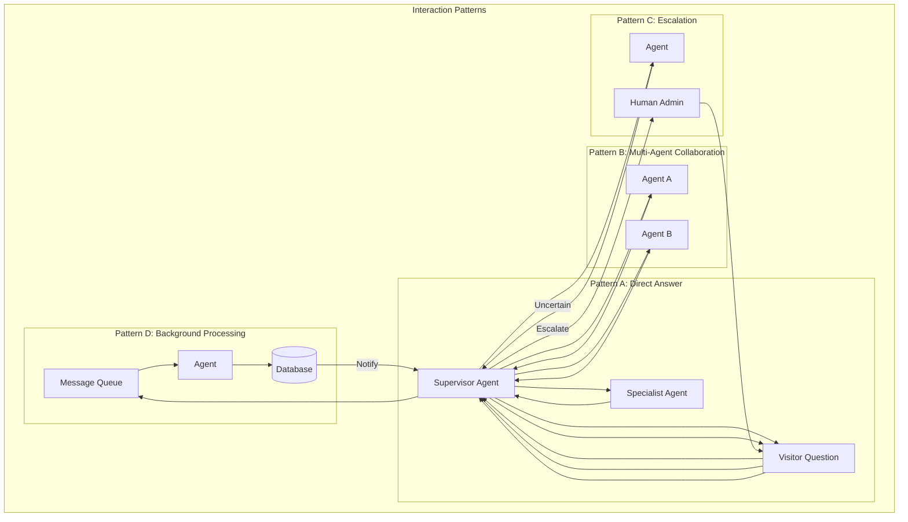
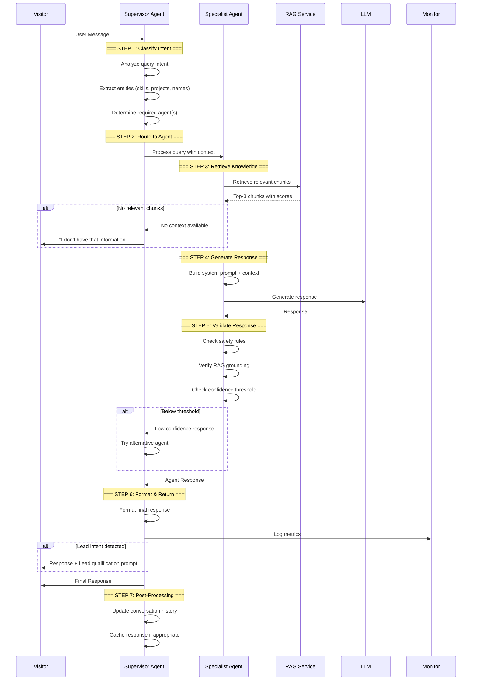
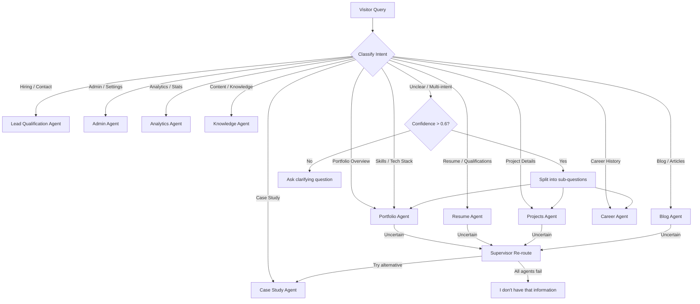
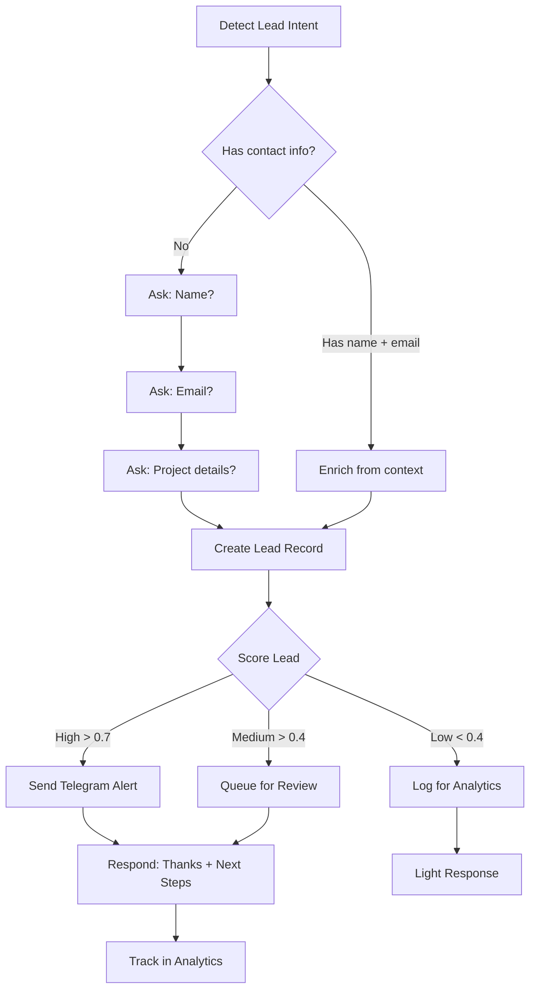
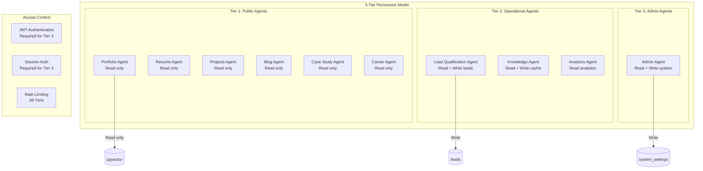
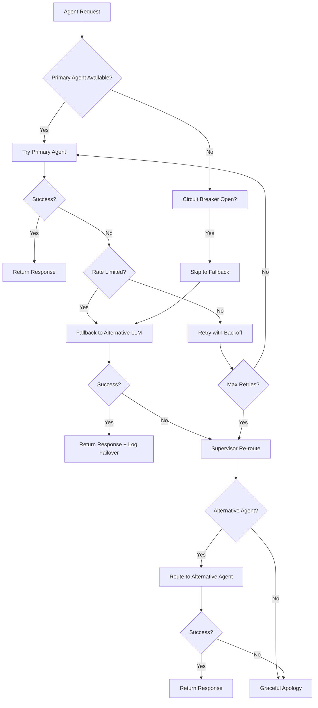
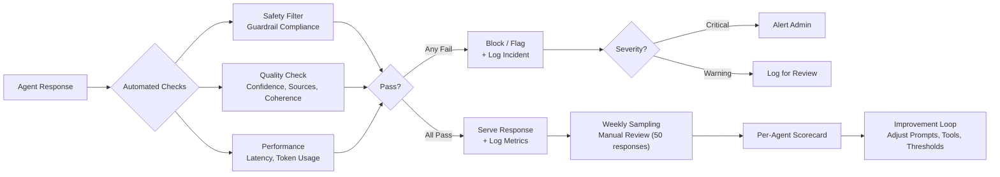
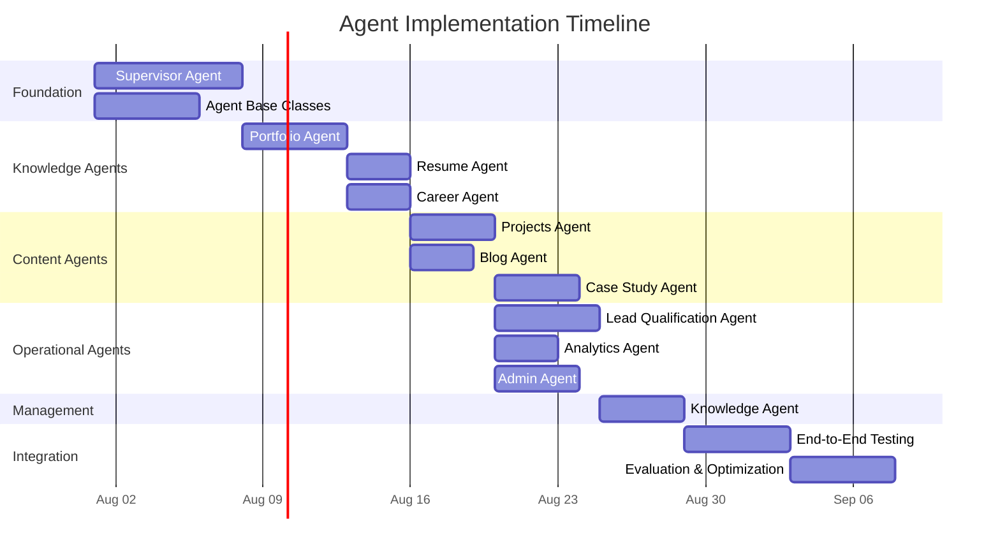

> **Status:** 📐 Design Spec — forward-looking design, not yet implemented

# Multi-Agent Architecture — Enterprise-Grade Agent Orchestration

> **Document:** `18-AGENTS.md` | **Version:** 4.0 | **Last Updated:** June 2026  
> **Status:** ✅ Active | **Owner:** Chief AI Architect | **Review Cadence:** Monthly  
> **Classification:** Enterprise Architecture | **Agent Runtime:** FastAPI + LangChain  
> **Orchestration Pattern:** Supervisor + Specialist Agents | **Communication:** In-process + Message Queue  
> **AI Operating Model:** [docs/ai/17-AI_INSTRUCTIONS.md](17-AI_INSTRUCTIONS.md) v4.0  
> **RAG Pipeline:** [docs/ai/19-RAG.md](19-RAG.md) v4.0

---

## Table of Contents

1. [Executive Summary](#1-executive-summary)
2. [Agent Architecture Vision](#2-agent-architecture-vision)
3. [Agent Design Principles](#3-agent-design-principles)
4. [Orchestration Architecture](#4-orchestration-architecture)
5. [Supervisor Agent](#5-supervisor-agent)
6. [Portfolio Agent](#6-portfolio-agent)
7. [Resume Agent](#7-resume-agent)
8. [Projects Agent](#8-projects-agent)
9. [Blog Agent](#9-blog-agent)
10. [Case Study Agent](#10-case-study-agent)
11. [Career Agent](#11-career-agent)
12. [Lead Qualification Agent](#12-lead-qualification-agent)
13. [Analytics Agent](#13-analytics-agent)
14. [Admin Agent](#14-admin-agent)
15. [Knowledge Agent](#15-knowledge-agent)
16. [Agent Communication Protocol](#16-agent-communication-protocol)
17. [Agent Memory Architecture](#17-agent-memory-architecture)
18. [Agent Security & Permissions](#18-agent-security--permissions)
19. [Agent Failure Recovery](#19-agent-failure-recovery)
20. [Agent Evaluation Framework](#20-agent-evaluation-framework)
21. [Implementation Roadmap](#21-implementation-roadmap)
22. [Change Log](#22-change-log)

---

## 1. Executive Summary

### 1.1 North Star

The multi-agent architecture transforms the portfolio platform from a single-purpose AI chatbot into an **intelligent agent ecosystem** — a coordinated team of specialized AI agents that work together to answer questions, qualify leads, analyze content, manage knowledge, and provide insights. Each agent is a domain expert, trained on specific knowledge sources and equipped with specialized tools, all orchestrated by a **Supervisor Agent** that routes requests, manages context, and coordinates responses.

### 1.2 Agent Ecosystem Overview

```text
Visitor Question → Supervisor Agent → Domain-Specific Agent → RAG Pipeline → LLM → Response
```

| Agent                        | Domain                       | Primary Knowledge Source            | Complexity      |
| ---------------------------- | ---------------------------- | ----------------------------------- | --------------- |
| **Supervisor**               | Orchestration & routing      | All agents' capability manifests    | 🧠 Strategic    |
| **Portfolio Agent**          | General portfolio Q&A        | Projects, Skills, Experience, About | 📊 High         |
| **Resume Agent**             | Resume & qualifications      | Structured resume data              | 📋 Medium       |
| **Projects Agent**           | Project deep-dives           | Projects + Case Studies             | 📊 High         |
| **Blog Agent**               | Blog content & articles      | Blog Posts                          | 📋 Medium       |
| **Case Study Agent**         | In-depth case analysis       | Case Studies                        | 🧠 High         |
| **Career Agent**             | Career trajectory & history  | Experiences, Achievements           | 📋 Medium       |
| **Lead Qualification Agent** | Lead capture & qualification | Lead data, visitor context          | 🧠 Strategic    |
| **Analytics Agent**          | Analytics & insights         | Analytics events, metrics           | 📊 High         |
| **Admin Agent**              | Admin operations & CMS       | System settings, content state      | 🔧 Utility      |
| **Knowledge Agent**          | Knowledge base management    | All document chunks                 | 📚 Foundational |

### 1.3 Key Metrics

| Metric                        | Target    | Measurement                        |
| ----------------------------- | --------- | ---------------------------------- |
| Agent classification accuracy | > 95%     | Manual sampling (100 queries/week) |
| Supervisor routing accuracy   | > 98%     | Agent assignment audit             |
| End-to-end response time      | < 3s      | Custom logging                     |
| Agent handoff latency         | < 100ms   | Custom logging                     |
| Lead qualification accuracy   | > 85%     | Admin follow-up review             |
| Agent uptime                  | 99.5%     | Health check monitoring            |
| Unhandled query rate          | < 5%      | Log analysis                       |
| User satisfaction (post-chat) | > 4.0 / 5 | Feedback widget                    |

### 1.4 Alignment with AI Operating Model

This document is a **specialized extension** of the AI Operating Model defined in `docs/ai/17-AI_INSTRUCTIONS.md` v4.0. The multi-agent architecture directly implements the following sections:

| AI Instructions Section                           | Agents Implementation                                           |
| ------------------------------------------------- | --------------------------------------------------------------- |
| §6 Architecture (AI Architecture)                 | §4 Orchestration Architecture — supervisor + specialist pattern |
| §7 Safety Rules (SAFE-001 through SAFE-010)       | §18 Agent Security & Permissions — per-agent guardrails         |
| §8 Response Rules                                 | Per-agent response templates and formatting standards           |
| §9 Memory Rules (MEM-001 through MEM-008)         | §17 Agent Memory Architecture — session, persistent, knowledge  |
| §10 Context Rules (CTX-001 through CTX-008)       | §5 Supervisor — context assembly and distribution               |
| §11 Knowledge Sources (KNOW-001 through KNOW-006) | §15 Knowledge Agent — knowledge base management                 |
| §12 Escalation Rules                              | §19 Agent Failure Recovery — fallback chain                     |
| §14 Security Rules                                | §18 Agent Security & Permissions — 3-tier permission model      |
| §15 Hallucination Prevention                      | Per-agent RAG grounding and confidence thresholds               |
| §17 Evaluation Framework                          | §20 Agent Evaluation Framework — per-agent metrics              |
| §19 Monitoring                                    | §20 — per-agent health checks and alerting                      |
| §20 Failure Recovery                              | §19 — circuit breakers, retry, fallback                         |

---

## 2. Agent Architecture Vision

### 2.1 Core Philosophy

```
Every agent is:
- A domain expert (specialized knowledge)
- A tool user (has specific capabilities)
- A safety boundary (obeys guardrails)
- A team player (hands off to other agents)
- A learner (improves from feedback)
```

### 2.2 Design Principles

| #   | Principle                    | Description                                                                  | Violation Penalty                  |
| --- | ---------------------------- | ---------------------------------------------------------------------------- | ---------------------------------- |
| P1  | **Single responsibility**    | Each agent owns exactly one domain                                           | Confused responses, routing errors |
| P2  | **Supervisor-first routing** | All requests go through Supervisor; no direct agent-to-visitor communication | Orphaned context, security gaps    |
| P3  | **Explicit handoffs**        | Agent transfers must include full context + reason                           | Context loss, repetitive questions |
| P4  | **Graceful refusal**         | Better to say "I can't help with that" than to guess                         | Hallucination risk                 |
| P5  | **Observable by default**    | Every agent action logged: routing, response, handoff, failure               | Debugging impossible               |
| P6  | **RAG-grounded responses**   | All knowledge agents use RAG pipeline; no external knowledge                 | Hallucination risk                 |
| P7  | **Progressive fallback**     | Agent → Supervisor → Human                                                   | Unhandled queries                  |
| P8  | **Cost-aware routing**       | Simple queries use cheaper models; complex queries use full reasoning        | Budget overruns                    |
| P9  | **Permission boundaries**    | Agents can only access their authorized tools and data sources               | Security incidents                 |
| P10 | **Fail closed**              | On uncertainty, agent defers to Supervisor (never guesses)                   | Incorrect responses                |

### 2.3 Agent Interaction Patterns



---

## 3. Agent Design Principles

### 3.1 Agent Anatomy

Every agent in the ecosystem follows a standardized structure:

```python
class BaseAgent:
    """Base class for all portfolio agents."""

    def __init__(self):
        self.name: str                    # Agent identifier
        self.version: str                 # Agent version
        self.capabilities: list[str]      # What this agent can do
        self.knowledge_sources: list[str] # RAG document sources
        self.tools: list[Tool]            # Available tools
        self.guardrails: list[str]        # Behavioral constraints
        self.permissions: list[str]       # Authorized operations
        self.memory: AgentMemory          # Memory configuration
        self.evaluation_metrics: dict     # Success criteria

    async def can_handle(self, query: str) -> tuple[bool, float]:
        """Determine if this agent can handle a query. Returns (can_handle, confidence)."""
        pass

    async def process(self, query: str, context: AgentContext) -> AgentResponse:
        """Process a query and return a response."""
        pass

    async def handoff(self, target_agent: str, context: AgentContext) -> AgentResponse:
        """Hand off processing to another agent with full context."""
        pass
```

### 3.2 Agent Capability Manifest

Each agent exposes a **capability manifest** that the Supervisor uses for routing:

```json
{
  "agent_name": "portfolio_agent",
  "version": "1.0.0",
  "description": "Answers general questions about the portfolio owner",
  "capabilities": [
    "answer_portfolio_overview",
    "explain_skill_proficiency",
    "describe_tech_stack",
    "summarize_experience",
    "provide_availability_info"
  ],
  "knowledge_sources": ["projects", "skills", "about", "experience"],
  "input_constraints": {
    "max_query_length": 2000,
    "required_context": ["visitor_type"]
  },
  "output_formats": ["text", "structured_data"],
  "confidence_threshold": 0.7,
  "fallback_agent": "supervisor"
}
```

### 3.3 Tool Definition

```python
@dataclass
class AgentTool:
    """Definition of a tool available to an agent."""
    name: str                    # Tool identifier
    description: str             # What the tool does
    parameters: dict             # JSON Schema for parameters
    permission_level: str        # read | write | admin
    rate_limit: int              # Max calls per minute
    timeout_ms: int              # Max execution time
    cost_per_call: float         # Estimated cost in cents
```

---

## 4. Orchestration Architecture

### 4.1 High-Level Architecture

```mermaid
graph TB
    subgraph "Visitor Layer"
        V["🌐 Website Visitor"]
        CW["💬 Chat Widget<br/>SSE Streaming"]
    end

    subgraph "API Gateway (FastAPI)"
        RL["Rate Limiter<br/>20 req/session"]
        AUTH["Auth Check<br/>API Key / JWT"]
        INPUT["Input Sanitizer<br/>Injection Protection"]
    end

    subgraph "Agent Orchestration Layer"
        SUP["🧠 Supervisor Agent<br/>Router + Context Manager"]

        subgraph "Specialist Agents"
            PA["📋 Portfolio Agent<br/>General Q&A"]
            RA["📄 Resume Agent<br/>Qualifications"]
            PR["🚀 Projects Agent<br/>Deep Dives"]
            BA["📝 Blog Agent<br/>Articles"]
            CSA["🔬 Case Study Agent<br/>Analysis"]
            CA["💼 Career Agent<br/>Timeline"]
            LQA["🎯 Lead Qualification Agent<br/>Lead Capture"]
            AA["📊 Analytics Agent<br/>Insights"]
            ADA["⚙️ Admin Agent<br/>Operations"]
            KA["📚 Knowledge Agent<br/>Content Mgmt"]
        end
    end

    subgraph "Shared Services"
        RAG["🔍 RAG Service<br/>docs/ai/19-RAG.md v4.0"]
        EMBED["🧬 Embedding Service<br/>text-embedding-3-small"]
        CACHE["💾 Response Cache<br/>1h TTL"]
        MEMORY["🧠 Agent Memory<br/>Session + Persistent"]
        MONITOR["📡 Monitoring<br/>Per-agent metrics"]
    end

    subgraph "Data Layer"
        PGV["pgvector<br/>Supabase PostgreSQL"]
        DOCS["document_chunks<br/>~500 chunks"]
        CHAT["chat_messages<br/>30-day retention"]
        LEADS["leads<br/>Lead data"]
        ANALYTICS["analytics_events<br/>Event store"]
        SYS["system_settings<br/>Config"]
    end

    subgraph "External AI"
        GPT4["OpenAI GPT-4<br/>Primary"]
        CLAUDE["Anthropic Claude 3.5<br/>Fallback"]
        GPT35["OpenAI GPT-3.5 Turbo<br/>Cost-optimized"]
    end

    V --> CW
    CW --> RL
    RL --> AUTH
    AUTH --> INPUT

    INPUT --> SUP

    SUP -->|Route| PA
    SUP -->|Route| RA
    SUP -->|Route| PR
    SUP -->|Route| BA
    SUP -->|Route| CSA
    SUP -->|Route| CA
    SUP -->|Route| LQA
    SUP -->|Route| AA
    SUP -->|Route| ADA
    SUP -->|Route| KA

    PA --> RAG
    RA --> RAG
    PR --> RAG
    BA --> RAG
    CSA --> RAG
    CA --> RAG
    KA --> RAG

    RAG --> EMBED
    RAG --> PGV
    RAG --> CACHE

    PA --> MEMORY
    RA --> MEMORY
    PR --> MEMORY
    LQA --> MEMORY

    PA --> GPT4
    RA --> GPT4
    PR --> GPT4
    BA --> GPT35
    CSA --> GPT4
    CA --> GPT35
    LQA --> GPT4
    AA --> GPT35
    ADA --> GPT35
    KA --> CLAUDE

    LQA --> LEADS
    AA --> ANALYTICS
    ADA --> SYS

    SUP --> MONITOR
    PA --> MONITOR
    LQA --> MONITOR
```



### 4.2 Request Lifecycle



### 4.3 Routing Decision Flow



### 4.4 Routing Configuration

| Intent Pattern                 | Primary Agent            | Confidence Threshold | Fallback Agent   | Model   |
| ------------------------------ | ------------------------ | -------------------- | ---------------- | ------- |
| "What do you do?" / overview   | Portfolio Agent          | 0.7                  | Resume Agent     | GPT-4   |
| "Tell me about [skill]"        | Portfolio Agent          | 0.7                  | Knowledge Agent  | GPT-4   |
| "Show me [project name]"       | Projects Agent           | 0.8                  | Case Study Agent | GPT-4   |
| "How much experience..."       | Resume Agent             | 0.7                  | Career Agent     | GPT-4   |
| "I'd like to hire you"         | Lead Qualification Agent | 0.9                  | Supervisor       | GPT-4   |
| "Blog post about [topic]"      | Blog Agent               | 0.7                  | Knowledge Agent  | GPT-3.5 |
| "How did you solve [problem]"  | Case Study Agent         | 0.8                  | Projects Agent   | GPT-4   |
| "Where did you work at?"       | Career Agent             | 0.7                  | Resume Agent     | GPT-4   |
| "What content is on the site?" | Knowledge Agent          | 0.7                  | Portfolio Agent  | GPT-3.5 |
| "How many visitors..."         | Analytics Agent          | 0.8                  | Admin Agent      | GPT-3.5 |

---

## 5. Supervisor Agent

The Supervisor Agent is the **brain of the agent ecosystem** — it receives all incoming queries, classifies intent, routes to specialist agents, manages conversation context, coordinates multi-agent responses, and handles fallbacks.

### 5.1 Mission

Intelligently route every visitor query to the right specialist agent, manage conversation context across handoffs, and ensure every response is coherent, accurate, and safe.

### 5.2 Responsibilities

| Responsibility               | Description                                                            | Frequency               |
| ---------------------------- | ---------------------------------------------------------------------- | ----------------------- |
| **Intent Classification**    | Analyze query to determine domain, entities, and complexity            | Every request           |
| **Agent Routing**            | Select the best specialist agent based on intent + confidence          | Every request           |
| **Context Management**       | Assemble and distribute full conversation context to specialist agents | Every request           |
| **Multi-Agent Coordination** | Split complex queries, merge responses from multiple agents            | On multi-intent queries |
| **Fallback Handling**        | Re-route when primary agent can't answer                               | On agent failure        |
| **Response Assembly**        | Format final response, add sources, ensure consistency                 | Every request           |
| **Escalation**               | Route to lead capture or human admin when appropriate                  | On defined triggers     |
| **Metric Logging**           | Log routing decisions, latencies, agent performance                    | Every request           |

### 5.3 Inputs

| Input                | Source               | Format                    | Description                                 |
| -------------------- | -------------------- | ------------------------- | ------------------------------------------- |
| User message         | Chat widget          | `string (max 2000 chars)` | The visitor's question                      |
| Conversation history | Session memory       | `list[Message]`           | Last 10 turns of conversation               |
| Page context         | Chat widget          | `string`                  | Current page URL the visitor is on          |
| Visitor context      | Session + cookie     | `dict`                    | Visitor type, source, returning status      |
| Agent manifests      | Static configuration | `dict`                    | Capability manifests of all agents          |
| RAG context          | RAG Service          | `dict`                    | Pre-retrieved context (optional, for speed) |

### 5.4 Outputs

| Output         | Destination               | Format                     | Description                         |
| -------------- | ------------------------- | -------------------------- | ----------------------------------- |
| Agent response | Visitor (via chat widget) | `SSE stream + final event` | Formatted response with sources     |
| Routing log    | Monitoring system         | `json`                     | Agent selected, confidence, latency |
| Lead trigger   | Lead Qualification Agent  | `event`                    | When lead intent is detected        |
| Escalation     | Admin notification        | `event`                    | When human intervention needed      |

### 5.5 Tools

| Tool                     | Description                         | Permission | Rate Limit |
| ------------------------ | ----------------------------------- | ---------- | ---------- |
| `classify_intent`        | Classify query intent and entities  | read       | 100/min    |
| `route_to_agent`         | Route query to specialist agent     | write      | 100/min    |
| `get_agent_capabilities` | List all agent capability manifests | read       | 10/min     |
| `merge_responses`        | Merge multiple agent responses      | write      | 50/min     |
| `escalate_to_lead`       | Trigger lead capture flow           | write      | 10/min     |
| `escalate_to_admin`      | Notify human admin                  | write      | 5/min      |
| `get_context`            | Retrieve full conversation context  | read       | 100/min    |

### 5.6 Memory

| Memory Type           | Scope           | Duration         | Storage        |
| --------------------- | --------------- | ---------------- | -------------- |
| Conversation history  | Current session | Session          | In-memory      |
| Routing decisions     | Current session | Session          | In-memory      |
| Agent handoff context | Per handoff     | Until completion | In-memory      |
| Classification cache  | Per query       | 1 hour           | In-memory dict |

### 5.7 Guardrails

| Rule                       | ID      | Description                                                              |
| -------------------------- | ------- | ------------------------------------------------------------------------ |
| **No direct response**     | SUP-001 | Supervisor never responds directly — always routes to a specialist agent |
| **Context preservation**   | SUP-002 | Full context must be passed during agent handoffs; never truncated       |
| **Confidence threshold**   | SUP-003 | Don't route if confidence < 0.6; ask clarifying question instead         |
| **No fabrication**         | SUP-004 | If no agent can handle the query, say "I don't know" — don't guess       |
| **Lead detection**         | SUP-005 | Any hiring/contact intent must trigger Lead Qualification Agent          |
| **Multi-intent splitting** | SUP-006 | Split complex queries into sub-questions before routing                  |

### 5.8 Permissions

| Permission                | Granted | Denied                        |
| ------------------------- | ------- | ----------------------------- |
| Read conversation history | ✅      | —                             |
| Route to any agent        | ✅      | —                             |
| Access agent manifests    | ✅      | —                             |
| Read chat messages        | ✅      | —                             |
| Read leads data           | ❌      | Lead Qualification Agent only |
| Read system settings      | ❌      | Admin Agent only              |
| Write to database         | ❌      | Admin Agent only              |

### 5.9 Failure Handling

| Failure Mode             | Detection                       | Recovery                        | RTO     |
| ------------------------ | ------------------------------- | ------------------------------- | ------- |
| No agent matches         | Confidence < 0.6 for all agents | Ask clarifying question         | < 500ms |
| Agent times out          | Specialist agent > 5s           | Re-route to alternative agent   | < 1s    |
| Agent returns error      | Exception or unexpected format  | Re-route or apologize           | < 500ms |
| Multiple agents conflict | Conflicting responses           | Summarize both, present options | < 2s    |
| Context overflow         | Token budget exceeded           | Prune oldest history, retry     | < 500ms |

### 5.10 Evaluation Metrics

| Metric                         | Target | Measurement                      |
| ------------------------------ | ------ | -------------------------------- |
| Routing accuracy               | > 98%  | Manual audit of 100 queries/week |
| Intent classification accuracy | > 95%  | Confidence score analysis        |
| Multi-agent response coherence | > 90%  | User satisfaction rating         |
| Average routing latency        | < 50ms | Custom logging                   |
| Handoff success rate           | > 99%  | Agent acknowledgment tracking    |
| Unhandled query rate           | < 5%   | Log analysis per session         |

### 5.11 Implementation

```python
class SupervisorAgent(BaseAgent):
    """Orchestrates routing and coordination between specialist agents."""

    def __init__(self):
        self.name = "supervisor"
        self.version = "1.0.0"
        self.agents: dict[str, BaseAgent] = {}
        self.confidence_threshold = 0.6
        self.routing_history: list[RoutingDecision] = []

    async def register_agent(self, agent: BaseAgent):
        """Register a specialist agent with the supervisor."""
        self.agents[agent.name] = agent

    async def process(self, query: str, context: AgentContext) -> AgentResponse:
        """Process a query by routing to the appropriate specialist agent."""

        # Step 1: Classify intent
        intent = await self.classify_intent(query)

        # Step 2: Find best agent
        best_agent, confidence = await self.select_agent(intent, query)

        # Step 3: Check confidence threshold
        if confidence < self.confidence_threshold:
            return await self.ask_clarification(query, intent)

        # Step 4: Route to specialist agent
        try:
            agent_response = await best_agent.process(query, context)

            # Step 5: Validate response
            if not agent_response.is_confident:
                return await self.handle_low_confidence(query, context, best_agent)

            # Step 6: Log routing decision
            self.log_routing(query, best_agent.name, confidence, agent_response.latency_ms)

            return agent_response

        except Exception as e:
            logger.error(f"Agent {best_agent.name} failed: {e}")
            sentry_sdk.capture_exception(e)
            return await self.fallback(query, context, best_agent)

    async def classify_intent(self, query: str) -> Intent:
        """Classify query intent using LLM."""
        response = await llm.call(
            model="gpt-3.5-turbo",  # Cost-optimized for classification
            system_prompt=INTENT_CLASSIFICATION_PROMPT,
            user_message=query,
            temperature=0.1,  # Low temperature for consistent classification
        )
        return Intent.parse(response)

    async def select_agent(self, intent: Intent, query: str) -> tuple[BaseAgent, float]:
        """Select the best agent based on intent classification."""
        candidates = []

        for name, agent in self.agents.items():
            can_handle, confidence = await agent.can_handle(query)
            if can_handle:
                candidates.append((agent, confidence))

        if not candidates:
            return (None, 0.0)

        # Return highest confidence agent
        return max(candidates, key=lambda c: c[1])

    async def fallback(self, query: str, context: AgentContext, failed_agent: BaseAgent) -> AgentResponse:
        """Fallback when primary agent fails."""
        # Try alternative agents
        for name, agent in self.agents.items():
            if agent.name != failed_agent.name:
                can_handle, confidence = await agent.can_handle(query)
                if can_handle and confidence > 0.5:
                    return await agent.process(query, context)

        # All agents failed — graceful response
        return AgentResponse(
            message="I don't have that information. Would you like to ask about their projects, skills, or experience?",
            is_confident=False,
            sources=[],
            agent_name="supervisor",
        )

    def log_routing(self, query: str, agent: str, confidence: float, latency_ms: float):
        """Log routing decision for monitoring."""
        entry = RoutingDecision(
            query_preview=query[:100],
            agent=agent,
            confidence=confidence,
            latency_ms=latency_ms,
            timestamp=datetime.utcnow(),
        )
        self.routing_history.append(entry)

        # Log to analytics
        track_analytics_event("agent_routing", {
            "agent": agent,
            "confidence": confidence,
            "latency_ms": latency_ms,
        })
```

---

## 6. Portfolio Agent

The **Portfolio Agent** is the general-purpose agent for answering questions about the portfolio owner's overall profile, skills, tech stack, and general background. It handles the majority of visitor queries.

### 6.1 Mission

Provide accurate, comprehensive answers about the portfolio owner's skills, tech stack, overall experience, and general background — acting as the first line of response for most visitor questions.

### 6.2 Responsibilities

| Responsibility           | Description                                                            |
| ------------------------ | ---------------------------------------------------------------------- |
| **General Q&A**          | Answer questions about who the portfolio owner is and what they do     |
| **Skill explanations**   | Describe proficiency in specific technologies and tools                |
| **Tech stack overview**  | Explain the technologies the portfolio owner works with                |
| **Availability answers** | Share current availability status (from availability_status table)     |
| **Service descriptions** | Explain what services are offered and how to get started               |
| **Context handoff**      | Recognize when a question needs a specialist agent and request handoff |

### 6.3 Inputs

| Input                | Source      | Description                                                   |
| -------------------- | ----------- | ------------------------------------------------------------- |
| User query           | Supervisor  | The visitor's question                                        |
| Conversation history | Supervisor  | Last 5 turns for context                                      |
| Page context         | Supervisor  | Current page URL                                              |
| RAG chunks           | RAG Service | Top-3 relevant chunks from: projects, skills, about, services |

### 6.4 Outputs

| Output           | Description                                            |
| ---------------- | ------------------------------------------------------ |
| Text response    | Natural language answer to the visitor's question      |
| Source citations | References to portfolio sections used in the answer    |
| Confidence score | How confident the agent is in its answer               |
| Handoff request  | When the agent determines a specialist agent is needed |

### 6.5 Tools

| Tool                      | Description                        | Permission |
| ------------------------- | ---------------------------------- | ---------- |
| `get_portfolio_summary`   | Get pre-computed portfolio summary | read       |
| `get_skills_by_category`  | Get skills grouped by category     | read       |
| `get_availability_status` | Get current availability           | read       |
| `get_services`            | Get list of offered services       | read       |
| `search_knowledge_base`   | Search RAG knowledge base          | read       |

### 6.6 Memory

| Memory Type          | Duration | Storage   | Description                      |
| -------------------- | -------- | --------- | -------------------------------- |
| Current conversation | Session  | In-memory | Last 5 turns                     |
| Visitor preferences  | Session  | In-memory | Topics they've shown interest in |

### 6.7 Guardrails

| Rule                   | ID       | Description                                                              |
| ---------------------- | -------- | ------------------------------------------------------------------------ |
| **Knowledge boundary** | PORT-001 | Only answer from indexed knowledge sources; no external knowledge        |
| **No personal info**   | PORT-002 | Never share email, phone, or address                                     |
| **No pricing**         | PORT-003 | Never quote prices; direct to services/contact                           |
| **Skill accuracy**     | PORT-004 | Skills data must come from database; no assumptions about proficiency    |
| **Handoff awareness**  | PORT-005 | If question is about specific project details, handoff to Projects Agent |

### 6.8 Failure Handling

| Failure Mode           | Recovery                                            |
| ---------------------- | --------------------------------------------------- |
| No relevant RAG chunks | Use portfolio summary only; admit limited knowledge |
| Low confidence (< 0.7) | Offer to handoff to different agent                 |
| Multi-intent query     | Split and route sub-queries through Supervisor      |

### 6.9 Evaluation Metrics

| Metric                    | Target | Measurement                       |
| ------------------------- | ------ | --------------------------------- |
| Answer accuracy           | > 95%  | Manual review (50 responses/week) |
| Skill explanation quality | > 90%  | User feedback rating              |
| Handoff accuracy          | > 85%  | Handoff → agent match audit       |
| Average response latency  | < 2s   | Custom logging                    |

---

## 7. Resume Agent

The **Resume Agent** specializes in answering questions about the portfolio owner's professional qualifications, work history, education, certifications, and skills — functioning as an AI-powered resume reader.

### 7.1 Mission

Act as an interactive resume that can answer detailed questions about the portfolio owner's professional qualifications, work history timeline, education, certifications, and skill levels — providing recruiters and hiring managers with precise, verifiable information.

### 7.2 Responsibilities

| Responsibility              | Description                                                   |
| --------------------------- | ------------------------------------------------------------- |
| **Qualification answers**   | Answer questions about education, certifications, degrees     |
| **Work history details**    | Provide specific dates, roles, companies from experience data |
| **Skill proficiency**       | Explain depth of expertise in specific areas                  |
| **Resume download**         | Direct visitors to the resume download link                   |
| **Experience verification** | Confirm years of experience, industries worked in             |
| **Role highlights**         | Summarize key achievements per role                           |

### 7.3 Inputs

| Input      | Source      | Description                                    |
| ---------- | ----------- | ---------------------------------------------- |
| User query | Supervisor  | Qualification or experience question           |
| RAG chunks | RAG Service | Chunks from: experiences, achievements, skills |

### 7.4 Outputs

| Output               | Description                             |
| -------------------- | --------------------------------------- |
| Text response        | Detailed answer about qualifications    |
| Experience timeline  | Structured timeline of roles            |
| Skill breakdown      | Categorized skill list with proficiency |
| Resume download link | Direct URL to resume PDF                |

### 7.5 Tools

| Tool                      | Description                               | Permission |
| ------------------------- | ----------------------------------------- | ---------- |
| `get_experiences`         | Get work history entries                  | read       |
| `get_achievements`        | Get certifications and awards             | read       |
| `get_resume_download_url` | Get signed URL for resume PDF             | read       |
| `get_experience_duration` | Calculate total years of experience       | read       |
| `format_timeline`         | Format experiences as structured timeline | read       |

### 7.6 Guardrails

| Rule                      | ID      | Description                                                   |
| ------------------------- | ------- | ------------------------------------------------------------- |
| **Factual only**          | RES-001 | Only state facts from the database; no embellishment          |
| **Date accuracy**         | RES-002 | Dates must be exact from database; no approximations          |
| **No resume fabrication** | RES-003 | Never add experience or qualifications not in the data        |
| **Privacy**               | RES-004 | Don't share specific salary information or references         |
| **Source citation**       | RES-005 | Always cite which role/achievement the information comes from |

### 7.7 Failure Handling

| Failure Mode            | Recovery                                                                  |
| ----------------------- | ------------------------------------------------------------------------- |
| No matching experience  | Say "I don't have information about that role"; suggest other roles       |
| Date missing from DB    | State "the exact dates aren't available"; provide year if present         |
| Achievement data sparse | "I can see they have [N] achievements in this category" without specifics |

### 7.8 Evaluation Metrics

| Metric                     | Target  | Measurement                  |
| -------------------------- | ------- | ---------------------------- |
| Factual accuracy           | 100%    | Automated DB cross-reference |
| Date precision             | > 95%   | Date match with database     |
| Resume download conversion | > 10%   | Click tracking               |
| Recruiter satisfaction     | > 4.0/5 | Post-chat feedback           |

---

## 8. Projects Agent

The **Projects Agent** specializes in deep-dive questions about individual projects, project portfolios, technical implementations, and comparing projects across dimensions.

### 8.1 Mission

Provide comprehensive answers about the portfolio owner's projects — from high-level overviews to deep technical details — helping visitors understand the scope, impact, and technical depth of each project.

### 8.2 Responsibilities

| Responsibility             | Description                                                         |
| -------------------------- | ------------------------------------------------------------------- |
| **Project overviews**      | Summarize projects by category, tech stack, or timeline             |
| **Technical deep-dives**   | Answer questions about specific technical implementations           |
| **Project comparisons**    | Compare projects across dimensions (tech stack, complexity, impact) |
| **Featured projects**      | Highlight and showcase featured projects                            |
| **NDA-protected projects** | Handle NDA projects with password protection                        |
| **Live/GitHub links**      | Provide direct links to live demos and source code                  |

### 8.3 Inputs

| Input           | Source      | Description                                 |
| --------------- | ----------- | ------------------------------------------- |
| User query      | Supervisor  | Project-specific question                   |
| RAG chunks      | RAG Service | Chunks from: projects table, project_images |
| Visitor context | Supervisor  | Whether visitor has NDA password            |

### 8.4 Outputs

| Output            | Description                                 |
| ----------------- | ------------------------------------------- |
| Text response     | Detailed project information                |
| Project cards     | Structured project data for rich rendering  |
| Demo/GitHub links | Direct links to live demos and repositories |
| NDA challenge     | Password request for NDA-protected projects |

### 8.5 Tools

| Tool                      | Description                    | Permission |
| ------------------------- | ------------------------------ | ---------- |
| `get_projects`            | List all projects with filters | read       |
| `get_project_by_slug`     | Get detailed project by slug   | read       |
| `get_featured_projects`   | Get featured projects only     | read       |
| `filter_projects_by_tech` | Filter projects by technology  | read       |
| `compare_projects`        | Compare two or more projects   | read       |
| `verify_nda_password`     | Verify NDA password hash       | read       |
| `get_project_images`      | Get project gallery images     | read       |

### 8.6 Guardrails

| Rule                | ID       | Description                                                    |
| ------------------- | -------- | -------------------------------------------------------------- |
| **NDA protection**  | PROJ-001 | Never reveal NDA project details without password verification |
| **Source accuracy** | PROJ-002 | Project claims must be traceable to database fields            |
| **No speculation**  | PROJ-003 | Don't speculate about tech choices not in the data             |
| **Link safety**     | PROJ-004 | Only provide links stored in the database; no generated URLs   |

### 8.7 Failure Handling

| Failure Mode               | Recovery                                                              |
| -------------------------- | --------------------------------------------------------------------- |
| Project not found          | "I don't have a project matching that description"                    |
| NDA password wrong         | "That password doesn't match. Please check with the portfolio owner." |
| No matching filter results | "No projects match those criteria. Try different filters."            |

### 8.8 Evaluation Metrics

| Metric                           | Target | Measurement                          |
| -------------------------------- | ------ | ------------------------------------ |
| Project detail accuracy          | > 95%  | Cross-reference with database        |
| NDA security compliance          | 100%   | No NDA leaks in audit                |
| Filter accuracy                  | > 90%  | Filter results match expected output |
| Project recommendation relevance | > 85%  | User follow-up click rate            |

---

## 9. Blog Agent

The **Blog Agent** handles questions about blog content, articles, and written articles — helping visitors discover relevant blog posts and understand the portfolio owner's perspectives.

### 9.1 Mission

Help visitors discover and engage with blog content by answering questions about articles, summarizing posts, and recommending relevant reading based on visitor interests.

### 9.2 Responsibilities

| Responsibility              | Description                                 |
| --------------------------- | ------------------------------------------- |
| **Article discovery**       | Help visitors find relevant blog posts      |
| **Content summaries**       | Provide concise summaries of blog posts     |
| **Tag-based browsing**      | Navigate blog content by tags or categories |
| **Reading recommendations** | Suggest articles based on visitor interests |
| **Recent content**          | Highlight recently published articles       |

### 9.3 Inputs

| Input      | Source      | Description                   |
| ---------- | ----------- | ----------------------------- |
| User query | Supervisor  | Blog-related question         |
| RAG chunks | RAG Service | Chunks from: blog_posts table |

### 9.4 Outputs

| Output          | Description                                    |
| --------------- | ---------------------------------------------- |
| Text response   | Article summaries, recommendations, or details |
| Article links   | Direct links to blog posts                     |
| Tag suggestions | Related tags for further browsing              |

### 9.5 Tools

| Tool                    | Description                      | Permission |
| ----------------------- | -------------------------------- | ---------- |
| `get_blog_posts`        | List published blog posts        | read       |
| `get_blog_post_by_slug` | Get single blog post             | read       |
| `search_blog_posts`     | Full-text search on blog content | read       |
| `get_blog_tags`         | Get all tags with post counts    | read       |
| `filter_posts_by_tag`   | Filter posts by tag              | read       |

### 9.6 Guardrails

| Rule                       | ID       | Description                                              |
| -------------------------- | -------- | -------------------------------------------------------- |
| **Published only**         | BLOG-001 | Only reference published blog posts                      |
| **No content fabrication** | BLOG-002 | Don't create article summaries for posts without content |
| **Author attribution**     | BLOG-003 | Clearly credit the portfolio owner as author             |
| **Date accuracy**          | BLOG-004 | Publication dates must match database                    |

### 9.7 Failure Handling

| Failure Mode           | Recovery                                 |
| ---------------------- | ---------------------------------------- |
| No matching posts      | "I couldn't find articles on that topic" |
| Search returns nothing | Suggest browsing by tags or recent posts |
| Post not published     | "That post hasn't been published yet"    |

### 9.8 Evaluation Metrics

| Metric                   | Target | Measurement                         |
| ------------------------ | ------ | ----------------------------------- |
| Recommendation relevance | > 85%  | Click-through on suggested articles |
| Summary accuracy         | > 90%  | Manual review                       |
| Search precision         | > 80%  | Relevant results / total results    |

---

## 10. Case Study Agent

The **Case Study Agent** specializes in the detailed, narrative-driven content of case studies — explaining problems, approaches, solutions, and impact in depth.

### 10.1 Mission

Provide comprehensive, narrative-driven answers about case studies — walking visitors through the problem-solving methodology, technical approach, and measurable impact of each project with the depth and structure of a full case study.

### 10.2 Responsibilities

| Responsibility             | Description                                                                 |
| -------------------------- | --------------------------------------------------------------------------- |
| **Case study walkthrough** | Guide visitors through the problem → approach → solution → impact narrative |
| **Technical methodology**  | Explain the technical approach and architecture decisions                   |
| **Impact quantification**  | Present measurable outcomes and metrics                                     |
| **Challenge explanation**  | Describe specific challenges and how they were overcome                     |
| **Project comparison**     | Compare methodologies across different case studies                         |

### 10.3 Inputs

| Input          | Source      | Description                                       |
| -------------- | ----------- | ------------------------------------------------- |
| User query     | Supervisor  | Case study question                               |
| RAG chunks     | RAG Service | Chunks from: case_studies table, related projects |
| Visitor intent | Supervisor  | Whether visitor is technical or non-technical     |

### 10.4 Outputs

| Output                | Description                             |
| --------------------- | --------------------------------------- |
| Text response         | Narrative case study information        |
| Impact metrics        | Quantified results from case study data |
| Architecture overview | Technical architecture description      |
| Related case studies  | Links to similar case studies           |

### 10.5 Tools

| Tool                        | Description                   | Permission |
| --------------------------- | ----------------------------- | ---------- |
| `get_case_studies`          | List all case studies         | read       |
| `get_case_study_by_project` | Get case study for a project  | read       |
| `get_case_study_metrics`    | Get quantified impact metrics | read       |
| `get_architecture_diagrams` | Get architecture diagram URLs | read       |

### 10.6 Guardrails

| Rule                | ID     | Description                                              |
| ------------------- | ------ | -------------------------------------------------------- |
| **Narrative truth** | CS-001 | Case study narrative must match database fields          |
| **Metric accuracy** | CS-002 | All metrics must come from database; no fabrication      |
| **Attribution**     | CS-003 | Clearly indicate when discussing team vs individual work |
| **NDA respect**     | CS-004 | Same NDA rules as Projects Agent                         |

### 10.7 Failure Handling

| Failure Mode          | Recovery                                                   |
| --------------------- | ---------------------------------------------------------- |
| Case study not found  | "There isn't a detailed case study for that project"       |
| Metrics not available | "The impact metrics aren't documented for this case study" |
| NDA restricted        | "This case study is under NDA" (with password option)      |

### 10.8 Evaluation Metrics

| Metric              | Target | Measurement                        |
| ------------------- | ------ | ---------------------------------- |
| Narrative coherence | > 90%  | Manual review                      |
| Metric accuracy     | 100%   | Database cross-reference           |
| Visitor engagement  | > 60s  | Time spent on case study responses |

---

## 11. Career Agent

The **Career Agent** specializes in career trajectory, work history timeline, and professional growth narrative — answering questions about career progression, role transitions, and industry experience.

### 11.1 Mission

Paint a complete picture of the portfolio owner's career journey — from education through current role — highlighting growth, transitions, and the narrative arc of their professional development.

### 11.2 Responsibilities

| Responsibility           | Description                               |
| ------------------------ | ----------------------------------------- |
| **Career timeline**      | Present chronological work history        |
| **Growth narrative**     | Explain career progression and growth     |
| **Role transitions**     | Describe how and why roles changed        |
| **Industry experience**  | Describe industries and domains worked in |
| **Education background** | Present educational qualifications        |

### 11.3 Inputs

| Input      | Source      | Description                                            |
| ---------- | ----------- | ------------------------------------------------------ |
| User query | Supervisor  | Career-related question                                |
| RAG chunks | RAG Service | Chunks from: experiences, achievements, education data |

### 11.4 Outputs

| Output              | Description                           |
| ------------------- | ------------------------------------- |
| Text response       | Career narrative and timeline         |
| Structured timeline | Machine-readable career timeline data |
| Growth highlights   | Key growth moments and transitions    |

### 11.5 Tools

| Tool                       | Description                             | Permission |
| -------------------------- | --------------------------------------- | ---------- |
| `get_experiences_timeline` | Get chronologically ordered experiences | read       |
| `get_current_role`         | Get current position details            | read       |
| `get_education`            | Get educational background              | read       |
| `get_career_duration`      | Calculate total career duration         | read       |
| `get_industry_experience`  | Get unique industries worked in         | read       |

### 11.6 Guardrails

| Rule                       | ID         | Description                                        |
| -------------------------- | ---------- | -------------------------------------------------- |
| **Chronological accuracy** | CAREER-001 | Dates must match database; no reordering           |
| **No speculation**         | CAREER-002 | Don't guess reasons for role changes not in data   |
| **Gap honesty**            | CAREER-003 | Be honest about employment gaps; don't fabricate   |
| **Current role accuracy**  | CAREER-004 | Current role must be marked as current in database |

### 11.7 Failure Handling

| Failure Mode           | Recovery                                            |
| ---------------------- | --------------------------------------------------- |
| Missing timeline data  | "I have partial career data available"              |
| Gaps in history        | Present what's available without commenting on gaps |
| Education data missing | "Education information isn't currently available"   |

### 11.8 Evaluation Metrics

| Metric                 | Target  | Measurement              |
| ---------------------- | ------- | ------------------------ |
| Timeline accuracy      | 100%    | Database cross-reference |
| Narrative coherence    | > 90%   | Manual review            |
| Recruiter satisfaction | > 4.0/5 | Post-chat feedback       |

---

## 12. Lead Qualification Agent

The **Lead Qualification Agent** handles visitor inquiries related to hiring, project inquiries, pricing, and collaboration — capturing visitor information, qualifying leads, and routing serious inquiries to the portfolio owner.

### 12.1 Mission

Identify and capture potential leads by engaging visitors interested in hiring or collaboration — collecting relevant information, assessing lead quality, and ensuring every serious inquiry reaches the portfolio owner with full context.

### 12.2 Responsibilities

| Responsibility             | Description                                                |
| -------------------------- | ---------------------------------------------------------- |
| **Lead identification**    | Detect hiring/project intent in visitor queries            |
| **Information collection** | Gather name, email, company, project details               |
| **Lead qualification**     | Assess lead quality based on context and responses         |
| **Contact capture**        | Create lead records in database                            |
| **Notification**           | Trigger Telegram/email notification for new leads          |
| **Lead enrichment**        | Capture UTM params, source, page context for lead tracking |

### 12.3 Inputs

| Input                | Source     | Description                      |
| -------------------- | ---------- | -------------------------------- |
| User query           | Supervisor | Hiring/project inquiry           |
| Visitor context      | Supervisor | Source, UTM params, visitor type |
| Page context         | Supervisor | Current page the visitor is on   |
| Conversation history | Supervisor | Previous chat context            |

### 12.4 Outputs

| Output          | Destination      | Description                       |
| --------------- | ---------------- | --------------------------------- |
| Lead response   | Visitor          | Engaging response with next steps |
| Lead record     | `leads` table    | Structured lead data              |
| Notification    | Admin (Telegram) | New lead alert with details       |
| Analytics event | PostHog          | Lead qualification event          |

### 12.5 Tools

| Tool                      | Description                          | Permission |
| ------------------------- | ------------------------------------ | ---------- |
| `create_lead`             | Create lead record in database       | write      |
| `send_notification`       | Send Telegram/email notification     | write      |
| `get_lead_status`         | Check if visitor is an existing lead | read       |
| `capture_visitor_context` | Capture UTM and visitor data         | write      |
| `update_lead`             | Update lead status                   | write      |

### 12.6 Memory

| Memory Type                 | Duration   | Storage       | Description                              |
| --------------------------- | ---------- | ------------- | ---------------------------------------- |
| Lead qualification progress | Session    | In-memory     | Current step in qualification flow       |
| Collected info              | Session    | In-memory     | Name, email, project details             |
| Lead record                 | Persistent | `leads` table | Permanent lead record (30-day retention) |

### 12.7 Guardrails

| Rule                  | ID       | Description                                                            |
| --------------------- | -------- | ---------------------------------------------------------------------- |
| **No false promises** | LEAD-001 | Never guarantee response time or project acceptance                    |
| **No pricing**        | LEAD-002 | Never quote prices; direct to services page                            |
| **Privacy**           | LEAD-003 | Never share collected lead data with visitor                           |
| **Opt-in respect**    | LEAD-004 | Don't be overly pushy; respect visitor's pace                          |
| **Lead accuracy**     | LEAD-005 | Don't fabricate lead information                                       |
| **Consent**           | LEAD-006 | Inform visitor that their info will be shared with the portfolio owner |

### 12.8 Lead Qualification Flow



### 12.9 Relationship with Contact Form

The Lead Qualification Agent handles lead capture through the **chat widget** (conversational lead capture). The portfolio also has a **standalone contact form** (Feature F-007 in `docs/product/02-FEATURES.md`) that visitors can use directly without chatting. Both paths create lead records in the same `leads` table:

| Path                  | Entry Point     | Trigger                                 | Lead Agent Involved?                     |
| --------------------- | --------------- | --------------------------------------- | ---------------------------------------- |
| **Chat Lead Capture** | Chat widget     | Visitor expresses hiring/contact intent | ✅ Yes — conversational qualification    |
| **Contact Form**      | `/contact` page | Visitor submits form directly           | ❌ No — handled by API endpoint directly |

Both paths ultimately create leads in the `leads` table with a `source` field to distinguish: `source: 'ai_chat'` for chat-captured leads, `source: 'contact_form'` for form submissions.

### 12.10 Lead Scoring Criteria

| Criterion        | Weight | High Score                   | Low Score              |
| ---------------- | ------ | ---------------------------- | ---------------------- |
| Has name + email | 30%    | Both provided                | Neither                |
| Message detail   | 25%    | Specific project description | "Hi, I need a website" |
| Source quality   | 15%    | LinkedIn / Referral          | Direct / Unknown       |
| Budget mention   | 15%    | Has budget range             | No budget mention      |
| Timeline         | 15%    | Specific timeline            | "ASAP" / No timeline   |

### 12.11 Failure Handling

| Failure Mode                       | Recovery                                                         |
| ---------------------------------- | ---------------------------------------------------------------- |
| Visitor doesn't want to share info | "No problem! You can always reach out through the contact form." |
| Database write fails               | Cache lead data, retry on next request                           |
| Notification fails                 | Log error; lead still saved to database                          |

### 12.12 Evaluation Metrics

| Metric                      | Target             | Measurement                             |
| --------------------------- | ------------------ | --------------------------------------- |
| Lead capture rate           | > 60% of inquiries | Leads created / lead intents detected   |
| Lead quality score accuracy | > 80%              | Admin follow-up validation              |
| Response time to lead       | < 30s              | Auto-notification latency               |
| False positive rate         | < 10%              | Non-lead intents incorrectly classified |

---

## 13. Analytics Agent

The **Analytics Agent** handles questions about portfolio performance, visitor statistics, and content effectiveness — providing data-driven insights to the admin.

### 13.1 Mission

Provide data-driven answers about portfolio performance, visitor behavior, content effectiveness, and trend analysis — empowering the admin to make informed decisions about content and marketing.

### 13.2 Responsibilities

| Responsibility          | Description                                            |
| ----------------------- | ------------------------------------------------------ |
| **Visitor statistics**  | Answer questions about visitor counts, trends, sources |
| **Content performance** | Report on section popularity, engagement metrics       |
| **Lead analytics**      | Provide lead conversion data and trends                |
| **Trend analysis**      | Identify patterns and changes over time                |
| **Report generation**   | Generate periodic analytics summaries                  |

### 13.3 Inputs

| Input            | Source     | Description             |
| ---------------- | ---------- | ----------------------- |
| Admin query      | Supervisor | Analytics question      |
| Time range       | Admin      | Date range for analysis |
| Metric selection | Admin      | Which metrics to report |

### 13.4 Outputs

| Output           | Description                                      |
| ---------------- | ------------------------------------------------ |
| Text response    | Natural language analytics summary               |
| Structured data  | Machine-readable metrics for dashboard rendering |
| Trend indicators | Up/down arrows and percentage changes            |
| Chart data       | JSON data suitable for chart rendering           |

### 13.5 Tools

| Tool                     | Description                                    | Permission |
| ------------------------ | ---------------------------------------------- | ---------- |
| `get_visitor_stats`      | Get visitor counts over time period            | read       |
| `get_page_performance`   | Get page view stats per section/page           | read       |
| `get_lead_stats`         | Get lead conversion metrics                    | read       |
| `get_trend_data`         | Get trend comparisons (week/week, month/month) | read       |
| `get_top_referrers`      | Get top traffic sources                        | read       |
| `get_device_breakdown`   | Get visitor device distribution                | read       |
| `get_engagement_metrics` | Get time-on-page, bounce rate, scroll depth    | read       |

### 13.6 Guardrails

| Rule               | ID            | Description                                              |
| ------------------ | ------------- | -------------------------------------------------------- |
| **Admin only**     | ANALYTICS-001 | Only respond to authenticated admin queries              |
| **No PII**         | ANALYTICS-002 | Never reveal individual visitor data (IP, location)      |
| **Aggregate only** | ANALYTICS-003 | Only present aggregated, anonymized data                 |
| **Trend accuracy** | ANALYTICS-004 | Trends must be calculated, not estimated                 |
| **Date honesty**   | ANALYTICS-005 | If data isn't available for the requested period, say so |

### 13.7 Failure Handling

| Failure Mode              | Recovery                                                              |
| ------------------------- | --------------------------------------------------------------------- |
| Analytics API unavailable | "Analytics data is temporarily unavailable. Please check back later." |
| No data for period        | "There's no data available for that time period."                     |
| Metric not tracked        | "That metric isn't currently being tracked."                          |

### 13.8 Evaluation Metrics

| Metric              | Target  | Measurement                    |
| ------------------- | ------- | ------------------------------ |
| Data accuracy       | > 99%   | Cross-reference with raw data  |
| Query response time | < 2s    | Custom logging                 |
| Report completeness | > 90%   | All requested metrics provided |
| Admin satisfaction  | > 4.0/5 | Feedback rating                |

---

## 14. Admin Agent

The **Admin Agent** handles administrative operations — content management, system settings, configuration changes, and maintenance tasks. It acts as an AI-powered assistant for the portfolio owner.

### 14.1 Mission

Provide an AI-powered administrative interface for managing portfolio content, system settings, and configuration — enabling the portfolio owner to make changes through natural language conversations.

### 14.2 Responsibilities

| Responsibility             | Description                                    |
| -------------------------- | ---------------------------------------------- |
| **Content status updates** | Report on content status, live/hidden sections |
| **System configuration**   | Read and update system settings                |
| **Content counts**         | Report item counts across all content types    |
| **Section management**     | Toggle visibility, update display order        |
| **Cache management**       | Trigger cache invalidation                     |
| **Maintenance reports**    | Generate system health reports                 |

### 14.3 Inputs

| Input          | Source                           | Description                 |
| -------------- | -------------------------------- | --------------------------- |
| Admin query    | Supervisor (admin-authenticated) | Admin command or question   |
| Authentication | JWT token                        | Admin identity verification |

### 14.4 Outputs

| Output              | Description                                        |
| ------------------- | -------------------------------------------------- |
| Text response       | Confirmation of action or status report            |
| Action confirmation | "Section Projects is now live"                     |
| Error message       | "You don't have permission to perform that action" |

### 14.5 Tools

| Tool                        | Description                               | Permission |
| --------------------------- | ----------------------------------------- | ---------- |
| `get_section_status`        | List all sections with live/hidden status | read       |
| `toggle_section_visibility` | Change section is_live status             | write      |
| `get_system_settings`       | Read system configuration                 | read       |
| `update_system_setting`     | Update a system setting                   | write      |
| `get_content_counts`        | Get item counts per content type          | read       |
| `invalidate_cache`          | Clear response or embedding cache         | write      |
| `get_system_health`         | Get system health summary                 | read       |
| `reindex_knowledge_base`    | Trigger RAG reindexing                    | write      |

### 14.6 Guardrails

| Rule                        | ID        | Description                                                          |
| --------------------------- | --------- | -------------------------------------------------------------------- |
| **Authentication required** | ADMIN-001 | All admin operations require valid JWT                               |
| **Confirmation required**   | ADMIN-002 | Destructive actions require explicit confirmation                    |
| **Audit logging**           | ADMIN-003 | Every mutation must be logged to audit_logs                          |
| **No automation**           | ADMIN-004 | Admin Agent cannot auto-trigger mutations; requires explicit request |
| **Validation**              | ADMIN-005 | All mutations must pass validation before execution                  |

### 14.7 Failure Handling

| Failure Mode           | Recovery                                                            |
| ---------------------- | ------------------------------------------------------------------- |
| Unauthorized access    | "You don't have permission. Please log in with an admin account."   |
| Invalid setting value  | "That value isn't valid for this setting. Valid options are: [...]" |
| Database write failure | "The change couldn't be saved. Please try again."                   |

### 14.8 Evaluation Metrics

| Metric             | Target  | Measurement                          |
| ------------------ | ------- | ------------------------------------ |
| Action accuracy    | > 98%   | Compare requested vs executed action |
| Error rate         | < 2%    | Failed operations / total operations |
| Admin satisfaction | > 4.5/5 | Post-action feedback                 |

---

## 15. Knowledge Agent

The **Knowledge Agent** manages the knowledge base — monitoring content freshness, identifying gaps, suggesting improvements, and ensuring the RAG pipeline has comprehensive, up-to-date content. It is the **foundational agent** that all other agents depend on for accurate information.

### 15.1 Mission

Ensure the knowledge base is comprehensive, accurate, and up-to-date — monitoring content freshness, identifying knowledge gaps, suggesting content improvements, and triggering re-indexing when content changes.

### 15.2 Responsibilities

| Responsibility                | Description                                                      |
| ----------------------------- | ---------------------------------------------------------------- |
| **Knowledge base monitoring** | Track document chunk health and coverage                         |
| **Gap analysis**              | Identify topics visitors ask about that aren't in knowledge base |
| **Content freshness**         | Flag stale content that needs updating                           |
| **Re-indexing**               | Trigger RAG re-indexing on content changes                       |
| **Quality scoring**           | Score chunk quality and relevance                                |
| **Query analysis**            | Analyze unanswered queries for content gaps                      |

### 15.3 Inputs

| Input            | Source       | Description                      |
| ---------------- | ------------ | -------------------------------- |
| System event     | Content CRUD | Content created/updated/deleted  |
| Unanswered query | Supervisor   | Query that no agent could answer |
| Scheduled check  | Cron         | Periodic knowledge audit         |
| Admin request    | Admin Agent  | Manual refresh request           |

### 15.4 Outputs

| Output           | Destination        | Description                              |
| ---------------- | ------------------ | ---------------------------------------- |
| Re-index trigger | RAG Service        | Trigger knowledge base refresh           |
| Gap report       | Admin dashboard    | Topics missing from knowledge base       |
| Freshness alert  | Admin notification | Content that needs updating              |
| Quality report   | Admin dashboard    | Chunk quality scores and recommendations |

### 15.5 Tools

| Tool                       | Description                                      | Permission |
| -------------------------- | ------------------------------------------------ | ---------- |
| `get_knowledge_stats`      | Get chunk counts per source                      | read       |
| `get_unanswered_queries`   | Get queries that returned no results             | read       |
| `refresh_knowledge_source` | Re-index a specific content source               | write      |
| `full_reindex`             | Complete knowledge base rebuild                  | write      |
| `get_chunk_quality_scores` | Get quality metrics for chunks                   | read       |
| `identify_gaps`            | Analyze gaps between visitor queries and content | read       |
| `flag_stale_content`       | Flag content older than threshold                | read       |

### 15.6 Memory

| Memory Type          | Duration | Storage               | Description                       |
| -------------------- | -------- | --------------------- | --------------------------------- |
| Knowledge base state | Cache    | In-memory             | Current chunk counts per source   |
| Unanswered queries   | 30 days  | `chat_messages` table | Queries with no RAG results       |
| Refresh history      | 90 days  | Database              | Timestamps of re-index operations |

### 15.7 Guardrails

| Rule                    | ID       | Description                                                  |
| ----------------------- | -------- | ------------------------------------------------------------ |
| **No content creation** | KNOW-001 | Knowledge Agent cannot create or modify portfolio content    |
| **Audit trail**         | KNOW-002 | All re-index operations must be logged                       |
| **Cooldown**            | KNOW-003 | Minimum 5 minutes between re-index operations                |
| **Validation**          | KNOW-004 | Verify chunk count after re-index; alert if zero             |
| **No sensitive data**   | KNOW-005 | Never include unpublished or draft content in knowledge base |

### 15.8 Knowledge Gap Analysis

```python
class KnowledgeAgent(BaseAgent):
    """Manages knowledge base health and identifies gaps."""

    async def analyze_unanswered_queries(self, since_hours: int = 24) -> GapReport:
        """Analyze unanswered queries to identify knowledge gaps."""
        queries = await self.get_unanswered_queries(since_hours)

        # Cluster similar queries
        clusters = await self.cluster_queries(queries)

        gaps = []
        for cluster in clusters:
            # Check if any existing content covers this topic
            coverage = await self.check_coverage(cluster.theme)

            if coverage < 0.3:  # Less than 30% coverage
                gaps.append(Gap(
                    theme=cluster.theme,
                    frequency=cluster.count,
                    coverage_score=coverage,
                    suggestion=f"Consider adding content about {cluster.theme}",
                    priority=self.calculate_priority(cluster.count, coverage),
                ))

        return GapReport(
            total_unanswered=len(queries),
            gaps=gaps,
            top_gap=gaps[0] if gaps else None,
            last_analyzed=datetime.utcnow(),
        )
```

#### Knowledge Agent Dependencies

The Knowledge Agent depends on content CRUD triggers defined in `docs/database/DatabaseArchitecture.md` v4.0 (§14.1 Audit Logs, §16.1 Search Configuration) to detect content changes and trigger re-indexing. The trigger flow is:

1. Content is created/updated/deleted in a content table (projects, skills, etc.)
2. PostgreSQL trigger fires, logging the change to `audit_logs`
3. NestJS API sends webhook to FastAPI AI service
4. Knowledge Agent receives webhook and triggers `refresh_source()`

```text
Content CRUD → DB Trigger → audit_logs → NestJS Webhook → FastAPI → Knowledge Agent → Re-index
```

**Source:** DATABASE §14.1 (Audit Triggers), DATABASE §16.1 (Search Configuration)

| Failure Mode               | Recovery                                                   |
| -------------------------- | ---------------------------------------------------------- |
| Re-index failure           | Log error, retry with exponential backoff (max 3 attempts) |
| Zero chunks after re-index | Restore from previous index state                          |
| Embedding API failure      | Queue re-index; use cached embeddings                      |

### 15.11 Evaluation Metrics

| Metric                  | Target    | Measurement                               |
| ----------------------- | --------- | ----------------------------------------- |
| Knowledge base coverage | > 90%     | % of visitor queries with relevant chunks |
| Content freshness       | < 30 days | Average age of document chunks            |
| Unanswered query rate   | < 5%      | Queries with 0 chunks / total queries     |
| Re-index success rate   | > 99%     | Successful re-index / attempted           |

---

## 16. Agent Communication Protocol

### 16.1 Message Format

```json
{
  "message_id": "uuid-v4",
  "source_agent": "supervisor",
  "target_agent": "portfolio_agent",
  "message_type": "request",
  "correlation_id": "uuid-v4",
  "timestamp": "2026-06-15T10:30:00.000Z",
  "payload": {
    "query": "What technologies do you use?",
    "context": {
      "conversation_id": "uuid",
      "visitor_id": "uuid",
      "page_context": "/projects",
      "visitor_type": "recruiter",
      "conversation_history": [...]
    },
    "parameters": {}
  },
  "metadata": {
    "priority": "normal",
    "timeout_ms": 5000,
    "retry_count": 0,
    "model": "gpt-4"
  }
}
```

### 16.2 Response Format

```json
{
  "message_id": "uuid-v4",
  "correlation_id": "uuid-v4",
  "source_agent": "portfolio_agent",
  "target_agent": "supervisor",
  "message_type": "response",
  "timestamp": "2026-06-15T10:30:01.500Z",
  "payload": {
    "response": "Based on their portfolio, they specialize in React, Node.js, and TypeScript...",
    "is_confident": true,
    "confidence_score": 0.92,
    "sources": [
      { "source": "skills", "title": "React", "similarity": 0.89 },
      { "source": "projects", "title": "My Web App", "similarity": 0.85 }
    ],
    "requires_handoff": false,
    "handoff_reason": null,
    "suggested_followups": ["Tell me about a specific project", "What's their experience level?"]
  },
  "metadata": {
    "latency_ms": 1450,
    "tokens_used": 245,
    "model": "gpt-4",
    "cost_cents": 0.015
  }
}
```

### 16.3 Agent Handoff Protocol

When an agent determines it cannot handle a query, it initiates a handoff:

```python
async def handoff_to_agent(
    self,
    target_agent: str,
    query: str,
    context: AgentContext,
    reason: str,
) -> AgentResponse:
    """Hand off processing to another agent with full context."""

    # Log handoff
    logger.info(f"Handoff from {self.name} to {target_agent}: {reason}")
    track_analytics_event("agent_handoff", {
        "from_agent": self.name,
        "to_agent": target_agent,
        "reason": reason,
    })

    # Get target agent
    target = self.supervisor.agents.get(target_agent)
    if not target:
        return AgentResponse(
            message="I'm unable to handle that request right now.",
            is_confident=False,
        )

    # Transfer with full context
    return await target.process(query, context)
```

### 16.4 Communication Rules

| Rule                      | ID       | Description                                                    |
| ------------------------- | -------- | -------------------------------------------------------------- |
| **Supervisor as hub**     | COMM-001 | All inter-agent communication must go through Supervisor       |
| **Full context transfer** | COMM-002 | Handoffs must include complete conversation context            |
| **Correlation ID**        | COMM-003 | Every message chain has a unique correlation ID for tracing    |
| **Timeout enforcement**   | COMM-004 | Agent processing must complete within configured timeout       |
| **Retry with backoff**    | COMM-005 | Transient failures retry with exponential backoff (2s, 4s, 8s) |
| **Idempotent messages**   | COMM-006 | Repeated messages with same ID should produce same result      |
| **Priority queuing**      | COMM-007 | Lead-related messages get priority over informational queries  |

---

## 17. Agent Memory Architecture

### 17.1 Memory Types

```mermaid
graph TB
    subgraph "Agent Memory Architecture"
        subgraph "Session Memory (Ephemeral)"
            CONV["Conversation History<br/>Last 10 turns<br/>In-memory"]
            STATE["Agent State<br/>Current processing state<br/>In-memory"]
            CACHE["LLM Response Cache<br/>Hash-based, 1h TTL<br/>In-memory dict"]
        end

        subgraph "Persistent Memory (30 Days)"
            CHAT_DB["chat_messages<br/>All messages<br/>Supabase"]
            LEADS["leads<br/>Lead data<br/>Supabase"]
            HANDOFFS["agent_handoffs<br/>Handoff log<br/>Supabase"]
        end

        subgraph "Knowledge Memory (Indefinite)"
            DOCS["document_chunks<br/>Portfolio content<br/>pgvector"]
            EMBEDS["embeddings_cache<br/>Query embeddings<br/>30-day TTL"]
            MANIFESTS["agent_manifests<br/>Static config<br/>Code/config file"]
        end

        subgraph "No Persistent Memory"
            NO_PII["❌ No PII stored in agent memory"]
            NO_PROFILES["❌ No visitor profiling"]
            NO_CROSS_SESSION["❌ No cross-session memory"]
        end
    end

    CONV -->|Persist on completion| CHAT_DB
    STATE -->|Clear on completion| CONV
    DOCS -->|Retrieved at query time| CONV
```



### 17.2 Per-Agent Memory Configuration

| Agent                        | Session Memory                   | Persistent Memory          | Knowledge Sources                 |
| ---------------------------- | -------------------------------- | -------------------------- | --------------------------------- |
| **Supervisor**               | Routing decisions, context state | Routing logs (30 days)     | Agent manifests                   |
| **Portfolio Agent**          | Last 5 turns                     | —                          | projects, skills, about, services |
| **Resume Agent**             | Last 5 turns                     | —                          | experiences, achievements         |
| **Projects Agent**           | Last 5 turns, NDA session        | —                          | projects, project_images          |
| **Blog Agent**               | Last 3 turns                     | —                          | blog_posts                        |
| **Case Study Agent**         | Last 5 turns                     | —                          | case_studies, projects            |
| **Career Agent**             | Last 3 turns                     | —                          | experiences, achievements         |
| **Lead Qualification Agent** | Qualification progress           | Leads (persistent)         | —                                 |
| **Analytics Agent**          | Query context                    | —                          | analytics_events                  |
| **Admin Agent**              | Session auth state               | Audit logs (persistent)    | system_settings                   |
| **Knowledge Agent**          | —                                | Re-index history (90 days) | document_chunks                   |

### 17.3 Memory Rules

| Rule                     | ID      | Description                                                     | AI Instructions Reference |
| ------------------------ | ------- | --------------------------------------------------------------- | ------------------------- |
| **Session Isolation**    | MEM-001 | Each session starts with clean context; no cross-session memory | AI §9.3 MEM-001           |
| **Ephemeral History**    | MEM-002 | Conversation history is in-memory only; persisted for 30 days   | AI §9.3 MEM-002           |
| **No Visitor Profiles**  | MEM-003 | No visitor profiles, preferences, or behavioral models          | AI §9.3 MEM-003           |
| **No PII in Memory**     | MEM-004 | PII never stored in memory or logs                              | AI §9.3 MEM-004           |
| **Auto-Cleanup**         | MEM-005 | Chat data older than 30 days auto-purged                        | AI §9.3 MEM-005           |
| **Context Window Limit** | MEM-006 | Max 10 turns (20 messages) kept in context                      | AI §9.3 MEM-006           |
| **Knowledge Freshness**  | MEM-007 | Document chunks regenerated on content change                   | AI §9.3 MEM-007           |
| **Cache Invalidation**   | MEM-008 | Response cache invalidated on content update                    | AI §9.3 MEM-008           |

---

## 18. Agent Security & Permissions

### 18.1 Permission Model



### 18.2 Permission Matrix

| Resource                  | Portfolio | Resume | Projects | Blog | Case Study | Career | Lead Qual | Analytics | Admin | Knowledge |
| ------------------------- | --------- | ------ | -------- | ---- | ---------- | ------ | --------- | --------- | ----- | --------- |
| `document_chunks` (read)  | ✅        | ✅     | ✅       | ✅   | ✅         | ✅     | ❌        | ❌        | ❌    | ✅        |
| `projects` (read)         | ✅        | ❌     | ✅       | ❌   | ✅         | ❌     | ❌        | ❌        | ❌    | ✅        |
| `skills` (read)           | ✅        | ✅     | ❌       | ❌   | ❌         | ✅     | ❌        | ❌        | ❌    | ✅        |
| `experiences` (read)      | ✅        | ✅     | ❌       | ❌   | ❌         | ✅     | ❌        | ❌        | ❌    | ✅        |
| `blog_posts` (read)       | ❌        | ❌     | ❌       | ✅   | ❌         | ❌     | ❌        | ❌        | ❌    | ✅        |
| `case_studies` (read)     | ❌        | ❌     | ✅       | ❌   | ✅         | ❌     | ❌        | ❌        | ❌    | ✅        |
| `leads` (write)           | ❌        | ❌     | ❌       | ❌   | ❌         | ❌     | ✅        | ❌        | ❌    | ❌        |
| `analytics_events` (read) | ❌        | ❌     | ❌       | ❌   | ❌         | ❌     | ❌        | ✅        | ✅    | ❌        |
| `system_settings` (write) | ❌        | ❌     | ❌       | ❌   | ❌         | ❌     | ❌        | ❌        | ✅    | ❌        |
| `cache` (invalidate)      | ❌        | ❌     | ❌       | ❌   | ❌         | ❌     | ❌        | ❌        | ✅    | ✅        |
| `chat_messages` (write)   | ❌        | ❌     | ❌       | ❌   | ❌         | ❌     | ✅        | ❌        | ❌    | ❌        |

### 18.3 Security Controls

| Control                          | Implementation                                    | Agents Affected                        |
| -------------------------------- | ------------------------------------------------- | -------------------------------------- |
| **JWT Authentication**           | Valid JWT required for Admin Agent                | Admin Agent                            |
| **Session Authentication**       | Valid session ID required for operational agents  | Lead Qual, Analytics, Knowledge        |
| **Input Sanitization**           | All agent inputs sanitized for injection patterns | All agents                             |
| **Output Filtering**             | All agent outputs filtered for PII                | All agents                             |
| **Rate Limiting**                | Per-agent rate limits enforced                    | All agents (see §8 of AI Instructions) |
| **Audit Logging**                | Every agent action logged to `admin_activities`   | Admin, Knowledge Agents                |
| **Permission Bypass Prevention** | Explicit permission check on every tool call      | All agents                             |
| **RLS Enforcement**              | Database-level RLS as second layer                | Background (all DB access)             |

### 18.4 Per-Agent Rate Limits

| Agent                    | Requests/Minute | Requests/Session | Model Budget |
| ------------------------ | --------------- | ---------------- | ------------ |
| Supervisor               | 60              | Unlimited        | $0.005/req   |
| Portfolio Agent          | 30              | 20               | $0.03/req    |
| Resume Agent             | 20              | 10               | $0.03/req    |
| Projects Agent           | 30              | 15               | $0.03/req    |
| Blog Agent               | 20              | 10               | $0.002/req   |
| Case Study Agent         | 20              | 10               | $0.03/req    |
| Career Agent             | 20              | 10               | $0.002/req   |
| Lead Qualification Agent | 10              | 5                | $0.03/req    |
| Analytics Agent          | 10              | Per query        | $0.002/req   |
| Admin Agent              | 30              | Per session      | $0.002/req   |
| Knowledge Agent          | 5               | Per task         | $0.002/req   |

### 18.5 Security Rules (from AI Instructions v4.0)

| Rule                    | ID       | Description                         | Enforcement                         |
| ----------------------- | -------- | ----------------------------------- | ----------------------------------- |
| **Knowledge Boundary**  | SAFE-001 | Only answer about portfolio content | System prompt + RAG scope per agent |
| **No Harmful Content**  | SAFE-002 | Never generate harmful content      | Content filter + system prompt      |
| **No Impersonation**    | SAFE-003 | Never claim to be human             | System prompt disclosure            |
| **No Action Execution** | SAFE-004 | Never execute commands              | Permission model                    |
| **No External Claims**  | SAFE-005 | No access to external systems       | Knowledge scope                     |
| **Honesty**             | SAFE-006 | Admit "I don't know"                | Confidence threshold                |
| **No Pricing**          | SAFE-007 | Never quote prices                  | Lead Agent guardrails               |
| **No Personal Info**    | SAFE-008 | Never share contact details         | PII filter on output                |
| **Professional Tone**   | SAFE-009 | Professional, friendly tone         | System prompt directive             |
| **Conversation Limit**  | SAFE-010 | Max 20 messages per session         | Session counter                     |

---

## 19. Agent Failure Recovery

### 19.1 Failure Mode Analysis

| Failure Mode                    | Detection               | Impact                        | RTO     | Recovery                    | Agents Affected                                       |
| ------------------------------- | ----------------------- | ----------------------------- | ------- | --------------------------- | ----------------------------------------------------- |
| **LLM API failure**             | 5xx / timeout           | Agent can't generate response | < 30s   | Fallback to alternative LLM | All                                                   |
| **RAG pipeline failure**        | Empty results / error   | Agent has no context          | < 30s   | Fallback to keyword search  | Portfolio, Resume, Projects, Blog, Case Study, Career |
| **Agent times out**             | > 5s processing         | Delayed response              | < 1s    | Supervisor re-routes        | All                                                   |
| **Agent returns error**         | Exception in agent code | No response                   | < 500ms | Supervisor fallback         | All                                                   |
| **Permission denied**           | Tool execution error    | Action not performed          | < 100ms | Inform user of limitation   | Admin, Lead Qual                                      |
| **Database connection failure** | Supabase error          | Can't read/write data         | < 2min  | Retry with backoff          | All                                                   |
| **Memory exhaustion**           | OOM in Python process   | Service crash                 | < 2min  | Railway auto-restart        | All                                                   |
| **Context window exceeded**     | Token limit hit         | Truncated history             | < 500ms | Prune oldest messages       | All                                                   |

### 19.2 Circuit Breaker Configuration

```python
class AgentCircuitBreaker:
    """Circuit breaker for per-agent LLM calls."""

    def __init__(self, agent_name: str, failure_threshold: int = 3, recovery_timeout: int = 60):
        self.agent_name = agent_name
        self.failure_threshold = failure_threshold
        self.recovery_timeout = recovery_timeout
        self.failure_count = 0
        self.last_failure_time = None
        self.state = "closed"  # closed, open, half-open

    async def call_agent(self, agent_func, fallback_func, *args, **kwargs):
        """Execute agent function with circuit breaker protection."""

        if self.state == "open":
            if time.time() - self.last_failure_time > self.recovery_timeout:
                self.state = "half-open"
            else:
                logger.info(f"Circuit breaker open for {self.agent_name}. Using fallback.")
                track_analytics_event("circuit_breaker_open", {
                    "agent": self.agent_name,
                    "duration_s": time.time() - self.last_failure_time,
                })
                return await fallback_func(*args, **kwargs)

        try:
            result = await agent_func(*args, **kwargs)
            if self.state == "half-open":
                self.state = "closed"
                self.failure_count = 0
                logger.info(f"Circuit breaker closed for {self.agent_name}.")
            return result
        except Exception as e:
            self.failure_count += 1
            self.last_failure_time = time.time()

            if self.failure_count >= self.failure_threshold:
                self.state = "open"
                logger.warning(f"Circuit breaker opened for {self.agent_name} after {self.failure_count} failures")
                sentry_sdk.capture_message(f"Circuit breaker opened: {self.agent_name}")

            return await fallback_func(*args, **kwargs)
```

### 19.3 Fallback Chain



### 19.4 Recovery Procedures

#### Procedure 1: LLM API Failure → Model Fallback

```python
async def agent_with_fallback(agent_name: str, query: str, context: AgentContext) -> AgentResponse:
    """Execute agent with automatic model fallback."""

    circuit_breaker = circuit_breakers.get(agent_name)

    # Attempt 1: Primary model (GPT-4)
    try:
        return await call_llm(
            model="gpt-4",
            agent=agent_name,
            query=query,
            context=context,
        )
    except (RateLimitError, APITimeoutError, APIError) as e:
        logger.warning(f"Primary model failed for {agent_name}: {e}")
        circuit_breaker.failure_count += 1

    # Attempt 2: Fallback model (Claude)
    try:
        logger.info(f"Falling back to Claude for {agent_name}")
        track_analytics_event("model_fallback", {"agent": agent_name, "from": "gpt-4", "to": "claude"})
        return await call_llm(
            model="claude-sonnet-4-20250514",
            agent=agent_name,
            query=query,
            context=context,
        )
    except Exception as e:
        logger.error(f"Fallback model also failed for {agent_name}: {e}")
        sentry_sdk.capture_exception(e)

    # Attempt 3: Graceful degradation
    return AgentResponse(
        message="I'm having trouble processing that request. Please try again in a moment.",
        is_confident=False,
        agent_name=agent_name,
    )
```

#### Procedure 2: Agent Timeout → Supervisor Re-route

```python
async def supervised_agent_call(agent: BaseAgent, query: str, context: AgentContext, timeout_ms: int = 5000) -> AgentResponse:
    """Call agent with timeout and re-route on failure."""
    try:
        response = await asyncio.wait_for(
            agent.process(query, context),
            timeout=timeout_ms / 1000,
        )
        return response
    except asyncio.TimeoutError:
        logger.warning(f"Agent {agent.name} timed out after {timeout_ms}ms")
        track_analytics_event("agent_timeout", {"agent": agent.name, "timeout_ms": timeout_ms})

        # Try alternative agent
        for name, alt_agent in supervisor.agents.items():
            if name != agent.name:
                can_handle, _ = await alt_agent.can_handle(query)
                if can_handle:
                    return await alt_agent.process(query, context)

        return AgentResponse(
            message="I'm sorry, I'm having trouble processing that request. Could you rephrase?",
            is_confident=False,
        )
```

### 19.5 Agent Recovery Runbook

```text
=== AGENT RECOVERY RUNBOOK ===

TRIGGER: Agent returns errors or times out

STEP 1: IDENTIFY FAILING AGENT (30 seconds)
  â–¡ Check agent logs: Which agent failed?
  â–¡ Check error type: LLM error? RAG error? Permission error?
  â–¡ Check Sentry for recent agent errors

STEP 2: CHECK CIRCUIT BREAKER STATUS (30 seconds)
  â–¡ Is circuit breaker open for this agent?
  â–¡ If open: wait for recovery_timeout (60s) or manually reset
  â–¡ If closed: check failure count

STEP 3: APPLY RECOVERY (2 minutes)

  If LLM API issue:
    □ Automatic model fallback should trigger (GPT-4 → Claude)
    â–¡ Check OpenAI/Anthropic status pages
    â–¡ If both LLMs down, agents return graceful apology

  If RAG issue:
    â–¡ Agents automatically use keyword search fallback
    â–¡ Check pgvector index: REINDEX if corrupted
    â–¡ Check embedding cache: CLEAR if corrupted

  If Agent code issue:
    â–¡ Check Sentry for stack trace
    â–¡ Restart AI service on Railway
    â–¡ Deploy fix if needed

  If Permission issue:
    â–¡ Check authentication state
    â–¡ Verify JWT/session validity
    â–¡ Check RLS policies

STEP 4: VERIFY RECOVERY (1 minute)
  â–¡ Send test query matching the failed agent's domain
  â–¡ Verify response is coherent and confident
  â–¡ Check metrics: latency, confidence, fallback status
```

---

## 20. Agent Evaluation Framework

### 20.1 Evaluation Dimensions

| Dimension             | Weight | Metric                              | Target  | Measurement Method                        |
| --------------------- | ------ | ----------------------------------- | ------- | ----------------------------------------- |
| **Routing Accuracy**  | 20%    | Supervisor selects correct agent    | > 98%   | Manual audit (100 routing decisions/week) |
| **Response Accuracy** | 25%    | Agent's answer is factually correct | > 95%   | Manual review + DB cross-reference        |
| **Safety Compliance** | 20%    | No guardrail violations             | 100%    | Automated guardrail checks                |
| **Response Time**     | 10%    | End-to-end latency                  | < 3s    | Custom logging                            |
| **User Satisfaction** | 10%    | Post-chat rating                    | > 4.0/5 | Feedback widget                           |
| **Cost Efficiency**   | 5%     | Cost per interaction                | < $0.02 | OpenAI billing API                        |
| **Handoff Success**   | 5%     | Agent handoff completion rate       | > 95%   | Handoff log analysis                      |
| **Fallback Rate**     | 5%     | % of queries requiring fallback     | < 10%   | Circuit breaker logs                      |

### 20.2 Per-Agent Scorecard

```json
{
  "weekly_evaluation": {
    "week": "2026-W25",
    "sample_size": 200,
    "agents": {
      "supervisor": {
        "routing_accuracy": 0.99,
        "avg_routing_latency_ms": 35,
        "fallback_rate": 0.03,
        "status": "healthy"
      },
      "portfolio_agent": {
        "response_accuracy": 0.96,
        "safety_compliance": 1.0,
        "avg_latency_ms": 1200,
        "avg_confidence": 0.88,
        "handoff_rate": 0.08,
        "status": "healthy"
      },
      "lead_qualification_agent": {
        "lead_capture_rate": 0.65,
        "false_positive_rate": 0.08,
        "lead_quality_accuracy": 0.82,
        "status": "healthy"
      }
    },
    "overall_score": 0.94,
    "issues_found": 3,
    "improvements": [
      "Improve resume agent's handling of certification queries",
      "Reduce false positives in lead qualification agent"
    ]
  }
}
```

### 20.3 Evaluation Pipeline



### 20.4 A/B Evaluation Framework

| Variant         | Change                                  | Sample Size       | Measurement Period | Success Criteria                    |
| --------------- | --------------------------------------- | ----------------- | ------------------ | ----------------------------------- |
| **Control (A)** | Current agent prompts + routing config  | 500 conversations | 2 weeks            | Baseline metrics                    |
| **Test (B1)**   | Lower confidence threshold (0.5)        | 500 conversations | 2 weeks            | > 5% reduction in unhandled queries |
| **Test (B2)**   | Supervisor pre-retrieves RAG context    | 500 conversations | 2 weeks            | > 10% latency improvement           |
| **Test (B3)**   | Lead agent uses GPT-4o instead of GPT-4 | 500 conversations | 2 weeks            | > 5% improvement in lead quality    |

---

## 21. Implementation Roadmap

### 21.1 Phase Breakdown

| Phase                              | Duration | Agents                               | Dependencies                   | Deliverable                                        |
| ---------------------------------- | -------- | ------------------------------------ | ------------------------------ | -------------------------------------------------- |
| **Phase 1: Foundation**            | 1 week   | Supervisor Agent                     | AI Instructions v4.0, RAG v4.0 | Supervisor routing + intent classification working |
| **Phase 2: Knowledge Agents**      | 2 weeks  | Portfolio, Resume, Career            | Phase 1                        | 3 knowledge agents answering questions via RAG     |
| **Phase 3: Content Agents**        | 2 weeks  | Projects, Blog, Case Study           | Phase 2                        | 3 content agents handling domain-specific queries  |
| **Phase 4: Operational Agents**    | 2 weeks  | Lead Qualification, Analytics, Admin | Phase 3                        | Operational agents with write permissions          |
| **Phase 5: Management Agent**      | 1 week   | Knowledge Agent                      | Phase 4                        | Knowledge base monitoring + gap analysis           |
| **Phase 6: Integration & Testing** | 1 week   | All                                  | Phase 5                        | End-to-end testing, evaluation, optimization       |

### 21.2 Implementation Order



### 21.3 Prerequisites

| Prerequisite         | Source                                    | Required By                                             |
| -------------------- | ----------------------------------------- | ------------------------------------------------------- |
| AI Instructions v4.0 | `docs/ai/17-AI_INSTRUCTIONS.md`           | All agents (§7-15 safety/context/security rules)        |
| RAG Pipeline v4.0    | `docs/ai/19-RAG.md`                       | All knowledge agents (§5-12 embedding/retrieval)        |
| API v5.0             | `docs/api/12-API.md`                      | Admin Agent (§19 endpoints), Lead Agent (§17 endpoints) |
| Database v5.0        | `docs/database/DatabaseArchitecture.md`   | All agents (§7-14 table schemas, §21 RLS)               |
| Architecture v5.0    | `docs/architecture/SystemArchitecture.md` | §7 AI Architecture, §3.4 FastAPI service structure      |
| Integration v5.0     | `docs/architecture/13-INTEGRATIONS.md`    | §8-9 OpenAI/Anthropic configs, §10 PostHog              |

---

## 21.1 Decision Log

| ID          | Decision                                                                                 | Context                          | Rationale                                                                                                                               | Alternatives Considered                                                                                                                                  | Decision Date | Revisit Date |
| ----------- | ---------------------------------------------------------------------------------------- | -------------------------------- | --------------------------------------------------------------------------------------------------------------------------------------- | -------------------------------------------------------------------------------------------------------------------------------------------------------- | ------------- | ------------ |
| AGT-DEC-001 | Supervisor-first routing pattern for all agent communication                             | Agent orchestration architecture | Centralized routing ensures consistent context management, security enforcement, and audit logging across all agent interactions        | P2P agent communication (context fragmentation risk), Message bus only (loss of orchestration logic), Monolithic agent (loss of specialization benefits) | Jun 2026      | Dec 2026     |
| AGT-DEC-002 | In-process agent calls over message queue for synchronous requests                       | Agent communication protocol     | Lower latency (sub-50ms routing) for real-time chat; message queue reserved for background and async operations                         | Full message queue (300ms+ latency overhead), Direct function calls (tight coupling), REST between agents (serialization overhead)                       | Jun 2026      | Dec 2026     |
| AGT-DEC-003 | Confidence threshold of 0.6 for Supervisor routing decisions                             | Agent routing configuration      | Balances routing accuracy (target 98%) with minimizing unhandled queries; below 0.6 triggers clarifying question rather than misrouting | 0.8 threshold (too many clarifying questions degrading UX), 0.4 threshold (increased misrouting, confused responses)                                     | Jun 2026      | Sep 2026     |
| AGT-DEC-004 | GPT-3.5 Turbo for Blog, Analytics, and Admin agents; GPT-4 for knowledge and lead agents | Cost-optimized model allocation  | Blog summaries and analytics don't require GPT-4 reasoning; saves ~70% on those agent calls without quality degradation                 | GPT-4 for all agents (3x cost), GPT-3.5 for knowledge agents (quality risk on complex queries)                                                           | Jun 2026      | Sep 2026     |
| AGT-DEC-005 | Lead Qualification Agent writes directly to leads table with `source: ai_chat`           | Lead capture pipeline            | Consistent lead schema across chat and contact form sources; enables unified lead reporting without ETL                                 | Separate lead table (schema duplication), Webhook to external CRM (dependency on third-party availability)                                               | Jun 2026      | Dec 2026     |

## 21.2 Risk Register

| ID          | Risk                                                                      | Likelihood | Impact                                        | Mitigation                                                                                                                                  | Owner         | Status |
| ----------- | ------------------------------------------------------------------------- | ---------- | --------------------------------------------- | ------------------------------------------------------------------------------------------------------------------------------------------- | ------------- | ------ |
| AGT-RSK-001 | Supervisor misroutes query due to ambiguous intent classification         | Medium     | High (wrong agent provides irrelevant answer) | Confidence threshold (0.6); clarifying questions for low-confidence intents; fallback chain re-routes on agent failure                      | AI Engineer   | Active |
| AGT-RSK-002 | Agent handoff loses context, causing repetitive visitor experience        | Low        | High (frustrated visitor, degraded trust)     | Full context transfer mandate (COMM-002); correlation ID for traceability; handoff log analysis for gap detection                           | AI Engineer   | Active |
| AGT-RSK-003 | Multiple agents provide conflicting responses on overlapping domains      | Low        | Medium (visitor confusion, credibility risk)  | Supervisor merges conflicting responses with source attribution; domain boundary enforcement in per-agent guardrails                        | AI Engineer   | Active |
| AGT-RSK-004 | Circuit breaker cascade: Supervisor breaker opens, all agents unavailable | Low        | Critical (complete AI feature outage)         | Supervisor has no circuit breaker (direct LLM calls only for classification); per-agent breakers isolated; 60s recovery timeout             | AI Engineer   | Active |
| AGT-RSK-005 | Lead Qualification Agent captures incomplete or low-quality lead data     | Medium     | Medium (wasted admin time on poor leads)      | Lead scoring algorithm (5 criteria with weighted scoring); minimum data requirements (name + email); admin review queue for low-score leads | Product Owner | Active |

## 21.3 Glossary

| Term                      | Definition                                                                                                                                                      |
| ------------------------- | --------------------------------------------------------------------------------------------------------------------------------------------------------------- |
| **Agent**                 | A self-contained AI service with specialized domain knowledge, tools, guardrails, and memory configuration                                                      |
| **Agent Handoff**         | The transfer of a query from one agent to another with full conversation context and handoff reason                                                             |
| **Capability Manifest**   | A JSON document each agent exposes describing its capabilities, knowledge sources, input constraints, and confidence thresholds                                 |
| **Circuit Breaker**       | A per-agent failure detection mechanism that temporarily stops routing to a failing agent after N consecutive failures, with automatic recovery after a timeout |
| **Classification Cache**  | An in-memory cache that stores intent classification results keyed by query hash to reduce redundant LLM calls for repeated questions                           |
| **Correlation ID**        | A unique identifier attached to a message chain that enables end-to-end tracing of an agent request across handoffs and services                                |
| **Fallback Chain**        | The ordered sequence of recovery attempts: primary agent → alternative LLM → alternative agent → graceful apology                                               |
| **Guardrails**            | Per-agent behavioral rules that define knowledge boundaries, prohibited actions, and safety constraints                                                         |
| **Intent Classification** | The process of analyzing a user query to determine its domain, required entities, and complexity level for agent routing                                        |
| **Lead Qualification**    | The conversational process of identifying visitor hiring intent, collecting contact information, and assessing lead quality                                     |
| **Permission Matrix**     | A table mapping each agent to authorized resources and operations (read/write/admin), enforced at the tool call level                                           |
| **Routing Decision**      | A logged entry recording which agent was selected for a query, the confidence score, and the processing latency                                                 |
| **Supervisor Agent**      | The central orchestrator that receives all visitor queries, classifies intent, routes to specialist agents, manages context, and handles fallbacks              |

---

## 22. Change Log

| Version | Date     | Changes                                                                                                                                                                                                                                                                                                                                                                                                                                                                                                                                                                                                                                                                                                                                                                                                                                                                                                                                                                                                                                                                                                                                                                                                                                                                                                                                                                                                                                                                          | Author             |
| ------- | -------- | -------------------------------------------------------------------------------------------------------------------------------------------------------------------------------------------------------------------------------------------------------------------------------------------------------------------------------------------------------------------------------------------------------------------------------------------------------------------------------------------------------------------------------------------------------------------------------------------------------------------------------------------------------------------------------------------------------------------------------------------------------------------------------------------------------------------------------------------------------------------------------------------------------------------------------------------------------------------------------------------------------------------------------------------------------------------------------------------------------------------------------------------------------------------------------------------------------------------------------------------------------------------------------------------------------------------------------------------------------------------------------------------------------------------------------------------------------------------------------- | ------------------ |
| 4.0     | Jun 2026 | **Enterprise-Grade Multi-Agent Architecture**: Complete rewrite of v3.0 (which was a project overview for AI agents) into a full multi-agent architecture document. Added 10 specialist agents: Supervisor, Portfolio, Resume, Projects, Blog, Case Study, Career, Lead Qualification, Analytics, Admin, Knowledge. For each agent defined: Mission, Responsibilities, Inputs, Outputs, Tools, Memory, Guardrails, Permissions, Failure Handling, Evaluation Metrics (with code examples for Supervisor, Knowledge, Circuit Breaker, Handoff Protocol). Added 8 Mermaid diagrams: Agent Interaction Patterns, Orchestration Architecture, Request Lifecycle, Routing Decision Flow, Lead Qualification Flow, Memory Architecture, Permission Model, Fallback Chain, Evaluation Pipeline, Implementation Gantt. Added Agent Communication Protocol (§16) with JSON message/response formats. Added Agent Memory Architecture (§17) with per-agent memory configuration table. Added Security & Permissions (§18) with 3-tier model, permission matrix, rate limits. Added Failure Recovery (§19) with 9 failure modes, circuit breaker code, fallback chain diagram, recovery runbook. Added Evaluation Framework (§20) with 8 dimensions, per-agent scorecard, A/B framework. Added Implementation Roadmap (§21) with 6 phases, Gantt chart, prerequisites. Aligned with AI Instructions v4.0 (18 section-level cross-references), RAG v4.0 pipeline, and all architecture docs. | Chief AI Architect |
| 3.0     | Jun 2026 | Added executive summary, project overview for AI agents                                                                                                                                                                                                                                                                                                                                                                                                                                                                                                                                                                                                                                                                                                                                                                                                                                                                                                                                                                                                                                                                                                                                                                                                                                                                                                                                                                                                                          | Tech Lead          |
| 2.0     | Jun 2026 | Updated for enterprise monorepo structure                                                                                                                                                                                                                                                                                                                                                                                                                                                                                                                                                                                                                                                                                                                                                                                                                                                                                                                                                                                                                                                                                                                                                                                                                                                                                                                                                                                                                                        | Tech Lead          |
| 1.0     | Mar 2026 | Initial agents documentation                                                                                                                                                                                                                                                                                                                                                                                                                                                                                                                                                                                                                                                                                                                                                                                                                                                                                                                                                                                                                                                                                                                                                                                                                                                                                                                                                                                                                                                     | Tech Lead          |

---

## Document References

| Reference                                        | Description                                                                                                                                                                                                                                                                                  |
| ------------------------------------------------ | -------------------------------------------------------------------------------------------------------------------------------------------------------------------------------------------------------------------------------------------------------------------------------------------- |
| `docs/ai/17-AI_INSTRUCTIONS.md` (v5.0)           | AI Operating Model — master AI governance; agents implement §6 Architecture, §7 Safety Rules, §8 Response Rules, §9 Memory Rules, §10 Context Rules, §11 Knowledge Sources, §12 Escalation, §14 Security, §15 Hallucination Prevention, §17 Evaluation, §19 Monitoring, §20 Failure Recovery |
| `docs/ai/19-RAG.md` (v5.0)                       | RAG Pipeline — enterprise-grade retrieval; all knowledge agents use §7 Retrieval Strategy, §8 Hybrid Search, §9 Context Assembly, §10 Knowledge Sources                                                                                                                                      |
| `docs/architecture/SystemArchitecture.md` (v5.0) | System architecture — §7 AI Architecture, §3.4 FastAPI AI Service                                                                                                                                                                                                                            |
| `docs/api/12-API.md` (v5.0)                      | API documentation — §10 Auth, §17 Leads, §19 Admin, §20 AI                                                                                                                                                                                                                                   |
| `docs/database/DatabaseArchitecture.md` (v5.0)   | Database schema — §7-14 all tables, §21 RLS policies                                                                                                                                                                                                                                         |
| `docs/architecture/10-TECHSTACK.md` (v5.0)       | Technology decisions — §4 AI Microservice (FastAPI, LangChain)                                                                                                                                                                                                                               |
| `docs/architecture/13-INTEGRATIONS.md` (v5.0)    | Third-party integrations — §8 OpenAI, §9 Anthropic                                                                                                                                                                                                                                           |
| `docs/product/02-FEATURES.md` (v3.0)             | Feature catalog — F-300 series (AI features), F-800 series (Leads)                                                                                                                                                                                                                           |
| `docs/product/37-IMPLEMENTATION_PLAN.md` (v5.0)  | Implementation plan — §8 Phase 5: FastAPI AI Service                                                                                                                                                                                                                                         |
| `Ultimate_Portfolio_Plan_2026_v3.docx`           | Complete portfolio blueprint — AI chat, agent prompts, backend architecture                                                                                                                                                                                                                  |

---

## Glossary

| Term                 | Definition                                                                         |
| -------------------- | ---------------------------------------------------------------------------------- |
| Agent                | Autonomous software entity that performs tasks on behalf of a user                 |
| Supervisor Agent     | Orchestrator agent that routes requests to specialist agents                       |
| Specialist Agent     | Domain-specific agent with focused knowledge and tools                             |
| RAG                  | Retrieval-Augmented Generation — enhances LLM responses with retrieved documents |
| Tool                 | A function an agent can call (read DB, send email, etc.)                           |
| Guardrail            | Constraint that prevents agents from performing unauthorized actions               |
| Handoff              | Transfer of a query from one agent to another with full context                    |
| Capability Manifest  | Declarative document listing what an agent can do                                  |
| LLM                  | Large Language Model — the AI model powering agent reasoning                     |
| Embedding            | Vector representation of text used for semantic search                             |
| Chunk                | A segment of a document stored in the vector database                              |
| Confidence Threshold | Minimum confidence score for an agent to respond directly                          |
| Circuit Breaker      | Pattern that stops calls to a failing service to prevent cascading failures        |
| Agent Memory         | Storage mechanism for agent conversation history and state                         |
| Permission Model     | Security framework controlling which resources each agent can access               |

---

## Change Log

| Version | Date     | Changes                                                                                           | Author             |
| ------- | -------- | ------------------------------------------------------------------------------------------------- | ------------------ |
| 4.0     | Jun 2026 | Enterprise-grade multi-agent architecture - 11 agents, communication protocol, memory, evaluation | Chief AI Architect |
| 3.0     | Jun 2026 | Added executive summary, project overview for AI agents                                           | Tech Lead          |
| 2.0     | Jun 2026 | Updated for enterprise monorepo structure                                                         | Tech Lead          |
| 1.0     | Mar 2026 | Initial agents documentation                                                                      | Tech Lead          |

_Document Version: 4.0 — Enterprise-Grade Multi-Agent Architecture_  
_Supersedes v3.0 (June 2026) and all previous versions_  
_Next Review Date: July 2026_

---

> ⚠️ **Implementation Status:** Design Spec Only. Not implemented in current codebase.
