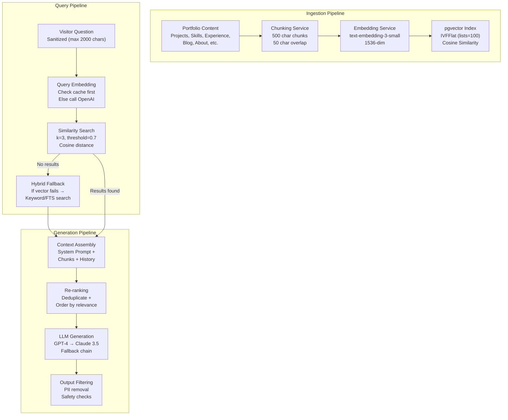
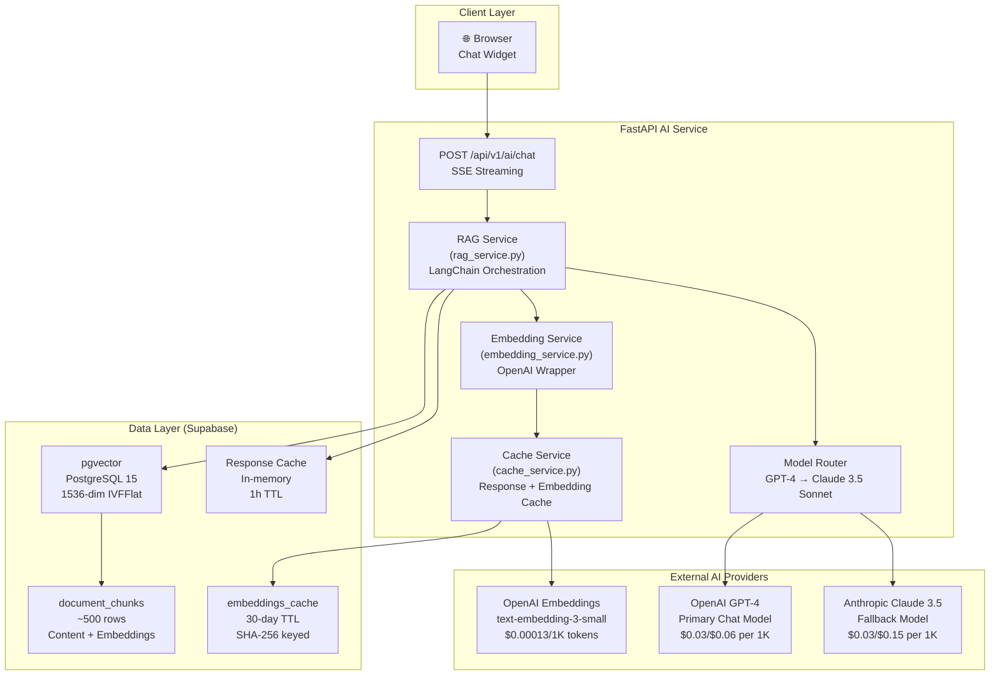
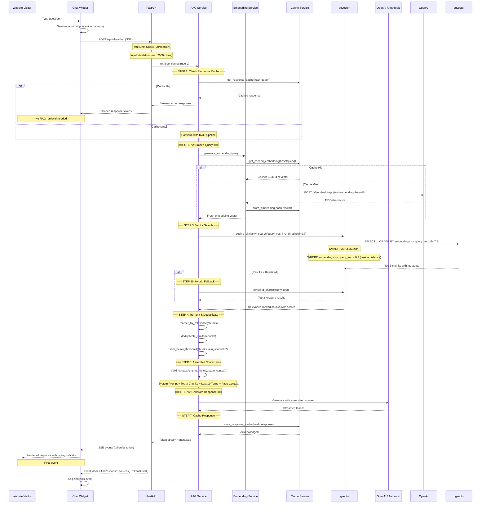
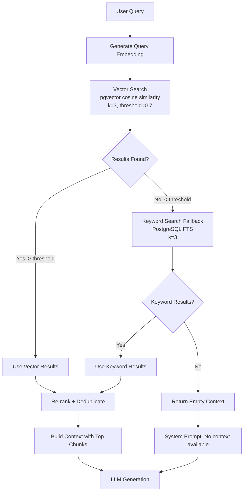
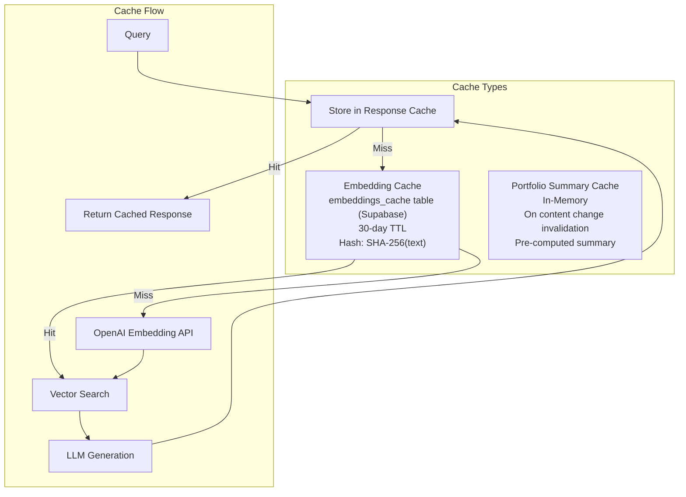
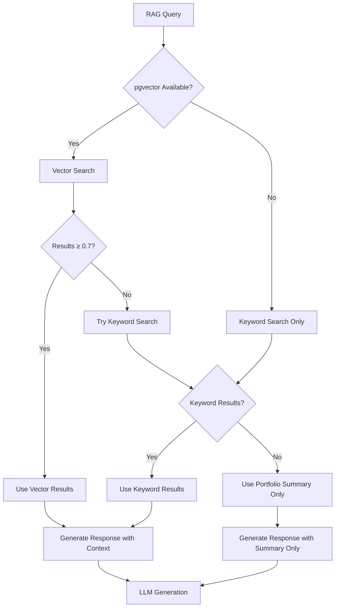

> **Status:** ⚠️ Partially Implemented — some aspects are aspirational

# RAG (Retrieval-Augmented Generation) — Enterprise-Grade Pipeline

> **Document:** `19-RAG.md` | **Version:** 4.0 | **Last Updated:** June 2026  
> **Status:** ✅ Active | **Owner:** Chief AI Architect | **Review Cadence:** Monthly  
> **Classification:** Enterprise Architecture | **RAG Engine:** LangChain + pgvector  
> **Embedding Model:** text-embedding-3-small (1536-dim) | **Vector Store:** Supabase PostgreSQL 15  
> **AI Operating Model:** [docs/08-ai/17-AI_INSTRUCTIONS.md](17-AI_INSTRUCTIONS.md) v4.0

---

## Table of Contents

1. [Executive Summary](#1-executive-summary)
2. [RAG Vision & Principles](#2-rag-vision--principles)
3. [RAG Architecture](#3-rag-architecture)
4. [Chunking Strategy](#4-chunking-strategy)
5. [Embedding Strategy](#5-embedding-strategy)
6. [Vector Store (pgvector)](#6-vector-store-pgvector)
7. [Retrieval Strategy](#7-retrieval-strategy)
8. [Hybrid Search](#8-hybrid-search)
9. [Context Assembly](#9-context-assembly)
10. [Knowledge Sources](#10-knowledge-sources)
11. [Knowledge Refresh Strategy](#11-knowledge-refresh-strategy)
12. [RAG Pipeline Implementation](#12-rag-pipeline-implementation)
13. [Cache Layer](#13-cache-layer)
14. [Performance Budgets & SLAs](#14-performance-budgets--slas)
15. [Monitoring & Alerting](#15-monitoring--alerting)
16. [Testing & Evaluation Framework](#16-testing--evaluation-framework)
17. [Security & Privacy](#17-security--privacy)
18. [Cost Analysis](#18-cost-analysis)
19. [Failure Recovery](#19-failure-recovery)
20. [Change Log](#20-change-log)

---

## 1. Executive Summary

### 1.1 North Star

The RAG (Retrieval-Augmented Generation) pipeline is the **knowledge backbone** of the AI assistant. It transforms static portfolio content into a dynamic, queryable knowledge base that powers accurate, contextual, and hallucination-free responses for every visitor. The system is designed with **enterprise-grade rigor** while operating entirely within **free-tier limits** — targeting $0.65/month in embedding costs and sub-50ms retrieval latency.

### 1.2 Pipeline Overview

```text
Content Ingestion → Chunking → Embedding → pgvector Indexing →
Query → Query Embedding → Similarity Search → Context Assembly → LLM Generation
```

### 1.3 Key Metrics

| Metric                             | Current   | Target       | Measurement            |
| ---------------------------------- | --------- | ------------ | ---------------------- |
| Total indexed chunks               | ~500      | < 1,000      | `SELECT COUNT(*)`      |
| Embedding dimension                | 1536      | 1536         | Model config           |
| Chunk size                         | 500 chars | 500 chars    | Chunking config        |
| Chunk overlap                      | 50 chars  | 50 chars     | Chunking config        |
| Retrieval top-K                    | 3         | 3            | RAG config             |
| Similarity threshold               | 0.7       | 0.7          | RAG config             |
| Query → retrieval latency          | —         | < 50ms (p95) | Custom logging         |
| Embedding latency (per chunk)      | —         | < 200ms      | Custom logging         |
| Cache hit rate (embeddings)        | —         | > 40%        | Cache stats            |
| Knowledge freshness                | —         | < 5 min      | Content sync lag       |
| Hallucination rate (RAG-dependent) | —         | < 1%         | Manual review sampling |

### 1.4 Alignment with AI Operating Model

This document is a **specialized extension** of the AI Operating Model defined in `docs/08-ai/17-AI_INSTRUCTIONS.md` v4.0. The RAG pipeline directly implements the following sections:

| AI Instructions Section                                | RAG Implementation                                    |
| ------------------------------------------------------ | ----------------------------------------------------- |
| §6 Architecture (AI Architecture)                      | §3 RAG Architecture — pipeline flow, service modules  |
| §10 Context Rules (CTX-001 through CTX-008)            | §9 Context Assembly — priority order, token budget    |
| §11 Knowledge Sources (KNOW-001 through KNOW-006)      | §10 Knowledge Sources — 9 source types, refresh       |
| §15 Hallucination Prevention (HAL-001 through HAL-008) | §7 Retrieval Strategy — thresholds, confidence checks |
| §17 Evaluation Framework                               | §16 Testing & Evaluation — RAG-specific metrics       |
| §19 Monitoring                                         | §15 Monitoring & Alerting — RAG quality monitoring    |

---

## 2. RAG Vision & Principles

### 2.1 Core Beliefs

| Belief                        | Manifestation                                                        |
| ----------------------------- | -------------------------------------------------------------------- |
| **Accuracy over breadth**     | Strict similarity thresholds; better no context than wrong context   |
| **Freshness matters**         | Knowledge refreshed within 5 minutes of content change               |
| **Cost-conscious embeddings** | Cache aggressively; batch-process; use smallest sufficient model     |
| **Observable by default**     | Every RAG query logged: latency, similarity scores, chunks retrieved |
| **Progressive fallback**      | Vector → keyword → portfolio summary → graceful "I don't know"       |

### 2.2 Design Principles

| #   | Principle                             | Description                                                                   | Violation Penalty               |
| --- | ------------------------------------- | ----------------------------------------------------------------------------- | ------------------------------- |
| P1  | **Chunk for precision, not coverage** | Small chunks (500 chars) with overlap (50 chars) maximize retrieval precision | Topic drift, hallucination risk |
| P2  | **Embed once, retrieve often**        | Embeddings cached for 30 days; never re-embed the same text                   | Cost waste, latency increase    |
| P3  | **Thresholds are hard boundaries**    | Similarity < 0.7 = no context; model must admit ignorance                     | Fabricated answers              |
| P4  | **Sources are attributable**          | Every retrieved chunk includes source metadata for citation                   | Untraceable answers             |
| P5  | **Hybrid search by default**          | Vector + keyword fallback ensures graceful degradation                        | Empty retrieval = no answer     |
| P6  | **Cache first, compute second**       | Response cache, embedding cache, in-memory context cache                      | Latency, cost overruns          |
| P7  | **Index for the query distribution**  | Portfolios are personal — optimize for "what", "who", "how" questions         | Irrelevant retrieval            |

### 2.3 RAG Pipeline Flow



---

## 3. RAG Architecture

### 3.1 High-Level Architecture



### 3.2 Service Modules

| Module                | File                                        | Responsibility                                                     | Dependencies                             |
| --------------------- | ------------------------------------------- | ------------------------------------------------------------------ | ---------------------------------------- |
| **RAG Service**       | `apps/ai/app/services/rag_service.py`       | Query embedding, vector search, context assembly, hybrid fallback  | EmbeddingService, pgvector, CacheService |
| **Embedding Service** | `apps/ai/app/services/embedding_service.py` | Generate embeddings, cache lookup/storage, batch processing        | OpenAI API, embeddings_cache table       |
| **Cache Service**     | `apps/ai/app/services/cache_service.py`     | Hash-based response caching (1h TTL), embedding cache (30-day TTL) | In-memory dict + embeddings_cache table  |
| **AI Service**        | `apps/ai/app/services/ai_service.py`        | LangChain orchestration, prompt assembly, conversation management  | RAGService, ModelRouter                  |
| **Ingestion Service** | `apps/ai/app/services/ingestion_service.py` | Content fetching, chunking, batch embedding, index refresh         | All content CRUD APIs, EmbeddingService  |

### 3.3 Request Flow (Detailed)



---

## 4. Chunking Strategy

### 4.1 Chunking Configuration

| Parameter                 | Value                     | Rationale                                                  |
| ------------------------- | ------------------------- | ---------------------------------------------------------- |
| **Chunk size**            | 500 characters            | Balances context richness with retrieval precision         |
| **Chunk overlap**         | 50 characters (10%)       | Preserves boundary context (sentence/paragraph continuity) |
| **Max chunks per source** | 50                        | Prevents any single source from dominating the index       |
| **Chunking strategy**     | Recursive character split | Respects paragraph and sentence boundaries                 |
| **Splitting delimiters**  | `\n\n` → `\n` → `.` → ` ` | Recursive fallback from paragraphs to sentences            |

### 4.2 Chunking Implementation

```python
from langchain.text_splitter import RecursiveCharacterTextSplitter

def create_chunker() -> RecursiveCharacterTextSplitter:
    """Create a recursive character text splitter for portfolio content."""
    return RecursiveCharacterTextSplitter(
        chunk_size=500,
        chunk_overlap=50,
        length_function=len,  # Character count
        separators=["\n\n", "\n", ". ", " ", ""],
    )

def chunk_content(source_name: str, content: str, metadata: dict) -> list[dict]:
    """Split content into chunks with metadata."""
    chunker = create_chunker()
    chunks = chunker.split_text(content)

    return [
        {
            "document_id": f"{source_name}_{idx}",
            "content": chunk,
            "chunk_index": idx,
            "token_count": estimate_tokens(chunk),
            "metadata": {
                **metadata,
                "source": source_name,
                "chunk_total": len(chunks),
            }
        }
        for idx, chunk in enumerate(chunks)
    ]

def estimate_tokens(text: str) -> int:
    """
    Rough token estimation: ~4 chars per token for English text.
    For production accuracy, replace with tiktoken:
        import tiktoken
        encoding = tiktoken.get_encoding("cl100k_base")
        return len(encoding.encode(text))
    """
    return len(text) // 4
```

### 4.3 Chunking Rules

| Rule                     | ID        | Description                                                 |
| ------------------------ | --------- | ----------------------------------------------------------- |
| **Uniform chunk size**   | CHUNK-001 | All chunks are ~500 characters (±10%)                       |
| **Boundary awareness**   | CHUNK-002 | Prefer splitting at paragraph/sentence boundaries           |
| **Source isolation**     | CHUNK-003 | Chunks from different sources are never merged              |
| **Overlap preservation** | CHUNK-004 | 50-char overlap ensures no context loss at boundaries       |
| **Metadata tagging**     | CHUNK-005 | Every chunk tagged with source, index, and section metadata |
| **Token estimation**     | CHUNK-006 | Token count estimated for context window budgeting          |

### 4.4 Source-Specific Chunking

| Source       | Content Type                             | Typical Length  | Chunks (Est.)    | Chunk Strategy           |
| ------------ | ---------------------------------------- | --------------- | ---------------- | ------------------------ |
| Projects     | Title, description, tech stack, outcomes | 500-2000 chars  | 1-4              | By paragraph             |
| Skills       | Name, category, proficiency              | 50-200 chars    | 1 (no splitting) | Single chunk             |
| Experience   | Company, role, description, dates        | 300-1500 chars  | 1-3              | By paragraph             |
| Blog Posts   | Title, excerpt, full content             | 1000-5000 chars | 2-10             | By section (## headings) |
| About / Bio  | Full biography                           | 500-2000 chars  | 1-4              | By paragraph             |
| Services     | Title, description, features             | 200-800 chars   | 1-2              | By feature list          |
| Achievements | Title, description, issuer               | 100-400 chars   | 1 (no splitting) | Single chunk             |
| Case Studies | Challenge, approach, solution, impact    | 1000-3000 chars | 2-6              | By case study section    |
| Testimonials | Quote, name, role, company               | 100-500 chars   | 1 (no splitting) | Single chunk             |

---

## 5. Embedding Strategy

### 5.1 Model Selection

| Property                 | Value                    | Rationale                                       |
| ------------------------ | ------------------------ | ----------------------------------------------- |
| **Model**                | `text-embedding-3-small` | Best accuracy-to-cost ratio                     |
| **Provider**             | OpenAI                   | Industry-standard, reliable API                 |
| **Dimensions**           | 1536                     | Default for text-embedding-3-small              |
| **Max tokens per input** | 8191                     | Well above our 500-char (~125 token) chunk size |
| **Cost**                 | $0.00013/1K tokens       | ~$0.65/month for our volume                     |
| **Fallback**             | None (single provider)   | Embedding models have high uptime               |

### 5.2 Embedding Generation

```python
import hashlib
import json
from openai import AsyncOpenAI
from supabase import create_client

class EmbeddingService:
    """Service for generating and caching embeddings."""

    def __init__(self, openai_client: AsyncOpenAI, supabase_client):
        self.openai = openai_client
        self.supabase = supabase_client
        self.model = "text-embedding-3-small"
        self.dimensions = 1536

    async def generate_embedding(self, text: str) -> list[float]:
        """Generate embedding for a single text, checking cache first."""
        input_hash = self._hash_text(text)

        # Check cache
        cached = await self._get_cached_embedding(input_hash)
        if cached:
            return cached

        # Generate fresh embedding
        response = await self.openai.embeddings.create(
            model=self.model,
            input=text,
        )
        embedding = response.data[0].embedding

        # Store in cache
        await self._cache_embedding(input_hash, text, embedding,
                                     response.usage.total_tokens)

        return embedding

    async def generate_embeddings_batch(self, texts: list[str]) -> list[list[float]]:
        """Generate embeddings for multiple texts in a single API call."""
        # Filter already-cached texts
        uncached = []
        cache_map = {}

        for text in texts:
            h = self._hash_text(text)
            cached = await self._get_cached_embedding(h)
            if cached:
                cache_map[h] = cached
            else:
                uncached.append(text)

        # Batch generate for uncached texts
        if uncached:
            response = await self.openai.embeddings.create(
                model=self.model,
                input=uncached,
            )

            for i, text in enumerate(uncached):
                embedding = response.data[i].embedding
                h = self._hash_text(text)
                await self._cache_embedding(h, text, embedding,
                                           response.usage.total_tokens // len(uncached))
                cache_map[h] = embedding

        # Return in original order
        return [cache_map[self._hash_text(t)] for t in texts]

    def _hash_text(self, text: str) -> str:
        """Generate SHA-256 hash of input text for cache key."""
        return hashlib.sha256(text.encode('utf-8')).hexdigest()

    async def _get_cached_embedding(self, input_hash: str) -> list[float] | None:
        """Retrieve cached embedding if it exists and hasn't expired."""
        result = await self.supabase.table("embeddings_cache")\
            .select("embedding")\
            .eq("input_hash", input_hash)\
            .gte("expires_at", "now()")\
            .execute()

        if result.data and len(result.data) > 0:
            return result.data[0]["embedding"]
        return None

    async def _cache_embedding(self, input_hash: str, input_text: str,
                                embedding: list[float], token_count: int):
        """Store embedding in cache with 30-day TTL."""
        await self.supabase.table("embeddings_cache").upsert({
            "input_hash": input_hash,
            "input_text": input_text,
            "embedding": embedding,
            "model": self.model,
            "token_count": token_count,
            "expires_at": "now() + interval '30 days'",
        }).execute()
```

### 5.3 Embedding Rules

| Rule                 | ID      | Description                                                 |
| -------------------- | ------- | ----------------------------------------------------------- |
| **Cache-first**      | EMB-001 | Always check cache before calling OpenAI embeddings API     |
| **Batch processing** | EMB-002 | New content indexed in batches (max 20 at a time)           |
| **30-day TTL**       | EMB-003 | Cached embeddings expire after 30 days                      |
| **Input hashing**    | EMB-004 | Cache key is SHA-256 hash of input text (case-sensitive)    |
| **Single model**     | EMB-005 | All embeddings use text-embedding-3-small (no mixed models) |

---

## 6. Vector Store (pgvector)

### 6.1 Database Schema

```sql
-- Document chunks table (core RAG storage)
CREATE TABLE document_chunks (
    id UUID PRIMARY KEY DEFAULT gen_random_uuid(),
    document_id TEXT NOT NULL,              -- Source reference (e.g., "projects_3")
    content TEXT NOT NULL,                   -- Chunk text content
    embedding VECTOR(1536),                  -- OpenAI embedding vector
    chunk_index INTEGER NOT NULL,           -- Position within source document
    token_count INTEGER,                    -- Estimated tokens (for budgeting)
    metadata JSONB DEFAULT '{}',            -- Source, section, title metadata
    created_at TIMESTAMPTZ NOT NULL DEFAULT NOW()
);

-- IVFFlat index for approximate nearest neighbor search
CREATE INDEX idx_document_chunks_embedding ON document_chunks
    USING ivfflat (embedding vector_cosine_ops) WITH (lists = 100);

-- B-tree index for source lookups (used during refresh)
CREATE INDEX idx_document_chunks_document ON document_chunks (document_id);
```

### 6.2 Index Configuration

| Parameter             | Value               | Rationale                                                        |
| --------------------- | ------------------- | ---------------------------------------------------------------- |
| **Index type**        | IVFFlat             | Approximate nearest neighbor (sufficient for ~500 vectors)       |
| **Distance function** | `vector_cosine_ops` | Cosine similarity for normalized embeddings                      |
| **Lists (centroids)** | 100                 | sqrt(2\*n) for ~500 rows: sqrt(1000) ≈ 32, rounded up for margin |
| **Probes**            | 2 (default)         | Balanced recall vs. query speed                                  |
| **Build time**        | < 1 second          | Negligible for 500 vectors                                       |
| **Recall @ k=3**      | ~98%                | IVFFlat with 100 lists for 500 vectors                           |

### 6.3 Vector Search Query

```sql
-- Cosine similarity search (distance, not similarity)
-- Cosine distance = 1 - cosine_similarity
-- So distance < 0.3 ≈ similarity > 0.7
SELECT
    id,
    content,
    metadata,
    1 - (embedding <=> query_embedding) AS similarity_score,
    chunk_index
FROM document_chunks
WHERE 1 - (embedding <=> query_embedding) >= 0.7  -- Similarity threshold
ORDER BY embedding <=> query_embedding  -- Ascending distance = descending similarity
LIMIT 3;

-- Fallback: keyword search using PostgreSQL full-text search
SELECT
    id,
    content,
    metadata,
    ts_rank(to_tsvector('english', content), plainto_tsquery('english', query)) AS rank
FROM document_chunks
WHERE to_tsvector('english', content) @@ plainto_tsquery('english', query)
ORDER BY rank DESC
LIMIT 3;
```

### 6.4 pgvector Configuration Rules

| Rule                          | ID      | Description                                                           |
| ----------------------------- | ------- | --------------------------------------------------------------------- |
| **IVFFlat only**              | VEC-001 | Use IVFFlat index; exact nearest neighbor (no index) is too slow      |
| **Cosine distance**           | VEC-002 | Use `<=>` operator with `vector_cosine_ops` for normalized embeddings |
| **Lists = 100**               | VEC-003 | IVFFlat lists set to 100 for ~500 vector rows                         |
| **Similarity threshold**      | VEC-004 | Chunks with similarity < 0.7 are excluded from context                |
| **Top-K = 3**                 | VEC-005 | Maximum 3 chunks retrieved to keep context focused                    |
| **Embedding dimension check** | VEC-006 | All embeddings must be exactly 1536 dimensions                        |

---

## 7. Retrieval Strategy

### 7.1 Retrieval Configuration

| Parameter                            | Value     | Rationale                                                     |
| ------------------------------------ | --------- | ------------------------------------------------------------- |
| **Top-K**                            | 3         | Sufficient context (3 × 500 chars ≈ 1500 chars) without noise |
| **Similarity threshold**             | 0.7       | Minimum cosine similarity; below this = no context            |
| **Score re-ranking**                 | Yes       | Order chunks by descending similarity                         |
| **Deduplication**                    | Yes       | Remove chunks with > 95% content overlap                      |
| **Source diversity**                 | Preferred | Try to include chunks from different sources                  |
| **MMR (Maximal Marginal Relevance)** | Future    | Not yet implemented; would reduce redundancy                  |

### 7.2 Similarity Threshold Justification

| Threshold          | Behavior            | Use Case                                |
| ------------------ | ------------------- | --------------------------------------- |
| ≥ 0.9              | Very high relevance | Exact match or near-exact               |
| 0.8 — 0.89         | High relevance      | Strong semantic match                   |
| **0.7 — 0.79**     | **Good relevance**  | **Current threshold — optimal balance** |
| 0.5 — 0.69         | Moderate relevance  | Better to exclude than risk noise       |
| < 0.5              | Low relevance       | Always exclude                          |
| 0.0 (no threshold) | Everything matches  | ❌ Produces hallucination risk          |

### 7.3 Retrieval Implementation

```python
class RAGService:
    """Service for retrieving relevant context from the knowledge base."""

    def __init__(self, embedding_service: EmbeddingService, supabase_client):
        self.embedding = embedding_service
        self.supabase = supabase_client
        self.top_k = 3
        self.similarity_threshold = 0.7

    async def retrieve(self, query: str) -> dict:
        """Retrieve relevant context chunks for a query."""

        # Step 1: Generate query embedding
        query_vector = await self.embedding.generate_embedding(query)

        # Step 2: Vector similarity search
        chunks = await self._vector_search(query_vector)

        # Step 3: Check if we have enough results
        if not chunks or len(chunks) == 0:
            # Step 3b: Hybrid fallback — keyword search
            chunks = await self._keyword_search(query)

        # Step 4: Re-rank and deduplicate
        chunks = self._rerank(chunks, query)
        chunks = self._deduplicate(chunks)

        # Step 5: Build context result
        return {
            "chunks": chunks,
            "count": len(chunks),
            "has_context": len(chunks) > 0,
            "avg_similarity": (
                sum(c["similarity_score"] for c in chunks) / len(chunks)
            ) if chunks else 0.0,
        }

    async def _vector_search(self, query_vector: list[float]) -> list[dict]:
        """Execute vector similarity search against pgvector."""
        # Convert to string for Supabase query
        vector_str = f"[{','.join(str(v) for v in query_vector)}]"

        result = await self.supabase.rpc(
            "match_documents",
            {
                "query_embedding": vector_str,
                "match_threshold": self.similarity_threshold,
                "match_count": self.top_k,
            }
        ).execute()

        return result.data or []

    async def _keyword_search(self, query: str) -> list[dict]:
        """Fallback keyword search using PostgreSQL full-text search."""
        result = await self.supabase.rpc(
            "keyword_search_documents",
            {
                "search_query": query,
                "match_count": self.top_k,
            }
        ).execute()

        return result.data or []

    def _rerank(self, chunks: list[dict], query: str) -> list[dict]:
        """Re-rank chunks by relevance score."""
        return sorted(
            chunks,
            key=lambda c: c.get("similarity_score", 0),
            reverse=True
        )

    def _deduplicate(self, chunks: list[dict]) -> list[dict]:
        """Remove near-duplicate chunks (content overlap > 95%)."""
        if len(chunks) <= 1:
            return chunks

        unique = [chunks[0]]
        for chunk in chunks[1:]:
            # Simple overlap check
            if not any(
                self._overlap_ratio(chunk["content"], u["content"]) > 0.95
                for u in unique
            ):
                unique.append(chunk)

        return unique[:self.top_k]

    def _overlap_ratio(self, a: str, b: str) -> float:
        """Calculate overlap ratio between two strings."""
        # Longest common subsequence heuristic
        shorter = min(len(a), len(b))
        if shorter == 0:
            return 0.0
        # Simple check: if most of the shorter string is in the longer one
        if len(a) <= len(b):
            return sum(1 for word in a.split() if word in b) / len(a.split())
        return sum(1 for word in b.split() if word in a) / len(b.split())
```

### 7.4 Retrieval Rules

| Rule                       | ID      | Description                                                          |
| -------------------------- | ------- | -------------------------------------------------------------------- |
| **Threshold enforcement**  | RET-001 | Never include chunks with similarity < 0.7                           |
| **Top-K limit**            | RET-002 | Maximum 3 chunks; don't exceed context budget                        |
| **Empty context handling** | RET-003 | If 0 chunks found, return empty context (model knows "I don't know") |
| **Fallback chain**         | RET-004 | Vector → keyword → empty (never fabricate)                           |
| **Score transparency**     | RET-005 | Similarity scores logged for monitoring and debugging                |
| **Source tracking**        | RET-006 | Every chunk includes source metadata for citation                    |

---

## 8. Hybrid Search

### 8.1 Hybrid Search Architecture



### 8.2 Hybrid Search Configuration

| Method                         | Priority    | When Used                               | Index Used         | Query Type                   |
| ------------------------------ | ----------- | --------------------------------------- | ------------------ | ---------------------------- |
| **Vector (cosine similarity)** | Primary     | Always first                            | IVFFlat (pgvector) | Embedding → nearest neighbor |
| **Keyword (FTS)**              | Fallback    | When vector returns < threshold results | GIN (tsvector)     | Token matching               |
| **Portfolio summary**          | Last resort | When both above return nothing          | N/A (pre-computed) | Static portfolio overview    |

### 8.3 Database Functions

```sql
-- Vector similarity search function
CREATE OR REPLACE FUNCTION match_documents(
    query_embedding VECTOR(1536),
    match_threshold FLOAT,
    match_count INT
)
RETURNS TABLE (
    id UUID,
    content TEXT,
    metadata JSONB,
    similarity_score FLOAT,
    chunk_index INT
)
LANGUAGE plpgsql
AS $$
BEGIN
    RETURN QUERY
    SELECT
        dc.id,
        dc.content,
        dc.metadata,
        1 - (dc.embedding <=> query_embedding) AS similarity_score,
        dc.chunk_index
    FROM document_chunks dc
    WHERE 1 - (dc.embedding <=> query_embedding) > match_threshold
    ORDER BY dc.embedding <=> query_embedding
    LIMIT match_count;
END;
$$;

-- Keyword search fallback function
CREATE OR REPLACE FUNCTION keyword_search_documents(
    search_query TEXT,
    match_count INT
)
RETURNS TABLE (
    id UUID,
    content TEXT,
    metadata JSONB,
    similarity_score FLOAT,
    chunk_index INT
)
LANGUAGE plpgsql
AS $$
BEGIN
    RETURN QUERY
    SELECT
        dc.id,
        dc.content,
        dc.metadata,
        ts_ranking.score AS similarity_score,
        dc.chunk_index
    FROM document_chunks dc
    CROSS JOIN LATERAL (
        SELECT ts_rank(
            to_tsvector('english', dc.content),
            plainto_tsquery('english', search_query)
        ) AS score
    ) ts_ranking
    WHERE to_tsvector('english', dc.content) @@ plainto_tsquery('english', search_query)
    ORDER BY ts_ranking.score DESC
    LIMIT match_count;
END;
$$;
```

### 8.4 Hybrid Search Rules

| Rule                         | ID      | Description                                                       |
| ---------------------------- | ------- | ----------------------------------------------------------------- |
| **Vector-first**             | HYB-001 | Always attempt vector search first; keyword is fallback only      |
| **No result mixing**         | HYB-002 | Never mix vector and keyword results in a single context          |
| **Threshold-aware fallback** | HYB-003 | Fallback triggers when ALL vector results are below 0.7 threshold |
| **Graceful degradation**     | HYB-004 | Zero results = honest "I don't know" response, never fabrication  |

---

## 9. Context Assembly

### 9.1 Context Composition

The final context passed to the LLM is assembled from multiple sources in a specific priority order:

| Priority        | Source                             | Max Tokens | Description                                   |
| --------------- | ---------------------------------- | ---------- | --------------------------------------------- |
| **1 (Highest)** | System prompt                      | ~300       | Immutable behavioral directives               |
| **2**           | Retrieved chunks (k=3)             | ~500       | Most semantically relevant portfolio content  |
| **3**           | Recent conversation (last 5 turns) | ~700       | Chat context for coherent dialogue            |
| **4**           | Portfolio summary                  | ~200       | Pre-computed summary of all portfolio content |
| **5**           | Page context                       | ~50        | Current page URL, visitor source              |
| **6**           | Older history (turns 6-10)         | ~500       | Older context, dropped first when over budget |
|                 | **Total context budget**           | **~2250**  | Reserve ~750 tokens for response              |

### 9.2 Context Assembly Implementation

```python
def build_context(
    retrieved_chunks: list[dict],
    conversation_history: list[dict],
    page_context: str,
    portfolio_summary: str,
) -> dict:
    """Build the complete context for the LLM call."""

    # Format retrieved chunks
    formatted_chunks = "\n\n".join([
        f"[Source: {c['metadata'].get('source', 'unknown')}]\n{c['content']}"
        for c in retrieved_chunks
    ])

    # Format conversation history (last 10 turns max)
    history = conversation_history[-20:]  # 20 messages = 10 turns
    formatted_history = "\n".join([
        f"{'Visitor' if m['role'] == 'user' else 'Assistant'}: {m['content']}"
        for m in history
    ]) if history else "No previous conversation."

    return {
        "retrieved_chunks": formatted_chunks,
        "chat_history": formatted_history,
        "page_context": page_context,
        "portfolio_summary": portfolio_summary,
    }


def manage_context_window(history: list[dict], max_tokens: int = 2250) -> list[dict]:
    """Prune conversation history to fit within context window."""
    messages = []
    token_count = 0

    # System prompt + retrieved chunks + portfolio summary are fixed overhead
    fixed_overhead = 300 + 500 + 200  # ~1000 tokens
    token_count += fixed_overhead

    # Remaining budget for history
    history_budget = max_tokens - fixed_overhead

    # Add messages from most recent to oldest
    for msg in reversed(history):
        msg_tokens = estimate_tokens(msg.get("content", ""))
        if token_count + msg_tokens > max_tokens:
            break
        messages.insert(0, msg)
        token_count += msg_tokens

    return messages
```

### 9.3 Context Assembly Rules

| Rule                        | ID      | Description                                              | AI Instructions Reference |
| --------------------------- | ------- | -------------------------------------------------------- | ------------------------- |
| **Freshness Priority**      | CTX-001 | Most recent context has highest priority                 | AI §10.4 CTX-001          |
| **Relevance Threshold**     | CTX-002 | RAG chunks must have similarity ≥ 0.7                    | AI §10.4 CTX-002          |
| **Token Budget**            | CTX-003 | Total context ≤ 2250 tokens (reserving 750 for response) | AI §10.4 CTX-003          |
| **History Truncation**      | CTX-004 | Oldest messages dropped first when over budget           | AI §10.4 CTX-004          |
| **System Prompt Immutable** | CTX-005 | System prompt always included, never overridable         | AI §10.4 CTX-005          |
| **Context Isolation**       | CTX-006 | Context isolated per session; no cross-session leakage   | AI §10.4 CTX-006          |
| **Page Awareness**          | CTX-007 | AI knows which page visitor is on                        | AI §10.4 CTX-007          |
| **Source Citation**         | CTX-008 | AI must cite source section when using RAG chunks        | AI §10.4 CTX-008          |

---

## 10. Knowledge Sources

### 10.1 Source Inventory

| #   | Source           | Content Type                             | Chunks (Est.) | Token Count (Est.) | Priority | Update Trigger       |
| --- | ---------------- | ---------------------------------------- | ------------- | ------------------ | -------- | -------------------- |
| 1   | **Projects**     | Title, description, tech stack, outcomes | ~80           | ~10,000            | 🔴 P0    | On project CRUD      |
| 2   | **Skills**       | Name, category, proficiency              | ~15           | ~1,000             | 🔴 P0    | On skill CRUD        |
| 3   | **Experience**   | Company, role, description, dates        | ~45           | ~5,000             | 🔴 P0    | On experience CRUD   |
| 4   | **Blog Posts**   | Title, excerpt, content                  | ~200          | ~25,000            | 🟡 P1    | On publish/unpublish |
| 5   | **About / Bio**  | Full biography text                      | ~20           | ~2,500             | 🟡 P1    | On content update    |
| 6   | **Services**     | Title, description, features             | ~15           | ~1,500             | 🟡 P1    | On service CRUD      |
| 7   | **Achievements** | Title, description, issuer               | ~10           | ~1,000             | 🟢 P2    | On achievement CRUD  |
| 8   | **Case Studies** | Challenge, approach, solution, impact    | ~40           | ~5,000             | 🟢 P2    | On case study CRUD   |
| 9   | **Testimonials** | Quote, name, role, company               | ~10           | ~1,000             | 🟢 P2    | On testimonial CRUD  |
|     | **Total**        |                                          | **~435**      | **~52,000**        |          |                      |

### 10.2 Source Metadata Schema

```json
{
  "source": "projects",
  "title": "My Awesome Project",
  "section": "description",
  "record_id": "uuid-of-project",
  "slug": "my-awesome-project",
  "category": "web",
  "updated_at": "2026-06-15T10:30:00.000Z",
  "version_hash": "abc123def456"
}
```

### 10.3 Knowledge Source Rules

| Rule                    | ID       | Description                                            | AI Instructions Reference |
| ----------------------- | -------- | ------------------------------------------------------ | ------------------------- |
| **Source-Bound**        | KNOW-001 | AI can only answer from indexed knowledge sources      | AI §11.3 KNOW-001         |
| **Freshness Guarantee** | KNOW-002 | Knowledge refreshed within 5 minutes of content update | AI §11.3 KNOW-002         |
| **Versioning**          | KNOW-003 | Each source has a version hash for cache invalidation  | AI §11.3 KNOW-003         |
| **Priority**            | KNOW-004 | Projects and skills have highest retrieval priority    | AI §11.3 KNOW-004         |
| **Exclusion**           | KNOW-005 | Draft/unpublished content excluded from knowledge base | AI §11.3 KNOW-005         |
| **Source Attribution**  | KNOW-006 | AI can identify which source it's answering from       | AI §11.3 KNOW-006         |

---

## 11. Knowledge Refresh Strategy

### 11.1 Refresh Triggers

| Trigger                                 | Source(s) Affected | Action                             | Priority | Latency Target |
| --------------------------------------- | ------------------ | ---------------------------------- | -------- | -------------- |
| **Project created/updated/deleted**     | Projects           | Re-index project chunks            | High     | < 5 minutes    |
| **Skill created/updated/deleted**       | Skills             | Re-index skill chunks              | High     | < 5 minutes    |
| **Experience created/updated/deleted**  | Experience         | Re-index experience chunks         | High     | < 5 minutes    |
| **Blog post published/unpublished**     | Blog Posts         | Re-index blog chunks               | Medium   | < 5 minutes    |
| **Blog post created/updated**           | Blog Posts         | Re-index (if published)            | Medium   | < 5 minutes    |
| **About content updated**               | About / Bio        | Re-index about chunks              | Medium   | < 5 minutes    |
| **Service created/updated/deleted**     | Services           | Re-index service chunks            | Medium   | < 5 minutes    |
| **Achievement created/updated/deleted** | Achievements       | Re-index achievement chunks        | Low      | < 15 minutes   |
| **Case study created/updated/deleted**  | Case Studies       | Re-index case study chunks         | Low      | < 15 minutes   |
| **Testimonial created/updated/deleted** | Testimonials       | Re-index testimonial chunks        | Low      | < 15 minutes   |
| **Full re-index**                       | All sources        | Complete rebuild of knowledge base | Manual   | On demand      |

### 11.2 Refresh Implementation

```python
class IngestionService:
    """Service for managing knowledge base ingestion and refresh."""

    def __init__(self, embedding_service: EmbeddingService, supabase_client):
        self.embedding = embedding_service
        self.supabase = supabase_client
        self.chunker = create_chunker()

    async def refresh_source(self, source_name: str):
        """Refresh all chunks for a specific source."""
        # 1. Fetch source data
        source_data = await self._fetch_source_data(source_name)

        # 2. Clear existing chunks for this source
        await self._clear_source_chunks(source_name)

        # 3. Chunk and embed
        all_chunks = []
        for item in source_data:
            chunks = self._chunk_source_item(source_name, item)
            all_chunks.extend(chunks)

        # 4. Generate embeddings in batches
        texts = [c["content"] for c in all_chunks]
        embeddings = await self.embedding.generate_embeddings_batch(texts)

        # 5. Store chunks
        for chunk, embedding in zip(all_chunks, embeddings):
            chunk["embedding"] = embedding
            await self._store_chunk(chunk)

        logger.info(f"Refreshed {len(all_chunks)} chunks for source '{source_name}'")
        return len(all_chunks)

    async def full_reindex(self):
        """Complete rebuild of the entire knowledge base."""
        sources = [
            "projects", "skills", "experiences", "blog_posts",
            "about", "services", "achievements", "case_studies", "testimonials"
        ]

        total = 0
        for source in sources:
            count = await self.refresh_source(source)
            total += count

        logger.info(f"Full re-index complete: {total} chunks across {len(sources)} sources")
        return total

    async def _fetch_source_data(self, source_name: str) -> list[dict]:
        """Fetch all data for a source from the database."""
        # Maps source names to their fetch methods
        fetchers = {
            "projects": self._fetch_projects,
            "skills": self._fetch_skills,
            "experiences": self._fetch_experiences,
            "blog_posts": self._fetch_blog_posts,
            "about": self._fetch_about,
            "services": self._fetch_services,
            "achievements": self._fetch_achievements,
            "case_studies": self._fetch_case_studies,
            "testimonials": self._fetch_testimonials,
        }

        fetcher = fetchers.get(source_name)
        if not fetcher:
            raise ValueError(f"Unknown source: {source_name}")

        return await fetcher()

    async def _clear_source_chunks(self, source_name: str):
        """Remove all chunks for a given source."""
        await self.supabase.table("document_chunks")\
            .delete()\
            .eq("metadata->>source", source_name)\
            .execute()

    def _chunk_source_item(self, source_name: str, item: dict) -> list[dict]:
        """Chunk a single source item into multiple chunks."""
        content = self._get_item_content(source_name, item)
        metadata = self._build_metadata(source_name, item)

        chunks = self.chunker.split_text(content)
        return [
            {
                "document_id": f"{source_name}_{metadata['record_id']}_{i}",
                "content": chunk,
                "chunk_index": i,
                "token_count": estimate_tokens(chunk),
                "metadata": {
                    **metadata,
                    "chunk_total": len(chunks),
                },
            }
            for i, chunk in enumerate(chunks)
        ]

    async def _store_chunk(self, chunk: dict):
        """Insert a single chunk into the database."""
        await self.supabase.table("document_chunks").insert(chunk).execute()
```

### 11.3 Content Change Webhook

```python
# Called by the NestJS API when portfolio content changes
@app.post("/api/v1/ai/knowledge/refresh")
async def refresh_knowledge(request: KnowledgeRefreshRequest):
    """
    Webhook endpoint called by NestJS when portfolio content changes.
    Refreshes the affected source's chunks in the knowledge base.
    """
    source = request.source_name
    logger.info(f"Knowledge refresh triggered for source: {source}")

    try:
        chunk_count = await ingestion_service.refresh_source(source)
        return {
            "status": "success",
            "source": source,
            "chunks_indexed": chunk_count,
            "timestamp": datetime.utcnow().isoformat(),
        }
    except Exception as e:
        logger.error(f"Knowledge refresh failed for {source}: {e}")
        sentry_sdk.capture_exception(e)
        raise HTTPException(
            status_code=500,
            detail=f"Knowledge refresh failed: {str(e)}"
        )
```

---

## 12. RAG Pipeline Implementation

### 12.1 Full Pipeline Code

```python
import hashlib
import logging
from typing import AsyncGenerator
from dataclasses import dataclass

from openai import AsyncOpenAI
from supabase import create_client

logger = logging.getLogger(__name__)


@dataclass
class RAGResult:
    """Result of a RAG retrieval operation."""
    chunks: list[dict]
    count: int
    has_context: bool
    avg_similarity: float
    latency_ms: float
    retrieval_method: str  # "vector", "keyword", "none"


class RAGPipeline:
    """
    Complete RAG pipeline for the portfolio AI assistant.

    Handles: query embedding → vector search → hybrid fallback →
    re-ranking → context assembly → monitoring logging
    """

    def __init__(
        self,
        openai_client: AsyncOpenAI,
        supabase_client,
        top_k: int = 3,
        similarity_threshold: float = 0.7,
    ):
        self.embedding_service = EmbeddingService(openai_client, supabase_client)
        self.supabase = supabase_client
        self.top_k = top_k
        self.similarity_threshold = similarity_threshold

    async def retrieve(self, query: str) -> RAGResult:
        """
        Execute the full RAG retrieval pipeline.

        1. Generate query embedding (with cache check)
        2. Vector similarity search (with IVFFlat index)
        3. Hybrid fallback if no results
        4. Re-rank and deduplicate
        5. Build and return context
        """
        start_time = time.time()
        retrieval_method = "none"

        # Step 1: Generate query embedding
        query_vector = await self.embedding_service.generate_embedding(query)

        # Step 2: Vector search
        chunks = await self._vector_search(query_vector)

        if chunks:
            retrieval_method = "vector"
        else:
            # Step 3: Hybrid fallback
            chunks = await self._keyword_search(query)
            if chunks:
                retrieval_method = "keyword"

        # Step 4: Re-rank and deduplicate
        chunks = self._rerank(chunks, query)
        chunks = self._deduplicate(chunks)

        latency = (time.time() - start_time) * 1000  # ms

        result = RAGResult(
            chunks=chunks,
            count=len(chunks),
            has_context=len(chunks) > 0,
            avg_similarity=(
                sum(c.get("similarity_score", 0) for c in chunks) / len(chunks)
            ) if chunks else 0.0,
            latency_ms=latency,
            retrieval_method=retrieval_method,
        )

        # Log RAG metrics for monitoring
        self._log_rag_metrics(result)

        return result

    async def _vector_search(self, query_vector: list[float]) -> list[dict]:
        """Execute vector similarity search."""
        vector_str = f"[{','.join(str(v) for v in query_vector)}]"

        result = await self.supabase.rpc(
            "match_documents",
            {
                "query_embedding": vector_str,
                "match_threshold": self.similarity_threshold,
                "match_count": self.top_k,
            }
        ).execute()

        return [
            {
                "id": row["id"],
                "content": row["content"],
                "metadata": row["metadata"],
                "similarity_score": row["similarity_score"],
                "chunk_index": row["chunk_index"],
            }
            for row in (result.data or [])
        ]

    async def _keyword_search(self, query: str) -> list[dict]:
        """Execute keyword search fallback."""
        result = await self.supabase.rpc(
            "keyword_search_documents",
            {
                "search_query": query,
                "match_count": self.top_k,
            }
        ).execute()

        return [
            {
                "id": row["id"],
                "content": row["content"],
                "metadata": row["metadata"],
                "similarity_score": min(row.get("similarity_score", 0) / 10, 0.69),
                # Keyword scores are normalized to be below vector threshold
                "chunk_index": row["chunk_index"],
            }
            for row in (result.data or [])
        ]

    def _rerank(self, chunks: list[dict], query: str) -> list[dict]:
        """Re-rank chunks by similarity score."""
        return sorted(
            chunks,
            key=lambda c: c.get("similarity_score", 0),
            reverse=True
        )

    def _deduplicate(self, chunks: list[dict]) -> list[dict]:
        """Remove near-duplicate chunks."""
        if len(chunks) <= 1:
            return chunks

        unique = [chunks[0]]
        for chunk in chunks[1:]:
            if not any(
                self._content_overlap(chunk["content"], u["content"]) > 0.95
                for u in unique
            ):
                unique.append(chunk)

        return unique[:self.top_k]

    def _content_overlap(self, a: str, b: str) -> float:
        """Calculate content overlap ratio."""
        words_a = set(a.lower().split())
        words_b = set(b.lower().split())

        if not words_a or not words_b:
            return 0.0

        intersection = words_a & words_b
        min_len = min(len(words_a), len(words_b))

        return len(intersection) / min_len if min_len > 0 else 0.0

    def _log_rag_metrics(self, result: RAGResult):
        """Log RAG metrics for monitoring and analytics."""
        logger.info(
            f"RAG: method={result.retrieval_method} "
            f"chunks={result.count} "
            f"avg_sim={result.avg_similarity:.4f} "
            f"latency={result.latency_ms:.0f}ms"
        )

        # Track in analytics (for dashboard)
        track_analytics_event("rag_query", {
            "method": result.retrieval_method,
            "chunks_retrieved": result.count,
            "avg_similarity": result.avg_similarity,
            "latency_ms": result.latency_ms,
            "has_context": result.has_context,
        })
```

### 12.2 Integration with AI Service

```python
async def generate_chat_response(
    user_message: str,
    session_id: str,
    conversation_history: list[dict],
    page_context: str = "",
) -> AsyncGenerator[str, None]:
    """
    Generate a streaming chat response using the RAG pipeline.
    This is the main integration point between chat and RAG.
    """

    # Step 1: Sanitize input
    sanitized = sanitize_user_input(user_message)

    # Step 2: Check response cache
    cache_key = hashlib.sha256(sanitized.encode()).hexdigest()
    cached = check_response_cache(cache_key)
    if cached:
        for token in cached["response"]:
            yield token
        return

    # Step 3: Retrieve RAG context
    rag_result = await rag_pipeline.retrieve(sanitized)

    # Step 4: Build context
    context = build_context(
        retrieved_chunks=rag_result.chunks,
        conversation_history=conversation_history,
        page_context=page_context,
        portfolio_summary=get_portfolio_summary(),
    )

    # Step 5: Generate with model router
    response_tokens = []
    async for token in model_router.generate(
        system_prompt=SYSTEM_PROMPT,
        context=context,
        user_message=sanitized,
    ):
        response_tokens.append(token)
        yield token

    full_response = "".join(response_tokens)

    # Step 6: Filter output
    filtered = filter_output(full_response)

    # Step 7: Cache response
    store_response_cache(cache_key, filtered)

    # Step 8: Monitor for hallucinations
    if rag_result.has_context:
        issues = monitor_hallucinations(filtered, rag_result.chunks)
        if issues["has_issues"]:
            logger.warning(f"Potential hallucination: {issues['issues']}")
            track_analytics_event("hallucination_flagged", issues)
```

---

## 13. Cache Layer

### 13.1 Cache Architecture



### 13.2 Cache Configuration

| Cache Type            | Storage                  | Key                | Value                     | TTL                | Size Limit     | Invalidation                  |
| --------------------- | ------------------------ | ------------------ | ------------------------- | ------------------ | -------------- | ----------------------------- |
| **Response cache**    | In-memory (dict)         | SHA-256(query)     | Full response text        | 1 hour             | 500 entries    | Manual clear + content update |
| **Embedding cache**   | `embeddings_cache` table | SHA-256(text)      | 1536-dim vector           | 30 days            | Unlimited (DB) | Age-based + content update    |
| **Portfolio summary** | In-memory (variable)     | N/A (single value) | Pre-computed summary text | Until invalidation | 1              | On any content change         |
| **IVFFlat index**     | PostgreSQL               | N/A                | Vector index              | Until rebuild      | ~10MB          | On re-index                   |

### 13.3 Cache Implementation

```python
class ResponseCache:
    """In-memory response cache for identical queries."""

    def __init__(self, max_entries: int = 500, ttl_seconds: int = 3600):
        self.cache: dict[str, dict] = {}
        self.max_entries = max_entries
        self.ttl_seconds = ttl_seconds

    def get(self, key: str) -> str | None:
        """Get cached response if it exists and hasn't expired."""
        entry = self.cache.get(key)
        if entry is None:
            return None

        if time.time() - entry["cached_at"] > self.ttl_seconds:
            del self.cache[key]
            return None

        entry["hits"] += 1
        return entry["response"]

    def set(self, key: str, response: str):
        """Cache a response."""
        # Evict oldest if at capacity
        if len(self.cache) >= self.max_entries:
            oldest_key = min(self.cache, key=lambda k: self.cache[k]["cached_at"])
            del self.cache[oldest_key]

        self.cache[key] = {
            "response": response,
            "cached_at": time.time(),
            "hits": 0,
        }

    def clear(self):
        """Clear all cached responses."""
        self.cache.clear()

    @property
    def hit_rate(self) -> float:
        """Calculate cache hit rate."""
        total = sum(e["hits"] for e in self.cache.values())
        return total / (total + len(self.cache)) if (total + len(self.cache)) > 0 else 0.0

    @property
    def size(self) -> int:
        return len(self.cache)
```

---

## 14. Performance Budgets & SLAs

### 14.1 Performance Targets

| Operation                          | Target (p50) | Target (p95) | Worst Case (p99) | Measurement Method           |
| ---------------------------------- | ------------ | ------------ | ---------------- | ---------------------------- |
| Query embedding (cache hit)        | < 5ms        | < 10ms       | < 20ms           | Custom logging               |
| Query embedding (cache miss)       | < 150ms      | < 300ms      | < 500ms          | Custom logging               |
| Vector search (k=3, 500 vectors)   | < 15ms       | < 30ms       | < 50ms           | pgvector stats               |
| Keyword search (k=3, 500 rows)     | < 5ms        | < 10ms       | < 20ms           | PostgreSQL `EXPLAIN ANALYZE` |
| Chunk embedding (batch of 20)      | < 1s         | < 2s         | < 3s             | Custom logging               |
| Full RAG pipeline (query → chunks) | < 50ms       | < 100ms      | < 200ms          | Custom logging               |
| Full chat response (first token)   | < 1s         | < 2s         | < 3s             | Custom logging               |
| Full chat response (complete)      | < 2s         | < 3s         | < 5s             | Custom logging               |
| Knowledge refresh (single source)  | < 10s        | < 30s        | < 60s            | Custom logging               |
| Full re-index (all sources)        | < 60s        | < 120s       | < 300s           | Custom logging               |

### 14.2 SLA Commitments

| Metric                      | SLA     | Measurement Period | Remediation                             |
| --------------------------- | ------- | ------------------ | --------------------------------------- |
| RAG retrieval availability  | 99.9%   | Monthly            | Fallback to keyword + portfolio summary |
| Knowledge freshness         | < 5 min | Per content change | Auto-refresh on CRUD events             |
| Embedding accuracy          | > 99%   | Weekly sampling    | Verify against known queries            |
| Search recall @ k=3         | > 95%   | Weekly evaluation  | Adjust IVFFlat lists / probes           |
| Cache hit rate (embeddings) | > 40%   | Daily              | Analyze query patterns, adjust TTL      |
| Response cache hit rate     | > 30%   | Daily              | Common queries should be cached         |

### 14.3 Scaling Limits

| Resource                      | Current | Limit    | Action at 80%                           | Action at 100%            |
| ----------------------------- | ------- | -------- | --------------------------------------- | ------------------------- |
| Vector rows (document_chunks) | ~500    | < 10,000 | Archive old content, consolidate chunks | Increase lists (IVFFlat)  |
| Embedding cache entries       | ~500    | < 5,000  | Reduce TTL to 15 days                   | Clean expired entries     |
| Response cache entries        | ~200    | < 500    | Reduce TTL to 30 min                    | Implement LRU eviction    |
| Concurrent RAG queries        | ~2/min  | < 10/min | Add rate limiting                       | Scale AI service replicas |

---

## 15. Monitoring & Alerting

### 15.1 RAG-Specific Metrics

| Metric                       | Event                   | Measurement                         | Alert Threshold | Severity    |
| ---------------------------- | ----------------------- | ----------------------------------- | --------------- | ----------- |
| **RAG query latency**        | `rag_query`             | p95 latency                         | > 200ms         | 🟡 Medium   |
| **Retrieval success rate**   | `rag_query`             | % of queries returning chunks       | < 80%           | 🟡 High     |
| **Average similarity score** | `rag_query`             | Mean similarity of retrieved chunks | < 0.65          | 🟡 High     |
| **Cache hit rate**           | `rag_query`             | Embedding cache hits / total        | < 30%           | 🟢 Low      |
| **Empty results rate**       | `rag_query`             | Queries with 0 chunks / total       | > 10%           | 🟡 High     |
| **Hybrid fallback rate**     | `rag_query`             | Keyword fallbacks / total           | > 20%           | 🟡 Medium   |
| **Re-index duration**        | `reindex`               | Time to re-index all sources        | > 120s          | 🟢 Low      |
| **Index size**               | System                  | Document chunks row count           | > 1,000         | 🟢 Low      |
| **Embedding API errors**     | System                  | OpenAI embedding API failures       | > 1/hour        | 🔴 Critical |
| **Hallucination flags**      | `hallucination_flagged` | Potential hallucination incidents   | > 5/day         | 🔴 Critical |

### 15.2 Health Check Integration

```python
# RAG-specific health check fields
{
    "status": "healthy",
    "timestamp": "2026-06-15T10:30:00.000Z",
    "checks": {
        "pgvector": {
            "status": "healthy",
            "latency_ms": 12,
            "total_chunks": 485,
            "last_index_update": "2026-06-15T08:00:00.000Z"
        },
        "embeddings_cache": {
            "status": "healthy",
            "hit_rate": 0.45,
            "total_entries": 230,
            "oldest_entry": "2026-06-01T00:00:00.000Z"
        },
        "openai_embeddings": {
            "status": "available",
            "latency_ms": 150,
            "rate_limit_remaining": 95
        }
    }
}
```

### 15.3 Alert Rules

| Rule                        | Metric         | Threshold | Duration    | Action                                |
| --------------------------- | -------------- | --------- | ----------- | ------------------------------------- |
| **RAG quality degradation** | Avg similarity | < 0.6     | 1 hour      | Check knowledge base freshness        |
| **RAG pipeline slow**       | p95 latency    | > 200ms   | 5 minutes   | Check pgvector index, OpenAI API      |
| **Embedding API down**      | Error rate     | > 5%      | 1 minute    | Fallback to cached embeddings         |
| **Empty retrieval spike**   | 0-chunk rate   | > 20%     | 1 hour      | Review query patterns, update content |
| **Hallucination spike**     | Flag count     | > 5/day   | 24h rolling | Review recent content changes         |
| **Cache miss spike**        | Hit rate       | < 30%     | 1 hour      | Analyze query diversity               |

### 15.4 Analytics Events

| Event                    | Trigger                 | Properties                                                                  |
| ------------------------ | ----------------------- | --------------------------------------------------------------------------- |
| `rag_query`              | Every RAG retrieval     | `method`, `chunks_retrieved`, `avg_similarity`, `latency_ms`, `has_context` |
| `rag_empty_result`       | 0 chunks retrieved      | `query_length`, `method_used`                                               |
| `rag_fallback_triggered` | Keyword fallback used   | `primary_method`, `fallback_method`                                         |
| `knowledge_refresh`      | Content re-indexed      | `source`, `chunk_count`, `duration_ms`                                      |
| `hallucination_flagged`  | Potential hallucination | `confidence`, `issues`                                                      |

---

## 16. Testing & Evaluation Framework

### 16.1 Evaluation Dimensions

| Dimension               | Weight | Metric                                     | Target    | Measurement Method                        |
| ----------------------- | ------ | ------------------------------------------ | --------- | ----------------------------------------- |
| **Retrieval Precision** | 30%    | % of relevant chunks in top-3              | > 90%     | Manual labeling of 50 queries/week        |
| **Retrieval Recall**    | 25%    | % of all relevant chunks retrieved         | > 80%     | Manual labeling of 50 queries/week        |
| **Response Accuracy**   | 20%    | Answer correctness given retrieved context | > 95%     | Manual review of response-chunk alignment |
| **Latency**             | 10%    | p95 retrieval time                         | < 100ms   | Automated logging                         |
| **Empty Result Rate**   | 10%    | % of queries with no results               | < 10%     | Automated logging                         |
| **Cost Efficiency**     | 5%     | Cost per query (embeddings + cache)        | < $0.0005 | Billing API                               |

### 16.2 Test Suite

```python
# RAG evaluation test cases
RAG_TEST_CASES = [
    {
        "name": "Project query - technical",
        "query": "What technologies does the portfolio owner use for web development?",
        "expected_sources": ["projects", "skills"],
        "min_chunks": 1,
        "min_similarity": 0.7,
    },
    {
        "name": "Experience query",
        "query": "Where did they work before becoming a freelancer?",
        "expected_sources": ["experiences"],
        "min_chunks": 1,
        "min_similarity": 0.7,
    },
    {
        "name": "Skill query",
        "query": "How proficient are they in React?",
        "expected_sources": ["skills"],
        "min_chunks": 1,
        "min_similarity": 0.7,
    },
    {
        "name": "Unknown query (should return empty)",
        "query": "What is the weather like in Tokyo?",
        "expected_sources": [],
        "min_chunks": 0,
        "min_similarity": 0.0,
    },
    {
        "name": "Ambiguous query",
        "query": "Tell me about their background",
        "expected_sources": ["about", "experiences"],
        "min_chunks": 1,
        "min_similarity": 0.65,  # Slightly lower for broad queries
    },
    {
        "name": "Blog content query",
        "query": "Have they written about building APIs?",
        "expected_sources": ["blog_posts"],
        "min_chunks": 1,
        "min_similarity": 0.7,
    },
    {
        "name": "Testimonial query",
        "query": "What do clients say about working with them?",
        "expected_sources": ["testimonials"],
        "min_chunks": 1,
        "min_similarity": 0.7,
    },
    {
        "name": "Complex multi-source query",
        "query": "Show me projects that use React and Node.js",
        "expected_sources": ["projects", "skills"],
        "min_chunks": 2,
        "min_similarity": 0.7,
    },
]
```

### 16.3 Evaluation Runner

```python
async def run_rag_evaluation(test_cases: list[dict]) -> dict:
    """Run RAG evaluation against a set of test queries."""
    results = []

    for case in test_cases:
        result = await rag_pipeline.retrieve(case["query"])

        # Check sources
        sources_found = set(
            c["metadata"].get("source") for c in result.chunks
        )
        expected = set(case["expected_sources"])
        source_match = expected.issubset(sources_found) if expected else len(sources_found) == 0

        # Check count
        count_match = result.count >= case["min_chunks"]

        # Check similarity
        sim_match = result.avg_similarity >= case["min_similarity"]

        results.append({
            "name": case["name"],
            "passed": source_match and count_match and sim_match,
            "sources_found": sources_found,
            "count": result.count,
            "avg_similarity": result.avg_similarity,
            "latency_ms": result.latency_ms,
            "method": result.retrieval_method,
            "failures": [
                f"Expected sources {expected}, got {sources_found}" if not source_match else "",
                f"Expected min {case['min_chunks']} chunks, got {result.count}" if not count_match else "",
                f"Expected min similarity {case['min_similarity']}, got {result.avg_similarity:.2f}" if not sim_match else "",
            ],
        })

    passed = sum(1 for r in results if r["passed"])
    return {
        "total": len(results),
        "passed": passed,
        "failed": len(results) - passed,
        "pass_rate": passed / len(results) * 100,
        "avg_latency_ms": sum(r["latency_ms"] for r in results) / len(results),
        "avg_similarity": sum(r["avg_similarity"] for r in results) / len(results),
        "results": results,
    }
```

### 16.4 Weekly Scorecard

```json
{
  "weekly_evaluation": {
    "week": "2026-W25",
    "test_cases": 8,
    "passed": 7,
    "failed": 1,
    "pass_rate": 87.5,
    "avg_latency_ms": 45,
    "avg_similarity": 0.78,
    "cache_hit_rate": 0.42,
    "failures": [
      {
        "name": "Complex multi-source query",
        "issue": "Only retrieved 1 chunk from projects, missing skills",
        "action": "Review chunk overlap for skill-project cross-references"
      }
    ],
    "improvements": [
      "Add more specific skill descriptions to improve multi-source retrieval",
      "Review chunk boundaries for complex queries"
    ]
  }
}
```

---

## 17. Security & Privacy

### 17.1 RAG-Specific Security Controls

| Threat                          | Vector                                                | Impact              | Mitigation                                                          |
| ------------------------------- | ----------------------------------------------------- | ------------------- | ------------------------------------------------------------------- |
| **Data Exfiltration via RAG**   | Malicious query designed to extract portfolio content | Content leak        | RAG scope limited to `document_chunks`; no external data accessible |
| **Embedding Cache Poisoning**   | Manipulating input to corrupt cached embeddings       | Incorrect retrieval | Input hashing (SHA-256); cache is append-only                       |
| **Similarity Threshold Bypass** | Crafting queries to return low-relevance chunks       | Hallucination risk  | Hard threshold of 0.7; no override capability                       |
| **Index Corruption**            | Direct DB access to pgvector index                    | Service degradation | RLS protection; service role key required for mutations             |
| **API Key Exposure**            | OpenAI key leaked via error messages                  | Cost abuse          | Keys in env vars only; never in logs or responses                   |

### 17.2 Data Privacy in RAG

| Principle                    | Implementation                                                            |
| ---------------------------- | ------------------------------------------------------------------------- |
| **No PII in chunks**         | Content is pre-filtered before chunking; no personal contact info         |
| **No visitor data in index** | Document chunks contain only portfolio content, never visitor data        |
| **No query retention**       | Query embeddings cached (text → hash → vector), original query not stored |
| **Source restriction**       | RAG only retrieves from `document_chunks`; no access to other tables      |
| **Output filtering**         | PII filter applied after LLM generation; strips emails, phones, addresses |

### 17.3 Database Security (RLS)

```sql
-- RLS policies for RAG tables
ALTER TABLE document_chunks ENABLE ROW LEVEL SECURITY;

-- AI service (service role) can read/write
CREATE POLICY "service_role_access" ON document_chunks
  FOR ALL USING (auth.role() = 'service_role');

-- Admin can read (for debugging)
CREATE POLICY "admin_read_chunks" ON document_chunks
  FOR SELECT USING (auth.role() = 'authenticated');

-- Public and anonymous have NO access to document_chunks
-- (RAG queries go through the AI service, not directly from client)
```

---

## 18. Cost Analysis

### 18.1 Monthly Cost Breakdown

| Component                       | Usage                   | Unit Cost   | Monthly Cost | Annual Cost | % of AI Budget |
| ------------------------------- | ----------------------- | ----------- | ------------ | ----------- | -------------- |
| Embedding (new content)         | ~2,000 tokens/month     | $0.00013/1K | ~$0.0003     | ~$0.0036    | < 0.1%         |
| Embedding (queries, cache miss) | ~1,500 tokens/month     | $0.00013/1K | ~$0.0002     | ~$0.0024    | < 0.1%         |
| Embedding queries (cache hit)   | ~1,000 tokens/month     | $0 (cached) | $0           | $0          | 0%             |
| **Total Embedding Costs**       | **~3,500 tokens/month** |             | **~$0.0005** | **~$0.006** | **< 0.1%**     |

> Note: The RAG pipeline (embeddings) represents the **cheapest component** of the AI system. The vast majority of AI costs come from the LLM chat completions (typically ~$3.50/month for GPT-4). The RAG embedding costs are effectively negligible.

### 18.2 Cost Optimization

| Strategy                           | Savings                                  | Implementation                              | Complexity |
| ---------------------------------- | ---------------------------------------- | ------------------------------------------- | ---------- |
| **Embedding cache** (30-day TTL)   | ~40% of embedding API costs              | `embeddings_cache` table                    | Low ✓      |
| **Response cache** (1h TTL)        | ~30% of chat costs                       | In-memory dict                              | Low ✓      |
| **Batch embedding**                | ~15% API overhead savings                | Batch up to 20 texts per call               | Medium     |
| **Rare content de-prioritization** | Varies                                   | Index only published, high-priority content | Low        |
| **Total Optimized**                | **~50-60% reduction in embedding costs** |                                             |            |

---

## 19. Failure Recovery

### 19.1 Failure Modes

| Failure Mode                      | Detection                    | Impact                        | RTO     | Recovery Procedure                           |
| --------------------------------- | ---------------------------- | ----------------------------- | ------- | -------------------------------------------- |
| **pgvector index corrupted**      | Query returns error or empty | RAG retrieval fails           | < 30s   | Rebuild index: `REINDEX INDEX CONCURRENTLY`  |
| **OpenAI embedding API down**     | 5xx / timeout from API       | Cannot embed new content      | < 5 min | Use cached embeddings; queue new content     |
| **OpenAI embedding rate limited** | 429 response                 | Embedding generation blocked  | < 1 min | Exponential backoff; use cached embeddings   |
| **Document chunks table empty**   | 0 rows in SELECT             | No knowledge available        | < 5 min | Trigger full re-index from source data       |
| **Cache table corrupt**           | Invalid embedding values     | Retrieval quality degradation | < 1 min | Clear cache; regenerate from source          |
| **Supabase connection failure**   | DB connection error          | Complete RAG outage           | < 2 min | Fallback to keyword search; retry connection |

### 19.2 Recovery Procedures

#### Procedure 1: pgvector Index Corruption

```python
def _generate_zero_vector(dim: int = 1536) -> list[float]:
    """Generate a zero vector of specified dimension for index testing."""
    return [0.0] * dim


async def recover_vector_index():
    """Rebuild the IVFFlat index if corrupted."""
    logger.warning("Vector index recovery initiated")

    try:
        # Test current index
        test_query = await supabase.rpc("match_documents", {
            "query_embedding": _generate_zero_vector(),
            "match_threshold": 0.0,
            "match_count": 1,
        }).execute()

        if test_query.data is not None:
            logger.info("Vector index is healthy")
            return
    except Exception as e:
        logger.error(f"Vector index error: {e}")

    # Rebuild index
    await supabase.query("REINDEX INDEX CONCURRENTLY idx_document_chunks_embedding")

    # Verify recovery
    try:
        test_query = await supabase.rpc("match_documents", {
            "query_embedding": _generate_zero_vector(),
            "match_threshold": 0.0,
            "match_count": 1,
        }).execute()
        logger.info("Vector index recovery successful")
    except Exception as e:
        logger.error(f"Vector index recovery failed: {e}")
        sentry_sdk.capture_exception(e)
```

#### Procedure 2: Embedding API Failure

```python
async def recover_embedding_api():
    """Fallback when embedding API is unavailable."""

    # 1. Use cached embeddings for everything
    logger.info("Embedding API unavailable. Using cached embeddings only.")

    # 2. Queue new content for embedding when API recovers
    queue_new_content_for_embedding()

    # 3. For queries: use keyword search fallback
    # (handled automatically by RAG pipeline's hybrid search)

    # 4. Notify admin (via notification service)
    # await notification_service.send_alert("embedding_api_down", {...})
    logger.warning("Notification: Embedding API down — using cached embeddings + keyword search")
```

#### Procedure 3: Full RAG Service Recovery

```text
=== RAG SERVICE RECOVERY RUNBOOK ===

TRIGGER: RAG retrieval returns empty or errors

STEP 1: CHECK COMPONENTS (30 seconds)
  □ Check pgvector: SELECT count(*) FROM document_chunks
  □ Check embedding cache: SELECT count(*) FROM embeddings_cache
  □ Check OpenAI API: Test embedding call
  □ Check Supabase connection: Test basic query

STEP 2: IDENTIFY FAILURE MODE (2 minutes)
  □ Empty document_chunks? → Trigger full re-index
  □ Corrupted index? → REINDEX INDEX CONCURRENTLY
  □ Embedding API down? → Use cached embeddings + keyword fallback
  □ DB connection? → Check Supabase dashboard

STEP 3: APPLY RECOVERY (5 minutes)

  If Empty document_chunks:
    1. Verify source data exists (projects, skills, etc.)
    2. Run: ingestion_service.full_reindex()
    3. Verify: SELECT count(*) FROM document_chunks

  If Corrupted index:
    1. Run: REINDEX INDEX CONCURRENTLY idx_document_chunks_embedding
    2. Verify: Test similarity search query

  If Embedding API down:
    1. Verify cached embeddings are available
    2. Set flag: USE_CACHED_EMBEDDINGS_ONLY = true
    3. RAG pipeline auto-falls back to keyword search

STEP 4: VERIFY RECOVERY (2 minutes)
  □ Send test RAG query
  □ Verify chunks returned with correct similarity scores
  □ Check metrics: latency, similarity, count
  □ Verify health endpoint returns "healthy"
```

### 19.3 Graceful Degradation Chain



---

## 19.1 Decision Log

| ID          | Decision                                                                 | Context                           | Rationale                                                                                                                                 | Alternatives Considered                                                                                                        | Decision Date | Revisit Date |
| ----------- | ------------------------------------------------------------------------ | --------------------------------- | ----------------------------------------------------------------------------------------------------------------------------------------- | ------------------------------------------------------------------------------------------------------------------------------ | ------------- | ------------ |
| RAG-DEC-001 | pgvector over dedicated vector database service                          | Vector store selection            | Eliminates separate infrastructure; Supabase PostgreSQL integration simplifies operations; IVFFlat indexes perform well at 500-row scale  | Pinecone (higher latency, operational overhead), Weaviate (self-hosted burden), Chroma (not production-grade at decision time) | Jun 2026      | Dec 2026     |
| RAG-DEC-002 | text-embedding-3-small (1536-dim) over text-embedding-3-large (3072-dim) | Embedding model selection         | Sufficient accuracy for 500-chunk portfolio dataset at 1/10th the cost; 1536-dim provides ample capacity for semantic distinction         | text-embedding-3-large (2x cost, marginal accuracy gain at this scale), text-embedding-ada-002 (deprecated, lower accuracy)    | Jun 2026      | Dec 2026     |
| RAG-DEC-003 | Hybrid search with vector → keyword → summary three-tier fallback        | Retrieval strategy                | Ensures retrieval resilience: primary vector search, fallback to pg_trgm keyword when vectors underperform, summary search as last resort | Pure vector search (failure on out-of-vocabulary queries), Pure BM25 keyword (no semantic understanding)                       | Jun 2026      | Dec 2026     |
| RAG-DEC-004 | RRF (Reciprocal Rank Fusion) for hybrid result merging                   | Multi-modal retrieval combination | RRF provides robust ranking without training data or parameter tuning; well-documented in information retrieval literature                | Weighted linear combination (tuning required per dataset), Learning-to-rank (training data required)                           | Jun 2026      | Sep 2026     |
| RAG-DEC-005 | 500-char chunks with 50-char overlap                                     | Document chunking strategy        | Balances semantic coherence with granularity; 50-char overlap prevents information loss at chunk boundaries                               | 200-char chunks (too granular, lost context), 1000-char chunks (semantic drift, worse retrieval precision)                     | Jun 2026      | Sep 2026     |

## 19.2 Risk Register

| ID          | Risk                                                                    | Likelihood | Impact                                         | Mitigation                                                                                                                                         | Owner             | Status |
| ----------- | ----------------------------------------------------------------------- | ---------- | ---------------------------------------------- | -------------------------------------------------------------------------------------------------------------------------------------------------- | ----------------- | ------ |
| RAG-RSK-001 | Embedding API (OpenAI) rate limiting or outage blocks document indexing | Low        | High (knowledge base becomes stale)            | Embedding cache (30-day TTL) serves cached embeddings; batch processing with retry and exponential backoff; incremental refresh for failed sources | AI Engineer       | Active |
| RAG-RSK-002 | pgvector query latency degrades as chunk count grows beyond 500         | Medium     | Medium (response time SLA breach)              | IVFFlat index with 100 lists; monitor query time with Datadog; plan HNSW index migration if chunk count exceeds 5000                               | AI Engineer       | Active |
| RAG-RSK-003 | Stale document chunks served after portfolio content update             | Medium     | Medium (visitor receives outdated information) | Content CRUD triggers webhook to Knowledge Agent; stale content flagged after 30 days; forced re-index on content update                           | AI Engineer       | Active |
| RAG-RSK-004 | Similarity threshold (0.7) causes zero results for legitimate queries   | Medium     | Medium (unanswered queries, lost engagement)   | Three-tier fallback (vector → keyword → summary); unanswered query analysis for threshold tuning; periodic threshold review                        | AI Engineer       | Active |
| RAG-RSK-005 | Embedding cache poisoning via malicious content                         | Low        | Critical (retrieved content manipulation)      | Cache key is hash of content (immutable); no cache invalidation from user input; output filtering as second line of defense                        | Security Engineer | Active |

## 19.3 Glossary

| Term                     | Definition                                                                                                                                     |
| ------------------------ | ---------------------------------------------------------------------------------------------------------------------------------------------- |
| **Chunk**                | A contiguous segment of text from a source document, sized for optimal retrieval granularity                                                   |
| **Cosine Similarity**    | A measure of similarity between two vectors calculated as the cosine of the angle between them                                                 |
| **Cross-Encoder**        | A transformer model that jointly encodes a query-passage pair to produce a relevance score                                                     |
| **Embedding**            | A dense vector (array of floating-point numbers) representing semantic meaning of text                                                         |
| **HNSW**                 | Hierarchical Navigable Small World; a graph-based approximate nearest-neighbor index offering higher recall than IVFFlat at the cost of memory |
| **Hybrid Search**        | A retrieval strategy combining vector similarity, keyword matching, and summary fallback                                                       |
| **IVFFlat**              | Inverted File with Flat Compression; an approximate nearest-neighbor index using inverted lists                                                |
| **pg_trgm**              | PostgreSQL extension for trigram-based fuzzy string matching, used as keyword search fallback                                                  |
| **pgvector**             | PostgreSQL extension for storing and querying vector embeddings with SQL                                                                       |
| **Recall@k**             | The proportion of relevant documents retrieved in the top-k results                                                                            |
| **Reranking**            | Reordering initial retrieval results using a more expensive but more accurate model                                                            |
| **RRF**                  | Reciprocal Rank Fusion; a method for combining ranked lists from multiple retrieval sources                                                    |
| **Similarity Threshold** | The minimum cosine similarity score (default 0.7) for a chunk to be included in context                                                        |
| **Staleness**            | The time elapsed since a document chunk was last synchronized with its source content                                                          |

---

## 20. Change Log

| Version | Date     | Changes                                                                                                                                                                                                                                                                                                                                                                                                                                                                                                                                                                                                                                                                                                                                                                                                                                                                                                                                                                                                                                                                                                                                                                                                                                                                                                                                                                                                                                                                                                                                                                                                                                                                                           | Author             |
| ------- | -------- | ------------------------------------------------------------------------------------------------------------------------------------------------------------------------------------------------------------------------------------------------------------------------------------------------------------------------------------------------------------------------------------------------------------------------------------------------------------------------------------------------------------------------------------------------------------------------------------------------------------------------------------------------------------------------------------------------------------------------------------------------------------------------------------------------------------------------------------------------------------------------------------------------------------------------------------------------------------------------------------------------------------------------------------------------------------------------------------------------------------------------------------------------------------------------------------------------------------------------------------------------------------------------------------------------------------------------------------------------------------------------------------------------------------------------------------------------------------------------------------------------------------------------------------------------------------------------------------------------------------------------------------------------------------------------------------------------- | ------------------ |
| 4.0     | Jun 2026 | **Enterprise-Grade Rewrite**: Complete overhaul aligned with AI Instructions v4.0 operating model. Added 19 sections: Executive Summary with vision and key metrics, RAG Vision & Principles (7 core beliefs, 7 design principles), RAG Architecture (3 Mermaid diagrams: pipeline flow, high-level architecture, request flow), Chunking Strategy (4 rules + source-specific specs), Embedding Strategy (5 rules + full Python implementation for single/batch generation + cache), Vector Store (pgvector schema + IVFFlat config + SQL queries + 6 rules), Retrieval Strategy (5 rules + full Python implementation with reranking/deduplication), Hybrid Search (vector → keyword → summary fallback chain with SQL functions + 4 rules), Context Assembly (priority table + token budget calculator + 8 CTX rules cross-referenced to AI Instructions), Knowledge Sources (9 sources with chunk counts + metadata schema + 6 KNOW rules), Knowledge Refresh (11 triggers + full IngestionService Python code + webhook endpoint), Cache Layer (3-tier: response, embedding, summary cache with TTL/storage/invalidation + ResponseCache class), Performance Budgets & SLAs (14 targets + 5 SLAs + scaling limits table), Monitoring & Alerting (9 RAG metrics + health check integration + 6 alert rules + 5 analytics events), Testing & Evaluation Framework (6 dimensions + 8 test cases + evaluation runner + weekly scorecard), Security & Privacy (5 threat mitigations + 5 privacy principles + RLS policies), Cost Analysis (negligible embedding costs with optimization), Failure Recovery (4 failure modes + 3 recovery procedures with Python code + degradation chain diagram). | Chief AI Architect |
| 3.0     | Jun 2026 | Added executive summary, performance metrics                                                                                                                                                                                                                                                                                                                                                                                                                                                                                                                                                                                                                                                                                                                                                                                                                                                                                                                                                                                                                                                                                                                                                                                                                                                                                                                                                                                                                                                                                                                                                                                                                                                      | AI Lead            |
| 2.0     | Jun 2026 | Updated for enterprise structure; added code examples                                                                                                                                                                                                                                                                                                                                                                                                                                                                                                                                                                                                                                                                                                                                                                                                                                                                                                                                                                                                                                                                                                                                                                                                                                                                                                                                                                                                                                                                                                                                                                                                                                             | AI Lead            |
| 1.0     | Mar 2026 | Initial RAG documentation                                                                                                                                                                                                                                                                                                                                                                                                                                                                                                                                                                                                                                                                                                                                                                                                                                                                                                                                                                                                                                                                                                                                                                                                                                                                                                                                                                                                                                                                                                                                                                                                                                                                         | AI Lead            |

---

## Document References

| Reference                                            | Description                                                                                             |
| ---------------------------------------------------- | ------------------------------------------------------------------------------------------------------- |
| `docs/08-ai/17-AI_INSTRUCTIONS.md` (v5.0)            | AI Operating Model — master AI governance document; RAG is a specialized extension of §6, §10, §11, §15 |
| `docs/09-database/DatabaseArchitecture.md` (v5.0)    | Database schema — §11 AI & RAG Tables (document_chunks, embeddings_cache), §15.1 IVFFlat Index          |
| `docs/10-api/12-API.md` (v5.0)                       | API documentation — §20 AI API Endpoints (Chat SSE, Analyze, Suggest)                                   |
| `docs/05-architecture/SystemArchitecture.md` (v5.0)  | System architecture — §7 AI Architecture, RAG Pipeline diagram, Model Routing                           |
| `docs/05-architecture/10-TECHSTACK.md` (v5.0)        | Technology stack — §4 AI Microservice (FastAPI, LangChain, pgvector)                                    |
| `docs/05-architecture/13-INTEGRATIONS.md` (v5.0)     | Integrations — §8 OpenAI, pgvector setup                                                                |
| `docs/11-security/SecurityArchitecture.md` (v5.0)    | Security — §12 AI Security, RLS policies for RAG tables                                                 |
| `docs/21-operations/AnalyticsArchitecture.md` (v5.0) | Analytics — RAG-specific events, cost tracking                                                          |
| `docs/21-operations/21-MONITORING.md` (v3.0)         | Monitoring — RAG quality alerts, health checks                                                          |
| `docs/08-ai/18-AGENTS.md` (v3.0)                     | Agents documentation — project-wide AI development guide                                                |
| `Ultimate_Portfolio_Plan_2026_v3.docx`               | Complete portfolio blueprint — AI chat specs, RAG pipeline requirements                                 |
| OpenAI Embeddings API Docs                           | https://platform.openai.com/docs/guides/embeddings                                                      |
| pgvector Documentation                               | https://github.com/pgvector/pgvector                                                                    |
| LangChain RAG Docs                                   | https://python.langchain.com/docs/use_cases/question_answering/                                         |

---

## Glossary

| Term                 | Definition                                                                         |
| -------------------- | ---------------------------------------------------------------------------------- |
| Agent                | Autonomous software entity that performs tasks on behalf of a user                 |
| Supervisor Agent     | Orchestrator agent that routes requests to specialist agents                       |
| Specialist Agent     | Domain-specific agent with focused knowledge and tools                             |
| RAG                  | Retrieval-Augmented Generation — enhances LLM responses with retrieved documents |
| Tool                 | A function an agent can call (read DB, send email, etc.)                           |
| Guardrail            | Constraint that prevents agents from performing unauthorized actions               |
| Handoff              | Transfer of a query from one agent to another with full context                    |
| Capability Manifest  | Declarative document listing what an agent can do                                  |
| LLM                  | Large Language Model — the AI model powering agent reasoning                     |
| Embedding            | Vector representation of text used for semantic search                             |
| Chunk                | A segment of a document stored in the vector database                              |
| Confidence Threshold | Minimum confidence score for an agent to respond directly                          |
| Circuit Breaker      | Pattern that stops calls to a failing service to prevent cascading failures        |
| Agent Memory         | Storage mechanism for agent conversation history and state                         |
| Permission Model     | Security framework controlling which resources each agent can access               |

---

## Change Log

| Version | Date     | Changes                                                                                            | Author             |
| ------- | -------- | -------------------------------------------------------------------------------------------------- | ------------------ |
| 4.0     | Jun 2026 | Enterprise-grade rewrite - chunking, embedding, pgvector, hybrid search, cost analysis, evaluation | Chief AI Architect |
| 3.0     | Jun 2026 | Added executive summary, performance metrics                                                       | AI Lead            |
| 2.0     | Jun 2026 | Updated for enterprise structure; added code examples                                              | AI Lead            |
| 1.0     | Mar 2026 | Initial RAG documentation                                                                          | AI Lead            |

_Document Version: 4.0 — Enterprise-Grade RAG Pipeline_  
_Supersedes v3.0 (June 2026) and all previous versions_  
_Next Review Date: July 2026_

---

> ⚠️ **Implementation Status:** Design Spec Only. Not implemented in current codebase.
