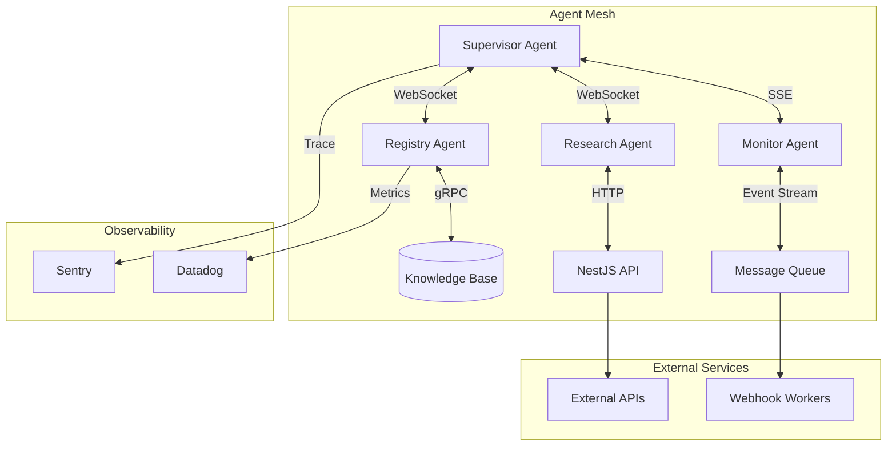
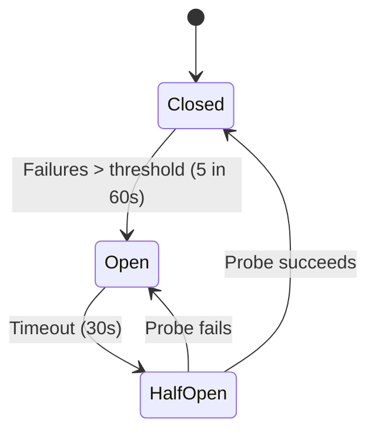

> **Status:** ?? Design Spec � forward-looking design, not yet implemented

# 🌐 Agent Networking — Inter-Agent Communication Mesh

> **Document:** `AGENT-NETWORKING.md` | **Version:** 1.0 | **Last Updated:** July 2026  
> **Status:** ?? Design Spec | **Owner:** Principal AI Architect | **Review Cadence:** Quarterly  
> **Related:** [AGENT-MARKETPLACE.md](./AGENT-MARKETPLACE.md) | [AGENT.md](./AGENT.md) | [18-AGENTS.md](./18-AGENTS.md) | [AGENT-INTERACTION-PROTOCOL.md](./AGENT-INTERACTION-PROTOCOL.md)

---

## Executive Summary

The Agent Networking layer provides a resilient, low-latency communication mesh for agent-to-agent and agent-to-service interactions across the enterprise. Built on WebSocket, SSE, and a lightweight service mesh, it supports synchronous RPC, asynchronous event streaming, and broadcast messaging with automatic discovery, circuit breaking, and configurable timeout/retry policies. Every message is authenticated, traced, and observable through the platform's existing Sentry and Datadog pipelines.

---

## 1. Communication Topology

### 1.1 Mesh Architecture



### 1.2 Transport Protocols

| Protocol          | Use Case                               | Latency | Reliability            | Persistence    |
| ----------------- | -------------------------------------- | ------- | ---------------------- | -------------- |
| **WebSocket**     | Bidirectional agent-to-agent commands  | < 5ms   | Automatic reconnect    | Session-scoped |
| **SSE**           | Server-to-agent event streams          | < 10ms  | Last-event-id replay   | None           |
| **gRPC**          | Agent-to-service high-throughput calls | < 2ms   | Deadline propagation   | None           |
| **HTTP/2**        | Agent-to-service REST interactions     | < 20ms  | Idempotency retry      | Stateless      |
| **Message Queue** | Durable async event dispatch           | < 50ms  | At-least-once delivery | Durable        |

---

## 2. Agent Discovery

### 2.1 Registry-Based Discovery

Agents register with the mesh at startup and are discoverable via the Agent Registry:

| Field          | Type     | Description                     |
| -------------- | -------- | ------------------------------- |
| `agent_id`     | string   | Unique agent identifier         |
| `capabilities` | string[] | Declared agent capabilities     |
| `endpoint`     | string   | WS/gRPC endpoint URI            |
| `health`       | string   | Health check URL                |
| `ttl_seconds`  | int      | Registration TTL (must refresh) |

### 2.2 Discovery Flow

```
Agent A Starts → Register with Registry → Heartbeat (every 30s)
Agent B Queries → "find agents with capability:X"
Registry Returns → [Agent A endpoint, Agent C endpoint]
Agent B Connects → WebSocket handshake to Agent A
```

---

## 3. Message Routing

### 3.1 Routing Table

| Message Type      | Source     | Destination       | Transport | Priority |
| ----------------- | ---------- | ----------------- | --------- | -------- |
| `command.execute` | Supervisor | Specialist        | WebSocket | High     |
| `query.knowledge` | Any Agent  | Knowledge Service | gRPC      | Medium   |
| `event.published` | Any Agent  | All Subscribers   | SSE       | Low      |
| `heartbeat`       | Any Agent  | Registry          | HTTP      | Low      |

### 3.2 Routing Rules

1. **Capability-based:** Messages are routed to agents that declare the required capability
2. **Topic-based:** Event subscriptions use pub/sub topics with wildcard support (`knowledge.*`)
3. **Priority queuing:** High-priority messages preempt low-priority in the mesh buffer
4. **Locality preference:** Co-located agents communicate via in-process bus before falling back to network

---

## 4. Timeout and Retry Policies

### 4.1 Default Configuration

| Operation Type    | Timeout | Retries | Backoff                  | Jitter    |
| ----------------- | ------- | ------- | ------------------------ | --------- |
| Command execution | 30s     | 3       | Exponential (1s, 2s, 4s) | ±100ms |
| Knowledge query   | 5s      | 2       | Linear (500ms)           | ±50ms  |
| Event publish     | 2s      | 0       | None                     | None      |
| Health check      | 3s      | 1       | Fixed (1s)               | None      |

### 4.2 Circuit Breaker States



| State         | Behavior                                         |
| ------------- | ------------------------------------------------ |
| **Closed**    | Normal operation; all requests pass              |
| **Open**      | Requests fail fast without attempting connection |
| **Half-Open** | Limited probe requests to test recovery          |

---

## 5. Security and Observability

### 5.1 Transport Security

| Layer          | Mechanism                                               |
| -------------- | ------------------------------------------------------- |
| Authentication | JWT per-agent tokens with mTLS                          |
| Encryption     | TLS 1.3 for all transports                              |
| Authorization  | Capability-based access control per message type        |
| Audit          | Every message logged to audit trail with correlation ID |

### 5.2 Observability

Every network hop emits:

- **Trace span** (via Sentry distributed tracing)
- **Metric** (message latency, throughput, error rate)
- **Structured log** (source, destination, message type, duration, status)

---

## 6. Related Documentation

| Document                                                         | Description                            |
| ---------------------------------------------------------------- | -------------------------------------- |
| [AGENT.md](./AGENT.md)                                           | Agent base architecture and lifecycle  |
| [18-AGENTS.md](./18-AGENTS.md)                                   | Multi-agent orchestration patterns     |
| [AGENT-MARKETPLACE.md](./AGENT-MARKETPLACE.md)                   | Marketplace distribution and packaging |
| [AGENT-INTERACTION-PROTOCOL.md](./AGENT-INTERACTION-PROTOCOL.md) | Message format specification           |
| [AGENT-SECURITY.md](../11-security/AGENT-SECURITY.md)            | Agent security model                   |

---

## Change Log

| Version | Date     | Changes                                | Author                 |
| ------- | -------- | -------------------------------------- | ---------------------- |
| 1.0     | Jul 2026 | Initial agent networking specification | Principal AI Architect |

## Cross-References

- [../MASTER-INDEX.md](../MASTER-INDEX.md) — Documentation master index
- [../26-reference/CROSS-REFERENCE-INDEX.md](../26-reference/CROSS-REFERENCE-INDEX.md) — Cross-reference system
