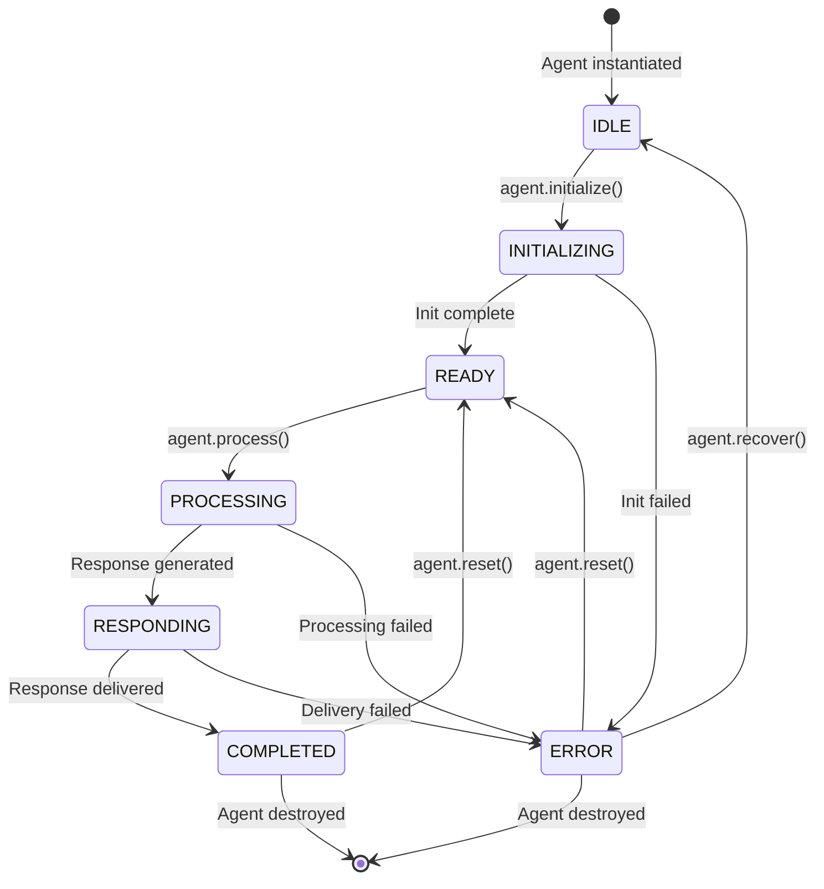
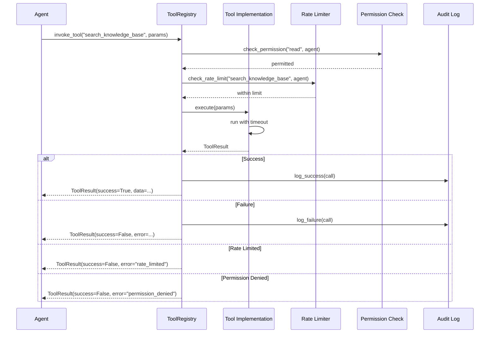
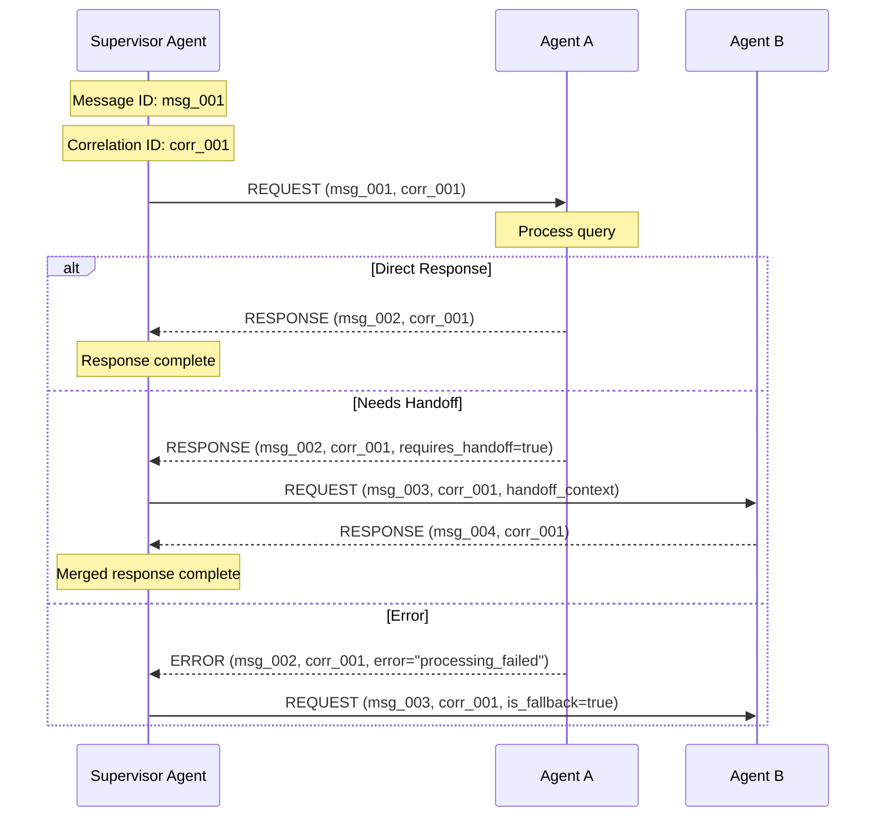
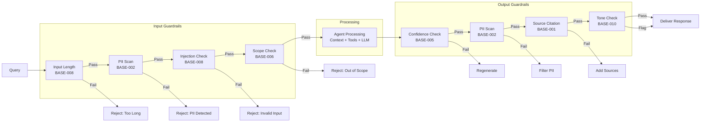
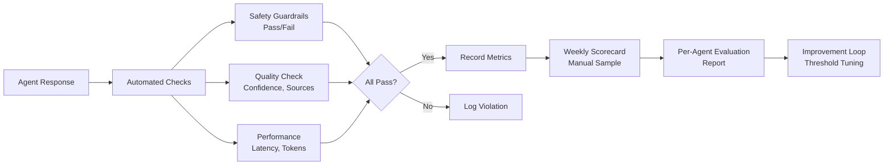

> **Status:** 📐 Design Spec — forward-looking design, not yet implemented
# Agent Base Architecture -- Enterprise-Grade Foundation for Multi-Agent System

> **Document:** `docs/ai/Agent.md` | **Version:** 1.0 | **Last Updated:** June 2026
> **Status:** Active | **Owner:** Chief AI Architect | **Review Cadence:** Monthly
> **Classification:** Enterprise Architecture | **Runtime:** FastAPI + LangChain
> **Design Pattern:** Abstract Base Class + Strategy Pattern | **Serialization:** Pydantic v2
> **Language:** Python 3.12+ | **Async Model:** asyncio

---

## Table of Contents

1. [Executive Summary](#1-executive-summary)
2. [Design Philosophy](#2-design-philosophy)
3. [Agent Anatomy](#3-agent-anatomy)
4. [Agent Lifecycle](#4-agent-lifecycle)
5. [Base Agent Interface](#5-base-agent-interface)
6. [Agent Configuration](#6-agent-configuration)
7. [Tool System](#7-tool-system)
8. [Agent Communication Protocol](#8-agent-communication-protocol)
9. [Agent Safety](#9-agent-safety)
10. [Agent Evaluation](#10-agent-evaluation)
11. [Agent Registry](#11-agent-registry)
12. [Agent Serialization](#12-agent-serialization)
13. [Agent Logging & Observability](#13-agent-logging--observability)
14. [Agent Error Handling](#14-agent-error-handling)
15. [Agent Testing Strategy](#15-agent-testing-strategy)
16. [Related Documents & References](#16-related-documents--references)

---

## 1. Executive Summary

### 1.1 Definition

An **Agent** in this portfolio system is a self-contained, specialized AI program that owns a single domain of knowledge, possesses a set of tools to interact with system resources, operates within defined safety guardrails, communicates with other agents through a standardized protocol, and tracks its own performance against measurable evaluation criteria.

Every agent in the multi-agent ecosystem is an instance of the `BaseAgent` abstract class defined in this document. This document establishes the **base architecture** -- the shared foundation, contract, and behavioral rules that every agent inherits, extends, and must comply with.

### 1.2 Scope

This document covers:

| Scope | Description | Out of Scope |
|-------|-------------|--------------|
| **Base class definition** | Abstract interface, properties, lifecycle | Concrete agent implementations (see `docs/ai/18-AGENTS.md`) |
| **Agent configuration** | YAML/JSON schema for agent definitions | Deployment configuration (see `docs/operations/DeploymentGuide.md`) |
| **Tool system** | Tool registration, invocation, permissions | Tool implementations specific to each agent |
| **Safety framework** | Base guardrails every agent inherits | Content-specific safety rules (see `docs/ai/18-AGENTS.md`) |
| **Communication protocol** | Message format, handoff, routing | Network-level messaging (see `docs/api/46-EVENT-ARCHITECTURE.md`) |
| **Evaluation framework** | Base metrics, scoring, reporting | Per-agent evaluation thresholds (see `docs/ai/18-AGENTS.md`) |

### 1.3 Core Principles

| Principle | Description | Implication |
|-----------|-------------|-------------|
| Single Responsibility | Each agent owns exactly one domain | Agent boundaries are never crossed |
| Explicit Contracts | All agent interfaces are typed and validated | Runtime errors are caught at boundaries |
| Fail Closed | On uncertainty, agents defer rather than guess | Safety is non-negotiable |
| Observable by Default | Every action is logged and measurable | Debugging is always possible |
| Composition over Inheritance | Agents compose tools and use strategies | Base class is lean, functionality is pluggable |

### 1.4 Relationship to Other Documents

| Document | Relationship |
|----------|-------------|
| `docs/ai/18-AGENTS.md` | Concrete agent implementations built on this base |
| `docs/ai/AgentMarketplace.md` | Agent discoverability, versioning, and distribution |
| `docs/ai/MemoryArchitecture.md` | Agent memory persistence layer (session, working, episodic) |
| `docs/ai/CommandSystem.md` | Command pattern used by agent tool invocations |
| `docs/design/08g-AI-ASSISTANT-ARCHITECTURE.md` | Higher-level AI assistant orchestration consuming agents |
| `docs/ai/17-AI_INSTRUCTIONS.md` | AI operating model and governance |
| `docs/ai/19-RAG.md` | RAG pipeline used by knowledge agents |
| `docs/api/46-EVENT-ARCHITECTURE.md` | Event-driven communication backbone |

---

## 2. Design Philosophy

### 2.1 Architectural Decisions

| Decision | Choice | Rationale | Alternatives Considered |
|----------|--------|-----------|------------------------|
| Base class pattern | Abstract base class with ABC | Clear contract enforcement, IDE support, type safety | Protocol classes (less enforcement), Duck typing (no contract) |
| Serialization | Pydantic v2 | Native JSON Schema, validation, FastAPI integration | dataclasses (no validation), attrs (less ecosystem) |
| Async execution | asyncio | Native Python async, LangChain compatibility | threading (GIL issues), multiprocessing (overhead) |
| Tool definition | Decorator-based registration | Declarative, self-documenting, runtime discoverable | Manual registration (error-prone), config file (brittle) |
| Configuration | YAML for definitions, JSON for instances | YAML is human-readable for definitions; JSON for runtime | TOML (less ecosystem), XML (verbose) |
| Communication | JSON over in-process message bus | Simple, debuggable, universal | Protobuf (overhead for in-process), Avro (schema registry needed) |

### 2.2 Agent Contract

Every agent that extends `BaseAgent` agrees to the following contract:

1. It will implement all abstract methods defined in the base interface.
2. It will declare a complete capability manifest.
3. It will register all tools it uses through the tool system.
4. It will respect all base guardrails and declare additional domain-specific guardrails.
5. It will track all required evaluation metrics.
6. It will never communicate with external systems outside its permitted scope.
7. It will handle all errors gracefully and never raise uncaught exceptions.
8. It will participate in the agent lifecycle state machine correctly.

### 2.3 Agent Taxonomy

Agents in this system fall into four categories:

| Category | Description | Examples |
|----------|-------------|----------|
| **Knowledge Agents** | Answer questions using RAG-retrieved context | Portfolio Agent, Resume Agent, Career Agent |
| **Content Agents** | Specialize in specific content types and narratives | Projects Agent, Blog Agent, Case Study Agent |
| **Operational Agents** | Perform system operations with write permissions | Lead Qualification Agent, Admin Agent, Analytics Agent |
| **Orchestration Agents** | Route, coordinate, and manage other agents | Supervisor Agent, Knowledge Agent |

---

## 3. Agent Anatomy

### 3.1 Base Class Structure

Every agent in the system inherits from `BaseAgent`. The base class defines the shared properties, abstract interface, lifecycle management, tool registration, safety enforcement, and evaluation tracking that every agent requires.

```python
import asyncio
import logging
from abc import ABC, abstractmethod
from datetime import datetime, timedelta
from enum import Enum, auto
from typing import Any, Generic, Optional, TypeVar

from pydantic import BaseModel, Field, ValidationError

logger = logging.getLogger(__name__)


class AgentStatus(Enum):
    IDLE = "idle"
    INITIALIZING = "initializing"
    READY = "ready"
    PROCESSING = "processing"
    RESPONDING = "responding"
    COMPLETED = "completed"
    ERROR = "error"


class AgentMetadata(BaseModel):
    name: str = Field(..., description="Unique agent identifier")
    version: str = Field(..., description="Semantic version")
    description: str = Field("", description="Human-readable description")
    owner: str = Field("system", description="Owner or team responsible")
    created_at: datetime = Field(default_factory=datetime.utcnow)
    updated_at: datetime = Field(default_factory=datetime.utcnow)
    tags: list[str] = Field(default_factory=list)
    category: str = Field("knowledge", description="knowledge | content | operational | orchestration")


class CapabilityManifest(BaseModel):
    agent_name: str
    version: str
    description: str
    capabilities: list[str]
    knowledge_sources: list[str] = Field(default_factory=list)
    input_constraints: dict[str, Any] = Field(default_factory=dict)
    output_formats: list[str] = Field(default_factory=lambda: ["text"])
    confidence_threshold: float = 0.7
    fallback_agent: str = "supervisor"
    max_query_length: int = 2000
    required_context: list[str] = Field(default_factory=list)


T = TypeVar("T")


class BaseAgent(ABC, Generic[T]):
    """Abstract base class for all agents in the portfolio multi-agent system.
    
    Every agent must:
    1. Implement all abstract methods
    2. Declare a capability manifest
    3. Register tools via decorators
    4. Respect base guardrails
    5. Track evaluation metrics
    6. Handle errors gracefully
    """

    def __init__(self, config: Optional[dict] = None):
        self.metadata: AgentMetadata = self._initialize_metadata()
        self.status: AgentStatus = AgentStatus.IDLE
        self.capability_manifest: CapabilityManifest = self._build_manifest()
        self.tools: dict[str, ToolDefinition] = {}
        self.guardrails: list[Guardrail] = []
        self.permissions: set[str] = set()
        self._state: dict[str, Any] = {}
        self._start_time: Optional[datetime] = None
        self._error_count: int = 0
        self._config: dict[str, Any] = config or {}
        self._register_base_tools()
        self._register_base_guardrails()

    @abstractmethod
    def _initialize_metadata(self) -> AgentMetadata:
        ...

    @abstractmethod
    def _build_manifest(self) -> CapabilityManifest:
        ...
```

### 3.2 Core Properties

| Property | Type | Description | Default | Required |
|----------|------|-------------|---------|----------|
| `metadata` | `AgentMetadata` | Identity, version, category, tags | Set by subclass | Yes |
| `status` | `AgentStatus` | Current lifecycle state | `IDLE` | System-managed |
| `capability_manifest` | `CapabilityManifest` | Declared capabilities for routing | Set by subclass | Yes |
| `tools` | `dict[str, ToolDefinition]` | Registered tools keyed by name | `{}` | Registered via decorator |
| `guardrails` | `list[Guardrail]` | Behavioral constraints | Base guardrails | Inherited + extended |
| `permissions` | `set[str]` | Permission strings for access control | `set()` | Declared by subclass |
| `_state` | `dict[str, Any]` | Private agent state during processing | `{}` | Internal |
| `_error_count` | `int` | Consecutive error counter | `0` | Internal |
| `_config` | `dict[str, Any]` | Runtime configuration overrides | `{}` | Optional |

### 3.3 Agent Capability Manifest

The capability manifest is the agent's public declaration of what it can do. It is used by the Supervisor Agent for routing decisions and by the Agent Registry for discovery.

```python
# Example manifest for a portfolio agent
portfolio_manifest = CapabilityManifest(
    agent_name="portfolio_agent",
    version="1.0.0",
    description="Answers general questions about the portfolio owner's skills, tech stack, and experience",
    capabilities=[
        "answer_portfolio_overview",
        "explain_skill_proficiency",
        "describe_tech_stack",
        "summarize_experience",
        "provide_availability_info",
    ],
    knowledge_sources=["projects", "skills", "about", "experience"],
    input_constraints={
        "max_query_length": 2000,
        "required_context": ["visitor_type"],
    },
    output_formats=["text", "structured_data"],
    confidence_threshold=0.7,
    fallback_agent="supervisor",
)
```

### 3.4 Agent Properties Table

| Property | Type | Description | Set By |
|----------|------|-------------|--------|
| `name` | `str` | Unique identifier (e.g., `portfolio_agent`) | Subclass |
| `version` | `str` | Semantic version (e.g., `1.2.3`) | Subclass |
| `description` | `str` | Human-readable purpose statement | Subclass |
| `category` | `str` | Agent category for routing heuristics | Subclass |
| `capabilities` | `list[str]` | What the agent can do (used by Supervisor) | Subclass |
| `tools` | `dict[str, ToolDefinition]` | Registered tools | Registration |
| `guardrails` | `list[Guardrail]` | Safety constraints | Base + subclass |
| `permissions` | `set[str]` | Authorized operations | Subclass |
| `memory_config` | `MemoryConfig` | How agent stores and retrieves context | Subclass |
| `evaluation_metrics` | `dict[str, MetricDefinition]` | Success criteria | Subclass |
| `status` | `AgentStatus` | Current lifecycle state | System |
| `knowledge_sources` | `list[str]` | RAG sources the agent queries | Subclass |
| `confidence_threshold` | `float` | Minimum confidence to serve response | Subclass |
| `fallback_agent` | `str` | Agent to route to on failure | Subclass |

### 3.5 Agent Registry Entry

Each agent, when registered with the system, produces a registry entry:

```json
{
  "name": "portfolio_agent",
  "version": "1.0.0",
  "description": "Answers general questions about the portfolio owner",
  "category": "knowledge",
  "capabilities": [
    "answer_portfolio_overview",
    "explain_skill_proficiency",
    "describe_tech_stack",
    "summarize_experience",
    "provide_availability_info"
  ],
  "knowledge_sources": ["projects", "skills", "about", "experience"],
  "tools": ["get_portfolio_summary", "get_skills_by_category", "search_knowledge_base"],
  "guardrails": ["PORT-001", "PORT-002", "PORT-003", "PORT-004", "PORT-005"],
  "permissions": ["read:projects", "read:skills", "read:about"],
  "status": "ready",
  "health_score": 0.98,
  "last_active": "2026-06-18T10:30:00Z"
}
```

---

## 4. Agent Lifecycle

### 4.1 State Machine

Every agent transitions through a well-defined lifecycle state machine. The base class manages state transitions and enforces valid transitions.



### 4.2 State Definitions

| State | Description | Allowed Entry | Duration Limit | Exit Actions |
|-------|-------------|---------------|----------------|--------------|
| `IDLE` | Agent instantiated, no work pending | Construction, recovery | Unlimited | None |
| `INITIALIZING` | Agent loading config, registering tools, warming caches | `initialize()` call | 30 seconds | Timeout triggers `ERROR` |
| `READY` | Agent fully initialized, awaiting work | Successful init, reset | Unlimited | None |
| `PROCESSING` | Actively processing a query or task | `process()` call | 60 seconds (configurable) | Timeout triggers fallback |
| `RESPONDING` | Response generated, being validated and delivered | Processing complete | 10 seconds | Delivery failure triggers `ERROR` |
| `COMPLETED` | Response successfully delivered | Successful response | Unlimited | Reset or destroy |
| `ERROR` | Unrecoverable error occurred | Any state on failure | 5 minutes auto-recovery | Circuit breaker opens |

### 4.3 State Transition Logic

```python
class BaseAgent(ABC, Generic[T]):

    async def initialize(self) -> None:
        """Initialize the agent. Load config, register tools, warm caches."""
        self._transition(AgentStatus.INITIALIZING)
        try:
            async with asyncio.timeout(30):
                await self._load_configuration()
                self._register_base_tools()
                self._register_base_guardrails()
                await self._on_initialize()
                self._transition(AgentStatus.READY)
                logger.info(f"Agent {self.metadata.name} initialized in READY state")
        except asyncio.TimeoutError:
            self._transition(AgentStatus.ERROR)
            logger.error(f"Agent {self.metadata.name} initialization timed out")
            raise AgentInitializationError(f"Init timed out for {self.metadata.name}")
        except Exception as e:
            self._transition(AgentStatus.ERROR)
            logger.error(f"Agent {self.metadata.name} initialization failed: {e}")
            raise AgentInitializationError(f"Init failed for {self.metadata.name}: {e}") from e

    async def process(self, query: str, context: AgentContext) -> AgentResponse:
        """Process a query. Main entry point for agent execution."""
        if self.status != AgentStatus.READY:
            raise AgentStateError(f"Cannot process in state {self.status.value}")
        
        self._transition(AgentStatus.PROCESSING)
        self._start_time = datetime.utcnow()
        
        try:
            async with asyncio.timeout(self._get_timeout()):
                response = await self._execute(query, context)
                self._transition(AgentStatus.RESPONDING)
                validated = await self._validate_response(response)
                self._transition(AgentStatus.COMPLETED)
                return validated
        except asyncio.TimeoutError:
            self._transition(AgentStatus.ERROR)
            self._error_count += 1
            logger.warning(f"Agent {self.metadata.name} processing timed out")
            return AgentResponse(
                message="Processing timeout. Please try again.",
                is_confident=False,
                agent_name=self.metadata.name,
                error_code="TIMEOUT",
            )
        except Exception as e:
            self._transition(AgentStatus.ERROR)
            self._error_count += 1
            logger.error(f"Agent {self.metadata.name} processing error: {e}")
            return AgentResponse(
                message="An error occurred while processing your request.",
                is_confident=False,
                agent_name=self.metadata.name,
                error_code="PROCESSING_ERROR",
            )

    def _transition(self, target: AgentStatus) -> None:
        """Validate and perform state transition."""
        valid = self._is_valid_transition(self.status, target)
        if not valid:
            raise AgentStateError(
                f"Invalid transition: {self.status.value} -> {target.value}"
            )
        old_status = self.status
        self.status = target
        logger.debug(f"Agent {self.metadata.name}: {old_status.value} -> {target.value}")
        self._on_state_change(old_status, target)

    @staticmethod
    def _is_valid_transition(current: AgentStatus, target: AgentStatus) -> bool:
        transitions = {
            AgentStatus.IDLE: {AgentStatus.INITIALIZING, AgentStatus.ERROR},
            AgentStatus.INITIALIZING: {AgentStatus.READY, AgentStatus.ERROR},
            AgentStatus.READY: {AgentStatus.PROCESSING, AgentStatus.ERROR},
            AgentStatus.PROCESSING: {AgentStatus.RESPONDING, AgentStatus.ERROR},
            AgentStatus.RESPONDING: {AgentStatus.COMPLETED, AgentStatus.ERROR},
            AgentStatus.COMPLETED: {AgentStatus.READY},
            AgentStatus.ERROR: {AgentStatus.IDLE, AgentStatus.READY},
        }
        return target in transitions.get(current, set())

    def _on_state_change(self, old: AgentStatus, new: AgentStatus) -> None:
        """Hook for subclasses to react to state changes."""
        pass

    async def reset(self) -> None:
        """Reset agent to READY state."""
        self._state.clear()
        self._error_count = 0
        self._transition(AgentStatus.READY)

    async def recover(self) -> None:
        """Recover from error state back to IDLE."""
        if self.status != AgentStatus.ERROR:
            raise AgentStateError(f"Cannot recover from {self.status.value}")
        self._error_count = 0
        self._state.clear()
        self._transition(AgentStatus.IDLE)
```

### 4.4 Valid Transition Matrix

| Current \ Target | IDLE | INIT | READY | PROC | RESP | COMP | ERROR |
|------------------|------|------|-------|------|------|------|-------|
| **IDLE** | - | Yes | - | - | - | - | Yes |
| **INITIALIZING** | - | - | Yes | - | - | - | Yes |
| **READY** | - | - | - | Yes | - | - | Yes |
| **PROCESSING** | - | - | - | - | Yes | - | Yes |
| **RESPONDING** | - | - | - | - | - | Yes | Yes |
| **COMPLETED** | - | - | Yes | - | - | - | - |
| **ERROR** | Yes | - | Yes | - | - | - | - |

### 4.5 Lifecycle Hooks

Subclasses can override the following lifecycle hooks:

```python
class BaseAgent(ABC, Generic[T]):

    async def _on_initialize(self) -> None:
        """Hook for subclass initialization logic.
        Called after base initialization. Subclasses should:
        - Register additional tools
        - Add domain-specific guardrails
        - Warm caches or preload data
        - Validate configuration
        """

    async def _on_state_change(self, old: AgentStatus, new: AgentStatus) -> None:
        """Hook for reacting to state transitions.
        Useful for telemetry, logging, or resource management.
        """

    async def _on_error(self, error: Exception, context: dict[str, Any]) -> None:
        """Hook for custom error handling.
        Called when an error transitions the agent to ERROR state.
        """

    async def _on_shutdown(self) -> None:
        """Hook for cleanup when agent is being destroyed.
        Subclasses should release resources, close connections, flush logs.
        """
```

---

## 5. Base Agent Interface

### 5.1 Abstract Methods

Every agent must implement the following abstract methods:

```python
class BaseAgent(ABC, Generic[T]):

    @abstractmethod
    async def can_handle(self, query: str) -> tuple[bool, float]:
        """Determine if this agent can handle a query.
        
        Args:
            query: The visitor's question or request text.
        
        Returns:
            Tuple of (can_handle: bool, confidence: float).
            Confidence is 0.0 to 1.0 indicating how well the agent matches.
        """
        ...

    @abstractmethod
    async def _execute(self, query: str, context: AgentContext) -> AgentResponse:
        """Process a query and return a response.
        
        This is the core processing method. Subclasses implement their
        domain-specific logic here, including RAG retrieval, tool calls,
        and response generation.
        
        Args:
            query: The visitor's question or request text.
            context: Full agent context including conversation history,
                    page context, visitor information.
        
        Returns:
            AgentResponse containing the response text, confidence, sources.
        """
        ...

    @abstractmethod
    async def handoff(
        self, target_agent: str, context: AgentContext, reason: str
    ) -> AgentResponse:
        """Hand off processing to another agent with full context.
        
        Args:
            target_agent: Name of the agent to hand off to.
            context: Full context including conversation state.
            reason: Human-readable reason for the handoff.
        
        Returns:
            Response from the target agent.
        """
        ...

    @abstractmethod
    async def validate_response(self, response: AgentResponse) -> AgentResponse:
        """Validate an agent response before delivery.
        
        Checks include:
        - Safety guardrail compliance
        - Confidence threshold
        - Source citation validity
        - Response format correctness
        - PII/content filter pass
        
        Args:
            response: The agent response to validate.
        
        Returns:
            Validated response (possibly modified) or raises ValidationError.
        """
        ...
```

### 5.2 Abstract Method Contract

| Method | Returns | When Called | Error Behavior |
|--------|---------|-------------|----------------|
| `can_handle(query)` | `tuple[bool, float]` | During Supervisor routing | Return `(False, 0.0)`, do not raise |
| `_execute(query, context)` | `AgentResponse` | During `process()` | Catch internally, return error response |
| `handoff(target, context, reason)` | `AgentResponse` | When agent cannot answer | Route through Supervisor, never direct |
| `validate_response(response)` | `AgentResponse` | After generation, before delivery | Raise `ValidationError` on failure |

### 5.3 Input/Output Models

```python
class AgentContext(BaseModel):
    """Full context passed to an agent for processing."""
    conversation_id: str
    visitor_id: str
    query: str
    page_context: str = ""
    visitor_type: str = "unknown"
    conversation_history: list[dict] = Field(default_factory=list)
    metadata: dict[str, Any] = Field(default_factory=dict)
    rag_chunks: list[dict] = Field(default_factory=list)
    session_start: datetime = Field(default_factory=datetime.utcnow)


class AgentResponse(BaseModel):
    """Standardized response from any agent."""
    message: str
    is_confident: bool = True
    confidence_score: float = 0.0
    agent_name: str
    sources: list[dict] = Field(default_factory=list)
    requires_handoff: bool = False
    handoff_reason: str = ""
    suggested_followups: list[str] = Field(default_factory=list)
    structured_data: Optional[dict] = None
    error_code: str = ""
    latency_ms: float = 0.0
    tokens_used: int = 0
    cost_cents: float = 0.0


class HandoffRequest(BaseModel):
    """Request to hand off processing to another agent."""
    source_agent: str
    target_agent: str
    query: str
    context: AgentContext
    reason: str
    confidence: float = 0.0
    timestamp: datetime = Field(default_factory=datetime.utcnow)
```

### 5.4 AgentExecutionResult

```python
class AgentExecutionResult(BaseModel):
    """Complete execution trace for an agent call."""
    agent_name: str
    query: str
    response: AgentResponse
    status: AgentStatus
    state_transitions: list[tuple[AgentStatus, AgentStatus, datetime]]
    tools_called: list[dict]
    guardrails_checked: list[GuardrailResult]
    total_latency_ms: float
    error: Optional[str] = None
    timestamp: datetime = Field(default_factory=datetime.utcnow)
```

---

## 6. Agent Configuration

### 6.1 Configuration Schema

Agents are configured via a standardized YAML schema. The schema defines what an agent is, what it can do, and how it behaves.

```yaml
# Example: config/agents/portfolio_agent.yaml
agent:
  name: portfolio_agent
  version: "1.0.0"
  description: "Answers general questions about the portfolio owner"
  category: knowledge
  
  metadata:
    owner: "ai-platform-team"
    tags: ["portfolio", "general", "primary"]
    created_at: "2026-06-01T00:00:00Z"
  
  capabilities:
    - answer_portfolio_overview
    - explain_skill_proficiency
    - describe_tech_stack
    - summarise_experience
    - provide_availability_info
  
  knowledge_sources:
    - projects
    - skills
    - about
    - experience
    - services
  
  tools:
    - name: get_portfolio_summary
      description: "Get pre-computed portfolio summary"
      permission_level: read
      rate_limit: 100
      timeout_ms: 2000
    - name: get_skills_by_category
      description: "Get skills grouped by category"
      permission_level: read
      rate_limit: 100
      timeout_ms: 2000
    - name: get_availability_status
      description: "Get current availability"
      permission_level: read
      rate_limit: 60
      timeout_ms: 1000
    - name: search_knowledge_base
      description: "Search RAG knowledge base"
      permission_level: read
      rate_limit: 100
      timeout_ms: 5000
  
  input_constraints:
    max_query_length: 2000
    required_context:
      - visitor_type
  
  output_formats:
    - text
    - structured_data
  
  confidence_threshold: 0.7
  fallback_agent: supervisor
  
  model:
    primary: gpt-4
    fallback: claude-sonnet-4
    temperature: 0.7
    max_tokens: 500
  
  guardrails:
    - id: PORT-001
      description: "Only answer from indexed knowledge sources"
      severity: critical
    - id: PORT-002
      description: "Never share email, phone, or address"
      severity: critical
    - id: PORT-003
      description: "Never quote prices"
      severity: high
  
  permissions:
    - "read:projects"
    - "read:skills"
    - "read:about"
    - "read:experience"
    - "read:services"
  
  memory:
    session_turns: 5
    persist_messages: false
  
  evaluation:
    metrics:
      - name: answer_accuracy
        target: 0.95
        weight: 0.4
      - name: latency_p95_ms
        target: 2000
        weight: 0.2
      - name: safety_compliance
        target: 1.0
        weight: 0.3
      - name: user_satisfaction
        target: 4.0
        weight: 0.1
```

### 6.2 JSON Schema (Validation)

```json
{
  "$schema": "https://json-schema.org/draft/2020-12/schema",
  "title": "AgentConfiguration",
  "description": "Schema for validating agent configuration files",
  "type": "object",
  "required": ["agent"],
  "properties": {
    "agent": {
      "type": "object",
      "required": ["name", "version", "description", "category"],
      "properties": {
        "name": {
          "type": "string",
          "pattern": "^[a-z][a-z0-9_]*$",
          "description": "Unique agent identifier (lowercase snake_case)"
        },
        "version": {
          "type": "string",
          "pattern": "^\\d+\\.\\d+\\.\\d+$",
          "description": "Semantic version"
        },
        "description": {
          "type": "string",
          "maxLength": 500
        },
        "category": {
          "type": "string",
          "enum": ["knowledge", "content", "operational", "orchestration"]
        },
        "capabilities": {
          "type": "array",
          "items": {"type": "string"},
          "minItems": 1
        },
        "tools": {
          "type": "array",
          "items": {"$ref": "#/$defs/ToolConfig"}
        },
        "guardrails": {
          "type": "array",
          "items": {"$ref": "#/$defs/GuardrailConfig"}
        },
        "permissions": {
          "type": "array",
          "items": {"type": "string"}
        },
        "confidence_threshold": {
          "type": "number",
          "minimum": 0,
          "maximum": 1,
          "default": 0.7
        },
        "fallback_agent": {
          "type": "string",
          "default": "supervisor"
        }
      }
    }
  },
  "$defs": {
    "ToolConfig": {
      "type": "object",
      "required": ["name", "description", "permission_level"],
      "properties": {
        "name": {"type": "string"},
        "description": {"type": "string"},
        "permission_level": {
          "type": "string",
          "enum": ["read", "write", "admin"]
        },
        "rate_limit": {"type": "integer", "minimum": 1},
        "timeout_ms": {"type": "integer", "minimum": 100}
      }
    },
    "GuardrailConfig": {
      "type": "object",
      "required": ["id", "description", "severity"],
      "properties": {
        "id": {"type": "string"},
        "description": {"type": "string"},
        "severity": {
          "type": "string",
          "enum": ["critical", "high", "medium", "low"]
        }
      }
    }
  }
}
```

### 6.3 Configuration Loading

```python
import json
import yaml
from pathlib import Path


class AgentConfigLoader:
    """Loads and validates agent configuration from YAML/JSON files."""

    def __init__(self, config_dir: str = "config/agents"):
        self.config_dir = Path(config_dir)
        self._schema = self._load_schema()

    def _load_schema(self) -> dict:
        schema_path = Path(__file__).parent / "agent_config_schema.json"
        with open(schema_path) as f:
            return json.load(f)

    def load(self, agent_name: str) -> dict:
        """Load configuration for a specific agent."""
        for ext in ["yaml", "yml", "json"]:
            path = self.config_dir / f"{agent_name}.{ext}"
            if path.exists():
                return self._load_file(path)
        raise FileNotFoundError(
            f"Configuration not found for agent '{agent_name}' "
            f"in {self.config_dir}"
        )

    def _load_file(self, path: Path) -> dict:
        with open(path) as f:
            if path.suffix in (".yaml", ".yml"):
                config = yaml.safe_load(f)
            else:
                config = json.load(f)
        self._validate(config)
        return config

    def _validate(self, config: dict) -> None:
        """Validate config against JSON Schema."""
        from jsonschema import validate
        validate(instance=config, schema=self._schema)

    def list_agents(self) -> list[str]:
        """List all available agent configurations."""
        agents = []
        for ext in ["yaml", "yml", "json"]:
            for path in self.config_dir.glob(f"*.{ext}"):
                agents.append(path.stem)
        return sorted(agents)
```

### 6.4 Configuration Parameters

| Parameter | Type | Default | Description | Required |
|-----------|------|---------|-------------|----------|
| `agent.name` | `string` | - | Unique snake_case identifier | Yes |
| `agent.version` | `string` | - | Semantic version | Yes |
| `agent.description` | `string` | - | Human-readable purpose | Yes |
| `agent.category` | `enum` | - | `knowledge`, `content`, `operational`, `orchestration` | Yes |
| `agent.capabilities` | `array` | `[]` | List of capability identifiers | Yes |
| `agent.knowledge_sources` | `array` | `[]` | RAG source names | No |
| `agent.tools` | `array` | `[]` | Tool definitions | No |
| `agent.guardrails` | `array` | `[]` | Domain-specific guardrails | No |
| `agent.permissions` | `array` | `[]` | Permission strings | No |
| `agent.confidence_threshold` | `number` | `0.7` | Minimum confidence (0-1) | No |
| `agent.fallback_agent` | `string` | `supervisor` | Fallback routing target | No |
| `agent.model.primary` | `string` | - | Primary LLM model ID | No |
| `agent.model.fallback` | `string` | - | Fallback LLM model ID | No |
| `agent.model.temperature` | `number` | `0.7` | LLM temperature | No |
| `agent.model.max_tokens` | `integer` | `500` | Max output tokens | No |
| `agent.memory.session_turns` | `integer` | `5` | Turns kept in context | No |
| `agent.memory.persist_messages` | `boolean` | `false` | Persist to database | No |
| `agent.evaluation.metrics` | `array` | `[]` | Evaluation metric definitions | No |

### 6.5 Environment Variable Overrides

Configuration values can be overridden at runtime via environment variables:

| Environment Variable | Overrides | Example |
|---------------------|-----------|---------|
| `AGENT_{NAME}_CONFIDENCE_THRESHOLD` | `confidence_threshold` | `AGENT_PORTFOLIO_CONFIDENCE_THRESHOLD=0.8` |
| `AGENT_{NAME}_PRIMARY_MODEL` | `model.primary` | `AGENT_PORTFOLIO_PRIMARY_MODEL=gpt-4o` |
| `AGENT_{NAME}_TIMEOUT_MS` | Processing timeout | `AGENT_PORTFOLIO_TIMEOUT_MS=10000` |
| `AGENT_{NAME}_ENABLED` | Enable/disable agent | `AGENT_PORTFOLIO_ENABLED=true` |
| `AGENT_CONFIG_DIR` | Config directory | `AGENT_CONFIG_DIR=/etc/agents` |

---

## 7. Tool System

### 7.1 Tool Definition

A tool is a discrete, reusable capability that an agent can invoke. Tools are the primary mechanism for agents to interact with system resources, databases, external APIs, and the RAG pipeline.

```python
from dataclasses import dataclass, field
from enum import Enum


class PermissionLevel(Enum):
    READ = "read"
    WRITE = "write"
    ADMIN = "admin"


@dataclass
class ToolDefinition:
    """Definition of a tool available to an agent."""
    name: str
    description: str
    parameters: dict = field(default_factory=dict)
    permission_level: PermissionLevel = PermissionLevel.READ
    rate_limit: int = 100
    timeout_ms: int = 5000
    cost_per_call: float = 0.0
    enabled: bool = True
    category: str = "general"


@dataclass
class ToolCall:
    """Record of a tool invocation."""
    tool_name: str
    agent_name: str
    parameters: dict
    result: Any = None
    error: Optional[str] = None
    start_time: datetime = field(default_factory=datetime.utcnow)
    end_time: Optional[datetime] = None
    duration_ms: float = 0.0
    success: bool = True


@dataclass
class ToolResult:
    """Standardized result from a tool execution."""
    success: bool
    data: Any = None
    error: Optional[str] = None
    metadata: dict = field(default_factory=dict)
```

### 7.2 Tool Registration

Tools are registered using a decorator pattern that makes registration declarative and self-documenting.

```python
import functools
from typing import Callable, Coroutine


class ToolRegistry:
    """Registry for agent tools. Supports asynchronous registration and invocation."""

    def __init__(self):
        self._tools: dict[str, ToolDefinition] = {}
        self._implementations: dict[str, Callable] = {}
        self._call_history: list[ToolCall] = []

    def register(
        self,
        name: str,
        description: str,
        permission_level: PermissionLevel = PermissionLevel.READ,
        rate_limit: int = 100,
        timeout_ms: int = 5000,
    ) -> Callable:
        """Decorator to register a tool with the agent."""
        def decorator(func: Callable) -> Callable:
            definition = ToolDefinition(
                name=name,
                description=description,
                permission_level=permission_level,
                rate_limit=rate_limit,
                timeout_ms=timeout_ms,
                parameters=self._extract_parameters(func),
            )
            self._tools[name] = definition
            self._implementations[name] = func

            @functools.wraps(func)
            async def wrapper(*args, **kwargs) -> ToolResult:
                call = ToolCall(
                    tool_name=name,
                    agent_name=kwargs.get("agent_name", "unknown"),
                    parameters=kwargs,
                )
                try:
                    if not definition.enabled:
                        raise ToolDisabledError(f"Tool '{name}' is disabled")
                    result = await func(*args, **kwargs)
                    call.success = True
                    call.result = result
                    return ToolResult(success=True, data=result)
                except Exception as e:
                    call.success = False
                    call.error = str(e)
                    return ToolResult(success=False, error=str(e))
                finally:
                    call.end_time = datetime.utcnow()
                    call.duration_ms = (
                        call.end_time - call.start_time
                    ).total_seconds() * 1000
                    self._call_history.append(call)

            return wrapper
        return decorator

    def _extract_parameters(self, func: Callable) -> dict:
        """Extract parameter schema from function signature."""
        import inspect
        sig = inspect.signature(func)
        params = {}
        for name, param in sig.parameters.items():
            if name in ("self", "cls", "agent_name"):
                continue
            param_info = {"name": name}
            if param.annotation != inspect.Parameter.empty:
                param_info["type"] = str(param.annotation)
            if param.default != inspect.Parameter.empty:
                param_info["default"] = param.default
            params[name] = param_info
        return params

    def get_tool(self, name: str) -> ToolDefinition:
        if name not in self._tools:
            raise ToolNotFoundError(f"Tool '{name}' not found in registry")
        return self._tools[name]

    def list_tools(self) -> list[ToolDefinition]:
        return list(self._tools.values())

    def get_call_history(self, limit: int = 100) -> list[ToolCall]:
        return self._call_history[-limit:]
```

### 7.3 Usage in an Agent

```python
class PortfolioAgent(BaseAgent):

    def __init__(self, config: Optional[dict] = None):
        super().__init__(config)
        self.tool_registry = ToolRegistry()

    def _register_base_tools(self):
        super()._register_base_tools()

        @self.tool_registry.register(
            name="get_portfolio_summary",
            description="Get pre-computed portfolio summary",
            permission_level=PermissionLevel.READ,
            rate_limit=100,
            timeout_ms=2000,
        )
        async def get_portfolio_summary(agent_name: str = "") -> dict:
            return await self._db.fetch_one("SELECT summary FROM portfolio_summary LIMIT 1")

        @self.tool_registry.register(
            name="search_knowledge_base",
            description="Search RAG knowledge base for relevant chunks",
            permission_level=PermissionLevel.READ,
            rate_limit=100,
            timeout_ms=5000,
        )
        async def search_knowledge_base(
            query: str,
            top_k: int = 3,
            threshold: float = 0.7,
            agent_name: str = "",
        ) -> list[dict]:
            return await self._rag_service.retrieve(query, top_k=top_k, threshold=threshold)

    async def _execute(self, query: str, context: AgentContext) -> AgentResponse:
        # Use registered tools
        summary = await self.tool_registry.get_implementation("get_portfolio_summary")()
        chunks = await self.tool_registry.get_implementation("search_knowledge_base")(
            query=query, top_k=3
        )
        # ... generate response
```

### 7.4 Tool Permission Model

| Permission Level | Description | Examples | Guardrail |
|-----------------|-------------|----------|-----------|
| `read` | Read-only data access | Query database, read cache, search knowledge base | Cannot modify any state |
| `write` | Create or modify data | Create leads, update settings, send notifications | Requires audit logging |
| `admin` | System-level operations | Invalidate caches, trigger reindex, modify config | Requires auth + audit |

### 7.5 Tool Execution Flow



### 7.6 Built-in Base Tools

All agents inherit these base tools automatically:

| Tool | Description | Permission | Rate Limit | Timeout |
|------|-------------|------------|------------|---------|
| `get_agent_info` | Return agent metadata and capabilities | `read` | 1000/min | 500ms |
| `check_health` | Return agent health status | `read` | 1000/min | 500ms |
| `get_state` | Return current agent state (non-private) | `read` | 100/min | 500ms |
| `list_tools` | List all registered tools | `read` | 100/min | 500ms |

### 7.7 Tool Error Handling

| Error | Code | Description | Recovery |
|-------|------|-------------|----------|
| Tool not found | `TOOL_NOT_FOUND` | Requested tool is not registered | Log error, return failure |
| Tool disabled | `TOOL_DISABLED` | Tool exists but is disabled | Return failure, alert admin |
| Permission denied | `PERMISSION_DENIED` | Agent lacks required permission | Return failure, log incident |
| Rate limited | `RATE_LIMITED` | Exceeded rate limit for tool | Retry with backoff |
| Timeout | `TIMEOUT` | Tool execution exceeded timeout | Return failure, circuit breaker |
| Execution error | `EXECUTION_ERROR` | Tool implementation raised exception | Log error, return failure |

---

## 8. Agent Communication Protocol

### 8.1 Message Format

All inter-agent communication uses a standardized JSON message format. Messages are passed through an in-process message bus or a message queue for cross-process communication.

```python
from enum import Enum
from pydantic import BaseModel, Field


class MessageType(Enum):
    REQUEST = "request"
    RESPONSE = "response"
    HANDSHAKE = "handshake"
    HANDSHAKE_ACK = "handshake_ack"
    HEARTBEAT = "heartbeat"
    ERROR = "error"
    CANCEL = "cancel"


class MessagePriority(Enum):
    LOW = "low"
    NORMAL = "normal"
    HIGH = "high"
    CRITICAL = "critical"


class AgentMessage(BaseModel):
    """Universal message format for inter-agent communication."""
    message_id: str
    source_agent: str
    target_agent: str
    message_type: MessageType = MessageType.REQUEST
    correlation_id: str = ""
    timestamp: datetime = Field(default_factory=datetime.utcnow)
    payload: dict = Field(default_factory=dict)
    metadata: dict = Field(default_factory=dict)
    priority: MessagePriority = MessagePriority.NORMAL
    ttl_seconds: int = 30


class AgentResponseMessage(BaseModel):
    """Response message from an agent."""
    message_id: str
    correlation_id: str
    source_agent: str
    target_agent: str
    message_type: MessageType = MessageType.RESPONSE
    timestamp: datetime = Field(default_factory=datetime.utcnow)
    payload: dict = Field(default_factory=dict)
    metadata: dict = Field(default_factory=dict)
    success: bool = True
    error: Optional[str] = None
```

### 8.2 Message Flow



### 8.3 Payload Schemas

```python
# Request payload for a processing query
REQUEST_PAYLOAD_EXAMPLE = {
    "query": "What technologies do you use?",
    "context": {
        "conversation_id": "conv_abc123",
        "visitor_id": "vis_xyz789",
        "page_context": "/projects",
        "visitor_type": "recruiter",
        "conversation_history": [
            {"role": "user", "content": "Hello"},
            {"role": "assistant", "content": "Hi! How can I help?"},
        ],
    },
    "parameters": {
        "temperature": 0.7,
        "max_tokens": 500,
    },
}

# Response payload
RESPONSE_PAYLOAD_EXAMPLE = {
    "response": "Based on their portfolio, they specialize in React, Node.js, and TypeScript.",
    "is_confident": True,
    "confidence_score": 0.92,
    "sources": [
        {"source": "skills", "title": "React", "similarity": 0.89},
        {"source": "projects", "title": "E-Commerce Platform", "similarity": 0.85},
    ],
    "requires_handoff": False,
    "handoff_reason": None,
    "suggested_followups": [
        "Tell me about a specific project",
        "What's their experience level?",
    ],
}

# Handoff request payload
HANDOFF_PAYLOAD_EXAMPLE = {
    "reason": "Query requires project-specific knowledge",
    "original_query": "How did you implement the payment system?",
    "context": {
        "conversation_id": "conv_abc123",
        "visitor_id": "vis_xyz789",
        "conversation_history": [...],
    },
    "source_agent_notes": "Visitor is asking about technical implementation details",
}
```

### 8.4 Communication Rules

| Rule | ID | Description | Enforcement |
|------|----|-------------|-------------|
| Supervisor Hub | COMM-001 | All inter-agent communication goes through Supervisor | Message bus routing rules |
| Full Context Transfer | COMM-002 | Handoffs include complete conversation context | Schema validation on handoff |
| Correlation ID | COMM-003 | Every message chain has a unique correlation ID | Auto-generated on first message |
| Timeout Enforcement | COMM-004 | Agent processing must complete within configured timeout | asyncio timeout wrapper |
| Retry with Backoff | COMM-005 | Transient failures retry with exponential backoff | Circuit breaker pattern |
| Idempotent Messages | COMM-006 | Repeated messages with same ID produce same result | Dedup by message_id |
| Priority Queuing | COMM-007 | Lead-related messages get priority over informational | Priority field in message |
| Message Validation | COMM-008 | All messages validated against schema on send/receive | Pydantic validation |
| TTL Enforcement | COMM-009 | Messages expire after TTL and are dropped | Timestamp check on receive |
| Audit Trail | COMM-010 | All inter-agent messages logged for traceability | Structured logging |

### 8.5 Message Bus

```python
class MessageBus:
    """In-process message bus for inter-agent communication."""

    def __init__(self):
        self._handlers: dict[str, list[Callable]] = {}
        self._message_log: list[AgentMessage] = []

    def subscribe(self, agent_name: str, handler: Callable) -> None:
        """Subscribe an agent to receive messages."""
        if agent_name not in self._handlers:
            self._handlers[agent_name] = []
        self._handlers[agent_name].append(handler)

    def unsubscribe(self, agent_name: str, handler: Callable) -> None:
        """Unsubscribe an agent from receiving messages."""
        if agent_name in self._handlers:
            self._handlers[agent_name].remove(handler)

    async def publish(self, message: AgentMessage) -> None:
        """Publish a message to the target agent."""
        self._validate_message(message)
        self._message_log.append(message)

        if message.message_type == MessageType.REQUEST:
            logger.info(
                f"Message: {message.source_agent} -> {message.target_agent} "
                f"[{message.message_type.value}] ID={message.message_id[:8]}"
            )

        handlers = self._handlers.get(message.target_agent, [])
        for handler in handlers:
            asyncio.create_task(self._deliver(handler, message))

    async def _deliver(self, handler: Callable, message: AgentMessage) -> None:
        try:
            async with asyncio.timeout(message.ttl_seconds):
                await handler(message)
        except asyncio.TimeoutError:
            logger.warning(
                f"Message delivery timed out: {message.message_id[:8]} "
                f"to {message.target_agent}"
            )
        except Exception as e:
            logger.error(
                f"Message delivery failed: {message.message_id[:8]} "
                f"to {message.target_agent}: {e}"
            )

    def _validate_message(self, message: AgentMessage) -> None:
        if message.ttl_seconds <= 0:
            raise ValueError("TTL must be positive")
        if not message.source_agent or not message.target_agent:
            raise ValueError("Source and target agents are required")
        if message.message_id and len(message.message_id) > 128:
            raise ValueError("Message ID too long")
```

### 8.6 Handoff Protocol

```python
class HandoffProtocol:
    """Standardized handoff protocol for agent-to-agent transfer."""

    def __init__(self, supervisor: "SupervisorAgent"):
        self.supervisor = supervisor

    async def request_handoff(
        self,
        source_agent: str,
        query: str,
        context: AgentContext,
        reason: str,
    ) -> AgentResponse:
        """Initiate a handoff from one agent to another."""
        handoff = HandoffRequest(
            source_agent=source_agent,
            target_agent="supervisor",
            query=query,
            context=context,
            reason=reason,
        )

        logger.info(f"Handoff requested: {source_agent} -> supervisor: {reason}")
        self._log_handoff(handoff)

        return await self.supervisor.handle_handoff(handoff)

    def _log_handoff(self, handoff: HandoffRequest) -> None:
        """Log handoff for analytics and debugging."""
        log_entry = {
            "source_agent": handoff.source_agent,
            "target_agent": handoff.target_agent,
            "reason": handoff.reason,
            "confidence": handoff.confidence,
            "timestamp": handoff.timestamp.isoformat(),
            "query_preview": handoff.query[:100],
        }
        logger.info(f"Handoff log: {json.dumps(log_entry)}")
```

---

## 9. Agent Safety

### 9.1 Base Guardrails

Every agent inherits the following base guardrails. These are enforced automatically by the base class and cannot be overridden by subclasses.

```python
from dataclasses import dataclass, field
from enum import Enum


class GuardrailSeverity(Enum):
    CRITICAL = "critical"
    HIGH = "high"
    MEDIUM = "medium"
    LOW = "low"


@dataclass
class Guardrail:
    """Definition of a safety guardrail."""
    id: str
    description: str
    severity: GuardrailSeverity = GuardrailSeverity.HIGH
    enabled: bool = True
    action: str = "block"  # block | flag | log


@dataclass
class GuardrailResult:
    """Result of a guardrail check."""
    guardrail_id: str
    passed: bool
    details: str = ""
    severity: GuardrailSeverity = GuardrailSeverity.HIGH
    timestamp: datetime = field(default_factory=datetime.utcnow)
```

### 9.2 Inherited Guardrails

| ID | Rule | Severity | Action | Description |
|----|------|----------|--------|-------------|
| BASE-001 | Knowledge Boundary | CRITICAL | Block | Only answer based on provided context or retrieved knowledge |
| BASE-002 | No PII Exposure | CRITICAL | Block | Never expose email, phone, address, or other PII |
| BASE-003 | No Harmful Content | CRITICAL | Block | Never generate harmful, illegal, or unethical content |
| BASE-004 | No Impersonation | HIGH | Block | Never claim to be human or impersonate the portfolio owner |
| BASE-005 | Confidence Threshold | HIGH | Block | Do not serve responses below configured confidence threshold |
| BASE-006 | Scope Enforcement | HIGH | Block | Stay within declared capabilities; refuse out-of-scope queries |
| BASE-007 | Honesty | HIGH | Block | Admit "I don't know" rather than fabricating information |
| BASE-008 | Input Validation | CRITICAL | Block | Reject inputs exceeding max length or containing injection patterns |
| BASE-009 | Output Validation | CRITICAL | Block | Filter output for PII, harmful content, and format compliance |
| BASE-010 | Professional Tone | MEDIUM | Flag | Maintain professional, respectful tone in all responses |
| BASE-011 | No External Knowledge | HIGH | Block | Do not use knowledge outside the configured knowledge sources |
| BASE-012 | Session Limits | MEDIUM | Block | Enforce per-session message limits and rate limits |

### 9.3 Guardrail Enforcement

```python
class GuardrailEnforcer:
    """Enforces guardrails on agent inputs and outputs."""

    def __init__(self, agent_name: str):
        self.agent_name = agent_name
        self.guardrails: list[Guardrail] = []
        self.check_history: list[GuardrailResult] = []

    def add_guardrail(self, guardrail: Guardrail) -> None:
        """Register a guardrail."""
        self.guardrails.append(guardrail)

    async def check_input(self, query: str, context: AgentContext) -> list[GuardrailResult]:
        """Check input against all registered guardrails."""
        results = []
        
        for guardrail in self.guardrails:
            if not guardrail.enabled:
                continue
            result = await self._check_single(guardrail, query, context)
            results.append(result)
            self.check_history.append(result)
            
            if not result.passed and guardrail.action == "block":
                logger.warning(
                    f"Guardrail {guardrail.id} blocked input: {result.details}"
                )
                break
        
        return results

    async def check_output(self, response: AgentResponse) -> list[GuardrailResult]:
        """Check output against all registered guardrails."""
        results = []
        
        for guardrail in self.guardrails:
            if not guardrail.enabled:
                continue
            result = await self._check_output_single(guardrail, response)
            results.append(result)
            self.check_history.append(result)
            
            if not result.passed and guardrail.action == "block":
                logger.warning(
                    f"Guardrail {guardrail.id} blocked output: {result.details}"
                )
                break
        
        return results

    async def _check_single(
        self, guardrail: Guardrail, query: str, context: AgentContext
    ) -> GuardrailResult:
        """Check a single guardrail against input."""
        if guardrail.id == "BASE-001":
            return self._check_knowledge_boundary(query, context)
        elif guardrail.id == "BASE-002":
            return self._check_no_pii(query)
        elif guardrail.id == "BASE-008":
            return self._check_input_validation(query, context)
        # ... other base guardrails
        return GuardrailResult(
            guardrail_id=guardrail.id,
            passed=True,
            severity=guardrail.severity,
        )

    def _check_no_pii(self, text: str) -> GuardrailResult:
        """Check text for PII patterns."""
        import re
        patterns = {
            "email": r"[a-zA-Z0-9._%+-]+@[a-zA-Z0-9.-]+\.[a-zA-Z]{2,}",
            "phone": r"\+\d{1,4}[-.]?\(?\d{1,4}\)?[-.]?\d{1,4}[-.]?\d{1,4}",
            "address": r"\d{1,5}\s+[A-Za-z]+\s+(Street|St|Ave|Avenue|Rd|Road)",
        }
        for name, pattern in patterns.items():
            if re.search(pattern, text):
                return GuardrailResult(
                    guardrail_id="BASE-002",
                    passed=False,
                    details=f"PII detected: {name}",
                    severity=GuardrailSeverity.CRITICAL,
                )
        return GuardrailResult(
            guardrail_id="BASE-002",
            passed=True,
            severity=GuardrailSeverity.CRITICAL,
        )

    def _check_input_validation(self, query: str, context: AgentContext) -> GuardrailResult:
        """Validate input length and content."""
        if len(query) > 2000:
            return GuardrailResult(
                guardrail_id="BASE-008",
                passed=False,
                details=f"Input exceeds max length: {len(query)} > 2000",
                severity=GuardrailSeverity.CRITICAL,
            )
        return GuardrailResult(
            guardrail_id="BASE-008",
            passed=True,
            severity=GuardrailSeverity.CRITICAL,
        )

    def get_violations(self, severity: Optional[GuardrailSeverity] = None) -> list[GuardrailResult]:
        """Get all guardrail violations, optionally filtered by severity."""
        violations = [r for r in self.check_history if not r.passed]
        if severity:
            violations = [r for r in violations if r.severity == severity]
        return violations
```

### 9.4 Guardrail Pipeline



### 9.5 Domain-Specific Guardrail Addition

Subclasses add domain-specific guardrails during initialization:

```python
class ResumeAgent(BaseAgent):

    async def _on_initialize(self) -> None:
        self.add_guardrail(Guardrail(
            id="RES-001",
            description="Only state facts from the database; no embellishment",
            severity=GuardrailSeverity.CRITICAL,
            action="block",
        ))
        self.add_guardrail(Guardrail(
            id="RES-002",
            description="Dates must be exact from database; no approximations",
            severity=GuardrailSeverity.HIGH,
            action="block",
        ))
```

---

## 10. Agent Evaluation

### 10.1 Base Metrics

Every agent tracks the following base metrics automatically:

| Metric | ID | Description | Type | Collection Method |
|--------|----|-------------|------|-------------------|
| Response Accuracy | `BASE_METRIC_ACCURACY` | Percentage of responses that are factually correct | Ratio | Manual sampling + DB cross-reference |
| Safety Compliance | `BASE_METRIC_SAFETY` | Percentage of responses passing all guardrails | Ratio | Automated guardrail check |
| Average Latency | `BASE_METRIC_LATENCY` | Average end-to-end processing time | Duration (ms) | Auto-timed from process() call |
| p95 Latency | `BASE_METRIC_LATENCY_P95` | 95th percentile processing time | Duration (ms) | Auto-timed from process() call |
| Error Rate | `BASE_METRIC_ERROR_RATE` | Percentage of calls ending in ERROR state | Ratio | State transition tracking |
| Confidence Score | `BASE_METRIC_CONFIDENCE` | Average confidence score of responses | Float (0-1) | From AgentResponse |
| Handoff Rate | `BASE_METRIC_HANDOFF_RATE` | Percentage of calls requiring handoff | Ratio | From AgentResponse |
| Token Usage | `BASE_METRIC_TOKENS` | Average tokens used per response | Integer | From LLM response |
| Cost Per Call | `BASE_METRIC_COST` | Average cost per agent invocation | Cents | From model + token count |
| Utilization | `BASE_METRIC_UTILIZATION` | Percentage of time agent spends in PROCESSING state | Ratio | State duration tracking |

### 10.2 Metric Definition

```python
from dataclasses import dataclass, field
from enum import Enum
from statistics import mean, median
import time


class MetricType(Enum):
    RATIO = "ratio"
    DURATION_MS = "duration_ms"
    COUNT = "count"
    SCORE = "score"
    CENTS = "cents"
    PERCENTAGE = "percentage"


@dataclass
class MetricDefinition:
    """Definition of an evaluation metric."""
    name: str
    description: str
    type: MetricType
    target: float
    weight: float = 1.0
    higher_is_better: bool = True


@dataclass
class MetricSnapshot:
    """A single measurement of a metric."""
    metric_name: str
    value: float
    timestamp: datetime = field(default_factory=datetime.utcnow)
    labels: dict = field(default_factory=dict)
```

### 10.3 Metrics Collector

```python
class MetricsCollector:
    """Collects and reports agent evaluation metrics."""

    def __init__(self, agent_name: str):
        self.agent_name = agent_name
        self.metrics: dict[str, MetricDefinition] = {}
        self.snapshots: list[MetricSnapshot] = []
        self._register_base_metrics()

    def _register_base_metrics(self):
        """Register all base metrics."""
        base_metrics = [
            MetricDefinition(
                "accuracy", "Response accuracy ratio",
                MetricType.RATIO, 0.95, 0.25, True
            ),
            MetricDefinition(
                "safety_compliance", "Guardrail pass rate",
                MetricType.RATIO, 1.0, 0.20, True
            ),
            MetricDefinition(
                "avg_latency_ms", "Average processing latency",
                MetricType.DURATION_MS, 2000, 0.10, False
            ),
            MetricDefinition(
                "p95_latency_ms", "95th percentile latency",
                MetricType.DURATION_MS, 5000, 0.10, False
            ),
            MetricDefinition(
                "error_rate", "Error rate",
                MetricType.RATIO, 0.01, 0.15, False
            ),
            MetricDefinition(
                "avg_confidence", "Average confidence score",
                MetricType.SCORE, 0.8, 0.05, True
            ),
            MetricDefinition(
                "handoff_rate", "Handoff rate",
                MetricType.RATIO, 0.10, 0.05, False
            ),
            MetricDefinition(
                "avg_tokens", "Average token usage",
                MetricType.COUNT, 300, 0.05, False
            ),
            MetricDefinition(
                "avg_cost_cents", "Average cost per call",
                MetricType.CENTS, 2.0, 0.05, False
            ),
        ]
        for metric in base_metrics:
            self.metrics[metric.name] = metric

    def record(self, metric_name: str, value: float, labels: Optional[dict] = None) -> None:
        """Record a metric measurement."""
        if metric_name not in self.metrics:
            logger.warning(f"Unknown metric: {metric_name}")
            return
        snapshot = MetricSnapshot(
            metric_name=metric_name,
            value=value,
            labels=labels or {},
        )
        self.snapshots.append(snapshot)

    def record_response(self, response: AgentResponse, latency_ms: float) -> None:
        """Record metrics from an agent response."""
        self.record("avg_confidence", response.confidence_score)
        self.record("avg_latency_ms", latency_ms)
        self.record("handoff_rate", 1.0 if response.requires_handoff else 0.0)

    def get_report(self, window_minutes: int = 60) -> dict:
        """Generate a metrics report for the given time window."""
        cutoff = datetime.utcnow() - timedelta(minutes=window_minutes)
        recent = [s for s in self.snapshots if s.timestamp >= cutoff]

        report = {
            "agent_name": self.agent_name,
            "window_minutes": window_minutes,
            "total_calls": len(recent),
            "metrics": {},
            "overall_score": 0.0,
        }

        scores = []
        for name, definition in self.metrics.items():
            values = [s.value for s in recent if s.metric_name == name]
            if not values:
                continue

            avg_value = mean(values)
            if definition.type == MetricType.RATIO:
                display_value = avg_value
            elif definition.type == MetricType.DURATION_MS:
                display_value = avg_value
            else:
                display_value = avg_value

            # Calculate normalized score (0.0 to 1.0)
            if definition.higher_is_better:
                normalized = min(avg_value / definition.target, 1.0)
            else:
                normalized = min(definition.target / max(avg_value, 0.001), 1.0)

            report["metrics"][name] = {
                "value": round(display_value, 4),
                "target": definition.target,
                "normalized_score": round(normalized, 4),
                "weight": definition.weight,
                "sample_size": len(values),
            }
            scores.append(normalized * definition.weight)

        report["overall_score"] = round(sum(scores), 4) if scores else 0.0
        return report

    def get_health_status(self) -> str:
        """Return agent health status based on recent metrics."""
        report = self.get_report(window_minutes=5)
        
        if report["total_calls"] == 0:
            return "inactive"
        
        error_rate_metric = report["metrics"].get("error_rate", {})
        error_rate = error_rate_metric.get("value", 0)
        
        if error_rate > 0.1:
            return "degraded"
        if error_rate > 0.25:
            return "unhealthy"
        
        return "healthy"
```

### 10.4 Agent Scorecard

```python
@dataclass
class AgentScorecard:
    """Weekly evaluation scorecard for an agent."""
    agent_name: str
    week: str
    sample_size: int
    metrics: dict[str, float]
    overall_score: float
    status: str
    issues: list[str] = field(default_factory=list)
    improvements: list[str] = field(default_factory=list)
```

### 10.5 Evaluation Pipeline



### 10.6 A/B Evaluation Framework

| Variant | Change | Sample Size | Duration | Success Criteria |
|---------|--------|-------------|----------|-----------------|
| Control (A) | Current configuration | 500 conversations | 2 weeks | Baseline metrics |
| Test (B1) | Lower confidence threshold by 0.1 | 500 conversations | 2 weeks | 5% reduction in unhandled queries |
| Test (B2) | Add pre-retrieval RAG context | 500 conversations | 2 weeks | 10% latency improvement |
| Test (B3) | Different system prompt template | 500 conversations | 2 weeks | 5% accuracy improvement |

---

## 11. Agent Registry

### 11.1 Registry

The Agent Registry is the central catalog of all available agents, their capabilities, and their current status.

```python
class AgentRegistry:
    """Central registry of all agents in the system."""

    def __init__(self):
        self._agents: dict[str, BaseAgent] = {}
        self._manifests: dict[str, CapabilityManifest] = {}

    def register(self, agent: BaseAgent) -> None:
        """Register an agent instance."""
        name = agent.metadata.name
        if name in self._agents:
            logger.warning(f"Overwriting existing agent registration: {name}")
        
        self._agents[name] = agent
        self._manifests[name] = agent.capability_manifest
        logger.info(f"Agent registered: {name} v{agent.metadata.version}")

    def unregister(self, agent_name: str) -> None:
        """Unregister an agent."""
        self._agents.pop(agent_name, None)
        self._manifests.pop(agent_name, None)
        logger.info(f"Agent unregistered: {agent_name}")

    def get_agent(self, name: str) -> Optional[BaseAgent]:
        return self._agents.get(name)

    def get_manifest(self, name: str) -> Optional[CapabilityManifest]:
        return self._manifests.get(name)

    def list_agents(self) -> list[CapabilityManifest]:
        return list(self._manifests.values())

    def find_agents_by_capability(self, capability: str) -> list[BaseAgent]:
        """Find agents that have a specific capability."""
        return [
            agent for agent in self._agents.values()
            if capability in agent.capability_manifest.capabilities
        ]

    def find_agents_by_category(self, category: str) -> list[BaseAgent]:
        """Find agents by category."""
        return [
            agent for agent in self._agents.values()
            if agent.metadata.category == category
        ]

    def health_check_all(self) -> dict[str, str]:
        """Check health status of all registered agents."""
        return {
            name: agent.get_health_status()
            for name, agent in self._agents.items()
        }
```

---

## 12. Agent Serialization

### 12.1 JSON Serialization

Agents can be serialized to JSON for persistence, logging, and transfer.

```python
class BaseAgent(ABC, Generic[T]):

    def to_dict(self) -> dict:
        """Serialize agent state to dictionary."""
        return {
            "metadata": self.metadata.model_dump(),
            "status": self.status.value,
            "capability_manifest": self.capability_manifest.model_dump(),
            "tools": [
                {
                    "name": t.name,
                    "description": t.description,
                    "permission_level": t.permission_level.value,
                    "enabled": t.enabled,
                }
                for t in self.tools.values()
            ],
            "guardrails": [
                {
                    "id": g.id,
                    "description": g.description,
                    "severity": g.severity.value,
                    "enabled": g.enabled,
                }
                for g in self.guardrails
            ],
            "permissions": list(self.permissions),
            "error_count": self._error_count,
            "health_status": self.get_health_status(),
        }

    def to_json(self) -> str:
        """Serialize agent state to JSON."""
        return json.dumps(self.to_dict(), indent=2, default=str)
```

---

## 13. Agent Logging & Observability

### 13.1 Logging Standards

| Event | Level | Payload | Example |
|-------|-------|---------|---------|
| State transition | DEBUG | `{agent, from_state, to_state}` | `portfolio: READY -> PROCESSING` |
| Tool invocation | INFO | `{agent, tool, params, duration}` | `portfolio called search_knowledge_base in 234ms` |
| Guardrail violation | WARNING | `{agent, guardrail_id, details}` | `portfolio: BASE-002 blocked PII in output` |
| Handoff | INFO | `{from_agent, to_agent, reason}` | `portfolio -> projects: needs project details` |
| Error | ERROR | `{agent, error, stacktrace}` | `portfolio: ProcessingError - LLM timeout` |
| Metric record | DEBUG | `{agent, metric, value}` | `portfolio: accuracy=0.96` |

### 13.2 Structured Logging

```python
import structlog

logger = structlog.get_logger()


class BaseAgent(ABC, Generic[T]):

    def _log(self, event: str, **kwargs) -> None:
        """Structured logging with agent context."""
        log = logger.bind(
            agent=self.metadata.name,
            agent_version=self.metadata.version,
            agent_status=self.status.value,
        )
        log.info(event, **kwargs)

    def _log_error(self, event: str, error: Exception, **kwargs) -> None:
        """Structured error logging."""
        log = logger.bind(
            agent=self.metadata.name,
            agent_version=self.metadata.version,
            agent_status=self.status.value,
        )
        log.error(event, error=str(error), **kwargs)
```

---

## 14. Agent Error Handling

### 14.1 Error Taxonomy

```python
class AgentError(Exception):
    """Base exception for all agent errors."""
    def __init__(self, message: str, agent_name: str = "", code: str = ""):
        self.agent_name = agent_name
        self.code = code or self.__class__.__name__
        super().__init__(message)


class AgentInitializationError(AgentError):
    """Agent failed during initialization."""


class AgentStateError(AgentError):
    """Invalid state transition attempted."""


class AgentProcessingError(AgentError):
    """Error during agent processing."""


class AgentTimeoutError(AgentError):
    """Agent processing timed out."""


class ToolNotFoundError(AgentError):
    """Requested tool not found in registry."""


class ToolDisabledError(AgentError):
    """Requested tool is disabled."""


class ToolExecutionError(AgentError):
    """Error during tool execution."""


class GuardrailViolationError(AgentError):
    """Guardrail check failed."""


class PermissionDeniedError(AgentError):
    """Agent lacks required permission."""
```

### 14.2 Error Recovery Strategy

| Error | Recovery Action | Circuit Breaker | Notify Admin |
|-------|----------------|-----------------|--------------|
| `AgentInitializationError` | Retry init with backoff (3 attempts) | Open for 60s after 3 failures | Yes |
| `AgentStateError` | Reset to IDLE, reinitialize | None | No |
| `AgentProcessingError` | Return error response, increment error count | Open for 30s after 5 failures | If > 10 in 1 hour |
| `AgentTimeoutError` | Return timeout response, increment error count | Open for 30s after 3 failures | If > 5 in 1 hour |
| `ToolNotFoundError` | Log error, return failure | None | Yes |
| `ToolExecutionError` | Retry once, log failure | Per-tool circuit breaker | If persistent |
| `GuardrailViolationError` | Block response, log incident | None | If critical severity |
| `PermissionDeniedError` | Return failure, log incident | None | Yes |

### 14.3 Graceful Degradation

```python
class BaseAgent(ABC, Generic[T]):

    async def process_with_degradation(
        self, query: str, context: AgentContext
    ) -> AgentResponse:
        """Process with automatic degradation on failure."""
        
        # Level 1: Full processing (primary model + RAG + tools)
        try:
            return await self.process(query, context)
        except Exception as e:
            logger.warning(f"Level 1 failed for {self.metadata.name}: {e}")
        
        # Level 2: Reduced processing (fallback model, no tools)
        try:
            return await self._process_reduced(query, context)
        except Exception as e:
            logger.warning(f"Level 2 failed for {self.metadata.name}: {e}")
        
        # Level 3: Minimal response (no LLM, static fallback)
        return AgentResponse(
            message="I'm currently unable to process complex requests. "
                    "Please try again later or ask a simpler question.",
            is_confident=False,
            agent_name=self.metadata.name,
            error_code="DEGRADED",
        )
```

---

## 15. Agent Testing Strategy

### 15.1 Test Categories

| Test Type | What It Tests | Framework | Frequency |
|-----------|--------------|-----------|-----------|
| Unit tests | Individual methods, state transitions, guardrails | pytest | Every commit |
| Integration tests | Tool system, message bus, registry | pytest-asyncio | Every commit |
| Behavior tests | can_handle, process, handoff flows | pytest + mocks | Every commit |
| Safety tests | All guardrails enforced correctly | pytest + adversarial inputs | Daily |
| Load tests | Performance under concurrent calls | locust | Weekly |
| Evaluation tests | Metrics collection and reporting | pytest | Every commit |

### 15.2 Unit Test Template

```python
import pytest
from unittest.mock import AsyncMock, MagicMock


@pytest.mark.asyncio
async def test_agent_state_transitions():
    """Test valid state transitions."""
    agent = PortfolioAgent()
    assert agent.status == AgentStatus.IDLE
    
    await agent.initialize()
    assert agent.status == AgentStatus.READY


@pytest.mark.asyncio
async def test_agent_invalid_transition():
    """Test that invalid transitions raise an error."""
    agent = PortfolioAgent()
    agent.status = AgentStatus.PROCESSING
    
    with pytest.raises(AgentStateError):
        await agent.initialize()  # Can't init from PROCESSING


@pytest.mark.asyncio
async def test_agent_can_handle():
    """Test capability matching."""
    agent = PortfolioAgent()
    await agent.initialize()
    
    can_handle, confidence = await agent.can_handle("What do you do?")
    assert can_handle is True
    assert confidence > 0.7


@pytest.mark.asyncio
async def test_guardrail_pii_block():
    """Test that PII is blocked in output."""
    agent = PortfolioAgent()
    await agent.initialize()
    
    response = agent.validate_response(AgentResponse(
        message="Contact me at test@email.com",
        agent_name="portfolio_agent",
    ))
    assert response.error_code == "GUARDRAIL_VIOLATION"
```

---

## 16. Related Documents & References

### 16.1 Internal References

| Document | Description | Key Sections |
|----------|-------------|--------------|
| `docs/ai/18-AGENTS.md` | Concrete agent implementations and orchestration | All specialist agents built on this base |
| `docs/ai/AgentMarketplace.md` | Agent discoverability, versioning, distribution | Agent publishing, dependency resolution |
| `docs/ai/MemoryArchitecture.md` | Agent memory persistence layer | Session memory, working memory, episodic memory |
| `docs/ai/CommandSystem.md` | Command pattern for tool invocations | Command definitions, execution, rollback |
| `docs/design/08g-AI-ASSISTANT-ARCHITECTURE.md` | Higher-level AI assistant orchestration | System architecture, request flow, model strategy |
| `docs/ai/17-AI_INSTRUCTIONS.md` | AI operating model and governance | Safety rules, memory rules, evaluation framework |
| `docs/ai/19-RAG.md` | RAG pipeline for knowledge retrieval | Embedding, vector search, context assembly |
| `docs/api/46-EVENT-ARCHITECTURE.md` | Event-driven communication backbone | Event types, publishing, subscribing |

### 16.2 External Standards

| Standard | Relevance | Implementation |
|----------|-----------|----------------|
| Semantic Versioning 2.0 | Agent versioning | `metadata.version` field |
| JSON Schema (draft 2020-12) | Configuration validation | Agent config JSON Schema |
| OpenTelemetry | Distributed tracing | Agent logging (planned) |
| Pydantic v2 | Data validation | All agent models |
| asyncio | Async execution | All agent methods |

### 16.3 Glossary

| Term | Definition |
|------|------------|
| Agent | A self-contained, specialized AI program inheriting from `BaseAgent` |
| Base Agent | The abstract base class (`BaseAgent`) defining the agent contract |
| Capability Manifest | Public declaration of what an agent can do |
| Tool | A discrete, reusable capability an agent can invoke |
| Guardrail | A safety constraint enforced on agent inputs and outputs |
| Handoff | Transfer of processing from one agent to another |
| Lifecycle | The state machine governing agent states and transitions |
| Message Bus | In-process communication channel for inter-agent messages |
| Agent Registry | Central catalog of all registered agents and their capabilities |
| Permission Model | Access control system for agent tool and resource access |
| Evaluation Metric | A measurable criterion for assessing agent performance |
| Scorecard | Periodic evaluation report of agent performance |

---

## 17. Decision Log

| ID | Decision | Rationale | Alternatives Considered | Date | Approver |
|----|----------|-----------|------------------------|------|----------|
| D-AGT-001 | Implement `BaseAgent` as abstract base class using Python ABC + Pydantic v2 | Provides compile-time contract enforcement, type safety, and runtime validation | Interface-only (Protocol) (rejected — no shared implementation); duck typing (rejected — no safety guarantees); JavaScript base agent (rejected — ecosystem mismatch with FastAPI) | Jun 2026 | Chief AI Architect |
| D-AGT-002 | Design agent lifecycle as a 9-state state machine (Draft → Registered → Ready → Active → Busy → Waiting → Completed → Failed → Retired) | Granular state tracking for observability, debugging, and orchestration | 3-state (Idle/Active/Failed) (rejected — insufficient granularity); 5-state (rejected — no Waiting/Retired states); no lifecycle (rejected — chaos) | Jun 2026 | Chief AI Architect |
| D-AGT-003 | Implement tool system with explicit permission levels (read/write/admin) and rate limits | Enforces least-privilege access per agent; prevents resource exhaustion | No tool permissions (rejected — security risk); binary read/write only (rejected — insufficient granularity); role-based only (rejected — no per-tool limits) | Jun 2026 | Chief AI Architect |
| D-AGT-004 | Use in-process message bus for inter-agent communication with Supervisor as hub | Zero-latency messaging; no network overhead; natural fit for single-process FastAPI | Redis pub/sub (rejected — added latency, infrastructure); RabbitMQ (rejected — over-engineering for single-process); HTTP calls (rejected — serialization overhead) | Jun 2026 | Chief AI Architect |
| D-AGT-005 | Enforce 6 guardrail categories (Truthfulness, Safety, Privacy, Scope, Quality, Operational) with unique IDs per rule | Systematic safety coverage; each guardrail is traceable to code; enables targeted violation handling | Single safety check (rejected — no granularity); per-agent ad-hoc rules (rejected — inconsistent enforcement); no guardrails (rejected — unacceptable risk) | Jun 2026 | Chief AI Architect |

## 18. Risk Register

| ID | Risk | Likelihood | Impact | Mitigation |
|----|------|------------|--------|------------|
| R-AGT-001 | BaseAgent interface changes break all agent implementations | High | High | Maintain backward-compatible interface additions; deprecate methods before removal; comprehensive test suite for all agents |
| R-AGT-002 | In-process message bus becomes bottleneck under high concurrency | Medium | Medium | Monitor bus latency; design for future migration to Redis pub/sub; keep message payloads small (< 10KB) |
| R-AGT-003 | Agent state machine gets stuck in Waiting or Busy state | Medium | Medium | Implement state timeout with automatic recovery; heartbeat mechanism for stuck agents; admin manual override |
| R-AGT-004 | Tool permission escalation — agent executes tool beyond its permission level | Low | Critical | Permission check on every tool invocation (not just registration); periodic permission audit; RLS as database-level second layer |
| R-AGT-005 | Agent serialization/deserialization failures cause data loss during handoff | Low | High | Comprehensive Pydantic validation; fallback to raw data on deserialization failure; audit log for handoff events |

## Glossary

| Term | Definition |
|------|------------|
| Agent | Autonomous software entity that performs tasks on behalf of a user |
| Supervisor Agent | Orchestrator agent that routes requests to specialist agents |
| Specialist Agent | Domain-specific agent with focused knowledge and tools |
| RAG | Retrieval-Augmented Generation — enhances LLM responses with retrieved documents |
| Tool | A function an agent can call (read DB, send email, etc.) |
| Guardrail | Constraint that prevents agents from performing unauthorized actions |
| Handoff | Transfer of a query from one agent to another with full context |
| Capability Manifest | Declarative document listing what an agent can do |
| LLM | Large Language Model — the AI model powering agent reasoning |
| Embedding | Vector representation of text used for semantic search |
| Chunk | A segment of a document stored in the vector database |
| Confidence Threshold | Minimum confidence score for an agent to respond directly |
| Circuit Breaker | Pattern that stops calls to a failing service to prevent cascading failures |
| Agent Memory | Storage mechanism for agent conversation history and state |
| Permission Model | Security framework controlling which resources each agent can access |

---

## Change Log

| Version | Date | Changes | Author |
|---------|------|---------|--------|
| 1.0 | Jun 2026 | Initial release -- Agent base architecture foundation: base class, lifecycle state machine, tool system, communication protocol, safety framework, evaluation framework, registry, serialization, logging, error handling, testing strategy | Chief AI Architect |

---

*Document Version: 1.0 -- Enterprise-Grade Agent Base Architecture*  
*Next Review Date: July 2026*

---

> ⚠️ **Implementation Status:** Design Spec Only. Not implemented in current codebase.
