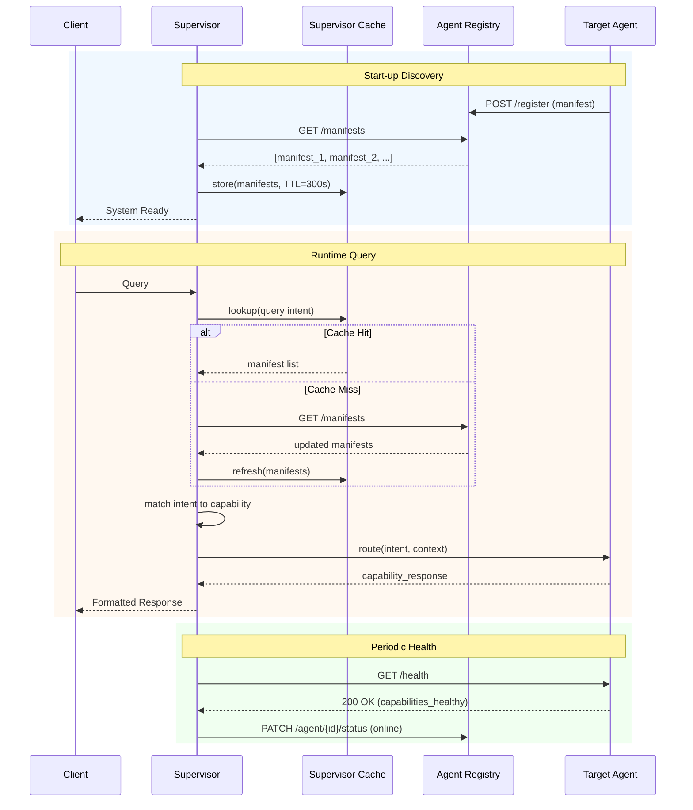
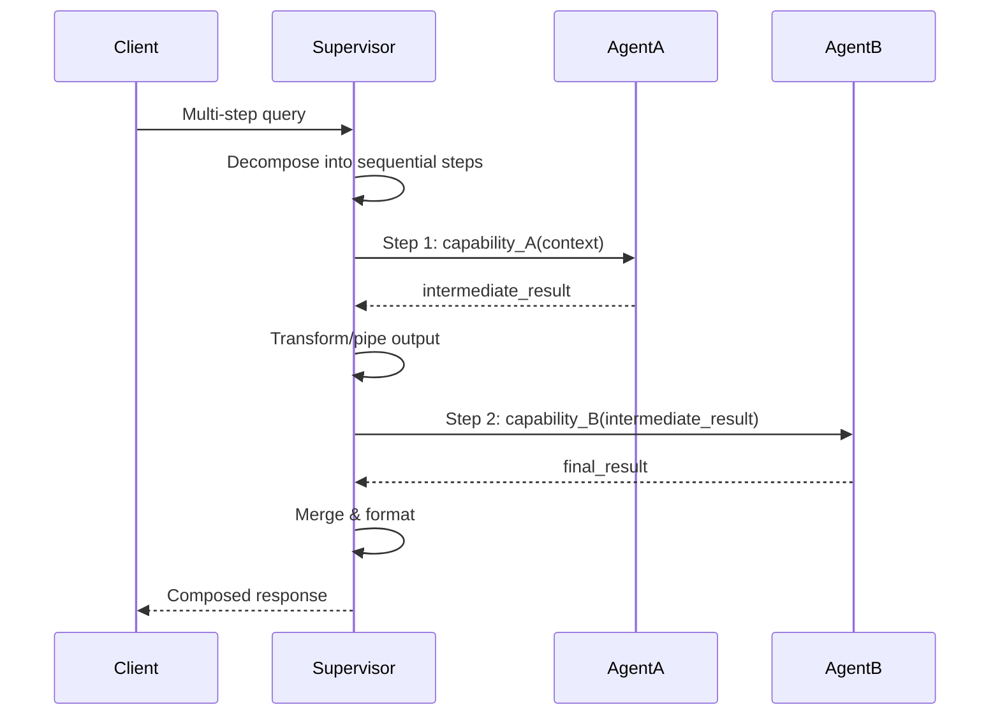
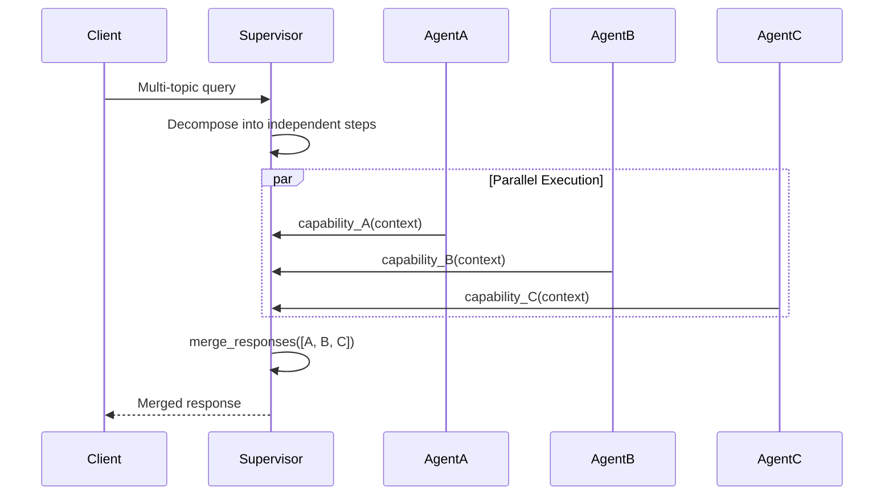
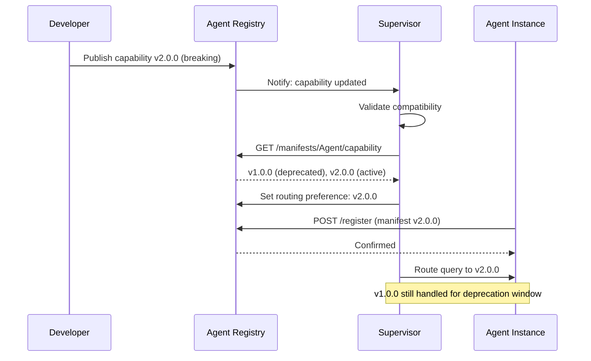

> **Status:** 📐 Design Spec — forward-looking design, not yet implemented
# Agent Capabilities

**Document Version:** v1.0  
**Status:** Active  
**Author:** Chief AI Architect, Enterprise Architecture  
**Last Updated:** 2026-06-18  
**Classification:** Internal — Architecture Team

---

## Executive Summary

Catalogs the capabilities of all 11 AI agents - capability manifests, tool definitions, knowledge source mappings, guardrails, permission models, and evaluation metrics.

---

## Table of Contents

1. [Executive Summary](#1-executive-summary)
2. [Capability Manifest Schema](#2-capability-manifest-schema)
3. [Capability Discovery Protocol](#3-capability-discovery-protocol)
4. [Intent-Capability Matching](#4-intent-capability-matching)
5. [Capability Composition](#5-capability-composition)
6. [Capability Versioning](#6-capability-versioning)
7. [Capability Testing & Validation](#7-capability-testing--validation)
8. [Full Capability Catalog](#8-full-capability-catalog)
9. [Related Documents](#9-related-documents)

---

## 1. Executive Summary

### 1.1 What Are Capabilities

A **capability** is a discrete, declarable unit of behavior that an agent can execute. Each capability maps a natural-language intent to a concrete action the agent performs — answering a question, routing a request, querying a data source, or triggering a workflow. Capabilities form the atomic contract between the Supervisor and the agent network.

### 1.2 Capability-Driven Routing Philosophy

The entire multi-agent architecture is built on capability-driven routing:

- **Agents do not declare what they are; they declare what they can do.**
- The **Supervisor** does not hard-code agent destinations; it matches user intents against registered capability manifests.
- Routing decisions are scored by confidence, enabling graceful degradation, fallback chains, and human escalation.
- New agents or capabilities can be added without modifying the Supervisor's routing logic — only a registry update is required.

### 1.3 Design Principles

| Principle | Description |
|---|---|
| **Declarative** | Capabilities are declared in machine-readable manifests, not hard-coded |
| **Discoverable** | The Supervisor discovers capabilities at startup and on a refresh cycle |
| **Versioned** | Every capability carries a semver version; breaking changes are signaled |
| **Composable** | Multiple capabilities can be chained or merged for complex intents |
| **Measurable** | Every capability has confidence threshold, cost tier, and rate limits |
| **Graceful** | Low-confidence matches trigger clarification or fallback, never silent failure |

---

## 2. Capability Manifest Schema

### 2.1 JSON Schema Definition

Each agent publishes a capability manifest — a JSON document that describes every capability it exposes. The schema is defined below.

```json
{
  "$schema": "http://json-schema.org/draft-07/schema#",
  "$id": "https://arch.portfolio.internal/schemas/capability-manifest.json",
  "title": "Agent Capability Manifest",
  "description": "Declares the capabilities, constraints, and metadata of a portfolio system agent.",
  "type": "object",
  "required": [
    "agent_name",
    "version",
    "description",
    "capabilities",
    "knowledge_sources",
    "output_formats",
    "confidence_threshold",
    "fallback_agent",
    "rate_limits",
    "cost_tier"
  ],
  "properties": {
    "agent_name": {
      "type": "string",
      "description": "Unique logical name of the agent.",
      "pattern": "^[A-Z][a-zA-Z]+(?:Agent)?$",
      "examples": ["SupervisorAgent", "PortfolioAgent"]
    },
    "version": {
      "type": "string",
      "description": "Semantic version of the manifest.",
      "pattern": "^\\d+\\.\\d+\\.\\d+$",
      "examples": ["1.0.0", "2.1.3"]
    },
    "description": {
      "type": "string",
      "description": "Human-readable summary of the agent's purpose.",
      "maxLength": 500
    },
    "capabilities": {
      "type": "array",
      "description": "List of capabilities this agent provides.",
      "minItems": 1,
      "items": {
        "$ref": "#/definitions/Capability"
      }
    },
    "knowledge_sources": {
      "type": "array",
      "description": "Data sources the agent can query.",
      "items": {
        "type": "object",
        "required": ["name", "type", "description"],
        "properties": {
          "name": { "type": "string" },
          "type": {
            "type": "string",
            "enum": ["vector_store", "sql_database", "file_system", "api", "cache", "graph_store"]
          },
          "description": { "type": "string", "maxLength": 300 }
        }
      }
    },
    "input_constraints": {
      "type": "object",
      "description": "Constraints on acceptable input shapes.",
      "properties": {
        "max_query_length": { "type": "integer", "minimum": 1 },
        "required_context_keys": {
          "type": "array",
          "items": { "type": "string" }
        },
        "allowed_languages": {
          "type": "array",
          "items": { "type": "string", "pattern": "^[a-z]{2}(-[A-Z]{2})?$" }
        },
        "max_tokens": { "type": "integer", "minimum": 1 }
      },
      "additionalProperties": false
    },
    "output_formats": {
      "type": "array",
      "description": "Response formats the agent can produce.",
      "items": {
        "type": "string",
        "enum": ["text", "markdown", "json", "html", "csv", "pdf", "image", "structured_data"]
      },
      "uniqueItems": true
    },
    "confidence_threshold": {
      "type": "number",
      "description": "Minimum confidence score for the agent's own capability matching.",
      "minimum": 0.0,
      "maximum": 1.0
    },
    "fallback_agent": {
      "type": "string",
      "description": "Agent name to delegate to when this agent cannot fulfill a request.",
      "nullable": true
    },
    "rate_limits": {
      "type": "object",
      "description": "Request rate limits enforced on this agent.",
      "required": ["requests_per_minute", "requests_per_hour", "concurrent_limit"],
      "properties": {
        "requests_per_minute": { "type": "integer", "minimum": 1 },
        "requests_per_hour": { "type": "integer", "minimum": 1 },
        "concurrent_limit": { "type": "integer", "minimum": 1 }
      }
    },
    "cost_tier": {
      "type": "string",
      "description": "Operational cost classification for routing decisions.",
      "enum": ["free", "low", "medium", "high", "premium"]
    }
  },
  "definitions": {
    "Capability": {
      "type": "object",
      "required": ["name", "version", "description", "input_schema", "output_schema", "confidence_threshold"],
      "properties": {
        "name": {
          "type": "string",
          "description": "Snake-case capability identifier.",
          "pattern": "^[a-z][a-z0-9_]+$"
        },
        "version": {
          "type": "string",
          "pattern": "^\\d+\\.\\d+\\.\\d+$"
        },
        "description": {
          "type": "string",
          "maxLength": 500
        },
        "input_schema": {
          "type": "object",
          "description": "Expected input fields (JSON Schema subset)."
        },
        "output_schema": {
          "type": "object",
          "description": "Guaranteed output shape (JSON Schema subset)."
        },
        "confidence_threshold": {
          "type": "number",
          "minimum": 0.0,
          "maximum": 1.0
        },
        "examples": {
          "type": "array",
          "description": "Example query strings for this capability.",
          "items": { "type": "string" }
        }
      }
    }
  }
}
```

### 2.2 Complete Manifest: Supervisor Agent

```json
{
  "agent_name": "SupervisorAgent",
  "version": "1.0.0",
  "description": "Orchestrates all agent routing, intent classification, and escalation for the portfolio system.",
  "capabilities": [
    {
      "name": "classify_intent",
      "version": "1.0.0",
      "description": "Classifies a natural-language query into one or more predefined intents.",
      "input_schema": {
        "type": "object",
        "required": ["query"],
        "properties": {
          "query": { "type": "string", "maxLength": 4000 },
          "context": { "type": "object" }
        }
      },
      "output_schema": {
        "type": "object",
        "properties": {
          "intents": { "type": "array", "items": { "type": "string" } },
          "confidence_scores": { "type": "object" },
          "entities": { "type": "object" }
        }
      },
      "confidence_threshold": 0.85,
      "examples": [
        "What projects have you worked on?",
        "Tell me about your experience with React",
        "Can you send me the resume PDF?"
      ]
    },
    {
      "name": "route_to_agent",
      "version": "1.0.0",
      "description": "Routes a parsed intent to the best-matching agent capability.",
      "input_schema": {
        "type": "object",
        "required": ["intent", "confidence"],
        "properties": {
          "intent": { "type": "string" },
          "confidence": { "type": "number" },
          "context": { "type": "object" }
        }
      },
      "output_schema": {
        "type": "object",
        "properties": {
          "target_agent": { "type": "string" },
          "target_capability": { "type": "string" },
          "confidence": { "type": "number" },
          "fallback_chain": { "type": "array", "items": { "type": "string" } }
        }
      },
      "confidence_threshold": 0.80,
      "examples": ["route_to_agent"]
    },
    {
      "name": "merge_responses",
      "version": "1.0.0",
      "description": "Merges responses from multiple agents into a single coherent reply.",
      "input_schema": {
        "type": "object",
        "required": ["responses"],
        "properties": {
          "responses": { "type": "array", "minItems": 1 }
        }
      },
      "output_schema": {
        "type": "object",
        "properties": {
          "merged": { "type": "string" },
          "sources": { "type": "array", "items": { "type": "string" } }
        }
      },
      "confidence_threshold": 0.75,
      "examples": ["merge_responses"]
    },
    {
      "name": "escalate_to_lead",
      "version": "1.0.0",
      "description": "Escalates a qualified lead intent to the Lead Qualification Agent.",
      "input_schema": {
        "type": "object",
        "required": ["lead_data"],
        "properties": {
          "lead_data": { "type": "object" }
        }
      },
      "output_schema": {
        "type": "object",
        "properties": {
          "status": { "type": "string", "enum": ["escalated", "already_exists", "invalid"] }
        }
      },
      "confidence_threshold": 0.90,
      "examples": ["escalate_to_lead"]
    },
    {
      "name": "escalate_to_admin",
      "version": "1.0.0",
      "description": "Escalates system-level requests and errors to the Admin Agent.",
      "input_schema": {
        "type": "object",
        "required": ["issue"],
        "properties": {
          "issue": { "type": "string" },
          "severity": { "type": "string", "enum": ["info", "warning", "error", "critical"] }
        }
      },
      "output_schema": {
        "type": "object",
        "properties": {
          "status": { "type": "string", "enum": ["escalated", "logged"] }
        }
      },
      "confidence_threshold": 0.90,
      "examples": ["escalate_to_admin"]
    },
    {
      "name": "get_context",
      "version": "1.0.0",
      "description": "Retrieves session or system context for use in downstream routing.",
      "input_schema": {
        "type": "object",
        "properties": {
          "session_id": { "type": "string" },
          "keys": { "type": "array", "items": { "type": "string" } }
        }
      },
      "output_schema": {
        "type": "object",
        "properties": {
          "context": { "type": "object" }
        }
      },
      "confidence_threshold": 0.95,
      "examples": ["get_context"]
    }
  ],
  "knowledge_sources": [
    { "name": "AgentRegistry", "type": "graph_store", "description": "Full graph of all agent capability manifests." },
    { "name": "SessionStore", "type": "cache", "description": "Short-term session context and conversation history." }
  ],
  "input_constraints": {
    "max_query_length": 4000,
    "allowed_languages": ["en"],
    "max_tokens": 2048
  },
  "output_formats": ["text", "markdown", "json"],
  "confidence_threshold": 0.80,
  "fallback_agent": null,
  "rate_limits": {
    "requests_per_minute": 200,
    "requests_per_hour": 10000,
    "concurrent_limit": 50
  },
  "cost_tier": "medium"
}
```

### 2.3 Complete Manifest: Portfolio Agent

```json
{
  "agent_name": "PortfolioAgent",
  "version": "1.0.0",
  "description": "Answers questions about the portfolio owner's background, skills, tech stack, experience, and availability.",
  "capabilities": [
    {
      "name": "answer_portfolio_overview",
      "version": "1.0.0",
      "description": "Provides a high-level summary of the portfolio owner's professional identity.",
      "input_schema": {
        "type": "object",
        "required": ["query"],
        "properties": {
          "query": { "type": "string", "maxLength": 2000 }
        }
      },
      "output_schema": {
        "type": "object",
        "properties": {
          "summary": { "type": "string" },
          "highlights": { "type": "array", "items": { "type": "string" } }
        }
      },
      "confidence_threshold": 0.85,
      "examples": ["Who are you?", "Tell me about yourself"]
    },
    {
      "name": "explain_skill_proficiency",
      "version": "1.0.0",
      "description": "Explains proficiency level and experience for a specific skill.",
      "input_schema": {
        "type": "object",
        "required": ["skill"],
        "properties": {
          "skill": { "type": "string" }
        }
      },
      "output_schema": {
        "type": "object",
        "properties": {
          "skill": { "type": "string" },
          "level": { "type": "string" },
          "years_experience": { "type": "number" },
          "projects": { "type": "array", "items": { "type": "string" } }
        }
      },
      "confidence_threshold": 0.80,
      "examples": ["How well do you know Python?", "What is your experience with AWS?"]
    },
    {
      "name": "describe_tech_stack",
      "version": "1.0.0",
      "description": "Describes the primary technology stack used across projects.",
      "input_schema": {
        "type": "object",
        "required": ["query"],
        "properties": {
          "query": { "type": "string", "maxLength": 2000 },
          "category": { "type": "string", "enum": ["frontend", "backend", "devops", "database", "all"] }
        }
      },
      "output_schema": {
        "type": "object",
        "properties": {
          "categories": { "type": "object" },
          "primary_stack": { "type": "array", "items": { "type": "string" } }
        }
      },
      "confidence_threshold": 0.80,
      "examples": ["What tech stack do you use?", "What frontend frameworks do you know?"]
    },
    {
      "name": "summarize_experience",
      "version": "1.0.0",
      "description": "Summarizes total years of experience, industries, and role types.",
      "input_schema": {
        "type": "object",
        "required": ["query"],
        "properties": {
          "query": { "type": "string", "maxLength": 2000 }
        }
      },
      "output_schema": {
        "type": "object",
        "properties": {
          "total_years": { "type": "number" },
          "roles": { "type": "array", "items": { "type": "string" } },
          "industries": { "type": "array", "items": { "type": "string" } }
        }
      },
      "confidence_threshold": 0.85,
      "examples": ["How many years of experience do you have?", "What industries have you worked in?"]
    },
    {
      "name": "provide_availability_info",
      "version": "1.0.0",
      "description": "Provides current availability status for consulting, freelance, or full-time opportunities.",
      "input_schema": {
        "type": "object",
        "required": ["query"],
        "properties": {
          "query": { "type": "string", "maxLength": 2000 }
        }
      },
      "output_schema": {
        "type": "object",
        "properties": {
          "available": { "type": "boolean" },
          "availability_type": { "type": "string" },
          "notice_period": { "type": "string" },
          "preferred_roles": { "type": "array", "items": { "type": "string" } }
        }
      },
      "confidence_threshold": 0.90,
      "examples": ["Are you available for hire?", "What is your availability for freelance work?"]
    }
  ],
  "knowledge_sources": [
    { "name": "PortfolioProfile", "type": "file_system", "description": "Structured YAML profile of the portfolio owner." },
    { "name": "SkillMatrix", "type": "vector_store", "description": "Embedding index of skill descriptions and proficiency data." }
  ],
  "input_constraints": {
    "max_query_length": 2000,
    "allowed_languages": ["en"],
    "max_tokens": 1024
  },
  "output_formats": ["text", "markdown", "json"],
  "confidence_threshold": 0.80,
  "fallback_agent": "ResumeAgent",
  "rate_limits": {
    "requests_per_minute": 100,
    "requests_per_hour": 3000,
    "concurrent_limit": 20
  },
  "cost_tier": "low"
}
```

### 2.4 Complete Manifest: Resume Agent

```json
{
  "agent_name": "ResumeAgent",
  "version": "1.0.0",
  "description": "Retrieves structured resume data including qualifications, work history, education, certifications, and skill proficiency.",
  "capabilities": [
    {
      "name": "get_qualifications",
      "version": "1.0.0",
      "description": "Returns a list of professional qualifications.",
      "input_schema": {
        "type": "object",
        "properties": {
          "category": { "type": "string", "enum": ["all", "technical", "professional"] }
        }
      },
      "output_schema": {
        "type": "object",
        "properties": {
          "qualifications": { "type": "array", "items": { "type": "object" } }
        }
      },
      "confidence_threshold": 0.90,
      "examples": ["What are your qualifications?", "List your technical certifications"]
    },
    {
      "name": "get_work_history",
      "version": "1.0.0",
      "description": "Returns chronological work history with role details.",
      "input_schema": {
        "type": "object",
        "properties": {
          "limit": { "type": "integer", "minimum": 1, "maximum": 50 },
          "company": { "type": "string" }
        }
      },
      "output_schema": {
        "type": "object",
        "properties": {
          "positions": { "type": "array", "items": { "type": "object" } },
          "total_positions": { "type": "integer" }
        }
      },
      "confidence_threshold": 0.90,
      "examples": ["What is your work history?", "Where did you work before?"]
    },
    {
      "name": "get_education",
      "version": "1.0.0",
      "description": "Returns educational background including degrees and institutions.",
      "input_schema": {
        "type": "object",
        "properties": {
          "level": { "type": "string", "enum": ["all", "undergraduate", "graduate", "certificate"] }
        }
      },
      "output_schema": {
        "type": "object",
        "properties": {
          "education": { "type": "array", "items": { "type": "object" } }
        }
      },
      "confidence_threshold": 0.95,
      "examples": ["What is your educational background?", "Where did you go to school?"]
    },
    {
      "name": "get_certifications",
      "version": "1.0.0",
      "description": "Returns a list of professional certifications.",
      "input_schema": {
        "type": "object",
        "properties": {
          "authority": { "type": "string" }
        }
      },
      "output_schema": {
        "type": "object",
        "properties": {
          "certifications": { "type": "array", "items": { "type": "object" } }
        }
      },
      "confidence_threshold": 0.95,
      "examples": ["What certifications do you hold?", "List your AWS certifications"]
    },
    {
      "name": "get_skill_proficiency",
      "version": "1.0.0",
      "description": "Returns proficiency level for a specific skill from resume data.",
      "input_schema": {
        "type": "object",
        "required": ["skill"],
        "properties": {
          "skill": { "type": "string" }
        }
      },
      "output_schema": {
        "type": "object",
        "properties": {
          "skill": { "type": "string" },
          "proficiency": { "type": "string", "enum": ["beginner", "intermediate", "advanced", "expert"] },
          "years": { "type": "number" }
        }
      },
      "confidence_threshold": 0.85,
      "examples": ["How proficient are you in TypeScript?", "Rate your Java skills"]
    },
    {
      "name": "download_resume",
      "version": "1.0.0",
      "description": "Generates or retrieves a downloadable resume file.",
      "input_schema": {
        "type": "object",
        "properties": {
          "format": { "type": "string", "enum": ["pdf", "docx", "txt"] },
          "template": { "type": "string" }
        }
      },
      "output_schema": {
        "type": "object",
        "properties": {
          "url": { "type": "string", "format": "uri" },
          "format": { "type": "string" },
          "size_bytes": { "type": "integer" }
        }
      },
      "confidence_threshold": 0.95,
      "examples": ["Download your resume", "Send me your resume as PDF"]
    }
  ],
  "knowledge_sources": [
    { "name": "ResumeStore", "type": "file_system", "description": "Structured resume data and formatted document templates." }
  ],
  "input_constraints": {
    "max_query_length": 1000,
    "allowed_languages": ["en"],
    "max_tokens": 1024
  },
  "output_formats": ["text", "markdown", "json", "pdf"],
  "confidence_threshold": 0.85,
  "fallback_agent": "PortfolioAgent",
  "rate_limits": {
    "requests_per_minute": 80,
    "requests_per_hour": 2000,
    "concurrent_limit": 15
  },
  "cost_tier": "low"
}
```

### 2.5 Complete Manifest: Projects Agent

```json
{
  "agent_name": "ProjectsAgent",
  "version": "1.0.0",
  "description": "Manages and serves project portfolio data including listings, details, filtering, comparison, and NDA-gated access.",
  "capabilities": [
    {
      "name": "get_project_list",
      "version": "1.0.0",
      "description": "Returns a paginated list of all projects.",
      "input_schema": {
        "type": "object",
        "properties": {
          "page": { "type": "integer", "minimum": 1 },
          "per_page": { "type": "integer", "minimum": 1, "maximum": 50 },
          "sort_by": { "type": "string", "enum": ["date", "name", "impact"] },
          "sort_order": { "type": "string", "enum": ["asc", "desc"] }
        }
      },
      "output_schema": {
        "type": "object",
        "properties": {
          "projects": { "type": "array", "items": { "type": "object" } },
          "total": { "type": "integer" },
          "page": { "type": "integer" }
        }
      },
      "confidence_threshold": 0.90,
      "examples": ["Show me your projects", "What projects have you built?"]
    },
    {
      "name": "get_project_detail",
      "version": "1.0.0",
      "description": "Returns detailed information about a specific project.",
      "input_schema": {
        "type": "object",
        "required": ["project_id"],
        "properties": {
          "project_id": { "type": "string" }
        }
      },
      "output_schema": {
        "type": "object",
        "properties": {
          "id": { "type": "string" },
          "name": { "type": "string" },
          "description": { "type": "string" },
          "technologies": { "type": "array", "items": { "type": "string" } },
          "role": { "type": "string" },
          "impact": { "type": "string" },
          "link": { "type": "string" }
        }
      },
      "confidence_threshold": 0.90,
      "examples": ["Tell me about project X", "Show details of the e-commerce platform"]
    },
    {
      "name": "filter_by_technology",
      "version": "1.0.0",
      "description": "Filters projects by a specific technology or stack.",
      "input_schema": {
        "type": "object",
        "required": ["technology"],
        "properties": {
          "technology": { "type": "string" }
        }
      },
      "output_schema": {
        "type": "object",
        "properties": {
          "technology": { "type": "string" },
          "projects": { "type": "array", "items": { "type": "object" } },
          "count": { "type": "integer" }
        }
      },
      "confidence_threshold": 0.85,
      "examples": ["Which projects use React?", "Show me your Python projects"]
    },
    {
      "name": "compare_projects",
      "version": "1.0.0",
      "description": "Compares two or more projects across defined dimensions.",
      "input_schema": {
        "type": "object",
        "required": ["project_ids"],
        "properties": {
          "project_ids": { "type": "array", "minItems": 2, "maxItems": 5, "items": { "type": "string" } }
        }
      },
      "output_schema": {
        "type": "object",
        "properties": {
          "comparison": { "type": "array", "items": { "type": "object" } },
          "dimensions": { "type": "array", "items": { "type": "string" } }
        }
      },
      "confidence_threshold": 0.80,
      "examples": ["Compare project A and B", "Which project had more impact?"]
    },
    {
      "name": "verify_nda_access",
      "version": "1.0.0",
      "description": "Verifies whether the requester has NDA clearance to view restricted project details.",
      "input_schema": {
        "type": "object",
        "required": ["project_id", "requester_id"],
        "properties": {
          "project_id": { "type": "string" },
          "requester_id": { "type": "string" }
        }
      },
      "output_schema": {
        "type": "object",
        "properties": {
          "access_granted": { "type": "boolean" },
          "restricted_fields": { "type": "array", "items": { "type": "string" } }
        }
      },
      "confidence_threshold": 0.95,
      "examples": ["verify_nda_access"]
    }
  ],
  "knowledge_sources": [
    { "name": "ProjectDatabase", "type": "sql_database", "description": "Relational database of all portfolio projects." },
    { "name": "NDARegistry", "type": "graph_store", "description": "Access control graph for NDA-restricted projects." }
  ],
  "input_constraints": {
    "max_query_length": 2000,
    "allowed_languages": ["en"],
    "max_tokens": 2048
  },
  "output_formats": ["text", "markdown", "json"],
  "confidence_threshold": 0.85,
  "fallback_agent": "PortfolioAgent",
  "rate_limits": {
    "requests_per_minute": 60,
    "requests_per_hour": 2000,
    "concurrent_limit": 15
  },
  "cost_tier": "low"
}
```

### 2.6 Complete Manifest: Blog Agent

```json
{
  "agent_name": "BlogAgent",
  "version": "1.0.0",
  "description": "Searches, summarizes, recommends, and browses blog articles by tag.",
  "capabilities": [
    {
      "name": "search_articles",
      "version": "1.0.0",
      "description": "Searches blog articles by keyword or phrase.",
      "input_schema": {
        "type": "object",
        "required": ["query"],
        "properties": {
          "query": { "type": "string", "maxLength": 500 },
          "limit": { "type": "integer", "minimum": 1, "maximum": 20 }
        }
      },
      "output_schema": {
        "type": "object",
        "properties": {
          "results": { "type": "array", "items": { "type": "object" } },
          "total_matches": { "type": "integer" }
        }
      },
      "confidence_threshold": 0.85,
      "examples": ["Search for articles about microservices", "Find blog posts on system design"]
    },
    {
      "name": "summarize_post",
      "version": "1.0.0",
      "description": "Returns a concise summary of a specific blog post.",
      "input_schema": {
        "type": "object",
        "required": ["post_id"],
        "properties": {
          "post_id": { "type": "string" },
          "max_length": { "type": "integer", "minimum": 50, "maximum": 1000 }
        }
      },
      "output_schema": {
        "type": "object",
        "properties": {
          "title": { "type": "string" },
          "summary": { "type": "string" },
          "tags": { "type": "array", "items": { "type": "string" } },
          "read_time_minutes": { "type": "integer" }
        }
      },
      "confidence_threshold": 0.90,
      "examples": ["Summarize your latest post", "Give me a summary of the article on AI"]
    },
    {
      "name": "get_recommendations",
      "version": "1.0.0",
      "description": "Recommends articles based on a topic or reading history.",
      "input_schema": {
        "type": "object",
        "properties": {
          "topic": { "type": "string" },
          "count": { "type": "integer", "minimum": 1, "maximum": 10 }
        }
      },
      "output_schema": {
        "type": "object",
        "properties": {
          "recommendations": { "type": "array", "items": { "type": "object" } },
          "based_on": { "type": "string" }
        }
      },
      "confidence_threshold": 0.80,
      "examples": ["Recommend some articles", "What should I read next about cloud computing?"]
    },
    {
      "name": "browse_by_tag",
      "version": "1.0.0",
      "description": "Lists all articles that share a specific tag.",
      "input_schema": {
        "type": "object",
        "required": ["tag"],
        "properties": {
          "tag": { "type": "string" }
        }
      },
      "output_schema": {
        "type": "object",
        "properties": {
          "tag": { "type": "string" },
          "articles": { "type": "array", "items": { "type": "object" } },
          "count": { "type": "integer" }
        }
      },
      "confidence_threshold": 0.90,
      "examples": ["Show all articles about Docker", "Browse posts tagged with JavaScript"]
    }
  ],
  "knowledge_sources": [
    { "name": "BlogIndex", "type": "vector_store", "description": "Embedding index of all blog articles." },
    { "name": "BlogMetadata", "type": "sql_database", "description": "Relational metadata for tags, dates, and read times." }
  ],
  "input_constraints": {
    "max_query_length": 500,
    "allowed_languages": ["en"],
    "max_tokens": 1024
  },
  "output_formats": ["text", "markdown", "json"],
  "confidence_threshold": 0.80,
  "fallback_agent": "KnowledgeAgent",
  "rate_limits": {
    "requests_per_minute": 80,
    "requests_per_hour": 3000,
    "concurrent_limit": 20
  },
  "cost_tier": "low"
}
```

### 2.7 Complete Manifest: Case Study Agent

```json
{
  "agent_name": "CaseStudyAgent",
  "version": "1.0.0",
  "description": "Walks through case studies, explains methodology, quantifies impact, and compares case studies.",
  "capabilities": [
    {
      "name": "walkthrough_case_study",
      "version": "1.0.0",
      "description": "Provides a step-by-step walkthrough of a specific case study.",
      "input_schema": {
        "type": "object",
        "required": ["case_study_id"],
        "properties": {
          "case_study_id": { "type": "string" },
          "detail_level": { "type": "string", "enum": ["high", "medium", "deep"] }
        }
      },
      "output_schema": {
        "type": "object",
        "properties": {
          "title": { "type": "string" },
          "client": { "type": "string" },
          "problem": { "type": "string" },
          "approach": { "type": "string" },
          "solution": { "type": "string" },
          "results": { "type": "string" }
        }
      },
      "confidence_threshold": 0.90,
      "examples": ["Walk me through the fintech case study", "Tell me about the healthcare project"]
    },
    {
      "name": "explain_methodology",
      "version": "1.0.0",
      "description": "Explains the methodology used in a specific case study.",
      "input_schema": {
        "type": "object",
        "required": ["case_study_id"],
        "properties": {
          "case_study_id": { "type": "string" }
        }
      },
      "output_schema": {
        "type": "object",
        "properties": {
          "methodology_name": { "type": "string" },
          "phases": { "type": "array", "items": { "type": "string" } },
          "tools_used": { "type": "array", "items": { "type": "string" } }
        }
      },
      "confidence_threshold": 0.85,
      "examples": ["What methodology did you use for the data pipeline project?"]
    },
    {
      "name": "quantify_impact",
      "version": "1.0.0",
      "description": "Quantifies the business or technical impact of a case study.",
      "input_schema": {
        "type": "object",
        "required": ["case_study_id"],
        "properties": {
          "case_study_id": { "type": "string" },
          "metrics": { "type": "array", "items": { "type": "string" } }
        }
      },
      "output_schema": {
        "type": "object",
        "properties": {
          "metrics": { "type": "array", "items": { "type": "object" } },
          "summary": { "type": "string" }
        }
      },
      "confidence_threshold": 0.85,
      "examples": ["What was the impact of the migration project?", "Show me the metrics for the DevOps case study"]
    },
    {
      "name": "compare_case_studies",
      "version": "1.0.0",
      "description": "Compares two or more case studies on problem, approach, and results.",
      "input_schema": {
        "type": "object",
        "required": ["case_study_ids"],
        "properties": {
          "case_study_ids": { "type": "array", "minItems": 2, "maxItems": 5, "items": { "type": "string" } }
        }
      },
      "output_schema": {
        "type": "object",
        "properties": {
          "comparison": { "type": "array", "items": { "type": "object" } },
          "dimensions": { "type": "array", "items": { "type": "string" } }
        }
      },
      "confidence_threshold": 0.80,
      "examples": ["Compare the fintech and healthcare case studies"]
    }
  ],
  "knowledge_sources": [
    { "name": "CaseStudyStore", "type": "file_system", "description": "Markdown and structured data files for each case study." }
  ],
  "input_constraints": {
    "max_query_length": 2000,
    "allowed_languages": ["en"],
    "max_tokens": 2048
  },
  "output_formats": ["text", "markdown", "json"],
  "confidence_threshold": 0.85,
  "fallback_agent": "ProjectsAgent",
  "rate_limits": {
    "requests_per_minute": 50,
    "requests_per_hour": 1500,
    "concurrent_limit": 10
  },
  "cost_tier": "low"
}
```

### 2.8 Complete Manifest: Career Agent

```json
{
  "agent_name": "CareerAgent",
  "version": "1.0.0",
  "description": "Provides career timeline, growth story, transitions, and industry experience narrative.",
  "capabilities": [
    {
      "name": "get_timeline",
      "version": "1.0.0",
      "description": "Returns a chronological career timeline.",
      "input_schema": {
        "type": "object",
        "properties": {
          "format": { "type": "string", "enum": ["list", "visual", "json"] },
          "start_year": { "type": "integer" }
        }
      },
      "output_schema": {
        "type": "object",
        "properties": {
          "events": { "type": "array", "items": { "type": "object" } },
          "span_years": { "type": "integer" }
        }
      },
      "confidence_threshold": 0.90,
      "examples": ["Show me your career timeline", "What is your career progression?"]
    },
    {
      "name": "explain_growth",
      "version": "1.0.0",
      "description": "Explains how the portfolio owner's skills and roles grew over time.",
      "input_schema": {
        "type": "object",
        "properties": {
          "aspect": { "type": "string", "enum": ["technical", "leadership", "domain", "all"] }
        }
      },
      "output_schema": {
        "type": "object",
        "properties": {
          "growth_areas": { "type": "array", "items": { "type": "object" } },
          "narrative": { "type": "string" }
        }
      },
      "confidence_threshold": 0.85,
      "examples": ["How did your career grow?", "Tell me about your leadership growth"]
    },
    {
      "name": "describe_transition",
      "version": "1.0.0",
      "description": "Describes a specific career transition between roles or industries.",
      "input_schema": {
        "type": "object",
        "required": ["transition_id"],
        "properties": {
          "transition_id": { "type": "string" }
        }
      },
      "output_schema": {
        "type": "object",
        "properties": {
          "from_role": { "type": "string" },
          "to_role": { "type": "string" },
          "reason": { "type": "string" },
          "skills_gained": { "type": "array", "items": { "type": "string" } }
        }
      },
      "confidence_threshold": 0.85,
      "examples": ["Why did you move from engineering to architecture?", "Describe your transition to management"]
    },
    {
      "name": "get_industry_experience",
      "version": "1.0.0",
      "description": "Returns a breakdown of experience across different industries.",
      "input_schema": {
        "type": "object",
        "properties": {
          "industry": { "type": "string" }
        }
      },
      "output_schema": {
        "type": "object",
        "properties": {
          "industries": { "type": "array", "items": { "type": "object" } },
          "primary_industry": { "type": "string" }
        }
      },
      "confidence_threshold": 0.90,
      "examples": ["What industries have you worked in?", "Tell me about your experience in fintech"]
    }
  ],
  "knowledge_sources": [
    { "name": "CareerStore", "type": "sql_database", "description": "Relational database of career events, transitions, and industry data." }
  ],
  "input_constraints": {
    "max_query_length": 2000,
    "allowed_languages": ["en"],
    "max_tokens": 1024
  },
  "output_formats": ["text", "markdown", "json"],
  "confidence_threshold": 0.85,
  "fallback_agent": "ResumeAgent",
  "rate_limits": {
    "requests_per_minute": 60,
    "requests_per_hour": 2000,
    "concurrent_limit": 15
  },
  "cost_tier": "low"
}
```

### 2.9 Complete Manifest: Lead Qualification Agent

```json
{
  "agent_name": "LeadQualificationAgent",
  "version": "1.0.0",
  "description": "Detects lead intent, captures contact information, scores and qualifies leads, creates records, and sends notifications.",
  "capabilities": [
    {
      "name": "detect_lead_intent",
      "version": "1.0.0",
      "description": "Analyzes a query to determine if it expresses hiring or collaboration intent.",
      "input_schema": {
        "type": "object",
        "required": ["query"],
        "properties": {
          "query": { "type": "string", "maxLength": 2000 }
        }
      },
      "output_schema": {
        "type": "object",
        "properties": {
          "is_lead": { "type": "boolean" },
          "intent_type": { "type": "string", "enum": ["hiring", "freelance", "collaboration", "consulting", "other"] },
          "confidence": { "type": "number" }
        }
      },
      "confidence_threshold": 0.80,
      "examples": ["I want to hire you", "Are you available for a project?"]
    },
    {
      "name": "capture_contact_info",
      "version": "1.0.0",
      "description": "Extracts and validates contact information from a query or form submission.",
      "input_schema": {
        "type": "object",
        "required": ["source"],
        "properties": {
          "source": { "type": "string" },
          "fields": {
            "type": "object",
            "properties": {
              "name": { "type": "string" },
              "email": { "type": "string", "format": "email" },
              "phone": { "type": "string" },
              "company": { "type": "string" },
              "message": { "type": "string" }
            }
          }
        }
      },
      "output_schema": {
        "type": "object",
        "properties": {
          "captured": { "type": "object" },
          "missing_fields": { "type": "array", "items": { "type": "string" } },
          "valid": { "type": "boolean" }
        }
      },
      "confidence_threshold": 0.85,
      "examples": ["capture_contact_info"]
    },
    {
      "name": "qualify_lead_score",
      "version": "1.0.0",
      "description": "Scores and qualifies a lead based on intent, fit, and engagement signals.",
      "input_schema": {
        "type": "object",
        "required": ["lead_id"],
        "properties": {
          "lead_id": { "type": "string" }
        }
      },
      "output_schema": {
        "type": "object",
        "properties": {
          "lead_id": { "type": "string" },
          "score": { "type": "integer", "minimum": 0, "maximum": 100 },
          "tier": { "type": "string", "enum": ["hot", "warm", "cold"] },
          "next_action": { "type": "string" }
        }
      },
      "confidence_threshold": 0.85,
      "examples": ["qualify_lead_score"]
    },
    {
      "name": "create_lead_record",
      "version": "1.0.0",
      "description": "Creates a persistent lead record in the CRM.",
      "input_schema": {
        "type": "object",
        "required": ["lead_data"],
        "properties": {
          "lead_data": { "type": "object" }
        }
      },
      "output_schema": {
        "type": "object",
        "properties": {
          "lead_id": { "type": "string" },
          "status": { "type": "string", "enum": ["created", "duplicate", "error"] }
        }
      },
      "confidence_threshold": 0.95,
      "examples": ["create_lead_record"]
    },
    {
      "name": "send_notification",
      "version": "1.0.0",
      "description": "Sends a notification about a new or updated lead.",
      "input_schema": {
        "type": "object",
        "required": ["lead_id", "notification_type"],
        "properties": {
          "lead_id": { "type": "string" },
          "notification_type": { "type": "string", "enum": ["new_lead", "high_score", "follow_up"] },
          "channels": { "type": "array", "items": { "type": "string", "enum": ["email", "slack", "sms"] } }
        }
      },
      "output_schema": {
        "type": "object",
        "properties": {
          "sent": { "type": "boolean" },
          "channels_delivered": { "type": "array", "items": { "type": "string" } }
        }
      },
      "confidence_threshold": 0.95,
      "examples": ["send_notification"]
    }
  ],
  "knowledge_sources": [
    { "name": "CRM", "type": "sql_database", "description": "Lead records and qualification history." },
    { "name": "NotificationService", "type": "api", "description": "External notification dispatch API." }
  ],
  "input_constraints": {
    "max_query_length": 2000,
    "allowed_languages": ["en"],
    "max_tokens": 1024
  },
  "output_formats": ["text", "markdown", "json"],
  "confidence_threshold": 0.85,
  "fallback_agent": "SupervisorAgent",
  "rate_limits": {
    "requests_per_minute": 40,
    "requests_per_hour": 1000,
    "concurrent_limit": 10
  },
  "cost_tier": "medium"
}
```

### 2.10 Complete Manifest: Analytics Agent

```json
{
  "agent_name": "AnalyticsAgent",
  "version": "1.0.0",
  "description": "Provides visitor metrics, content performance, conversion data, and generates analytical reports.",
  "capabilities": [
    {
      "name": "get_visitor_metrics",
      "version": "1.0.0",
      "description": "Returns visitor traffic metrics for a given time range.",
      "input_schema": {
        "type": "object",
        "required": ["time_range"],
        "properties": {
          "time_range": {
            "type": "string",
            "enum": ["7d", "30d", "90d", "1y", "all"]
          },
          "granularity": {
            "type": "string",
            "enum": ["hour", "day", "week", "month"]
          }
        }
      },
      "output_schema": {
        "type": "object",
        "properties": {
          "total_visitors": { "type": "integer" },
          "unique_visitors": { "type": "integer" },
          "page_views": { "type": "integer" },
          "bounce_rate": { "type": "number" },
          "avg_session_duration_seconds": { "type": "number" },
          "series": { "type": "array", "items": { "type": "object" } }
        }
      },
      "confidence_threshold": 0.90,
      "examples": ["How many visitors this month?", "Show me traffic stats"]
    },
    {
      "name": "get_content_performance",
      "version": "1.0.0",
      "description": "Returns performance metrics for portfolio content pages.",
      "input_schema": {
        "type": "object",
        "properties": {
          "content_type": { "type": "string", "enum": ["project", "blog", "case_study", "all"] },
          "sort_by": { "type": "string", "enum": ["views", "engagement", "conversion"] }
        }
      },
      "output_schema": {
        "type": "object",
        "properties": {
          "content": { "type": "array", "items": { "type": "object" } },
          "top_performer": { "type": "object" }
        }
      },
      "confidence_threshold": 0.85,
      "examples": ["Which project page gets the most views?", "What is the best performing content?"]
    },
    {
      "name": "get_conversion_data",
      "version": "1.0.0",
      "description": "Returns conversion funnel data for lead generation.",
      "input_schema": {
        "type": "object",
        "required": ["time_range"],
        "properties": {
          "time_range": { "type": "string", "enum": ["7d", "30d", "90d", "1y", "all"] }
        }
      },
      "output_schema": {
        "type": "object",
        "properties": {
          "funnel": { "type": "array", "items": { "type": "object" } },
          "conversion_rate": { "type": "number" },
          "total_leads": { "type": "integer" }
        }
      },
      "confidence_threshold": 0.85,
      "examples": ["What is the conversion rate?", "How many leads this quarter?"]
    },
    {
      "name": "generate_report",
      "version": "1.0.0",
      "description": "Generates a comprehensive analytics report in the requested format.",
      "input_schema": {
        "type": "object",
        "required": ["report_type"],
        "properties": {
          "report_type": { "type": "string", "enum": ["monthly", "quarterly", "annual", "custom"] },
          "format": { "type": "string", "enum": ["markdown", "json", "pdf", "csv"] },
          "sections": { "type": "array", "items": { "type": "string" } }
        }
      },
      "output_schema": {
        "type": "object",
        "properties": {
          "report_url": { "type": "string" },
          "format": { "type": "string" },
          "generated_at": { "type": "string", "format": "date-time" },
          "summary": { "type": "string" }
        }
      },
      "confidence_threshold": 0.90,
      "examples": ["Generate a monthly report", "Create an analytics report for Q1"]
    }
  ],
  "knowledge_sources": [
    { "name": "AnalyticsStore", "type": "sql_database", "description": "Aggregated analytics data and event logs." }
  ],
  "input_constraints": {
    "max_query_length": 1000,
    "allowed_languages": ["en"],
    "max_tokens": 2048
  },
  "output_formats": ["text", "markdown", "json", "csv", "pdf"],
  "confidence_threshold": 0.85,
  "fallback_agent": "AdminAgent",
  "rate_limits": {
    "requests_per_minute": 30,
    "requests_per_hour": 500,
    "concurrent_limit": 5
  },
  "cost_tier": "medium"
}
```

### 2.11 Complete Manifest: Admin Agent

```json
{
  "agent_name": "AdminAgent",
  "version": "1.0.0",
  "description": "Manages system content, settings, users, logs, and maintenance operations.",
  "capabilities": [
    {
      "name": "manage_content",
      "version": "1.0.0",
      "description": "Creates, updates, deletes, or lists portfolio content items.",
      "input_schema": {
        "type": "object",
        "required": ["action", "content_type"],
        "properties": {
          "action": { "type": "string", "enum": ["create", "update", "delete", "list"] },
          "content_type": { "type": "string", "enum": ["project", "blog", "case_study", "profile"] },
          "data": { "type": "object" }
        }
      },
      "output_schema": {
        "type": "object",
        "properties": {
          "success": { "type": "boolean" },
          "message": { "type": "string" },
          "item_id": { "type": "string" }
        }
      },
      "confidence_threshold": 0.95,
      "examples": ["manage_content"]
    },
    {
      "name": "manage_settings",
      "version": "1.0.0",
      "description": "Gets or updates system configuration settings.",
      "input_schema": {
        "type": "object",
        "required": ["action"],
        "properties": {
          "action": { "type": "string", "enum": ["get", "update", "reset"] },
          "settings": { "type": "object" }
        }
      },
      "output_schema": {
        "type": "object",
        "properties": {
          "success": { "type": "boolean" },
          "settings": { "type": "object" }
        }
      },
      "confidence_threshold": 0.95,
      "examples": ["manage_settings"]
    },
    {
      "name": "manage_users",
      "version": "1.0.0",
      "description": "Manages user accounts and access permissions.",
      "input_schema": {
        "type": "object",
        "required": ["action"],
        "properties": {
          "action": { "type": "string", "enum": ["create", "update", "delete", "list", "suspend"] },
          "user_data": { "type": "object" }
        }
      },
      "output_schema": {
        "type": "object",
        "properties": {
          "success": { "type": "boolean" },
          "users": { "type": "array", "items": { "type": "object" } }
        }
      },
      "confidence_threshold": 0.95,
      "examples": ["manage_users"]
    },
    {
      "name": "view_logs",
      "version": "1.0.0",
      "description": "Retrieves and filters system logs.",
      "input_schema": {
        "type": "object",
        "properties": {
          "level": { "type": "string", "enum": ["debug", "info", "warn", "error", "critical"] },
          "source": { "type": "string" },
          "time_range": { "type": "string" },
          "limit": { "type": "integer", "minimum": 1, "maximum": 1000 }
        }
      },
      "output_schema": {
        "type": "object",
        "properties": {
          "logs": { "type": "array", "items": { "type": "object" } },
          "total_count": { "type": "integer" },
          "truncated": { "type": "boolean" }
        }
      },
      "confidence_threshold": 0.95,
      "examples": ["Show me the error logs", "What warnings were raised today?"]
    },
    {
      "name": "run_maintenance",
      "version": "1.0.0",
      "description": "Executes system maintenance tasks.",
      "input_schema": {
        "type": "object",
        "required": ["task"],
        "properties": {
          "task": {
            "type": "string",
            "enum": ["clear_cache", "reindex_search", "vacuum_db", "rotate_logs", "health_check"]
          },
          "options": { "type": "object" }
        }
      },
      "output_schema": {
        "type": "object",
        "properties": {
          "success": { "type": "boolean" },
          "task": { "type": "string" },
          "duration_ms": { "type": "integer" },
          "details": { "type": "string" }
        }
      },
      "confidence_threshold": 0.95,
      "examples": ["run_maintenance"]
    }
  ],
  "knowledge_sources": [
    { "name": "SystemConfig", "type": "file_system", "description": "Configuration files and environment settings." },
    { "name": "LogStore", "type": "file_system", "description": "Rotating log files for system observability." }
  ],
  "input_constraints": {
    "max_query_length": 2000,
    "required_context_keys": ["admin_authorization"],
    "allowed_languages": ["en"],
    "max_tokens": 2048
  },
  "output_formats": ["text", "markdown", "json"],
  "confidence_threshold": 0.95,
  "fallback_agent": null,
  "rate_limits": {
    "requests_per_minute": 20,
    "requests_per_hour": 200,
    "concurrent_limit": 5
  },
  "cost_tier": "medium"
}
```

### 2.12 Complete Manifest: Knowledge Agent

```json
{
  "agent_name": "KnowledgeAgent",
  "version": "1.0.0",
  "description": "Searches the knowledge base, reports source statistics, refreshes vector indices, and retrieves documents.",
  "capabilities": [
    {
      "name": "search_knowledge_base",
      "version": "1.0.0",
      "description": "Semantic search across the entire knowledge base.",
      "input_schema": {
        "type": "object",
        "required": ["query"],
        "properties": {
          "query": { "type": "string", "maxLength": 1000 },
          "max_results": { "type": "integer", "minimum": 1, "maximum": 20 },
          "source_filter": { "type": "array", "items": { "type": "string" } }
        }
      },
      "output_schema": {
        "type": "object",
        "properties": {
          "results": { "type": "array", "items": { "type": "object" } },
          "total_results": { "type": "integer" }
        }
      },
      "confidence_threshold": 0.80,
      "examples": ["Search knowledge base for microservices patterns"]
    },
    {
      "name": "get_source_stats",
      "version": "1.0.0",
      "description": "Returns statistics about knowledge base sources.",
      "input_schema": {
        "type": "object",
        "properties": {
          "source_type": { "type": "string", "enum": ["all", "documentation", "articles", "notes"] }
        }
      },
      "output_schema": {
        "type": "object",
        "properties": {
          "total_documents": { "type": "integer" },
          "total_chunks": { "type": "integer" },
          "sources": { "type": "array", "items": { "type": "object" } }
        }
      },
      "confidence_threshold": 0.95,
      "examples": ["How many documents in the knowledge base?"]
    },
    {
      "name": "refresh_index",
      "version": "1.0.0",
      "description": "Triggers a full or incremental refresh of the vector search index.",
      "input_schema": {
        "type": "object",
        "properties": {
          "mode": { "type": "string", "enum": ["full", "incremental"] },
          "source": { "type": "string" }
        }
      },
      "output_schema": {
        "type": "object",
        "properties": {
          "success": { "type": "boolean" },
          "documents_processed": { "type": "integer" },
          "duration_ms": { "type": "integer" }
        }
      },
      "confidence_threshold": 0.95,
      "examples": ["refresh_index"]
    },
    {
      "name": "get_document",
      "version": "1.0.0",
      "description": "Retrieves a specific document by ID or path.",
      "input_schema": {
        "type": "object",
        "required": ["document_id"],
        "properties": {
          "document_id": { "type": "string" },
          "include_content": { "type": "boolean" }
        }
      },
      "output_schema": {
        "type": "object",
        "properties": {
          "id": { "type": "string" },
          "title": { "type": "string" },
          "content": { "type": "string" },
          "metadata": { "type": "object" }
        }
      },
      "confidence_threshold": 0.95,
      "examples": ["get_document"]
    }
  ],
  "knowledge_sources": [
    { "name": "VectorIndex", "type": "vector_store", "description": "Primary vector search index over all knowledge base content." },
    { "name": "DocumentStore", "type": "file_system", "description": "Raw document storage with metadata." }
  ],
  "input_constraints": {
    "max_query_length": 1000,
    "allowed_languages": ["en"],
    "max_tokens": 4096
  },
  "output_formats": ["text", "markdown", "json"],
  "confidence_threshold": 0.80,
  "fallback_agent": "BlogAgent",
  "rate_limits": {
    "requests_per_minute": 60,
    "requests_per_hour": 2000,
    "concurrent_limit": 10
  },
  "cost_tier": "medium"
}
```

---

## 3. Capability Discovery Protocol

### 3.1 Registry Architecture

The **Agent Registry** is a graph store that holds every capability manifest in the system. It is the single source of truth for what every agent can do.

```
+----------------------------------------------------+
|                   Agent Registry                    |
|  +-----------+   +----------+   +-----------+      |
|  | Agent A   |   | Agent B  |   | Agent C   |      |
|  | cap_1 v1.0|-->| cap_1 v2.0|  | cap_3 v1.0|      |
|  | cap_2 v1.2|   | cap_2 v1.1|  | cap_4 v1.0|      |
|  +-----------+   +----------+   +-----------+      |
+----------------------------------------------------+
```

### 3.2 Discovery Flow

The Supervisor discovers agent capabilities through the following protocol:

1. **Startup Registration**: On system startup, each agent registers its manifest with the Registry.
2. **Pull Discovery**: The Supervisor pulls all manifests from the Registry on startup and on cache expiry.
3. **Cache Strategy**: Manifests are cached in-memory with a configurable TTL.
4. **Live Query**: On cache miss, the Supervisor queries the Registry directly.
5. **Health Check**: Periodic health pings verify that declared capabilities are still responsive.

### 3.3 Cache Strategy

| Parameter | Value |
|---|---|
| Default TTL | 300 seconds (5 minutes) |
| Cache backend | In-memory (Supervisor local) |
| Eviction policy | Time-based (TTL) |
| Stale-on-error | Return cached entry if registry is unreachable |
| Maximum entries | 1000 |

### 3.4 Discovery Sequence



### 3.5 Registry API Endpoints

| Method | Endpoint | Description |
|---|---|---|
| `POST` | `/register` | Register or update an agent manifest |
| `DELETE` | `/register/{agent_name}` | Unregister an agent |
| `GET` | `/manifests` | Retrieve all manifests |
| `GET` | `/manifests/{agent_name}` | Retrieve a specific agent manifest |
| `GET` | `/search?capability={name}` | Find agents by capability name |
| `GET` | `/health/{agent_name}` | Get agent health status |
| `PATCH` | `/agent/{agent_name}/status` | Update agent online/offline status |

---

## 4. Intent-Capability Matching

### 4.1 Pipeline Overview

The matching pipeline transforms a raw user query into a routed agent capability through six stages:

```
Raw Query
    |
    v
[1] Intent Classification
    |  Assigns one or more intent labels (e.g., "project_inquiry", "resume_download")
    v
[2] Entity Extraction
    |  Extracts key entities (e.g., technology names, project IDs, skill names)
    v
[3] Agent Selection
    |  Maps intents to candidate agents via registry lookup
    v
[4] Confidence Scoring
    |  Computes match confidence using embedding similarity + rule-based heuristics
    v
[5] Threshold Gating
    |  Applies confidence thresholds to decide route / clarify / fallback
    v
[6] Routing Decision
    |  Executes the final routing to the chosen agent capability
```

### 4.2 Matching Algorithm

The following Python-like pseudocode describes the core matching algorithm:

```python
import numpy as np
from typing import List, Dict, Tuple, Optional

class IntentCapabilityMatcher:
    """Matches user intents to agent capabilities with confidence scoring."""

    CONFIDENCE_CLARIFY = 0.6
    CONFIDENCE_WARN = 0.8

    def __init__(self, registry: AgentRegistry, embedder: EmbeddingModel):
        self.registry = registry
        self.embedder = embedder

    def match(self, query: str, context: Dict = None) -> RoutingDecision:
        """Full matching pipeline from query to routing decision."""
        context = context or {}

        # Stage 1: Intent Classification
        intents = self._classify_intents(query)

        if not intents:
            return RoutingDecision(
                action="clarify",
                message="I could not determine your intent. Please rephrase."
            )

        # Stage 2: Entity Extraction
        entities = self._extract_entities(query, intents)

        # Stage 3 & 4: Agent Selection + Confidence Scoring
        candidates = []
        for intent in intents:
            agent_caps = self.registry.find_capabilities(intent)
            for cap in agent_caps:
                score = self._compute_confidence(query, intent, cap, entities)
                candidates.append((cap, score, intent))

        if not candidates:
            return RoutingDecision(
                action="fallback",
                message="No agent capability matches your request.",
                fallback_agent=self.registry.get_global_fallback()
            )

        # Select the best candidate
        candidates.sort(key=lambda x: x[1], reverse=True)
        best_cap, best_score, best_intent = candidates[0]

        # Stage 5: Threshold Gating
        if best_score < self.CONFIDENCE_CLARIFY:
            return RoutingDecision(
                action="clarify",
                message=(
                    f"I think you are asking about '{best_intent}' "
                    f"but I am not confident (score: {best_score:.2f}). "
                    f"Could you provide more detail?"
                ),
                candidate_capability=best_cap,
                candidate_score=best_score
            )

        if best_score < self.CONFIDENCE_WARN:
            return RoutingDecision(
                action="route_with_warning",
                target_agent=best_cap.agent_name,
                target_capability=best_cap.name,
                confidence=best_score,
                message=(
                    f"Routing to {best_cap.agent_name}/{best_cap.name} "
                    f"with moderate confidence ({best_score:.2f})."
                ),
                fallback_chain=self._build_fallback_chain(best_cap)
            )

        # High confidence path
        return RoutingDecision(
            action="route",
            target_agent=best_cap.agent_name,
            target_capability=best_cap.name,
            confidence=best_score,
            fallback_chain=self._build_fallback_chain(best_cap),
            entities=entities
        )

    def _classify_intents(self, query: str) -> List[str]:
        """Classify query into one or more intents."""
        embedding = self.embedder.embed(query)
        intent_scores = {}
        for intent_name, intent_embedding in self.registry.get_intent_embeddings().items():
            similarity = np.dot(embedding, intent_embedding)
            if similarity > 0.5:
                intent_scores[intent_name] = similarity
        return sorted(intent_scores, key=intent_scores.get, reverse=True)

    def _extract_entities(self, query: str, intents: List[str]) -> Dict:
        """Extract named entities relevant to the identified intents."""
        entities = {}
        patterns = self.registry.get_entity_patterns(intents)
        for entity_type, pattern in patterns.items():
            match = pattern.search(query)
            if match:
                entities[entity_type] = match.group()
        return entities

    def _compute_confidence(
        self,
        query: str,
        intent: str,
        capability: Capability,
        entities: Dict
    ) -> float:
        """Combined confidence score from multiple signals."""
        # Embedding similarity between query and capability description
        query_emb = self.embedder.embed(query)
        cap_emb = self.embedder.embed(capability.description)
        semantic_score = float(np.dot(query_emb, cap_emb))

        # Intent-category match bonus
        intent_bonus = 0.15 if intent in capability.category_tags else 0.0

        # Entity coverage (penalty for missing required entities)
        required = set(capability.input_schema.get("required", []))
        provided = set(entities.keys())
        entity_coverage = len(provided & required) / max(len(required), 1)

        # Weighted combination
        final = (0.6 * semantic_score) + (0.25 * intent_bonus) + (0.15 * entity_coverage)
        return min(max(final, 0.0), 1.0)

    def _build_fallback_chain(self, capability: Capability) -> List[str]:
        """Build a chain of fallback agents from the capability manifest."""
        chain = []
        current = capability.agent_name
        while current:
            agent = self.registry.get_agent(current)
            if agent and agent.fallback_agent:
                chain.append(agent.fallback_agent)
                current = agent.fallback_agent
            else:
                break
        return chain
```

### 4.3 Threshold Gating Rules

| Confidence Range | Routing Decision | Behavior |
|---|---|---|
| 0.00 - 0.59 | **Clarify** | Return clarification prompt with candidate hint |
| 0.60 - 0.79 | **Route with Warning** | Route to agent, include confidence warning in response metadata |
| 0.80 - 0.89 | **Route (Standard)** | Route directly with no warning |
| 0.90 - 1.00 | **Route (High Confidence)** | Route directly, potential auto-execution for non-interactive flows |

### 4.4 Confidence Score Components

| Component | Weight | Description |
|---|---|---|
| Semantic Similarity | 0.60 | Cosine similarity between query embedding and capability description embedding |
| Intent Category Match | 0.25 | Bonus if the intent category aligns with the capability's domain tags |
| Entity Coverage | 0.15 | Fraction of required input fields that were extracted from the query |

---

## 5. Capability Composition

### 5.1 Multi-Capability Queries

When a user query spans multiple domains, the Supervisor must split it into sub-queries and merge the results. This is called **capability composition**.

**Example:** "Show me your React projects and your blog posts about React"

```
Query: "Show me your React projects and your blog posts about React"
    |
    v
Splits into:
    [1] Intent: project_inquiry | Target: ProjectsAgent.filter_by_technology(React)
    [2] Intent: blog_search      | Target: BlogAgent.search_articles("React")
    |
    v
Executed in parallel, results merged by SupervisorAgent.merge_responses()
```

### 5.2 Splitting Strategy

The Supervisor uses a **query decomposition** step before routing:

1. **Conjunction detection**: Split query on "and", "also", "additionally", bullet points.
2. **Intent uniqueness**: Deduplicate sub-queries that map to the same intent.
3. **Context preservation**: Pass shared entities (e.g., technology name, project ID) to all sub-queries.
4. **Dependency analysis**: Check if any sub-query depends on the output of another (triggers sequential composition).

### 5.3 Sequential Composition

Sequential composition is used when the output of one capability is required as input to another.

```
Step 1: KnowledgeAgent.search_knowledge_base("microservices patterns")
    |
    v  (returns document IDs)
Step 2: KnowledgeAgent.get_document(doc_id="doc_42")
    |
    v  (returns full document content)
Step 3: BlogAgent.search_articles("microservices patterns")
    |
    v  (merged by Supervisor)
```



### 5.4 Parallel Composition

Parallel composition is used when sub-queries have no inter-dependencies.



### 5.5 Merge Strategy

The `merge_responses` capability on the Supervisor Agent uses the following strategy:

| Condition | Merge Strategy |
|---|---|
| Single response | Return as-is |
| Same agent, same intent | Concatenate with deduplication |
| Different agents, related topics | Sectioned merge with headers per agent |
| Different agents, unrelated topics | Bullet list with source attribution |
| Conflicting responses | Use highest confidence result, note the conflict |
| Empty or error responses | Omit from merge, note in metadata |

### 5.6 Composition Rules

```python
class CompositionPlanner:
    """Plans the execution order of multi-capability queries."""

    def plan(self, sub_queries: List[SubQuery]) -> ExecutionPlan:
        """Produces a DAG of capability execution steps."""
        graph = {}
        for sq in sub_queries:
            deps = self._find_dependencies(sq, sub_queries)
            graph[sq.id] = {"query": sq, "dependencies": deps}

        # Topological sort for sequential groups
        order = self._topological_sort(graph)

        # Group independent nodes for parallel execution
        parallel_groups = self._group_independent(order, graph)

        return ExecutionPlan(groups=parallel_groups)

    def _find_dependencies(self, sq: SubQuery, all_queries: List[SubQuery]) -> List[str]:
        """Check if this sub-query depends on output from another."""
        if not sq.depends_on:
            return []
        return [dep for dep in all_queries if dep.id in sq.depends_on]

    def _group_independent(self, order: List[str], graph: Dict) -> List[List[str]]:
        """Group non-dependent nodes into parallel execution batches."""
        groups = []
        current_group = []
        for node_id in order:
            if not current_group:
                current_group.append(node_id)
            else:
                node_deps = graph[node_id]["dependencies"]
                if any(dep in current_group for dep in node_deps):
                    groups.append(current_group)
                    current_group = [node_id]
                else:
                    current_group.append(node_id)
        if current_group:
            groups.append(current_group)
        return groups
```

---

## 6. Capability Versioning

### 6.1 Version Schema

Every capability follows **Semantic Versioning 2.0.0**:

```
MAJOR.MINOR.PATCH
  |     |     |
  |     |     +-- Patch: Backward-compatible bug fixes
  |     +-------- Minor: Backward-compatible new functionality
  +------------- Major: Breaking changes
```

### 6.2 Breaking vs Non-Breaking Changes

| Change Type | Category | Bump | Example |
|---|---|---|---|
| Add new optional input field | Non-breaking | MINOR | Adding `sort_by` to project list query |
| Add new output field | Non-breaking | MINOR | Returning `read_time_minutes` from blog summary |
| Deprecate a field | Non-breaking | MINOR | Marking `old_field` as deprecated in schema |
| Remove a required input field | Breaking | MAJOR | Making `project_id` no longer required |
| Change output format | Breaking | MAJOR | Switching from CSV to JSON |
| Change capability semantics | Breaking | MAJOR | `filter_by_technology` now requires exact match |
| Fix a bug in behavior | Non-breaking | PATCH | Correcting off-by-one in pagination |
| Performance improvement | Non-breaking | PATCH | Reducing response time without API change |

### 6.3 Capability Deprecation Policy

```python
class CapabilityDeprecation:
    """Defines the deprecation lifecycle for capabilities."""

    PHASES = ["active", "deprecated", "sunset", "removed"]

    def get_deprecation_timeline(self, capability: Capability) -> Dict:
        """Returns the deprecation timeline for a capability."""
        return {
            "phase": capability.deprecation_phase,
            "active_date": capability.created_at,
            "deprecated_date": capability.deprecated_at,
            "sunset_date": capability.sunset_at,
            "removed_date": capability.removed_at,
            "migration_path": capability.migration_path,
            "replacement": capability.replacement_capability
        }

    def is_deprecated(self, capability: Capability) -> bool:
        """Check if a capability is in deprecated or later phase."""
        return capability.deprecation_phase in ("deprecated", "sunset", "removed")
```

**Deprecation Timeline:**

| Phase | Description | Duration (typical) | Routing Behavior |
|---|---|---|---|
| **Active** | Fully supported | Indefinite | Normal routing |
| **Deprecated** | Still functional, replacement available | 90 days | Route with deprecation warning header |
| **Sunset** | Will be removed soon | 30 days | Route only if no alternative exists; log warning |
| **Removed** | No longer available | N/A | Return error with migration path |

### 6.4 Version Compatibility Matrix

The Supervisor maintains a compatibility map to ensure routed requests use supported capability versions:

```
Registry:
  ProjectsAgent.filter_by_technology: [1.0.0, 1.1.0, 2.0.0]
  BlogAgent.search_articles:         [1.0.0, 1.2.0]

Supervisor Compatibility Map:
  ProjectsAgent.filter_by_technology:
    allowed: ">=1.0.0, <3.0.0"
    preferred: "2.0.0"
  BlogAgent.search_articles:
    allowed: ">=1.0.0, <2.0.0"
    preferred: "1.2.0"
```

### 6.5 Version Announcement Flow



---

## 7. Capability Testing & Validation

### 7.1 Test Harness Overview

The capability test harness validates that each capability:

1. Returns correct responses for known queries
2. Achieves minimum accuracy, precision, and recall targets
3. Handles edge cases gracefully (empty input, missing entities, ambiguous queries)
4. Has not regressed after manifest updates

### 7.2 Metrics Definition

| Metric | Formula | Description | Target |
|---|---|---|---|
| **Accuracy** | `(TP + TN) / (TP + TN + FP + FN)` | Overall correctness | >= 0.90 |
| **Precision** | `TP / (TP + FP)` | Relevance of returned results | >= 0.85 |
| **Recall** | `TP / (TP + FN)` | Completeness of returned results | >= 0.80 |
| **F1 Score** | `2 * (P * R) / (P + R)` | Harmonic mean of precision and recall | >= 0.82 |
| **Latency (P95)** | 95th percentile response time | Speed | <= 2000ms |
| **Fallback Rate** | `fallbacks / total_requests` | How often the capability delegates | <= 0.10 |

### 7.3 Test Validation Harness

```python
from typing import List, Dict, Callable
from dataclasses import dataclass
import statistics
import time

@dataclass
class TestCase:
    query: str
    expected_intent: str
    expected_entities: Dict
    expected_agent: str
    expected_capability: str
    tags: List[str]  # e.g., ["smoke", "regression", "edge_case"]

@dataclass
class TestResult:
    test_case: TestCase
    actual_agent: str
    actual_capability: str
    confidence: float
    latency_ms: float
    match: bool
    errors: List[str]

class CapabilityTestHarness:
    """Validates capability routing accuracy and performance."""

    def __init__(self, supervisor: Supervisor, test_cases: List[TestCase]):
        self.supervisor = supervisor
        self.test_cases = test_cases

    def run_all(self) -> Dict:
        """Execute all test cases and compute aggregate metrics."""
        results = []
        for tc in self.test_cases:
            result = self._execute_test(tc)
            results.append(result)
        return self._compute_metrics(results)

    def _execute_test(self, tc: TestCase) -> TestResult:
        """Execute a single test case through the supervisor pipeline."""
        errors = []
        start = time.monotonic()

        try:
            decision = self.supervisor.match(tc.query, tc.expected_entities)
            latency = (time.monotonic() - start) * 1000
        except Exception as e:
            return TestResult(
                test_case=tc,
                actual_agent="error",
                actual_capability="error",
                confidence=0.0,
                latency_ms=0.0,
                match=False,
                errors=[str(e)]
            )

        agent_match = decision.target_agent == tc.expected_agent
        cap_match = decision.target_capability == tc.expected_capability

        if not agent_match:
            errors.append(
                f"Expected agent '{tc.expected_agent}', got '{decision.target_agent}'"
            )
        if not cap_match:
            errors.append(
                f"Expected capability '{tc.expected_capability}', got "
                f"'{decision.target_capability}'"
            )

        return TestResult(
            test_case=tc,
            actual_agent=decision.target_agent,
            actual_capability=decision.target_capability,
            confidence=decision.confidence,
            latency_ms=latency,
            match=agent_match and cap_match,
            errors=errors
        )

    def _compute_metrics(self, results: List[TestResult]) -> Dict:
        """Compute accuracy, precision, recall, and F1 from test results."""
        total = len(results)
        if total == 0:
            return {"error": "No test cases executed"}

        matches = sum(1 for r in results if r.match)
        non_matches = total - matches

        # For precision/recall, we use the positive class as "correct routing"
        tp = matches
        fp = sum(1 for r in results if not r.match and r.confidence >= 0.6)
        fn = sum(1 for r in results if not r.match and r.confidence < 0.6)
        tn = 0  # True negatives are not meaningful in routing context

        accuracy = (tp + tn) / (tp + tn + fp + fn) if total > 0 else 0
        precision = tp / (tp + fp) if (tp + fp) > 0 else 0
        recall = tp / (tp + fn) if (tp + fn) > 0 else 0
        f1 = (2 * precision * recall / (precision + recall)) if (precision + recall) > 0 else 0

        latencies = [r.latency_ms for r in results]
        latencies.sort()
        p95_index = int(len(latencies) * 0.95)
        p95_latency = latencies[p95_index] if latencies else 0

        categories = {}
        for r in results:
            for tag in r.test_case.tags:
                if tag not in categories:
                    categories[tag] = {"total": 0, "pass": 0}
                categories[tag]["total"] += 1
                if r.match:
                    categories[tag]["pass"] += 1

        return {
            "total_test_cases": total,
            "passed": matches,
            "failed": non_matches,
            "pass_rate": matches / total if total > 0 else 0,
            "accuracy": accuracy,
            "precision": precision,
            "recall": recall,
            "f1_score": f1,
            "p95_latency_ms": p95_latency,
            "mean_confidence": statistics.mean(r.confidence for r in results),
            "category_breakdown": categories,
            "results": [self._result_to_dict(r) for r in results]
        }

    def _result_to_dict(self, r: TestResult) -> Dict:
        return {
            "query": r.test_case.query,
            "expected": f"{r.test_case.expected_agent}/{r.test_case.expected_capability}",
            "actual": f"{r.actual_agent}/{r.actual_capability}",
            "match": r.match,
            "confidence": r.confidence,
            "latency_ms": round(r.latency_ms, 2),
            "errors": r.errors
        }
```

### 7.4 Test Case Library

The test library is organized by category:

| Category | Purpose | Count (target) |
|---|---|---|
| **smoke** | Basic happy-path for every capability | 1 per capability |
| **regression** | All previously fixed bugs | 5+ per capability |
| **edge_case** | Empty input, special chars, very long queries | 3 per capability |
| **composition** | Multi-capability queries | 10 total |
| **threshold** | Low/medium/high confidence boundary tests | 5 per threshold zone |
| **versioning** | Deprecated version routing tests | 3 per deprecated version |

---

## 8. Full Capability Catalog

### 8.1 Supervisor Agent

| Capability | Version | Description | Confidence Threshold | Input Fields | Output Fields |
|---|---|---|---|---|---|
| `classify_intent` | 1.0.0 | Classifies query into predefined intents | 0.85 | query, context | intents, confidence_scores, entities |
| `route_to_agent` | 1.0.0 | Routes intent to best-matching agent capability | 0.80 | intent, confidence, context | target_agent, target_capability, confidence, fallback_chain |
| `merge_responses` | 1.0.0 | Merges multi-agent responses into coherent reply | 0.75 | responses | merged, sources |
| `escalate_to_lead` | 1.0.0 | Escalates lead intent to Lead Qualification Agent | 0.90 | lead_data | status |
| `escalate_to_admin` | 1.0.0 | Escalates system errors to Admin Agent | 0.90 | issue, severity | status |
| `get_context` | 1.0.0 | Retrieves session or system context | 0.95 | session_id, keys | context |

### 8.2 Portfolio Agent

| Capability | Version | Description | Confidence Threshold | Input Fields | Output Fields |
|---|---|---|---|---|---|
| `answer_portfolio_overview` | 1.0.0 | High-level professional summary | 0.85 | query | summary, highlights |
| `explain_skill_proficiency` | 1.0.0 | Explains proficiency for a specific skill | 0.80 | skill | skill, level, years_experience, projects |
| `describe_tech_stack` | 1.0.0 | Describes primary technology stack | 0.80 | query, category | categories, primary_stack |
| `summarize_experience` | 1.0.0 | Summarizes total experience | 0.85 | query | total_years, roles, industries |
| `provide_availability_info` | 1.0.0 | Provides current availability status | 0.90 | query | available, availability_type, notice_period, preferred_roles |

### 8.3 Resume Agent

| Capability | Version | Description | Confidence Threshold | Input Fields | Output Fields |
|---|---|---|---|---|---|
| `get_qualifications` | 1.0.0 | Returns professional qualifications | 0.90 | category | qualifications |
| `get_work_history` | 1.0.0 | Returns chronological work history | 0.90 | limit, company | positions, total_positions |
| `get_education` | 1.0.0 | Returns educational background | 0.95 | level | education |
| `get_certifications` | 1.0.0 | Returns professional certifications | 0.95 | authority | certifications |
| `get_skill_proficiency` | 1.0.0 | Returns proficiency level for a skill | 0.85 | skill | skill, proficiency, years |
| `download_resume` | 1.0.0 | Generates downloadable resume file | 0.95 | format, template | url, format, size_bytes |

### 8.4 Projects Agent

| Capability | Version | Description | Confidence Threshold | Input Fields | Output Fields |
|---|---|---|---|---|---|
| `get_project_list` | 1.0.0 | Returns paginated project list | 0.90 | page, per_page, sort_by, sort_order | projects, total, page |
| `get_project_detail` | 1.0.0 | Returns detailed project info | 0.90 | project_id | id, name, description, technologies, role, impact, link |
| `filter_by_technology` | 1.0.0 | Filters projects by technology | 0.85 | technology | technology, projects, count |
| `compare_projects` | 1.0.0 | Compares projects across dimensions | 0.80 | project_ids | comparison, dimensions |
| `verify_nda_access` | 1.0.0 | Verifies NDA clearance for restricted project | 0.95 | project_id, requester_id | access_granted, restricted_fields |

### 8.5 Blog Agent

| Capability | Version | Description | Confidence Threshold | Input Fields | Output Fields |
|---|---|---|---|---|---|
| `search_articles` | 1.0.0 | Searches articles by keyword | 0.85 | query, limit | results, total_matches |
| `summarize_post` | 1.0.0 | Returns article summary | 0.90 | post_id, max_length | title, summary, tags, read_time_minutes |
| `get_recommendations` | 1.0.0 | Recommends articles by topic | 0.80 | topic, count | recommendations, based_on |
| `browse_by_tag` | 1.0.0 | Lists articles by tag | 0.90 | tag | tag, articles, count |

### 8.6 Case Study Agent

| Capability | Version | Description | Confidence Threshold | Input Fields | Output Fields |
|---|---|---|---|---|---|
| `walkthrough_case_study` | 1.0.0 | Step-by-step case study walkthrough | 0.90 | case_study_id, detail_level | title, client, problem, approach, solution, results |
| `explain_methodology` | 1.0.0 | Explains methodology used in case study | 0.85 | case_study_id | methodology_name, phases, tools_used |
| `quantify_impact` | 1.0.0 | Quantifies business/technical impact | 0.85 | case_study_id, metrics | metrics, summary |
| `compare_case_studies` | 1.0.0 | Compares multiple case studies | 0.80 | case_study_ids | comparison, dimensions |

### 8.7 Career Agent

| Capability | Version | Description | Confidence Threshold | Input Fields | Output Fields |
|---|---|---|---|---|---|
| `get_timeline` | 1.0.0 | Returns chronological career timeline | 0.90 | format, start_year | events, span_years |
| `explain_growth` | 1.0.0 | Explains skill and role growth over time | 0.85 | aspect | growth_areas, narrative |
| `describe_transition` | 1.0.0 | Describes a specific career transition | 0.85 | transition_id | from_role, to_role, reason, skills_gained |
| `get_industry_experience` | 1.0.0 | Returns industry experience breakdown | 0.90 | industry | industries, primary_industry |

### 8.8 Lead Qualification Agent

| Capability | Version | Description | Confidence Threshold | Input Fields | Output Fields |
|---|---|---|---|---|---|
| `detect_lead_intent` | 1.0.0 | Analyzes query for hiring/collaboration intent | 0.80 | query | is_lead, intent_type, confidence |
| `capture_contact_info` | 1.0.0 | Extracts and validates contact information | 0.85 | source, fields | captured, missing_fields, valid |
| `qualify_lead_score` | 1.0.0 | Scores and qualifies a lead | 0.85 | lead_id | lead_id, score, tier, next_action |
| `create_lead_record` | 1.0.0 | Creates persistent lead record in CRM | 0.95 | lead_data | lead_id, status |
| `send_notification` | 1.0.0 | Sends lead notification | 0.95 | lead_id, notification_type, channels | sent, channels_delivered |

### 8.9 Analytics Agent

| Capability | Version | Description | Confidence Threshold | Input Fields | Output Fields |
|---|---|---|---|---|---|
| `get_visitor_metrics` | 1.0.0 | Returns visitor traffic metrics | 0.90 | time_range, granularity | total_visitors, unique_visitors, page_views, bounce_rate, avg_session_duration_seconds, series |
| `get_content_performance` | 1.0.0 | Returns content performance metrics | 0.85 | content_type, sort_by | content, top_performer |
| `get_conversion_data` | 1.0.0 | Returns conversion funnel data | 0.85 | time_range | funnel, conversion_rate, total_leads |
| `generate_report` | 1.0.0 | Generates comprehensive analytics report | 0.90 | report_type, format, sections | report_url, format, generated_at, summary |

### 8.10 Admin Agent

| Capability | Version | Description | Confidence Threshold | Input Fields | Output Fields |
|---|---|---|---|---|---|
| `manage_content` | 1.0.0 | Creates, updates, deletes, lists content | 0.95 | action, content_type, data | success, message, item_id |
| `manage_settings` | 1.0.0 | Gets or updates system configuration | 0.95 | action, settings | success, settings |
| `manage_users` | 1.0.0 | Manages user accounts and permissions | 0.95 | action, user_data | success, users |
| `view_logs` | 1.0.0 | Retrieves and filters system logs | 0.95 | level, source, time_range, limit | logs, total_count, truncated |
| `run_maintenance` | 1.0.0 | Executes system maintenance tasks | 0.95 | task, options | success, task, duration_ms, details |

### 8.11 Knowledge Agent

| Capability | Version | Description | Confidence Threshold | Input Fields | Output Fields |
|---|---|---|---|---|---|
| `search_knowledge_base` | 1.0.0 | Semantic search across knowledge base | 0.80 | query, max_results, source_filter | results, total_results |
| `get_source_stats` | 1.0.0 | Knowledge base source statistics | 0.95 | source_type | total_documents, total_chunks, sources |
| `refresh_index` | 1.0.0 | Triggers vector index refresh | 0.95 | mode, source | success, documents_processed, duration_ms |
| `get_document` | 1.0.0 | Retrieves a specific document | 0.95 | document_id, include_content | id, title, content, metadata |

### 8.12 Capability Summary Matrix

| Agent | Capabilities | Knowledge Sources | Output Formats | Cost Tier | Fallback |
|---|---|---|---|---|---|
| SupervisorAgent | 6 | 2 | text, markdown, json | medium | null |
| PortfolioAgent | 5 | 2 | text, markdown, json | low | ResumeAgent |
| ResumeAgent | 6 | 1 | text, markdown, json, pdf | low | PortfolioAgent |
| ProjectsAgent | 5 | 2 | text, markdown, json | low | PortfolioAgent |
| BlogAgent | 4 | 2 | text, markdown, json | low | KnowledgeAgent |
| CaseStudyAgent | 4 | 1 | text, markdown, json | low | ProjectsAgent |
| CareerAgent | 4 | 1 | text, markdown, json | low | ResumeAgent |
| LeadQualificationAgent | 5 | 2 | text, markdown, json | medium | SupervisorAgent |
| AnalyticsAgent | 4 | 1 | text, markdown, json, csv, pdf | medium | AdminAgent |
| AdminAgent | 5 | 2 | text, markdown, json | medium | null |
| KnowledgeAgent | 4 | 2 | text, markdown, json | medium | BlogAgent |

---

## 9. Related Documents

The following documents form the complete agent architecture reference set:

| Document | Purpose | Relationship |
|---|---|---|
| **AGENT.md** | Per-agent implementation guide and internal architecture | Each agent's internal capability implementation details |
| **AGENTS.md** | Multi-agent system architecture overview | Higher-level agent system design, communication patterns |
| **AGENT-REGISTRY.md** | Registry API specification and operational procedures | Registry endpoints used by the discovery protocol (Section 3) |
| **COMMAND-SYSTEM.md** | Command interface for the portfolio system | User-facing command definitions that map to capabilities |

### 9.1 Cross-Reference Map

| Capability Document Section | Related Document(s) |
|---|---|
| Section 2: Capability Manifest Schema | AGENT-REGISTRY.md (registration API), AGENTS.md (system architecture) |
| Section 3: Discovery Protocol | AGENT-REGISTRY.md (registry endpoints), AGENTS.md (Supervisor role) |
| Section 4: Intent-Capability Matching | AGENT.md (each agent's matching logic), AGENTS.md (routing flow) |
| Section 5: Capability Composition | AGENTS.md (supervisor orchestration), COMMAND-SYSTEM.md (multi-command queries) |
| Section 6: Capability Versioning | AGENT-REGISTRY.md (version admin), AGENTS.md (deployment strategy) |
| Section 7: Testing & Validation | AGENT.md (testing section per agent), COMMAND-SYSTEM.md (test commands) |
| Section 8: Capability Catalog | AGENT.md (per-agent capability details), COMMAND-SYSTEM.md (command mappings) |

### 9.2 Document Revision History

| Version | Date | Author | Changes |
|---|---|---|---|
| v1.0 | 2026-06-18 | Chief AI Architect | Initial comprehensive capability documentation |

---

## 9.3 Decision Log

| ID | Decision | Context | Rationale | Alternatives Considered | Decision Date | Revisit Date |
|----|----------|---------|-----------|------------------------|---------------|--------------|
| CAP-DEC-001 | Capability catalog organized by domain (Agent, Knowledge, Communication, Observation, Action) | Capability taxonomy | Domain-based categorization maps naturally to agent responsibilities; enables extension without restructuring; aligns with agent role definitions | Flat capability list (unmanageable at scale), Hierarchical by agent type (duplication across similar agents), Functional (less intuitive for agent authors) | Jun 2026 | Dec 2026 |
| CAP-DEC-002 | Capability IDs use domain prefix + numeric identifier (e.g., KNO-003) | Identifier schema | Prefix enables at-a-glance domain identification; numeric sequence allows insertion without renumbering; grepable and sortable | UUIDs (not human-readable), Single sequential namespace (no domain grouping), Hierarchical IDs (overspecified, rigid) | Jun 2026 | Dec 2026 |
| CAP-DEC-003 | Discovery response includes capability metadata (parameters, constraints, cost) alongside ID | Discovery protocol | Rich metadata enables intelligent routing decisions at query time without separate capability lookup; reduces round-trips during agent handoff | ID-only response (requires follow-up lookup for details), Full manifest in discovery (verbose, slower responses) | Jun 2026 | Sep 2026 |
| CAP-DEC-004 | Capability registration is agent-declared (publish on startup) over registry-managed | Registration pattern | Agent self-registration eliminates registry synchronization delay; supports dynamic capability changes without registry updates; simpler initial implementation | Registry-managed (authoritative source but higher latency on changes), Hybrid (registry + agent heartbeat — operational complexity) | Jun 2026 | Dec 2026 |
| CAP-DEC-005 | Capability execution uses structured JSON parameters over flat key-value pairs | Parameter format | Structured parameters support nested objects, arrays, and typed values; JSON Schema enables automatic validation; standard across all agents | Flat key-value pairs (simpler but no nesting, prone to parsing errors), Protocol Buffers (higher performance but schema management overhead for dynamic capabilities) | Jun 2026 | Sep 2026 |

## 9.4 Risk Register

| ID | Risk | Likelihood | Impact | Mitigation | Owner | Status |
|----|------|------------|--------|------------|-------|--------|
| CAP-RSK-001 | Agent declares capabilities it cannot reliably execute | Medium | High (routing to incapable agent wastes query, degrades UX) | Capability verification on registration (smoke test); execution success rate monitoring; automatic capability suspension after N failures | AI Engineer | Active |
| CAP-RSK-002 | Capability drift: agent's actual behavior diverges from declared capability | Low | High (routing mismatch, incorrect responses) | Periodic capability audit (weekly); automated capability coverage testing; stale capability re-registration requirement | AI Engineer | Active |
| CAP-RSK-003 | Two agents declare overlapping capabilities causing routing ambiguity | Low | Medium (inconsistent routing, potential conflict) | Supervisor picks highest-confidence agent; capability scope documentation in manifest; conflict detection on registration | AI Engineer | Active |
| CAP-RSK-004 | Capability discovery becomes network bottleneck under high agent count | Medium | Low (registration delays, startup time increase) | Discovery response caching (1-min TTL); batched registration on startup; capability manifest distributed via message bus | Platform Engineer | Active |
| CAP-RSK-005 | Agent registers capability with insufficient parameter validation leading to execution errors | Low | Medium (runtime errors, confused visitor responses) | JSON Schema validation on capability parameters; registration-time parameter verification; error details in capability metadata | AI Engineer | Active |

## 9.5 Glossary

| Term | Definition |
|------|------------|
| **Action Capability** | A capability that allows an agent to execute an operation outside the agent ecosystem (e.g., database write, API call) |
| **Agent Declared** | A registration pattern where agents publish their own capabilities on startup without registry intervention |
| **Capability Audit** | A periodic verification process ensuring declared capabilities match actual agent behavior |
| **Capability Manifest** | A structured document describing an agent's capabilities, parameters, constraints, and execution costs |
| **Capability Overlap** | When two or more agents declare the same or semantically similar capabilities, requiring routing disambiguation |
| **Discovery Response** | The payload returned to a Supervisor querying an agent for its available capabilities |
| **Domain Prefix** | A three-letter prefix in capability IDs indicating the capability domain (KNO, COM, ACT, OBS, AGT) |
| **Execution Cost** | The estimated computational and API cost of executing a capability, in cents |
| **Knowledge Capability** | A capability that retrieves and presents information from a knowledge source |
| **Observation Capability** | A capability that monitors system state, metrics, or external conditions without modifying state |
| **Parameter Validation** | The process of verifying that capability execution parameters conform to the declared JSON Schema |

---

*End of Agent Capabilities Document v1.0*

## Glossary

| Term | Definition |
|------|------------|
| Agent | Autonomous software entity that performs tasks on behalf of a user |
| Supervisor Agent | Orchestrator agent that routes requests to specialist agents |
| Specialist Agent | Domain-specific agent with focused knowledge and tools |
| RAG | Retrieval-Augmented Generation — enhances LLM responses with retrieved documents |
| Tool | A function an agent can call (read DB, send email, etc.) |
| Guardrail | Constraint that prevents agents from performing unauthorized actions |
| Handoff | Transfer of a query from one agent to another with full context |
| Capability Manifest | Declarative document listing what an agent can do |
| LLM | Large Language Model — the AI model powering agent reasoning |
| Embedding | Vector representation of text used for semantic search |
| Chunk | A segment of a document stored in the vector database |
| Confidence Threshold | Minimum confidence score for an agent to respond directly |
| Circuit Breaker | Pattern that stops calls to a failing service to prevent cascading failures |
| Agent Memory | Storage mechanism for agent conversation history and state |
| Permission Model | Security framework controlling which resources each agent can access |

---

## Change Log

| Version | Date | Changes | Author |
|---------|------|---------|--------|
| 1.0 | Jun 2026 | Initial agent capabilities architecture | Chief AI Architect |

---

## Cross-References

| Reference | Description |
|-----------|-------------|
| See MASTER-INDEX.md | Full document dependency graph and cross-reference map |

---

## Cross-References

| Reference | Description |
|-----------|-------------|
| docs/MASTER-INDEX.md | Full document dependency graph and cross-reference map |

---

> ⚠️ **Implementation Status:** Design Spec Only. Not implemented in current codebase.
