> **Status:** 🎯 DESIGN SPEC — Not Implemented
> This document describes an aspirational future design. The features described here are NOT yet implemented in the codebase.
> For current AI implementation documentation, see:
> - [AI Strategy](../docs/ai/strategy.md)
> - [Model Decision Matrix](../docs/ai/model-decision-matrix.md)

# Agent Registry — Central Agent Lifecycle & Discovery System

> **Document:** `AgentRegistry.md` | **Version:** 1.0 | **Last Updated:** June 2026
> **Status:** Draft | **Owner:** Chief AI Architect | **Review Cadence:** Monthly
> **Classification:** Enterprise Architecture | **Priority:** Critical
> **System Dependencies:** Supervisor Agent, Message Queue, Health Monitor, Marketplace

---

## Executive Summary

Catalogs all 11 AI agents with capability manifests, knowledge sources, tool permissions, model assignments, and per-agent performance metrics.

---

## Table of Contents

1. [Executive Summary](#1-executive-summary)
2. [Terminology & Definitions](#2-terminology--definitions)
3. [System Context & Scope](#3-system-context--scope)
4. [Design Principles](#4-design-principles)
5. [Registry Data Model](#5-registry-data-model)
6. [Agent Record Schema](#6-agent-record-schema)
7. [Status Tracking Model](#7-status-tracking-model)
8. [Health State Machine](#8-health-state-machine)
9. [Metadata Schema](#9-metadata-schema)
10. [Registration Flow](#10-registration-flow)
11. [Registration Protocol](#11-registration-protocol)
12. [Registration Request Format](#12-registration-request-format)
13. [Registration Response Format](#13-registration-response-format)
14. [Deregistration Flow](#14-deregistration-flow)
15. [Registration Validation Rules](#15-registration-validation-rules)
16. [Registry API Overview](#16-registry-api-overview)
17. [POST /api/v1/agents/register](#17-post-apiv1agentsregister)
18. [PUT /api/v1/agents/{agent_id}](#18-put-apiv1agentsagent_id)
19. [GET /api/v1/agents/{agent_id}](#19-get-apiv1agentsagent_id)
20. [GET /api/v1/agents](#20-get-apiv1agents)
21. [DELETE /api/v1/agents/{agent_id}](#21-delete-apiv1agentsagent_id)
22. [PATCH /api/v1/agents/{agent_id}/heartbeat](#22-patch-apiv1agentsagent_idheartbeat)
23. [POST /api/v1/agents/query](#23-post-apiv1agentsquery)
24. [Health Monitoring Architecture](#24-health-monitoring-architecture)
25. [Heartbeat Mechanism](#25-heartbeat-mechanism)
26. [Health State Definitions](#26-health-state-definitions)
27. [Health Transition Rules](#27-health-transition-rules)
28. [Stale Agent Cleanup](#28-stale-agent-cleanup)
29. [Health Alerting](#29-health-alerting)
30. [Agent Discovery](#30-agent-discovery)
31. [Supervisor Discovery Protocol](#31-supervisor-discovery-protocol)
32. [Capability-Based Discovery](#32-capability-based-discovery)
33. [Discovery Caching](#33-discovery-caching)
34. [Registry Replication](#34-registry-replication)
35. [Replication Protocol](#35-replication-protocol)
36. [Conflict Resolution](#36-conflict-resolution)
37. [Replication Topology](#37-replication-topology)
38. [Security Architecture](#38-security-architecture)
39. [Authentication for Registration](#39-authentication-for-registration)
40. [Access Control for Queries](#40-access-control-for-queries)
41. [Audit Logging](#41-audit-logging)
42. [Integration with Marketplace](#42-integration-with-marketplace)
43. [Marketplace Catalog Feed](#43-marketplace-catalog-feed)
44. [Agent Publishing Workflow](#44-agent-publishing-workflow)
45. [Observability & Monitoring](#45-observability--monitoring)
46. [Failure Modes & Recovery](#46-failure-modes--recovery)
47. [API Versioning & Deprecation](#47-api-versioning--deprecation)
48. [Related Documents](#48-related-documents)
49. [## Change Log](#49-change-log)

---

## 1. Executive Summary

### 1.1 Purpose

The Agent Registry is the central authority for tracking, managing, and discovering all agents within the multi-agent ecosystem. It maintains a real-time inventory of every registered agent, its capabilities, health status, endpoint location, and operational metadata. The registry acts as the single source of truth for agent lifecycle management, enabling the Supervisor Agent to route requests dynamically, the Health Monitor to track liveness, and the Marketplace to surface available agents for discovery and installation.

### 1.2 Why the Registry Exists

Without a centralized registry, the multi-agent architecture described in `docs/ai/18-AGENTS.md` would suffer from:

- **Stale routing**: The Supervisor would have no way to know if an agent is alive or dead.
- **Hardcoded endpoints**: Agent addresses would be statically configured, preventing dynamic scaling.
- **No capability discovery**: The Supervisor could not query agents by their declared capabilities.
- **No heartbeat tracking**: Agent health would be opaque, leading to silent failures.
- **No structured lifecycle**: Registration, update, and deregistration would be ad-hoc and error-prone.

The registry solves these problems through a structured, API-driven approach to agent lifecycle management.

### 1.3 Key Design Goals

| Goal                | Description                                                  | Success Metric                                  |
| ------------------- | ------------------------------------------------------------ | ----------------------------------------------- |
| **Liveness**        | Every agent must be reachable at its registered endpoint     | Heartbeat success rate > 99.5%                  |
| **Freshness**       | Registry state must reflect reality within bounded staleness | Stale agent detection < 30s                     |
| **Discoverability** | Any agent can find any other agent by capability             | Query latency < 50ms                            |
| **Resilience**      | Registry survives instance failure without data loss         | RPO < 1s, RTO < 5s                              |
| **Security**        | Only authenticated agents can register; queries respect RBAC | Zero unauthorized registration attempts succeed |

### 1.4 System Relationship Diagram

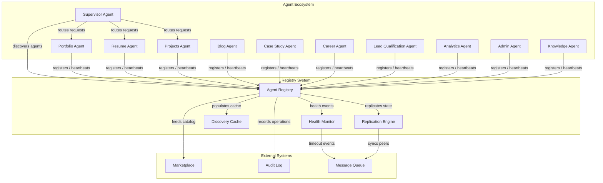

---

## 2. Terminology & Definitions

| Term                   | Definition                                                                                                   |
| ---------------------- | ------------------------------------------------------------------------------------------------------------ |
| **Agent**              | A specialized AI worker with a defined domain, capabilities, and endpoint                                    |
| **Agent Record**       | The registry's persistent representation of a single agent                                                   |
| **Agent ID**           | A globally unique identifier assigned at registration (UUIDv7)                                               |
| **Capability**         | A named, versioned function or service an agent exposes                                                      |
| **Endpoint**           | The base URL at which an agent's API is reachable                                                            |
| **Heartbeat**          | A periodic liveness signal sent from an agent to the registry                                                |
| **Health State**       | The current operational status of an agent (healthy/degraded/unhealthy/unknown)                              |
| **Stale Agent**        | An agent whose heartbeat has not been received within the configured interval                                |
| **Registration Token** | A pre-shared secret used to authenticate registration requests                                               |
| **Agent Manifest**     | A machine-readable document describing an agent's identity and capabilities                                  |
| **Discovery Query**    | A structured request to find agents matching capability or metadata filters                                  |
| **Marketplace**        | The catalog system that surfaces available agents for installation, defined in `docs/ai/AgentMarketplace.md` |

---

## 3. System Context & Scope

### 3.1 In Scope

- Agent registration, update, and deregistration lifecycle
- Real-time health monitoring via heartbeat protocol
- Stale agent detection and automatic cleanup
- Capability-based agent discovery
- Cross-instance registry state replication
- Authentication and authorization for all registry operations
- Audit logging of all registry mutations
- Marketplace catalog feed generation

### 3.2 Out of Scope

- Agent runtime execution and process management
- Agent-to-agent communication routing (handled by Supervisor)
- Agent RAG pipeline configuration (defined in `docs/ai/19-RAG.md`)
- Agent memory persistence (defined in `docs/ai/18-AGENTS.md` §17)
- Agent capability definition format (defined in `docs/ai/AgentCapabilities.md`)
- Marketplace installation and billing logic (defined in `docs/ai/AgentMarketplace.md`)

---

## 4. Design Principles

| Principle                   | Rationale                                                                |
| --------------------------- | ------------------------------------------------------------------------ |
| **API-first**               | All registry operations are exposed via versioned REST APIs              |
| **Eventually consistent**   | Replication across instances favors availability over strict consistency |
| **Self-healing**            | Stale agents are automatically deregistered and alerted                  |
| **Immutable audit trail**   | All record changes produce append-only audit entries                     |
| **Least privilege**         | Registration requires scoped tokens; queries enforce RBAC                |
| **Bounded staleness**       | No agent state is considered fresh beyond 3 missed heartbeats            |
| **Idempotent registration** | Re-registering the same agent_id updates rather than duplicates          |

---

## 5. Registry Data Model

The registry stores agent data in a structured, indexed datastore (PostgreSQL with JSONB for flexible metadata). The core entity is the **Agent Record**, which tracks identity, capabilities, endpoint, authentication, health, and operational metadata.

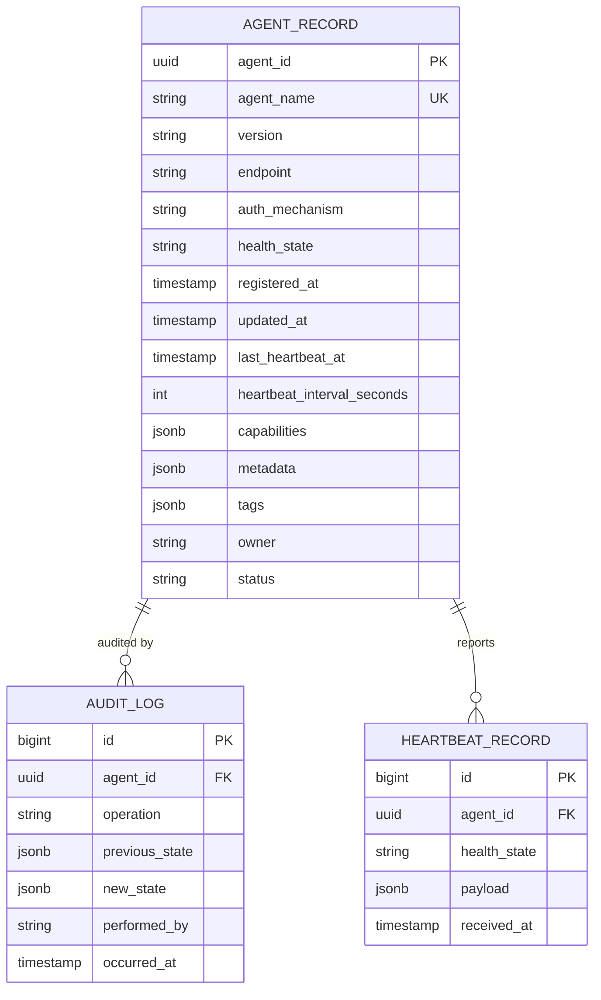

---

## 6. Agent Record Schema

```python
# app/registry/models.py
from uuid import UUID, uuid7
from datetime import datetime
from enum import Enum
from typing import Optional
from pydantic import BaseModel, Field, HttpUrl

class HealthState(str, Enum):
    HEALTHY = "healthy"
    DEGRADED = "degraded"
    UNHEALTHY = "unhealthy"
    UNKNOWN = "unknown"

class AgentStatus(str, Enum):
    ACTIVE = "active"
    INACTIVE = "inactive"
    DEREGISTERED = "deregistered"
    SUSPENDED = "suspended"
    ARCHIVED = "archived"

class CapabilityDeclaration(BaseModel):
    name: str = Field(..., description="Capability identifier, e.g. 'document-query'")
    version: str = Field(..., description="Semantic version of this capability")
    description: str = Field(default="", description="Human-readable description")
    input_schema: dict = Field(default={}, description="JSON Schema for input")
    output_schema: dict = Field(default={}, description="JSON Schema for output")
    dependencies: list[str] = Field(default=[], description="Required downstream capabilities")
    confidence_threshold: float = Field(default=0.7, ge=0.0, le=1.0)

class AuthConfig(BaseModel):
    mechanism: str = Field(..., description="One of: 'api_key', 'jwt', 'mtls', 'none'")
    key_hint: Optional[str] = Field(default=None, description="Last 4 chars of API key for identification")
    allowed_roles: list[str] = Field(default=["agent"], description="RBAC roles permitted")

class AgentRecord(BaseModel):
    agent_id: UUID = Field(default_factory=uuid7)
    agent_name: str = Field(..., min_length=2, max_length=128, pattern=r"^[a-zA-Z0-9_-]+$")
    version: str = Field(..., pattern=r"^\d+\.\d+\.\d+$")
    display_name: Optional[str] = Field(default=None, max_length=256)
    description: str = Field(default="", max_length=2048)
    endpoint: HttpUrl
    auth: AuthConfig
    health_state: HealthState = HealthState.UNKNOWN
    health_state_reason: str = Field(default="pending_registration")
    status: AgentStatus = AgentStatus.ACTIVE
    capabilities: list[CapabilityDeclaration] = Field(default=[])
    metadata: dict = Field(default={})
    tags: list[str] = Field(default=[])
    owner: str = Field(default="system")
    heartbeat_interval_seconds: int = Field(default=30, ge=5, le=300)
    last_heartbeat_at: Optional[datetime] = Field(default=None)
    registered_at: datetime = Field(default_factory=datetime.utcnow)
    updated_at: datetime = Field(default_factory=datetime.utcnow)
```

---

## 7. Status Tracking Model

Each agent record transitions through a well-defined status lifecycle. Status reflects the agent's administrative state (as opposed to health state, which reflects runtime liveness).

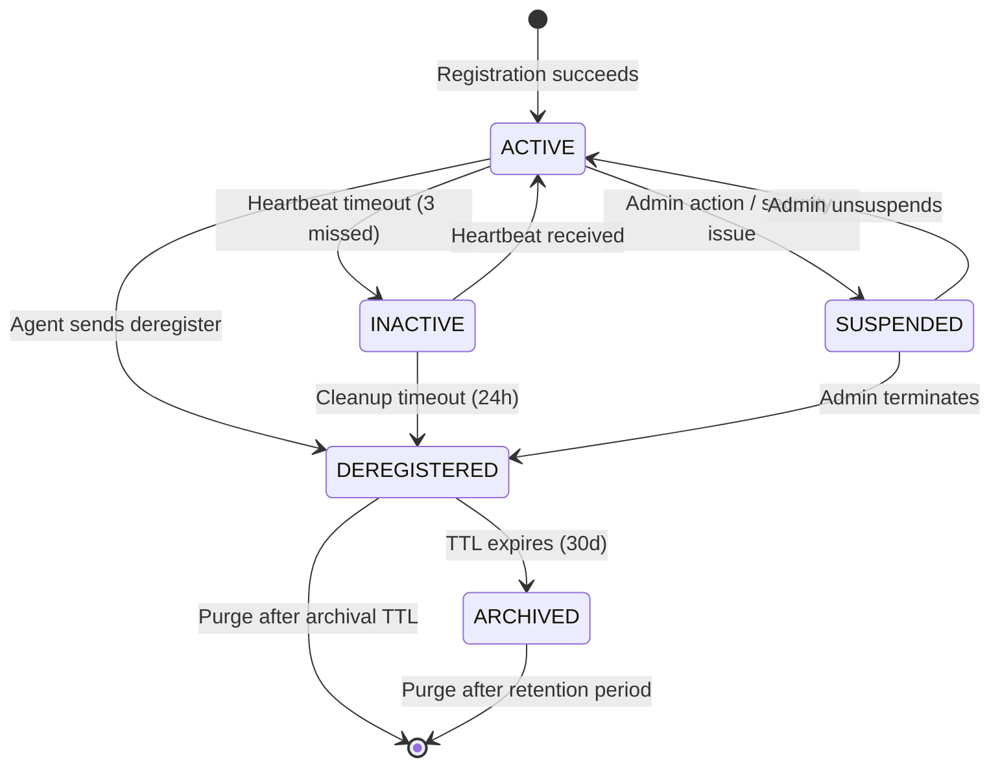

| Status           | Definition                                                         | Transition Triggers                      |
| ---------------- | ------------------------------------------------------------------ | ---------------------------------------- |
| **ACTIVE**       | Agent is registered, authenticated, and accepting requests         | Registration, heartbeat, unsuspend       |
| **INACTIVE**     | Agent failed to send heartbeat; considered potentially unreachable | Heartbeat timeout (3 consecutive misses) |
| **SUSPENDED**    | Administrative hold — agent is blocked from receiving traffic      | Admin API, security incident             |
| **DEREGISTERED** | Agent explicitly removed or cleaned up after prolonged inactivity  | Deregister API, stale cleanup            |
| **ARCHIVED**     | Historical record retained for audit; no longer queryable          | Automatic after DEREGISTERED TTL         |

---

## 8. Health State Machine

Health state is a runtime property updated by heartbeat and health check polling. It is distinct from status — an agent can be ACTIVE but UNHEALTHY (responding to heartbeats but reporting errors internally).

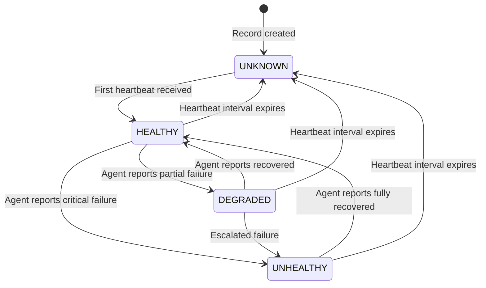

| Health State  | Meaning                                                              | Effect on Routing                                        |
| ------------- | -------------------------------------------------------------------- | -------------------------------------------------------- |
| **HEALTHY**   | Agent operating normally with all capabilities available             | Full routing eligibility                                 |
| **DEGRADED**  | Agent operational but some capabilities unavailable or degraded      | Partial routing; Supervisor avoids degraded capabilities |
| **UNHEALTHY** | Agent not functioning; may still send heartbeats with error payloads | No routing; alerts triggered                             |
| **UNKNOWN**   | No heartbeat received within expected window                         | No routing; cleanup timer starts                         |

---

## 9. Metadata Schema

Agents can attach arbitrary key-value metadata during registration and update. The registry validates structure against an optional schema if one is declared.

```json
{
  "agent_id": "0190f3b2-7a1c-7b00-8000-123456789abc",
  "agent_name": "lead-qualification-agent",
  "metadata": {
    "runtime": {
      "framework": "langchain",
      "python_version": "3.12",
      "dependencies": {
        "langchain": "0.3.0",
        "openai": "1.30.0"
      }
    },
    "deployment": {
      "provider": "kubernetes",
      "namespace": "agents",
      "replicas": 2,
      "region": "us-east-1"
    },
    "llm": {
      "provider": "openai",
      "model": "gpt-4o",
      "temperature": 0.3,
      "max_tokens": 4096
    },
    "knowledge_bases": ["lead-scoring-rules", "qualification-criteria", "industry-verticals"],
    "owner": {
      "team": "ai-platform",
      "contact": "ai-team@example.com",
      "slack_channel": "#agent-lead-qual"
    }
  },
  "tags": ["production", "critical-path", "llm-gpt4o"]
}
```

### Reserved Metadata Keys

| Key               | Type          | Purpose                                         |
| ----------------- | ------------- | ----------------------------------------------- |
| `runtime`         | object        | Agent runtime environment details               |
| `deployment`      | object        | Infrastructure deployment context               |
| `llm`             | object        | LLM provider and model configuration            |
| `knowledge_bases` | array[string] | References to KB collections used               |
| `owner`           | object        | Team ownership and contact information          |
| `marketplace`     | object        | Marketplace-specific listing metadata (see §42) |

---

## 10. Registration Flow

Agent registration follows a multi-step protocol ensuring both parties agree on identity, capabilities, and authentication.

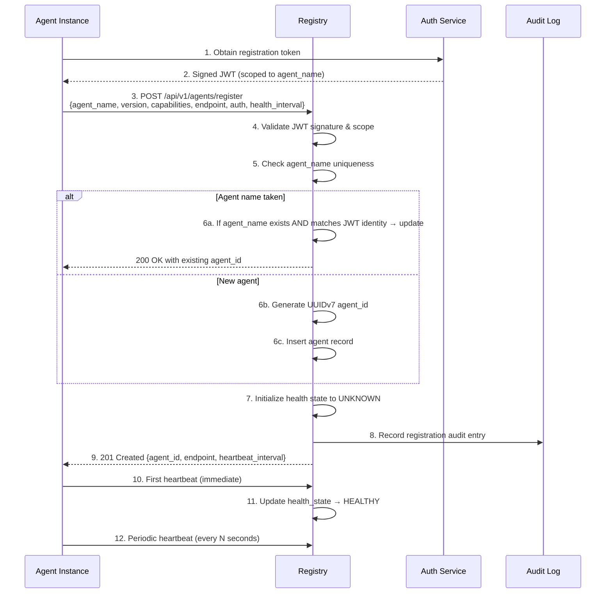

---

## 11. Registration Protocol

### 11.1 Prerequisites

Before an agent can register, it must:

1. Be deployed and reachable at its declared endpoint
2. Possess a valid registration token or JWT issued by the Auth Service
3. Have a unique `agent_name` matching the pattern `^[a-zA-Z0-9_-]+$`
4. Have a semver version string (e.g., `1.2.3`)
5. Declare at least one capability (or an explicit empty array is permitted for utility agents)

### 11.2 Registration Token

Tokens are issued per agent identity and are scoped to a single `agent_name`. The token payload includes:

```json
{
  "sub": "lead-qualification-agent",
  "iss": "auth.service.internal",
  "aud": "registry.service.internal",
  "exp": 1893456000,
  "iat": 1700000000,
  "scope": "agent:register",
  "agent_name": "lead-qualification-agent",
  "allowed_roles": ["agent", "worker"]
}
```

---

## 12. Registration Request Format

```json
POST /api/v1/agents/register
Content-Type: application/json
Authorization: Bearer <registration_token>

{
  "agent_name": "lead-qualification-agent",
  "version": "2.1.0",
  "display_name": "Lead Qualification Agent",
  "description": "Scores and qualifies incoming leads based on intent, firmographics, and behavioral signals",
  "endpoint": "https://agents.internal.example.com/lead-qualification",
  "auth": {
    "mechanism": "jwt",
    "allowed_roles": ["agent", "supervisor"]
  },
  "capabilities": [
    {
      "name": "score-lead",
      "version": "2.1.0",
      "description": "Score a lead based on conversation context and firmographic data",
      "input_schema": {
        "type": "object",
        "properties": {
          "conversation_id": {"type": "string"},
          "visitor_data": {"type": "object"}
        },
        "required": ["conversation_id"]
      },
      "output_schema": {
        "type": "object",
        "properties": {
          "score": {"type": "number", "minimum": 0, "maximum": 100},
          "tier": {"type": "string", "enum": ["hot", "warm", "cold"]}
        }
      },
      "confidence_threshold": 0.8
    },
    {
      "name": "qualify-company",
      "version": "1.3.0",
      "description": "Enrich and qualify a company profile",
      "input_schema": {
        "type": "object",
        "properties": {
          "domain": {"type": "string", "format": "hostname"}
        },
        "required": ["domain"]
      },
      "confidence_threshold": 0.75
    }
  ],
  "heartbeat_interval_seconds": 30,
  "metadata": {
    "runtime": {"framework": "langchain", "python_version": "3.12"},
    "llm": {"provider": "openai", "model": "gpt-4o"}
  },
  "tags": ["production", "lead-generation", "critical-path"]
}
```

---

## 13. Registration Response Format

```json
HTTP/1.1 201 Created
Content-Type: application/json

{
  "agent_id": "0190f3b2-7a1c-7b00-8000-123456789abc",
  "agent_name": "lead-qualification-agent",
  "version": "2.1.0",
  "status": "active",
  "health_state": "unknown",
  "heartbeat_interval_seconds": 30,
  "endpoint": "https://agents.internal.example.com/lead-qualification",
  "registered_at": "2026-06-18T10:30:00Z",
  "next_heartbeat_due_at": "2026-06-18T10:30:30Z",
  "self_link": "/api/v1/agents/0190f3b2-7a1c-7b00-8000-123456789abc"
}
```

---

## 14. Deregistration Flow

Agents should gracefully deregister when shutting down. The registry marks the record as DEREGISTERED and retains an archived copy for audit.

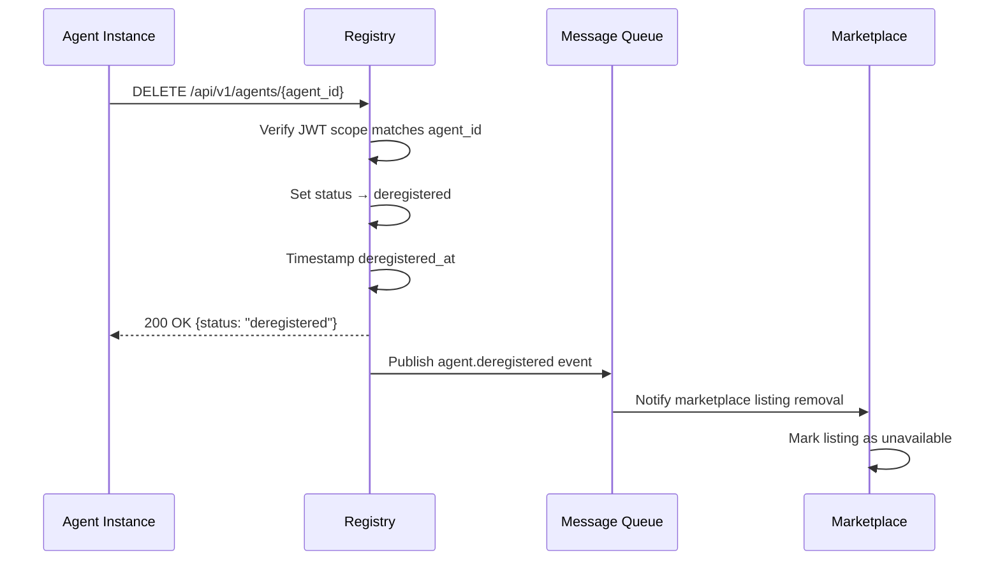

---

## 15. Registration Validation Rules

| Rule                  | Validation                                                                   | Error Code                   |
| --------------------- | ---------------------------------------------------------------------------- | ---------------------------- |
| agent_name uniqueness | No duplicate active agent_name                                               | `AGENT_NAME_TAKEN`           |
| agent_name format     | Must match `^[a-zA-Z0-9_-]{2,128}$`                                          | `INVALID_AGENT_NAME`         |
| Version format        | Must be valid semver (`\d+.\d+.\d+`)                                         | `INVALID_VERSION`            |
| Endpoint reachability | Registry performs initial connectivity check (optional, configurable)        | `ENDPOINT_UNREACHABLE`       |
| Capability names      | Each capability name must be unique per agent and match `^[a-z][a-z0-9_-]*$` | `INVALID_CAPABILITY_NAME`    |
| Auth mechanism        | Must be one of: `api_key`, `jwt`, `mtls`, `none`                             | `INVALID_AUTH_MECHANISM`     |
| Heartbeat interval    | Must be between 5 and 300 seconds                                            | `INVALID_HEARTBEAT_INTERVAL` |
| JWT scope             | Token `agent_name` claim must match request `agent_name`                     | `TOKEN_SCOPE_MISMATCH`       |

---

## 16. Registry API Overview

All endpoints are prefixed with `/api/v1/agents` unless otherwise noted. The API uses standard HTTP methods, JSON request/response bodies, and Bearer JWT authentication.

| Method | Path                                  | Description                                         |
| ------ | ------------------------------------- | --------------------------------------------------- |
| POST   | `/api/v1/agents/register`             | Register a new agent or re-register an existing one |
| PUT    | `/api/v1/agents/{agent_id}`           | Full update of an agent record                      |
| GET    | `/api/v1/agents/{agent_id}`           | Retrieve a single agent record                      |
| GET    | `/api/v1/agents`                      | List agents with optional filters                   |
| DELETE | `/api/v1/agents/{agent_id}`           | Deregister an agent                                 |
| PATCH  | `/api/v1/agents/{agent_id}/heartbeat` | Send a heartbeat signal                             |
| POST   | `/api/v1/agents/query`                | Capability-based agent discovery                    |
| GET    | `/api/v1/agents/health`               | Registry health check endpoint                      |

### Standard Headers

| Header          | Required    | Description                                                                   |
| --------------- | ----------- | ----------------------------------------------------------------------------- |
| `Authorization` | Yes         | Bearer JWT for registration; optional for discovery queries depending on RBAC |
| `Content-Type`  | Yes         | `application/json`                                                            |
| `X-Request-Id`  | Recommended | Idempotency key for registration and heartbeat                                |
| `X-Agent-Id`    | Recommended | Agent identifier for audit trail attribution                                  |

### Standard Error Response

```json
{
  "error": {
    "code": "AGENT_NAME_TAKEN",
    "message": "An active agent with name 'lead-qualification-agent' already exists. Use PUT to update.",
    "details": {
      "existing_agent_id": "0190f3b2-7a1c-7b00-8000-123456789abc",
      "existing_status": "active"
    },
    "request_id": "req-abc123"
  }
}
```

---

## 17. POST /api/v1/agents/register

Creates a new agent record or reacts an existing one (matched by `agent_name`).

**Request:** See [§12 Registration Request Format](#12-registration-request-format)

**Response Codes:**

| Code | Condition                                                       |
| ---- | --------------------------------------------------------------- |
| 201  | New agent registered successfully                               |
| 200  | Existing agent updated successfully (agent_name matched)        |
| 400  | Validation failure (missing fields, invalid format)             |
| 401  | Missing or invalid Authorization header                         |
| 403  | JWT scope mismatch (token `agent_name` != request `agent_name`) |
| 409  | agent_name taken and token scope does not match existing owner  |
| 422  | Capability schema validation failure                            |

**Idempotency:** If the same `X-Request-Id` is sent within 5 minutes for the same `agent_name`, the registry returns the existing record without modification.

---

## 18. PUT /api/v1/agents/{agent_id}

Full replacement of an agent record. All fields except `agent_id`, `agent_name`, `registered_at` can be updated.

```json
PUT /api/v1/agents/0190f3b2-7a1c-7b00-8000-123456789abc
Authorization: Bearer <token>

{
  "version": "2.2.0",
  "display_name": "Lead Qualification Agent v2",
  "description": "Updated description",
  "endpoint": "https://agents.internal.example.com/lead-qualification-v2",
  "auth": {
    "mechanism": "jwt",
    "allowed_roles": ["agent", "supervisor", "admin"]
  },
  "capabilities": [
    {
      "name": "score-lead",
      "version": "2.2.0",
      "description": "Updated scoring with ML model v3",
      "confidence_threshold": 0.85
    }
  ],
  "heartbeat_interval_seconds": 15,
  "metadata": {
    "llm": {"model": "gpt-4o-mini"}
  },
  "tags": ["production", "lead-generation", "ml-v3"]
}
```

---

## 19. GET /api/v1/agents/{agent_id}

Retrieves the full agent record. Returns 404 if the agent does not exist or is archived.

```json
GET /api/v1/agents/0190f3b2-7a1c-7b00-8000-123456789abc
Authorization: Bearer <token>

{
  "agent_id": "0190f3b2-7a1c-7b00-8000-123456789abc",
  "agent_name": "lead-qualification-agent",
  "version": "2.1.0",
  "display_name": "Lead Qualification Agent",
  "description": "Scores and qualifies incoming leads",
  "endpoint": "https://agents.internal.example.com/lead-qualification",
  "auth": {
    "mechanism": "jwt",
    "key_hint": null,
    "allowed_roles": ["agent", "supervisor"]
  },
  "health_state": "healthy",
  "health_state_reason": "heartbeat_received",
  "status": "active",
  "capabilities": [
    {
      "name": "score-lead",
      "version": "2.1.0",
      "description": "Score a lead based on conversation context and firmographic data",
      "confidence_threshold": 0.8
    }
  ],
  "heartbeat_interval_seconds": 30,
  "last_heartbeat_at": "2026-06-18T10:45:22Z",
  "registered_at": "2026-06-18T10:30:00Z",
  "updated_at": "2026-06-18T10:45:22Z",
  "metadata": { ... },
  "tags": ["production"],
  "owner": "ai-platform"
}
```

---

## 20. GET /api/v1/agents

Lists agents with optional query parameters. Supports pagination, filtering, and field selection.

### Query Parameters

| Parameter    | Type   | Default      | Description                                                                               |
| ------------ | ------ | ------------ | ----------------------------------------------------------------------------------------- |
| `status`     | string | `active`     | Filter by status: `active`, `inactive`, `suspended`, `all`                                |
| `health`     | string | —            | Filter by health state: `healthy`, `degraded`, `unhealthy`, `unknown`                     |
| `capability` | string | —            | Filter agents that declare a capability matching this name                                |
| `tag`        | string | —            | Filter agents having this tag                                                             |
| `owner`      | string | —            | Filter by owner team                                                                      |
| `search`     | string | —            | Full-text search across agent_name, display_name, description                             |
| `page`       | int    | 1            | Page number (1-indexed)                                                                   |
| `page_size`  | int    | 20           | Items per page (1-100)                                                                    |
| `sort_by`    | string | `agent_name` | Sort field: `agent_name`, `version`, `health_state`, `registered_at`, `last_heartbeat_at` |
| `sort_order` | string | `asc`        | Sort direction: `asc`, `desc`                                                             |
| `fields`     | string | —            | Comma-separated subset of fields to return                                                |

### Example Response

```json
GET /api/v1/agents?status=active&health=healthy&capability=score-lead&page_size=5

{
  "data": [
    {
      "agent_id": "0190f3b2-7a1c-7b00-8000-123456789abc",
      "agent_name": "lead-qualification-agent",
      "version": "2.1.0",
      "health_state": "healthy",
      "status": "active",
      "endpoint": "https://agents.internal.example.com/lead-qualification",
      "last_heartbeat_at": "2026-06-18T10:45:22Z"
    }
  ],
  "pagination": {
    "page": 1,
    "page_size": 5,
    "total_items": 12,
    "total_pages": 3,
    "next_page": "/api/v1/agents?page=2&page_size=5&status=active&health=healthy&capability=score-lead",
    "prev_page": null
  }
}
```

---

## 21. DELETE /api/v1/agents/{agent_id}

Deregisters an agent. The record is soft-deleted (status → `deregistered`) and retained for 30 days before archival.

```json
DELETE /api/v1/agents/0190f3b2-7a1c-7b00-8000-123456789abc
Authorization: Bearer <token>

{
  "status": "deregistered",
  "deregistered_at": "2026-06-18T11:00:00Z",
  "retention_until": "2026-07-18T11:00:00Z",
  "self_link": "/api/v1/agents/0190f3b2-7a1c-7b00-8000-123456789abc"
}
```

---

## 22. PATCH /api/v1/agents/{agent_id}/heartbeat

Updates the agent's health state and last heartbeat timestamp. This is the primary liveness mechanism (see [§25 Heartbeat Mechanism](#25-heartbeat-mechanism)).

```json
PATCH /api/v1/agents/0190f3b2-7a1c-7b00-8000-123456789abc/heartbeat
Authorization: Bearer <token>

{
  "health_state": "healthy",
  "message": "All capabilities nominal",
  "metrics": {
    "avg_response_time_ms": 245,
    "requests_handled": 1520,
    "error_rate": 0.002,
    "uptime_seconds": 86400
  },
  "capability_status": {
    "score-lead": "healthy",
    "qualify-company": "healthy"
  }
}
```

Response:

```json
{
  "agent_id": "0190f3b2-7a1c-7b00-8000-123456789abc",
  "health_state": "healthy",
  "status": "active",
  "heartbeat_accepted_at": "2026-06-18T10:45:22Z",
  "next_heartbeat_due_at": "2026-06-18T10:45:52Z",
  "missed_heartbeats": 0
}
```

---

## 23. POST /api/v1/agents/query

Capability-based discovery endpoint. Returns agents matching specified capability, tag, and metadata filters.

```json
POST /api/v1/agents/query
Authorization: Bearer <token>

{
  "required_capabilities": ["score-lead"],
  "optional_capabilities": ["qualify-company", "enrich-profile"],
  "min_confidence": 0.7,
  "health_states": ["healthy", "degraded"],
  "tags": ["production"],
  "max_results": 5,
  "prefer_same_region": true
}
```

```json
{
  "results": [
    {
      "agent_id": "0190f3b2-7a1c-7b00-8000-123456789abc",
      "agent_name": "lead-qualification-agent",
      "endpoint": "https://agents.internal.example.com/lead-qualification",
      "health_state": "healthy",
      "capabilities": ["score-lead", "qualify-company"],
      "region": "us-east-1",
      "match_score": 0.95,
      "rank": 1
    }
  ],
  "total_matches": 3,
  "query_id": "qry-abc456"
}
```

---

## 24. Health Monitoring Architecture

The Health Monitor is a background process that runs inside the registry service. It:

1. Tracks expected heartbeat times for each agent
2. Processes incoming heartbeat PATCH requests
3. Detects missed heartbeats and transitions health states
4. Triggers stale agent cleanup workflows
5. Publishes health state change events to the message queue

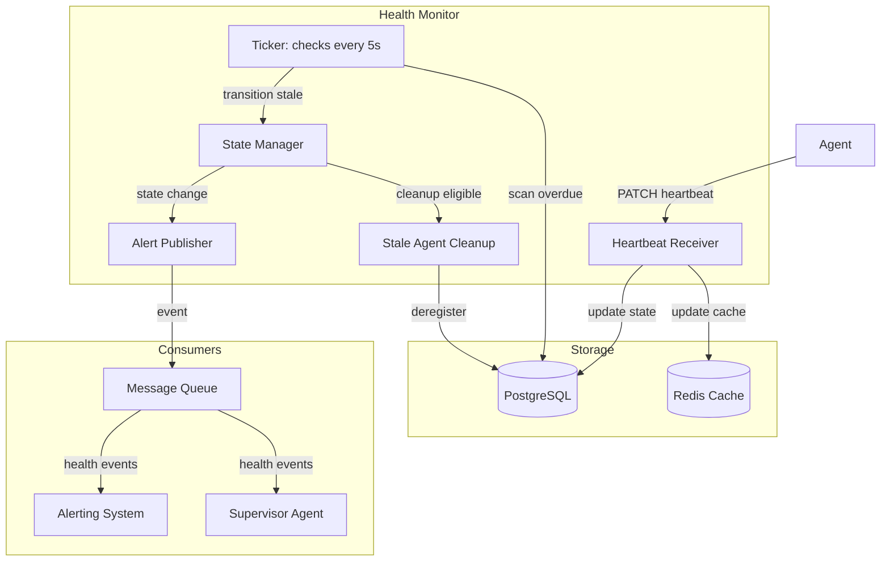

---

## 25. Heartbeat Mechanism

### 25.1 Heartbeat Protocol

Each agent sends a heartbeat via `PATCH /api/v1/agents/{agent_id}/heartbeat` at the interval specified during registration (`heartbeat_interval_seconds`, default 30s). The registry uses a grace period of 3 missed heartbeats before transitioning the agent to INACTIVE status.

### 25.2 Heartbeat Timing

| Metric                              | Value                                                                 |
| ----------------------------------- | --------------------------------------------------------------------- |
| Default heartbeat interval          | 30 seconds                                                            |
| Minimum interval                    | 5 seconds                                                             |
| Maximum interval                    | 300 seconds                                                           |
| Missed heartbeats before INACTIVE   | 3                                                                     |
| Missed heartbeats before UNHEALTHY  | 2 (if degraded), 1 (if previously healthy with degraded capabilities) |
| Cleanup grace period after INACTIVE | 24 hours                                                              |
| Registry ticker check interval      | 5 seconds                                                             |

### 25.3 Heartbeat Processing Flow

```python
# app/registry/heartbeat.py
from datetime import datetime, timedelta
from uuid import UUID

class HeartbeatProcessor:
    async def process_heartbeat(
        self, agent_id: UUID, payload: HeartbeatPayload
    ) -> HeartbeatResponse:
        record = await self.store.get_agent(agent_id)
        if not record:
            raise AgentNotFoundError(agent_id)

        now = datetime.utcnow()
        missed_count = 0

        if record.last_heartbeat_at:
            expected_interval = timedelta(seconds=record.heartbeat_interval_seconds)
            elapsed = now - record.last_heartbeat_at
            if elapsed > expected_interval * 1.5:
                missed_count = int(elapsed / expected_interval) - 1

        record.health_state = payload.health_state
        record.health_state_reason = payload.message or "heartbeat_received"
        record.last_heartbeat_at = now
        record.status = AgentStatus.ACTIVE
        record.updated_at = now

        await self.store.update_agent(record)
        await self.audit_log.record(
            agent_id=agent_id,
            operation="heartbeat",
            payload=payload.model_dump()
        )

        next_due = now + timedelta(seconds=record.heartbeat_interval_seconds)
        return HeartbeatResponse(
            agent_id=agent_id,
            health_state=record.health_state,
            status=record.status,
            heartbeat_accepted_at=now,
            next_heartbeat_due_at=next_due,
            missed_heartbeats=missed_count,
        )
```

### 25.4 Heartbeat with Capability Status

Agents may optionally report per-capability health in their heartbeat payload. This allows the Supervisor to route around degraded capabilities while still sending requests to the agent for other capabilities.

```json
{
  "health_state": "degraded",
  "message": "qualify-company capability unavailable due to downstream API outage",
  "capability_status": {
    "score-lead": "healthy",
    "qualify-company": "unhealthy"
  }
}
```

---

## 26. Health State Definitions

| State         | Definition                                                                                                   | Heartbeat Requirement                                                                     | Routing Eligibility                 |
| ------------- | ------------------------------------------------------------------------------------------------------------ | ----------------------------------------------------------------------------------------- | ----------------------------------- |
| **HEALTHY**   | All capabilities operational; agent responding within expected latency                                       | Recent heartbeat received (within 1x interval)                                            | Full                                |
| **DEGRADED**  | Agent operational with one or more capabilities reporting unhealthy; or response latency exceeds 2x baseline | Recent heartbeat received                                                                 | Partial (healthy capabilities only) |
| **UNHEALTHY** | Agent reporting critical failures; or no heartbeat for 2x interval; or endpoint unreachable on probe         | Heartbeat received but payload declares critical failure, OR no heartbeat for 2 intervals | None                                |
| **UNKNOWN**   | Agent registered but no heartbeat ever received, or heartbeat not received for 3x interval                   | No heartbeat received in 3x the configured interval                                       | None                                |

---

## 27. Health Transition Rules

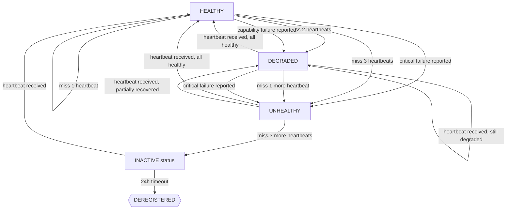

---

## 28. Stale Agent Cleanup

### 28.1 Cleanup Policy

The stale agent cleanup process runs every 60 seconds and identifies agents that have not sent heartbeats within their configured timeout window.

| Time Since Last Heartbeat  | Action                                                                  |
| -------------------------- | ----------------------------------------------------------------------- |
| 1x interval                | No action (within normal window)                                        |
| 2x interval                | Transition health_state to UNHEALTHY (if currently HEALTHY or DEGRADED) |
| 3x interval                | Transition status to INACTIVE; publish `agent.stale` event              |
| 24 hours after INACTIVE    | Transition status to DEREGISTERED; publish `agent.deregistered` event   |
| 30 days after DEREGISTERED | Transition to ARCHIVED; soft-delete record data                         |
| 90 days after ARCHIVED     | Hard-delete record; purge from database                                 |

### 28.2 Cleanup Implementation

```python
# app/registry/cleanup.py
from datetime import datetime, timedelta

class StaleAgentCleanup:
    def __init__(self, store, event_publisher, audit_log):
        self.store = store
        self.event_publisher = event_publisher
        self.audit_log = audit_log
        self.batch_size = 100

    async def run_cleanup_cycle(self):
        now = datetime.utcnow()
        cutoff = now - timedelta(hours=24)
        deregistered_cutoff = now - timedelta(days=30)

        # 1. Mark stale agents as inactive
        stale_agents = await self.store.find_agents_stale_since(
            status="active",
            cutoff=now - timedelta(seconds=3 * 30),  # 3 missed heartbeats
            limit=self.batch_size,
        )
        for agent in stale_agents:
            agent.status = "inactive"
            agent.health_state = "unhealthy"
            agent.health_state_reason = "heartbeat_timeout"
            await self.store.update_agent(agent)
            await self.event_publisher.publish("agent.stale", {
                "agent_id": str(agent.agent_id),
                "agent_name": agent.agent_name,
                "last_heartbeat_at": agent.last_heartbeat_at.isoformat(),
                "missed_heartbeats": 3,
            })
            await self.audit_log.record(
                agent_id=agent.agent_id,
                operation="stale_transition",
                detail="Transitioned to inactive due to heartbeat timeout",
            )

        # 2. Deregister agents inactive for 24h
        expired_inactive = await self.store.find_agents_by_status(
            status="inactive",
            updated_before=cutoff,
            limit=self.batch_size,
        )
        for agent in expired_inactive:
            agent.status = "deregistered"
            agent.health_state_reason = "cleanup_after_24h_inactive"
            await self.store.update_agent(agent)
            await self.event_publisher.publish("agent.deregistered", {
                "agent_id": str(agent.agent_id),
                "agent_name": agent.agent_name,
                "reason": "inactivity_cleanup",
            })

        # 3. Archive deregistered agents after 30 days
        expired_deregistered = await self.store.find_agents_by_status(
            status="deregistered",
            updated_before=deregistered_cutoff,
            limit=self.batch_size,
        )
        for agent in expired_deregistered:
            agent.status = "archived"
            await self.store.update_agent(agent)
```

---

## 29. Health Alerting

When an agent transitions to an unhealthy or inactive state, the registry publishes structured events to the message queue for downstream consumption.

### Event Types

| Event                    | Trigger                    | Payload                                                 |
| ------------------------ | -------------------------- | ------------------------------------------------------- |
| `agent.heartbeat.missed` | 1st missed heartbeat       | agent_id, agent_name, interval, last_heartbeat_at       |
| `agent.health.degraded`  | Transition to DEGRADED     | agent_id, agent_name, previous_state, new_state, reason |
| `agent.health.unhealthy` | Transition to UNHEALTHY    | agent_id, agent_name, previous_state, new_state, reason |
| `agent.stale`            | Transition to INACTIVE     | agent_id, agent_name, last_heartbeat_at, missed_count   |
| `agent.deregistered`     | Transition to DEREGISTERED | agent_id, agent_name, reason                            |
| `agent.recovered`        | Transition back to HEALTHY | agent_id, agent_name, previous_state, downtime_seconds  |

```python
# Example: event publishing on state transition
async def _publish_health_event(
    self, agent: AgentRecord, previous_state: str, new_state: str
):
    event = {
        "event_type": f"agent.health.{new_state}",
        "source": "agent-registry",
        "timestamp": datetime.utcnow().isoformat(),
        "agent_id": str(agent.agent_id),
        "agent_name": agent.agent_name,
        "previous_state": previous_state,
        "new_state": new_state,
        "reason": agent.health_state_reason,
        "downtime_seconds": None,
    }
    if new_state == "healthy" and previous_state in ("unhealthy", "degraded"):
        if agent.last_heartbeat_at and agent.registered_at:
            event["downtime_seconds"] = (
                datetime.utcnow() - agent.last_heartbeat_at
            ).total_seconds()
    await self.event_publisher.publish(event["event_type"], event)
```

---

## 30. Agent Discovery

Agent discovery enables the Supervisor (and other authorized agents) to find agents by capability, health state, tags, and region. The discovery subsystem maintains an in-memory cache backed by Redis for low-latency lookups.

### Discovery Methods

| Method                        | Latency               | Use Case                         |
| ----------------------------- | --------------------- | -------------------------------- |
| Direct DB query (POST /query) | < 100ms               | Complex capability queries       |
| Redis cache lookup            | < 5ms                 | High-frequency routing decisions |
| Local in-memory cache         | < 1ms                 | Hot-path Supervisor routing      |
| Registry replication sync     | Eventually consistent | Cross-instance discovery         |

---

## 31. Supervisor Discovery Protocol

The Supervisor Agent uses the registry to discover available specialists before routing user requests. The protocol follows a cached-first, query-second pattern.

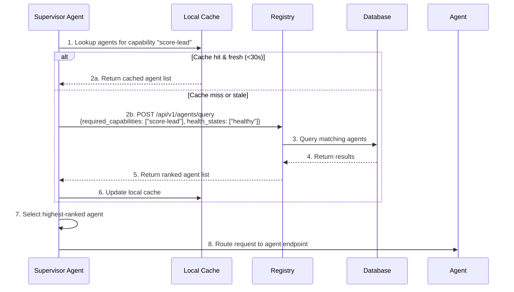

### Cache Invalidation

The Supervisor's local cache is invalidated when:

- A health state change event is received from the message queue
- The cache entry age exceeds the configured TTL (default 30s)
- A routing attempt fails with a connection error (triggering immediate re-query)

---

## 32. Capability-Based Discovery

The registry supports rich capability queries that go beyond simple name matching. Agents can be discovered by:

### 32.1 Exact Capability Match

Find agents that declare a capability with the exact name `score-lead`.

```json
POST /api/v1/agents/query
{
  "required_capabilities": ["score-lead"],
  "match_mode": "exact"
}
```

### 32.2 Semantic Capability Match

Find agents whose capability descriptions semantically match a search query (requires embedding index).

```json
POST /api/v1/agents/query
{
  "required_capabilities": ["score-lead"],
  "match_mode": "semantic",
  "semantic_query": "qualify and score inbound sales leads based on conversation analysis"
}
```

### 32.3 Capability Compatibility

The Supervisor can query for agents whose capabilities are compatible with a given input/output schema.

```json
POST /api/v1/agents/query
{
  "required_capabilities": ["score-lead"],
  "match_mode": "schema_compatible",
  "input_schema": {
    "type": "object",
    "properties": {
      "conversation_id": {"type": "string"}
    },
    "required": ["conversation_id"]
  }
}
```

---

## 33. Discovery Caching

### 33.1 Cache Hierarchy

| Level | Store                | TTL | Invalidation                           |
| ----- | -------------------- | --- | -------------------------------------- |
| L1    | Supervisor in-memory | 30s | Event-driven + TTL expiry              |
| L2    | Redis cluster        | 60s | TTL expiry + write-through on mutation |
| L3    | PostgreSQL           | —   | Source of truth                        |

### 33.2 Cache Key Format

```
registry:discovery:capability:{capability_name}:{health_state}:{tag}
registry:discovery:agent:{agent_id}
registry:discovery:all_active
```

### 33.3 Cache Warming

On registry startup and after any replication sync, the cache is warmed by loading all active agents with HEALTHY or DEGRADED state into Redis.

```python
async def warm_discovery_cache(self):
    active_agents = await self.store.find_agents_by_status("active")
    healthy_agents = [a for a in active_agents if a.health_state in ("healthy", "degraded")]

    # Populate capability index
    for agent in healthy_agents:
        for cap in agent.capabilities:
            key = f"registry:discovery:capability:{cap.name}:{agent.health_state}"
            await self.cache.sadd(key, str(agent.agent_id))

    # Set TTL for cache entries
    await self.cache.expire("registry:discovery:all_active", 60)
```

---

## 34. Registry Replication

To ensure high availability, the registry can be deployed across multiple instances. Replication propagates registry state changes to all peer instances.

### 34.1 Replication Triggers

| Trigger        | Description                               |
| -------------- | ----------------------------------------- |
| Registration   | New agent record created                  |
| Update         | Agent record modified                     |
| Deregistration | Agent status changed to deregistered      |
| Heartbeat      | Health state or last_heartbeat_at changed |
| Cleanup        | Stale agent automatically deregistered    |

### 34.2 Replication Scope

The following fields are replicated:

- `agent_id`, `agent_name`, `version`, `display_name`, `description`
- `endpoint`, `auth` (excluding key_hint and secrets)
- `health_state`, `health_state_reason`, `status`
- `capabilities` (full list)
- `metadata`, `tags`, `owner`
- `last_heartbeat_at`, `registered_at`, `updated_at`

---

## 35. Replication Protocol

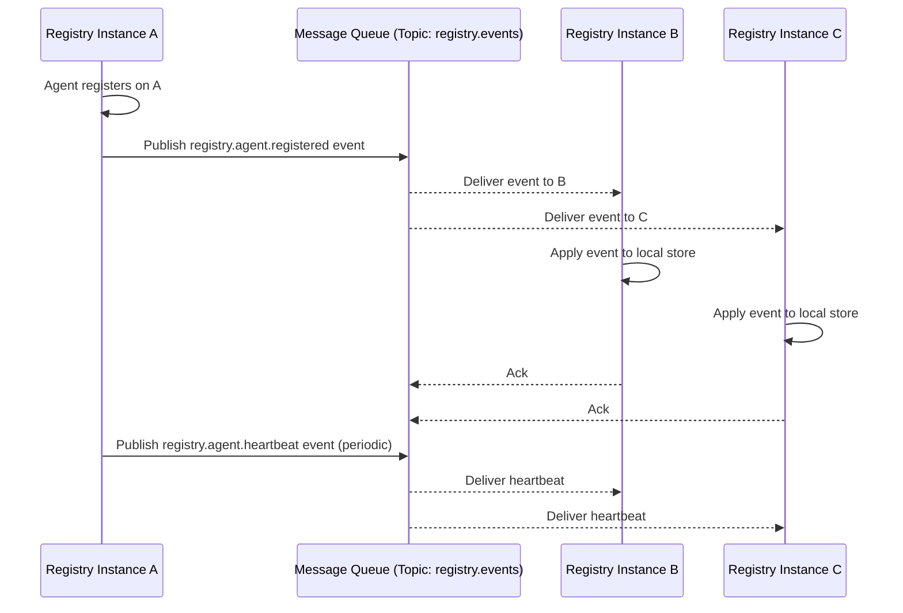

### Event Format

```json
{
  "event_type": "registry.agent.registered",
  "event_version": 1,
  "source_instance": "registry-a-7f9b3c",
  "timestamp": "2026-06-18T10:30:00.123Z",
  "sequence_id": 1042,
  "agent": {
    "agent_id": "0190f3b2-7a1c-7b00-8000-123456789abc",
    "agent_name": "lead-qualification-agent",
    "version": "2.1.0",
    "status": "active",
    "health_state": "unknown",
    "capabilities": [{ "name": "score-lead", "version": "2.1.0" }],
    "endpoint": "https://agents.internal.example.com/lead-qualification",
    "last_heartbeat_at": null,
    "registered_at": "2026-06-18T10:30:00Z",
    "updated_at": "2026-06-18T10:30:00Z"
  }
}
```

---

## 36. Conflict Resolution

When two instances receive concurrent updates for the same agent record, the registry uses a last-writer-wins strategy based on `updated_at` timestamps.

### 36.1 Conflict Detection

```python
class ConflictResolver:
    STRATEGIES = {
        "last_writer_wins": lambda a, b: a if a["updated_at"] >= b["updated_at"] else b,
        "merge_metadata": lambda a, b: _merge_metadata(a, b),
    }

    async def resolve(self, local: dict, remote: dict) -> dict:
        if local["updated_at"] == remote["updated_at"]:
            # Same timestamp: merge non-destructive fields
            return self.STRATEGIES["merge_metadata"](local, remote)
        return self.STRATEGIES["last_writer_wins"](local, remote)

    def _merge_metadata(self, local: dict, remote: dict) -> dict:
        merged = {**local, **remote}
        merged["metadata"] = {**local.get("metadata", {}), **remote.get("metadata", {})}
        merged["tags"] = list(set(local.get("tags", []) + remote.get("tags", [])))
        merged["updated_at"] = max(local["updated_at"], remote["updated_at"])
        return merged
```

### 36.2 Conflict Scenarios

| Scenario                                              | Resolution                                                                       |
| ----------------------------------------------------- | -------------------------------------------------------------------------------- |
| Two instances register same agent_name simultaneously | First to commit wins; second gets AGENT_NAME_TAKEN                               |
| Concurrent heartbeat + capability update              | Heartbeat (updated_at newer) wins; capability change preserved in metadata merge |
| Re-registration during network partition              | Last heartbeat wins on reconnection; capability set from latest registration     |

---

## 37. Replication Topology

### 37.1 Leaderless (Peer-to-Peer)

All registry instances are equal peers. Each instance accepts writes and publishes events to a shared message queue topic (`registry.events`). Consumers on all other instances apply the events locally.

**Pros:** No single point of failure; linear scalability.
**Cons:** Eventual consistency; potential for conflicts under concurrent writes.

```
[Registry A] <---> (Message Queue Topic: registry.events) <---> [Registry B]
                                                                    |
                                                                    |
[Registry C] <---> (Message Queue Topic: registry.events) <---> [Registry D]
```

### 37.2 Anti-Entropy Sync

In addition to event-driven replication, a periodic anti-entropy job (every 60s) compares checksums of the full agent record set across instances and repairs any divergence.

```python
async def run_anti_entropy(self):
    local_checksum = await self._compute_checksum()
    peer_checksums = await self._fetch_peer_checksums()

    for peer_id, peer_checksum in peer_checksums.items():
        if local_checksum != peer_checksum:
            diverged = await self._find_divergent_records(peer_id)
            for agent_id in diverged:
                local_record = await self.store.get_agent(agent_id)
                peer_record = await self._fetch_peer_record(peer_id, agent_id)
                resolved = await self.conflict_resolver.resolve(
                    local_record.model_dump(), peer_record
                )
                await self.store.update_agent(AgentRecord(**resolved))
```

---

## 38. Security Architecture

### 38.1 Security Layers

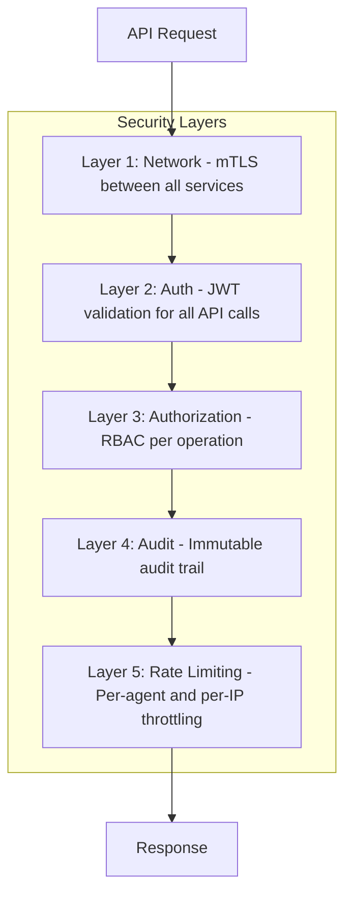

### 38.2 Security Policies

| Policy                                                    | Description                                             |
| --------------------------------------------------------- | ------------------------------------------------------- |
| All inter-service communication requires mTLS             | Certificates issued by internal CA with 90-day rotation |
| Registration requires JWT with `agent:register` scope     | Token must include `agent_name` claim matching request  |
| Heartbeat requires JWT with `agent:heartbeat` scope       | Token scoped to specific agent_id                       |
| Discovery queries require JWT with `agent:discover` scope | Supervisor-issued tokens only                           |
| Admin operations require JWT with `admin:*` scope         | Human operators via SSO                                 |
| All mutations are logged to immutable audit store         | Append-only log with cryptographic chain                |
| Rate limiting: 100 req/s per agent, 1000 req/s aggregate  | Implemented via Redis sliding window counter            |

---

## 39. Authentication for Registration

### 39.1 Registration Token Flow

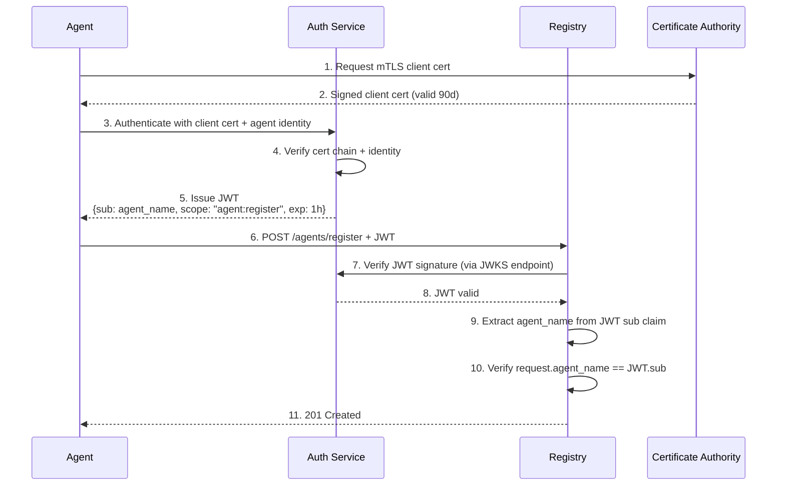

### 39.2 Token Requirements

| Requirement       | Specification                                                                          |
| ----------------- | -------------------------------------------------------------------------------------- |
| Token type        | JWT (RFC 7519)                                                                         |
| Signing algorithm | RS256 (asymmetric, 4096-bit RSA key)                                                   |
| Token expiry      | Maximum 1 hour (registration), 24 hours (heartbeat)                                    |
| JWKS endpoint     | `https://auth.internal.example.com/.well-known/jwks.json`                              |
| Required claims   | `sub`, `iss`, `aud`, `exp`, `iat`, `scope`                                             |
| Scope format      | `agent:{operation}` where operation is `register`, `heartbeat`, `discover`, or `admin` |

---

## 40. Access Control for Queries

### 40.1 RBAC Model

| Role          | Permitted Operations                                  | Typical Holder                   |
| ------------- | ----------------------------------------------------- | -------------------------------- |
| `agent`       | Heartbeat on own record, read own record              | Individual agent instances       |
| `supervisor`  | Discovery queries, read any active record             | Supervisor Agent                 |
| `admin`       | All operations including suspension, force-deregister | Human operators, CI/CD pipelines |
| `marketplace` | List active agents with marketplace metadata          | Marketplace service              |
| `auditor`     | Read-only access to agent records and audit logs      | Compliance tooling               |

### 40.2 Scope Enforcement

```python
# app/registry/authz.py
from enum import Enum

class Role(str, Enum):
    AGENT = "agent"
    SUPERVISOR = "supervisor"
    ADMIN = "admin"
    MARKETPLACE = "marketplace"
    AUDITOR = "auditor"

PERMISSION_MATRIX = {
    Role.AGENT: {
        "register": ["self"],
        "heartbeat": ["self"],
        "read": ["self"],
    },
    Role.SUPERVISOR: {
        "discover": ["*"],
        "read": ["*"],
        "query": ["*"],
    },
    Role.ADMIN: {
        "register": ["*"],
        "heartbeat": ["*"],
        "read": ["*"],
        "write": ["*"],
        "delete": ["*"],
        "suspend": ["*"],
    },
    Role.MARKETPLACE: {
        "read": ["*"],
        "list": ["*"],
    },
    Role.AUDITOR: {
        "read": ["*"],
        "audit_log": ["*"],
    },
}

async def authorize(role: Role, operation: str, target_agent_id: UUID, token_agent_name: str) -> bool:
    allowed = PERMISSION_MATRIX.get(role, {}).get(operation, [])
    if "*" in allowed:
        return True
    if "self" in allowed:
        return str(target_agent_id) == token_agent_name
    return False
```

---

## 41. Audit Logging

All registry mutations produce an immutable audit entry. The audit log is append-only and cryptographically chained using a hash lattice.

### 41.1 Audit Record Schema

```json
{
  "id": 284719,
  "agent_id": "0190f3b2-7a1c-7b00-8000-123456789abc",
  "operation": "agent.updated",
  "performed_by": "lead-qualification-agent",
  "performer_role": "agent",
  "source_ip": "10.0.1.42",
  "previous_state": {
    "version": "2.1.0",
    "health_state": "healthy",
    "status": "active",
    "capabilities": [{ "name": "score-lead", "version": "2.1.0" }]
  },
  "new_state": {
    "version": "2.2.0",
    "health_state": "healthy",
    "status": "active",
    "capabilities": [{ "name": "score-lead", "version": "2.2.0" }]
  },
  "diff": {
    "version": { "old": "2.1.0", "new": "2.2.0" },
    "capabilities/0/version": { "old": "2.1.0", "new": "2.2.0" }
  },
  "previous_hash": "a1b2c3d4...",
  "hash": "e5f6g7h8...",
  "occurred_at": "2026-06-18T11:00:00.456Z"
}
```

### 41.2 Audit Retention

| Tier                        | Retention | Storage                                    |
| --------------------------- | --------- | ------------------------------------------ |
| Hot (queryable via API)     | 90 days   | PostgreSQL partitioned table               |
| Warm (downloadable archive) | 1 year    | S3 / GCS compressed JSONL                  |
| Cold (compliance backup)    | 7 years   | Glacier / Archive with cryptographic proof |

---

## 42. Integration with Marketplace

The Agent Registry feeds the Marketplace catalog, which is defined in `docs/ai/AgentMarketplace.md`. The integration ensures that only healthy, active agents with marketplace metadata are surfaced as installable listings.

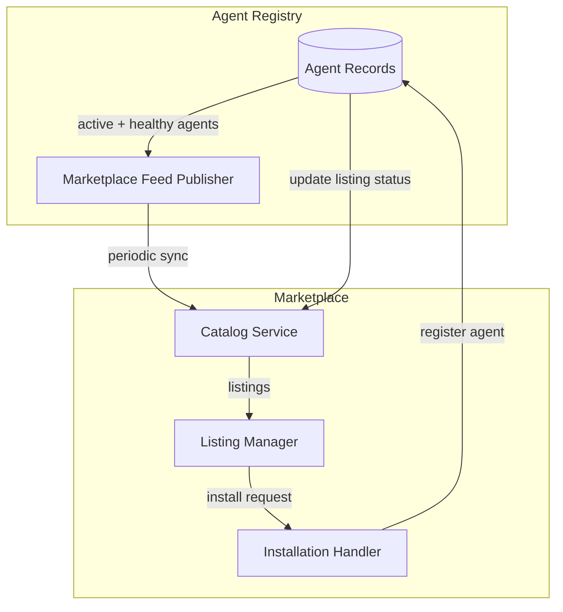

---

## 43. Marketplace Catalog Feed

### 43.1 Feed Generation

The registry generates a catalog feed containing agents that meet marketplace eligibility criteria:

- Status is ACTIVE
- Health state is HEALTHY or DEGRADED
- Has populated `metadata.marketplace` section
- Has at least one capability with `public: true` in the marketplace metadata

### 43.2 Feed Format

```json
GET /api/v1/agents/marketplace-feed

{
  "generated_at": "2026-06-18T12:00:00Z",
  "feed_version": 2,
  "agents": [
    {
      "agent_id": "0190f3b2-7a1c-7b00-8000-123456789abc",
      "agent_name": "lead-qualification-agent",
      "version": "2.1.0",
      "display_name": "Lead Qualification Agent",
      "description": "Scores and qualifies incoming leads based on intent, firmographics, and behavioral signals",
      "marketplace": {
        "category": "sales-intelligence",
        "pricing_tier": "included",
        "public": true,
        "featured": false,
        "documentation_url": "https://docs.internal.example.com/agents/lead-qualification",
        "icon_url": "https://cdn.internal.example.com/icons/lead-qual.svg",
        "screenshots": [],
        "rating": 4.5,
        "install_count": 12,
        "tags": ["lead-generation", "sales", "qualification"],
        "changelog_url": "https://github.com/internal/agents/blob/main/lead-qualification/CHANGELOG.md",
        "license": "MIT",
        "maintainer": "ai-platform@example.com"
      },
      "capabilities": [
        {
          "name": "score-lead",
          "version": "2.1.0",
          "description": "Score a lead based on conversation context and firmographic data",
          "public": true
        }
      ],
      "health_state": "healthy",
      "uptime_pct_7d": 99.97,
      "avg_response_time_ms": 245
    }
  ],
  "pagination": {
    "total": 8,
    "page": 1,
    "page_size": 50
  }
}
```

### 43.3 Feed Sync Schedule

| Sync Type           | Cadence                    | Mechanism                                                       |
| ------------------- | -------------------------- | --------------------------------------------------------------- |
| Full catalog sync   | Every 5 minutes            | Marketplace pulls from registry feed endpoint                   |
| Incremental updates | Real-time (event-driven)   | Registry publishes `marketplace.agent.updated` event per change |
| Health state sync   | On every health transition | Registry publishes `marketplace.agent.health_changed` event     |

---

## 44. Agent Publishing Workflow

An agent becomes visible in the Marketplace through the following workflow:

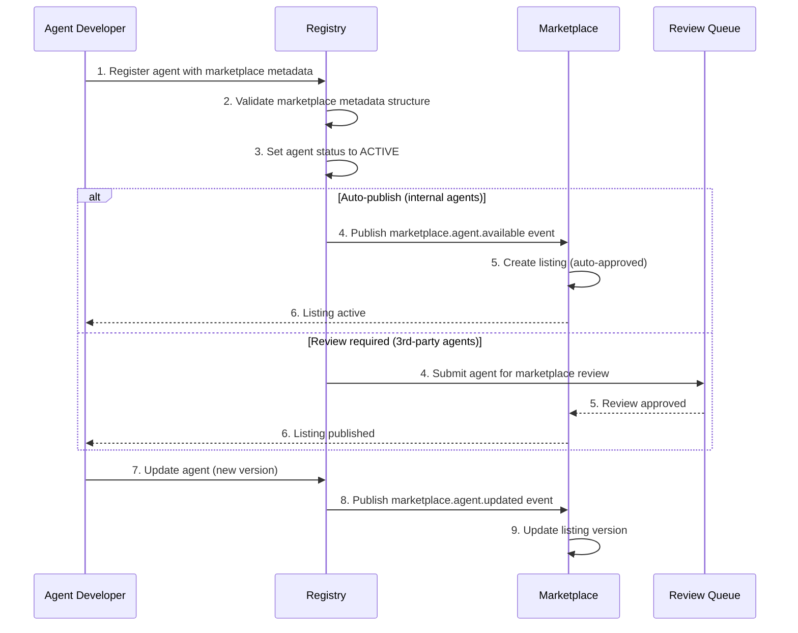

---

## 45. Observability & Monitoring

### 45.1 Key Metrics

| Metric                               | Type      | Description                           | Alert Threshold        |
| ------------------------------------ | --------- | ------------------------------------- | ---------------------- |
| `registry.agents.total`              | Gauge     | Total registered agents (by status)   | —                      |
| `registry.agents.healthy`            | Gauge     | Count of healthy agents               | < 80% of total active  |
| `registry.heartbeats.received`       | Counter   | Heartbeats received per second        | < expected rate \* 0.5 |
| `registry.heartbeats.latency_ms`     | Histogram | Heartbeat processing latency          | p99 > 500ms            |
| `registry.api.requests`              | Counter   | API request volume per endpoint       | —                      |
| `registry.api.latency_ms`            | Histogram | API response time                     | p99 > 1000ms           |
| `registry.stale.cleaned`             | Counter   | Stale agents cleaned up per cycle     | —                      |
| `registry.replication.lag_ms`        | Gauge     | Replication latency between instances | > 2000ms               |
| `registry.discovery.cache_hit_ratio` | Gauge     | Cache hit ratio for discovery queries | < 0.90                 |

### 45.2 Health Check Endpoint

```json
GET /api/v1/agents/health

{
  "status": "healthy",
  "version": "1.0.0",
  "uptime_seconds": 86400,
  "checks": {
    "database": {"status": "healthy", "latency_ms": 3},
    "redis": {"status": "healthy", "latency_ms": 1},
    "message_queue": {"status": "healthy", "latency_ms": 5},
    "replication": {"status": "healthy", "lag_ms": 12}
  },
  "metrics": {
    "total_agents": 14,
    "healthy_agents": 12,
    "degraded_agents": 1,
    "unhealthy_agents": 0,
    "unknown_agents": 1,
    "active_agents": 13,
    "stale_agents": 0
  }
}
```

---

## 46. Failure Modes & Recovery

| Failure Mode            | Impact                              | Detection                                                | Recovery                                                                                     |
| ----------------------- | ----------------------------------- | -------------------------------------------------------- | -------------------------------------------------------------------------------------------- |
| Registry instance crash | Writes unavailable on that instance | Health check failure, LB detects                         | Other instances serve reads; crashed instance restarts and syncs via replication             |
| Database unavailable    | All registry operations fail        | Connection pool errors, health check fails               | Circuit breaker engages; reads served from Redis cache (stale); writes queued to dead-letter |
| Heartbeat burst         | Overload on heartbeat endpoint      | Request latency spikes, CPU high                         | Rate limiter engages; heartbeat processing scaled horizontally                               |
| Network partition       | Replication lag; partial writes     | Peer health checks fail; anti-entropy detects divergence | On reconnection: full anti-entropy sync, conflict resolution                                 |
| Message queue down      | Replication paused                  | Producer/consumer errors                                 | In-memory queue (bounded, 10k events); replay on reconnect                                   |
| Corrupted agent record  | Discovery returns bad endpoint      | Validation error on routing; agent health check fails    | Record quarantined; admin alerted; repair from audit log                                     |

### Graceful Degradation

When the registry is unavailable, agents and the Supervisor fall back to their last-known-good cache. The Supervisor continues routing using cached agent data, marking any agent whose cache entry is older than 5 minutes as UNKNOWN and avoiding routing to it until the registry is reachable again.

```python
class DiscoveryFallback:
    async def discover(self, capability: str) -> list[AgentRecord]:
        try:
            return await self.registry_client.query(capabilities=[capability])
        except RegistryUnavailableError:
            logger.warning("Registry unavailable; using cached discovery")
            cached = await self.local_cache.get(f"capability:{capability}")
            if cached:
                # Filter out entries older than 5 minutes
                fresh = [
                    c for c in cached
                    if (datetime.utcnow() - c.cached_at).total_seconds() < 300
                ]
                if fresh:
                    return [c.record for c in fresh]
            return []
```

---

## 47. API Versioning & Deprecation

### 47.1 Versioning Strategy

The registry API uses URL-based versioning (`/api/v1/agents/...`). API versions are:

- **Stable**: Fully supported, no breaking changes within major version
- **Deprecated**: Still functional but scheduled for removal; returns `Sunset` header
- **Sunset**: Removed from the codebase; returns 410 Gone

### 47.2 Version Lifecycle

| Phase      | Duration                 | Behavior                                                                     |
| ---------- | ------------------------ | ---------------------------------------------------------------------------- |
| Active     | Indefinite               | Full support, all features                                                   |
| Deprecated | 90 days                  | Returns `Warning: 299 registry "v1 will be removed after YYYY-MM-DD"` header |
| Sunset     | After deprecation period | Returns 410 Gone with migration link                                         |

### 47.3 Backward Compatibility

When breaking changes are necessary, the registry supports a migration window:

1. New API version is released alongside the old version (dual-running)
2. Old version is deprecated with a 90-day notice
3. Agents are expected to migrate within the deprecation window
4. A migration guide is published at `/api/v1/migration-guide`

---

## 48. Related Documents

| Document                                  | Relation                                                             |
| ----------------------------------------- | -------------------------------------------------------------------- |
| `docs/ai/18-AGENTS.md`                    | Defines the multi-agent architecture that the registry supports      |
| `docs/ai/AgentMarketplace.md`             | Defines the marketplace catalog that consumes registry data          |
| `docs/ai/AgentCapabilities.md`            | Defines the capability declaration format used in agent records      |
| `docs/ai/17-AI_INSTRUCTIONS.md`           | AI Operating Model that governs agent behavior                       |
| `docs/ai/19-RAG.md`                       | RAG pipeline configuration referenced in agent metadata              |
| `docs/security/SecurityArchitecture.md`   | Enterprise security policies that registry authentication implements |
| `docs/operations/22-OBSERVABILITY.md`     | Observability framework for registry metrics and alerting            |
| `docs/operations/55-DISASTER-RECOVERY.md` | DR procedures that cover registry failure scenarios                  |
| `docs/api/44-API-STANDARDS.md`            | API conventions followed by the registry endpoints                   |
| `docs/security/43-DATA-GOVERNANCE.md`     | Data governance policies for registry data retention                 |

---

## 48.1 Decision Log

| ID          | Decision                                                                | Context                 | Rationale                                                                                                                                                  | Alternatives Considered                                                                                                                              | Decision Date | Revisit Date |
| ----------- | ----------------------------------------------------------------------- | ----------------------- | ---------------------------------------------------------------------------------------------------------------------------------------------------------- | ---------------------------------------------------------------------------------------------------------------------------------------------------- | ------------- | ------------ |
| REG-DEC-001 | Versioned registry API with content negotiation (Accept header)         | API versioning strategy | URL-less versioning avoids cluttered endpoints; enables gradual client migration; Accept header routing is standard REST practice                          | URL path versioning (`/v1/agents`) — simpler but forces client updates on version bump; Query parameter versioning — non-standard, easily overlooked | Jun 2026      | Dec 2026     |
| REG-DEC-002 | Strict semantic versioning (MAJOR.MINOR.PATCH) with pre-release labels  | Version schema          | Semver provides machine-readable compatibility guarantees; pre-release labels enable canary testing; industry standard for package ecosystems              | CalVer (date-based, no compatibility signaling), ZeroVer (no semantic meaning, inappropriate for enterprise)                                         | Jun 2026      | Dec 2026     |
| REG-DEC-003 | PostgreSQL with JSONB for agent metadata storage over document database | Storage backend         | JSONB provides flexible schema for heterogeneous agent metadata while maintaining relational integrity for queries (version ranges, dependency resolution) | MongoDB (operational overhead of additional database), DynamoDB (lock-in, complex query limitations)                                                 | Jun 2026      | Dec 2026     |
| REG-DEC-004 | Webhook-based notification on registration and update events            | Event propagation       | Enables real-time marketplace catalog refresh, monitoring integration, and CI/CD pipeline triggers without polling                                         | Polling (increased latency, wasted compute on empty checks), Message queue publish (additional infrastructure complexity)                            | Jun 2026      | Sep 2026     |
| REG-DEC-005 | Signed attestation stored alongside agent metadata in registry          | Provenance storage      | Stores verifiable build provenance as part of agent record; enables audit trail without external artifact repository lookup                                | External attestation storage (additional lookup latency, split-brain risk), Attestation in package only (not available before download)              | Jun 2026      | Dec 2026     |

## 48.2 Risk Register

| ID          | Risk                                                                          | Likelihood | Impact                                        | Mitigation                                                                                                                                       | Owner             | Status |
| ----------- | ----------------------------------------------------------------------------- | ---------- | --------------------------------------------- | ------------------------------------------------------------------------------------------------------------------------------------------------ | ----------------- | ------ |
| REG-RSK-001 | Registry becomes single point of failure for agent discovery and deployment   | Low        | Critical (all agent operations blocked)       | Multi-region active-passive deployment; read replicas for catalog queries; local catalog replica on each agent node for offline operation        | Platform Engineer | Active |
| REG-RSK-002 | Version conflict causes dependency resolution failure during agent deployment | Medium     | High (deployment pipeline blocked)            | Backtracking resolver with conflict reporting; `dry-run` mode for pre-deployment validation; dependency freeze file for reproducible deployments | Platform Engineer | Active |
| REG-RSK-003 | Registry API is overwhelmed by concurrent agent sync requests                 | Medium     | Medium (degraded performance, timeouts)       | Client-side sync scheduling with jitter; read-through caching with 1h TTL; rate limiting per agent node; auto-scaling for API layer              | Platform Engineer | Active |
| REG-RSK-004 | Malformed agent metadata causes parsing failures in downstream consumers      | Low        | Medium (partial agent catalog unavailability) | Richer manifest validation (JSON Schema + custom rules); required fields enforcement at API layer; backwards-compatible schema versioning        | Platform Engineer | Active |
| REG-RSK-005 | Registry data loss due to database corruption or operational error            | Low        | Critical (complete agent catalog loss)        | Point-in-time recovery with 5-minute RPO; hourly automated backups to separate region; disaster recovery runbook with 1-hour RTO                 | Platform Engineer | Active |

## 48.3 Glossary

| Term                      | Definition                                                                                                                     |
| ------------------------- | ------------------------------------------------------------------------------------------------------------------------------ |
| **Agent Record**          | The full set of metadata stored in the registry for a single agent, including manifest, versions, signatures, and attestations |
| **Attestation**           | A signed statement about how and when an agent artifact was built, typically conforming to SLSA provenance format              |
| **Backtracking Resolver** | A dependency resolver that, on encountering a conflict, undoes previous decisions and tries alternative version combinations   |
| **Canary Channel**        | A pre-release distribution channel for testing new versions on a limited set of agents before stable rollout                   |
| **Content Negotiation**   | An HTTP mechanism where client and server agree on a response format via Accept headers                                        |
| **Dependency Freeze**     | A pinned set of exact dependency versions that ensures reproducible deployments                                                |
| **JSONB**                 | PostgreSQL's binary JSON storage format, supporting indexing and querying while preserving JSON document structure             |
| **Provenance**            | Verifiable metadata describing the build process, including builder identity, build parameters, and source references          |
| **Registry Replica**      | A local copy of the registry's agent catalog stored on each agent node for offline operation and reduced latency               |
| **Semver**                | Semantic Versioning (MAJOR.MINOR.PATCH) with machine-readable compatibility semantics                                          |

---

## 49. ## Glossary

| Term                | Definition                                                                                                  |
| ------------------- | ----------------------------------------------------------------------------------------------------------- |
| Agent Registry      | Central catalog of all AI agents with capability manifests, knowledge sources, and permissions              |
| Capability Manifest | JSON document declaring an agent's domain, tools, knowledge sources, and constraints                        |
| Model Assignment    | The specific LLM model allocated to each agent (GPT-4, Claude, GPT-3.5) based on task complexity            |
| Permission Model    | 3-tier access control: Public (read-only), Operational (read+write leads/cache), Admin (full system access) |
| Knowledge Source    | Document collection or database table an agent is authorized to query via RAG                               |
| Per-Agent Metrics   | Performance tracking per agent: accuracy, latency, confidence, fallback rate                                |

---

## Change Log

| Version | Date       | Author             | Changes                                                      |
| ------- | ---------- | ------------------ | ------------------------------------------------------------ |
| 1.0     | 2026-06-18 | Chief AI Architect | Initial release — comprehensive agent registry specification |

---

> ⚠️ **Implementation Status:** Design Spec Only. Not implemented in current codebase.
