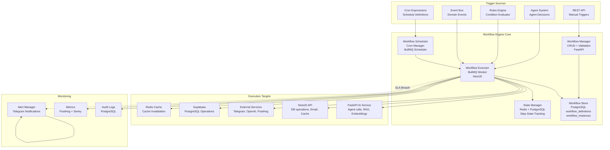
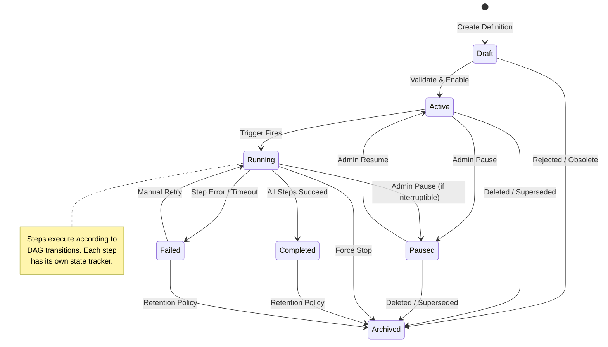
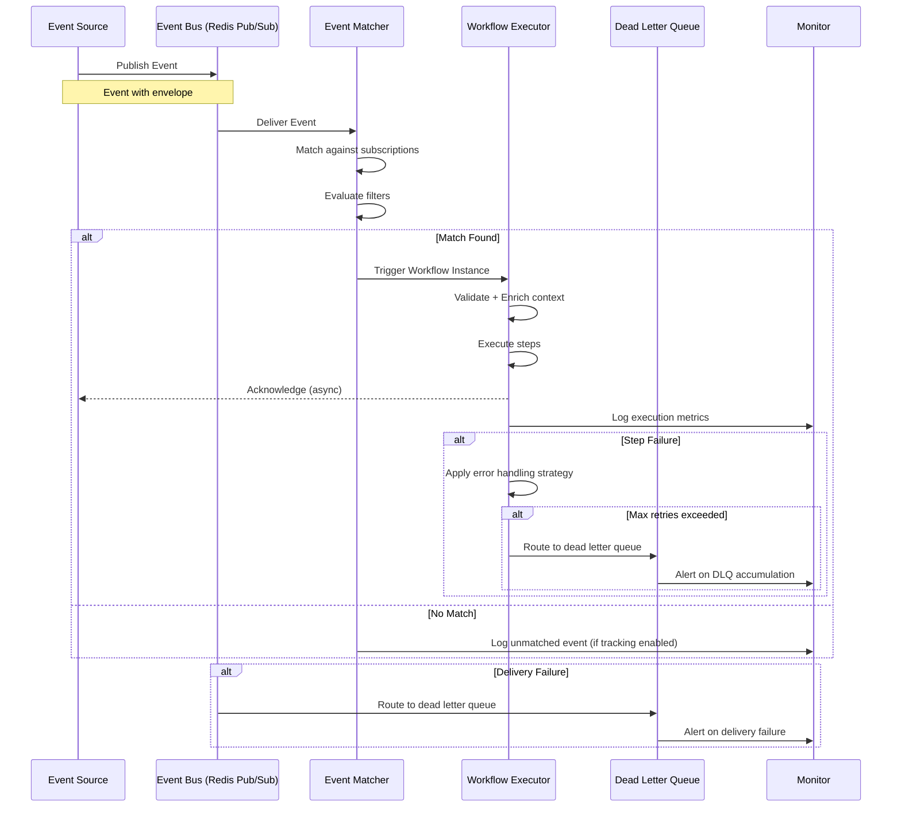
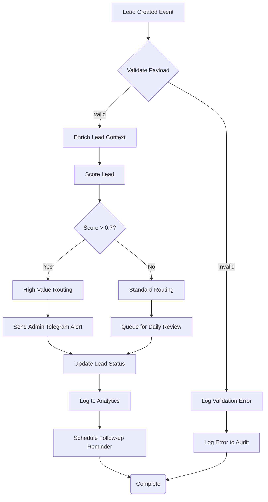
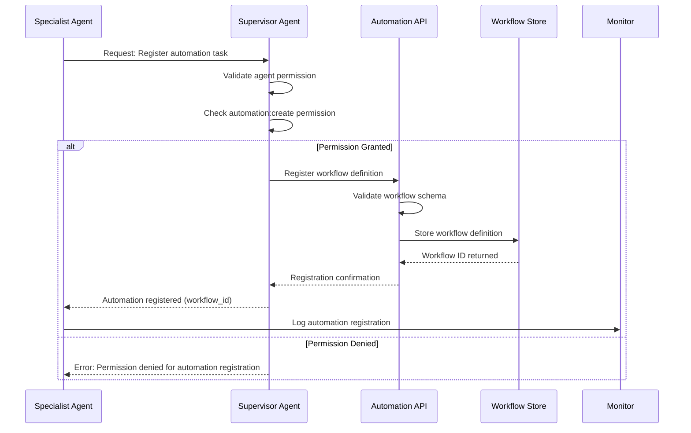

> **Status:** 🎯 DESIGN SPEC — Not Implemented
> This document describes an aspirational future design. The features described here are NOT yet implemented in the codebase.
> For current AI implementation documentation, see:
> - [AI Strategy](../docs/ai/strategy.md)
> - [Model Decision Matrix](../docs/ai/model-decision-matrix.md)

# Automation Architecture — Workflow Orchestration & Event-Driven Process Automation

> **Document:** `AutomationArchitecture.md` | **Version:** 1.0 | **Last Updated:** June 2026
> **Status:** Active | **Owner:** Chief AI Architect | **Review Cadence:** Monthly
> **Classification:** Enterprise Architecture | **Platform:** FastAPI + NestJS + BullMQ + Redis
> **Orchestration Pattern:** Hybrid (Scheduled + Event-Driven + Rule-Based)
> **Execution Runtime:** BullMQ Workers + FastAPI Background Tasks + Cron Pods

---

## Executive Summary

Defines the automation architecture for CI/CD pipelines - build automation, test automation, deployment automation, infrastructure-as-code, scheduled jobs, and webhook-driven workflows.

---

## Table of Contents

1. [Executive Summary](#1-executive-summary)
2. [Automation Types](#2-automation-types)
3. [Workflow Engine Architecture](#3-workflow-engine-architecture)
4. [Workflow Lifecycle](#4-workflow-lifecycle)
5. [Scheduling System](#5-scheduling-system)
6. [Event Automation](#6-event-automation)
7. [Conditional Automation (Rules Engine)](#7-conditional-automation-rules-engine)
8. [Automation Catalog](#8-automation-catalog)
9. [Automation Security](#9-automation-security)
10. [Monitoring & Alerting](#10-monitoring--alerting)
11. [Integration with Agent System](#11-integration-with-agent-system)
12. [Related Documents](#12-related-documents)
13. [## Change Log](#13-change-log)

---

## 1. Executive Summary

### 1.1 Purpose

The Automation Architecture defines how automated workflows, scheduled tasks, and event-driven processes are orchestrated across the agent ecosystem. It provides a unified framework for defining, executing, monitoring, and governing all forms of automation — from simple cron-based tasks to complex multi-step pipeline workflows involving multiple agents and services.

### 1.2 What Automation Means in This System

Automation refers to any process that executes without direct human intervention, triggered by time, events, conditions, or agent decisions. It is the backbone of self-operating infrastructure that enables the platform to run with minimal manual administration.

### 1.3 Types of Automation Covered

| Automation Type | Trigger Model | Complexity | Use Cases |
|----------------|--------------|------------|-----------|
| Scheduled (Cron) | Time-based | Low-Medium | Daily refreshes, cleanup, reports |
| Event-Driven | Webhook / Message | Medium | Content updates, lead capture, alerts |
| Conditional (Rules) | Rule evaluation | Medium-High | Budget controls, circuit breakers, cache warming |
| Pipeline (Multi-step) | DAG workflow | High | Lead qualification, content ingestion, analytics |
| Agent-triggered | Agent decision | Medium | Health checks, capability sync, memory cleanup |

### 1.4 Key Principles

| Principle | Description |
|-----------|-------------|
| Idempotency | Every automation must produce the same result whether run once or multiple times |
| Observability | Every automation action is logged with start time, end time, status, and outcome |
| Failure Isolation | No single automation failure cascades to affect other automations |
| Graceful Degradation | Automations degrade to safe defaults when dependencies are unavailable |
| Audit Transparency | Every automated action is traceable to its trigger, configuration, and execution history |
| SLA Enforcement | Critical automations have defined SLAs with breach alerts |

---

## 2. Automation Types

### 2.1 Scheduled (Cron-Based)

Scheduled automations execute at predefined times or intervals using cron expressions. They are ideal for recurring maintenance and reporting tasks.

```text
┌───────────── minute (0-59)
│ ┌───────────── hour (0-23)
│ │ ┌───────────── day of month (1-31)
│ │ │ ┌───────────── month (1-12)
│ │ │ │ ┌───────────── day of week (0-6, Sun=0)
│ │ │ │ │
* * * * *
```

| Characteristic | Value |
|----------------|-------|
| Trigger | System clock at defined schedule |
| Precision | Minute-level granularity |
| Persistence | BullMQ repeatable jobs in Redis |
| SLA Breach Alert | Job not started within 5 minutes of scheduled time |
| Retry Policy | 3 retries with exponential backoff (30s, 2m, 10m) |

### 2.2 Event-Driven (Webhook/Trigger-Based)

Event-driven automations execute in response to domain events published on the event bus. They enable reactive processing and real-time workflows.

```text
Event Source → Event Bus → Event Filter → Matched? → Trigger Automation → Execute Workflow
```

| Characteristic | Value |
|----------------|-------|
| Trigger | Domain event published to event bus |
| Latency Target | < 500ms from event to trigger |
| Delivery Guarantee | At-least-once delivery |
| Deduplication | Event ID deduplication window: 5 minutes |
| Dead Letter Queue | Events that fail after 3 retries go to DLQ |

### 2.3 Conditional (Rule-Based)

Conditional automations evaluate rules against system state and execute actions when conditions are met. They implement the system's self-healing and cost-optimization logic.

```text
System State → Rule Evaluator → Evaluate Conditions → All Met? → Execute Actions → Log Outcome
```

| Characteristic | Value |
|----------------|-------|
| Trigger | State change or periodic evaluation (1-minute intervals for hot rules, 5-minute for cold rules) |
| Evaluation Model | Rete algorithm for efficient rule matching |
| Rule Storage | PostgreSQL rules_engine table |
| Priority Levels | 1 (highest) through 100 (lowest) |
| Conflict Resolution | Higher priority wins; within same priority, most specific conditions win |

### 2.4 Pipeline (Multi-Step Workflow)

Pipeline automations are directed acyclic graphs (DAGs) of steps that execute in sequence or parallel to produce a final result. They are the most complex automation type.

```text
Step 1 → Branch ──→ Step 2a → Step 3 ──→ Step 4 → Complete
               └──→ Step 2b ──→ Merge ──┘
```

| Characteristic | Value |
|----------------|-------|
| Trigger | Manual, scheduled, event, or conditional |
| Step Limit | 50 steps maximum per pipeline |
| Branch Support | Parallel execution with conditional merge |
| Step Retry | Configurable per step (default: 3 retries) |
| Pipeline Timeout | 30 minutes maximum execution time |

### 2.5 Agent-Triggered

Agent-triggered automations are initiated by AI agents within the multi-agent ecosystem. The supervisor agent or specialist agents can invoke automation workflows based on decisions made during query processing.

| Characteristic | Value |
|----------------|-------|
| Trigger | Agent decision via agent-automation bridge |
| Authorization | Agent must have automation:trigger permission |
| Context Propagation | Full agent context passed to automation workflow |
| Result Callback | Automation result returned to triggering agent |
| Throttle | 10 automation triggers per minute per agent instance |

---

## 3. Workflow Engine Architecture

### 3.1 Architecture Overview

The workflow engine is a distributed system that orchestrates automation execution across multiple services. It consists of a definition store, a scheduler, an executor, and a state manager.



### 3.2 Workflow Definition

A workflow definition is a declarative specification of an automation, including its trigger, steps, transitions, and error handling.

```json
{
  "workflow_id": "wf_lead_qualification",
  "name": "Lead Qualification Pipeline",
  "version": 2,
  "description": "Qualifies and routes new leads from capture through scoring to notification",
  "type": "pipeline",
  "trigger": {
    "type": "event",
    "source": "event_bus",
    "event": "lead.created",
    "filter": {
      "lead_score_type": ["technical", "business"]
    }
  },
  "tags": ["lead", "qualification", "high-priority"],
  "sla_seconds": 120,
  "timeout_seconds": 1800,
  "max_retries": 3,
  "steps": [...],
  "error_handling": {...}
}
```

### 3.3 Steps

Steps are the atomic units of work within a workflow. Each step has a type, configuration, input mapping, output mapping, and error handling.

| Step Type | Description | Execution Model | Example |
|-----------|-------------|-----------------|---------|
| `task` | Single operation | Synchronous | Send email, update database |
| `sub_workflow` | Invoke another workflow | Asynchronous with wait | Call content ingestion pipeline |
| `condition` | Branch based on condition | Synchronous | If lead score > 0.7, route to high priority |
| `parallel` | Execute steps in parallel | Concurrent | Send notification + update CRM simultaneously |
| `wait` | Pause for duration or condition | Asynchronous | Wait 24 hours for follow-up |
| `agent_call` | Invoke an AI agent | Asynchronous with wait | Call Lead Qualification Agent for scoring |
| `transform` | Transform data between steps | Synchronous | Map payload fields |
| `script` | Execute custom logic | Synchronous | Calculate lead score from inputs |

### 3.4 Transitions

Transitions define the flow between steps, including conditions for branching and parallel execution.

```json
{
  "transitions": [
    {
      "from_step": "step_validate_payload",
      "to_step": "step_score_lead",
      "condition": {
        "type": "always"
      }
    },
    {
      "from_step": "step_score_lead",
      "to_step": "step_high_priority_routing",
      "condition": {
        "type": "expression",
        "expression": "{{steps.step_score_lead.output.score}} > 0.7"
      }
    },
    {
      "from_step": "step_score_lead",
      "to_step": "step_standard_routing",
      "condition": {
        "type": "expression",
        "expression": "{{steps.step_score_lead.output.score}} <= 0.7"
      }
    },
    {
      "from_step": ["step_high_priority_routing", "step_standard_routing"],
      "to_step": "step_send_notification",
      "condition": {
        "type": "merge",
        "strategy": "all_complete"
      }
    }
  ]
}
```

### 3.5 Error Handling

Each step and workflow can define error handling strategies.

| Strategy | Behavior | When to Use |
|----------|----------|-------------|
| `retry` | Retry step N times with backoff | Transient errors (timeouts, rate limits) |
| `skip` | Skip step and continue | Non-critical steps |
| `abort` | Abort entire workflow | Critical step failure |
| `fallback` | Execute fallback step | When primary action fails |
| `compensate` | Execute compensation actions | Saga pattern for multi-step transactions |

```json
{
  "error_handling": {
    "step_level": {
      "default": {
        "strategy": "retry",
        "max_retries": 3,
        "backoff": "exponential",
        "backoff_base_seconds": 5
      },
      "step_send_notification": {
        "strategy": "skip",
        "log_warning": true
      }
    },
    "workflow_level": {
      "on_failure": "notify_admin",
      "notification_channel": "telegram",
      "include_trace": true
    }
  }
}
```

### 3.6 Workflow DSL Schema

The Workflow DSL supports both JSON and YAML formats and follows a strict schema.

#### JSON Schema (Abbreviated)

```json
{
  "$schema": "https://json-schema.org/draft/2020-12/schema",
  "type": "object",
  "required": ["workflow_id", "name", "version", "trigger", "steps"],
  "properties": {
    "workflow_id": {
      "type": "string",
      "pattern": "^wf_[a-z0-9_]+$",
      "description": "Unique workflow identifier"
    },
    "name": {
      "type": "string",
      "minLength": 3,
      "maxLength": 128
    },
    "version": {
      "type": "integer",
      "minimum": 1
    },
    "description": {
      "type": "string",
      "maxLength": 1024
    },
    "type": {
      "type": "string",
      "enum": ["scheduled", "event_driven", "conditional", "pipeline", "agent_triggered"]
    },
    "trigger": {
      "type": "object",
      "properties": {
        "type": {
          "type": "string",
          "enum": ["cron", "event", "rule", "agent", "manual"]
        },
        "cron": {
          "type": "string",
          "pattern": "^(\\*|[0-9,-/]+) (\\*|[0-9,-/]+) (\\*|[0-9,-/]+) (\\*|[0-9,-/]+) (\\*|[0-9,-/]+)$"
        },
        "event": { "type": "string" },
        "filter": { "type": "object" }
      },
      "required": ["type"]
    },
    "steps": {
      "type": "array",
      "items": {
        "type": "object",
        "required": ["step_id", "type", "name"],
        "properties": {
          "step_id": { "type": "string" },
          "type": {
            "type": "string",
            "enum": ["task", "sub_workflow", "condition", "parallel", "wait", "agent_call", "transform", "script"]
          },
          "name": { "type": "string" },
          "timeout_seconds": { "type": "integer", "minimum": 1, "maximum": 900 },
          "retry_config": {
            "type": "object",
            "properties": {
              "max_retries": { "type": "integer", "minimum": 0, "maximum": 10 },
              "backoff_strategy": { "type": "string", "enum": ["fixed", "exponential", "linear"] },
              "backoff_seconds": { "type": "integer", "minimum": 1 }
            }
          },
          "input_mapping": { "type": "object" },
          "output_mapping": { "type": "object" },
          "config": { "type": "object" }
        }
      },
      "maxItems": 50
    },
    "transitions": {
      "type": "array",
      "items": {
        "type": "object",
        "required": ["from_step", "to_step"],
        "properties": {
          "from_step": {
            "oneOf": [
              { "type": "string" },
              { "type": "array", "items": { "type": "string" } }
            ]
          },
          "to_step": { "type": "string" },
          "condition": {
            "type": "object",
            "properties": {
              "type": {
                "type": "string",
                "enum": ["always", "expression", "merge"]
              },
              "expression": { "type": "string" },
              "strategy": {
                "type": "string",
                "enum": ["all_complete", "any_complete", "conditional"]
              }
            }
          }
        }
      }
    },
    "error_handling": {
      "type": "object",
      "properties": {
        "step_level": { "type": "object" },
        "workflow_level": {
          "type": "object",
          "properties": {
            "on_failure": {
              "type": "string",
              "enum": ["notify_admin", "log_only", "dead_letter_queue"]
            }
          }
        }
      }
    },
    "sla_seconds": { "type": "integer", "minimum": 1 },
    "timeout_seconds": { "type": "integer", "minimum": 1, "maximum": 7200 },
    "max_retries": { "type": "integer", "minimum": 0, "maximum": 10 },
    "tags": {
      "type": "array",
      "items": { "type": "string" }
    }
  }
}
```

#### YAML Example

```yaml
workflow_id: wf_daily_knowledge_refresh
name: Daily Knowledge Refresh
version: 1
description: Re-indexes all content sources daily to ensure RAG freshness
type: scheduled

trigger:
  type: cron
  cron: "0 3 * * *"
  timezone: "UTC"

sla_seconds: 600
timeout_seconds: 1800
max_retries: 2

steps:
  - step_id: step_check_sources
    type: task
    name: Check Content Sources
    config:
      sources:
        - projects
        - skills
        - experiences
        - blog_posts
        - case_studies
    timeout_seconds: 120
    retry_config:
      max_retries: 2
      backoff_strategy: exponential
      backoff_seconds: 30

  - step_id: step_reindex_changed
    type: task
    name: Re-Index Changed Sources
    config:
      reindex_mode: incremental
    timeout_seconds: 900

  - step_id: step_validate_index
    type: task
    name: Validate New Index
    config:
      validation_checks:
        - chunk_count_increase
        - embedding_dimensions_match
        - zero_chunk_alert
    timeout_seconds: 120

  - step_id: step_notify_admin
    type: task
    name: Notify Admin of Results
    config:
      notification_level: on_failure
      channels: ["logs"]
    timeout_seconds: 30

transitions:
  - from_step: step_check_sources
    to_step: step_reindex_changed
    condition:
      type: always

  - from_step: step_reindex_changed
    to_step: step_validate_index
    condition:
      type: always

  - from_step: step_validate_index
    to_step: step_notify_admin
    condition:
      type: always

error_handling:
  step_level:
    default:
      strategy: retry
      max_retries: 3
      backoff: exponential
      backoff_base_seconds: 30
  workflow_level:
    on_failure: notify_admin
    notification_channel: telegram
```

---

## 4. Workflow Lifecycle

### 4.1 Workflow State Machine

Every automation workflow instance progresses through a defined state machine from creation to completion.



### 4.2 State Definitions

| State | Description | Transitions To |
|-------|-------------|----------------|
| `Draft` | Workflow defined but not enabled for execution | Active, Archived |
| `Active` | Workflow is live and ready to accept triggers | Running, Paused, Archived |
| `Running` | Workflow instance is currently executing | Completed, Failed, Paused, Archived |
| `Paused` | Workflow suspended; triggers queued or dropped | Active, Archived |
| `Completed` | All steps executed successfully; final state | Archived |
| `Failed` | One or more steps failed; not recoverable | Running (manual retry), Archived |
| `Archived` | Workflow definition retained for audit; no longer executable | None (terminal) |

### 4.3 Workflow Instance State Transitions

```json
{
  "instance_id": "wfinst_abc123",
  "workflow_id": "wf_lead_qualification",
  "state": "running",
  "previous_state": "active",
  "state_changed_at": "2026-06-18T10:30:00.000Z",
  "state_history": [
    { "state": "draft", "timestamp": "2026-06-17T08:00:00.000Z", "reason": "Definition created" },
    { "state": "active", "timestamp": "2026-06-17T08:05:00.000Z", "reason": "Validated and enabled" },
    { "state": "running", "timestamp": "2026-06-18T10:30:00.000Z", "reason": "Triggered by event: lead.created" }
  ]
}
```

### 4.4 Step-Level State Tracking

Each step within a workflow maintains its own state, enabling granular monitoring and partial retry.

| Step State | Description |
|------------|-------------|
| `pending` | Step has not started execution |
| `running` | Step is currently executing |
| `completed` | Step executed successfully |
| `failed` | Step execution failed |
| `skipped` | Step was skipped (conditional skip or error handling) |
| `retrying` | Step is being retried after failure |
| `timed_out` | Step exceeded its timeout configuration |

```json
{
  "step_states": {
    "step_validate_payload": {
      "state": "completed",
      "started_at": "2026-06-18T10:30:00.100Z",
      "completed_at": "2026-06-18T10:30:00.250Z",
      "duration_ms": 150,
      "retry_count": 0,
      "output": {
        "valid": true,
        "lead_id": "lead_xyz789"
      }
    },
    "step_score_lead": {
      "state": "running",
      "started_at": "2026-06-18T10:30:00.300Z",
      "completed_at": null,
      "duration_ms": null,
      "retry_count": 0,
      "output": null
    },
    "step_send_notification": {
      "state": "pending",
      "started_at": null,
      "completed_at": null,
      "duration_ms": null,
      "retry_count": 0,
      "output": null
    }
  }
}
```

### 4.5 Workflow Instance Lifecycle Methods

| Method | Description | Preconditions | Postconditions |
|--------|-------------|---------------|----------------|
| `create_definition` | Create a new workflow definition | Draft state | Definition stored in PostgreSQL |
| `validate_definition` | Validate workflow schema and references | Workflow exists | Validation report generated |
| `enable_workflow` | Transition from Draft to Active | Valid definition | Schedule registered, event subscriptions created |
| `disable_workflow` | Transition from Active to Paused | Active state | Schedule paused, event subscriptions suspended |
| `trigger_workflow` | Start a new workflow instance | Active state | Instance created in Running state |
| `retry_workflow` | Retry a failed workflow | Failed state | New instance created with same parameters |
| `archive_workflow` | Transition to Archived | Completed, Failed, Paused, or Draft | Definition retained but deactivated |

---

## 5. Scheduling System

### 5.1 Cron Expression Support

The scheduling system supports standard 5-field cron expressions with extensions.

| Field | Allowed Values | Special Characters |
|-------|---------------|-------------------|
| Minute | 0-59 | `* , - /` |
| Hour | 0-23 | `* , - /` |
| Day of Month | 1-31 | `* , - / L W` |
| Month | 1-12 or JAN-DEC | `* , - /` |
| Day of Week | 0-6 or SUN-SAT | `* , - / L #` |

#### Common Cron Patterns

| Expression | Description | Next Run |
|------------|-------------|----------|
| `0 3 * * *` | Daily at 03:00 UTC | 2026-06-19 03:00 |
| `*/15 * * * *` | Every 15 minutes | 2026-06-18 10:45 |
| `0 8 * * 1-5` | Weekdays at 08:00 UTC | 2026-06-19 08:00 |
| `0 0 1 * *` | First day of month at midnight | 2026-07-01 00:00 |
| `30 4 * * 0` | Sundays at 04:30 UTC | 2026-06-21 04:30 |
| `0 */6 * * *` | Every 6 hours | 2026-06-18 12:00 |
| `0 9,15 * * *` | Twice daily at 09:00 and 15:00 UTC | 2026-06-18 15:00 |

### 5.2 Timezone Handling

All schedules are stored in UTC but can be configured with a display timezone for admin readability.

| Setting | Default | Description |
|---------|---------|-------------|
| Storage Timezone | UTC | All cron expressions and next-run timestamps stored in UTC |
| Display Timezone | Configurable (per admin) | Converted for display in admin dashboard |
| Execution Timezone | UTC | Workers always execute based on UTC |
| DST Handling | Automatic | UTC is DST-agnostic; no DST adjustment needed |
| IANA Timezone DB | Supported | Full IANA timezone database for localization |

```json
{
  "schedule": {
    "id": "sch_daily_knowledge_refresh",
    "cron": "0 3 * * *",
    "timezone": "America/New_York",
    "utc_equivalent": "0 7 * * *",
    "next_run_utc": "2026-06-19T07:00:00.000Z",
    "description": "Runs daily at 03:00 ET (07:00 UTC)"
  }
}
```

### 5.3 Schedule Management

Schedule management is exposed via REST API and admin dashboard.

#### Create Schedule

```http
POST /api/v1/automation/schedules
Content-Type: application/json

{
  "workflow_id": "wf_daily_knowledge_refresh",
  "cron": "0 3 * * *",
  "timezone": "UTC",
  "start_date": "2026-06-18T03:00:00Z",
  "end_date": null,
  "enabled": true,
  "metadata": {
    "created_by": "admin",
    "reason": "Knowledge base maintenance"
  }
}
```

#### Update Schedule

```http
PATCH /api/v1/automation/schedules/{schedule_id}
Content-Type: application/json

{
  "cron": "0 4 * * *",
  "reason": "Shift to 04:00 UTC after daylight saving analysis"
}
```

#### Pause / Resume

```http
POST /api/v1/automation/schedules/{schedule_id}/pause
POST /api/v1/automation/schedules/{schedule_id}/resume
```

#### List Schedules

```http
GET /api/v1/automation/schedules?enabled=true&timezone=UTC
```

### 5.4 Calendar-Based Scheduling

The system supports calendar-aware scheduling for business hours, holiday exclusions, and custom calendars.

#### Holiday Calendar

```json
{
  "calendar_id": "cal_default",
  "name": "Default Business Calendar",
  "timezone": "America/New_York",
  "business_hours": {
    "monday": {"start": "09:00", "end": "17:00"},
    "tuesday": {"start": "09:00", "end": "17:00"},
    "wednesday": {"start": "09:00", "end": "17:00"},
    "thursday": {"start": "09:00", "end": "17:00"},
    "friday": {"start": "09:00", "end": "17:00"},
    "saturday": null,
    "sunday": null
  },
  "holidays": [
    {"date": "2026-01-01", "name": "New Year's Day"},
    {"date": "2026-05-25", "name": "Memorial Day"},
    {"date": "2026-07-04", "name": "Independence Day"},
    {"date": "2026-09-07", "name": "Labor Day"},
    {"date": "2026-11-26", "name": "Thanksgiving"},
    {"date": "2026-12-25", "name": "Christmas Day"}
  ]
}
```

#### Calendar-Aware Cron Example

```json
{
  "workflow_id": "wf_weekly_analytics_report",
  "cron": "0 9 * * 1",
  "calendar": {
    "id": "cal_default",
    "skip_holidays": true,
    "business_hours_only": false,
    "next_valid_run": "2026-06-22T09:00:00-04:00"
  }
}
```

| Calendar Feature | Description |
|------------------|-------------|
| Holiday Skipping | If next run falls on a holiday, postpone to next business day |
| Business Hours | If schedule is business-hours-only, skip non-business cron matches |
| Custom Calendars | Support for multi-region calendars (US, EU, custom) |
| Override Dates | One-off date overrides for scheduled maintenance windows |

---

## 6. Event Automation

### 6.1 Event Sources

Events can originate from multiple sources within the system.

| Source | Service | Protocol | Events Emitted |
|--------|---------|----------|----------------|
| NestJS API | NestJS Modules | In-process EventEmitter + BullMQ | lead.created, section.updated, blog.published |
| FastAPI AI | FastAPI Services | Webhook + Redis Pub/Sub | ai.chat_completed, ai.embedding_generated |
| Supabase | PostgreSQL Triggers | Webhook via Supabase Realtime | db.row_inserted, db.row_updated |
| External Webhooks | Webhook Receiver | Incoming HTTP POST | github.push, calendly.event_scheduled |
| Monitoring | Health Checks | In-process | system.health_check_failed, system.alert_fired |

### 6.2 Event Types

| Event Type | Category | Schema Version | Example |
|------------|----------|---------------|---------|
| `lead.created` | Lead Management | v1 | New lead captured via chat or form |
| `lead.status_changed` | Lead Management | v1 | Lead status updated by admin |
| `content.updated` | Content Management | v2 | Section, project, or blog post edited |
| `content.published` | Content Management | v2 | Content visibility changed to published |
| `content.deleted` | Content Management | v2 | Content removed from database |
| `ai.chat_completed` | AI Service | v1 | Chat response generated |
| `ai.embedding_generated` | AI Service | v1 | New document chunk embedded |
| `analytics.event_batched` | Analytics | v1 | Batch of analytics events processed |
| `system.health_check_failed` | System | v1 | Health check endpoint failure detected |
| `system.error_spike` | System | v1 | Error rate exceeded threshold |
| `cache.revalidation_needed` | Cache | v1 | Content change requiring cache invalidation |

### 6.3 Event Filtering

Events can be filtered at the automation subscription level to reduce unnecessary triggers.

| Filter Type | Operator | Example |
|-------------|----------|---------|
| Event Name | `equals`, `prefix`, `suffix`, `regex` | `lead.created`, `content.*` |
| Source | `equals`, `in` | `nest.js`, `fastapi.ai` |
| Priority | `gte`, `lte`, `equals` | `high` |
| Payload Field | `equals`, `gt`, `lt`, `in`, `exists` | `{{payload.lead_score}} > 0.7` |
| Timestamp | `after`, `before`, `between` | `after: 2026-06-01T00:00:00Z` |

```json
{
  "subscription": {
    "id": "sub_lead_high_value",
    "workflow_id": "wf_lead_high_value_routing",
    "event_filters": {
      "event_name": {
        "equals": "lead.created"
      },
      "payload.lead_score": {
        "gt": 0.7
      },
      "payload.source": {
        "in": ["chat_widget", "contact_form"]
      }
    },
    "enabled": true
  }
}
```

### 6.4 Subscribe -> Match -> Trigger -> Execute Pipeline



### 6.5 Event Payload Schema

All events follow a standard envelope format.

```json
{
  "event_id": "evt_a1b2c3d4-e5f6-7890-abcd-ef1234567890",
  "event_name": "lead.created",
  "event_version": "v1",
  "source": "nest.js.api.leads-module",
  "priority": "high",
  "timestamp": "2026-06-18T10:30:00.000Z",
  "correlation_id": "corr_lead_create_xyz789",
  "producer": {
    "service": "api",
    "host": "api-pod-123",
    "trace_id": "trace_uuid_v4"
  },
  "data": {
    "lead_id": "lead_xyz789",
    "name": "Jane Doe",
    "email": "jane@example.com",
    "company": "Acme Corp",
    "lead_score": 0.85,
    "source": "chat_widget",
    "message": "Interested in enterprise consulting for AI infrastructure",
    "visitor_context": {
      "page_url": "/projects",
      "referrer": "linkedin.com",
      "utm_campaign": "ai_whitepaper"
    }
  },
  "metadata": {
    "schema_url": "https://schemas.portfolio.internal/events/lead.created.v1.json",
    "size_bytes": 842,
    "delivery_attempt": 1
  }
}
```

---

## 7. Conditional Automation (Rules Engine)

### 7.1 Rule Definition

A rule is a declarative if-then-else statement that triggers actions when conditions are met.

```json
{
  "rule_id": "rule_budget_exceeded",
  "name": "Budget Exceeded - Reduce Model Tier",
  "description": "When daily LLM budget exceeds threshold, reduce model tier for non-critical agents",
  "priority": 10,
  "enabled": true,
  "evaluation_frequency_seconds": 300,
  "ttl_seconds": 3600,
  "tags": ["cost", "budget", "critical"],
  "conditions": {
    "operator": "AND",
    "rules": [
      {
        "field": "metrics.cost.daily_llm_total",
        "operator": "gt",
        "value": 2.00,
        "unit": "usd"
      },
      {
        "field": "metrics.cost.daily_budget_percentage",
        "operator": "gt",
        "value": 80,
        "unit": "percent"
      }
    ]
  },
  "actions": [
    {
      "type": "update_config",
      "target": "agent_routing.model_tiers",
      "payload": {
        "blog_agent_model": "gpt-3.5-turbo",
        "career_agent_model": "gpt-3.5-turbo",
        "analytics_agent_model": "gpt-3.5-turbo"
      },
      "ttl_seconds": 3600
    },
    {
      "type": "notify",
      "channel": "telegram",
      "message": "Daily LLM budget exceeded $2.00 threshold. Non-critical agents reduced to GPT-3.5 Turbo."
    }
  ],
  "else_actions": [
    {
      "type": "update_config",
      "target": "agent_routing.model_tiers",
      "payload": {
        "blog_agent_model": "default",
        "career_agent_model": "default",
        "analytics_agent_model": "default"
      }
    }
  ],
  "cooldown_seconds": 1800,
  "last_evaluated": null,
  "last_triggered": null
}
```

### 7.2 Condition Types

| Condition Type | Operator | Data Types | Example |
|---------------|----------|------------|---------|
| Comparison | `eq`, `neq`, `gt`, `gte`, `lt`, `lte` | number, string, date | `cost > 2.00` |
| String | `contains`, `starts_with`, `ends_with`, `regex` | string | `status contains "error"` |
| Set | `in`, `not_in`, `is_empty`, `is_not_empty` | array, string | `source in ["chat", "form"]` |
| Existence | `exists`, `not_exists` | any | `error_count exists` |
| Logical | `AND`, `OR`, `NOT` | condition group | `(A AND B) OR (C AND NOT D)` |
| Time | `before`, `after`, `between` | datetime | `now after "2026-06-01"` |
| Rate | `rate_gte`, `rate_lt` | rate calc | `error_rate > 5/min` |

### 7.3 Action Types

| Action Type | Description | Targets | Permissions Required |
|-------------|-------------|---------|---------------------|
| `notify` | Send notification | telegram, email, dashboard | automation:notify |
| `update_config` | Change system configuration | agent_routing, cache, rate_limiter | automation:config:write |
| `invoke_workflow` | Trigger another automation workflow | Any workflow | automation:trigger |
| `agent_command` | Send command to agent system | supervisor, specialist agents | automation:agent:command |
| `api_call` | Execute external API call | Pre-configured endpoints | automation:api:call |
| `db_operation` | Execute database operation | Read/write tables | automation:db:write |
| `cache_operation` | Manage cache entries | Invalidate, warm, clear | automation:cache:write |
| `log_event` | Log structured event | audit_logs, analytics | automation:log |
| `throttle` | Apply rate limit or throttle | rate_limiter config | automation:config:write |
| `circuit_breaker` | Open or close circuit breaker | circuit_breaker registry | automation:config:write |

### 7.4 Rule Priority

Rules are evaluated in priority order. Higher priority rules override lower priority rules when conflicts arise.

| Priority Range | Category | Example Rules |
|----------------|----------|---------------|
| 1-20 | Critical System | Circuit breakers, budget limits, security |
| 21-40 | Operational | Cache warming, error handling, scaling |
| 41-60 | Standard | Reports, notifications, data maintenance |
| 61-80 | Optimizations | Performance tweaks, cost optimizations |
| 81-100 | Informational | Logging, analytics, debugging |

### 7.5 Rule Conflict Resolution

| Conflict Type | Resolution Strategy |
|---------------|---------------------|
| Same rule fires multiple times | Deduplication key + cooldown period |
| Two rules modify same config | Higher priority wins; log conflict |
| Rules with equal priority | Most specific conditions (most conditions) wins |
| Mutually exclusive actions | First evaluated rule executes; subsequent skipped with conflict log |
| Rule chain (A triggers B) | Allow chaining up to 3 levels deep; detect and prevent cycles |

### 7.6 Full Rule Schema

```json
{
  "$schema": "https://json-schema.org/draft/2020-12/schema",
  "type": "object",
  "required": ["rule_id", "name", "priority", "conditions", "actions"],
  "properties": {
    "rule_id": {
      "type": "string",
      "pattern": "^rule_[a-z0-9_]+$"
    },
    "name": {
      "type": "string",
      "minLength": 3,
      "maxLength": 128
    },
    "description": {
      "type": "string",
      "maxLength": 512
    },
    "priority": {
      "type": "integer",
      "minimum": 1,
      "maximum": 100
    },
    "enabled": {
      "type": "boolean"
    },
    "evaluation_frequency_seconds": {
      "type": "integer",
      "minimum": 10,
      "maximum": 86400
    },
    "ttl_seconds": {
      "type": "integer",
      "minimum": 60,
      "maximum": 86400,
      "description": "How long the action effect lasts before auto-reverting"
    },
    "tags": {
      "type": "array",
      "items": { "type": "string" }
    },
    "conditions": {
      "type": "object",
      "required": ["operator"],
      "properties": {
        "operator": {
          "type": "string",
          "enum": ["AND", "OR", "NOT"]
        },
        "rules": {
          "type": "array",
          "items": {
            "oneOf": [
              {
                "type": "object",
                "required": ["field", "operator", "value"],
                "properties": {
                  "field": { "type": "string" },
                  "operator": {
                    "type": "string",
                    "enum": ["eq", "neq", "gt", "gte", "lt", "lte", "contains", "starts_with", "ends_with", "regex", "in", "not_in", "exists", "not_exists", "before", "after", "between"]
                  },
                  "value": {},
                  "unit": { "type": "string" }
                }
              },
              {
                "$ref": "#/properties/conditions"
              }
            ]
          }
        }
      }
    },
    "actions": {
      "type": "array",
      "items": {
        "type": "object",
        "required": ["type", "target"],
        "properties": {
          "type": {
            "type": "string",
            "enum": ["notify", "update_config", "invoke_workflow", "agent_command", "api_call", "db_operation", "cache_operation", "log_event", "throttle", "circuit_breaker"]
          },
          "target": { "type": "string" },
          "payload": {},
          "ttl_seconds": { "type": "integer" }
        }
      }
    },
    "else_actions": {
      "type": "array",
      "items": { "$ref": "#/properties/actions/items" }
    },
    "cooldown_seconds": {
      "type": "integer",
      "minimum": 0,
      "maximum": 86400
    },
    "last_evaluated": {
      "type": "string",
      "format": "date-time"
    },
    "last_triggered": {
      "type": "string",
      "format": "date-time"
    }
  }
}
```

---

## 8. Automation Catalog

### 8.1 Scheduled Automations

#### 8.1.1 daily_knowledge_refresh

| Property | Value |
|----------|-------|
| ID | `wf_daily_knowledge_refresh` |
| Trigger | Cron `0 3 * * *` (daily at 03:00 UTC) |
| Type | Scheduled (Pipeline) |
| SLA | 10 minutes |
| Retry | 2 retries, exponential backoff |
| Steps | Check sources, re-index changed, validate, notify |
| Error Handling | Retry steps individually; notify admin on failure |
| Dependencies | RAG Service, Embedding Service, pgvector |
| Tags | `knowledge`, `maintenance`, `daily` |

#### 8.1.2 weekly_analytics_report

| Property | Value |
|----------|-------|
| ID | `wf_weekly_analytics_report` |
| Trigger | Cron `0 9 * * 1` (Mondays at 09:00 UTC) |
| Type | Scheduled (Pipeline) |
| SLA | 30 minutes |
| Retry | 1 retry, 5-minute backoff |
| Steps | Aggregate weekly data, generate report, send to admin |
| Error Handling | Log failure; alert admin if not generated by 10:00 UTC |
| Dependencies | PostHog API, Analytics Service |
| Tags | `analytics`, `reporting`, `weekly` |

#### 8.1.3 monthly_cost_report

| Property | Value |
|----------|-------|
| ID | `wf_monthly_cost_report` |
| Trigger | Cron `0 6 1 * *` (1st of month at 06:00 UTC) |
| Type | Scheduled (Pipeline) |
| SLA | 60 minutes |
| Retry | 1 retry, 10-minute backoff |
| Steps | Aggregate monthly costs, compare to budget, generate report, notify admin |
| Error Handling | Notify admin on failure |
| Dependencies | OpenAI Billing API, Railway Billing, PostHog |
| Tags | `cost`, `reporting`, `monthly` |

#### 8.1.4 session_cleanup

| Property | Value |
|----------|-------|
| ID | `wf_session_cleanup` |
| Trigger | Cron `0 4 * * *` (daily at 04:00 UTC) |
| Type | Scheduled (Task) |
| SLA | 30 minutes |
| Retry | 3 retries |
| Steps | Purge expired sessions, clean chat history > 30 days, vacuum tables |
| Error Handling | Log warnings; continue on partial failure |
| Dependencies | PostgreSQL, Redis |
| Tags | `maintenance`, `cleanup`, `daily` |

#### 8.1.5 cache_warming

| Property | Value |
|----------|-------|
| ID | `wf_cache_warming` |
| Trigger | Cron `*/30 * * * *` (every 30 minutes) |
| Type | Scheduled (Pipeline) |
| SLA | 5 minutes |
| Retry | 1 retry, 1-minute backoff |
| Steps | Warm critical API endpoints, pre-render ISR pages, refresh response cache |
| Error Handling | Skip failed cache entries; continue warming remaining |
| Dependencies | Next.js ISR, Redis Cache, Vercel Edge |
| Tags | `cache`, `performance`, `continuous` |

### 8.2 Event-Driven Automations

#### 8.2.1 on_content_updated -> reindex

| Property | Value |
|----------|-------|
| ID | `wf_on_content_updated_reindex` |
| Trigger | Event `content.updated`, `content.published`, `content.deleted` |
| Type | Event-driven (Pipeline) |
| SLA | 60 seconds |
| Retry | 3 retries, exponential backoff |
| Steps | Detect changed source, re-index specific source, validate, invalidate cache |
| Error Handling | Queue reindex for next cron cycle; notify admin if 3+ failures in 1 hour |
| Dependencies | RAG Service, Embedding Service, pgvector |
| Tags | `content`, `indexing`, `real-time` |

#### 8.2.2 on_new_lead -> notify_admin

| Property | Value |
|----------|-------|
| ID | `wf_on_new_lead_notify` |
| Trigger | Event `lead.created` |
| Type | Event-driven (Task) |
| SLA | 10 seconds |
| Retry | 3 retries, 5-second backoff |
| Steps | Enrich lead context, score lead, send Telegram notification, log to analytics |
| Error Handling | Retry notification; log to dead letter queue after 3 failures |
| Dependencies | Telegram API, Lead Qualification Service |
| Tags | `lead`, `notification`, `real-time` |

#### 8.2.3 on_error_spike -> alert

| Property | Value |
|----------|-------|
| ID | `wf_on_error_spike_alert` |
| Trigger | Event `system.error_spike` |
| Type | Event-driven (Task) |
| SLA | 30 seconds |
| Retry | 0 (fire-and-forget alert) |
| Steps | Collect error samples, determine severity, send alert to admin |
| Error Handling | N/A (alert is the error handling for other systems) |
| Dependencies | Sentry API, Telegram API |
| Tags | `alerting`, `monitoring`, `critical` |

#### 8.2.4 on_rate_limit -> throttle

| Property | Value |
|----------|-------|
| ID | `wf_on_rate_limit_throttle` |
| Trigger | Event `rate_limit.triggered` |
| Type | Event-driven (Task) |
| SLA | 5 seconds |
| Retry | 0 (apply immediately) |
| Steps | Identify rate-limited client, apply throttle, log to analytics |
| Error Handling | Fallback to default rate limit |
| Dependencies | Rate Limiter Service, Redis |
| Tags | `rate-limit`, `security`, `real-time` |

### 8.3 Conditional Automations

#### 8.3.1 if_budget_exceeded -> reduce_model_tier

| Property | Value |
|----------|-------|
| ID | `rule_budget_exceeded` |
| Trigger | Rule evaluation every 5 minutes |
| Type | Conditional (Rule) |
| Priority | 10 (Critical) |
| Condition | Daily LLM cost > $2.00 AND daily budget percentage > 80% |
| Action | Reduce non-critical agents to GPT-3.5 Turbo; notify admin |
| Auto-Revert | After 1 hour (TTL) or when budget normalizes |
| Tags | `cost`, `budget`, `critical` |

#### 8.3.2 if_error_rate_high -> open_circuit_breaker

| Property | Value |
|----------|-------|
| ID | `rule_error_rate_high` |
| Trigger | Rule evaluation every 60 seconds |
| Type | Conditional (Rule) |
| Priority | 5 (Critical) |
| Condition | Error rate > 10% over 5-minute window AND total requests > 50 |
| Action | Open circuit breaker for affected service; route traffic to fallback |
| Auto-Revert | After 2 minutes (half-open), then close if healthy |
| Tags | `resilience`, `circuit-breaker`, `critical` |

#### 8.3.3 if_cache_hit_low -> warm_cache

| Property | Value |
|----------|-------|
| ID | `rule_cache_hit_low` |
| Trigger | Rule evaluation every 15 minutes |
| Type | Conditional (Rule) |
| Priority | 40 (Operational) |
| Condition | Cache hit rate < 40% over 30-minute window |
| Action | Trigger cache warming workflow for affected routes |
| Auto-Revert | After cache hit rate recovers above 50% |
| Tags | `cache`, `performance`, `operational` |

#### 8.3.4 if_lead_queue_growing -> scale_workers

| Property | Value |
|----------|-------|
| ID | `rule_lead_queue_growing` |
| Trigger | Rule evaluation every 2 minutes |
| Type | Conditional (Rule) |
| Priority | 30 (Operational) |
| Condition | Lead queue depth > 50 AND queue growth rate > 10/min |
| Action | Spawn additional worker; adjust concurrency limits |
| Auto-Revert | When queue depth < 10 for 5 consecutive evaluations |
| Tags | `scaling`, `operational`, `lead` |

### 8.4 Pipeline Automations

#### 8.4.1 lead_qualification_pipeline

| Property | Value |
|----------|-------|
| ID | `wf_lead_qualification_pipeline` |
| Trigger | Event `lead.created` |
| Type | Pipeline (Event-driven) |
| SLA | 120 seconds |
| Steps | 8 (Validate -> Enrich -> Score -> Route -> Notify -> Log -> Follow-up Schedule -> Complete) |
| Branches | Yes (high-value vs standard lead routing) |
| Retry | Per-step configurable |
| Error Handling | Compensating actions on failure (revert lead status) |
| Tags | `lead`, `qualification`, `pipeline` |



#### 8.4.2 content_ingestion_pipeline

| Property | Value |
|----------|-------|
| ID | `wf_content_ingestion_pipeline` |
| Trigger | Event `content.created` / `content.updated` |
| Type | Pipeline (Event-driven) |
| SLA | 60 seconds |
| Steps | 5 (Validate -> Transform -> Chunk -> Embed -> Store) |
| Parallelism | Chunk + Embed are parallel per content type |
| Tags | `content`, `ingestion`, `RAG` |

#### 8.4.3 analytics_reporting_pipeline

| Property | Value |
|----------|-------|
| ID | `wf_analytics_reporting_pipeline` |
| Trigger | Cron + Manual |
| Type | Pipeline (Scheduled) |
| SLA | 30 minutes |
| Steps | 6 (Collect -> Validate -> Aggregate -> Transform -> Format -> Deliver) |
| Output Formats | HTML email, JSON payload, CSV export |
| Tags | `analytics`, `reporting`, `pipeline` |

### 8.5 Agent-Triggered Automations

#### 8.5.1 agent_health_check

| Property | Value |
|----------|-------|
| ID | `wf_agent_health_check` |
| Trigger | Agent command (Supervisor Agent) |
| Type | Agent-triggered (Task) |
| SLA | 30 seconds |
| Steps | Ping all agent services, check response times, verify RAG connectivity, report |
| Error Handling | Return degradation report; Supervisor decides fallback |
| Agent Permission | `automation:trigger:agent_health_check` |
| Tags | `agent`, `health`, `monitoring` |

#### 8.5.2 agent_capability_sync

| Property | Value |
|----------|-------|
| ID | `wf_agent_capability_sync` |
| Trigger | Agent command (Supervisor Agent) |
| Type | Agent-triggered (Task) |
| SLA | 60 seconds |
| Steps | Collect manifests from all agents, detect changes, update routing table, validate |
| Error Handling | Keep previous capability state; log sync failure |
| Agent Permission | `automation:trigger:capability_sync` |
| Tags | `agent`, `capabilities`, `routing` |

#### 8.5.3 agent_memory_cleanup

| Property | Value |
|----------|-------|
| ID | `wf_agent_memory_cleanup` |
| Trigger | Agent command (Knowledge Agent) |
| Type | Agent-triggered (Task) |
| SLA | 5 minutes |
| Steps | Purge expired session memory, consolidate conversation history, vacuum memory store |
| Error Handling | Halt cleanup; retain existing data |
| Agent Permission | `automation:trigger:memory_cleanup` |
| Tags | `agent`, `memory`, `cleanup` |

### 8.6 Automation Catalog Summary

| Automation | Type | Trigger | SLA | Criticality |
|------------|------|---------|:---:|:-----------:|
| daily_knowledge_refresh | Scheduled | 0 3 * * * | 10m | Medium |
| weekly_analytics_report | Scheduled | 0 9 * * 1 | 30m | Low |
| monthly_cost_report | Scheduled | 0 6 1 * * | 60m | Low |
| session_cleanup | Scheduled | 0 4 * * * | 30m | Low |
| cache_warming | Scheduled | */30 * * * * | 5m | Medium |
| on_content_updated -> reindex | Event-driven | content.* | 60s | High |
| on_new_lead -> notify_admin | Event-driven | lead.created | 10s | High |
| on_error_spike -> alert | Event-driven | system.error_spike | 30s | Critical |
| on_rate_limit -> throttle | Event-driven | rate_limit.triggered | 5s | High |
| if_budget_exceeded | Conditional | Every 5 min | - | Critical |
| if_error_rate_high | Conditional | Every 60s | - | Critical |
| if_cache_hit_low | Conditional | Every 15 min | - | Medium |
| if_lead_queue_growing | Conditional | Every 2 min | - | Medium |
| lead_qualification_pipeline | Pipeline | lead.created | 120s | High |
| content_ingestion_pipeline | Pipeline | content.* | 60s | High |
| analytics_reporting_pipeline | Pipeline | Cron | 30m | Low |
| agent_health_check | Agent-triggered | Agent command | 30s | Medium |
| agent_capability_sync | Agent-triggered | Agent command | 60s | Medium |
| agent_memory_cleanup | Agent-triggered | Agent command | 5m | Low |

---

## 9. Automation Security

### 9.1 Execution Context Isolation

Every automation executes within a defined security context that constrains its capabilities.

| Context Property | Description |
|-----------------|-------------|
| Service Identity | Which service (NestJS, FastAPI) executes the automation |
| RunAs Role | The role under which the automation runs (automation_worker, agent, admin) |
| Network Policy | Which services and ports the automation can reach |
| Resource Limits | CPU, memory, and concurrency limits per automation |
| Credential Scope | Which API keys and secrets are accessible |
| Data Access | Which database tables and Redis keys can be read/written |

```json
{
  "execution_context": {
    "automation_id": "wf_lead_qualification_pipeline",
    "service": "nestjs-worker",
    "run_as_role": "automation_worker",
    "allowed_services": [
      {"host": "api.internal", "port": 3000, "protocol": "http"},
      {"host": "supabase.internal", "port": 5432, "protocol": "postgres"}
    ],
    "resource_limits": {
      "cpu_max": "500m",
      "memory_max": "256Mi",
      "timeout_seconds": 1800
    },
    "credentials": {
      "telegram_bot_token": true,
      "openai_api_key": false,
      "supabase_service_role": true
    },
    "data_access": {
      "tables": ["leads", "lead_activities", "audit_logs"],
      "redis_keys": ["automation:*", "lead:*"],
      "cache_regions": ["leads", "content"]
    }
  }
}
```

### 9.2 Permission Model

Automations use a role-based access control model with granular permissions.

| Role | Permissions | Assigned To |
|------|-------------|-------------|
| `automation_admin` | Full CRUD on workflows, schedules, rules, manual trigger, override | Admin users |
| `automation_operator` | View workflows, pause/resume, view execution history | Operations team |
| `automation_worker` | Execute workflows, read configs, write logs | Automation engine (system) |
| `automation_viewer` | Read-only access to workflow definitions and execution history | Auditors, stakeholders |

| Permission | automation_admin | automation_operator | automation_worker | automation_viewer |
|------------|:----------------:|:------------------:|:-----------------:|:-----------------:|
| workflow:create | Yes | No | No | No |
| workflow:read | Yes | Yes | Yes | Yes |
| workflow:update | Yes | No | No | No |
| workflow:delete | Yes | No | No | No |
| workflow:enable | Yes | Yes | No | No |
| workflow:disable | Yes | Yes | No | No |
| workflow:trigger | Yes | Yes | Yes | No |
| schedule:create | Yes | No | No | No |
| schedule:read | Yes | Yes | Yes | Yes |
| schedule:update | Yes | No | No | No |
| schedule:delete | Yes | No | No | No |
| rule:create | Yes | No | No | No |
| rule:read | Yes | Yes | Yes | Yes |
| rule:update | Yes | No | No | No |
| rule:delete | Yes | No | No | No |
| execution:view | Yes | Yes | Yes | Yes |
| execution:retry | Yes | Yes | No | No |
| execution:cancel | Yes | Yes | No | No |

### 9.3 Audit Logging for All Automated Actions

Every automation action is logged to the audit trail.

```json
{
  "audit_entry": {
    "audit_id": "audit_auto_abc123",
    "timestamp": "2026-06-18T10:30:00.000Z",
    "action": "workflow_executed",
    "actor": {
      "type": "automation",
      "id": "wf_lead_qualification_pipeline",
      "version": 2
    },
    "target": {
      "type": "workflow_instance",
      "id": "wfinst_abc123"
    },
    "context": {
      "trigger": "event",
      "event_id": "evt_a1b2c3d4",
      "correlation_id": "corr_xyz789"
    },
    "changes": [
      {
        "field": "lead.status",
        "old_value": "new",
        "new_value": "qualified"
      },
      {
        "field": "lead.assigned_to",
        "old_value": null,
        "new_value": "admin"
      }
    ],
    "result": "success",
    "duration_ms": 4500,
    "metadata": {
      "service": "nestjs-worker",
      "host": "worker-pod-05",
      "environment": "production"
    }
  }
}
```

#### Audit Events Generated by Automations

| Action | Event Name | Description |
|--------|------------|-------------|
| Workflow Created | `automation.workflow.created` | New workflow definition added |
| Workflow Enabled | `automation.workflow.enabled` | Workflow transitioned from Draft to Active |
| Workflow Disabled | `automation.workflow.disabled` | Workflow paused or archived |
| Workflow Executed | `automation.workflow.executed` | Workflow instance ran (completed or failed) |
| Workflow Retried | `automation.workflow.retried` | Failed workflow retried manually |
| Schedule Created | `automation.schedule.created` | New cron schedule registered |
| Schedule Updated | `automation.schedule.updated` | Schedule modified |
| Rule Evaluated | `automation.rule.evaluated` | Rule conditions evaluated |
| Rule Triggered | `automation.rule.triggered` | Rule conditions met and action executed |
| Permission Check | `automation.permission.checked` | Permission verification (logged for failures) |

### 9.4 Rate Limiting Automation Actions

| Action | Limit | Window | Enforcement |
|--------|-------|--------|-------------|
| Workflow Instances (per workflow) | 10 concurrent | - | Reject excess with 429 |
| Workflow Triggers (per workflow) | 60 per minute | Sliding window | Queue excess with delay |
| API Automation Actions | 100 per minute | Sliding window | 429 response |
| Rule Evaluations (per rule) | 1 per evaluation_frequency | Fixed window | Skip evaluation |
| Notifications (per channel) | 10 per minute | Sliding window | Coalesce into digest |
| Agent-Triggered Automations | 10 per agent per minute | Sliding window | Reject with error message |

---

## 10. Monitoring & Alerting

### 10.1 Automation Success/Failure Tracking

Every automation execution produces structured metrics.

| Metric | Labels | Type | Description |
|--------|--------|------|-------------|
| `automation_executions_total` | workflow_id, status, trigger_type | Counter | Total executions |
| `automation_execution_duration_seconds` | workflow_id, status | Histogram | Execution duration |
| `automation_step_duration_seconds` | workflow_id, step_id, status | Histogram | Per-step duration |
| `automation_errors_total` | workflow_id, step_id, error_type | Counter | Error count by type |
| `automation_retries_total` | workflow_id, step_id | Counter | Retry count |
| `automation_sla_breaches_total` | workflow_id | Counter | SLA breach count |
| `automation_queue_depth` | workflow_id | Gauge | Current queue depth |
| `automation_queue_latency_seconds` | workflow_id | Gauge | Time in queue before execution |
| `automation_rule_evaluations_total` | rule_id, result | Counter | Rule evaluation count |
| `automation_rule_actions_total` | rule_id, action_type | Counter | Rule action execution count |

### 10.2 SLA Monitoring for Critical Automations

| Automation | SLA Target | SLA Window | Monitoring Interval | Breach Threshold |
|------------|:----------:|:----------:|:------------------:|:----------------:|
| lead_qualification_pipeline | 120s | Per execution | Every execution | > 120s |
| on_content_updated -> reindex | 60s | Per execution | Every execution | > 60s |
| on_new_lead -> notify_admin | 10s | Per execution | Every execution | > 10s |
| on_error_spike -> alert | 30s | Per execution | Every execution | > 30s |
| on_rate_limit -> throttle | 5s | Per execution | Every execution | > 5s |
| daily_knowledge_refresh | 10m | Per execution | Every execution | > 10m |
| cache_warming | 5m | Per execution | Every execution | > 5m |
| agent_health_check | 30s | Per execution | Every execution | > 30s |

### 10.3 Alert Thresholds

| Alert Name | Condition | Severity | Channel | Cooldown |
|------------|-----------|----------|---------|----------|
| `AutomationSLABreach` | Execution duration > SLA threshold | Critical | Telegram + Pager | 5 minutes |
| `AutomationFailureRateHigh` | Failure rate > 10% over 1 hour | Warning | Telegram | 15 minutes |
| `AutomationQueueBacklog` | Queue depth > 100 for > 5 minutes | Warning | Telegram | 10 minutes |
| `AutomationNoExecution` | Scheduled workflow didn't execute within 5 min of schedule | Warning | Telegram | 30 minutes |
| `AutomationDLQGrowing` | Dead letter queue size > 10 | Critical | Telegram + Pager | 5 minutes |
| `AutomationCircuitBreakerOpen` | Circuit breaker opened by rule | Critical | Telegram | Immediate |
| `AutomationBudgetExceeded` | Daily budget > 80% threshold | Warning | Telegram | 1 hour |
| `AutomationBudgetCritical` | Daily budget > 100% threshold | Critical | Telegram + Pager | Immediate |

### 10.4 Escalation Paths

```text
Level 0 (Auto-Recovery)
  - Retry with backoff
  - Circuit breaker self-heal
  - No human notification
  └── If failed after max retries → Level 1

Level 1 (Warning)
  - Notification to admin Telegram
  - Dashboard alert
  - Log entry in automation_incidents
  - RTO: 15 minutes
  └── If no response in 15 minutes → Level 2

Level 2 (Critical)
  - Pager notification
  - SMS alert
  - Escalation to on-call engineer
  - RTO: 30 minutes
  └── If no response in 30 minutes → Level 3

Level 3 (Emergency)
  - Phone call to on-call + backup
  - Executive notification
  - Automated mitigation (reduce scope, isolate)
  - RTO: 1 hour
  - Post-incident review required
```

---

## 11. Integration with Agent System

### 11.1 How Agents Can Register Automated Tasks

Agents can register automation workflows and rules through the automation API, enabling self-service task scheduling and event subscription. The integration is governed by the automation permission model (Section 9.2).

#### Agent Registration Flow



#### Registration API

```http
POST /api/v1/automation/agent/workflows
Content-Type: application/json
Authorization: Bearer <agent_jwt>

{
  "agent_id": "knowledge_agent",
  "workflow_definition": {
    "workflow_id": "wf_knowledge_gap_analysis",
    "name": "Knowledge Gap Analysis",
    "description": "Analyze unanswered queries to identify knowledge gaps",
    "type": "scheduled",
    "trigger": {
      "type": "cron",
      "cron": "0 5 * * *",
      "timezone": "UTC"
    },
    "steps": [
      {
        "step_id": "step_collect_queries",
        "type": "task",
        "name": "Collect Unanswered Queries",
        "config": {
          "hours_back": 24
        },
        "timeout_seconds": 120
      },
      {
        "step_id": "step_analyze_gaps",
        "type": "agent_call",
        "name": "Analyze Knowledge Gaps",
        "config": {
          "agent": "knowledge_agent",
          "capability": "identify_gaps"
        },
        "timeout_seconds": 300
      }
    ],
    "transitions": [
      {
        "from_step": "step_collect_queries",
        "to_step": "step_analyze_gaps",
        "condition": { "type": "always" }
      }
    ],
    "error_handling": {
      "step_level": { "default": { "strategy": "retry", "max_retries": 2 } },
      "workflow_level": { "on_failure": "notify_admin" }
    }
  }
}
```

#### Agent Permission for Automation

| Permission | Description | Granted To |
|------------|-------------|------------|
| `automation:create` | Register new workflow definitions | Knowledge Agent, Admin Agent |
| `automation:trigger` | Trigger automation execution | Supervisor Agent, all agents |
| `automation:read` | View workflow status and history | All agents |
| `automation:manage` | Update/delete own workflows | Knowledge Agent, Admin Agent |

### 11.2 Supervisor Agent Triggering Automation Workflows

The Supervisor Agent can trigger automation workflows as part of its orchestration decisions. This enables intelligent automation: workfows are not just time-based or event-based, but also triggered by agent reasoning.

```python
class SupervisorAutomationBridge:
    """Bridge between Supervisor Agent and Automation System."""

    async def trigger_automation(self, workflow_id: str, context: AgentContext) -> AutomationResult:
        """Trigger an automation workflow from the Supervisor Agent."""

        # Validate permission
        if "automation:trigger" not in context.agent.permissions:
            raise PermissionError("Agent does not have automation trigger permission")

        # Build trigger payload with full agent context
        payload = {
            "trigger_source": "agent:supervisor",
            "agent_context": {
                "conversation_id": context.conversation_id,
                "visitor_id": context.visitor_id,
                "agent_decision": context.decision_rationale,
                "correlation_id": context.correlation_id,
            },
            "workflow_params": context.automation_params,
        }

        # Trigger workflow via automation API
        async with httpx.AsyncClient() as client:
            response = await client.post(
                f"{AUTOMATION_API_URL}/workflows/{workflow_id}/trigger",
                json=payload,
                headers={"Authorization": f"Bearer {AUTOMATION_API_KEY}"},
                timeout=30.0,
            )

        if response.status_code != 202:
            raise AutomationTriggerError(f"Failed to trigger workflow: {response.text}")

        result = AutomationResult(**response.json())

        # Log trigger for audit
        self.log_trigger(workflow_id, context, result)

        return result

    async def get_workflow_status(self, instance_id: str) -> WorkflowStatus:
        """Check the status of a triggered workflow instance."""
        async with httpx.AsyncClient() as client:
            response = await client.get(
                f"{AUTOMATION_API_URL}/workflows/instances/{instance_id}",
                headers={"Authorization": f"Bearer {AUTOMATION_API_KEY}"},
            )
        return WorkflowStatus(**response.json())

    async def wait_for_completion(self, instance_id: str, timeout: int = 120) -> WorkflowResult:
        """Poll workflow status until completion or timeout."""
        start = time.time()
        while time.time() - start < timeout:
            status = await self.get_workflow_status(instance_id)
            if status.state in ("completed", "failed"):
                return WorkflowResult(
                    instance_id=instance_id,
                    state=status.state,
                    output=status.output,
                    error=status.error,
                    duration_ms=status.duration_ms,
                )
            await asyncio.sleep(2)
        raise TimeoutError(f"Workflow {instance_id} did not complete within {timeout}s")
```

#### Supervisor Trigger Use Cases

| Scenario | Workflow Triggered | When | Agent Decision Factors |
|----------|-------------------|------|----------------------|
| Unanswered query frequency increasing | `wf_knowledge_gap_analysis` | After detecting 3+ unanswered queries in a session | Query similarity clustering |
| Visitor from high-value company detected | `wf_lead_qualification_pipeline` | When visitor company matches target account list | Company domain, page context |
| Cache serving stale content | `wf_cache_warming` | When content was recently updated but cache not refreshed | Content update timestamp vs cache age |
| Multiple agents returning low confidence | `wf_agent_health_check` | When > 2 agents report confidence < 0.6 in 5-minute window | Confidence scores from agent responses |
| Admin requests maintenance | `wf_session_cleanup` | On admin command via Admin Agent | Natural language command parsing |

---

## 12. Related Documents

| Document | Description | Relationship |
|----------|-------------|--------------|
| `docs/ai/18-AGENTS.md` v4.0 | Multi-Agent Architecture | Agents trigger and consume automations (Section 11) |
| `docs/api/49-CACHE-ARCHITECTURE.md` v1.0 | CDN, ISR, and Application Caching | Automations manage cache warming and invalidation |
| `docs/api/46-EVENT-ARCHITECTURE.md` v1.0 | Domain Events and Async Patterns | Events are the primary trigger source for event-driven automations (Section 6) |
| `docs/api/47-BACKGROUND-JOBS.md` v1.0 | Queue and Worker Architecture | Scheduled and event-driven automations execute as background jobs |
| `docs/architecture/SystemArchitecture.md` v5.0 | System Architecture | Automation engine integrates with all three tiers |
| `docs/ai/17-AI_INSTRUCTIONS.md` v4.0 | AI Operating Model | Agents follow safety and security rules when triggering automations |
| `docs/security/SecurityArchitecture.md` | Security Hardening Plan | Automation execution context isolation and permissions |
| `docs/operations/21-MONITORING.md` | Monitoring and Observability | Automation metrics and alerting infrastructure |
| `docs/operations/56-SLA-SLO.md` | SLA and SLO Definitions | Automation SLAs defined in context of overall system SLOs |
| `docs/database/DatabaseArchitecture.md` v5.0 | Database Schema | Audit logs, workflow definitions, and schedule storage |
| `docs/operations/58-COST-MANAGEMENT.md` | Cost Management | Budget rules and cost-based conditional automations |
| `docs/operations/55-DISASTER-RECOVERY.md` | Disaster Recovery | Automation failure modes and recovery procedures |

---

## 12.1 Decision Log

| ID | Decision | Context | Rationale | Alternatives Considered | Decision Date | Revisit Date |
|----|----------|---------|-----------|------------------------|---------------|--------------|
| AUTO-DEC-001 | Temporal workflow engine over custom cron + queue solution | Workflow orchestration | Temporal provides durable execution, retry, saga support, and visibility out of the box; avoids building complex workflow primitives from scratch | Custom cron + Redis queue (build effort high, no saga support, poor observability), AWS Step Functions (vendor lock-in, higher cost, offline development constraints) | Jun 2026 | Dec 2026 |
| AUTO-DEC-002 | Conditional automation rules evaluated before action execution | Rules engine design | Pre-execution evaluation prevents wasted compute on actions whose conditions are not met; enables clear audit trail of "why this action ran" | Post-execution evaluation (waste, action runs before condition check), No conditions (every action runs every trigger — noise, resource waste) | Jun 2026 | Dec 2026 |
| AUTO-DEC-003 | Five automation types (scheduled, event, conditional, chain, ad-hoc) | Automation taxonomy | Covers all required automation patterns: periodic jobs, reactive triggers, logic-branching, multi-step workflows, and manual on-demand execution | Two types (scheduled + event — misses chain and conditional), Unified single type (too generic, no pattern optimization) | Jun 2026 | Sep 2026 |
| AUTO-DEC-004 | Automation state machine (draft → active → paused → archived) | Automation lifecycle | Clear state transitions enable safe activation/deactivation without data loss; archived state preserves history without active execution | Binary (active/inactive — no pause capability, no archival distinction), Soft delete only (no state tracking, harder to audit) | Jun 2026 | Sep 2026 |
| AUTO-DEC-005 | Agent-triggered automations mediated by Supervisor for permission enforcement | Agent integration | Supervisor validates agent identity, checks permissions, and enforces rate limits before scheduling automation; prevents unauthorized or runaway automations | Direct agent-to-Temporal call (bypasses security controls, no rate limiting), Agent-initiated only (no event-driven or scheduled automation support) | Jun 2026 | Dec 2026 |

## 12.2 Risk Register

| ID | Risk | Likelihood | Impact | Mitigation | Owner | Status |
|----|------|------------|--------|------------|-------|--------|
| AUTO-RSK-001 | Temporal workflow engine fails during critical automation execution | Low | High (automation halts, data inconsistency risk) | Temporal cluster with high-availability mode; workflow state persisted for recovery; failed workflow retry with exponential backoff; admin dashboard for workflow health | Platform Engineer | Active |
| AUTO-RSK-002 | Conditional automation triggers in infinite loop due to action → condition feedback | Low | High (resource exhaustion, runaway automation) | Loop detection with max-consecutive-trigger limit (default 5); execution history analysis for repeated same-condition triggers; circuit breaker per automation | AI Engineer | Active |
| AUTO-RSK-003 | Concurrent automation executions conflict on shared resources | Medium | Medium (data races, inconsistent state) | Resource locking via distributed lock (Redis); configurable concurrency limit per automation type; idempotent automation handlers | Platform Engineer | Active |
| AUTO-RSK-004 | Automation configuration drift between environments (dev/staging/prod) | Low | Medium (different behavior across environments, hard to debug) | Infrastructure-as-Code for automation definitions; environment-specific variables in configuration; pre-deployment validation against target environment | Platform Engineer | Active |
| AUTO-RSK-005 | Agent with elevated permissions triggers destructive automation | Very Low | Critical (data loss, service disruption) | Supervisor permission check before any agent-triggered automation; destructive actions require two-step confirmation; audit log with before/after state for all mutations | Security Engineer | Active |

## 12.3 Glossary

| Term | Definition |
|------|------------|
| **Ad-Hoc Automation** | A manually triggered automation executed on demand, typically via admin dashboard or API call |
| **Chain Automation** | A multi-step automation where each step's output becomes the next step's input, with error handling per step |
| **Conditional Automation** | An automation that evaluates one or more conditions before executing the associated action |
| **Condition Evaluation** | The process of checking whether all conditions of a conditional automation are met before execution |
| **Durable Execution** | Workflow execution that survives process restarts and infrastructure failures by persisting execution state |
| **Event Automation** | An automation triggered by a specific event (content change, visitor action, system metric) |
| **Execution History** | A persistent log of automation execution attempts, results, failures, and durations |
| **Saga** | A sequence of local transactions with compensating actions to maintain consistency across distributed operations |
| **Scheduled Automation** | An automation triggered on a recurring cron schedule for periodic maintenance or reporting |
| **State Machine** | The lifecycle model for automations defining valid state transitions (draft → active → paused → archived) |

---

## 13. ## Glossary

| Term | Definition |
|------|------------|
| CI/CD | Continuous Integration/Continuous Deployment - automated build, test, and deployment pipeline |
| Infrastructure as Code | Managing infrastructure through machine-readable definition files rather than manual configuration |
| Webhook | HTTP callback triggered by an event, used for automated workflows between services |
| Scheduled Job | Automated task running on a predefined cron schedule for maintenance or reporting |
| Build Automation | Automated compilation, bundling, and artifact generation from source code |
| Deployment Automation | Automated release process: staging validation, production deployment, health verification |

---

## Change Log

| Version | Date | Changes | Author |
|---------|------|---------|--------|
| 1.0 | Jun 2026 | Initial Automation Architecture document covering all automation types, workflow engine, scheduling, event automation, rules engine, automation catalog with 19 entries, security model, monitoring, and agent integration. | Chief AI Architect |

---

*Document Version: 1.0 -- Automation Architecture -- Enterprise-Grade Workflow Orchestration*
*Next Review Date: July 2026*

---

> ⚠️ **Implementation Status:** Design Spec Only. Not implemented in current codebase.
