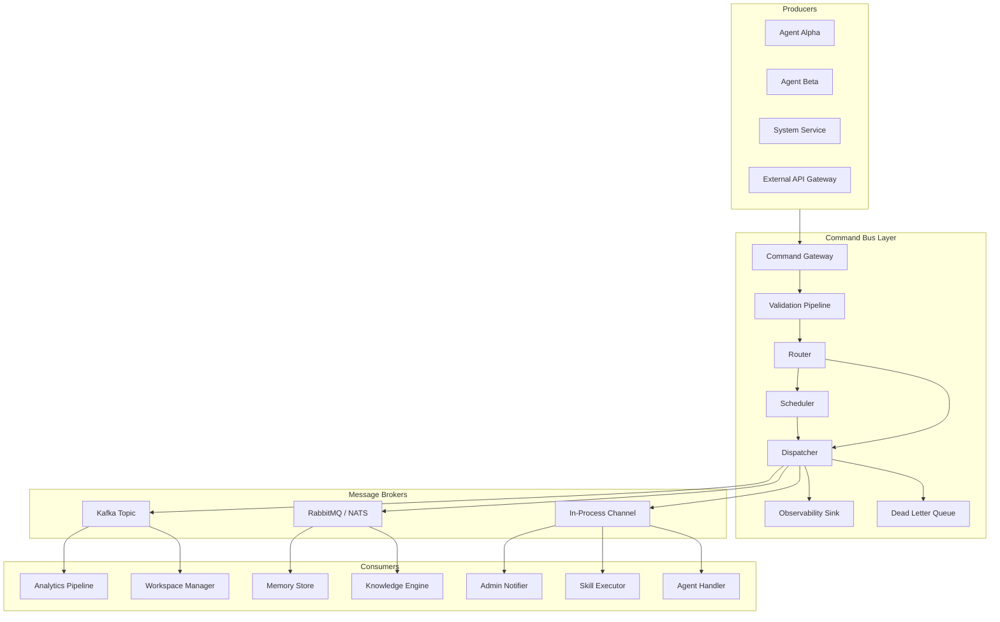
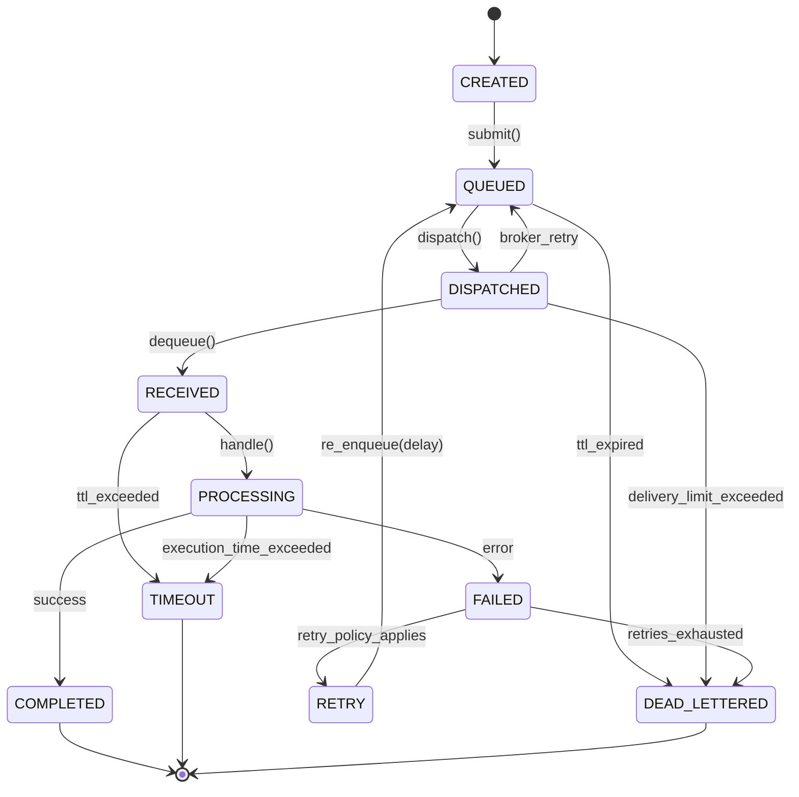
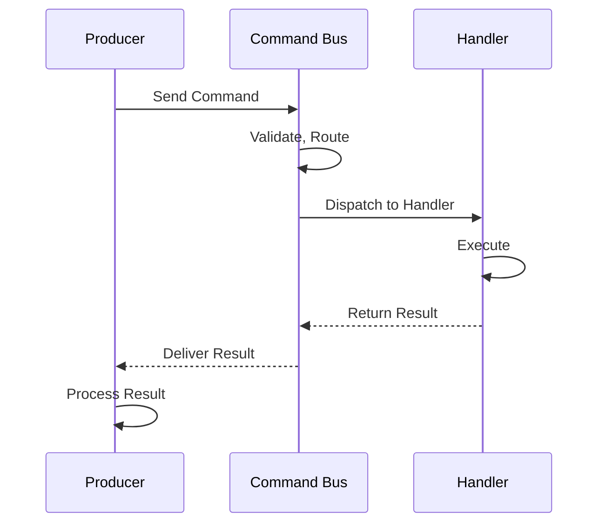
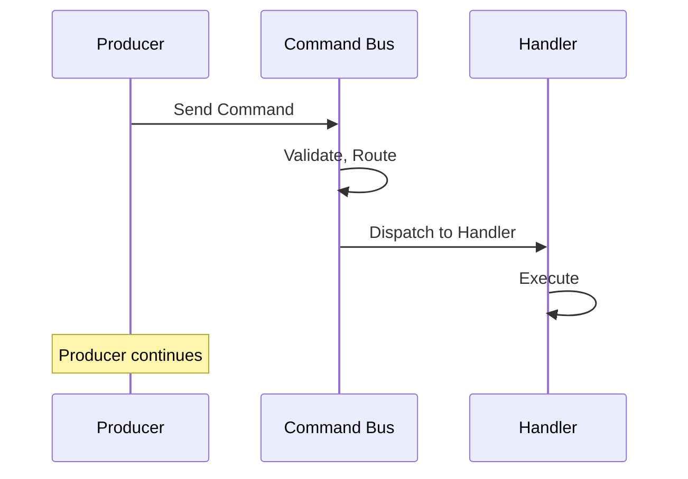
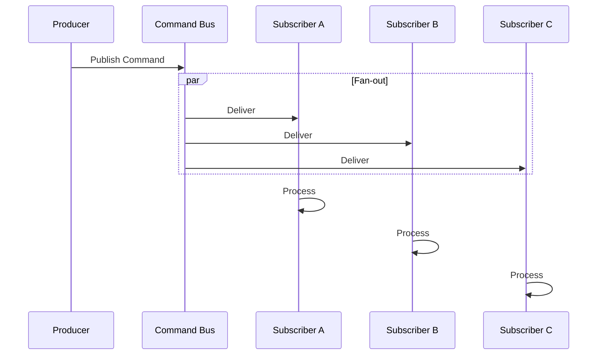
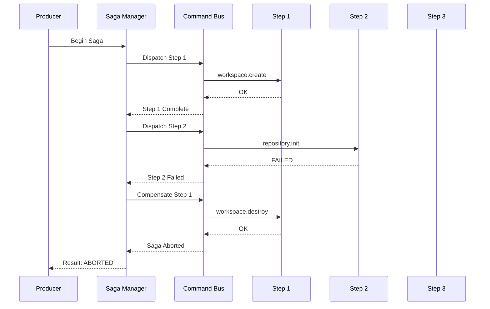
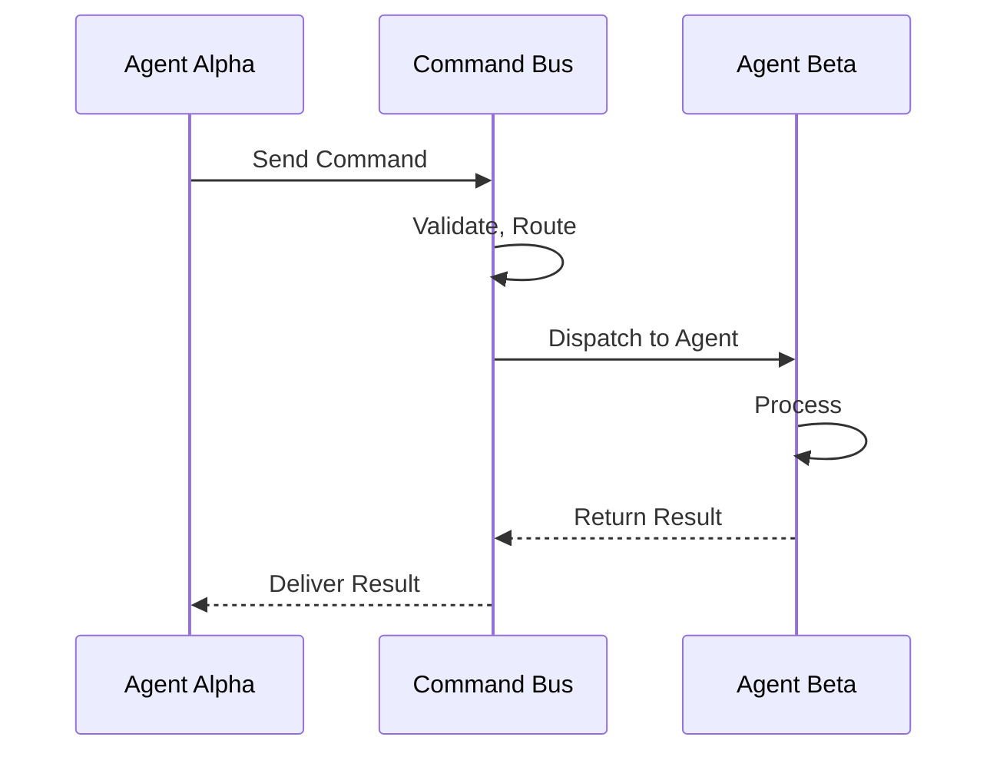
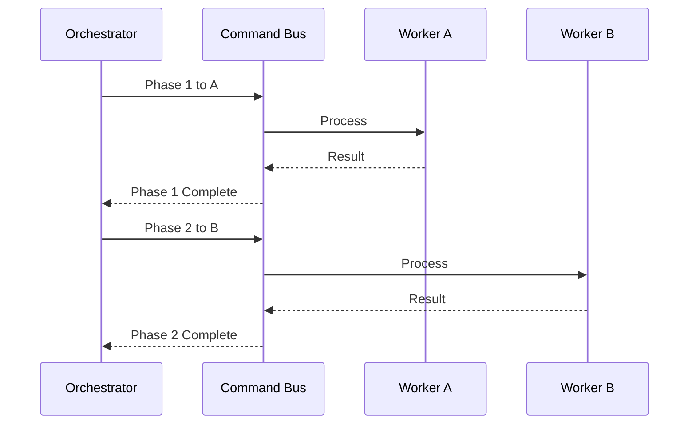

> **Status:** 📐 Design Spec — forward-looking design, not yet implemented

# Command System

| Attribute      | Value                   |
| -------------- | ----------------------- |
| Version        | 1.0                     |
| Status         | Active                  |
| Author         | Chief AI Architect      |
| Classification | Enterprise Architecture |
| Last Updated   | 2026-06-18              |

---

## Executive Summary

Defines the command system for AI agent interactions - slash commands, natural language commands, parameter parsing, command routing, permission checks, and command history.

---

## Table of Contents

1.  [Executive Summary](#1-executive-summary)
    - 1.1 Purpose
    - 1.2 Scope
    - 1.3 Design Principles
2.  [Command Model](#2-command-model)
    - 2.1 Command Anatomy
    - 2.2 JSON Schema
    - 2.3 Command Types
3.  [Command Bus Architecture](#3-command-bus-architecture)
    - 3.1 Pub/Sub Model
    - 3.2 Architecture Diagram
    - 3.3 Producers, Consumers, Brokers
    - 3.4 In-Process vs Distributed
4.  [Command Lifecycle](#4-command-lifecycle)
    - 4.1 State Machine
    - 4.2 State Diagram
    - 4.3 Timeout Handling
    - 4.4 Retry Policy
5.  [Command Routing](#5-command-routing)
    - 5.1 Direct Routing
    - 5.2 Topic-Based Routing
    - 5.3 Content-Based Routing
    - 5.4 Routing Table Configuration
6.  [Command Validation](#6-command-validation)
    - 6.1 Schema Validation
    - 6.2 Permission Check
    - 6.3 Rate Limit Check
    - 6.4 Pre-condition Check
    - 6.5 Validation Pipeline
7.  [Command Execution](#7-command-execution)
    - 7.1 Handler Registration
    - 7.2 Handler Execution
    - 7.3 Result Collection
    - 7.4 Synchronous vs Async
    - 7.5 Streaming Results
8.  [Command Patterns](#8-command-patterns)
    - 8.1 Request-Response
    - 8.2 Fire-and-Forget
    - 8.3 Publish-Subscribe
    - 8.4 Saga (Distributed Transaction)
9.  [Command Security](#9-command-security)
    - 9.1 Authentication
    - 9.2 Authorization
    - 9.3 Audit Trail
    - 9.4 Command Signing
10. [Command Catalog](#10-command-catalog)
    - 10.1 agent.register
    - 10.2 agent.deregister
    - 10.3 agent.heartbeat
    - 10.4 knowledge.search
    - 10.5 knowledge.refresh
    - 10.6 memory.store
    - 10.7 memory.retrieve
    - 10.8 workspace.create
    - 10.9 workspace.destroy
    - 10.10 skill.execute
    - 10.11 analytics.track
    - 10.12 admin.notify
    - 10.13 admin.escalate
    - 10.14 system.health
11. [Integration with Agent System](#11-integration-with-agent-system)
    - 11.1 Inter-Agent Communication
    - 11.2 Async Patterns for Multi-Agent Workflows
12. [Related Documents](#12-related-documents)
13. [Appendix A: Error Codes](#appendix-a-error-codes)
14. [Appendix B: Configuration Reference](#appendix-b-configuration-reference)
15. [Appendix C: Glossary](#appendix-c-glossary)
16. [Appendix D: Version History](#appendix-d-version-history)

---

## 1. Executive Summary

Commands are structured, typed instructions issued by agents or system components to request an action, query information, transform state, or notify peers across the ecosystem. The Command System defines a uniform protocol for producing, routing, validating, executing, and monitoring these instructions. It decouples command producers from consumers, enables reliable asynchronous execution, and provides observability, security, and governance over every operation within the agent runtime.

### 1.1 Purpose

The Command System exists to solve three fundamental problems in multi-agent architectures: (a) how agents communicate without tight coupling, (b) how the system orchestrates distributed work with reliability guarantees, and (c) how administrators observe and control operations across the entire fleet.

### 1.2 Scope

This specification covers every command that flows through the system: from agent registration and heartbeat signals to knowledge graph queries, memory operations, workspace lifecycle management, skill execution, analytics, and administrative notifications. It applies to all agent runtimes, the command bus middleware, and any external system integrating via the command protocol.

### 1.3 Design Principles

| Principle                         | Description                                                                         |
| --------------------------------- | ----------------------------------------------------------------------------------- |
| Uniform Protocol                  | Every command follows the same envelope structure regardless of type                |
| Decoupled Producers and Consumers | Senders never know the handler identity; routing is abstracted                      |
| Reliability by Default            | Commands have delivery guarantees, retry policies, and dead-letter handling         |
| Observable                        | Every command produces trace events for debugging, auditing, and analytics          |
| Secure                            | Commands carry identity, require authorization, and can be cryptographically signed |
| Extensible                        | New command types and handlers can be added without modifying the bus               |

---

## 2. Command Model

### 2.1 Command Anatomy

Every command in the system is an envelope containing a fixed set of metadata fields and a type-specific payload. The core fields are:

| Field         | Type     | Required    | Description                                                            |
| ------------- | -------- | ----------- | ---------------------------------------------------------------------- |
| id            | UUID v7  | Yes         | Globally unique identifier, time-sortable                              |
| type          | Enum     | Yes         | One of QUERY, ACTION, TRANSFORM, NOTIFY, SCHEDULE, ESCALATE            |
| source        | String   | Yes         | Agent or component identity issuing the command                        |
| target        | String   | Conditional | Intended handler or topic; may be omitted for broadcast commands       |
| payload       | Object   | Conditional | Type-specific data; required for all types except NOTIFY in some cases |
| priority      | Integer  | No          | 1 (critical) to 5 (lowest); default 3                                  |
| correlationId | UUID v7  | No          | Links related commands; used for request-response pairing              |
| timestamp     | ISO 8601 | Yes         | When the command was created                                           |
| ttl           | Integer  | No          | Time-to-live in milliseconds; default 30000                            |
| signature     | String   | No          | HMAC or JWT signing the command body for sensitive operations          |
| traceId       | UUID v7  | No          | Distributed tracing correlation identifier                             |
| tenantId      | String   | No          | Multi-tenant isolation identifier                                      |

### 2.2 JSON Schema

```json
{
  "$schema": "https://json-schema.org/draft/2020-12/schema",
  "$id": "https://architecture.enterprise/command/v1",
  "title": "Command Envelope",
  "type": "object",
  "required": ["id", "type", "source", "timestamp", "payload"],
  "properties": {
    "id": {
      "type": "string",
      "format": "uuid",
      "description": "Globally unique command identifier"
    },
    "type": {
      "type": "string",
      "enum": ["QUERY", "ACTION", "TRANSFORM", "NOTIFY", "SCHEDULE", "ESCALATE"],
      "description": "Command type classification"
    },
    "source": {
      "type": "string",
      "pattern": "^[a-zA-Z][a-zA-Z0-9_.-]+$",
      "description": "Issuing agent or component identifier"
    },
    "target": {
      "type": "string",
      "description": "Routing target: handler name, topic, or routing key"
    },
    "payload": { "type": "object", "description": "Type-specific command data" },
    "priority": { "type": "integer", "minimum": 1, "maximum": 5, "default": 3 },
    "correlationId": {
      "type": "string",
      "format": "uuid",
      "description": "Links to a previous command"
    },
    "timestamp": {
      "type": "string",
      "format": "date-time",
      "description": "ISO 8601 creation timestamp"
    },
    "ttl": {
      "type": "integer",
      "minimum": 100,
      "maximum": 300000,
      "default": 30000,
      "description": "Time-to-live in milliseconds"
    },
    "signature": { "type": "string", "description": "Base64-encoded HMAC-SHA256 signature" },
    "traceId": {
      "type": "string",
      "format": "uuid",
      "description": "Distributed trace identifier"
    },
    "tenantId": { "type": "string", "description": "Tenant isolation key" }
  }
}
```

### 2.3 Command Types

#### 2.3.1 QUERY

Retrieves information from a system component without side effects. Handlers return data; the payload is never mutated.

| Aspect          | Detail                                        |
| --------------- | --------------------------------------------- |
| Idempotent      | Yes                                           |
| Side Effects    | None                                          |
| Typical Payload | Filters, selectors, pagination parameters     |
| Example         | knowledge.search returns matching graph nodes |
| Response        | Synchronous result with data or empty set     |

#### 2.3.2 ACTION

Requests a state-changing operation. May be synchronous or asynchronous depending on handler implementation.

| Aspect          | Detail                                              |
| --------------- | --------------------------------------------------- |
| Idempotent      | Recommended (via idempotency key)                   |
| Side Effects    | Yes                                                 |
| Typical Payload | Mutation parameters, resource identifiers           |
| Example         | workspace.create provisions a new workspace         |
| Response        | Success confirmation or error with rollback details |

#### 2.3.3 TRANSFORM

Instructs a handler to convert data from one representation to another.

| Aspect          | Detail                                                    |
| --------------- | --------------------------------------------------------- |
| Idempotent      | Yes                                                       |
| Side Effects    | Conditional (may write transformed output to a store)     |
| Typical Payload | Source data, transformation rules, output format          |
| Example         | Template rendering, format conversion, data normalization |
| Response        | Transformed data                                          |

#### 2.3.4 NOTIFY

Broadcasts information to one or more consumers. Senders do not expect a response. Fire-and-forget by nature.

| Aspect          | Detail                                   |
| --------------- | ---------------------------------------- |
| Idempotent      | No (duplicates may arrive)               |
| Side Effects    | Consumers may act on the notification    |
| Typical Payload | Event data, alert details, status change |
| Example         | admin.notify delivers a system alert     |
| Response        | None (one-way)                           |

#### 2.3.5 SCHEDULE

Wraps a nested command with scheduling instructions. The command bus defers delivery until the scheduled time or interval.

| Aspect          | Detail                                                          |
| --------------- | --------------------------------------------------------------- |
| Idempotent      | Yes                                                             |
| Side Effects    | Delayed; the nested command produces side effects when executed |
| Typical Payload | Cron expression or delay duration + nested command envelope     |
| Example         | Periodic heartbeat collection, scheduled cache refresh          |
| Response        | Acknowledgment with scheduled job identifier                    |

#### 2.3.6 ESCALATE

Promotes a command or issue to a higher-authority handler, typically when the original handler cannot process it or when human intervention is required.

| Aspect          | Detail                                                           |
| --------------- | ---------------------------------------------------------------- |
| Idempotent      | Yes                                                              |
| Side Effects    | Yes (escalation path triggered)                                  |
| Typical Payload | Reason, original command ID, severity level                      |
| Example         | An agent that cannot resolve a query escalates to a senior agent |
| Response        | Acknowledgment; resolution may follow asynchronously             |

---

## 3. Command Bus Architecture

### 3.1 Pub/Sub Model

The command bus implements a publish-subscribe messaging model. Producers publish commands to named channels (topics or direct routing keys). Consumers subscribe to channels they are registered to handle. The bus mediates all delivery, providing buffering, delivery guarantees, and observability.

### 3.2 Architecture Diagram



### 3.3 Producers, Consumers, Brokers

| Role              | Description                                                                               |
| ----------------- | ----------------------------------------------------------------------------------------- |
| Producer          | Any agent, service, or gateway that creates and publishes a command                       |
| Consumer          | A registered handler that receives and processes commands matching its subscription       |
| Broker            | The middleware channel that buffers and delivers commands between producers and consumers |
| Command Gateway   | Entry point that accepts commands from producers, applies initial validation              |
| Validator         | Pipeline of checks run on every command before routing                                    |
| Router            | Matches commands to handlers using routing rules                                          |
| Dispatcher        | Delivers validated commands to the appropriate broker channel for consumption             |
| Dead Letter Queue | Stores commands that failed delivery or exceeded retry limits                             |
| Scheduler         | Holds SCHEDULE-type commands and releases them at the appropriate time                    |

### 3.4 In-Process vs Distributed

| Aspect          | In-Process                            | Distributed                                  |
| --------------- | ------------------------------------- | -------------------------------------------- |
| Transport       | Shared memory, channels               | RabbitMQ, NATS, Kafka, Redis Streams         |
| Latency         | Sub-microsecond                       | Microsecond to millisecond                   |
| Durability      | Lost on process crash                 | Persisted to disk, replicated                |
| Scalability     | Single process                        | Horizontal across nodes                      |
| Use Case        | Inter-agent calls within same runtime | Cross-node, cross-service, cross-DC commands |
| Fault Isolation | Shared fate                           | Independent failure domains                  |

The system uses in-process channels for commands that must complete within the same process context (e.g., synchronous QUERY from one agent to another in the same runtime) and distributed brokers for commands that require durability, cross-node delivery, or fan-out to multiple consumers.

---

## 4. Command Lifecycle

### 4.1 State Machine

Every command transitions through a defined set of states from creation to terminal resolution. The state machine guarantees exactly-once processing semantics for handlers that support idempotency, and at-least-once for all others.

| State         | Description                                         |
| ------------- | --------------------------------------------------- |
| CREATED       | Command envelope instantiated, not yet submitted    |
| QUEUED        | Accepted by the bus, awaiting dispatch              |
| DISPATCHED    | Sent to the broker channel                          |
| RECEIVED      | Consumer has dequeued the command                   |
| PROCESSING    | Handler is actively executing                       |
| COMPLETED     | Handler finished successfully                       |
| FAILED        | Handler returned an error or exception              |
| TIMEOUT       | TTL expired before completion                       |
| RETRY         | Scheduled for redelivery after transient failure    |
| DEAD_LETTERED | Moved to dead letter queue after exhausting retries |

### 4.2 State Diagram



### 4.3 Timeout Handling

Timeouts are enforced at multiple levels:

| Level             | Timeout Source          | Default | Configurable                         |
| ----------------- | ----------------------- | ------- | ------------------------------------ |
| Bus TTL           | command.ttl field       | 30s     | Per-command via producer             |
| Broker Delivery   | Broker consumer timeout | 60s     | Broker configuration                 |
| Handler Execution | Handler registration    | 30s     | Per-handler via registration options |
| Total End-to-End  | Sum of all timeouts     | 120s    | System-wide maximum                  |

When a command times out, the bus updates its state to TIMEOUT, increments a timeout counter, and if the counter is below the retry threshold, transitions to RETRY. If the maximum retries have been exhausted, the command moves to DEAD_LETTERED and an ESCALATE command is auto-generated for the system administrator.

### 4.4 Retry Policy

```json
{
  "retryPolicy": {
    "maxAttempts": 3,
    "backoffStrategy": "exponential",
    "initialDelayMs": 1000,
    "maxDelayMs": 30000,
    "multiplier": 2.0,
    "jitter": true,
    "retryableErrors": [
      "HandlerBusy",
      "TransientStorageError",
      "RateLimitExceeded",
      "NetworkTimeout"
    ],
    "nonRetryableErrors": ["InvalidPayload", "Unauthorized", "NotFound", "ValidationError"]
  }
}
```

| Parameter          | Description                                             |
| ------------------ | ------------------------------------------------------- |
| maxAttempts        | Maximum number of delivery attempts including the first |
| backoffStrategy    | exponential, linear, or fixed                           |
| initialDelayMs     | Delay before the first retry                            |
| maxDelayMs         | Cap on delay between retries                            |
| multiplier         | Exponential factor applied to delay                     |
| jitter             | Randomizes delay to avoid thundering herd               |
| retryableErrors    | Error codes that trigger a retry                        |
| nonRetryableErrors | Error codes that immediately move to DEAD_LETTERED      |

---

## 5. Command Routing

### 5.1 Direct Routing

Commands are sent to a specific, named handler. The target field contains the handler identifier. The bus maintains a registry mapping handler names to consumer endpoints.

```text
Command { target: "knowledge.search" } --> Router --> Handler [knowledge.search]
```

Best for: point-to-point communication, request-response patterns, commands that target a single known service.

### 5.2 Topic-Based Routing

Commands are published to a topic. All consumers subscribed to that topic receive a copy. The target field contains a topic name, optionally with wildcards.

```text
Command { target: "agent.lifecycle.>" } --> Topic [agent.lifecycle.*]
    --> Subscriber [agent.registry]
    --> Subscriber [analytics.pipeline]
    --> Subscriber [admin.notifier]
```

Topic patterns support wildcard routing:

- `*` matches exactly one segment: agent.\* matches agent.register but not agent.lifecycle.start
- `>` matches one or more segments: agent.> matches agent.register, agent.lifecycle.start, etc.

Best for: broadcast events, system-wide notifications, decoupled many-to-many communication.

### 5.3 Content-Based Routing

Commands are routed based on properties within the payload, not the target field. A routing rules engine evaluates predicates against the command content.

```json
{
  "rules": [
    { "predicate": "payload.severity == 'CRITICAL'", "route": "admin.escalate" },
    { "predicate": "payload.workspaceType == 'research'", "route": "workspace.create.research" }
  ]
}
```

Best for: commands where the routing decision depends on business logic encoded in the data, commands that need conditional multi-destination delivery.

### 5.4 Routing Table Configuration

The routing table is a declarative configuration file loaded at system startup. Changes can be hot-reloaded without restarting the bus.

```json
{
  "routingTable": {
    "direct": [
      { "target": "knowledge.search", "handler": "knowledge.query.handler", "timeout": 15000 },
      { "target": "memory.store", "handler": "memory.store.handler", "timeout": 5000 }
    ],
    "topics": {
      "agent.lifecycle": {
        "pattern": "agent.lifecycle.{event}",
        "subscribers": ["agent.registry", "analytics.pipeline"]
      },
      "system.alerts": {
        "pattern": "system.alert.{severity}",
        "subscribers": ["admin.notifier", "escalation.manager"]
      }
    },
    "content": {
      "workspace.create": [
        { "condition": "payload.type == 'ephemeral'", "handler": "workspace.create.ephemeral" },
        { "condition": "payload.type == 'persistent'", "handler": "workspace.create.persistent" }
      ]
    },
    "defaults": { "handler": "default.handler", "deadLetterQueue": "dlq.main" }
  }
}
```

---

## 6. Command Validation

### 6.1 Schema Validation

Every command is validated against the Command Envelope JSON Schema before it enters the bus. Type-specific payloads may also be validated against their own schemas registered with the validation service.

| Check           | Description                                  | Failure Action              |
| --------------- | -------------------------------------------- | --------------------------- |
| Required fields | id, type, source, timestamp, payload present | Reject with ValidationError |
| Field types     | Types match schema definitions               | Reject with ValidationError |
| Enum values     | type is one of the six allowed values        | Reject with ValidationError |
| Payload schema  | Payload matches registered type schema       | Reject with ValidationError |
| UUID format     | id, correlationId, traceId are valid UUIDs   | Reject with ValidationError |

### 6.2 Permission Check

The authorization layer verifies that the source identity is permitted to issue the given command type and target.

```json
{
  "permissions": {
    "agent.*": ["agent:alpha", "agent:beta"],
    "knowledge.*": ["agent:*", "system:knowledge-engine"],
    "workspace.create": ["agent:admin", "system:orchestrator"],
    "admin.escalate": ["agent:*", "system:*"],
    "system.health": ["system:monitor", "agent:admin"]
  }
}
```

| Check               | Description                                        | Failure Action           |
| ------------------- | -------------------------------------------------- | ------------------------ |
| Source exists       | Source identity is registered                      | Reject with Unauthorized |
| Source has role     | Source is mapped to at least one role              | Reject with Unauthorized |
| Role can issue type | Role includes the command type in its allowed list | Reject with Forbidden    |
| Role can target     | Role includes the target handler or topic          | Reject with Forbidden    |

### 6.3 Rate Limit Check

Rate limiting prevents any single source or command type from overwhelming the bus.

| Scope              | Default Limit         | Window            |
| ------------------ | --------------------- | ----------------- |
| Per source         | 1000 commands/second  | Sliding 1s window |
| Per command type   | 5000 commands/second  | Sliding 1s window |
| Per target handler | 200 commands/second   | Sliding 1s window |
| Global             | 20000 commands/second | Sliding 1s window |

| Check       | Description                                        | Failure Action                |
| ----------- | -------------------------------------------------- | ----------------------------- |
| Source rate | Source has not exceeded its per-second quota       | Reject with RateLimitExceeded |
| Type rate   | Command type has not exceeded its per-second quota | Reject with RateLimitExceeded |
| Global rate | Aggregate rate has not exceeded capacity           | Reject with RateLimitExceeded |

### 6.4 Pre-condition Check

Handlers may register pre-conditions that are evaluated before execution.

| Check                | Description                                             | Failure Action                 |
| -------------------- | ------------------------------------------------------- | ------------------------------ |
| Dependency available | Required downstream service is reachable                | Reject with PreconditionFailed |
| Resource exists      | Target resource (workspace, agent) exists if required   | Reject with NotFound           |
| State valid          | System is in an appropriate state to handle the command | Reject with PreconditionFailed |
| Lock acquired        | No conflicting command holds a lock on the resource     | Reject with ResourceConflict   |

### 6.5 Validation Pipeline

```python
class ValidationPipeline:
    def __init__(self):
        self.checks = [
            SchemaValidator(),
            PermissionChecker(),
            RateLimiter(),
            PreconditionValidator(),
        ]

    async def validate(self, command: Command) -> ValidationResult:
        context = ValidationContext(command)
        for check in self.checks:
            result = await check.validate(command, context)
            if not result.passed:
                return ValidationResult(
                    passed=False, reason=result.reason,
                    code=result.error_code,
                    check_name=check.__class__.__name__,
                )
            context.add_check_result(result)
        return ValidationResult(passed=True)

    async def validate_async(self, command: Command) -> ValidationResult:
        context = ValidationContext(command)
        tasks = [check.validate(command, context) for check in self.checks]
        results = await asyncio.gather(*tasks, return_exceptions=True)
        for check, result in zip(self.checks, results):
            if isinstance(result, Exception):
                return ValidationResult(
                    passed=False,
                    reason=(
                        f"Validation error in "
                        f"{check.__class__.__name__}: {str(result)}"
                    ),
                    code="VALIDATION_INTERNAL_ERROR",
                    check_name=check.__class__.__name__,
                )
            if not result.passed:
                return ValidationResult(
                    passed=False, reason=result.reason,
                    code=result.error_code,
                    check_name=check.__class__.__name__,
                )
            context.add_check_result(result)
        return ValidationResult(passed=True)
```

---

## 7. Command Execution

### 7.1 Handler Registration

Handlers are registered with the command bus at startup via a decorator or registration API.

```python
@command_handler(
    type="QUERY", target="knowledge.search", timeout=15000,
    mode="sync", preconditions=["knowledge_engine_ready"],
)
async def handle_knowledge_search(command: Command) -> CommandResult:
    payload = command.payload
    results = await knowledge_engine.search(
        query=payload["query"],
        filters=payload.get("filters"),
        limit=payload.get("limit", 10),
    )
    return CommandResult.success(data=results)
```

| Registration Parameter | Description                                              |
| ---------------------- | -------------------------------------------------------- |
| type                   | Command type this handler processes                      |
| target                 | Routing target this handler subscribes to                |
| timeout                | Maximum execution time in milliseconds                   |
| mode                   | sync for blocking, async for non-blocking                |
| preconditions          | List of pre-condition checks required before execution   |
| version                | Handler schema version for compatibility checks          |
| batchSize              | For batch handlers, number of commands processed at once |

### 7.2 Handler Execution

When a command arrives at a handler, the execution engine manages the lifecycle:

1.  Deserialize command from transport format
2.  Resolve handler instance (from registry)
3.  Inject dependencies (logger, tracer, metrics)
4.  Execute pre-condition checks
5.  Execute handler function with command as argument
6.  Collect result or exception
7.  Publish completion or failure event to bus

### 7.3 Result Collection

Results are wrapped in a standard envelope:

```json
{
  "commandId": "0190a3b2-7c1f-7b00-9c3d-8e2f1a4b6c8d",
  "status": "COMPLETED",
  "data": { "nodes": [], "totalCount": 42 },
  "metrics": {
    "executionDurationMs": 234,
    "processingStart": "2026-06-18T10:30:00.000Z",
    "processingEnd": "2026-06-18T10:30:00.234Z"
  },
  "warnings": ["result_truncated_at_1000_nodes"]
}
```

| Result Field | Type     | Description                         |
| ------------ | -------- | ----------------------------------- |
| commandId    | UUID     | The original command identifier     |
| status       | Enum     | COMPLETED, FAILED, PARTIAL          |
| data         | Object   | Handler-specific result payload     |
| error        | Object   | Error details if status is FAILED   |
| metrics      | Object   | Execution timing and resource usage |
| warnings     | String[] | Non-critical advisory messages      |

### 7.4 Synchronous vs Async

| Aspect           | Synchronous                      | Asynchronous                                |
| ---------------- | -------------------------------- | ------------------------------------------- |
| Producer blocks  | Yes, until result is returned    | No, receives acknowledgment immediately     |
| Result delivery  | Inline in response               | Via callback command or result channel      |
| Error handling   | Exception propagates to producer | Error stored; producer polls or is notified |
| Use case         | QUERY, fast TRANSFORM            | ACTION, long-running TRANSFORM, SCHEDULE    |
| Timeout behavior | Producer experiences timeout     | Handler continues; result may be lost       |
| Throughput       | Lower (producer waits)           | Higher (producer continues immediately)     |

### 7.5 Streaming Results

For long-running commands that produce incremental results, handlers may stream results back.

```python
@command_handler(type="ACTION", target="knowledge.refresh", mode="stream")
async def handle_knowledge_refresh(
    command: Command,
) -> AsyncIterator[StreamEvent]:
    yield StreamEvent(
        type="progress",
        data={"phase": "scanning", "percent": 10},
    )
    await scan_repositories()
    yield StreamEvent(
        type="progress",
        data={"phase": "indexing", "percent": 40},
    )
    await build_index()
    yield StreamEvent(
        type="progress",
        data={"phase": "optimizing", "percent": 80},
    )
    await optimize_graph()
    yield StreamEvent(
        type="complete",
        data={"nodesUpdated": 1523},
    )
```

| Stream Event Type | Description                                     |
| ----------------- | ----------------------------------------------- |
| progress          | Percentage or phase update                      |
| intermediate      | Partial result data available before completion |
| warning           | Non-fatal issue encountered during processing   |
| error             | Fatal error; stream terminates                  |
| complete          | Final result with summary                       |

---

## 8. Command Patterns

### 8.1 Request-Response

The producer sends a command and awaits a result. The bus routes the command to a single handler, which processes it and returns a result envelope to the producer.



Use case: Any operation where the producer needs the result before proceeding. Agent A queries the knowledge graph and needs the response to formulate a reply.

### 8.2 Fire-and-Forget

The producer sends a command and immediately continues. The bus delivers the command to the handler, but no result is returned to the producer.



Use case: Logging, analytics, notifications, and any side-effect operation where the producer does not depend on the outcome.

### 8.3 Publish-Subscribe

The producer publishes a command to a topic. The bus fans out copies to all subscribers.



Use case: System events that multiple components need to react to independently.

### 8.4 Saga (Distributed Transaction)

A saga orchestrates a sequence of local transactions across multiple handlers. If any step fails, compensating transactions undo previous steps.



| Saga Role           | Description                                                                      |
| ------------------- | -------------------------------------------------------------------------------- |
| Saga Manager        | Maintains saga state, executes steps in order, triggers compensations on failure |
| Step                | A local transaction executed by a handler on the bus                             |
| Compensating Action | An action that undoes a completed step                                           |
| Saga Log            | Persistent log of all saga events for recovery                                   |
| Isolation           | Handlers do not commit externally visible changes until saga completes           |

Use case: Multi-step provisioning workflows, cross-service data synchronization.

---

## 9. Command Security

### 9.1 Authentication

Authentication verifies that the source identity is genuine. Every command carries identity credentials that the bus validates before processing.

| Method         | Mechanism                                       | Strength                         |
| -------------- | ----------------------------------------------- | -------------------------------- |
| Bearer Token   | JWT in command header or metadata               | High; supports expiry, claims    |
| API Key        | Pre-shared key mapped to agent identity         | Medium; simple but less flexible |
| mTLS           | Client certificate presented at transport layer | Very high; mutual authentication |
| HMAC Signature | Signed command body with shared secret          | High; protects against tampering |

```json
{
  "authentication": {
    "defaultMethod": "bearer_token",
    "tokenValidation": {
      "issuer": "https://auth.enterprise.internal",
      "audience": "command-bus",
      "algorithms": ["RS256", "ES384"],
      "leewaySeconds": 30
    },
    "apiKeyMapping": {
      "resolution": "redis_cache",
      "ttlSeconds": 3600
    }
  }
}
```

### 9.2 Authorization

Authorization determines whether an authenticated identity is permitted to issue a specific command. The system uses Role-Based Access Control (RBAC).

```json
{
  "roles": {
    "agent.standard": {
      "permissions": [
        "knowledge:search",
        "memory:store",
        "memory:retrieve",
        "skill:execute",
        "agent:heartbeat"
      ]
    },
    "agent.admin": {
      "extends": ["agent.standard"],
      "permissions": ["workspace:create", "workspace:destroy", "admin:notify", "system:health"]
    },
    "system.service": {
      "permissions": ["*"]
    }
  }
}
```

| Check               | Evaluated At | Description                                                                 |
| ------------------- | ------------ | --------------------------------------------------------------------------- |
| Role resolution     | Validation   | Maps source identity to one or more roles                                   |
| Permission match    | Validation   | Verifies the command type+target is in the role's permission list           |
| Resource constraint | Execution    | For targeted commands, verifies identity owns or has access to the resource |
| Escalation approval | Validation   | ESCALATE commands require additional authorization                          |

### 9.3 Audit Trail

Every command produces an immutable audit record regardless of outcome. Records are written to a write-once, append-only store.

| Audit Field | Source    | Description                                    |
| ----------- | --------- | ---------------------------------------------- |
| eventId     | Generated | Unique audit event identifier                  |
| commandId   | Command   | The original command identifier                |
| type        | Command   | Command type                                   |
| source      | Command   | Issuing agent identity                         |
| target      | Command   | Intended handler or topic                      |
| action      | Derived   | ATTEMPT, SUCCESS, FAILURE, TIMEOUT, ESCALATION |
| timestamp   | Generated | ISO 8601 event timestamp                       |
| reason      | Context   | Reason for failure, if applicable              |

```python
class AuditLogger:
    def __init__(self, store: AppendOnlyStore):
        self.store = store

    async def log(
        self, command: Command,
        action: str, context: AuditContext,
    ) -> None:
        record = {
            "eventId": str(uuid7()),
            "commandId": command.id,
            "type": command.type,
            "source": command.source,
            "target": command.target,
            "action": action,
            "timestamp": datetime.utcnow().isoformat(),
            "reason": context.reason,
            "traceId": command.traceId,
            "tenantId": command.tenantId,
        }
        await self.store.append(record)
```

### 9.4 Command Signing

Sensitive commands require cryptographic signing. The producer signs the serialized command body; the bus verifies the signature before processing.

```json
{
  "signing": {
    "algorithm": "HMAC-SHA256",
    "encoding": "base64",
    "requiredFor": ["workspace.create", "workspace.destroy", "agent.deregister", "admin.escalate"],
    "keyRotation": {
      "intervalDays": 90,
      "gracePeriodHours": 24
    }
  }
}
```

Signing process:

1.  Producer serializes command to canonical JSON (sorted keys, no whitespace)
2.  Producer computes HMAC-SHA256 using its assigned secret key
3.  Producer sets command.signature to the base64-encoded HMAC
4.  Bus deserializes, recomputes HMAC from canonical JSON, and compares signatures
5.  Mismatch causes immediate rejection with SignatureVerificationFailed

---

## 10. Command Catalog

### 10.1 agent.register

Registers a new agent with the system. Must be called before any other agent commands.

| Property       | Value                |
| -------------- | -------------------- |
| Type           | ACTION               |
| Target         | agent.register       |
| Priority       | 1 (Critical)         |
| Authentication | Bearer token or mTLS |
| Idempotent     | Yes (by agent ID)    |

Payload schema:

```json
{
  "type": "object",
  "required": ["agentId", "agentType", "capabilities"],
  "properties": {
    "agentId": { "type": "string" },
    "agentType": {
      "type": "string",
      "enum": ["assistant", "researcher", "coder", "admin"]
    },
    "capabilities": {
      "type": "array",
      "items": { "type": "string" }
    },
    "metadata": { "type": "object" }
  }
}
```

Target handler: Agent Registry Service.

### 10.2 agent.deregister

Removes an agent from the system. Requires signing.

| Property       | Value                           |
| -------------- | ------------------------------- |
| Type           | ACTION                          |
| Target         | agent.deregister                |
| Priority       | 2 (High)                        |
| Authentication | mTLS or HMAC signature required |
| Idempotent     | Yes (by agent ID)               |

Payload schema:

```json
{
  "type": "object",
  "required": ["agentId"],
  "properties": {
    "agentId": { "type": "string" },
    "reason": { "type": "string" },
    "force": { "type": "boolean", "default": false }
  }
}
```

Target handler: Agent Registry Service.

### 10.3 agent.heartbeat

Periodic liveness signal from an agent.

| Property       | Value           |
| -------------- | --------------- |
| Type           | NOTIFY          |
| Target         | agent.heartbeat |
| Priority       | 3 (Normal)      |
| Authentication | Bearer token    |
| Idempotent     | No              |

Payload schema:

```json
{
  "type": "object",
  "required": ["agentId", "status"],
  "properties": {
    "agentId": { "type": "string" },
    "status": {
      "type": "string",
      "enum": ["healthy", "degraded", "busy"]
    },
    "metrics": {
      "type": "object",
      "properties": {
        "cpuPercent": { "type": "number" },
        "memoryMb": { "type": "integer" },
        "commandsProcessed": { "type": "integer" }
      }
    }
  }
}
```

Target handler(s): Agent Registry, Health Monitor (topic-based fan-out).

### 10.4 knowledge.search

Queries the knowledge graph for matching nodes.

| Property       | Value            |
| -------------- | ---------------- |
| Type           | QUERY            |
| Target         | knowledge.search |
| Priority       | 3 (Normal)       |
| Authentication | Bearer token     |
| Idempotent     | Yes              |

Payload schema:

```json
{
  "type": "object",
  "required": ["query"],
  "properties": {
    "query": { "type": "string" },
    "filters": { "type": "object" },
    "limit": {
      "type": "integer",
      "minimum": 1,
      "maximum": 1000,
      "default": 10
    },
    "offset": { "type": "integer", "default": 0 },
    "includeRelations": { "type": "boolean", "default": true }
  }
}
```

Target handler: Knowledge Query Handler.

### 10.5 knowledge.refresh

Triggers a full or incremental refresh of the knowledge graph index.

| Property       | Value             |
| -------------- | ----------------- |
| Type           | ACTION            |
| Target         | knowledge.refresh |
| Priority       | 4 (Low)           |
| Authentication | Bearer token      |
| Idempotent     | Yes               |

Payload schema:

```json
{
  "type": "object",
  "required": ["mode"],
  "properties": {
    "mode": {
      "type": "string",
      "enum": ["full", "incremental"]
    },
    "sources": {
      "type": "array",
      "items": { "type": "string" }
    },
    "ttl": { "type": "integer", "default": 60000 }
  }
}
```

Target handler: Knowledge Refresh Handler (streaming execution).

### 10.6 memory.store

Persists a value to the agent's memory store.

| Property       | Value        |
| -------------- | ------------ |
| Type           | ACTION       |
| Target         | memory.store |
| Priority       | 3 (Normal)   |
| Authentication | Bearer token |
| Idempotent     | Yes (by key) |

Payload schema:

```json
{
  "type": "object",
  "required": ["key", "value"],
  "properties": {
    "key": { "type": "string" },
    "value": { "type": "object" },
    "namespace": { "type": "string", "default": "default" },
    "ttl": {
      "type": "integer",
      "description": "TTL in seconds; 0 means no expiry"
    }
  }
}
```

Target handler: Memory Store Handler.

### 10.7 memory.retrieve

Retrieves a value from the agent's memory store.

| Property       | Value           |
| -------------- | --------------- |
| Type           | QUERY           |
| Target         | memory.retrieve |
| Priority       | 3 (Normal)      |
| Authentication | Bearer token    |
| Idempotent     | Yes             |

Payload schema:

```json
{
  "type": "object",
  "required": ["key"],
  "properties": {
    "key": { "type": "string" },
    "namespace": { "type": "string", "default": "default" }
  }
}
```

Target handler: Memory Retrieve Handler.

### 10.8 workspace.create

Provisions a new workspace. Requires command signing.

| Property       | Value                   |
| -------------- | ----------------------- |
| Type           | ACTION                  |
| Target         | workspace.create        |
| Priority       | 2 (High)                |
| Authentication | HMAC signature required |
| Idempotent     | Yes (by workspace name) |

Payload schema:

```json
{
  "type": "object",
  "required": ["name"],
  "properties": {
    "name": { "type": "string" },
    "type": {
      "type": "string",
      "enum": ["persistent", "ephemeral"],
      "default": "persistent"
    },
    "template": { "type": "string" },
    "owner": { "type": "string" },
    "resources": {
      "type": "object",
      "properties": {
        "cpuLimit": { "type": "string" },
        "memoryLimit": { "type": "string" },
        "storageLimit": { "type": "string" }
      }
    }
  }
}
```

Target handler: Workspace Manager.

### 10.9 workspace.destroy

Destroys a workspace and all associated resources. Requires command signing.

| Property       | Value                   |
| -------------- | ----------------------- |
| Type           | ACTION                  |
| Target         | workspace.destroy       |
| Priority       | 2 (High)                |
| Authentication | HMAC signature required |
| Idempotent     | Yes (by workspace ID)   |

Payload schema:

```json
{
  "type": "object",
  "required": ["workspaceId"],
  "properties": {
    "workspaceId": { "type": "string" },
    "force": { "type": "boolean", "default": false },
    "backupFirst": { "type": "boolean", "default": true }
  }
}
```

Target handler: Workspace Manager.

### 10.10 skill.execute

Invokes a named skill with the provided parameters.

| Property       | Value                             |
| -------------- | --------------------------------- |
| Type           | ACTION                            |
| Target         | skill.execute                     |
| Priority       | 3 (Normal)                        |
| Authentication | Bearer token                      |
| Idempotent     | Recommended (via idempotency key) |

Payload schema:

```json
{
  "type": "object",
  "required": ["skillName", "parameters"],
  "properties": {
    "skillName": { "type": "string" },
    "parameters": { "type": "object" },
    "timeout": { "type": "integer" },
    "context": { "type": "object" }
  }
}
```

Target handler: Skill Executor.

### 10.11 analytics.track

Records an analytics event for system monitoring.

| Property       | Value           |
| -------------- | --------------- |
| Type           | NOTIFY          |
| Target         | analytics.track |
| Priority       | 5 (Lowest)      |
| Authentication | Bearer token    |
| Idempotent     | No              |

Payload schema:

```json
{
  "type": "object",
  "required": ["event", "timestamp"],
  "properties": {
    "event": { "type": "string" },
    "timestamp": { "type": "string", "format": "date-time" },
    "properties": { "type": "object" },
    "source": { "type": "string" }
  }
}
```

Target handler: Analytics Pipeline.

### 10.12 admin.notify

Delivers a notification to system administrators.

| Property       | Value        |
| -------------- | ------------ |
| Type           | NOTIFY       |
| Target         | admin.notify |
| Priority       | 1 (Critical) |
| Authentication | Bearer token |
| Idempotent     | No           |

Payload schema:

```json
{
  "type": "object",
  "required": ["message"],
  "properties": {
    "message": { "type": "string" },
    "severity": {
      "type": "string",
      "enum": ["info", "warning", "error", "critical"]
    },
    "channel": {
      "type": "string",
      "enum": ["log", "email", "webhook", "all"],
      "default": "all"
    },
    "metadata": { "type": "object" }
  }
}
```

Target handler: Admin Notifier.

### 10.13 admin.escalate

Escalates an issue to a higher authority, usually a human administrator.

| Property       | Value                   |
| -------------- | ----------------------- |
| Type           | ESCALATE                |
| Target         | admin.escalate          |
| Priority       | 1 (Critical)            |
| Authentication | HMAC signature required |
| Idempotent     | Yes                     |

Payload schema:

```json
{
  "type": "object",
  "required": ["reason", "originalCommandId"],
  "properties": {
    "reason": { "type": "string" },
    "originalCommandId": { "type": "string", "format": "uuid" },
    "severity": {
      "type": "string",
      "enum": ["LOW", "MEDIUM", "HIGH", "CRITICAL"]
    },
    "context": { "type": "object" },
    "suggestedAction": { "type": "string" }
  }
}
```

Target handler: Escalation Manager.

### 10.14 system.health

Requests a health check from the system.

| Property       | Value         |
| -------------- | ------------- |
| Type           | QUERY         |
| Target         | system.health |
| Priority       | 2 (High)      |
| Authentication | Bearer token  |
| Idempotent     | Yes           |

Payload schema:

```json
{
  "type": "object",
  "properties": {
    "component": {
      "type": "string",
      "description": "Specific component; omit for full health"
    },
    "includeDetails": { "type": "boolean", "default": false }
  }
}
```

Target handler: Health Check Service.

---

## 11. Integration with Agent System

### 11.1 Inter-Agent Communication

Agents use the command system as their primary communication protocol. Every agent embeds a command bus client that handles serialization, transmission, and response processing.



Communication flow:

1.  Agent Alpha constructs a command with source=alpha, target=beta.handler, type=QUERY
2.  The bus validates, routes, and dispatches the command to Agent Beta
3.  Agent Beta receives the command via its subscription, processes it, and produces a result
4.  The bus delivers the result back to Agent Alpha using the correlationId

Agent-to-agent routing uses the namespace (agent.<agentId>.<handler>) published under a topic that each agent subscribes to on registration.

### 11.2 Async Patterns for Multi-Agent Workflows

Multi-agent workflows use asynchronous command patterns.

**Sequential Pipeline**: Agent A completes, then sends a command to Agent B.

```text
Agent A -> Bus -> Agent B -> Bus -> Agent C
```

**Parallel Fan-Out**: A coordinator sends the same command to multiple workers simultaneously.

```text
Coordinator -> Bus -> Worker 1
                   -> Worker 2
                   -> Worker 3
```

**Orchestrator Pattern**: A dedicated orchestrator manages the workflow.



Agents implement a command loop that:

1.  Subscribes to their personal command queue on registration
2.  Dequeues commands one at a time or in batches
3.  Dispatches each command to their internal handler registry
4.  Publishes results back through the bus
5.  Sends heartbeats at configured intervals

---

## 12. Related Documents

| Document                   | Description                                                         |
| -------------------------- | ------------------------------------------------------------------- |
| AGENT.md                   | Agent specification: identity, lifecycle, capabilities model        |
| AGENTS.md                  | Multi-agent system architecture: registry, discovery, coordination  |
| AGENT-CAPABILITIES.md      | Capability declaration, discovery, and negotiation protocol         |
| AUTOMATION-ARCHITECTURE.md | Overall automation architecture, pipeline design, and orchestration |
| SKILLS.md                  | Skills system architecture and execution pipeline                   |
| DESIGN.md                  | Design document with decision log and glossary                      |
| DESIGN-SYSTEM.md           | Component library and design tokens                                 |
| DOC-AUDIT-REPORT.md        | Documentation compliance audit report                               |
| FEATURES.md                | Feature catalog and dependency graph                                |

---

## Appendix C.1 Decision Log

| ID          | Decision                                                                     | Context              | Rationale                                                                                                                                                                       | Alternatives Considered                                                                                                                                                 | Decision Date | Revisit Date |
| ----------- | ---------------------------------------------------------------------------- | -------------------- | ------------------------------------------------------------------------------------------------------------------------------------------------------------------------------- | ----------------------------------------------------------------------------------------------------------------------------------------------------------------------- | ------------- | ------------ |
| CMD-DEC-001 | Command envelope with typed payload over raw message passing                 | Command model design | Envelope provides standardized metadata (correlation ID, timestamp, TTL, priority) without coupling to payload schema; typed payload enables per-command validation and routing | Raw message passing (no metadata, harder to trace and debug), Unified payload (tight coupling between command types, painful to extend)                                 | Jun 2026      | Dec 2026     |
| CMD-DEC-002 | Topic-based publish-subscribe as primary routing mechanism                   | Routing architecture | Topics enable flexible fan-out (one command → multiple consumers), dynamic subscription, and content-based sub-routing without modifying producers                            | Direct point-to-point routing (requires explicit producer-consumer mapping, fragile), Service mesh routing (infrastructure overhead, over-engineered for current scale) | Jun 2026      | Dec 2026     |
| CMD-DEC-003 | In-process command bus over external message broker for synchronous commands | Bus implementation   | Eliminates message broker dependency for latency-sensitive agent-to-agent communication; sub-5ms delivery vs 50ms+ with external broker                                         | External message broker (RabbitMQ/Kafka — operational overhead, higher latency), Hybrid (in-process for sync + broker for async — complexity of two systems)        | Jun 2026      | Dec 2026     |
| CMD-DEC-004 | Dead letter queue (DLQ) with configurable max retries (default 3)            | Error handling       | DLQ captures undeliverable commands for analysis and replay; exponential backoff (2s, 4s, 8s) prevents retry storms                                                             | Immediate discard (lose commands, no debugging path), Infinite retry (retry storm, resource exhaustion), Single retry (insufficient for transient failures)             | Jun 2026      | Sep 2026     |
| CMD-DEC-005 | HMAC-SHA256 signing for command authentication                               | Security model       | Symmetric signing provides integrity verification without PKI infrastructure; HMAC is fast (microsecond verification); key per agent type limits blast radius                   | JWT signing (more complex, requires token issuance service), No signing (no source authentication, vulnerable to command injection)                                     | Jun 2026      | Dec 2026     |

---

## Change Log

| Version | Date       | Changes                                                                                                                                                           | Author             |
| ------- | ---------- | ----------------------------------------------------------------------------------------------------------------------------------------------------------------- | ------------------ |
| 1.0     | 2026-06-18 | Initial release. Defines command model, bus architecture, lifecycle, routing, validation, execution, patterns, security, catalog, and integration specifications. | Chief AI Architect |

---

## Appendix D: Version History

---

## Appendix A: Error Codes

| Code                        | Description                                   | Category       | Retryable |
| --------------------------- | --------------------------------------------- | -------------- | --------- |
| ValidationError             | Command failed schema or payload validation   | Validation     | No        |
| Unauthorized                | Source identity is not authenticated          | Security       | No        |
| Forbidden                   | Source identity lacks permission              | Security       | No        |
| SignatureVerificationFailed | Command signature does not match              | Security       | No        |
| RateLimitExceeded           | Source or global rate limit breached          | Throttling     | Yes       |
| HandlerBusy                 | Target handler is at capacity                 | Resource       | Yes       |
| NotFound                    | Target resource or handler was not found      | Resolution     | No        |
| PreconditionFailed          | System state does not meet pre-conditions     | Execution      | No        |
| ResourceConflict            | Resource is locked or in a conflicting state  | Execution      | No        |
| TimeoutExpired              | Command exceeded its TTL or execution timeout | Execution      | No        |
| TransientStorageError       | Temporary storage or database failure         | Infrastructure | Yes       |
| NetworkTimeout              | Downstream service did not respond in time    | Infrastructure | Yes       |
| DeadLettered                | Command exhausted retry attempts              | Execution      | No        |

---

## Appendix B: Configuration Reference

```json
{
  "commandBus": {
    "instanceId": "bus-node-01",
    "port": 9090,
    "maxCommandSize": 1048576,
    "defaultPriority": 3,
    "defaultTTL": 30000,
    "broker": {
      "inProcess": {
        "enabled": true,
        "queueDepth": 10000
      },
      "distributed": {
        "type": "nats",
        "urls": ["nats://nats-cluster:4222"],
        "consumerGroup": "command-bus-consumers",
        "acknowledgmentMode": "explicit"
      }
    },
    "validation": {
      "strictMode": true,
      "allowUnsignedCommands": false,
      "customPayloadValidation": true
    },
    "retry": {
      "maxAttempts": 3,
      "initialDelayMs": 1000,
      "backoffMultiplier": 2.0,
      "maxDelayMs": 30000,
      "jitterEnabled": true
    },
    "rateLimiting": {
      "perSource": 1000,
      "perType": 5000,
      "global": 20000,
      "windowMs": 1000
    },
    "audit": {
      "enabled": true,
      "storeType": "append_only",
      "retentionDays": 90
    },
    "scheduler": {
      "enabled": true,
      "checkIntervalMs": 1000,
      "maxScheduledCommands": 10000
    },
    "deadLetterQueue": {
      "maxRetries": 3,
      "replayEnabled": true
    }
  }
}
```

---

## Appendix C: Glossary

| Term                  | Definition                                                                                        |
| --------------------- | ------------------------------------------------------------------------------------------------- |
| Command               | A structured, typed instruction sent from a producer to one or more consumers via the command bus |
| Command Bus           | The middleware layer that accepts, validates, routes, and delivers commands                       |
| Producer              | Any agent, service, or gateway that creates and publishes a command                               |
| Consumer              | A registered handler that receives and processes commands matching its subscription               |
| Handler               | A function or service registered to process commands of a specific type and target                |
| Envelope              | The outer wrapper of a command containing metadata fields and a typed payload                     |
| Payload               | The type-specific data body of a command                                                          |
| Topic                 | A named channel used for publish-subscribe routing                                                |
| Direct Routing        | Routing a command to a specific named handler                                                     |
| Content-Based Routing | Routing based on evaluated predicates against payload data                                        |
| Correlation ID        | An identifier that links related commands, typically used in request-response patterns            |
| Dead Letter Queue     | A holding area for commands that could not be delivered after exhausting retries                  |
| Saga                  | A sequence of local transactions with compensating actions for distributed transaction management |
| TTL                   | Time-to-live: the maximum time a command may exist before being considered expired                |
| HMAC                  | Hash-based Message Authentication Code used for command signing                                   |

---

## Appendix C.1 Decision Log

| ID          | Decision                                                                     | Context              | Rationale                                                                                                                                                                       | Alternatives Considered                                                                                                                                                 | Decision Date | Revisit Date |
| ----------- | ---------------------------------------------------------------------------- | -------------------- | ------------------------------------------------------------------------------------------------------------------------------------------------------------------------------- | ----------------------------------------------------------------------------------------------------------------------------------------------------------------------- | ------------- | ------------ |
| CMD-DEC-001 | Command envelope with typed payload over raw message passing                 | Command model design | Envelope provides standardized metadata (correlation ID, timestamp, TTL, priority) without coupling to payload schema; typed payload enables per-command validation and routing | Raw message passing (no metadata, harder to trace and debug), Unified payload (tight coupling between command types, painful to extend)                                 | Jun 2026      | Dec 2026     |
| CMD-DEC-002 | Topic-based publish-subscribe as primary routing mechanism                   | Routing architecture | Topics enable flexible fan-out (one command → multiple consumers), dynamic subscription, and content-based sub-routing without modifying producers                            | Direct point-to-point routing (requires explicit producer-consumer mapping, fragile), Service mesh routing (infrastructure overhead, over-engineered for current scale) | Jun 2026      | Dec 2026     |
| CMD-DEC-003 | In-process command bus over external message broker for synchronous commands | Bus implementation   | Eliminates message broker dependency for latency-sensitive agent-to-agent communication; sub-5ms delivery vs 50ms+ with external broker                                         | External message broker (RabbitMQ/Kafka — operational overhead, higher latency), Hybrid (in-process for sync + broker for async — complexity of two systems)        | Jun 2026      | Dec 2026     |
| CMD-DEC-004 | Dead letter queue (DLQ) with configurable max retries (default 3)            | Error handling       | DLQ captures undeliverable commands for analysis and replay; exponential backoff (2s, 4s, 8s) prevents retry storms                                                             | Immediate discard (lose commands, no debugging path), Infinite retry (retry storm, resource exhaustion), Single retry (insufficient for transient failures)             | Jun 2026      | Sep 2026     |
| CMD-DEC-005 | HMAC-SHA256 signing for command authentication                               | Security model       | Symmetric signing provides integrity verification without PKI infrastructure; HMAC is fast (microsecond verification); key per agent type limits blast radius                   | JWT signing (more complex, requires token issuance service), No signing (no source authentication, vulnerable to command injection)                                     | Jun 2026      | Dec 2026     |

## Appendix C.2 Risk Register

| ID          | Risk                                                                    | Likelihood | Impact                                                   | Mitigation                                                                                                                                                 | Owner             | Status |
| ----------- | ----------------------------------------------------------------------- | ---------- | -------------------------------------------------------- | ---------------------------------------------------------------------------------------------------------------------------------------------------------- | ----------------- | ------ |
| CMD-RSK-001 | Command bus becomes single point of failure for all agent communication | Low        | Critical (complete agent system outage)                  | In-process fallback to direct agent calls if bus unavailable; command queue persistence on disk for recovery; bus health monitoring with automatic restart | Platform Engineer | Active |
| CMD-RSK-002 | Commands delivered out-of-order due to concurrent processing            | Low        | Medium (race conditions, inconsistent state)             | Sequence numbers per producer; ordered delivery per topic; idempotent command handlers where order matters                                                 | AI Engineer       | Active |
| CMD-RSK-003 | DLQ overflow under sustained failure causing disk exhaustion            | Low        | Low (disk space, potential service degradation)          | DLQ size limit (max 10000 commands); oldest-first eviction on overflow; alerting on DLQ growth rate > 100 commands/min                                     | Platform Engineer | Active |
| CMD-RSK-004 | HMAC key compromise allows unauthorized command issuance                | Low        | Critical (arbitrary command execution by attacker)       | Per-agent-type HMAC keys; key rotation policy (90 days); automatic revocation on compromise detection; audit logging for all command executions            | Security Engineer | Active |
| CMD-RSK-005 | Saga compensation failure leaves system in inconsistent state           | Low        | High (partial transaction execution, data inconsistency) | Saga state persistence enables manual recovery; compensating command retry with backoff; admin dashboard for in-flight saga monitoring                     | AI Engineer       | Active |

## Appendix C.3 Glossary (Extended)

| Term                      | Definition                                                                                                      |
| ------------------------- | --------------------------------------------------------------------------------------------------------------- |
| **Command**               | A structured, typed instruction sent from a producer to one or more consumers via the command bus               |
| **Command Bus**           | The middleware layer that accepts, validates, routes, and delivers commands                                     |
| **Content-Based Routing** | Routing based on evaluated predicates against payload data, enabling dynamic consumer matching                  |
| **Correlation ID**        | An identifier linking related commands across producer-consumer chains for distributed tracing                  |
| **Dead Letter Queue**     | A holding area for commands that could not be delivered after exhausting retries                                |
| **Envelope**              | The outer wrapper of a command containing metadata fields (ID, timestamp, TTL, priority) and a typed payload    |
| **HMAC**                  | Hash-based Message Authentication Code; a symmetric keyed hash function used for command integrity verification |
| **Producer**              | Any agent, service, or gateway that creates and publishes a command                                             |
| **Saga**                  | A sequence of local transactions with compensating actions for distributed transaction management               |
| **Topic**                 | A named channel used for publish-subscribe routing, enabling one-to-many command distribution                   |

---

## Decision Log

| ID          | Decision                                                                     | Context              | Rationale                                                                                                                                                                       | Alternatives Considered                                                                                                                                                 | Decision Date | Revisit Date |
| ----------- | ---------------------------------------------------------------------------- | -------------------- | ------------------------------------------------------------------------------------------------------------------------------------------------------------------------------- | ----------------------------------------------------------------------------------------------------------------------------------------------------------------------- | ------------- | ------------ |
| CMD-DEC-001 | Command envelope with typed payload over raw message passing                 | Command model design | Envelope provides standardized metadata (correlation ID, timestamp, TTL, priority) without coupling to payload schema; typed payload enables per-command validation and routing | Raw message passing (no metadata, harder to trace and debug), Unified payload (tight coupling between command types, painful to extend)                                 | Jun 2026      | Dec 2026     |
| CMD-DEC-002 | Topic-based publish-subscribe as primary routing mechanism                   | Routing architecture | Topics enable flexible fan-out (one command → multiple consumers), dynamic subscription, and content-based sub-routing without modifying producers                            | Direct point-to-point routing (requires explicit producer-consumer mapping, fragile), Service mesh routing (infrastructure overhead, over-engineered for current scale) | Jun 2026      | Dec 2026     |
| CMD-DEC-003 | In-process command bus over external message broker for synchronous commands | Bus implementation   | Eliminates message broker dependency for latency-sensitive agent-to-agent communication; sub-5ms delivery vs 50ms+ with external broker                                         | External message broker (RabbitMQ/Kafka — operational overhead, higher latency), Hybrid (in-process for sync + broker for async — complexity of two systems)        | Jun 2026      | Dec 2026     |
| CMD-DEC-004 | Dead letter queue (DLQ) with configurable max retries (default 3)            | Error handling       | DLQ captures undeliverable commands for analysis and replay; exponential backoff (2s, 4s, 8s) prevents retry storms                                                             | Immediate discard (lose commands, no debugging path), Infinite retry (retry storm, resource exhaustion), Single retry (insufficient for transient failures)             | Jun 2026      | Sep 2026     |
| CMD-DEC-005 | HMAC-SHA256 signing for command authentication                               | Security model       | Symmetric signing provides integrity verification without PKI infrastructure; HMAC is fast (microsecond verification); key per agent type limits blast radius                   | JWT signing (more complex, requires token issuance service), No signing (no source authentication, vulnerable to command injection)                                     | Jun 2026      | Dec 2026     |

---

## Glossary

| Term                 | Definition                                                                             |
| -------------------- | -------------------------------------------------------------------------------------- |
| Agent                | Autonomous software entity that performs tasks on behalf of a user                     |
| Supervisor Agent     | Orchestrator agent that routes requests to specialist agents                           |
| Specialist Agent     | Domain-specific agent with focused knowledge and tools                                 |
| RAG                  | Retrieval-Augmented Generation — enhances LLM responses with retrieved documents |
| Tool                 | A function an agent can call (read DB, send email, etc.)                               |
| Guardrail            | Constraint that prevents agents from performing unauthorized actions                   |
| Handoff              | Transfer of a query from one agent to another with full context                        |
| Capability Manifest  | Declarative document listing what an agent can do                                      |
| LLM                  | Large Language Model — the AI model powering agent reasoning                     |
| Embedding            | Vector representation of text used for semantic search                                 |
| Chunk                | A segment of a document stored in the vector database                                  |
| Confidence Threshold | Minimum confidence score for an agent to respond directly                              |
| Circuit Breaker      | Pattern that stops calls to a failing service to prevent cascading failures            |
| Agent Memory         | Storage mechanism for agent conversation history and state                             |
| Permission Model     | Security framework controlling which resources each agent can access                   |

---

## Change Log

| Version | Date       | Changes                                                                                                                                                           | Author             |
| ------- | ---------- | ----------------------------------------------------------------------------------------------------------------------------------------------------------------- | ------------------ |
| 1.0     | 2026-06-18 | Initial release. Defines command model, bus architecture, lifecycle, routing, validation, execution, patterns, security, catalog, and integration specifications. | Chief AI Architect |

---

## Appendix D: Version History

| Version | Date       | Author             | Changes                                                                                                                                                           |
| ------- | ---------- | ------------------ | ----------------------------------------------------------------------------------------------------------------------------------------------------------------- |
| 1.0     | 2026-06-18 | Chief AI Architect | Initial release. Defines command model, bus architecture, lifecycle, routing, validation, execution, patterns, security, catalog, and integration specifications. |

---

## Cross-References

| Reference           | Description                                            |
| ------------------- | ------------------------------------------------------ |
| See MASTER-INDEX.md | Full document dependency graph and cross-reference map |

---

## Cross-References

| Reference           | Description                                            |
| ------------------- | ------------------------------------------------------ |
| See MASTER-INDEX.md | Full document dependency graph and cross-reference map |

---

## Cross-References

| Reference            | Description                                            |
| -------------------- | ------------------------------------------------------ |
| docs/MASTER-INDEX.md | Full document dependency graph and cross-reference map |

---

> ⚠️ **Implementation Status:** Design Spec Only. Not implemented in current codebase.
