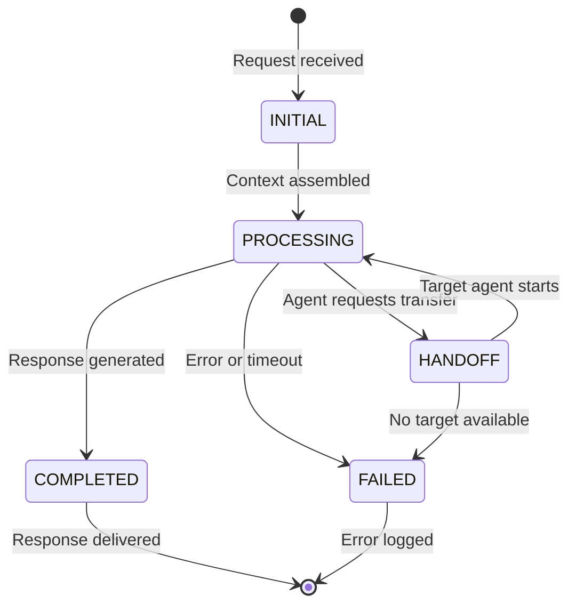
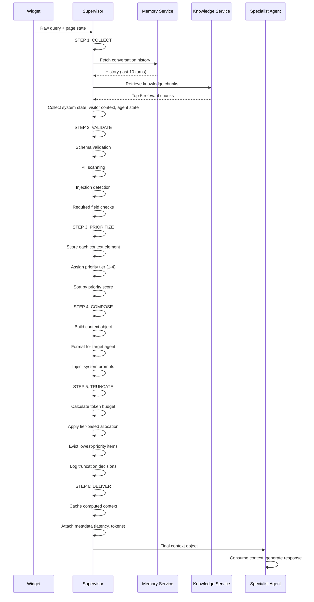
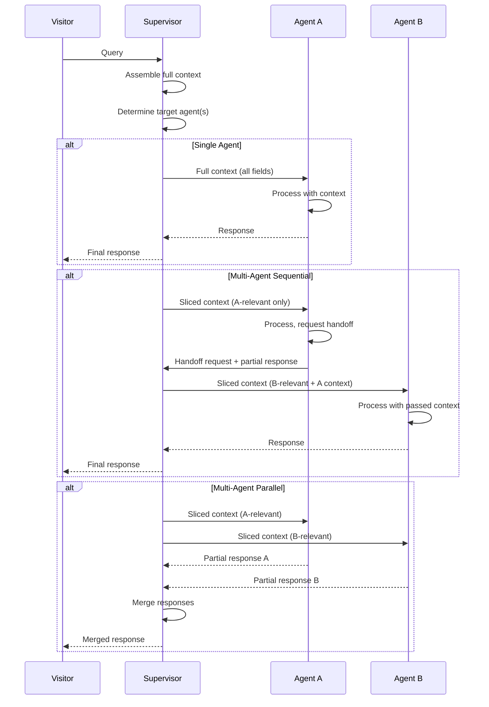
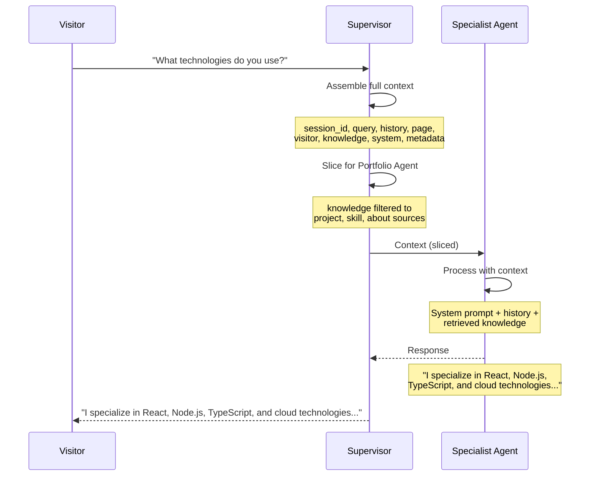
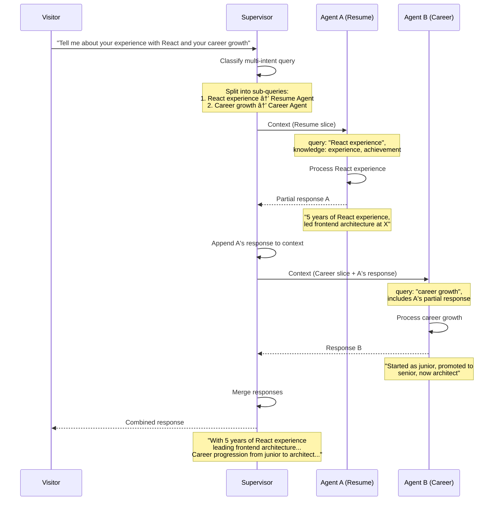
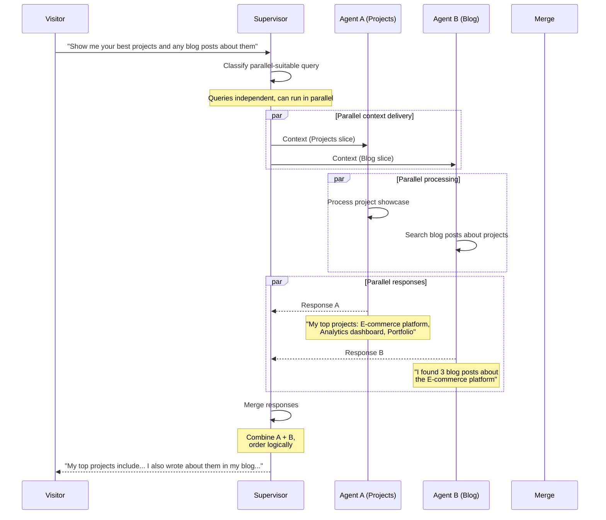
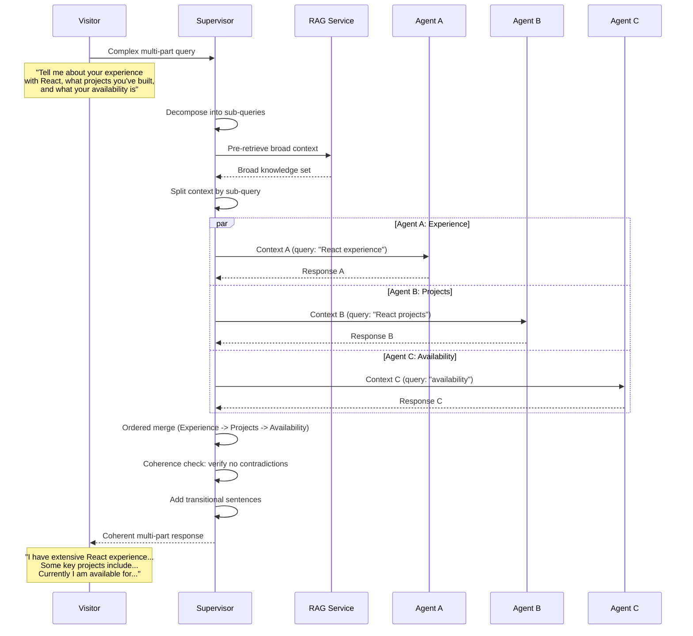

> **Status:** 📐 Design Spec — forward-looking design, not yet implemented
# Context Architecture — Enterprise-Grade Context Management for Multi-Agent Systems

> **Document:** ContextArchitecture.md | **Version:** 1.0 | **Last Updated:** June 2026
> **Status:** Active | **Owner:** Chief AI Architect, Enterprise Architecture
> **Classification:** Enterprise Architecture | **Runtime:** FastAPI + LangChain
> **Orchestration Pattern:** Supervisor + Specialist Agents | **AI Operating Model:** docs/ai/17-AI_INSTRUCTIONS.md

---

## Executive Summary

Defines the context management architecture - context types (visitor, session, page, conversation), assembly strategy, token budget management, context window optimization, and privacy-safe context handling.

---

## Table of Contents

1. [Executive Summary](#1-executive-summary)
2. [Context Model](#2-context-model)
3. [Context Anatomy](#3-context-anatomy)
4. [Context JSON Schema](#4-context-json-schema)
5. [Context Sources](#5-context-sources)
6. [Query Context](#6-query-context)
7. [Session Context](#7-session-context)
8. [Page Context](#8-page-context)
9. [Visitor Context](#9-visitor-context)
10. [Knowledge Context](#10-knowledge-context)
11. [Agent Context](#11-agent-context)
12. [System Context](#12-system-context)
13. [Context Assembly Pipeline](#13-context-assembly-pipeline)
14. [Pipeline Step 1: Collect](#14-pipeline-step-1-collect)
15. [Pipeline Step 2: Validate](#15-pipeline-step-2-validate)
16. [Pipeline Step 3: Prioritize](#16-pipeline-step-3-prioritize)
17. [Pipeline Step 4: Compose](#17-pipeline-step-4-compose)
18. [Pipeline Step 5: Truncate](#18-pipeline-step-5-truncate)
19. [Pipeline Step 6: Deliver](#19-pipeline-step-6-deliver)
20. [Context Prioritization](#20-context-prioritization)
21. [Four-Tier Priority System](#21-four-tier-priority-system)
22. [Token Budget Allocation Per Tier](#22-token-budget-allocation-per-tier)
23. [Eviction Strategy](#23-eviction-strategy)
24. [Context Distribution](#24-context-distribution)
25. [Supervisor Context Distribution Model](#25-supervisor-context-distribution-model)
26. [Context Slicing for Specialist Agents](#26-context-slicing-for-specialist-agents)
27. [Handoff Context Preservation](#27-handoff-context-preservation)
28. [Token Budget Management](#28-token-budget-management)
29. [Default Budget Allocation](#29-default-budget-allocation)
30. [Dynamic Budget Adjustment](#30-dynamic-budget-adjustment)
31. [Oversubscription Handling](#31-oversubscription-handling)
32. [Context Caching](#32-context-caching)
33. [Computed Context Cache](#33-computed-context-cache)
34. [Cache Key Strategy](#34-cache-key-strategy)
35. [Cache Invalidation Triggers](#35-cache-invalidation-triggers)
36. [Context Security](#36-context-security)
37. [PII Stripping](#37-pii-stripping)
38. [Session Isolation](#38-session-isolation)
39. [Context Access Audit Logging](#39-context-access-audit-logging)
40. [Multi-Agent Context Flow](#40-multi-agent-context-flow)
41. [Single Agent Flow](#41-single-agent-flow)
42. [Sequential Multi-Agent Flow](#42-sequential-multi-agent-flow)
43. [Parallel Multi-Agent Flow](#43-parallel-multi-agent-flow)
44. [Supervisor Split-and-Merge Flow](#44-supervisor-split-and-merge-flow)
45. [Context Quality Metrics](#45-context-quality-metrics)
46. [Relevance Score](#46-relevance-score)
47. [Completeness Score](#47-completeness-score)
48. [Freshness Score](#48-freshness-score)
49. [Token Efficiency](#49-token-efficiency)
50. [Context Quality Monitoring Dashboards](#50-context-quality-monitoring-dashboards)
51. [Integration with Agent System](#51-integration-with-agent-system)
52. [Supervisor Context Management Integration](#52-supervisor-context-management-integration)
53. [Memory Architecture Integration](#53-memory-architecture-integration)
54. [Knowledge Architecture Integration](#54-knowledge-architecture-integration)
55. [Related Documents](#55-related-documents)
56. [## Change Log](#56-change-log)

---

## 1. Executive Summary

### 1.1 Definition of Context

Context is the complete set of information assembled for each agent interaction -- the query, conversation history, page state, visitor profile, retrieved knowledge, agent state, system metadata, and session identifiers. Context is the single most critical input to every agent response; the quality, completeness, and relevance of context directly determines response accuracy, coherence, and user satisfaction.

### 1.2 Why Context Management is Critical

In a multi-agent system, context management is the difference between coherent, accurate responses and disjointed, hallucinated answers. Without a disciplined context architecture:

- Agents lose track of conversation state during handoffs
- Token budgets are wasted on irrelevant information
- Context windows overflow, causing truncation of critical data
- PII leaks across session boundaries
- Responses contradict earlier statements in the same conversation

The Context Architecture defined in this document establishes the standards, pipelines, and enforcement mechanisms that ensure every agent receives the right context, at the right time, within the right budget.

### 1.3 Context Architecture Principles

| Principle | Description |
|-----------|-------------|
| **Context completeness** | Every agent receives all context required to answer accurately |
| **Token efficiency** | Context is prioritized and truncated to maximize signal-to-noise |
| **Security-first** | PII is stripped before distribution; sessions are fully isolated |
| **Observability** | Every context assembly and distribution decision is logged |
| **Cache aggressively** | Computed context is cached with deterministic invalidation |
| **Fail gracefully** | When context is incomplete, agents acknowledge limitations |

---

## 2. Context Model

### 2.1 Context Object Structure

The context object is the canonical container for all information passed between the Supervisor and specialist agents. Every agent receives a context object as its primary input.

### 2.2 Context Lifecycle States

| State | Description | Transitions |
|-------|-------------|-------------|
| `RAW` | Freshly collected from sources, unprocessed | VALIDATED |
| `VALIDATED` | Passed schema and security checks | PRIORITIZED |
| `PRIORITIZED` | Items scored and ranked by priority | COMPOSED |
| `COMPOSED` | Assembled into final structure | TRUNCATED |
| `TRUNCATED` | Token budget enforced | DELIVERED |
| `DELIVERED` | Sent to target agent | CONSUMED |
| `CONSUMED` | Processed by agent | ARCHIVED |
| `ARCHIVED` | Logged for audit | (terminal) |

---

## 3. Context Anatomy

### 3.1 Context Fields

| Field | Type | Description | Required | Source |
|-------|------|-------------|----------|--------|
| `session_id` | `string (UUIDv4)` | Unique conversation session identifier | Yes | System generated |
| `query` | `string` | The visitor's current message | Yes | Chat widget input |
| `query_embedding` | `float[1536]` | Vector embedding of the query | No | Embedding service |
| `conversation_history` | `array[Message]` | Recent message history (up to 10 turns) | Yes | Session memory |
| `page_context` | `PageContext` | Current page the visitor is viewing | No | Chat widget state |
| `visitor_context` | `VisitorContext` | Visitor type, source, and metadata | Yes | Session + cookie |
| `retrieved_knowledge` | `array[KnowledgeChunk]` | RAG retrieval results | No | Knowledge service |
| `agent_state` | `dict` | Current agent processing state | Yes | Agent runtime |
| `system_state` | `SystemState` | Timestamp, version, configuration snapshot | Yes | System |
| `metadata` | `Metadata` | Routing info, correlation IDs, tracing | Yes | Supervisor |

### 3.2 Message Structure

```typescript
interface Message {
  role: "user" | "assistant" | "system";
  content: string;
  timestamp: string; // ISO 8601
  token_count: number;
  agent_name?: string; // Which agent generated this message
  metadata?: Record<string, unknown>; // Per-message metadata
}
```

### 3.3 PageContext Structure

```typescript
interface PageContext {
  url: string;
  pathname: string;
  section: string; // e.g., "projects", "resume", "blog"
  title: string;
  query_params: Record<string, string>;
  referrer?: string;
}
```

### 3.4 VisitorContext Structure

```typescript
interface VisitorContext {
  visitor_id: string;
  visitor_type: "recruiter" | "collaborator" | "client" | "researcher" | "unknown";
  source: "direct" | "linkedin" | "github" | "twitter" | "referral" | "search" | "unknown";
  is_returning: boolean;
  visit_count: number;
  utm: UTMParams | null;
  ip_country?: string; // GeoIP, never full IP
  timezone?: string;
  locale: string;
}
```

### 3.5 UTMParams Structure

```typescript
interface UTMParams {
  source?: string;
  medium?: string;
  campaign?: string;
  term?: string;
  content?: string;
}
```

### 3.6 KnowledgeChunk Structure

```typescript
interface KnowledgeChunk {
  chunk_id: string;
  source_type: "project" | "skill" | "experience" | "blog" | "case_study" | "about" | "service";
  source_id: string;
  content: string;
  title: string;
  similarity_score: number;
  chunk_index: number;
  token_count: number;
  metadata: Record<string, unknown>;
}
```

### 3.7 SystemState Structure

```typescript
interface SystemState {
  timestamp: string; // ISO 8601
  service_version: string;
  model_name: string;
  model_temperature: number;
  max_tokens: number;
  feature_flags: Record<string, boolean>;
  config_snapshot: Record<string, unknown>;
}
```

### 3.8 Metadata Structure

```typescript
interface Metadata {
  correlation_id: string; // UUIDv4, traces entire request flow
  request_id: string; // UUIDv4, unique per request
  supervisor_version: string;
  pipeline_version: string;
  assembly_latency_ms: number;
  cache_hit: boolean;
  truncation_applied: boolean;
  truncation_reason?: string;
  token_usage: TokenUsage;
}

interface TokenUsage {
  total_budget: number;
  total_used: number;
  history_tokens: number;
  knowledge_tokens: number;
  system_tokens: number;
  metadata_tokens: number;
  query_tokens: number;
}
```

---

## 4. Context JSON Schema

```json
{
  "$schema": "https://json-schema.org/draft/2020-12/schema",
  "$id": "https://portfolio.enterprise/context/v1",
  "title": "AgentContext",
  "description": "Complete context object delivered to every specialist agent in the multi-agent ecosystem",
  "type": "object",
  "required": [
    "session_id",
    "query",
    "conversation_history",
    "visitor_context",
    "agent_state",
    "system_state",
    "metadata"
  ],
  "properties": {
    "session_id": {
      "type": "string",
      "pattern": "^[0-9a-f]{8}-[0-9a-f]{4}-[0-9a-f]{4}-[0-9a-f]{4}-[0-9a-f]{12}$",
      "description": "Unique UUIDv4 session identifier"
    },
    "query": {
      "type": "string",
      "minLength": 1,
      "maxLength": 2000,
      "description": "The visitor's current message text"
    },
    "query_embedding": {
      "type": "array",
      "items": { "type": "number" },
      "minItems": 1536,
      "maxItems": 1536,
      "description": "Pre-computed vector embedding of the query"
    },
    "conversation_history": {
      "type": "array",
      "items": {
        "$ref": "#/$defs/Message"
      },
      "minItems": 0,
      "maxItems": 20,
      "description": "Recent conversation turns (user + assistant messages)"
    },
    "page_context": {
      "$ref": "#/$defs/PageContext",
      "description": "Current page the visitor is viewing"
    },
    "visitor_context": {
      "$ref": "#/$defs/VisitorContext",
      "description": "Visitor identity, type, and source information"
    },
    "retrieved_knowledge": {
      "type": "array",
      "items": {
        "$ref": "#/$defs/KnowledgeChunk"
      },
      "minItems": 0,
      "maxItems": 10,
      "description": "RAG retrieval results ranked by relevance"
    },
    "agent_state": {
      "type": "object",
      "properties": {
        "current_agent": { "type": "string" },
        "previous_agents": {
          "type": "array",
          "items": { "type": "string" }
        },
        "handoff_reason": { "type": "string" },
        "processing_stage": {
          "type": "string",
          "enum": ["initial", "processing", "handoff", "completed", "failed"]
        },
        "confidence_threshold": { "type": "number", "minimum": 0, "maximum": 1 },
        "retry_count": { "type": "integer", "minimum": 0 }
      },
      "required": ["current_agent", "processing_stage"]
    },
    "system_state": {
      "$ref": "#/$defs/SystemState"
    },
    "metadata": {
      "$ref": "#/$defs/Metadata"
    }
  },
  "$defs": {
    "Message": {
      "type": "object",
      "required": ["role", "content", "timestamp"],
      "properties": {
        "role": { "type": "string", "enum": ["user", "assistant", "system"] },
        "content": { "type": "string" },
        "timestamp": { "type": "string", "format": "date-time" },
        "token_count": { "type": "integer", "minimum": 0 },
        "agent_name": { "type": "string" },
        "metadata": { "type": "object" }
      }
    },
    "PageContext": {
      "type": "object",
      "required": ["url", "pathname", "section"],
      "properties": {
        "url": { "type": "string", "format": "uri" },
        "pathname": { "type": "string" },
        "section": { "type": "string" },
        "title": { "type": "string" },
        "query_params": {
          "type": "object",
          "additionalProperties": { "type": "string" }
        },
        "referrer": { "type": "string" }
      }
    },
    "VisitorContext": {
      "type": "object",
      "required": ["visitor_id", "visitor_type", "source", "is_returning"],
      "properties": {
        "visitor_id": { "type": "string" },
        "visitor_type": {
          "type": "string",
          "enum": ["recruiter", "collaborator", "client", "researcher", "unknown"]
        },
        "source": {
          "type": "string",
          "enum": ["direct", "linkedin", "github", "twitter", "referral", "search", "unknown"]
        },
        "is_returning": { "type": "boolean" },
        "visit_count": { "type": "integer", "minimum": 1 },
        "utm": {
          "type": "object",
          "properties": {
            "source": { "type": "string" },
            "medium": { "type": "string" },
            "campaign": { "type": "string" },
            "term": { "type": "string" },
            "content": { "type": "string" }
          }
        },
        "ip_country": { "type": "string" },
        "timezone": { "type": "string" },
        "locale": { "type": "string" }
      }
    },
    "KnowledgeChunk": {
      "type": "object",
      "required": ["chunk_id", "source_type", "content", "similarity_score"],
      "properties": {
        "chunk_id": { "type": "string" },
        "source_type": {
          "type": "string",
          "enum": ["project", "skill", "experience", "blog", "case_study", "about", "service"]
        },
        "source_id": { "type": "string" },
        "content": { "type": "string" },
        "title": { "type": "string" },
        "similarity_score": { "type": "number", "minimum": 0, "maximum": 1 },
        "chunk_index": { "type": "integer", "minimum": 0 },
        "token_count": { "type": "integer", "minimum": 0 },
        "metadata": { "type": "object" }
      }
    },
    "SystemState": {
      "type": "object",
      "required": ["timestamp", "service_version", "model_name"],
      "properties": {
        "timestamp": { "type": "string", "format": "date-time" },
        "service_version": { "type": "string" },
        "model_name": { "type": "string" },
        "model_temperature": { "type": "number", "minimum": 0, "maximum": 2 },
        "max_tokens": { "type": "integer", "minimum": 1 },
        "feature_flags": {
          "type": "object",
          "additionalProperties": { "type": "boolean" }
        },
        "config_snapshot": { "type": "object" }
      }
    },
    "Metadata": {
      "type": "object",
      "required": ["correlation_id", "request_id", "supervisor_version", "pipeline_version"],
      "properties": {
        "correlation_id": { "type": "string", "pattern": "^[0-9a-f-]+$" },
        "request_id": { "type": "string", "pattern": "^[0-9a-f-]+$" },
        "supervisor_version": { "type": "string" },
        "pipeline_version": { "type": "string" },
        "assembly_latency_ms": { "type": "number", "minimum": 0 },
        "cache_hit": { "type": "boolean" },
        "truncation_applied": { "type": "boolean" },
        "truncation_reason": { "type": "string" },
        "token_usage": {
          "type": "object",
          "required": ["total_budget", "total_used", "history_tokens", "knowledge_tokens", "system_tokens", "metadata_tokens", "query_tokens"],
          "properties": {
            "total_budget": { "type": "integer", "minimum": 0 },
            "total_used": { "type": "integer", "minimum": 0 },
            "history_tokens": { "type": "integer", "minimum": 0 },
            "knowledge_tokens": { "type": "integer", "minimum": 0 },
            "system_tokens": { "type": "integer", "minimum": 0 },
            "metadata_tokens": { "type": "integer", "minimum": 0 },
            "query_tokens": { "type": "integer", "minimum": 0 }
          }
        }
      }
    }
  }
}
```

---

## 5. Context Sources

### 5.1 Source Overview

| Source | Provider | Refresh Strategy | Latency SLA | Freshness |
|--------|----------|-----------------|-------------|-----------|
| Query | Chat widget input | Real-time per request | < 10ms | Current request |
| Session | Memory service | Per-turn append | < 5ms | Current session |
| Page | Widget state | Real-time per request | < 5ms | Current page |
| Visitor | Session + cookie | Per-session load | < 10ms | Session lifetime |
| Knowledge | RAG service | Per-query retrieval | < 200ms | Index freshness |
| Agent | Agent runtime | Real-time per state change | < 1ms | Current operation |
| System | Application config | Per-request | < 1ms | Deployment version |

### 5.2 Source Reliability Tiers

| Tier | Description | Sources | Fallback Strategy |
|------|-------------|---------|-------------------|
| S1 | Always available, critical path | Query, Session, System | No fallback; fail fast |
| S2 | Usually available, context enrichment | Visitor, Page | Default values if unavailable |
| S3 | Available on demand, variable quality | Knowledge | Graceful degradation if empty |
| S4 | Optional, best-effort | Agent state | Skip if unavailable |

---

## 6. Query Context

### 6.1 Source

The query is captured directly from the chat widget input field. It is the primary driver of agent routing and response generation.

### 6.2 Extraction Process

```text
Chat widget input -> Input sanitization (injection patterns, length check) -> Trim whitespace ->
Placeholder check (empty/minimal queries) -> Final validated query string
```

### 6.3 Validation Rules

| Rule | Description | Action on Violation |
|------|-------------|---------------------|
| Q-LEN | Length must be 1-2000 characters | Truncate or reject with clear message |
| Q-INJ | No SQL/HTML/JS injection patterns detected | Sanitize and log warning |
| Q-EMPTY | Query must contain meaningful content after trimming | Return clarification prompt |
| Q-ENCODING | UTF-8 encoded | Reject with encoding error |

### 6.4 Pre-processing Pipeline

1. Strip leading/trailing whitespace
2. Normalize Unicode (NFC normalization)
3. Detect injection patterns via regex
4. Check against placeholder/empty patterns
5. Count tokens for budget allocation
6. Generate embedding (if embedding service available)

---

## 7. Session Context

### 7.1 Source

Session context is maintained by the Memory Architecture (see docs/ai/MemoryArchitecture.md). Each session has a unique UUIDv4 `session_id` generated at widget initialization.

### 7.2 Session Initialization

```text
Visitor opens chat widget -> Generate session_id -> Create empty conversation_history ->
Load visitor_context from cookie/session storage -> Initialize agent_state with defaults
```

### 7.3 Conversation History Management

| Parameter | Value | Rationale |
|-----------|-------|-----------|
| Max turns retained | 10 (20 messages) | Token budget constraint |
| Pruning strategy | Sliding window (oldest-first) | Preserves recent context |
| Storage medium | In-memory (session) + Supabase (30-day retention) | Performance + audit |
| Token cap per turn | 200 tokens per message | Controls per-message size |
| Total history budget | 2000 tokens | Allocated from global budget |

### 7.4 Sliding Window Algorithm

```python
def prune_conversation_history(history: list[Message], max_turns: int = 10, token_budget: int = 2000) -> list[Message]:
    """Prune conversation history using sliding window and token budget."""

    # Step 1: Keep system message if present
    system_msgs = [m for m in history if m.role == "system"]
    user_msgs = [m for m in history if m.role != "system"]

    # Step 2: Apply turn limit (keep last N turns)
    user_msgs = user_msgs[-(max_turns * 2):]  # *2 because user + assistant per turn

    # Step 3: Apply token budget
    total_tokens = sum(m.token_count for m in system_msgs)
    pruned = list(system_msgs)

    for msg in reversed(user_msgs):
        if total_tokens + msg.token_count <= token_budget:
            pruned.insert(0, msg)
            total_tokens += msg.token_count
        else:
            break

    return pruned
```

---

## 8. Page Context

### 8.1 Source

Page context is collected from the chat widget's runtime state. The widget reads `window.location` and `document.title` at initialization and whenever the visitor navigates.

### 8.2 Page Context Fields

| Field | Extraction Method | Example Value |
|-------|------------------|---------------|
| `url` | `window.location.href` | `https://portfolio.example.com/projects/my-web-app` |
| `pathname` | `window.location.pathname` | `/projects/my-web-app` |
| `section` | Derived from pathname | `projects` |
| `title` | `document.title` | `My Web App - Portfolio` |
| `query_params` | `URLSearchParams` | `{"ref": "linkedin"}` |
| `referrer` | `document.referrer` | `https://linkedin.com/in/user` |

### 8.3 Section Derivation

| Path Pattern | Section | Typical Agent |
|--------------|---------|---------------|
| `/` or `/home` | `home` | Portfolio Agent |
| `/projects*` | `projects` | Projects Agent |
| `/resume*` | `resume` | Resume Agent |
| `/blog*` | `blog` | Blog Agent |
| `/case-studies*` | `case_studies` | Case Study Agent |
| `/about*` | `about` | Portfolio Agent |
| `/contact*` | `contact` | Lead Qualification Agent |
| `/admin*` | `admin` | Admin Agent |
| `*` | `unknown` | Supervisor decides |

---

## 9. Visitor Context

### 9.1 Source

Visitor context is assembled from multiple sources:

1. **First-party cookie:** Stores `visitor_id`, `visit_count`, `is_returning`
2. **Session storage:** Stores `visitor_type` classification, `source`
3. **URL parameters:** Extracts UTM parameters from query string
4. **GeoIP:** Resolves country-level location from IP (never stores raw IP)

### 9.2 Visitor Type Classification

| Signal | Classification | Confidence |
|--------|---------------|------------|
| Coming from LinkedIn, mentions hiring | `recruiter` | High |
| Coming from GitHub, asks about code | `collaborator` | High |
| Visits services/contact page, asks about rates | `client` | Medium |
| Asks detailed technical questions | `researcher` | Medium |
| No clear signal | `unknown` | Low |

### 9.3 Visitor Identity Privacy

Visitor identity is **ephemeral** and **anonymous**. The system never:

- Stores the visitor's IP address in persistent storage
- Creates cross-session visitor profiles
- Associates chat messages with personal identifiers
- Leaks visitor context between sessions

---

## 10. Knowledge Context

### 10.1 Source

Knowledge context is retrieved from the RAG pipeline (see docs/ai/KnowledgeArchitecture.md). The query is vectorized and matched against the pgvector document_chunks index.

### 10.2 Retrieval Parameters

| Parameter | Default | Description |
|-----------|---------|-------------|
| Top-K results | 5 | Maximum chunks to retrieve |
| Similarity threshold | 0.65 | Minimum cosine similarity |
| Hybrid search | Enabled | Vector + keyword fusion |
| Reranking | Enabled | Cross-encoder reranking |
| Max chunks per source | 2 | Prevent single-source domination |
| Fallback strategy | Keyword trigram | pg_trgm when vector search is unavailable |

### 10.3 Knowledge Context Assembly

```python
def assemble_knowledge_context(query: str, agent_name: str, top_k: int = 5) -> list[KnowledgeChunk]:
    """Retrieve and assemble knowledge context for an agent."""

    # Step 1: Generate query embedding
    embedding = embed_query(query)

    # Step 2: Vector search (pgvector)
    vector_results = vector_search(embedding, top_k=top_k, threshold=0.65)

    # Step 3: Keyword fallback if vector results insufficient
    if len(vector_results) < 2:
        keyword_results = keyword_search(query, top_k=top_k)
        results = fuse_results(vector_results, keyword_results)
    else:
        results = vector_results

    # Step 4: Rerank with cross-encoder
    results = rerank(query, results)

    # Step 5: Filter by agent-specific knowledge scope
    agent_knowledge_sources = AGENT_KNOWLEDGE_MAP.get(agent_name, [])
    results = [r for r in results if r.source_type in agent_knowledge_sources]

    # Step 6: Limit per-source dominance
    source_counts = defaultdict(int)
    filtered = []
    for r in results:
        if source_counts[r.source_type] < 2:
            filtered.append(r)
            source_counts[r.source_type] += 1

    return filtered
```

### 10.4 Agent-Knowledge Mapping

| Agent | Knowledge Sources |
|-------|-------------------|
| Portfolio Agent | project, skill, about, service |
| Resume Agent | experience, achievement, skill |
| Projects Agent | project, case_study |
| Blog Agent | blog |
| Case Study Agent | case_study, project |
| Career Agent | experience, achievement |
| Lead Qualification Agent | service |
| Analytics Agent | (none, uses analytics events) |
| Admin Agent | (none, uses system settings) |
| Knowledge Agent | all sources |

---

## 11. Agent Context

### 11.1 Source

Agent context captures the runtime state of the agent processing pipeline -- which agent is currently active, which agents have been visited, handoff reasons, and processing stage.

### 11.2 Agent State State Machine



### 11.3 Handoff Context Preservation

When agent A hands off to agent B, the following context is preserved and transferred:

| Context Element | Preserved? | Notes |
|-----------------|------------|-------|
| Query | Yes | Unchanged |
| Conversation history | Yes | Full history maintained |
| Page context | Yes | Unchanged |
| Visitor context | Yes | Unchanged |
| Retrieved knowledge | Yes | A's retrieval results included |
| Agent A's response draft | Yes | Added to metadata |
| Handoff reason | Yes | Captured in agent_state |
| Agent A's intermediate state | Selective | Only if relevant to B |
| System state | Yes | Unchanged |
| Metadata | Yes | Append handoff to processing chain |

---

## 12. System Context

### 12.1 Source

System context is generated at the start of every request by the Supervisor's context assembler. It captures the current state of the application environment.

### 12.2 System Context Fields

| Field | Source | Purpose |
|-------|--------|---------|
| `timestamp` | `datetime.utcnow().isoformat()` | Request timing |
| `service_version` | `__version__` from package | Audit trail |
| `model_name` | Supervisor config | Cost tracking |
| `model_temperature` | Config per agent | Response consistency |
| `max_tokens` | Config per agent | Budget enforcement |
| `feature_flags` | Feature flag service | Gradual rollout support |
| `config_snapshot` | Runtime configuration | Debugging |

### 12.3 Feature Flag Integration

```python
def get_active_feature_flags() -> dict[str, bool]:
    """Get all active feature flags for context assembly."""
    return {
        "hybrid_search_enabled": get_flag("hybrid_search"),
        "cross_encoder_reranking": get_flag("cross_encoder"),
        "context_cache_enabled": get_flag("context_cache"),
        "pii_stripping_enabled": get_flag("pii_stripping"),
        "dynamic_budget_enabled": get_flag("dynamic_budget"),
    }
```

---

## 13. Context Assembly Pipeline

### 13.1 Pipeline Overview

The context assembly pipeline transforms raw inputs into a fully validated, prioritized, composed, and truncated context object ready for agent delivery.



### 13.2 Pipeline Implementation

```python
class ContextAssemblyPipeline:
    """Orchestrates the full context assembly lifecycle."""

    def __init__(self, config: PipelineConfig):
        self.config = config
        self.validator = ContextValidator()
        self.prioritizer = ContextPrioritizer()
        self.composer = ContextComposer()
        self.truncator = ContextTruncator(config.token_budget)

    async def assemble(self, raw_input: RawInput) -> AgentContext:
        start_time = time.monotonic()

        # STEP 1: Collect
        collected = await self.collect(raw_input)

        # STEP 2: Validate
        validated = self.validator.validate(collected)

        # STEP 3: Prioritize
        prioritized = self.prioritizer.prioritize(validated)

        # STEP 4: Compose
        composed = self.composer.compose(prioritized, self.config)

        # STEP 5: Truncate
        truncated = self.truncator.truncate(composed)

        # STEP 6: Deliver (finalize metadata)
        latency_ms = (time.monotonic() - start_time) * 1000
        truncated.metadata.assembly_latency_ms = latency_ms
        truncated.metadata.truncation_applied = composed.metadata.token_usage.total_used != truncated.metadata.token_usage.total_used

        return truncated

    async def collect(self, raw: RawInput) -> CollectedContext:
        """Collect all context sources in parallel."""
        tasks = {
            "query": self.collect_query(raw.query),
            "session": self.collect_session(raw.session_id),
            "page": self.collect_page(raw.page_context),
            "visitor": self.collect_visitor(raw.visitor_id),
            "knowledge": self.collect_knowledge(raw.query, raw.target_agent),
            "agent": self.collect_agent_state(raw.agent_state),
            "system": self.collect_system_state(),
        }
        results = await asyncio.gather(*tasks.values(), return_exceptions=True)
        return CollectedContext(dict(zip(tasks.keys(), results)))
```

---

## 14. Pipeline Step 1: Collect

### 14.1 Parallel Collection Strategy

All context sources are collected in parallel to minimize latency. The collection layer uses `asyncio.gather` with per-source timeouts.

### 14.2 Collection Timeouts

| Source | Timeout | Action on Timeout |
|--------|---------|-------------------|
| Query | 100ms | Fail fast (critical path) |
| Session | 200ms | Start new session |
| Page | 50ms | Use default (empty) |
| Visitor | 100ms | Use anonymous defaults |
| Knowledge | 500ms | Return empty list |
| Agent | 50ms | Use default state |
| System | 50ms | Generate minimal state |

### 14.3 Collection Error Handling

```python
async def collect_with_timeout(source_name: str, coro, timeout_ms: int, fallback_fn):
    """Collect a context source with timeout and fallback."""
    try:
        return await asyncio.wait_for(coro, timeout=timeout_ms / 1000)
    except asyncio.TimeoutError:
        logger.warning(f"Context source '{source_name}' timed out after {timeout_ms}ms")
        track_analytics_event("context_source_timeout", {"source": source_name})
        return fallback_fn()
    except Exception as e:
        logger.error(f"Context source '{source_name}' failed: {e}")
        track_analytics_event("context_source_error", {"source": source_name, "error": str(e)})
        return fallback_fn()
```

---

## 15. Pipeline Step 2: Validate

### 15.1 Validation Checks

| Check | Description | Critical? |
|-------|-------------|-----------|
| Schema conformance | All required fields present, correct types | Yes |
| PII detection | Scan for email, phone, SSN patterns | Yes |
| Injection detection | SQL, XSS, template injection patterns | Yes |
| Token bounds | Token counts within configured limits | Yes |
| Field constraints | String lengths, array sizes, enum values | Yes |
| Cross-field consistency | session_id matches, timestamps in order | No |
| Knowledge quality | Similarity scores above threshold | No |

### 15.2 PII Detection Patterns

```python
PII_PATTERNS = {
    "email": r"[a-zA-Z0-9._%+-]+@[a-zA-Z0-9.-]+\.[a-zA-Z]{2,}",
    "phone": r"(\+?\d{1,3}[-.\s]?)?\(?\d{3}\)?[-.\s]?\d{3}[-.\s]?\d{4}",
    "ssn": r"\d{3}-\d{2}-\d{4}",
    "credit_card": r"\d{4}[-.\s]?\d{4}[-.\s]?\d{4}[-.\s]?\d{4}",
    "ip_address": r"\b\d{1,3}\.\d{1,3}\.\d{1,3}\.\d{1,3}\b",
    "slack_token": r"xox[baprs]-[0-9a-zA-Z-]+",
    "api_key": r"(?i)(api[_-]?key|apikey|secret)[=:]\s*['\"]?[0-9a-zA-Z-]+",
}
```

### 15.3 Validation Response

| Result | Action |
|--------|--------|
| All checks pass | Proceed to prioritization |
| PII detected | Strip PII, log incident, proceed |
| Injection detected | Sanitize, log warning, proceed |
| Schema violation | Return error to Supervisor |
| Token bounds exceeded | Flag for aggressive truncation |

---

## 16. Pipeline Step 3: Prioritize

### 16.1 Priority Scoring

Each context element is scored on a 0.0 - 1.0 scale based on relevance to the current query.

| Scoring Factor | Weight | Description |
|----------------|--------|-------------|
| Semantic similarity | 0.40 | Cosine similarity between element and query |
| Recency | 0.20 | How recent the element is (conversation turns) |
| Source authority | 0.15 | Authority score of the knowledge source |
| Tier assignment | 0.10 | Base priority tier of the element type |
| Agent relevance | 0.10 | Relevance to the target specialist agent |
| User engagement | 0.05 | Whether the visitor interacted with this element |

### 16.2 Priority Score Algorithm

```python
def calculate_priority_score(
    element: ContextElement,
    query: str,
    query_embedding: list[float],
    agent_name: str,
    current_turn: int,
) -> float:
    """Calculate a priority score for a context element."""

    # Semantic similarity (0.40 weight)
    element_embedding = get_embedding(element.content)
    semantic_score = cosine_similarity(query_embedding, element_embedding)

    # Recency (0.20 weight) - normalized by turn distance
    turn_distance = current_turn - element.turn_number
    recency_score = max(0.0, 1.0 - (turn_distance / 20.0))

    # Source authority (0.15 weight)
    authority_scores = {
        "project": 0.9, "skill": 0.8, "experience": 0.85,
        "blog": 0.7, "case_study": 0.9, "about": 0.75, "service": 0.6,
        "conversation": 0.5, "system": 0.3,
    }
    authority_score = authority_scores.get(element.source_type, 0.5)

    # Tier base score (0.10 weight)
    tier_scores = {1: 1.0, 2: 0.7, 3: 0.4, 4: 0.1}
    tier_score = tier_scores.get(element.priority_tier, 0.1)

    # Agent relevance (0.10 weight)
    agent_relevance = score_agent_relevance(element, agent_name)

    # User engagement (0.05 weight)
    engagement_score = element.user_engagement_score if hasattr(element, 'user_engagement_score') else 0.5

    final_score = (
        semantic_score * 0.40 +
        recency_score * 0.20 +
        authority_score * 0.15 +
        tier_score * 0.10 +
        agent_relevance * 0.10 +
        engagement_score * 0.05
    )

    return min(1.0, max(0.0, final_score))
```

---

## 17. Pipeline Step 4: Compose

### 17.1 Composition Process

The composer assembles the finalized context object from the prioritized elements. It:

1. Creates the base context object with all required fields
2. Inserts priority-sorted conversation history
3. Appends priority-sorted retrieved knowledge
4. Injects system prompts specific to the target agent
5. Formats page and visitor context
6. Builds metadata including token counts

### 17.2 Agent-Specific System Prompts

| Agent | System Prompt Focus | Length (tokens) |
|-------|---------------------|-----------------|
| Supervisor | Intent classification, routing rules, agent manifests | 300 |
| Portfolio Agent | General portfolio Q&A, tone guidance, knowledge scope | 250 |
| Resume Agent | Resume accuracy, date precision, no embellishment | 200 |
| Projects Agent | Project details, NDA protection, links | 200 |
| Blog Agent | Published content only, author attribution | 150 |
| Case Study Agent | Narrative accuracy, metric verification | 200 |
| Career Agent | Chronological accuracy, gap honesty | 150 |
| Lead Qualification Agent | Lead capture flow, privacy, consent | 250 |
| Analytics Agent | Aggregate only, no PII, admin-only | 150 |
| Admin Agent | Confirmation required, audit logging | 150 |
| Knowledge Agent | No content creation, re-index rules | 150 |

---

## 18. Pipeline Step 5: Truncate

### 18.1 Truncation Algorithm

```python
def truncate_context(context: AgentContext, budget: TokenBudget) -> AgentContext:
    """Truncate context to fit within token budget using tier-based eviction."""

    current_usage = calculate_token_usage(context)

    if current_usage.total_used <= budget.total_budget:
        return context  # No truncation needed

    logger.info(
        f"Context exceeds budget: {current_usage.total_used} > {budget.total_budget}. "
        f"Evicting lowest-priority items."
    )

    # Phase 1: Truncate conversation history (Tier 3-4 items first)
    history = sorted(context.conversation_history, key=lambda m: m.priority_score)
    while (current_usage.total_used > budget.total_budget
           and len(history) > 2):  # Keep minimum 1 turn
        evicted = history.pop(0)  # Remove lowest priority
        current_usage.total_used -= evicted.token_count
        track_analytics_event("context_eviction", {
            "type": "history_message",
            "priority_score": evicted.priority_score,
            "tokens_freed": evicted.token_count,
        })

    # Phase 2: Truncate retrieved knowledge (Tier 4 items first)
    knowledge = sorted(context.retrieved_knowledge, key=lambda k: k.similarity_score)
    while (current_usage.total_used > budget.total_budget
           and len(knowledge) > 1):  # Keep minimum 1 chunk
        evicted = knowledge.pop(0)
        current_usage.total_used -= evicted.token_count

    # Phase 3: Minimize metadata if still over budget
    if current_usage.total_used > budget.total_budget:
        context.metadata.config_snapshot = {}
        context.metadata.token_usage.truncation_reason = "budget_exceeded"

    # Update final usage
    context.metadata.token_usage.total_used = current_usage.total_used
    context.conversation_history = history
    context.retrieved_knowledge = knowledge
    context.metadata.truncation_applied = True

    return context
```

### 18.2 Minimum Guarantees

| Element | Minimum Guarantee | Rationale |
|---------|-------------------|-----------|
| Query | Always preserved | Primary input |
| System prompt | Always preserved | Agent behavior control |
| Last turn | Always preserved | Immediate response context |
| Page context | Preserved if budget permits | Context enrichment |
| Visitor context | Preserved if budget permits | Personalization |
| Retrieved knowledge | Minimum 1 chunk | RAG grounding |
| Metadata | Minimal version always kept | Audit trail |

---

## 19. Pipeline Step 6: Deliver

### 19.1 Delivery Contract

The delivered context object must satisfy:

1. Passes JSON Schema validation (see Section 4)
2. All required fields present and non-null
3. Token totals match actual content
4. Metadata contains assembly latency
5. Truncation flag set if budget was exceeded

### 19.2 Delivery Logging

```json
{
  "delivery_event": {
    "session_id": "550e8400-e29b-41d4-a716-446655440000",
    "target_agent": "portfolio_agent",
    "cache_hit": false,
    "assembly_latency_ms": 142,
    "total_tokens": 3850,
    "budget_tokens": 4000,
    "truncation_applied": true,
    "truncation_reason": "knowledge_budget_exceeded",
    "evicted_items": 3,
    "pii_stripped": false,
    "injection_detected": false,
    "delivery_timestamp": "2026-06-18T14:30:00.000Z"
  }
}
```

---

## 20. Context Prioritization

### 20.1 Priority Model Overview

Context prioritization ensures that the most critical information is always retained within the token budget, while lower-value information is evicted first.

---

## 21. Four-Tier Priority System

| Tier | Label | Elements | Priority Score Range | Eviction Order |
|------|-------|----------|---------------------|----------------|
| 1 | **Critical** | Query, system prompt, last conversation turn | 0.80 - 1.00 | Never evicted |
| 2 | **High** | Recent conversation history (last 3 turns), high-similarity knowledge (score > 0.8), page context, visitor context | 0.50 - 0.79 | Evicted only after Tier 3, 4 exhausted |
| 3 | **Medium** | Older conversation history (turns 4-10), medium-similarity knowledge (score 0.65-0.80), agent state history | 0.20 - 0.49 | Evicted before Tier 2 |
| 4 | **Background** | Low-similarity knowledge (score < 0.65), system metadata, config snapshots, feature flags | 0.00 - 0.19 | First to be evicted |

### 21.1 Tier Classification Criteria

| Criterion | Tier 1 | Tier 2 | Tier 3 | Tier 4 |
|-----------|--------|--------|--------|--------|
| Direct query match | Yes | Partial | Weak | None |
| Conversation recency | Current turn | Last 3 turns | Turns 4-10 | Older |
| Knowledge similarity | > 0.85 | 0.70 - 0.85 | 0.50 - 0.70 | < 0.50 |
| Source authority | System/Query | Project/Experience | Blog/Service | Metadata |
| Agent relevance | Direct match | Strong match | Partial match | Low match |

---

## 22. Token Budget Allocation Per Tier

| Tier | Allocation | Percentage | Notes |
|------|------------|------------|-------|
| Tier 1 (Critical) | 800 tokens | 20% | Never truncated |
| Tier 2 (High) | 1600 tokens | 40% | Truncated last |
| Tier 3 (Medium) | 1000 tokens | 25% | Truncated proactively |
| Tier 4 (Background) | 600 tokens | 15% | Truncated first |
| **Total** | **4000 tokens** | **100%** | |

---

## 23. Eviction Strategy

### 23.1 Eviction Policy

The eviction strategy follows a **strict priority ordering**:

1. Within Tier 4, evict lowest similarity score first
2. Within Tier 3, evict lowest recency score first
3. Within Tier 2, evict lowest semantic relevance first
4. Tier 1 is **never evicted** under any circumstances

### 23.2 Proportional Eviction

When oversubscription occurs, eviction is proportional across non-critical tiers:

| Oversubscription | Tier 4 Eviction | Tier 3 Eviction | Tier 2 Eviction |
|------------------|-----------------|-----------------|-----------------|
| Minor (1-10%) | 100% from Tier 4 | 0% | 0% |
| Moderate (10-25%) | 70% from Tier 4 | 30% from Tier 3 | 0% |
| Major (25-50%) | 50% from Tier 4 | 30% from Tier 3 | 20% from Tier 2 |
| Critical (> 50%) | 40% from Tier 4 | 30% from Tier 3 | 30% from Tier 2 |

### 23.3 Eviction Audit Trail

Every eviction is logged with:

- Element type (history message, knowledge chunk, metadata field)
- Priority score at time of eviction
- Token count freed
- Reason for eviction (budget, redundancy, irrelevance)
- Which tier it belonged to

---

## 24. Context Distribution

### 24.1 Distribution Model

Context distribution is the process by which the Supervisor delivers context to specialist agents. There are three distribution modes: full, sliced, and handoff.

---

## 25. Supervisor Context Distribution Model



---

## 26. Context Slicing for Specialist Agents

### 26.1 Slicing Rules

Each agent receives the full context object, but with fields tailored to its domain:

| Context Field | All Agents | Portfolio | Resume | Projects | Blog | Lead Qual |
|---------------|-----------|-----------|--------|----------|------|-----------|
| query | Full | Full | Full | Full | Full | Full |
| conversation_history | Full | Last 5 turns | Last 3 | Last 5 | Last 3 | Last 5 |
| page_context | Full | Full | Full | Full | Full | Full |
| visitor_context | Masked PII | Masked PII | Masked PII | Masked PII | Masked PII | Full |
| retrieved_knowledge | Filtered by agent | project,skill,about | experience,achievement | project | blog | service |
| agent_state | Full | Full | Full | Full | Full | Full |
| system_state | Minimal | Full | Minimal | Full | Minimal | Full |
| metadata | Minimal | Full | Minimal | Full | Minimal | Full |

### 26.2 Slicing Implementation

```python
def slice_context_for_agent(context: AgentContext, agent_name: str) -> AgentContext:
    """Slice context to include only what the target agent needs."""

    sliced = deepcopy(context)

    # Filter knowledge to agent-relevant sources
    allowed_sources = AGENT_KNOWLEDGE_MAP.get(agent_name, [])
    sliced.retrieved_knowledge = [
        k for k in sliced.retrieved_knowledge
        if k.source_type in allowed_sources
    ]

    # Limit conversation history per agent type
    history_limits = {
        "portfolio_agent": 10,
        "resume_agent": 6,
        "projects_agent": 10,
        "blog_agent": 6,
        "case_study_agent": 10,
        "career_agent": 6,
        "lead_qualification_agent": 10,
        "analytics_agent": 4,
        "admin_agent": 4,
        "knowledge_agent": 2,
    }
    limit = history_limits.get(agent_name, 10)
    sliced.conversation_history = sliced.conversation_history[-limit:]

    # Mask visitor context for non-lead agents
    if agent_name != "lead_qualification_agent":
        sliced.visitor_context.utm = None

    # Attach agent-specific system prompt
    sliced.system_state.system_prompt = AGENT_SYSTEM_PROMPTS.get(agent_name, "")

    return sliced
```

---

## 27. Handoff Context Preservation

### 27.1 Handoff Context Contract

When Agent A hands off to Agent B, the following contract must be satisfied:

```
Context IN (Agent A -> Supervisor):
  - Reason for handoff (string, required)
  - Confidence score on handoff (0.0-1.0, required)
  - Agent A's partial response (string, optional)
  - Agent A's intermediate state (dict, optional)
  - Suggested follow-up query (string, optional)

Context OUT (Supervisor -> Agent B):
  - Original query (preserved)
  - Full conversation history (including A's partial response)
  - Agent A's handoff context appended to metadata
  - Agent B's sliced context
  - Updated agent_state (previous_agents includes A)
```

### 27.2 Handoff Chain Tracking

```python
def record_handoff(context: AgentContext, from_agent: str, to_agent: str, reason: str, confidence: float):
    """Record a handoff in the context's agent state."""
    context.agent_state.previous_agents.append(from_agent)
    context.agent_state.current_agent = to_agent
    context.agent_state.handoff_reason = reason
    context.agent_state.handoff_confidence = confidence
    context.agent_state.handoff_timestamp = datetime.utcnow().isoformat()

    # Append to metadata for tracing
    context.metadata.handoff_chain.append({
        "from": from_agent,
        "to": to_agent,
        "reason": reason,
        "confidence": confidence,
        "timestamp": context.agent_state.handoff_timestamp,
    })

    # Log handoff for monitoring
    track_analytics_event("agent_handoff", {
        "session_id": context.session_id,
        "from_agent": from_agent,
        "to_agent": to_agent,
        "reason": reason,
        "confidence": confidence,
    })
```

---

## 28. Token Budget Management

### 28.1 Budget Philosophy

Token budget management ensures that every agent response stays within the model's context window while maximizing the signal-to-noise ratio of included information. The system uses a fixed total budget with dynamic per-component allocation.

---

## 29. Default Budget Allocation

### 29.1 Budget Breakdown

| Component | Default Allocation | Percentage | Notes |
|-----------|-------------------|------------|-------|
| Conversation history | 2000 tokens | 50% | Up to 10 turns |
| Retrieved knowledge | 1500 tokens | 37.5% | Up to 5 chunks |
| System prompts | 300 tokens | 7.5% | Agent behavior + safety |
| Metadata | 200 tokens | 5% | Audit, tracing, config |
| **Total** | **4000 tokens** | **100%** | |

### 29.2 Model-Specific Budgets

| Model | Max Context Window | Agent Budget | Buffer |
|-------|-------------------|-------------|--------|
| GPT-4 | 8192 tokens | 4000 tokens | 4192 tokens for response |
| GPT-3.5 Turbo | 16384 tokens | 5000 tokens | 11384 tokens for response |
| Claude Sonnet 4 | 8192 tokens | 4000 tokens | 4192 tokens for response |
| Claude Haiku | 8192 tokens | 3000 tokens | 5192 tokens for response |

---

## 30. Dynamic Budget Adjustment

### 30.1 Adjustment Triggers

| Trigger | Condition | Adjustment |
|---------|-----------|------------|
| Simple query | Query length < 50 chars, clear intent | Reduce history to 1500, increase response buffer |
| Complex query | Query length > 200 chars, multi-intent | Increase knowledge to 2000, reduce history to 1500 |
| Lead detection | Lead intent detected | Increase metadata to 400 (capture lead context) |
| NDA project | NDA verification needed | Increase system prompt to 400 (NDA instructions) |
| Admin operation | Admin JWT detected | Increase system prompt to 400 (admin guardrails) |
| Analytics query | Analytics intent detected | Reduce knowledge to 500 (analytics uses events, not RAG) |

### 30.2 Dynamic Budget Algorithm

```python
def calculate_dynamic_budget(query: str, intent: Intent, agent_name: str) -> TokenBudget:
    """Calculate token budget with dynamic adjustment based on query complexity."""

    budget = TokenBudget(
        history=2000,
        knowledge=1500,
        system=300,
        metadata=200,
        total=4000,
    )

    # Simple query optimization
    if len(query) < 50 and intent.complexity == "simple":
        budget.history = 1500
        budget.knowledge = 1500
        budget.total = 3500

    # Complex query optimization
    elif intent.complexity == "complex" or intent.is_multi_intent:
        budget.history = 1500
        budget.knowledge = 2000
        budget.total = 4000

    # Lead detection adjustment
    if intent.category == "lead":
        budget.metadata = 400
        budget.system = 400
        budget.total = 4500

    # Agent-specific adjustments
    if agent_name in ("analytics_agent", "admin_agent"):
        budget.knowledge = 500  # Minimal RAG needed
        budget.total = 3000

    return budget
```

---

## 31. Oversubscription Handling

### 31.1 Oversubscription Protocol

When the total required tokens exceed the budget:

1. **Calculate oversubscription ratio**: `required / budget`
2. **Apply proportional eviction** (see Section 23.2)
3. **Log oversubscription event** with all context
4. **Alert if oversubscription > 50%** for monitoring review

### 31.2 Oversubscription Classification

| Ratio | Classification | Action |
|-------|---------------|--------|
| 1.0 - 1.1 | Minor | Evict Tier 4 only |
| 1.1 - 1.25 | Moderate | Evict Tier 4 + partial Tier 3 |
| 1.25 - 1.5 | Major | Evict Tier 4, Tier 3, partial Tier 2 |
| > 1.5 | Critical | Evict all non-essential, alert ops |

---

## 32. Context Caching

### 32.1 Caching Strategy Overview

Computed context objects are cached to avoid redundant assembly work. Caching is particularly effective for repeat queries within the same session.

---

## 33. Computed Context Cache

### 33.1 Cache Configuration

| Parameter | Default | Description |
|-----------|---------|-------------|
| TTL | 5 minutes | Maximum age of cached context |
| Max entries | 1000 | LRU eviction when full |
| Storage | In-memory (Redis-ready) | Current: dict; Future: Redis |
| Serialization | JSON | Structured for inspection |

### 33.2 Cache Hit Scenarios

| Scenario | Cache Hit? | Rationale |
|----------|-----------|-----------|
| Same query, same session, same turn | Yes | Context identical |
| Same query, different session | No | Different history, visitor |
| Same query, same session, later turn | No | History has changed |
| Same query, different agent | No | Different slicing |
| Repeat query (visitor asks same thing) | Yes | Only if within TTL |

---

## 34. Cache Key Strategy

### 34.1 Cache Key Composition

```
cache_key = f"{session_id}:{query_hash}:{target_agent}:{history_hash}:{page_hash}:{version}"
```

| Component | Source | Purpose |
|-----------|--------|---------|
| `session_id` | Session | Isolate sessions |
| `query_hash` | SHA-256 of query text | Identify identical queries |
| `target_agent` | Agent name | Different slicing per agent |
| `history_hash` | SHA-256 of last 3 messages | Detect context changes |
| `page_hash` | SHA-256 of page_context | Page navigation detection |
| `version` | Config version | Cache bust on deployment |

### 34.2 Cache Key Example

```
550e8400-e29b-41d4-a716-446655440000:a1b2c3d4e5f6:portfolio_agent:f6e5d4c3b2a1:7890abcd:1.0.0
```

---

## 35. Cache Invalidation Triggers

### 35.1 Invalidation Events

| Event | Invalidation Scope | Action |
|-------|-------------------|--------|
| New message in session | Session's cache entries | Invalidate all entries for session_id |
| Page navigation | Session's cache entries | Invalidate all entries for session_id |
| Content update (webhook) | Global knowledge cache | Invalidate all entries with matching source |
| Cache TTL expiry | Individual entry | Automatic expiry |
| Deployment | Global | Invalidate entire cache |
| Manual invalidation (Admin) | Global or per-session | Admin Agent tool |

### 35.2 Invalidation Implementation

```python
def invalidate_context_cache(session_id: str = None, source_type: str = None):
    """Invalidate context cache entries based on trigger event."""
    if session_id:
        # Invalidate all entries for this session
        keys = [k for k in cache if k.startswith(session_id)]
        for key in keys:
            cache.pop(key, None)
        logger.info(f"Invalidated {len(keys)} cache entries for session {session_id}")

    elif source_type:
        # Invalidate entries that used this knowledge source
        invalidated = 0
        for key, entry in list(cache.items()):
            if entry.get("knowledge_sources") and source_type in entry["knowledge_sources"]:
                cache.pop(key, None)
                invalidated += 1
        logger.info(f"Invalidated {invalidated} cache entries for source {source_type}")

    else:
        # Global invalidation
        cache.clear()
        logger.info("Global context cache invalidated")
```

---

## 36. Context Security

### 36.1 Security Principles

| Principle | Description | Enforcement |
|-----------|-------------|-------------|
| Least privilege | Each agent receives only the context it needs | Context slicing |
| Data isolation | No context leaks between sessions | Session-scoped cache keys |
| PII minimization | PII is stripped before distribution | PII detection patterns |
| Auditability | Every context access is logged | Delivery logging |
| Tamper resistance | Context is read-only once delivered | Immutable delivery contract |

---

## 37. PII Stripping

### 37.1 PII Stripping Pipeline

```text
Raw context input -> Pattern matching (regex) -> Entity recognition (ML) ->
Confidence scoring -> Masking/Redaction -> Logged PII incident -> Clean context
```

### 37.2 PII Handling Actions

| PII Type | Detection Method | Action | Log Level |
|----------|-----------------|--------|-----------|
| Email address | Regex + validation | Mask with `[EMAIL REDACTED]` | Warning |
| Phone number | Regex + format check | Mask with `[PHONE REDACTED]` | Warning |
| IP address | Regex | Mask with `[IP REDACTED]` | Info |
| Credit card | Regex + Luhn check | Mask with `[CC REDACTED]` | Critical |
| SSN | Regex pattern | Mask with `[SSN REDACTED]` | Critical |
| Slack token | Regex pattern | Mask with `[TOKEN REDACTED]` | Critical |
| API key | Regex pattern | Mask with `[API KEY REDACTED]` | Critical |
| Names (optional) | NER model | Mask with `[NAME REDACTED]` | Info |

### 37.3 PII Incident Logging

```json
{
  "pii_incident": {
    "session_id": "550e8400-e29b-41d4-a716-446655440000",
    "pii_type": "email",
    "detection_method": "regex",
    "confidence": 0.98,
    "action": "redacted",
    "source_field": "query",
    "timestamp": "2026-06-18T14:30:00.000Z",
    "correlation_id": "a1b2c3d4-e5f6-7890-abcd-ef1234567890"
  }
}
```

---

## 38. Session Isolation

### 38.1 Isolation Boundaries

| Boundary | Isolation Mechanism | Violation Risk |
|----------|---------------------|----------------|
| Session to Session | Unique session_id, separate cache namespace | Low (cryptographic UUID) |
| Session to Persistent | No cross-session memory storage | Low (architectural) |
| Visitor to Visitor | No visitor profiles, anonymous by default | Low (by design) |
| Agent to Agent | Context slicing, permission model | Medium (code enforcement) |

### 38.2 Isolation Enforcement

```python
class SessionIsolationEnforcer:
    """Enforce strict context isolation between sessions."""

    def validate_session_boundary(self, context: AgentContext) -> bool:
        """Ensure no cross-session data leakage."""

        # Check 1: Session ID is valid UUIDv4
        if not is_valid_uuidv4(context.session_id):
            raise SecurityViolation("Invalid session_id format")

        # Check 2: No persistent visitor identifiers
        if len(context.visitor_context.visitor_id) > 36:
            raise SecurityViolation("visitor_id exceeds maximum length")

        # Check 3: No cross-session references in history
        for msg in context.conversation_history:
            if msg.metadata and msg.metadata.get("session_id") != context.session_id:
                raise SecurityViolation("Cross-session message reference detected")

        # Check 4: Cache is session-scoped
        if context.metadata.cache_hit:
            cache_key = build_cache_key(context)
            if context.session_id not in cache_key:
                raise SecurityViolation("Cross-session cache hit detected")

        return True
```

---

## 39. Context Access Audit Logging

### 39.1 Audit Events

| Event | Trigger | Data Captured | Retention |
|-------|---------|---------------|-----------|
| Context assembled | Pipeline completion | session_id, agents, latency, token usage | 90 days |
| Context delivered | Context sent to agent | target_agent, size, fields included | 90 days |
| Context truncated | Budget exceeded | evicted_items, reason, tokens_freed | 90 days |
| PII detected | Stripping triggered | pii_type, source_field, action | 90 days |
| Cache hit/miss | Cache lookup | cache_key, hit/miss, age | 30 days |
| Session isolation | Boundary check | pass/fail, violations | 90 days |

### 39.2 Audit Log Schema

```json
{
  "audit_entry": {
    "id": "uuid-v4",
    "event_type": "context_delivered",
    "session_id": "uuid-v4",
    "correlation_id": "uuid-v4",
    "timestamp": "2026-06-18T14:30:00.000Z",
    "source_ip_country": "US",
    "target_agent": "portfolio_agent",
    "details": {
      "assembly_latency_ms": 142,
      "total_tokens": 3850,
      "budget_tokens": 4000,
      "truncation_applied": true,
      "fields_included": ["query", "history", "page", "visitor", "knowledge", "system", "metadata"],
      "knowledge_chunks": 3,
      "history_turns": 8,
      "cache_hit": false
    },
    "severity": "info",
    "compliance_tags": ["gdpr", "session_boundary"]
  }
}
```

---

## 40. Multi-Agent Context Flow

### 40.1 Flow Patterns Overview

The context architecture supports four multi-agent interaction patterns. Each pattern has specific requirements for context assembly, distribution, and preservation.

---

## 41. Single Agent Flow

### 41.1 Flow Diagram



### 41.2 Context Requirements

| Element | Content |
|---------|---------|
| Query | "What technologies do you use?" |
| History | Empty (first turn) or recent context |
| Page | `/portfolio` |
| Visitor | `{type: "recruiter", source: "linkedin"}` |
| Knowledge | Skills + technologies from RAG |
| System | Agent prompt for Portfolio Agent |

---

## 42. Sequential Multi-Agent Flow

### 42.1 Flow Diagram



### 42.2 Handoff Context

```json
{
  "handoff_context": {
    "from_agent": "resume_agent",
    "to_agent": "career_agent",
    "reason": "multi_intent_split",
    "partial_response": "5 years of React experience, led frontend architecture at X",
    "remaining_query": "career growth",
    "intermediate_state": {
      "topics_covered": ["react", "frontend_architecture"],
      "confidence": 0.92
    }
  }
}
```

---

## 43. Parallel Multi-Agent Flow

### 43.1 Flow Diagram



### 43.2 Parallel Execution Constraints

| Constraint | Value | Rationale |
|------------|-------|-----------|
| Max parallel agents | 3 | Prevents overwhelming LLM API |
| Per-agent timeout | 5000ms | Total end-to-end < 6000ms |
| Merge timeout | 1000ms | After last response received |
| Dependency check | Required | Agents must be independent |
| Context duplication | Avoided | Shared context computed once |

---

## 44. Supervisor Split-and-Merge Flow

### 44.1 Flow Diagram



### 44.2 Split Criteria

| Criterion | Split Decision | Example |
|-----------|---------------|---------|
| Multiple distinct topics | Split by topic | "React AND cloud AND leadership" |
| Different timeframes | Split by timeframe | "current projects AND past experience" |
| Different agents required | Split by agent domain | "Resume question AND project question" |
| Conflicting intent | Ask clarifying question | "projects OR experience?" |

### 44.3 Merge Strategy

```python
def merge_agent_responses(responses: list[AgentResponse], original_query: str) -> AgentResponse:
    """Merge multiple agent responses into a single coherent response."""

    # Step 1: Order responses by logical flow
    ordered = order_responses_by_topic(responses)

    # Step 2: Detect contradictions
    contradictions = detect_contradictions(ordered)
    if contradictions:
        logger.warning(f"Contradictions detected in merged responses: {contradictions}")
        for c in contradictions:
            resolve_contradiction(c)

    # Step 3: Add transitional sentences
    merged_parts = []
    for i, resp in enumerate(ordered):
        if i > 0:
            transition = generate_transition(ordered[i-1].topic, resp.topic)
            merged_parts.append(transition)
        merged_parts.append(resp.content)

    # Step 4: Combine sources
    all_sources = []
    for resp in ordered:
        all_sources.extend(resp.sources)

    # Step 5: Generate merged response
    return AgentResponse(
        content="\n\n".join(merged_parts),
        sources=all_sources,
        is_confident=all(r.is_confident for r in ordered),
        agent_name="supervisor",
        metadata={
            "merged_from": [r.agent_name for r in ordered],
            "contradictions_resolved": len(contradictions),
        },
    )
```

---

## 45. Context Quality Metrics

### 45.1 Quality Framework

Context quality is measured across four dimensions. Each dimension produces a score between 0.0 and 1.0, with an aggregate quality score computed as a weighted average.

---

## 46. Relevance Score

### 46.1 Definition

Relevance score measures how closely the assembled context aligns with the query's information needs. A high relevance score means the context contains highly pertinent information with minimal noise.

### 46.2 Calculation

| Factor | Weight | Measurement |
|--------|--------|-------------|
| Knowledge similarity | 0.40 | Mean cosine similarity of retrieved chunks |
| History relevance | 0.25 | Semantic similarity between history and query |
| Page context match | 0.20 | Query-to-page-section topic alignment |
| Noise ratio | 0.15 | Proportion of context with similarity < 0.5 |

```python
def calculate_relevance_score(context: AgentContext) -> float:
    """Calculate context relevance score."""
    score = 0.0

    # Knowledge similarity
    if context.retrieved_knowledge:
        sim_scores = [k.similarity_score for k in context.retrieved_knowledge]
        knowledge_score = sum(sim_scores) / len(sim_scores)
        score += knowledge_score * 0.40

    # History relevance
    if context.conversation_history:
        query_embedding = get_embedding(context.query)
        history_scores = []
        for msg in context.conversation_history[-3:]:  # Last 3 messages
            msg_embedding = get_embedding(msg.content)
            history_scores.append(cosine_similarity(query_embedding, msg_embedding))
        history_score = sum(history_scores) / len(history_scores) if history_scores else 0.5
        score += history_score * 0.25

    # Page context match
    page_section = context.page_context.section if context.page_context else "unknown"
    page_relevance = estimate_page_to_query_relevance(page_section, context.query)
    score += page_relevance * 0.20

    # Noise ratio
    if context.retrieved_knowledge:
        noisy_chunks = sum(1 for k in context.retrieved_knowledge if k.similarity_score < 0.5)
        noise_ratio = noisy_chunks / len(context.retrieved_knowledge)
        score += (1.0 - noise_ratio) * 0.15
    else:
        score += 0.15  # No knowledge means no noise

    return min(1.0, max(0.0, score))
```

### 46.3 Target

| Threshold | Rating | Action |
|-----------|--------|--------|
| > 0.85 | Excellent | No action needed |
| 0.70 - 0.85 | Good | Monitor |
| 0.50 - 0.70 | Fair | Review retrieval strategy |
| < 0.50 | Poor | Alert knowledge engineering team |

---

## 47. Completeness Score

### 47.1 Definition

Completeness score measures whether all required context fields are present and populated with sufficient data.

### 47.2 Calculation

| Field | Weight | Minimum Threshold | Score if Met |
|-------|--------|-------------------|--------------|
| query present and non-empty | 0.20 | length > 0 | 1.0 |
| conversation_history populated | 0.20 | >= 1 turn | 1.0 |
| visitor_context classified | 0.15 | visitor_type != "unknown" | 1.0 |
| page_context available | 0.10 | section != "unknown" | 1.0 |
| retrieved_knowledge populated | 0.20 | >= 1 chunk with score > 0.65 | 1.0 |
| agent_state valid | 0.10 | current_agent set | 1.0 |
| metadata complete | 0.05 | all required fields | 1.0 |

### 46.3 Target

| Threshold | Rating | Action |
|-----------|--------|--------|
| > 0.90 | Excellent | No action needed |
| 0.75 - 0.90 | Good | Minor gaps acceptable |
| 0.60 - 0.75 | Fair | Investigate missing fields |
| < 0.60 | Poor | Alert engineering team |

---

## 48. Freshness Score

### 48.1 Definition

Freshness score measures how current the context data is. Stale context leads to outdated or inaccurate responses.

### 48.2 Calculation

| Component | Decay Function | Half-Life | Score if Fresh |
|-----------|----------------|-----------|----------------|
| Retrieved knowledge | Exponential decay | 7 days | 1.0 if < 1 day |
| Conversation history | Time-based | Session length | 1.0 if current turn |
| Page context | Event-based | Page navigation | 1.0 if current page |
| System state | Version-based | Deployment cycle | 1.0 if current version |

### 48.3 Target

| Threshold | Rating | Action |
|-----------|--------|--------|
| > 0.90 | Excellent | No action needed |
| 0.80 - 0.90 | Good | Monitor |
| 0.70 - 0.80 | Fair | Check for stale chunks |
| < 0.70 | Poor | Trigger knowledge refresh |

---

## 49. Token Efficiency

### 49.1 Definition

Token efficiency measures how effectively the token budget is utilized -- the ratio of high-value context to total tokens consumed.

### 49.2 Calculation

```
Token Efficiency = (Tier 1 tokens + Tier 2 tokens * 0.7) / Total tokens

Where:
- Tier 1 tokens: Critical context (weight 1.0)
- Tier 2 tokens: High-value context (weight 0.7)
- Total tokens: Complete context size
```

### 49.3 Example

| Scenario | Tier 1 | Tier 2 | Tier 3+4 | Total | Efficiency |
|----------|--------|--------|----------|-------|------------|
| Well-balanced | 800 | 1600 | 600 | 3000 | 0.77 |
| Noise-heavy | 800 | 600 | 1600 | 3000 | 0.55 |
| Lean | 800 | 800 | 400 | 2000 | 0.74 |
| Poorly prioritized | 800 | 400 | 2400 | 3600 | 0.49 |

### 49.4 Target

| Threshold | Rating | Action |
|-----------|--------|--------|
| > 0.75 | Excellent | No action needed |
| 0.60 - 0.75 | Good | Monitor |
| 0.45 - 0.60 | Fair | Review prioritization |
| < 0.45 | Poor | Alert engineering team |

---

## 50. Context Quality Monitoring Dashboards

### 50.1 Dashboard Metrics

| Metric | Aggregation | Alert Threshold | Dashboard |
|--------|-------------|-----------------|-----------|
| Average relevance score | Rolling 1-hour | < 0.70 | Context Quality |
| Average completeness score | Rolling 1-hour | < 0.75 | Context Quality |
| Average freshness score | Rolling 1-hour | < 0.80 | Context Quality |
| Token efficiency ratio | Rolling 1-hour | < 0.60 | Context Quality |
| Context assembly latency p95 | Rolling 1-hour | > 500ms | Pipeline Performance |
| Cache hit rate | Rolling 1-hour | < 20% | Cache Performance |
| Eviction rate | Rolling 1-hour | > 30% of requests | Budget Management |
| PII detection count | Rolling 24-hour | > 10 | Security |
| Oversubscription rate | Rolling 1-hour | > 10% | Budget Management |

### 50.2 Dashboard Views

#### Context Quality Dashboard

```text
+------------------------------------------------------------------+
| CONTEXT QUALITY DASHBOARD                    Last 1 hour | Refresh |
+------------------------------------------------------------------+
|                                                        |  Target  |
| Relevance Score          [###############     ] 0.72  |  > 0.85  |
| Completeness Score       [##################  ] 0.88  |  > 0.90  |
| Freshness Score          [################### ] 0.92  |  > 0.90  |
| Token Efficiency         [#############       ] 0.65  |  > 0.75  |
|                                                        |         |
| Overall Quality Score    [################    ] 0.79  |  > 0.85  |
+------------------------------------------------------------------+
| PIPELINE PERFORMANCE                                         |
+------------------------------------------------------------------+
| Assembly Latency p50:  95ms   p95: 240ms   p99: 480ms          |
| Cache Hit Rate:       32%   (Target: > 40%)                    |
| Eviction Rate:        18%   (Target: < 10%)   ⚠️               |
| Oversubscription:      8%   (Target: < 5%)    ⚠️               |
+------------------------------------------------------------------+
| RECENT EVICTIONS (Last 100 requests)                            |
+------------------------------------------------------------------+
| Type                  | Count | Avg Tokens | Primary Reason      |
| Knowledge chunk (T4)  | 142   | 180        | Budget exceeded     |
| History msg (T3)      | 58    | 85         | Token cap reached   |
| Metadata field (T4)   | 22    | 30         | Oversubscription    |
+------------------------------------------------------------------+
| SECURITY                                                    |
+------------------------------------------------------------------+
| PII Incidents (24h):  3  (Trend: stable)                       |
| Injection Attempts:   1  (Trend: decreasing)                   |
| Session Violations:   0  (Trend: none)                         |
+------------------------------------------------------------------+
```

#### Per-Agent Context Quality

```text
+------------------------------------------------------------------+
| PER-AGENT CONTEXT QUALITY                  Last 24 hours         |
+------------------------------------------------------------------+
| Agent               | Relevance | Completeness | Efficiency | N  |
| Portfolio Agent     | 0.78      | 0.92         | 0.68       | 842|
| Resume Agent        | 0.82      | 0.89         | 0.72       | 312|
| Projects Agent      | 0.75      | 0.91         | 0.65       | 401|
| Blog Agent          | 0.69      | 0.85         | 0.61       | 184|
| Case Study Agent    | 0.81      | 0.90         | 0.71       | 95 |
| Career Agent        | 0.76      | 0.87         | 0.66       | 88 |
| Lead Qual Agent     | 0.84      | 0.95         | 0.75       | 45 |
| Analytics Agent     | 0.71      | 0.82         | 0.63       | 22 |
| Admin Agent         | 0.80      | 0.88         | 0.74       | 15 |
+------------------------------------------------------------------+
```

---

## 51. Integration with Agent System

### 51.1 Integration Architecture

Context Architecture integrates with three primary subsystems: Agent System (Supervisor), Memory Architecture, and Knowledge Architecture.

---

## 52. Supervisor Context Management Integration

### 52.1 Integration Points

Reference: docs/ai/18-AGENTS.md

| Supervisor Function | Context Architecture Component | Interaction |
|---------------------|-------------------------------|-------------|
| Intent classification | Context assembly pipeline trigger | Supervisor calls pipeline on every incoming query |
| Agent routing | Context slicing | Supervisor slices context for selected agent |
| Multi-agent coordination | Context split/merge | Supervisor splits context by sub-query, merges responses |
| Handoff handling | Handoff context preservation | Supervisor preserves and transfers context between agents |
| Fallback handling | Context re-assembly | Supervisor re-assembles context for fallback agent |

### 52.2 Supervisor Context Lifecycle

```text
Visitor Query
    |
    v
Supervisor.classify_intent(query) ─────────────────────────────┐
    |                                                            |
    v                                                            v
Supervisor.select_agent(intent)                      ContextAssemblyPipeline.assemble()
    |                                                            |
    +------------------- Context delivered ---------------------+
    |
    v
SpecialistAgent.process(query, context)
    |
    v (if handoff)
Supervisor records handoff in context.agent_state
    |
    v
ContextAssemblyPipeline.slice_for_agent(target_agent, context)
    |
    v
SpecialistAgent2.process(query, handoff_context)
    |
    v
Supervisor receives response, logs metrics
```

---

## 53. Memory Architecture Integration

### 53.1 Integration Points

Reference: docs/ai/MemoryArchitecture.md

| Memory Component | Context Usage | Refresh Strategy |
|------------------|---------------|------------------|
| Session Memory (Tier 1) | Provides conversation_history | Per-turn append |
| Cache Memory (Tier 2) | Provides cached context objects | 5-min TTL |
| Persistent Memory (Tier 3) | Provides visitor_context (anonymized) | Session load |

### 53.2 Memory-to-Context Flow

```text
Memory Tier 1 (Session):
  conversation_history ← MemoryService.get_session_history(session_id)
  visitor_context.visitor_type ← MemoryService.get_visitor_type(session_id)

Memory Tier 2 (Cache):
  Computed context ← cache.get(cache_key)
  Query embedding ← embedding_cache.get(query_hash)

Memory Tier 3 (Persistent):
  visitor_context.is_returning ← MemoryService.get_visit_history(visitor_id)
  visitor_context.visit_count ← MemoryService.get_visit_count(visitor_id)
```

### 53.3 Token-Aware History Pruning

The Memory Architecture provides the sliding window algorithm (see docs/ai/MemoryArchitecture.md Section 29-30) which is called during the Truncation step of the context assembly pipeline. The algorithm ensures:

- Maximum 10 turns (20 messages) in context
- Oldest messages evicted first
- Total history token count does not exceed 2000
- System messages preserved

---

## 54. Knowledge Architecture Integration

### 54.1 Integration Points

Reference: docs/ai/KnowledgeArchitecture.md

| Knowledge Component | Context Usage | Refresh Strategy |
|---------------------|---------------|------------------|
| Vector search (pgvector) | Provides retrieved_knowledge chunks | Per-query retrieval |
| Hybrid search | Fallback when vector results insufficient | Per-query |
| Cross-encoder reranking | Reorders chunks by relevance | Per-query |
| 4-tier priority system (KnowledgeArchitecture Section 21) | Maps to context prioritization tiers | Per-query |
| Knowledge refresh pipeline | Ensures knowledge freshness | Event-driven |

### 54.2 Knowledge-to-Context Flow

```text
Knowledge Architecture Components:
  Vector DB (pgvector) ──> Hybrid Search ──> Reranker ──> KnowledgeChunks
                                      |
                                      v
Context Assembly Pipeline Step 1:
  collect_knowledge(query, agent_name)
                                      |
                                      v
Context Assembly Pipeline Step 3 (Prioritize):
  Calculate priority score per knowledge chunk
  Assign to Tier 2, 3, or 4 based on similarity_score
                                      |
                                      v
Context Assembly Pipeline Step 5 (Truncate):
  Evict lowest-priority knowledge chunks if budget exceeded
```

### 54.3 Knowledge Priority Mapping

Reference: KnowledgeArchitecture.md Section 21 (Context Assembly: 4-Tier Priority System)

| Knowledge Similarity | Knowledge Tier | Context Tier | Budget Allocation |
|---------------------|----------------|--------------|-------------------|
| > 0.85 | Priority 1 | Tier 2 | First allocation |
| 0.70 - 0.85 | Priority 2 | Tier 3 | Second allocation |
| 0.50 - 0.70 | Priority 3 | Tier 4 | Final allocation (first evicted) |
| < 0.50 | Excluded | Not included | Not retrieved |

---

## 55. Related Documents

### 55.1 Primary References

| Document | Relation | Key Sections |
|----------|----------|--------------|
| [AGENTS.md](AGENTS.md) | Multi-Agent Architecture -- defines Supervisor agent that triggers context assembly and routes context to specialists | Section 5 (Supervisor), Section 16 (Communication Protocol), Section 17 (Agent Memory) |
| [MemoryArchitecture.md](MemoryArchitecture.md) | Three-Tier Memory System -- provides conversation history and session context | Section 3 (Session Memory), Section 8 (Context Assembly from Memory), Section 29 (Sliding Window), Section 30 (Token-Aware Truncation), Section 35 (Context Cache) |
| [KnowledgeArchitecture.md](KnowledgeArchitecture.md) | Knowledge Management -- provides retrieved knowledge chunks via RAG pipeline | Section 13 (pgvector), Section 14 (Chunking), Section 17 (Hybrid Search), Section 20 (Fusion/Reranking), Section 21 (4-Tier Priority) |
| [AI-ASSISTANT-ARCHITECTURE.md](AI-ASSISTANT-ARCHITECTURE.md) | AI Assistant System Architecture -- overarching AI system design | Section 4 (RAG Pipeline), Section 6 (Memory Strategy), Section 5 (Prompt Architecture) |

### 55.2 Secondary References

| Document | Relation |
|----------|----------|
| [AI_INSTRUCTIONS.md](AI_INSTRUCTIONS.md) | AI Operating Model -- Section 10 (Context Rules, CTX-001 through CTX-008) provides the governing rules for context management |
| [AGENT.md](AGENT.md) | Agent capability manifests used by Supervisor to determine context slicing strategy |
| [RAG.md](RAG.md) | RAG Pipeline specification -- embedding, retrieval, and context assembly details |
| [ARCHITECTURE.md](ARCHITECTURE.md) | System architecture -- Section 7 (AI Architecture) contextualizes the AI service layer |
| [API.md](API.md) | API contracts -- chat widget endpoints that pass raw context inputs |

### 55.3 Context Architecture Cross-Reference Matrix

| Context Feature | AGENTS.md | MemoryArchitecture.md | KnowledgeArchitecture.md | AI-ASSISTANT-ARCHITECTURE.md |
|-----------------|-----------|----------------------|------------------------|------------------------------|
| Context assembly | Section 5.2 | Section 8 | Section 21 | Section 4.4 |
| Token budget | Section 17.3 | Section 30 | Section 21.3 | Section 11 |
| Context slicing | Section 5.3 | -- | -- | -- |
| Handoff preservation | Section 16.3 | -- | -- | -- |
| Conversation history | Section 17.2 | Section 3, 29 | -- | Section 6.2 |
| RAG context | Section 4.2 | -- | Section 13-20 | Section 4 |
| Context caching | -- | Section 35 | Section 28 | -- |
| PII protection | Section 18 | Section 14 | -- | Section 8 |
| Session isolation | Section 18.2 | Section 15 | -- | Section 6.1 |
| Quality metrics | Section 20 | Section 25 | Section 31 | -- |

---

## 55.1 Decision Log

| ID | Decision | Context | Rationale | Alternatives Considered | Decision Date | Revisit Date |
|----|----------|---------|-----------|------------------------|---------------|--------------|
| CTX-DEC-001 | 7-source context model (query, session, page, visitor, knowledge, agent, system) | Context composition | Comprehensive coverage of all information needed for accurate responses; each source has explicit priority and token budget allocation | 4-source model (no agent/system context — insufficient for multi-agent handoff), Unified blob (no differentiation — opaque, hard to debug) | Jun 2026 | Dec 2026 |
| CTX-DEC-002 | 4000-token total budget with per-source tiered allocation | Token budget management | Sufficient for meaningful context without exceeding model context windows; tiered allocation prevents low-priority sources from crowding out critical ones | Fixed per-source budget (wasteful when sources are empty), Dynamic allocation only (unpredictable, potential priority inversion) | Jun 2026 | Dec 2026 |
| CTX-DEC-003 | 6-step assembly pipeline (collect → validate → prioritize → compress → distribute → audit) | Context assembly process | Structured pipeline ensures every context is built consistently, validated for quality, and auditable for debugging | Direct assembly (no validation or audit — hard to debug context issues), Lazy assembly (on-demand loading risks incomplete context) | Jun 2026 | Dec 2026 |
| CTX-DEC-004 | PII stripping at assembly time rather than distribution time | Privacy enforcement | Stripping PII during assembly ensures no downstream consumer ever receives sensitive data; single enforcement point vs per-distributor implementation | Distribution-time stripping (requires every consumer to implement PII filtering — fragmentary, error-prone), Storage-time stripping (too early, loses data for admin review) | Jun 2026 | Dec 2026 |
| CTX-DEC-005 | Context caching with 5-minute TTL for knowledge and page sources | Performance optimization | Knowledge and page context change infrequently; caching avoids redundant RAG calls and page data fetching for back-to-back queries within same session | No caching (redundant RAG calls on every query), Longer TTL (staleness risk for page context after navigation), Session-only cache (no benefit across sessions) | Jun 2026 | Sep 2026 |

## 55.2 Risk Register

| ID | Risk | Likelihood | Impact | Mitigation | Owner | Status |
|----|------|------------|--------|------------|-------|--------|
| CTX-RSK-001 | Context exceeds 4000-token budget after assembly, causing LLM call failure | Medium | High (query fails, visitor sees error) | Token-counter validation before LLM call; multi-pass compression (summarize low-priority sources first); fallback to context-free response on overflow | AI Engineer | Active |
| CTX-RSK-002 | Stale cached knowledge context served after portfolio content update | Low | Medium (visitor receives outdated information) | Cache invalidation on content change webhook; 5-min TTL limits maximum staleness; cache-key includes content version hash | AI Engineer | Active |
| CTX-RSK-003 | PII stripping regex fails on novel PII patterns, exposing sensitive data | Low | Critical (GDPR violation, legal liability) | Multiple PII pattern layers (regex → ML-based → output filter); regular pattern updates; quarterly penetration testing | Security Engineer | Active |
| CTX-RSK-004 | Handoff context truncated due to token budget, losing conversation thread | Low | Medium (visitor must repeat information after agent handoff) | Handoff preserves full context regardless of budget (bypasses compression for handoff); correlation ID enables full context reconstruction from persistent store | AI Engineer | Active |
| CTX-RSK-005 | Context caching returns stale page context after visitor navigates to different section | Low | Low (response references wrong page section) | Page context cache key includes full URL path; 5-min TTL limits window of staleness; context log analysis for cache hit accuracy monitoring | AI Engineer | Active |

## 55.3 Glossary

| Term | Definition |
|------|------------|
| **Agent Context** | Context about the currently active agent, including its capabilities, tools, and permission boundaries |
| **Assembly Pipeline** | The 6-step process (collect → validate → prioritize → compress → distribute → audit) that builds every context |
| **Context Budget** | The maximum token allocation (4000 tokens) for a single context, distributed across sources by priority tier |
| **Context Cache** | A time-limited cache for slowly changing context sources (knowledge, page) keyed by source identifier and content hash |
| **Context Distribution** | The process of delivering assembled context to one or more agents, with optional slicing for multi-agent flows |
| **Context Eviction** | The removal of low-priority context items when the token budget is exceeded, starting with the lowest-priority source |
| **Context Source** | One of 7 information sources feeding into context assembly: query, session, page, visitor, knowledge, agent, system |
| **Handoff Context** | The full context bundle passed from one agent to another during handoff, including conversation history and agent state |
| **Multi-Pass Compression** | A compression strategy that progressively summarizes lower-priority sources until the context fits within the token budget |
| **PII Stripping** | The automated removal of personally identifiable information pattern matches during context assembly |
| **Priority Tier** | One of 4 priority levels (Critical, High, Medium, Low) used to determine which context sources are retained during eviction |
| **Session Context** | The ephemeral conversation state including interaction history, current intent, and unresolved state |

---

## 56. ## Glossary

| Term | Definition |
|------|------------|
| Context | The collection of information available to an AI agent about the current user, session, and conversation |
| Session Context | Ephemeral data tied to a single user session: conversation history, page context, visitor type |
| Token Budget | Maximum number of tokens allocated for context in LLM calls, balancing completeness vs cost |
| Context Window | The sliding window of conversation history maintained in LLM context (typically 10 turns) |
| Context Assembly | The process of gathering and prioritizing context elements for LLM prompt construction |
| Privacy-Safe Context | Context handling that ensures no PII or sensitive data is included in LLM prompts |

---

## Change Log

| Version | Date | Changes | Author |
|---------|------|---------|--------|
| 1.0 | June 2026 | Initial Context Architecture document. Defines context model with full JSON Schema (Section 4). Documents 7 context sources (query, session, page, visitor, knowledge, agent, system). Specifies 6-step assembly pipeline with Mermaid sequence diagram (Section 13). Defines 4-tier priority system with token budget allocation and eviction strategy (Sections 20-23). Documents context distribution patterns including slicing and handoff preservation (Sections 24-27). Specifies token budget management with 4000-token default and dynamic adjustment (Sections 28-31). Defines context caching with 5-minute TTL and invalidation triggers (Sections 32-35). Documents context security including PII stripping, session isolation, and audit logging (Sections 36-39). Describes four multi-agent flow patterns with Mermaid diagrams (Sections 40-44). Defines context quality metrics across 4 dimensions with monitoring dashboards (Sections 45-50). Cross-references AGENTS.md, MemoryArchitecture.md, KnowledgeArchitecture.md, and AI-ASSISTANT-ARCHITECTURE.md (Sections 51-55). | Chief AI Architect, Enterprise Architecture |

---

> **Document Version:** 1.0 | **Classification:** Enterprise Architecture
> **Next Review Date:** July 2026 | **Owner:** Chief AI Architect
> **AI Operating Model:** docs/ai/17-AI_INSTRUCTIONS.md | **Agent System:** docs/ai/18-AGENTS.md
> **Memory Architecture:** docs/ai/MemoryArchitecture.md | **Knowledge Architecture:** docs/ai/KnowledgeArchitecture.md

---

> ⚠️ **Implementation Status:** Design Spec Only. Not implemented in current codebase.
