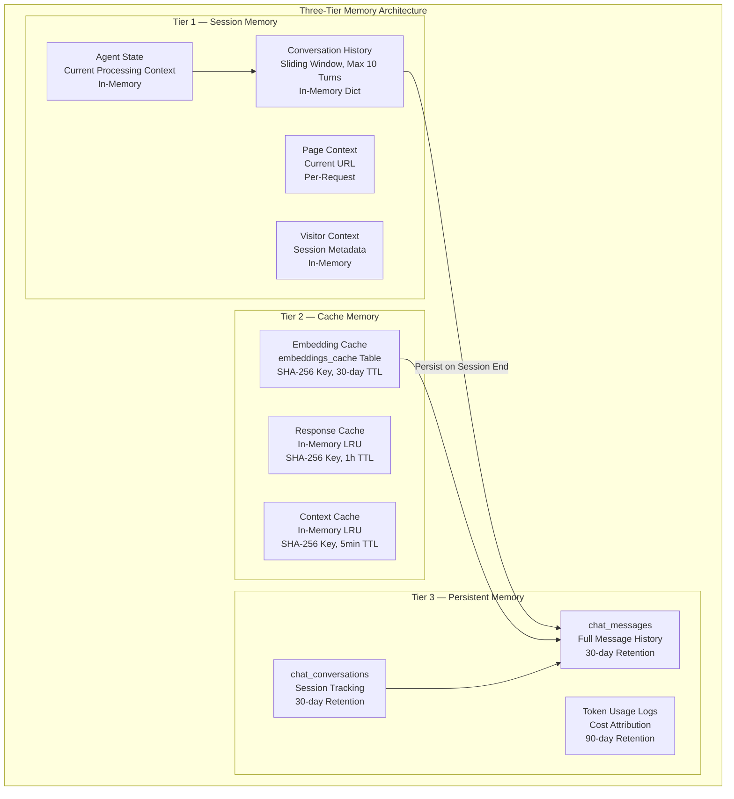
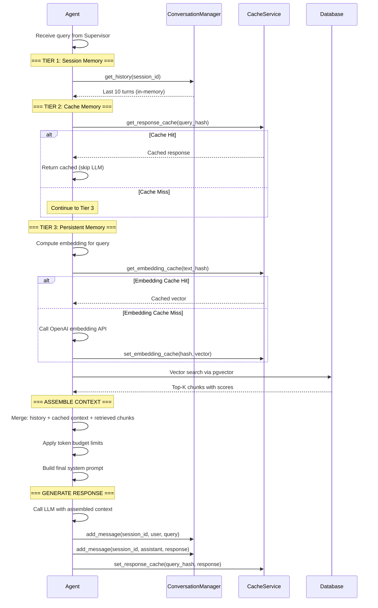
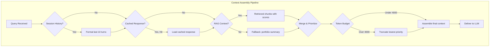
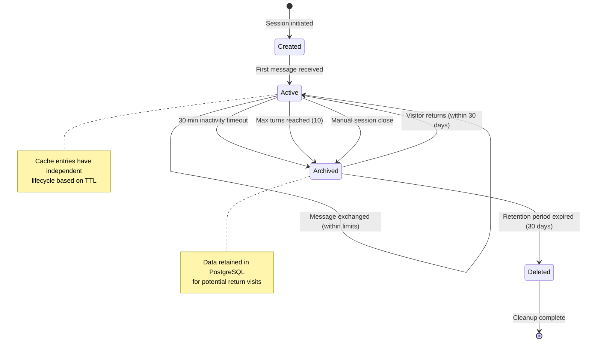
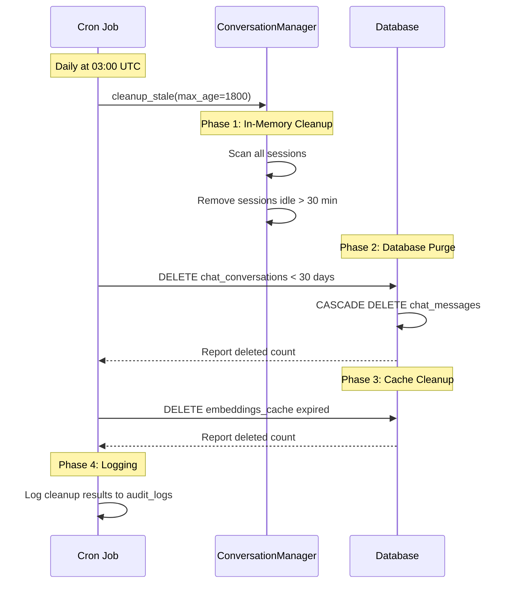
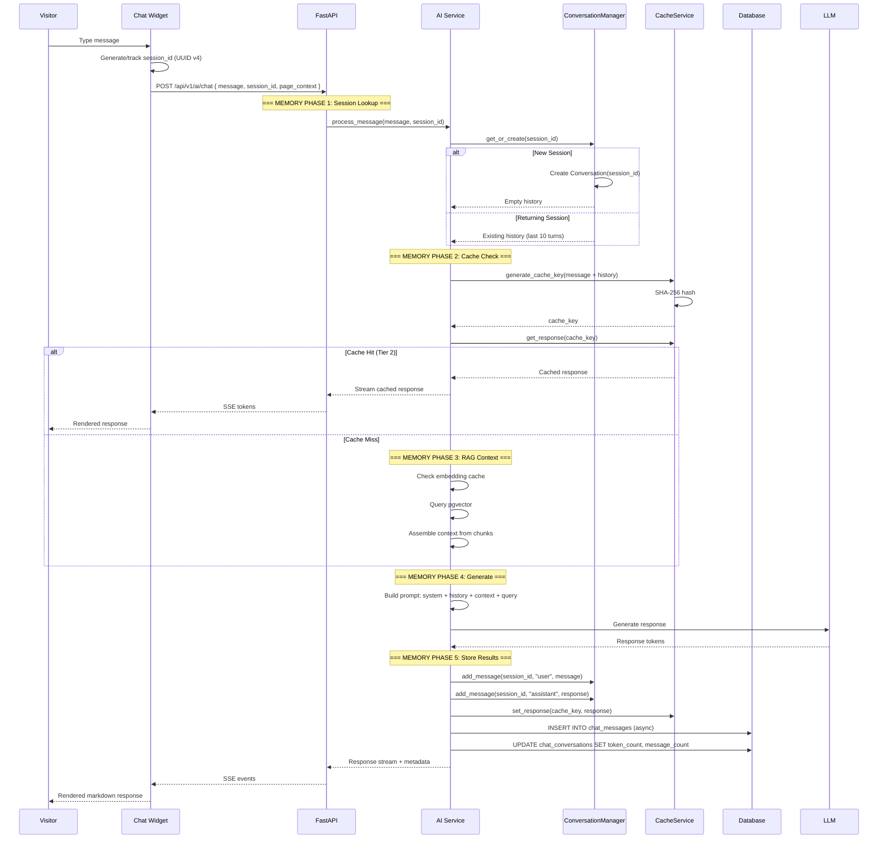
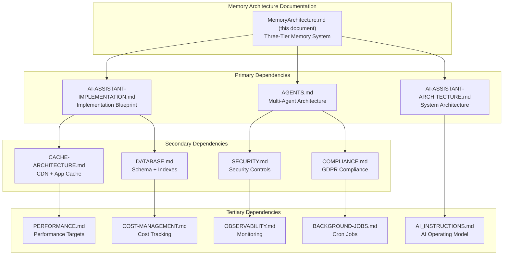

> **Status:** 🎯 DESIGN SPEC — Not Implemented
> This document describes an aspirational future design. The features described here are NOT yet implemented in the codebase.
> For current AI implementation documentation, see:
> - [AI Strategy](../docs/ai/strategy.md)
> - [Model Decision Matrix](../docs/ai/model-decision-matrix.md)

# Memory Architecture — Three-Tier Enterprise Memory System

> **Document:** MemoryArchitecture.md | **Version:** 1.0 | **Last Updated:** June 2026
> **Status:** Active | **Owner:** Chief AI Architect | **Review Cadence:** Monthly
> **Classification:** Enterprise Architecture | **Runtime:** FastAPI + Supabase PostgreSQL
> **AI Operating Model:** docs/ai/17-AI_INSTRUCTIONS.md | **Agent System:** docs/ai/18-AGENTS.md | **Implementation:** docs/design/08h-AI-ASSISTANT-IMPLEMENTATION.md

---

## Executive Summary

Defines the agent memory architecture - session memory (ephemeral), persistent memory (30-day retention), knowledge memory (indefinite), and strict no-PII/no-profiling policies.

---

## Table of Contents

1. [Executive Summary](#1-executive-summary)
2. [Three-Tier Memory Model Overview](#2-three-tier-memory-model-overview)
3. [Tier 1 — Session Memory](#3-tier-1--session-memory)
4. [Tier 2 — Cache Memory](#4-tier-2--cache-memory)
5. [Tier 3 — Persistent Memory](#5-tier-3--persistent-memory)
6. [Memory by Agent Type](#6-memory-by-agent-type)
7. [Memory Retrieval Protocol](#7-memory-retrieval-protocol)
8. [Context Assembly from Multiple Memory Tiers](#8-context-assembly-from-multiple-memory-tiers)
9. [Memory Lifecycle State Machine](#9-memory-lifecycle-state-machine)
10. [Retention Enforcement](#10-retention-enforcement)
11. [Archival Process](#11-archival-process)
12. [GDPR Compliance](#12-gdpr-compliance)
13. [Memory Security](#13-memory-security)
14. [PII Protection](#14-pii-protection)
15. [Session Isolation](#15-session-isolation)
16. [Encryption at Rest](#16-encryption-at-rest)
17. [Memory Performance Targets](#17-memory-performance-targets)
18. [Indexing Strategy](#18-indexing-strategy)
19. [Cache Hit Rate Monitoring](#19-cache-hit-rate-monitoring)
20. [Integration with Agent System](#20-integration-with-agent-system)
21. [ConversationManager Implementation](#21-conversationmanager-implementation)
22. [Memory Flow in Request Lifecycle](#22-memory-flow-in-request-lifecycle)
23. [Cache Key Generation](#23-cache-key-generation)
24. [Cache Invalidation Strategy](#24-cache-invalidation-strategy)
25. [Memory Metrics and Observability](#25-memory-metrics-and-observability)
26. [Cost Tracking per Conversation](#26-cost-tracking-per-conversation)
27. [Memory Failure Modes](#27-memory-failure-modes)
28. [Error Recovery for Memory Operations](#28-error-recovery-for-memory-operations)
29. [Sliding Window Algorithm](#29-sliding-window-algorithm)
30. [Token-Aware Truncation](#30-token-aware-truncation)
31. [Session Timeout Handling](#31-session-timeout-handling)
32. [Session ID Scheme](#32-session-id-scheme)
33. [Embedding Cache Implementation](#33-embedding-cache-implementation)
34. [Response Cache Implementation](#34-response-cache-implementation)
35. [Context Cache Implementation](#35-context-cache-implementation)
36. [Cleanup Cron Job](#36-cleanup-cron-job)
37. [Memory Configuration Reference](#37-memory-configuration-reference)
38. [Memory Schema Reference](#38-memory-schema-reference)
39. [Related Documents](#39-related-documents)
40. [## Change Log](#40-change-log)

---

## 1. Executive Summary

### 1.1 Why Memory Matters

Memory is the foundation of coherent AI interaction. Without memory, every query is stateless -- the assistant cannot recall previous exchanges, cannot build on prior context, and cannot provide personalized responses. The memory architecture provides:

- **Conversational continuity** across multiple turns within a session
- **Cost optimization** through caching of expensive operations (embeddings, LLM responses)
- **Analytics and audit** through persistent storage of conversation data
- **Agent state management** enabling specialist agents to maintain context across handoffs
- **Compliance readiness** with automated retention enforcement and data minimization

### 1.2 Design Principles

| Principle | Description |
|-----------|-------------|
| Ephemeral by default | Session data lives in memory; only explicitly persisted data touches the database |
| Cache first | Every expensive operation checks cache before executing |
| Cost-aware | Cache TTLs and retention periods are designed to minimize API costs |
| Privacy-preserving | PII is never stored; data is auto-purged after retention period |
| Observable | Every memory operation is logged with latency and hit/miss metrics |

### 1.3 Key Metrics

| Metric | Target | Measurement |
|--------|--------|-------------|
| Session memory hit rate | 100% (in-memory) | ConversationManager lookups |
| Response cache hit rate | > 30% | CacheService.hit_rate() |
| Embedding cache hit rate | > 40% | EmbeddingCache hit/miss ratio |
| Cache invalidation latency | < 100ms | Time from mutation to cache clear |
| Session memory p99 latency | < 5ms | ConversationManager operations |
| Persistent memory p99 latency | < 50ms | Database queries |
| Retention cleanup SLA | Daily at 03:00 UTC | Cron job execution log |

---

## 2. Three-Tier Memory Model Overview



### 2.1 Tier Comparison

| Aspect | Tier 1 — Session | Tier 2 — Cache | Tier 3 — Persistent |
|--------|------------------|----------------|---------------------|
| Storage Medium | In-memory (Python dict) | In-memory + PostgreSQL | PostgreSQL (Supabase) |
| Data Scope | Active session only | Cross-session (dedup) | All historical |
| Duration | Session lifetime (max 30 min idle) | 5min to 30 days | 30 days |
| Max Size | 10 turns per session | 500 entries (response), unlimited (embedding) | Retention-limited |
| Access Latency | < 1ms | < 1ms (memory), < 20ms (PG) | < 50ms |
| Cost | Free | Free (memory), ~$0.001/GB (PG) | ~$0.01/GB/month |
| Eviction Policy | LRU + sliding window | LRU + TTL | Cron-based delete |

---

## 3. Tier 1 — Session Memory

### 3.1 Conversation History

Session memory maintains the active conversation history for each chat session. The ConversationManager (`docs/design/08h-AI-ASSISTANT-IMPLEMENTATION.md` §6.2) manages this entirely in-memory using a dictionary of `Conversation` dataclass instances.

| Parameter | Value | Description |
|-----------|-------|-------------|
| Storage | `dict[str, Conversation]` | Session ID to Conversation mapping |
| Max turns | 10 | Maximum user+assistant exchanges kept in context |
| Max tokens | 4096 | Total token budget for conversation history |
| Eviction | Oldest-first | Oldest messages removed when limits exceeded |
| Persistence | None (in-memory only) | Cleared on service restart |

### 3.2 Sliding Window Algorithm

The sliding window ensures the conversation context window never exceeds the configured maximum:

```python
def add_message(self, session_id: str, role: str, content: str) -> Conversation:
    conv = self.get_or_create(session_id)
    conv.messages.append({"role": role, "content": content, "timestamp": time.time()})
    conv.updated_at = time.time()
    conv.token_count += len(content) // 4

    # Apply sliding window: keep system messages, truncate oldest non-system
    non_system = [m for m in conv.messages if m["role"] != "system"]
    system_msgs = [m for m in conv.messages if m["role"] == "system"]
    if len(non_system) > self.max_turns:
        excess = len(non_system) - self.max_turns
        conv.messages = system_msgs + non_system[excess:]
    return conv
```

### 3.3 Token-Aware Truncation

When the conversation token count exceeds the configured maximum, the system performs oldest-first eviction:

| Priority | Message Type | Eviction Order |
|----------|-------------|----------------|
| 1 (keep) | System prompts | Never evicted |
| 2 (keep) | Most recent assistant response | Kept until oldest |
| 3 (keep) | Most recent user message | Kept until oldest |
| 4 (evict first) | Oldest user/assistant pairs | Evicted first |

### 3.4 Session Timeout

Sessions are automatically cleaned up after 30 minutes of inactivity:

| Parameter | Value |
|-----------|-------|
| Timeout duration | 30 minutes (1800 seconds) |
| Detection | `time.now() - conv.updated_at > max_age_seconds` |
| Cleanup schedule | On every `get_or_create` call + periodic sweep |
| Cleanup scope | All sessions with `updated_at` older than threshold |
| Post-cleanup | Conversation data lost (not persisted to database during session) |

### 3.5 Session ID Scheme

| Property | Specification |
|----------|--------------|
| Format | UUID v4 |
| Generator | Client-side (browser) |
| Transport | Sent with every chat API request |
| Storage | Client: localStorage; Server: in-memory dict |
| Lifespan | Single browser session (cleared on tab close) |
| Uniqueness | Collision probability: ~5.3 x 10^36 |
| Validation | Server validates UUID format before use |

Example session ID: `f47ac10b-58cc-4372-a567-0e02b2c3d479`

---

## 4. Tier 2 — Cache Memory

### 4.1 Cache Inventory

| Cache | Store | Key | Value | TTL | Max Size | Hit Rate Target |
|-------|-------|-----|-------|-----|----------|-----------------|
| Response Cache | In-memory `OrderedDict` | SHA-256(query + context + page) | Full LLM response | 1 hour | 500 entries | > 30% |
| Embedding Cache | `embeddings_cache` table (PG) | SHA-256(input text) | 1536-dim vector | 30 days | Unlimited | > 40% |
| Context Cache | In-memory `OrderedDict` | SHA-256(query) | Assembled RAG context | 5 minutes | 200 entries | > 20% |

### 4.2 Response Cache

```python
class ResponseCache:
    def __init__(self, max_size: int = 500, ttl_seconds: int = 3600):
        self._cache: OrderedDict[str, tuple[float, Any]] = OrderedDict()
        self.max_size = max_size
        self.ttl_seconds = ttl_seconds
        self.hits = 0
        self.misses = 0

    def _key(self, data: dict) -> str:
        raw = json.dumps(data, sort_keys=True)
        return hashlib.sha256(raw.encode()).hexdigest()

    def get(self, key: str) -> Optional[Any]:
        if key not in self._cache:
            self.misses += 1
            return None
        timestamp, value = self._cache[key]
        if time.time() - timestamp > self.ttl_seconds:
            del self._cache[key]
            self.misses += 1
            return None
        self._cache.move_to_end(key)
        self.hits += 1
        return value

    def set(self, key: str, value: Any):
        if key in self._cache:
            self._cache.move_to_end(key)
        self._cache[key] = (time.time(), value)
        if len(self._cache) > self.max_size:
            self._cache.popitem(last=False)

    def hit_rate(self) -> float:
        total = self.hits + self.misses
        return self.hits / total if total > 0 else 0.0
```

### 4.3 Embedding Cache

The embedding cache stores computed embeddings in a dedicated PostgreSQL table, avoiding redundant API calls to OpenAI for identical text inputs.

| Property | Value |
|----------|-------|
| Table | `embeddings_cache` |
| Key | SHA-256 hash of input text |
| Value | 1536-dimensional float vector |
| Model | text-embedding-3-small |
| TTL | 30 days (via `expires_at` column) |
| Cost per hit saved | ~$0.00001625 per embedding |

### 4.4 Context Cache

Computed RAG contexts are cached for 5 minutes to handle repeated or similar queries within a short timeframe:

| Property | Value |
|----------|-------|
| Store | In-memory `OrderedDict` |
| Max entries | 200 |
| TTL | 5 minutes (300 seconds) |
| Key | SHA-256 of query text |
| Value | Pre-assembled context string |

### 4.5 Cache Invalidation Strategy

| Trigger | Action | Scope | Latency SLA |
|---------|--------|-------|-------------|
| Content updated | Invalidate all caches | Response + Context | < 100ms |
| Embedding regenerated | Update embedding cache | Embedding cache row | < 50ms |
| Cache TTL expired | Lazy eviction on next get | Single entry | N/A |
| Cache full (LRU) | Evict least recently used | Single entry | N/A |
| Manual invalidation (admin) | Clear all caches | All entries | < 200ms |

---

## 5. Tier 3 — Persistent Memory

### 5.1 chat_conversations Table

```sql
CREATE TABLE IF NOT EXISTS chat_conversations (
    id UUID DEFAULT gen_random_uuid() PRIMARY KEY,
    session_id TEXT NOT NULL UNIQUE,
    user_id UUID REFERENCES users(id),
    title TEXT,
    page_context TEXT,
    visitor_type TEXT,
    context JSONB DEFAULT '{}',
    is_active BOOLEAN NOT NULL DEFAULT true,
    message_count INTEGER NOT NULL DEFAULT 0,
    token_count INTEGER NOT NULL DEFAULT 0,
    total_cost_cents DECIMAL(10,4) DEFAULT 0,
    created_at TIMESTAMPTZ NOT NULL DEFAULT NOW(),
    updated_at TIMESTAMPTZ NOT NULL DEFAULT NOW()
);
```

| Column | Type | Description |
|--------|------|-------------|
| `id` | UUID | Primary key |
| `session_id` | TEXT | Client-generated UUID v4 (unique) |
| `user_id` | UUID (nullable) | FK to users table (null for anonymous) |
| `title` | TEXT | Auto-generated conversation title |
| `page_context` | TEXT | Page URL where conversation started |
| `visitor_type` | TEXT | Estimated visitor category |
| `context` | JSONB | Additional metadata |
| `is_active` | BOOLEAN | Whether conversation is ongoing |
| `message_count` | INTEGER | Total messages exchanged |
| `token_count` | INTEGER | Total tokens consumed |
| `total_cost_cents` | DECIMAL(10,4) | Total cost in USD cents |
| `created_at` | TIMESTAMPTZ | Creation timestamp |
| `updated_at` | TIMESTAMPTZ | Last activity timestamp |

### 5.2 chat_messages Table

```sql
CREATE TABLE IF NOT EXISTS chat_messages (
    id UUID DEFAULT gen_random_uuid() PRIMARY KEY,
    conversation_id UUID NOT NULL REFERENCES chat_conversations(id) ON DELETE CASCADE,
    role TEXT NOT NULL CHECK (role IN ('user', 'assistant', 'system', 'tool')),
    content TEXT NOT NULL,
    model TEXT,
    tokens_used INTEGER DEFAULT 0,
    cost_cents DECIMAL(10,4) DEFAULT 0,
    latency_ms INTEGER,
    metadata JSONB DEFAULT '{}',
    created_at TIMESTAMPTZ NOT NULL DEFAULT NOW()
);
```

| Column | Type | Description |
|--------|------|-------------|
| `id` | UUID | Primary key |
| `conversation_id` | UUID | FK to chat_conversations |
| `role` | TEXT | One of: user, assistant, system, tool |
| `content` | TEXT | Message content (no PII) |
| `model` | TEXT | Model used for this response |
| `tokens_used` | INTEGER | Token count for this message |
| `cost_cents` | DECIMAL(10,4) | Cost attributed to this message |
| `latency_ms` | INTEGER | Response generation time |
| `metadata` | JSONB | Additional metadata |
| `created_at` | TIMESTAMPTZ | Message timestamp |

### 5.3 30-Day Retention Policy

| Data | Retention Period | Enforcement Method | Post-Deletion |
|------|------------------|--------------------|---------------|
| chat_conversations | 30 days | DELETE WHERE updated_at < now() - 30 days | Irrecoverable |
| chat_messages | 30 days | DELETE via CASCADE from conversations | Irrecoverable |
| embeddings_cache | 30 days (sliding TTL) | DELETE WHERE expires_at < now() | Irrecoverable |
| Token usage logs | 90 days | Separate archival table | Archived |

### 5.4 Token Usage and Cost Tracking Per Conversation

```sql
-- Aggregated cost per conversation
SELECT
    c.id AS conversation_id,
    c.session_id,
    c.message_count,
    c.token_count,
    c.total_cost_cents,
    c.created_at,
    c.updated_at
FROM chat_conversations c
WHERE c.created_at >= NOW() - INTERVAL '30 days'
ORDER BY c.total_cost_cents DESC;

-- Per-message cost breakdown
SELECT
    cm.role,
    cm.model,
    COUNT(*) AS message_count,
    SUM(cm.tokens_used) AS total_tokens,
    SUM(cm.cost_cents) AS total_cost_cents,
    AVG(cm.latency_ms) AS avg_latency_ms
FROM chat_messages cm
JOIN chat_conversations cc ON cc.id = cm.conversation_id
WHERE cc.created_at >= NOW() - INTERVAL '30 days'
GROUP BY cm.role, cm.model
ORDER BY total_cost_cents DESC;
```

---

## 6. Memory by Agent Type

### 6.1 Agent Memory Configuration Matrix

| Agent | Session Memory | Cache Memory | Persistent Memory | Knowledge Sources | Memory Scope |
|-------|---------------|-------------|-------------------|-------------------|--------------|
| **Supervisor** | Routing decisions, context state, classification cache | Response cache (1h) | Routing logs (30 days) | Agent manifests | Session + Persistent |
| **Portfolio Agent** | Last 5 turns, visitor preferences | Response cache (1h) | None | projects, skills, about, services | Session only |
| **Resume Agent** | Last 5 turns | Response cache (1h) | None | experiences, achievements | Session only |
| **Projects Agent** | Last 5 turns, NDA session state | Response cache (1h) | None | projects, project_images | Session only |
| **Blog Agent** | Last 3 turns | Response cache (1h) | None | blog_posts | Session only |
| **Case Study Agent** | Last 5 turns | Response cache (1h) | None | case_studies, projects | Session only |
| **Career Agent** | Last 3 turns | Response cache (1h) | None | experiences, achievements | Session only |
| **Lead Qualification Agent** | Qualification progress, collected info | Response cache (1h) | Leads record (30 days) | None | Session + Persistent |
| **Analytics Agent** | Query context | Response cache (1h) | None | analytics_events | Session only |
| **Admin Agent** | Session auth state, operation queue | Response cache (1h) | Audit logs (persistent) | system_settings | Session + Persistent |
| **Knowledge Agent** | Re-index state machine | Embedding cache (30d) | Re-index history (90 days) | document_chunks | Persistent |

### 6.2 Memory Scope and Duration

| Agent | Session Duration | Cache Duration | Persistent Duration | Storage Location |
|-------|-----------------|----------------|--------------------|-----------------|
| Supervisor | Session (30 min idle) | 1 hour | 30 days | In-memory + chat_conversations |
| Portfolio Agent | Session (30 min idle) | 1 hour | None | In-memory |
| Resume Agent | Session (30 min idle) | 1 hour | None | In-memory |
| Projects Agent | Session (30 min idle) | 1 hour | None | In-memory |
| Blog Agent | Session (30 min idle) | 1 hour | None | In-memory |
| Case Study Agent | Session (30 min idle) | 1 hour | None | In-memory |
| Career Agent | Session (30 min idle) | 1 hour | None | In-memory |
| Lead Qualification Agent | Session (30 min idle) | 1 hour | 30 days | In-memory + leads table |
| Analytics Agent | Per-query | 1 hour | None | In-memory |
| Admin Agent | Admin session | 1 hour | Indefinite | In-memory + audit_logs |
| Knowledge Agent | Per-task | 30 days | 90 days | In-memory + document_chunks |

---

## 7. Memory Retrieval Protocol

### 7.1 How Agents Query Memory

The memory retrieval protocol defines the standard sequence agents follow to access data across all three tiers:

```
Step 1: Check Session Memory (Tier 1)
  - Retrieve conversation history from ConversationManager
  - Retrieve agent-specific state variables
  - Fastest path (< 1ms)

Step 2: Check Cache Memory (Tier 2)
  - Compute deterministic cache key
  - Check Response Cache (1h TTL)
  - Check Context Cache (5min TTL)
  - Check Embedding Cache (30-day TTL)

Step 3: Query Persistent Memory (Tier 3)
  - Execute database query for chat history
  - Execute RAG retrieval for knowledge context
  - Fallback path (< 50ms)
```

### 7.2 Prioritization Scoring

Each memory source is scored and prioritized during context assembly:

| Source | Priority Score | Weight | Max Contribution |
|--------|---------------|--------|-----------------|
| Session conversation history | 1.0 | 30% | 2000 tokens |
| Response cache hit | 0.9 | 25% | Full cached response |
| RAG retrieved context | 0.8 | 25% | 4000 characters |
| Embedding cache hit | 0.7 | 10% | Cached vector |
| Persistent chat history | 0.5 | 10% | Last 5 turns from DB |

### 7.3 Retrieval Flow



---

## 8. Context Assembly from Multiple Memory Tiers

### 8.1 Assembly Algorithm

```python
def assemble_context(
    session_history: list[dict],
    cached_response: Optional[str],
    retrieved_chunks: list[dict],
    max_tokens: int = 4000,
) -> ContextAssembly:
    """Assemble context from all three memory tiers, respecting token budget."""

    assembly = ContextAssembly()
    tokens_remaining = max_tokens

    # Tier 1: Session history (highest priority)
    for msg in reversed(session_history[-10:]):
        msg_tokens = len(msg["content"]) // 4
        if msg_tokens > tokens_remaining:
            break
        assembly.add_history(msg)
        tokens_remaining -= msg_tokens

    # Tier 2: Cached response (if available and relevant)
    if cached_response and tokens_remaining > 100:
        cache_tokens = len(cached_response) // 4
        if cache_tokens <= tokens_remaining:
            assembly.add_cached(cached_response)
            tokens_remaining -= cache_tokens

    # Tier 3: Retrieved chunks (fill remaining budget)
    for chunk in retrieved_chunks:
        chunk_tokens = len(chunk["content"]) // 4
        if chunk_tokens > tokens_remaining:
            break
        assembly.add_chunk(chunk)
        tokens_remaining -= chunk_tokens

    return assembly
```

### 8.2 Context Composition Diagram



---

## 9. Memory Lifecycle State Machine

### 9.1 State Diagram



### 9.2 State Descriptions

| State | Description | Storage | Duration | Recovery Possible? |
|-------|-------------|---------|----------|-------------------|
| Created | Session initialized, no messages yet | In-memory only | 30 min idle | N/A (no data to recover) |
| Active | Conversation in progress | In-memory + PostgreSQL | Variable | Yes (from DB) |
| Archived | Session ended, data retained | PostgreSQL only | Up to 30 days | Yes (restore to Active) |
| Deleted | Data purged per retention policy | None | N/A | No |

---

## 10. Retention Enforcement

### 10.1 Retention Schedule

| Operation | Schedule | Command | Scope |
|-----------|----------|---------|-------|
| Session timeout cleanup | On every access + periodic (5 min) | Python cleanup loop | In-memory sessions > 30 min idle |
| Chat data purge | Daily at 03:00 UTC | SQL DELETE | chat_conversations + chat_messages > 30 days |
| Embedding cache purge | Daily at 03:30 UTC | SQL DELETE | embeddings_cache WHERE expires_at < now() |
| Token usage archive | Weekly at 02:00 UTC | SQL INSERT INTO archive | Token logs > 90 days |

### 10.2 Cleanup SQL

```sql
-- Purge conversations and messages older than 30 days
DELETE FROM chat_conversations
WHERE updated_at < NOW() - INTERVAL '30 days'
RETURNING id;

-- Purge expired embedding cache entries
DELETE FROM embeddings_cache
WHERE expires_at < NOW();

-- Archive token usage older than 90 days
INSERT INTO token_usage_archive (
    conversation_id, session_id, total_tokens, total_cost_cents,
    model_used, message_count, archived_at
)
SELECT
    id, session_id, token_count, total_cost_cents,
    NULL, message_count, NOW()
FROM chat_conversations
WHERE updated_at < NOW() - INTERVAL '90 days'
AND updated_at > NOW() - INTERVAL '91 days';
```

---

## 11. Archival Process

### 11.1 Archival Flow



---

## 12. GDPR Compliance

### 12.1 Right to Deletion

| Requirement | Implementation | Verification |
|-------------|---------------|--------------|
| Right to erasure (Art. 17) | 30-day auto-purge of all chat data | Cron job execution logs |
| Right to data portability (Art. 20) | Admin export of conversation data in JSON | Admin dashboard export feature |
| Right to object (Art. 21) | Chat widget dismiss option, no forced data collection | UI audit |
| Consent (Art. 7) | Chat widget clearly labeled as AI-powered | Chat widget header text |

### 12.2 Data Minimization

| Practice | Implementation |
|----------|---------------|
| Store only necessary fields | chat_messages stores only role, content, tokens, model, cost |
| No PII in message content | System prompt instructs AI to avoid PII; output filter strips PII |
| No visitor profiling | Visitor memory is purely session-based; no long-term profile built |
| No cross-session correlation | Each session has a unique ID; no user ID required for anonymous visitors |
| No IP address storage | Chat tables do not include IP address or user-agent columns |

### 12.3 GDPR Compliance Matrix

| GDPR Article | Requirement | Status | Evidence |
|--------------|-------------|--------|----------|
| Art. 5(1)(c) | Data minimization | Compliant | Schema limited to necessary fields |
| Art. 5(1)(e) | Storage limitation | Compliant | 30-day retention cron job |
| Art. 13 | Information to data subject | Compliant | Chat widget AI disclosure |
| Art. 17 | Right to erasure | Compliant | Retention-based auto-deletion |
| Art. 20 | Data portability | Compliant | Admin export feature |
| Art. 32 | Security of processing | Compliant | Encryption at rest, RLS policies |

---

## 13. Memory Security

### 13.1 Security Controls by Tier

| Tier | Security Control | Implementation |
|------|-----------------|----------------|
| Tier 1 — Session | In-memory isolation | Sessions stored in scoped dict, no shared state |
| Tier 1 — Session | Session ID validation | UUID format validated before use |
| Tier 2 — Cache | Key-based access | Cache accessed by deterministic hash only |
| Tier 2 — Cache | TTL-based cleanup | Automatic eviction prevents stale data accumulation |
| Tier 3 — Persistent | Row-Level Security (RLS) | PostgreSQL RLS policies on all chat tables |
| Tier 3 — Persistent | Encryption at rest | Supabase provides AES-256 encryption |
| Tier 3 — Persistent | CASCADE deletes | Message deletion cascades from conversation deletion |

### 13.2 Security Rules

| Rule | ID | Description |
|------|----|-------------|
| Session Isolation | MEM-SEC-001 | Each session starts with clean context; no cross-session data leakage |
| No PII in Memory | MEM-SEC-002 | PII is never stored in memory, caches, or database tables |
| Cache Separation | MEM-SEC-003 | Different cache instances for different data types (no key collision) |
| Access Control | MEM-SEC-004 | Only authenticated admin users can access persistent memory directly |
| Cleanup Verification | MEM-SEC-005 | Retention cleanup produces audit logs for compliance verification |

---

## 14. PII Protection

### 14.1 PII Categories Never Stored

| Category | Examples | Protection Mechanism |
|----------|----------|---------------------|
| Email addresses | user@example.com | Output filter regex redaction |
| Phone numbers | +1-555-123-4567 | Output filter regex redaction |
| Physical addresses | 123 Main St, City | Output filter regex redaction |
| Government IDs | SSN, passport numbers | Input sanitizer reject + output filter redaction |
| Financial data | Credit card numbers | Input sanitizer reject |
| Login credentials | Passwords, API keys | Input sanitizer reject |

### 14.2 PII Filter Implementation

```python
import re

PII_PATTERNS = {
    "email": re.compile(r"[a-zA-Z0-9._%+-]+@[a-zA-Z0-9.-]+\.[a-zA-Z]{2,}"),
    "phone": re.compile(r"\+?\d{1,4}[-.]?\(?\d{1,4}\)?[-.]?\d{1,4}[-.]?\d{1,4}"),
    "address": re.compile(r"\d{1,5}\s+[A-Za-z]+\s+(Street|St|Ave|Avenue|Rd|Road|Blvd|Boulevard)"),
    "ssn": re.compile(r"\d{3}-\d{2}-\d{4}"),
}

def filter_pii(text: str) -> str:
    """Scan and redact PII from text."""
    for pattern_name, pattern in PII_PATTERNS.items():
        text = pattern.sub(f"[{pattern_name} removed]", text)
    return text
```

---

## 15. Session Isolation

### 15.1 Isolation Guarantees

| Property | Guarantee | Implementation |
|----------|-----------|----------------|
| No cross-session data leakage | Absolute | Each Conversation instance is scoped to one session_id |
| No shared cache keys | High | Cache keys include session-specific context |
| No shared conversation state | Absolute | In-memory dict keyed by unique session_id |
| Anonymized analytics | High | Analytics use aggregated, not session-level, data |

### 15.2 Session Boundary Enforcement

```python
class ConversationManager:
    def __init__(self):
        self._sessions: dict[str, Conversation] = {}

    def get_or_create(self, session_id: str) -> Conversation:
        """Each session_id maps to exactly one Conversation instance."""
        if session_id not in self._sessions:
            return self.create_session(session_id)
        return self._sessions[session_id]

    def delete_session(self, session_id: str):
        """Complete isolation: deleting one session never affects others."""
        self._sessions.pop(session_id, None)
```

---

## 16. Encryption at Rest

### 16.1 Database Encryption

| Layer | Encryption Standard | Scope |
|-------|-------------------|-------|
| Disk | AES-256 | All Supabase PostgreSQL data |
| Backup | AES-256 | Automated backups |
| Storage | AES-256 | Object storage (if used) |
| Transport | TLS 1.3 | All client-server and service-service communication |

### 16.2 Key Management

| Key Type | Management | Rotation |
|----------|------------|----------|
| Database encryption keys | Managed by Supabase | Automatic (Supabase-managed) |
| Application secrets | Environment variables | Manual (Railway dashboard) |
| API keys | Environment variables | Manual (per-provider dashboard) |

---

## 17. Memory Performance Targets

### 17.1 Latency SLAs

| Operation | p50 Target | p95 Target | p99 Target |
|-----------|-----------|-----------|-----------|
| Session memory read | < 1ms | < 2ms | < 5ms |
| Session memory write | < 1ms | < 2ms | < 5ms |
| Response cache read | < 1ms | < 2ms | < 5ms |
| Response cache write | < 1ms | < 2ms | < 5ms |
| Embedding cache read (PG) | < 10ms | < 20ms | < 50ms |
| Embedding cache write (PG) | < 20ms | < 40ms | < 100ms |
| Context cache read | < 1ms | < 2ms | < 5ms |
| Chat messages write (PG) | < 20ms | < 40ms | < 80ms |
| Chat conversations write (PG) | < 20ms | < 40ms | < 80ms |
| Retention cleanup (PG) | < 1s | < 5s | < 10s |

### 17.2 Throughput Targets

| Operation | Sustained Throughput | Burst Throughput |
|-----------|---------------------|------------------|
| Session memory operations | 500/s | 1000/s |
| Cache reads | 1000/s | 2000/s |
| Cache writes | 500/s | 1000/s |
| Database writes (chat_messages) | 50/s | 100/s |
| Database reads (conversations) | 100/s | 200/s |
| Retention cleanup | 1/day | N/A |

---

## 18. Indexing Strategy

### 18.1 Database Indexes

```sql
-- Primary lookup: find conversation by session ID
CREATE INDEX IF NOT EXISTS idx_chat_conversations_session_id
    ON chat_conversations(session_id);

-- Primary lookup: find messages for a conversation
CREATE INDEX IF NOT EXISTS idx_chat_messages_conversation_id
    ON chat_messages(conversation_id);

-- Retention cleanup: find old conversations
CREATE INDEX IF NOT EXISTS idx_chat_conversations_updated_at
    ON chat_conversations(updated_at);

-- Retention cleanup: find old messages
CREATE INDEX IF NOT EXISTS idx_chat_messages_created_at
    ON chat_messages(created_at);

-- Embedding cache lookup
CREATE INDEX IF NOT EXISTS idx_embeddings_cache_hash
    ON embeddings_cache(input_hash);

-- Embedding cache cleanup
CREATE INDEX IF NOT EXISTS idx_embeddings_cache_expires
    ON embeddings_cache(expires_at);

-- Conversation cost analysis
CREATE INDEX IF NOT EXISTS idx_chat_conversations_cost
    ON chat_conversations(total_cost_cents DESC)
    WHERE created_at >= NOW() - INTERVAL '30 days';
```

### 18.2 In-Memory Indexing

| Data Structure | Index | Complexity | Purpose |
|---------------|-------|-----------|---------|
| Response cache (OrderedDict) | SHA-256 hash key | O(1) | Deterministic cache lookup |
| Embedding cache (OrderedDict) | SHA-256 hash key | O(1) | Deterministic cache lookup (in-memory tier) |
| Session dict | Session ID (UUID) | O(1) | Direct session lookup |

---

## 19. Cache Hit Rate Monitoring

### 19.1 Cache Metrics

```python
class CacheMetrics:
    """Metrics collection for all cache types."""

    def __init__(self):
        self.response_cache_hits = 0
        self.response_cache_misses = 0
        self.embedding_cache_hits = 0
        self.embedding_cache_misses = 0
        self.context_cache_hits = 0
        self.context_cache_misses = 0
        self.cache_evictions = 0
        self.cache_invalidations = 0

    def hit_rate(self, hits: int, misses: int) -> float:
        total = hits + misses
        return hits / total if total > 0 else 0.0

    def report(self) -> dict:
        return {
            "response_cache_hit_rate": self.hit_rate(self.response_cache_hits, self.response_cache_misses),
            "embedding_cache_hit_rate": self.hit_rate(self.embedding_cache_hits, self.embedding_cache_misses),
            "context_cache_hit_rate": self.hit_rate(self.context_cache_hits, self.context_cache_misses),
            "total_cache_evictions": self.cache_evictions,
            "total_cache_invalidations": self.cache_invalidations,
        }
```

### 19.2 Monitoring Alert Thresholds

| Metric | Warning Threshold | Critical Threshold | Action |
|--------|-------------------|-------------------|--------|
| Response cache hit rate | < 20% | < 10% | Review cache key strategy |
| Embedding cache hit rate | < 30% | < 20% | Review text diversity |
| Context cache hit rate | < 15% | < 5% | Review query patterns |
| Cache eviction rate | > 100/hour | > 500/hour | Increase max_size |
| Cache invalidation rate | > 50/hour | > 200/hour | Review invalidation triggers |

---

## 20. Integration with Agent System

### 20.1 Memory Provider Chain

The `ConversationManager` (defined in `docs/design/08h-AI-ASSISTANT-IMPLEMENTATION.md` §6.2) is the primary memory provider for all agents:

```
Agent Request
    |
    v
Supervisor Agent
    |
    +--> ConversationManager.get_history(session_id)
    |       |
    |       +--> Tier 1: In-memory session buffer
    |       +--> Tier 2: Response cache
    |       +--> Tier 3: PostgreSQL (historical)
    |
    +--> Distributes formatted context to specialist agent
    |
    v
Specialist Agent
    |
    +--> ConversationManager.add_message(session_id, role, content)
    +--> Updates in-memory buffer
    +--> Persists to database asynchronously
```

### 20.2 Memory Access by Agent Role

| Agent | Memory Read | Memory Write | Memory Delete |
|-------|-------------|-------------|---------------|
| Supervisor | Read all session histories | Write routing decisions | None |
| Specialist Agents | Read own session history | Write own messages | None |
| Lead Qualification | Read lead status | Write lead data | None |
| Admin Agent | Read all data | Write system settings | Delete expired data |
| Knowledge Agent | Read document chunks | Write cache entries | Clear cache entries |

---

## 21. ConversationManager Implementation

### 21.1 Core Class

```python
# app/services/conversation_manager.py
import time
import uuid
from dataclasses import dataclass, field


@dataclass
class Conversation:
    id: str
    session_id: str
    messages: list[dict] = field(default_factory=list)
    created_at: float = field(default_factory=time.time)
    updated_at: float = field(default_factory=time.time)
    token_count: int = 0
    max_tokens: int = 4096


class ConversationManager:
    """Manages session memory for all agents."""

    def __init__(self, max_turns: int = 10, max_tokens: int = 4096):
        self._sessions: dict[str, Conversation] = {}
        self.max_turns = max_turns
        self.max_tokens = max_tokens

    def create_session(self, session_id: str) -> Conversation:
        conv = Conversation(id=str(uuid.uuid4()), session_id=session_id)
        self._sessions[session_id] = conv
        return conv

    def get_or_create(self, session_id: str) -> Conversation:
        if session_id not in self._sessions:
            return self.create_session(session_id)
        return self._sessions[session_id]

    def add_message(self, session_id: str, role: str, content: str) -> Conversation:
        conv = self.get_or_create(session_id)
        conv.messages.append({"role": role, "content": content, "timestamp": time.time()})
        conv.updated_at = time.time()
        conv.token_count += len(content) // 4

        non_system = [m for m in conv.messages if m["role"] != "system"]
        system_msgs = [m for m in conv.messages if m["role"] == "system"]
        if len(non_system) > self.max_turns:
            excess = len(non_system) - self.max_turns
            conv.messages = system_msgs + non_system[excess:]
        return conv

    def get_history(self, session_id: str, max_messages: int = 10) -> list[dict]:
        conv = self._sessions.get(session_id)
        if not conv:
            return []
        return conv.messages[-max_messages:]

    def format_history(self, session_id: str) -> str:
        messages = self.get_history(session_id, max_messages=10)
        return "\n".join(f"{m['role'].capitalize()}: {m['content']}" for m in messages)

    def delete_session(self, session_id: str):
        self._sessions.pop(session_id, None)

    def cleanup_stale(self, max_age_seconds: int = 1800):
        now = time.time()
        stale = [
            sid for sid, conv in self._sessions.items()
            if now - conv.updated_at > max_age_seconds
        ]
        for sid in stale:
            del self._sessions[sid]
```

### 21.2 Integration Points

| Integration | Method | Description |
|-------------|--------|-------------|
| AI Service | `conversations.get_or_create(session_id)` | Initialize or retrieve session |
| AI Service | `conversations.add_message(session_id, role, content)` | Store new message |
| AI Service | `conversations.format_history(session_id)` | Format history for prompt |
| Supervisor Agent | `conversations.get_history(session_id)` | Retrieve raw history |
| Cron Job | `conversations.cleanup_stale(1800)` | Clean stale sessions |

---

## 22. Memory Flow in Request Lifecycle

### 22.1 Complete Request Lifecycle with Memory



---

## 23. Cache Key Generation

### 23.1 Cache Key Algorithms

```python
import hashlib
import json


def generate_response_cache_key(
    query: str,
    page_context: str | None,
    history: list[dict]
) -> str:
    """Generate deterministic cache key from query + context + history.

    History is summarized by last 2 turns to balance cache hit rate
    with relevance.
    """
    key_data = {
        "query": query.strip().lower(),
        "page": page_context or "unknown",
        "history_tail": history[-2:] if len(history) >= 2 else history
    }
    return hashlib.sha256(
        json.dumps(key_data, sort_keys=True).encode()
    ).hexdigest()


def generate_embedding_cache_key(text: str) -> str:
    """Generate deterministic cache key for embedding.

    Simple SHA-256 of the input text. Deterministic and collision-free.
    """
    return hashlib.sha256(text.encode("utf-8")).hexdigest()


def generate_context_cache_key(query: str, top_k: int = 5) -> str:
    """Generate deterministic cache key for RAG context."""
    key_data = {
        "query": query.strip().lower(),
        "top_k": top_k,
    }
    return hashlib.sha256(
        json.dumps(key_data, sort_keys=True).encode()
    ).hexdigest()
```

### 23.2 Key Collision Prevention

| Cache | Key Components | Collision Risk | Mitigation |
|-------|---------------|----------------|------------|
| Response | SHA-256(query + page + history_tail + timestamp_bucket) | Negligible (2^256 space) | Include timestamp bucket for hourly rotation |
| Embedding | SHA-256(input text) | Negligible (2^256 space) | N/A |
| Context | SHA-256(query) | Negligible (2^256 space) | N/A |

---

## 24. Cache Invalidation Strategy

### 24.1 Invalidation Events

| Event | Cache Affected | Invalidation Type | Latency |
|-------|---------------|-------------------|---------|
| Portfolio content updated | Response cache | Full clear (all entries) | < 100ms |
| Portfolio content updated | Context cache | Full clear (all entries) | < 100ms |
| Embedding regenerated | Embedding cache | Single entry (by input_hash) | < 50ms |
| Retention cleanup | Embedding cache | Bulk delete (expired rows) | < 1s |
| Admin manual clear | All caches | Full clear | < 200ms |

### 24.2 Invalidation Implementation

```python
class CacheInvalidator:
    """Handles cache invalidation across all cache types."""

    def __init__(self, response_cache, context_cache, db):
        self.response_cache = response_cache
        self.context_cache = context_cache
        self.db = db

    def invalidate_all(self):
        """Clear all in-memory caches."""
        self.response_cache._cache.clear()
        self.context_cache._cache.clear()

    async def invalidate_embedding(self, text_hash: str):
        """Invalidate a single embedding cache entry."""
        await self.db.execute(
            "DELETE FROM embeddings_cache WHERE input_hash = $1",
            text_hash,
        )

    async def invalidate_source_embeddings(self, source: str, source_id: str):
        """Invalidate all embeddings for a given source document."""
        await self.db.execute(
            "DELETE FROM embeddings_cache WHERE input_hash IN ("
            "SELECT DISTINCT input_hash FROM document_chunks "
            "WHERE source = $1 AND source_id = $2"
            ")",
            source, source_id,
        )
```

---

## 25. Memory Metrics and Observability

### 25.1 Metrics Collection Points

| Metric | Source | Collection Method | Export |
|--------|--------|-------------------|--------|
| Session count | ConversationManager | Periodic scan | Prometheus gauge |
| Cache hit/miss ratios | CacheService | Request counting | Prometheus counter |
| Cache size | CacheService | Periodic measurement | Prometheus gauge |
| Database query latency | PostgreSQL | pg_stat_statements | Prometheus histogram |
| Retention rows deleted | Cron job | Job output logging | Structured log |

### 25.2 Prometheus Metrics

```python
# Exposed at /metrics endpoint
MEMORY_METRICS = {
    "active_sessions": "Number of active in-memory sessions",
    "response_cache_entries": "Number of entries in response cache",
    "response_cache_hits_total": "Total response cache hits",
    "response_cache_misses_total": "Total response cache misses",
    "embedding_cache_hits_total": "Total embedding cache hits",
    "embedding_cache_misses_total": "Total embedding cache misses",
    "context_cache_entries": "Number of entries in context cache",
    "context_cache_hits_total": "Total context cache hits",
    "context_cache_misses_total": "Total context cache misses",
    "cache_evictions_total": "Total cache evictions",
    "cache_invalidations_total": "Total cache invalidations",
    "db_chat_messages_inserted_total": "Total chat messages inserted in DB",
    "db_conversations_created_total": "Total conversations created in DB",
}
```

---

## 26. Cost Tracking per Conversation

### 26.1 Cost Attribution Model

| Cost Component | Tracking Method | Rate | Attributed To |
|---------------|----------------|------|---------------|
| LLM API cost | Model router response | $0.0025-0.015/1K output | Per message |
| Embedding API cost | Embedding service counter | $0.13/1M tokens | Per embedding |
| Database storage | Data volume estimation | ~$0.01/GB/month | Monthly aggregate |
| Cache memory | Estimated RAM usage | Negligible | Not tracked |

### 26.2 Per-Conversation Cost Schema

```sql
-- Aggregated cost view for monitoring
CREATE OR REPLACE VIEW conversation_costs AS
SELECT
    c.id AS conversation_id,
    c.session_id,
    c.message_count,
    c.token_count,
    c.total_cost_cents,
    CASE
        WHEN c.total_cost_cents >= 1.0 THEN 'high'
        WHEN c.total_cost_cents >= 0.1 THEN 'medium'
        ELSE 'low'
    END AS cost_tier,
    c.created_at
FROM chat_conversations c
WHERE c.created_at >= NOW() - INTERVAL '30 days'
ORDER BY c.total_cost_cents DESC;

-- Monthly cost summary
SELECT
    DATE_TRUNC('month', created_at) AS month,
    COUNT(*) AS total_conversations,
    SUM(message_count) AS total_messages,
    SUM(token_count) AS total_tokens,
    SUM(total_cost_cents) AS total_cost_cents
FROM chat_conversations
GROUP BY DATE_TRUNC('month', created_at)
ORDER BY month DESC;
```

---

## 27. Memory Failure Modes

### 27.1 Failure Mode Analysis

| Failure Mode | Detection | Impact | RTO | Recovery |
|-------------|-----------|--------|-----|----------|
| Session memory corruption | Unexpected Conversation state | Lost conversation context | < 1s | Create new session, log error |
| Cache service unavailable | Timeout on cache access | Cache bypass (direct computation) | 0s | Continue without cache |
| Database connection failure | Supabase connection error | No persistent storage | < 2s | Retry with backoff (3 attempts) |
| Database write failure | INSERT error on chat_messages | Message not persisted | < 2s | Queue for retry, log warning |
| Retention cron failure | Job exit code non-zero | Data not cleaned up | 24h | Next scheduled run |
| Memory exhaustion | Python MemoryError | Service crash | < 2min | Railway auto-restart |

### 27.2 Graceful Degradation by Tier

| Failure | Degraded Mode | User Impact |
|---------|--------------|-------------|
| Tier 1 failure (session) | New empty session | Lost conversation context, user sees fresh chat |
| Tier 2 failure (cache) | Bypass cache, compute fresh | Slightly higher latency (no perceptible difference) |
| Tier 3 failure (database) | In-memory only, no persistence | Data not saved across restarts, no analytics |

---

## 28. Error Recovery for Memory Operations

### 28.1 Recovery Procedures

```python
class MemoryRecovery:
    """Graceful degradation and recovery for memory operations."""

    @staticmethod
    async def safe_get_history(cm: ConversationManager, session_id: str) -> list[dict]:
        """Retrieve session history with fallback to empty."""
        try:
            return cm.get_history(session_id)
        except Exception as e:
            logger.error(f"Session memory read failed: {e}")
            return []

    @staticmethod
    async def safe_cache_read(cs: CacheService, key: str) -> Optional[str]:
        """Read cache with fallback to None."""
        try:
            return cs.get(key)
        except Exception as e:
            logger.warning(f"Cache read failed (bypassing): {e}")
            return None

    @staticmethod
    async def safe_db_write(db, table: str, data: dict) -> bool:
        """Persist data with retry logic."""
        max_retries = 3
        for attempt in range(max_retries):
            try:
                await db.execute(f"INSERT INTO {table} ...", **data)
                return True
            except Exception as e:
                if attempt == max_retries - 1:
                    logger.error(f"DB write failed after {max_retries} attempts: {e}")
                    return False
                await asyncio.sleep(0.5 * (attempt + 1))
        return False
```

---

## 29. Sliding Window Algorithm

### 29.1 Algorithm Specification

```
Input:  messages[] - ordered list of conversation messages
        max_turns  - maximum number of user+assistant exchanges
        max_tokens - maximum total token count

Output: window[] - subset of messages within limits

Algorithm:
  1. Separate system messages from non-system messages
  2. Keep all system messages (immutable)
  3. Starting from the most recent non-system message:
     a. Add message to window (most recent first)
     b. Count tokens
     c. Stop adding when max_tokens is exceeded
  4. If number of non-system messages exceeds max_turns:
     a. Keep the most recent max_turns messages
     b. Discard the oldest excess messages
  5. Reconstruct full window as:
     system_messages + most_recent_non_system_messages
```

### 29.2 Edge Cases

| Scenario | Behavior |
|----------|----------|
| Single long message exceeding max_tokens | Truncated to fit; warning logged |
| All system messages and no non-system | Return system messages only |
| Exactly max_turns messages | No truncation applied |
| Multiple system messages piled | All system messages preserved |
| Rapid-fire messages in quick succession | Counted individually toward max_turns |

---

## 30. Token-Aware Truncation

### 30.1 Token Counting

```python
def estimate_tokens(text: str) -> int:
    """Estimate token count for a text string.

    Uses the common approximation of 4 characters per token
    for OpenAI and Anthropic models. Accurate within ~10%.
    """
    return len(text) // 4


def token_aware_truncation(
    items: list[dict],
    max_tokens: int,
    content_key: str = "content",
) -> list[dict]:
    """Truncate a list of items to fit within max_tokens.

    Items with the highest priority (system messages) are kept first.
    Remaining items are kept in reverse chronological order.
    """
    system_items = [i for i in items if i.get("role") == "system"]
    non_system_items = [i for i in items if i.get("role") != "system"]

    result = list(system_items)
    tokens_used = sum(estimate_tokens(i.get(content_key, "")) for i in result)
    budget = max_tokens - tokens_used

    for item in reversed(non_system_items):
        item_tokens = estimate_tokens(item.get(content_key, ""))
        if item_tokens <= budget:
            result.append(item)
            budget -= item_tokens
        else:
            break

    return result
```

### 30.2 Token Budget Allocation

| Component | Budget (tokens) | % of Total |
|-----------|----------------|------------|
| System prompt | 500 | 12.5% |
| Conversation history | 2000 | 50% |
| RAG context | 1000 | 25% |
| Query + formatting | 500 | 12.5% |
| **Total** | **4000** | **100%** |

---

## 31. Session Timeout Handling

### 31.1 Timeout Configuration

| Parameter | Value | Environment Variable |
|-----------|-------|---------------------|
| Session idle timeout | 1800 seconds (30 min) | `SESSION_TIMEOUT_SECONDS` |
| Cleanup sweep interval | 300 seconds (5 min) | `SESSION_CLEANUP_INTERVAL` |
| Max session duration (absolute) | 14400 seconds (4 hours) | `SESSION_MAX_DURATION` |
| Max messages per session | 20 (10 turns) | `SESSION_MAX_MESSAGES` |

### 31.2 Timeout Detection and Cleanup

```python
async def session_cleanup_task(cm: ConversationManager):
    """Periodic task to clean up stale sessions."""
    while True:
        try:
            stale_count = len(cm.cleanup_stale(max_age_seconds=1800))
            if stale_count > 0:
                logger.info(f"Cleaned {stale_count} stale sessions")
        except Exception as e:
            logger.error(f"Session cleanup failed: {e}")
        await asyncio.sleep(300)  # 5-minute interval
```

---

## 32. Session ID Scheme

### 32.1 Specification

| Property | Value |
|----------|-------|
| Format | UUID v4 (RFC 4122) |
| Length | 36 characters (32 hex + 4 hyphens) |
| Example | `550e8400-e29b-41d4-a716-446655440000` |
| Generator | `crypto.randomUUID()` (browser) |
| Entropy | 122 random bits |
| Collision probability | ~5.3 x 10^36 |

### 32.2 Validation

```python
import re
import uuid

UUID_PATTERN = re.compile(
    r"^[0-9a-f]{8}-[0-9a-f]{4}-4[0-9a-f]{3}-[89ab][0-9a-f]{3}-[0-9a-f]{12}$",
    re.IGNORECASE,
)


def validate_session_id(session_id: str) -> bool:
    """Validate that session_id is a proper UUID v4."""
    if not isinstance(session_id, str):
        return False
    if len(session_id) != 36:
        return False
    if not UUID_PATTERN.match(session_id):
        return False
    try:
        uuid.UUID(session_id, version=4)
        return True
    except (ValueError, AttributeError):
        return False
```

---

## 33. Embedding Cache Implementation

### 33.1 EmbeddingCache Class

```python
class EmbeddingCache:
    """Persistent embedding cache backed by PostgreSQL."""

    def __init__(self, db):
        self.db = db

    async def get(self, cache_key: str) -> Optional[list[float]]:
        row = await self.db.fetchrow(
            "SELECT embedding FROM embeddings_cache WHERE input_hash = $1 "
            "AND expires_at > NOW()",
            cache_key,
        )
        if row and row["embedding"]:
            await self.db.execute(
                "UPDATE embeddings_cache SET accessed_at = NOW() WHERE input_hash = $1",
                cache_key,
            )
            return row["embedding"]
        return None

    async def set(self, cache_key: str, text: str, embedding: list[float], model: str):
        await self.db.execute(
            "INSERT INTO embeddings_cache (input_hash, text_hash, embedding, model, expires_at) "
            "VALUES ($1, $2, $3::vector, $4, NOW() + INTERVAL '30 days') "
            "ON CONFLICT (input_hash) DO UPDATE "
            "SET embedding = $3::vector, accessed_at = NOW(), expires_at = NOW() + INTERVAL '30 days'",
            cache_key,
            hashlib.sha256(text.encode()).hexdigest(),
            embedding,
            model,
        )

    async def cleanup(self):
        result = await self.db.execute(
            "DELETE FROM embeddings_cache WHERE expires_at < NOW()"
        )
        return result
```

### 33.2 Cache Table DDL

```sql
CREATE TABLE IF NOT EXISTS embeddings_cache (
    id UUID PRIMARY KEY DEFAULT gen_random_uuid(),
    input_hash TEXT UNIQUE NOT NULL,
    text_hash TEXT NOT NULL,
    embedding vector(1536),
    model TEXT NOT NULL DEFAULT 'text-embedding-3-small',
    created_at TIMESTAMPTZ DEFAULT NOW(),
    accessed_at TIMESTAMPTZ DEFAULT NOW(),
    expires_at TIMESTAMPTZ NOT NULL DEFAULT (NOW() + INTERVAL '30 days')
);

CREATE INDEX IF NOT EXISTS idx_emb_cache_hash ON embeddings_cache(input_hash);
CREATE INDEX IF NOT EXISTS idx_emb_cache_expires ON embeddings_cache(expires_at);
CREATE INDEX IF NOT EXISTS idx_emb_cache_accessed ON embeddings_cache(accessed_at);
```

---

## 34. Response Cache Implementation

### 34.1 ResponseCache Class

```python
class ResponseCache:
    """In-memory LRU cache for LLM responses."""

    def __init__(self, max_size: int = 500, ttl_seconds: int = 3600):
        self._cache: OrderedDict[str, tuple[float, str]] = OrderedDict()
        self.max_size = max_size
        self.ttl_seconds = ttl_seconds
        self.hits = 0
        self.misses = 0
        self.evictions = 0

    def _make_key(self, data: dict) -> str:
        return hashlib.sha256(
            json.dumps(data, sort_keys=True).encode()
        ).hexdigest()

    def get(self, key: str) -> Optional[str]:
        if key not in self._cache:
            self.misses += 1
            return None
        timestamp, value = self._cache[key]
        if time.time() - timestamp > self.ttl_seconds:
            del self._cache[key]
            self.misses += 1
            return None
        self._cache.move_to_end(key)
        self.hits += 1
        return value

    def set(self, key: str, value: str):
        if key in self._cache:
            self._cache.move_to_end(key)
        self._cache[key] = (time.time(), value)
        if len(self._cache) > self.max_size:
            self._cache.popitem(last=False)
            self.evictions += 1

    def clear(self):
        self._cache.clear()

    def hit_rate(self) -> float:
        total = self.hits + self.misses
        return self.hits / total if total > 0 else 0.0

    def size(self) -> int:
        return len(self._cache)
```

---

## 35. Context Cache Implementation

### 35.1 ContextCache Class

```python
class ContextCache:
    """Short-lived cache for assembled RAG contexts."""

    def __init__(self, max_size: int = 200, ttl_seconds: int = 300):
        self._cache: OrderedDict[str, tuple[float, str]] = OrderedDict()
        self.max_size = max_size
        self.ttl_seconds = ttl_seconds
        self.hits = 0
        self.misses = 0

    def get(self, key: str) -> Optional[str]:
        if key not in self._cache:
            self.misses += 1
            return None
        timestamp, value = self._cache[key]
        if time.time() - timestamp > self.ttl_seconds:
            del self._cache[key]
            self.misses += 1
            return None
        self._cache.move_to_end(key)
        self.hits += 1
        return value

    def set(self, key: str, value: str):
        if key in self._cache:
            self._cache.move_to_end(key)
        self._cache[key] = (time.time(), value)
        if len(self._cache) > self.max_size:
            self._cache.popitem(last=False)

    def clear(self):
        self._cache.clear()

    def hit_rate(self) -> float:
        total = self.hits + self.misses
        return self.hits / total if total > 0 else 0.0
```

---

## 36. Cleanup Cron Job

### 36.1 Cron Job Specification

```yaml
name: memory-retention-cleanup
schedule: "0 3 * * *"  # Daily at 03:00 UTC
command: |
  # Phase 1: Clean stale in-memory sessions
  python -c "
  # Called from within the FastAPI process
  from app.services.conversation_manager import ConversationManager
  cm = ConversationManager()
  cm.cleanup_stale(max_age_seconds=1800)
  "

  # Phase 2: Purge old conversations and messages
  psql $DATABASE_URL -c "
  DELETE FROM chat_conversations
  WHERE updated_at < NOW() - INTERVAL '30 days';
  "

  # Phase 3: Purge expired embedding cache
  psql $DATABASE_URL -c "
  DELETE FROM embeddings_cache
  WHERE expires_at < NOW();
  "

  # Phase 4: Archive token usage
  psql $DATABASE_URL -c "
  INSERT INTO token_usage_archive
  SELECT * FROM chat_conversations
  WHERE updated_at < NOW() - INTERVAL '90 days'
  AND updated_at > NOW() - INTERVAL '91 days';
  "

timeout: 120s
retry: 2
on_failure: alert_admin
```

### 36.2 pg_cron Alternative

```sql
-- Using Supabase pg_cron for database-level scheduling
SELECT cron.schedule(
    'memory-retention-cleanup',
    '0 3 * * *',
    $$DELETE FROM chat_conversations WHERE updated_at < NOW() - INTERVAL '30 days'$$
);

SELECT cron.schedule(
    'embedding-cache-cleanup',
    '30 3 * * *',
    $$DELETE FROM embeddings_cache WHERE expires_at < NOW()$$
);
```

### 36.3 Monitoring Output

| Metric | Expected Value | Alert Threshold |
|--------|---------------|-----------------|
| Conversations deleted | 0-500 per day | > 1000 (investigate unexpected spike) |
| Messages deleted | 0-5000 per day | > 10000 (investigate) |
| Embedding cache entries deleted | 0-100 per day | > 500 (investigate) |
| Cleanup duration | < 5 seconds | > 30 seconds |
| Cleanup failure | 0 | Any failure alert |

---

## 37. Memory Configuration Reference

### 37.1 Configuration Parameters

```python
# app/config.py additions for memory
from pydantic_settings import BaseSettings


class MemorySettings(BaseSettings):
    # Tier 1: Session Memory
    SESSION_MAX_TURNS: int = 10
    SESSION_MAX_TOKENS: int = 4096
    SESSION_TIMEOUT_SECONDS: int = 1800
    SESSION_CLEANUP_INTERVAL: int = 300
    SESSION_MAX_DURATION: int = 14400

    # Tier 2: Cache Memory
    RESPONSE_CACHE_MAX_SIZE: int = 500
    RESPONSE_CACHE_TTL_SECONDS: int = 3600
    EMBEDDING_CACHE_TTL_DAYS: int = 30
    CONTEXT_CACHE_MAX_SIZE: int = 200
    CONTEXT_CACHE_TTL_SECONDS: int = 300

    # Tier 3: Persistent Memory
    CHAT_RETENTION_DAYS: int = 30
    TOKEN_USAGE_ARCHIVE_DAYS: int = 90
    CLEANUP_CRON_SCHEDULE: str = "0 3 * * *"

    # Token Budgets
    PROMPT_MAX_TOKENS: int = 4000
    SYSTEM_PROMPT_BUDGET: int = 500
    HISTORY_BUDGET: int = 2000
    RAG_CONTEXT_BUDGET: int = 1000
    QUERY_BUDGET: int = 500
```

### 37.2 Environment Variables

| Variable | Default | Description |
|----------|---------|-------------|
| `SESSION_TIMEOUT_SECONDS` | 1800 | Session idle timeout in seconds |
| `RESPONSE_CACHE_TTL_SECONDS` | 3600 | Response cache TTL in seconds |
| `EMBEDDING_CACHE_TTL_DAYS` | 30 | Embedding cache TTL in days |
| `CONTEXT_CACHE_TTL_SECONDS` | 300 | Context cache TTL in seconds |
| `CHAT_RETENTION_DAYS` | 30 | Chat data retention period in days |

---

## 38. Memory Schema Reference

### 38.1 Complete Schema DDL

```sql
-- ============================================================
-- MEMORY ARCHITECTURE - COMPLETE SCHEMA
-- ============================================================

-- Tier 3: Persistent Memory - Chat Conversations
CREATE TABLE IF NOT EXISTS chat_conversations (
    id UUID DEFAULT gen_random_uuid() PRIMARY KEY,
    session_id TEXT NOT NULL UNIQUE,
    user_id UUID REFERENCES users(id),
    title TEXT,
    page_context TEXT,
    visitor_type TEXT,
    context JSONB DEFAULT '{}',
    is_active BOOLEAN NOT NULL DEFAULT true,
    message_count INTEGER NOT NULL DEFAULT 0,
    token_count INTEGER NOT NULL DEFAULT 0,
    total_cost_cents DECIMAL(10,4) DEFAULT 0,
    created_at TIMESTAMPTZ NOT NULL DEFAULT NOW(),
    updated_at TIMESTAMPTZ NOT NULL DEFAULT NOW()
);

-- Tier 3: Persistent Memory - Chat Messages
CREATE TABLE IF NOT EXISTS chat_messages (
    id UUID DEFAULT gen_random_uuid() PRIMARY KEY,
    conversation_id UUID NOT NULL REFERENCES chat_conversations(id) ON DELETE CASCADE,
    role TEXT NOT NULL CHECK (role IN ('user', 'assistant', 'system', 'tool')),
    content TEXT NOT NULL,
    model TEXT,
    tokens_used INTEGER DEFAULT 0,
    cost_cents DECIMAL(10,4) DEFAULT 0,
    latency_ms INTEGER,
    metadata JSONB DEFAULT '{}',
    created_at TIMESTAMPTZ NOT NULL DEFAULT NOW()
);

-- Tier 2: Cache Memory - Embedding Cache
CREATE TABLE IF NOT EXISTS embeddings_cache (
    id UUID DEFAULT gen_random_uuid() PRIMARY KEY,
    input_hash TEXT NOT NULL UNIQUE,
    text_hash TEXT NOT NULL,
    embedding vector(1536),
    model TEXT NOT NULL DEFAULT 'text-embedding-3-small',
    created_at TIMESTAMPTZ NOT NULL DEFAULT NOW(),
    accessed_at TIMESTAMPTZ NOT NULL DEFAULT NOW(),
    expires_at TIMESTAMPTZ NOT NULL DEFAULT (NOW() + INTERVAL '30 days')
);

-- Tier 3: Persistent Memory - Token Usage Archive
CREATE TABLE IF NOT EXISTS token_usage_archive (
    id UUID DEFAULT gen_random_uuid() PRIMARY KEY,
    conversation_id UUID,
    session_id TEXT,
    total_tokens INTEGER DEFAULT 0,
    total_cost_cents DECIMAL(10,4) DEFAULT 0,
    model_used TEXT,
    message_count INTEGER DEFAULT 0,
    archived_at TIMESTAMPTZ NOT NULL DEFAULT NOW()
);

-- ============================================================
-- INDEXES
-- ============================================================

-- Chat conversations
CREATE INDEX IF NOT EXISTS idx_chat_conversations_session_id
    ON chat_conversations(session_id);
CREATE INDEX IF NOT EXISTS idx_chat_conversations_updated_at
    ON chat_conversations(updated_at);
CREATE INDEX IF NOT EXISTS idx_chat_conversations_cost
    ON chat_conversations(total_cost_cents DESC)
    WHERE created_at >= NOW() - INTERVAL '30 days';
CREATE INDEX IF NOT EXISTS idx_chat_conversations_active
    ON chat_conversations(is_active)
    WHERE is_active = true;

-- Chat messages
CREATE INDEX IF NOT EXISTS idx_chat_messages_conversation_id
    ON chat_messages(conversation_id);
CREATE INDEX IF NOT EXISTS idx_chat_messages_created_at
    ON chat_messages(created_at);
CREATE INDEX IF NOT EXISTS idx_chat_messages_role
    ON chat_messages(conversation_id, role);

-- Embedding cache
CREATE INDEX IF NOT EXISTS idx_embeddings_cache_hash
    ON embeddings_cache(input_hash);
CREATE INDEX IF NOT EXISTS idx_embeddings_cache_expires
    ON embeddings_cache(expires_at);
CREATE INDEX IF NOT EXISTS idx_embeddings_cache_accessed
    ON embeddings_cache(accessed_at);

-- Token usage archive
CREATE INDEX IF NOT EXISTS idx_token_usage_archive_date
    ON token_usage_archive(archived_at);

-- ============================================================
-- ROW LEVEL SECURITY
-- ============================================================

ALTER TABLE chat_conversations ENABLE ROW LEVEL SECURITY;
ALTER TABLE chat_messages ENABLE ROW LEVEL SECURITY;
ALTER TABLE embeddings_cache ENABLE ROW LEVEL SECURITY;

-- Only authenticated admins can read conversations
CREATE POLICY chat_conversations_admin_only ON chat_conversations
    FOR ALL
    USING (auth.role() = 'authenticated');

-- Only authenticated admins can read messages
CREATE POLICY chat_messages_admin_only ON chat_messages
    FOR ALL
    USING (auth.role() = 'authenticated');

-- Embedding cache accessible by service role only
CREATE POLICY embeddings_cache_service_only ON embeddings_cache
    FOR ALL
    USING (auth.role() = 'service_role');
```

---

## 39. Related Documents

### 39.1 Direct References

| Document | Relationship | Relevant Sections |
|----------|-------------|-------------------|
| `docs/design/08h-AI-ASSISTANT-IMPLEMENTATION.md` | Memory implementation blueprint | SS6.2 ConversationManager, SS2.2 Cache Service, SS2.3 Embedding Cache Table |
| `docs/ai/18-AGENTS.md` | Agent memory architecture definition | SS17 Agent Memory Architecture, SS17.2 Per-Agent Memory Configuration |
| `docs/design/08g-AI-ASSISTANT-ARCHITECTURE.md` | Memory strategy overview | SS6 Memory Strategy, SS6.1 Three-Tier Architecture, SS6.2-6.6 |
| `docs/api/49-CACHE-ARCHITECTURE.md` | Broader caching strategy (CDN, ISR) | SS2 Cache Layers, SS3 CDN Layer, SS4 Application Caching |
| `docs/architecture/SystemArchitecture.md` | System architecture context | SS7 AI Architecture, SS4 Data Architecture |
| `docs/ai/Agent.md` | Agent base class definition | Agent anatomy, memory configuration |
| `docs/ai/AgentRegistry.md` | Agent registration and discovery | Agent capability manifests, routing |
| `docs/database/DatabaseArchitecture.md` | Database schema and indexes | Chat tables, RLS policies, indexing |
| `docs/security/SecurityArchitecture.md` | Security policies and controls | Encryption, access control, PII protection |
| `docs/security/16-COMPLIANCE.md` | Compliance framework | GDPR, data retention, right to deletion |
| `docs/quality/PerformanceArchitecture.md` | Performance targets and monitoring | Query latency, throughput, SLA definitions |
| `docs/operations/58-COST-MANAGEMENT.md` | Cost tracking and optimization | API costs, database costs, budget allocation |
| `docs/ai/17-AI_INSTRUCTIONS.md` | AI operating model | SS9 Memory Rules (MEM-001 through MEM-008) |
| `docs/operations/22-OBSERVABILITY.md` | Monitoring and observability | Metrics collection, alerting, dashboards |
| `docs/api/47-BACKGROUND-JOBS.md` | Cron job specifications | Retention cleanup, cache invalidation |

### 39.2 Document Hierarchy



---

## 39.1 Decision Log

| ID | Decision | Context | Rationale | Alternatives Considered | Decision Date | Revisit Date |
|----|----------|---------|-----------|------------------------|---------------|--------------|
| MEM-DEC-001 | Three-tier memory architecture (session, cache, persistent) | Memory system design | Clear separation of concerns: session for ephemeral conversation state, cache for performance optimization, persistent for audit and recovery | Two-tier (session + persistent only) — no caching layer degrades performance; Unified single store — no isolation, mixing concerns | Jun 2026 | Dec 2026 |
| MEM-DEC-002 | 10-turn sliding window for session memory with token-aware truncation | Context window management | Balances conversational coherence with 4000-token context budget; token-aware truncation preserves semantic content over simple message count | Fixed 5-turn window (too restrictive, loses conversation thread), Unlimited (token budget overflow, cost explosion) | Jun 2026 | Dec 2026 |
| MEM-DEC-003 | SHA-256 hash of query + context for response cache key | Cache key design | Deterministic, collision-resistant key generation; enables cache hit validation without storing full query text | UUID-based keys (non-deterministic, same query generates different keys), LLM-generated key (unreliable, adds latency) | Jun 2026 | Sep 2026 |
| MEM-DEC-004 | 30-day retention for chat messages with automated cron-based purging | Data retention policy | Balances debugging/improvement needs with GDPR compliance; automated purge eliminates human error risk in manual deletion | 7-day retention (insufficient for trend analysis), 90-day retention (GDPR risk for European visitors), Indefinite (compliance violation) | Jun 2026 | Sep 2026 |
| MEM-DEC-005 | In-memory session storage over Redis for session memory | Session store selection | Eliminates Redis infrastructure dependency; session data is ephemeral and small (max 10 turns per session); survives Railway single-container deployment | Redis (operational overhead, unnecessary for single-instance), PostgreSQL session table (higher latency, schema management overhead) | Jun 2026 | Dec 2026 |

## 39.2 Risk Register

| ID | Risk | Likelihood | Impact | Mitigation | Owner | Status |
|----|------|------------|--------|------------|-------|--------|
| MEM-RSK-001 | Session memory lost on service restart causing user-facing conversation reset | Medium | Medium (visitor must re-ask questions after restart) | Graceful degradation message on context loss; persistent chat messages in database enable partial recovery; health check cache warming on startup | AI Engineer | Active |
| MEM-RSK-002 | Embedding cache grows unboundedly, consuming excessive memory | Low | Low (performance degradation, potential OOM) | 30-day TTL enforced by `expires_at` column; periodic cleanup cron; cache entry size limit (max 100KB per entry) | AI Engineer | Active |
| MEM-RSK-003 | PII accidentally stored in chat messages database despite filters | Low | Critical (GDPR violation, legal liability) | Input/output PII filters at application layer; column-level encryption for message content; automated 30-day purge limits exposure window; regular audit sampling | Security Engineer | Active |
| MEM-RSK-004 | Response cache serves stale content after portfolio data update | Low | Medium (visitor receives outdated information) | Cache invalidation triggered by content change webhook; 1h TTL limits maximum staleness; invalidation events logged for audit | AI Engineer | Active |
| MEM-RSK-005 | Cross-session memory leakage due to session ID collision | Very Low | Critical (visitor A sees visitor B's conversation) | UUIDv4 session IDs (collision probability negligible); session isolation enforced at database level via conversation_scoped RLS; no shared session storage | Security Engineer | Active |

## 39.3 Glossary

| Term | Definition |
|------|------------|
| **Cache Hit** | When a response or embedding is found in the cache, avoiding an expensive LLM or embedding API call |
| **Context Window** | The maximum number of tokens a session can hold, including system prompt, conversation history, and retrieved context |
| **Ephemeral Memory** | Session-scoped memory that persists only for the duration of a conversation and is discarded on session end |
| **LLM Response Cache** | A cache that stores generated responses keyed by query + context hash, with 1-hour TTL |
| **Persistent Memory** | Durable storage (database) for chat messages, conversation metadata, and lead data |
| **Retention Policy** | A data management rule defining how long each memory type is kept before automated deletion |
| **RLS** | Row-Level Security; PostgreSQL feature enforcing row-level access control per session or conversation |
| **Session Memory** | In-memory conversation state including message history, agent state, and visitor context for a single chat session |
| **Sliding Window** | A truncation strategy that keeps the most recent N items, dropping oldest when the limit is exceeded |
| **Token-Aware Truncation** | A pruning algorithm that calculates token count for each message and drops oldest when the token budget is exceeded |
| **TTL** | Time-to-Live; the maximum time a cached entry is considered valid before automatic eviction |

---

## 40. ## Glossary

| Term | Definition |
|------|------------|
| Session Memory | Ephemeral in-memory storage of conversation history and agent state for a single session |
| Persistent Memory | Database-backed storage with 30-day retention for chat messages, leads, and handoff logs |
| Knowledge Memory | Long-term vector storage of document chunks in pgvector for semantic retrieval |
| Ephemeral History | Conversation context that exists only for the current session and is discarded on completion |
| No-PII Policy | Strict rule that no personally identifiable information is stored in agent memory or logs |
| Auto-Purge | Automated cleanup of chat data older than 30 days to enforce data retention policies |

---

## Change Log

| Version | Date | Changes | Author |
|---------|------|---------|--------|
| 1.0 | June 2026 | Initial release. Three-tier memory architecture specification. Session memory (ConversationManager, sliding window, 10-turn max, token-aware truncation, 30-min timeout, UUIDv4 scheme). Cache memory (response cache SHA-256, embedding cache 30-day TTL, context cache 5min TTL, hit rate targets, invalidation strategy). Persistent memory (chat_conversations schema, chat_messages schema, 30-day retention, cleanup cron, token cost tracking). Memory by agent type (11 agents, per-agent scope/duration/storage). Memory retrieval protocol (prioritization scoring, tiered retrieval flow, mermaid sequence diagram). Memory lifecycle (Created-Active-Archived-Deleted state machine, retention enforcement, archival flow, GDPR compliance). Memory security (PII protection, session isolation, encryption at rest). Memory performance (latency SLAs, throughput targets, indexing strategy, cache hit rate monitoring). Integration with agent system (ConversationManager provider, request lifecycle memory flow, cache key generation, cost tracking). Complete schema DDL with RLS policies. | Chief AI Architect |

---

*Document Version: 1.0 -- Enterprise-Grade Three-Tier Memory Architecture*
*Next Review Date: July 2026*

---

> ⚠️ **Implementation Status:** Design Spec Only. Not implemented in current codebase.
