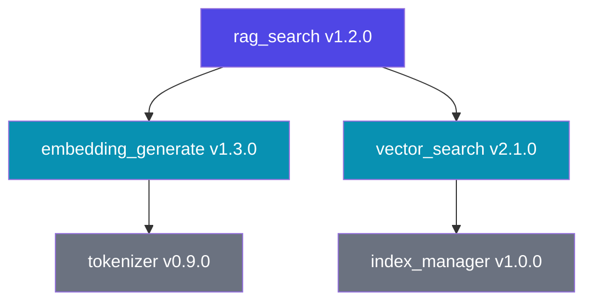
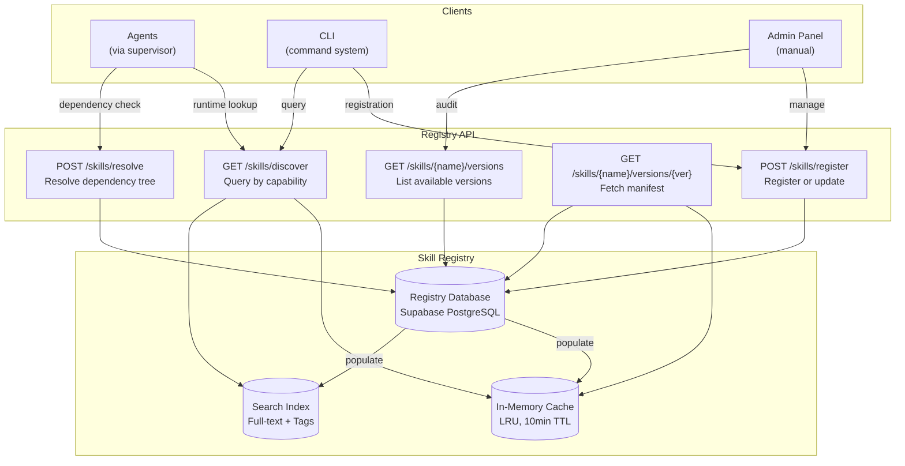
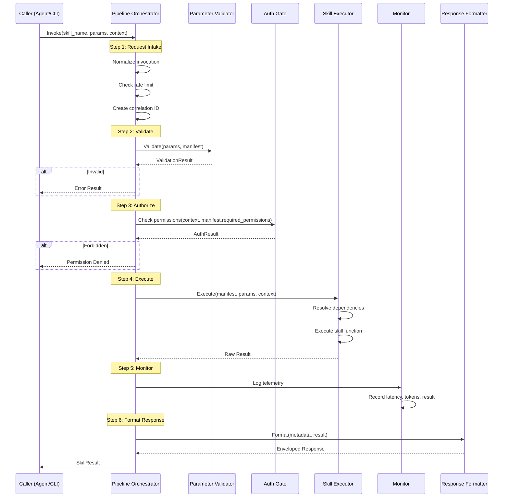
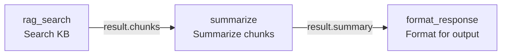
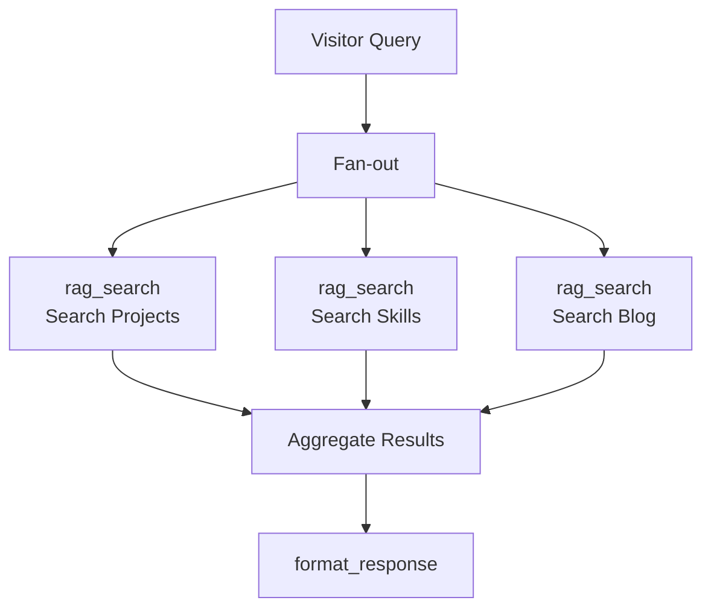
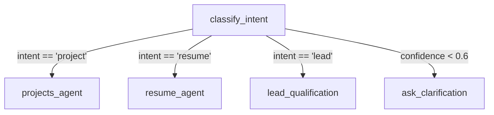
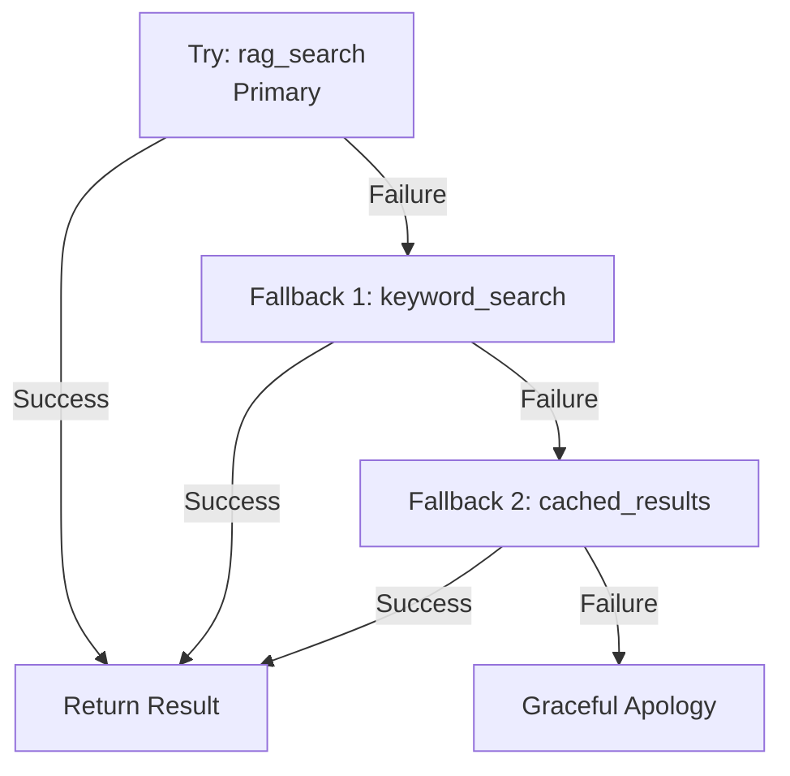
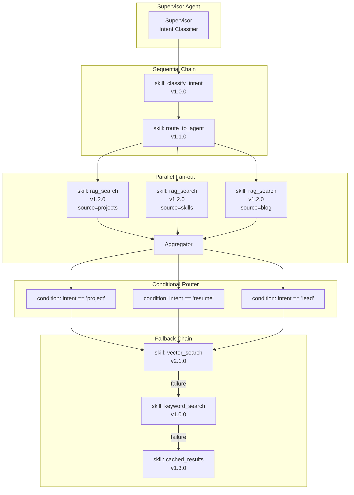
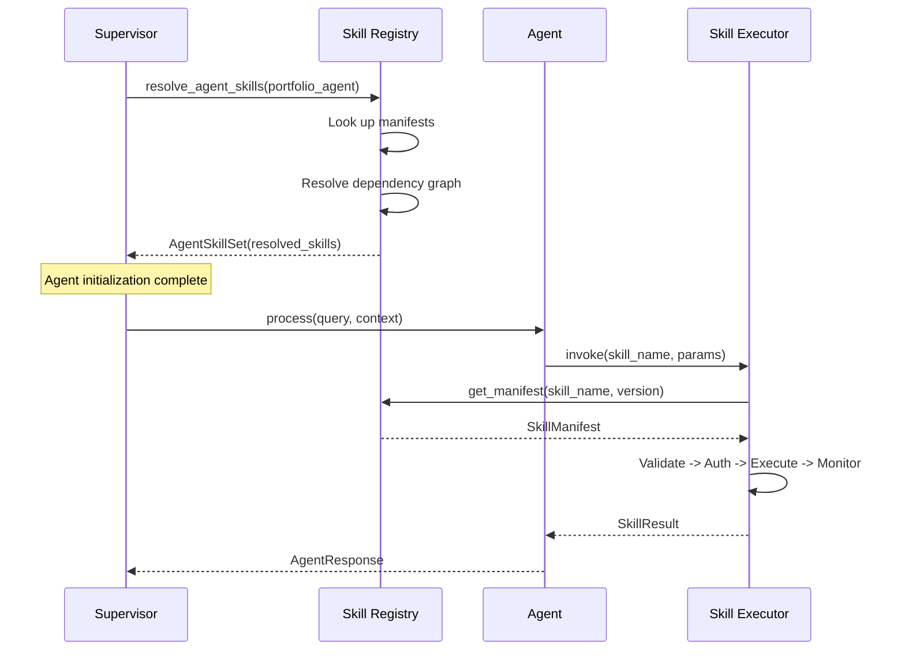

> **Status:** 🎯 DESIGN SPEC — Not Implemented
> This document describes an aspirational future design. The features described here are NOT yet implemented in the codebase.
> For current AI implementation documentation, see:
> - [AI Strategy](../docs/ai/strategy.md)
> - [Model Decision Matrix](../docs/ai/model-decision-matrix.md)

# Skills System Architecture -- Enterprise-Grade Agent Capability Framework

> **Document:** `docs/ai/Skills.md` | **Version:** 1.0.0 | **Last Updated:** June 2026
> **Status:** Active | **Owner:** Chief AI Architect | **Review Cadence:** Monthly
> **Classification:** Enterprise Architecture
> **Runtime:** FastAPI + LangChain | **Execution Model:** Synchronous + Async + Streaming
> **Agent Orchestration:** [docs/ai/18-AGENTS.md](AGENTS.md) v4.0 | **AI Operating Model:** [docs/ai/17-AI_INSTRUCTIONS.md](AI_INSTRUCTIONS.md)

---

## Executive Summary

Catalogs all technical skills across frontend (React, Next.js, TypeScript, Tailwind), backend (Node.js, Python, PostgreSQL, Supabase), AI/ML (LLM integration, RAG, LangChain, vector databases), DevOps (Docker, CI/CD, Vercel, Railway), and design (UI/UX, Figma, design systems). Each skill includes proficiency level, project evidence, and associated tools/frameworks.

---

## Table of Contents

| Section | Title | Purpose |
|---------|-------|---------|
| SS-01 | Executive Summary | Definition of skills, distinction from tools |
| SS-02 | Skills vs Tools | Comparative analysis across 10 dimensions |
| SS-03 | Design Principles | Foundational rules governing skill architecture |
| SS-04 | Skill Anatomy | Structure of a skill definition |
| SS-05 | Skill Manifest Schema | Complete JSON/YAML specification |
| SS-06 | Skill Parameters | Input contract specification |
| SS-07 | Skill Return Types | Output contract specification |
| SS-08 | Skill Dependencies | Intra-skill dependency graph |
| SS-09 | Skill Error Contract | Structured error specification |
| SS-10 | Skill Registry | Registration and storage |
| SS-11 | Skill Discovery Protocol | How agents find available skills |
| SS-12 | Skill Resolution | Dependency resolution algorithm |
| SS-13 | Skill Execution Pipeline | End-to-end execution flow |
| SS-14 | Pipeline Step: Request Intake | Normalization and validation of invocation |
| SS-15 | Pipeline Step: Parameter Validation | Schema-level and business-level validation |
| SS-16 | Pipeline Step: Authorization | Permission check before execution |
| SS-17 | Pipeline Step: Execution | Skill function invocation |
| SS-18 | Pipeline Step: Monitoring & Observability | Telemetry, tracing, logging |
| SS-19 | Pipeline Step: Response Formatting | Output normalization and envelope |
| SS-20 | Sequential Composition | Chaining skills in order |
| SS-21 | Parallel Composition | Concurrent skill execution |
| SS-22 | Conditional Composition | Branching based on output |
| SS-23 | Fallback Composition | Graceful degradation chains |
| SS-24 | Composition Graph | Visual representation of composition patterns |
| SS-25 | Composition Configuration | JSON schema for composition definitions |
| SS-26 | Semantic Versioning | MAJOR.MINOR.PATCH convention |
| SS-27 | Version Constraints | Supported operators and resolution |
| SS-28 | Deprecation Policy | Sunset timelines and migration windows |
| SS-29 | Version Compatibility Matrix | Cross-skill version alignment |
| SS-30 | Skill Lifecycle: Development | Authoring and local testing |
| SS-31 | Skill Lifecycle: Testing | Unit, integration, and E2E testing |
| SS-32 | Skill Lifecycle: Staging | Pre-production validation |
| SS-33 | Skill Lifecycle: Production | Live deployment |
| SS-34 | Skill Lifecycle: Deprecated | End-of-life notification |
| SS-35 | Skill Lifecycle: Retired | Removal from registry |
| SS-36 | Built-in Skills Catalog | System-provided skills overview |
| SS-37 | Core System Skills | Runtime, telemetry, security |
| SS-38 | Agent Skills | Agent-facing capabilities |
| SS-39 | Utility Skills | Common helpers and transforms |
| SS-40 | Security: Permission Model | Role-based access for skills |
| SS-41 | Security: Audit Trail | Invocation logging and forensics |
| SS-42 | Security: Rate Limiting | Quota enforcement per skill |
| SS-43 | Security: Isolation | Sandboxing and resource limits |
| SS-44 | Error Handling & Recovery | Retry policies and circuit breakers |
| SS-45 | Performance Budgets | Latency and throughput targets |
| SS-46 | Integration with Agent Architecture | Agent-to-skill binding |
| SS-47 | Integration with Command System | CLI and API invocation paths |
| SS-48 | Skill Marketplace Concepts | Publishing and discovery across agents |
| SS-49 | Appendices: Glossary, References, Change Log |

---

## SS-01 Executive Summary

### 1.1 What Are Skills

A **skill** is a self-contained, versioned, and permission-bounded capability that an agent can invoke to perform a specific action, retrieve data, or compute a result. Skills are the atomic unit of capability in the agent ecosystem -- every agent's functionality is decomposed into a set of registered skills.

```text
Agent --> Invokes Skill --> Performs Action --> Returns Result
```

Skills are distinct from **tools** in that skills are:
- **Versioned** with semantic versioning and full lifecycle management
- **Registered** in a centralized skill registry with dependency resolution
- **Composable** into chains of sequential, parallel, conditional, and fallback execution
- **Permissioned** with granular access control per skill, per agent
- **Observable** with structured telemetry, tracing, and audit logging

### 1.2 Why Skills

| Concern | Without Skills | With Skills |
|---------|---------------|-------------|
| Capability reuse | Duplicate code across agents | Single skill, multiple agents |
| Versioning | Breaking changes break agents | Semantic versioning with constraints |
| Discoverability | Hard-coded in agent prompts | Registry-based discovery |
| Security | Ad-hoc permission checks | Declarative permission model |
| Observability | Inconsistent logging | Standardized telemetry |
| Testing | Manual, per-agent | Isolated skill tests |
| Composition | Sequential only | Parallel, conditional, fallback |

### 1.3 Scope

This document defines the skills system for agents described in `docs/ai/18-AGENTS.md` v4.0. The supervisor agent orchestrates skill execution across specialist agents. The command system (`docs/ai/CommandSystem.md`) provides CLI and API entry points for skill invocation. The agent marketplace (`docs/ai/AgentMarketplace.md`) extends skill publishing for third-party contributions.

---

## SS-02 Skills vs Tools

A **skill** and a **tool** are often conflated. They are distinct concepts in this architecture.

| Dimension | Skill (This Document) | Tool (Agent-Specific) |
|-----------|----------------------|-----------------------|
| **Scope** | System-wide, reusable | Agent-local utility |
| **Versioning** | Semantic (semver) | None or ad-hoc |
| **Registry** | Centralized skill registry | In-memory agent context |
| **Lifecycle** | Dev -> Test -> Stage -> Prod -> Deprecated -> Retired | Exists only while agent runs |
| **Composition** | Sequential, parallel, conditional, fallback | Not composable |
| **Dependencies** | Declared with version constraints | None |
| **Permissions** | Granular RBAC per skill | Implicit (agent-scoped) |
| **Observability** | Standardized telemetry, tracing, audit | Inconsistent |
| **Discovery** | Registry query by capability, tag, version | Hard-coded in agent code |
| **Testing** | Isolated unit, integration, E2E | Manual, coupled to agent |

**Rule:** Every skill is a tool, but not every tool is a skill. Agent-local convenience functions should remain tools. Any capability that crosses agent boundaries, requires versioning, or needs production monitoring must be a skill.

---

## SS-03 Design Principles

| # | Principle | Description | Violation Consequence |
|---|-----------|-------------|----------------------|
| SKP-001 | **Single Responsibility** | One skill does exactly one thing | Composition becomes fragile |
| SKP-002 | **Self-Describing** | Every skill carries its own manifest | Registry cannot resolve |
| SKP-003 | **Permission by Default** | No skill executes without authorization | Security incidents |
| SKP-004 | **Fail Closed** | On error, skill returns structured error | Error swallowing |
| SKP-005 | **Idempotent Writes** | Side-effect skills tolerate retry | Data corruption |
| SKP-006 | **Observable by Default** | Every invocation emits telemetry | Debugging impossible |
| SKP-007 | **Semver Strict** | Breaking changes increment MAJOR | Agent breakage |
| SKP-008 | **Testable in Isolation** | Skill can be unit-tested without agent | Fragile, coupled tests |
| SKP-009 | **Timeout Bounded** | Every skill declares max execution time | Resource exhaustion |
| SKP-010 | **No Implicit State** | Skills receive all inputs explicitly | Hidden side effects |

---

## SS-04 Skill Anatomy

Every skill is defined by the following components:

```python
@dataclass
class SkillDefinition:
    """Complete definition of a system skill."""
    # Identity
    name: str                              # Unique skill identifier (e.g., "rag_search")
    display_name: str                      # Human-readable name
    version: str                           # Semver string (e.g., "1.2.0")
    
    # Description
    description: str                       # What the skill does
    category: SkillCategory                # core | agent | utility | custom
    tags: list[str]                        # Discovery tags
    
    # Contract
    parameters: SkillParameterSet          # Input specification
    return_type: SkillReturnType           # Output specification
    errors: list[SkillError]               # Declared error codes
    
    # Lifecycle
    status: SkillStatus                    # development | testing | staging | production | deprecated | retired
    deprecation_date: datetime | None      # When this version is deprecated
    
    # Dependencies
    dependencies: list[SkillDependency]    # Other skills this skill depends on
    
    # Execution Configuration
    timeout_ms: int                        # Max execution time
    retry_policy: RetryPolicy              # Retry configuration
    execution_mode: ExecutionMode           # sync | async | stream
    
    # Security
    required_permissions: list[str]        # Permissions needed to invoke
    isolation_level: IsolationLevel        # shared | sandboxed | privileged
```

### 4.1 Skill Identifier Convention

```
pattern:  ^[a-z][a-z0-9_]{2,63}$
example:  rag_search, send_notification, validate_email
```

Skill names are globally unique within the registry. Namespacing is achieved via prefixes (e.g., `agent_`, `core_`, `util_`).

---

## SS-05 Skill Manifest Schema

Skills are defined declaratively in YAML or JSON manifests stored in the registry.

```yaml
# manifests/skills/rag_search.yaml
name: rag_search
display_name: RAG Knowledge Search
version: 1.2.0
description: >
  Search the RAG knowledge base for relevant document chunks.
  Returns top-k chunks with similarity scores and source metadata.
category: core
tags:
  - retrieval
  - rag
  - knowledge_base
  - search

parameters:
  schema:
    type: object
    required:
      - query
      - top_k
    properties:
      query:
        type: string
        description: The search query text
        maxLength: 2000
        minLength: 1
      top_k:
        type: integer
        description: Number of results to return
        minimum: 1
        maximum: 20
        default: 3
      confidence_threshold:
        type: number
        description: Minimum similarity score
        minimum: 0.0
        maximum: 1.0
        default: 0.6
      source_filter:
        type: array
        description: Restrict search to specific sources
        items:
          type: string
          enum:
            - projects
            - skills
            - experiences
            - blog_posts
            - case_studies

return_type:
  schema:
    type: object
    properties:
      chunks:
        type: array
        description: Retrieved document chunks
        items:
          type: object
          properties:
            content:
              type: string
            source:
              type: string
            source_type:
              type: string
            similarity:
              type: number
            metadata:
              type: object
      total_results:
        type: integer
      query_latency_ms:
        type: number

errors:
  - code: RAG_EMPTY_QUERY
    description: Query string is empty
    http_status: 400
  - code: RAG_INDEX_UNAVAILABLE
    description: Knowledge base index is not ready
    http_status: 503
  - code: RAG_EMBEDDING_FAILED
    description: Embedding generation failed
    http_status: 500

dependencies:
  - skill: core.embedding_generate
    version_constraint: ">=1.0.0 <2.0.0"
    optional: false
  - skill: core.vector_search
    version_constraint: ">=2.1.0"
    optional: false

timeout_ms: 5000
retry_policy:
  max_retries: 2
  backoff_ms: 200
  backoff_multiplier: 2.0
  retryable_errors:
    - RAG_INDEX_UNAVAILABLE
    - RAG_EMBEDDING_FAILED

execution_mode: sync
required_permissions:
  - knowledge_base:read
isolation_level: shared
```

### 5.1 TypeScript Type Definition

```typescript
interface SkillManifest {
  name: string;
  displayName: string;
  version: string;
  description: string;
  category: 'core' | 'agent' | 'utility' | 'custom';
  tags: string[];
  parameters: {
    schema: JSONSchema;
  };
  returnType: {
    schema: JSONSchema;
  };
  errors: SkillErrorDef[];
  dependencies: SkillDependencyDef[];
  timeoutMs: number;
  retryPolicy: RetryPolicyDef;
  executionMode: 'sync' | 'async' | 'stream';
  requiredPermissions: string[];
  isolationLevel: 'shared' | 'sandboxed' | 'privileged';
}
```

---

## SS-06 Skill Parameters

### 6.1 Parameter Categories

| Category | Description | Validation |
|----------|-------------|------------|
| **Required** | Must be provided by caller | Schema `required` array |
| **Optional** | Has a default value | Schema `default` keyword |
| **Contextual** | Injected by runtime (session_id, agent_id) | Auto-populated prefix `$ctx.` |

### 6.2 Contextual Parameters

Parameters prefixed with `$ctx.` are injected automatically by the skill runtime:

| Parameter | Source | Description |
|-----------|--------|-------------|
| `$ctx.session_id` | Session manager | Current conversation session |
| `$ctx.agent_id` | Agent registry | Invoking agent identifier |
| `$ctx.visitor_id` | Chat widget | Current visitor identifier |
| `$ctx.correlation_id` | Runtime | Trace correlation identifier |

### 6.3 Validation Rules

```python
class ParameterValidator:
    """Validates skill invocation parameters against manifest schema."""

    def __init__(self, manifest: SkillManifest):
        self.schema = manifest.parameters.schema
        self.validator = jsonschema.Draft202012Validator(self.schema)

    def validate(self, params: dict) -> ValidationResult:
        errors = []

        # 1. JSON Schema validation
        for error in self.validator.iter_errors(params):
            errors.append(ParameterError(
                code="VALIDATION_ERROR",
                path=list(error.path),
                message=error.message,
            ))

        # 2. Business rule validation
        if not errors:
            errors.extend(self._business_rules(params))

        return ValidationResult(
            is_valid=len(errors) == 0,
            errors=errors,
            normalized_params=self._apply_defaults(params),
        )

    def _business_rules(self, params: dict) -> list[ParameterError]:
        """Custom business rule checks beyond schema validation."""
        errors = []
        if "query" in params and len(params["query"].strip()) == 0:
            errors.append(ParameterError(
                code="RAG_EMPTY_QUERY",
                path=["query"],
                message="Query must not be empty or whitespace only",
            ))
        return errors

    def _apply_defaults(self, params: dict) -> dict:
        """Apply default values from schema."""
        normalized = dict(params)
        if "properties" in self.schema:
            for prop_name, prop_schema in self.schema["properties"].items():
                if prop_name not in normalized and "default" in prop_schema:
                    normalized[prop_name] = prop_schema["default"]
        return normalized
```

---

## SS-07 Skill Return Types

### 7.1 Return Envelope

Every skill invocation returns a standardized envelope:

```python
@dataclass
class SkillResult:
    """Standardized skill execution result."""
    success: bool
    data: Any | None                    # Successful response payload
    error: SkillErrorResult | None      # Error details on failure
    metadata: SkillExecutionMetadata    # Execution telemetry
```

### 7.2 Execution Metadata

```python
@dataclass
class SkillExecutionMetadata:
    """Telemetry data attached to every skill result."""
    skill_name: str
    skill_version: str
    execution_mode: str
    duration_ms: float
    correlation_id: str
    retry_attempt: int
    cached: bool
    tokens_used: int | None             # LLM-related skills only
```

### 7.3 Streaming Return

For `execution_mode: stream`, the skill returns an `AsyncGenerator`:

```python
async def rag_search_stream(params: dict) -> AsyncGenerator[SkillChunk, None]:
    """Streaming variant of rag_search that yields chunks incrementally."""
    async for chunk in vector_search.stream(params):
        yield SkillChunk(
            type="chunk",
            data=chunk,
            sequence=chunk.sequence,
        )
    yield SkillChunk(
        type="complete",
        data={"total_results": 42},
        sequence=-1,
    )
```

---

## SS-08 Skill Dependencies

### 8.1 Dependency Declaration

Skills declare dependencies on other skills with version constraints:

```python
@dataclass
class SkillDependency:
    skill: str                          # Fully-qualified skill name
    version_constraint: str             # Semver constraint (e.g., ">=1.0.0 <2.0.0")
    optional: bool                      # If true, execution proceeds on failure
```

### 8.2 Dependency Resolution



### 8.3 Resolution Algorithm

```python
class DependencyResolver:
    """Resolves skill dependency graph."""

    def __init__(self, registry: SkillRegistry):
        self.registry = registry

    def resolve(self, skill_name: str, version: str) -> list[ResolvedDependency]:
        """Resolve all transitive dependencies for a skill version."""
        visited: set[tuple[str, str]] = set()
        resolved: list[ResolvedDependency] = []

        def _resolve(name: str, constraint: str, path: list[str]):
            key = (name, constraint)
            if key in visited:
                return  # Circular dependency guard
            visited.add(key)

            best_version = self.registry.find_best_match(name, constraint)
            if not best_version:
                raise DependencyResolutionError(
                    f"No version of '{name}' satisfies '{constraint}' "
                    f"(path: {' -> '.join(path)})"
                )

            manifest = self.registry.get_manifest(name, best_version)
            resolved.append(ResolvedDependency(
                skill_name=name,
                resolved_version=best_version,
                constraint=constraint,
            ))

            for dep in manifest.dependencies:
                _resolve(dep.skill, dep.version_constraint, path + [name])

        _resolve(skill_name, f"=={version}", [skill_name])
        return resolved
```

---

## SS-09 Skill Error Contract

### 9.1 Declared Errors

Each skill manifest declares the errors it can produce:

| Code | HTTP Status | Meaning |
|------|-------------|---------|
| `RAG_EMPTY_QUERY` | 400 | Query is empty |
| `RAG_INDEX_UNAVAILABLE` | 503 | Search index not ready |
| `RAG_EMBEDDING_FAILED` | 500 | Embedding generation failure |
| `AUTH_INSUFFICIENT_PERMISSIONS` | 403 | Caller lacks required permission |
| `DEPENDENCY_FAILED` | 502 | Dependent skill failed |
| `TIMEOUT_EXCEEDED` | 504 | Skill exceeded time budget |
| `RATE_LIMIT_EXCEEDED` | 429 | Too many invocations |

### 9.2 Error Response Format

```json
{
  "success": false,
  "data": null,
  "error": {
    "code": "RAG_EMPTY_QUERY",
    "message": "Query string must not be empty",
    "details": {
      "parameter": "query",
      "received_value": ""
    },
    "correlation_id": "corr_abc123",
    "timestamp": "2026-06-18T10:30:00.000Z"
  },
  "metadata": {
    "skill_name": "rag_search",
    "skill_version": "1.2.0",
    "duration_ms": 12,
    "correlation_id": "corr_abc123",
    "retry_attempt": 0,
    "cached": false
  }
}
```

---

## SS-10 Skill Registry

### 10.1 Registry Architecture



### 10.2 Registry Schema

```sql
-- Skills registry tables (Supabase PostgreSQL)
CREATE TABLE skill_registry (
    id UUID PRIMARY KEY DEFAULT gen_random_uuid(),
    name VARCHAR(64) NOT NULL UNIQUE,
    display_name VARCHAR(128) NOT NULL,
    description TEXT NOT NULL,
    category VARCHAR(16) NOT NULL CHECK (category IN ('core', 'agent', 'utility', 'custom')),
    tags TEXT[] NOT NULL DEFAULT '{}',
    current_version VARCHAR(32) NOT NULL,
    status VARCHAR(16) NOT NULL DEFAULT 'development'
        CHECK (status IN ('development','testing','staging','production','deprecated','retired')),
    created_at TIMESTAMPTZ NOT NULL DEFAULT now(),
    updated_at TIMESTAMPTZ NOT NULL DEFAULT now(),
    deprecation_date TIMESTAMPTZ
);

CREATE TABLE skill_versions (
    id UUID PRIMARY KEY DEFAULT gen_random_uuid(),
    skill_id UUID NOT NULL REFERENCES skill_registry(id) ON DELETE CASCADE,
    version VARCHAR(32) NOT NULL,
    manifest JSONB NOT NULL,
    checksum VARCHAR(64) NOT NULL,
    published_by VARCHAR(64) NOT NULL,
    created_at TIMESTAMPTZ NOT NULL DEFAULT now(),
    UNIQUE(skill_id, version)
);

CREATE INDEX idx_skill_registry_category ON skill_registry(category);
CREATE INDEX idx_skill_registry_tags ON skill_registry USING GIN(tags);
CREATE INDEX idx_skill_registry_status ON skill_registry(status);
CREATE INDEX idx_skill_versions_skill_id ON skill_versions(skill_id);

-- Enable RLS
ALTER TABLE skill_registry ENABLE ROW LEVEL SECURITY;
ALTER TABLE skill_versions ENABLE ROW LEVEL SECURITY;

-- RLS: Skills are readable by all authenticated agents, writable only by admin
CREATE POLICY "Skills readable by all agents"
    ON skill_registry FOR SELECT
    TO authenticated
    USING (true);

CREATE POLICY "Skills writable by admin only"
    ON skill_registry FOR INSERT
    TO authenticated
    WITH CHECK (auth.role() = 'admin');

CREATE POLICY "Skills updatable by admin only"
    ON skill_registry FOR UPDATE
    TO authenticated
    USING (auth.role() = 'admin');
```

---

## SS-11 Skill Discovery Protocol

### 11.1 Discovery Query

Agents discover skills via the registry API by capability, tag, or category:

```python
class SkillDiscovery:
    """Discover skills by capability, tag, or category."""

    async def discover(
        self,
        capabilities: list[str] | None = None,
        tags: list[str] | None = None,
        category: str | None = None,
        version_constraint: str | None = None,
        limit: int = 20,
    ) -> list[SkillManifest]:
        """Query registry for matching skills."""
        query = """
            SELECT sr.name, sv.manifest, sv.version
            FROM skill_registry sr
            JOIN skill_versions sv ON sv.skill_id = sr.id
            WHERE sr.status = 'production'
        """
        params = []

        if category:
            query += " AND sr.category = $1"
            params.append(category)

        if tags:
            query += f" AND sr.tags && ${len(params) + 1}"
            params.append(tags)

        query += " ORDER BY sr.name LIMIT ${}".format(len(params) + 1)
        params.append(limit)

        rows = await db.execute(query, params)
        return [self._manifest_from_row(row) for row in rows]

    async def find_by_capability(
        self, description: str, top_k: int = 5
    ) -> list[SkillMatch]:
        """Semantic search over skill descriptions and tags."""
        # Embed the capability description
        embedding = await embedding_service.embed(description)

        # Vector search over skill manifests
        results = await vector_search.search(
            index="skill_descriptions",
            embedding=embedding,
            top_k=top_k,
            filter={"status": "production"},
        )
        return [
            SkillMatch(
                skill_name=r.metadata["name"],
                version=r.metadata["version"],
                similarity=r.score,
                manifest=self.registry.get_manifest(
                    r.metadata["name"], r.metadata["version"]
                ),
            )
            for r in results
        ]
```

### 11.2 Agent-Skill Binding

During agent initialization, the supervisor resolves each agent's required skills:

```python
class AgentSkillBinder:
    """Binds agents to their required skills at initialization time."""

    def __init__(self, registry: SkillRegistry):
        self.registry = registry

    async def bind_agent_skills(self, agent: BaseAgent) -> AgentSkillSet:
        """Resolve and bind all skills for an agent."""
        required_skills = agent.manifest.required_skills
        bound: dict[str, BoundSkill] = {}

        for skill_ref in required_skills:
            manifest = await self.registry.resolve(
                skill_ref.name,
                skill_ref.version_constraint,
            )
            dep_chain = await self.registry.resolve_dependencies(
                manifest.name, manifest.version
            )

            bound[manifest.name] = BoundSkill(
                manifest=manifest,
                dependencies=dep_chain,
                executor=SkillExecutor(manifest, dep_chain),
            )

        return AgentSkillSet(
            agent_name=agent.name,
            skills=bound,
            resolved_at=datetime.utcnow(),
        )
```

---

## SS-12 Skill Resolution

### 12.1 Version Resolution Algorithm

```python
class VersionResolver:
    """Resolves the best version matching a constraint."""

    def __init__(self, registry: SkillRegistry):
        self.registry = registry

    def find_best_match(self, skill_name: str, constraint: str) -> str | None:
        """Find the highest satisfying version for a constraint."""
        spec = SemverSpec.parse(constraint)
        versions = self.registry.list_versions(skill_name)

        # Filter by status: prefer production, then staging, then testing
        def version_priority(v: str) -> int:
            status = self.registry.get_version_status(skill_name, v)
            return {"production": 3, "staging": 2, "testing": 1, "development": 0}.get(status, -1)

        # Sort by semver descending, then by status priority
        sorted_versions = sorted(
            [v for v in versions if spec.satisfies(v)],
            key=lambda v: (Version.parse(v), version_priority(v)),
            reverse=True,
        )

        return sorted_versions[0] if sorted_versions else None

    def satisfies_dependency_graph(self, deps: list[SkillDependency]) -> bool:
        """Check if the entire dependency graph is satisfiable."""
        for dep in deps:
            match = self.find_best_match(dep.skill, dep.version_constraint)
            if not match and not dep.optional:
                return False
            if match:
                sub_manifest = self.registry.get_manifest(dep.skill, match)
                if not self.satisfies_dependency_graph(sub_manifest.dependencies):
                    return False
        return True
```

### 12.2 Constraint Operators

| Operator | Example | Meaning |
|----------|---------|---------|
| `==` | `==1.2.3` | Exact version |
| `>=` | `>=1.0.0` | Greater than or equal |
| `<=` | `<=2.0.0` | Less than or equal |
| `>` | `>1.5.0` | Strictly greater |
| `<` | `<2.0.0` | Strictly less |
| `^` | `^1.2.0` | Compatible with (>=1.2.0 <2.0.0) |
| `~` | `~1.2.0` | Approximately (>=1.2.0 <1.3.0) |
| Space | `>=1.0.0 <2.0.0` | AND conjunction |
| `\|\|` | `^1.0.0 \|\| ^2.0.0` | OR conjunction |

---

## SS-13 Skill Execution Pipeline

### 13.1 Pipeline Overview



### 13.2 Pipeline Implementation

```python
class SkillPipeline:
    """Orchestrates end-to-end skill execution."""

    def __init__(
        self,
        registry: SkillRegistry,
        auth_gate: AuthGate,
        monitor: SkillMonitor,
        rate_limiter: RateLimiter,
    ):
        self.registry = registry
        self.auth_gate = auth_gate
        self.monitor = monitor
        self.rate_limiter = rate_limiter

    async def invoke(
        self,
        skill_name: str,
        params: dict,
        context: InvocationContext,
    ) -> SkillResult:
        """Execute a skill through the full pipeline."""
        start_time = time.monotonic()
        correlation_id = str(uuid.uuid4())
        context.correlation_id = correlation_id

        # Step 1: Resolve skill manifest
        manifest = await self.registry.resolve_latest(skill_name, context.agent)
        if not manifest:
            return SkillResult.failure(
                error=SkillErrorResult(
                    code="SKILL_NOT_FOUND",
                    message=f"Skill '{skill_name}' not found",
                ),
                metadata=self._build_metadata(manifest, correlation_id, start_time),
            )

        # Step 2: Rate limit check
        if not await self.rate_limiter.check(manifest.name, context.agent):
            return SkillResult.failure(
                error=SkillErrorResult(
                    code="RATE_LIMIT_EXCEEDED",
                    message=f"Rate limit exceeded for '{skill_name}'",
                ),
                metadata=self._build_metadata(manifest, correlation_id, start_time),
            )

        # Step 3: Validate parameters
        validation = ParameterValidator(manifest).validate(params)
        if not validation.is_valid:
            return SkillResult.failure(
                error=SkillErrorResult(
                    code="VALIDATION_ERROR",
                    message="Parameter validation failed",
                    details={"errors": [e.to_dict() for e in validation.errors]},
                ),
                metadata=self._build_metadata(manifest, correlation_id, start_time),
            )

        # Step 4: Authorize
        auth_result = await self.auth_gate.check(
            agent=context.agent,
            required_permissions=manifest.required_permissions,
            resource=manifest.name,
        )
        if not auth_result.is_allowed:
            return SkillResult.failure(
                error=SkillErrorResult(
                    code="AUTH_INSUFFICIENT_PERMISSIONS",
                    message=f"Agent '{context.agent}' lacks permission for '{skill_name}'",
                ),
                metadata=self._build_metadata(manifest, correlation_id, start_time),
            )

        # Step 5: Execute with timeout and retry
        executor = SkillExecutor(manifest, self.registry)
        execution_result = await self._execute_with_retry(
            executor, validation.normalized_params, context, manifest
        )

        # Step 6: Monitor
        await self.monitor.record(InvocationRecord(
            skill_name=manifest.name,
            skill_version=manifest.version,
            agent=context.agent,
            correlation_id=correlation_id,
            duration_ms=(time.monotonic() - start_time) * 1000,
            success=execution_result.success,
            error_code=execution_result.error.code if execution_result.error else None,
            tokens_used=getattr(execution_result, 'tokens_used', None),
        ))

        # Step 7: Format and return
        return SkillResult(
            success=execution_result.success,
            data=execution_result.data,
            error=execution_result.error,
            metadata=self._build_metadata(manifest, correlation_id, start_time),
        )

    async def _execute_with_retry(
        self,
        executor: SkillExecutor,
        params: dict,
        context: InvocationContext,
        manifest: SkillManifest,
    ) -> SkillResult:
        """Execute with configurable retry and timeout."""
        last_error = None
        for attempt in range(manifest.retry_policy.max_retries + 1):
            try:
                result = await asyncio.wait_for(
                    executor.execute(params, context),
                    timeout=manifest.timeout_ms / 1000,
                )
                result.metadata.retry_attempt = attempt
                return result
            except asyncio.TimeoutError:
                last_error = SkillErrorResult(
                    code="TIMEOUT_EXCEEDED",
                    message=f"Skill '{manifest.name}' exceeded {manifest.timeout_ms}ms timeout",
                )
                break
            except SkillExecutionError as e:
                if e.code not in manifest.retry_policy.retryable_errors:
                    return SkillResult.failure(
                        error=e.to_skill_error(),
                        metadata=self._build_metadata(manifest, context.correlation_id, time.monotonic()),
                    )
                last_error = e.to_skill_error()
                if attempt < manifest.retry_policy.max_retries:
                    backoff = (manifest.retry_policy.backoff_ms *
                               (manifest.retry_policy.backoff_multiplier ** attempt))
                    await asyncio.sleep(backoff / 1000)

        return SkillResult.failure(
            error=last_error,
            metadata=self._build_metadata(manifest, context.correlation_id, time.monotonic()),
        )

    def _build_metadata(
        self, manifest: SkillManifest, correlation_id: str, start_time: float
    ) -> SkillExecutionMetadata:
        return SkillExecutionMetadata(
            skill_name=manifest.name if manifest else "unknown",
            skill_version=manifest.version if manifest else "unknown",
            execution_mode=manifest.execution_mode if manifest else "sync",
            duration_ms=(time.monotonic() - start_time) * 1000,
            correlation_id=correlation_id,
            retry_attempt=0,
            cached=False,
            tokens_used=None,
        )
```

---

## SS-14 Pipeline Step: Request Intake

The request intake step normalizes all incoming invocations:

```python
class RequestIntake:
    """Normalize and enrich incoming skill invocation requests."""

    async def process(
        self, skill_name: str, params: dict, context: InvocationContext
    ) -> NormalizedRequest:
        """Normalize request before validation."""
        # 1. Strip unknown parameters
        manifest = await registry.get_manifest(skill_name)
        allowed_params = set(manifest.parameters.schema.get("properties", {}).keys())
        filtered_params = {k: v for k, v in params.items() if k in allowed_params}

        # 2. Inject contextual parameters
        filtered_params["$ctx.session_id"] = context.session_id
        filtered_params["$ctx.agent_id"] = context.agent
        filtered_params["$ctx.visitor_id"] = context.visitor_id
        filtered_params["$ctx.correlation_id"] = context.correlation_id

        # 3. Type coercion
        coerced = self._coerce_types(filtered_params, manifest.parameters.schema)

        return NormalizedRequest(
            skill_name=skill_name,
            params=coerced,
            context=context,
            manifest=manifest,
        )

    def _coerce_types(self, params: dict, schema: dict) -> dict:
        """Coerce string values to declared types."""
        properties = schema.get("properties", {})
        coerced = dict(params)
        for key, value in coerced.items():
            if key not in properties:
                continue
            prop_schema = properties[key]
            prop_type = prop_schema.get("type")
            if isinstance(value, str) and prop_type == "integer":
                coerced[key] = int(value)
            elif isinstance(value, str) and prop_type == "number":
                coerced[key] = float(value)
            elif isinstance(value, str) and prop_type == "boolean":
                coerced[key] = value.lower() in ("true", "1", "yes")
        return coerced
```

---

## SS-15 Pipeline Step: Parameter Validation

See SS-06 for detailed parameter validation with business rule checks. The validate step runs after request intake and before authorization.

---

## SS-16 Pipeline Step: Authorization

### 16.1 Permission Model

```python
class AuthGate:
    """Authorization gate for skill execution."""

    async def check(
        self,
        agent: str,
        required_permissions: list[str],
        resource: str,
    ) -> AuthResult:
        """Check if an agent has all required permissions for a skill."""
        # 1. Get agent's permission set
        agent_perms = await self._get_agent_permissions(agent)

        # 2. Check each required permission
        missing = []
        for perm in required_permissions:
            if not self._check_permission(agent_perms, perm, resource):
                missing.append(perm)

        if missing:
            return AuthResult(
                is_allowed=False,
                reason=f"Missing permissions: {', '.join(missing)}",
                missing_permissions=missing,
            )

        return AuthResult(is_allowed=True)

    def _check_permission(
        self, agent_perms: list[str], required: str, resource: str
    ) -> bool:
        """Check a single permission with wildcard support."""
        for agent_perm in agent_perms:
            if self._matches(agent_perm, required):
                return True
        return False

    def _matches(self, pattern: str, target: str) -> bool:
        """Match permission patterns with wildcards."""
        if pattern == "*":
            return True
        if pattern.endswith(":*"):
            prefix = pattern[:-2]
            return target.startswith(prefix)
        return pattern == target
```

---

## SS-17 Pipeline Step: Execution

### 17.1 Skill Executor

```python
class SkillExecutor:
    """Executes a skill function with dependency injection."""

    def __init__(self, manifest: SkillManifest, registry: SkillRegistry):
        self.manifest = manifest
        self.registry = registry
        self._impl = self._load_implementation()

    def _load_implementation(self) -> SkillImplementation:
        """Load the skill implementation from the registered handler."""
        # Skills are registered as Python callables or LangChain tools
        handler_path = self.manifest.implementation.handler
        module_path, function_name = handler_path.rsplit(".", 1)
        module = importlib.import_module(module_path)
        return getattr(module, function_name)

    async def execute(
        self, params: dict, context: InvocationContext
    ) -> SkillResult:
        """Execute the skill with dependency graph resolution."""

        # Resolve dependencies and inject their results
        dep_results = {}
        for dep in self.manifest.dependencies:
            if not dep.optional or context.should_include_optional:
                try:
                    dep_executor = SkillExecutor(
                        self.registry.get_manifest(dep.skill),
                        self.registry,
                    )
                    result = await dep_executor.execute(params, context)
                    dep_results[dep.skill] = result.data
                except Exception as e:
                    if not dep.optional:
                        raise SkillExecutionError(
                            code="DEPENDENCY_FAILED",
                            message=f"Dependency '{dep.skill}' failed: {e}",
                        )

        # Execute
        if self.manifest.execution_mode == "stream":
            return await self._execute_stream(params, context, dep_results)
        else:
            return await self._execute_sync(params, context, dep_results)

    async def _execute_sync(
        self, params: dict, context: InvocationContext, dep_results: dict
    ) -> SkillResult:
        """Synchronous execution."""
        data = await self._impl(
            params=params,
            context=context,
            dependencies=dep_results,
        )
        return SkillResult.success(data=data)

    async def _execute_stream(
        self, params: dict, context: InvocationContext, dep_results: dict
    ) -> SkillResult:
        """Streaming execution -- aggregates chunks into final result."""
        chunks = []
        async for chunk in self._impl(
            params=params,
            context=context,
            dependencies=dep_results,
        ):
            chunks.append(chunk)
        return SkillResult.success(data={"chunks": chunks, "count": len(chunks)})
```

---

## SS-18 Pipeline Step: Monitoring & Observability

### 18.1 Telemetry Emissions

Every skill invocation emits the following telemetry:

| Metric | Type | Labels | Description |
|--------|------|--------|-------------|
| `skill.invocations.total` | Counter | skill, version, agent, status | Total invocations |
| `skill.invocations.duration` | Histogram | skill, version, agent | Execution latency (ms) |
| `skill.invocations.errors` | Counter | skill, version, error_code | Error count by code |
| `skill.invocations.tokens` | Histogram | skill, version | Token usage (LLM skills) |
| `skill.cache.hits` | Counter | skill | Cache hit count |
| `skill.dependencies.resolved` | Gauge | skill | Dependency graph depth |

### 18.2 Structured Logging

```python
class SkillMonitor:
    """Monitors skill execution with structured logging and metrics."""

    def __init__(self, metrics_client, logger):
        self.metrics = metrics_client
        self.logger = logger

    async def record(self, record: InvocationRecord):
        """Record telemetry for a skill invocation."""

        # Metrics
        self.metrics.increment(
            "skill.invocations.total",
            labels={
                "skill": record.skill_name,
                "version": record.skill_version,
                "agent": record.agent,
                "status": "success" if record.success else "error",
            },
        )
        self.metrics.histogram(
            "skill.invocations.duration",
            record.duration_ms,
            labels={"skill": record.skill_name, "agent": record.agent},
        )
        if record.error_code:
            self.metrics.increment(
                "skill.invocations.errors",
                labels={
                    "skill": record.skill_name,
                    "error_code": record.error_code,
                },
            )
        if record.tokens_used:
            self.metrics.histogram(
                "skill.invocations.tokens",
                record.tokens_used,
                labels={"skill": record.skill_name},
            )

        # Structured log
        self.logger.info(
            "Skill invocation complete",
            extra={
                "skill_name": record.skill_name,
                "skill_version": record.skill_version,
                "agent": record.agent,
                "correlation_id": record.correlation_id,
                "duration_ms": record.duration_ms,
                "success": record.success,
                "error_code": record.error_code,
                "tokens_used": record.tokens_used,
            },
        )
```

---

## SS-19 Pipeline Step: Response Formatting

### 19.1 Response Formatter

```python
class ResponseFormatter:
    """Normalizes skill output into the standard envelope."""

    def format(
        self,
        result: SkillResult,
        context: InvocationContext,
    ) -> SkillResult:
        """Ensure all results conform to the standard envelope."""
        if result.success and result.data is not None:
            # Validate data against return type schema
            return SkillResult(
                success=True,
                data=self._validate_return(result.data, context.manifest),
                error=None,
                metadata=result.metadata,
            )
        return result

    def _validate_return(self, data: Any, manifest: SkillManifest) -> Any:
        """Validate return data against manifest schema (if configured)."""
        if manifest.return_type and manifest.return_type.schema:
            try:
                jsonschema.validate(data, manifest.return_type.schema)
            except jsonschema.ValidationError as e:
                logger.warning(
                    f"Return type validation failed for {manifest.name}: {e.message}"
                )
                # In production, log but return data anyway
        return data
```

---

## SS-20 Sequential Composition

### 20.1 Definition

Sequential composition runs skills one after another, passing the output of the previous skill as input to the next.



### 20.2 Implementation

```python
class SequentialComposition:
    """Execute skills in sequence, piping outputs as inputs."""

    def __init__(self, pipeline: SkillPipeline):
        self.pipeline = pipeline

    async def execute(
        self, steps: list[CompositionStep], initial_params: dict, context: InvocationContext
    ) -> SkillResult:
        """Execute steps sequentially, passing context between them."""
        current_params = initial_params
        current_context = context

        for step in steps:
            # Map previous output to current input using field mapping
            if step.input_mapping:
                for target, source in step.input_mapping.items():
                    current_params[target] = self._resolve_path(
                        current_params, source
                    )

            result = await self.pipeline.invoke(step.skill_name, current_params, current_context)

            if not result.success and not step.optional:
                return result

            # Pass result data as context for next step
            current_params["$prev_result"] = result.data
            current_context.step_results.append(result)

        return SkillResult(
            success=True,
            data=current_params.get("$prev_result"),
            metadata=current_context.step_results[-1].metadata if current_context.step_results else None,
        )

    def _resolve_path(self, data: dict, path: str) -> Any:
        """Resolve dot-notation path in dict (e.g., 'result.chunks')."""
        parts = path.split(".")
        current = data
        for part in parts:
            if isinstance(current, dict):
                current = current.get(part)
            else:
                return None
        return current
```

---

## SS-21 Parallel Composition

### 21.1 Definition

Parallel composition runs multiple skills concurrently and aggregates their results.



### 21.2 Implementation

```python
class ParallelComposition:
    """Execute skills concurrently and aggregate results."""

    async def execute(
        self,
        branches: list[CompositionBranch],
        common_params: dict,
        context: InvocationContext,
    ) -> SkillResult:
        """Execute all branches concurrently."""
        async def run_branch(branch: CompositionBranch) -> SkillResult:
            branch_params = {**common_params, **branch.override_params}
            return await self.pipeline.invoke(
                branch.skill_name, branch_params, context
            )

        # Run all branches in parallel
        tasks = [run_branch(branch) for branch in branches]
        results = await asyncio.gather(*tasks, return_exceptions=True)

        # Aggregate results
        successful = []
        failed = []
        for branch, result in zip(branches, results):
            if isinstance(result, Exception):
                failed.append({
                    "branch": branch.skill_name,
                    "error": str(result),
                })
            elif not result.success:
                failed.append({
                    "branch": branch.skill_name,
                    "error": result.error,
                })
            else:
                successful.append({
                    "branch": branch.skill_name,
                    "data": result.data,
                })

        # Aggregate strategy: merge, pick_best, or fail
        if self.aggregate_strategy == "fail" and failed:
            return SkillResult.failure(
                error=SkillErrorResult(
                    code="PARALLEL_FAILURE",
                    message=f"{len(failed)} of {len(branches)} branches failed",
                    details={"failed": failed},
                )
            )

        merged = await self._aggregate(successful, self.aggregate_strategy)
        return SkillResult.success(data={
            "merged": merged,
            "branches": {
                "total": len(branches),
                "successful": len(successful),
                "failed": len(failed),
            },
            "errors": failed if failed else None,
        })

    async def _aggregate(
        self, results: list[dict], strategy: str
    ) -> Any:
        """Aggregate parallel results based on strategy."""
        if strategy == "merge":
            merged = {}
            for r in results:
                if isinstance(r["data"], dict):
                    merged[r["branch"]] = r["data"]
                elif isinstance(r["data"], list):
                    for item in merged.setdefault("items", []):
                        pass
            return merged
        elif strategy == "pick_best":
            return max(results, key=lambda r: r["data"].get("confidence", 0))
        return results
```

---

## SS-22 Conditional Composition

### 22.1 Definition

Conditional composition routes execution based on a prior skill's output.



### 22.2 Implementation

```python
class ConditionalComposition:
    """Route execution based on condition evaluation."""

    async def execute(
        self,
        condition_skill: str,
        condition_params: dict,
        branches: list[ConditionalBranch],
        context: InvocationContext,
    ) -> SkillResult:
        """Evaluate condition and execute the matching branch."""
        # Execute condition skill
        condition_result = await self.pipeline.invoke(
            condition_skill, condition_params, context
        )

        if not condition_result.success:
            return condition_result

        # Evaluate conditions in order, execute first match
        for branch in branches:
            if self._evaluate_condition(
                branch.condition, condition_result.data
            ):
                return await self.pipeline.invoke(
                    branch.skill_name,
                    {**condition_params, **branch.override_params},
                    context,
                )

        # Default branch (if defined)
        if default_branch := next(
            (b for b in branches if b.is_default), None
        ):
            return await self.pipeline.invoke(
                default_branch.skill_name,
                {**condition_params, **default_branch.override_params},
                context,
            )

        return SkillResult.failure(
            error=SkillErrorResult(
                code="NO_MATCHING_CONDITION",
                message="No condition matched and no default branch defined",
            )
        )

    def _evaluate_condition(self, condition: Condition, data: dict) -> bool:
        """Evaluate a condition against result data."""
        actual = self._resolve_path(data, condition.field)
        if condition.operator == "eq":
            return actual == condition.value
        elif condition.operator == "neq":
            return actual != condition.value
        elif condition.operator == "gt":
            return actual > condition.value
        elif condition.operator == "gte":
            return actual >= condition.value
        elif condition.operator == "lt":
            return actual < condition.value
        elif condition.operator == "lte":
            return actual <= condition.value
        elif condition.operator == "in":
            return actual in condition.value
        elif condition.operator == "contains":
            return condition.value in actual
        elif condition.operator == "regex":
            return bool(re.match(condition.value, str(actual)))
        return False
```

---

## SS-23 Fallback Composition

### 23.1 Definition

Fallback composition defines a primary skill and one or more fallback skills executed on failure.



### 23.2 Implementation

```python
class FallbackComposition:
    """Execute primary skill with ordered fallbacks on failure."""

    async def execute(
        self,
        primary: str,
        fallbacks: list[str],
        params: dict,
        context: InvocationContext,
    ) -> SkillResult:
        """Execute primary, falling back through alternatives on failure."""
        all_skills = [primary] + fallbacks
        errors = []

        for skill_name in all_skills:
            result = await self.pipeline.invoke(skill_name, params, context)
            if result.success:
                result.metadata.fallback_chain = all_skills[:all_skills.index(skill_name)]
                return result
            errors.append({
                "skill": skill_name,
                "error": result.error,
            })

        # All fallbacks exhausted
        return SkillResult.failure(
            error=SkillErrorResult(
                code="ALL_FALLBACKS_EXHAUSTED",
                message=f"All {len(all_skills)} fallback attempts failed",
                details={"attempts": errors},
            ),
            metadata=SkillExecutionMetadata(
                skill_name=primary,
                skill_version="?",
                execution_mode="sync",
                duration_ms=0,
                correlation_id=context.correlation_id,
                retry_attempt=0,
                cached=False,
                tokens_used=None,
            ),
        )
```

---

## SS-24 Composition Graph

### 24.1 Full Composition Topology



---

## SS-25 Composition Configuration

Composition chains are defined declaratively:

```yaml
# compositions/lead_qualification_chain.yaml
name: lead_qualification_chain
version: 1.0.0
description: >
  Complete lead qualification flow: classify intent, search knowledge base,
  create lead, send notification.

steps:
  - type: sequential
    id: classify_and_search
    steps:
      - skill: classify_intent
        version: ">=1.0.0"
        params:
          query: "$ctx.query"
      - skill: rag_search
        version: ">=1.2.0"
        params:
          query: "$prev_result.normalized_query"
          top_k: 5

  - type: parallel
    id: enrich_lead_data
    aggregate: merge
    branches:
      - skill: get_visitor_context
        version: ">=1.0.0"
        params:
          session_id: "$ctx.session_id"
      - skill: get_visitor_history
        version: ">=1.0.0"
        params:
          visitor_id: "$ctx.visitor_id"

  - type: conditional
    id: route_by_intent
    condition_skill: classify_intent
    condition_params:
      query: "$ctx.query"
    branches:
      - condition:
          field: "intent"
          operator: "eq"
          value: "lead"
        skill: create_lead
        params:
          name: "$enrich_lead_data.name"
          email: "$enrich_lead_data.email"
      - condition:
          field: "intent"
          operator: "eq"
          value: "question"
        skill: format_response
        params:
          chunks: "$classify_and_search.chunks"
    default:
      skill: format_response
      params:
        fallback: true

  - type: fallback
    id: notify_admin
    primary:
      skill: send_telegram_notification
      version: ">=1.0.0"
      params:
        lead_id: "$route_by_intent.lead_id"
    fallbacks:
      - skill: send_email_notification
        version: ">=1.0.0"
        params:
          lead_id: "$route_by_intent.lead_id"
      - skill: log_lead_alert
        version: ">=1.0.0"
        params:
          lead_id: "$route_by_intent.lead_id"
```

---

## SS-26 Semantic Versioning

### 26.1 Version Format

```
MAJOR.MINOR.PATCH[-PRERELEASE][+BUILD]

Examples: 1.0.0, 2.3.1, 1.0.0-alpha.1, 2.0.0+build.20260618
```

### 26.2 Version Increment Rules

| Increment | When | Example |
|-----------|------|---------|
| **MAJOR** | Breaking change to input contract, output contract, or behavior | Change required parameter to optional |
| **MINOR** | Additive change to input or output (backward-compatible) | Add new optional parameter |
| **PATCH** | Bug fix or performance improvement (no contract change) | Fix edge case |
| **PRERELEASE** | Pre-release version for testing | `1.0.0-beta.1` |

### 26.3 Breaking vs Non-Breaking

| Change | Category | Version Bump |
|--------|----------|--------------|
| Add required parameter | Breaking | MAJOR |
| Remove parameter | Breaking | MAJOR |
| Rename parameter | Breaking | MAJOR |
| Change parameter type | Breaking | MAJOR |
| Narrow parameter constraint (e.g., maxLength decreasing) | Breaking | MAJOR |
| Remove return field | Breaking | MAJOR |
| Change return type | Breaking | MAJOR |
| Add optional parameter | Non-breaking | MINOR |
| Widen parameter constraint (e.g., maxLength increasing) | Non-breaking | MINOR |
| Add return field | Non-breaking | MINOR |
| Internal refactor with same contract | Non-breaking | PATCH |
| Bug fix | Non-breaking | PATCH |
| Performance improvement | Non-breaking | PATCH |

### 26.4 Pre-release Naming Convention

```
alpha.N   -- Early, unstable
beta.N    -- Feature-complete, testing
rc.N      -- Release candidate
```

---

## SS-27 Version Constraints

See SS-12.2 for the full constraint operator reference. The resolution algorithm always selects the highest satisfying version that is in the most stable status (production > staging > testing > development).

---

## SS-28 Deprecation Policy

### 28.1 Deprecation Timeline

| Phase | Duration | Actions |
|-------|----------|---------|
| **Deprecation Notice** | T-90 days | Mark skill as `deprecated`, emit warning on invocation |
| **Grace Period** | 90 days | Skill continues to work, warnings in logs |
| **Hard Sunset** | T+0 days | Skill returns `SKILL_DEPRECATED` error |
| **Removal** | T+30 days | Manifest removed from registry |

### 28.2 Migration Path

When a skill is deprecated, the registry provides a migration path:

```python
class DeprecationManager:
    """Manages skill deprecation and migration."""

    async def get_migration_path(
        self, skill_name: str, version: str
    ) -> MigrationPath | None:
        """Get migration path for a deprecated skill version."""
        manifest = await self.registry.get_manifest(skill_name, version)

        if manifest.status != "deprecated":
            return None

        # Check for replacement skill
        replacement = manifest.metadata.get("replaced_by")
        if replacement:
            return MigrationPath(
                from_skill=f"{skill_name}=={version}",
                to_skill=replacement,
                migration_guide=manifest.metadata.get("migration_guide"),
                sunset_date=manifest.deprecation_date,
                days_remaining=(manifest.deprecation_date - datetime.utcnow()).days,
            )

        return MigrationPath(
            from_skill=f"{skill_name}=={version}",
            to_skill=None,  # No direct replacement
            migration_guide=manifest.metadata.get("migration_guide"),
            sunset_date=manifest.deprecation_date,
            days_remaining=(manifest.deprecation_date - datetime.utcnow()).days,
        )

    async def check_deprecation(self, skill_name: str, version: str) -> DeprecationWarning | None:
        """Check if a skill is deprecated and return warning."""
        manifest = await self.registry.get_manifest(skill_name, version)
        if manifest.status == "deprecated":
            return DeprecationWarning(
                skill_name=skill_name,
                current_version=version,
                sunset_date=manifest.deprecation_date,
                suggested_replacement=manifest.metadata.get("replaced_by"),
                days_remaining=(manifest.deprecation_date - datetime.utcnow()).days,
            )
        return None
```

### 28.3 Deprecation Notification

When a deprecated skill is invoked:

```python
async def invoke_with_deprecation_check(
    self, skill_name: str, params: dict, context: InvocationContext
) -> SkillResult:
    """Invoke a skill with deprecation warning injection."""
    warning = await self.deprecation_manager.check_deprecation(
        skill_name, context.manifest.version
    )

    result = await self.pipeline.invoke(skill_name, params, context)

    if warning:
        logger.warning(
            f"Deprecated skill invoked: {skill_name}=={context.manifest.version}",
            extra={
                "skill": skill_name,
                "version": context.manifest.version,
                "agent": context.agent,
                "sunset_date": warning.sunset_date.isoformat(),
                "suggested_replacement": warning.suggested_replacement,
            },
        )
        result.metadata.deprecation_warning = warning

    return result
```

---

## SS-29 Version Compatibility Matrix

Cross-skill version alignment is maintained through compatibility testing:

| Skill | v1.0.x | v1.1.x | v1.2.x | v2.0.x | v2.1.x |
|-------|--------|--------|--------|--------|--------|
| `embedding_generate` | -- | -- | -- | Compatible | Compatible |
| `vector_search` | -- | -- | Compatible | Compatible | Compatible |
| `rag_search` | -- | -- | Self | Compatible | Compatible |
| `keyword_search` | Incompatible | Compatible | Compatible | -- | -- |

Compatibility is verified by a CI matrix job that runs the full integration test suite against every combination of compatible versions.

---

## SS-30 Skill Lifecycle: Development

### 30.1 Authoring a Skill

```python
# manifests/skills/my_custom_skill.py
from skills import Skill

class MyCustomSkill(Skill):
    """My custom skill implementation."""

    name = "my_custom_skill"
    version = "1.0.0-dev.1"
    description = "Does something useful"
    category = "utility"
    tags = ["custom", "example"]

    parameters = {
        "type": "object",
        "required": ["input_text"],
        "properties": {
            "input_text": {
                "type": "string",
                "description": "Text to process",
                "maxLength": 5000,
            },
            "mode": {
                "type": "string",
                "enum": ["uppercase", "reverse"],
                "default": "uppercase",
            },
        },
    }

    return_type = {
        "type": "object",
        "properties": {
            "output_text": {"type": "string"},
            "mode_applied": {"type": "string"},
        },
    }

    timeout_ms = 1000
    required_permissions = ["custom:write"]
    execution_mode = "sync"

    async def execute(self, params: dict, context: InvocationContext) -> dict:
        """Execute the skill logic."""
        text = params["input_text"]
        mode = params.get("mode", "uppercase")

        if mode == "uppercase":
            output = text.upper()
        else:
            output = text[::-1]

        return {
            "output_text": output,
            "mode_applied": mode,
        }
```

### 30.2 Local Testing

```python
# tests/skills/test_my_custom_skill.py
import pytest
from skills.testing import SkillTestHarness

@pytest.mark.asyncio
async def test_my_custom_skill_uppercase():
    harness = SkillTestHarness("my_custom_skill", version="1.0.0-dev.1")

    result = await harness.invoke({
        "input_text": "hello world",
        "mode": "uppercase",
    })

    assert result.success
    assert result.data["output_text"] == "HELLO WORLD"
    assert result.data["mode_applied"] == "uppercase"

@pytest.mark.asyncio
async def test_my_custom_skill_reverse():
    harness = SkillTestHarness("my_custom_skill", version="1.0.0-dev.1")

    result = await harness.invoke({
        "input_text": "hello world",
        "mode": "reverse",
    })

    assert result.success
    assert result.data["output_text"] == "dlrow olleh"

@pytest.mark.asyncio
async def test_my_custom_skill_default_mode():
    harness = SkillTestHarness("my_custom_skill", version="1.0.0-dev.1")

    result = await harness.invoke({
        "input_text": "test",
    })

    assert result.success
    assert result.data["output_text"] == "TEST"
    assert result.data["mode_applied"] == "uppercase"

@pytest.mark.asyncio
async def test_my_custom_skill_validation_error():
    harness = SkillTestHarness("my_custom_skill", version="1.0.0-dev.1")

    result = await harness.invoke({
        "mode": "uppercase",
    })

    assert not result.success
    assert result.error.code == "VALIDATION_ERROR"
```

---

## SS-31 Skill Lifecycle: Testing

| Test Type | Scope | Tooling | Minimum Coverage |
|-----------|-------|---------|-----------------|
| **Unit** | Skill function in isolation | pytest + SkillTestHarness | 90% line coverage |
| **Integration** | Skill + dependencies | Integration test fixture | All dependency combinations |
| **Contract** | Input/output schema compliance | jsonschema / OpenAPI | 100% of error codes |
| **Performance** | Latency budgets | pytest-benchmark | p95 < declared timeout |
| **Security** | Permission boundary | Auth test matrix | All permission levels |
| **Compatibility** | Cross-version matrix | CI matrix job | All supported pairs |

### 31.1 Integration Test Example

```python
@pytest.mark.integration
@pytest.mark.asyncio
async def test_rag_search_integration(skill_registry):
    """Integration test: rag_search with real dependencies."""
    harness = SkillTestHarness("rag_search", registry=skill_registry)

    result = await harness.invoke({
        "query": "What technologies are used?",
        "top_k": 3,
    })

    assert result.success
    assert len(result.data["chunks"]) <= 3
    assert result.data["total_results"] > 0
    assert result.metadata.duration_ms < 5000  # Within timeout
```

---

## SS-32 Skill Lifecycle: Staging

| Gate | Check | Blocking |
|------|-------|----------|
| Unit tests pass | pytest --coverage | Yes |
| Integration tests pass | All dependency combinations | Yes |
| Contract tests pass | Schema validation | Yes |
| Performance within budget | p95 latency < timeout | Yes |
| Security scan | Permission boundary audit | Yes |
| Manual review | Code review by peer | Yes |
| Staging deployment | Smoke test on staging | Yes |

---

## SS-33 Skill Lifecycle: Production

| Criteria | Standard |
|----------|----------|
| Version format | `MAJOR.MINOR.PATCH` (no pre-release suffix) |
| Test coverage | >= 90% unit, >= 80% integration |
| Performance | p95 latency < 80% of declared timeout |
| Dependencies | All dependencies in production status |
| Documentation | Manifest complete, README updated |
| Monitoring | Metrics, logs, and traces emitting correctly |
| Security | Permission model reviewed and approved |

---

## SS-34 Skill Lifecycle: Deprecated

See SS-28 for the full deprecation policy. A skill enters the deprecated lifecycle when:

1. A newer MAJOR version replaces it
2. The skill is no longer needed
3. Security concerns require replacement
4. Dependencies are deprecated

---

## SS-35 Skill Lifecycle: Retired

A skill is retired 30 days after its sunset date. Retirement involves:

1. Removing the manifest from the active registry
2. Archiving the manifest to `skill_archive` table
3. Returning `SKILL_NOT_FOUND` on all invocations
4. Notifying all agents that referenced the skill (via supervisor)

```python
class SkillRetirement:
    """Manages skill retirement."""

    async def retire(self, skill_name: str) -> RetireResult:
        """Retire a skill from the registry."""
        manifest = await self.registry.get_manifest(skill_name)

        if manifest.status != "deprecated":
            return RetireResult(
                success=False,
                reason=f"Cannot retire '{skill_name}': status is '{manifest.status}', not 'deprecated'",
            )

        if manifest.deprecation_date and manifest.deprecation_date > datetime.utcnow():
            return RetireResult(
                success=False,
                reason=f"Cannot retire '{skill_name}': sunset date is {manifest.deprecation_date}",
            )

        # Archive to skill_archive
        await self.archive_service.archive_skill(skill_name)

        # Remove from active registry
        await self.registry.remove(skill_name)

        # Notify dependent agents
        await self.notification_service.notify_dependents(
            skill_name,
            reason="Skill has been retired",
            replacement=manifest.metadata.get("replaced_by"),
        )

        return RetireResult(success=True)
```

---

## SS-36 Built-in Skills Catalog

The following tables catalog all system-provided skills organized by category.

---

## SS-37 Core System Skills

| Skill Name | Version | Description | Required Permission |
|------------|---------|-------------|---------------------|
| `core.embedding_generate` | 1.3.0 | Generate text embeddings using OpenAI text-embedding-3-small | `embeddings:write` |
| `core.vector_search` | 2.1.0 | Vector similarity search over pgvector index | `knowledge_base:read` |
| `core.keyword_search` | 1.0.0 | Full-text keyword search as fallback | `knowledge_base:read` |
| `core.hybrid_search` | 1.0.0 | Combined vector + keyword search with RRF fusion | `knowledge_base:read` |
| `core.rate_limit_check` | 1.0.0 | Check rate limit status for an agent-skill pair | `system:read` |
| `core.auth_verify` | 1.1.0 | Verify JWT/session token validity | `system:read` |
| `core.correlation_generate` | 1.0.0 | Generate unique correlation ID | `system:write` |
| `core.cache_get` | 1.0.0 | Retrieve cached skill result | `cache:read` |
| `core.cache_set` | 1.0.0 | Store skill result in cache with TTL | `cache:write` |
| `core.cache_invalidate` | 1.0.0 | Invalidate cache entries by pattern | `cache:write` |
| `core.telemetry_record` | 1.0.0 | Record structured telemetry event | `telemetry:write` |

---

## SS-38 Agent Skills

These skills are consumed by agents as defined in `docs/ai/18-AGENTS.md` v4.0:

| Skill Name | Version | Consumed By | Description |
|------------|---------|-------------|-------------|
| `agent.classify_intent` | 1.0.0 | Supervisor | Classify query intent and extract entities |
| `agent.route_to_agent` | 1.1.0 | Supervisor | Route query to best-matching specialist agent |
| `agent.get_capabilities` | 1.0.0 | Supervisor | List all agent capability manifests |
| `agent.merge_responses` | 1.0.0 | Supervisor | Merge multiple agent responses into coherent answer |
| `agent.escalate_to_lead` | 1.0.0 | Supervisor | Trigger lead qualification flow |
| `agent.escalate_to_admin` | 1.0.0 | Supervisor | Notify human admin for intervention |
| `agent.get_context` | 1.0.0 | Supervisor | Retrieve full conversation context |
| `agent.create_lead` | 1.0.0 | Lead Qualification | Create lead record in database |
| `agent.send_notification` | 1.0.0 | Lead Qualification | Send Telegram/email notification |
| `agent.capture_visitor_context` | 1.0.0 | Lead Qualification | Capture UTM and visitor data |
| `agent.get_portfolio_summary` | 1.0.0 | Portfolio Agent | Get pre-computed portfolio summary |
| `agent.get_skills_by_category` | 1.0.0 | Portfolio Agent | Get skills grouped by category |
| `agent.get_availability_status` | 1.0.0 | Portfolio Agent | Get current availability status |
| `agent.get_services` | 1.0.0 | Portfolio Agent | Get list of offered services |
| `agent.search_knowledge_base` | 1.0.0 | All Knowledge Agents | Search RAG knowledge base |
| `agent.get_experiences` | 1.0.0 | Resume / Career Agent | Get work history entries |
| `agent.get_achievements` | 1.0.0 | Resume Agent | Get certifications and awards |
| `agent.get_resume_download_url` | 1.0.0 | Resume Agent | Get signed resume download URL |
| `agent.get_projects` | 1.0.0 | Projects Agent | List all projects with filters |
| `agent.get_project_by_slug` | 1.0.0 | Projects Agent | Get detailed project by slug |
| `agent.get_featured_projects` | 1.0.0 | Projects Agent | Get featured projects only |
| `agent.filter_projects_by_tech` | 1.0.0 | Projects Agent | Filter projects by technology |
| `agent.compare_projects` | 1.0.0 | Projects Agent | Compare projects across dimensions |
| `agent.verify_nda_password` | 1.0.0 | Projects Agent | Verify NDA password hash |
| `agent.get_project_images` | 1.0.0 | Projects Agent | Get project gallery images |
| `agent.get_blog_posts` | 1.0.0 | Blog Agent | List published blog posts |
| `agent.get_blog_post_by_slug` | 1.0.0 | Blog Agent | Get single blog post |
| `agent.search_blog_posts` | 1.0.0 | Blog Agent | Full-text search on blog content |
| `agent.get_blog_tags` | 1.0.0 | Blog Agent | Get all tags with post counts |
| `agent.filter_posts_by_tag` | 1.0.0 | Blog Agent | Filter posts by tag |
| `agent.get_case_studies` | 1.0.0 | Case Study Agent | List all case studies |
| `agent.get_case_study_by_project` | 1.0.0 | Case Study Agent | Get case study for a project |
| `agent.get_case_study_metrics` | 1.0.0 | Case Study Agent | Get quantified impact metrics |
| `agent.get_architecture_diagrams` | 1.0.0 | Case Study Agent | Get architecture diagram URLs |
| `agent.get_experiences_timeline` | 1.0.0 | Career Agent | Get chronologically ordered experiences |
| `agent.get_current_role` | 1.0.0 | Career Agent | Get current position details |
| `agent.get_education` | 1.0.0 | Career Agent | Get educational background |
| `agent.get_career_duration` | 1.0.0 | Career Agent | Calculate total career duration |
| `agent.get_industry_experience` | 1.0.0 | Career Agent | Get unique industries worked in |
| `agent.get_visitor_stats` | 1.0.0 | Analytics Agent | Get visitor counts over time period |
| `agent.get_page_performance` | 1.0.0 | Analytics Agent | Get page view stats per section |
| `agent.get_lead_stats` | 1.0.0 | Analytics Agent | Get lead conversion metrics |
| `agent.get_trend_data` | 1.0.0 | Analytics Agent | Get trend comparisons |
| `agent.get_top_referrers` | 1.0.0 | Analytics Agent | Get top traffic sources |
| `agent.get_device_breakdown` | 1.0.0 | Analytics Agent | Get visitor device distribution |
| `agent.get_engagement_metrics` | 1.0.0 | Analytics Agent | Get time-on-page, bounce rate |
| `agent.get_section_status` | 1.0.0 | Admin Agent | List all sections with live/hidden status |
| `agent.toggle_section_visibility` | 1.0.0 | Admin Agent | Change section is_live status |
| `agent.get_system_settings` | 1.0.0 | Admin Agent | Read system configuration |
| `agent.update_system_setting` | 1.0.0 | Admin Agent | Update a system setting |
| `agent.get_content_counts` | 1.0.0 | Admin Agent | Get item counts per content type |
| `agent.invalidate_cache` | 1.0.0 | Admin Agent | Clear response or embedding cache |
| `agent.get_system_health` | 1.0.0 | Admin Agent | Get system health summary |
| `agent.reindex_knowledge_base` | 1.0.0 | Admin / Knowledge Agent | Trigger RAG reindexing |
| `agent.get_knowledge_stats` | 1.0.0 | Knowledge Agent | Get chunk counts per source |
| `agent.get_unanswered_queries` | 1.0.0 | Knowledge Agent | Get queries with no RAG results |
| `agent.refresh_knowledge_source` | 1.0.0 | Knowledge Agent | Re-index a specific content source |
| `agent.full_reindex` | 1.0.0 | Knowledge Agent | Complete knowledge base rebuild |
| `agent.get_chunk_quality_scores` | 1.0.0 | Knowledge Agent | Get quality metrics for chunks |
| `agent.identify_gaps` | 1.0.0 | Knowledge Agent | Analyze gaps between queries and content |
| `agent.flag_stale_content` | 1.0.0 | Knowledge Agent | Flag content older than threshold |

---

## SS-39 Utility Skills

| Skill Name | Version | Description |
|------------|---------|-------------|
| `util.format_timeline` | 1.0.0 | Format work experiences as structured timeline |
| `util.format_response` | 1.1.0 | Format skill output for chat widget rendering |
| `util.validate_email` | 1.0.0 | Validate email address format and deliverability |
| `util.sanitize_input` | 1.0.0 | Sanitize user input (XSS, injection protection) |
| `util.truncate_text` | 1.0.0 | Truncate text to specified length with ellipsis |
| `util.slugify` | 1.0.0 | Convert string to URL-safe slug |
| `util.parse_date_range` | 1.0.0 | Parse date range from natural language |
| `util.calculate_duration` | 1.0.0 | Calculate duration between two dates in human-readable format |
| `util.score_lead` | 1.0.0 | Calculate lead quality score based on criteria |
| `util.deduplicate_results` | 1.0.0 | Remove duplicate items from result set |
| `util.rank_results` | 1.0.0 | Rank results by specified criteria |

---

## SS-40 Security: Permission Model

### 40.1 Permission Categories

| Category | Pattern | Example | Grants |
|----------|---------|---------|--------|
| **Read** | `{resource}:read` | `knowledge_base:read` | Read access to resource |
| **Write** | `{resource}:write` | `knowledge_base:write` | Create or modify resource |
| **Admin** | `{resource}:admin` | `system:admin` | Full administrative access |
| **Wildcard** | `*` | `*` | Super-admin access (agents only) |

### 40.2 Agent Permission Matrix

| Agent | Assigned Permissions |
|-------|---------------------|
| **Supervisor** | `system:read`, `agent:*`, `cache:read` |
| **Portfolio Agent** | `knowledge_base:read`, `agent:search_knowledge_base`, `agent:get_portfolio_summary`, `agent:get_skills_by_category`, `agent:get_availability_status`, `agent:get_services` |
| **Resume Agent** | `knowledge_base:read`, `agent:get_experiences`, `agent:get_achievements`, `agent:get_resume_download_url` |
| **Projects Agent** | `knowledge_base:read`, `agent:get_projects`, `agent:get_project_by_slug`, `agent:get_featured_projects`, `agent:verify_nda_password`, `agent:get_project_images` |
| **Blog Agent** | `knowledge_base:read`, `agent:get_blog_posts`, `agent:get_blog_post_by_slug`, `agent:search_blog_posts`, `agent:get_blog_tags` |
| **Case Study Agent** | `knowledge_base:read`, `agent:get_case_studies`, `agent:get_case_study_by_project`, `agent:get_case_study_metrics`, `agent:get_architecture_diagrams` |
| **Career Agent** | `knowledge_base:read`, `agent:get_experiences_timeline`, `agent:get_current_role`, `agent:get_education`, `agent:get_career_duration`, `agent:get_industry_experience` |
| **Lead Qualification Agent** | `knowledge_base:read`, `agent:create_lead`, `agent:send_notification`, `agent:capture_visitor_context`, `cache:write` |
| **Analytics Agent** | `analytics:read`, `agent:get_visitor_stats`, `agent:get_page_performance`, `agent:get_lead_stats`, `agent:get_trend_data`, `agent:get_top_referrers` |
| **Admin Agent** | `system:*`, `cache:*`, `agent:*`, `knowledge_base:*`, `analytics:*` |
| **Knowledge Agent** | `knowledge_base:*`, `cache:read`, `cache:invalidate` |

---

## SS-41 Security: Audit Trail

### 41.1 Audit Log Schema

```sql
CREATE TABLE skill_audit_log (
    id UUID PRIMARY KEY DEFAULT gen_random_uuid(),
    correlation_id VARCHAR(64) NOT NULL,
    skill_name VARCHAR(64) NOT NULL,
    skill_version VARCHAR(32) NOT NULL,
    agent VARCHAR(64) NOT NULL,
    invocation_params JSONB,
    result_status VARCHAR(16) NOT NULL,
    error_code VARCHAR(64),
    duration_ms INTEGER NOT NULL,
    ip_address INET,
    user_agent TEXT,
    created_at TIMESTAMPTZ NOT NULL DEFAULT now()
);

CREATE INDEX idx_skill_audit_skill ON skill_audit_log(skill_name, created_at);
CREATE INDEX idx_skill_audit_agent ON skill_audit_log(agent, created_at);
CREATE INDEX idx_skill_audit_correlation ON skill_audit_log(correlation_id);
```

### 41.2 Retention

| Environment | Retention Period | Archival |
|-------------|-----------------|----------|
| Production | 90 days | Cold storage after 90 days |
| Staging | 30 days | Deleted after 30 days |
| Development | 7 days | Deleted after 7 days |

---

## SS-42 Security: Rate Limiting

### 42.1 Rate Limit Tiers

| Tier | Requests/Minute | Requests/Hour | Burst | Applied To |
|------|----------------|---------------|-------|------------|
| **Critical** | 5 | 50 | 2 | Cache invalidation, reindex |
| **High** | 30 | 500 | 5 | Lead creation, notification |
| **Medium** | 60 | 2000 | 10 | Knowledge search, agent routing |
| **Low** | 120 | 5000 | 20 | Utility transforms, formatting |
| **Unlimited** | -- | -- | -- | Core read operations (cache, auth) |

### 42.2 Rate Limiter Implementation

```python
class SkillRateLimiter:
    """Rate limits skill invocations per agent-skill pair."""

    def __init__(self, redis_client):
        self.redis = redis_client

    async def check(self, skill_name: str, agent: str) -> bool:
        """Check if invocation is within rate limit."""
        tier = await self._get_rate_limit_tier(skill_name)
        if tier == "unlimited":
            return True

        key = f"ratelimit:{skill_name}:{agent}"
        window = 60  # 1-minute window
        limit = self._tier_limits[tier]["per_minute"]

        current = await self.redis.incr(key)
        if current == 1:
            await self.redis.expire(key, window)

        return current <= limit
```

---

## SS-43 Security: Isolation

### 43.1 Isolation Levels

| Level | Shared State | Filesystem | Network | Memory Limit | Timeout |
|-------|-------------|------------|---------|--------------|---------|
| **shared** | Full access | Read-only | Restricted | 256MB | 30s |
| **sandboxed** | Isolated | None | None | 128MB | 10s |
| **privileged** | Full access | Full | Full | 1GB | 120s |

### 43.2 Level Assignment

| Level | Assigned To | Rationale |
|-------|-------------|-----------|
| **shared** | Core system skills, Utility skills | Need DB and cache access |
| **sandboxed** | Untrusted or third-party skills | No side effects |
| **privileged** | Admin skills, System reindex operations | Need full access |

---

## SS-44 Error Handling & Recovery

### 44.1 Retry Policy Configuration

```python
@dataclass
class RetryPolicy:
    max_retries: int = 2
    backoff_ms: int = 200
    backoff_multiplier: float = 2.0
    max_backoff_ms: int = 10000
    retryable_errors: list[str] = field(default_factory=list)
    jitter: bool = True
```

### 44.2 Error Classification

| Error Category | Retryable | Examples |
|----------------|-----------|----------|
| **Transient Infrastructure** | Yes | RAG_INDEX_UNAVAILABLE, DEPENDENCY_FAILED, network timeout |
| **Rate Limit** | Yes (with backoff) | RATE_LIMIT_EXCEEDED |
| **Permanent** | No | VALIDATION_ERROR, AUTH_INSUFFICIENT_PERMISSIONS |
| **Timeout** | Depends | TIMEOUT_EXCEEDED (retry if dependent skill timed out) |

### 44.3 Circuit Breaker

```python
class SkillCircuitBreaker:
    """Circuit breaker for skill execution."""

    FAILURE_THRESHOLD = 5
    RECOVERY_TIMEOUT_S = 60
    HALF_OPEN_MAX_REQUESTS = 3

    def __init__(self, redis_client):
        self.redis = redis_client

    async def is_open(self, skill_name: str) -> bool:
        """Check if circuit breaker is open for a skill."""
        state = await self.redis.get(f"cb:{skill_name}:state")
        return state == b"open"

    async def record_failure(self, skill_name: str):
        """Record a failure and potentially open the circuit."""
        key = f"cb:{skill_name}:failures"
        count = await self.redis.incr(key)
        if count == 1:
            await self.redis.expire(key, self.RECOVERY_TIMEOUT_S)

        if count >= self.FAILURE_THRESHOLD:
            await self.redis.setex(f"cb:{skill_name}:state", self.RECOVERY_TIMEOUT_S, "open")
            logger.warning(f"Circuit breaker OPEN for skill '{skill_name}'")

    async def record_success(self, skill_name: str):
        """Record a success and close the circuit."""
        await self.redis.delete(f"cb:{skill_name}:failures")
        await self.redis.set(f"cb:{skill_name}:state", "closed")
```

---

## SS-45 Performance Budgets

| Metric | Budget | Measurement |
|--------|--------|-------------|
| **Skill invocation latency (p50)** | < 200ms for sync, < 50ms for cache hit | Custom tracing |
| **Skill invocation latency (p95)** | < 1s for sync, < 80% of declared timeout | Custom tracing |
| **Dependency resolution** | < 50ms | Registry API latency |
| **Parameter validation** | < 10ms | In-process measurement |
| **Authorization check** | < 20ms | Auth gate latency |
| **Registry query (discovery)** | < 100ms | API response time |
| **Concurrent invocations per agent** | < 10 | Runtime enforcement |
| **Registry cache hit ratio** | > 90% | Cache monitoring |
| **Audit log write latency** | < 50ms | Database insert latency |
| **Skill deployment (registry update)** | < 5s | Registry API |

---

## SS-46 Integration with Agent Architecture

### 46.1 Agent-to-Skill Binding

As defined in `docs/ai/18-AGENTS.md` v4.0, each agent declares its required skills in its capability manifest:

```json
{
  "agent_name": "portfolio_agent",
  "version": "1.0.0",
  "required_skills": [
    {
      "name": "agent.search_knowledge_base",
      "version_constraint": ">=1.0.0 <2.0.0"
    },
    {
      "name": "agent.get_portfolio_summary",
      "version_constraint": ">=1.0.0"
    },
    {
      "name": "agent.get_skills_by_category",
      "version_constraint": ">=1.0.0"
    },
    {
      "name": "agent.get_availability_status",
      "version_constraint": ">=1.0.0"
    },
    {
      "name": "agent.get_services",
      "version_constraint": ">=1.0.0"
    }
  ]
}
```

### 46.2 Supervisor Skill Resolution Flow



---

## SS-47 Integration with Command System

When the command system (`docs/ai/CommandSystem.md`) is implemented, skills will be invocable via CLI and API:

```bash
# CLI invocation (future)
portfolio skill invoke rag_search --params '{"query": "React", "top_k": 5}'

# CLI discovery
portfolio skill list --category agent
portfolio skill show rag_search --version 1.2.0
portfolio skill resolve rag_search --version 1.2.0  # Show dependency tree

# API invocation (future)
POST /api/v1/skills/invoke
{
  "skill": "rag_search",
  "version": "1.2.0",
  "params": {
    "query": "React",
    "top_k": 5
  }
}
```

---

## SS-48 Skill Marketplace Concepts

When the agent marketplace (`docs/ai/AgentMarketplace.md`) is implemented, third-party agents will be able to publish and consume skills through a marketplace:

| Concept | Description |
|---------|-------------|
| **Published Skill** | A skill packaged with manifest, README, and test suite |
| **Marketplace Listing** | Skill entry in marketplace with ratings, downloads, reviews |
| **Trust Score** | Composite score based on code quality, test coverage, security audit |
| **Sandboxed Execution** | Third-party skills run at `sandboxed` isolation level by default |
| **Version Review** | New versions require security review before marketplace approval |

---

## SS-49 Appendices

### 49.1 Glossary

| Term | Definition |
|------|------------|
| **Skill** | A self-contained, versioned, permission-bounded capability that an agent can invoke |
| **Tool** | An agent-local utility function without versioning, registry, or lifecycle |
| **Skill Manifest** | Declarative definition of a skill including contract, dependencies, and security |
| **Skill Registry** | Centralized database of all registered skills with version history |
| **Composition** | Combining multiple skills into sequential, parallel, conditional, or fallback chains |
| **Skill Lifecycle** | The stages a skill passes through: development, testing, staging, production, deprecated, retired |
| **Dependency Resolution** | The process of finding compatible skill versions that satisfy all constraints |
| **Isolation Level** | The degree of sandboxing applied to a skill: shared, sandboxed, or privileged |

### 49.2 Decision Log

| ID | Decision | Rationale | Alternatives Considered | Date | Approver |
|----|----------|-----------|------------------------|------|----------|
| D-SKL-001 | Define skills as self-contained, versioned, permission-bounded capabilities distinct from tools | Clear separation of concerns: skills are reusable cross-agent capabilities; tools are agent-local utilities | Unify skills and tools (rejected — no versioning, no registry); tools-only approach (rejected — no reuse); skills-only approach (rejected — no agent-specific utilities) | Jun 2026 | Chief AI Architect |
| D-SKL-002 | Implement 6-stage skill lifecycle (Development → Testing → Staging → Production → Deprecated → Retired) | Provides governance, testing gates, and deprecation window for all skills | 3-stage (Dev/Prod/Retired) (rejected — insufficient testing); 4-stage (rejected — no deprecation); no lifecycle (rejected — chaos) | Jun 2026 | Chief AI Architect |
| D-SKL-003 | Support 4 composition patterns (Sequential, Parallel, Conditional, Fallback) | Covers all common orchestration needs; enables complex workflows without custom code | DAG-based only (rejected — overkill for simple chains); sequential only (rejected — no parallel/conditional); no composition (rejected — single-skill only) | Jun 2026 | Chief AI Architect |
| D-SKL-004 | Implement 3-tier isolation model (shared, sandboxed, privileged) with default sandboxed for third-party skills | Security-first: third-party skills execute in restricted environment; trusted skills run with full access | Single isolation level (rejected — no flexibility); VM-per-skill (rejected — overhead); no isolation (rejected — security risk) | Jun 2026 | Chief AI Architect |
| D-SKL-005 | Adopt semantic versioning (semver) with explicit dependency constraints for all skills | Enables version compatibility management, dependency resolution, and safe upgrades | Sequential numbering (rejected — no compatibility signal); date-based (rejected — no sematic meaning); floating versions (rejected — unpredictable) | Jun 2026 | Chief AI Architect |
| D-SKL-006 | Store skill registry in PostgreSQL with JSONB metadata and audit log | Leverages existing database infrastructure; JSONB enables flexible metadata without schema changes | Dedicated skill DB (rejected — infrastructure overhead); Redis (rejected — no persistence guarantees); file-based (rejected — no concurrency safety) | Jun 2026 | Chief AI Architect |

### 49.3 Risk Register

| ID | Risk | Likelihood | Impact | Mitigation |
|----|------|------------|--------|------------|
| R-SKL-001 | Skill dependency conflicts cause unresolvable version chains | Medium | Medium | Implement dependency resolution algorithm with conflict detection; document max dependency depth; regular dependency audit |
| R-SKL-002 | Sandboxed third-party skill executes malicious code or exfiltrates data | Low | Critical | Restrict network access for sandboxed skills; limit file system access to scratch directory; runtime security monitoring; manual security review before marketplace approval |
| R-SKL-003 | Skill execution pipeline performance degrades under high concurrency | Medium | Medium | Parallel execution for independent skills; skill timeout enforcement; concurrency limits per isolation level; performance budgets |
| R-SKL-004 | Skill manifest drifts from actual implementation (missing parameters, changed behavior) | Medium | Medium | Automated manifest generation from code annotations; CI validation of manifest against implementation; integration tests for all registered skills |
| R-SKL-005 | Poorly written skill leaks resources (memory, connections, file handles) | Medium | High | Resource quotas per skill execution; automatic cleanup on timeout; memory/CPU monitoring per skill; isolation levels prevent cross-skill interference |

### 49.4 Document References

| Reference | Description |
|-----------|-------------|
| `docs/ai/18-AGENTS.md` (v5.0) | Multi-agent architecture -- agents consume skills; supervisor routes skill execution |
| `docs/ai/17-AI_INSTRUCTIONS.md` (v5.0) | AI operating model -- safety rules, context management, evaluation |
| `docs/ai/CommandSystem.md` | CLI and API for skill invocation (future) |
| `docs/ai/AgentMarketplace.md` | Third-party agent and skill marketplace (future) |
| `docs/ai/19-RAG.md` (v5.0) | RAG pipeline -- many skills serve as RAG retrieval primitives |
| `docs/architecture/SystemArchitecture.md` (v5.0) | System architecture -- AI service layer hosts skill execution |
| `docs/database/DatabaseArchitecture.md` (v5.0) | Database schema -- skill registry tables, audit logs |
| `docs/security/SecurityArchitecture.md` | Security model -- permission system, authentication |
| `docs/api/12-API.md` (v5.0) | API documentation -- skill invocation endpoints |
| `docs/architecture/10-TECHSTACK.md` (v5.0) | Technology decisions -- FastAPI, LangChain, pgvector |

### 49.5 Change Log

| Version | Date | Changes | Author |
|---------|------|---------|--------|
| 1.0.0 | June 2026 | Initial skills system architecture: skill anatomy, registry, execution pipeline (6 steps), 4 composition patterns (sequential, parallel, conditional, fallback), semantic versioning, full lifecycle (6 stages), built-in catalog (60+ skills), permission model, audit trail, rate limiting, isolation levels, error handling, performance budgets, integration with AGENTS.md v4.0. Includes 8 mermaid diagrams, SQL schema, Python/TypeScript code examples, YAML manifests, 49 sections. | Chief AI Architect |

---

## Glossary

| Term | Definition |
|------|------------|
| Skill | A discrete capability that an agent can execute |
| Skill Manifest | Declarative document defining a skill's interface, inputs, and outputs |
| Skill Chain | Sequence of skills executed in order to complete a task |
| Skill Registry | Central directory of all registered skills and their versions |
| Hook | Integration point where skills can extend core agent functionality |
| Policy | Rule set governing skill execution, permissions, and constraints |
| Execution Plan | Graph of skill nodes and their dependencies for a task |
| Skill Context | Data passed to a skill including session state and parameters |
| Timeout | Maximum execution time before a skill is terminated |
| Retry Policy | Rules for re-executing a failed skill |
| Rollback | Reverting the effects of a partially executed skill chain |
| Capability | A higher-level function composed of one or more skills |
| Dependency | A skill that must complete before another can start |
| Version Pin | Locking a skill to a specific version to prevent breaking changes |
| Sandbox | Isolated execution environment for running skills safely |

---

## Change Log

| Version | Date | Changes | Author |
|---------|------|---------|--------|
| 1.0 | Jun 2026 | Initial skills system architecture | Chief AI Architect |

---

> ⚠️ **Implementation Status:** Design Spec Only. Not implemented in current codebase.
