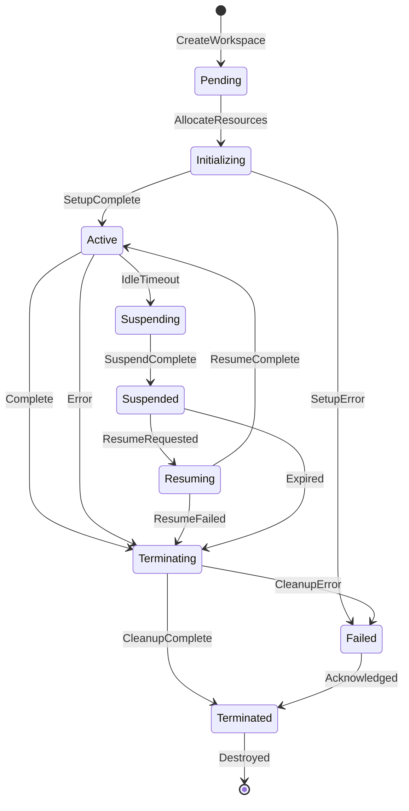

> **Status:** 📐 Design Spec — forward-looking design, not yet implemented

# Workspace Architecture

| Attribute          | Value                   |
| ------------------ | ----------------------- |
| **Version**        | 1.0                     |
| **Status**         | Active                  |
| **Author**         | Chief AI Architect      |
| **Domain**         | Enterprise Architecture |
| **Last Updated**   | 2026-06-18              |
| **Classification** | Internal -- Engineering |

---

## Executive Summary

Defines the developer workspace architecture - monorepo structure, environment configuration, code quality tools, development scripts, and local development workflow.

---

## Table of Contents

1.  [Executive Summary](#1-executive-summary)
2.  [Workspace Model](#2-workspace-model)
3.  [Workspace Lifecycle](#3-workspace-lifecycle)
4.  [Workspace Types](#4-workspace-types)
5.  [Workspace Isolation](#5-workspace-isolation)
6.  [Artifact Management](#6-artifact-management)
7.  [Workspace API](#7-workspace-api)
8.  [Workspace Scheduling](#8-workspace-scheduling)
9.  [Workspace Monitoring](#9-workspace-monitoring)
10. [Integration with Agent System](#10-integration-with-agent-system)
11. [Related Documents](#11-related-documents)

---

## 1. Executive Summary

### 1.1 Definition

A **workspace** is an isolated, ephemeral execution environment provisioned for an autonomous agent to process a single request or task. Each workspace encapsulates the runtime state, file system scratch space, contextual memory, and resource配额 required for the agent to operate without interference from other agents or processes.

### 1.2 Purpose

Workspaces provide the foundational sandbox within which agentic workloads execute. They guarantee:

- **Resource isolation** -- CPU, memory, and storage are partitioned per workspace.
- **Security boundaries** -- no workspace can read another workspace's data, environment variables, or artifacts.
- **Deterministic lifecycle** -- workspaces are created, used, and destroyed in a predictable state machine.
- **Observability** -- every workspace emits metrics, logs, and audit events throughout its lifetime.

### 1.3 Key Design Principles

| Principle            | Description                                                          |
| -------------------- | -------------------------------------------------------------------- |
| Ephemerality         | Workspaces are disposable; no persistent state survives termination. |
| Immutability         | Workspace configuration is immutable after creation.                 |
| Least Privilege      | Each workspace receives only the permissions required for its type.  |
| Transparent Metering | Resource consumption is tracked and billable per workspace.          |
| Graceful Degradation | Workspaces degrade predictably under resource pressure.              |

### 1.4 Scope

This document covers the workspace data model, lifecycle state machine, isolation mechanisms, API surface, scheduling algorithm, monitoring framework, and integration contracts with the Agent System. It is the authoritative reference for all engineering teams building on or extending the workspace substrate.

---

## 2. Workspace Model

### 2.1 Workspace Anatomy

Every workspace is represented by the following canonical object:

| Field           | Type               | Required | Description                                        |
| --------------- | ------------------ | -------- | -------------------------------------------------- |
| `id`            | UUID v7            | Yes      | Globally unique workspace identifier.              |
| `name`          | string             | Yes      | Human-readable label (max 128 chars).              |
| `type`          | WorkspaceType      | Yes      | One of `chat`, `task`, `analysis`, `admin`.        |
| `status`        | WorkspaceStatus    | Yes      | Current state in the lifecycle machine.            |
| `resources`     | ResourceQuota      | Yes      | Allocated resource limits.                         |
| `contexts`      | ContextRef[]       | No       | Active context window references.                  |
| `artifacts`     | ArtifactRef[]      | No       | References to files produced within the workspace. |
| `metadata`      | Map[string,string] | No       | Key-value tags for classification and routing.     |
| `agent_id`      | UUID v7            | No       | ID of the agent to which this workspace is bound.  |
| `request_id`    | UUID v7            | No       | ID of the originating request.                     |
| `created_at`    | ISO 8601           | Yes      | Timestamp of workspace creation.                   |
| `updated_at`    | ISO 8601           | Yes      | Timestamp of last state transition.                |
| `expires_at`    | ISO 8601           | Yes      | Scheduled termination timestamp.                   |
| `terminated_at` | ISO 8601           | No       | Actual termination timestamp.                      |

### 2.2 Full JSON Schema

```json
{
  "$schema": "https://json-schema.org/draft/2020-12/schema",
  "$id": "https://architecture.enterprise/workspace/v1",
  "title": "Workspace",
  "description": "An isolated execution environment for autonomous agents.",
  "type": "object",
  "required": [
    "id",
    "name",
    "type",
    "status",
    "resources",
    "created_at",
    "updated_at",
    "expires_at"
  ],
  "properties": {
    "id": {
      "type": "string",
      "format": "uuid",
      "description": "Globally unique workspace identifier (UUID v7).",
      "pattern": "^[0-9a-f]{8}-[0-9a-f]{4}-7[0-9a-f]{3}-[89ab][0-9a-f]{3}-[0-9a-f]{12}$"
    },
    "name": {
      "type": "string",
      "maxLength": 128,
      "description": "Human-readable label for the workspace.",
      "examples": ["chat-session-42", "code-review-task-901"]
    },
    "type": {
      "type": "string",
      "enum": ["chat", "task", "analysis", "admin"],
      "description": "Categorizes the workspace purpose and resource profile."
    },
    "status": {
      "type": "string",
      "enum": [
        "pending",
        "initializing",
        "active",
        "suspending",
        "suspended",
        "resuming",
        "terminating",
        "terminated",
        "failed"
      ],
      "description": "Current state in the workspace lifecycle state machine."
    },
    "resources": {
      "$ref": "#/$defs/ResourceQuota",
      "description": "Resource limits allocated to this workspace."
    },
    "contexts": {
      "type": "array",
      "items": { "$ref": "#/$defs/ContextRef" },
      "description": "Active context windows attached to this workspace."
    },
    "artifacts": {
      "type": "array",
      "items": { "$ref": "#/$defs/ArtifactRef" },
      "description": "Artifacts generated within this workspace."
    },
    "metadata": {
      "type": "object",
      "additionalProperties": { "type": "string" },
      "description": "Arbitrary key-value tags for routing and classification.",
      "examples": [{ "department": "engineering", "priority": "high", "source": "github-webhook" }]
    },
    "agent_id": {
      "type": "string",
      "format": "uuid",
      "description": "Identifier of the agent bound to this workspace."
    },
    "request_id": {
      "type": "string",
      "format": "uuid",
      "description": "Identifier of the originating request."
    },
    "created_at": {
      "type": "string",
      "format": "date-time",
      "description": "ISO 8601 timestamp of workspace creation."
    },
    "updated_at": {
      "type": "string",
      "format": "date-time",
      "description": "ISO 8601 timestamp of the last state transition."
    },
    "expires_at": {
      "type": "string",
      "format": "date-time",
      "description": "ISO 8601 timestamp after which the workspace is forcibly terminated."
    },
    "terminated_at": {
      "type": "string",
      "format": "date-time",
      "description": "ISO 8601 timestamp of actual termination."
    }
  },
  "$defs": {
    "ResourceQuota": {
      "type": "object",
      "required": ["cpu_cores", "memory_mb", "storage_mb", "max_contexts", "max_artifacts"],
      "properties": {
        "cpu_cores": {
          "type": "number",
          "minimum": 0.1,
          "description": "Maximum CPU cores (fractional allowed)."
        },
        "memory_mb": {
          "type": "integer",
          "minimum": 64,
          "description": "Maximum memory in megabytes."
        },
        "storage_mb": {
          "type": "integer",
          "minimum": 10,
          "description": "Maximum ephemeral storage in megabytes."
        },
        "max_contexts": {
          "type": "integer",
          "minimum": 0,
          "description": "Maximum number of concurrent context windows."
        },
        "max_artifacts": {
          "type": "integer",
          "minimum": 0,
          "description": "Maximum number of artifacts retainable."
        },
        "network_egress_mb": {
          "type": "integer",
          "minimum": 0,
          "description": "Maximum outbound network transfer in megabytes."
        },
        "max_lifetime_seconds": {
          "type": "integer",
          "minimum": 30,
          "description": "Hard maximum lifetime in seconds."
        }
      }
    },
    "ContextRef": {
      "type": "object",
      "required": ["context_id", "context_type", "token_count", "loaded_at"],
      "properties": {
        "context_id": { "type": "string", "format": "uuid" },
        "context_type": {
          "type": "string",
          "enum": ["conversation", "document", "memory", "search_result"]
        },
        "token_count": { "type": "integer" },
        "loaded_at": { "type": "string", "format": "date-time" }
      }
    },
    "ArtifactRef": {
      "type": "object",
      "required": ["artifact_id", "path", "size_bytes", "mime_type", "created_at"],
      "properties": {
        "artifact_id": { "type": "string", "format": "uuid" },
        "path": { "type": "string" },
        "size_bytes": { "type": "integer" },
        "mime_type": { "type": "string" },
        "checksum_sha256": { "type": "string" },
        "created_at": { "type": "string", "format": "date-time" }
      }
    }
  }
}
```

### 2.3 Workspace Identifiers

Workspace IDs are UUID v7 values, which embed a Unix millisecond timestamp in the most significant bits. This enables time-ordered indexing without a separate `created_at` lookup and reduces index fragmentation in the backing store.

| Property              | Value                                  |
| --------------------- | -------------------------------------- |
| Format                | UUID v7 (RFC 9562)                     |
| Example               | `018f3a7e-5b23-7a00-8000-3a1c2d3e4f5a` |
| Collision Probability | Negligible (122 random bits)           |
| Index Strategy        | Clustered primary key on `id`          |

---

## 3. Workspace Lifecycle

### 3.1 State Machine

The workspace lifecycle is modeled as a deterministic finite state machine with the following states and transitions:

| Current State | Trigger                          | Next State   |
| ------------- | -------------------------------- | ------------ |
| Pending       | System allocates resources       | Initializing |
| Initializing  | Setup completes successfully     | Active       |
| Initializing  | Setup fails irrecoverably        | Failed       |
| Active        | System suspends (idle timeout)   | Suspending   |
| Suspending    | Suspension completes             | Suspended    |
| Suspended     | System resumes (request arrives) | Resuming     |
| Resuming      | Resumption completes             | Active       |
| Active        | System terminates (completion)   | Terminating  |
| Suspended     | System terminates (expiry)       | Terminating  |
| Terminating   | Cleanup completes                | Terminated   |
| Any           | Unrecoverable error              | Failed       |
| Failed        | Manual intervention              | Terminated   |

### 3.2 Mermaid State Diagram



### 3.3 State Descriptions

| State        | Purpose                                                        | Expected Duration         |
| ------------ | -------------------------------------------------------------- | ------------------------- |
| Pending      | Admission control; waiting for resource allocation.            | < 100 ms                  |
| Initializing | Provisioning sandbox, mounting storage, loading base context.  | < 2 s                     |
| Active       | Agent is executing the assigned request.                       | Variable (1 s -- 30 min)  |
| Suspending   | Persisting volatile state; releasing unused resources.         | < 500 ms                  |
| Suspended    | Workspace frozen; minimal memory footprint.                    | Indefinite (up to TTL)    |
| Resuming     | Restoring state from suspension snapshot.                      | < 500 ms                  |
| Terminating  | Cleaning up temporary files, closing handles, releasing quota. | < 1 s                     |
| Terminated   | Workspace object retained for audit; no runtime exists.        | Retention window (7 days) |
| Failed       | Workspace encountered an unrecoverable error.                  | Until acknowledged        |

### 3.4 Lifecycle Hooks

The workspace runtime invokes configurable hooks at each state transition. Hooks are registered as callback endpoints or embedded scripts.

| Hook          | Invocation Point                                            | Signature                                            |
| ------------- | ----------------------------------------------------------- | ---------------------------------------------------- |
| `on_create`   | After `Pending` record is persisted, before `Initializing`. | `(workspace: Workspace) => void`                     |
| `on_activate` | After transition to `Active`; agent receives control.       | `(workspace: Workspace) => void`                     |
| `on_suspend`  | After `Suspending` decision is made, before freeze.         | `(workspace: Workspace) => Snapshot`                 |
| `on_resume`   | After `Resuming` starts, before agent re-enters.            | `(workspace: Workspace, snapshot: Snapshot) => void` |
| `on_destroy`  | After `Terminated` is persisted, before record archival.    | `(workspace: Workspace) => void`                     |
| `on_fail`     | On entry to `Failed` state.                                 | `(workspace: Workspace, error: ErrorReport) => void` |

Hook execution is subject to a 5-second timeout. Hooks that exceed the timeout are aborted, but the state transition proceeds to prevent lifecycle deadlock.

### 3.5 Time-to-Live (TTL) Policy

Every workspace carries a hard expiry (`expires_at`). The TTL is calculated at creation time and cannot be extended.

| Workspace Type | Default TTL | Maximum TTL |
| -------------- | ----------- | ----------- |
| Chat           | 15 minutes  | 60 minutes  |
| Task           | 30 minutes  | 120 minutes |
| Analysis       | 10 minutes  | 30 minutes  |
| Admin          | 5 minutes   | 15 minutes  |

Once `expires_at` elapses, the workspace is force-transitioned to `Terminating`, regardless of agent activity. A grace period of 10 seconds allows for final artifact flushes before hard kill.

### 3.6 Idle Timeout

The idle timeout determines when an `Active` workspace transitions to `Suspending`.

| Workspace Type | Idle Timeout                    |
| -------------- | ------------------------------- |
| Chat           | 120 seconds of agent inactivity |
| Task           | 300 seconds of no I/O           |
| Analysis       | 60 seconds of no I/O            |
| Admin          | 30 seconds of no I/O            |

Idle timeout resets on any agent-to-system interaction (token emission, artifact write, API call).

---

## 4. Workspace Types

### 4.1 Type Taxonomy

The platform defines exactly four workspace types. Each type maps to a distinct workload profile and carries a default resource allocation.

| Type     | Enum Value | Primary Use Case                                                      |
| -------- | ---------- | --------------------------------------------------------------------- |
| Chat     | `chat`     | Interactive conversational sessions with real-time streaming.         |
| Task     | `task`     | Background job execution (code generation, review, batch processing). |
| Analysis | `analysis` | Content analysis, document summarization, data extraction.            |
| Admin    | `admin`    | System administration, configuration, diagnostics, and maintenance.   |

### 4.2 Chat Workspace

Chat workspaces power interactive, turn-based conversations. They maintain a persistent context window that accumulates the conversation history.

| Characteristic      | Specification                                 |
| ------------------- | --------------------------------------------- |
| Latency Requirement | < 500 ms first-token                          |
| Streaming Support   | Required (SSE)                                |
| Context Retention   | Full conversation history within token budget |
| Idle Behavior       | Suspended after 120 s inactivity              |
| Concurrency         | 1 agent per workspace                         |

### 4.3 Task Workspace

Task workspaces handle asynchronous, long-running jobs submitted via the API or webhook triggers. They are optimized for throughput rather than latency.

| Characteristic      | Specification                          |
| ------------------- | -------------------------------------- |
| Latency Requirement | < 5 s to start execution               |
| Streaming Support   | Optional (polling or webhook callback) |
| Context Retention   | Task-specific context only             |
| Idle Behavior       | Suspended after 300 s inactivity       |
| Concurrency         | 1 agent per workspace                  |

### 4.4 Analysis Workspace

Analysis workspaces are purpose-built for ingesting large payloads (documents, logs, data sets) and producing structured output (summaries, extractions, classifications).

| Characteristic      | Specification                       |
| ------------------- | ----------------------------------- |
| Latency Requirement | < 2 s to start ingestion            |
| Streaming Support   | No (result-only)                    |
| Context Retention   | Source content plus analysis result |
| Idle Behavior       | Suspended after 60 s inactivity     |
| Concurrency         | 1 agent per workspace               |

### 4.5 Admin Workspace

Admin workspaces are reserved for system-level operations: configuration changes, health diagnostics, cache invalidation, and user management. They have elevated permissions but shortened lifetimes.

| Characteristic      | Specification                   |
| ------------------- | ------------------------------- |
| Latency Requirement | < 200 ms first-token            |
| Streaming Support   | Required (SSE)                  |
| Context Retention   | Minimal (operation-scoped)      |
| Idle Behavior       | Suspended after 30 s inactivity |
| Concurrency         | 1 agent per workspace           |

### 4.6 Resource Allocation per Type

Default resource quotas assigned at creation time. Values are configurable via administrative overrides.

| Resource            | Chat | Task | Analysis | Admin |
| ------------------- | ---- | ---- | -------- | ----- |
| CPU Cores           | 0.5  | 2.0  | 1.0      | 0.5   |
| Memory (MB)         | 512  | 2048 | 1024     | 256   |
| Storage (MB)        | 50   | 200  | 100      | 20    |
| Max Contexts        | 10   | 5    | 3        | 2     |
| Max Artifacts       | 20   | 50   | 30       | 10    |
| Network Egress (MB) | 10   | 50   | 20       | 5     |
| Max Lifetime (s)    | 900  | 1800 | 600      | 300   |

### 4.7 Type Selection Rules

The system selects the workspace type based on the incoming request's `x-workspace-type` header or the following heuristics:

| Request Characteristic          | Inferred Type |
| ------------------------------- | ------------- |
| `stream: true` in request body  | Chat          |
| Payload size > 1 MB             | Analysis      |
| Request path matches `/admin/*` | Admin         |
| Default (background job)        | Task          |

Users may override the inferred type by providing an explicit `workspace_type` field in the request.

---

## 5. Workspace Isolation

### 5.1 Isolation Model

Workspace isolation is enforced at four layers:

| Layer      | Mechanism                     | Description                                                                                                        |
| ---------- | ----------------------------- | ------------------------------------------------------------------------------------------------------------------ |
| Compute    | cgroups v2 / Linux namespaces | Each workspace runs in a dedicated control group with CPU, memory, and PID namespace isolation.                    |
| Filesystem | OverlayFS + ephemeral volumes | Each workspace gets a read-only base layer and a writable scratch layer. No shared mount points.                   |
| Network    | eBPF-based network policies   | Per-workspace firewall rules; no inter-workspace communication unless explicitly routed through the agent gateway. |
| Identity   | OAuth 2.0 scoped tokens       | Workspace tokens carry a `ws:{id}` scope; the token introspection endpoint rejects any cross-workspace access.     |

### 5.2 Resource Limits per Type

Enforced at the kernel level via cgroup controllers.

| Resource               | Chat | Task | Analysis | Admin | Enforcement                    |
| ---------------------- | ---- | ---- | -------- | ----- | ------------------------------ |
| CPU (cores)            | 0.5  | 2.0  | 1.0      | 0.5   | CFS quota (`cpu.cfs_quota_us`) |
| CPU Burst (cores)      | 1.0  | 4.0  | 2.0      | 1.0   | `cpu.max.burst`                |
| Memory (MB)            | 512  | 2048 | 1024     | 256   | `memory.max`                   |
| Memory+Swap (MB)       | 640  | 2560 | 1280     | 320   | `memory.swap.max`              |
| Ephemeral Storage (MB) | 50   | 200  | 100      | 20    | `io.max` write limits          |
| Open File Descriptors  | 256  | 512  | 256      | 128   | `pids.max` + rlimit            |
| Network Egress (MB)    | 10   | 50   | 20       | 5     | eBPG rate limiter              |
| Processes              | 64   | 128  | 64       | 32    | `pids.max`                     |

### 5.3 Security Boundaries

| Boundary             | Implementation                                                                                                 |
| -------------------- | -------------------------------------------------------------------------------------------------------------- |
| Namespace Isolation  | Dedicated PID, mount, network, and UTS namespaces per workspace.                                               |
| Capability Dropping  | All Linux capabilities dropped; `CAP_NET_RAW`, `CAP_SYS_ADMIN` explicitly denied.                              |
| Seccomp Profile      | Default-deny seccomp with allowlist for `read`, `write`, `fstat`, `mmap`, `munmap`, `exit_group`, `nanosleep`. |
| AppArmor/SELinux     | Enforcing profile per workspace type (see security policy handbook).                                           |
| Privilege Escalation | `no_new_privs` set on all workspace processes.                                                                 |
| Read-Only Root       | Workspace root filesystem mounted read-only; only `/workspace` is writable.                                    |

### 5.4 Namespace Isolation Details

Each workspace receives a unique set of kernel namespaces:

| Namespace | Isolated? | Notes                                                              |
| --------- | --------- | ------------------------------------------------------------------ |
| PID       | Yes       | Workspace processes cannot see or signal host processes.           |
| Mount     | Yes       | Workspace filesystem tree is fully private.                        |
| Network   | Yes       | Workspace has a loopback interface and an eBPF-filtered veth pair. |
| UTS       | Yes       | Workspace sees a sanitized hostname (`ws-{id}`).                   |
| IPC       | Yes       | No shared memory segments across workspaces.                       |
| User      | Yes       | Workspace UID mapped to a high-range host UID (>= 100000).         |
| Cgroup    | Yes       | Workspace confined to its own cgroup subtree.                      |

### 5.5 No Cross-Workspace Data Access

The platform enforces a strict no-cross-access policy:

1. **Filesystem Isolation**: Workspace A cannot mount, read, or write any path belonging to Workspace B. The shared `/tmp` directory is per-workspace via namespace isolation.

2. **Memory Isolation**: Workspaces cannot attach to or read each other's `ptrace`, `process_vm_readv`, or shared memory segments. ASLR is enabled.

3. **Network Isolation**: A workspace can only communicate with:
   - The agent gateway (reverse proxy)
   - The artifact store (via presigned URLs)
   - The context service (via gRPC with workspace-scoped mTLS certs)

4. **Artifact Store Isolation**: Artifact objects are stored with a workspace ID prefix. The store's access control layer rejects any query whose `workspace_id` does not match the requesting workspace's token scope.

5. **Audit Enforcement**: Any blocked cross-workspace access attempt is logged as a `SECURITY_VIOLATION` event and triggers an alert.

### 5.6 Sidecar Containers

Each workspace may include zero or more sidecar containers that share the workspace's network namespace but have their own resource limits. Sidecars are declared at workspace creation and cannot be added after initialization.

| Sidecar           | Purpose                                               | Resource Overhead |
| ----------------- | ----------------------------------------------------- | ----------------- |
| `context-proxy`   | Handles context retrieval and caching                 | 64 MB, 0.1 CPU    |
| `artifact-writer` | Manages artifact upload with buffering and retry      | 32 MB, 0.05 CPU   |
| `log-shipper`     | Forwards workspace logs to the observability pipeline | 32 MB, 0.05 CPU   |
| `health-sidecar`  | Provides liveness and readiness probes                | 16 MB, 0.01 CPU   |

---

## 6. Artifact Management

### 6.1 Artifact Model

Artifacts are files produced by the agent within the workspace. Each artifact is tracked as a first-class entity in the artifact registry.

| Field             | Type               | Description                                                  |
| ----------------- | ------------------ | ------------------------------------------------------------ |
| `artifact_id`     | UUID v7            | Globally unique identifier.                                  |
| `workspace_id`    | UUID v7            | Owning workspace.                                            |
| `path`            | string             | Relative path within the workspace scratch directory.        |
| `size_bytes`      | integer            | Uncompressed byte size.                                      |
| `mime_type`       | string             | MIME type (inferred from extension or explicit).             |
| `checksum_sha256` | string             | Hex-encoded SHA-256 digest.                                  |
| `storage_backend` | string             | Backend identifier (`s3`, `gcs`, `local-fs`).                |
| `storage_key`     | string             | Backend-specific object key.                                 |
| `metadata`        | Map[string,string] | User-defined tags.                                           |
| `created_at`      | ISO 8601           | Creation timestamp.                                          |
| `retain_until`    | ISO 8601           | Timestamp after which the artifact may be garbage-collected. |

### 6.2 Artifact JSON Schema

```json
{
  "$schema": "https://json-schema.org/draft/2020-12/schema",
  "$id": "https://architecture.enterprise/workspace-artifact/v1",
  "title": "Artifact",
  "type": "object",
  "required": [
    "artifact_id",
    "workspace_id",
    "path",
    "size_bytes",
    "mime_type",
    "checksum_sha256",
    "storage_backend",
    "storage_key",
    "created_at"
  ],
  "properties": {
    "artifact_id": { "type": "string", "format": "uuid" },
    "workspace_id": { "type": "string", "format": "uuid" },
    "path": { "type": "string", "maxLength": 1024 },
    "size_bytes": { "type": "integer", "minimum": 0 },
    "mime_type": {
      "type": "string",
      "examples": ["text/plain", "application/json", "image/png", "application/pdf"]
    },
    "checksum_sha256": {
      "type": "string",
      "pattern": "^[a-f0-9]{64}$"
    },
    "storage_backend": { "type": "string" },
    "storage_key": { "type": "string" },
    "metadata": {
      "type": "object",
      "additionalProperties": { "type": "string" }
    },
    "created_at": { "type": "string", "format": "date-time" },
    "retain_until": { "type": "string", "format": "date-time" }
  }
}
```

### 6.3 Storage Backend

The artifact store supports pluggable backends. The active backend is selected via configuration at deployment time.

| Backend            | Characteristics                  | Best For                             |
| ------------------ | -------------------------------- | ------------------------------------ |
| Local Filesystem   | Fast, no network dependency      | Development, single-node deployments |
| S3 / S3-Compatible | Durable, versioned, cross-region | Production, multi-region             |
| GCS                | Strong consistency, object holds | GCP-native deployments               |
| Azure Blob         | Soft delete, lifecycle policies  | Azure-native deployments             |

### 6.4 Retention Policy

| Policy             | Rule                                                                           |
| ------------------ | ------------------------------------------------------------------------------ |
| Default Retention  | 7 days from artifact creation                                                  |
| Extended Retention | Override via `retain_until` field (max 90 days)                                |
| Workspace Deletion | All associated artifacts are soft-deleted (retention clock starts)             |
| Hard Deletion      | After retention period, artifacts are permanently removed via lifecycle policy |
| Legal Hold         | Metadata flag `hold: true` prevents hard deletion indefinitely                 |

### 6.5 Directory Structure within Workspace

Every workspace exposes a standardized directory layout at `/workspace`:

```
/workspace/
  input/                  # Ingress for request payloads and reference files
    context/              # Context window data (read-only after mount)
    request.json          # The canonical request payload
    config.yaml           # Workspace-specific configuration overrides
  output/                 # Egress for generated artifacts
    artifacts/            # Files registered as artifacts are symlinked here
    logs/                 # Agent execution logs
    report.json           # Structured execution report (auto-generated)
  temp/                   # Scratch space (not persisted across suspension)
    cache/                # Agent model cache (cleared on suspend)
    tmp/                  # General temporary files
  workspace.lock          # Lock file indicating workspace is active
  .workspace_meta.json    # Machine-readable workspace metadata
```

Agents MUST write all output intended for persistence under `/workspace/output/artifacts/`. Files written outside this path are discarded when the workspace terminates.

### 6.6 Artifact Registration Flow

```
Agent writes file  -->  inotify watch on /workspace/output/artifacts/
                              |
                      Checksum computed (SHA-256)
                              |
                      MIME type inferred
                              |
                      Upload to storage backend
                              |
                      ArtifactRef appended to workspace.artifacts
                              |
                      Audit event emitted
```

Files larger than 10 MB are chunked and uploaded with concurrency control (max 4 concurrent parts). Upload errors trigger automatic retry with exponential backoff (3 attempts).

---

## 7. Workspace API

### 7.1 Base URL

All workspace API endpoints are served at:

```
https://api.enterprise.ai/v1/workspaces
```

Authentication is via Bearer token in the `Authorization` header. All requests require the `ws:write` scope.

### 7.2 CRUD Endpoints

#### 7.2.1 Create Workspace

```
POST /v1/workspaces
```

**Request Body:**

```json
{
  "name": "code-review-pr-142",
  "type": "task",
  "agent_id": "a1b2c3d4-...",
  "request_id": "e5f6g7h8-...",
  "resources": {
    "cpu_cores": 1.0,
    "memory_mb": 1024,
    "storage_mb": 100
  },
  "metadata": {
    "department": "engineering",
    "priority": "high"
  }
}
```

**Response (201 Created):**

```json
{
  "id": "018f3a7e-5b23-7a00-8000-3a1c2d3e4f5a",
  "name": "code-review-pr-142",
  "type": "task",
  "status": "pending",
  "resources": {
    "cpu_cores": 1.0,
    "memory_mb": 1024,
    "storage_mb": 100,
    "max_contexts": 5,
    "max_artifacts": 50,
    "network_egress_mb": 50,
    "max_lifetime_seconds": 1800
  },
  "contexts": [],
  "artifacts": [],
  "metadata": {
    "department": "engineering",
    "priority": "high"
  },
  "agent_id": "a1b2c3d4-...",
  "request_id": "e5f6g7h8-...",
  "created_at": "2026-06-18T10:30:00.000Z",
  "updated_at": "2026-06-18T10:30:00.000Z",
  "expires_at": "2026-06-18T11:00:00.000Z",
  "terminated_at": null
}
```

#### 7.2.2 Get Workspace

```
GET /v1/workspaces/{workspace_id}
```

**Response (200 OK):**

```json
{
  "id": "018f3a7e-5b23-7a00-8000-3a1c2d3e4f5a",
  "name": "code-review-pr-142",
  "type": "task",
  "status": "active",
  "resources": { "...": "..." },
  "contexts": [
    {
      "context_id": "b2c3d4e5-...",
      "context_type": "document",
      "token_count": 1432,
      "loaded_at": "2026-06-18T10:30:01.000Z"
    }
  ],
  "artifacts": [],
  "agent_id": "a1b2c3d4-...",
  "request_id": "e5f6g7h8-...",
  "created_at": "2026-06-18T10:30:00.000Z",
  "updated_at": "2026-06-18T10:30:01.500Z",
  "expires_at": "2026-06-18T11:00:00.000Z"
}
```

#### 7.2.3 List Workspaces

```
GET /v1/workspaces?status=active&type=task&limit=20&offset=0
```

**Query Parameters:**

| Parameter    | Type    | Description                                                               |
| ------------ | ------- | ------------------------------------------------------------------------- |
| `status`     | string  | Filter by status (comma-separated for multiple).                          |
| `type`       | string  | Filter by workspace type.                                                 |
| `agent_id`   | UUID    | Filter by bound agent.                                                    |
| `request_id` | UUID    | Filter by originating request.                                            |
| `limit`      | integer | Page size (max 100, default 20).                                          |
| `offset`     | integer | Pagination offset (default 0).                                            |
| `sort`       | string  | Sort field (`created_at`, `updated_at`, `status`; default `-created_at`). |

**Response (200 OK):**

```json
{
  "data": ["...workspace objects..."],
  "pagination": {
    "limit": 20,
    "offset": 0,
    "total": 142,
    "next_offset": 20
  }
}
```

#### 7.2.4 Update Workspace Metadata

```
PATCH /v1/workspaces/{workspace_id}
```

**Request Body:**

```json
{
  "metadata": {
    "department": "security",
    "review_status": "approved"
  }
}
```

**Response (200 OK):** Full workspace object with updated `metadata` and `updated_at`.

Only `metadata` is mutable after creation. All other fields are immutable.

#### 7.2.5 Delete Workspace

```
DELETE /v1/workspaces/{workspace_id}
```

**Response (202 Accepted):**

```json
{
  "id": "018f3a7e-5b23-7a00-8000-3a1c2d3e4f5a",
  "status": "terminating",
  "message": "Workspace termination initiated."
}
```

Deletion transitions the workspace to `Terminating`. The workspace record is soft-deleted after the audit retention period.

### 7.3 State Management Endpoints

#### 7.3.1 Suspend Workspace

```
POST /v1/workspaces/{workspace_id}/suspend
```

**Request Body:** (empty or optional `{ "reason": "user-initiated" }`)

**Response (200 OK):**

```json
{
  "id": "018f3a7e-5b23-7a00-8000-3a1c2d3e4f5a",
  "status": "suspending",
  "message": "Workspace suspension in progress."
}
```

Only valid when current status is `Active`. Returns `409 Conflict` otherwise.

#### 7.3.2 Resume Workspace

```
POST /v1/workspaces/{workspace_id}/resume
```

**Request Body:** (empty)

**Response (200 OK):**

```json
{
  "id": "018f3a7e-5b23-7a00-8000-3a1c2d3e4f5a",
  "status": "resuming",
  "message": "Workspace resumption in progress."
}
```

Only valid when current status is `Suspended`. Returns `409 Conflict` otherwise.

#### 7.3.3 Terminate Workspace

```
POST /v1/workspaces/{workspace_id}/terminate
```

**Request Body:** (optional `{ "reason": "manual", "force": false }`)

| Field    | Type    | Default  | Description                                      |
| -------- | ------- | -------- | ------------------------------------------------ |
| `reason` | string  | `manual` | Reason for termination.                          |
| `force`  | boolean | `false`  | If true, skip graceful cleanup (emergency only). |

**Response (200 OK):**

```json
{
  "id": "018f3a7e-5b23-7a00-8000-3a1c2d3e4f5a",
  "status": "terminating",
  "message": "Workspace termination in progress."
}
```

### 7.4 Health Check Endpoint

```
GET /v1/workspaces/health
```

**Response (200 OK):**

```json
{
  "status": "healthy",
  "version": "1.0.0",
  "uptime_seconds": 84321,
  "active_workspaces": 47,
  "pending_workspaces": 3,
  "suspended_workspaces": 12,
  "total_slots": 128,
  "available_slots": 66,
  "cluster_cpu_utilization": 0.62,
  "cluster_memory_utilization": 0.58,
  "last_errors": []
}
```

Possible statuses: `healthy`, `degraded` (some capacity lost), `unhealthy` (workspace allocation failing).

### 7.5 Error Responses

All endpoints return errors in a consistent envelope:

```json
{
  "error": {
    "code": "WORKSPACE_NOT_FOUND",
    "message": "No workspace found with the given ID.",
    "details": {
      "workspace_id": "018f3a7e-..."
    },
    "request_id": "req-abc123",
    "timestamp": "2026-06-18T10:30:05.000Z"
  }
}
```

| HTTP Status | Error Code                 | Description                                             |
| ----------- | -------------------------- | ------------------------------------------------------- |
| 400         | `INVALID_REQUEST`          | Malformed request body or parameters.                   |
| 401         | `UNAUTHORIZED`             | Missing or invalid authentication.                      |
| 403         | `FORBIDDEN`                | Token lacks required scope.                             |
| 404         | `WORKSPACE_NOT_FOUND`      | Workspace ID does not exist.                            |
| 409         | `INVALID_STATE_TRANSITION` | Requested transition is not allowed from current state. |
| 429         | `RATE_LIMITED`             | Too many requests (see `Retry-After` header).           |
| 500         | `INTERNAL_ERROR`           | Unexpected system failure.                              |
| 503         | `CAPACITY_EXHAUSTED`       | All workspace slots are occupied; retry later.          |

---

## 8. Workspace Scheduling

### 8.1 Scheduling Architecture

The workspace scheduler is a distributed admission controller that matches incoming workspace creation requests to available execution slots across a cluster of worker nodes.

```
Request --> API Gateway --> Scheduler --> Worker Pool --> Namespace Allocator --> cgroup Setup
```

### 8.2 Slot Model

The cluster is partitioned into logical slots. Each slot represents a fixed-resource unit capable of hosting one workspace.

| Slot Type | CPU       | Memory  | Max Count per Node |
| --------- | --------- | ------- | ------------------ |
| Small     | 0.5 cores | 512 MB  | 16                 |
| Medium    | 1.0 cores | 1024 MB | 8                  |
| Large     | 2.0 cores | 2048 MB | 4                  |
| X-Large   | 4.0 cores | 4096 MB | 2                  |

Workspaces are mapped to the smallest slot type that satisfies their resource requirements. A workspace requiring 1.5 cores and 1024 MB memory would be placed in a Large slot.

### 8.3 Queuing

When all slots of the required type are occupied, create requests enter a priority queue.

| Queue Parameter       | Value                          |
| --------------------- | ------------------------------ |
| Queue Depth           | 10,000 maximum                 |
| Time-to-Live in Queue | 30 seconds                     |
| Eviction Policy       | LRU when queue is full         |
| Backpressure Signal   | HTTP 503 with `Retry-After: 5` |

### 8.4 Priority-Based Scheduling

Each workspace creation request carries a priority level. The scheduler processes the queue in strict priority order; within the same priority, FIFO.

| Priority Level | Value | Preemptible?          | Typical Use                            |
| -------------- | ----- | --------------------- | -------------------------------------- |
| Critical       | 100   | No                    | Admin operations, incident response    |
| High           | 75    | Yes (preempts Medium) | Interactive chat, user-facing requests |
| Medium         | 50    | Yes (preempts Low)    | Background tasks, CI/CD                |
| Low            | 25    | Yes                   | Batch analysis, non-urgent jobs        |

### 8.5 Preemption

When a higher-priority workspace arrives and all slots are occupied, the scheduler may preempt a lower-priority workspace.

| Condition                               | Action                                        |
| --------------------------------------- | --------------------------------------------- |
| Slot available                          | Allocate immediately.                         |
| No slot, preemptor priority > preemptee | Preempt the lowest-priority Active workspace. |
| No slot, preemptor priority == lowest   | Enqueue.                                      |
| No slot, queue full, lowest priority    | Reject with `503 CAPACITY_EXHAUSTED`.         |

A preempted workspace is force-terminated with reason `preempted`. The originating request may be retried by the client.

### 8.6 Allocation Algorithm (Pseudocode)

```
function allocate(workspace):
    slot_type = fit_slot(workspace.resources)
    available = find_available_slots(slot_type)
    if available is not empty:
        return claim_slot(available[0], workspace)

    if workspace.priority < PREEMPTION_THRESHOLD:
        return enqueue(workspace)

    candidates = find_preemptable(slot_type, workspace.priority)
    if candidates is not empty:
        preempt(candidates[0])
        return claim_slot(candidates[0].slot, workspace)

    return enqueue(workspace)
```

### 8.7 Node Affinity and Anti-Affinity

| Rule               | Effect                                                                                        |
| ------------------ | --------------------------------------------------------------------------------------------- |
| Agent Affinity     | Workspaces bound to the same agent are scheduled on the same node when possible.              |
| Type Anti-Affinity | Admin workspaces are scheduled on dedicated control-plane nodes.                              |
| Tenant Isolation   | Multi-tenant deployments support `tenant_id` node labels to prevent cross-tenant co-location. |

---

## 9. Workspace Monitoring

### 9.1 Resource Usage Tracking

Every workspace emits a metrics stream at 10-second intervals throughout its Active lifetime.

| Metric                          | Type    | Unit        | Description                      |
| ------------------------------- | ------- | ----------- | -------------------------------- |
| `workspace.cpu.usage`           | Gauge   | Cores       | Current CPU usage.               |
| `workspace.cpu.throttled`       | Counter | Nanoseconds | Total time CPU was throttled.    |
| `workspace.memory.usage`        | Gauge   | Bytes       | Current memory usage.            |
| `workspace.memory.swap`         | Gauge   | Bytes       | Current swap usage.              |
| `workspace.storage.usage`       | Gauge   | Bytes       | Current ephemeral storage usage. |
| `workspace.storage.writes`      | Counter | Bytes       | Total bytes written to scratch.  |
| `workspace.network.egress`      | Counter | Bytes       | Total outbound data.             |
| `workspace.network.connections` | Gauge   | Count       | Current open connections.        |
| `workspace.fds.open`            | Gauge   | Count       | Current open file descriptors.   |
| `workspace.pids.count`          | Gauge   | Count       | Current process count.           |

### 9.2 Quota Enforcement

Quotas are enforced at two levels:

| Enforcement Point | Mechanism                       | Action on Violation            |
| ----------------- | ------------------------------- | ------------------------------ |
| Soft Limit        | cgroup memory high / cpu.weight | Throttle, emit warning metric. |
| Hard Limit        | cgroup memory max / cpu.max     | OOM kill or throttle to quota. |
| Storage Limit     | Filesystem quota (project IDs)  | `ENOSPC` on write.             |
| Network Limit     | eBPF rate limiter               | Drop packets exceeding rate.   |

When a hard limit is exceeded, the workspace transitions to `Failed` with reason `quota_exceeded`.

### 9.3 Performance Metrics

Aggregate metrics are computed across the workspace fleet and published to the observability platform.

| Metric                             | Aggregation   | Description                                |
| ---------------------------------- | ------------- | ------------------------------------------ |
| `workspace.lifetime_duration`      | p50, p95, p99 | Time from Active to Terminated.            |
| `workspace.activation_delay`       | p50, p95, p99 | Time from Pending to Active.               |
| `workspace.suspend_duration`       | p50, p95, p99 | Time to suspend.                           |
| `workspace.resume_duration`        | p50, p95, p99 | Time to resume.                            |
| `workspace.cpu_utilization_pct`    | avg, max      | CPU utilization as percentage of quota.    |
| `workspace.memory_utilization_pct` | avg, max      | Memory utilization as percentage of quota. |
| `workspace.artifact_count`         | avg, max      | Number of artifacts per workspace.         |
| `workspace.error_rate`             | rate          | Workspace failure rate per minute.         |
| `workspace.preemption_rate`        | rate          | Preemption events per minute.              |
| `workspace.queue_depth`            | gauge         | Current scheduler queue depth.             |
| `workspace.queue_wait_time`        | p50, p95, p99 | Time requests spend in queue.              |

### 9.4 Logging

Each workspace produces three log streams:

| Stream          | Destination                         | Retention          | Contents                                                   |
| --------------- | ----------------------------------- | ------------------ | ---------------------------------------------------------- |
| Agent Log       | `workspace/output/logs/agent.log`   | Workspace lifetime | Agent internal operations, tool calls, model interactions. |
| Workspace Audit | Centralized `workspace-audit` index | 90 days            | State transitions, API calls, security events.             |
| Metrics Stream  | Time-series database                | 30 days            | All metrics listed in section 9.1.                         |

Logs are structured JSON with the following required fields:

```json
{
  "timestamp": "2026-06-18T10:30:05.123Z",
  "level": "INFO",
  "workspace_id": "018f3a7e-...",
  "event": "state_transition",
  "from": "active",
  "to": "terminating",
  "reason": "request_completed",
  "elapsed_ms": 45200,
  "request_id": "e5f6g7h8-..."
}
```

### 9.5 Alerting Rules

| Alert                  | Condition                                              | Severity |
| ---------------------- | ------------------------------------------------------ | -------- |
| High Queue Depth       | `workspace.queue_depth > 100` for 30 s                 | Warning  |
| Queue Starvation       | `workspace.queue_wait_time.p95 > 10 s`                 | Critical |
| Preemption Spike       | `workspace.preemption_rate > 10 / min`                 | Warning  |
| Memory Pressure        | `workspace.memory_utilization_pct.avg > 90 %` for 60 s | Warning  |
| OOM Kills              | `workspace.error_rate` spike with `OOM` reason         | Critical |
| Node Capacity          | Node `available_slots == 0` for 5 min                  | Warning  |
| Workspace Failure Rate | `workspace.error_rate > 0.05` for 5 min                | Critical |

### 9.6 Observability Dashboard

A Grafana dashboard (`Workspace Fleet Overview`) provides at-a-glance visibility:

- Current active, pending, suspended, terminated counts (time-series).
- Queue depth and wait-time heatmap.
- Per-type resource utilization (stacked bar).
- Preemption and failure event timeline.
- Top-5 workspaces by CPU/memory consumption.
- Node-level slot allocation (table + heatmap).
- State transition histogram.

---

## 10. Integration with Agent System

### 10.1 Agent-Workspace Binding

The Agent System and Workspace System interact through a well-defined lifecycle contract. Every agent request is executed within exactly one workspace.

```
Agent System                        Workspace System
     |                                     |
     |-- CreateWorkspace(request) -------->|
     |                                     |-- Allocate slot
     |                                     |-- Initialize sandbox
     |<------- WorkspaceReady -------------|
     |                                     |
     |-- Execute(request) ---------------->|
     |                                     |-- Agent processes
     |                                     |-- Produces artifacts
     |<------- Result + Artifacts ---------|
     |                                     |
     |-- TerminateWorkspace -------------->|
     |                                     |-- Cleanup
     |                                     |-- Release quota
```

### 10.2 Workspace Acquisition Flow

The agent system follows this sequence when dispatching a request:

1. **Request Ingestion**: Agent system receives a user request via API, webhook, or schedule.

2. **Workspace Creation**: Agent system calls `POST /v1/workspaces` with the request's resource requirements, type hint, and metadata.

3. **Poll for Readiness**: Agent system polls `GET /v1/workspaces/{id}` until `status == "active"` or a timeout (15 s) is exceeded.

4. **Context Loading**: Agent system loads relevant context windows into the workspace via the Context Service.

5. **Execution**: Agent system sends the request payload to the workspace's agent sandbox.

6. **Artifact Collection**: Agent system monitors artifact creation and streams results back to the user.

7. **Workspace Termination**: Agent system calls `POST /v1/workspaces/{id}/terminate` with reason `request_completed`.

### 10.3 Lifecycle Tied to Request Lifecycle

| Agent Request Phase         | Workspace State               | Actions                                                  |
| --------------------------- | ----------------------------- | -------------------------------------------------------- |
| Request Received            | `Pending`                     | Workspace object created; scheduled.                     |
| Resources Allocated         | `Initializing`                | cgroup setup, namespace creation, network configuration. |
| Setup Complete              | `Active`                      | Context loaded; agent begins processing.                 |
| Processing (idle > timeout) | `Suspending` -> `Suspended`   | State snapshot persisted; slots reclaimed.               |
| Additional input arrives    | `Resuming` -> `Active`        | State restored; processing continues.                    |
| Request Complete            | `Terminating` -> `Terminated` | Artifacts flushed; cleanup executed.                     |
| Error / Exception           | `Terminating` -> `Failed`     | Error logged; partial artifacts retained.                |

### 10.4 Context Integration

The Context Service integrates with the workspace lifecycle at the following points:

| Lifecycle Event  | Context Action                                                                                         |
| ---------------- | ------------------------------------------------------------------------------------------------------ |
| `on_activate`    | Workspace's `contexts[]` is populated with base context windows from the request.                      |
| During Execution | Agent may request additional contexts via Context Service gRPC. Each context is added to `contexts[]`. |
| `on_suspend`     | Context token counts are frozen. Context payloads are persisted to the context store.                  |
| `on_resume`      | Context windows are rehydrated from the context store.                                                 |
| `on_destroy`     | Context references are dereferenced (context payloads preserved for audit).                            |

### 10.5 Agent Request Context Propagation

Every workspace carries the associated agent request's tracing context:

| Header           | Description                                           |
| ---------------- | ----------------------------------------------------- |
| `x-request-id`   | End-to-end request trace ID (propagated to all logs). |
| `x-workspace-id` | Workspace ID (set during creation).                   |
| `x-agent-id`     | Agent ID executing the request.                       |
| `x-tenant-id`    | Tenant or organization ID (multi-tenant deployments). |

These identifiers are injected into every log line, metric, and span emitted by the workspace.

### 10.6 Concurrency Model

| Constraint                  | Value                       |
| --------------------------- | --------------------------- |
| Max workspaces per agent    | 1 (active) + 5 (suspended)  |
| Max workspaces per request  | 1                           |
| Max workspaces per tenant   | Configurable (default 50)   |
| Max workspaces cluster-wide | Configurable (default 1024) |

An agent may have at most one `Active` workspace at any time. Additional requests for the same agent are queued until the active workspace completes or suspends.

---

## 11. Related Documents

### 11.1 Internal References

| Document                | Description                                                                           | Location                    |
| ----------------------- | ------------------------------------------------------------------------------------- | --------------------------- |
| AGENT.md                | Agent runtime architecture, tool execution model, and security constraints.           | `./AGENT.md`                |
| AGENTS.md               | Multi-agent orchestration, routing, delegation, and coordination protocols.           | `./AGENTS.md`               |
| CONTEXT-ARCHITECTURE.md | Context window management, retrieval, token budgeting, and cache invalidation.        | `./CONTEXT-ARCHITECTURE.md` |
| MEMORY-ARCHITECTURE.md  | Long-term memory, episodic memory, embedding storage, and retrieval pipelines.        | `./MEMORY-ARCHITECTURE.md`  |
| API-GATEWAY.md          | API gateway routing, rate limiting, authentication, and request transformation.       | `./API-GATEWAY.md`          |
| OBSERVABILITY.md        | Metrics collection, distributed tracing, logging pipeline, and dashboard definitions. | `./OBSERVABILITY.md`        |
| SECURITY.md             | Security model, threat matrix, incident response, and compliance controls.            | `./SECURITY.md`             |

### 11.2 External References

| Reference                | Description                                                         |
| ------------------------ | ------------------------------------------------------------------- |
| RFC 9562 (UUID v7)       | Time-ordered UUID generation specification.                         |
| cgroups v2 Documentation | Linux kernel control group v2 interface and resource controllers.   |
| OverlayFS Documentation  | Linux union mount filesystem for layered workspace images.          |
| eBPF Networking          | BPF-based network policy enforcement for container isolation.       |
| JSON Schema 2020-12      | The JSON Schema specification used for workspace object validation. |

### 11.3 Glossary

| Term           | Definition                                                                                                |
| -------------- | --------------------------------------------------------------------------------------------------------- |
| Agent          | An autonomous AI program that processes a request within a workspace.                                     |
| Artifact       | A file or blob produced by an agent during workspace execution.                                           |
| Context Window | A contiguous sequence of tokens representing conversation history, document content, or retrieved memory. |
| cgroup         | A Linux kernel mechanism for limiting, accounting for, and isolating resource usage.                      |
| Namespace      | A Linux kernel isolation primitive that wraps a global system resource in an abstraction.                 |
| Preemption     | The forcible termination of a lower-priority workspace to free resources for a higher-priority one.       |
| Sandbox        | The combined isolation boundary (cgroup, namespace, seccomp, AppArmor) surrounding a workspace.           |
| Sidecar        | A helper process that runs alongside the agent within the workspace network namespace.                    |
| Slot           | A unit of cluster capacity representing the resources required to host one workspace.                     |
| Suspension     | The act of freezing a workspace and persisting its state to release resources temporarily.                |

---

## Decision Log

| ID       | Decision                                                                                        | Rationale                                                                                                             | Alternatives Considered                                                                                                                                                    | Date     | Approver           |
| -------- | ----------------------------------------------------------------------------------------------- | --------------------------------------------------------------------------------------------------------------------- | -------------------------------------------------------------------------------------------------------------------------------------------------------------------------- | -------- | ------------------ |
| D-WS-001 | Design workspaces as isolated, ephemeral execution environments per request                     | Guarantees resource isolation, security boundaries, and deterministic lifecycle; no persistent state between requests | Long-lived agent containers (rejected — state leakage, resource contention); shared runtime per agent type (rejected — security boundary violations)                   | Jun 2026 | Chief AI Architect |
| D-WS-002 | Use Linux cgroups + namespaces + seccomp + AppArmor for workspace isolation                     | Defense-in-depth: resource limits, process isolation, system call filtering, mandatory access control                 | Docker containers only (rejected — insufficient resource control); VMs per workspace (rejected — overhead); pure cgroups (rejected — no security policy enforcement) | Jun 2026 | Chief AI Architect |
| D-WS-003 | Implement 3-tier priority system (Critical, Normal, Background) for workspace scheduling        | Ensures lead qualification and admin operations get resources first; background tasks use spare capacity              | FIFO queue (rejected — no priority differentiation); 5+ tiers (rejected — too complex to tune); preemptive only (rejected — starvation risk for low-priority tasks)  | Jun 2026 | Chief AI Architect |
| D-WS-004 | Store workspace artifacts in ephemeral in-memory storage with optional S3 persistence for audit | Minimizes I/O latency for agent operations; persistent only when explicitly required for compliance                   | Full S3 persistence (rejected — latency); no persistence (rejected — no audit trail); database storage (rejected — blob storage inefficiency)                        | Jun 2026 | Chief AI Architect |
| D-WS-005 | Enforce 30-second default workspace timeout with configurable override per agent type           | Prevents runaway agent executions; configurable for long-running tasks like knowledge base re-indexing                | Fixed 60-second timeout (rejected — too long for simple queries, too short for complex ones); no timeout (rejected — resource leak risk)                               | Jun 2026 | Chief AI Architect |

## Risk Register

| ID       | Risk                                                                                            | Likelihood | Impact   | Mitigation                                                                                                                                       |
| -------- | ----------------------------------------------------------------------------------------------- | ---------- | -------- | ------------------------------------------------------------------------------------------------------------------------------------------------ |
| R-WS-001 | Workspace resource exhaustion from concurrent agent executions causes system-wide degradation   | Medium     | High     | Implement per-workspace resource quotas (CPU, memory, disk); enforce max concurrent workspace limit; add preemption for background tasks         |
| R-WS-002 | Kernel-level isolation (cgroup/namespace) has vulnerabilities that allow cross-workspace access | Low        | Critical | Defense-in-depth: seccomp profiles, AppArmor policies, regular kernel security updates, third-party security audit                               |
| R-WS-003 | Workspace creation overhead adds unacceptable latency to agent response time                    | Medium     | Medium   | Implement workspace warm pool (pre-created idle workspaces); optimize container image size; parallelize workspace creation with agent processing |
| R-WS-004 | Ephemeral workspace design loses debug information when failures occur                          | Medium     | High     | Implement structured logging that streams to central log aggregator before workspace teardown; persist failure events to database                |
| R-WS-005 | Workspace timeout interrupts critical long-running agent operations                             | Medium     | Medium   | Configurable timeout per agent type; graceful shutdown signal before hard kill; progress checkpointing for long-running tasks                    |

## Document Control

| Version | Date       | Author             | Change Description                                        |
| ------- | ---------- | ------------------ | --------------------------------------------------------- |
| 0.1     | 2026-05-01 | Chief AI Architect | Initial draft.                                            |
| 0.5     | 2026-05-15 | Chief AI Architect | Added JSON schemas, API examples, and monitoring section. |
| 1.0     | 2026-06-18 | Chief AI Architect | First approved release.                                   |

### Reviewers

| Reviewer                  | Role                              | Date       |
| ------------------------- | --------------------------------- | ---------- |
| Platform Engineering Lead | Infrastructure oversight          | 2026-06-10 |
| Security Architect        | Security controls validation      | 2026-06-12 |
| Agent System Tech Lead    | Integration contract verification | 2026-06-14 |
| SRE Lead                  | Monitoring and alerting review    | 2026-06-15 |

---

_This document is maintained by the Enterprise Architecture team. Propose changes via the architecture RFC process._

## Glossary

| Term                 | Definition                                                                             |
| -------------------- | -------------------------------------------------------------------------------------- |
| Agent                | Autonomous software entity that performs tasks on behalf of a user                     |
| Supervisor Agent     | Orchestrator agent that routes requests to specialist agents                           |
| Specialist Agent     | Domain-specific agent with focused knowledge and tools                                 |
| RAG                  | Retrieval-Augmented Generation — enhances LLM responses with retrieved documents |
| Tool                 | A function an agent can call (read DB, send email, etc.)                               |
| Guardrail            | Constraint that prevents agents from performing unauthorized actions                   |
| Handoff              | Transfer of a query from one agent to another with full context                        |
| Capability Manifest  | Declarative document listing what an agent can do                                      |
| LLM                  | Large Language Model — the AI model powering agent reasoning                     |
| Embedding            | Vector representation of text used for semantic search                                 |
| Chunk                | A segment of a document stored in the vector database                                  |
| Confidence Threshold | Minimum confidence score for an agent to respond directly                              |
| Circuit Breaker      | Pattern that stops calls to a failing service to prevent cascading failures            |
| Agent Memory         | Storage mechanism for agent conversation history and state                             |
| Permission Model     | Security framework controlling which resources each agent can access                   |

---

## Change Log

| Version | Date     | Changes                        | Author             |
| ------- | -------- | ------------------------------ | ------------------ |
| 1.0     | Jun 2026 | Initial workspace architecture | Chief AI Architect |

---

## Cross-References

| Reference           | Description                                            |
| ------------------- | ------------------------------------------------------ |
| See MASTER-INDEX.md | Full document dependency graph and cross-reference map |

---

## Cross-References

| Reference           | Description                                            |
| ------------------- | ------------------------------------------------------ |
| See MASTER-INDEX.md | Full document dependency graph and cross-reference map |

---

## Cross-References

| Reference            | Description                                            |
| -------------------- | ------------------------------------------------------ |
| docs/MASTER-INDEX.md | Full document dependency graph and cross-reference map |

---

> ⚠️ **Implementation Status:** Design Spec Only. Not implemented in current codebase.
