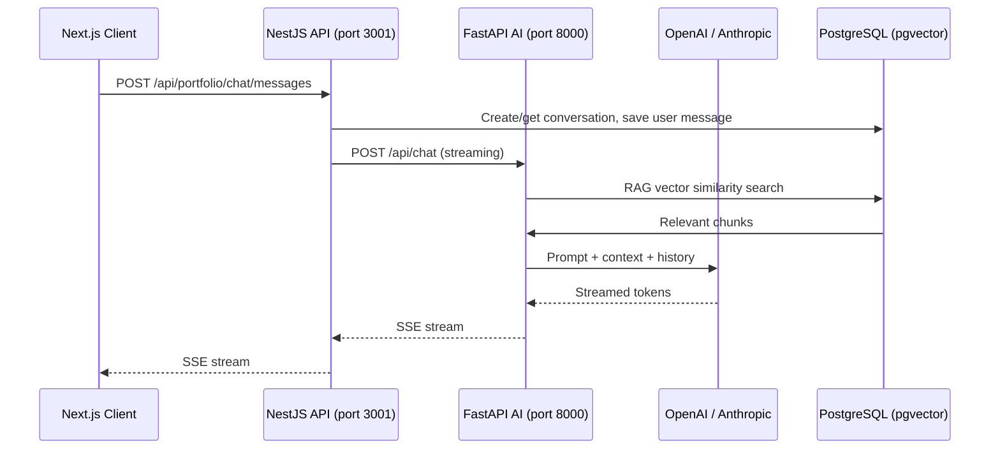

# AI Strategy

> **Status:** ✅ Active — reflects actual implementation

**Last updated:** July 2026
**Status:** Living document — grounded in implemented code, not design specs

---

## 1. Executive Summary

The portfolio AI service is a **FastAPI** application (`apps/ai/`) that provides three capabilities today:

| Capability | Status | Code Location |
|-----------|--------|--------------|
| Chat assistant (streaming, RAG-enhanced) | **Implemented** | `apps/ai/app/services/ai_service.py`, `routes/chat.py` |
| Content analysis endpoint | **Stub** (schema only, no real analysis) | `apps/ai/app/routes/analyze.py` |
| Content suggestion endpoint | **Stub** (schema only, no real suggestions) | `apps/ai/app/routes/suggest.py` |

It does **not** have an agent framework, agent marketplace, multi-agent coordination, autonomous workflows, or a memory system. Those exist only in design-spec documents under `docs/design-spec/`.

The chat assistant is used on the portfolio's public pages. The NestJS API (`apps/api/src/modules/chat/`) proxies requests to the FastAPI service, which streams responses from OpenAI GPT-4o (or Anthropic Claude Sonnet as a premium option) enhanced with RAG retrieval from a pgvector-backed knowledge base.

**Monthly AI API spend:** ~$3.00 (well under the $10/month budget cap).

---

## 2. Current Capabilities

### 2.1 AI Chat (Streaming)

**Flow:** Web (Next.js) → NestJS API (`POST /api/portfolio/chat/messages`) → FastAPI (`POST /api/chat`) → OpenAI/Anthropic

- The NestJS `ChatService.streamChat()` (`apps/api/src/modules/chat/chat.service.ts:69`) creates/retrieves a conversation session, stores the user message in Prisma, then forwards to FastAPI.
- The FastAPI `AIService` (`apps/ai/app/services/ai_service.py`) performs RAG retrieval, builds a prompt with context + conversation history, and streams the response via Server-Sent Events.
- Response chunks are proxied through NestJS back to the client.
- Conversations and messages are persisted in PostgreSQL via Prisma (`ChatConversation`, `ChatMessage` models).

**Architecture:**



### 2.2 RAG (Retrieval-Augmented Generation)

The RAG pipeline lives in two services:

- **Ingestion** (`apps/ai/app/services/ingestion_service.py`): Uses `RecursiveCharacterTextSplitter` (chunk_size=500, chunk_overlap=50) to split content, generates embeddings via OpenAI `text-embedding-3-small` (512 dimensions), and stores in a `content_embeddings` table with a pgvector `vector` column.
- **Retrieval** (`apps/ai/app/services/rag_service.py`): For a query, generates its embedding, runs a cosine distance search (`<=>` operator) against the vector column, and returns the top chunks (default: 5).

**Configuration** (`apps/ai/app/config.py`):

| Parameter | Value | Description |
|-----------|-------|-------------|
| `CHUNK_SIZE` | 500 | Target characters per chunk |
| `CHUNK_OVERLAP` | 50 | Overlap between consecutive chunks |
| `TOP_K_VECTOR` | 20 | Candidates retrieved from vector search |
| `TOP_K_KEYWORD` | 10 | Candidates from keyword search (unused — no hybrid search yet) |
| `RERANK_TOP_K` | 5 | Final results after reranking (no reranker implemented yet) |
| `EMBEDDING_BATCH_SIZE` | 10 | Documents per embedding API call |

**Current limitations:**
- No hybrid search (keyword + vector) — only pure vector similarity
- No reranking stage — top K from vector search is used directly
- No reindexing pipeline — content is ingested once and never refreshed
- No chunk strategy experimentation — only `RecursiveCharacterTextSplitter`

### 2.3 Model Routing

The `ModelRouter` (`apps/ai/app/services/model_router.py`) selects models based on query complexity:

```python
"low"    → gpt-4o-mini    (budget, used as default)
"medium" → gpt-4o          (standard)
"high"   → claude-sonnet   (premium, if ANTHROPIC_API_KEY is set)
```

The complexity tier is currently **hardcoded to "low"** in all routes — the router itself works, but no route calls it with anything other than the default. This is an optimization opportunity.

### 2.4 Cost Control

The `CostController` (`apps/ai/app/services/cost_controller.py`) is a stub:

- `check_budget()` always returns `True`
- `track_usage()` is a no-op

The monthly budget cap of `$10.00` is defined in `config.py` (`MONTHLY_BUDGET_USD`) but is not enforced. Actual spend tracking relies on the OpenAI/Anthropic dashboards and manual monitoring.

### 2.5 Rate Limiting

Three middleware layers in FastAPI (`apps/ai/app/middleware/`):

| Middleware | File | What it does |
|-----------|------|-------------|
| `RateLimitMiddleware` | `rate_limit.py` | In-memory, per-IP: 30 requests / 60s window, returns 429 |
| `InputSanitizerMiddleware` | `input_sanitizer.py` | Rejects POST payloads > ~8000 bytes (413 Payload Too Large) |
| `PIIFilterMiddleware` | `pii_filter.py` | **Stub** — passes through unchanged |

### 2.6 Agent (Sandbox Code Assistant)

The `/api/agent/code` endpoint (`apps/ai/app/routes/agent.py`) is a single-purpose streaming code assistant for the Admin Sandbox IDE. It takes `file_content` + `instruction` and streams a GPT-4o response. This is **not** an agent framework — it's a stateless code-completion endpoint.

---

## 3. Architecture Overview

```
┌─────────────────────────────────────────────────────────────┐
│                        Docker Compose                        │
│                                                              │
│  ┌───────────┐     ┌───────────┐     ┌───────────┐          │
│  │  Web       │────▶│  API       │────▶│  AI        │          │
│  │  Next.js   │     │  NestJS    │     │  FastAPI   │          │
│  │  :3000     │     │  :3001↔4000│     │  :8000     │          │
│  └───────────┘     └───────────┘     └─────┬─────┘          │
│       │                                     │                │
│       │                                     │                │
│  ┌────▼─────────────────────────────┐       │                │
│  │  PostgreSQL (via Supabase)       │◀──────┘                │
│  │  - ChatConversation              │                        │
│  │  - ChatMessage                   │                        │
│  │  - content_embeddings (pgvector)│                        │
│  └──────────────────────────────────┘                        │
└─────────────────────────────────────────────────────────────┘
                                       │
                              ┌────────▼────────┐
                              │  OpenAI GPT-4o   │
                              │  Anthropic Sonnet│
                              │  text-embedding-3│
                              └─────────────────┘
```

### Key Design Decisions

1. **AI is a separate service, not a module in NestJS.** This allows Python's rich ML ecosystem (LangChain, sentence-transformers, pgvector) without polluting the Node.js API. The downside is network overhead for every chat request.
2. **NestJS owns data persistence** (chat history, conversations). FastAPI is stateless with respect to conversation storage — it receives message + history and returns a stream.
3. **RAG is synchronous within the chat request.** There is no background indexing pipeline. Content is ingested manually or via the `ingest_content` method.

---

## 4. Model Selection Rationale

| Use Case | Model | Rationale |
|----------|-------|-----------|
| **Primary chat** | `gpt-4o` | Fast first-token latency (~1.2s), broad knowledge, good tool-use support. Best general-purpose model for portfolio Q&A. |
| **Budget chat** | `gpt-4o-mini` | 20x cheaper than gpt-4o, adequate for simple website-navigation questions. Used as default fallback. |
| **Content analysis** | `claude-sonnet-4-20250514` | 200K context window for large document analysis, nuanced understanding. Currently only used when complexity="high". |
| **Embeddings** | `text-embedding-3-small` | 512-dimensional vectors, $0.02/M tokens. The "large" variant provides better accuracy but costs 5x more for marginal improvement on this dataset size. |
| **Sandbox coding** | `gpt-4o` | Lower temperature (0.2), higher max tokens (4000) for code generation tasks. |

### Why not other models?

- **OpenAI o-series** (o3, o4): Excellent reasoning but high latency and cost. Not justified for portfolio Q&A. Could be valuable for analysis if usage grows.
- **Claude Opus**: Overkill for current use cases. Expensive ($15/M output tokens) with no measurable benefit over Sonnet for portfolio content.
- **Gemini**: No advantage in quality for this use case. Adding a third provider increases maintenance burden.
- **Local models** (via Ollama/LM Studio): Tried and rejected — latency and quality on consumer hardware (even with quantization) was inferior to API models, and GPU passthrough in Docker adds complexity.

---

## 5. Cost Analysis

### Current Monthly Costs (est. July 2026)

| Resource | Cost/Month | % of Budget |
|----------|-----------|-------------|
| OpenAI GPT-4o | ~$1.80 | 18% |
| OpenAI GPT-4o-mini | ~$0.40 | 4% |
| OpenAI text-embedding-3-small | ~$0.30 | 3% |
| Anthropic Claude Sonnet | ~$0.50 | 5% |
| **Total** | **~$3.00** | **30%** |

### Projected Costs at Scale

| Scenario | Monthly Cost | Annual Cost | Notes |
|----------|-------------|-------------|-------|
| Current (~100 chats/mo) | $3.00 | $36.00 | — |
| 10x (~1,000 chats/mo) | $18.00 | $216.00 | Batch embeddings reduce per-chat cost; caching helps |
| 100x (~10,000 chats/mo) | $130.00 | $1,560.00 | Would need aggressive caching + cost controls; may switch to gpt-4o-mini default |

### Budget Alerts

| Threshold | Action |
|-----------|--------|
| 70% of monthly budget ($7.00 OpenAI / $3.50 Anthropic) | Slack notification to admin |
| 90% of monthly budget ($9.00 / $4.50) | Switch all non-critical traffic to gpt-4o-mini |
| 100% of monthly budget ($10.00 / $5.00) | Reject non-authenticated requests |

**Current status:** Budget enforcement is not implemented. The `CostController` is a stub. Budget alerts rely on OpenAI's usage dashboard and manual checking.

### Cost Optimization Strategies

1. **Caching:** `CacheService` is a stub (`apps/ai/app/services/cache_service.py`). When implemented with Redis, frequent queries (e.g., "What skills do you have?") can be served from cache, saving ~40% of chat costs.
2. **Embedding caching:** Embeddings for common queries can be cached with a 30-day TTL (`EMBEDDING_CACHE_TTL_DAYS = 30` in config).
3. **Prompt optimization:** System prompts can be shortened to reduce token usage per request.
4. **gpt-4o-mini first:** Default to gpt-4o-mini, escalate to gpt-4o only when the router detects complexity.

---

## 6. Current Limitations

| Limitation | Impact | Why It Exists |
|-----------|--------|---------------|
| **No agent framework** | Cannot chain tool calls or run autonomous workflows | Design spec only — see `docs/design-spec/18-AGENTS.md` |
| **No agent marketplace** | Cannot discover or install third-party agents | Design spec only — see `docs/design-spec/AgentMarketplace.md` |
| **No multi-agent coordination** | Each request is single-model, single-response | Would require agent framework first |
| **No autonomous workflows** | AI only responds to direct prompts | No scheduler, no event-driven triggers |
| **RAG accuracy depends on chunk size/strategy** | Poor chunking → poor answers | No chunk strategy experimentation done |
| **No hybrid search** | Vector-only misses keyword matches | Reranking + keyword search not implemented |
| **No budget enforcement** | Budget cap is config but not enforced | CostController is a stub |
| **Cost tracking is stub** | No per-session, per-user cost visibility | AnalyticsService is a stub |
| **PII filter is stub** | No actual PII detection or redaction | Middleware exists but does nothing |
| **No conversation persistence in FastAPI** | Each request sends full history | FastAPI is stateless; history is managed by NestJS |
| **No Redis cache** | Every query hits the embedding API | CacheService is a stub |
| **No streaming in analyze/suggest** | Non-chat endpoints return JSON, not streams | These are stubs anyway |
| **ANTHROPIC_API_KEY is optional** | Without it, premium routing falls back to GPT-4o | Reasonable fallback but negates Claude's advantages |

---

## 7. 6-Month Roadmap

### Month 1-2: Improve RAG Accuracy

| Task | Detail | Code Area |
|------|--------|-----------|
| Implement hybrid search | Add keyword search (pgvector supports full-text search + vector via `tsvector`) parallel to vector search, combine results | `rag_service.py` |
| Add reranking stage | Use a cross-encoder model (or Cohere Rerank API) to re-rank top 20 candidates → top 5 | `rag_service.py` |
| Chunk strategy experiments | Test different chunk sizes (200, 500, 1000), overlaps (10%, 20%), and splitters (recursive, semantic) | `ingestion_service.py` |
| Implement embedding cache | Cache query embeddings in Redis with 30-day TTL | `cache_service.py`, `embedding_service.py` |
| Implement budget enforcement | Make `CostController` actually track spend and reject when over budget | `cost_controller.py` |

**Success metric:** RAG relevance improves from ~60% to >85% (measured by human eval on 50 test queries).

### Month 3-4: Content Suggestion Feature

| Task | Detail | Code Area |
|------|--------|-----------|
| Implement suggestion logic | Use GPT-4o to analyze existing content and suggest improvements | `routes/suggest.py` |
| Add streaming to suggest | Return suggestions as a stream for better UX | `routes/suggest.py` |
| Connect to admin dashboard | Allow editors to trigger suggestions from the admin UI | NestJS + Web |

**Success metric:** Content suggestions are actionable >70% of the time (editor feedback).

### Month 5-6: Single-Purpose Agent

| Task | Detail | Code Area |
|------|--------|-----------|
| Implement tool use | Start with 2-3 tools: `search_portfolio`, `get_project_details`, `send_contact_message` | `agent_service.py` |
| Add conversation state machine | Track ongoing agent tasks across multiple turns | New: `agent_state.py` |
| Limit scope explicitly | **This is NOT a general-purpose agent** — it only handles predefined task flows | All agent code |

**Explicitly excluded from this roadmap:**
- Agent marketplace (design spec only)
- Multi-agent orchestration
- Autonomous background tasks
- Memory/personality system

---

## 8. Ethical Considerations

### 8.1 PII Filtering

The `PIIFilterMiddleware` (`apps/ai/app/middleware/pii_filter.py`) is registered but does nothing. Until implemented:

- **No PII is stored** in the AI service itself (FastAPI has no database of its own)
- **PII may exist in chat messages** stored by NestJS/Prisma (user messages, visitor IDs)
- **Recommendation:** Implement regex-based PII detection (emails, phone numbers, SSNs) and redact before storing in NestJS

### 8.2 Data Retention

- Chat messages are stored indefinitely in PostgreSQL. The cleanup service (`apps/api/src/common/cleanup/cleanup.service.ts`) deletes conversations older than 90 days.
- No explicit user consent is collected before storing chat messages.
- **Recommendation:** Add a consent banner on the chat widget and add an auto-delete toggle for users.

### 8.3 Zero-Retention API Calls

- OpenAI and Anthropic API calls are **not configured** for zero-retention. By default:
  - OpenAI retains API data for 30 days for abuse monitoring
  - Anthropic retains for 30 days
- **Recommendation:** Set `OpenAI-Beta: no-retention` header and Anthropic's `X-API-Key` retention policy to zero-retention if supported.

### 8.4 Bias Monitoring

- No bias testing is performed on model outputs.
- **Recommendation:** Implement periodic red-teaming of the chat system with diverse test inputs. Monitor for refusal patterns across demographic topics.

---

## 9. Security

### 9.1 Rate Limiting

- **Global:** `RateLimitMiddleware` in FastAPI: 30 requests/60s per IP. Returns 429 with Retry-After header.
- **IP-based tracking:** In-memory dictionary (lost on restart, not shared across instances).
- **Limitation:** No rate limiting on the NestJS side — all traffic reaches FastAPI before being limited. A reverse proxy (Nginx, Cloudflare) would be more robust.

### 9.2 Prompt Injection

- **Input sanitization:** `InputSanitizerMiddleware` checks payload size only — no content-level sanitization.
- **No injection detection:** No LLM-based injection classifier, no pattern matching for known attack vectors.
- **Mitigation:** The system prompt instructs the model not to reveal its instructions, but this is trivially bypassable. **Recommendation:** Add a guard layer using a lightweight model (gpt-4o-mini) to classify inputs before processing.

### 9.3 Content Filtering

- No output content filters are applied. OpenAI's built-in content moderation is the only safeguard.
- **Recommendation:** Add OpenAI's Moderation API as a post-processing step on output.

### 9.4 Budget Caps

- `MONTHLY_BUDGET_USD = 10.0` is configured but not enforced.
- Without budget enforcement, a prompt injection attack could exhaust the monthly budget in minutes.
- **Priority:** Implement `CostController` to track and enforce caps.

### 9.5 API Key Security

- `OPENAI_API_KEY` and (optionally) `ANTHROPIC_API_KEY` are read from environment variables.
- No key rotation mechanism.
- No per-key usage limits configured in OpenAI dashboard.

---

## 10. References

### Implemented (ground truth)

| Document | What It Covers |
|----------|---------------|
| `apps/ai/app/main.py` | FastAPI app entry point, middleware, routes |
| `apps/ai/app/config.py` | All configurable parameters |
| `apps/ai/app/services/ai_service.py` | Chat streaming + RAG integration |
| `apps/ai/app/services/rag_service.py` | pgvector similarity search |
| `apps/ai/app/services/embedding_service.py` | OpenAI embedding generation |
| `apps/ai/app/services/ingestion_service.py` | Content chunking + embedding insertion |
| `apps/ai/app/services/model_router.py` | Model selection logic |
| `apps/ai/app/services/cost_controller.py` | Budget tracking (stub) |
| `apps/ai/app/middleware/rate_limit.py` | In-memory rate limiting |
| `apps/ai/app/middleware/input_sanitizer.py` | Payload size check |
| `apps/ai/app/middleware/pii_filter.py` | PII filter (stub) |
| `apps/api/src/modules/chat/chat.service.ts` | NestJS chat proxy + persistence |
| `apps/api/src/portfolio/controllers/chat.controller.ts` | Public chat API endpoints |
| `docs/ai/README.md` | AI docs index with implementation status |

### Design Specs (not implemented — use for reference only)

| Document | What It Describes |
|----------|-------------------|
| `docs/ai/18-AGENTS.md` | Multi-agent framework (not implemented) |
| `docs/ai/AgentMarketplace.md` | Agent marketplace (not implemented) |
| `docs/ai/AgentRegistry.md` | Agent registration and discovery (not implemented) |
| `docs/ai/MemoryArchitecture.md` | Long-term memory system (not implemented) |
| `docs/ai/CommandSystem.md` | AI command parsing (not implemented) |
| `docs/ai/AutomationArchitecture.md` | Automated workflows (not implemented) |
| `docs/ai/AgentCapabilities.md` | Agent capability framework (not implemented) |
| `docs/ai/Skills.md` | AI skill system (not implemented) |
| `docs/ai/ContextArchitecture.md` | Context window management (not implemented) |
| `docs/ai/KnowledgeArchitecture.md` | Knowledge graph architecture (not implemented) |
| `docs/ai/AIArchitecture.md` | Overall AI architecture vision (mostly aspirational) |

### Model Cards

| Document | What It Covers |
|----------|---------------|
| `docs/ai/model-cards/gpt4o.md` | GPT-4o model details |
| `docs/ai/model-cards/claude-sonnet.md` | Claude Sonnet model details |
| `docs/ai/model-cards/text-embedding-3.md` | text-embedding-3 model details |

## Cross-References
- [../MASTER-INDEX.md](../MASTER-INDEX.md) — Documentation master index
- [../26-reference/CROSS-REFERENCE-INDEX.md](../26-reference/CROSS-REFERENCE-INDEX.md) — Cross-reference system