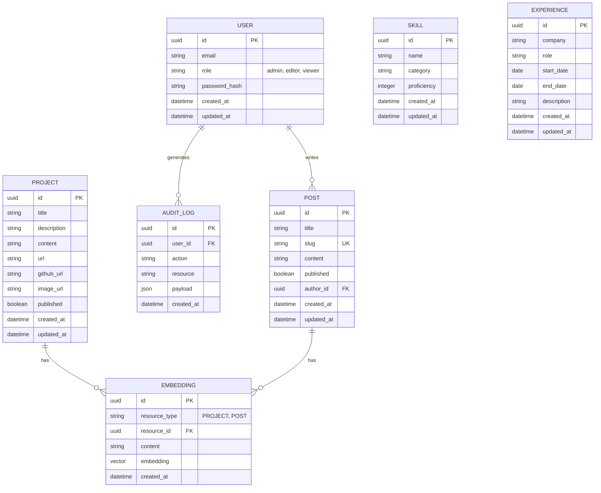

# Database Schema & ERD — FAANG Enterprise Data Model

> **Document:** `DatabaseSchema.md` | **Version:** 5.0 (Enterprise Upgrade) | **Last Updated:** July 2026  
> **Status:** ✅ Active | **Owner:** Principal Database Architect | **Review Cadence:** Quarterly

## 1. Executive Summary
This document visualizes the complete FAANG-level database schema for the portfolio project. It leverages Supabase PostgreSQL 15 and pgvector to support multi-LLM semantic search alongside strict role-based access control.

## 2. Mermaid ERD

## Description of Relationships

- **User & Post**: A User (Admin/Editor) can author multiple Blog Posts (1:N).
- **Project/Post & Embedding**: Each Project or Post is broken down into chunks and vectorized by the AI Service. These embeddings are stored in the `Embedding` table with a polymorphic association (`resource_type` and `resource_id`) (1:N).
- **User & Audit Log**: Administrative actions performed by users are recorded in the Audit Log for security tracking (1:N).
