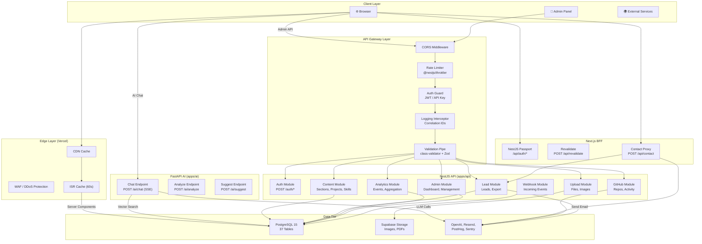
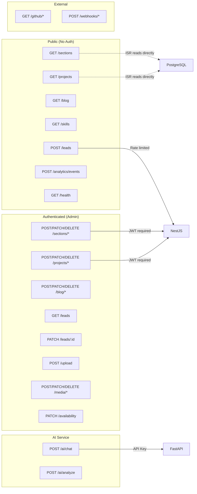
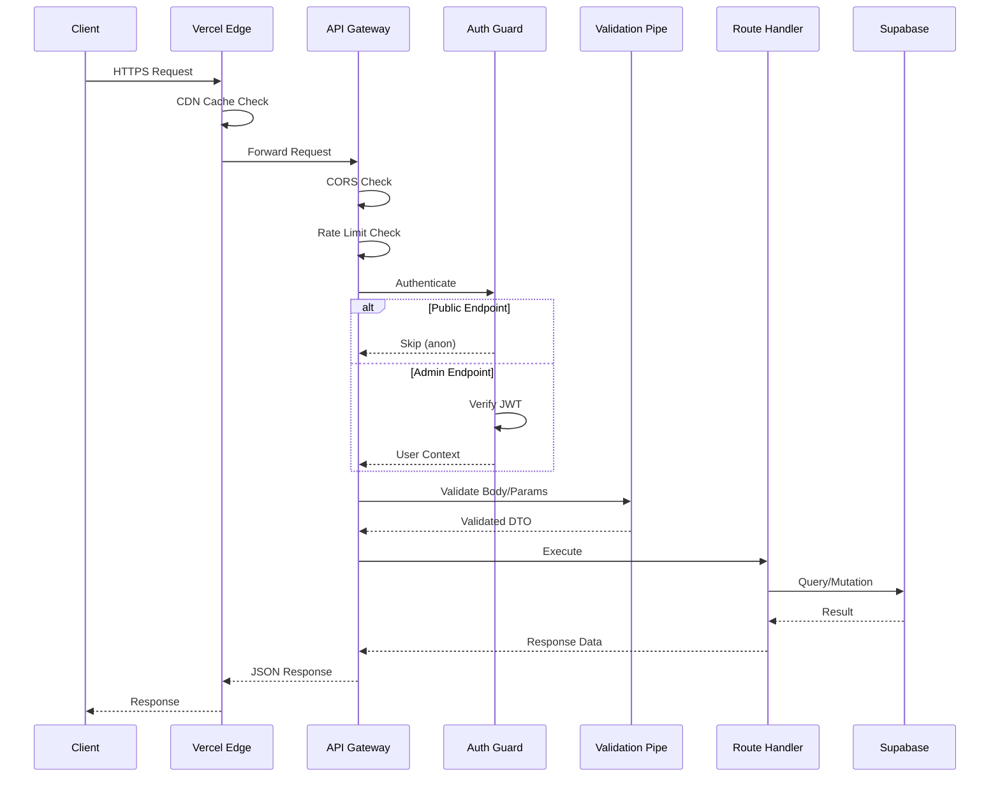
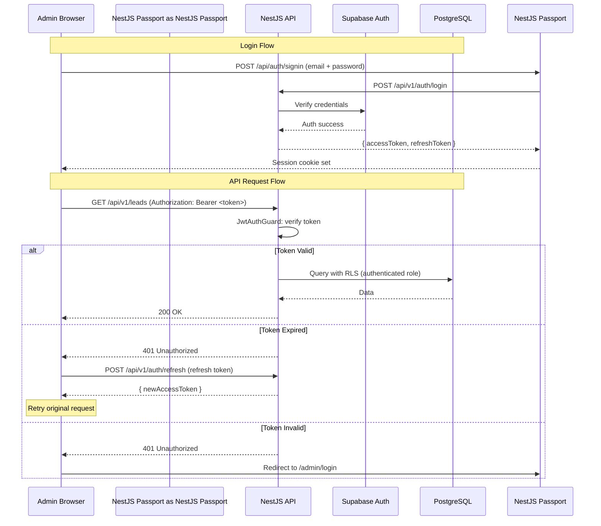

# API Architecture Document — Enterprise-Grade API Platform

> **Document:** `12-API.md` | **Version:** 4.0 | **Last Updated:** June 2026  
> **Status:** ✅ Active | **Owner:** Principal API Architect | **Review Cadence:** Quarterly  
> **Classification:** Enterprise Architecture | **API Style:** RESTful + SSE Streaming  
> **Framework:** NestJS 10 (Primary) + FastAPI (AI) + Next.js 14 (BFF)

---

## Executive Summary

Defines the complete API surface for the portfolio platform: RESTful endpoints for public portfolio, admin CMS, lead management, AI chat, and analytics. Covers 50+ endpoints across 10 controllers with request/response schemas, authentication (JWT + API keys), rate limiting, error handling, pagination patterns, WebSocket streaming for AI chat, and OpenAPI 3.0 documentation.

---

## Table of Contents

1. [API Vision & Principles](#1-api-vision--principles)
2. [API Standards](#2-api-standards)
3. [API Architecture](#3-api-architecture)
4. [Authentication Strategy](#4-authentication-strategy)
5. [Authorization Strategy](#5-authorization-strategy)
6. [Versioning Strategy](#6-versioning-strategy)
7. [Error Handling Strategy](#7-error-handling-strategy)
8. [Rate Limiting Strategy](#8-rate-limiting-strategy)
9. [API Security Standards](#9-api-security-standards)
10. [Auth API Endpoints](#10-auth-api-endpoints)
11. [Portfolio Content API Endpoints](#11-portfolio-content-api-endpoints)
12. [Projects API Endpoints](#12-projects-api-endpoints)
13. [Case Study API Endpoints](#13-case-study-api-endpoints)
14. [Blog API Endpoints](#14-blog-api-endpoints)
15. [Skills & Experience API Endpoints](#15-skills--experience-api-endpoints)
16. [Testimonial & Social Proof API Endpoints](#16-testimonial--social-proof-api-endpoints)
17. [Lead API Endpoints](#17-lead-api-endpoints)
18. [Analytics API Endpoints](#18-analytics-api-endpoints)
19. [Admin API Endpoints](#19-admin-api-endpoints)
20. [AI API Endpoints](#20-ai-api-endpoints)
21. [GitHub API Endpoints](#21-github-api-endpoints)
22. [CMS API Endpoints](#22-cms-api-endpoints)
23. [Availability API Endpoints](#23-availability-api-endpoints)
24. [Media & Upload API Endpoints](#24-media--upload-api-endpoints)
25. [Webhook API Endpoints](#25-webhook-api-endpoints)
26. [Health & Monitoring Endpoints](#26-health--monitoring-endpoints)
27. [API Performance Budgets & SLAs](#27-api-performance-budgets--slas)
28. [API Change Log](#28-api-change-log)

---

## 1. API Vision & Principles

### 1.1 North Star

The API platform serves as the **backbone of all data operations** across the portfolio ecosystem. Designed with enterprise-grade rigor while operating entirely within free-tier limits, it provides three API surfaces — NestJS (primary REST API), FastAPI (AI microservice), and Next.js (BFF for SSR/ISR) — that collectively power all portfolio features with consistent security, error handling, and performance guarantees.

### 1.2 Design Principles

| # | Principle | Rationale | Violation Penalty |
|---|-----------|-----------|-------------------|
| P1 | **RESTful by default** | Standard HTTP methods, resource-based URLs, stateless | Must fix before deployment |
| P2 | **Defense in depth** | Auth at every layer: API gateway → guard → RLS | Security vulnerability |
| P3 | **Fail closed** | Deny access unless explicitly permitted | Data breach risk |
| P4 | **Explicit validation** | All inputs validated at boundary with clear error messages | Data corruption risk |
| P5 | **Idempotent mutations** | Safe methods (GET, PUT, DELETE) are idempotent | Unexpected side effects |
| P6 | **Consistent error format** | Every error follows `{ error, message, statusCode, details }` | Debugging difficulty |
| P7 | **Correlation everywhere** | Every request gets a correlation ID for tracing | Debugging difficulty |
| P8 | **Versioned from day one** | All public APIs have a versioning strategy | Breaking change disasters |
| P9 | **Documented by default** | OpenAPI/Swagger for all endpoints | Integration friction |
| P10 | **Rate limited at edge** | Every endpoint has appropriate rate limiting | Abuse vulnerability |

### 1.3 API Surface Overview

| Surface | Framework | Base URL | Primary Role | Auth Method | Deploy Target |
|---------|-----------|----------|--------------|-------------|---------------|
| **NestJS Primary API** | NestJS 10 | `/api/v1` | CRUD for all portfolio content, leads, analytics | JWT Bearer Token | Vercel (Serverless) |
| **FastAPI AI Service** | FastAPI | `/api/v1/ai` | AI chat, content analysis, suggestions | API Key + JWT | Railway (Container) |
| **Next.js BFF** | Next.js 14 | `/api` | Auth (NestJS Passport), ISR revalidation, SSR data fetch | NestJS Passport Session | Vercel (Edge) |
| **Supabase Direct** | Supabase JS SDK | Direct | ISR server component reads (public data only) | Supabase anon key | Vercel (Edge) |

### 1.3 Key Metrics

| Metric | Target | Measurement |
|--------|--------|-------------|
| API GET p95 response | < 100ms | Sentry Tracing |
| API POST p95 response | < 200ms | Sentry Tracing |
| AI Chat p95 response | < 3s | Custom logging |
| Error rate (all endpoints) | < 0.1% | Sentry |
| API availability | 99.9% | Uptime Robot |
| Endpoints documented | 100% | Swagger UI |
| Auth check latency | < 5ms | Sentry Tracing |

---

## 2. API Standards

### 2.1 Naming Conventions

| Element | Convention | Example | Rule |
|---------|-----------|---------|------|
| Base URL | `/api/v{version}/{resource}` | `/api/v1/projects` | Versioned, lowercase |
| Resource names | Plural nouns | `/leads`, `/projects` | RESTful convention |
| Resource IDs | UUID path param | `/leads/{id}` | Always UUID v4 |
| Query params | `snake_case` | `?page=1&per_page=20` | Consistent with DB |
| Request body | `camelCase` JSON | `{ "displayName": "John" }` | JS/TS convention |
| Response body | `camelCase` JSON | `{ "createdAt": "..." }` | JS/TS convention |
| Headers | `Pascal-Case` | `X-Correlation-ID` | HTTP standard |
| Status codes | Standard HTTP | `200`, `201`, `400`, `401`, `404` | RFC 7231 |

### 2.2 HTTP Methods & Semantics

| Method | Semantics | Idempotent | Safe | Body | Response |
|--------|-----------|------------|------|------|----------|
| `GET` | Retrieve resource(s) | ✅ | ✅ | No | `200 OK` |
| `POST` | Create resource | ❌ | ❌ | Yes | `201 Created` |
| `PUT` | Full replace | ✅ | ❌ | Yes | `200 OK` |
| `PATCH` | Partial update | ❌ | ❌ | Yes | `200 OK` |
| `DELETE` | Remove resource | ✅ | ❌ | No | `204 No Content` |

### 2.3 Request Headers

| Header | Required | Description | Example |
|--------|----------|-------------|---------|
| `Authorization` | For auth endpoints | Bearer JWT token | `Bearer eyJhbGci...` |
| `Content-Type` | For POST/PUT/PATCH | Request body format | `application/json` |
| `Accept` | Optional | Response format preference | `application/json` |
| `X-Correlation-ID` | Recommended | Request tracing ID | `uuid-v4-string` |
| `X-API-Key` | For service-to-service | Service API key | `sk_live_abc123...` |
| `User-Agent` | Recommended | Client identifier | `PortfolioWeb/1.0` |
| `Idempotency-Key` | For POST payments | Idempotency key | `uuid-v4-string` |

### 2.4 Response Headers

| Header | Description | Example |
|--------|-------------|---------|
| `X-Correlation-ID` | Echoes request correlation ID | `uuid-v4-string` |
| `X-RateLimit-Limit` | Max requests per window | `100` |
| `X-RateLimit-Remaining` | Remaining requests in window | `85` |
| `X-RateLimit-Reset` | Window reset timestamp (Unix) | `1718467200` |
| `Retry-After` | Seconds to wait before retry (429) | `900` |
| `Deprecation` | API version deprecation notice | `true` |
| `Sunset` | When deprecated version will be removed | `Sat, 01 Jan 2027 00:00:00 GMT` |

### 2.5 Pagination

```json
{
  "data": [...],
  "meta": {
    "page": 1,
    "perPage": 20,
    "total": 156,
    "totalPages": 8,
    "hasNextPage": true,
    "hasPreviousPage": false
  }
}
```

| Parameter | Type | Default | Max | Description |
|-----------|------|---------|-----|-------------|
| `page` | integer | 1 | — | Page number (1-indexed) |
| `perPage` | integer | 20 | 100 | Items per page |
| `sort` | string | `created_at` | — | Sort field |
| `order` | enum | `desc` | asc/desc | Sort direction |

### 2.6 Response Envelope

```typescript
// Success (single resource)
{
  "data": { /* Resource object */ },
  "meta": { /* Pagination or metadata (optional) */ }
}

// Success (collection)
{
  "data": [ /* Resource array */ ],
  "meta": {
    "page": 1,
    "perPage": 20,
    "total": 156,
    "totalPages": 8
  }
}

// Error
{
  "error": {
    "code": "VALIDATION_ERROR",
    "message": "Validation failed for request body",
    "statusCode": 400,
    "details": [
      {
        "field": "email",
        "message": "Invalid email format",
        "code": "INVALID_FORMAT"
      }
    ],
    "correlationId": "uuid-v4-string",
    "timestamp": "2026-06-15T10:30:00Z"
  }
}
```

---

## 3. API Architecture

### 3.1 High-Level API Architecture



### 3.2 API Dependency Graph



### 3.3 Middleware Execution Order

```text
Request → 
  1. CORS Middleware (origin validation)
  2. Helmet Middleware (security headers)
  3. Rate Limiter Middleware (tier limits)
  4. Auth Guard (JWT/API Key validation, if required)
  5. Validation Pipe (DTO validation)
  6. Route Handler (business logic)
  7. Logging Interceptor (response timing + correlation ID)
  8. Exception Filter (global error normalization)
  → Response
```

### 3.4 Request Lifecycle



---

## 4. Authentication Strategy

### 4.1 Authentication Methods

| Method | Used For | Token Type | Expiry | Refresh | Status |
|--------|----------|------------|--------|---------|--------|
| **JWT Bearer Token** | NestJS Admin API | `access_token` (JWT) | 15 minutes | 7-day refresh token | ✅ Active |
| **NestJS Passport Session** | Next.js Admin Pages | HTTP-only session cookie | 24 hours / 30 days | Automatic via NestJS Passport | ✅ Active |
| **API Key** | Service-to-service (AI) | `X-API-Key` header | Fixed (keys rotated quarterly) | Manual rotation | ✅ Active |
| **Supabase Anon Key** | Public ISR reads | `apikey` header | Permanent (public) | None required | ✅ Active |
| **OAuth 2.0** | Admin login (Google, GitHub) | Authorization code flow | Per JWT session | Auto-refresh | ✅ Active |

### 4.2 JWT Token Structure

```typescript
// Access Token (15 min expiry)
{
  "sub": "uuid-of-user",
  "email": "admin@portfolio.com",
  "role": "admin",
  "iat": 1718467200,
  "exp": 1718468100,
  "iss": "portfolio-api",
  "aud": "portfolio-admin"
}

// Refresh Token (7 day expiry)
{
  "sub": "uuid-of-user",
  "type": "refresh",
  "iat": 1718467200,
  "exp": 1719072000,
  "iss": "portfolio-api",
  "jti": "unique-token-id"
}
```

### 4.3 Authentication Flow



### 4.4 Token Refresh Flow

```typescript
// Client interceptor pattern
async function apiRequest(url: string, options: RequestInit = {}) {
  let response = await fetch(url, {
    ...options,
    headers: {
      ...options.headers,
      'Authorization': `Bearer ${getAccessToken()}`,
    },
  });

  if (response.status === 401) {
    // Attempt refresh
    const refreshResponse = await fetch('/api/v1/auth/refresh', {
      method: 'POST',
      headers: { 'Content-Type': 'application/json' },
      body: JSON.stringify({ refreshToken: getRefreshToken() }),
    });

    if (refreshResponse.ok) {
      const { accessToken } = await refreshResponse.json();
      setAccessToken(accessToken);
      // Retry original request
      response = await fetch(url, {
        ...options,
        headers: { ...options.headers, 'Authorization': `Bearer ${accessToken}` },
      });
    } else {
      // Redirect to login
      window.location.href = '/admin/login';
    }
  }

  return response;
}
```

### 4.5 Environment Variables

```bash
# Auth Configuration
JWT_SECRET=<random-64-char-string>
JWT_EXPIRY=900              # 15 minutes in seconds
JWT_REFRESH_EXPIRY=604800   # 7 days in seconds
NEXTAUTH_SECRET=<random-32-char-string>
NEXTAUTH_URL=https://portfolioowner.com

# OAuth Providers
GOOGLE_CLIENT_ID=<google-oauth-client-id>
GOOGLE_CLIENT_SECRET=<google-oauth-client-secret>
GITHUB_CLIENT_ID=<github-oauth-client-id>
GITHUB_CLIENT_SECRET=<github-oauth-client-secret>

# Supabase Auth
NEXT_PUBLIC_SUPABASE_URL=<supabase-project-url>
NEXT_PUBLIC_SUPABASE_ANON_KEY=<supabase-anon-key>
SUPABASE_SERVICE_ROLE_KEY=<supabase-service-role-key>
```

---

## 5. Authorization Strategy

### 5.1 Role-Based Access Control (RBAC)

| Role | Permissions | Access Scope | Assigned To |
|------|-------------|-------------|-------------|
| `admin` | Full CRUD on all resources | All endpoints | Portfolio owner |
| `editor` | CRUD on content only (no system settings) | Content endpoints | Future use |
| `viewer` | Read-only access to analytics | Analytics endpoints | Future use |
| `anon` | Public read + limited insert | Public endpoints | All visitors |

### 5.2 Authorization Enforcement Points

| Layer | Technology | What It Protects | Bypass Risk |
|-------|-----------|-----------------|-------------|
| **API Gateway** | NestJS `JwtAuthGuard` | All admin endpoints | Low (token verification) |
| **API Gateway** | NestJS `RolesGuard` | Role-specific endpoints | Low (role claim in JWT) |
| **Route Handler** | Custom permission check | Resource-level access | Low (explicit checks) |
| **Database** | Supabase RLS | Row-level access | Very Low (DB-level) |
| **Frontend** | Next.js middleware | Route access | Medium (client-side) |

### 5.3 Guard Implementation Pattern

```typescript
// JWT Auth Guard (@UseGuards(JwtAuthGuard))
@Injectable()
export class JwtAuthGuard extends AuthGuard('jwt') {
  handleRequest(err: any, user: any, info: any) {
    if (err || !user) {
      throw new UnauthorizedException({
        code: 'UNAUTHORIZED',
        message: 'Invalid or expired token',
        statusCode: 401,
      });
    }
    return user;
  }
}

// Roles Guard (@UseGuards(RolesGuard))
@Injectable()
export class RolesGuard implements CanActivate {
  constructor(private readonly allowedRoles: string[]) {}

  canActivate(context: ExecutionContext): boolean {
    const request = context.switchToHttp().getRequest();
    const user = request.user;
    return this.allowedRoles.includes(user.role);
  }
}

// Combined usage
@UseGuards(JwtAuthGuard)
@UseGuards(new RolesGuard(['admin']))
@Post('projects')
async createProject(@Body() dto: CreateProjectDto) { ... }
```

### 5.4 Permission Matrix

| Resource | Action | anon | admin | editor | viewer |
|----------|--------|------|-------|--------|--------|
| Sections | Create | ❌ | ✅ | ✅ | ❌ |
| Sections | Read (live) | ✅ | ✅ | ✅ | ✅ |
| Sections | Read (all) | ❌ | ✅ | ✅ | ❌ |
| Sections | Update | ❌ | ✅ | ✅ | ❌ |
| Sections | Delete | ❌ | ✅ | ❌ | ❌ |
| Projects | Create | ❌ | ✅ | ✅ | ❌ |
| Projects | Read (public) | ✅ | ✅ | ✅ | ✅ |
| Projects | Read (private) | ❌ | ✅ | ✅ | ❌ |
| Projects | Update | ❌ | ✅ | ✅ | ❌ |
| Projects | Delete | ❌ | ✅ | ❌ | ❌ |
| Leads | Insert | ✅ | ✅ | ❌ | ❌ |
| Leads | Read | ❌ | ✅ | ❌ | ❌ |
| Leads | Update status | ❌ | ✅ | ❌ | ❌ |
| Analytics | Insert events | ✅ | ✅ | ❌ | ❌ |
| Analytics | Read dashboard | ❌ | ✅ | ❌ | ✅ |
| Media | Upload | ❌ | ✅ | ✅ | ❌ |
| Media | Read (public) | ✅ | ✅ | ✅ | ✅ |
| Settings | Read | ❌ | ✅ | ❌ | ❌ |
| Settings | Update | ❌ | ✅ | ❌ | ❌ |
| AI Chat | Send message | ✅ | ✅ | ❌ | ❌ |
| AI Chat | View history | ❌ | ✅ | ❌ | ❌ |

---

## 6. Versioning Strategy

### 6.1 Versioning Scheme

```text
/api/v{major}/{resource}
```

| Component | Method | Value | Description |
|-----------|--------|-------|-------------|
| **Prefix** | URL path | `/api/v1/` | Major version in URL path |
| **Current** | Header | `v1` | Implicit (no prefix = v1) |
| **Deprecation** | Response header | `Deprecation: true` | Header signals upcoming removal |
| **Sunset** | Response header | `Sunset: Sat, 01 Jan 2027` | Header signals removal date |
| **Migration** | Documentation | Changelog per version | Migration guide per breaking change |

### 6.2 Version Lifecycle

| Phase | Duration | Behavior | Developer Communication |
|-------|----------|----------|------------------------|
| **Active** | 12+ months | Full support, all features | Documented in current API docs |
| **Deprecated** | 6 months | `Deprecation: true` header added | Blog post + email notification |
| **Sunset** | — | Returns `410 Gone` | `Sunset` header + migration guide URL |
| **Removed** | — | Returns `404 Not Found` | N/A |

### 6.3 Breaking Changes Policy

| Change Type | Breaking? | Version Bump | Migration Guide Required |
|-------------|-----------|-------------|-------------------------|
| Add endpoint | ❌ | Minor | ❌ |
| Add optional field to response | ❌ | Minor | ❌ |
| Add required field to request | ✅ | Major | ✅ |
| Remove endpoint | ✅ | Major | ✅ |
| Remove response field | ✅ | Major | ✅ |
| Rename field | ✅ | Major | ✅ |
| Change field type | ✅ | Major | ✅ |
| Change error format | ✅ | Major | ✅ |
| Change auth method | ✅ | Major | ✅ |
| Change rate limit (reducing) | ⚠️ (non-breaking but notice) | Minor | ❌ (but notice given) |

---

## 7. Error Handling Strategy

### 7.1 Standard Error Response

```json
{
  "error": {
    "code": "ERROR_CODE",
    "message": "Human-readable error description",
    "statusCode": 400,
    "details": [
      {
        "field": "email",
        "message": "Specific validation error",
        "code": "INVALID_FORMAT"
      }
    ],
    "correlationId": "a1b2c3d4-e5f6-7890-abcd-ef1234567890",
    "timestamp": "2026-06-15T10:30:00.000Z",
    "docs": "https://docs.portfolioowner.com/api/errors#VALIDATION_ERROR"
  }
}
```

### 7.2 Complete Error Catalog

| HTTP Code | Error Code | Message | Cause | Recovery |
|-----------|------------|---------|-------|----------|
| **400** | `VALIDATION_ERROR` | Validation failed for request body | Invalid field format, missing required field, constraint violation | Fix based on `details` array |
| **400** | `INVALID_REQUEST_BODY` | Request body must be valid JSON | Malformed JSON, unexpected token | Check body syntax |
| **400** | `INVALID_QUERY_PARAM` | Invalid query parameter | Bad pagination, invalid sort field | Check parameter constraints |
| **401** | `UNAUTHORIZED` | Missing or invalid authentication | No JWT token, expired token, invalid signature | Refresh token or re-login |
| **401** | `TOKEN_EXPIRED` | Access token has expired | Token lifetime exceeded | Use refresh token |
| **401** | `INVALID_API_KEY` | Invalid API key | Wrong key format, revoked key | Check API key configuration |
| **403** | `FORBIDDEN` | Insufficient permissions | Role doesn't have access to resource | Contact admin |
| **403** | `IP_BLOCKED` | IP address not allowed | IP outside allowed ranges | Use allowed network |
| **404** | `NOT_FOUND` | Resource not found | Invalid ID/slug, deleted resource | Check resource identifier |
| **404** | `ROUTE_NOT_FOUND` | API route does not exist | Wrong URL, wrong version | Check endpoint path |
| **409** | `CONFLICT` | Resource already exists | Duplicate slug, duplicate email | Use unique value |
| **409** | `VERSION_CONFLICT` | Resource was modified by another request | Stale `updated_at` check | Re-fetch and retry |
| **410** | `GONE` | API version is sunset | Deprecated version still in use | Migrate to new version |
| **422** | `UNPROCESSABLE_ENTITY` | Request body semantically invalid | Logic constraint (e.g., end_date before start_date) | Fix entity logic |
| **429** | `RATE_LIMIT_EXCEEDED` | Too many requests | Rate limit threshold crossed | Wait `Retry-After` seconds |
| **500** | `INTERNAL_ERROR` | An unexpected error occurred | Server exception, database error | Retry; contact support if persists |
| **502** | `BAD_GATEWAY` | Upstream service failed | External API failure (OpenAI, Resend) | Retry with backoff |
| **503** | `SERVICE_UNAVAILABLE` | Service temporarily unavailable | Maintenance, overload | Retry with exponential backoff |

### 7.3 Global Exception Filter (NestJS)

```typescript
@Catch()
export class GlobalExceptionFilter implements ExceptionFilter {
  catch(exception: unknown, host: ArgumentsHost) {
    const ctx = host.switchToHttp();
    const response = ctx.getResponse<Response>();
    const request = ctx.getRequest<Request>();
    
    const correlationId = request.headers['x-correlation-id'] 
      || generateCorrelationId();

    let status = 500;
    let code = 'INTERNAL_ERROR';
    let message = 'An unexpected error occurred';
    let details: any[] = [];

    if (exception instanceof HttpException) {
      status = exception.getStatus();
      const res = exception.getResponse() as any;
      code = res.code || this.mapStatusToCode(status);
      message = res.message || exception.message;
      details = res.details || [];
    }

    if (exception instanceof ValidationException) {
      status = 400;
      code = 'VALIDATION_ERROR';
      message = 'Validation failed';
      details = exception.errors;
    }

    // Log to Sentry
    Sentry.captureException(exception, {
      extra: { correlationId, path: request.url, method: request.method },
    });

    response.status(status).json({
      error: {
        code,
        message,
        statusCode: status,
        details,
        correlationId,
        timestamp: new Date().toISOString(),
      },
    });
  }

  private mapStatusToCode(status: number): string {
    const map: Record<number, string> = {
      400: 'VALIDATION_ERROR',
      401: 'UNAUTHORIZED',
      403: 'FORBIDDEN',
      404: 'NOT_FOUND',
      409: 'CONFLICT',
      410: 'GONE',
      422: 'UNPROCESSABLE_ENTITY',
      429: 'RATE_LIMIT_EXCEEDED',
      500: 'INTERNAL_ERROR',
      502: 'BAD_GATEWAY',
      503: 'SERVICE_UNAVAILABLE',
    };
    return map[status] || 'INTERNAL_ERROR';
  }
}
```

### 7.4 Validation Error Detail Format

```json
// Field-level validation errors
{
  "field": "email",
  "message": "Email must be a valid email address",
  "code": "INVALID_FORMAT",
  "constraints": {
    "isEmail": "email must be an email",
    "maxLength": "email must be shorter than or equal to 255 characters"
  },
  "value": "invalid-email"
}
```

---

## 8. Rate Limiting Strategy

### 8.1 Rate Limit Tiers

| Tier | Endpoints | Limit | Window | Penalty | Burst |
|------|-----------|-------|--------|---------|-------|
| **🔴 Strict** | Auth (login, register, refresh) | 5 | 15 minutes | 15 min cooldown | 0 |
| **🟡 Medium** | POST /leads, POST /contact | 10 | 15 minutes | 15 min cooldown | 2 |
| **🟢 Low** | POST /analytics/events | 100 | 15 minutes | 15 min cooldown | 10 |
| **🔵 Default** | All public GET endpoints | 100 | 15 minutes | 15 min cooldown | 20 |
| **🟣 Admin** | All authenticated admin endpoints | 1000 | 15 minutes | 15 min cooldown | 50 |
| **⚪ AI Chat** | POST /ai/chat | 20 | Per session | Return hourly | 5 |
| **🔸 GitHub** | GET /github/* | 10 | 1 minute | Respect GitHub API limits | 2 |
| **🔹 Webhook** | POST /webhooks/* | 50 | 1 minute | 1 min cooldown | 10 |

### 8.2 Rate Limit Headers

```http
HTTP/1.1 200 OK
X-RateLimit-Limit: 10
X-RateLimit-Remaining: 8
X-RateLimit-Reset: 1718468100
```

```http
HTTP/1.1 429 Too Many Requests
X-RateLimit-Limit: 10
X-RateLimit-Remaining: 0
X-RateLimit-Reset: 1718468100
Retry-After: 900
Content-Type: application/json

{
  "error": {
    "code": "RATE_LIMIT_EXCEEDED",
    "message": "Too many requests. Please wait 900 seconds before retrying.",
    "statusCode": 429,
    "details": [
      {
        "field": null,
        "message": "Rate limit exceeded for tier: MEDIUM",
        "code": "TIER_LIMIT_EXCEEDED"
      }
    ],
    "correlationId": "a1b2c3d4-e5f6-7890-abcd-ef1234567890",
    "timestamp": "2026-06-15T10:30:00.000Z"
  }
}
```

### 8.3 Rate Limit Implementation

```typescript
// NestJS throttler configuration
import { ThrottlerModule } from '@nestjs/throttler';
import { ThrottlerStorageRedisService } from '@nest-lab/throttler-storage-redis';

@Module({
  imports: [
    ThrottlerModule.forRootAsync({
      useFactory: () => ({
        throttlers: [
          // Default: 100 requests / 15 min
          { name: 'default', ttl: 900000, limit: 100 },
        ],
        storage: process.env.NODE_ENV === 'production'
          ? new ThrottlerStorageRedisService(process.env.REDIS_URL)
          : undefined, // In-memory for dev
      }),
    }),
  ],
})
export class AppModule {}

// Custom tier guards
@Injectable()
export class StrictThrottlerGuard extends ThrottlerGuard {
  protected get limit(): number { return 5; }
  protected get ttl(): number { return 900000; } // 15 min
}

@Injectable()
export class MediumThrottlerGuard extends ThrottlerGuard {
  protected get limit(): number { return 10; }
  protected get ttl(): number { return 900000; } // 15 min
}
```

### 8.4 Rate Limit Key Strategy

| Key Type | Value | Example | Scope |
|----------|-------|---------|-------|
| **IP-based** | Client IP address | `ratelimit:192.168.1.1:leads` | Per visitor |
| **User-based** | Authenticated user ID | `ratelimit:user-uuid:admin` | Per admin |
| **Session-based** | Chat session ID | `ratelimit:session-uuid:chat` | Per AI chat session |
| **API Key-based** | API key prefix | `ratelimit:sk_live:github` | Per service integration |

---

## 9. API Security Standards

### 9.1 OWASP Top 10:2025 Compliance

| Category | Protection | Implementation |
|----------|-----------|----------------|
| **A01: Broken Access Control** | JWT auth + RLS + Role guards | 15-min access tokens, Supabase RLS, NestJS RolesGuard |
| **A02: Cryptographic Failures** | TLS 1.3, bcrypt, secure cookies | HTTPS enforced, bcrypt 12 rounds, httpOnly cookies |
| **A03: Injection** | Parameterized queries + validation | Supabase client (parameterized), class-validator, Zod |
| **A04: Insecure Design** | Security-by-default | All admin routes require auth; no default credentials |
| **A05: Security Misconfiguration** | Security headers + CORS | HSTS, CSP, XFO, X-Content-Type-Options |
| **A06: Vulnerable Components** | Regular audits + Dependabot | Weekly npm audit, Dependabot PRs |
| **A07: Auth Failures** | Account lockout + rate limit | 5-attempt lockout, 15-min cooldown |
| **A08: Data Integrity** | CSRF protection + idempotency | Next.js CSRF tokens, idempotency keys |
| **A09: Logging Failures** | Structured logging + audit trail | Correlation IDs, 30-day retention |
| **A10: SSRF** | URL validation + allowlist | Outbound request domain restriction |

### 9.2 CORS Configuration

```typescript
// NestJS CORS
app.enableCors({
  origin: [
    'https://portfolioowner.com',
    'https://www.portfolioowner.com',
    'http://localhost:3000',
    'http://localhost:3001',
  ],
  methods: ['GET', 'POST', 'PUT', 'PATCH', 'DELETE', 'OPTIONS'],
  allowedHeaders: [
    'Content-Type',
    'Authorization',
    'X-Correlation-ID',
    'X-API-Key',
    'Idempotency-Key',
  ],
  exposedHeaders: [
    'X-RateLimit-Limit',
    'X-RateLimit-Remaining',
    'X-RateLimit-Reset',
    'Deprecation',
    'Sunset',
  ],
  credentials: true,
  maxAge: 86400, // 24 hours preflight cache
});
```

### 9.3 Security Headers

```typescript
// NestJS Helmet configuration
app.use(helmet({
  contentSecurityPolicy: {
    directives: {
      defaultSrc: ["'self'"],
      scriptSrc: ["'self'", "'unsafe-inline'", "'unsafe-eval'", "https://app.posthog.com"],
      styleSrc: ["'self'", "'unsafe-inline'"],
      imgSrc: ["'self'", "data:", "https:", "blob:"],
      connectSrc: ["'self'", "https://*.supabase.co", "wss://*.supabase.co", "https://app.posthog.com", "https://o450000.ingest.us.sentry.io"],
      fontSrc: ["'self'", "data:"],
      objectSrc: ["'none'"],
      mediaSrc: ["'self'"],
      frameSrc: ["'none'"],
    },
  },
  crossOriginEmbedderPolicy: false,
  crossOriginOpenerPolicy: { policy: "same-origin" },
  crossOriginResourcePolicy: { policy: "cross-origin" },
  dnsPrefetchControl: { allow: false },
  frameguard: { action: 'deny' },
  hidePoweredBy: true,
  hsts: { maxAge: 63072000, includeSubDomains: true, preload: true },
  ieNoOpen: true,
  noSniff: true,
  referrerPolicy: { policy: 'strict-origin-when-cross-origin' },
  xssFilter: false, // CSP handles this
}));
```

### 9.4 Input Validation Rules

| Rule | Libraries | Location | Enforcement |
|------|-----------|----------|-------------|
| **Schema validation** | `class-validator` + `class-transformer` | NestJS DTOs | Global ValidationPipe |
| **Type safety** | TypeScript + DTO classes | Compile time | `strict: true` in tsconfig |
| **XSS sanitization** | `dompurify` | Before storage | Sanitize all HTML content |
| **Email validation** | Regex (RFC 5321) | Lead creation | `@IsEmail()` decorator |
| **URL validation** | Regex + `isURL()` | Project URLs | `@IsUrl()` decorator |
| **SQL injection** | Parameterized queries | Supabase client | Never string concatenation |
| **File upload validation** | MIME type + size check | Upload endpoint | Checked before write |
| **IDOR prevention** | User ownership check | Route handlers | Verify user owns resource |

### 9.5 Audit Logging

Every mutation to critical resources is logged:

```typescript
@Injectable()
export class AuditInterceptor implements NestInterceptor {
  intercept(context: ExecutionContext, next: CallHandler): Observable<any> {
    const request = context.switchToHttp().getRequest();
    const method = request.method;
    
    // Only log mutations
    if (!['POST', 'PUT', 'PATCH', 'DELETE'].includes(method)) {
      return next.handle();
    }

    return next.handle().pipe(
      tap((response) => {
        this.auditService.log({
          action: method,
          resourceType: this.getResourceType(request.url),
          resourceId: request.params.id || response?.data?.id,
          actorId: request.user?.sub,
          ipAddress: request.ip,
          correlationId: request.headers['x-correlation-id'],
          details: {
            url: request.url,
            method,
            body: this.sanitizeBody(request.body),
          },
        });
      }),
    );
  }
}
```

### 9.6 API Key Management

```typescript
// API key generation and validation
@Injectable()
export class ApiKeyService {
  async generateKey(name: string, permissions: string[]): Promise<{ key: string; prefix: string }> {
    const rawKey = `sk_live_${crypto.randomBytes(32).toString('hex')}`;
    const hash = crypto.createHash('sha256').update(rawKey).digest('hex');
    const prefix = rawKey.substring(0, 12); // "sk_live_abc1..."
    
    await this.supabase.from('api_keys').insert({
      name,
      key_hash: hash,
      key_prefix: prefix,
      permissions: permissions.join(','),
      is_active: true,
    });
    
    return { key: rawKey, prefix };
  }

  async validate(key: string): Promise<boolean> {
    const hash = crypto.createHash('sha256').update(key).digest('hex');
    const result = await this.supabase
      .from('api_keys')
      .select('id')
      .eq('key_hash', hash)
      .eq('is_active', true)
      .single();
    return !!result.data;
  }
}
```

---

## 10. Auth API Endpoints

### 10.1 Login

**Purpose:** Authenticate admin user with email/password credentials and issue JWT tokens.

| Field | Value |
|-------|-------|
| **Method** | `POST` |
| **Route** | `/api/v1/auth/login` |
| **Authentication** | None |
| **Authorization** | None |
| **Rate Limit Tier** | 🔴 Strict (5/15min) |
| **Idempotent** | No |

**Request:**
```json
{
  "email": "admin@portfolio.com",
  "password": "securePassword123!"
}
```

**Validation Rules:**
- `email`: Valid email format, max 255 chars
- `password`: 8-128 characters, must include uppercase, lowercase, number

**Success Response (200):**
```json
{
  "data": {
    "accessToken": "eyJhbGciOiJIUzI1NiIs...",
    "refreshToken": "eyJhbGciOiJIUzI1NiIs...",
    "expiresIn": 900,
    "tokenType": "Bearer",
    "user": {
      "id": "uuid",
      "email": "admin@portfolio.com",
      "displayName": "Admin",
      "avatarUrl": "https://...",
      "role": "admin"
    }
  }
}
```

**Error Responses:**
| Code | Status | Condition |
|------|--------|-----------|
| `VALIDATION_ERROR` | 400 | Invalid email format or password too short |
| `UNAUTHORIZED` | 401 | Invalid credentials |
| `RATE_LIMIT_EXCEEDED` | 429 | Too many login attempts |

---

### 10.2 Refresh Token

**Purpose:** Obtain a new access token using a valid refresh token.

| Field | Value |
|-------|-------|
| **Method** | `POST` |
| **Route** | `/api/v1/auth/refresh` |
| **Authentication** | Refresh token in body |
| **Authorization** | None |
| **Rate Limit Tier** | 🔴 Strict (5/15min) |
| **Idempotent** | No |

**Request:**
```json
{
  "refreshToken": "eyJhbGciOiJIUzI1NiIs..."
}
```

**Success Response (200):**
```json
{
  "data": {
    "accessToken": "eyJhbGciOiJIUzI1NiIs...",
    "expiresIn": 900,
    "tokenType": "Bearer"
  }
}
```

**Error Responses:**
| Code | Status | Condition |
|------|--------|-----------|
| `UNAUTHORIZED` | 401 | Invalid or expired refresh token |
| `TOKEN_EXPIRED` | 401 | Refresh token expired, re-login required |

---

### 10.3 Register

**Purpose:** Create the initial admin account. Only works if no admin exists.

| Field | Value |
|-------|-------|
| **Method** | `POST` |
| **Route** | `/api/v1/auth/register` |
| **Authentication** | None |
| **Authorization** | None |
| **Rate Limit Tier** | 🔴 Strict (5/15min) |
| **Idempotent** | No |

**Request:**
```json
{
  "email": "admin@portfolio.com",
  "password": "SecurePassword123!",
  "displayName": "Admin User"
}
```

**Validation Rules:**
- `password`: Must contain uppercase, lowercase, number, special char; 8-128 chars
- `displayName`: 2-100 characters

**Success Response (201):**
```json
{
  "data": {
    "id": "uuid",
    "email": "admin@portfolio.com",
    "displayName": "Admin User",
    "role": "admin",
    "createdAt": "2026-06-15T10:30:00.000Z"
  }
}
```

**Error Responses:**
| Code | Status | Condition |
|------|--------|-----------|
| `CONFLICT` | 409 | Admin account already exists |
| `VALIDATION_ERROR` | 400 | Password doesn't meet requirements |

---

### 10.4 Logout

**Purpose:** Invalidate current session and revoke refresh token.

| Field | Value |
|-------|-------|
| **Method** | `POST` |
| **Route** | `/api/v1/auth/logout` |
| **Authentication** | JWT Bearer Token |
| **Authorization** | `admin` |
| **Rate Limit Tier** | 🔵 Default (100/15min) |
| **Idempotent** | No |

**Request:**
```json
{
  "refreshToken": "eyJhbGciOiJIUzI1NiIs..."
}
```

**Success Response (204):** No content

**Analytics Event:** `admin_logout`

---

### 10.5 Request Password Reset

**Purpose:** Send password reset email to admin.

| Field | Value |
|-------|-------|
| **Method** | `POST` |
| **Route** | `/api/v1/auth/forgot-password` |
| **Authentication** | None |
| **Authorization** | None |
| **Rate Limit Tier** | 🔴 Strict (3/15min) |

**Request:**
```json
{
  "email": "admin@portfolio.com"
}
```

**Success Response (200):**
```json
{
  "data": {
    "message": "If the email exists, a reset link has been sent."
  }
}
```

---

## 11. Portfolio Content API Endpoints

### 11.1 List Sections

**Purpose:** Retrieve all visible portfolio sections in display order for rendering the homepage.

| Field | Value |
|-------|-------|
| **Method** | `GET` |
| **Route** | `/api/v1/sections` |
| **Authentication** | None (anon) |
| **Authorization** | `anon` (read only) |
| **Rate Limit Tier** | 🔵 Default (100/15min) |
| **Cache** | ISR 60s |

**Query Parameters:**
| Param | Type | Required | Default | Description |
|-------|------|----------|---------|-------------|
| `is_live` | boolean | ❌ | `true` | Filter by visibility |
| `type` | string | ❌ | — | Filter by section type |

**Success Response (200):**
```json
{
  "data": [
    {
      "id": "uuid",
      "sectionKey": "hero",
      "sectionLabel": "Hero",
      "sectionType": "hero",
      "isLive": true,
      "stylePreset": "hero",
      "displayOrder": 1,
      "styleConfig": {},
      "content": {},
      "createdAt": "2026-06-15T10:30:00.000Z",
      "updatedAt": "2026-06-15T10:30:00.000Z"
    }
  ]
}
```

**Validation Rules:** None (read-only)
**Analytics Event:** `sections_listed`

---

### 11.2 Get Section

**Purpose:** Retrieve a specific section by its ID or section_key.

| Field | Value |
|-------|-------|
| **Method** | `GET` |
| **Route** | `/api/v1/sections/:idOrKey` |
| **Authentication** | None (anon) |
| **Authorization** | `anon` (public only) |
| **Rate Limit Tier** | 🔵 Default (100/15min) |

**Path Parameters:**
| Param | Type | Description |
|-------|------|-------------|
| `idOrKey` | UUID or string | Section UUID or `section_key` |

**Success Response (200):** Single section object
**Error Responses:** `NOT_FOUND` (404) if section doesn't exist or `is_live = false`

---

### 11.3 Create Section (Admin)

**Purpose:** Create a new portfolio section.

| Field | Value |
|-------|-------|
| **Method** | `POST` |
| **Route** | `/api/v1/sections` |
| **Authentication** | JWT Bearer Token |
| **Authorization** | `admin`, `editor` |
| **Rate Limit Tier** | 🟣 Admin (1000/15min) |

**Request:**
```json
{
  "sectionKey": "new_section",
  "sectionLabel": "New Section",
  "sectionType": "grid",
  "stylePreset": "default",
  "displayOrder": 20,
  "minItems": 1,
  "autoPublish": false,
  "isAlwaysVisible": false,
  "styleConfig": {},
  "content": {}
}
```

**Success Response (201):** Created section object
**Analytics Event:** `section_created`

---

### 11.4 Update Section (Admin)

**Purpose:** Update section properties including visibility, style, ordering, and content.

| Field | Value |
|-------|-------|
| **Method** | `PATCH` |
| **Route** | `/api/v1/sections/:id` |
| **Authentication** | JWT Bearer Token |
| **Authorization** | `admin`, `editor` |
| **Rate Limit Tier** | 🟣 Admin (1000/15min) |

**Request (partial update):**
```json
{
  "isLive": true,
  "stylePreset": "minimal",
  "displayOrder": 3
}
```

**Success Response (200):** Updated section object
**Analytics Event:** `section_updated`, `section_visibility_toggled`

---

### 11.5 Reorder Sections (Admin)

**Purpose:** Batch update section display order.

| Field | Value |
|-------|-------|
| **Method** | `PUT` |
| **Route** | `/api/v1/sections/reorder` |
| **Authentication** | JWT Bearer Token |
| **Authorization** | `admin` |
| **Rate Limit Tier** | 🟣 Admin (1000/15min) |

**Request:**
```json
{
  "order": [
    { "id": "uuid-1", "displayOrder": 1 },
    { "id": "uuid-2", "displayOrder": 2 }
  ]
}
```

**Success Response (200):** Updated sections array
**Analytics Event:** `sections_reordered`

---

### 11.6 Delete Section (Admin)

**Purpose:** Delete a section and its associated content.

| Field | Value |
|-------|-------|
| **Method** | `DELETE` |
| **Route** | `/api/v1/sections/:id` |
| **Authentication** | JWT Bearer Token |
| **Authorization** | `admin` |
| **Rate Limit Tier** | 🟣 Admin (1000/15min) |

**Success Response (204):** No content
**Analytics Event:** `section_deleted`

---

## 12. Projects API Endpoints

### 12.1 List Projects

**Purpose:** Retrieve all public projects with filtering, sorting, and pagination.

| Field | Value |
|-------|-------|
| **Method** | `GET` |
| **Route** | `/api/v1/projects` |
| **Authentication** | None (anon) |
| **Authorization** | `anon` (public only) |
| **Rate Limit Tier** | 🔵 Default (100/15min) |
| **Cache** | ISR 60s |

**Query Parameters:**
| Param | Type | Required | Default | Description |
|-------|------|----------|---------|-------------|
| `page` | integer | ❌ | `1` | Page number |
| `per_page` | integer | ❌ | `12` | Items per page (max 100) |
| `category` | string | ❌ | — | Filter by category |
| `tech` | string | ❌ | — | Filter by technology (comma-separated for multiple) |
| `featured` | boolean | ❌ | — | Filter featured only |
| `search` | string | ❌ | — | Search in title and description |
| `sort` | string | ❌ | `display_order` | Sort field |
| `order` | string | ❌ | `asc` | Sort direction |

**Success Response (200):**
```json
{
  "data": [
    {
      "id": "uuid",
      "slug": "my-awesome-project",
      "title": "My Awesome Project",
      "description": "A brief description of the project...",
      "techStack": ["React", "Node.js", "PostgreSQL"],
      "liveUrl": "https://example.com",
      "githubUrl": "https://github.com/user/repo",
      "coverImage": "https://images.supabase.co/project-cover.jpg",
      "thumbnailUrl": "https://images.supabase.co/project-thumb.jpg",
      "isFeatured": true,
      "isPrivate": false,
      "category": "web",
      "displayOrder": 1,
      "content": {
        "features": ["Feature 1", "Feature 2"],
        "challenges": "Description of challenges...",
        "outcomes": "Project outcomes..."
      },
      "metrics": {
        "stars": 42,
        "users": 1000,
        "performance": "99.9% uptime"
      },
      "projectImages": [
        {
          "id": "uuid",
          "imageUrl": "https://...",
          "altText": "Screenshot of feature",
          "displayOrder": 1
        }
      ],
      "createdAt": "2026-06-15T10:30:00.000Z",
      "updatedAt": "2026-06-15T10:30:00.000Z"
    }
  ],
  "meta": {
    "page": 1,
    "perPage": 12,
    "total": 20,
    "totalPages": 2,
    "hasNextPage": true,
    "hasPreviousPage": false
  }
}
```

**Analytics Event:** `projects_listed`

---

### 12.2 Get Project

**Purpose:** Retrieve a single project by slug or ID for the detail page.

| Field | Value |
|-------|-------|
| **Method** | `GET` |
| **Route** | `/api/v1/projects/:slugOrId` |
| **Authentication** | None (anon) |
| **Authorization** | `anon` (public if not private) |
| **Rate Limit Tier** | 🔵 Default (100/15min) |
| **Cache** | ISR 60s |

**Path Parameters:**
| Param | Type | Description |
|-------|------|-------------|
| `slugOrId` | UUID or string | Project UUID or URL slug |

**Success Response (200):** Single project object with `projectImages` and `caseStudy`
**Error Responses:** `NOT_FOUND` (404), `FORBIDDEN` (403 if private and no password)
**Analytics Event:** `project_detail_viewed`

---

### 12.3 Create Project (Admin)

**Purpose:** Create a new project entry.

| Field | Value |
|-------|-------|
| **Method** | `POST` |
| **Route** | `/api/v1/projects` |
| **Authentication** | JWT Bearer Token |
| **Authorization** | `admin`, `editor` |
| **Rate Limit Tier** | 🟣 Admin (1000/15min) |

**Request:**
```json
{
  "title": "My Awesome Project",
  "description": "A full-stack application...",
  "techStack": ["React", "Node.js", "PostgreSQL"],
  "liveUrl": "https://example.com",
  "githubUrl": "https://github.com/user/repo",
  "category": "web",
  "isFeatured": true,
  "isPrivate": false,
  "content": {
    "features": ["Real-time collaboration", "AI-powered suggestions"],
    "challenges": "Scaling to 10k concurrent users...",
    "outcomes": "Reduced load time by 60%"
  },
  "metrics": {
    "stars": 42,
    "users": 1000
  }
}
```

**Validation Rules:**
- `title`: 3-200 characters, required
- `slug`: Auto-generated from title, must be unique
- `techStack`: Max 20 items
- `liveUrl`, `githubUrl`: Must be valid HTTP/HTTPS URLs or empty
- `category`: Must be one of: `web`, `mobile`, `ai`, `devops`, `design`, `other`

**Success Response (201):** Created project object
**Analytics Event:** `project_created`

---

### 12.4 Update Project (Admin)

**Purpose:** Update project properties.

| Field | Value |
|-------|-------|
| **Method** | `PATCH` |
| **Route** | `/api/v1/projects/:id` |
| **Authentication** | JWT Bearer Token |
| **Authorization** | `admin`, `editor` |
| **Rate Limit Tier** | 🟣 Admin (1000/15min) |

**Success Response (200):** Updated project object
**Analytics Event:** `project_updated`

---

### 12.5 Delete Project (Admin)

**Purpose:** Soft-delete a project.

| Field | Value |
|-------|-------|
| **Method** | `DELETE` |
| **Route** | `/api/v1/projects/:id` |
| **Authentication** | JWT Bearer Token |
| **Authorization** | `admin` |
| **Rate Limit Tier** | 🟣 Admin (1000/15min) |

**Success Response (204):** No content
**Analytics Event:** `project_deleted`

---

### 12.6 Add Project Image (Admin)

**Purpose:** Add a gallery image to a project.

| Field | Value |
|-------|-------|
| **Method** | `POST` |
| **Route** | `/api/v1/projects/:id/images` |
| **Authentication** | JWT Bearer Token |
| **Authorization** | `admin`, `editor` |

**Request:**
```json
{
  "imageUrl": "https://images.supabase.co/project-image.jpg",
  "altText": "Screenshot of dashboard feature",
  "displayOrder": 1
}
```

**Success Response (201):** Created image object

---

## 13. Case Study API Endpoints

### 13.1 Get Case Study

**Purpose:** Retrieve a full case study for a project.

| Field | Value |
|-------|-------|
| **Method** | `GET` |
| **Route** | `/api/v1/case-studies/:projectId` |
| **Authentication** | None (anon) |
| **Authorization** | `anon` (public if project not private) |
| **Cache** | ISR 60s |

**Success Response (200):**
```json
{
  "data": {
    "id": "uuid",
    "projectId": "uuid",
    "challenge": "The client needed to scale their platform to handle 10x traffic...",
    "approach": "We adopted a microservices architecture with...",
    "solution": "Implemented using Next.js for the frontend, NestJS for APIs...",
    "impact": "Achieved 99.9% uptime, 60% faster load times...",
    "architectureDiagrams": ["https://images.supabase.co/diagram-1.png"],
    "codeSnippets": ["https://gist.github.com/user/code-snippet"],
    "metrics": {
      "performanceImprovement": "60%",
      "uptime": "99.9%",
      "usersServed": "10,000+"
    },
    "createdAt": "2026-06-15T10:30:00.000Z"
  }
}
```

---

### 13.2 Update Case Study (Admin)

**Purpose:** Create or update a case study for a project.

| Field | Value |
|-------|-------|
| **Method** | `PUT` |
| **Route** | `/api/v1/case-studies/:projectId` |
| **Authentication** | JWT Bearer Token |
| **Authorization** | `admin` |

**Request:**
```json
{
  "challenge": "Detailed problem statement...",
  "approach": "Methodology and planning...",
  "solution": "Technical implementation...",
  "impact": "Measurable outcomes...",
  "architectureDiagrams": ["https://..."],
  "codeSnippets": ["https://gist.github.com/..."],
  "metrics": {
    "performanceImprovement": "60%"
  }
}
```

---

## 14. Blog API Endpoints

### 14.1 List Blog Posts

**Purpose:** Retrieve published blog posts with filtering and pagination.

| Field | Value |
|-------|-------|
| **Method** | `GET` |
| **Route** | `/api/v1/blog` |
| **Authentication** | None (anon) |
| **Authorization** | `anon` (published only) |
| **Cache** | ISR 300s |

**Query Parameters:**
| Param | Type | Required | Default | Description |
|-------|------|----------|---------|-------------|
| `page` | integer | ❌ | `1` | Page number |
| `per_page` | integer | ❌ | `12` | Items per page |
| `tag` | string | ❌ | — | Filter by tag |
| `search` | string | ❌ | — | Full-text search |
| `sort` | string | ❌ | `published_at` | Sort field |

**Success Response (200):**
```json
{
  "data": [
    {
      "id": "uuid",
      "slug": "building-scalable-apis",
      "title": "Building Scalable APIs with NestJS",
      "excerpt": "A deep dive into building production-ready APIs...",
      "coverImage": "https://images.supabase.co/blog-cover.jpg",
      "tags": ["NestJS", "TypeScript", "API Design"],
      "authorName": "Portfolio Owner",
      "readTimeMinutes": 8,
      "published": true,
      "publishedAt": "2026-06-15T10:30:00.000Z",
      "createdAt": "2026-06-15T10:30:00.000Z"
    }
  ],
  "meta": {
    "page": 1,
    "perPage": 12,
    "total": 25,
    "totalPages": 3
  }
}
```

---

### 14.2 Get Blog Post

**Purpose:** Retrieve a single blog post by slug or ID with full content.

| Field | Value |
|-------|-------|
| **Method** | `GET` |
| **Route** | `/api/v1/blog/:slugOrId` |
| **Authentication** | None (anon) |
| **Authorization** | `anon` (published only) |
| **Cache** | ISR 300s |

**Success Response (200):** Full blog post with `content` field (Markdown/MDX)
**Analytics Event:** `article_viewed`

---

### 14.3 Create Blog Post (Admin)

**Purpose:** Create a new blog post.

| Field | Value |
|-------|-------|
| **Method** | `POST` |
| **Route** | `/api/v1/blog` |
| **Authentication** | JWT Bearer Token |
| **Authorization** | `admin` |

**Request:**
```json
{
  "title": "Building Scalable APIs with NestJS",
  "excerpt": "A deep dive into building production-ready APIs with NestJS...",
  "content": "# Building Scalable APIs\n\nIn this post, we'll explore...",
  "coverImage": "https://...",
  "tags": ["NestJS", "TypeScript"],
  "published": false,
  "publishedAt": null
}
```

---

### 14.4 Update Blog Post (Admin)

| Field | Value |
|-------|-------|
| **Method** | `PATCH` |
| **Route** | `/api/v1/blog/:id` |
| **Authentication** | JWT Bearer Token |
| **Authorization** | `admin` |

---

### 14.5 Delete Blog Post (Admin)

| Field | Value |
|-------|-------|
| **Method** | `DELETE` |
| **Route** | `/api/v1/blog/:id` |
| **Authentication** | JWT Bearer Token |
| **Authorization** | `admin` |

---

### 14.6 Publish / Unpublish Blog Post (Admin)

**Purpose:** Toggle blog post published state and trigger ISR revalidation.

| Field | Value |
|-------|-------|
| **Method** | `PATCH` |
| **Route** | `/api/v1/blog/:id/publish` |
| **Authentication** | JWT Bearer Token |
| **Authorization** | `admin` |

**Request:**
```json
{
  "published": true
}
```

**Analytics Event:** `blog_post_published`, `blog_post_unpublished`

---

## 15. Skills & Experience API Endpoints

### 15.1 List Skills

**Purpose:** Retrieve all skills grouped by category.

| Field | Value |
|-------|-------|
| **Method** | `GET` |
| **Route** | `/api/v1/skills` |
| **Authentication** | None (anon) |
| **Authorization** | `anon` |
| **Cache** | ISR 60s |

**Query Parameters:**
| Param | Type | Required | Description |
|-------|------|----------|-------------|
| `category` | string | ❌ | Filter by category |

**Success Response (200):**
```json
{
  "data": [
    {
      "id": "uuid",
      "name": "React",
      "category": "Frontend",
      "proficiency": 90,
      "iconUrl": "https://cdn.simpleicons.org/react",
      "lottieUrl": "https://lottiefiles.com/react-animation.json",
      "displayOrder": 1,
      "isFeatured": true
    }
  ]
}
```

---

### 15.2 List Experiences

**Purpose:** Retrieve work history timeline.

| Field | Value |
|-------|-------|
| **Method** | `GET` |
| **Route** | `/api/v1/experiences` |
| **Authentication** | None (anon) |
| **Authorization** | `anon` |
| **Cache** | ISR 60s |

**Success Response (200):**
```json
{
  "data": [
    {
      "id": "uuid",
      "company": "Tech Corp",
      "role": "Senior Full-Stack Developer",
      "description": "Led development of...",
      "technologies": ["React", "Node.js", "AWS"],
      "companyLogoUrl": "https://logo.clearbit.com/techcorp.com",
      "companyUrl": "https://techcorp.com",
      "startDate": "2024-01-01",
      "endDate": null,
      "isCurrent": true,
      "displayOrder": 1
    }
  ]
}
```

---

## 16. Testimonial & Social Proof API Endpoints

### 16.1 List Testimonials

**Purpose:** Retrieve all testimonials for display.

| Field | Value |
|-------|-------|
| **Method** | `GET` |
| **Route** | `/api/v1/testimonials` |
| **Authentication** | None (anon) |
| **Authorization** | `anon` |
| **Cache** | ISR 60s |

**Success Response (200):**
```json
{
  "data": [
    {
      "id": "uuid",
      "name": "Jane Doe",
      "role": "CTO",
      "company": "Startup Inc",
      "avatarUrl": "https://images.supabase.co/avatar.jpg",
      "content": "Working with them was an absolute pleasure...",
      "rating": 5,
      "isVerified": true,
      "isFeatured": true,
      "displayOrder": 1
    }
  ]
}
```

---

### 16.2 List Achievements

| Field | Value |
|-------|-------|
| **Method** | `GET` |
| **Route** | `/api/v1/achievements` |
| **Authentication** | None (anon) |
| **Cache** | ISR 60s |

---

### 16.3 List Services

| Field | Value |
|-------|-------|
| **Method** | `GET` |
| **Route** | `/api/v1/services` |
| **Authentication** | None (anon) |
| **Cache** | ISR 60s |

---

### 16.4 List Press Features

| Field | Value |
|-------|-------|
| **Method** | `GET` |
| **Route** | `/api/v1/press` |
| **Authentication** | None (anon) |
| **Cache** | ISR 60s |

---

## 17. Lead API Endpoints

### 17.1 Submit Lead (Public)

**Purpose:** Submit a contact form inquiry. Used by the public contact form. Server-side validation, rate limiting, honeypot, and hCaptcha protection.

| Field | Value |
|-------|-------|
| **Method** | `POST` |
| **Route** | `/api/v1/leads` |
| **Authentication** | None (anon) |
| **Authorization** | `anon` (insert only) |
| **Rate Limit Tier** | 🟡 Medium (10/15min) |

**Request:**
```json
{
  "name": "John Doe",
  "email": "john@example.com",
  "phone": "+1234567890",
  "company": "Acme Corp",
  "subject": "Project Inquiry",
  "message": "I'm interested in hiring you for a web development project...",
  "source": "contact_form",
  "metadata": {
    "utmSource": "linkedin",
    "utmMedium": "social",
    "utmCampaign": "summer2026",
    "userAgent": "Mozilla/5.0...",
    "referrer": "https://linkedin.com/in/..."
  }
}
```

**Validation Rules:**
- `name`: 2-100 characters, required
- `email`: Valid RFC 5321 email format, required
- `message`: 10-5000 characters, required
- `phone`: Optional, valid phone format if provided
- `honeypot_field`: Must be empty (hidden bot trap)
- `source`: Must be one of: `contact_form`, `ai_chat`, `referral`, `direct`

**Success Response (201):**
```json
{
  "data": {
    "id": "uuid",
    "name": "John Doe",
    "email": "john@example.com",
    "message": "I'm interested in hiring you...",
    "status": "new",
    "createdAt": "2026-06-15T10:30:00.000Z"
  }
}
```

**Error Responses:**
| Code | Status | Condition |
|------|--------|-----------|
| `VALIDATION_ERROR` | 400 | Invalid input data |
| `RATE_LIMIT_EXCEEDED` | 429 | Too many submissions |

**Analytics Events:** `lead_created`, `telegram_notify_sent`

---

### 17.2 List Leads (Admin)

**Purpose:** Retrieve paginated list of all leads for the admin inbox.

| Field | Value |
|-------|-------|
| **Method** | `GET` |
| **Route** | `/api/v1/leads` |
| **Authentication** | JWT Bearer Token |
| **Authorization** | `admin` |
| **Rate Limit Tier** | 🟣 Admin (1000/15min) |

**Query Parameters:**
| Param | Type | Required | Default | Description |
|-------|------|----------|---------|-------------|
| `page` | integer | ❌ | `1` | Page number |
| `per_page` | integer | ❌ | `50` | Items per page |
| `status` | string | ❌ | — | Filter by status |
| `source` | string | ❌ | — | Filter by source |
| `search` | string | ❌ | — | Search by name or email |
| `sort` | string | ❌ | `created_at` | Sort field |
| `order` | string | ❌ | `desc` | Sort direction |

**Success Response (200):** Paginated leads array

---

### 17.3 Get Lead (Admin)

| Field | Value |
|-------|-------|
| **Method** | `GET` |
| **Route** | `/api/v1/leads/:id` |
| **Authentication** | JWT Bearer Token |
| **Authorization** | `admin` |

---

### 17.4 Update Lead Status (Admin)

**Purpose:** Update lead status, priority, or add notes.

| Field | Value |
|-------|-------|
| **Method** | `PATCH` |
| **Route** | `/api/v1/leads/:id` |
| **Authentication** | JWT Bearer Token |
| **Authorization** | `admin` |

**Request:**
```json
{
  "status": "replied",
  "priority": "high"
}
```

**Validation:** `status` must be: `new`, `read`, `replied`, `converted`, `archived`
**Analytics Event:** `lead_status_updated`

---

### 17.5 Export Leads (Admin)

**Purpose:** Export leads as CSV file.

| Field | Value |
|-------|-------|
| **Method** | `GET` |
| **Route** | `/api/v1/leads/export` |
| **Authentication** | JWT Bearer Token |
| **Authorization** | `admin` |

**Query Parameters:**
| Param | Type | Required | Default | Description |
|-------|------|----------|---------|-------------|
| `from` | date | ❌ | — | Start date |
| `to` | date | ❌ | — | End date |
| `status` | string | ❌ | — | Filter by status |

**Success Response (200):** CSV file download
**Headers:** `Content-Type: text/csv`, `Content-Disposition: attachment; filename="leads-2026-06-15.csv"`

---

### 17.6 Add Lead Note (Admin)

**Purpose:** Add an internal note to a lead.

| Field | Value |
|-------|-------|
| **Method** | `POST` |
| **Route** | `/api/v1/leads/:id/notes` |
| **Authentication** | JWT Bearer Token |
| **Authorization** | `admin` |

**Request:**
```json
{
  "content": "Called the client, they want a proposal by Friday."
}
```

---

## 18. Analytics API Endpoints

### 18.1 Track Event (Public)

**Purpose:** Record a visitor analytics event. Batched from the client every 30 seconds.

| Field | Value |
|-------|-------|
| **Method** | `POST` |
| **Route** | `/api/v1/analytics/events` |
| **Authentication** | None (anon) |
| **Authorization** | `anon` (insert only) |
| **Rate Limit Tier** | 🟢 Low (100/15min) |

**Request:**
```json
{
  "eventName": "section_view",
  "pageUrl": "https://portfolioowner.com/",
  "sessionId": "uuid-session-id",
  "visitorId": "uuid-visitor-id",
  "userAgent": "Mozilla/5.0...",
  "ipAddress": "192.168.1.1",
  "properties": {
    "sectionName": "hero",
    "sectionType": "hero",
    "durationMs": 5000
  }
}
```

**Validation Rules:**
- `eventName`: Must match known event pattern, required
- `sessionId`: Max 255 chars
- `properties`: Max 10KB JSON

**Success Response (201):** Empty (acknowledged)
**Analytics Event:** (This IS the analytics event)

---

### 18.2 Get Analytics Summary (Admin)

**Purpose:** Get aggregated analytics data for the admin dashboard.

| Field | Value |
|-------|-------|
| **Method** | `GET` |
| **Route** | `/api/v1/analytics/summary` |
| **Authentication** | JWT Bearer Token |
| **Authorization** | `admin` |
| **Rate Limit Tier** | 🟣 Admin (1000/15min) |

**Query Parameters:**
| Param | Type | Required | Default | Description |
|-------|------|----------|---------|-------------|
| `period` | string | ❌ | `7d` | Period: `24h`, `7d`, `30d`, `90d` |

**Success Response (200):**
```json
{
  "data": {
    "totalViews": 15234,
    "uniqueVisitors": 8921,
    "averageSessionDuration": 145,
    "bounceRate": 0.35,
    "topPages": [
      { "path": "/", "views": 5000 },
      { "path": "/projects", "views": 3200 }
    ],
    "topSources": [
      { "source": "direct", "visitors": 4000 },
      { "source": "google", "visitors": 2500 }
    ],
    "deviceBreakdown": {
      "desktop": 0.55,
      "mobile": 0.40,
      "tablet": 0.05
    },
    "dailyViews": [
      { "date": "2026-06-09", "views": 2100 },
      { "date": "2026-06-10", "views": 2300 }
    ]
  }
}
```

---

### 18.3 Get Visitor Sessions (Admin)

| Field | Value |
|-------|-------|
| **Method** | `GET` |
| **Route** | `/api/v1/analytics/sessions` |
| **Authentication** | JWT Bearer Token |
| **Authorization** | `admin` |

**Query Parameters:**
| Param | Type | Required | Default | Description |
|-------|------|----------|---------|-------------|
| `page` | integer | ❌ | `1` | Page number |
| `per_page` | integer | ❌ | `50` | Items per page |
| `from` | date | ❌ | `-7d` | Start date |

---

## 19. Admin API Endpoints

### 19.1 Get Admin Dashboard

**Purpose:** Fetch all widget data for the admin dashboard overview.

| Field | Value |
|-------|-------|
| **Method** | `GET` |
| **Route** | `/api/v1/admin/dashboard` |
| **Authentication** | JWT Bearer Token |
| **Authorization** | `admin` |

**Success Response (200):**
```json
{
  "data": {
    "stats": {
      "visitorsToday": 234,
      "visitorsThisWeek": 1523,
      "newLeadsToday": 3,
      "newLeadsThisWeek": 18,
      "activeSections": 19,
      "totalProjects": 20,
      "siteUptime": 99.97,
      "errorRate24h": 0.02
    },
    "recentLeads": [
      {
        "id": "uuid",
        "name": "John Doe",
        "email": "john@example.com",
        "status": "new",
        "createdAt": "2026-06-15T10:30:00.000Z"
      }
    ],
    "quickActions": {
      "availability": true,
      "lastDeployStatus": "success",
      "pendingReviews": 0
    }
  }
}
```

---

### 19.2 Get Admin Activity Log

**Purpose:** Retrieve admin action history for auditing.

| Field | Value |
|-------|-------|
| **Method** | `GET` |
| **Route** | `/api/v1/admin/activities` |
| **Authentication** | JWT Bearer Token |
| **Authorization** | `admin` |

**Success Response (200):**
```json
{
  "data": [
    {
      "id": "uuid",
      "action": "section_updated",
      "resourceType": "section",
      "resourceId": "uuid",
      "description": "Updated hero section content",
      "createdAt": "2026-06-15T10:30:00.000Z"
    }
  ]
}
```

---

### 19.3 Batch Update Content (Admin)

**Purpose:** Perform batch operations on multiple resources.

| Field | Value |
|-------|-------|
| **Method** | `POST` |
| **Route** | `/api/v1/admin/batch` |
| **Authentication** | JWT Bearer Token |
| **Authorization** | `admin` |

**Request:**
```json
{
  "operations": [
    { "resource": "sections", "action": "update", "ids": ["uuid-1", "uuid-2"], "data": { "isLive": true } },
    { "resource": "leads", "action": "update", "ids": ["uuid-3"], "data": { "status": "archived" } }
  ]
}
```

---

### 19.4 ISR Revalidation

**Purpose:** Trigger ISR cache revalidation for specified paths.

| Field | Value |
|-------|-------|
| **Method** | `POST` |
| **Route** | `/api/v1/admin/revalidate` |
| **Authentication** | JWT Bearer Token |
| **Authorization** | `admin` |

**Request:**
```json
{
  "paths": ["/", "/projects", "/blog"]
}
```

**Success Response (200):** `{ "revalidated": true }`

---

## 20. AI API Endpoints

### 20.1 Chat (SSE Stream)

**Purpose:** Send a chat message to the AI assistant and receive a streaming SSE response.

| Field | Value |
|-------|-------|
| **Method** | `POST` |
| **Route** | `/api/v1/ai/chat` |
| **Authentication** | None (anon) |
| **Authorization** | `anon` |
| **Rate Limit Tier** | ⚪ AI Chat (20/session) |
| **Protocol** | Server-Sent Events (SSE) |

**Request:**
```json
{
  "message": "What technologies do you specialize in?",
  "sessionId": "uuid-session-id",
  "conversationHistory": [
    { "role": "user", "content": "Hi there!" },
    { "role": "assistant", "content": "Hello! I'm an AI assistant..." }
  ],
  "pageContext": "/projects"
}
```

**Validation Rules:**
- `message`: 1-2000 characters, required
- `sessionId`: Valid UUID v4
- `conversationHistory`: Max 20 messages (10 turns)

**Success Response (200):** SSE Stream
```text
event: token
data: {"token": "Based", "index": 0}

event: token
data: {"token": " on", "index": 1}

event: done
data: {"fullResponse": "Based on my portfolio, I specialize in...", "sources": ["Project: Web App", "Skill: React"], "tokensUsed": 145, "latencyMs": 1200}

event: error
data: {"code": "RATE_LIMIT_EXCEEDED", "message": "Chat limit reached for this session"}
```

**Analytics Events:** `chat_message_sent`, `chat_message_received`

---

### 20.2 Analyze Content

**Purpose:** Analyze portfolio content for readability, SEO, tone, and improvement suggestions.

| Field | Value |
|-------|-------|
| **Method** | `POST` |
| **Route** | `/api/v1/ai/analyze` |
| **Authentication** | JWT Bearer Token |
| **Authorization** | `admin` |
| **Rate Limit Tier** | 🟣 Admin (1000/15min) |

**Request:**
```json
{
  "content": "I am a full-stack developer with 10 years of experience...",
  "sectionType": "about"
}
```

**Success Response (200):**
```json
{
  "data": {
    "readability": {
      "fleschKincaidGrade": 8.5,
      "fleschReadingEase": 62.3,
      "averageSentenceLength": 15.2
    },
    "seo": {
      "score": 78,
      "recommendations": [
        "Add more keywords related to your primary skills",
        "Include a clear call-to-action"
      ]
    },
    "tone": {
      "primary": "professional",
      "secondary": "friendly",
      "confidence": 0.92
    },
    "keywords": [
      { "word": "full-stack", "frequency": 3, "density": 2.1 },
      { "word": "developer", "frequency": 2, "density": 1.4 }
    ],
    "suggestions": [
      "Consider adding specific metrics to strengthen claims",
      "Add a personal anecdote to make it more relatable"
    ],
    "stats": {
      "wordCount": 145,
      "characterCount": 980,
      "sentenceCount": 8,
      "paragraphCount": 3
    }
  }
}
```

**Analytics Event:** `content_analysis_requested`

---

### 20.3 Generate Content Suggestions

**Purpose:** Generate AI-powered content suggestions for portfolio sections.

| Field | Value |
|-------|-------|
| **Method** | `POST` |
| **Route** | `/api/v1/ai/suggest` |
| **Authentication** | JWT Bearer Token |
| **Authorization** | `admin` |

**Request:**
```json
{
  "sectionType": "hero",
  "context": "Full-stack developer specializing in React, Node.js, and AI",
  "currentContent": "I build things for the web."
}
```

**Success Response (200):**
```json
{
  "data": {
    "suggestions": [
      "I craft digital experiences that blend beautiful design with robust engineering. Specializing in React, Node.js, and AI-powered solutions.",
      "Full-stack developer passionate about building products that make a difference. 10+ years of turning complex problems into elegant solutions.",
      "From concept to deployment — I build scalable web applications that users love. React expert. AI enthusiast. Problem solver."
    ]
  }
}
```

---

## 21. GitHub API Endpoints

### 21.1 Get GitHub Activity

**Purpose:** Fetch recent GitHub activity (commits, PRs, stars) for the open-source section. Data is cached for 10 minutes.

| Field | Value |
|-------|-------|
| **Method** | `GET` |
| **Route** | `/api/v1/github/activity` |
| **Authentication** | None (anon) |
| **Authorization** | `anon` |
| **Rate Limit Tier** | 🔸 GitHub (10/min) |
| **Cache** | Server-side cache, 600s TTL |

**Success Response (200):**
```json
{
  "data": [
    {
      "type": "PushEvent",
      "repo": "portfolio-monorepo",
      "message": "Add authentication module",
      "url": "https://github.com/user/repo/commit/abc123",
      "date": "2026-06-15T10:30:00.000Z"
    }
  ],
  "meta": {
    "cachedAt": "2026-06-15T10:30:00.000Z",
    "source": "GitHub API"
  }
}
```

---

### 21.2 Get GitHub Repos

**Purpose:** Fetch pinned repositories with star counts.

| Field | Value |
|-------|-------|
| **Method** | `GET` |
| **Route** | `/api/v1/github/repos` |
| **Authentication** | None (anon) |
| **Cache** | Server-side cache, 600s TTL |

**Success Response (200):**
```json
{
  "data": [
    {
      "name": "portfolio-monorepo",
      "description": "Enterprise-grade portfolio platform",
      "url": "https://github.com/user/portfolio-monorepo",
      "stars": 42,
      "forks": 12,
      "language": "TypeScript",
      "topics": ["react", "nestjs", "portfolio"]
    }
  ]
}
```

---

## 22. CMS API Endpoints

### 22.1 Auto-Save Section Content (Admin)

**Purpose:** Auto-save section content draft every 30 seconds.

| Field | Value |
|-------|-------|
| **Method** | `PATCH` |
| **Route** | `/api/v1/cms/sections/:id/auto-save` |
| **Authentication** | JWT Bearer Token |
| **Authorization** | `admin`, `editor` |

**Request:**
```json
{
  "content": {
    "title": "Updated title",
    "body": "Rich text content...",
    "images": []
  }
}
```

**Success Response (200):** Updated section with `autoSavedAt` timestamp

---

### 22.2 Preview Section (Admin)

**Purpose:** Generate a preview of a section with current draft content.

| Field | Value |
|-------|-------|
| **Method** | `GET` |
| **Route** | `/api/v1/cms/sections/:id/preview` |
| **Authentication** | JWT Bearer Token |
| **Authorization** | `admin`, `editor` |

**Query Parameters:**
| Param | Type | Required | Description |
|-------|------|----------|-------------|
| `token` | string | ✅ | Preview access token |

**Success Response (200):** Section rendered as HTML fragment

---

## 23. Availability API Endpoints

### 23.1 Get Availability

**Purpose:** Get current availability status for public display.

| Field | Value |
|-------|-------|
| **Method** | `GET` |
| **Route** | `/api/v1/availability` |
| **Authentication** | None (anon) |
| **Authorization** | `anon` |
| **Realtime** | Supabase subscription available |

**Success Response (200):**
```json
{
  "data": {
    "isAvailable": true,
    "statusLabel": "Available for new opportunities",
    "availableUntil": "July 2026",
    "preferredContact": "contact@portfolio.com",
    "updatedAt": "2026-06-15T10:30:00.000Z"
  }
}
```

---

### 23.2 Update Availability (Admin)

**Purpose:** Toggle availability status (updates in real-time via Supabase).

| Field | Value |
|-------|-------|
| **Method** | `PATCH` |
| **Route** | `/api/v1/availability` |
| **Authentication** | JWT Bearer Token |
| **Authorization** | `admin` |

**Request:**
```json
{
  "isAvailable": false,
  "statusLabel": "Booked until September 2026",
  "availableUntil": "September 2026"
}
```

**Analytics Event:** `availability_toggled`

---

## 24. Media & Upload API Endpoints

### 24.1 Upload File

**Purpose:** Upload an image or document to Supabase Storage with automatic optimization.

| Field | Value |
|-------|-------|
| **Method** | `POST` |
| **Route** | `/api/v1/upload` |
| **Authentication** | JWT Bearer Token |
| **Authorization** | `admin`, `editor` |
| **Rate Limit Tier** | 🟣 Admin (1000/15min) |

**Request:** `multipart/form-data`
| Field | Type | Required | Description |
|-------|------|----------|-------------|
| `file` | File | ✅ | Image or document |
| `bucket` | string | ❌ | `images` (default) or `documents` |
| `altText` | string | ❌ | Accessibility alt text |

**Validation Rules:**
- Images: Max 5MB, allowed types: `image/png`, `image/jpeg`, `image/webp`, `image/gif`, `image/svg+xml`
- Documents: Max 10MB, allowed types: `application/pdf`

**Success Response (201):**
```json
{
  "data": {
    "id": "uuid",
    "filePath": "public/images/filename.webp",
    "publicUrl": "https://images.supabase.co/public/images/filename.webp",
    "mimeType": "image/webp",
    "fileSizeBytes": 245000,
    "width": 1920,
    "height": 1080,
    "variants": {
      "thumbnail": "https://images.supabase.co/public/images/thumb_filename.webp",
      "medium": "https://images.supabase.co/public/images/med_filename.webp"
    },
    "createdAt": "2026-06-15T10:30:00.000Z"
  }
}
```

---

### 24.2 List Media Assets

**Purpose:** List all uploaded media assets.

| Field | Value |
|-------|-------|
| **Method** | `GET` |
| **Route** | `/api/v1/media` |
| **Authentication** | JWT Bearer Token |
| **Authorization** | `admin` |

---

### 24.3 Delete Media Asset

| Field | Value |
|-------|-------|
| **Method** | `DELETE` |
| **Route** | `/api/v1/media/:id` |
| **Authentication** | JWT Bearer Token |
| **Authorization** | `admin` |

---

## 25. Webhook API Endpoints

### 25.1 Incoming Webhook

**Purpose:** Generic webhook receiver for external service integrations (GitHub, Resend, Telegram).

| Field | Value |
|-------|-------|
| **Method** | `POST` |
| **Route** | `/api/v1/webhooks/:source` |
| **Authentication** | Webhook secret via `X-Webhook-Secret` header |
| **Authorization** | Service |
| **Rate Limit Tier** | 🔹 Webhook (50/min) |

**Path Parameters:**
| Param | Type | Description |
|-------|------|-------------|
| `source` | string | Webhook source: `github`, `resend`, `telegram`, `sentry` |

**Headers:**
| Header | Required | Description |
|--------|----------|-------------|
| `X-Webhook-Secret` | ✅ | Shared secret for source verification |

**Success Response (200):** `{ "received": true }`

---

### 25.2 GitHub Webhook

**Purpose:** Receive GitHub webhook events for activity tracking.

**Request:**
```json
{
  "ref": "refs/heads/main",
  "commits": [
    {
      "id": "abc123",
      "message": "Add auth module",
      "timestamp": "2026-06-15T10:30:00Z",
      "url": "https://github.com/user/repo/commit/abc123"
    }
  ]
}
```

---

### 25.3 Resend Webhook (Email Events)

**Purpose:** Receive email delivery status from Resend.

| Field | Value |
|-------|-------|
| **Method** | `POST` |
| **Route** | `/api/v1/webhooks/resend` |
| **Authentication** | Webhook secret |

**Events:** `email.delivered`, `email.bounced`, `email.complained`

---

## 26. Health & Monitoring Endpoints

### 26.1 Health Check

**Purpose:** Simple health check for uptime monitoring (Better Uptime, Uptime Robot).

| Field | Value |
|-------|-------|
| **Method** | `GET` |
| **Route** | `/api/v1/health` |
| **Authentication** | None |
| **Rate Limit Tier** | 🔵 Default (100/15min) |

**Success Response (200):**
```json
{
  "status": "ok",
  "timestamp": "2026-06-15T10:30:00.000Z",
  "version": "1.0.0",
  "uptime": 3600,
  "checks": {
    "database": "connected",
    "storage": "connected",
    "ai_service": "available"
  }
}
```

---

### 26.2 Readiness Check

**Purpose:** Detailed readiness probe checking all dependencies.

| Field | Value |
|-------|-------|
| **Method** | `GET` |
| **Route** | `/api/v1/ready` |
| **Authentication** | None |

**Success Response (200):**
```json
{
  "status": "ready",
  "database": { "status": "healthy", "latencyMs": 2, "connections": 3 },
  "storage": { "status": "healthy", "usagePercent": 15 },
  "external": {
    "openai": { "status": "available", "latencyMs": 450 },
    "resend": { "status": "available", "quotaRemaining": 87 }
  }
}
```

---

### 26.3 Metrics Endpoint

**Purpose:** Prometheus metrics for performance monitoring.

| Field | Value |
|-------|-------|
| **Method** | `GET` |
| **Route** | `/api/v1/metrics` |
| **Authentication** | API Key |

**Success Response (200):** Prometheus text format metrics

---

## 27. API Performance Budgets & SLAs

### 27.1 Endpoint Performance Targets

| Endpoint Group | Target p95 | Worst Case p99 | SLA |
|----------------|-----------|----------------|-----|
| Public GET (ISR cached) | < 50ms | < 100ms | 99.9% |
| Admin GET (authenticated) | < 150ms | < 300ms | 99.5% |
| Admin POST/PATCH (mutations) | < 200ms | < 500ms | 99.5% |
| Lead submission (POST) | < 500ms | < 2s | 99.5% |
| Analytics event ingestion | < 100ms | < 500ms | 99.0% |
| File upload (5MB) | < 3s | < 8s | 99.0% |
| AI Chat (SSE stream) | < 3s first token | < 6s | 98.0% |
| Content analysis | < 5s | < 10s | 98.0% |
| CSV export (1000 leads) | < 3s | < 10s | 99.0% |
| Health check | < 10ms | < 30ms | 99.99% |

### 27.2 API Availability Budgets

| Metric | Budget | Measurement |
|--------|--------|-------------|
| API uptime (monthly) | 99.9% | Better Uptime |
| Error rate (all endpoints) | < 0.1% of requests | Sentry |
| 5xx error rate | < 0.05% of requests | Sentry |
| 429 rate limit responses | < 5% of requests (legitimate) | Custom metrics |
| Cold start p95 (serverless) | < 500ms | Vercel logs |
| Max request body | 10MB | API gateway |
| Max concurrent requests | 100 | Auto-scaling |

### 27.3 Endpoint Count Summary

| API Group | Public Endpoints | Admin Endpoints | Total |
|-----------|-----------------|-----------------|-------|
| Auth | 3 | 2 | 5 |
| Portfolio Content | 2 | 4 | 6 |
| Projects | 2 | 4 | 6 |
| Case Studies | 1 | 1 | 2 |
| Blog | 2 | 4 | 6 |
| Skills & Experience | 2 | 0 | 2 |
| Testimonials & Social | 4 | 0 | 4 |
| Leads | 1 | 5 | 6 |
| Analytics | 1 | 2 | 3 |
| Admin | 0 | 4 | 4 |
| AI | 1 | 2 | 3 |
| GitHub | 2 | 0 | 2 |
| CMS | 0 | 2 | 2 |
| Availability | 1 | 1 | 2 |
| Media & Upload | 0 | 3 | 3 |
| Webhooks | 0 | 3 | 3 |
| Health & Monitoring | 3 | 0 | 3 |
| **Total** | **25** | **37** | **62** |

---

## Decision Log

| ID | Decision | Rationale | Alternatives Considered | Date | Approver |
|----|----------|-----------|------------------------|------|----------|
| D-API-001 | NestJS 10 as primary REST API framework | Opinionated structure; built-in guards, interceptors, pipes; TypeScript-native; strong DI | Express (rejected — no structure, manual middleware); Fastify (rejected — smaller ecosystem, less community support) | Mar 2026 | Principal API Architect |
| D-API-002 | FastAPI for AI microservice (separate from NestJS) | Python-native for LLM/AI libraries; async-first; automatic OpenAPI docs | NestJS for AI (rejected — Python AI ecosystem is richer); single API surface (rejected — mixing REST and AI workloads causes scaling issues) | Mar 2026 | Principal API Architect |
| D-API-003 | JWT access + refresh token authentication | Stateless auth; no server-side session storage; OWASP-compliant rotation | Session-based auth (rejected — server state, Supabase overhead); API-key-only (rejected — no user binding) | Mar 2026 | Principal API Architect |
| D-API-004 | SSE streaming for AI chat responses | Real-time token-by-token delivery; native browser EventSource API; no WebSocket overhead | WebSocket (rejected — bidirectional not needed, more complex); polling (rejected — latency, bandwidth waste) | Jun 2026 | Principal API Architect |
| D-API-005 | 8-tier rate limiting with per-endpoint configuration | Protects free-tier infrastructure; prevents cost abuse on AI endpoints; graduated limits by sensitivity | Global rate limit (rejected — blocks all endpoints equally); no rate limiting (rejected — OWASP non-compliance, abuse risk) | Mar 2026 | Principal API Architect |
| D-API-006 | Next.js BFF (Backend-for-Frontend) pattern | ISR/SSR data fetching with private API access; no client-side secret exposure; reduced client bundle | Direct client-to-API calls (rejected — exposes internal API structure); pure client-side data fetching (rejected — no SSR/ISR) | Mar 2026 | Principal API Architect |
| D-API-007 | Versioned API via header (Accept-Version) rather than URL path | Cleaner URL structure; easier client migration; no path breaking on version change | URL versioning (/v1/, /v2/) (rejected — clutters URLs, harder to maintain aliases); no versioning (rejected — breaking changes affect clients) | Jun 2026 | Principal API Architect |

---

## 28. API Change Log

| Version | Date | Changes | Author |
|---------|------|---------|--------|
| 4.0 | Jun 2026 | **Enterprise-Grade Rewrite**: Added API Vision & 10 Design Principles; complete API Architecture with 4 Mermaid diagrams; Authentication Strategy with JWT/OAuth/API Key flows; Authorization Strategy with RBAC matrix; Versioning lifecycle; Complete Error Catalog with 18 error codes; Rate Limiting with 8 tiers; Security Standards with OWASP compliance, CORS, Helmet, Audit logging; 62 endpoint specifications across 17 API groups with complete Request/Response schemas, Validation Rules, Error Responses, and Analytics Events per endpoint; OpenAPI-style documentation format; Performance budgets for all endpoint groups; Endpoint count summary | Principal API Architect |
| 3.0 | Jun 2026 | Added executive summary, API versioning strategy, deprecation policy, complete error catalog, rate limiting tiers | Backend Lead |
| 2.0 | Jun 2026 | Updated for enterprise monorepo structure | Backend Lead |
| 1.0 | Mar 2026 | Initial API documentation | Backend Lead |

---

## Document References

| Reference | Description |
|-----------|-------------|
| `docs/MASTER-INDEX.md` | Document navigation and dependency graph |
| `docs/architecture/SystemArchitecture.md` (v5.0) | System architecture — where APIs fit |
| `docs/architecture/10-TECHSTACK.md` (v5.0) | Technology stack — NestJS, FastAPI, Next.js |
| `docs/database/DatabaseArchitecture.md` (v5.0) | Database schema — tables queried by APIs |
| `docs/security/SecurityArchitecture.md` (v3.0) | Security posture — auth, RLS, rate limiting |
| `docs/security/15-AUTHORIZATION.md` (v3.0) | RBAC model — roles, permissions |
| `docs/product/02-FEATURES.md` (v3.0) | Feature catalog — F-XXX IDs referenced |
| `docs/architecture/13-INTEGRATIONS.md` (v3.0) | Third-party integrations — API dependencies |
| `Ultimate_Portfolio_Plan_2026_v3.docx` | Complete portfolio blueprint — API definitions |

---


## Change Log

| Version | Date | Changes | Author |
|---------|------|---------|--------|
| 4.0 | Jun 2026 | Enterprise-grade rewrite - 62 endpoints, auth flows, rate limiting, security | Principal API Architect |
| 3.0 | Jun 2026 | Added executive summary, versioning, error catalog, rate limiting tiers | Backend Lead |
| 2.0 | Jun 2026 | Updated for enterprise monorepo structure | Backend Lead |
| 1.0 | Mar 2026 | Initial API documentation | Backend Lead |

*Document Version: 4.0 — Enterprise-Grade API Architecture*  
*Supersedes v3.0 (June 2026) and all previous versions*  
*Next Review Date: September 2026*

---

## Glossary

| Term | Definition |
|------|------------|
| **RESTful API** | An architectural style for APIs that uses HTTP methods (GET, POST, PUT, DELETE) to perform CRUD operations on resources identified by URLs |
| **SSE (Server-Sent Events)** | A technology that enables a server to push real-time updates to a client over a single HTTP connection |
| **JWT (JSON Web Token)** | A compact, URL-safe token format used for transmitting claims between parties as a JSON object, digitally signed |
| **BFF (Backend-for-Frontend)** | A pattern where a server acts as an intermediary between a client application and backend APIs, aggregating and transforming data |
| **CORS (Cross-Origin Resource Sharing)** | A browser security mechanism that controls which domains can access resources from a different origin |
| **Rate Limiting** | A technique that controls the number of requests a client can make to an API within a specified time window |
| **Idempotency** | A property of an API operation where multiple identical requests produce the same result as a single request |
| **API Versioning** | The practice of managing changes to an API over time to avoid breaking existing clients |
| **WebSocket** | A communication protocol that provides full-duplex communication channels over a single TCP connection |
| **OpenAPI/Swagger** | A specification for describing RESTful APIs using a standard JSON or YAML format for documentation and code generation |
| **DTO (Data Transfer Object)** | An object that carries data between processes, typically used to define API request/response shapes |
| **Guard (NestJS)** | A NestJS component that implements authorization logic, determining whether a request should be processed |
| **Interceptor (NestJS)** | A NestJS component that wraps request/response handling for cross-cutting concerns like logging, transformation, caching |
| **Pipe (NestJS)** | A NestJS component that transforms or validates input data before it reaches a route handler |
| **Health Check** | An endpoint used to verify that a service is running and responsive, used by monitoring systems |
