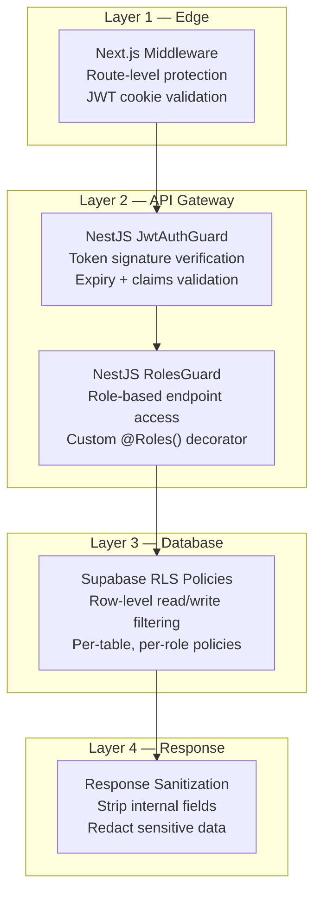
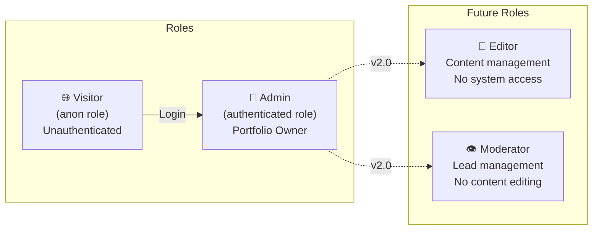
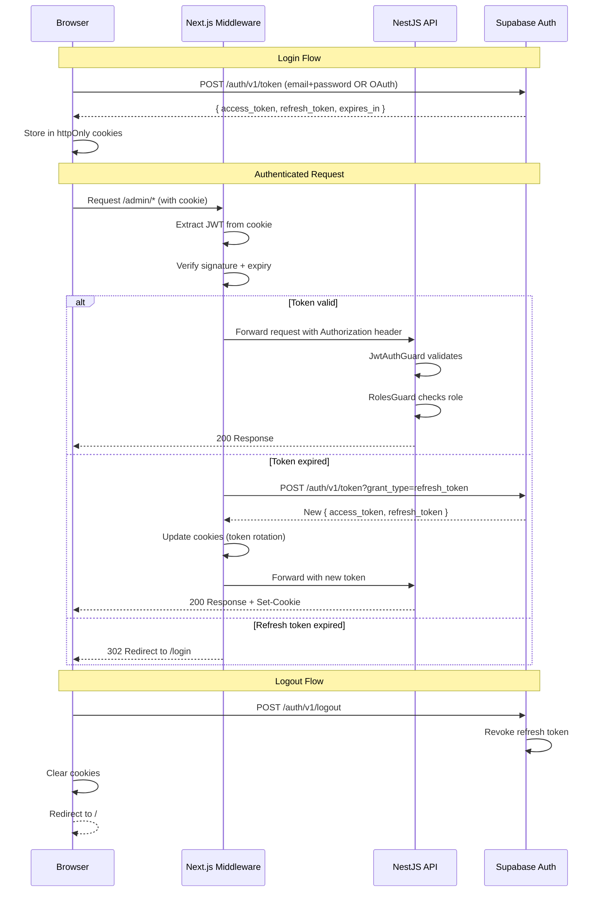
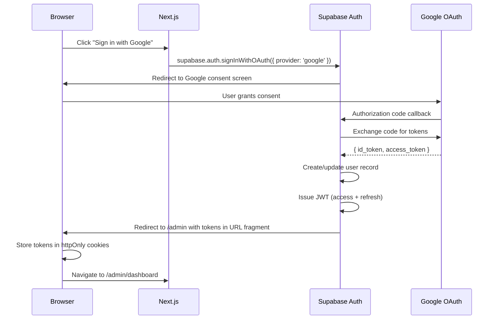
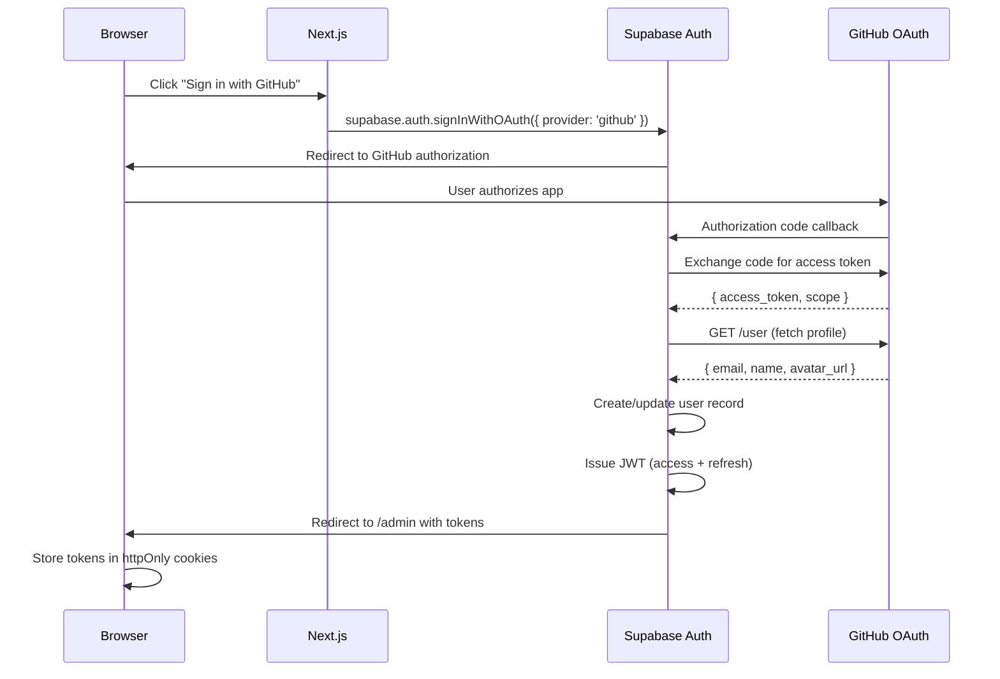
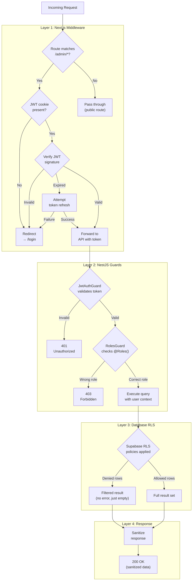
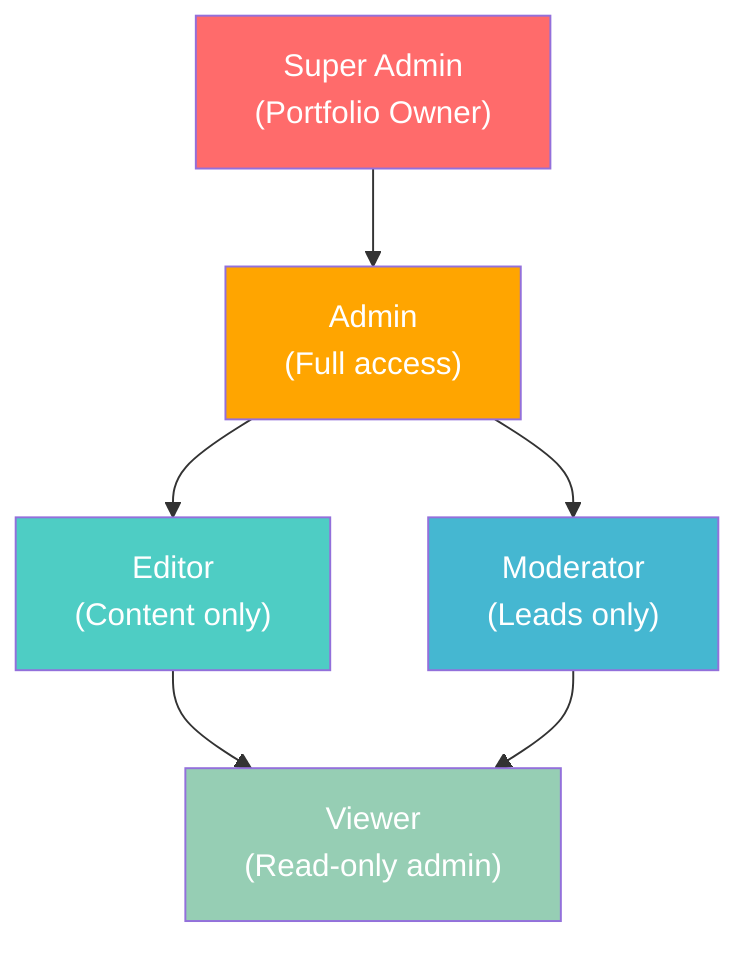

# Authorization Document — Enterprise Authorization Architecture

> **Document:** `15-AUTHORIZATION.md` | **Version:** 4.0 | **Last Updated:** June 2026  
> **Status:** ✅ Active | **Owner:** Security Lead | **Review Cadence:** Quarterly  
> **Classification:** Enterprise Architecture | **Compliance:** OWASP ASVS L2, GDPR Art. 25  
> **Related:** [SecurityArchitecture.md](./SecurityArchitecture.md) | [SystemArchitecture.md](../architecture/SystemArchitecture.md) | [DatabaseArchitecture.md](../database/DatabaseArchitecture.md)

---

## Executive Summary

Defines the authorization architecture - role-based access control (RBAC), permission model (read/write/admin), JWT validation, RLS policies, and per-resource access rules.

---

## Table of Contents

1. [Executive Summary](#1-executive-summary)
2. [Role Definitions](#2-role-definitions)
3. [Permission Matrix](#3-permission-matrix)
4. [RLS Policy Catalog](#4-rls-policy-catalog)
5. [JWT Token Structure](#5-jwt-token-structure)
6. [OAuth Flow Diagrams](#6-oauth-flow-diagrams)
7. [Session Management](#7-session-management)
8. [Permission Verification Flow](#8-permission-verification-flow)
9. [Admin Route Protection](#9-admin-route-protection)
10. [API Route Protection](#10-api-route-protection)
11. [Future: Multi-Role Expansion](#11-future-multi-role-expansion)
12. [Change Log](#12-change-log)

---

## 1. Executive Summary

This document defines the **complete authorization model** for the portfolio platform, implementing **Role-Based Access Control (RBAC)** with **Row Level Security (RLS)** at the database layer. The authorization model enforces a **defense-in-depth** strategy across four layers:



### 1.1 Authorization Model Summary

| Attribute | Value |
|-----------|-------|
| **Model** | Role-Based Access Control (RBAC) |
| **Roles** | 2 (Visitor, Admin) — expandable |
| **Enforcement** | 4-layer defense-in-depth |
| **Primary Layer** | Database RLS (Supabase PostgreSQL 15) |
| **Token Type** | JWT (RS256) via Supabase Auth |
| **Session Storage** | httpOnly, Secure, SameSite=Strict cookies |
| **Tables Protected** | 37/37 (100% RLS coverage) |
| **OAuth Providers** | Google, GitHub (via Supabase Auth) |

### 1.2 Key Design Decisions

| Decision | Rationale | ADR Reference |
|----------|-----------|---------------|
| RLS as primary enforcement | Database is last line of defense; app bugs can't bypass it | ADR-004 |
| JWT over session-based auth | Stateless verification, no session store needed, works with Supabase | ADR-011 |
| Two roles only (v1) | Portfolio is single-admin; complexity deferred until needed | ADR-011 |
| httpOnly cookies | XSS-resistant token storage; no localStorage exposure | ADR-011 |

---

## 2. Role Definitions

### 2.1 Role Architecture



### 2.2 Role Definition Matrix

| Role | Database Role | Authentication | Scope | Token Claim |
|------|--------------|----------------|-------|-------------|
| **Visitor** | `anon` | None | Public read-only access to published content | No JWT / anonymous key |
| **Admin** | `authenticated` | Email + Password or OAuth (Google/GitHub) | Full CRUD on all resources, system administration | `role: "admin"` in JWT |

### 2.3 Visitor Role — Detailed Permissions

The Visitor role represents any unauthenticated user browsing the portfolio. Their access is strictly limited to:

| Capability | Allowed | Details |
|-----------|---------|---------|
| View published sections | ✅ | Only where `is_live = true` |
| View published projects | ✅ | Only where `is_private = false` |
| View published blog posts | ✅ | Only where `published = true` |
| View testimonials | ✅ | All visible testimonials |
| View skills, experiences, achievements | ✅ | Public content only |
| View services | ✅ | Only where `is_active = true` |
| Submit contact form (create lead) | ✅ | Rate-limited: 3 per hour per IP |
| Access AI chatbot | ✅ | Rate-limited: 20 messages per session |
| View availability status | ✅ | Current status only |
| Access admin pages | ❌ | Redirected to 404 |
| Modify any content | ❌ | RLS blocks all writes |
| View lead data | ❌ | RLS blocks all reads |
| View analytics data | ❌ | RLS blocks all reads |
| View audit logs | ❌ | RLS blocks all reads |

### 2.4 Admin Role — Detailed Permissions

The Admin role is the portfolio owner with full system access:

| Capability | Allowed | Details |
|-----------|---------|---------|
| All Visitor capabilities | ✅ | Including private/draft content |
| Create/edit/delete sections | ✅ | Full CMS control |
| Create/edit/delete projects | ✅ | Including private projects |
| Create/edit/delete blog posts | ✅ | Including unpublished drafts |
| Manage leads | ✅ | View, filter, export CSV, add notes |
| View analytics | ✅ | Full dashboard access |
| Manage system settings | ✅ | Site config, integrations, API keys |
| Upload media assets | ✅ | Images, PDFs to Supabase Storage |
| Access AI admin features | ✅ | RAG management, chat history review |
| View audit logs | ✅ | Full audit trail |
| Manage feature flags | ✅ | Enable/disable features |
| Export data | ✅ | CSV exports for leads, analytics |

---

## 3. Permission Matrix

### 3.1 Complete Role × Resource × Operation Matrix

The following matrix defines every authorization decision for all 37 database tables across CRUD operations.

**Legend:** ✅ = Allowed | ❌ = Denied | 🔒 = Conditional (see notes)

#### Core Tables

| Table | Visitor SELECT | Visitor INSERT | Visitor UPDATE | Visitor DELETE | Admin SELECT | Admin INSERT | Admin UPDATE | Admin DELETE |
|-------|:---:|:---:|:---:|:---:|:---:|:---:|:---:|:---:|
| `users` | ❌ | ❌ | ❌ | ❌ | ✅ | ❌ | ✅ | ❌ |
| `roles` | ❌ | ❌ | ❌ | ❌ | ✅ | ✅ | ✅ | ❌ |
| `permissions` | ❌ | ❌ | ❌ | ❌ | ✅ | ✅ | ✅ | ❌ |
| `user_roles` | ❌ | ❌ | ❌ | ❌ | ✅ | ✅ | ❌ | ✅ |

#### Content Tables

| Table | Visitor SELECT | Visitor INSERT | Visitor UPDATE | Visitor DELETE | Admin SELECT | Admin INSERT | Admin UPDATE | Admin DELETE |
|-------|:---:|:---:|:---:|:---:|:---:|:---:|:---:|:---:|
| `sections` | 🔒¹ | ❌ | ❌ | ❌ | ✅ | ✅ | ✅ | ✅ |
| `projects` | 🔒² | ❌ | ❌ | ❌ | ✅ | ✅ | ✅ | ✅ |
| `project_images` | 🔒³ | ❌ | ❌ | ❌ | ✅ | ✅ | ✅ | ✅ |
| `blog_posts` | 🔒⁴ | ❌ | ❌ | ❌ | ✅ | ✅ | ✅ | ✅ |
| `post_tags` | ✅ | ❌ | ❌ | ❌ | ✅ | ✅ | ✅ | ✅ |
| `testimonials` | ✅ | ❌ | ❌ | ❌ | ✅ | ✅ | ✅ | ✅ |
| `skills` | ✅ | ❌ | ❌ | ❌ | ✅ | ✅ | ✅ | ✅ |
| `experiences` | ✅ | ❌ | ❌ | ❌ | ✅ | ✅ | ✅ | ✅ |
| `achievements` | ✅ | ❌ | ❌ | ❌ | ✅ | ✅ | ✅ | ✅ |
| `services` | 🔒⁵ | ❌ | ❌ | ❌ | ✅ | ✅ | ✅ | ✅ |
| `case_studies` | ✅ | ❌ | ❌ | ❌ | ✅ | ✅ | ✅ | ✅ |
| `press_features` | ✅ | ❌ | ❌ | ❌ | ✅ | ✅ | ✅ | ✅ |
| `guest_appearances` | ✅ | ❌ | ❌ | ❌ | ✅ | ✅ | ✅ | ✅ |
| `reading_list` | ✅ | ❌ | ❌ | ❌ | ✅ | ✅ | ✅ | ✅ |

**Conditional Notes:**
1. ¹ `sections`: Visitor SELECT only where `is_live = true`
2. ² `projects`: Visitor SELECT only where `is_private = false`
3. ³ `project_images`: Visitor SELECT only for images belonging to non-private projects
4. ⁴ `blog_posts`: Visitor SELECT only where `published = true`
5. ⁵ `services`: Visitor SELECT only where `is_active = true`

#### Lead Tables

| Table | Visitor SELECT | Visitor INSERT | Visitor UPDATE | Visitor DELETE | Admin SELECT | Admin INSERT | Admin UPDATE | Admin DELETE |
|-------|:---:|:---:|:---:|:---:|:---:|:---:|:---:|:---:|
| `leads` | ❌ | ✅⁶ | ❌ | ❌ | ✅ | ✅ | ✅ | 🔒⁷ |
| `lead_notes` | ❌ | ❌ | ❌ | ❌ | ✅ | ✅ | ✅ | ✅ |
| `lead_activities` | ❌ | ❌ | ❌ | ❌ | ✅ | ✅ | ❌ | ❌ |

**Conditional Notes:**
6. ⁶ `leads`: Visitor INSERT via contact form only (rate-limited: 3/hour/IP)
7. ⁷ `leads`: Admin DELETE is soft-delete only (`deleted_at` timestamp)

#### Analytics Tables

| Table | Visitor SELECT | Visitor INSERT | Visitor UPDATE | Visitor DELETE | Admin SELECT | Admin INSERT | Admin UPDATE | Admin DELETE |
|-------|:---:|:---:|:---:|:---:|:---:|:---:|:---:|:---:|
| `analytics_events` | ❌ | ✅⁸ | ❌ | ❌ | ✅ | ✅ | ❌ | ❌ |
| `analytics_sessions` | ❌ | ✅⁸ | ✅⁹ | ❌ | ✅ | ✅ | ✅ | ❌ |
| `page_views` | ❌ | ✅⁸ | ❌ | ❌ | ✅ | ✅ | ❌ | ❌ |

**Conditional Notes:**
8. ⁸ Analytics INSERT: Visitor can insert own analytics events (server-side via API)
9. ⁹ `analytics_sessions`: Visitor UPDATE only for `last_activity_at` and `page_views` on own session

#### AI Tables

| Table | Visitor SELECT | Visitor INSERT | Visitor UPDATE | Visitor DELETE | Admin SELECT | Admin INSERT | Admin UPDATE | Admin DELETE |
|-------|:---:|:---:|:---:|:---:|:---:|:---:|:---:|:---:|
| `chat_conversations` | 🔒¹⁰ | ✅¹¹ | ✅¹² | ❌ | ✅ | ✅ | ✅ | ✅ |
| `chat_messages` | 🔒¹⁰ | ✅¹¹ | ❌ | ❌ | ✅ | ✅ | ❌ | ✅ |
| `document_chunks` | ❌ | ❌ | ❌ | ❌ | ✅ | ✅ | ✅ | ✅ |
| `embeddings_cache` | ❌ | ❌ | ❌ | ❌ | ✅ | ✅ | ✅ | ✅ |

**Conditional Notes:**
10. ¹⁰ Visitor SELECT only own conversation (matched by `session_id`)
11. ¹¹ Visitor INSERT only within own active conversation
12. ¹² Visitor UPDATE only `last_activity_at` on own conversation

#### System Tables

| Table | Visitor SELECT | Visitor INSERT | Visitor UPDATE | Visitor DELETE | Admin SELECT | Admin INSERT | Admin UPDATE | Admin DELETE |
|-------|:---:|:---:|:---:|:---:|:---:|:---:|:---:|:---:|
| `media_assets` | ✅¹³ | ❌ | ❌ | ❌ | ✅ | ✅ | ✅ | 🔒¹⁴ |
| `availability_status` | ✅ | ❌ | ❌ | ❌ | ✅ | ❌ | ✅ | ❌ |
| `system_settings` | ❌ | ❌ | ❌ | ❌ | ✅ | ✅ | ✅ | ✅ |
| `notifications` | ❌ | ❌ | ❌ | ❌ | ✅ | ✅ | ✅ | ✅ |
| `audit_logs` | ❌ | ❌ | ❌ | ❌ | ✅ | ✅ | ❌ | ❌ |
| `sessions` | ❌ | ❌ | ❌ | ❌ | ✅ | ✅ | ✅ | ✅ |
| `api_keys` | ❌ | ❌ | ❌ | ❌ | ✅ | ✅ | ✅ | 🔒¹⁵ |
| `feature_flags` | ❌ | ❌ | ❌ | ❌ | ✅ | ✅ | ✅ | ✅ |
| `admin_activities` | ❌ | ❌ | ❌ | ❌ | ✅ | ✅ | ❌ | ❌ |

**Conditional Notes:**
13. ¹³ `media_assets`: Visitor SELECT only non-deleted assets (public URLs)
14. ¹⁴ `media_assets`: Admin DELETE is soft-delete only
15. ¹⁵ `api_keys`: Admin DELETE is revoke (set `revoked_at`, not hard delete)

---

## 4. RLS Policy Catalog

### 4.1 Policy Architecture

Every table in the database has RLS enabled. Policies use Supabase's built-in `auth.role()` and `auth.uid()` functions to determine access.

```sql
-- Global pattern: Enable RLS on every table
ALTER TABLE {table_name} ENABLE ROW LEVEL SECURITY;

-- Force RLS for table owners too (prevents bypass)
ALTER TABLE {table_name} FORCE ROW LEVEL SECURITY;
```

### 4.2 Content Table Policies

```sql
-- ============================================================
-- SECTIONS — Public read (live only), Admin full CRUD
-- ============================================================
CREATE POLICY select_sections_anon ON sections
  FOR SELECT TO anon
  USING (is_live = true);

CREATE POLICY select_sections_auth ON sections
  FOR SELECT TO authenticated
  USING (true);

CREATE POLICY insert_sections_auth ON sections
  FOR INSERT TO authenticated
  WITH CHECK (true);

CREATE POLICY update_sections_auth ON sections
  FOR UPDATE TO authenticated
  USING (true)
  WITH CHECK (true);

CREATE POLICY delete_sections_auth ON sections
  FOR DELETE TO authenticated
  USING (true);

-- ============================================================
-- PROJECTS — Public read (non-private), Admin full CRUD
-- ============================================================
CREATE POLICY select_projects_anon ON projects
  FOR SELECT TO anon
  USING (is_private = false);

CREATE POLICY select_projects_auth ON projects
  FOR SELECT TO authenticated
  USING (true);

CREATE POLICY insert_projects_auth ON projects
  FOR INSERT TO authenticated
  WITH CHECK (true);

CREATE POLICY update_projects_auth ON projects
  FOR UPDATE TO authenticated
  USING (true)
  WITH CHECK (true);

CREATE POLICY delete_projects_auth ON projects
  FOR DELETE TO authenticated
  USING (true);

-- ============================================================
-- PROJECT_IMAGES — Public read (via non-private project), Admin CRUD
-- ============================================================
CREATE POLICY select_project_images_anon ON project_images
  FOR SELECT TO anon
  USING (
    EXISTS (
      SELECT 1 FROM projects
      WHERE projects.id = project_images.project_id
      AND projects.is_private = false
    )
  );

CREATE POLICY all_project_images_auth ON project_images
  FOR ALL TO authenticated
  USING (true)
  WITH CHECK (true);

-- ============================================================
-- BLOG_POSTS — Public read (published only), Admin full CRUD
-- ============================================================
CREATE POLICY select_blog_posts_anon ON blog_posts
  FOR SELECT TO anon
  USING (published = true);

CREATE POLICY all_blog_posts_auth ON blog_posts
  FOR ALL TO authenticated
  USING (true)
  WITH CHECK (true);

-- ============================================================
-- SERVICES — Public read (active only), Admin full CRUD
-- ============================================================
CREATE POLICY select_services_anon ON services
  FOR SELECT TO anon
  USING (is_active = true);

CREATE POLICY all_services_auth ON services
  FOR ALL TO authenticated
  USING (true)
  WITH CHECK (true);

-- ============================================================
-- PUBLIC CONTENT TABLES (no visibility filter needed)
-- testimonials, skills, experiences, achievements,
-- case_studies, press_features, guest_appearances,
-- reading_list, post_tags
-- ============================================================
-- Pattern: anon SELECT all, auth full CRUD
-- (Repeated for each table)
CREATE POLICY select_testimonials_anon ON testimonials
  FOR SELECT TO anon USING (true);
CREATE POLICY all_testimonials_auth ON testimonials
  FOR ALL TO authenticated USING (true) WITH CHECK (true);

CREATE POLICY select_skills_anon ON skills
  FOR SELECT TO anon USING (true);
CREATE POLICY all_skills_auth ON skills
  FOR ALL TO authenticated USING (true) WITH CHECK (true);

CREATE POLICY select_experiences_anon ON experiences
  FOR SELECT TO anon USING (true);
CREATE POLICY all_experiences_auth ON experiences
  FOR ALL TO authenticated USING (true) WITH CHECK (true);

CREATE POLICY select_achievements_anon ON achievements
  FOR SELECT TO anon USING (true);
CREATE POLICY all_achievements_auth ON achievements
  FOR ALL TO authenticated USING (true) WITH CHECK (true);

CREATE POLICY select_case_studies_anon ON case_studies
  FOR SELECT TO anon USING (true);
CREATE POLICY all_case_studies_auth ON case_studies
  FOR ALL TO authenticated USING (true) WITH CHECK (true);

CREATE POLICY select_press_features_anon ON press_features
  FOR SELECT TO anon USING (true);
CREATE POLICY all_press_features_auth ON press_features
  FOR ALL TO authenticated USING (true) WITH CHECK (true);

CREATE POLICY select_guest_appearances_anon ON guest_appearances
  FOR SELECT TO anon USING (true);
CREATE POLICY all_guest_appearances_auth ON guest_appearances
  FOR ALL TO authenticated USING (true) WITH CHECK (true);

CREATE POLICY select_reading_list_anon ON reading_list
  FOR SELECT TO anon USING (true);
CREATE POLICY all_reading_list_auth ON reading_list
  FOR ALL TO authenticated USING (true) WITH CHECK (true);

CREATE POLICY select_post_tags_anon ON post_tags
  FOR SELECT TO anon USING (true);
CREATE POLICY all_post_tags_auth ON post_tags
  FOR ALL TO authenticated USING (true) WITH CHECK (true);
```

### 4.3 Lead Table Policies

```sql
-- ============================================================
-- LEADS — Visitor insert (contact form), Admin read/update/soft-delete
-- ============================================================
CREATE POLICY insert_leads_anon ON leads
  FOR INSERT TO anon
  WITH CHECK (true);
  -- Rate limiting enforced at API layer (3/hour/IP)

CREATE POLICY select_leads_auth ON leads
  FOR SELECT TO authenticated
  USING (deleted_at IS NULL);

CREATE POLICY update_leads_auth ON leads
  FOR UPDATE TO authenticated
  USING (true)
  WITH CHECK (true);

-- Soft delete only — set deleted_at, never hard delete
CREATE POLICY delete_leads_auth ON leads
  FOR UPDATE TO authenticated
  USING (true)
  WITH CHECK (deleted_at IS NOT NULL);

-- LEAD_NOTES — Admin only
CREATE POLICY all_lead_notes_auth ON lead_notes
  FOR ALL TO authenticated
  USING (true)
  WITH CHECK (true);

-- LEAD_ACTIVITIES — Admin read/insert only (immutable log)
CREATE POLICY select_lead_activities_auth ON lead_activities
  FOR SELECT TO authenticated
  USING (true);

CREATE POLICY insert_lead_activities_auth ON lead_activities
  FOR INSERT TO authenticated
  WITH CHECK (true);
```

### 4.4 Analytics Table Policies

```sql
-- ============================================================
-- ANALYTICS — Server-side insert (via API), Admin read
-- ============================================================
CREATE POLICY insert_analytics_events_anon ON analytics_events
  FOR INSERT TO anon
  WITH CHECK (true);

CREATE POLICY select_analytics_events_auth ON analytics_events
  FOR SELECT TO authenticated
  USING (true);

CREATE POLICY insert_analytics_sessions_anon ON analytics_sessions
  FOR INSERT TO anon
  WITH CHECK (true);

CREATE POLICY update_analytics_sessions_anon ON analytics_sessions
  FOR UPDATE TO anon
  USING (true)
  WITH CHECK (true);

CREATE POLICY all_analytics_sessions_auth ON analytics_sessions
  FOR ALL TO authenticated
  USING (true)
  WITH CHECK (true);

CREATE POLICY insert_page_views_anon ON page_views
  FOR INSERT TO anon
  WITH CHECK (true);

CREATE POLICY select_page_views_auth ON page_views
  FOR SELECT TO authenticated
  USING (true);
```

### 4.5 AI Table Policies

```sql
-- ============================================================
-- CHAT — Visitor read/insert own session, Admin full access
-- ============================================================
CREATE POLICY select_chat_conversations_anon ON chat_conversations
  FOR SELECT TO anon
  USING (session_id = current_setting('request.headers')::json->>'x-session-id');

CREATE POLICY insert_chat_conversations_anon ON chat_conversations
  FOR INSERT TO anon
  WITH CHECK (true);

CREATE POLICY all_chat_conversations_auth ON chat_conversations
  FOR ALL TO authenticated
  USING (true)
  WITH CHECK (true);

CREATE POLICY select_chat_messages_anon ON chat_messages
  FOR SELECT TO anon
  USING (
    EXISTS (
      SELECT 1 FROM chat_conversations
      WHERE chat_conversations.id = chat_messages.conversation_id
      AND chat_conversations.session_id = current_setting('request.headers')::json->>'x-session-id'
    )
  );

CREATE POLICY insert_chat_messages_anon ON chat_messages
  FOR INSERT TO anon
  WITH CHECK (true);

CREATE POLICY all_chat_messages_auth ON chat_messages
  FOR ALL TO authenticated
  USING (true)
  WITH CHECK (true);

-- DOCUMENT_CHUNKS & EMBEDDINGS_CACHE — Admin only
CREATE POLICY all_document_chunks_auth ON document_chunks
  FOR ALL TO authenticated
  USING (true)
  WITH CHECK (true);

CREATE POLICY all_embeddings_cache_auth ON embeddings_cache
  FOR ALL TO authenticated
  USING (true)
  WITH CHECK (true);
```

### 4.6 System Table Policies

```sql
-- ============================================================
-- SYSTEM TABLES — Admin only (except media_assets, availability_status)
-- ============================================================
CREATE POLICY select_media_assets_anon ON media_assets
  FOR SELECT TO anon
  USING (deleted_at IS NULL);

CREATE POLICY all_media_assets_auth ON media_assets
  FOR ALL TO authenticated
  USING (true)
  WITH CHECK (true);

CREATE POLICY select_availability_status_anon ON availability_status
  FOR SELECT TO anon
  USING (true);

CREATE POLICY all_availability_status_auth ON availability_status
  FOR ALL TO authenticated
  USING (true)
  WITH CHECK (true);

-- Admin-only system tables (pattern repeated)
CREATE POLICY all_system_settings_auth ON system_settings
  FOR ALL TO authenticated USING (true) WITH CHECK (true);

CREATE POLICY all_notifications_auth ON notifications
  FOR ALL TO authenticated USING (true) WITH CHECK (true);

CREATE POLICY select_audit_logs_auth ON audit_logs
  FOR SELECT TO authenticated USING (true);
CREATE POLICY insert_audit_logs_auth ON audit_logs
  FOR INSERT TO authenticated WITH CHECK (true);
-- No UPDATE or DELETE on audit_logs (immutable)

CREATE POLICY all_sessions_auth ON sessions
  FOR ALL TO authenticated USING (true) WITH CHECK (true);

CREATE POLICY all_api_keys_auth ON api_keys
  FOR ALL TO authenticated USING (true) WITH CHECK (true);

CREATE POLICY all_feature_flags_auth ON feature_flags
  FOR ALL TO authenticated USING (true) WITH CHECK (true);

CREATE POLICY select_admin_activities_auth ON admin_activities
  FOR SELECT TO authenticated USING (true);
CREATE POLICY insert_admin_activities_auth ON admin_activities
  FOR INSERT TO authenticated WITH CHECK (true);
-- No UPDATE or DELETE on admin_activities (immutable)
```

### 4.7 RLS Coverage Summary

| Table Group | Tables | Policies | Anon SELECT | Anon INSERT | Auth Full |
|------------|:------:|:--------:|:-----------:|:-----------:|:---------:|
| Core | 4 | 8 | ❌ | ❌ | ✅ |
| Content | 14 | 42 | ✅ (filtered) | ❌ | ✅ |
| Leads | 3 | 8 | ❌ | ✅ (leads only) | ✅ |
| Analytics | 3 | 8 | ❌ | ✅ (server-side) | ✅ |
| AI | 4 | 10 | 🔒 (own session) | ✅ (chat only) | ✅ |
| System | 9 | 18 | 🔒 (media, status) | ❌ | ✅ |
| **Total** | **37** | **94** | | | |

---

## 5. JWT Token Structure

### 5.1 Token Types

| Token | Purpose | Lifetime | Storage | Refresh |
|-------|---------|----------|---------|---------|
| **Access Token** | API authorization | 1 hour | httpOnly cookie | Via refresh token |
| **Refresh Token** | Access token renewal | 7 days | httpOnly cookie | Rotation on use |
| **Supabase anon key** | Public API access | N/A | Environment variable | N/A |
| **Supabase service key** | Server-side admin access | N/A | Environment variable (server only) | N/A |

### 5.2 Access Token Claims (JWT Payload)

```json
{
  "aud": "authenticated",
  "exp": 1718899200,
  "iat": 1718895600,
  "iss": "https://{project-ref}.supabase.co/auth/v1",
  "sub": "a1b2c3d4-e5f6-7890-abcd-ef1234567890",
  "email": "admin@portfolio.dev",
  "phone": "",
  "app_metadata": {
    "provider": "google",
    "providers": ["google", "github"]
  },
  "user_metadata": {
    "full_name": "Portfolio Owner",
    "avatar_url": "https://lh3.googleusercontent.com/..."
  },
  "role": "authenticated",
  "aal": "aal1",
  "amr": [
    { "method": "oauth", "timestamp": 1718895600 }
  ],
  "session_id": "s1e2s3s4-i5o6-n7i8-d9a0-bcdef1234567"
}
```

### 5.3 Token Lifecycle



### 5.4 Token Validation Rules

| Check | Layer | Failure Response |
|-------|-------|------------------|
| Signature verification (RS256) | API Gateway | `401 Unauthorized` |
| Expiration (`exp` claim) | Middleware + API | `401 Unauthorized` → refresh attempt |
| Audience (`aud` = `authenticated`) | API Gateway | `401 Unauthorized` |
| Issuer (`iss` = Supabase project URL) | API Gateway | `401 Unauthorized` |
| Role claim present | RolesGuard | `403 Forbidden` |
| Token not revoked | Session table lookup | `401 Unauthorized` |

---

## 6. OAuth Flow Diagrams

### 6.1 Google OAuth Flow



### 6.2 GitHub OAuth Flow



### 6.3 OAuth Security Configuration

| Setting | Value | Rationale |
|---------|-------|-----------|
| Allowed redirect URLs | `https://portfolio.dev/auth/callback` | Prevent redirect attacks |
| Email domain restriction | None (single admin) | Admin whitelist in DB |
| Auto-confirm email | Disabled | Manual admin verification |
| PKCE flow | Enabled | Prevent authorization code interception |
| Token in URL fragment | Yes (Supabase default) | Fragment not sent to server |

---

## 7. Session Management

### 7.1 Cookie Configuration

```typescript
// Cookie settings for JWT storage
const COOKIE_OPTIONS = {
  name: 'sb-access-token',
  httpOnly: true,        // Prevent XSS access
  secure: true,          // HTTPS only
  sameSite: 'strict',    // Prevent CSRF
  path: '/',             // Available to all routes
  maxAge: 60 * 60,       // 1 hour (matches access token)
  domain: '.portfolio.dev',
};

const REFRESH_COOKIE_OPTIONS = {
  name: 'sb-refresh-token',
  httpOnly: true,
  secure: true,
  sameSite: 'strict',
  path: '/auth/refresh',  // Only sent to refresh endpoint
  maxAge: 60 * 60 * 24 * 7, // 7 days
  domain: '.portfolio.dev',
};
```

### 7.2 Session Lifecycle

| Event | Action | Audit Log |
|-------|--------|-----------|
| Login | Create session record, issue tokens | `auth.login` |
| API request | Validate access token, check session | — |
| Token refresh | Rotate refresh token, issue new access token | `auth.token_refresh` |
| Idle timeout (30 min) | Client-side: prompt re-auth | — |
| Explicit logout | Revoke all tokens, clear cookies, delete session | `auth.logout` |
| Password change | Revoke ALL sessions (forced re-login) | `auth.password_change` |
| Suspicious activity | Revoke specific session | `auth.session_revoked` |

### 7.3 Session Table Schema

```sql
CREATE TABLE sessions (
  id UUID PRIMARY KEY DEFAULT gen_random_uuid(),
  user_id UUID NOT NULL REFERENCES users(id) ON DELETE CASCADE,
  refresh_token TEXT UNIQUE NOT NULL,
  user_agent TEXT,
  ip_address INET,
  is_revoked BOOLEAN DEFAULT false,
  expires_at TIMESTAMPTZ NOT NULL,
  created_at TIMESTAMPTZ DEFAULT now()
);

-- Index for token lookup
CREATE INDEX idx_sessions_refresh_token ON sessions(refresh_token) WHERE NOT is_revoked;
-- Index for user session cleanup
CREATE INDEX idx_sessions_user_id ON sessions(user_id);
```

---

## 8. Permission Verification Flow

### 8.1 Complete Request Authorization Flow



### 8.2 Authorization Decision Table

| Request | Layer 1 (MW) | Layer 2 (Guard) | Layer 3 (RLS) | Result |
|---------|:---:|:---:|:---:|--------|
| `GET /` (public) | ✅ Pass | ✅ No guard | ✅ anon SELECT | 200: Public content |
| `GET /admin/dashboard` (no token) | ❌ No cookie | — | — | 302: Redirect to login |
| `GET /admin/dashboard` (valid token) | ✅ Valid JWT | ✅ Role=admin | ✅ Auth SELECT | 200: Admin dashboard |
| `POST /api/leads` (public form) | ✅ Pass | ✅ No guard | ✅ anon INSERT | 201: Lead created |
| `GET /api/admin/leads` (no token) | ✅ Pass | ❌ JwtAuthGuard | — | 401: Unauthorized |
| `DELETE /api/admin/leads/:id` (valid) | ✅ Valid JWT | ✅ Role=admin | ✅ Soft delete | 200: Lead archived |
| `GET /api/admin/audit-logs` (valid) | ✅ Valid JWT | ✅ Role=admin | ✅ Auth SELECT | 200: Audit log entries |

---

## 9. Admin Route Protection

### 9.1 Next.js Middleware Configuration

```typescript
// middleware.ts — Root middleware for route protection
import { createMiddlewareClient } from '@supabase/auth-helpers-nextjs';
import { NextResponse } from 'next/server';
import type { NextRequest } from 'next/server';

const PROTECTED_ROUTES = ['/admin', '/admin/(.*)'];
const AUTH_ROUTES = ['/login', '/auth/callback'];

export async function middleware(req: NextRequest) {
  const res = NextResponse.next();
  const supabase = createMiddlewareClient({ req, res });

  const {
    data: { session },
  } = await supabase.auth.getSession();

  const isProtectedRoute = PROTECTED_ROUTES.some((pattern) =>
    new RegExp(`^${pattern}$`).test(req.nextUrl.pathname)
  );

  const isAuthRoute = AUTH_ROUTES.some((route) =>
    req.nextUrl.pathname.startsWith(route)
  );

  // Redirect unauthenticated users away from admin
  if (isProtectedRoute && !session) {
    const loginUrl = new URL('/login', req.url);
    loginUrl.searchParams.set('redirect', req.nextUrl.pathname);
    return NextResponse.redirect(loginUrl);
  }

  // Redirect authenticated users away from login
  if (isAuthRoute && session) {
    return NextResponse.redirect(new URL('/admin/dashboard', req.url));
  }

  return res;
}

export const config = {
  matcher: ['/admin/:path*', '/login', '/auth/:path*'],
};
```

### 9.2 Admin Route Structure

```
app/
├── (public)/              # Public routes (no auth required)
│   ├── page.tsx           # Homepage
│   ├── projects/
│   ├── blog/
│   └── contact/
├── (auth)/                # Auth routes
│   ├── login/page.tsx     # Login form
│   └── auth/callback/     # OAuth callback
└── admin/                 # Protected routes (auth required)
    ├── layout.tsx          # Admin layout with auth check
    ├── dashboard/page.tsx  # Admin dashboard
    ├── sections/           # Section management
    ├── projects/           # Project management
    ├── blog/               # Blog management
    ├── leads/              # Lead management
    ├── analytics/          # Analytics dashboard
    ├── media/              # Media library
    ├── settings/           # System settings
    └── ai/                 # AI management
```

---

## 10. API Route Protection

### 10.1 NestJS Guard Architecture

```typescript
// auth/guards/jwt-auth.guard.ts
@Injectable()
export class JwtAuthGuard extends AuthGuard('jwt') {
  canActivate(context: ExecutionContext): boolean | Promise<boolean> {
    return super.canActivate(context);
  }

  handleRequest(err: any, user: any, info: any) {
    if (err || !user) {
      throw new UnauthorizedException('Invalid or expired token');
    }
    return user;
  }
}

// auth/guards/roles.guard.ts
@Injectable()
export class RolesGuard implements CanActivate {
  constructor(private reflector: Reflector) {}

  canActivate(context: ExecutionContext): boolean {
    const requiredRoles = this.reflector.getAllAndOverride<string[]>(
      ROLES_KEY,
      [context.getHandler(), context.getClass()]
    );

    if (!requiredRoles) return true; // No @Roles() = public

    const { user } = context.switchToHttp().getRequest();
    return requiredRoles.includes(user.role);
  }
}

// auth/decorators/roles.decorator.ts
export const ROLES_KEY = 'roles';
export const Roles = (...roles: string[]) => SetMetadata(ROLES_KEY, roles);
```

### 10.2 Controller Protection Patterns

```typescript
// Public endpoint — no guards
@Controller('api/sections')
export class SectionsController {
  @Get()
  findPublished() { /* RLS filters to is_live=true for anon */ }
}

// Protected endpoint — JWT + Role required
@Controller('api/admin/sections')
@UseGuards(JwtAuthGuard, RolesGuard)
@Roles('admin')
export class AdminSectionsController {
  @Post()
  create(@Body() dto: CreateSectionDto) { /* Auth user, full access */ }

  @Put(':id')
  update(@Param('id') id: string, @Body() dto: UpdateSectionDto) { }

  @Delete(':id')
  remove(@Param('id') id: string) { }
}

// Mixed endpoint — public read, protected write
@Controller('api/leads')
export class LeadsController {
  @Post()
  @Throttle(3, 3600) // Rate limit: 3 per hour
  submitContact(@Body() dto: CreateLeadDto) { /* Public, rate-limited */ }

  @Get()
  @UseGuards(JwtAuthGuard, RolesGuard)
  @Roles('admin')
  findAll(@Query() query: LeadQueryDto) { /* Admin only */ }
}
```

### 10.3 API Route Authorization Summary

| Route Pattern | Method | Auth Required | Rate Limit | Guard Chain |
|---------------|--------|:---:|:---:|-------------|
| `/api/sections` | GET | ❌ | 100/min | None (RLS) |
| `/api/projects` | GET | ❌ | 100/min | None (RLS) |
| `/api/blog` | GET | ❌ | 100/min | None (RLS) |
| `/api/leads` | POST | ❌ | 3/hour | Throttle |
| `/api/ai/chat` | POST | ❌ | 20/session | Throttle |
| `/api/admin/*` | ALL | ✅ | 30/min | JWT → Roles |
| `/api/health` | GET | ❌ | 10/min | None |

---

## 11. Future: Multi-Role Expansion

### 11.1 Planned Role Hierarchy (v2.0)



### 11.2 Planned Permission Expansion

| Role | Content CRUD | Lead Mgmt | Analytics | System Settings | User Mgmt |
|------|:---:|:---:|:---:|:---:|:---:|
| Super Admin | ✅ | ✅ | ✅ | ✅ | ✅ |
| Admin | ✅ | ✅ | ✅ | ✅ | ❌ |
| Editor | ✅ | ❌ | 🔒 (own) | ❌ | ❌ |
| Moderator | ❌ | ✅ | 🔒 (leads) | ❌ | ❌ |
| Viewer | 🔒 (read) | 🔒 (read) | ✅ | ❌ | ❌ |

### 11.3 Migration Path

1. **Database:** Add rows to `roles` table, update `permissions` table
2. **RLS:** Add role-specific policies with `auth.jwt() ->> 'role'` checks
3. **API:** Update `RolesGuard` to support multiple roles
4. **Frontend:** Add role-based UI rendering with `useRole()` hook
5. **Testing:** E2E tests for each role's permissions

---

## Decision Log

| ID | Decision | Rationale | Alternatives Considered | Date | Approver |
|----|----------|-----------|------------------------|------|----------|
| D-AUTHZ-001 | RBAC with Super Admin and Admin roles (v1.0); planned expansion to 5 roles (v2.0) | Simplicity for single-admin portfolio; extensible for future multi-user scenarios | ABAC (rejected — over-engineered for single admin); flat permissions (rejected — no role grouping); no authorization (rejected — OWASP non-compliance) | Mar 2026 | Security Lead |
| D-AUTHZ-002 | 4-layer authorization (Edge Middleware → JwtAuthGuard → RolesGuard → RLS) | Defense-in-depth; every layer independently enforces access; no single bypass possible | Single-layer auth (rejected — catastrophic on failure); 2-layer only (rejected — insufficient for OWASP ASVS L2) | Mar 2026 | Security Lead |
| D-AUTHZ-003 | RLS policies on all 37 tables with role-specific WHERE clauses | Database-level enforcement independent of application; policy-as-code; auditable | Application-layer only (rejected — trust issues); API gateway only (rejected — no query-level control) | Mar 2026 | Security Lead |
| D-AUTHZ-004 | JWT with role embedded in custom claim (app_role) | Stateless authorization; no DB lookup per request; signed and verified at every layer | Session-based role storage (rejected — server state); DB lookup per request (rejected — latency overhead) | Mar 2026 | Security Lead |
| D-AUTHZ-005 | Google OAuth as exclusive auth provider for admin | Free; portfolio owner has Google account; no password management | Email/password (rejected — security burden, no MFA); GitHub OAuth (rejected — less universal) | Mar 2026 | Security Lead |

---

## 12. Change Log

| Version | Date | Changes | Author |
|---------|------|---------|--------|
| 4.0 | Jun 2026 | Enterprise rewrite — full RLS catalog, JWT structure, OAuth flows, 37-table permission matrix, 94 policies, multi-role expansion plan | Security Lead |
| 3.0 | Jun 2026 | Added executive summary, permission verification flow | Security Lead |
| 2.0 | Jun 2026 | Updated for enterprise structure | Security Lead |
| 1.0 | Mar 2026 | Initial authorization documentation | Security Lead |

---

*Document Version: 4.0 — Enterprise Edition*
*Authorization Architecture for Portfolio Platform*

---

---

## Phase 4 Addendum: Custom NestJS Passport Auth

During Phase 4, the authorization stack underwent a significant architectural shift. Rather than relying exclusively on Supabase Auth for session management, the platform now utilizes a custom **NestJS + Passport.js** implementation for maximum flexibility.

### 1. NestJS Authentication (`apps/api`)
The API gateway completely owns the authentication layer via the `@nestjs/jwt` and `@nestjs/passport` libraries. 
- **Secret Management:** JWTs are signed directly by the NestJS backend using a secure `JWT_SECRET`, rather than Supabase.
- **Custom Payload:** The JWT payloads are tightly controlled by the application, injecting necessary sandbox and admin context that Supabase Auth does not natively support.

### 2. OAuth Strategies
Admin login is restricted to GitHub and Google OAuth, leveraging:
- `passport-google-oauth20`
- `passport-github2`

When an admin clicks "Login with GitHub" on the Next.js frontend, the request routes to the NestJS backend, which handles the entire OAuth dance. Upon success, the NestJS backend issues the JWT and redirects the user back to the `/admin/sandbox` with the token securely stored.

*Note: The Supabase RLS policies documented in Section 4 are currently bypassed for Admin operations since the backend utilizes the Supabase Service Role Key to perform CRUD operations after verifying the custom NestJS JWT.*

---

## Glossary

| Term | Definition |
|------|------------|
| **RBAC (Role-Based Access Control)** | An authorization model that grants permissions based on assigned roles rather than individual users |
| **RLS (Row-Level Security)** | A PostgreSQL feature that restricts which rows a user can query or modify based on a security policy expression |
| **JWT (JSON Web Token)** | A compact, URL-safe token format for transmitting claims between parties, used for stateless authentication |
| **OAuth 2.0** | An authorization framework that enables applications to obtain limited access to user accounts on an HTTP service |
| **Claims** | Key-value pairs embedded in a JWT that convey information about the authenticated user |
| **Guard (NestJS)** | A NestJS component that implements authorization logic, determining whether a request should be processed |
| **Permission Matrix** | A structured table mapping roles to their authorized operations across resources |
| **Defense in Depth** | A security strategy where multiple layers of defense are implemented so that if one layer fails, others still provide protection |
| **Middleware (Next.js)** | Code that runs before a request is completed, used for route protection and redirect logic |
| **Audit Log** | An immutable record of who performed what action and when, used for compliance and security monitoring |
| **Non-repudiation** | The assurance that someone cannot deny having performed a specific action, ensured through audit logs |
| **Least Privilege** | A security principle where users and systems are granted only the minimum permissions necessary to perform their function |

---

## Cross-References

| Reference | Description |
|-----------|-------------|
| See MASTER-INDEX.md | Full document dependency graph and cross-reference map |

---

## Cross-References

| Reference | Description |
|-----------|-------------|
| See MASTER-INDEX.md | Full document dependency graph and cross-reference map |

---

## Cross-References

| Reference | Description |
|-----------|-------------|
| docs/MASTER-INDEX.md | Full document dependency graph and cross-reference map |
