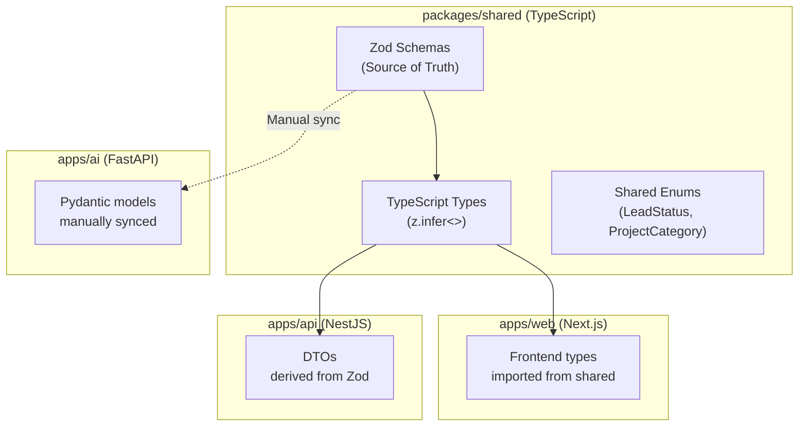

# Data Contracts — Cross-Service Type Safety

> **Document:** `50-DATA-CONTRACTS.md` | **Version:** 1.1 | **Last Updated:** June 2026  
> **Status:** ✅ Active | **Owner:** Staff Backend Architect | **Review Cadence:** Quarterly  
> **Related:** [SystemArchitecture.md](./SystemArchitecture.md) | [44-API-STANDARDS.md](./44-API-STANDARDS.md)

---

## Executive Summary

The data contracts architecture uses `packages/shared` as the single source of truth for cross-service data structures across the three-service platform (Next.js, NestJS, FastAPI). Zod schemas in TypeScript define per-domain schemas (Section, Project, Blog, Lead, Analytics, AI, Auth) with automatic TypeScript type inference via `z.infer<>`. NestJS DTOs are derived directly from Zod schemas via `nestjs-zod` for automatic request validation. React Hook Form on the frontend uses `zodResolver` for client-server validation parity. FastAPI Pydantic models are manually synced with a documented last-synced timestamp. A 6-step change management process ensures all contract changes flow through CI type checking across all consumers. Breaking changes are detected automatically by the Turborepo pipeline across `@portfolio/web` and `@portfolio/api`.

---

## 1. Contract Architecture

### 1.1 Why Data Contracts

The platform has three services (Next.js, NestJS, FastAPI) sharing data structures. Without contracts, changes to the NestJS API response can break the Next.js frontend or FastAPI AI service silently.



---

## 2. Shared Package (`packages/shared`)

### 2.1 Directory Structure

```
packages/shared/
├── src/
│   ├── schemas/           # Zod schemas (source of truth)
│   │   ├── section.ts     # Section CRUD schemas
│   │   ├── project.ts     # Project CRUD schemas
│   │   ├── blog.ts        # Blog post schemas
│   │   ├── lead.ts        # Lead schemas
│   │   ├── analytics.ts   # Analytics event schemas
│   │   ├── ai.ts          # AI chat schemas
│   │   └── auth.ts        # Auth token schemas
│   ├── types/             # TypeScript types (derived from Zod)
│   │   ├── index.ts       # Re-exports all types
│   │   └── api.ts         # API response envelope types
│   ├── enums/             # Shared enumerations
│   │   ├── lead-status.ts
│   │   ├── project-category.ts
│   │   └── feature-flag.ts
│   ├── constants/         # Shared constants
│   │   ├── limits.ts      # Rate limits, pagination limits
│   │   └── routes.ts      # Route constants
│   └── index.ts           # Package entry point
├── package.json
└── tsconfig.json
```

### 2.2 Schema Examples

```typescript
// packages/shared/src/schemas/project.ts
import { z } from 'zod';

// ============================================================
// Create Project — Input schema
// ============================================================
export const CreateProjectSchema = z.object({
  title: z.string().min(2).max(100),
  slug: z.string().regex(/^[a-z0-9-]+$/).min(2).max(100),
  description: z.string().min(10).max(500),
  long_description: z.string().optional(),
  tech_stack: z.array(z.string()).min(1).max(20),
  category: z.enum(['web', 'mobile', 'ai', 'devops', 'other']),
  live_url: z.string().url().optional(),
  github_url: z.string().url().optional(),
  is_featured: z.boolean().default(false),
  is_private: z.boolean().default(false),
  display_order: z.number().int().min(0).default(0),
});

// ============================================================
// Project Response — Output schema
// ============================================================
export const ProjectResponseSchema = CreateProjectSchema.extend({
  id: z.string().uuid(),
  images: z.array(z.object({
    id: z.string().uuid(),
    url: z.string().url(),
    alt: z.string(),
    display_order: z.number().int(),
  })),
  created_at: z.string().datetime(),
  updated_at: z.string().datetime(),
});

// ============================================================
// Derived TypeScript types
// ============================================================
export type CreateProject = z.infer<typeof CreateProjectSchema>;
export type ProjectResponse = z.infer<typeof ProjectResponseSchema>;

// ============================================================
// Lead schemas
// ============================================================
export const CreateLeadSchema = z.object({
  name: z.string().min(2).max(100),
  email: z.string().email(),
  phone: z.string().regex(/^\+?[1-9]\d{1,14}$/).optional().nullable(),
  subject: z.string().min(2).max(200),
  message: z.string().min(10).max(5000),
  source: z.enum(['contact_form', 'chat', 'email', 'referral']).default('contact_form'),
});

export type CreateLead = z.infer<typeof CreateLeadSchema>;
```

### 2.3 Enum Definitions

```typescript
// packages/shared/src/enums/lead-status.ts
export const LeadStatus = {
  NEW: 'new',
  CONTACTED: 'contacted',
  QUALIFIED: 'qualified',
  PROPOSAL: 'proposal',
  NEGOTIATION: 'negotiation',
  WON: 'won',
  LOST: 'lost',
  ARCHIVED: 'archived',
} as const;

export type LeadStatus = typeof LeadStatus[keyof typeof LeadStatus];

// packages/shared/src/enums/project-category.ts
export const ProjectCategory = {
  WEB: 'web',
  MOBILE: 'mobile',
  AI: 'ai',
  DEVOPS: 'devops',
  OTHER: 'other',
} as const;

export type ProjectCategory = typeof ProjectCategory[keyof typeof ProjectCategory];
```

---

## 3. Contract Validation

### 3.1 NestJS DTO Integration

```typescript
// apps/api/src/projects/dto/create-project.dto.ts
import { CreateProjectSchema, CreateProject } from '@portfolio/shared';
import { createZodDto } from 'nestjs-zod';

// NestJS DTO derived from shared Zod schema
export class CreateProjectDto extends createZodDto(CreateProjectSchema) {}

// In controller — validation is automatic via ZodValidationPipe
@Post()
@UsePipes(new ZodValidationPipe())
async create(@Body() dto: CreateProjectDto): Promise<ProjectResponse> {
  return this.projectsService.create(dto);
}
```

### 3.2 React Hook Form Integration

```typescript
// apps/web/src/components/admin/ProjectForm.tsx
import { CreateProjectSchema, CreateProject } from '@portfolio/shared';
import { zodResolver } from '@hookform/resolvers/zod';
import { useForm } from 'react-hook-form';

export function ProjectForm() {
  const form = useForm<CreateProject>({
    resolver: zodResolver(CreateProjectSchema),
    defaultValues: { tech_stack: [], is_featured: false, is_private: false },
  });

  // Form fields are type-safe, validation matches server-side exactly
}
```

### 3.3 FastAPI Pydantic Models (Manual Sync)

```python
# apps/ai/src/models/project.py
from pydantic import BaseModel
from typing import List, Optional

# NOTE: Manually synced with packages/shared/src/schemas/project.ts
# Last synced: 2026-06-17
class ProjectResponse(BaseModel):
    id: str
    title: str
    description: str
    tech_stack: List[str]
    category: str  # 'web' | 'mobile' | 'ai' | 'devops' | 'other'
    is_featured: bool
    is_private: bool
    created_at: str
    updated_at: str
```

---

## 4. Contract Change Management

### 4.1 Change Process

| Step | Action | Responsibility |
|:----:|--------|:--------------:|
| 1 | Propose schema change in `packages/shared` | Developer |
| 2 | Run `turbo lint typecheck` — verify no type errors across all apps | CI |
| 3 | Update FastAPI Pydantic models manually (if applicable) | Developer |
| 4 | Update API documentation (Swagger auto-generates from DTOs) | Automatic |
| 5 | Add changelog entry to `packages/shared/CHANGELOG.md` | Developer |
| 6 | PR review by Backend + Frontend owner | Code review |

### 4.2 Breaking Change Detection

```bash
# CI script to detect breaking contract changes
turbo lint typecheck --filter=@portfolio/web --filter=@portfolio/api

# If either fails, the PR has a breaking contract change
# Requires version bump in packages/shared/package.json
```

---

## 5. Cross-Service Contract Summary

| Contract | Source | Consumers | Sync Method |
|----------|--------|-----------|:-----------:|
| Section schemas | `packages/shared` | web, api | TypeScript (automatic) |
| Project schemas | `packages/shared` | web, api | TypeScript (automatic) |
| Blog schemas | `packages/shared` | web, api | TypeScript (automatic) |
| Lead schemas | `packages/shared` | web, api | TypeScript (automatic) |
| Auth schemas | `packages/shared` | web, api | TypeScript (automatic) |
| AI chat schemas | `packages/shared` | web, api, ai | TS auto + Pydantic manual |
| Analytics schemas | `packages/shared` | web, api | TypeScript (automatic) |
| Enums | `packages/shared` | web, api, ai | TS auto + Python manual |
| Constants | `packages/shared` | web, api | TypeScript (automatic) |

---

## Change Log

| Version | Date | Changes | Author |
|---------|------|---------|--------|
| 1.1 | Jun 2026 | Added Executive Summary, Decision Log, Risk Register, Glossary | Chief Architect |
| 1.0 | Jun 2026 | Initial data contracts — shared package structure, schema examples, validation integration, change management | Staff Backend Architect |

---

## Decision Log

| ID | Decision | Rationale | Alternatives Considered | Date | Approver |
|----|----------|-----------|------------------------|------|----------|
| D-DC-001 | Use Zod schemas as the single source of truth in `packages/shared` | Zod provides both runtime validation and TypeScript type inference; single source eliminates drift between validation logic and type definitions | TypeScript types only (rejected — no runtime validation); JSON Schema (rejected — verbose, no TS integration); handwritten DTOs per service (rejected — duplication, drift) | Jun 2026 | Staff Backend Architect |
| D-DC-002 | Derive NestJS DTOs from shared Zod schemas via `nestjs-zod` | Eliminates manual DTO definition in API service; ZodValidationPipe auto-applies validation; single schema change propagates to both web and api | Manual DTOs per service (rejected — duplicated validation); class-validator (rejected — decorator-based, verbose, no TS type inference); OpenAPI codegen (rejected — build step, not real-time sync) | Jun 2026 | Staff Backend Architect |
| D-DC-003 | Accept manual sync for FastAPI Pydantic models with documented last-synced timestamp | FastAPI/Python ecosystem lacks Zod equivalent; manual sync with timestamp provides accountability and debugging context | Auto-codegen Pydantic from Zod (rejected — no mature tool for TS-to-Python codegen); use OpenAPI spec as intermediary (rejected — build step, not source of truth); mirror all schemas in Pydantic (rejected — full duplication) | Jun 2026 | Staff Backend Architect |
| D-DC-004 | Use Turbo type checking across all consumers (`--filter=@portfolio/web --filter=@portfolio/api`) for breaking change detection | CI fails if any consumer cannot type-check with updated schemas; prevents silent contract breaks | Manual developer review (rejected — error-prone, misses edge cases); integration tests only (rejected — slower feedback loop than type checking) | Jun 2026 | Staff Backend Architect |
| D-DC-005 | Co-locate Zod schemas, derived TypeScript types, enums, and constants in a single `packages/shared` package | Single npm package boundary with clear version management; consumers import only what they need | Separate packages per domain (rejected — versioning coordination overhead); inline schemas per app (rejected — no sharing, duplication) | Jun 2026 | Staff Backend Architect |
| D-DC-006 | Use Zod `extend()` for response schemas (input + output fields) rather than separate input/output schemas | Eliminates duplication between input and output schemas; output schema automatically includes all input validations | Completely separate input/output schemas (rejected — 2x schema maintenance); single schema for both (rejected — response includes id/timestamps that input shouldn't require) | Jun 2026 | Staff Backend Architect |

## Risk Register

| ID | Risk | Likelihood | Impact | Mitigation |
|----|------|------------|--------|------------|
| R-DC-001 | FastAPI Pydantic model drifts from Zod source of truth due to missed manual sync | Medium | High | Document last-synced timestamp on each Pydantic model; add CI reminder if sync timestamp > 30 days old; consider OpenAPI spec as intermediary for future auto-sync |
| R-DC-002 | Breaking schema change passes CI because affected consumer tests don't exercise the changed field | Medium | Medium | Enforce 80%+ test coverage on shared schemas; add schema regression tests that validate type compatibility across all consumers |
| R-DC-003 | Zod schema becomes overly complex with business logic validations, violating single-responsibility principle | Low | Medium | Keep Zod schemas focused on shape validation (types, formats, bounds); move cross-field business rules to service layer; add schema complexity lint rule |
| R-DC-004 | Multiple developers simultaneously change shared schemas, causing merge conflicts | Low | Low | Keep schemas in separate files per domain to minimize conflict surface; enforce PR size limit (max 3 schema files changed per PR) |
| R-DC-005 | `packages/shared` version bump required but forgotten on breaking change, silently breaking consumers | Low | High | Enforce version bump via CI: if `turbo lint typecheck` fails for any consumer, require `packages/shared/package.json` version increment |

## Glossary

| Term | Definition |
|------|------------|
| **Data Contract** | A formal, versioned agreement between services defining the shape, types, and constraints of shared data structures |
| **Zod** | A TypeScript-first schema declaration and validation library providing runtime parsing and static type inference |
| **Pydantic** | A Python data validation library using Python type annotations for runtime validation and model definition |
| **nestjs-zod** | A NestJS integration library that derives DTO classes from Zod schemas with automatic validation pipe support |
| **zodResolver** | A React Hook Form resolver that uses Zod schemas for client-side form validation, matching server-side rules |
| **DTO** | Data Transfer Object — an object that carries data between processes, typically used for API request/response shapes |
| **Type Inference** | The automatic derivation of a TypeScript type from a runtime value or schema via `z.infer<>` |
| **Barrel Export** | A module file (e.g., `index.ts`) that re-exports multiple modules' exports for cleaner import paths |
| **Breaking Change** | A modification to a data contract that causes compilation or runtime failures in consuming services |
| **Single Source of Truth** | A principle where a definitive schema definition lives in one location and all consumers derive their types from it |
| **Runtime Validation** | Checking data validity at runtime (as opposed to compile-time type checking) using schema-based parsers |
| **Schema Extension** | A pattern using `z.object().extend()` to build output schemas from input schemas by adding response-only fields |

---

*Document Version: 1.1 — Enterprise Edition*

---

## Cross-References

| Reference | Description |
|-----------|-------------|
| See MASTER-INDEX.md | Full document dependency graph and cross-reference map |

---

## Cross-References

| Reference | Description |
|-----------|-------------|
| docs/MASTER-INDEX.md | Full document dependency graph and cross-reference map |
