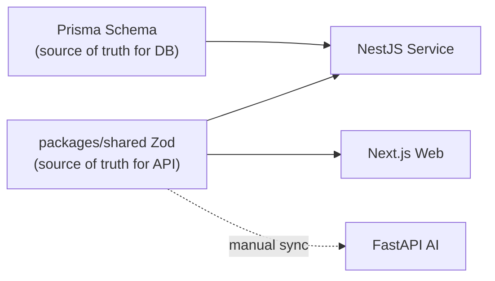

# 🗃️ Data Model — Canonical Entity Definitions

> **Document:** `DATA-MODEL.md` | **Version:** 1.0 | **Last Updated:** July 2026  
> **Status:** ✅ Active | **Owner:** Staff Backend Architect | **Review Cadence:** Quarterly  
> **Related:** [DatabaseArchitecture.md](../09-database/DatabaseArchitecture.md) | [50-DATA-CONTRACTS.md](./50-DATA-CONTRACTS.md) | [12-API.md](./12-API.md)

---

## Executive Summary

This document defines the canonical data model for all entities across the Portfolio platform. It serves as the authoritative map of entity relationships, field definitions, and cross-service data flow patterns. The source of truth for database schema is the Prisma schema at `apps/api/prisma/schema.prisma`, while cross-service type safety is enforced via Zod schemas in `packages/shared`. This document bridges the gap between the physical database layout and the logical type contracts consumed by the three services (Next.js, NestJS, FastAPI), providing a holistic view of data ownership, flow, and governance.

---

## 1. Entity Domain Overview

The platform data model spans **7 logical domains** comprising **37 database tables**:

| Domain          | Tables                                                                                                                                                                                                          | Primary Owner           | Criticality        |
| --------------- | --------------------------------------------------------------------------------------------------------------------------------------------------------------------------------------------------------------- | ----------------------- | ------------------ |
| **User & Auth** | `users`, `roles`, `permissions`, `user_roles`, `sessions`, `api_keys`                                                                                                                                           | NestJS Auth Module      | 🔴 Critical  |
| **Content**     | `sections`, `projects`, `project_images`, `blog_posts`, `post_tags`, `testimonials`, `skills`, `experiences`, `achievements`, `services`, `case_studies`, `press_features`, `guest_appearances`, `reading_list` | NestJS Content Module   | 🔴 Critical  |
| **Lead**        | `leads`, `lead_notes`, `lead_activities`                                                                                                                                                                        | NestJS Lead Module      | 🔴 Critical  |
| **AI**          | `chat_conversations`, `chat_messages`, `document_chunks`, `embeddings_cache`                                                                                                                                    | FastAPI AI Service      | 🟡 Important |
| **Analytics**   | `analytics_events`, `analytics_sessions`, `page_views`                                                                                                                                                          | NestJS Analytics Module | 🟢 Normal    |
| **Media**       | `media_assets`                                                                                                                                                                                                  | NestJS Upload Module    | 🟡 Important |
| **System**      | `system_settings`, `notifications`, `audit_logs`, `feature_flags`, `availability_status`, `admin_activities`                                                                                                    | NestJS Admin Module     | 🔴 Critical  |

---

## 2. Cross-Service Data Contract Architecture

The canonical data contract lives in `packages/shared/src/schemas/`, with Zod schemas per domain:

```text
packages/shared/src/schemas/
├── section.ts     # Section CRUD
├── project.ts     # Project + images
├── blog.ts        # Blog post + tags
├── lead.ts        # Lead submission + status
├── analytics.ts   # Analytics event shapes
├── ai.ts          # Chat message + conversation
└── auth.ts        # Login, token, user profile
```

**Consumption pattern:**



Each Zod schema is extended via `z.object().extend()` to produce typed input/output pairs. NestJS derives its DTOs via `nestjs-zod`; the frontend consumes the same schemas via `@hookform/resolvers/zod`. The FastAPI service maintains manually-synced Pydantic models with documented last-synced timestamps (see [50-DATA-CONTRACTS.md](./50-DATA-CONTRACTS.md#33-fastapi-pydantic-models-manual-sync)).

---

## 3. Entity Relationship Map

### 3.1 Core Content Entities

```
sections ──┐
           ├── controls display ordering for all content sections
projects ──┼── has_many project_images
           ├── has_one case_study
blog_posts ┼── has_many post_tags
skills ────┤
testimonials ┤
experiences ┤
```

### 3.2 Lead & Interaction Entities

```
leads ────── has_many lead_notes
        └── has_many lead_activities
```

### 3.3 AI Entities

```
chat_conversations ── has_many chat_messages
document_chunks ───── stores vector embeddings
embeddings_cache ──── caches LLM embedding results
```

### 3.4 Analytics Entities

```
analytics_sessions ── has_many analytics_events (via session_id)
analytics_sessions ── has_many page_views (via session_id)
```

### 3.5 User & System Entities

```
users ── has_many user_roles
      ├── has_many sessions
      ├── has_many audit_logs
      ├── has_many admin_activities
      └── has_many lead_notes (as author)
```

Full ERD with column-level definitions is available in [DatabaseArchitecture.md](../09-database/DatabaseArchitecture.md#6-entity-relationship-diagram).

---

## 4. Data Flow Patterns

| Pattern             | Source     | Destination                         | Mechanism                                    | Consistency Model                |
| ------------------- | ---------- | ----------------------------------- | -------------------------------------------- | -------------------------------- |
| Public content read | PostgreSQL | Next.js ISR                         | Direct Supabase client via Server Components | Stale-while-revalidate (ISR 60s) |
| Admin CRUD          | NestJS     | PostgreSQL                          | Prisma via `PrismaService`                   | Strong consistency               |
| AI chat inference   | FastAPI    | PostgreSQL                          | `psycopg2` direct connection                 | Session-level consistency        |
| Analytics ingestion | Browser    | NestJS → PostgreSQL          | POST `/analytics/events`                     | Best-effort (fire-and-forget)    |
| Lead submission     | Browser    | NestJS → PostgreSQL + Resend | POST `/leads` → webhook trigger       | At-least-once with dedup         |
| Embedding cache     | FastAPI    | PostgreSQL                          | Document upsert                              | Write-through                    |

---

## 5. Prisma Schema Source of Truth

The Prisma schema at `apps/api/prisma/schema.prisma` is the authoritative database-level definition. Key conventions:

| Convention  | Rule                                       | Example                                                            |
| ----------- | ------------------------------------------ | ------------------------------------------------------------------ |
| Model names | PascalCase, singular                       | `ProjectImage`, not `ProjectImages`                                |
| Field names | camelCase                                  | `displayOrder`, not `display_order`                                |
| IDs         | `@id @default(uuid())` on all models       | `id String @id @default(uuid())`                                   |
| Timestamps  | `createdAt` and `updatedAt` on every model | `createdAt DateTime @default(now())`                               |
| Relations   | Explicit with `@relation`                  | `project Project @relation(fields: [projectId], references: [id])` |

Run `npm run prisma:generate` from `apps/api` after any schema change (generates to custom path `apps/api/generated/prisma`).

---

## 6. Related Documentation

| Reference                                                                       | Description                                                                   |
| ------------------------------------------------------------------------------- | ----------------------------------------------------------------------------- |
| [DatabaseArchitecture.md](../09-database/DatabaseArchitecture.md)               | Complete database schema, indexing, RLS, and migration strategy               |
| [50-DATA-CONTRACTS.md](./50-DATA-CONTRACTS.md)                                  | Cross-service type safety with Zod, Pydantic sync, contract change management |
| [12-API.md](./12-API.md)                                                        | API endpoints consuming these data models (request/response shapes)           |
| [08f-DATABASE-IMPLEMENTATION.md](../09-database/08f-DATABASE-IMPLEMENTATION.md) | SQL migration scripts and deployment procedures                               |
| [ERD.md](../09-database/ERD.md)                                                 | Standalone entity-relationship diagram                                        |

---

## Change Log

| Version | Date     | Changes                                                                                                            | Author                  |
| ------- | -------- | ------------------------------------------------------------------------------------------------------------------ | ----------------------- |
| 1.0     | Jul 2026 | Initial canonical data model — entity domains, contract architecture, data flow patterns, Prisma conventions | Staff Backend Architect |

---

_Document Version: 1.0 — Enterprise Edition_

## Cross-References

- [../MASTER-INDEX.md](../MASTER-INDEX.md) — Documentation master index
- [../26-reference/CROSS-REFERENCE-INDEX.md](../26-reference/CROSS-REFERENCE-INDEX.md) — Cross-reference system
