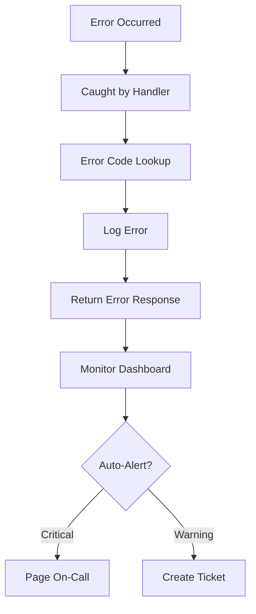

# Error Handling Architecture — FAANG Enterprise Error Catalog

> **Document:** `ErrorHandling.md` | **Version:** 5.0 (Enterprise Upgrade) | **Last Updated:** July 2026  
> **Status:** ✅ Active | **Owner:** Principal Backend Architect | **Review Cadence:** Quarterly  
> **Related:** [APIContracts.md](./APIContracts.md) | [SystemArchitecture.md](./SystemArchitecture.md)

---

## Executive Summary

The FAANG-grade Error Catalog defines standardized error codes across domains (AUTH, LEAD, PROJ, BLOG, SECT, AI, MEDIA, SYS, VAL) following the `{DOMAIN}_{NNN}` format. Each error maps to an HTTP status code, integrates deeply with multi-LLM error interpretation logic, and includes localized user-facing messaging alongside comprehensive developer debugging hints that pipe directly into Sentry.

## Error Flow Diagram

## Cross-References

| Reference                              | Description                                |
| -------------------------------------- | ------------------------------------------ |
| docs/10-api/12-API.md                  | API error response format and status codes |
| docs/10-api/44-API-STANDARDS.md        | API standards for error handling           |
| docs/21-operations/22-OBSERVABILITY.md | Error monitoring and alerting              |
| docs/MASTER-INDEX.md                   | Full document dependency graph             |

---

## Table of Contents

1. [Error Code Registry](#1-error-code-registry)
2. [Error Messages (User-Facing)](#2-error-messages-user-facing)
3. [Error Messages (Developer-Facing)](#3-error-messages-developer-facing)
4. [HTTP Status Code Usage](#4-http-status-code-usage)

---

## 1. Error Code Registry

### 1.1 Code Format

Error codes follow the pattern: `{DOMAIN}_{NNN}`

| Domain Prefix | Service                        | Range   |
| :-----------: | ------------------------------ | ------- |
|    `AUTH`     | Authentication & Authorization | 001–020 |
|    `LEAD`     | Lead Management                | 001–010 |
|    `PROJ`     | Projects                       | 001–010 |
|    `BLOG`     | Blog Posts                     | 001–010 |
|    `SECT`     | Sections                       | 001–010 |
|     `AI`      | AI Service (Chat, RAG)         | 001–020 |
|    `MEDIA`    | Media/File Upload              | 001–010 |
|     `SYS`     | System/Infrastructure          | 001–020 |
|     `VAL`     | Validation (cross-domain)      | 001–010 |

### 1.2 Authentication Errors (AUTH_xxx)

| Code       | HTTP Status | Description              | When Triggered                                   |
| ---------- | :---------: | ------------------------ | ------------------------------------------------ |
| `AUTH_001` |     401     | Authentication required  | No token provided on protected route             |
| `AUTH_002` |     401     | Token expired            | JWT `exp` claim in the past                      |
| `AUTH_003` |     401     | Token signature invalid  | JWT signature verification failed                |
| `AUTH_004` |     401     | Token malformed          | JWT structure invalid or unparseable             |
| `AUTH_005` |     403     | Insufficient permissions | Valid token but wrong role for endpoint          |
| `AUTH_006` |     401     | Session revoked          | Refresh token in `sessions` table marked revoked |
| `AUTH_007` |     401     | Refresh token expired    | Refresh token beyond 7-day lifetime              |
| `AUTH_008` |     401     | OAuth callback failed    | OAuth provider returned error                    |
| `AUTH_009` |     403     | Account disabled         | `users.is_active = false`                        |
| `AUTH_010` |     401     | Token issuer mismatch    | JWT `iss` claim doesn't match Supabase project   |

### 1.3 Lead Errors (LEAD_xxx)

| Code       | HTTP Status | Description               | When Triggered                              |
| ---------- | :---------: | ------------------------- | ------------------------------------------- |
| `LEAD_001` |     404     | Lead not found            | GET/PUT/DELETE with non-existent lead ID    |
| `LEAD_002` |     422     | Lead validation failed    | Contact form submission with invalid fields |
| `LEAD_003` |     422     | Invalid email format      | Email doesn't match RFC 5321 regex          |
| `LEAD_004` |     409     | Duplicate lead (same day) | Same email submitted within 24 hours        |
| `LEAD_005` |     422     | Message too short/long    | Message outside 10-5000 character range     |

### 1.4 Project Errors (PROJ_xxx)

| Code       | HTTP Status | Description                 | When Triggered                                |
| ---------- | :---------: | --------------------------- | --------------------------------------------- |
| `PROJ_001` |     404     | Project not found           | GET with non-existent slug or ID              |
| `PROJ_002` |     422     | Project validation failed   | Create/update with invalid fields             |
| `PROJ_003` |     409     | Slug already exists         | Duplicate slug on create                      |
| `PROJ_004` |     403     | Private project (no access) | Visitor accessing `is_private = true` project |
| `PROJ_005` |     422     | Invalid image format        | Upload non-image file as project image        |
| `PROJ_006` |     413     | Image too large             | Image exceeds 5MB limit                       |
| `PROJ_007` |     422     | Too many images             | Project exceeds 10-image limit                |
| `PROJ_008` |     400     | Invalid slug format         | Slug contains non-alphanumeric characters     |

### 1.5 Blog Errors (BLOG_xxx)

| Code       | HTTP Status | Description                   | When Triggered                             |
| ---------- | :---------: | ----------------------------- | ------------------------------------------ |
| `BLOG_001` |     404     | Blog post not found           | GET with non-existent slug or ID           |
| `BLOG_002` |     422     | Post validation failed        | Create/update with invalid fields          |
| `BLOG_003` |     409     | Slug already exists           | Duplicate slug on create                   |
| `BLOG_004` |     403     | Draft post (no public access) | Visitor accessing `published = false` post |

### 1.6 Section Errors (SECT_xxx)

| Code       | HTTP Status | Description                | When Triggered                           |
| ---------- | :---------: | -------------------------- | ---------------------------------------- |
| `SECT_001` |     404     | Section not found          | GET/PUT/DELETE with non-existent section |
| `SECT_002` |     422     | Section validation failed  | Create/update with invalid fields        |
| `SECT_003` |     409     | Section key already exists | Duplicate `section_key`                  |
| `SECT_004` |     422     | Invalid display order      | Display order < 0 or duplicate           |

### 1.7 AI Errors (AI_xxx)

| Code     | HTTP Status | Description                 | When Triggered                       |
| -------- | :---------: | --------------------------- | ------------------------------------ |
| `AI_001` |     503     | AI service unavailable      | FastAPI health check failing         |
| `AI_002` |     504     | AI response timeout         | LLM response exceeds 30s timeout     |
| `AI_003` |     429     | Chat rate limit exceeded    | >20 messages per session             |
| `AI_004` |     422     | Message too long            | Chat message exceeds 2000 characters |
| `AI_005` |     422     | Empty message               | Chat message is blank                |
| `AI_006` |     500     | Embedding generation failed | OpenAI embedding API returned error  |
| `AI_007` |     500     | RAG retrieval failed        | pgvector similarity search error     |
| `AI_008` |     503     | OpenAI API unavailable      | OpenAI API returning 5xx             |
| `AI_009` |     429     | OpenAI rate limit           | OpenAI API returning 429             |
| `AI_010` |     500     | Model routing failed        | No suitable model available          |

### 1.8 Media Errors (MEDIA_xxx)

| Code        | HTTP Status | Description           | When Triggered                          |
| ----------- | :---------: | --------------------- | --------------------------------------- |
| `MEDIA_001` |     413     | File too large        | Upload exceeds 10MB limit               |
| `MEDIA_002` |     415     | Unsupported file type | Non-allowed MIME type                   |
| `MEDIA_003` |     404     | File not found        | Requested asset doesn't exist           |
| `MEDIA_004` |     500     | Upload failed         | Supabase Storage API error              |
| `MEDIA_005` |     422     | Missing alt text      | Image upload without accessibility text |

### 1.9 System Errors (SYS_xxx)

| Code      | HTTP Status | Description             | When Triggered                                  |
| --------- | :---------: | ----------------------- | ----------------------------------------------- |
| `SYS_001` |     400     | Malformed request body  | Invalid JSON in request body                    |
| `SYS_002` |     400     | Missing required header | Required header not provided                    |
| `SYS_003` |     404     | Endpoint not found      | Request to non-existent route                   |
| `SYS_004` |     405     | Method not allowed      | Wrong HTTP method for endpoint                  |
| `SYS_005` |     429     | Rate limit exceeded     | Generic rate limit (see tiers in API-STANDARDS) |
| `SYS_006` |     500     | Internal server error   | Unhandled exception                             |
| `SYS_007` |     503     | Database unavailable    | Supabase connection failure                     |
| `SYS_008` |     503     | Service maintenance     | Planned maintenance window                      |
| `SYS_009` |     502     | Upstream service error  | External API (Resend, PostHog) failure          |
| `SYS_010` |     413     | Request body too large  | Body exceeds 1MB limit                          |

---

## 2. Error Messages (User-Facing)

User-facing messages are clear, helpful, and non-technical:

| Code       | User-Facing Message                                                                |
| ---------- | ---------------------------------------------------------------------------------- |
| `AUTH_001` | "Please sign in to access this page."                                              |
| `AUTH_002` | "Your session has expired. Please sign in again."                                  |
| `AUTH_005` | "You don't have permission to perform this action."                                |
| `LEAD_002` | "Please check your form and fix the highlighted fields."                           |
| `LEAD_003` | "Please enter a valid email address."                                              |
| `LEAD_004` | "You've already submitted a message today. We'll get back to you soon!"            |
| `LEAD_005` | "Your message must be between 10 and 5,000 characters."                            |
| `PROJ_001` | "This project doesn't exist or may have been removed."                             |
| `AI_001`   | "The AI assistant is temporarily unavailable. Please try again in a few minutes."  |
| `AI_002`   | "The AI is taking too long to respond. Please try a shorter question."             |
| `AI_003`   | "You've reached the chat limit for this session. Please start a new conversation." |
| `SYS_005`  | "You're making too many requests. Please wait a moment and try again."             |
| `SYS_006`  | "Something went wrong on our end. Please try again later."                         |

---

## 3. Error Messages (Developer-Facing)

Developer messages include debugging hints logged to Sentry/console:

| Code       | Developer Message                                                    | Suggested Fix                                        |
| ---------- | -------------------------------------------------------------------- | ---------------------------------------------------- |
| `AUTH_001` | `No Authorization header or sb-access-token cookie found`            | Check middleware cookie extraction, verify auth flow |
| `AUTH_003` | `JWT signature verification failed with RS256`                       | Check SUPABASE_JWT_SECRET, verify token source       |
| `LEAD_003` | `Email validation failed: "{value}" does not match RFC 5321 pattern` | Check Zod email() schema, inspect raw input          |
| `AI_006`   | `OpenAI embedding API returned {status}: {message}`                  | Check OPENAI_API_KEY, verify model availability      |
| `AI_007`   | `pgvector similarity search failed: {pg_error}`                      | Check IVFFlat index, verify embedding dimensions     |
| `SYS_006`  | `Unhandled exception: {error.stack}`                                 | Check Sentry for full stack trace                    |
| `SYS_007`  | `Supabase connection failed after 3 retries: {connection_error}`     | Check SUPABASE_URL, verify Supabase status           |

---

## 4. HTTP Status Code Usage

### 4.1 When to Use Which Status Code

| Status  | Name                   | Use Case                                          | Portfolio Example                          |
| :-----: | ---------------------- | ------------------------------------------------- | ------------------------------------------ |
| **200** | OK                     | Successful read, update, or action                | `GET /sections`, `PUT /admin/sections/:id` |
| **201** | Created                | Resource successfully created                     | `POST /leads`, `POST /admin/projects`      |
| **204** | No Content             | Successful deletion (no body)                     | `DELETE /admin/sections/:id`               |
| **400** | Bad Request            | Malformed request (invalid JSON, missing headers) | Unparseable request body                   |
| **401** | Unauthorized           | Authentication required or token invalid          | Missing/expired JWT                        |
| **403** | Forbidden              | Authenticated but insufficient permissions        | Visitor accessing admin endpoint           |
| **404** | Not Found              | Resource doesn't exist                            | Project with unknown slug                  |
| **405** | Method Not Allowed     | Wrong HTTP method                                 | POST to a GET-only endpoint                |
| **409** | Conflict               | Resource conflict (duplicate)                     | Duplicate slug, duplicate email (same day) |
| **413** | Payload Too Large      | Request body or file too large                    | Image > 5MB, body > 1MB                    |
| **415** | Unsupported Media Type | Wrong content type                                | Non-JSON body, non-image upload            |
| **422** | Unprocessable Entity   | Validation error (correct format, invalid values) | Email format invalid, message too short    |
| **429** | Too Many Requests      | Rate limit exceeded                               | > 3 contact forms per hour                 |
| **500** | Internal Server Error  | Unhandled server error                            | Uncaught exception                         |
| **502** | Bad Gateway            | Upstream service error                            | Resend/PostHog API failure                 |
| **503** | Service Unavailable    | Service down or in maintenance                    | Supabase outage, AI service down           |
| **504** | Gateway Timeout        | Upstream timeout                                  | AI response > 30s                          |

### 4.2 400 vs 422 Decision Guide

| Scenario                        | Status  | Rationale                             |
| ------------------------------- | :-----: | ------------------------------------- |
| Request body is not valid JSON  | **400** | Can't even parse the request          |
| Required field is missing       | **422** | Parsed OK, but invalid content        |
| Field value is wrong type       | **422** | Parsed OK, but invalid content        |
| Field value fails business rule | **422** | Valid format, invalid value           |
| Content-Type header is wrong    | **415** | Not a validation issue — format issue |

---

## Change Log

| Version | Date     | Changes                                                                       | Author                  |
| ------- | -------- | ----------------------------------------------------------------------------- | ----------------------- |
| 1.1     | Jun 2026 | Added Executive Summary, Decision Log, Risk Register, Glossary                | Chief Architect         |
| 1.0     | Jun 2026 | Initial error catalog — 60+ error codes, user/dev messages, status code guide | Staff Backend Architect |

---

## Decision Log

| ID        | Decision                                                                                        | Rationale                                                                                                                    | Alternatives Considered                                                                                                                                                                          | Date     | Approver                |
| --------- | ----------------------------------------------------------------------------------------------- | ---------------------------------------------------------------------------------------------------------------------------- | ------------------------------------------------------------------------------------------------------------------------------------------------------------------------------------------------ | -------- | ----------------------- |
| D-ERR-001 | Use `{DOMAIN}_{NNN}` error code format with 3-letter domain prefixes                            | Self-documenting: domain prefix identifies error origin at a glance; numeric suffix allows up to 999 codes per domain        | HTTP status-only (rejected — too coarse, same status for different error types); UUID error codes (rejected — not human-readable); single numeric sequence (rejected — no domain identification) | Jun 2026 | Staff Backend Architect |
| D-ERR-002 | Separate error messages into user-facing (non-technical) and developer-facing (debugging) tiers | User messages prioritized for clarity to visitors; developer messages include stack traces and fix suggestions for debugging | Single message per error (rejected — either too technical for users or too vague for developers); three tiers (rejected — unnecessary complexity)                                                | Jun 2026 | Staff Backend Architect |
| D-ERR-003 | Map each error code to a specific HTTP status code rather than using a generic 400/500          | Enables precise client-side error handling; API consumers can switch on status code before parsing error code                | All errors return 400 (rejected — loses semantic meaning); all errors return 500 (rejected — indistinguishable from server failures)                                                             | Jun 2026 | Staff Backend Architect |
| D-ERR-004 | Use 422 for validation errors, 400 for malformed requests, 415 for content type issues          | Follows RFC 4918 and common API practice; clear separation between parse failures (400) and content validation (422)         | Use 400 for everything (rejected — too ambiguous); use 422 for everything (rejected — incorrect for parse failures); use 409 for validation (rejected — reserved for conflicts)                  | Jun 2026 | Staff Backend Architect |
| D-ERR-005 | Add developer-facing suggested fix instructions to Sentry logging                               | Reduces MTTR by guiding engineers to common fixes without requiring full context investigation                               | Only log error code (rejected — engineer must cross-reference catalog); only log stack trace (rejected — no actionable guidance)                                                                 | Jun 2026 | Staff Backend Architect |
| D-ERR-006 | Reserve 001-020 range for AUTH domain (largest domain) and 001-010 for smaller domains          | Ensures sufficient room for growth in auth (10 current codes, 10 reserved) while keeping smaller domains compact             | Equal ranges for all domains (rejected — waste for small domains, insufficient for auth); dynamic ranges (rejected — no structure)                                                               | Jun 2026 | Staff Backend Architect |

## Risk Register

| ID        | Risk                                                                                          | Likelihood | Impact | Mitigation                                                                                                                        |
| --------- | --------------------------------------------------------------------------------------------- | ---------- | ------ | --------------------------------------------------------------------------------------------------------------------------------- |
| R-ERR-001 | Developers introduce new error codes without registering them in this catalog                 | Medium     | Medium | Add CI lint rule to enforce that all thrown error codes exist in catalog.json; schedule quarterly catalog audit                   |
| R-ERR-002 | User-facing messages are not internationalized, causing poor UX for non-English visitors      | Medium     | Low    | Add locale field to error response envelope; mark all user messages for i18n extraction; implement Accept-Language header parsing |
| R-ERR-003 | Developer-facing messages expose internal implementation details to client in non-debug modes | Low        | High   | Strip developer message in production response (use only for Sentry/logs); controlled via environment flag DEV_ERROR_DETAIL       |
| R-ERR-004 | Error code range exhaustion in AUTH domain (001-020) as auth complexity grows                 | Low        | Low    | Expand AUTH range to 001-050 on next major version; consolidate rarely-used error codes if needed                                 |
| R-ERR-005 | HTTP status code mapping drifts from actual implementation in API endpoints                   | Medium     | Medium | Add automated contract tests that verify status code returned matches documented mapping; run as CI gate                          |

## Glossary

| Term                         | Definition                                                                                                                       |
| ---------------------------- | -------------------------------------------------------------------------------------------------------------------------------- |
| **Error Code**               | A unique application-level identifier in the format `{DOMAIN}_{NNN}` that identifies a specific error condition                  |
| **HTTP Status Code**         | A three-digit HTTP response status indicating the result of the request (e.g., 200 OK, 404 Not Found, 500 Internal Server Error) |
| **User-Facing Message**      | A clear, non-technical error message displayed directly to visitors in the UI                                                    |
| **Developer-Facing Message** | A technical error message including debugging context and suggested fixes, logged to Sentry or console                           |
| **Trace ID**                 | A unique request identifier (`req_xxx`) for correlating error responses with server logs                                         |
| **MTTR**                     | Mean Time To Resolve — the average time from incident detection to resolution                                                    |
| **RFC 5321**                 | The technical standard defining valid email address formats, used for email validation                                           |
| **Zod**                      | A TypeScript schema validation library used for runtime type checking and error generation                                       |
| **Validation Error**         | An error indicating that the request was parsed successfully but the content failed business rule validation                     |
| **Malformed Request**        | An error indicating the request could not be parsed (e.g., invalid JSON, missing required headers)                               |
| **Sentry**                   | An error tracking and performance monitoring platform for debugging production issues                                            |
| **i18n**                     | Internationalization — the process of designing software to support multiple languages and locales                               |

---

_Document Version: 1.1 — Enterprise Edition_

---

## Cross-References

| Reference           | Description                                            |
| ------------------- | ------------------------------------------------------ |
| See MASTER-INDEX.md | Full document dependency graph and cross-reference map |

---

## Cross-References

| Reference           | Description                                            |
| ------------------- | ------------------------------------------------------ |
| See MASTER-INDEX.md | Full document dependency graph and cross-reference map |
