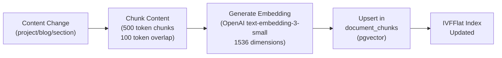

# Search Architecture — Full-Text & Vector Search

> **Document:** `48-SEARCH-ARCHITECTURE.md` | **Version:** 1.1 | **Last Updated:** June 2026  
> **Status:** ✅ Active | **Owner:** Staff Backend Architect | **Review Cadence:** Quarterly  
> **Related:** [DatabaseArchitecture.md](./DatabaseArchitecture.md) | [19-RAG.md](./19-RAG.md) | [12-API.md](./12-API.md)

---

## Executive Summary

The search architecture provides four search modes across six content types: full-text search (PostgreSQL tsvector with GIN indexes), semantic search (pgvector cosine similarity with IVFFlat index), filter search (SQL WHERE clauses), and hybrid search (FTS + filter combined). Searchable content includes projects (~20), blog posts (~50), skills (~30), case studies (~10), experiences (~15), and AI chat context (~500 chunks). FTS uses weighted tsvector columns (title=A, description=B, tech_stack/content=C) for relevance ranking, with trigram indexes for fuzzy typo-tolerant matching. Semantic search uses 1536-dimension OpenAI embeddings stored in pgvector with a 0.7 similarity threshold and k=3 retrieval for RAG context. A unified `/v1/search` endpoint serves all modes with consistent response format including result highlights. The embedding pipeline auto-triggers on content CRUD and supports full reindex via nightly batch or manual trigger.

---

## 1. Search Requirements

### 1.1 What Users Search

| Search Target   | Content Type                          |   Volume    |    Search Mode    |
| --------------- | ------------------------------------- | :---------: | :---------------: |
| Projects        | Title, description, tech_stack        |  ~20 items  |   FTS + filter    |
| Blog Posts      | Title, excerpt, content, tags         |  ~50 items  |        FTS        |
| Skills          | Name, category                        |  ~30 items  |    Filter only    |
| Case Studies    | Challenge, approach, solution, impact |  ~10 items  |        FTS        |
| Experiences     | Company, role, description            |  ~15 items  |    Filter only    |
| AI Chat Context | All portfolio content (RAG)           | ~500 chunks | Vector (semantic) |

### 1.2 Search Modes

| Mode                       | Technology                         | Use Case                                                           | Response Time |
| -------------------------- | ---------------------------------- | ------------------------------------------------------------------ | :-----------: |
| **Full-Text Search (FTS)** | PostgreSQL `tsvector` + `ts_query` | Keyword search: "React dashboard"                                  |    < 20ms     |
| **Semantic Search**        | pgvector cosine similarity         | AI chat context retrieval: "Tell me about your backend experience" |    < 50ms     |
| **Filter Search**          | SQL WHERE clauses                  | Category/tech/year filtering                                       |    < 10ms     |
| **Hybrid**                 | FTS + Filter                       | Search + category filter: "React" in category "web"                |    < 30ms     |

---

## 2. FTS Implementation

### 2.1 tsvector Configuration

```sql
-- Add tsvector columns to searchable tables
ALTER TABLE projects ADD COLUMN search_vector tsvector
  GENERATED ALWAYS AS (
    setweight(to_tsvector('english', coalesce(title, '')), 'A') ||
    setweight(to_tsvector('english', coalesce(description, '')), 'B') ||
    setweight(to_tsvector('english', coalesce(array_to_string(tech_stack, ' '), '')), 'C')
  ) STORED;

ALTER TABLE blog_posts ADD COLUMN search_vector tsvector
  GENERATED ALWAYS AS (
    setweight(to_tsvector('english', coalesce(title, '')), 'A') ||
    setweight(to_tsvector('english', coalesce(excerpt, '')), 'B') ||
    setweight(to_tsvector('english', coalesce(content, '')), 'C')
  ) STORED;

-- GIN indexes for fast full-text search
CREATE INDEX idx_projects_search ON projects USING gin(search_vector);
CREATE INDEX idx_blog_posts_search ON blog_posts USING gin(search_vector);

-- Trigram indexes for fuzzy matching
CREATE INDEX idx_projects_title_trgm ON projects USING gin(title gin_trgm_ops);
CREATE INDEX idx_blog_posts_title_trgm ON blog_posts USING gin(title gin_trgm_ops);
```

### 2.2 Search Query Patterns

```sql
-- Ranked full-text search with highlighting
SELECT
  id, title, description,
  ts_rank(search_vector, query) AS rank,
  ts_headline('english', description, query, 'StartSel=<mark>, StopSel=</mark>') AS highlight
FROM projects,
  to_tsquery('english', 'react & dashboard') AS query
WHERE search_vector @@ query
ORDER BY rank DESC
LIMIT 20;

-- Fuzzy search with trigrams (handles typos)
SELECT id, title, similarity(title, 'rreact') AS sim
FROM projects
WHERE title % 'rreact'
ORDER BY sim DESC
LIMIT 10;
```

---

## 3. Vector Search

### 3.1 pgvector Configuration

```sql
-- Enable pgvector extension
CREATE EXTENSION IF NOT EXISTS vector;

-- Document chunks with embeddings
CREATE TABLE document_chunks (
  id UUID PRIMARY KEY DEFAULT gen_random_uuid(),
  document_id TEXT NOT NULL,
  content TEXT NOT NULL,
  embedding VECTOR(1536),  -- OpenAI text-embedding-3-small dimensions
  chunk_index INTEGER NOT NULL,
  token_count INTEGER,
  metadata JSONB DEFAULT '{}',
  created_at TIMESTAMPTZ DEFAULT now()
);

-- IVFFlat index for approximate nearest neighbor
CREATE INDEX idx_document_chunks_embedding ON document_chunks
  USING ivfflat (embedding vector_cosine_ops) WITH (lists = 10);
```

### 3.2 Semantic Search Query

```sql
-- Find top-k similar chunks for RAG retrieval
SELECT
  id, content, metadata,
  1 - (embedding <=> $1::vector) AS similarity
FROM document_chunks
WHERE 1 - (embedding <=> $1::vector) > 0.7  -- Minimum similarity threshold
ORDER BY embedding <=> $1::vector
LIMIT 3;  -- k=3 for RAG context
```

---

## 4. Unified Search API

### 4.1 Endpoint Design

```http
GET /v1/search?q={query}&type={type}&mode={fts|semantic}&limit={limit}
```

| Parameter | Type    |  Default   | Description                                              |
| --------- | ------- | :--------: | -------------------------------------------------------- |
| `q`       | string  | (required) | Search query                                             |
| `type`    | string  |   `all`    | Resource type: `all`, `projects`, `blog`, `case_studies` |
| `mode`    | string  |   `fts`    | Search mode: `fts` (keyword) or `semantic` (AI)          |
| `limit`   | integer |    `10`    | Max results per type                                     |

### 4.2 Response Format

```json
{
  "data": {
    "projects": [
      {
        "id": "proj_001",
        "title": "Portfolio Platform",
        "description": "...",
        "highlight": "Built with <mark>React</mark> and Next.js...",
        "score": 0.95,
        "type": "project"
      }
    ],
    "blog_posts": [
      {
        "id": "blog_001",
        "title": "Building with React Server Components",
        "highlight": "...",
        "score": 0.82,
        "type": "blog_post"
      }
    ]
  },
  "meta": {
    "query": "react",
    "mode": "fts",
    "total_results": 8,
    "search_time_ms": 12
  }
}
```

---

## 5. Search Indexing Pipeline

### 5.1 When to Reindex

| Trigger                       | Action                                                   |  Latency  |
| ----------------------------- | -------------------------------------------------------- | :-------: |
| Content CRUD operation        | Auto-update `search_vector` (generated column)           | Immediate |
| Admin publishes project       | Generate/update vector embeddings                        |   ~10s    |
| Admin publishes blog post     | Generate/update vector embeddings                        |   ~10s    |
| Nightly batch                 | Full reindex of all content + regenerate all embeddings  |  2-5 min  |
| Admin triggers manual rebuild | Drop + recreate IVFFlat index, regenerate all embeddings | 5-10 min  |

### 5.2 Embedding Pipeline



---

## Change Log

| Version | Date     | Changes                                                                          | Author                  |
| ------- | -------- | -------------------------------------------------------------------------------- | ----------------------- |
| 1.1     | Jun 2026 | Added Executive Summary, Decision Log, Risk Register, Glossary                   | Chief Architect         |
| 1.0     | Jun 2026 | Initial search architecture — FTS, vector search, unified API, indexing pipeline | Staff Backend Architect |

---

## Decision Log

| ID         | Decision                                                                | Rationale                                                                                                                           | Alternatives Considered                                                                                                                                                                     | Date     | Approver                |
| ---------- | ----------------------------------------------------------------------- | ----------------------------------------------------------------------------------------------------------------------------------- | ------------------------------------------------------------------------------------------------------------------------------------------------------------------------------------------- | -------- | ----------------------- |
| D-SRCH-001 | Use PostgreSQL tsvector for full-text search                            | No additional infrastructure; generated columns auto-update on content changes; GIN indexes provide <20ms query times               | Elasticsearch (rejected — operational overhead, added cost for small dataset); Algolia (rejected — vendor lock-in, paid tier needed); Meilisearch (rejected — additional service to manage) | Jun 2026 | Staff Backend Architect |
| D-SRCH-002 | Use pgvector with IVFFlat index for semantic search                     | In-database vector search eliminates separate vector DB; IVFFlat provides good accuracy/speed tradeoff at 500 chunk scale           | Pinecone (rejected — $70/mo minimum, overkill for 500 chunks); Weaviate (rejected — additional infrastructure); HNSW index (rejected — slower build time, not necessary at this scale)      | Jun 2026 | Staff Backend Architect |
| D-SRCH-003 | Use weighted tsvector with setweight('A','B','C') for relevance ranking | Title matches rank higher than description matches, which rank higher than tech_stack/content matches; aligns with user expectation | Uniform weight (rejected — all matches equal regardless of field); BM25 scoring only (rejected — no field-level control)                                                                    | Jun 2026 | Staff Backend Architect |
| D-SRCH-004 | Add trigram indexes for fuzzy/typo-tolerant search                      | Users commonly misspell or partially recall project names; trigram similarity handles this gracefully                               | Levenshtein distance in application code (rejected — no index support, slow); suggest-as-you-type only (rejected — doesn't help with already-typed queries)                                 | Jun 2026 | Staff Backend Architect |
| D-SRCH-005 | Set k=3 with 0.7 similarity threshold for RAG context retrieval         | 3 chunks provide sufficient context for LLM without overflowing the context window; 0.7 threshold filters irrelevant chunks         | k=1 (rejected — too little context); k=5+ (rejected — context window waste, slower); no threshold (rejected — irrelevant content pollutes response)                                         | Jun 2026 | Staff Backend Architect |
| D-SRCH-006 | Expose unified /v1/search endpoint rather than per-type endpoints       | Single endpoint enables cross-content-type search results; simpler client integration                                               | Per-type endpoints (rejected — /projects/search, /blog/search — client needs multiple calls); GraphQL (rejected — overkill for search-only use)                                             | Jun 2026 | Staff Backend Architect |

## Risk Register

| ID         | Risk                                                                                        | Likelihood | Impact | Mitigation                                                                                                                        |
| ---------- | ------------------------------------------------------------------------------------------- | ---------- | ------ | --------------------------------------------------------------------------------------------------------------------------------- |
| R-SRCH-001 | Embedding generation fails (OpenAI API down or rate limited), leaving document_chunks stale | Medium     | High   | Retry with exponential backoff; fallback to FTS-only search when embeddings unavailable; queue failed embeddings for reprocessing |
| R-SRCH-002 | IVFFlat index accuracy degrades as document_chunks grows beyond 500 vectors                 | Low        | Medium | Monitor query recall metrics; rebuild index monthly; upgrade to HNSW index if recall drops below 90%                              |
| R-SRCH-003 | tsvector search returns poor results for non-English content                                | Low        | Low    | Use `simple` dictionary as fallback; add language detection if multi-language content is added                                    |
| R-SRCH-004 | Concurrent content updates cause temporary inconsistency between FTS index and embeddings   | Medium     | Low    | FTS uses generated columns (always consistent); accept brief embedding staleness; nightly batch ensures full sync                 |
| R-SRCH-005 | trigram indexes grow large and slow down write operations on content tables                 | Low        | Medium | Trigram index on title only (not full text); benchmark write performance at 100+ content items                                    |

## Glossary

| Term                      | Definition                                                                                                                          |
| ------------------------- | ----------------------------------------------------------------------------------------------------------------------------------- |
| **tsvector**              | PostgreSQL data type that represents a document optimized for full-text search, storing lexemes with positional information         |
| **tsquery**               | PostgreSQL data type representing a full-text search query with boolean operators (&, \|, !)                                        |
| **GIN Index**             | Generalized Inverted Index — a PostgreSQL index type optimized for full-text search and array containment queries                   |
| **Trigram**               | A group of three consecutive characters used for fuzzy string matching; PostgreSQL pg_trgm extension enables similarity search      |
| **pgvector**              | A PostgreSQL extension for storing and querying vector embeddings with approximate nearest neighbor search                          |
| **IVFFlat**               | Inverted File with Flat Compression — an approximate nearest neighbor index that partitions vectors into lists for faster search    |
| **Embedding**             | A dense vector representation of text generated by an LLM (e.g., OpenAI text-embedding-3-small, 1536 dimensions)                    |
| **Cosine Similarity**     | A measure of similarity between two vectors calculated as the cosine of the angle between them (range: -1 to 1)                     |
| **RAG**                   | Retrieval-Augmented Generation — an AI pattern that retrieves relevant context from a knowledge base before generating a response   |
| **HNSW**                  | Hierarchical Navigable Small World — a graph-based ANN index offering better recall than IVFFlat at the cost of larger memory usage |
| **Lexeme**                | A normalized word form in PostgreSQL FTS (e.g., "running" normalizes to "run"), stored in tsvector for matching                     |
| **Weighting (setweight)** | Assigns importance levels (A=highest, D=lowest) to different tsvector content segments for relevance ranking                        |

---

_Document Version: 1.1 — Enterprise Edition_

---

## Cross-References

| Reference           | Description                                            |
| ------------------- | ------------------------------------------------------ |
| See MASTER-INDEX.md | Full document dependency graph and cross-reference map |

---

## Cross-References

| Reference            | Description                                            |
| -------------------- | ------------------------------------------------------ |
| docs/MASTER-INDEX.md | Full document dependency graph and cross-reference map |
