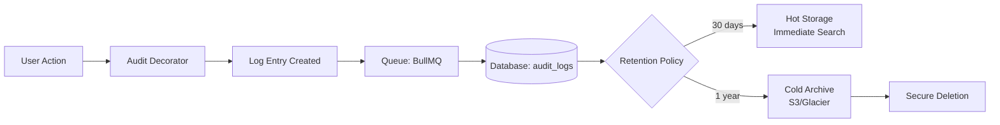

# Audit Logging Policy

## 1. Introduction
Audit logging is critical for security monitoring, compliance, and incident forensics. This document defines the strategy for generating, storing, and managing audit logs across the Ultimate Portfolio project.

## 2. Scope of Logging
The following events MUST be logged across the system:

### 2.1 Authentication & Authorization
- Successful and failed login attempts (Admin Dashboard).
- Password changes or resets.
- Access token issuance and revocation.

### 2.2 Administrative Actions
- Creation, modification, or deletion of portfolio items, blog posts, or configurations.
- Changes to user roles or permissions.
- Modifications to the system settings.

### 2.3 System & Security Events
- Application startups, shutdowns, and crashes.
- Unhandled exceptions and HTTP 5xx errors.
- Rate limiting triggers (HTTP 429).
- Detected AI prompt injection attempts (blocked by filters).

## 3. Standard Audit Log Schema
To ensure logs are parsable and searchable, all application logs (NestJS, FastAPI) must output structured JSON conforming to the following schema:

```json
{
  "timestamp": "2026-07-09T20:42:10Z",
  "level": "INFO|WARN|ERROR|FATAL",
  "event_type": "AUTH_SUCCESS | RESOURCE_UPDATE | SYSTEM_ERROR",
  "actor": {
    "user_id": "uuid-or-anonymous",
    "role": "admin | public",
    "ip_address": "192.168.1.1",
    "user_agent": "Mozilla/5.0..."
  },
  "action": {
    "method": "POST",
    "endpoint": "/api/admin/projects",
    "resource_id": "proj_12345"
  },
  "details": {
    "message": "Project updated successfully",
    "changes": "Updated description" // Omit sensitive data
  },
  "trace_id": "req_abc123"
}
```

## 4. Data Privacy & Sanitization
**CRITICAL:** Audit logs MUST NOT contain sensitive data. Before logging, the application must strip or mask:
- Passwords, hashes, and secrets.
- Full JWT tokens or session IDs.
- Personally Identifiable Information (PII) beyond what is strictly necessary for auditing (e.g., mask IP addresses if required by local compliance).

## 5. Storage and Retention
- **Log Aggregation:** Logs from Next.js, NestJS, and FastAPI are aggregated using a centralized logging agent (e.g., FluentBit or Datadog Agent) and forwarded to a secure log storage system (e.g., Datadog, AWS CloudWatch, or ELK Stack).
- **Immutability:** The log storage system must be append-only. No user, including administrators, should have permissions to alter or delete historical logs.
- **Retention Policy:**
  - **Hot Storage (Immediate Search):** 30 days.
  - **Cold Storage (Archive/S3):** 1 year (or as dictated by compliance requirements).
### 5.1 Audit Log Flow



## 6. Alerting
Automated alerts must be configured for critical events:
- Multiple failed login attempts from a single IP (Potential Brute Force).
- Any `FATAL` level log or sudden spike in `ERROR` logs.
- Privilege escalation events.

## Cross-References
- [../MASTER-INDEX.md](../MASTER-INDEX.md) — Documentation master index
- [../26-reference/CROSS-REFERENCE-INDEX.md](../26-reference/CROSS-REFERENCE-INDEX.md) — Cross-reference system