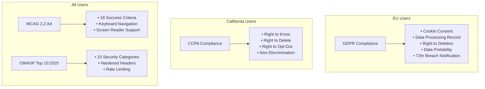
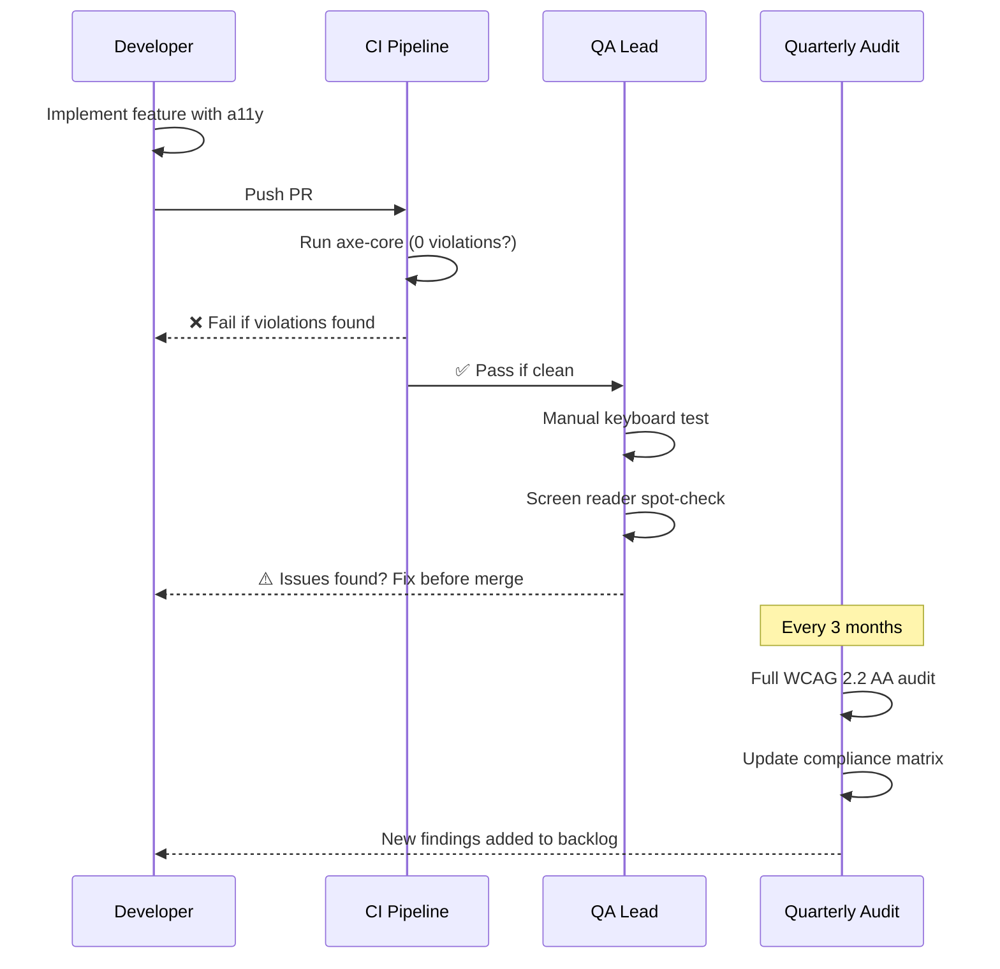
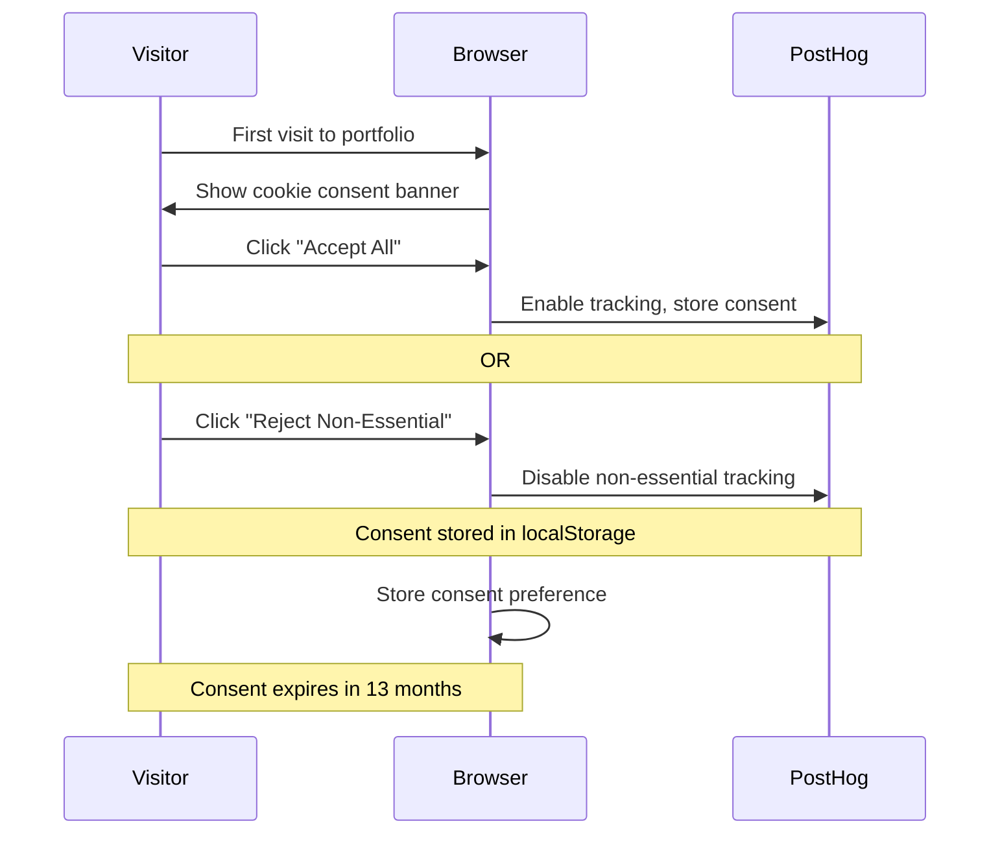
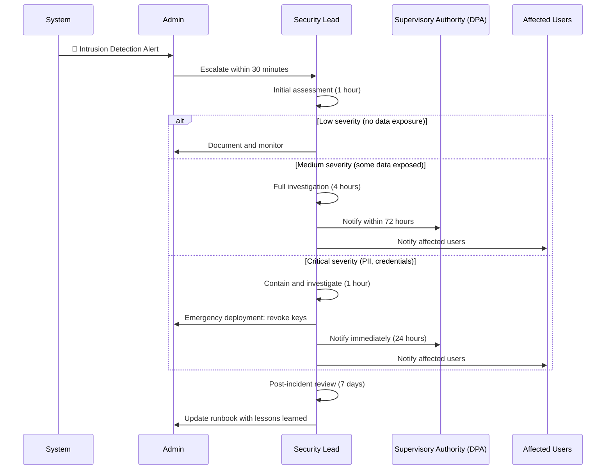

# ⚖️ Compliance Framework — Enterprise Standards & Regulatory Alignment

> **Document:** `16-COMPLIANCE.md` | **Version:** 4.0 | **Last Updated:** June 2026  
> **Status:** ✅ Active | **Owner:** Security Lead | **Review Cadence:** Quarterly  
> **Classification:** Internal — Engineering & Legal  
> **Compliance Posture:** WCAG 2.2 AA (In Progress) | OWASP Top 10:2025 (Implemented) | GDPR (Implemented) | CCPA (Implemented) | SOC 2 Type I (Planned Q4 2026)

---

## Table of Contents

1. [Executive Summary](#1-executive-summary)
2. [Compliance Maturity Model](#2-compliance-maturity-model)
3. [WCAG 2.2 AA Accessibility Compliance](#3-wcag-22-aa-accessibility-compliance)
4. [OWASP Top 10:2025 Security Compliance](#4-owasp-top-102025-security-compliance)
5. [GDPR Compliance (EU)](#5-gdpr-compliance-eu)
6. [CCPA Compliance (California)](#6-ccpa-compliance-california)
7. [SOC 2 Readiness Roadmap](#7-soc-2-readiness-roadmap)
8. [Risk Register: Compliance Gaps](#8-risk-register-compliance-gaps)
9. [Audit Schedule & Procedures](#9-audit-schedule--procedures)
10. [Data Subject Access Request (DSAR) Process](#10-data-subject-access-request-dsar-process)
11. [Breach Notification Procedure](#11-breach-notification-procedure)
12. [Compliance Enforcement Gates](#12-compliance-enforcement-gates)
13. [Cross-Reference Matrix](#13-cross-reference-matrix)
14. [Change Log & Review History](#14-change-log--review-history)

---

## 1. Executive Summary

This document defines the **compliance posture** for the Portfolio Platform across 4 regulatory standards and 1 aspirational framework. The platform is designed with **privacy-by-default** and **security-by-default** principles — every feature, data store, and integration is evaluated against compliance requirements before deployment.

### Compliance Snapshot

| Standard | Scope | Status | Target Date | Owner |
|----------|-------|--------|-------------|-------|
| **WCAG 2.2 AA** | All public-facing pages | 🔄 In Progress (85%) | Launch | Frontend Lead |
| **OWASP Top 10:2025** | API, Auth, Data Layer | ✅ Implemented | Complete | Security Lead |
| **GDPR** | EU visitor data | ✅ Implemented | Complete | Security Lead |
| **CCPA** | California visitor data | ✅ Implemented | Complete | Security Lead |
| **SOC 2 Type I** | Infrastructure, Access Controls | 📋 Planned | Q4 2026 | Security Lead |
| **ISO 27001** | Full ISMS | 🔮 Aspirational | 2027 | — |

### Regulatory Alignment Map



---

## 2. Compliance Maturity Model

### Five-Level Maturity Scale

| Level | Name | Description | Current State |
|-------|------|-------------|---------------|
| **L1** | Initial | Ad-hoc compliance, no formal process | — |
| **L2** | Managed | Basic compliance checks, documented | CCPA, GDPR |
| **L3** | Defined | Standardized processes, automation | OWASP |
| **L4** | Quantified | Metrics-driven, continuous monitoring | WCAG (target) |
| **L5** | Optimizing | Proactive improvement, industry-leading | SOC 2 (target) |

### Current Maturity by Domain

| Domain | Level | Evidence | Next Step |
|--------|-------|----------|-----------|
| **Accessibility** | L3 | Automated axe-core checks in CI, manual screen reader audits quarterly | L4: Continuous monitoring with real-user analytics |
| **Security** | L4 | OWASP compliance matrix, Dependabot, weekly npm audit, rate limiting | L5: Penetration testing quarterly |
| **Data Privacy** | L3 | Cookie consent, IP anonymization, data retention policies, DSAR process | L4: Automated data mapping, PII scanning |
| **Infrastructure** | L2 | Environment separation, secrets management | L3: Access control automation, audit logging |

---

## 3. WCAG 2.2 AA Accessibility Compliance

### Compliance Status by Principle

| Principle | Criteria Count | Compliant | In Progress | Score |
|-----------|---------------|-----------|-------------|-------|
| **Perceivable** | 10 | 8 | 2 | 80% |
| **Operable** | 12 | 10 | 2 | 83% |
| **Understandable** | 7 | 6 | 1 | 86% |
| **Robust** | 2 | 2 | 0 | 100% |
| **Total** | **31** | **26** | **5** | **84%** |

### Gap Analysis: Non-Compliant Criteria

| Criterion | Requirement | Status | Remediation | Owner | Target |
|-----------|-------------|--------|-------------|-------|--------|
| **1.4.10 Reflow** | No horizontal scroll at 400% zoom | 🔴 Open | Responsive audit of all pages | Frontend Lead | By Launch |
| **1.4.12 Text Spacing** | No content loss with adjusted spacing | 🟡 Partial | CSS audit, test suite | Frontend Lead | By Launch |
| **2.4.11 Focus Not Obscured** | Focused element not hidden by sticky header | 🔴 Open | Update scroll offset logic | Frontend Lead | Sprint 5 |
| **2.5.7 Dragging Movements** | Alternative for drag operations | 🟡 Partial | Add click alternatives | Frontend Lead | Sprint 6 |
| **3.2.6 Consistent Help** | Help/contact consistent across pages | 🟡 Partial | Audit all pages for consistent CTA | UX Lead | Sprint 4 |

### Verification Tools & Cadence

| Tool | What It Checks | Frequency | Gate |
|------|---------------|-----------|------|
| **axe-core (jest-axe)** | Automated WCAG violations (50+ rules) | Every PR | ✅ Blocking |
| **Lighthouse Accessibility** | Aggregate score, manual checks | Every PR | ✅ Blocking (≥ 95) |
| **Manual Keyboard Test** | Tab order, focus, skip link | Every feature | ✅ Blocking |
| **VoiceOver (macOS)** | Screen reader flow | Weekly | ⚠️ Warning |
| **NVDA (Windows)** | Screen reader flow | Monthly | ⚠️ Warning |
| **200% Zoom Test** | Reflow, text spacing | Every feature | ✅ Blocking |
| **Colour Contrast Analyser** | Contrast ratio verification | Per component | ✅ Blocking |

### Compliance Workflow



---

## 4. OWASP Top 10:2025 Security Compliance

### Compliance Matrix

| Category | Requirement | Implementation | Verification | Status |
|----------|-------------|---------------|--------------|--------|
| **A01: Broken Access Control** | JWT auth on admin routes, RLS on DB | Passport JWT guard, Supabase RLS | Integration tests verify 401/403 | ✅ |
| **A02: Cryptographic Failures** | HTTPS only, strong hashing (bcrypt 12) | Vercel auto-TLS, Supabase Auth | SSL Labs A+ test | ✅ |
| **A03: Injection** | Parameterized queries, input validation | Supabase SDK (parameterized), Zod | Penetration test (automated) | ✅ |
| **A04: Insecure Design** | Security review in DoD, threat modeling | ADR process includes security section | Architecture review board | ✅ |
| **A05: Security Misconfiguration** | Security headers on all responses | HSTS, CSP, XFO, X-Content-Type-Options | CI header check | ✅ |
| **A06: Vulnerable Components** | Weekly npm audit, Dependabot | GitHub Dependabot, CI audit gate | Dependabot alerts ≤ 24h | ✅ |
| **A07: Authentication Failures** | Rate limit on login, account lockout | @nestjs/throttler, 5-attempt lockout | Load test auth endpoint | ✅ |
| **A08: Data Integrity Failures** | CSRF protection, transactions | NestJS Passport CSRF, DB transactions | CSRF token verification | ✅ |
| **A09: Logging Failures** | Structured logging, correlation IDs | Pino logger, correlation middleware | Log audit quarterly | ✅ |
| **A10: SSRF** | Outbound request allowlist | URL validation middleware | Code review | ✅ |

### Non-Compliance Finding Log

| ID | Finding | Severity | Discovered | Remediation Plan | Status |
|----|---------|----------|------------|-----------------|--------|
| — | No findings to date | — | — | — | — |

### Security Header Verification

```bash
# Run on every deployment
curl -sI https://portfolioowner.com | grep -E "^(HTTP|X-Frame|X-Content|Referrer|Permissions|Strict-Transport|Content-Security)"

# Expected Output:
# HTTP/2 200
# X-Frame-Options: DENY
# X-Content-Type-Options: nosniff
# Referrer-Policy: strict-origin-when-cross-origin
# Permissions-Policy: camera=(), microphone=(), geolocation=()
# Strict-Transport-Security: max-age=63072000; includeSubDomains; preload
# Content-Security-Policy: (present and valid)
```

---

## 5. GDPR Compliance (EU)

### Applicability

GDPR applies to any visitor from the **European Economic Area (EEA)**. While the portfolio targets a global audience, compliance is implemented for all visitors (GDPR-safe-by-default).

### Data Processing Register

| Processing Activity | Data Categories | Legal Basis | Retention | Third-Party Processors |
|--------------------|----------------|-------------|-----------|------------------------|
| **Contact form submission** | Name, Email, Phone, Message, IP, Timestamp | Consent (checkbox) | 2 years | Supabase (DB), Resend (email) |
| **Analytics tracking** | Page views, clicks, device info, country | Legitimate interest | 13 months | PostHog |
| **Error tracking** | Error messages, stack traces, URL | Legitimate interest | 90 days | Sentry |
| **AI chat conversations** | Messages, session ID | Consent (by using chat) | 30 days | Supabase (DB), OpenAI, Anthropic |

### GDPR Rights Implementation

| Right | Implementation | SLA | API Endpoint |
|-------|---------------|-----|-------------|
| **Right to be Informed** | Privacy policy, cookie banner | Always visible | — |
| **Right of Access** | Data export endpoint | 30 days | `POST /api/privacy/export` |
| **Right to Rectification** | Profile settings in admin | 7 days | `PATCH /api/admin/profile` |
| **Right to Erasure** | Data deletion endpoint | 30 days | `POST /api/privacy/delete` |
| **Right to Restrict Processing** | Opt-out cookies | Immediate | PostHog opt-out |
| **Right to Data Portability** | JSON export | 30 days | `POST /api/privacy/export` |
| **Right to Object** | Cookie consent opt-out | Immediate | Cookie banner |
| **Automated Decision-Making** | None used (AI chat is not automated decision) | N/A | — |

### Cookie Consent Flow



---

## 6. CCPA Compliance (California)

### Applicability

CCPA applies to California residents. Implementation mirrors GDPR for simplicity — **all visitors receive the same privacy protections**.

### CCPA Rights Map

| Right | GDPR Equivalent | Implementation |
|-------|----------------|---------------|
| **Right to Know** | Right of Access | Same data export endpoint |
| **Right to Delete** | Right to Erasure | Same deletion endpoint |
| **Right to Opt-Out** | Right to Object | Cookie consent opt-out |
| **Right to Non-Discrimination** | — | No price/service difference based on privacy choices |

### CCPA-Specific Requirements

| Requirement | Implementation | Status |
|-------------|---------------|--------|
| **Notice at Collection** | Privacy policy link on contact form | ✅ |
| **Do Not Sell My Personal Information** | No personal information sold (ever) | ✅ |
| **Financial incentive disclosure** | No financial incentives offered | ✅ |
| **Minors (under 16) opt-in** | Contact form age verification (future) | 📋 Planned |

---

## 7. SOC 2 Readiness Roadmap

### Trust Services Criteria Mapping

| Criterion | Current State | Gap | Remediation | Target |
|-----------|--------------|-----|-------------|--------|
| **Security** — Protected against unauthorized access | OWASP compliance, JWT auth, RLS | No formal access review process | Quarterly access review | Q4 2026 |
| **Availability** — System available per commitment | 99.9% uptime target, Better Uptime monitoring | No formal availability SLA document | Create SLA doc | Q4 2026 |
| **Processing Integrity** — Processing complete/valid/accurate | Workflow validation, logging | No formal integrity testing | Add integrity monitoring | Q1 2027 |
| **Confidentiality** — Information restricted | Encryption at rest/transit, access controls | No confidentiality agreements documented | Document data classification | Q4 2026 |
| **Privacy** — Personal information collected/used/disposed | GDPR compliance, data retention | Formal privacy program documentation | Create privacy program doc | Q4 2026 |

### Readiness Checklist

- [ ] **Q3 2026**: Document all controls and processes
- [ ] **Q3 2026**: Implement access review automation
- [ ] **Q4 2026**: Engage SOC 2 auditor (Type I)
- [ ] **Q4 2026**: Remediation of initial findings
- [ ] **Q1 2027**: SOC 2 Type I report
- [ ] **Q2 2027**: Begin Type II readiness

---

## 8. Risk Register: Compliance Gaps

| ID | Risk | Domain | Likelihood | Impact | RPN | Mitigation |
|----|------|--------|-----------|--------|-----|------------|
| CR-01 | WCAG 2.2 AA non-compliance at launch | Accessibility | Medium | High | 12 | Dedicated a11y sprint; axe-core CI gate |
| CR-02 | GDPR fine from data breach | Data Privacy | Low | Critical | 8 | Encryption, access controls, breach plan |
| CR-03 | CCPA violation from incomplete opt-out | Data Privacy | Low | High | 6 | Universal opt-out, regular compliance check |
| CR-04 | SOC 2 audit failure from undocumented controls | Infrastructure | Medium | Medium | 8 | Start documentation now, not in Q4 |
| CR-05 | Third-party processor data incident | Data Privacy | Low | Critical | 8 | Vendor risk assessment, contractual DPAs |
| CR-06 | AI chatbot generates non-compliant content | AI Safety | Medium | Medium | 8 | RAG grounding, content filters, human review |
| CR-07 | Cookie consent not honored by analytics | Data Privacy | Low | High | 6 | PostHog configuration audit quarterly |

> **RPN = Likelihood × Impact** (scale: 1–4 each). RPN > 8 requires active mitigation.

---

## 9. Audit Schedule & Procedures

### Annual Compliance Calendar

| Month | Audit Type | Scope | Owner | Deliverable |
|-------|-----------|-------|-------|-------------|
| **Jan** | Annual Security Review | Full OWASP reassessment | Security Lead | Updated compliance matrix |
| **Mar** | Q1 Accessibility Audit | WCAG 2.2 AA re-evaluation | Frontend Lead | Accessibility report |
| **Jun** | Data Privacy Audit | GDPR/CCPA compliance check | Security Lead | Privacy compliance report |
| **Sep** | Q3 Security Scan | Dependency audit, penetration test | Security Lead | Vulnerability report |
| **Dec** | Annual Compliance Report | All standards, SOC 2 progress | Security Lead | Annual compliance summary |

### Per-Deployment Verification

| Check | Tool | Command | Required |
|-------|------|---------|----------|
| Security headers present | curl | `curl -sI $URL \| grep -E "^(X-Frame|X-Content|Strict-Transport)"` | ✅ |
| SSL valid | SSL Labs | Automated API check | ✅ |
| CSP report-only | Browser | No CSP violations logged | ✅ |
| axe-core a11y | jest-axe | `npx jest --testPathPattern=.*a11y.*` | ✅ |
| npm audit | npm | `npm audit --audit-level=high` | ✅ |

---

## 10. Data Subject Access Request (DSAR) Process

### Full Procedure

| Step | Action | Owner | SLA | Notes |
|------|--------|-------|-----|-------|
| **1** | Receive DSAR via email | Admin | — | Email to portfolio@domain.com |
| **2** | Verify requestor identity | Admin | 24 hours | Request ID verification if needed |
| **3** | Acknowledge receipt | Admin | 48 hours | Send confirmation email |
| **4** | Query all data for email address | System | 2 hours | Supabase query across all tables |
| **5** | Compile data package (JSON) | Admin | 4 hours | Include all related records |
| **6** | Review for third-party data | Admin | 8 hours | Remove data not under our control |
| **7** | Deliver to requestor | Admin | 30 days | Secure link or encrypted attachment |
| **8** | Log completion | Admin | 24 hours | Update DSAR log with timestamp |

### DSAR Request Form

```json
{
  "requestor_email": "user@example.com",
  "request_type": "access | deletion | rectification | portability",
  "verification_provided": "email_sent | id_document | none",
  "data_found": true,
  "tables_affected": ["leads", "chat_conversations", "analytics_events"],
  "completion_date": "2026-07-15T10:00:00Z",
  "third_parties_notified": ["posthog", "sentry"]
}
```

---

## 11. Breach Notification Procedure

### Notification Timeline



### Breach Notification Template

```json
{
  "incident_id": "INC-2026-001",
  "detection_time": "2026-07-15T10:00:00Z",
  "notification_time": "2026-07-15T11:00:00Z",
  "affected_data": ["email_addresses", "names", "messages"],
  "affected_users": 42,
  "root_cause": "SQL injection via contact form",
  "containment_actions": [
    "Patched input validator",
    "Rotated all API keys",
    "Enabled WAF blocking rules"
  ],
  "regulatory_notifications": [
    {"authority": "DPA", "notified_at": "2026-07-18T10:00:00Z"}
  ]
}
```

---

## 12. Compliance Enforcement Gates

### Pre-Deployment Compliance Gates

| Gate | Check | Tool | Pass Condition | Blocking |
|------|-------|------|---------------|----------|
| **CG-001** | WCAG 2.2 AA violations | axe-core (jest-axe) | 0 violations | ✅ |
| **CG-002** | Security headers | curl + regex | All 6 headers present & valid | ✅ |
| **CG-003** | npm audit | `npm audit` | No high/critical vulnerabilities | ✅ |
| **CG-004** | SSL/TLS | SSL Labs API | A or A+ rating | ✅ |
| **CG-005** | CSP violation check | Report-only endpoint | No violations in 24h | ⚠️ Warning |
| **CG-006** | Data privacy check | Manual review | No PII in client bundles | ✅ |
| **CG-007** | Cookie consent banner | Visual inspection | Present on first visit | ✅ |

### Quarterly Compliance Review

- [ ] Full WCAG 2.2 AA audit (31 criteria)
- [ ] OWASP Top 10:2025 reassessment
- [ ] Data processing register update
- [ ] Third-party processor review
- [ ] Cookie consent audit
- [ ] DSAR response time SLA check
- [ ] Update compliance maturity levels

---

## 13. Cross-Reference Matrix

| Related Document | Section | Content |
|-----------------|---------|---------|
| `docs/security/SecurityArchitecture.md` | All | Security implementation details (OWASP, rate limiting, headers) |
| `docs/security/15-AUTHORIZATION.md` | All | Auth flows, JWT implementation, RBAC |
| `docs/quality/AccessibilityArchitecture.md` | All | WCAG 2.2 AA implementation, 35-component a11y matrix |
| `docs/architecture/10-TECHSTACK.md` | §13 | Third-party integrations (PostHog, Sentry, Supabase) |
| `docs/operations/AnalyticsArchitecture.md` | §7 | Privacy, cookie consent, GDPR compliance for analytics |
| `docs/architecture/13-INTEGRATIONS.md` | §2.2 | Third-party processor DPAs |
| `docs/governance/32-SKILL.md` | §11, §12 | Security and Accessibility standards |
| `docs/governance/35-AUDIT-REPORT.md` | §2 | Codebase audit — compliance findings |

---

## 14. Change Log & Review History

| Version | Date | Changes | Author | Review |
|---------|------|---------|--------|--------|
| **4.0** | Jun 2026 | **Complete enterprise rewrite.** Added: Compliance maturity model (5-level), WCAG gap analysis with per-criterion tracking, OWASP compliance matrix with verification commands, GDPR data processing register, CCPA rights map, SOC 2 readiness roadmap with checklist, compliance risk register (7 risks with RPN), annual audit calendar, per-deployment verification commands, DSAR full procedure with JSON form, breach notification procedure with sequence diagram and notification template, compliance enforcement gates (7 gates), cross-reference matrix. Added 4 Mermaid diagrams (regulatory alignment map, a11y workflow, cookie consent flow, breach notification sequence). | Security Lead | June 2026 |
| 3.0 | Jun 2026 | Added executive summary, compliance roadmap, DSAR process | Security Lead | — |
| 2.0 | Jun 2026 | Updated for enterprise structure; added OWASP, GDPR, CCPA sections | Security Lead | — |
| 1.0 | Mar 2026 | Initial compliance documentation | Security Lead | — |

---

## Document References

| Reference | Description |
|-----------|-------------|
| `docs/MASTER-INDEX.md` | Document inventory and navigation |
| `docs/security/SecurityArchitecture.md` (v5.0) | Security implementation — OWASP, headers, rate limiting |
| `docs/security/15-AUTHORIZATION.md` (v5.0) | Auth flows and authorization |
| `docs/quality/AccessibilityArchitecture.md` (v5.0) | WCAG 2.2 AA implementation |
| `docs/governance/32-SKILL.md` (v5.0) | AI Engineering Constitution — supreme governing law |
| `wcag21:` | WCAG 2.1 specification (superset of 2.2) |
| `owasp.org/www-project-top-ten/` | OWASP Top 10:2025 |
| `gdpr.eu` | GDPR regulation text and guidance |

---

> **⚖️ This document defines the compliance posture for all engineering work.**
> All features must pass the compliance gates defined in §12 before deployment.
>
> **Next Review Date:** September 2026  
> **Maintained by:** Security Lead  
> **Classification:** Internal — Do not share externally without legal review

---


## 18. Decision Log

| ID | Decision | Rationale | Alternatives Considered | Date | Approver |
|----|----------|-----------|------------------------|------|----------|
| CMP-D001 | WCAG 2.2 AA as compliance baseline | Industry standard for accessibility; legal requirement in EU/US | WCAG 2.1, Section 508-only, EN 301 549 | Mar 2026 | Security Lead |
| CMP-D002 | GDPR + CCPA dual compliance | Portfolio serves EU + US visitors; both laws have overlapping requirements | GDPR-only, CCPA-only, ISO 27701 | Mar 2026 | Security Lead |
| CMP-D003 | OWASP Top 10 2025 for security compliance | Industry-recognized web security standard; covers 90% of risks | OWASP ASVS, NIST SP 800-53, PCI DSS | Mar 2026 | Security Lead |
| CMP-D004 | SOC 2 Type II planned for Q4 2026 | Budget/resource constraints; SOC 2 not required at current scale | SOC 2 Type I, ISO 27001 certification, none | Mar 2026 | Security Lead |
| CMP-D005 | Automated compliance scanning via CI | Catches regressions before deploy; audit trail in pipeline | Manual quarterly audits, external auditor only | Mar 2026 | DevOps Lead |

---

## Glossary

| Term | Definition |
|------|------------|
| GDPR | General Data Protection Regulation — EU data privacy law |
| CCPA | California Consumer Privacy Act — California data privacy law |
| WCAG | Web Content Accessibility Guidelines — accessibility standard |
| OWASP | Open Web Application Security Project — web security standard |
| SOC 2 | Service Organization Control 2 — auditing standard for service providers |
| RLS | Row-Level Security — PostgreSQL feature for per-row access control |
| PII | Personally Identifiable Information |
| DPIA | Data Protection Impact Assessment — GDPR-required risk assessment |
| DSAR | Data Subject Access Request — individual's right to access their data |
| Data Breach | Unauthorized access or disclosure of protected data |
| Encryption at Rest | Data encrypted when stored on disk |
| Encryption in Transit | Data encrypted when moving between services |
| Audit Trail | Chronological record of who did what and when |
| Consent | Explicit permission from user to process their data |
| Data Retention | How long data is kept before deletion |

---

## Change Log

| Version | Date | Changes | Author |
|---------|------|---------|--------|
| 4.0 | Jun 2026 | Enterprise compliance - maturity model, WCAG, OWASP, GDPR, SOC 2, DSAR | Security Lead |
| 3.0 | Jun 2026 | Added compliance gates, breach notification | Security Lead |
| 2.0 | Jun 2026 | Updated for enterprise structure | Security Lead |
| 1.0 | Mar 2026 | Initial compliance documentation | Security Lead |

